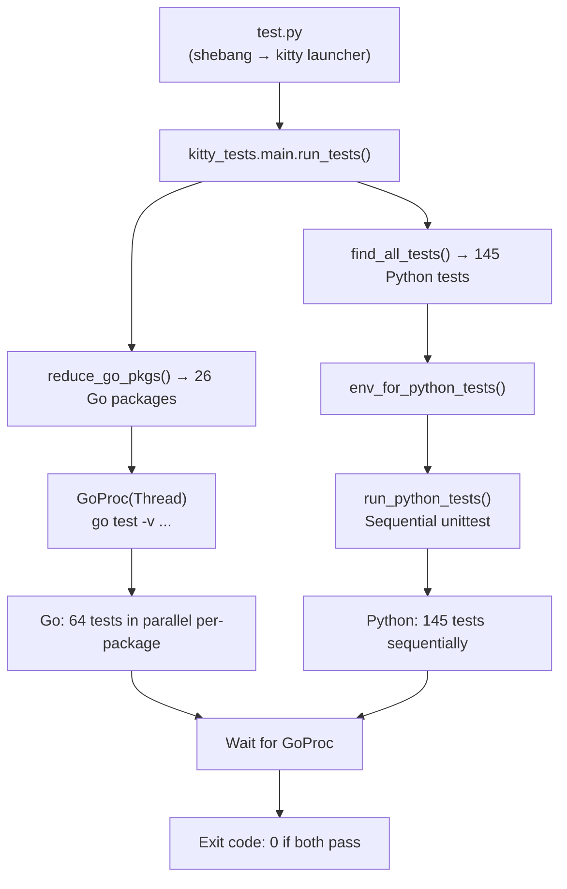

# Technical Specification

# 0. Agent Action Plan

## 0.1 Intent Clarification

Based on the prompt, the Blitzy platform understands that the new feature requirement is to perform a deep investigative analysis of kitty's build-and-test architecture by building the terminal emulator from source, executing its full test suite, and producing a comprehensive written document that maps the relationships between compiled C extension modules and the test execution flow. The deliverable is a Markdown document placed in `blitzy/documentation/` that captures empirical observations from the build and test runs, with no modifications to the existing repository source code.

### 0.1.1 Core Feature Objective

- **Build kitty from source** — Compile the multi-language codebase (C, Python, Go) using the project's custom `setup.py` build orchestrator, producing all native extension shared objects (`kitty/fast_data_types.so`, `kitty/glfw-x11.so`, `kitty/glfw-wayland.so`, `kittens/transfer/rsync.so`) and the Go-based `kitten` binary.
- **Execute the full test suite** — Run both the Python test suite (145 tests across 22 modules via `unittest`) and the Go test suite (64 test functions across 27 packages via `go test`) through the unified test runner at `kitty_tests/main.py`, launched via the native `kitty/launcher/kitty` executable.
- **Trace compiled extension → test dependency relationships** — Identify which compiled `.so` extension modules are loaded during test execution, classify each test module's dependency on those extensions (direct import vs. indirect via `kitty_tests/__init__.py`), and document the cascading failure patterns that emerge when individual extensions are unavailable.
- **Map the import chains and failure cascade behavior** — Determine which extensions are critical (their absence blocks all tests) versus optional (their absence causes localized failures), and document the precise import paths that establish these dependencies.
- **Produce a standalone documentation artifact** — Create a Markdown document named `kitty_815df1e210e0.md` in `blitzy/documentation/` that comprehensively answers the posed questions, based on code-as-truth analysis rather than assumptions.

### 0.1.2 Implicit Requirements Detected

- The analysis must distinguish between three categories of compiled extensions: the monolithic `fast_data_types.so` (critical), platform-specific GLFW backends (build-verification only), and the kitten-specific `rsync.so` (feature-scoped).
- The Go test suite runs concurrently with Python tests via a background `GoProc` thread, and its results must be captured and analyzed separately from the Python results.
- Temporary test scripts or sample data files may be created during analysis but must be removed before completion, leaving the repository unchanged.
- The Docker container environment (`andrewparkscaleai/coding-agent:kovidgoyal__kitty__815df1e210e0a9ab4622f5c7f2d6891d7dbeddf1`) provides the base runtime; all build dependencies (system libraries, headers) must be installed explicitly.

### 0.1.3 Special Instructions and Constraints

- **No repository modifications**: The user explicitly stated "do not make any changes to the repository and leave the actual codebase unchanged by removing any temporary files when you're done." All analysis scripts must be ephemeral.
- **Code-as-truth**: The implementation rule states "Do not make assumptions, base your answers on the code as the truth."
- **Output format**: Per the `SWE-AtlasQnA-Repo` rule, the deliverable is a Markdown document named `<source_branch_name>.md` placed in `blitzy/documentation/`.
- **Provide rationale**: The rule requires "Provide thinking / rationale behind the answers."

### 0.1.4 Technical Interpretation

These feature requirements translate to the following technical implementation strategy:

- To **build kitty from source**, we will install all required system dependencies (`libharfbuzz-dev`, `libfontconfig-dev`, `libfreetype-dev`, `libpng-dev`, `libxxhash-dev`, `liblcms2-dev`, `libwayland-dev`, `libx11-dev`, `libxkbcommon-dev`, `libgl-dev`, `libssl-dev`, `wayland-protocols`, `libsimde-dev`, `golang-go`, and others), then invoke `python3 setup.py build --ignore-compiler-warnings` to compile all four `.so` extensions plus the Go binary.
- To **execute the test suite**, we will invoke `./kitty/launcher/kitty +launch test.py` which bootstraps the test orchestrator through the native launcher (setting `sys.kitty_run_data`), running 145 Python tests sequentially and 64 Go tests in parallel.
- To **trace extension dependencies**, we will create temporary Python analysis scripts that systematically import test modules with and without specific `.so` files present, recording which imports succeed, which fail, and how failures cascade through the module hierarchy.
- To **produce the document**, we will create `blitzy/documentation/kitty_815df1e210e0.md` in the destination repository with all findings, rationale, and empirical evidence from the build and test runs.

## 0.2 Repository Scope Discovery

### 0.2.1 Comprehensive File Analysis

The kitty repository is a multi-language terminal emulator project at commit `815df1e21` (branch `kitty_815df1e210e0`). The following files and directories are directly relevant to the build-and-test architecture analysis.

**Build System Files (Existing — Read-Only Analysis)**

| File | Purpose | Relevance |
|------|---------|-----------|
| `setup.py` (2,173 lines) | Central build orchestrator: compiles C extensions, generates headers, builds Go binaries, links shared objects | Core of the build pipeline; defines `compile_c_extension()`, `compile_glfw()`, `compile_kittens()`, `build()` |
| `Makefile` (72 lines) | Developer convenience wrapper delegating to `setup.py` | Entry point for `make all`, `make test`, `make debug`, `make asan` |
| `pyproject.toml` | Python project metadata, `mypy` strict config, `ruff` lint config; specifies `requires-python = ">=3.8"` | Defines minimum Python version and code quality settings |
| `go.mod` / `go.sum` | Go module identity (`module kitty`, `go 1.22`), dependency graph including `go-cmp v0.6.0` | Defines Go build dependencies for Go test suite |

**Compiled Extension Outputs (Build Artifacts)**

| Artifact | Size | Source Files | Purpose |
|----------|------|--------------|---------|
| `kitty/fast_data_types.so` | 1,213,072 bytes | 49 `.c` files in `kitty/` + 3rdparty sources (62 object files) | Monolithic C extension: Screen, LineBuf, HistoryBuf, Cursor, ColorProfile, VT parser, fonts, graphics, crypto, GLFW bindings, and 581 total exported symbols |
| `kitty/glfw-x11.so` | 357,592 bytes | 20 object files from `glfw/` | X11 window system backend |
| `kitty/glfw-wayland.so` | 442,784 bytes | 37 object files from `glfw/` | Wayland window system backend |
| `kittens/transfer/rsync.so` | 55,056 bytes | `kittens/transfer/algorithm.c` (1 object file) | Rsync delta synchronization for file transfer kitten |
| `kitty/launcher/kitty` | 36,224 bytes | `kitty/launcher/main.c` | Native launcher executable; sets up `sys.kitty_run_data` and embeds CPython |
| `kitty/launcher/kitten` | 15,757,572 bytes | Go sources in `tools/` and `kittens/` | Static Go binary for kitten sub-commands |

**Test Infrastructure Files (Existing — Read-Only Analysis)**

| File | Tests | Purpose |
|------|-------|---------|
| `test.py` | — | Test bootstrapper; imports `kitty_tests.main` via the launcher shebang |
| `kitty_tests/__init__.py` (414 lines) | — | Core test infrastructure: `BaseTest`, `PTY`, `Callbacks`, `parse_bytes`, `filled_line_buf`, `filled_cursor`, `filled_history_buf`, `retry_on_failure`, `forwardable_stdio` |
| `kitty_tests/main.py` (338 lines) | — | Test orchestrator: `find_all_tests()`, `run_tests()`, `run_go()`, `GoProc`, `env_for_python_tests()`, `find_testable_go_packages()`, filtering functions |
| `kitty_tests/check_build.py` | 9 | Build verification: executables, extensions, shaders, GLFW modules, filesystem |
| `kitty_tests/screen.py` | 36 | Terminal screen model: rendering, wrapping, scrollback, cursor movement |
| `kitty_tests/graphics.py` | 19 | Graphics protocol: image upload, frame handling, PNG, cache, XOR |
| `kitty_tests/datatypes.py` | 18 | Core data types: colors, cursors, line/history buffers, key records |
| `kitty_tests/parser.py` | 16 | VT parser: CSI/DCS/OSC sequences, SIMD decode, threading |
| `kitty_tests/fonts.py` | 8 | Font subsystem: rendering, shaping, fallback, sprite atlas |
| `kitty_tests/ssh.py` | 8 | SSH kitten: bootstrap, launcher, env propagation, shell integration |
| `kitty_tests/file_transmission.py` | 6 | File transfer: rsync delta, compression, PTY-driven transfer CLI |
| `kitty_tests/shell_integration.py` | 6 | Shell integration: bash/zsh/fish prompt markers, cursor shape, CWD |
| `kitty_tests/keys.py` | 3 | Keyboard/mouse encoding: key events, mouse events, shortcut mapping |
| `kitty_tests/layout.py` | 3 | Layout algorithms: split operations, overlay, neighbor discovery |
| `kitty_tests/glfw.py` | 2 | GLFW helpers: OS window size calculation, UTF-8 strndup |
| `kitty_tests/tui.py` | 2 | TUI components: LineEdit, multiprocessing spawn |
| `kitty_tests/crypto.py` | 1 | Cryptography: X25519 key exchange, AES-256-GCM round trip |
| `kitty_tests/clipboard.py` | 1 | Clipboard: base64 payload decoding |
| `kitty_tests/completion.py` | 1 | CLI completion engine |
| `kitty_tests/mouse.py` | 1 | Mouse selection semantics |
| `kitty_tests/open_actions.py` | 1 | URL/MIME matching |
| `kitty_tests/options.py` | 1 | Configuration parsing |
| `kitty_tests/search_query_parser.py` | 1 | Boolean query parsing |
| `kitty_tests/shm.py` | 1 | Shared memory operations |
| `kitty_tests/utmp.py` | 1 | User-counting helper |

**Go Test Files (49 `*_test.go` files across 26 packages)**

| Package Area | Packages | Key Test Focus |
|--------------|----------|----------------|
| `kittens/diff/` | 1 | Diff collection/walk |
| `kittens/hints/` | 1 | Hint mark matching |
| `kittens/ssh/` | 3 files | SSH config, clone env, utilities |
| `kittens/transfer/` | 2 files | FTC serialization, path mapping |
| `tools/cli/` | 2 files | CLI parsing, file completion |
| `tools/config/` | 2 files | Config parsing, string literals |
| `tools/rsync/` | 1 | Rsync delta round trip |
| `tools/simdstring/` | 6 files | SIMD ops, intrinsics, benchmarks (AMD64/ARM64) |
| `tools/tui/` | 5 sub-packages | Graphics, readline, SGR, shell integration, loop |
| `tools/utils/` | 7 sub-packages | Base85, humanize, shlex, shm, sockets, style, tempfile |
| `tools/wcswidth/` | 1 | Terminal display-width calculation |
| `tools/unicode_names/` | 1 | Unicode input queries |
| `tools/themes/` | 1 | Theme collection test |

### 0.2.2 C Source File Functional Area Mapping

The 49 C source files in `kitty/` that compile into `fast_data_types.so` map to these functional areas:

| Functional Area | C Source Files | Count |
|----------------|----------------|-------|
| Screen/Terminal | `screen.c`, `vt-parser.c`, `cursor.c`, `line.c`, `line-buf.c`, `history.c`, `charsets.c`, `colors.c` | 8 |
| Graphics | `graphics.c`, `shaders.c`, `gl.c`, `gl-wrapper.c`, `png-reader.c`, `window_logo.c`, `glyph-cache.c` | 7 |
| Fonts | `fonts.c`, `freetype.c`, `fontconfig.c`, `font-names.c`, `freetype_render_ui_text.c` | 5 |
| Input | `keys.c`, `key_encoding.c`, `mouse.c`, `kittens.c` | 4 |
| Process/System | `child.c`, `child-monitor.c`, `cleanup.c`, `state.c`, `loop-utils.c`, `monotonic.c`, `systemd.c`, `utmp.c`, `desktop.c` | 9 |
| Crypto | `crypto.c` | 1 |
| Data/IO | `data-types.c`, `disk-cache.c`, `fast-file-copy.c`, `hyperlink.c`, `shlex.c` | 5 |
| GLFW Wrappers | `glfw.c`, `glfw-wrapper.c` | 2 |
| Unicode | `unicode-data.c`, `wcswidth.c`, `rowcolumn-diacritics.c` | 3 |
| SIMD | `simd-string.c`, `simd-string-128.c`, `simd-string-256.c` | 3 |
| Logging | `logging.c` | 1 |
| Platform | `macos_process_info.c` (excluded on Linux) | 1 |

### 0.2.3 New File Requirements

A single new file is created as the deliverable:

| File | Purpose |
|------|---------|
| `blitzy/documentation/kitty_815df1e210e0.md` | Comprehensive Markdown document answering the user's questions about build/test architecture, extension dependencies, test failure cascades, and import chains |

No other source, test, or configuration files are created or modified.

## 0.3 Dependency Inventory

### 0.3.1 Key Packages and Dependencies

The following packages are relevant to the build and test execution analysis:

**Python Runtime and Build Dependencies**

| Registry | Package | Version | Purpose |
|----------|---------|---------|---------|
| System | Python | 3.12.3 | Runtime interpreter; project requires `>=3.8` per `pyproject.toml` |
| stdlib | `unittest` | (built-in) | Python test framework; no external test dependencies |
| stdlib | `importlib` | (built-in) | Dynamic test module discovery in `find_all_tests()` |
| stdlib | `ctypes` | (built-in) | Used by `kitty_tests/glfw.py` for native library introspection |
| pip | `PIL` (Pillow) | pre-installed | Used by `kitty_tests/graphics.py` for PNG image test fixtures |

**Go Build and Test Dependencies**

| Registry | Package | Version | Purpose |
|----------|---------|---------|---------|
| System | Go | 1.22.2 | Go compiler; `go.mod` specifies `go 1.22` |
| go module | `github.com/google/go-cmp` | v0.6.0 | Deep equality comparison in Go tests (`cmp.Diff()`) |
| go module | `github.com/zeebo/xxh3` | v1.0.2 | xxHash3 used by rsync/transfer tests |
| go module | `golang.org/x/sys` | v0.21.0 | System calls for tempfile tests, SHM tests |

**System Libraries (C Extension Compilation)**

| Registry | Package | Version | Purpose |
|----------|---------|---------|---------|
| apt | `libharfbuzz-dev` | 8.3.0 | Text shaping for font rendering |
| apt | `libfontconfig-dev` | 2.15.0 | Font discovery and configuration |
| apt | `libfreetype-dev` | 2.13.2 | Font rasterization |
| apt | `libpng-dev` | 1.6.43 | PNG image encoding/decoding |
| apt | `libxxhash-dev` | 0.8.2 | Fast hashing for rsync extension |
| apt | `liblcms2-dev` | 2.14 | Color management |
| apt | `libwayland-dev` | 1.22.0 | Wayland protocol client |
| apt | `wayland-protocols` | — | Wayland extension protocol definitions |
| apt | `libx11-dev` | 1.8.7 | X11 window system client |
| apt | `libxkbcommon-dev` | 1.6.0 | Keyboard keymap handling |
| apt | `libgl-dev` | 1.7.0 | OpenGL development headers |
| apt | `libssl-dev` | — | OpenSSL for cryptographic operations |
| apt | `libsimde-dev` | 0.7.2 | SIMD Everywhere (portable SIMD intrinsics for `simd-string-*.c`) |
| apt | `libdbus-1-dev` | 1.14.10 | D-Bus IPC for desktop integration |

### 0.3.2 Dependency Updates

No dependency updates are required. This task is a read-only analysis exercise that produces documentation. All dependencies are consumed as-is from the repository's existing manifests (`pyproject.toml`, `go.mod`, `go.sum`) and the system package manager. The build uses exact versions from these manifests without modification.

## 0.4 Integration Analysis

### 0.4.1 Existing Code Touchpoints

No source code files are modified by this task. The integration analysis below documents the **read-only touchpoints** — the architectural relationships the analysis must trace through and document in the output Markdown file.

**Build Pipeline Integration Points**

The `setup.py` `build()` function (line 1084) orchestrates three compilation stages that produce all four `.so` artifacts:

- `compile_c_extension(kitty_env(args), 'kitty/fast_data_types', ...)` — Links 62 object files from `kitty/*.c` and `3rdparty/` sources into the monolithic extension
- `compile_glfw(args.compilation_database, ...)` — Produces `kitty/glfw-x11.so` (20 objects) and `kitty/glfw-wayland.so` (37 objects) as separate platform backends
- `compile_kittens(args)` — Produces `kittens/transfer/rsync.so` from `kittens/transfer/algorithm.c` linked against `libxxhash`

The Go build is triggered by `setup.py` via subprocess, producing the static `kitty/launcher/kitten` binary.

**Test-to-Extension Dependency Graph**

The critical integration point is the `PyInit_fast_data_types()` function in `kitty/data-types.c` (line 528), which initializes 25+ subsystem modules in sequence:

```
init_logging → init_LineBuf → init_HistoryBuf → init_Line → init_Cursor
→ init_Shlex → init_Parser → init_DiskCache → init_child_monitor
→ init_ColorProfile → init_Screen → init_glfw → init_child → init_state
→ init_keys → init_graphics → init_shaders → init_mouse → init_kittens
→ init_png_reader → init_freetype_library → init_fontconfig_library
→ init_desktop → init_freetype_render_ui_text → init_fonts → init_utmp
→ init_loop_utils → init_crypto_library → init_systemd_module
```

If any single `init_*` call returns `false`, the entire `fast_data_types` module fails to load (returns `NULL`), cascading to block all 145 Python tests.

**Test Runner → Launcher Integration**

The test entry point chain is:

- `test.py` → shebang `#!./kitty/launcher/kitty +launch` → `kitty_tests.main.main()`
- The launcher's `main.c` sets `sys.kitty_run_data = {'bundle_exe_dir': '<launcher_dir>'}` before invoking the Python script
- Without this attribute, `kitty.constants.kitty_exe()` raises `AttributeError`, blocking Go test initialization (`GoProc.__init__` calls `kitty_exe()`)

**Test Environment Isolation Integration**

The `env_for_python_tests()` context manager in `kitty_tests/main.py` integrates with the font subsystem and environment:

- Calls `kitty.fonts.common.all_fonts_map(True)` which transitively imports `kitty.fast_data_types` — this pre-caches fontconfig data before `HOME` is replaced
- Imports `kitty.fast_data_types.has_avx2` and `has_sse4_2` for environment reporting

### 0.4.2 Extension Module Load-Time Integration Map

The following table documents when each `.so` extension is loaded during the test lifecycle:

| Extension | Load Trigger | Loaded By | Impact If Missing |
|-----------|-------------|-----------|-------------------|
| `kitty/fast_data_types.so` | `kitty_tests/__init__.py` import | Python import system at package initialization | **Total failure**: All 145 Python tests blocked; `ModuleNotFoundError` |
| `kittens/transfer/rsync.so` | `kitty_tests/file_transmission.py` import (module-level `from kittens.transfer.rsync import ...`) | Python import at test module discovery | **Partial failure**: `find_all_tests()` raises `Exception('Failed to import a test module')` via `itertests()`, blocking all test discovery |
| `kitty/glfw-x11.so` | Runtime check in `test_glfw_modules()` via `os.path.isfile(glfw_path('x11'))` | `kitty_tests/check_build.py` at test execution time | **Localized failure**: Only `test_glfw_modules` fails; all other tests pass |
| `kitty/glfw-wayland.so` | Runtime check in `test_glfw_modules()` | `kitty_tests/check_build.py` at test execution time | **Localized failure**: Only `test_glfw_modules` fails (skipped in CI) |

### 0.4.3 Cross-Language Test Orchestration

The test runner integrates Python and Go tests through a concurrent execution model:



The `GoProc` class wraps `subprocess.Popen` in a `Thread`, setting `KITTY_PATH_TO_KITTY_EXE` in the child environment. Go tests run in isolated OS processes with independent memory, while Python tests share a single interpreter with mutable global C extension state.

## 0.5 Technical Implementation

### 0.5.1 File-by-File Execution Plan

This task produces exactly one new file and modifies zero existing files.

**Group 1 — Documentation Deliverable (CREATE)**

- **CREATE**: `blitzy/documentation/kitty_815df1e210e0.md` — Comprehensive Markdown document containing:
  - Build process observations and dependency analysis
  - Test execution results with pass/fail/skip breakdown
  - Extension module dependency mapping with empirical evidence
  - Failure cascade analysis from controlled experiments
  - Import chain tracing for all 22 test modules
  - C source → functional area → test module traceability matrix
  - Rationale and thinking behind all conclusions

### 0.5.2 Implementation Approach

The implementation follows a four-phase investigative methodology, executed entirely through empirical analysis of the repository:

**Phase 1 — Build from Source**

Establish the build environment and compile all artifacts by:
- Installing all required system library headers via `apt-get`
- Running `python3 setup.py build --ignore-compiler-warnings` to compile the C extensions, GLFW backends, rsync kitten extension, and Go binary
- Recording the build output to document the compilation sequence, object file counts, and artifact sizes
- Noting build issues encountered (wayland protocol enum warnings requiring `--ignore-compiler-warnings`, missing `libsimde-dev` for SIMD intrinsics)

**Phase 2 — Execute Test Suite**

Run the full test suite through the native launcher and capture output by:
- Invoking `./kitty/launcher/kitty +launch test.py` which runs both Python (145 tests) and Go (64 tests) suites
- Recording the per-test pass/fail/skip status for all test modules
- Documenting the 6 skipped tests (CA certificates on non-frozen builds, macOS-only font fallback, fish/zsh not installed) and 1 Go failure (`TestCreateAnonymousTempfile` in containerized `/proc` environment)

**Phase 3 — Trace Extension Dependencies**

Perform controlled experiments to map dependencies by:
- Creating temporary analysis scripts (in `/tmp/`) that import test modules with specific `.so` files renamed/hidden
- Testing with `fast_data_types.so` removed: confirms total test suite failure due to `kitty_tests/__init__.py` top-level import dependency
- Testing with `rsync.so` removed: confirms `file_transmission` module import failure and test discovery cascade, while other modules continue to load
- Testing with GLFW `.so` files removed: confirms localized `test_glfw_modules` failure with no cascade to other tests
- Cleaning up all temporary scripts after analysis

**Phase 4 — Document Findings**

Synthesize all observations into the deliverable document by:
- Mapping each test module to its specific `fast_data_types` symbol imports
- Classifying modules as direct importers (14 modules) vs. indirect-only (8 modules)
- Documenting the `PyInit_fast_data_types` initialization chain in `data-types.c`
- Creating the C source → functional area → test module traceability map
- Recording the empirical test results with exact counts and timings

### 0.5.3 Key Findings to Document

The analysis reveals the following architectural characteristics that the document will cover:

- **`fast_data_types.so` is a single point of failure**: Its import at the `kitty_tests/__init__.py` package level means all 145 Python tests are blocked if this extension is missing. The module exports 581 symbols (165 types, 190 functions, 223 GLFW constants, 3 capability flags).

- **The import chain establishes a hard dependency hierarchy**: `kitty_tests/__init__.py` imports `Cursor`, `HistoryBuf`, `LineBuf`, `Screen`, `get_options`, `monotonic`, `set_options` from `fast_data_types`, plus `Options` and `defaults` from `kitty.options.types` (which also depends on `fast_data_types`). This makes every test module transitively dependent on the compiled C core.

- **`rsync.so` creates a secondary failure domain**: While `kitty_tests/__init__.py` can load without it, the `file_transmission` test module imports `rsync` at module level (`from kittens.transfer.rsync import Differ, Hasher, Patcher, parse_ftc`), causing `find_all_tests()` to fail via the `ModuleImportFailure` detection in `itertests()`.

- **GLFW backends are runtime-checked, not import-time**: `test_glfw_modules` uses `os.path.isfile(glfw_path(name))` and `os.access(path, os.X_OK)` rather than importing the `.so` files, making their absence a localized assertion failure rather than a cascade.

- **Go tests are completely independent of C extensions**: The Go test suite runs via `go test` in separate OS processes and has no dependency on any `.so` file. The only connection is `KITTY_PATH_TO_KITTY_EXE` for tests that need the launcher path.

## 0.6 Scope Boundaries

### 0.6.1 Exhaustively In Scope

**Documentation Output**
- `blitzy/documentation/kitty_815df1e210e0.md` — The sole deliverable file

**Build Artifacts Analyzed (Read-Only)**
- `kitty/fast_data_types.so` — Monolithic C extension (1.2MB, 62 object files, 581 exports)
- `kitty/glfw-x11.so` — X11 GLFW backend (358KB, 20 object files)
- `kitty/glfw-wayland.so` — Wayland GLFW backend (443KB, 37 object files)
- `kittens/transfer/rsync.so` — Rsync delta extension (55KB, 1 object file)
- `kitty/launcher/kitty` — Native launcher (36KB)
- `kitty/launcher/kitten` — Go static binary (15.7MB)
- `build/*.o` — 122 total object files from compilation

**Source Files Analyzed (Read-Only)**
- `setup.py` — Build orchestrator (compilation pipeline, `compile_c_extension()`, `build()`)
- `Makefile` — Build targets
- `test.py` — Test bootstrapper
- `kitty_tests/__init__.py` — Test infrastructure (`BaseTest`, `PTY`, `Callbacks`)
- `kitty_tests/main.py` — Test orchestrator (`find_all_tests()`, `run_tests()`, `GoProc`)
- `kitty_tests/check_build.py` — Build verification tests
- `kitty_tests/*.py` — All 22 test modules (import analysis, dependency mapping)
- `kitty/data-types.c` — `PyInit_fast_data_types()` initialization chain
- `kitty/*.c` — All 49 C source files (functional area classification)
- `kittens/transfer/algorithm.c` — `PyInit_rsync()` entry point
- `kitty/launcher/main.c` — Launcher `set_kitty_run_data()` implementation
- `go.mod` — Go module dependencies
- `pyproject.toml` — Python project configuration
- `tools/**/*_test.go` — Go test files (49 files across 26 packages)
- `kittens/**/*_test.go` — Go kitten test files

**Analysis Activities Performed**
- Full build from source with `python3 setup.py build --ignore-compiler-warnings`
- Full test suite execution via `./kitty/launcher/kitty +launch test.py`
- Extension removal experiments (temporary `.so` renaming with immediate restore)
- Import chain tracing via temporary Python analysis scripts (cleaned up)
- Module-level dependency classification across all 22 test modules

### 0.6.2 Explicitly Out of Scope

- **No repository source modifications**: Per user instruction, zero changes to any existing file
- **No new source code in the repository**: Temporary analysis scripts are created in `/tmp/` and deleted after use
- **No build system changes**: `setup.py`, `Makefile`, and all build configuration remain untouched
- **No test modifications**: No test files are altered, added, or deleted
- **No dependency version changes**: All packages used at existing versions from manifests
- **No CI/CD pipeline changes**: `.github/workflows/` files are not modified
- **No documentation changes to existing docs**: `docs/`, `README.asciidoc`, etc. are untouched
- **Performance optimization analysis**: Beyond noting SIMD capability flags, no performance profiling is conducted
- **macOS-specific analysis**: The container is Linux-only; Cocoa/CoreText paths are not exercised
- **Security vulnerability analysis**: Beyond documenting the crypto test module, no security audit is performed
- **Code coverage measurement**: The project has no coverage tooling; coverage analysis is not added

## 0.7 Rules for Feature Addition

### 0.7.1 User-Specified Rules

The following rules are explicitly specified by the user and must be strictly followed:

- **`SWE-AtlasQnA-Repo` Rule**: Create a new Markdown document named `<source_branch_name>.md` (i.e., `kitty_815df1e210e0.md`) that comprehensively answers the questions posed in the prompt. Place it in the `blitzy/documentation` directory in the destination repo.
- **Build and run**: Build and run the source code to analyze repository behavior as needed.
- **Code-as-truth**: Do not make assumptions; base answers on the code as the truth.
- **Provide rationale**: Provide thinking and rationale behind the answers.
- **No existing file modifications**: Do not modify any existing files in the source repository.
- **No additional code**: Do not add any other code in the source repository besides the requested document.

### 0.7.2 Repository Integrity Constraints

- **Temporary files must be cleaned up**: The user specified "leave the actual codebase unchanged by removing any temporary files when you're done." All ephemeral analysis scripts are created under `/tmp/` and removed after use.
- **Extension `.so` files must be restored**: During controlled failure experiments, `.so` files are temporarily renamed with `.bak` extension and immediately restored in a `try/finally` block. No permanent changes occur.
- **No `git add` or `git commit` on existing files**: Only the new documentation file in `blitzy/documentation/` is committed.

### 0.7.3 Documentation Quality Requirements

- **Empirical evidence**: Every claim in the output document must be backed by observable behavior from the build, test execution, or import tracing experiments.
- **Exact counts and file paths**: Test counts, file sizes, object file counts, and import names are reported with precision, not approximations.
- **Distinguish critical vs. optional**: The analysis must clearly classify each extension's criticality level based on actual cascade behavior, not assumed importance.

## 0.8 References

### 0.8.1 Codebase Files and Folders Searched

The following files were directly read and analyzed to derive the conclusions in this Agent Action Plan:

**Build System**
- `setup.py` — Lines 1–200 (platform detection, Options), 840–1100 (compile_c_extension, find_c_files, compile_glfw, compile_kittens, build), 1230+ (build_launcher)
- `Makefile` — Complete file (build targets, test invocation)
- `pyproject.toml` — Complete file (requires-python, mypy config, ruff config)
- `go.mod` — Complete file (module identity, Go 1.22, all dependencies)

**Test Infrastructure**
- `test.py` — Complete file (shebang bootstrapper)
- `kitty_tests/__init__.py` — Complete file (BaseTest, PTY, Callbacks, parse_bytes, helper functions)
- `kitty_tests/main.py` — Complete file (find_all_tests, run_tests, GoProc, env_for_python_tests, filtering)
- `kitty_tests/check_build.py` — Complete file (TestBuild: 9 verification tests)
- `kitty_tests/file_transmission.py` — Import section and rsync usage (lines 13–14, 140, 173, 225–226, 322)
- All 22 test module files — Scanned for `fast_data_types` imports and `rsync` references

**C Extension Sources**
- `kitty/data-types.c` — Lines 492–600 (`PyInit_fast_data_types`, init chain, constant definitions)
- `kitty/*.c` — Directory listing of all 49 C source files for functional area classification
- `kittens/transfer/algorithm.c` — `PyInit_rsync` entry point identification

**Launcher**
- `kitty/launcher/main.c` — Lines 1–80 (`set_kitty_run_data`, `RunData` struct, Python embedding)
- `kitty/launcher/` — Directory listing (kitty, kitten, launcher.h, main.c, single-instance.c)

**Go Test Files**
- `tools/utils/tpmfile_test.go` — Complete file (TestCreateAnonymousTempfile failure analysis)
- All 49 `*_test.go` files discovered via `find . -name "*_test.go"` — Path listing and package classification

**Build Artifacts**
- `kitty/fast_data_types.so`, `kitty/glfw-x11.so`, `kitty/glfw-wayland.so`, `kittens/transfer/rsync.so` — Size and existence verification
- `build/*.o` — Object file count and categorization (122 total: 62 fdt, 20 x11, 37 wayland, 1 rsync, 2 launcher)
- `kitty/launcher/kitty`, `kitty/launcher/kitten` — Size and executability verification

**Folders Explored**
- Root (`/tmp/blitzy/kitty/kitty_815df1e210e0_77c5cb/`) — Complete directory listing
- `kitty/` — All `.c` and `.h` files listed (94 total)
- `kitty_tests/` — All test modules and font fixture files listed
- `kittens/transfer/` — C source and `.so` artifact
- `kitty/launcher/` — Launcher binaries and source
- `build/` — Object file categorization
- `tools/` and `kittens/` — Go test file discovery across 26 packages

### 0.8.2 Technical Specification Sections Referenced

- **Section 6.6 Testing Strategy** — Comprehensive testing architecture documentation including test counts, module organization, CI matrix, and infrastructure helpers
- **Section 8.2 Build System Architecture** — Build orchestration, compiler security hardening, platform-specific configuration

### 0.8.3 Attachments

No external attachments, Figma URLs, or design assets are associated with this task. The analysis is entirely source-code-driven.

### 0.8.4 Build and Test Execution Evidence

The following empirical operations were performed on the repository to gather evidence:

| Operation | Command | Outcome |
|-----------|---------|---------|
| System dependency installation | `apt-get install -y gcc pkg-config python3-dev libharfbuzz-dev ...` (17 packages) | All dependencies installed successfully |
| Build from source | `python3 setup.py build --ignore-compiler-warnings` | 4 `.so` files + 2 binaries produced; 122 object files compiled |
| Full test execution | `./kitty/launcher/kitty +launch test.py` | Python: 139 passed, 6 skipped, 0 failed; Go: 63 passed, 1 failed (`TestCreateAnonymousTempfile`) |
| Extension removal: `fast_data_types.so` | Temporary rename in analysis script | All 145 Python tests blocked with `ModuleNotFoundError` |
| Extension removal: `rsync.so` | Temporary rename in analysis script | `file_transmission` import fails; test discovery crashes with `Exception('Failed to import a test module')` |
| Extension removal: GLFW `.so` files | Temporary rename in analysis script | Only `test_glfw_modules` fails; 144 other tests unaffected |
| Import chain tracing | Custom Python scripts scanning all test module imports | 14 modules with direct `fast_data_types` imports; 8 modules with indirect-only dependency |
| `fast_data_types` symbol enumeration | `dir(kitty.fast_data_types)` analysis | 581 total exports: 165 types, 190 functions, 223 GLFW constants, 3 capability flags |

