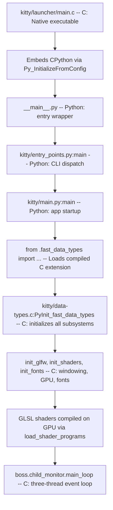

# Technical Specification

# 0. Agent Action Plan

## 0.1 Intent Clarification

### 0.1.1 Core Feature Objective

Based on the prompt, the Blitzy platform understands that the new feature requirement is to produce a comprehensive architectural Q&A analysis document that answers the user's fundamental questions about the kitty terminal emulator through direct observation and experimentation against the source code, rather than assumptions about intended design.

The user's concrete questions, each requiring evidence-based answers derived from code execution and inspection, are:

- **Language role analysis**: The kitty codebase weaves together Python (~39K lines in `kitty/`) and C (~38K lines in `kitty/` plus ~24K lines of headers), with 258 Go files in `tools/`. The user wants to understand which language "does the heavy lifting" once everything is running at steady state, and what that reveals about where runtime performance actually originates.
- **GLSL shader purpose**: Thirteen `.glsl` files live inside `kitty/` (totaling ~696 lines), which is unexpected for a terminal emulator. The user wants to understand what role these shader programs play and how central they are to the core rendering system.
- **Entry point failure diagnosis**: Running `python3 __main__.py` directly (the main entry point) fails immediately with a `ModuleNotFoundError`. The user wants to understand exactly what is missing and what the failure reveals about how Python is wired into the native C core.
- **The critical missing piece**: There appears to be one module—`kitty.fast_data_types`—that everything depends on. The user wants to understand why this single artifact represents the bridge between all of Python-side kitty and the native C layer, and why its absence causes near-total system failure.
- **Kittens modularity assessment**: The `kittens/` directory contains ~20 self-contained tool subpackages. The user wants to determine whether these are truly independent or whether they rely on the same native bridge (`fast_data_types`), and what happens when one is executed in isolation without the compiled C extension.
- **Observation-based methodology**: All exploration must be conducted by actually exercising the code (importing modules, running entry points, tracing import chains), rather than merely reading architecture documentation.

Implicit requirements surfaced from analysis:

- The answers must be grounded in code evidence, citing specific files and tracing actual execution paths
- Temporary scripts used for observation must be cleaned up—the repository itself must remain unmodified
- The final deliverable is a single markdown document placed at `blitzy/documentation/kitty_815df1e210e0.md`
- The document must include thinking and rationale behind each answer, not just conclusions

### 0.1.2 Special Instructions and Constraints

- **No modifications to existing repository files**: The implementation rule `SWE-AtlasQnA-Repo` explicitly requires that no existing files in the source repository be modified. The only new artifact is the Q&A markdown document.
- **Document naming convention**: The document must be named `kitty_815df1e210e0.md`, derived from the source branch name `kitty_815df1e210e0`.
- **Document placement**: The file must be placed in the `blitzy/documentation/` directory in the destination repository.
- **Evidence-based answers**: Every answer must be based on the code as truth, not on assumptions. The user explicitly requests observation-driven exploration.
- **Cleanup requirement**: Any temporary scripts or files created for experimentation must be cleaned up after use—the repository should remain in its original state.

### 0.1.3 Technical Interpretation

These feature requirements translate to the following technical implementation strategy:

- To **answer the language-role question**, we will analyze the import dependency graph of `kitty/fast_data_types` (a compiled C extension defined in `kitty/data-types.c` and built by `setup.py` into a `.so` shared library), count the number of Python modules that depend on it, map which subsystems are implemented in C versus Python, and document the runtime execution flow where C handles hot-path terminal parsing, screen management, and GPU rendering while Python orchestrates configuration, kittens, and UI logic.
- To **explain the GLSL shaders**, we will inspect all 13 `.glsl` files (`cell_vertex.glsl`, `cell_fragment.glsl`, `border_vertex.glsl`, `border_fragment.glsl`, `bgimage_vertex.glsl`, `bgimage_fragment.glsl`, `graphics_vertex.glsl`, `graphics_fragment.glsl`, `tint_vertex.glsl`, `tint_fragment.glsl`, `alpha_blend.glsl`, `linear2srgb.glsl`, `cell_defines.glsl`), trace how `kitty/shaders.py` loads them via `read_kitty_resource()`, and show how `kitty/shaders.c` compiles them into GPU programs that are the sole rendering pipeline.
- To **diagnose the entry point failure**, we will execute `python3 __main__.py` and capture the traceback, then trace the import chain from `__main__.py` → `kitty.entry_points.main()` → `kitty.main` → `kitty.borders` → `kitty.fast_data_types`, demonstrating that the `.so` extension module is absent from an unbuilt source tree.
- To **characterize fast_data_types as the critical bridge**, we will enumerate all 28+ Python files in `kitty/` that import from it, list the 21+ C types it exposes (`Screen`, `Line`, `LineBuf`, `HistoryBuf`, `Cursor`, `ChildMonitor`, `Face`, `ColorProfile`, etc.), and explain that `setup.py` compiles all ~53 C source files into this single shared library.
- To **assess kittens modularity**, we will attempt to import several kittens (`hints`, `diff`, `icat`, `unicode_input`) without the compiled extension and document that they all fail because `kittens/tui/loop.py` imports `kitty.fast_data_types` at the top level, making the native bridge a hard runtime dependency for every kitten.
- To **produce the deliverable**, we will create the file `blitzy/documentation/kitty_815df1e210e0.md` containing the comprehensive Q&A analysis with all evidence and reasoning.

## 0.2 Repository Scope Discovery

### 0.2.1 Comprehensive File Analysis

The kitty terminal emulator is a multi-language project rooted at `/tmp/blitzy/kitty/kitty_815df1e210e0_77c5cb/`. The analysis covers the entire source tree structure relevant to the user's architectural questions.

**Top-Level Repository Structure:**

| Path | Type | Purpose |
|------|------|---------|
| `__main__.py` | File | Python entry point — imports `kitty.entry_points.main` |
| `setup.py` | File | Central build system — compiles C extensions, GLFW, Go kittens |
| `pyproject.toml` | File | Python project metadata, requires-python >=3.8 |
| `go.mod` / `go.sum` | File | Go 1.22 module definition and dependency ledger |
| `Makefile` | File | Developer build/test/clean/docs surface |
| `kitty/` | Folder | Core application tree — C extensions, Python orchestration, GLSL shaders |
| `kittens/` | Folder | 20 built-in kitten subpackages plus shared runner and TUI framework |
| `tools/` | Folder | Go CLI tools and utilities (258 `.go` files) |
| `glfw/` | Folder | Vendored GLFW 3.4 fork — cross-platform windowing |
| `glad/` | Folder | OpenGL loader generation |
| `3rdparty/` | Folder | Vendored third-party C dependencies |
| `kitty_tests/` | Folder | Python-based regression tests |
| `gen/` | Folder | Build-time code generators for configs, Unicode, keys |
| `docs/` | Folder | Sphinx documentation and protocol specs |
| `shell-integration/` | Folder | Bash/Zsh/Fish/SSH shell integration scripts |

**Core Application Files Relevant to the User's Questions:**

| File Path | Language | Role in Architecture |
|-----------|----------|---------------------|
| `kitty/data-types.c` | C | Defines the `fast_data_types` C extension module — THE bridge between Python and C |
| `kitty/data-types.h` | C header | Shared header for the C extension types and macros |
| `kitty/fast_data_types.pyi` | Python stub | 1,635-line type stub exposing 21+ classes and hundreds of functions |
| `kitty/entry_points.py` | Python | CLI dispatch — routes `main()`, `+kitten`, `+launch`, etc. |
| `kitty/main.py` | Python | Application startup orchestration — GLFW init, shader loading, Boss creation |
| `kitty/boss.py` | Python | Central lifecycle controller for windows, tabs, child processes |
| `kitty/shaders.py` | Python | GLSL shader loading, include resolution, and compilation orchestration |
| `kitty/shaders.c` | C | Native shader compilation, sprite management, OpenGL draw calls |
| `kitty/constants.py` | Python | App metadata, path resolution, resource loading (`read_kitty_resource`) |
| `kitty/vt-parser.c` | C | Terminal escape sequence state machine (hot path) |
| `kitty/screen.c` / `kitty/screen.h` | C | Terminal display buffer and cell model |
| `kitty/child-monitor.c` | C | PTY I/O multiplexing with three-thread architecture |
| `kitty/gl.c` / `kitty/gl.h` | C | OpenGL initialization, error handling, GLAD loading |
| `kitty/launcher/main.c` | C | Native executable entry point — CPython embedding |
| `kittens/runner.py` | Python | Kitten discovery, import, and execution framework |
| `kittens/tui/loop.py` | Python | Shared TUI event loop — imports `fast_data_types` at top level |

**GLSL Shader Files (the "GPU accelerated" rendering core):**

| Shader File | Lines | Purpose |
|-------------|-------|---------|
| `kitty/cell_vertex.glsl` | ~190 | Vertex shader for terminal cell rendering (positions, colors, cursors, selections) |
| `kitty/cell_fragment.glsl` | ~175 | Fragment shader for text compositing, gamma correction, contrast enhancement |
| `kitty/cell_defines.glsl` | ~32 | Shared compile-time macros for rendering phases and attribute bit shifts |
| `kitty/border_vertex.glsl` | — | Vertex shader for window border rendering |
| `kitty/border_fragment.glsl` | — | Fragment shader for border color output |
| `kitty/bgimage_vertex.glsl` | — | Vertex shader for background image positioning |
| `kitty/bgimage_fragment.glsl` | — | Fragment shader for background image sampling |
| `kitty/graphics_vertex.glsl` | ~24 | Vertex shader for inline image/graphics positioning |
| `kitty/graphics_fragment.glsl` | — | Fragment shader for inline image rendering |
| `kitty/tint_vertex.glsl` | — | Vertex shader for window tint overlay |
| `kitty/tint_fragment.glsl` | — | Fragment shader for tint color blending |
| `kitty/alpha_blend.glsl` | ~22 | Utility functions for alpha compositing |
| `kitty/linear2srgb.glsl` | — | sRGB/linear color space conversion utilities |

**C Extension Source File Inventory (all compiled into `kitty/fast_data_types.so`):**

53 C source files in `kitty/` are compiled into the single `fast_data_types` shared library. Key modules include:

| C Source File | Subsystem | What It Provides to Python |
|--------------|-----------|---------------------------|
| `kitty/data-types.c` | Module init | `PyInit_fast_data_types()` — module creation, all init_* calls |
| `kitty/screen.c` | Terminal model | `Screen` type — cell buffer, cursor, scroll, write operations |
| `kitty/line.c` / `kitty/line-buf.c` | Line storage | `Line`, `LineBuf` types — row-level terminal data |
| `kitty/history.c` | Scrollback | `HistoryBuf` type — scrollback ring buffer |
| `kitty/cursor.c` | Cursor | `Cursor` type — position, style, visibility |
| `kitty/vt-parser.c` | VT parsing | Parser state machine (invoked from C, exposed to Python) |
| `kitty/child-monitor.c` | Process mgmt | `ChildMonitor` type — PTY multiplexing, main loop |
| `kitty/keys.c` / `kitty/key_encoding.c` | Keyboard | Key event translation, encoding to escape sequences |
| `kitty/mouse.c` | Mouse | Mouse event handling and selection |
| `kitty/shaders.c` | GPU rendering | Shader program compilation and draw dispatch |
| `kitty/gl.c` | OpenGL | GL context init, error checking, version detection |
| `kitty/glfw.c` / `kitty/glfw-wrapper.c` | Windowing | GLFW init, window creation, event polling |
| `kitty/fonts.c` / `kitty/freetype.c` | Font rendering | Font discovery, glyph rasterization, `Face` type |
| `kitty/colors.c` | Color | `ColorProfile` type — color table management |
| `kitty/graphics.c` | Image protocol | Inline image storage and rendering |
| `kitty/glyph-cache.c` | Texture atlas | GPU texture atlas for rendered glyphs |
| `kitty/crypto.c` | Crypto | AES-GCM encryption for remote control |
| `kitty/state.c` | Global state | Cross-module global state management |

### 0.2.2 Web Search Research Conducted

No external web searches were required for this analysis. The user's questions are answered entirely through direct code inspection and execution against the source tree. The codebase is self-documenting for these architectural questions.

### 0.2.3 New File Requirements

Based on the `SWE-AtlasQnA-Repo` implementation rule, the sole new file to create is:

- **`blitzy/documentation/kitty_815df1e210e0.md`** — A comprehensive markdown document answering the user's architectural questions about the kitty terminal emulator. This document will contain:
  - Analysis of Python vs C language roles with line-count evidence and runtime dependency tracing
  - Explanation of GLSL shader purpose with file-by-file breakdown and rendering pipeline description
  - Diagnosis of the entry point failure with full traceback and import chain analysis
  - Characterization of `fast_data_types` as the critical Python-to-C bridge with dependency enumeration
  - Assessment of kittens modularity with import failure evidence and dependency chain tracing
  - Thinking and rationale sections for each answer, grounded in code evidence

No existing repository files will be modified.

## 0.3 Dependency Inventory

### 0.3.1 Private and Public Packages

The following packages are relevant to this Q&A analysis exercise. Since the deliverable is a markdown document (not code modifications), these dependencies are documented for architectural understanding rather than installation.

**Python Ecosystem (from `pyproject.toml` and `setup.py`):**

| Registry | Package | Version | Purpose |
|----------|---------|---------|---------|
| CPython | Python | >=3.8 (runtime: 3.12.3) | Interpreter for all Python modules in `kitty/` and `kittens/` |
| PyPI (build) | Sphinx | (docs dependency) | Documentation generation |
| System | importlib.resources | stdlib | Loads GLSL shader files via `read_kitty_resource()` in `kitty/constants.py` |

**C/Native Ecosystem (from `setup.py` and `shell.nix`):**

| Registry | Package | Version | Purpose |
|----------|---------|---------|---------|
| System | GCC / Clang | C11-compatible | Compiles all 53 C source files into `kitty/fast_data_types.so` |
| pkg-config | FreeType | >=2.x | Font glyph rasterization (`kitty/freetype.c`) |
| pkg-config | HarfBuzz | >=1.5 | Text shaping (`kitty/fonts.c`) |
| pkg-config | FontConfig | (Linux) | Font discovery (`kitty/fontconfig.c`) |
| Framework | CoreText | (macOS) | Font discovery (`kitty/core_text.m`) |
| Vendored | GLFW 3.4 | Fork in `glfw/` | Cross-platform windowing and OpenGL context |
| Vendored | GLAD | In `glad/` | OpenGL function loader |
| System | OpenGL 3.3+ | Runtime | GPU rendering via 13 GLSL shader programs |
| System | libcrypto (OpenSSL) | Runtime | AES-GCM encryption for remote control (`kitty/crypto.c`) |

**Go Ecosystem (from `go.mod`):**

| Registry | Package | Version | Purpose |
|----------|---------|---------|---------|
| Go modules | Go | 1.22 | Compiles `tools/` and static `kitten` binary |
| Go modules | github.com/alecthomas/chroma/v2 | v2.14.0 | Syntax highlighting in diff kitten |
| Go modules | github.com/google/uuid | v1.6.0 | UUID generation |
| Go modules | golang.org/x/sys | v0.21.0 | Low-level OS interaction |
| Go modules | golang.org/x/image | v0.17.0 | Image processing for icat kitten |

### 0.3.2 Dependency Updates

No dependency updates are required. The deliverable is a documentation-only markdown file that does not modify any dependency manifests, build files, or import statements. The dependencies above are documented to support the architectural analysis in the Q&A document.

**Import chain tracing** (for the Q&A document's evidence):
- `__main__.py` → `from kitty.entry_points import main` (pure Python, succeeds)
- `kitty/entry_points.py:194` → `from kitty.main import main as kitty_main` (triggers chain)
- `kitty/main.py:11` → `from .borders import load_borders_program` (triggers chain)
- `kitty/borders.py:7` → `from .fast_data_types import BORDERS_PROGRAM, ...` (**FAILS**)
- Error: `ModuleNotFoundError: No module named 'kitty.fast_data_types'`

This chain demonstrates that `fast_data_types.so` (the compiled C extension) is a mandatory runtime dependency for virtually all Python modules in kitty.

## 0.4 Integration Analysis

### 0.4.1 Existing Code Touchpoints

Since the deliverable is a read-only Q&A document, no modifications to existing source files are required. However, the architectural analysis in the document must accurately describe the following integration touchpoints discovered through code inspection and execution:

**The `fast_data_types` Integration Hub:**

The compiled C extension `kitty/fast_data_types.so` is the central integration point for the entire system. It is produced by `setup.py` (lines 1090-1092) which calls `compile_c_extension()` targeting `kitty/fast_data_types` as the output module.

The module initialization function `PyInit_fast_data_types()` in `kitty/data-types.c` (lines 525-620) chains initialization of every C subsystem into a single Python module:

- `init_LineBuf(m)` — terminal line buffer type
- `init_Screen(m)` — terminal screen model
- `init_child_monitor(m)` — PTY I/O multiplexer
- `init_glfw(m)` — windowing system bindings
- `init_shaders(m)` — GPU shader compilation
- `init_keys(m)` — keyboard event processing
- `init_graphics(m)` — inline image protocol
- `init_fonts(m)` — font rendering pipeline
- `init_mouse(m)` — mouse event handling
- Plus 12 additional subsystem initializers

**Python-to-C Import Dependency Map (28 files in `kitty/`):**

| Python Module | Import Count | Key Symbols Imported |
|--------------|-------------|---------------------|
| `kitty/main.py` | 6 | `create_os_window`, `glfw_init`, `glfw_terminate`, `set_options`, `load_png_data` |
| `kitty/boss.py` | 4 | `ChildMonitor`, `get_options`, `set_boss`, `toggle_fullscreen` |
| `kitty/child.py` | 13 | `spawn`, `set_iutf8_fd`, `get_boss`, `base64_encode`, `terminfo_data` |
| `kitty/utils.py` | 14 | `wcswidth`, `Color`, `monotonic`, many utility functions |
| `kitty/shaders.py` | 1 | `compile_program`, `init_cell_program`, shader program constants |
| `kitty/borders.py` | 1 | `BORDERS_PROGRAM`, `add_borders_rect`, `init_borders_program` |
| `kitty/cli.py` | 4 | `wcswidth`, `KITTY_VCS_REV` |
| `kitty/keys.py` | 1 | Keyboard handling functions and constants |
| `kitty/window.py` | 1 | Window management functions |
| `kitty/tabs.py` | 1 | Tab management functions |
| `kitty/clipboard.py` | 2 | Clipboard transport functions |
| `kitty/constants.py` | 3 | `user_cache_dir`, `get_boss` |

**Kittens-to-Core Integration Chain:**

| Kitten Module | Dependency Path to `fast_data_types` |
|--------------|--------------------------------------|
| `kittens/tui/loop.py` | Direct import: `FILE_TRANSFER_CODE`, `close_tty`, `normal_tty`, `open_tty`, `parse_input_from_terminal`, `raw_tty` |
| `kittens/tui/handler.py` | Direct import: `monotonic` |
| `kittens/tui/line_edit.py` | Direct import: `truncate_point_for_length`, `wcswidth` |
| `kittens/tui/images.py` | Direct import: `create_canvas` |
| `kittens/tui/operations.py` | Direct import: `Color` |
| `kittens/hints/main.py` | Direct import: `get_options` |
| `kittens/panel/main.py` | Direct import: multiple GLFW and window functions |
| `kittens/query_terminal/main.py` | Multiple deferred imports: `current_fonts`, `Color`, `get_boss` |

### 0.4.2 GLSL Shader Integration Architecture

The GLSL shaders are integrated through a three-layer pipeline:

- **Python layer** (`kitty/shaders.py`): The `Program` class loads `.glsl` files via `read_kitty_resource()`, resolves `#pragma kitty_include_shader` directives (a custom include system), substitutes compile-time macros from `cell_defines.glsl`, and passes assembled source strings to the C layer.
- **C layer** (`kitty/shaders.c`): The `compile_program()` function receives vertex and fragment shader source strings from Python, compiles them via OpenGL, links them into GPU programs, and manages uniform locations.
- **GPU execution** (runtime): The compiled shader programs run on the GPU during each frame, processing terminal cells, borders, background images, inline graphics, and tint overlays through the rendering pipeline coordinated by the C-side draw functions in `shaders.c`.

### 0.4.3 Entry Point Integration Chain

The startup path traverses all three language layers:

Without the compiled `fast_data_types.so`, step F fails immediately, preventing any further initialization. This single dependency represents the architectural chokepoint between Python orchestration and C-native execution.

## 0.5 Technical Implementation

### 0.5.1 File-by-File Execution Plan

Since the `SWE-AtlasQnA-Repo` implementation rule mandates a documentation-only deliverable with no modifications to existing repository files, the execution plan centers on creating a single comprehensive Q&A markdown document.

**Group 1 — Core Deliverable:**

- **CREATE: `blitzy/documentation/kitty_815df1e210e0.md`** — The comprehensive architectural Q&A document. This is the sole artifact produced by this task. It must contain evidence-based answers to all five of the user's questions, with thinking/rationale sections and code-level citations.

**Group 2 — Temporary Observation Scripts (created during exploration, cleaned up after):**

No persistent temporary scripts are required. All observation was conducted through interactive Python one-liners and shell commands during the analysis phase. Specific observations performed:

- Executed `python3 __main__.py` to capture the entry point failure traceback
- Executed `python3 -c "import kitty.fast_data_types"` to confirm the missing C extension
- Executed selective module imports (`kitty.types`, `kitty.constants`, `kitty.cli`, `kitty.utils`, etc.) to map which Python modules can load without the C extension versus which fail
- Executed kitten imports (`kittens.hints`, `kittens.diff`, `kittens.unicode_input`) to verify dependency on `fast_data_types`
- Used `grep` and `find` to count C/Python/Go files and lines of code
- Used `grep` to enumerate all Python files importing from `fast_data_types`

### 0.5.2 Implementation Approach per File

**`blitzy/documentation/kitty_815df1e210e0.md` — Structure and Content:**

The document will be organized into the following sections, each answering one of the user's questions with evidence and reasoning:

- **Section 1: Python vs C — Who Does the Heavy Lifting?**
  - Quantitative code analysis: 53 C files (~38K lines), 109 Python files (~39K lines), 48 headers (~24K lines), 258 Go files
  - Runtime role mapping: C handles all hot paths (VT parsing, screen model, font rendering, GPU pipeline, child process I/O); Python handles all extensibility paths (configuration, kittens, remote control, layout algorithms, UI logic)
  - Evidence: The `child_monitor.main_loop()` in C drives the steady-state event loop; Python's `boss.py` coordinates high-level actions
  - Conclusion: C does the performance-critical heavy lifting at runtime; Python does the structural and extensibility heavy lifting at the design level

- **Section 2: The GLSL Shaders — Why GPU Code in a Terminal?**
  - File inventory: 13 GLSL files, ~696 lines
  - Six shader stages explained: cell rendering (text, backgrounds, cursors), borders, background images, inline graphics, tint overlays, and utility blending
  - How they work: loaded by `kitty/shaders.py` via `read_kitty_resource()`, compiled by `kitty/shaders.c` via OpenGL, executed on GPU every frame
  - Evidence: `cell_vertex.glsl` processes every character cell with gamma-correct color resolution, cursor detection, and multi-phase rendering
  - Conclusion: The shaders ARE the rendering pipeline — there is no CPU fallback for drawing

- **Section 3: The Entry Point Failure — What Breaks and Why?**
  - Reproduction: `python3 __main__.py` produces `ModuleNotFoundError: No module named 'kitty.fast_data_types'`
  - Import chain trace: `__main__.py` → `entry_points.main()` → `kitty.main` → `kitty.borders` → `kitty.fast_data_types` (FAIL)
  - What's missing: The `.so` shared library compiled from 53 C source files by `setup.py`
  - Evidence: `setup.py` line 1090 shows the build target; `data-types.c` line 469 shows the module name registration
  - Conclusion: The C extension must be compiled before any meaningful Python code can execute

- **Section 4: The Critical Bridge — fast_data_types**
  - What it is: A single compiled C extension module that wraps ALL native functionality
  - Scale: 21+ Python-visible types, hundreds of functions, 1,635-line type stub
  - Dependency footprint: 28 Python files in `kitty/` import directly from it
  - Init chain: `PyInit_fast_data_types()` calls 20+ subsystem initializers in sequence
  - Modules that survive without it: only `kitty.types`, `kitty.constants`, `kitty.short_uuid`, `kitty.guess_mime_type`
  - Conclusion: It is the single architectural chokepoint binding Python to C

- **Section 5: Kittens — Independent or Entangled?**
  - Attempt to import kittens without the C extension: all fail
  - Root cause: `kittens/tui/loop.py` (the shared TUI event loop) imports `fast_data_types` at the top level
  - Import chain: any kitten → `kittens/tui/loop` → `kitty.fast_data_types` (FAIL)
  - Even simple kittens (`hints`, `diff`, `icat`, `unicode_input`) cannot load independently
  - The Go-side `kitten` binary (built from `tools/cmd/tool/main.go`) provides an alternative execution path that does not require Python at all
  - Conclusion: Python-side kittens are deeply entangled with the native core through the TUI framework's hard dependency on `fast_data_types`

### 0.5.3 User Interface Design

Not applicable. This task produces a documentation artifact only, with no user interface components.

## 0.6 Scope Boundaries

### 0.6.1 Exhaustively In Scope

**New Files:**
- `blitzy/documentation/kitty_815df1e210e0.md` — The sole deliverable; a comprehensive Q&A analysis document

**Files Analyzed for Evidence (read-only, no modifications):**

- Core architecture files:
  - `__main__.py` — Entry point wrapper
  - `kitty/entry_points.py` — CLI dispatch and subcommand routing
  - `kitty/main.py` — Application startup orchestration
  - `kitty/constants.py` — App metadata, version (0.35.2), path and resource loading
  - `kitty/boss.py` — Central lifecycle controller
  - `kitty/borders.py` — Border rendering (first module to fail on missing C extension)

- C extension and bridge files:
  - `kitty/data-types.c` — `PyInit_fast_data_types()` module init
  - `kitty/data-types.h` — Shared header for C extension
  - `kitty/fast_data_types.pyi` — 1,635-line Python type stub (21+ classes)
  - `kitty/screen.c`, `kitty/line.c`, `kitty/line-buf.c` — Terminal screen model
  - `kitty/vt-parser.c` — VT escape sequence parser
  - `kitty/child-monitor.c` — PTY I/O multiplexer (main event loop)
  - `kitty/shaders.c` — GPU shader compilation and draw dispatch
  - `kitty/gl.c` — OpenGL initialization and error handling
  - `kitty/fonts.c`, `kitty/freetype.c`, `kitty/fontconfig.c` — Font subsystem
  - `kitty/state.c`, `kitty/colors.c`, `kitty/graphics.c` — Global state and rendering

- GLSL shader files (all 13):
  - `kitty/cell_vertex.glsl`, `kitty/cell_fragment.glsl`, `kitty/cell_defines.glsl`
  - `kitty/border_vertex.glsl`, `kitty/border_fragment.glsl`
  - `kitty/bgimage_vertex.glsl`, `kitty/bgimage_fragment.glsl`
  - `kitty/graphics_vertex.glsl`, `kitty/graphics_fragment.glsl`
  - `kitty/tint_vertex.glsl`, `kitty/tint_fragment.glsl`
  - `kitty/alpha_blend.glsl`, `kitty/linear2srgb.glsl`

- Shader orchestration:
  - `kitty/shaders.py` — Python-side shader loading and include resolution

- Kittens framework:
  - `kittens/runner.py` — Kitten discovery, import, and execution
  - `kittens/tui/loop.py` — Shared TUI event loop (imports `fast_data_types`)
  - `kittens/tui/handler.py`, `kittens/tui/line_edit.py`, `kittens/tui/images.py`, `kittens/tui/operations.py`
  - `kittens/diff/main.py`, `kittens/hints/main.py` — Representative kittens

- Build and launcher:
  - `setup.py` — Central build system (C extension compilation at line 1090)
  - `kitty/launcher/main.c` — Native executable entry point with CPython embedding
  - `kitty/launcher/launcher.h`, `kitty/launcher/single-instance.c`

- Go tooling:
  - `go.mod` — Go 1.22 module definition
  - `tools/cmd/tool/main.go` — Go-side kitten binary (imports all kittens as Go packages)

- Configuration and metadata:
  - `pyproject.toml` — Python version constraint (>=3.8)
  - `kitty/kittens.c` — C-side kitten communication protocol

### 0.6.2 Explicitly Out of Scope

- **Modifying any existing repository files** — per the `SWE-AtlasQnA-Repo` rule
- **Building the C extension** (`kitty/fast_data_types.so`) — the analysis documents the absence of this artifact as a key finding; building it is not part of the task
- **Modifying or adding test files** — no test changes required for a documentation deliverable
- **Performance optimization** — the document analyzes performance architecture but does not propose changes
- **Refactoring existing code** — explicitly prohibited
- **Adding new kittens, features, or CLI commands** — not in scope
- **Shell integration modifications** (`shell-integration/`) — not related to the Q&A questions
- **CI/CD pipeline changes** (`.github/workflows/`) — not relevant
- **Documentation updates to `docs/`** — the deliverable goes to `blitzy/documentation/`, not the project docs
- **Go tooling modifications** (`tools/`) — read-only analysis only
- **GLFW backend modifications** (`glfw/`) — read-only analysis only

## 0.7 Rules for Feature Addition

### 0.7.1 User-Specified Implementation Rules

The following rules are explicitly specified by the user through the `SWE-AtlasQnA-Repo` implementation rule and the prompt instructions:

- **Create a new markdown document named `kitty_815df1e210e0.md`** that comprehensively answers the questions posed in the prompt. The file name derives from the source branch name `kitty_815df1e210e0`.
- **Provide thinking and rationale behind the answers** — do not simply state conclusions; show the reasoning chain and evidence that led to each answer.
- **Do not make assumptions; base answers on the code as the truth** — every claim must be traceable to specific files, line numbers, or execution results from the source repository.
- **Do not modify any existing files in the source repository** — the repository must remain in its original state after the task is complete.
- **Do not add any other code in the source repository** besides the above-requested document — no scripts, tests, configuration changes, or other artifacts.
- **Place the generated document in the `blitzy/documentation` directory** in the destination repository.

### 0.7.2 Observation-Based Methodology Constraints

The user explicitly requests an exploration approach based on observing how the code behaves when exercised:

- **Temporary scripts may be used for observation** — interactive Python commands and shell one-liners are acceptable for probing import chains, tracing failures, and counting code metrics.
- **The repository itself should remain unchanged** — any temporary files created during exploration must be cleaned up afterward.
- **Answers should come from exercising the code, not from reading documentation** — the Q&A document must demonstrate that conclusions were reached by running the code (e.g., capturing actual tracebacks, attempting actual imports) rather than by interpreting README files or docstrings.

### 0.7.3 Document Quality Standards

- Each question must receive a thorough, evidence-backed answer
- Code file paths must be cited as supporting evidence
- Tracebacks and error messages must be reproduced exactly as observed
- Line counts, file counts, and other quantitative claims must be verified through tooling
- The document must be self-contained — a reader should be able to understand the kitty architecture through this document alone without needing to separately inspect the source tree

## 0.8 References

### 0.8.1 Files and Folders Searched

The following files and folders were directly inspected during the analysis phase to derive all conclusions in this Agent Action Plan:

**Root-Level Files:**
- `__main__.py` — Entry point wrapper (read and executed)
- `setup.py` — Build system (read lines 1-80, 850-920, 1084-1100)
- `pyproject.toml` — Python version constraint (read lines 1-40)
- `go.mod` — Go module definition (read in full)

**`kitty/` Directory (Core Application):**
- `kitty/entry_points.py` — Full read (198 lines), executed for traceback analysis
- `kitty/main.py` — Full read (532 lines), startup flow traced
- `kitty/constants.py` — Read lines 1-60, searched for `read_kitty_resource`
- `kitty/data-types.c` — Read lines 1-80 and tail 120 lines, analyzed `PyInit_fast_data_types()`
- `kitty/fast_data_types.pyi` — Read lines 1-80, searched for class and function definitions (1,635 lines total)
- `kitty/shaders.py` — Read lines 1-100, analyzed shader loading and Program class
- `kitty/shaders.c` — Read lines 1-60, analyzed sprite map and GPU draw infrastructure
- `kitty/gl.c` — Read lines 1-60, analyzed OpenGL initialization
- `kitty/borders.py` — Read lines 1-20, confirmed as first import failure point
- `kitty/kittens.c` — Read lines 1-50, analyzed kitten C-side protocol
- `kitty/cell_vertex.glsl` — Read in full (~190 lines), analyzed vertex shader logic
- `kitty/cell_fragment.glsl` — Read in full (~175 lines), analyzed fragment shader logic
- `kitty/cell_defines.glsl` — Read in full (~32 lines), analyzed compile-time macros
- `kitty/alpha_blend.glsl` — Read in full (~22 lines), analyzed blending functions
- `kitty/graphics_vertex.glsl` — Read in full (~24 lines), analyzed graphics positioning

**`kitty/launcher/` Directory:**
- `kitty/launcher/main.c` — Read lines 1-80, analyzed CPython embedding and startup
- `kitty/launcher/launcher.h` — Summary reviewed
- `kitty/launcher/single-instance.c` — Summary reviewed

**`kittens/` Directory:**
- `kittens/runner.py` — Full read (203 lines), analyzed kitten discovery and execution
- `kittens/tui/loop.py` — Read lines 1-30, confirmed `fast_data_types` import
- `kittens/diff/main.py` — Read lines 1-25, confirmed kitten structure

**`glfw/` Directory:**
- Folder contents retrieved and summarized (65+ files)

**`tools/` Directory:**
- `tools/cmd/tool/main.go` — Read lines 1-30, confirmed Go-side kitten imports

### 0.8.2 Execution-Based Evidence Collected

| Experiment | Command | Result |
|-----------|---------|--------|
| Entry point execution | `python3 __main__.py` | `ModuleNotFoundError: No module named 'kitty.fast_data_types'` |
| Direct C extension import | `python3 -c "import kitty.fast_data_types"` | Same ModuleNotFoundError |
| Selective module imports | Import tests for 9 modules | Only 4 succeed: `kitty.types`, `kitty.constants`, `kitty.short_uuid`, `kitty.guess_mime_type` |
| Kitten import tests | `from kittens.hints import main` etc. | All fail with same ModuleNotFoundError |
| TUI loop import | `import kittens.tui.loop` | Fails — confirms kittens depend on C extension |
| File counts | `find` + `wc -l` | 53 C files (38K lines), 109 Python files (39K lines), 48 headers (24K lines), 13 GLSL (696 lines), 258 Go files |
| Import dependency count | `grep -c "fast_data_types"` | 28 Python files in `kitty/` import from it |
| Kittens dependency scan | `grep -rn "fast_data_types" kittens/` | 20 import sites across kittens |

### 0.8.3 Attachments

No attachments were provided for this project. No Figma designs, no environment files, and no external URLs were referenced.

### 0.8.4 Tech Spec Sections Consulted

- **1.1 Executive Summary** — Confirmed the three-language architecture (C, Python, Go), GPU-accelerated rendering, and project version (0.35.2)
- **5.1 HIGH-LEVEL ARCHITECTURE** — Confirmed the six-layer architecture, component inventory, data flow pipelines, and the GPU-first rendering principle with no CPU fallback

