# Technical Specification

# 0. Agent Action Plan

## 0.1 Intent Clarification

Based on the prompt, the Blitzy platform understands that the new feature requirement is to perform a deep, read-only source-code investigation of the kitty terminal emulator's early startup phase — specifically the initialization flow encompassing GPU context creation, font system setup, rendering backend selection, display configuration detection, and text cell geometry computation — and to produce a comprehensive documentation artifact that answers the user's questions about how these subsystems connect, their initialization order, and the key values computed or detected during this process.

### 0.1.1 Core Feature Objective

- **Trace the startup initialization sequence**: Map the complete flow from process entry (`kitty/entry_points.py` → `kitty/main.py`) through GLFW platform initialization, GPU/OpenGL context creation, font loading and cell metric computation, shader program compilation, and the first window display.
- **Identify the rendering backend selection logic**: Document how kitty determines the display server (Cocoa, Wayland, or X11) and the resulting OpenGL backend (NSGL, EGL, or GLX) by examining `kitty/constants.py:is_wayland()`, `kitty/main.py:init_glfw()`, and the GLFW platform backend `.so` module loading in `kitty/glfw.c:glfw_init()`.
- **Map GPU context creation**: Trace the OpenGL version negotiation (minimum 3.1 on Linux, 3.3 on macOS as defined in `kitty/data-types.h`), GLAD loader initialization (`kitty/gl.c:gl_init()`), sRGB framebuffer setup, and texture resource limits detection (`kitty/shaders.c:alloc_sprite_map()`).
- **Document font system setup**: Trace the FreeType/HarfBuzz initialization chain from `set_font_family()` in `kitty/fonts/render.py` through native `set_font_data()` and `load_fonts_data()` in `kitty/fonts.c`, and the `calc_cell_metrics()` function that computes cell width, cell height, baseline, underline position, and strikethrough metrics.
- **Map text cell calculation pipeline**: Document how DPI detection (`kitty/glfw.c:get_window_content_scale()` → `dpi_from_scale()`), font size configuration, and cell metrics interact to produce the fundamental character cell geometry used for window sizing and rendering.
- **Identify subsystem initialization ordering**: Clarify the precise dependency order in which the window system, GPU, font, shader, and session subsystems initialize, including conditional re-initialization paths (e.g., DPI change after window display on Wayland/macOS).
- **Produce a documentation artifact**: Create a markdown document named `kitty_815df1e210e0.md` in the `blitzy/documentation` directory that comprehensively answers all of the user's questions, with rationale grounded exclusively in the source code.

### 0.1.2 Special Instructions and Constraints

- **Read-only analysis**: The user has explicitly stated: "Do not make any changes to the repository and leave the actual codebase unchanged." No source files, configuration files, or build outputs may be modified.
- **Implementation rule `SWE-AtlasQnA-Repo`**: A new markdown document named `kitty_815df1e210e0.md` (matching the source branch name) must be created in the `blitzy/documentation` directory. This is the sole permitted file creation.
- **Evidence-based answers**: All conclusions must be grounded in the actual source code — no assumptions or inferences beyond what the code explicitly shows.
- **No build or launch required for the documentation**: While the user asks to "build and launch" kitty, the environment lacks the required GPU hardware, display server, and native dependencies (FreeType, fontconfig, libGL, GLFW backends). The documentation will be derived entirely from source-code analysis and the existing technical specification.

### 0.1.3 Technical Interpretation

These feature requirements translate to the following technical implementation strategy:

- To **trace the startup sequence**, we will read and analyze the call chain starting from `kitty/entry_points.py:main()` → `kitty/main.py:main()` → `_main()` → `init_glfw()` → `run_app()` → `_run_app()` → `create_os_window()`, following each function into the C extension layer (`kitty/glfw.c`, `kitty/gl.c`, `kitty/fonts.c`, `kitty/shaders.c`).
- To **document rendering backend selection**, we will analyze the platform detection in `kitty/constants.py:detect_if_wayland_ok()` and `is_wayland()`, the backend module path construction in `glfw_path()`, and the GLFW initialization dispatch in `kitty/main.py:init_glfw()`.
- To **map GPU initialization**, we will examine `kitty/gl.c:gl_init()` for GLAD loader initialization, `kitty/data-types.h` for OpenGL version requirements, and `kitty/glfw.c:create_os_window()` for context creation hints and sRGB framebuffer configuration.
- To **document font setup and cell calculations**, we will trace `kitty/fonts/render.py:set_font_family()` → native `set_font_data()` in `kitty/fonts.c`, and `load_fonts_data()` → `font_group_for()` → `initialize_font_group()` → `calc_cell_metrics()`, which computes the critical cell geometry values.
- To **create the deliverable**, we will create a single file `blitzy/documentation/kitty_815df1e210e0.md` containing the complete analysis.

## 0.2 Repository Scope Discovery

### 0.2.1 Comprehensive File Analysis

The following files and directories are directly relevant to understanding kitty's startup initialization flow. They were identified through systematic traversal of the repository and confirmed by reading source code.

**Entry Point and Bootstrap Files**

| File | Purpose | Relevance to Startup Tracing |
|------|---------|-------------------------------|
| `kitty/entry_points.py` | CLI entry point routing; dispatches to `kitty.main.main()` for GUI path | First Python-level entry after native launcher |
| `kitty/main.py` | Full startup orchestration: CLI parsing, GLFW init, font init, Boss creation, event loop | **Primary startup sequence file** — contains `_main()`, `init_glfw()`, `run_app()`, `_run_app()` |
| `kitty/constants.py` | Platform detection (`is_wayland()`, `is_macos`), path resolution (`glfw_path()`), version info | Determines display backend selection |
| `kitty/launcher/main.c` | Native C launcher; CPython embedding, path discovery, single-instance dispatch | Process entry point before Python |
| `kitty/launcher/launcher.h` | CLIOptions struct defining launcher contract | Data passed from native to Python layer |
| `__main__.py` | Direct script execution entry; imports `kitty.entry_points.main` | Alternative entry path |

**GLFW/Window System Initialization Files**

| File | Purpose | Key Functions |
|------|---------|---------------|
| `kitty/glfw.c` | GLFW initialization, OS window creation, DPI/content scale detection, GL context setup | `glfw_init()`, `create_os_window()`, `get_window_content_scale()`, `dpi_from_scale()` |
| `kitty/glfw-wrapper.c` | Dynamic loading of GLFW shared library functions | Runtime symbol resolution for platform backend |
| `kitty/glfw-wrapper.h` | GLFW wrapper declarations | API surface for runtime-loaded GLFW |
| `glfw/init.c` | GLFW library-level initialization | `glfwInit()` implementation |
| `glfw/window.c` | GLFW window lifecycle management | Window creation and hints |
| `glfw/context.c` | OpenGL context validation and binding | Context selection logic |
| `glfw/x11_init.c` | X11 backend initialization | X11-specific startup |
| `glfw/wl_init.c` | Wayland backend initialization | Wayland-specific startup |
| `glfw/cocoa_init.m` | macOS/Cocoa backend initialization | Cocoa-specific startup |
| `glfw/egl_context.c` | EGL context creation (Wayland/X11) | EGL-based GL context |
| `glfw/glx_context.c` | GLX context creation (X11) | GLX-based GL context |
| `glfw/nsgl_context.m` | NSGL context creation (macOS) | macOS GL context |

**GPU/OpenGL Initialization Files**

| File | Purpose | Key Functions |
|------|---------|---------------|
| `kitty/gl.c` | GLAD OpenGL loader, version detection, error checking | `gl_init()`, `gl_version_string()`, `update_surface_size()` |
| `kitty/gl.h` | OpenGL helper declarations | GL function prototypes |
| `kitty/gl-wrapper.c` | Generated OpenGL function wrappers | Runtime GL dispatch |
| `kitty/data-types.h` | OpenGL version constants (`OPENGL_REQUIRED_VERSION_MAJOR/MINOR`), `GLSL_VERSION` | Version 3.1 (Linux) / 3.3 (macOS), GLSL 140 |
| `kitty/shaders.c` | Shader compilation, sprite map allocation, GPU texture limit detection | `alloc_sprite_map()`, `max_texture_size`, `max_array_texture_layers` |
| `kitty/shaders.py` | GLSL shader source loading, preprocessing, compilation orchestration | `load_shader_programs()`, `Program` class |

**Font System Initialization Files**

| File | Purpose | Key Functions |
|------|---------|---------------|
| `kitty/fonts.c` | Font group management, cell metric calculation, sprite rendering | `load_fonts_data()`, `font_group_for()`, `initialize_font_group()`, `calc_cell_metrics()` |
| `kitty/fonts.h` | Font subsystem API declarations | `cell_metrics()`, `render_glyphs_in_cells()`, `sprite_tracker_set_limits()` |
| `kitty/freetype.c` | FreeType face loading, glyph rendering, size setting | FreeType/HarfBuzz integration |
| `kitty/fontconfig.c` | Linux fontconfig font discovery | Font matching on Linux |
| `kitty/core_text.m` | macOS CoreText font discovery | Font matching on macOS |
| `kitty/fonts/render.py` | High-level font setup, symbol maps, pre-render orchestration | `set_font_family()`, `dump_font_debug()` |
| `kitty/fonts/common.py` | Platform-neutral font resolution workflow | `get_font_files()` |
| `kitty/fonts/fontconfig.py` | Python-level fontconfig backend | Font family resolution |
| `kitty/fonts/core_text.py` | Python-level CoreText backend | macOS font family resolution |
| `kitty/glyph-cache.c` | Glyph position and property hash tables | Sprite position caching |

**State and Configuration Files**

| File | Purpose | Key Functions |
|------|---------|---------------|
| `kitty/state.h` | `GlobalState` struct, `OSWindow` struct, `Options` struct, rendering debug macros | Core data model for all window/rendering state |
| `kitty/state.c` | Global state initialization, DPI helper functions | `global_state` singleton, `dpi_for_os_window()` |
| `kitty/config.py` | Configuration loading and finalization | Options used during startup |
| `kitty/os_window_size.py` | Window sizing logic using cell dimensions and DPI | `initial_window_size_func()`, `edge_spacing()` |
| `kitty/debug_config.py` | Diagnostic config output (OpenGL version, fonts, compositor) | `debug_config()`, `compositor_name()` |

**Boss and Event Loop Files**

| File | Purpose | Relevance |
|------|---------|-----------|
| `kitty/boss.py` | Boss controller: session creation, child spawning, event loop entry | Post-initialization orchestrator |
| `kitty/child-monitor.c` | Child process monitoring, main event loop | `main_loop()` — the core event pump |
| `kitty/session.py` | Session creation from config/CLI | Feeds `create_os_window()` |

**Shader Source Files (GLSL)**

| File | Purpose |
|------|---------|
| `kitty/cell_vertex.glsl` | Cell rendering vertex shader |
| `kitty/cell_fragment.glsl` | Cell rendering fragment shader |
| `kitty/border_vertex.glsl` / `kitty/border_fragment.glsl` | Border rendering |
| `kitty/graphics_vertex.glsl` / `kitty/graphics_fragment.glsl` | Graphics protocol rendering |
| `kitty/bgimage_vertex.glsl` / `kitty/bgimage_fragment.glsl` | Background image rendering |
| `kitty/tint_vertex.glsl` / `kitty/tint_fragment.glsl` | Tint overlay rendering |
| `kitty/alpha_blend.glsl` | Alpha blending utility |
| `kitty/linear2srgb.glsl` | Color space conversion utility |
| `kitty/cell_defines.glsl` | Shared cell rendering definitions |

### 0.2.2 Integration Point Discovery

- **Python → C extension boundary**: `kitty/main.py` calls `glfw_init()`, `create_os_window()`, `set_options()`, `set_font_data()`, `load_shader_programs()` via `kitty/fast_data_types` — all implemented in C extensions (`kitty/glfw.c`, `kitty/fonts.c`, `kitty/shaders.c`)
- **GLFW platform backend loading**: `kitty/constants.py:glfw_path()` constructs a path to the platform-specific `.so` (e.g., `glfw-x11.so`, `glfw-wayland.so`, `glfw-cocoa.so`), loaded dynamically in `kitty/glfw.c:glfw_init()`
- **Font backend selection**: `kitty/fonts/render.py` imports from either `kitty/fonts/core_text.py` (macOS) or `kitty/fonts/fontconfig.py` (Linux) at import time based on `is_macos`
- **DPI → Cell size → Window size pipeline**: DPI from `get_window_content_scale()` feeds into `load_fonts_data()` which calls `font_group_for()` → `calc_cell_metrics()`, producing `cell_width`/`cell_height` used by `initial_window_size_func()` for the window creation call

### 0.2.3 New File Requirements

- **CREATE**: `blitzy/documentation/kitty_815df1e210e0.md` — The sole deliverable: a comprehensive markdown document answering the user's questions about kitty's startup initialization flow, GPU context creation, font system setup, rendering backend selection, display configuration detection, and text cell calculations.

## 0.3 Dependency Inventory

### 0.3.1 Key Packages Relevant to Startup Analysis

The following packages are directly relevant to understanding kitty's initialization flow. Versions are taken from the dependency manifests (`pyproject.toml`, `go.mod`, `setup.py`, `kitty/constants.py`).

| Registry | Package | Version | Purpose in Startup Flow |
|----------|---------|---------|------------------------|
| PyPI (embedded) | Python | ≥ 3.8 | Runtime for `kitty/main.py`, `kitty/entry_points.py`, font resolution, config parsing |
| Go modules | Go | 1.22 | `kitten` binary (not directly in GUI startup path) |
| System (C) | FreeType 2 | ≥ 2.7 (implied by code) | Font face loading, glyph rendering (`kitty/freetype.c`) |
| System (C) | HarfBuzz | linked via hb-ft.h | Text shaping, ligature detection (`kitty/fonts.c`) |
| System (C) | fontconfig | pkg-config | Font discovery on Linux (`kitty/fontconfig.c`) |
| Vendored (C) | GLFW 3.4 (fork) | kitty-vendored | Platform windowing, input, OpenGL context creation (`glfw/`) |
| Vendored (C) | GLAD | generated | OpenGL function loader (`glad/`, `kitty/gl.c`) |
| System (C) | libGL / EGL / GLX | system | OpenGL runtime and context creation |
| System (C) | libX11, libXrandr, libXcursor | system | X11 windowing backend |
| System (C) | wayland, wayland-protocols | system | Wayland windowing backend |
| System (C) | libxkbcommon | system | Keyboard mapping |
| Vendored (C) | uthash | `3rdparty/uthash.h` | Hash table macros for C structs (font cache, state lookups) |
| Vendored (C) | base64 | `3rdparty/base64/` | SIMD-accelerated Base64 encoding/decoding |
| macOS framework | CoreText | system | Font discovery on macOS |
| macOS framework | Cocoa | system | Window management on macOS |
| macOS framework | OpenGL | system (deprecated) | macOS GPU rendering |

### 0.3.2 Dependency Updates

This task is a read-only code analysis. No dependency updates, import changes, or external reference modifications are required. The sole output is a new markdown documentation file.

### 0.3.3 Build System Context

The build system (`setup.py`) orchestrates the compilation of:
- C extensions compiled as Python `.so` modules (containing `kitty/glfw.c`, `kitty/fonts.c`, `kitty/gl.c`, etc.)
- GLFW platform backend modules (`glfw-x11.so`, `glfw-wayland.so`, `glfw-cocoa.so`)
- The Go `kitten` binary via `go build`
- GLAD-generated OpenGL wrappers from `glad/generate.py`

The build requires GCC or Clang with C11 support, pkg-config for native library discovery, and the full set of system libraries listed above. The minimum OpenGL version required is defined in `kitty/data-types.h`:
- Linux/BSD: OpenGL 3.1 (`OPENGL_REQUIRED_VERSION_MAJOR=3`, `OPENGL_REQUIRED_VERSION_MINOR=1`)
- macOS: OpenGL 3.3 (`OPENGL_REQUIRED_VERSION_MINOR=3` under `__APPLE__`)
- GLSL version: 140 (`GLSL_VERSION 140`)

## 0.4 Integration Analysis

### 0.4.1 Existing Code Touchpoints

The startup initialization flow involves a precisely ordered chain of function calls that cross the Python/C boundary multiple times. The following documents every integration touchpoint relevant to the user's questions.

**Phase 1 — Python Entry and CLI Parsing** (`kitty/entry_points.py` → `kitty/main.py`)

- `kitty/entry_points.py:main()` → Routes to `kitty.main.main()` for the default GUI path
- `kitty/main.py:_main()` → Performs CLI parsing, locale setup, signal masking, then calls `init_glfw()` and `run_app()`

**Phase 2 — GLFW and Platform Backend Initialization** (`kitty/main.py` → `kitty/glfw.c`)

- `kitty/main.py:init_glfw()` → Determines `glfw_module` = `'cocoa'` | `'wayland'` | `'x11'` based on `is_macos` and `is_wayland(opts)`
- `kitty/main.py:init_glfw_module()` → Calls `glfw_init(glfw_path(glfw_module), ...)` — a C function in `kitty/glfw.c`
- `kitty/glfw.c:glfw_init()` → Loads the platform `.so` via `load_glfw(path)`, sets error callback, sets debug hints, calls `glfwInit()`, records default DPI via `get_window_dpi(NULL, ...)`
- `kitty/constants.py:glfw_path()` → Constructs `{extensions_dir}/glfw-{module}.so`

**Phase 3 — Font Family Resolution** (`kitty/main.py` → `kitty/fonts/render.py` → `kitty/fonts.c`)

- `kitty/main.py:run_app()` (the `AppRunner.__call__`) → Calls `set_font_family(opts)`
- `kitty/fonts/render.py:set_font_family()` → Calls `get_font_files(opts)` to resolve medium/bold/italic/bi faces, builds symbol maps, then calls native `set_font_data(...)` in `kitty/fonts.c`
- `kitty/fonts.c:set_font_data()` → Stores font descriptor callbacks, font feature settings, symbol maps; frees any existing font groups

**Phase 4 — OS Window Creation with GPU Context and Font Loading** (`kitty/main.py` → `kitty/glfw.c`)

- `kitty/main.py:_run_app()` → Calls `create_os_window(...)` — a C function in `kitty/glfw.c`
- `kitty/glfw.c:create_os_window()`:
  - Sets OpenGL version hints: `GLFW_CONTEXT_VERSION_MAJOR/MINOR` from `OPENGL_REQUIRED_VERSION_*`
  - Requests sRGB-capable framebuffer (disabled on Wayland due to NVIDIA/Mesa bugs)
  - Creates a temporary invisible window to detect DPI (or uses compositor scale on Wayland)
  - Calls `get_window_content_scale()` → `dpi_from_scale()` to compute logical DPI
  - Calls `load_fonts_data(font_size, xdpi, ydpi)` → `font_group_for()` → `initialize_font_group()` → `calc_cell_metrics()`
  - Calls Python `get_window_size` callback with `cell_width`, `cell_height`, DPI, and scale
  - Creates the actual GLFW window with computed size
  - Calls `glfwMakeContextCurrent()`
  - On first window: calls `gl_init()` to initialize GLAD and validate OpenGL version
  - Enables `GL_FRAMEBUFFER_SRGB`
  - Calls `load_all_shaders()` (Python callback) → `load_shader_programs()` + `load_borders_program()`
  - Calls `send_prerendered_sprites_for_window()` → `alloc_sprite_map()` → texture limit detection
  - Sets all GLFW callbacks (resize, focus, input, etc.)

**Phase 5 — OpenGL Initialization** (`kitty/gl.c`)

- `kitty/gl.c:gl_init()`:
  - Calls `gladLoadGL(glfwGetProcAddress)` to load all OpenGL function pointers
  - Verifies `GL_ARB_texture_storage` extension
  - Checks OpenGL version ≥ required minimum
  - Installs error-checking post-callback
  - Logs GL version string when `debug_rendering` is enabled

**Phase 6 — Sprite Map and Texture Limits** (`kitty/shaders.c`)

- `kitty/shaders.c:alloc_sprite_map()`:
  - Queries `GL_MAX_TEXTURE_SIZE` and `GL_MAX_ARRAY_TEXTURE_LAYERS`
  - On macOS: caps at 8192 and 512 respectively
  - Calls `sprite_tracker_set_limits()` to configure the font sprite atlas layout

**Phase 7 — Boss and Event Loop** (`kitty/main.py` → `kitty/boss.py`)

- `kitty/main.py:_run_app()` → Creates `Boss(opts, args, ...)` → `boss.start(window_id, startup_sessions)`
- `kitty/boss.py:Boss.start()` → Creates tabs, windows, spawns child processes
- `boss.child_monitor.main_loop()` → Enters the native C event loop in `kitty/child-monitor.c`

### 0.4.2 Startup Initialization Order Diagram

```mermaid
flowchart TD
    A["entry_points.main()"] --> B["main._main()"]
    B --> C["parse_args() + create_opts()"]
    C --> D["set_locale()"]
    D --> E["mask_kitty_signals_process_wide()"]
    E --> F["init_glfw(opts)"]
    F --> F1["Detect platform: cocoa|wayland|x11"]
    F1 --> F2["load_glfw(glfw-{module}.so)"]
    F2 --> F3["glfwInit() + get_window_dpi()"]
    F3 --> G["run_app(opts, cli_opts)"]
    G --> G1["set_scale(box_drawing_scale)"]
    G1 --> G2["set_options(opts)"]
    G2 --> G3["set_font_family(opts)"]
    G3 --> G4["set_font_data() → native"]
    G4 --> H["_run_app(opts, args)"]
    H --> H1["create_os_window()"]
    H1 --> H2["GLFW hints: GL version, sRGB"]
    H2 --> H3["Temp window → DPI detection"]
    H3 --> H4["load_fonts_data(size, dpi_x, dpi_y)"]
    H4 --> H5["font_group_for() → initialize_font_group()"]
    H5 --> H6["calc_cell_metrics()"]
    H6 --> H7["get_window_size(cell_w, cell_h, dpi)"]
    H7 --> H8["glfwCreateWindow(w, h)"]
    H8 --> H9["glfwMakeContextCurrent()"]
    H9 --> H10["gl_init() → gladLoadGL()"]
    H10 --> H11["glEnable(GL_FRAMEBUFFER_SRGB)"]
    H11 --> H12["load_all_shaders()"]
    H12 --> H13["send_prerendered_sprites()"]
    H13 --> H14["alloc_sprite_map() → GL texture limits"]
    H14 --> I["Boss(opts, args)"]
    I --> J["boss.start(window_id)"]
    J --> K["child_monitor.main_loop()"]
```

### 0.4.3 Key Computed Values During Initialization

| Value | Computed In | Depends On | Used By |
|-------|------------|------------|---------|
| `glfw_module` (`cocoa`/`wayland`/`x11`) | `kitty/main.py:init_glfw()` | `is_macos`, `is_wayland(opts)` | GLFW `.so` loading |
| `xscale`, `yscale` | `kitty/glfw.c:get_window_content_scale()` | GLFW monitor/window content scale | DPI calculation |
| `xdpi`, `ydpi` | `kitty/glfw.c:dpi_from_scale()` | `xscale * factor` (96.0 Linux, 72.0 macOS) | Font sizing, window sizing |
| `cell_width`, `cell_height` | `kitty/fonts.c:calc_cell_metrics()` | FreeType face metrics + config adjustments | Window size, sprite atlas, rendering grid |
| `baseline` | `kitty/fonts.c:calc_cell_metrics()` | FreeType ascender metric | Glyph vertical positioning |
| `underline_position`, `underline_thickness` | `kitty/fonts.c:calc_cell_metrics()` | FreeType underline metrics | Underline rendering |
| `GL version` | `kitty/gl.c:gl_init()` | `gladLoadGL()` | Feature availability, version check |
| `max_texture_size` | `kitty/shaders.c:alloc_sprite_map()` | `GL_MAX_TEXTURE_SIZE` | Sprite atlas dimensions |
| `max_array_texture_layers` | `kitty/shaders.c:alloc_sprite_map()` | `GL_MAX_ARRAY_TEXTURE_LAYERS` | Sprite atlas depth |
| `window_width`, `window_height` | `kitty/os_window_size.py:get_window_size()` | `cell_width`, `cell_height`, DPI, scale, margins | GLFW window creation |

## 0.5 Technical Implementation

### 0.5.1 File-by-File Execution Plan

This task involves creating a single documentation file. No source code modifications are permitted.

**Group 1 — Documentation Deliverable**

- **CREATE**: `blitzy/documentation/kitty_815df1e210e0.md`
  - Comprehensive markdown document answering all user questions
  - Structured analysis of the startup initialization flow
  - Covers: rendering backend selection, GPU context creation, font system setup, display configuration detection, text cell calculations, subsystem initialization ordering
  - All assertions grounded in specific source file references

### 0.5.2 Implementation Approach

The documentation will be produced by systematically tracing the initialization call chain through the following source files, extracting the key logic, and synthesizing it into a coherent narrative:

**Step 1 — Establish the entry chain**: Document the path from `kitty/entry_points.py:main()` through `kitty/main.py:_main()`, identifying every function call that contributes to the early startup phase.

**Step 2 — Rendering backend selection**: Explain how `kitty/constants.py:is_wayland()` and `kitty/main.py:init_glfw()` choose between the `cocoa`, `wayland`, and `x11` GLFW modules, and how `kitty/glfw.c:glfw_init()` dynamically loads the selected platform backend `.so`.

**Step 3 — GPU context creation**: Document the OpenGL context negotiation in `kitty/glfw.c:create_os_window()` (version hints, sRGB, transparency), the GLAD loader initialization in `kitty/gl.c:gl_init()`, and the texture resource detection in `kitty/shaders.c:alloc_sprite_map()`.

**Step 4 — DPI and display configuration**: Explain the `get_window_content_scale()` → `dpi_from_scale()` pipeline and the platform-specific DPI factor (96.0 for Linux, 72.0 for macOS), including the temp-window approach on X11 and the compositor-scale approach on Wayland.

**Step 5 — Font system setup**: Trace from `set_font_family()` through `set_font_data()` into `load_fonts_data()` → `font_group_for()` → `initialize_font_group()` → `calc_cell_metrics()`, documenting each font face initialization and the cell metric computation.

**Step 6 — Text cell calculations**: Detail how `calc_cell_metrics()` uses FreeType's `cell_metrics()` plus user configuration adjustments (`modify_font cell_width/cell_height`) to produce `cell_width`, `cell_height`, `baseline`, `underline_position`, `underline_thickness`, `strikethrough_position`, and `strikethrough_thickness`.

**Step 7 — Window sizing from cell geometry**: Show how `kitty/os_window_size.py:initial_window_size_func()` uses cell dimensions, DPI, and margin/padding configuration to compute the initial window pixel size.

**Step 8 — Shader compilation and sprite pre-rendering**: Document how `load_shader_programs()` compiles GLSL shaders and how `send_prerendered_sprites()` generates the initial sprite atlas entries (blank cell, cursor shapes, underline styles).

**Step 9 — Subsystem ordering summary**: Synthesize all findings into a clear ordering diagram showing which subsystems initialize in what order and what data dependencies exist between them.

### 0.5.3 Document Structure

The deliverable markdown file will contain the following sections:
- Overview of the startup sequence
- Rendering backend selection logic
- GPU context creation and OpenGL initialization
- Display configuration and DPI detection
- Font system initialization and cell metric computation
- Text cell calculation pipeline
- Window sizing from cell geometry
- Shader compilation and sprite atlas setup
- Complete subsystem initialization order
- Key values computed during startup (table)
- Component relationship diagram

## 0.6 Scope Boundaries

### 0.6.1 Exhaustively In Scope

**Documentation Deliverable**
- `blitzy/documentation/kitty_815df1e210e0.md` — the sole created file

**Source Files Analyzed (read-only — no modifications)**

- Startup chain: `kitty/entry_points.py`, `kitty/main.py`, `kitty/constants.py`, `kitty/launcher/main.c`
- GLFW/window: `kitty/glfw.c`, `kitty/glfw-wrapper.c`, `kitty/glfw-wrapper.h`, `glfw/init.c`, `glfw/window.c`, `glfw/context.c`
- Platform backends: `glfw/x11_init.c`, `glfw/wl_init.c`, `glfw/cocoa_init.m`, `glfw/egl_context.c`, `glfw/glx_context.c`, `glfw/nsgl_context.m`
- GPU/OpenGL: `kitty/gl.c`, `kitty/gl.h`, `kitty/gl-wrapper.c`, `kitty/data-types.h`
- Shaders: `kitty/shaders.c`, `kitty/shaders.py`, `kitty/cell_*.glsl`, `kitty/border_*.glsl`, `kitty/graphics_*.glsl`, `kitty/bgimage_*.glsl`, `kitty/tint_*.glsl`, `kitty/alpha_blend.glsl`, `kitty/linear2srgb.glsl`
- Font system: `kitty/fonts.c`, `kitty/fonts.h`, `kitty/freetype.c`, `kitty/fontconfig.c`, `kitty/core_text.m`, `kitty/glyph-cache.c`, `kitty/fonts/render.py`, `kitty/fonts/common.py`, `kitty/fonts/fontconfig.py`, `kitty/fonts/core_text.py`, `kitty/fonts/__init__.py`
- State/config: `kitty/state.h`, `kitty/state.c`, `kitty/config.py`, `kitty/os_window_size.py`, `kitty/debug_config.py`
- Boss/event loop: `kitty/boss.py`, `kitty/child-monitor.c`, `kitty/session.py`
- Build: `setup.py`, `pyproject.toml`, `Makefile`, `go.mod`

**Analysis Topics**
- Complete startup initialization sequence ordering
- Rendering backend selection logic (platform detection → GLFW module → GL context)
- GPU context creation (OpenGL version hints, GLAD loading, sRGB, texture limits)
- Font system setup (FreeType face loading, cell metric computation)
- DPI detection and display configuration
- Text cell geometry calculations
- Window sizing from cell dimensions
- Shader compilation and sprite atlas initialization
- Subsystem dependency relationships

### 0.6.2 Explicitly Out of Scope

- **No source code modifications**: The user explicitly requested no changes to the repository
- **No build or runtime execution**: The environment lacks GPU hardware, display server, and native build dependencies
- **Event loop internals beyond startup**: The steady-state rendering loop, input handling, and VT parsing are not part of this startup-focused investigation
- **Kittens framework**: The built-in kitten programs are not involved in the GUI startup path
- **Remote control system**: The encrypted remote control protocol initializes after the startup phase
- **Shell integration**: Shell environment mutation happens after child process spawning
- **Go tooling**: The `kitten` binary is a separate concern from the GUI startup
- **Performance optimization**: No profiling or optimization recommendations are in scope
- **Refactoring**: No code restructuring is proposed or required

## 0.7 Rules for Feature Addition

### 0.7.1 Implementation Rule: SWE-AtlasQnA-Repo

The user has specified the following implementation rule that governs this task:

- **Create a new markdown document** named `kitty_815df1e210e0.md` (matching the source branch name `kitty_815df1e210e0`) that comprehensively answers the question(s) posed in the prompt
- **Provide thinking / rationale** behind the answers
- **Do not make assumptions** — base all answers on the code as the truth
- **Do not modify any existing files** in the source repository
- **Do not add any other code** in the source repository (besides the above requested document)
- **Place the generated document** in the `blitzy/documentation` directory in the destination repo

### 0.7.2 User-Specified Constraints

- **"Do not make any changes to the repository and leave the actual codebase unchanged"**: This directive from the user reinforces the implementation rule. The only file creation permitted is the documentation deliverable.
- **Code-as-truth principle**: Every statement in the output document must reference specific files, functions, line ranges, or data structures from the kitty source code. Speculation and general knowledge about terminal emulators must not substitute for evidence from the actual codebase.
- **Comprehensive coverage**: The document must address all aspects the user asked about:
  - What happens during the critical early startup phase
  - The rendering backend actually selected and the display configuration detected
  - Text rendering capabilities reported by the terminal
  - Relationship between window system, GPU initialization, and text cell calculations
  - Subsystem initialization order
  - Key values computed or detected during the process

## 0.8 References

### 0.8.1 Codebase Files and Folders Searched

The following files and folders were inspected to derive the conclusions in this Agent Action Plan:

**Entry Points and Main Startup**

| File Path | Purpose |
|-----------|---------|
| `kitty/entry_points.py` | CLI entry routing, dispatches to `kitty.main.main()` for GUI path |
| `kitty/main.py` | Primary startup orchestration: `_main()`, `init_glfw()`, `run_app()`, `_run_app()` |
| `kitty/constants.py` | Platform detection (`is_wayland()`, `is_macos`), path resolution (`glfw_path()`), version `0.35.2` |
| `kitty/boss.py` | Boss controller — top-level application manager |

**GLFW / Window System**

| File Path | Purpose |
|-----------|---------|
| `kitty/glfw.c` | GLFW initialization, OS window creation, DPI detection, GL context setup |
| `glfw/` (folder) | Complete GLFW fork with X11, Wayland, Cocoa backends and EGL/GLX/NSGL contexts |
| `kitty/launcher/` (folder) | Native C launcher: `main.c`, `launcher.h`, `single-instance.c` |

**GPU / OpenGL**

| File Path | Purpose |
|-----------|---------|
| `kitty/gl.c` | GLAD loader, OpenGL version validation, `GL_ARB_texture_storage` check |
| `kitty/data-types.h` | OpenGL version constants (`OPENGL_REQUIRED_VERSION_MAJOR/MINOR`, `GLSL_VERSION`) |

**Font System**

| File Path | Purpose |
|-----------|---------|
| `kitty/fonts.c` | Font group management, cell metric calculation, sprite pre-rendering |
| `kitty/fonts.h` | Font API declarations |
| `kitty/freetype.c` | FreeType face loading |
| `kitty/fonts/render.py` | `set_font_family()`, font file resolution, symbol map creation |
| `kitty/fonts/` (folder) | Font subsystem: `common.py`, `fontconfig.py`, `core_text.py`, `box_drawing.py` |

**Shaders**

| File Path | Purpose |
|-----------|---------|
| `kitty/shaders.c` | Shader compilation, sprite atlas allocation, texture limit queries |
| `kitty/shaders.py` | GLSL shader source loading/preprocessing |

**State / Configuration**

| File Path | Purpose |
|-----------|---------|
| `kitty/state.h` | `GlobalState`, `OSWindow`, `Options` struct definitions |
| `kitty/state.c` | Global state singleton initialization |
| `kitty/os_window_size.py` | Window pixel sizing from cell geometry, DPI, margins |
| `kitty/debug_config.py` | Diagnostic config output |

**Build / Project Configuration**

| File Path | Purpose |
|-----------|---------|
| `setup.py` | Build configuration, C extension compilation |
| `pyproject.toml` | Project metadata |
| `Makefile` | Build targets |
| `go.mod` | Go module dependencies (go-kitten utilities) |

**Testing**

| File Path | Purpose |
|-----------|---------|
| `kitty_tests/` (folder) | Test infrastructure and unit test files |

**Event Loop**

| File Path | Purpose |
|-----------|---------|
| `kitty/child-monitor.c` | Event loop structure, child process monitoring |

### 0.8.2 Tech Spec Sections Referenced

| Section | Title | Purpose |
|---------|-------|---------|
| 4.1 | HIGH-LEVEL SYSTEM WORKFLOW | Application lifecycle overview |
| 4.2 | APPLICATION STARTUP FLOW | Detailed startup sequence documentation |
| 3.1 | Programming Languages | Language stack (Python, C, Go) |
| 3.3 | Open Source Dependencies | Dependency versions and purposes |

### 0.8.3 User Attachments

No attachments were provided by the user.

### 0.8.4 Figma References

No Figma URLs or design assets were provided.

### 0.8.5 External References

No external URLs were referenced by the user. All analysis is based solely on the kitty source code repository at branch `kitty_815df1e210e0`.

