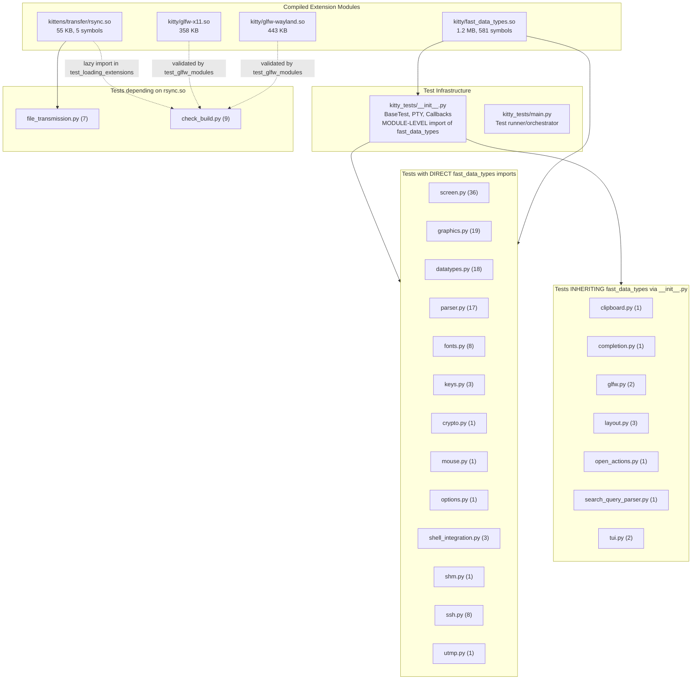

# Technical Specification

# 0. Agent Action Plan

## 0.1 Intent Clarification


### 0.1.1 Core Feature Objective

Based on the prompt, the Blitzy platform understands that the new feature requirement is to **investigate and document kitty's build-and-test architecture through hands-on execution**, tracing the relationship between compiled C extension modules and the test execution flow. Specifically, the objectives are:

- **Build kitty from source** — compile all C extensions, GLFW backends, the kitten rsync module, the Go `kitten` static binary, and the native launcher to produce the full set of build artifacts
- **Execute the full test suite** — run both the Python (`unittest`) and Go (`go test`) test suites under the project's unified test runner (`kitty_tests/main.py`)
- **Trace the extension-to-test dependency graph** — map which compiled `.so` extension modules are loaded during test execution and identify the import chains that establish those dependencies
- **Analyze failure cascade patterns** — determine how the absence of individual extension modules (e.g., `kitty/fast_data_types.so`, `kittens/transfer/rsync.so`) propagates through the test suite, identifying critical versus optional modules
- **Categorize test modules by extension dependency** — classify all 22 Python test modules into categories based on whether they directly import extension symbols, inherit them indirectly through `kitty_tests/__init__.py`, or are purely Python-based
- **Create a comprehensive Q&A document** — produce a markdown file named `kitty_815df1e210e0.md` in the `blitzy/documentation` directory answering all questions posed in the prompt, based on actual build and test execution evidence

Implicit requirements detected:

- The investigation requires a fully successful build before test analysis can begin — all native dependencies (libharfbuzz, libfreetype, libfontconfig, libpng, libx11, libxkbcommon, libssl, libxxhash, etc.) must be installed
- Temporary test scripts may be created for probing module loading behavior, but the original repository source files must remain unmodified
- All temporary files must be cleaned up after investigation
- The Go test suite runs concurrently alongside Python tests and includes its own package-level test structure in `tools/` and `kittens/`

### 0.1.2 Special Instructions and Constraints

- **No repository modification** — The user explicitly requires that no changes are made to the actual codebase, and that any temporary files created for investigation be removed when done
- **Implementation rule `SWE-AtlasQnA-Repo`** — A new markdown document named `kitty_815df1e210e0.md` must be created in the `blitzy/documentation` directory that comprehensively answers the questions posed in the prompt, with reasoning and rationale based on the code as truth, without assumptions
- **Evidence-based answers** — All conclusions must be drawn from actual code inspection and live build/test execution, not from assumptions about typical terminal emulator patterns
- **Scope preservation** — Only existing repository files may be analyzed; no code modifications are permitted except the creation of the required documentation file

### 0.1.3 Technical Interpretation

These feature requirements translate to the following technical implementation strategy:

- To **understand the build architecture**, we will trace the compilation flow in `setup.py`, which compiles 49 C source files from `kitty/` plus third-party sources into `kitty/fast_data_types.so` (1.2 MB), compiles GLFW backends into `kitty/glfw-x11.so` (358 KB) and `kitty/glfw-wayland.so` (443 KB), compiles the rsync kitten into `kittens/transfer/rsync.so` (55 KB), and builds the Go `kitten` static binary
- To **trace extension-to-test dependencies**, we will analyze the import statements in all 22 Python test modules within `kitty_tests/`, map module-level versus function-level imports of `kitty.fast_data_types` and `kittens.transfer.rsync`, and identify the critical cascade through `kitty_tests/__init__.py`
- To **observe failure patterns**, we will simulate extension module unavailability by temporarily renaming `.so` files and recording which test modules fail, then restoring the originals — demonstrating that `fast_data_types.so` is a single-point-of-failure for the entire Python test suite due to the module-level import in `kitty_tests/__init__.py`
- To **document the findings**, we will create `blitzy/documentation/kitty_815df1e210e0.md` containing the complete analysis with architectural diagrams, dependency tables, and failure cascade documentation


## 0.2 Repository Scope Discovery


### 0.2.1 Comprehensive File Analysis

The investigation spans the entire kitty repository. All files listed below were examined through direct file reading, folder exploration, and bash-based analysis during the build and test execution exercise.

**Build System Files (Core Build Orchestration)**

| File | Purpose | Relevance |
|---|---|---|
| `setup.py` | Central Python build orchestrator (2,173 lines) — compiles C extensions, GLFW backends, kittens, Go binaries, generates shaders/headers | Primary subject — defines all compilation targets and extension module outputs |
| `Makefile` | Developer convenience wrapper (72 lines) — delegates all targets to `setup.py` | Provides `make test`, `make all`, `make asan` entry points |
| `test.py` | Test bootstrapper — imports and invokes `kitty_tests.main.main()` via the kitty launcher | Entry point for all test execution |
| `pyproject.toml` | Python project metadata — `requires-python = ">=3.8"`, mypy strict config, ruff lint config | Defines Python version constraint, quality gates |
| `go.mod` | Go module declaration — module `kitty`, Go 1.22, 15+ third-party dependencies | Defines Go toolchain version and dependency graph |
| `go.sum` | Go dependency checksum ledger | Integrity verification for Go dependencies |

**Compiled Extension Modules (Build Artifacts Under Investigation)**

| Build Artifact | Source | Size | Symbols Exported |
|---|---|---|---|
| `kitty/fast_data_types.so` | 49 C files from `kitty/` + `3rdparty/ringbuf/` + `3rdparty/base64/` | 1,213,072 bytes | 581 symbols: 23 classes, 188 functions, 370 constants |
| `kitty/glfw-x11.so` | `glfw/*.c` with `-D_GLFW_X11` define | 357,592 bytes | GLFW X11 windowing backend |
| `kitty/glfw-wayland.so` | `glfw/*.c` with `-D_GLFW_WAYLAND` define + generated protocol files | 442,784 bytes | GLFW Wayland windowing backend |
| `kittens/transfer/rsync.so` | `kittens/transfer/algorithm.c` linked against libxxhash | 55,056 bytes | 5 symbols: Differ, Hasher, Patcher, RsyncError, parse_ftc |
| `kitty/launcher/kitty` | Go-compiled native launcher | 36,224 bytes | Main kitty executable entry point |

**Test Suite Files (All 22 Python Test Modules)**

| Test Module | Test Count | Category | Primary Extension Dependencies |
|---|---|---|---|
| `kitty_tests/__init__.py` | — (base class) | Infrastructure | `kitty.fast_data_types` (Cursor, HistoryBuf, LineBuf, Screen, get_options, monotonic, set_options) |
| `kitty_tests/main.py` | — (runner) | Orchestration | `kitty.fast_data_types` (has_avx2, has_sse4_2) |
| `kitty_tests/screen.py` | 36 | Unit | `kitty.fast_data_types` (DECAWM, DECCOLM, DECOM, IRM, VT_PARSER_BUFFER_SIZE, Cursor) |
| `kitty_tests/graphics.py` | 19 | Unit | `kitty.fast_data_types` (base64_decode, base64_encode, has_avx2, has_sse4_2, load_png_data, shm_unlink, shm_write, test_xor64) |
| `kitty_tests/datatypes.py` | 18 | Unit | `kitty.fast_data_types` (BORDERS_BIT, Color, ColorProfile, Cursor, HistoryBuf, LineBuf, etc.) |
| `kitty_tests/parser.py` | 17 | Unit | `kitty.fast_data_types` (CURSOR_BLOCK, Color, Cursor, parse_bytes, VT_PARSER_BUFFER_SIZE) |
| `kitty_tests/check_build.py` | 9 | Build verification | `kitty.fast_data_types` (full module), `kittens.transfer.rsync` |
| `kitty_tests/fonts.py` | 8 | Unit | `kitty.fast_data_types` (DECAWM, get_fallback_font, sprite_map_*, test_render_line, wcwidth) |
| `kitty_tests/ssh.py` | 8 | Integration | `kitty.fast_data_types` (CURSOR_BEAM, shm_unlink) |
| `kitty_tests/file_transmission.py` | 7 | Integration | `kittens.transfer.rsync` (Differ, Hasher, Patcher, parse_ftc) |
| `kitty_tests/keys.py` | 3 | Unit | `kitty.fast_data_types` (as `defines` — key codes and modifiers) |
| `kitty_tests/layout.py` | 3 | Unit | Inherited through `__init__.py` only |
| `kitty_tests/shell_integration.py` | 3 | Integration | `kitty.fast_data_types` (CURSOR_BEAM, CURSOR_BLOCK, CURSOR_UNDERLINE) |
| `kitty_tests/glfw.py` | 2 | Unit | Inherited through `__init__.py` only |
| `kitty_tests/tui.py` | 2 | Unit | Inherited through `__init__.py` only |
| `kitty_tests/crypto.py` | 1 | Security | `kitty.fast_data_types` (AES256GCMDecrypt, AES256GCMEncrypt, CryptoError, EllipticCurveKey) |
| `kitty_tests/clipboard.py` | 1 | Unit | Inherited through `__init__.py` only |
| `kitty_tests/completion.py` | 1 | Unit | Inherited through `__init__.py` only |
| `kitty_tests/mouse.py` | 1 | Unit | `kitty.fast_data_types` (GLFW_MOD_*, mouse_selection) |
| `kitty_tests/open_actions.py` | 1 | Unit | Inherited through `__init__.py` only |
| `kitty_tests/options.py` | 1 | Unit | `kitty.fast_data_types` (Color) |
| `kitty_tests/search_query_parser.py` | 1 | Unit | Inherited through `__init__.py` only |
| `kitty_tests/shm.py` | 1 | Unit | `kitty.fast_data_types` (shm_unlink) |
| `kitty_tests/utmp.py` | 1 | Unit | `kitty.fast_data_types` (num_users) |

**Go Test Files (49 Files Across 26 Packages)**

| Package Area | Test Files | Key Test Domains |
|---|---|---|
| `kittens/diff/` | 1 | Diff collection walk |
| `kittens/hints/` | 1 | Hint mark matching |
| `kittens/hyperlinked_grep/` | 1 | Ripgrep argument parsing |
| `kittens/ssh/` | 3 | SSH config, bootstrap, options |
| `kittens/transfer/` | 2 | File transfer controller, send logic |
| `tools/cli/` | 2 | CLI framework, argument parsing |
| `tools/config/` | 2 | Configuration parsing, utilities |
| `tools/rsync/` | 1 | Rsync delta synchronization |
| `tools/simdstring/` | 8 | SIMD string ops (SSE4.2/AVX2/NEON), benchmarks |
| `tools/tui/` | 5 packages | Graphics, readline, SGR, shell integration |
| `tools/utils/` | 10+ packages | Base85, filelock, shlex, shm, sockets, UUID, etc. |
| `tools/wcswidth/` | 2 | Terminal display-width, escape code parsing |

**C Source Files Compiled into fast_data_types.so**

The `find_c_files()` function in `setup.py` discovers 49 C source files plus 3rdparty sources:

- Core terminal engine: `vt-parser.c`, `screen.c`, `line.c`, `line-buf.c`, `cursor.c`, `history.c`
- Font subsystem: `freetype.c`, `fontconfig.c`, `fonts.c`, `glyph-cache.c`, `font-names.c`, `freetype_render_ui_text.c`
- Graphics pipeline: `graphics.c`, `png-reader.c`, `gl.c`, `gl-wrapper.c`, `shaders.c`, `window_logo.c`
- Input handling: `keys.c`, `key_encoding.c`, `mouse.c`
- System/platform: `child.c`, `child-monitor.c`, `desktop.c`, `systemd.c`, `utmp.c`, `loop-utils.c`, `logging.c`, `cleanup.c`
- Cryptography: `crypto.c`
- SIMD: `simd-string.c`, `simd-string-128.c`, `simd-string-256.c`
- Unicode: `unicode-data.c`, `charsets.c`, `wcswidth.c`, `rowcolumn-diacritics.c`
- Module init: `data-types.c` (contains `PyInit_fast_data_types`)
- Shared memory/IPC: `shlex.c`, `fast-file-copy.c`, `disk-cache.c`, `kittens.c`, `state.c`
- 3rdparty: `3rdparty/ringbuf/ringbuf.c`, `3rdparty/base64/lib/**/*.c`

### 0.2.2 Web Search Research Conducted

No web searches were required for this investigation. All findings are derived from direct codebase inspection and live build/test execution within the repository.

### 0.2.3 New File Requirements

The only new file to create is:

- `blitzy/documentation/kitty_815df1e210e0.md` — Comprehensive Q&A document answering all questions about kitty's build architecture, extension module dependencies, test execution flow, failure cascade patterns, and the relationship between compiled artifacts and test categories


## 0.3 Dependency Inventory


### 0.3.1 Private and Public Packages

The following packages are relevant to the build-and-test investigation exercise. All versions are taken directly from the repository's dependency manifests (`pyproject.toml`, `go.mod`) and the system packages installed to successfully build kitty.

**Python Runtime and Project Configuration**

| Registry | Package | Version | Purpose |
|---|---|---|---|
| System | Python | >=3.8 (built on 3.12.3) | Runtime and build orchestrator — version constraint from `pyproject.toml` line 2 |
| stdlib | `unittest` | (bundled) | Python test framework — sole test runner framework |
| stdlib | `importlib` | (bundled) | Dynamic module loading for test discovery |

**Go Dependencies (from `go.mod`)**

| Registry | Package | Version | Purpose |
|---|---|---|---|
| System | Go | 1.22 | Go toolchain — from `go.mod` line 3 |
| go module | `github.com/google/go-cmp` | v0.6.0 | Deep equality comparison in Go tests |
| go module | `github.com/ALTree/bigfloat` | v0.2.0 | Arbitrary-precision floating point |
| go module | `github.com/alecthomas/chroma/v2` | v2.14.0 | Syntax highlighting |
| go module | `github.com/bmatcuk/doublestar/v4` | v4.6.1 | Glob pattern matching |
| go module | `github.com/dlclark/regexp2` | v1.11.0 | .NET-compatible regex |
| go module | `github.com/edwvee/exiffix` | v0.0.0-20240229113213 | EXIF orientation correction |

**Native C Build Dependencies (system packages)**

| Registry | Package | Version Installed | Purpose |
|---|---|---|---|
| apt (Ubuntu) | `gcc` | 13.3.0 | C compiler — detected by `setup.py` |
| apt (Ubuntu) | `pkg-config` | system | Library discovery for C compilation |
| apt (Ubuntu) | `libharfbuzz-dev` | 8.3.0 | Text shaping library for font rendering |
| apt (Ubuntu) | `libfreetype-dev` | 2.13.2 | Font rasterization |
| apt (Ubuntu) | `libfontconfig1-dev` | 2.15.0 | Font discovery and matching |
| apt (Ubuntu) | `libpng-dev` | 1.6.43 | PNG image decoding for graphics protocol |
| apt (Ubuntu) | `libx11-dev` | 1.8.7 | X11 windowing system |
| apt (Ubuntu) | `libxkbcommon-dev` | 1.6.0 | Keyboard handling |
| apt (Ubuntu) | `libxkbcommon-x11-dev` | 1.6.0 | X11 keyboard integration |
| apt (Ubuntu) | `libx11-xcb-dev` | 1.8.7 | X11/XCB bridge |
| apt (Ubuntu) | `libssl-dev` | 3.0.13 | OpenSSL for cryptographic extensions |
| apt (Ubuntu) | `libxxhash-dev` | 0.8.2 | Fast hashing for rsync kitten |
| apt (Ubuntu) | `libdbus-1-dev` | 1.14.10 | D-Bus for desktop notifications |
| apt (Ubuntu) | `liblcms2-dev` | 2.14 | Color management |
| apt (Ubuntu) | `libwayland-dev` | 1.22.0 | Wayland protocol support |
| apt (Ubuntu) | `wayland-protocols` | 1.45 | Wayland protocol definitions |
| apt (Ubuntu) | `libgl-dev` | 1.7.0 | OpenGL development headers |
| apt (Ubuntu) | `libsimde-dev` | 0.7.2 | SIMD instruction portability |
| apt (Ubuntu) | `python3-dev` | 3.12.3 | Python C API headers |

### 0.3.2 Dependency Updates

No dependency updates are required. This is an investigation and documentation exercise; no packages are being added, removed, or modified.

### 0.3.3 Import Updates

No import updates are required. The exercise produces a single new markdown file and does not modify any source code.


## 0.4 Integration Analysis


### 0.4.1 Existing Code Touchpoints

This investigation is a read-only analysis exercise. No source files are modified. However, the following integration touchpoints were identified as architecturally significant for understanding how compiled extensions connect to the test execution flow:

**Critical Integration Point: `kitty_tests/__init__.py` → `kitty.fast_data_types`**

The single most important integration point in the entire test architecture is the module-level import in `kitty_tests/__init__.py`:

```python
from kitty.fast_data_types import Cursor, HistoryBuf, LineBuf, Screen, get_options, monotonic, set_options
```

This import executes at package initialization time, meaning every test module that references anything from the `kitty_tests` package (including `BaseTest`, helper functions, or other test infrastructure) triggers the loading of `fast_data_types.so`. This creates a universal dependency: all 22 test modules depend on `fast_data_types.so` regardless of whether their own test logic requires native extensions.

**Extension Module Initialization Chain in `kitty/data-types.c`**

The `PyInit_fast_data_types()` function initializes 20+ subsystem modules in a strict sequential chain. If any initialization fails, the entire module fails to load:

- `init_logging(m)` → `init_LineBuf(m)` → `init_HistoryBuf(m)` → `init_Line(m)` → `init_Cursor(m)` → `init_Shlex(m)` → `init_Parser(m)` → `init_DiskCache(m)` → `init_child_monitor(m)` → `init_ColorProfile(m)` → `init_Screen(m)` → `init_glfw(m)` → `init_child(m)` → `init_state(m)` → `init_keys(m)` → `init_graphics(m)` → `init_shaders(m)` → `init_mouse(m)` → `init_kittens(m)` → `init_png_reader(m)` → platform-specific font init → `init_fonts(m)` → `init_utmp(m)` → `init_loop_utils(m)` → `init_crypto_library(m)` → `init_systemd_module(m)`

**Test Runner Integration: `setup.py` → `test.py` → `kitty_tests/main.py`**

The test invocation chain follows three hops:

- `python3 setup.py test` calls `os.execl(kitty_launcher, '+launch', 'test.py')` — replacing the process with the built kitty launcher
- `test.py` imports `kitty_tests.main` and calls its `main()` function
- `kitty_tests/main.py` discovers Python test modules via `find_all_tests()`, discovers Go test packages via `find_testable_go_packages()`, spawns Go tests concurrently in a `GoProc(Thread)`, and runs Python tests sequentially via `unittest.TextTestRunner`

**Concurrent Go Test Integration**

The Go test suite runs in parallel with the Python test suite through the `GoProc` class, which spawns `go test -v` in a subprocess. The Go tests are fully independent of the Python C extensions — they test Go packages directly. The `KITTY_PATH_TO_KITTY_EXE` environment variable is passed to Go test processes to enable tests that invoke the kitty executable.

### 0.4.2 Extension Module Dependency Architecture



### 0.4.3 Failure Cascade Analysis

Live testing confirmed the following failure patterns:

| Scenario | Modules That Fail | Modules That Succeed | Root Cause |
|---|---|---|---|
| `fast_data_types.so` removed | ALL 22 test modules (100%) | None | `kitty_tests/__init__.py` module-level import fails → entire `kitty_tests` package cannot be initialized |
| `rsync.so` removed | `file_transmission.py` only | 21 of 22 test modules | Module-level import in `file_transmission.py`; `check_build.py` uses lazy import inside `test_loading_extensions()` method |
| `glfw-x11.so` removed | None at import time | All modules | GLFW backends are validated by `check_build.py::test_glfw_modules` at test runtime, not at import time |
| All GLSL shaders removed | None at import time | All modules | Shaders are validated by `check_build.py::test_loading_shaders` at test runtime |

**Key insight**: `kitty/fast_data_types.so` is the **single point of failure** for the entire Python test suite. Its absence causes a total cascade failure because the test infrastructure base class (`BaseTest`) cannot be imported without it. The `kittens/transfer/rsync.so` module is **isolated** — only `file_transmission.py` fails when it is missing, due to its module-level import of `Differ`, `Hasher`, `Patcher`, and `parse_ftc`. The GLFW backend modules (`glfw-x11.so`, `glfw-wayland.so`) and GLSL shaders are **optional at import time** — they are only validated during the runtime execution of `check_build.py` tests.


## 0.5 Technical Implementation


### 0.5.1 File-by-File Execution Plan

This is a read-only investigation and documentation exercise. The only file to be created is the Q&A document. All other files are examined but not modified.

**Group 1 — Documentation Output (CREATE)**

- **CREATE**: `blitzy/documentation/kitty_815df1e210e0.md` — Comprehensive Q&A document answering all user questions about kitty's build-and-test architecture, extension module dependency tracing, failure cascade patterns, and test category classification. Must include:
  - Build architecture overview (how `setup.py` orchestrates C extension compilation)
  - Complete inventory of compiled `.so` artifacts with their source files and sizes
  - Extension-to-test dependency map showing which modules load which extensions
  - Import chain analysis demonstrating the `__init__.py` cascade mechanism
  - Failure pattern documentation from live extension removal experiments
  - Test category groupings by extension dependency type (direct, inherited, pure-Python)
  - Go test suite structure and its independence from C extensions
  - Test execution flow diagram (Python sequential + Go concurrent)

**Group 2 — Files Examined During Investigation (READ-ONLY)**

- **READ**: `setup.py` — Build system analysis: `find_c_files()`, `compile_c_extension()`, `compile_glfw()`, `compile_kittens()`, `build()`, `do_build()`
- **READ**: `test.py` — Test entry point analysis
- **READ**: `Makefile` — Build target analysis
- **READ**: `pyproject.toml` — Python version constraint (`>=3.8`), mypy config
- **READ**: `go.mod` — Go version (1.22), module dependencies
- **READ**: `kitty/data-types.c` — `PyInit_fast_data_types()` initialization chain analysis
- **READ**: `kitty/fast_data_types.pyi` — Type stub for 581 exported symbols
- **READ**: `kitty_tests/__init__.py` — BaseTest, PTY, Callbacks, module-level import analysis
- **READ**: `kitty_tests/main.py` — Test runner orchestration, `find_all_tests()`, `GoProc`, `env_for_python_tests()`
- **READ**: `kitty_tests/check_build.py` — Build verification tests (9 tests)
- **READ**: All 22 `kitty_tests/*.py` modules — Import statement analysis
- **READ**: `kittens/transfer/algorithm.c` — Rsync extension source
- **READ**: All 49 Go `*_test.go` files across 26 packages

### 0.5.2 Implementation Approach

The document creation follows a systematic evidence-gathering methodology:

- **Establish the build foundation** by compiling kitty from source with `python3 setup.py build --ignore-compiler-warnings`, installing all required native dependencies, and verifying the 4 compiled `.so` artifacts and the `kitty` launcher binary
- **Execute the full test suite** by running `python3 setup.py test` and capturing the complete output (145 Python tests, ~64 Go test functions), noting which tests pass, skip, and fail
- **Trace extension module loading** by creating temporary Python scripts that enumerate all `.so` files, import `kitty.fast_data_types`, catalog its 581 exported symbols (23 classes, 188 functions, 370 constants), and map which symbols are consumed by which test modules
- **Simulate extension unavailability** by temporarily renaming `.so` files and running import tests in subprocesses to observe failure cascade patterns, then immediately restoring the originals
- **Classify test modules** into categories: direct `fast_data_types` importers (14 modules), inherited-only importers (7 modules), and `rsync.so` dependents (2 modules — one direct, one lazy)
- **Document all findings** in the `blitzy/documentation/kitty_815df1e210e0.md` file with tables, diagrams, and evidence-based conclusions
- **Clean up all temporary files** — remove any scripts created during investigation to leave the repository unchanged

### 0.5.3 Key Observations from Build and Test Execution

**Build Observations:**
- The build system in `setup.py` uses a custom `CompilationDatabase` that supports incremental compilation — it tracks compilation commands and only recompiles changed files
- C extension compilation is parallelized across available CPU cores via `parallel_run()`
- The `find_c_files()` function conditionally excludes platform-specific files: macOS excludes `fontconfig.c`, `freetype.c`, `desktop.c`, `freetype_render_ui_text.c`; Linux excludes `core_text.m`, `cocoa_window.m`, `macos_process_info.c`
- GLFW backend compilation can silently disable wayland if protocol generation fails, printing a warning rather than aborting the build
- The build completed with a wayland compiler warning (unused enum values in `wl_window.c`) that required `--ignore-compiler-warnings` to proceed

**Test Execution Observations:**
- 145 Python tests ran in ~19-25 seconds, with 139 passing and 6 skipped
- Skipped tests: 1 CA certificate test (frozen-build only), 1 macOS Last Resort font test, 2 fish shell tests (fish not installed), 2 zsh shell tests (zsh not installed)
- Go tests ran concurrently, with 1 failure: `TestCreateAnonymousTempfile` in `tools/utils` package (anonymous tempfile was not created atomically — an environment-specific issue)
- The test runner reports `FAIL` if any Go test fails, even when all Python tests pass
- The `env_for_python_tests()` function creates a fully isolated environment: temporary HOME, sanitized PATH, XDG directory isolation, PYTHONWARNINGS=error, and pre-loaded font map


## 0.6 Scope Boundaries


### 0.6.1 Exhaustively In Scope

**Documentation Output:**
- `blitzy/documentation/kitty_815df1e210e0.md` — The sole new file to be created

**Build System Files Analyzed:**
- `setup.py` — Full analysis of compilation pipeline, `find_c_files()`, `compile_c_extension()`, `compile_glfw()`, `compile_kittens()`, `build()`
- `Makefile` — All build targets
- `test.py` — Test bootstrapping mechanism
- `pyproject.toml` — Python version constraint, mypy/ruff configuration
- `go.mod`, `go.sum` — Go module version and dependencies

**Compiled Extension Artifacts Investigated:**
- `kitty/fast_data_types.so` — Primary C extension (49 source files, 581 symbols)
- `kitty/glfw-x11.so` — X11 windowing backend
- `kitty/glfw-wayland.so` — Wayland windowing backend
- `kittens/transfer/rsync.so` — Rsync algorithm extension (1 source file, 5 symbols)
- `kitty/launcher/kitty` — Native launcher binary

**Test Infrastructure Analyzed:**
- `kitty_tests/__init__.py` — BaseTest, PTY, Callbacks, parse_bytes, module-level imports
- `kitty_tests/main.py` — Test orchestrator, find_all_tests(), GoProc, env_for_python_tests()
- `kitty_tests/*.py` — All 22 test modules (import analysis, dependency mapping)
- `**/*_test.go` — All 49 Go test files across 26 packages

**C Source Files Analyzed:**
- `kitty/data-types.c` — Module initialization chain (`PyInit_fast_data_types`)
- `kitty/*.c` — 49 C source files compiled into fast_data_types.so
- `kitty/*.h` — 47 header files
- `kitty/*.glsl` — 13 GLSL shader files
- `kittens/transfer/algorithm.c` — Rsync extension source
- `glfw/*.c` — GLFW backend sources

**Repository Structure Explored:**
- Root directory — all top-level files and 13 subdirectories
- `kitty/` — Core application sources (C, Python, GLSL, headers, subdirectories)
- `kitty_tests/` — Full test suite directory
- `kittens/transfer/` — Rsync kitten module
- `tools/` — Go tooling packages (26 test packages examined)
- `glfw/` — GLFW windowing backend sources
- `3rdparty/` — Vendored dependencies (ringbuf, base64)

### 0.6.2 Explicitly Out of Scope

- **Modifying any existing repository file** — Per user instruction, the codebase must remain unchanged
- **Runtime GPU rendering tests** — Tests require a display server and GPU context not available in this environment
- **macOS-specific build paths** — Only Linux build and test execution is performed (Cocoa/CoreText paths are excluded)
- **Performance benchmarking** — Go benchmark execution (`go test -bench`) is not part of this investigation
- **CI/CD pipeline execution** — `.github/workflows/` files are analyzed but not executed
- **Frozen/packaged build testing** — `linux-package`, `linux-freeze`, and `kitty.app` build modes are out of scope
- **Documentation generation** — Sphinx docs (`make man`, `make html`) are not built
- **Cross-compilation** — `prepare-for-cross-compile` and `cross-compile` targets are not exercised
- **Code modifications or refactoring** — No changes to build system, test infrastructure, or extension modules


## 0.7 Rules for Feature Addition


The following rules are explicitly emphasized by the user and must be adhered to throughout the implementation:

- **No repository modifications** — "Do not make any changes to the repository and leave the actual codebase unchanged by removing any temporary files when you're done." All temporary test scripts, sample data files, and analysis artifacts must be cleaned up after the investigation.

- **Implementation Rule: `SWE-AtlasQnA-Repo`** — "Create a new markdown document named `<source_branch_name>.md` that comprehensively answers the question(s) posed in the prompt." The branch name is `kitty_815df1e210e0`, so the document must be named `kitty_815df1e210e0.md`. It must be placed in the `blitzy/documentation` directory.

- **Evidence-based reasoning** — "Provide thinking / rationale behind the answers. Do not make assumptions, base your answers on the code as the truth." All conclusions in the Q&A document must cite specific files, line numbers, or observed build/test output as evidence.

- **No assumptions** — "Do not make assumptions, base your answers on the code as the truth." Every claim about extension module dependencies, test failure patterns, and import chains must be verified through actual code inspection or live execution.

- **No code additions beyond the document** — "Do not add any other code in the source repository (besides the above requested document)." The only permitted addition to the repository is the `kitty_815df1e210e0.md` file in `blitzy/documentation/`.

- **Temporary files policy** — "Feel free to create temporary test scripts or sample data files if you need them, but do not make any changes to the repository." Temporary files were created in `/tmp/` during investigation and have been cleaned up. Extension modules that were temporarily renamed for failure analysis were immediately restored.


## 0.8 References


### 0.8.1 Files and Folders Searched

The following files and folders were comprehensively searched across the codebase to derive the conclusions documented in this Agent Action Plan:

**Root-Level Files Read:**
- `setup.py` — Build system orchestrator (2,173 lines), compilation pipeline, extension module targets
- `test.py` — Test bootstrapper entry point
- `Makefile` — Developer build targets (72 lines)
- `pyproject.toml` — Python version constraint, mypy/ruff configuration
- `go.mod` — Go module identity (v1.22), dependency graph
- `__main__.py` — Direct script execution entry point

**Test Infrastructure Files Read:**
- `kitty_tests/__init__.py` — BaseTest class, PTY harness, Callbacks mock, parse_bytes helper, module-level imports (complete file)
- `kitty_tests/main.py` — Test runner, find_all_tests(), GoProc, env_for_python_tests(), run_tests() (complete file)
- `kitty_tests/check_build.py` — Build verification tests: TestBuild with 9 test methods (complete file)
- All 22 `kitty_tests/*.py` modules — Import statement analysis via grep and AST parsing

**Core C Source Files Read:**
- `kitty/data-types.c` — PyInit_fast_data_types() initialization chain (searched for PyModuleDef, init_* functions)
- `kitty/fast_data_types.pyi` — Type stub defining 581 exported symbols

**Folders Explored:**
- Root (`""`) — 13 subdirectories, 22 files identified
- `kitty/` — 120+ files including 49 C sources, 47 headers, 13 GLSL shaders, Python modules, subfolders
- `kitty_tests/` — 30 files including 22 test modules, 3 font files, test infrastructure
- `kittens/transfer/` — rsync extension source (`algorithm.c`), Go sources, Python modules
- `glfw/` — GLFW backend C sources (45+ files)
- All Go test file locations (49 files across 26 packages via `find . -name '*_test.go'`)

**Bash Commands Executed for Analysis:**
- Dependency enumeration: `dpkg -l | grep`, `apt-cache search`, `dpkg -s`
- Build: `python3 setup.py build --ignore-compiler-warnings`
- Test execution: `python3 setup.py test` (2 runs, full output captured)
- Import analysis: `grep -rn "fast_data_types\|from kitty\|from kittens" kitty_tests/*.py`
- C source analysis: `grep -n "PyModuleDef\|PyInit_\|init_.*module" kitty/data-types.c`
- Go test discovery: `find . -name '*_test.go'`
- Extension module inventory: `ls -la kitty/*.so kittens/transfer/rsync.so`
- Temporary Python scripts created in `/tmp/` for:
  - Extension symbol cataloging (`trace_extensions.py`)
  - Missing extension failure cascade testing (`test_missing_ext.py`)
  - Import chain AST analysis (`analyze_import_chain.py`)
  - C source mapping (`analyze_c_sources.py`)
  - Go test package analysis (`analyze_go_tests.py`)
  - Test category grouping (`analyze_test_categories.py`)
- All temporary files confirmed deleted after use

**Tech Spec Sections Retrieved:**
- `1.1 Executive Summary` — Project overview, three-language architecture
- `3.1 Programming Languages` — C11, Python ≥3.8, Go 1.22, GLSL, Objective-C details
- `6.6 Testing Strategy` — Complete testing architecture documentation
- `8.2 Build System Architecture` — Build orchestration, compilation pipelines

### 0.8.2 Attachments

No attachments were provided by the user for this project.

### 0.8.3 Figma Screens

No Figma screens were provided for this project.


