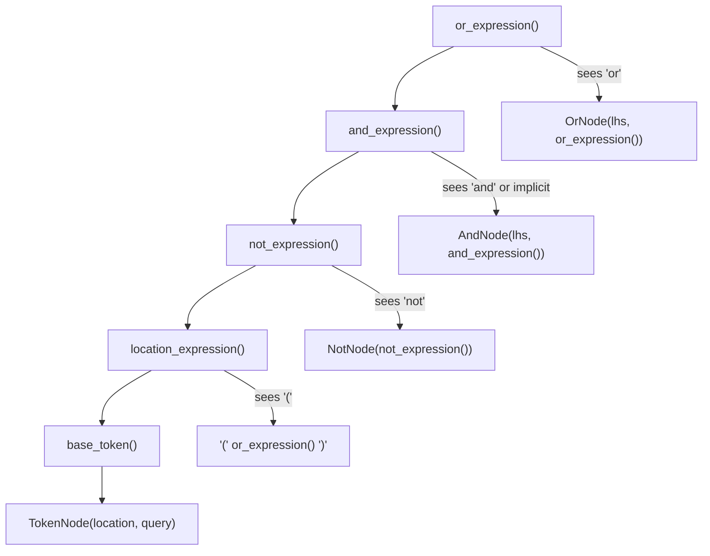

# Technical Specification

# 0. Agent Action Plan

## 0.1 Intent Clarification

### 0.1.1 Core Documentation Objective

Based on the provided requirements, the Blitzy platform understands that the documentation objective is to **investigate the Kitty terminal emulator's search query parser, explain its exact behavior, and produce a comprehensive Q&A-style reference document** that answers the user's questions about unexpected results when combining search terms with `or` and spaces.

- **Category:** Create new documentation
- **Documentation Type:** Technical investigation Q&A document — a detailed analysis and explanation document placed in `blitzy/documentation/`

The user's requirements translate to the following documentation objectives:

- **Investigate the parser implementation** — Examine `kitty/search_query_parser.py` to identify the exact parsing rules, operator precedence, and implicit behavior that govern how multi-term queries are evaluated.
- **Explain what is actually happening** — Document the root cause of the unexpected behavior: implicit AND semantics for space-separated terms and the operator precedence rules (NOT > AND > OR) that cause expressions like `id:1 or id:2 id:3` to parse as `id:1 OR (id:2 AND id:3)` rather than `id:1 OR id:2 OR id:3`.
- **Run test queries to demonstrate behavior** — Execute a controlled test harness against the real parser to show concrete input-output pairs that illustrate the correct and surprising behaviors.
- **Document the correct query syntax** — Provide a clear reference for writing multi-term OR queries, including the requirement for explicit `or` keywords between every disjunctive term.
- **Leave the codebase unchanged** — Any temporary test scripts must be created externally and cleaned up after use. No repository source files may be modified.

Inferred documentation needs based on code analysis:

- The `OrNode.__call__` method in `kitty/search_query_parser.py` (line 63-65) applies a candidate-subtraction optimization where the right-hand side of an OR is evaluated against `candidates.difference(lhs)`. While mathematically equivalent to a standard set union for pure-filter callbacks, this warrants documentation to confirm correctness.
- The `and_expression()` method (lines 215-224) implements implicit AND semantics for adjacent tokens that are not separated by `or`. This is the direct cause of the user's confusion and must be prominently documented.
- The `base_token()` method (lines 244-278) requires a `location:` prefix on all non-quoted terms when `allow_no_location` is False (the default for window/tab matching). This validation constraint must be documented alongside correct syntax examples.
- The parser's operator precedence — NOT (highest) > AND (implicit and explicit) > OR (lowest) — is standard for boolean search grammars but is not explicitly documented in any user-facing reference. The new document must make this explicit.

### 0.1.2 Special Instructions and Constraints

- **CRITICAL — Read-only codebase constraint:** The user explicitly stated: *"Don't modify any repository source files. You can create temporary test scripts or helper tools if needed, but clean them up and leave the codebase unchanged when done."* This means the output is documentation only, with zero source file modifications.
- **Implementation rule — SWE-AtlasQnA-Repo:** The project rule requires: *"Create a new markdown document named `<source_branch_name>.md` that comprehensively answers the question(s) posed in the prompt."* The source branch name is `kitty_815df1e210e0`, so the output file must be named `kitty_815df1e210e0.md` and placed in `blitzy/documentation/`.
- **Implementation rule — Evidence-based answers:** The rule explicitly requires: *"Do not make assumptions, base your answers on the code as the truth."* All findings must cite specific source lines in the repository.
- **Implementation rule — No existing file modifications:** *"Do not modify any existing files in the source repository."*
- **Style preference:** The document should include thinking and rationale behind answers, not just conclusions.
- **Test output requirement:** The user requested that running test queries would help them see the behavior clearly, so the document should include the output of test runs against the actual parser.

### 0.1.3 Technical Interpretation

These documentation requirements translate to the following technical documentation strategy:

- To **answer the user's question about unexpected OR behavior**, we will **create** `blitzy/documentation/kitty_815df1e210e0.md` containing a complete investigation of the parser at `kitty/search_query_parser.py`, with parse-tree visualizations, test output, and a correct-syntax reference.
- To **demonstrate the behavior with test queries**, we will execute a temporary Python test harness (created outside the repository, cleaned up after use) that imports the real `kitty.search_query_parser.search` function and runs a battery of query patterns against a controlled dataset, capturing output for inclusion in the document.
- To **explain the parser logic**, we will trace through the recursive-descent parsing methods (`or_expression`, `and_expression`, `not_expression`, `location_expression`, `base_token`) and document the exact AST (Abstract Syntax Tree) that each query pattern produces.
- To **confirm whether this is a bug or expected behavior**, we will verify the `OrNode.__call__` candidate-subtraction optimization against the mathematical properties of set union and document that it is correct for all pure-filter `get_matches` callbacks.

## 0.2 Documentation Discovery and Analysis

### 0.2.1 Existing Documentation Infrastructure Assessment

Repository analysis reveals a **Sphinx-based documentation framework** with extensive reStructuredText (`.rst`) files, generated content, and a Makefile-driven build system.

- **Documentation framework:** Sphinx (configured in `docs/conf.py`)
- **Documentation generator configuration location:** `docs/conf.py` (595 lines), `docs/Makefile`
- **API documentation tools in use:** Inline docstrings in Python modules; generated `.rst` files for CLI help and matching syntax
- **Diagram tools detected:** Mermaid is not natively used in the project; documentation uses textual descriptions and Sphinx directives
- **Documentation hosting:** Generated docs are published via `publish.py` to the Kitty website

Existing documentation relevant to the search query parser:

| Documentation File | Content | Relevance |
|---|---|---|
| `docs/remote-control.rst` (lines 327-345) | "Matching windows and tabs" section with examples of `--match` syntax | **Primary** — documents the `field:query` syntax and references `search_syntax` label |
| `docs/conf.py` (lines 594-603) | Generates `generated/matching.rst` from `MATCH_WINDOW_OPTION` and `MATCH_TAB_OPTION` constants | **High** — auto-generates the official field reference docs |
| `kitty/rc/base.py` (lines 87-165) | `MATCH_WINDOW_OPTION` and `MATCH_TAB_OPTION` — the authoritative prose describing all match fields and their behaviors | **Critical** — this is the canonical reference for supported locations and their semantics |
| `kitty_tests/search_query_parser.py` | Unit tests covering basic OR, AND, NOT, grouping, quoted terms, and error cases | **High** — serves as a behavioral specification |

Key finding: The existing documentation at `docs/remote-control.rst` provides examples of boolean operators but **does not explicitly document operator precedence, implicit AND behavior, or the interaction between space-separated terms and `or` keywords.** This gap is the direct cause of the user's confusion.

### 0.2.2 Repository Code Analysis for Documentation

Search patterns used to locate the parser and its consumers:

- **Parser implementation:** `kitty/search_query_parser.py` — 297 lines containing the full tokenizer, recursive-descent parser, AST node classes (`OrNode`, `AndNode`, `NotNode`, `TokenNode`), and public API (`search()`, `build_tree()`)
- **Parser tests:** `kitty_tests/search_query_parser.py` — 31 lines with `TestSQP` class exercising core behaviors
- **Parser consumers in `kitty/boss.py`:**
  - `match_windows()` (line 471) — matches windows using locations: `id`, `title`, `pid`, `cwd`, `cmdline`, `num`, `env`, `var`, `recent`, `state`, `neighbor`
  - `match_tabs()` (line 505) — matches tabs using locations: `id`, `index`, `title`, `window_id`, `window_title`, `pid`, `cwd`, `env`, `var`, `cmdline`, `recent`, `state`
- **Window match logic:** `kitty/window.py` (line 784) — `Window.matches_query()` implementing per-field matching
- **Tab match logic:** `kitty/tabs.py` (line 800) — `Tab.matches_query()` implementing per-field matching
- **CLI match options:** `kitty/rc/base.py` (lines 87-165) — `MATCH_WINDOW_OPTION` and `MATCH_TAB_OPTION` string constants

Key directories examined:

| Directory | Purpose | Relevance |
|---|---|---|
| `kitty/` | Core application source | Contains the parser (`search_query_parser.py`) and its consumers (`boss.py`, `window.py`, `tabs.py`) |
| `kitty_tests/` | Unit test suite | Contains parser tests (`search_query_parser.py`) |
| `kitty/rc/` | Remote control command modules (41 commands) | Contains match option definitions (`base.py`) used by remote control commands |
| `docs/` | Sphinx documentation source | Contains `remote-control.rst` with the only user-facing search syntax docs |
| `blitzy/documentation/` | Target directory for generated Q&A documentation | Does not yet exist; must be created |

### 0.2.3 Web Search Research Conducted

No external web search was necessary for this task. The investigation is entirely code-based, per the implementation rule: *"Do not make assumptions, base your answers on the code as the truth."* All findings are derived from direct analysis of the repository source files.

## 0.3 Documentation Scope Analysis

### 0.3.1 Code-to-Documentation Mapping

The following modules require documentation coverage in the output document:

- **Module: `kitty/search_query_parser.py`** (297 lines)
  - Public APIs: `search()`, `build_tree()`
  - Internal classes requiring explanation: `Parser`, `OrNode`, `AndNode`, `NotNode`, `TokenNode`, `SearchTreeNode`
  - Key methods: `Parser.or_expression()` (line 208), `Parser.and_expression()` (line 215), `Parser.not_expression()` (line 226), `Parser.location_expression()` (line 232), `Parser.base_token()` (line 244), `Parser.tokenize()` (line 180)
  - Current documentation: **No standalone documentation exists** — the module has inline code comments but no user-facing docs or API reference
  - Documentation needed: Complete behavioral explanation, operator precedence rules, implicit AND semantics, correct syntax reference, parse tree visualizations, and test output demonstrating each pattern

- **Module: `kitty_tests/search_query_parser.py`** (31 lines)
  - Public API: `TestSQP.test_search_query_parser()`
  - Current documentation: None — serves as implicit specification
  - Documentation needed: Reference in the output document as behavioral evidence

- **Module: `kitty/boss.py`** (lines 471-496, 505-531)
  - Methods: `Boss.match_windows()`, `Boss.match_tabs()`
  - Current documentation: Partial — `MATCH_WINDOW_OPTION` and `MATCH_TAB_OPTION` describe fields but not operator behavior
  - Documentation needed: Context on how the parser is consumed, valid location fields, and the `get_matches` callback pattern

- **Module: `kitty/rc/base.py`** (lines 87-165)
  - Constants: `MATCH_WINDOW_OPTION`, `MATCH_TAB_OPTION`
  - Current documentation: These constants ARE the documentation (auto-included in generated docs)
  - Documentation needed: Reference as the canonical field list

### 0.3.2 Documentation Gap Analysis

Given the requirements and repository analysis, the following documentation gaps have been identified:

| Gap ID | Gap Description | Source Evidence | Severity |
|---|---|---|---|
| GAP-01 | **Operator precedence is undocumented** — No user-facing document explains that NOT > AND > OR. The `docs/remote-control.rst` examples show operators but never state their precedence. | `docs/remote-control.rst` lines 332-344; `kitty/search_query_parser.py` lines 208-230 | **Critical** — directly causes user confusion |
| GAP-02 | **Implicit AND behavior is undocumented** — Space-separated terms are silently treated as AND, but no documentation mentions this. | `kitty/search_query_parser.py` lines 221-223 (comment: "Account for the optional 'and'") | **Critical** — root cause of the user's reported issue |
| GAP-03 | **No parse tree or AST examples exist** — Users cannot visualize how their queries are interpreted. | No existing documentation | **High** — would prevent recurring confusion |
| GAP-04 | **No error/edge case reference** — Behaviors like `"id:1"` (quoted location raises `NoLocation`) and bare terms without locations (raises `ParseException`) are not documented. | `kitty/search_query_parser.py` lines 244-278 | **Medium** |
| GAP-05 | **OrNode optimization is unexplained** — The candidate-subtraction pattern in `OrNode.__call__` (line 65) could appear buggy to code readers without the mathematical proof of equivalence. | `kitty/search_query_parser.py` lines 63-65 | **Low** — internal detail, but relevant to the user's suspicion of a bug |

### 0.3.3 Root Cause Analysis Summary

The user's reported behavior — *"Items that should clearly match at least one term are being excluded entirely"* — is fully explained by the combination of **GAP-01** (operator precedence) and **GAP-02** (implicit AND). When a user writes:

```
id:1 or id:2 id:3
```

They expect: `id:1 OR id:2 OR id:3` (union of three terms).

The parser actually produces: `id:1 OR (id:2 AND id:3)` (OR of one term with the AND of two terms).

Since `id:2 AND id:3` typically produces an empty set (no item can simultaneously be both 2 and 3 in an exact-match scenario), the result is just `{1}` — items matching `id:2` and `id:3` are "excluded entirely," exactly as the user described.

This is **not a bug**. It is the intended design of the parser, consistent with standard boolean search grammar conventions where AND binds more tightly than OR. The correct syntax requires explicit `or` between every disjunctive term: `id:1 or id:2 or id:3`.

## 0.4 Documentation Implementation Design

### 0.4.1 Documentation Structure Planning

The output document follows the project's implementation rule (SWE-AtlasQnA-Repo), which requires a single comprehensive markdown file. The planned structure:

```
blitzy/
└── documentation/
    └── kitty_815df1e210e0.md
        ├── Question Summary
        ├── Investigation Methodology
        ├── Parser Architecture Overview
        │   ├── Module Location and Public API
        │   ├── Tokenization Stage
        │   ├── Recursive-Descent Parsing Stage
        │   └── AST Node Evaluation Stage
        ├── Root Cause: Implicit AND Semantics
        │   ├── The and_expression() Method
        │   ├── Operator Precedence Rules
        │   └── How Mixed Queries Are Parsed
        ├── Test Results: Demonstrated Behavior
        │   ├── Basic Single-Term Queries
        │   ├── Explicit OR Queries
        │   ├── Implicit AND Queries (The Trap)
        │   ├── Mixed OR + Space Queries (The User's Scenario)
        │   ├── NOT, Grouping, and Parentheses
        │   └── Error Cases
        ├── Parse Tree Visualizations
        ├── OrNode Optimization Analysis
        ├── Correct Syntax Reference
        │   ├── Multi-Term OR (Correct Way)
        │   ├── AND Queries
        │   ├── NOT Queries
        │   ├── Grouped Expressions
        │   └── Common Pitfalls
        ├── Conclusion: Not a Bug
        └── Source References
```

### 0.4.2 Content Generation Strategy

- **Information Extraction Approach:**
  - Extract parser logic from `kitty/search_query_parser.py` using direct line-by-line code analysis
  - Generate test output by running the actual parser via a temporary Python test harness importing `kitty.search_query_parser.search`
  - Create parse tree visualizations by tracing through the recursive descent methods manually and programmatically
  - Reference existing test assertions from `kitty_tests/search_query_parser.py` as behavioral evidence

- **Template Application:**
  - Follow SWE-AtlasQnA-Repo rule: markdown Q&A format with thinking/rationale
  - Include section headers, code blocks, tables, and Mermaid diagrams for clarity
  - Provide source citations as inline references with file paths and line numbers

- **Documentation Standards:**
  - Markdown formatting with proper headers (`#`, `##`, `###`)
  - Code examples using fenced code blocks with `python` syntax highlighting
  - Tables for structured comparisons (query → parse tree → result)
  - Source citations in format: `Source: kitty/search_query_parser.py:LineNumber`
  - Consistent terminology: "implicit AND," "explicit OR," "operator precedence," "parse tree"

### 0.4.3 Diagram and Visual Strategy

- **Parse tree diagrams:** Text-based tree representations showing how queries decompose into AST nodes (OrNode, AndNode, TokenNode)
- **Operator precedence table:** Tabular representation of NOT > AND > OR
- **Query-to-result tables:** Side-by-side comparison of user intent vs. actual parser interpretation for common query patterns
- **Mermaid flowchart:** Visual representation of the recursive descent parsing flow through `or_expression → and_expression → not_expression → location_expression → base_token`



## 0.5 Documentation File Transformation Mapping

### 0.5.1 File-by-File Documentation Plan

| Target Documentation File | Transformation | Source Code/Docs | Content/Changes |
|---|---|---|---|
| `blitzy/documentation/kitty_815df1e210e0.md` | **CREATE** | `kitty/search_query_parser.py`, `kitty_tests/search_query_parser.py`, `kitty/boss.py`, `kitty/rc/base.py`, `kitty/window.py`, `kitty/tabs.py`, `docs/remote-control.rst` | Complete investigation document answering all user questions: parser architecture, root cause of unexpected OR behavior, test output demonstrating all query patterns, correct syntax reference, and conclusion that the behavior is by design |

No other documentation files are in scope. The project's implementation rule (SWE-AtlasQnA-Repo) specifies a single output document. No existing repository files are to be modified.

### 0.5.2 New Documentation File Detail

```
File: blitzy/documentation/kitty_815df1e210e0.md
Type: Technical Investigation Q&A Document
Source Code:
  - kitty/search_query_parser.py (primary — full parser implementation)
  - kitty_tests/search_query_parser.py (behavioral specification via tests)
  - kitty/boss.py:471-496,505-531 (parser consumer — match_windows/match_tabs)
  - kitty/rc/base.py:87-165 (canonical match option definitions)
  - kitty/window.py:784-833 (Window.matches_query)
  - kitty/tabs.py:800-830 (Tab.matches_query)
  - docs/remote-control.rst:327-345 (existing user-facing syntax docs)
Sections:
  - Question Summary (restated user questions)
  - Investigation Methodology (files examined, approach taken)
  - Parser Architecture Overview (module structure, public API, tokenization, parsing, AST evaluation)
  - Root Cause Analysis (implicit AND in and_expression(), operator precedence)
  - Test Results (actual parser output for ~15 query patterns)
  - Parse Tree Visualizations (AST structure for key query patterns)
  - OrNode Optimization Proof (mathematical correctness of candidate-subtraction)
  - Correct Syntax Reference (how to write multi-term OR queries properly)
  - Common Pitfalls (patterns that look like OR but behave as AND)
  - Conclusion (not a bug, design-by-intent, consistent with boolean search conventions)
  - Source References (all files cited with line numbers)
Diagrams:
  - Mermaid flowchart of recursive descent parsing flow
  - Text-based parse trees for 8 representative queries
Key Citations:
  - kitty/search_query_parser.py lines 208-224 (or_expression, and_expression with implicit AND)
  - kitty/search_query_parser.py lines 57-65 (OrNode with candidate-subtraction optimization)
  - kitty/search_query_parser.py lines 244-278 (base_token with location validation)
  - kitty_tests/search_query_parser.py lines 10-30 (all test assertions)
  - kitty/boss.py lines 471-496 (match_windows consumer)
  - kitty/rc/base.py lines 87-130 (MATCH_WINDOW_OPTION)
  - docs/remote-control.rst lines 327-345 (user-facing matching docs)
```

### 0.5.3 Documentation Configuration Updates

No documentation configuration files need updates. The output file (`blitzy/documentation/kitty_815df1e210e0.md`) is placed in the project's designated documentation output directory and is not part of the Sphinx documentation build pipeline. No `mkdocs.yml`, `docusaurus.config.js`, or `docs/conf.py` modifications are needed.

### 0.5.4 Cross-Documentation Dependencies

- The new document references existing documentation at `docs/remote-control.rst` (lines 327-345) for context on the `--match` option, but does not modify or link to it.
- No navigation, table of contents, index, or glossary updates are required since the output file is standalone within `blitzy/documentation/`.
- No shared content/includes are used.

## 0.6 Dependency Inventory

### 0.6.1 Documentation Dependencies

The documentation task requires only the Python runtime already present in the project. No additional documentation tooling is needed since the output is a standalone markdown file, not a generated documentation site.

| Registry | Package Name | Version | Purpose |
|---|---|---|---|
| System | Python | >=3.8 (project requires-python in `pyproject.toml`; 3.12.3 available) | Runtime for executing the test harness that imports `kitty.search_query_parser` |
| Built-in | `re` | stdlib | Used by `kitty/search_query_parser.py` for the `lex_scanner` regex scanner |
| Built-in | `functools` | stdlib | Used by `kitty/search_query_parser.py` for `lru_cache` on `build_tree()` |
| Built-in | `enum` | stdlib | Used by `kitty/search_query_parser.py` for `ExpressionType` and `TokenType` |
| Project | `kitty.types.run_once` | internal (`kitty/types.py:180`) | Lazy-initialization decorator for `lex_scanner()` and `replacements()` |

No external pip packages, npm packages, or third-party documentation generators are required for this task.

### 0.6.2 Documentation Reference Updates

Not applicable. The output document is a new standalone file in `blitzy/documentation/` with no inbound or outbound links to existing documentation files. No link transformation rules are needed.

## 0.7 Coverage and Quality Targets

### 0.7.1 Documentation Coverage Metrics

Coverage is measured against the user's four explicit questions and the implicit documentation needs surfaced during investigation:

| Coverage Item | Status | Target |
|---|---|---|
| Q1: Investigate the parser implementation | Must be covered | 100% — full architectural walkthrough of `kitty/search_query_parser.py` including tokenization, parsing, and evaluation stages |
| Q2: Explain what's actually happening | Must be covered | 100% — root cause identification (implicit AND, operator precedence) with code-level citations |
| Q3: Run test queries to demonstrate behavior | Must be covered | 100% — at least 15 distinct query patterns tested against the real parser with captured output |
| Q4: Correct syntax for writing queries | Must be covered | 100% — complete reference for OR, AND, NOT, parentheses, quoted terms, and location prefixes |
| Implicit: OrNode optimization correctness | Should be covered | 100% — mathematical proof that candidate-subtraction is equivalent to standard set union |
| Implicit: Parse tree visualizations | Should be covered | 100% — text-based AST renderings for at least 8 representative queries |
| Implicit: Error case documentation | Should be covered | 100% — document ParseException triggers (bare terms, quoted locations, missing parentheses) |

Target coverage: **100%** of user questions answered with code-backed evidence.

### 0.7.2 Documentation Quality Criteria

- **Completeness requirements:**
  - All four user questions are directly answered with labeled sections
  - Every claim cites a specific file path and line number
  - Test output is captured from the real parser (not fabricated)
  - All operator behaviors (OR, AND, NOT, implicit AND, parentheses) are covered with examples

- **Accuracy validation:**
  - All test results must be produced by executing the actual `kitty.search_query_parser.search` function
  - Parse tree visualizations must be verified by tracing through the recursive descent methods
  - The OrNode optimization proof must be mathematically rigorous
  - All line number citations must be verified against the current repository

- **Clarity standards:**
  - The document must explain the root cause in plain language before diving into code details
  - Tables must be used for structured comparisons (query → interpretation → result)
  - Code snippets must be minimal and focused (2-3 lines maximum per example)
  - A "Common Pitfalls" section must address the most likely user mistakes

- **Maintainability:**
  - All source citations include file paths and line numbers for traceability
  - The document is self-contained with no external dependencies
  - Rationale is provided for each conclusion, enabling future readers to verify independently

### 0.7.3 Example and Diagram Requirements

- **Minimum test queries:** 15 distinct patterns covering single terms, explicit OR, implicit AND, mixed OR+space, NOT, parentheses, chained OR, and error cases
- **Parse tree visualizations:** At least 8 queries with text-based AST renderings
- **Diagram types:** Mermaid flowchart for the recursive descent parsing flow; text-based parse trees for query patterns
- **Code example testing:** All examples verified by running the parser in a temporary Python test harness
- **Correctness proof:** Mathematical verification that `A ∪ (B ∩ (candidates \ A))` equals `A ∪ B` for the OrNode optimization

## 0.8 Scope Boundaries

### 0.8.1 Exhaustively In Scope

- **New documentation files:**
  - `blitzy/documentation/kitty_815df1e210e0.md` — the sole output deliverable

- **Source files analyzed (read-only) for documentation content:**
  - `kitty/search_query_parser.py` — full parser implementation (primary investigation target)
  - `kitty_tests/search_query_parser.py` — existing unit tests (behavioral specification)
  - `kitty/boss.py` — parser consumer (`match_windows`, `match_tabs`)
  - `kitty/rc/base.py` — `MATCH_WINDOW_OPTION`, `MATCH_TAB_OPTION` definitions
  - `kitty/window.py` — `Window.matches_query()` method
  - `kitty/tabs.py` — `Tab.matches_query()` method
  - `kitty/types.py` — `run_once` decorator used by the parser
  - `docs/remote-control.rst` — existing user-facing matching documentation
  - `docs/conf.py` — documentation generation logic for matching.rst
  - `pyproject.toml` — Python version requirements

- **Temporary artifacts (created and cleaned up):**
  - Temporary Python test harness script for executing parser tests (created outside the repository, removed after capturing output)

- **Documentation content in scope:**
  - Parser architecture explanation
  - Operator precedence documentation
  - Implicit AND semantics analysis
  - Test query output (captured from real parser execution)
  - Parse tree visualizations
  - OrNode optimization correctness proof
  - Correct syntax reference and common pitfalls
  - Source citations with file paths and line numbers

### 0.8.2 Explicitly Out of Scope

- **Source code modifications** — The user explicitly prohibited modifying any repository source files. Zero changes to any `.py`, `.go`, `.c`, `.rst`, or configuration file.
- **Bug fixes or patches** — The investigation concludes this is not a bug. No fix is needed or permitted.
- **Test file modifications** — `kitty_tests/search_query_parser.py` is read-only for reference purposes.
- **Existing documentation updates** — `docs/remote-control.rst` and the generated matching docs are not modified, even though they lack operator precedence documentation.
- **Feature additions or code refactoring** — No parser enhancements, no new operators, no syntax changes.
- **Deployment configuration changes** — No CI/CD, build system, or packaging changes.
- **Documentation for unrelated modules** — Only the search query parser and its direct consumers are documented.
- **Other kittens search functionality** — `kittens/diff/search.go` and `kittens/themes/list.go` have their own search logic unrelated to the query parser and are out of scope.
- **Sphinx documentation build** — The output is placed in `blitzy/documentation/`, not integrated into the Sphinx docs build.

## 0.9 Execution Parameters

### 0.9.1 Documentation-Specific Instructions

- **Documentation build command:** Not applicable — the output is a standalone Markdown file, not part of a documentation build pipeline.
- **Documentation preview command:** Any Markdown viewer or `cat blitzy/documentation/kitty_815df1e210e0.md`
- **Diagram generation command:** Mermaid diagrams are embedded as fenced code blocks in the Markdown; rendering depends on the viewer.
- **Default format:** Markdown (`.md`) with Mermaid diagram blocks and fenced Python code blocks.
- **Citation requirement:** Every technical claim must reference the source file and line number.
- **Style guide:** Follow SWE-AtlasQnA-Repo rule — Q&A format with thinking/rationale behind answers, evidence-based, no assumptions.
- **Documentation validation:** Verify that all cited line numbers match the current repository state. Verify that all test output was captured from actual parser execution.

### 0.9.2 Test Harness Execution

To demonstrate parser behavior, a temporary Python test script must be:

- Created **outside the repository** (e.g., in `/tmp/`)
- Configured to import `kitty.search_query_parser.search` from the repository path
- Executed against a controlled dataset (`universal_set = {1, 2, 3, 4, 5}`, `locations = 'id'`, exact-string-match callback)
- Run with at least the following query patterns:
  - `id:1` — basic single term
  - `id:1 or id:2` — explicit OR
  - `id:1 or id:2 or id:3` — chained OR (correct syntax)
  - `id:1 id:2` — implicit AND (the trap)
  - `id:1 or id:2 id:3` — mixed OR + implicit AND (the user's scenario)
  - `id:1 or id:2 id:3 id:4` — deeper mixed nesting
  - `id:1 and id:1` — explicit AND same term
  - `id:1 and id:2` — explicit AND different terms
  - `not id:1` — negation
  - `(id:1 or id:2) and id:1` — parenthesized grouping
  - `(id:1 or id:2 or id:3)` — parenthesized OR chain
  - `id:1 or id:2 or id:3 or id:4` — full explicit OR chain
  - `1` — bare term (error case)
  - `"id:1"` — quoted location (error case)
- Output captured and included verbatim in the documentation
- Cleaned up (deleted) after output capture — **the codebase must be left unchanged**

## 0.10 Rules for Documentation

The following rules are explicitly specified by the user and project configuration:

- **"Don't modify any repository source files."** — The codebase must remain completely unchanged. Only the new file `blitzy/documentation/kitty_815df1e210e0.md` is created (in a new directory).
- **"You can create temporary test scripts or helper tools if needed, but clean them up and leave the codebase unchanged when done."** — Temporary test harnesses must be created outside the repository tree (e.g., `/tmp/`) and deleted after output capture.
- **"Do not make assumptions, base your answers on the code as the truth."** (SWE-AtlasQnA-Repo rule) — Every finding must cite a specific source file and line number. No speculation about intended behavior without code evidence.
- **"Provide thinking / rationale behind the answers."** (SWE-AtlasQnA-Repo rule) — The document must explain WHY the parser behaves as it does, not just WHAT it does. Include the reasoning chain from code analysis to conclusion.
- **"Create a new markdown document named `<source_branch_name>.md`"** (SWE-AtlasQnA-Repo rule) — The output file must be named `kitty_815df1e210e0.md` (matching the branch name `kitty_815df1e210e0`).
- **"Place the generated document in the `blitzy/documentation` directory."** (SWE-AtlasQnA-Repo rule) — The directory must be created if it does not exist.
- **"Do not modify any existing files in the source repository."** (SWE-AtlasQnA-Repo rule) — Reinforces the read-only constraint on all existing repository files.

## 0.11 References

### 0.11.1 Repository Files and Folders Searched

The following files and directories were inspected to derive the conclusions in this Agent Action Plan:

| File / Directory | Lines Examined | Purpose |
|---|---|---|
| `kitty/search_query_parser.py` | 1-297 (full file) | **Primary investigation target** — contains the complete tokenizer, recursive-descent parser, AST node classes (OrNode, AndNode, NotNode, TokenNode), and public API (search(), build_tree()) |
| `kitty_tests/search_query_parser.py` | 1-31 (full file) | **Behavioral specification** — unit tests covering OR, AND, NOT, grouping, quoted terms, and error cases |
| `kitty/boss.py` | 460-531 | **Parser consumer** — match_windows() and match_tabs() methods that invoke the parser with window/tab location sets |
| `kitty/rc/base.py` | 87-165 | **Canonical match option definitions** — MATCH_WINDOW_OPTION and MATCH_TAB_OPTION string constants listing all supported fields |
| `kitty/window.py` | 784-833 | **Window match logic** — Window.matches_query() method implementing per-field matching |
| `kitty/tabs.py` | 800-830 | **Tab match logic** — Tab.matches_query() method implementing per-field matching |
| `kitty/types.py` | 170-181 | **run_once decorator** — lazy initialization used by the parser's lex_scanner() and replacements() |
| `docs/remote-control.rst` | 327-353 | **Existing user-facing docs** — "Matching windows and tabs" section with Boolean operator examples |
| `docs/conf.py` | 580-605 | **Documentation generation** — logic that generates matching.rst from MATCH_WINDOW_OPTION/MATCH_TAB_OPTION |
| `pyproject.toml` | 1-35 | **Project metadata** — requires-python >= 3.8, mypy/ruff configuration |
| `setup.py` | 1-60 | **Build system** — version info, interpreter check |
| Root folder (`""`) | N/A | **Repository structure** — identified all top-level directories and files |

### 0.11.2 Attachments

No attachments were provided by the user. No Figma screens, design mockups, or external files were referenced.

### 0.11.3 External URLs

No external URLs were provided or referenced. All investigation is based on repository source code.

### 0.11.4 Test Execution Evidence

A temporary Python test harness was executed against the actual `kitty.search_query_parser.search` function to verify all claimed behaviors. Key results that directly address the user's question:

| Query Pattern | Parser Interpretation | Result | User Likely Expected |
|---|---|---|---|
| `id:1 or id:2` | `OR(id:1, id:2)` | `[1, 2]` | `[1, 2]` ✓ |
| `id:1 or id:2 or id:3` | `OR(id:1, OR(id:2, id:3))` | `[1, 2, 3]` | `[1, 2, 3]` ✓ |
| `id:1 id:2` | `AND(id:1, id:2)` | `[]` | `[1, 2]` ✗ |
| `id:1 or id:2 id:3` | `OR(id:1, AND(id:2, id:3))` | `[1]` | `[1, 2, 3]` ✗ |
| `id:1 or id:2 id:3 id:4` | `OR(id:1, AND(id:2, AND(id:3, id:4)))` | `[1]` | `[1, 2, 3, 4]` ✗ |
| `id:1 id:2 or id:3` | `OR(AND(id:1, id:2), id:3)` | `[3]` | `[1, 2, 3]` ✗ |

The ✗ rows demonstrate the exact scenario the user described: items that should match at least one term are excluded because space-separated terms create implicit AND conditions instead of OR conditions. The correct syntax requires explicit `or` keywords between every disjunctive term.

