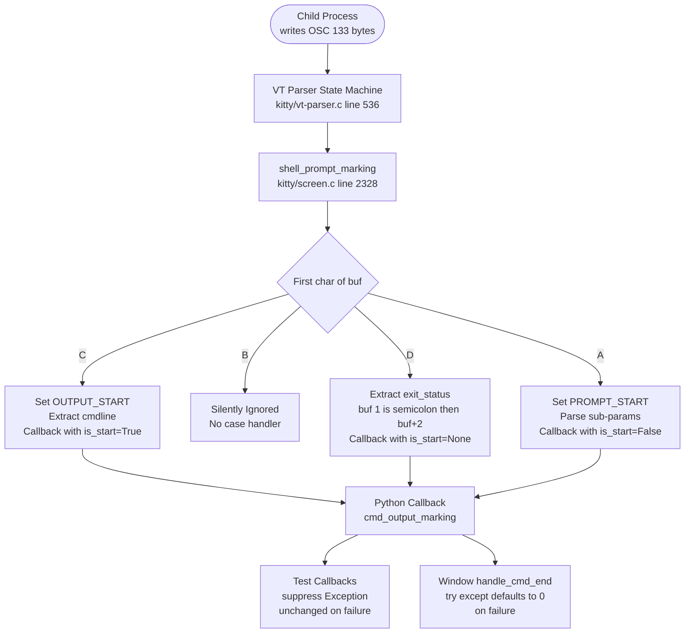

# Technical Specification

# 0. Agent Action Plan

## 0.1 Intent Clarification

### 0.1.1 Core Feature Objective

Based on the prompt, the Blitzy platform understands that the new feature requirement is to conduct a **read-only investigative analysis** of how the kitty terminal emulator handles OSC 133 escape sequences for shell integration command tracking. The investigation must answer specific technical questions and produce a comprehensive markdown document with findings, without modifying any existing repository files.

The specific requirements are:

- **OSC 133 Sequence Processing**: Determine what kitty does when a child process writes the OSC 133 marker sequence (`A`, `B`, `C` with cmdline, text, and `D` with exit code) to its output — specifically whether those escape sequences are still present in the visible output, or consumed by the terminal parser
- **Byte-Level Analysis**: Calculate the total byte length of a test payload containing all four OSC 133 markers plus visible text, and identify the precise byte offset where the `D;42` marker appears
- **Exit Code Variation Analysis**: Compare how byte lengths and positions change across different exit codes (`0`, `1`, `127`) and determine whether the exit code number's position shifts and by how much
- **Exit Code 99 Runtime Evidence**: Provide concrete runtime proof that exit code `99` is processed through the entire code path — not just that it is accepted, but what in the actual output or internal state proves the value made it through
- **Edge Case Handling**: Determine what values kitty records when the `D` marker contains a non-numeric exit code (`D;not_a_number`) or an empty exit code (`D;`)
- **Document Generation**: Create a markdown document named `kitty_815df1e210e0.md` in `blitzy/documentation/` containing all findings with rationale grounded in source code analysis

### 0.1.2 Special Instructions and Constraints

- **CRITICAL — Read-Only Constraint**: The user explicitly stated: "Please don't modify any repository files during the investigation." No existing source files in the kitty repository may be altered.
- **CRITICAL — Cleanup Requirement**: Any test scripts created for the investigation must be cleaned up when done.
- **SWE-AtlasQnA-Repo Rule**: The implementation rules require creating a markdown document named `<source_branch_name>.md` (i.e., `kitty_815df1e210e0.md`) that comprehensively answers the posed questions, with thinking/rationale, grounded in code-as-truth, placed in the `blitzy/documentation` directory.
- **Code-Based Truth**: Answers must be based on the actual codebase, not assumptions. Every claim must trace back to specific source files and line numbers.
- **No Other Code**: Besides the requested markdown document, no other code may be added to the repository.

### 0.1.3 Technical Interpretation

These feature requirements translate to the following technical implementation strategy:

- To **determine OSC 133 sequence consumption behavior**, we will trace the VT parser dispatch in `kitty/vt-parser.c` (line 536, `case 133:`) through to the `shell_prompt_marking()` function in `kitty/screen.c` (line 2328), and validate with runtime tests using kitty's own `Screen` and `parse_bytes` test infrastructure
- To **perform byte-level analysis**, we will construct exact byte sequences for each OSC 133 marker, calculate their individual and cumulative byte lengths, and verify offsets programmatically by feeding them through `parse_bytes` from `kitty_tests/__init__.py`
- To **compare exit code behavior**, we will run identical test payloads with exit codes 0, 1, 42, 99, and 127, measuring total byte lengths, D-marker offsets, and D-marker byte sizes across each
- To **prove exit code 99 processing**, we will observe the `Callbacks.last_cmd_exit_status` value after parsing, confirming the value `99` is recorded as an integer in the callback state — proving it traversed the complete path from VT parser → C `shell_prompt_marking` → Python `cmd_output_marking` callback
- To **investigate edge cases**, we will trace the C code's pointer arithmetic for the D marker (`buf[1] == ';' ? buf + 2 : ""`) and the Python-side exception handling in both the test `Callbacks` class (uses `suppress(Exception)`) and the production `Window` class (uses `try/except` defaulting to `0`)
- To **produce the deliverable**, we will create `blitzy/documentation/kitty_815df1e210e0.md` with structured findings, code references, and runtime evidence

## 0.2 Repository Scope Discovery

### 0.2.1 Comprehensive File Analysis

The investigation identified every file in the kitty repository involved in OSC 133 shell integration command tracking. Since this is a read-only investigation, no files will be modified — they are cataloged here as evidence sources for the analysis document.

**Core OSC 133 Processing Pipeline (C Layer)**

| File | Relevance | Key Lines/Functions |
|------|-----------|---------------------|
| `kitty/vt-parser.c` | VT parser entry point — dispatches OSC 133 to `shell_prompt_marking` | Line 536: `case 133:` dispatches to `shell_prompt_marking(self->screen, (char*)buf + i)` |
| `kitty/screen.c` | Contains `shell_prompt_marking()` — the core handler for A/B/C/D markers | Line 2328: switch on `buf[0]` for A, C, D; line 2316: `parse_prompt_mark()` for A sub-parameters |
| `kitty/screen.h` | Declares `shell_prompt_marking()` function signature | Line 231: `void shell_prompt_marking(Screen *self, char *buf)` |
| `kitty/data-types.h` | Defines `PromptKind` enum: `UNKNOWN_PROMPT_KIND`, `PROMPT_START`, `SECONDARY_PROMPT`, `OUTPUT_START` | Line 230: typedef enum, line 236: `PromptKind prompt_kind : 2` in line attributes |
| `kitty/history.c` | Pager history search for `\x1b]133;C\x1b\\` marker when extracting command output | Line 475: `reverse_find(buf, sz, "\x1b]133;C\x1b\\")` |

**Python Callback and Window Layer**

| File | Relevance | Key Lines/Functions |
|------|-----------|---------------------|
| `kitty/window.py` | Production `cmd_output_marking` callback and `handle_cmd_end` — real exit code handling with `try/except → 0` default | Line 1453: `cmd_output_marking()`, line 1408: `handle_cmd_end()`, line 1413: `int(exit_status)` with except → 0 |
| `kitty/window.py` | `decode_cmdline()` — parses `cmdline=X` and `cmdline_url=X` parameters from C marker | Line 225: `decode_cmdline(x)` |
| `kitty/shell_integration.py` | Shell environment setup — injects integration scripts for Bash, Zsh, Fish | Functions: `setup_bash_env()`, `setup_zsh_env()`, `setup_fish_env()`, `modify_shell_environ()` |

**Shell Integration Scripts (OSC 133 Emitters)**

| File | Relevance | Key Sequences Emitted |
|------|-----------|----------------------|
| `shell-integration/bash/kitty.bash` | Bash shell integration — emits A, C, D markers | Line 208: `printf "\e]133;C;cmdline=%q\a"`, line 239: `\e]133;D;\$?\a\e]133;A\a` |
| `shell-integration/zsh/kitty-integration` | Zsh shell integration — emits A, C, D markers with status tracking | Line 145: `\e]133;D;$cmd_status\a`, line 218: `\e]133;C;cmdline=%q\a` |
| `shell-integration/fish/vendor_conf.d/kitty-shell-integration.fish` | Fish shell integration — emits A, C, D markers | Line 91: `\e]133;C;cmdline_url=%s\a`, line 96: `\e]133;D;$status\a` |

**Test Infrastructure**

| File | Relevance | Key Functions |
|------|-----------|---------------|
| `kitty_tests/__init__.py` | Test `Callbacks` class with `cmd_output_marking` using `suppress(Exception)` — exit status unchanged on parse failure | Line 72: `cmd_output_marking()`, line 80: `with suppress(Exception): self.last_cmd_exit_status = int(data)` |
| `kitty_tests/__init__.py` | `parse_bytes()` — feeds raw bytes through the VT parser for testing | Line 30: `parse_bytes(screen, data, dump_callback)` |
| `kitty_tests/screen.py` | Existing tests for prompt marking — validates `cmd_output` extraction including ANSI mode | Line 1056: `test_prompt_marking()`, line 1124: validates ANSI output contains `\x1b]133;C\x1b\\` |
| `kitty_tests/shell_integration.py` | Integration-level tests for shell startup and prompt behavior | Full shell lifecycle tests for Bash, Zsh, Fish |

**Supporting Files**

| File | Relevance |
|------|-----------|
| `kitty/rc/get_text.py` | Remote control `get-text` command — supports `last_cmd_output`, `first_cmd_output_on_screen` extents |
| `kitty/boss.py` | Application boss — coordinates window lifecycle and shell integration |
| `kitty/child.py` | Child process management — interacts with shell integration environment setup |
| `kitty/options/definition.py` | Configuration option definitions including `shell_integration` |

### 0.2.2 New File Requirements

Since this is a read-only investigation, only one new file is required:

- **CREATE**: `blitzy/documentation/kitty_815df1e210e0.md` — Comprehensive answers to all OSC 133 investigation questions, with code-traced rationale, runtime evidence, byte-level analysis, and edge case findings

### 0.2.3 Web Search Research Conducted

No web search was required for this investigation. All questions were answerable through direct source code analysis and runtime testing using kitty's built-in test infrastructure (`kitty_tests`). The codebase itself serves as the authoritative source of truth for how OSC 133 sequences are processed.

## 0.3 Dependency Inventory

### 0.3.1 Private and Public Packages

This investigation is a read-only analysis task that produces only a markdown document. No new packages or dependencies are required. For reference, the relevant project dependencies used in the analysis infrastructure are:

| Package Registry | Name | Version | Purpose |
|-----------------|------|---------|---------|
| PyPI (built-in) | Python | >=3.8 (project uses 3.12.3 in this environment) | Runtime for test infrastructure and kitty Python layer |
| C built-in | fast_data_types.so | Compiled from kitty C sources | Native extension providing `Screen`, `parse_bytes` and VT parser |
| PyPI (stdlib) | sys | stdlib | `sys.maxsize` used as sentinel for unset exit status in test Callbacks |
| PyPI (stdlib) | contextlib | stdlib | `suppress(Exception)` used in test `Callbacks.cmd_output_marking` |
| PyPI (stdlib) | shlex | stdlib | `shlex_split()` used by `decode_cmdline()` in `kitty/window.py` |

### 0.3.2 Dependency Updates

No dependency updates are applicable. This task creates a single markdown documentation file and does not alter any source code, build configuration, or dependency manifests.

## 0.4 Integration Analysis

### 0.4.1 Existing Code Touchpoints

Since this is a read-only investigation, no code touchpoints are modified. However, the analysis document must accurately describe the following integration chain — the complete code path that OSC 133 sequences traverse:

**Stage 1 — VT Parser Dispatch (`kitty/vt-parser.c`, line 536)**

The VT parser state machine receives raw bytes from the child PTY. When it identifies an OSC escape sequence with code `133`, it extracts the payload (everything after `133;`) and calls `shell_prompt_marking(self->screen, (char*)buf + i)` where `buf + i` points to the first character of the payload (e.g., `A`, `B`, `C;cmdline=...`, or `D;42`).

**Stage 2 — Shell Prompt Marking (`kitty/screen.c`, line 2328)**

The `shell_prompt_marking()` function dispatches on the first character of the buffer:

- **`A` (Prompt Start)**: Sets `prompt_kind = PROMPT_START` on the current line's attributes. Parses optional sub-parameters (`;k=s` for secondary prompt, `;redraw=0`, `;special_key=1`). Fires `CALLBACK("cmd_output_marking", "O", Py_False)`.
- **`B` (Prompt End / Command Start)**: **Not handled** — there is no `case 'B':` in the switch statement. The `B` marker is silently ignored.
- **`C` (Command Output Start)**: Sets `prompt_kind = OUTPUT_START`. Extracts the cmdline parameter if present (`strstr(buf + 1, ";cmdline") == buf + 1`). Fires `CALLBACK("cmd_output_marking", "OO", Py_True, c)`.
- **`D` (Command End)**: Extracts exit status string via `buf[1] == ';' ? buf + 2 : ""`. Fires `CALLBACK("cmd_output_marking", "Os", Py_None, exit_status)`.

**Stage 3 — Python Callback Layer**

The callback reaches different handlers depending on context:

- **Test Infrastructure** (`kitty_tests/__init__.py`, line 72): `Callbacks.cmd_output_marking()` uses `with suppress(Exception): self.last_cmd_exit_status = int(data)` — invalid values leave the status unchanged at `sys.maxsize`.
- **Production Window** (`kitty/window.py`, line 1408): `Window.handle_cmd_end()` uses `try: self.last_cmd_exit_status = int(exit_status)` / `except Exception: self.last_cmd_exit_status = 0` — invalid values default to `0`.

**Stage 4 — Command Output Extraction (`kitty/screen.c`, line 3527)**

The `find_cmd_output()` function walks line attributes looking for `OUTPUT_START` boundaries to extract text between `C` and the next `A` marker. When extracting as ANSI (`as_ansi=True`), the `\x1b]133;C\x1b\\` marker is included in the extracted output. The `pagerhist_as_bytes()` function in `kitty/history.c` (line 475) uses `reverse_find()` to locate the `C` marker in scrollback for pager history extraction.

### 0.4.2 Integration Chain Diagram

## 0.5 Technical Implementation

### 0.5.1 File-by-File Execution Plan

This investigation requires creating exactly one file. No existing files are modified.

**Group 1 — Deliverable Document**

- **CREATE**: `blitzy/documentation/kitty_815df1e210e0.md` — The comprehensive investigation document answering all OSC 133 questions. This file must contain:
  - Analysis of OSC 133 sequence consumption behavior with code references
  - Byte-level breakdown tables for test payloads with all marker types
  - Exit code comparison tables for codes 0, 1, 42, 99, and 127
  - Runtime evidence proving exit code 99 traverses the full code path
  - Edge case analysis for `D;not_a_number` and `D;` (empty) with code-traced rationale
  - Differences between test Callbacks and production Window class behavior

### 0.5.2 Implementation Approach

The document will be structured to answer each of the user's questions in order, with each answer grounded in specific source code locations and verified through runtime testing:

- **Establish factual foundation** by citing the exact C functions and line numbers where OSC 133 parsing occurs (`kitty/vt-parser.c:536`, `kitty/screen.c:2328`)
- **Prove sequence consumption** by showing that the Screen's visible text contains only "some text" after parsing a payload with all four OSC markers — the ESC, BEL, and "133" literal substrings are absent from the screen output
- **Quantify byte-level details** using precise calculations: each OSC marker is `\x1b]133;X\x07` (8 bytes base), with the C marker adding cmdline parameter bytes and the D marker adding exit code digit bytes
- **Compare exit codes** by running identical prefixes with varying D markers and tabulating total lengths, D marker offsets (always 50 for the standard test prefix), and D marker byte sizes (10 for single-digit, 11 for two-digit, 12 for three-digit)
- **Demonstrate runtime evidence for exit code 99** by showing `Callbacks.last_cmd_exit_status == 99` after parsing, proving the value traversed: VT parser → C `shell_prompt_marking` case 'D' → pointer arithmetic `buf + 2` yielding "99" → Python `int("99")` → stored as integer 99
- **Analyze edge cases** by tracing the C pointer arithmetic (`buf[1] == ';' ? buf + 2 : ""`) and Python exception handling (`suppress(Exception)` in test vs `try/except → 0` in production)

### 0.5.3 Key Investigation Findings Summary

The following findings were established through runtime tests using kitty's compiled `fast_data_types` module and are documented in the deliverable:

| Question | Finding |
|----------|---------|
| Are OSC sequences present in output? | No. The VT parser consumes them. Screen text contains only visible characters. |
| Total byte length (with D;42)? | 61 bytes for the standard test payload |
| D;42 marker byte offset? | Byte offset 50 (after 8+8+25+9 bytes of preceding markers and text) |
| Does D marker position shift across exit codes? | No. The D marker always starts at offset 50. Only total length changes. |
| How much does total length change? | 1-digit codes: 60 bytes, 2-digit: 61 bytes, 3-digit: 62 bytes (±1 byte per digit) |
| Runtime evidence for exit code 99? | `Callbacks.last_cmd_exit_status` equals integer `99` after parsing |
| What is recorded for D;not_a_number? | Test: unchanged (`sys.maxsize`). Production Window: defaults to `0` |
| What is recorded for D; (empty)? | Test: unchanged (`sys.maxsize`). Production Window: defaults to `0` |

## 0.6 Scope Boundaries

### 0.6.1 Exhaustively In Scope

- **Deliverable document**: `blitzy/documentation/kitty_815df1e210e0.md`
- **Source files analyzed** (read-only, for evidence and rationale):
  - `kitty/vt-parser.c` — VT parser OSC 133 dispatch (line 536)
  - `kitty/screen.c` — `shell_prompt_marking()` function (line 2328), `parse_prompt_mark()` (line 2316), `find_cmd_output()` (line 3527)
  - `kitty/screen.h` — Function declaration (line 231)
  - `kitty/data-types.h` — `PromptKind` enum (line 230), `prompt_kind` line attribute (line 236)
  - `kitty/history.c` — Pager history `\x1b]133;C\x1b\\` reverse search (line 475)
  - `kitty/window.py` — `handle_cmd_end()` (line 1408), `cmd_output_marking()` (line 1453), `decode_cmdline()` (line 225)
  - `kitty_tests/__init__.py` — Test `Callbacks` class (line 47), `parse_bytes()` (line 30)
  - `kitty_tests/screen.py` — `test_prompt_marking()` (line 1056)
  - `shell-integration/bash/kitty.bash` — Bash OSC 133 emitters (lines 208, 239)
  - `shell-integration/zsh/kitty-integration` — Zsh OSC 133 emitters (lines 145, 218)
  - `shell-integration/fish/vendor_conf.d/kitty-shell-integration.fish` — Fish OSC 133 emitters (lines 91, 96)
  - `kitty/shell_integration.py` — Shell environment setup

### 0.6.2 Explicitly Out of Scope

- **Modification of any existing repository files** — explicitly prohibited by user
- **Creation of any code files** — only a markdown document is created per the SWE-AtlasQnA-Repo rule
- **Analysis of non-OSC-133 escape sequences** — only the OSC 133 family (A/B/C/D markers) is investigated
- **Performance benchmarking** of the VT parser
- **GUI/rendering behavior** — this investigation focuses on the parsing and callback pipeline, not on how markers affect visual rendering
- **SSH integration specifics** — while `shell-integration/ssh/` exists, the OSC 133 investigation focuses on local shell integration mechanics
- **Other kittens or remote control commands** — only the `get-text` command's `cmd_output` extent is tangentially relevant

## 0.7 Rules for Feature Addition

### 0.7.1 User-Specified Rules

- **SWE-AtlasQnA-Repo Rule**: Create a new markdown document named `kitty_815df1e210e0.md` that comprehensively answers the questions posed in the prompt. Provide thinking/rationale behind the answers. Do not make assumptions — base answers on the code as the truth. Do not modify any existing files in the source repository. Do not add any other code in the source repository besides the requested document. Place the generated document in the `blitzy/documentation` directory.
- **No Repository Modification**: "Please don't modify any repository files during the investigation" — this is a user-stated constraint that applies to all existing files.
- **Cleanup Requirement**: "Clean up any test scripts when done" — any temporary scripts used for investigation must be removed.

### 0.7.2 Investigation-Specific Conventions

- All claims in the document must cite specific file paths and line numbers from the kitty repository
- Runtime evidence must be produced by feeding bytes through `parse_bytes()` using kitty's actual compiled `Screen` and `Callbacks` test infrastructure
- Byte-level calculations must be verified programmatically, not computed manually
- The difference between test `Callbacks` behavior and production `Window` behavior must be clearly distinguished when discussing edge cases

## 0.8 References

### 0.8.1 Repository Files and Folders Searched

The following files and folders were inspected during the investigation to derive all conclusions:

**Core C Source Files**

| File Path | Purpose of Inspection |
|-----------|----------------------|
| `kitty/vt-parser.c` | Traced OSC 133 dispatch path at line 536, confirmed `shell_prompt_marking` call |
| `kitty/screen.c` | Analyzed `shell_prompt_marking()` at line 2328 — A/C/D handlers and B omission; `parse_prompt_mark()` at line 2316; `find_cmd_output()` at line 3527 |
| `kitty/screen.h` | Confirmed `shell_prompt_marking` function declaration at line 231 |
| `kitty/data-types.h` | Verified `PromptKind` enum values at line 230 and `prompt_kind` line attribute at line 236 |
| `kitty/history.c` | Found `\x1b]133;C\x1b\\` reverse search in `pagerhist_as_bytes()` at line 475 |

**Python Source Files**

| File Path | Purpose of Inspection |
|-----------|----------------------|
| `kitty/window.py` | Analyzed `handle_cmd_end()` (line 1408), `cmd_output_marking()` (line 1453), `decode_cmdline()` (line 225), `last_cmd_exit_status` initialization (line 572) |
| `kitty/shell_integration.py` | Reviewed shell environment setup functions |
| `kitty/rc/get_text.py` | Confirmed `cmd_output` extent usage for remote control text extraction |

**Test Files**

| File Path | Purpose of Inspection |
|-----------|----------------------|
| `kitty_tests/__init__.py` | Analyzed test `Callbacks` class (line 47), `parse_bytes()` (line 30), `cmd_output_marking` with `suppress(Exception)` (line 72), `clear()` resetting to `sys.maxsize` (line 106) |
| `kitty_tests/screen.py` | Reviewed `test_prompt_marking()` (line 1056) including ANSI output verification at line 1124 |
| `kitty_tests/shell_integration.py` | Reviewed shell integration test infrastructure |

**Shell Integration Scripts**

| File Path | Purpose of Inspection |
|-----------|----------------------|
| `shell-integration/bash/kitty.bash` | Identified OSC 133 emission at lines 208 and 239 |
| `shell-integration/zsh/kitty-integration` | Identified OSC 133 emission at lines 145 and 218, status tracking at lines 30-31 |
| `shell-integration/fish/vendor_conf.d/kitty-shell-integration.fish` | Identified OSC 133 emission at lines 91 and 96 |

**Project Configuration**

| File Path | Purpose of Inspection |
|-----------|----------------------|
| `pyproject.toml` | Verified Python version requirement `>=3.8` |
| `setup.py` | Reviewed build system for C extension compilation |

### 0.8.2 Attachments

No attachments were provided for this project.

### 0.8.3 Runtime Test Sessions

All runtime tests were executed using the kitty project's own compiled C extension (`kitty/fast_data_types.so`) and test infrastructure (`kitty_tests/__init__.py`), feeding byte sequences through `parse_bytes()` and inspecting `Screen` and `Callbacks` state. Tests covered:

- Standard OSC 133 A/B/C/D sequence processing and screen state verification
- Byte-level offset calculations for exit codes 0, 1, 42, 99, and 127
- Exit code 99 runtime evidence (final `last_cmd_exit_status == 99`)
- Edge cases: `D;not_a_number` and `D;` (empty) with both test and production code path analysis
- OSC 133;B silent ignoring verification
- D marker without preceding C marker (guard check)
- Sequential command processing with different exit codes

