# Technical Specification

# 0. Agent Action Plan

## 0.1 Intent Clarification

Based on the prompt, the Blitzy platform understands that the new feature requirement is to produce a comprehensive investigative document — not to modify the repository — that traces the live runtime behavior of Kitty's terminal interaction pipeline from the moment mixed input (keystrokes, paste bursts, resize signals, shell-integration markers) arrives to the moment the interface settles. The repository itself must remain unchanged, and any temporary scripts used for observation must be cleaned up afterward.

### 0.1.1 Core Feature Objective

- **Runtime pipeline trace**: Map the exact journey a surge of raw bytes travels once it enters the system, identifying every thread, mutex, buffer, and dispatch point it touches.
- **Concurrency orchestration**: Explain how three concurrently-arriving event types — keyboard input, PTY output from a child, and window-resize signals — are prioritized, ordered, and serialized so that the screen state stays coherent.
- **Shell-integration interleaving**: Describe how OSC 133 prompt-boundary markers and OSC 7 CWD notifications, which arrive inline with normal text in the child PTY stream, are separated and dispatched without corrupting screen or command context.
- **Backpressure and degraded conditions**: Document the system's behavior when the VT parser buffer is saturated, the I/O thread cannot drain data fast enough, or a remote connection introduces latency spikes.
- **Pause/resume transitions**: Clarify what happens to buffered and in-flight data when a session is paused (e.g., `Ctrl-Z` / `SIGTSTP`) and then resumed (`fg`).
- **Document format**: A single markdown file named `kitty_815df1e210e0.md`, placed in `blitzy/documentation/`, containing the full analysis.

### 0.1.2 Implicit Requirements

- The document must be code-grounded: every claim must trace to specific source files, functions, and line ranges in the repository at commit `815df1e21`.
- Because the environment lacks a C compiler and Go toolchain, runtime observation will rely on source-level analysis rather than instrumented builds.
- "Temporary scripts may be used for observation" means helper Python scripts are acceptable for static analysis but must be removed afterward.
- The user is onboarding, so the document should be written to educate, using clear headings, diagrams, and end-to-end walkthrough narrative.

### 0.1.3 Special Instructions and Constraints

- **Repository immutability**: No existing file in the Kitty source tree may be modified (per the SWE-AtlasQnA-Repo rule).
- **Output location**: The generated document must reside at `blitzy/documentation/kitty_815df1e210e0.md` in the destination repository.
- **Evidence-based answers**: "Do not make assumptions, base your answers on the code as the truth."
- **Thinking/rationale**: "Provide thinking / rationale behind the answers."
- **Cleanup**: Any temporary analysis artifacts must be deleted before completion.

### 0.1.4 Technical Interpretation

These requirements translate to the following technical implementation strategy:

- To trace the input pipeline end-to-end, we will read and cross-reference the C sources `kitty/child-monitor.c` (I/O thread, main loop, parse_input), `kitty/vt-parser.c` (VT state machine, consume_input, run_worker), `kitty/keys.c` (keyboard event dispatch), `kitty/glfw.c` (GLFW callbacks, resize handling), `kitty/screen.c` (screen model updates, shell prompt marking, paused rendering), `kitty/loop-utils.c` (wakeup, signal handling), and `glfw/main_loop.h` (platform event loop).
- To explain concurrency orchestration, we will document the three-thread architecture (Main, I/O "KittyChildMon", Talk "KittyPeerMon"), the mutex hierarchy (`children_mutex`, `screen_mutex`, `talk_mutex`, parser `lock`), and the wakeup-pipe / eventfd signaling mechanism.
- To explain shell-integration interleaving, we will trace the OSC 133 path from `dispatch_osc()` in `vt-parser.c` through `shell_prompt_marking()` in `screen.c` and the Python `cmd_output_marking` callback in `window.py`.
- To explain backpressure, we will analyze the 1 MiB parser buffer (`BUF_SZ`), the `vt_parser_has_space_for_input()` gate, the POLLIN suppression in the I/O loop, and the `write_buf` overflow guard (100 MiB cap).
- To deliver the output, we will create `blitzy/documentation/kitty_815df1e210e0.md` as a new file without touching any existing repository files.

## 0.2 Repository Scope Discovery

### 0.2.1 Comprehensive File Analysis

The investigation requires reading (not modifying) the following repository files to build the narrative. Every file below was discovered through systematic folder traversal and confirmed with `read_file` or `grep`.

**Core Input/Output Pipeline (C layer)**

| File | Purpose in Investigation |
|------|------------------------|
| `kitty/child-monitor.c` | Three-thread architecture, `io_loop`, `parse_input`, `read_bytes`, `write_to_child`, `process_global_state`, render scheduling, `input_delay`/`repaint_delay` timing |
| `kitty/vt-parser.c` | VT state machine (`PS` struct), `consume_input`, `consume_normal`, `consume_esc`, `consume_csi`, `dispatch_osc`, `dispatch_apc`, `run_worker`, buffer management (`BUF_SZ`), backpressure (`vt_parser_has_space_for_input`) |
| `kitty/vt-parser.h` | `Parser`, `ParseData` structs, thread-safe API surface |
| `kitty/screen.c` | Screen model updates, `shell_prompt_marking` (OSC 133), `screen_pause_rendering` (PENDING_MODE 2026), `write_escape_code_to_child`, bracketed paste, mode management |
| `kitty/screen.h` | `Screen` struct definition: `write_buf`, `paused_rendering`, `vt_parser`, `prompt_settings`, `key_encoding_flags` |
| `kitty/keys.c` | `on_key_input` — GLFW key event to encoded escape sequence, `schedule_write_to_child` dispatch |
| `kitty/mouse.c` | Mouse event processing, selection, URL click |
| `kitty/loop-utils.c` | `init_loop_data`, `wakeup_loop`, `read_signals`, `drain_fd` — signal and wakeup pipe infrastructure |
| `kitty/loop-utils.h` | `LoopData` struct, `self_pipe`, signalfd/eventfd platform selection |
| `kitty/state.c` / `kitty/state.h` | `global_state`, OS window / tab / window structures, render data pointers |
| `kitty/modes.h` | Terminal mode constants: `PENDING_MODE`, `BRACKETED_PASTE`, `DECARM`, `FOCUS_TRACKING` |
| `kitty/control-codes.h` | Control code constants including `PENDING_MODE 2026` |
| `kitty/data-types.h` | Core type definitions, mutex macros, `screen_mutex`, `children_mutex` |

**GLFW Platform Layer**

| File | Purpose in Investigation |
|------|------------------------|
| `kitty/glfw.c` | `key_callback`, `live_resize_callback`, `framebuffer_size_callback`, `update_os_window_viewport`, `request_tick_callback` |
| `glfw/main_loop.h` | `_glfwPlatformRunMainLoop` — event loop driving `tick_callback` on wakeup |
| `glfw/input.c` | `_glfwInputKeyboard` — GLFW key event dispatch to window callback |
| `glfw/window.c` | `_glfwInputWindowSize`, `_glfwInputFramebufferSize` |
| `glfw/wl_window.c` / `glfw/x11_window.c` | Platform-specific resize and event dispatch |
| `glfw/xkb_glfw.c` | XKB keymap, modifier, and compose handling |

**Python Orchestration Layer**

| File | Purpose in Investigation |
|------|------------------------|
| `kitty/boss.py` | `Boss.__init__`, `ChildMonitor` creation, `on_child_death`, `on_window_resize`, `peer_message_received` |
| `kitty/window.py` | `Window.paste_text`, `Window.paste_bytes`, `encoded_key`, shell integration callbacks (`cmd_output_marking`) |
| `kitty/child.py` | `Child.fork` — PTY creation, `schedule_write_to_child`, `send_signal_for_key` |
| `kitty/main.py` | `_run_app` — application lifecycle, `child_monitor.main_loop()` invocation |
| `kitty/shell_integration.py` | `modify_shell_environ` — environment mutation for bash/zsh/fish |
| `kitty/keys.py` | Python-level key mapping and dispatch |
| `kitty/key_encoding.py` | Kitty keyboard protocol encoding |

**Shell Integration Scripts**

| File | Purpose in Investigation |
|------|------------------------|
| `shell-integration/bash/kitty.bash` | OSC 133 A/C/D marker emission, PS0/PS1/PS2 wrapping, CWD reporting |
| `shell-integration/zsh/kitty.zsh` | Zsh prompt marking, ZDOTDIR redirection |
| `shell-integration/fish/vendor_conf.d/kitty-shell-integration.fish` | Fish prompt marking |

### 0.2.2 New File Requirements

A single new file must be created:

| File | Purpose |
|------|---------|
| `blitzy/documentation/kitty_815df1e210e0.md` | Comprehensive markdown document answering all questions about the terminal interaction pipeline |

No existing files are modified. No new test files, configuration files, or source modules are needed.

### 0.2.3 Integration Point Discovery

The document must trace the following cross-component integration points:

- **GLFW → keys.c**: Platform key events arrive via `_glfwInputKeyboard` → `key_callback` (in `glfw.c`) → `on_key_input` (in `keys.c`), which calls `schedule_write_to_child` to enqueue encoded bytes into the `Screen.write_buf`.
- **I/O Thread → VT Parser**: `io_loop` in `child-monitor.c` calls `read_bytes`, which calls `vt_parser_create_write_buffer` / `vt_parser_commit_write` to inject bytes from the child PTY into the parser's 1 MiB ring buffer.
- **VT Parser → Screen Model**: `run_worker` (in `vt-parser.c`) calls `consume_input`, which dispatches to `screen_draw_text`, `dispatch_csi`, `dispatch_osc` (including OSC 133 → `shell_prompt_marking`).
- **Main Thread → Render**: `process_global_state` calls `parse_input` (which invokes `do_parse` → `run_worker`), then calls `render` if input was read.
- **Resize → PTY → Shell**: `live_resize_callback` → `update_os_window_viewport` → `call_boss(on_window_resize)` → Python-side reflow → `resize_pty` (ioctl `TIOCSWINSZ`) → shell receives `SIGWINCH`.
- **Wakeup path**: `wakeup_io_loop` writes to an eventfd/pipe, causing `poll()` in `io_loop` to unblock. Similarly, `wakeup_main_loop` posts an event to the GLFW event loop, causing `_glfwPlatformWaitEvents` to return.

## 0.3 Dependency Inventory

### 0.3.1 Key Packages Relevant to This Analysis

This task is a documentation-only exercise; no package installation or dependency changes are needed. The table below catalogs the dependencies that are architecturally relevant to the terminal interaction pipeline being investigated.

| Registry | Package | Version | Purpose in Pipeline |
|----------|---------|---------|---------------------|
| System (C) | Python | ≥ 3.8 (pyproject.toml) | Embedded CPython runtime for Boss, Window, Config layers |
| System (C) | GLFW (vendored fork) | 3.4-custom | Platform windowing, event loop, key/mouse/resize callbacks |
| System (C) | FreeType | ≥ 2.x | Glyph rasterization for GPU rendering pipeline |
| System (C) | OpenGL | ≥ 3.3 | GPU-accelerated rendering of terminal content |
| Go modules | Go | 1.22 (go.mod) | `kitten` binary for CLI tools, SSH integration, remote control |
| Python | kitty.fast_data_types | built-in (C extension) | Bridge between Python layer and C core (Screen, ChildMonitor, Parser types) |
| Shell | bash/zsh/fish scripts | N/A | Shell integration scripts emitting OSC 133, OSC 7, DECSCUSR |

### 0.3.2 Dependency Updates

No dependency updates are required. This task creates a single new markdown document without modifying any source code, build files, or configuration files.

### 0.3.3 Import and Reference Notes

The analysis document will reference internal imports across the C/Python boundary:

- Python `kitty.fast_data_types` exposes `ChildMonitor`, `Screen`, `Parser`, `KeyEvent`, `encode_key_for_tty`, and other C-implemented types used by `boss.py`, `window.py`, and `keys.py`.
- The C layer references Python objects via `call_boss()` macro (defined in `kitty/data-types.h`), which invokes methods on the global `Boss` singleton.
- Shell integration scripts communicate with the terminal solely through escape sequences (OSC, CSI, DCS) — no direct API coupling.

## 0.4 Integration Analysis

### 0.4.1 Existing Code Touchpoints

Because this task produces only a new documentation file, "touchpoints" here means the code paths whose behavior the document must accurately describe. These are the integration seams the narrative must cover.

**Thread Boundary Crossings**

| Crossing | Source → Target | Mechanism | File(s) |
|----------|----------------|-----------|---------|
| Key event → child write buffer | Main Thread → (via `schedule_write_to_child`) → I/O Thread reads `write_buf` | `screen_mutex(lock, write)` protects `Screen.write_buf`; `wakeup_io_loop` nudges I/O thread | `kitty/keys.c:259`, `kitty/child-monitor.c:323–370` |
| PTY bytes → VT parser buffer | I/O Thread (`read_bytes`) → Parser buffer | `pthread_mutex_t lock` inside `PS` struct; `vt_parser_create_write_buffer` / `vt_parser_commit_write` | `kitty/child-monitor.c:1337–1357`, `kitty/vt-parser.c:1449–1470` |
| I/O thread wakeup → Main thread | I/O Thread → Main Thread | `wakeup_main_loop` writes to eventfd; GLFW loop unblocks | `kitty/child-monitor.c:1562–1569`, `kitty/loop-utils.c:107–121` |
| Parse + Render cycle | Main Thread | `process_global_state` → `parse_input` → `do_parse` → `run_worker` → `render` | `kitty/child-monitor.c:1224–1262` |
| Signal delivery | Kernel → I/O Thread signal fd | `signalfd` / self-pipe; `read_signals` → `handle_signal` callback | `kitty/loop-utils.c:10–30`, `kitty/child-monitor.c:1519–1528` |
| Remote control messages | Talk Thread → Main Thread | `talk_mutex`-protected message queue; drained in `parse_input` | `kitty/child-monitor.c:500–520` |

**Shell Integration Data Flow**

| Protocol | Shell Emits | VT Parser Routes To | Screen/Window Handles |
|----------|-------------|--------------------|-----------------------|
| OSC 133 ;A | `\e]133;A\a` (prompt start) | `dispatch_osc` → case 133 | `shell_prompt_marking(screen, "A...")` → sets `line_attrs[y].prompt_kind = PROMPT_START` |
| OSC 133 ;C | `\e]133;C\a` (command start) | `dispatch_osc` → case 133 | `shell_prompt_marking(screen, "C...")` → sets `prompt_kind = OUTPUT_START`, fires `cmd_output_marking(True, cmdline)` callback |
| OSC 133 ;D | `\e]133;D;exit_status\a` | `dispatch_osc` → case 133 | `shell_prompt_marking(screen, "D;...")` → fires `cmd_output_marking(None, exit_status)` callback |
| OSC 7 | `\e]7;kitty-shell-cwd://...\a` | `dispatch_osc` → case 7 | `process_cwd_notification(screen, 7, data)` → stores in `screen->last_reported_cwd` |

**Resize Signal Propagation**

```mermaid
flowchart LR
    GLFW["GLFW Backend<br/>(wl/x11/cocoa)"] -->|"size callback"| GlfwC["kitty/glfw.c<br/>live_resize_callback"]
    GlfwC -->|"mark live_resize<br/>debounce"| PendResize["global_state<br/>.has_pending_resizes"]
    PendResize -->|"process_pending_resizes<br/>on main tick"| UpdateVP["update_os_window_viewport<br/>call_boss(on_window_resize)"]
    UpdateVP -->|"Python reflow"| Boss["boss.py<br/>on_window_resize"]
    Boss -->|"resize_pty ioctl"| PTY["TIOCSWINSZ<br/>→ SIGWINCH to child"]
    PTY -->|"shell redraws prompt"| ShellRedraw["Shell re-emits<br/>OSC 133 markers"]
```

### 0.4.2 Backpressure and Buffer Saturation Points

| Buffer | Size | Saturation Behavior | File Reference |
|--------|------|---------------------|----------------|
| VT Parser ring buffer | 1 MiB (`BUF_SZ = 1024*1024`) | When `read.sz + write.pending >= BUF_SZ`, `vt_parser_has_space_for_input` returns `false` → I/O loop clears `POLLIN` for that child fd → PTY backs up → kernel buffers fill → child blocks on write | `kitty/vt-parser.c:18`, `kitty/child-monitor.c:1501` |
| Screen write buffer | Starts at `BUFSIZ`, grows to 100 MiB cap | If `write_buf_used + sz > 100 * 1024 * 1024`, data is discarded with an error log | `kitty/child-monitor.c:340–345` |
| Peer read buffer | 64 KiB hard cap | Message ignored with error if peer sends > 64 KiB | `kitty/child-monitor.c` peer read logic |

### 0.4.3 Timing and Scheduling Parameters

| Parameter | Default | Effect on Pipeline |
|-----------|---------|-------------------|
| `input_delay` | Configurable (OPT macro) | I/O thread defers waking main loop until this interval elapses since last wakeup, batching rapid input bursts into a single parse/render cycle |
| `repaint_delay` | Configurable (OPT macro) | `render()` skips frame output if called sooner than this interval after last render, preventing excessive GPU work |
| `resize_debounce_time.on_pause` | Configurable | During live resize, delays viewport update until user pauses resizing |
| `resize_debounce_time.on_end` | Configurable | After resize stream ends, waits this long before final reflow |
| `paused_rendering` timeout | 2000 ms default | PENDING_MODE (2026) snapshots screen state; auto-expires after timeout to prevent permanent freeze |

## 0.5 Technical Implementation

### 0.5.1 File-by-File Execution Plan

This task produces a single deliverable file. No source code modifications are made.

**Group 1 — Deliverable**

| Action | File | Description |
|--------|------|-------------|
| CREATE | `blitzy/documentation/kitty_815df1e210e0.md` | Comprehensive markdown document answering all pipeline behavior questions. Covers: three-thread architecture, input entry points, VT parser state machine, shell integration marker dispatch, backpressure handling, resize debouncing, pause/resume transitions, and end-to-end walkthrough. |

**Group 2 — Temporary Analysis Artifacts (create then delete)**

| Action | File | Description |
|--------|------|-------------|
| CREATE → DELETE | Any helper scripts in `/tmp/` | If needed for static grep/analysis — must be removed before completion |

### 0.5.2 Implementation Approach

The document will be structured as a layered narrative, building from foundational architecture to specific scenarios:

- **Establish the three-thread model** by describing the I/O thread (`io_loop` in `child-monitor.c`), the Main/GLFW thread (`process_global_state` → `parse_input` → `render`), and the Talk thread (`talk_loop`), with their mutex and wakeup-pipe interconnections.
- **Trace a keystroke end-to-end**: GLFW callback → `key_callback` → `on_key_input` → `encode_glfw_key_event` → `schedule_write_to_child` → `Screen.write_buf` → I/O thread `write_to_child` → PTY fd → child process.
- **Trace PTY output end-to-end**: child writes to PTY → I/O thread `read_bytes` → `vt_parser_create_write_buffer` / `vt_parser_commit_write` → `wakeup_main_loop` → main thread `parse_input` → `do_parse` → `run_worker` → `consume_input` → VT state machine dispatches to screen operations → `render`.
- **Explain shell integration interleaving**: OSC 133 markers arrive inline in the same byte stream as normal text. The VT parser's `dispatch_osc` function (case 133) calls `shell_prompt_marking` which sets `line_attrs.prompt_kind` on the current line and fires Python callbacks. This happens synchronously within the parse cycle, so prompt boundaries are tracked in lockstep with screen content.
- **Explain backpressure**: When the 1 MiB parser buffer is full, `vt_parser_has_space_for_input` returns false, causing the I/O thread to suppress `POLLIN` on that child's fd. This stops reading from the PTY, allowing kernel buffers to fill, which eventually blocks the child process's writes — a natural flow-control mechanism. When the main thread parses data and frees buffer space, `write_space_created` is set, the I/O thread is woken, and reading resumes.
- **Explain resize handling**: Window resize events are debounced through the `live_resize` mechanism. During an active resize, events are coalesced and the viewport is not updated until either the OS signals resize-complete or a debounce timeout fires. This prevents the shell from being flooded with SIGWINCH signals, which would cause excessive prompt redraws.
- **Explain pause/resume (SIGTSTP/SIGCONT)**: When a foreground process receives SIGTSTP, the shell sends it to the process group. The child stops writing to the PTY. The I/O thread's `poll()` will simply not receive POLLIN events for that fd. When resumed with `fg`, the child resumes writing, the I/O thread reads the data, and the normal parse cycle resumes. Buffered data in the kernel PTY buffer is preserved.
- **Explain PENDING_MODE (2026)**: Applications use `DECSET 2026` to pause rendering. `screen_pause_rendering` takes a snapshot of the current screen state (line buffer, cursor, color profile, selections) and sets an expiry timer (default 2 s). While paused, the GPU renders the frozen snapshot while the VT parser continues processing updates to the live screen buffer. When the application sends `DECRST 2026`, the pause ends and the GPU switches back to the live buffer. If the timer expires, the pause auto-cancels.

### 0.5.3 Document Structure Outline

The markdown document will contain the following sections:

- **Introduction** — Context and scope
- **Three-Thread Architecture** — I/O, Main, Talk threads with diagram
- **Input Entry Points** — How keystrokes, mouse events, and paste data enter the system
- **The I/O Thread: Reading from Child Processes** — `read_bytes`, parser buffer management, backpressure
- **The VT Parser State Machine** — States (`VTE_NORMAL`, `VTE_ESC`, `VTE_CSI`, `VTE_OSC`, etc.), dispatch flow
- **Shell Integration: OSC 133 and Friends** — How markers are parsed, stored, and used
- **Writing Back to the Child** — `schedule_write_to_child`, `write_buf`, I/O thread drain
- **The Main Thread: Parsing and Rendering** — `process_global_state`, `parse_input`, `render`, timing controls
- **Window Resize Pipeline** — Live resize, debouncing, SIGWINCH, shell prompt reflow
- **Backpressure and Flow Control** — Buffer saturation, POLLIN suppression, recovery
- **Pause/Resume and PENDING_MODE** — SIGTSTP/SIGCONT behavior, DECSET 2026 rendering freeze
- **Event Priority and Ordering** — How the system decides what gets handled first
- **Degraded Conditions** — Unstable connections, heavy output, latency spikes
- **Conclusion** — How all the moving parts keep their rhythm

## 0.6 Scope Boundaries

### 0.6.1 Exhaustively In Scope

All items below are read-only analysis targets. No modifications are made to any existing file.

**C Core — Input Pipeline**

| Pattern / Path | Purpose |
|----------------|---------|
| `kitty/child-monitor.c` | Three-thread architecture, `io_loop`, `read_bytes`, `write_to_child`, `parse_input`, `process_global_state`, signal handling |
| `kitty/vt-parser.c` | VT state machine, `consume_input`, `dispatch_csi`, `dispatch_osc`, buffer management, `run_worker` |
| `kitty/vt-parser.h` | `Parser` / `ParseData` structs, thread-safe API signatures |
| `kitty/screen.c` | `shell_prompt_marking`, `screen_pause_rendering`, `screen_set_mode`, `screen_reset_mode`, bracketed paste, `process_cwd_notification` |
| `kitty/screen.h` | `Screen` struct — `write_buf`, `paused_rendering`, `vt_parser`, `prompt_settings`, `key_encoding_flags` |
| `kitty/keys.c` | `on_key_input`, key encoding, `schedule_write_to_child`, DECARM repeat filtering, termios signal dispatch |
| `kitty/loop-utils.c` | `init_loop_data`, `wakeup_loop`, `read_signals`, eventfd / self-pipe abstraction |
| `kitty/loop-utils.h` | `LoopData` struct, signal constants |
| `kitty/child.c` | `openpty`, child spawn, PTY setup |
| `kitty/glfw.c` | `key_callback`, `live_resize_callback`, `framebuffer_size_callback`, `update_os_window_viewport` |
| `kitty/modes.h` | All mode constants — `PENDING_UPDATE`, `BRACKETED_PASTE`, `DECARM`, `FOCUS_TRACKING`, `HANDLE_TERMIOS_SIGNALS` |
| `kitty/control-codes.h` | `PENDING_MODE 2026` definition, escape code constants |

**GLFW Vendored Layer**

| Pattern / Path | Purpose |
|----------------|---------|
| `glfw/main_loop.h` | `_glfwPlatformRunMainLoop`, `tick_callback`, wakeup mechanism |
| `glfw/input.c` | `_glfwInputKeyboard`, compose sequence handling |

**Python Layer**

| Pattern / Path | Purpose |
|----------------|---------|
| `kitty/window.py` | `paste_text`, `paste_bytes`, `encoded_key`, `cmd_output_marking`, scroll actions |
| `kitty/boss.py` | `Boss.__init__`, `ChildMonitor` creation, mapping setup |
| `kitty/main.py` | `_run_app`, `_main`, application lifecycle, GLFW init/term |
| `kitty/child.py` | `Child.fork`, PTY creation, `modify_shell_environ` |
| `kitty/shell_integration.py` | `modify_shell_environ`, `setup_bash_env`, `setup_zsh_env`, `setup_fish_env` |
| `kitty/key_encoding.py` | `encode_key_for_tty`, encoding tables |
| `kitty/keys.py` | Python-side key dispatch helpers |

**Shell Integration Scripts**

| Pattern / Path | Purpose |
|----------------|---------|
| `shell-integration/bash/kitty.bash` | `_ksi_prompt_command`, OSC 133 A/C/D markers, CWD reporting (OSC 7), cursor shape |
| `shell-integration/zsh/kitty-integration` | Zsh precmd/preexec hooks, equivalent markers |
| `shell-integration/fish/vendor_conf.d/kitty-shell-integration.fish` | Fish event handlers, equivalent markers |

**Configuration and Options**

| Pattern / Path | Purpose |
|----------------|---------|
| `kitty/options/definition.py` | Option definitions — `input_delay`, `repaint_delay`, `resize_debounce_time` |
| `kitty/options/types.py` | Typed option accessors |

**Deliverable**

| Pattern / Path | Purpose |
|----------------|---------|
| `blitzy/documentation/kitty_815df1e210e0.md` | Created: comprehensive markdown answering all user questions |

### 0.6.2 Explicitly Out of Scope

- **Source code modifications** — No existing file in the repository is modified; the repository rule forbids any changes.
- **Build artifacts or compiled outputs** — The environment lacks gcc/go/make; no compilation is performed.
- **GPU rendering internals** — The rendering pipeline (`shaders/`, `graphics.c`, `gl.h`) is out of scope except where `render` is referenced as the final step after parsing.
- **Kitten sub-applications** — `kittens/` directory contents are not analyzed unless they touch the input pipeline.
- **Go tools layer** — `tools/` directory (Go-based utilities for ssh, remote file operations) is out of scope.
- **macOS / Wayland-specific backends** — Platform-specific GLFW backends (`glfw/cocoa_*`, `glfw/wl_*`) are referenced only where they share the common `_glfwInputKeyboard` / `_glfwPlatformRunMainLoop` interface.
- **Performance benchmarking** — No profiling or benchmarking is performed; timing values are documented from source constants only.
- **Feature additions or refactoring** — No new features are proposed; this is purely an analysis and documentation task.

## 0.7 Rules for Feature Addition

### 0.7.1 User-Specified Rules

The user and project configuration impose the following constraints:

- **Read-only repository**: No existing files in the source repository may be modified. The analysis is observation-only.
- **Single deliverable**: Create one new markdown document named `kitty_815df1e210e0.md` placed in the `blitzy/documentation/` directory. This is the only file that may be added.
- **Evidence-based answers**: All conclusions must be grounded in the actual source code. No assumptions are permitted — the codebase is the single source of truth.
- **Provide rationale**: Each answer must include the thinking and rationale behind it, tracing back to specific files, functions, and line ranges.
- **Temporary cleanup**: Any temporary scripts created during analysis must be deleted before completion. The working tree must be clean except for the deliverable.

### 0.7.2 Documentation Quality Rules

- **Comprehensive coverage**: Every question posed in the user's prompt must be explicitly addressed — how raw input enters the system, what decides event priority, how shell integration markers stay in sync, how the system behaves under backpressure or unstable connections, and what happens from mixed-input arrival to interface settlement.
- **Layered narrative**: Begin with architecture fundamentals before diving into specific flows, so a reader onboarding into the codebase can follow progressively.
- **Source citations**: Reference specific files and function names (e.g., "`parse_input` in `child-monitor.c`") to allow the reader to locate the exact implementation.
- **Diagrams where valuable**: Use Mermaid diagrams to illustrate thread boundaries, data flow, and state transitions where they clarify complex interactions.
- **No placeholder content**: Every section must be complete and substantive — no "TBD", "TODO", or deferred items.

## 0.8 References

### 0.8.1 Repository Files and Folders Searched

The following files and directories were systematically inspected to derive the conclusions documented in this Agent Action Plan:

**C Core Layer (kitty/)**

| File | Lines Read | Key Findings |
|------|------------|--------------|
| `kitty/child-monitor.c` | 1–500, 500–800, 800–1100, 1210–1270, 1337–1475, 1481–1600 | Three-thread creation, `io_loop`, `read_bytes`, `write_to_child`, `parse_input`, `process_global_state`, `schedule_write_to_child` (100 MiB cap), signal handling, `input_delay` batching logic |
| `kitty/vt-parser.c` | 1–400, 457–560 (full file 1596 lines) | VT state machine (8 states), `consume_normal` (UTF-8 decode), `consume_esc`, `consume_csi`, `dispatch_osc` (OSC 133 case), `run_worker`, 1 MiB ring buffer management |
| `kitty/vt-parser.h` | Full | `Parser` struct, `ParseData` struct, thread-safe write/commit API |
| `kitty/screen.c` | 1150–1220, 2290–2400, 2485–2550 (via grep) | `shell_prompt_marking`, `screen_pause_rendering` (snapshot + 2000 ms timeout), `screen_set_mode`/`screen_reset_mode`, `process_cwd_notification` (OSC 7) |
| `kitty/screen.h` | Full | `Screen` struct definition including `write_buf`, `paused_rendering`, `vt_parser`, `prompt_settings`, `key_encoding_flags` |
| `kitty/keys.c` | Full (543 lines) | `on_key_input`, `encode_glfw_key_event`, DECARM filtering, scroll-to-bottom, termios signal dispatch |
| `kitty/loop-utils.c` | Full | `init_loop_data`, `wakeup_loop`, `read_signals`, eventfd/pipe abstraction |
| `kitty/loop-utils.h` | Full | `LoopData` struct, wakeup and signal API |
| `kitty/child.c` | Full | `openpty`, child process spawn, PTY setup |
| `kitty/modes.h` | Full | Mode constants — PENDING_UPDATE, BRACKETED_PASTE, DECARM, FOCUS_TRACKING, HANDLE_TERMIOS_SIGNALS |
| `kitty/control-codes.h` | Line 235 (grep) | `PENDING_MODE 2026` definition |

**GLFW Vendored Layer (glfw/)**

| File | Lines Read | Key Findings |
|------|------------|--------------|
| `glfw/main_loop.h` | Full | `_glfwPlatformRunMainLoop` — event loop with `tick_callback` and wakeup integration |
| `glfw/input.c` | 300–390 | `_glfwInputKeyboard` — key event dispatch to window callback |

**Kitty GLFW Interface (kitty/)**

| File | Lines Read | Key Findings |
|------|------------|--------------|
| `kitty/glfw.c` | 1–100, 125–180, 420–450 | `key_callback` → `on_key_input`, `live_resize_callback` (debounce state), `framebuffer_size_callback`, `update_os_window_viewport` |

**Python Layer (kitty/)**

| File | Lines Read | Key Findings |
|------|------------|--------------|
| `kitty/window.py` | Full (1998 lines) | `paste_text` (bracketed paste), `paste_bytes`, `encoded_key`, `cmd_output_marking`, scroll actions |
| `kitty/boss.py` | Function index, 325–400 | `Boss.__init__`, `ChildMonitor` creation, `DumpCommands`, mapping setup |
| `kitty/main.py` | Tail 300 lines | `_run_app`, `_main`, CLI parsing, config loading, GLFW lifecycle |
| `kitty/child.py` | Full | `Child.fork`, PTY creation via `openpty`, `modify_shell_environ` |
| `kitty/shell_integration.py` | Full | `modify_shell_environ`, bash/zsh/fish setup dispatch |
| `kitty/key_encoding.py` | Summary | Key encoding tables and `encode_key_for_tty` |
| `kitty/keys.py` | Summary | Python-side key dispatch |

**Shell Integration Scripts**

| File | Lines Read | Key Findings |
|------|------------|--------------|
| `shell-integration/bash/kitty.bash` | 88–200 | `_ksi_prompt_command`, OSC 133 A/C/D markers, CWD reporting (OSC 7), cursor shape |

**Repository Structure**

| Path | Method | Key Findings |
|------|--------|--------------|
| Root (`/tmp/blitzy/kitty/kitty_815df1e210e0_77c5cb/`) | `get_source_folder_contents` | Top-level layout: kitty/, glfw/, tools/, kittens/, shell-integration/, docs/ |
| `kitty/` | `get_source_folder_contents` | 150+ files — C core, Python modules, headers |
| `glfw/` | `get_source_folder_contents` | Vendored GLFW fork with platform backends |
| `shell-integration/` | `get_source_folder_contents` | bash/, zsh/, fish/, ssh/ integration scripts |

### 0.8.2 Tech Spec Sections Referenced

| Section | Title | Relevance |
|---------|-------|-----------|
| 4.1 | High-Level System Workflow | Application lifecycle, event loop architecture, six-layer boundary model |
| 4.3 | Terminal Input/Output Pipeline | Keyboard/mouse input paths, VT parser dispatch matrix, GPU rendering pipeline |
| 4.7 | Shell Integration Flow | Shell environment setup, SSH bootstrap, OSC 133/OSC 7/DECSCUSR features |
| 5.2 | Component Details | 14 component deep-dives including Child Monitor, VT Parser, GPU Rendering, GLFW Platform Layer |

### 0.8.3 Attachments and External Resources

- **No Figma attachments** were provided for this task.
- **No external URLs** were specified for reference.
- **Docker image**: `ghcr.io/scaleapi/swe-atlas:swe_atlas_QnA_kovidgoyal_kitty_1.0` (container `andrewparkscaleai/coding-agent:kovidgoyal__kitty__815df1e210e0a9ab4622f5c7f2d6891d7dbeddf1`) — source-analysis-only environment without build toolchains.
- **Branch**: `kitty_815df1e210e0` at commit `815df1e21` ("Wire up applying of font config").

