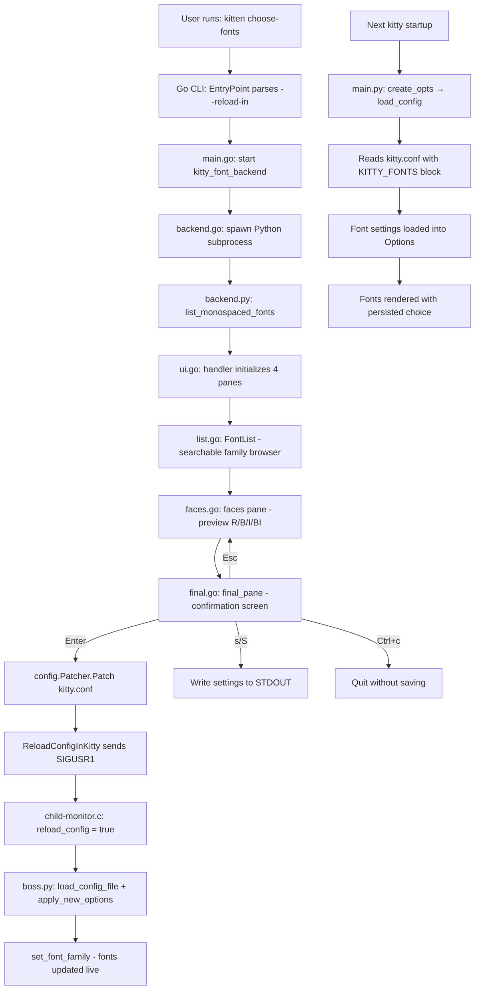

# Technical Specification

# 0. Agent Action Plan

## 0.1 Intent Clarification

### 0.1.1 Core Feature Objective

Based on the prompt, the Blitzy platform understands that the new feature requirement is to produce a comprehensive documentation artifact that answers a set of onboarding questions about the `choose-fonts` kitten within the `kovidgoyal/kitty` terminal emulator repository. The documentation must cover the full end-to-end behavior of the choose-fonts workflow, backed by evidence from the source code and validated through a runtime experiment, with absolutely no modifications to existing repository source files.

The specific feature requirements are:

- **Build and launch from source**: Document how to build the kitty repository from source and start a single kitty instance with default settings, then invoke the `choose-fonts` kitten from inside that instance
- **Subcommand registration tracing**: Explain how the `choose-fonts` subcommand is registered in the CLI command tree, from Go entry point wiring through to the terminal UI handler
- **Option parsing flow**: Trace how the `--reload-in` option (and any other CLI options) is parsed, validated, and propagated through to the final confirmation step
- **End-to-end UI pane flow**: Document the progression from font family scanning, to family listing, to face selection and fine-tuning, to the final confirmation pane
- **Font persistence verification**: Determine and prove—through both code-path analysis and runtime evidence—whether pressing Enter at the final step writes the chosen font to `kitty.conf` and whether that choice persists across restarts or is session-only
- **Runtime validation example**: Execute a runtime test showing the full cycle of font selection, config persistence, and cross-restart retention, then clean up all temporary test artifacts

Implicit requirements detected:

- The documentation must cite specific source file paths and line numbers as evidence
- Temporary configs and scripts used for testing must be created and then fully removed
- The `blitzy/documentation` directory must be created if it does not exist, and the final markdown document placed there
- The answer document must be named after the source branch name

### 0.1.2 Special Instructions and Constraints

- **CRITICAL — Read-only source policy**: The user explicitly states: "Don't modify any repository source files." This means no edits to any file under `kitty/`, `kittens/`, `tools/`, `glfw/`, `docs/`, `setup.py`, `Makefile`, or any other tracked repository file.
- **Temporary artifacts allowed**: "Creating temporary configs, logging settings, or small test scripts/programs are fine, but delete any temporary test artifacts when you're done and leave the codebase unchanged."
- **Implementation rule — SWE-AtlasQnA-Repo**: Create a new markdown document named `<source_branch_name>.md` that comprehensively answers the questions posed. Provide thinking/rationale behind the answers. Do not make assumptions—base answers on the code as truth. Place the document in `blitzy/documentation`.
- **No code modifications**: The only file created in the repository is the final QnA markdown document under `blitzy/documentation/`.

### 0.1.3 Technical Interpretation

These feature requirements translate to the following technical implementation strategy:

- To **answer the build-and-launch question**, we will examine `Makefile`, `setup.py`, `pyproject.toml`, and `go.mod` to document the build command (`make` or `python3 setup.py`) and the launch command (`./kitty/launcher/kitty` or the built binary), plus how to invoke `kitten choose-fonts` from inside the running instance.
- To **trace subcommand registration**, we will follow the Go entry point chain from `tools/cmd/tool/main.go` → `choose_fonts.EntryPoint(root)` in `kittens/choose_fonts/main.go`, through option specification and the `main(&opts)` call.
- To **trace option parsing flow**, we will document how `cmd.GetOptionValues(&opts)` in `main.go:80` populates the `Options` struct, and how `opts.Reload_in` propagates to `final.go:87` for the config reload decision.
- To **document the UI pane flow**, we will trace the `handler` struct's pane array initialization in `ui.go:81`, the state machine (SCANNING_FAMILIES → LISTING_FAMILIES → CHOOSING_FACES), and the pane transitions ending at the `final_pane`.
- To **prove persistence**, we will trace the code path in `final.go:78-96` where `config.Patcher.Patch()` writes a `# BEGIN_KITTY_FONTS / # END_KITTY_FONTS` block into `kitty.conf`, and how `config.ReloadConfigInKitty()` sends SIGUSR1 to trigger a live reload, plus how the normal startup in `kitty/main.py:494` calls `create_opts()` → `load_config()` to read the persisted font settings.
- To **produce runtime evidence**, we will create a temporary kitty config directory, run the choose-fonts workflow, inspect the patched `kitty.conf`, restart kitty, and verify the font persists—then clean up all artifacts.
- To **deliver the final artifact**, we will create `blitzy/documentation/<branch_name>.md` containing the comprehensive answers.

## 0.2 Repository Scope Discovery

### 0.2.1 Comprehensive File Analysis

The following files and directories are directly relevant to answering the user's questions about the `choose-fonts` kitten's behavior, registration, option flow, persistence mechanism, and runtime lifecycle.

**Choose-Fonts Kitten Core (Go + Python)**

| File | Purpose | Relevance |
|------|---------|-----------|
| `kittens/choose_fonts/__init__.py` | Empty package marker for `kittens.choose_fonts` | Package identity for Python imports |
| `kittens/choose_fonts/main.go` | CLI subcommand registration (`EntryPoint`), `Options` struct, `main()` entry that starts backend, creates event loop, wires handler callbacks | Central to answering how the subcommand is registered and how options are parsed |
| `kittens/choose_fonts/ui.go` | `handler` struct, `State` enum (`SCANNING_FAMILIES`, `LISTING_FAMILIES`, `CHOOSING_FACES`), pane interface, initialization, event routing, terminal query | Central to understanding the UI coordinator and pane state machine |
| `kittens/choose_fonts/backend.go` | `kitty_font_backend_type` — spawns Python backend via `kitty +runpy`, JSON pipe IPC, request/response lifecycle | Documents the Go↔Python companion-process protocol |
| `kittens/choose_fonts/backend.py` | Python worker: handles `list_monospaced_fonts`, `read_variable_data`, `render_family_samples` actions; calls into `kitty.fonts` subsystem | Font discovery and sample rendering backend |
| `kittens/choose_fonts/list.go` | `FontList` pane — searchable family browser with readline, preview cache, async sample loading | Font family browsing UI |
| `kittens/choose_fonts/family_list.go` | `FamilyList` model — filtered/original family slices, search scoring, ANSI highlighting | Data model behind the family browser |
| `kittens/choose_fonts/faces.go` | `faces` pane — shows Regular/Bold/Italic/Bold-Italic previews, Enter→final_pane, Esc→listing | Face selection and preview rendering |
| `kittens/choose_fonts/face.go` | `face_panel` — per-face editor for variable font axis tuning | Individual face fine-tuning UI |
| `kittens/choose_fonts/final.go` | `final_pane` — confirmation screen: Enter patches `kitty.conf`, Esc returns, s/S exports to stdout, Ctrl+c quits | **Critical**: persistence logic, config patching, reload triggering |
| `kittens/choose_fonts/types.go` | Data model types: `ListedFont`, `VariableData`, `ResolvedFaces`, `RenderedSampleTransmit`, variable data cache | Shared data structures for the entire kitten |
| `kittens/choose_fonts/graphics.go` | Graphics protocol management for font preview slots | Image display in terminal |
| `kittens/choose_fonts/styles.go` | Style group normalization for variable fonts | Style metadata processing |

**Configuration Patching and Reload Chain**

| File | Purpose | Relevance |
|------|---------|-----------|
| `tools/config/api.go` | `Patcher.Patch()` — comments out old settings, replaces/appends `BEGIN_KITTY_FONTS/END_KITTY_FONTS` block, atomically updates file; `ReloadConfigInKitty()` — sends SIGUSR1 | **Critical**: the actual mechanism that writes font choices to `kitty.conf` and triggers reload |
| `kitty/child-monitor.c` (lines 1373-1374) | SIGUSR1 handler sets `ss->reload_config = true` | Signal handling for live config reload |
| `kitty/boss.py` (lines 2646-2708) | `apply_new_options()` calls `set_font_family(opts)`; `load_config_file()` re-reads config and applies | Python-side config reload and font application |
| `kitty/config.py` | `load_config()`, `parse_config()`, `finalize_keys()`, `atomic_save()` | Config loading pipeline used at startup and on reload |
| `kitty/constants.py` (lines 87-133) | `_get_config_dir()` resolves `KITTY_CONFIG_DIRECTORY` / `XDG_CONFIG_HOME` / `~/.config/kitty`; `defconf` = `kitty.conf` path | Config directory resolution |
| `tools/utils/paths.go` (lines 132-134) | `ConfigDir()` — Go equivalent of Python config dir resolution | Go-side config path for `final.go` |

**CLI and Entry Point Chain**

| File | Purpose | Relevance |
|------|---------|-----------|
| `tools/cmd/tool/main.go` (line 82) | `choose_fonts.EntryPoint(root)` — registers kitten as CLI subcommand | Entry point wiring in the Go CLI tree |
| `kitty/entry_points.py` | `main()` dispatches `+kitten` to `run_kitten()`, which calls `kittens.runner` | Python-side kitten dispatch (for backend subprocess) |
| `kittens/runner.py` | `run_kitten()`, `all_kitten_names()`, `resolved_kitten()` — resolves and runs builtin kittens | Runner used by `+runpy` backend invocation |
| `kitty/fonts/list.py` (line 42) | `main()` invokes `os.execlp(kitten_exe(), 'kitten', 'choose-fonts')` | `list-fonts` command redirects to choose-fonts kitten |

**Font Subsystem (Backend Dependencies)**

| File | Purpose | Relevance |
|------|---------|-----------|
| `kitty/fonts/__init__.py` | Canonical font data type definitions (`ListedFont`, `FontSpec`, etc.) | Type contracts for font discovery |
| `kitty/fonts/common.py` | Platform-neutral font resolution: `get_font_files()`, `face_from_descriptor()`, `spec_for_descriptor()` | Font matching and face resolution |
| `kitty/fonts/fontconfig.py` | Linux fontconfig backend for font discovery | Platform font listing on Linux |
| `kitty/fonts/list.py` | `create_family_groups()` — groups fonts by family, filters monospaced | Font enumeration used by backend.py |
| `kitty/fonts/render.py` | `set_font_family()` — applies resolved fonts to rendering engine | Runtime font application on reload |

**Build and Startup**

| File | Purpose | Relevance |
|------|---------|-----------|
| `Makefile` | `all: python3 setup.py` — main build target | Build instructions |
| `setup.py` | Build orchestrator: validates Python, compiles C extensions, compiles Go, assembles bundles | Build system |
| `pyproject.toml` | `requires-python = ">=3.8"` | Python version requirement |
| `go.mod` | `go 1.22`, module dependencies | Go version and dependencies |
| `kitty/main.py` (line 494) | `opts = create_opts(cli_opts, ...)` — loads config at startup | Startup config loading (proves persistence) |

**Configuration Definition**

| File | Purpose | Relevance |
|------|---------|-----------|
| `kitty/options/definition.py` (lines 35-57) | `font_family`, `bold_font`, `italic_font`, `bold_italic_font` option declarations | Config schema for font settings |
| `kitty/options/parse.py` | Generated parser: `font_family()`, `bold_font()` handlers call `parse_font_spec()` | Parsing of font config lines |
| `kitty/options/types.py` | `Options` class with font attributes and defaults | Runtime config object |
| `kitty/options/utils.py` | `parse_font_spec()` — converts font spec strings to `FontSpec` objects | Font spec parsing utility |

### 0.2.2 Integration Point Discovery

- **CLI registration chain**: `tools/cmd/tool/main.go` → `choose_fonts.EntryPoint()` in `kittens/choose_fonts/main.go` → `root.AddSubCommand()` with `Run` callback that parses options and calls `main()`
- **Backend IPC**: `backend.go:start()` spawns `kitty +runpy "from kittens.choose_fonts.backend import main; main()"` — the Go side sends JSON commands over stdin pipe and reads JSON responses from stdout pipe
- **Config patching**: `final.go:80-93` → `config.Patcher.Patch()` in `tools/config/api.go:310-350` → atomically updates `kitty.conf`
- **Config reload signal**: `config.ReloadConfigInKitty()` in `tools/config/api.go:352-371` → sends `SIGUSR1` to kitty process → handled in `kitty/child-monitor.c:1373` → triggers `boss.load_config_file()` → `apply_new_options()` → `set_font_family()`
- **Startup config load**: `kitty/main.py:494` → `create_opts()` → `kitty/config.py:load_config()` → reads `kitty.conf` including `# BEGIN_KITTY_FONTS` block → font settings materialized into `Options` object

### 0.2.3 New File Requirements

- **CREATE**: `blitzy/documentation/<source_branch_name>.md` — Comprehensive QnA markdown document answering all user questions with source code evidence and runtime validation results
- No other permanent files are created; temporary test scripts, configs, and directories are created during runtime validation and deleted afterward

## 0.3 Dependency Inventory

### 0.3.1 Key Packages Relevant to the Choose-Fonts Feature

The choose-fonts kitten spans both Go and Python runtimes. The following packages are relevant to understanding its behavior.

**Go Dependencies (from `go.mod`)**

| Registry | Package | Version | Purpose |
|----------|---------|---------|---------|
| Go modules | `go` (language) | 1.22 | Go language version for compiling kitten Go code |
| GitHub | `github.com/shirou/gopsutil/v3` | v3.24.5 | Process inspection used by `ReloadConfigInKitty()` to find and signal running kitty processes |
| golang.org | `golang.org/x/sys` | v0.21.0 | Unix system calls including `unix.SIGUSR1` for config reload signaling |
| golang.org | `golang.org/x/image` | v0.17.0 | Image processing support used by graphics subsystem |
| GitHub | `github.com/google/uuid` | v1.6.0 | UUID generation for various internal identifiers |
| GitHub | `github.com/google/go-cmp` | v0.6.0 | Comparison utilities |

**Python Dependencies (from `pyproject.toml` and source imports)**

| Registry | Package | Version | Purpose |
|----------|---------|---------|---------|
| PyPI / Built-in | Python | >=3.8 | Python runtime for backend process and kitty core |
| Built-in | `json` | stdlib | JSON serialization for Go↔Python IPC in backend.go/backend.py |
| Built-in | `tempfile` | stdlib | Temporary file creation for rendered font sample bitmaps |
| Internal | `kitty.fonts.common` | (in-tree) | `get_font_files()`, `face_from_descriptor()`, `spec_for_descriptor()` — font resolution |
| Internal | `kitty.fonts.list` | (in-tree) | `create_family_groups()` — monospaced font enumeration |
| Internal | `kitty.fonts.render` | (in-tree) | `display_bitmap()`, `set_font_family()` — rendering integration |
| Internal | `kitty.options.types` | (in-tree) | `Options` class — configuration model |
| Internal | `kitty.options.utils` | (in-tree) | `parse_font_spec()` — font specification parsing |
| Internal | `kitty.cli` | (in-tree) | `create_default_opts()` — default options factory |
| Internal | `kitty.conf.utils` | (in-tree) | `to_color()` — color parsing for preview rendering |
| Internal | `kitty.constants` | (in-tree) | `kitten_exe()`, `config_dir`, `defconf` — path resolution |

**Internal Go Packages (from `kittens/choose_fonts/` imports)**

| Package | Purpose |
|---------|---------|
| `kitty/tools/cli` | CLI command tree, option specification, command registration |
| `kitty/tools/config` | `Patcher` for config file patching, `ReloadConfigInKitty()` for SIGUSR1 reload |
| `kitty/tools/tui/loop` | Terminal UI event loop, key/mouse events, screen drawing, cursor control |
| `kitty/tools/tui/graphics` | Kitty graphics protocol for font preview image display |
| `kitty/tools/tui/readline` | Readline input for search bar in font family browser |
| `kitty/tools/tui` | Mouse state, render lines, styled printing |
| `kitty/tools/utils` | Utility functions: `ConfigDir()`, `KittyExe()`, `CacheDir()`, `AtomicUpdateFile()` |
| `kitty/tools/utils/style` | Text styling utilities |
| `kitty/tools/wcswidth` | Unicode character width calculations for terminal layout |
| `kitty/tools/tty` | `DebugPrintln` for debug output |

### 0.3.2 Dependency Updates

No dependency additions or updates are required for this task. The user's request is a read-only investigation; the output is a standalone markdown document. All dependencies listed above are pre-existing in the repository and are documented here for completeness in understanding the choose-fonts feature.

## 0.4 Integration Analysis

### 0.4.1 Existing Code Touchpoints

The choose-fonts kitten integrates with the following kitty subsystems. Understanding these touchpoints is essential for answering the user's questions about end-to-end behavior.

**Subcommand Registration Chain**

- `tools/cmd/tool/main.go:82` — `choose_fonts.EntryPoint(root)` registers the `choose-fonts` subcommand on the root CLI command. This is the first integration point: the Go CLI tree recognizes `kitten choose-fonts` as a valid command.
- `kittens/choose_fonts/main.go:74-99` — `EntryPoint()` adds the subcommand with `Name: "choose-fonts"`, `ShortDescription: "Choose the fonts used in kitty"`, a `Run` callback that parses options and calls `main()`, and the `--reload-in` option. It also adds a `clone` with `Name: "choose_fonts"` (underscore alias).
- `kittens/choose_fonts/main.go:16-68` — `main()` starts the Python backend, creates the TUI event loop, wires all callbacks (`OnInitialize`, `OnWakeup`, `OnEscapeCode`, `OnFinalize`, `OnMouseEvent`, `OnResize`, `OnKeyEvent`, `OnText`), runs the loop, and writes `output_on_exit` to stdout if set.

**Go↔Python Backend IPC**

- `kittens/choose_fonts/backend.go:32-63` — `start()` locates the kitty executable, spawns `kitty +runpy "from kittens.choose_fonts.backend import main; main()"`, sets up stdin/stdout pipes, and initializes the JSON decoder
- `kittens/choose_fonts/backend.go:100-131` — `query()` sends a JSON command (e.g., `{"action": "list_monospaced_fonts"}`) over the pipe and decodes the JSON response
- `kittens/choose_fonts/backend.py:150-168` — `main()` reads JSON commands from stdin and dispatches to handlers: `list_monospaced_fonts` returns font groups and resolved faces, `read_variable_data` returns variable font axis data, `render_family_samples` renders RGBA preview bitmaps

**Configuration Patching (Persistence Mechanism)**

- `kittens/choose_fonts/final.go:78-96` — When Enter is pressed: creates `config.Patcher{Write_backup: true}`, resolves path via `filepath.Join(utils.ConfigDir(), "kitty.conf")`, calls `patcher.Patch(path, "KITTY_FONTS", self.settings.serialized(), "font_family", "bold_font", "italic_font", "bold_italic_font")`
- `tools/config/api.go:310-350` — `Patcher.Patch()`:
  - Resolves symlinks on the config path
  - Reads existing file content
  - Comments out any existing `font_family`, `bold_font`, `italic_font`, `bold_italic_font` lines (regex replacement: `^\s*(font_family|...)` → `# $1`)
  - Replaces existing `# BEGIN_KITTY_FONTS ... # END_KITTY_FONTS` block, or appends a new one
  - Writes a `.bak` backup when `Write_backup` is true
  - Atomically updates the file only if content actually changed

**Config Reload via SIGUSR1**

- `tools/config/api.go:352-371` — `ReloadConfigInKitty()`:
  - If `in_parent_only` is true: reads `KITTY_PID` from environment, looks up the process, verifies it is a kitty GUI process (not `@` remote-control or `+` namespace commands), sends `SIGUSR1`
  - If `in_parent_only` is false: iterates all system processes, sends `SIGUSR1` to every kitty GUI process
- `kitty/child-monitor.c:1373-1374` — Signal handler: `case SIGUSR1: ss->reload_config = true;`
- `kitty/boss.py:2691-2704` — `load_config_file()`: calls `load_config()` to re-read all config files, then calls `apply_new_options(opts)`
- `kitty/boss.py:2646-2680` — `apply_new_options()`: calls `set_font_family(opts)` from `kitty/fonts/render.py`, updates all OS windows with new font size, refreshes all windows with `reload_all_gpu_data=True`

**Startup Configuration Loading (Proves Cross-Restart Persistence)**

- `kitty/main.py:494` — `opts = create_opts(cli_opts, accumulate_bad_lines=bad_lines)` — loads config at startup
- `kitty/cli.py` → `kitty/config.py:load_config()` — reads `kitty.conf` including any `# BEGIN_KITTY_FONTS` block → parses `font_family`, `bold_font`, etc. → materializes into `Options` object
- `kitty/options/parse.py:980-981` — `font_family()` handler: calls `parse_font_spec(val)` to convert the config string to a `FontSpec` object
- `kitty/fonts/render.py` — `set_font_family()` applies the loaded font settings to the rendering engine

### 0.4.2 Data Flow Summary

## 0.5 Technical Implementation

### 0.5.1 File-by-File Execution Plan

Since this task is a read-only code investigation with a documentation deliverable, the execution plan focuses on producing the QnA markdown document. No existing repository files are modified. Only one new file is created.

**Group 1 — Analysis and Evidence Gathering (Read-Only)**

All files below are read and analyzed but never modified:

- **READ**: `kittens/choose_fonts/main.go` — Extract subcommand registration logic, option definitions, and the `main()` function entry flow
- **READ**: `kittens/choose_fonts/ui.go` — Extract the `handler` struct, `State` enum, pane interface, initialization sequence, and event routing
- **READ**: `kittens/choose_fonts/backend.go` — Extract the Python subprocess spawning mechanism, JSON IPC protocol, and lifecycle management
- **READ**: `kittens/choose_fonts/backend.py` — Extract the `main()` loop, action handlers (`list_monospaced_fonts`, `read_variable_data`, `render_family_samples`), and font resolution calls
- **READ**: `kittens/choose_fonts/list.go` — Extract the searchable family browser logic
- **READ**: `kittens/choose_fonts/faces.go` — Extract face selection pane, preview rendering, and transition to final pane
- **READ**: `kittens/choose_fonts/face.go` — Extract per-face editor and variable font axis tuning
- **READ**: `kittens/choose_fonts/final.go` — Extract the confirmation screen logic, config patching invocation, reload triggering, and stdout export
- **READ**: `kittens/choose_fonts/types.go` — Extract shared data model types
- **READ**: `tools/config/api.go` — Extract `Patcher.Patch()` implementation and `ReloadConfigInKitty()` signal dispatch
- **READ**: `tools/cmd/tool/main.go` — Extract the `choose_fonts.EntryPoint(root)` registration call
- **READ**: `kitty/entry_points.py` — Extract CLI dispatch for `+runpy` used by the backend
- **READ**: `kittens/runner.py` — Extract kitten resolution and execution lifecycle
- **READ**: `kitty/boss.py` — Extract `load_config_file()` and `apply_new_options()` for reload behavior
- **READ**: `kitty/child-monitor.c` — Extract SIGUSR1 signal handler
- **READ**: `kitty/main.py` — Extract startup config loading path
- **READ**: `kitty/config.py` — Extract `load_config()` pipeline
- **READ**: `kitty/constants.py` — Extract config directory resolution logic
- **READ**: `kitty/options/definition.py` — Extract `font_family`, `bold_font`, `italic_font`, `bold_italic_font` option declarations
- **READ**: `Makefile`, `setup.py`, `pyproject.toml`, `go.mod` — Extract build instructions and dependency versions

**Group 2 — Runtime Validation (Temporary Artifacts)**

- **CREATE (temp)**: A temporary kitty config directory with a minimal `kitty.conf` to test font persistence
- **CREATE (temp)**: A small shell script or series of shell commands to:
  - Build kitty from source (if not already built)
  - Launch kitty with the temporary config
  - Invoke `kitten choose-fonts`
  - Inspect the resulting `kitty.conf` for `# BEGIN_KITTY_FONTS` block
  - Restart kitty and verify font settings are loaded
- **DELETE**: All temporary configs, scripts, and directories after evidence is captured

**Group 3 — Deliverable**

- **CREATE**: `blitzy/documentation/<source_branch_name>.md` — The comprehensive QnA document

### 0.5.2 Implementation Approach

The implementation follows this sequence:

- **Establish the knowledge base** by reading all source files listed in Group 1, tracing the end-to-end choose-fonts workflow from CLI registration through to config persistence
- **Document each answer** with specific file paths, line numbers, and code-level reasoning
- **Execute the runtime validation** by building kitty (if feasible in the environment), running the choose-fonts workflow, and capturing evidence of config file modification and cross-restart persistence
- **Compile the markdown document** with clear section structure: one section per user question, with thinking/rationale, code citations, and runtime evidence
- **Clean up all temporary artifacts** leaving the codebase unchanged

### 0.5.3 Key Technical Answers to Document

The markdown document must comprehensively address each of these questions:

- **How to build and start kitty**: `make` (which runs `python3 setup.py`), then launch the built binary; use `kitten choose-fonts` or `kitty +kitten choose_fonts` from inside the instance
- **How the subcommand is registered**: Go CLI tree in `tools/cmd/tool/main.go` → `choose_fonts.EntryPoint(root)` → adds `choose-fonts` command with `--reload-in` option → `Run` callback parses options and calls `main()`
- **How options flow through the program**: `cmd.GetOptionValues(&opts)` populates `Options.Reload_in` → passed to `handler.opts` → checked in `final_pane.on_key_event()` at the Enter key handler → determines whether to call `config.ReloadConfigInKitty(true)` (parent), `config.ReloadConfigInKitty(false)` (all), or skip reload (none)
- **End-to-end behavior**: Scanning → Listing → Face Selection → Final Confirmation, with backend IPC for font discovery and preview rendering at each stage
- **Whether the font choice persists**: Yes — pressing Enter invokes `config.Patcher.Patch()` which writes the font settings into `kitty.conf` in a `# BEGIN_KITTY_FONTS / # END_KITTY_FONTS` sentinel block. The patcher also comments out any pre-existing `font_family`/`bold_font`/`italic_font`/`bold_italic_font` lines to prevent conflicts. On the next kitty startup, `kitty/main.py` → `create_opts()` → `load_config()` reads this block and materializes the font settings into the `Options` object.
- **Runtime verification**: Demonstrate the config file change and cross-restart behavior through a controlled test

## 0.6 Scope Boundaries

### 0.6.1 Exhaustively In Scope

**Source files analyzed for documentation (read-only)**

- `kittens/choose_fonts/**/*.go` — All Go source files in the choose-fonts kitten
- `kittens/choose_fonts/**/*.py` — All Python source files in the choose-fonts kitten
- `kittens/runner.py` — Kitten execution framework
- `tools/config/api.go` — Config patcher and reload mechanism
- `tools/cmd/tool/main.go` — CLI entry point registration
- `tools/utils/paths.go` — Config directory resolution (Go side)
- `kitty/entry_points.py` — CLI dispatch including `+runpy`
- `kitty/main.py` — Application startup and config loading
- `kitty/boss.py` — Config reload handler and font application
- `kitty/config.py` — Config loading pipeline
- `kitty/constants.py` — Config directory and path constants
- `kitty/child-monitor.c` — SIGUSR1 signal handler
- `kitty/options/definition.py` — Font option schema declarations
- `kitty/options/parse.py` — Generated config parser handlers
- `kitty/options/types.py` — Options class with font attributes
- `kitty/options/utils.py` — `parse_font_spec()` utility
- `kitty/fonts/__init__.py` — Font type definitions
- `kitty/fonts/common.py` — Font resolution logic
- `kitty/fonts/list.py` — Font listing and family grouping
- `kitty/fonts/fontconfig.py` — Linux font discovery backend
- `kitty/fonts/render.py` — Font rendering and `set_font_family()`
- `Makefile` — Build targets
- `setup.py` — Build orchestrator
- `pyproject.toml` — Python version requirements
- `go.mod` — Go version and module dependencies

**Deliverable files created**

- `blitzy/documentation/<source_branch_name>.md` — The comprehensive QnA document

**Temporary artifacts (created and deleted during runtime validation)**

- Temporary kitty config directory with test `kitty.conf`
- Any shell scripts or test programs used for runtime validation
- All cleaned up before task completion

### 0.6.2 Explicitly Out of Scope

- **Modification of any existing repository source files** — The user explicitly prohibits this
- **Other kittens** — Only `choose_fonts` is analyzed; other kittens (`themes`, `diff`, `icat`, etc.) are not in scope
- **Font rendering internals** — The C-level font rasterization in `kitty/freetype.c`, `kitty/fonts.c`, `kitty/glyph-cache.c` is not analyzed beyond what is needed to answer the user's questions
- **macOS-specific font backend** — `kitty/fonts/core_text.py` is noted but not deeply analyzed since the runtime environment is Linux
- **GLSL shader programs** — The rendering shaders are not relevant to the choose-fonts workflow questions
- **CI/CD and packaging** — `.github/`, `bypy/`, and release engineering files are not in scope
- **Shell integration** — `shell-integration/` directory is not relevant
- **Remote control commands** — `kitty/rc/` commands other than what is needed for config reload understanding
- **Performance optimization** — No performance analysis or optimization is requested
- **New feature implementation** — The user is not asking for new features; they want to understand existing behavior
- **Third-party library source code** — `3rdparty/`, `glad/`, `glfw/` vendored code is not analyzed

## 0.7 Rules for Feature Addition

### 0.7.1 User-Specified Rules

The following rules are explicitly stated by the user and must be strictly observed:

- **No source file modifications**: "Don't modify any repository source files." This is an absolute constraint. No file under version control in the repository may be edited, deleted, or renamed.
- **Temporary artifacts permitted with cleanup**: "Creating temporary configs, logging settings, or small test scripts/programs are fine, but delete any temporary test artifacts when you're done and leave the codebase unchanged." Any temporary files created for runtime validation must be fully removed upon completion.
- **Code-as-truth principle**: "Do not make assumptions, base your answers on the code as the truth." All claims in the documentation must be substantiated by specific code references, not by external documentation or assumptions about behavior.
- **Thinking and rationale required**: "Provide thinking / rationale behind the answers." The markdown document must not merely state facts but explain the reasoning and evidence chain that leads to each conclusion.

### 0.7.2 Implementation Rule: SWE-AtlasQnA-Repo

The project-level implementation rule specifies:

- **Create a markdown document** named `<source_branch_name>.md`
- **Place it in** the `blitzy/documentation` directory in the destination repo
- **Content**: Comprehensively answer the question(s) posed in the prompt
- **Do not modify** any existing files in the source repository
- **Do not add** any other code in the source repository besides the requested document

### 0.7.3 Technical Conventions to Follow

Based on the repository's existing conventions:

- **File naming**: The markdown document follows the `<source_branch_name>.md` naming convention specified by the implementation rule
- **Evidence format**: Code citations should reference specific files and line numbers (e.g., `kittens/choose_fonts/final.go:78-96`)
- **Diagram format**: Mermaid diagrams may be used to illustrate flows, consistent with the documentation standards used elsewhere in the tech spec
- **No hardcoded paths**: When discussing config directories, reference the resolution logic (e.g., `KITTY_CONFIG_DIRECTORY` → `XDG_CONFIG_HOME` → `~/.config/kitty`) rather than assuming a specific path

## 0.8 References

### 0.8.1 Repository Files and Folders Searched

The following files and folders were retrieved and analyzed during context gathering to derive the conclusions documented in this Agent Action Plan:

**Choose-Fonts Kitten Sources**
- `kittens/choose_fonts/__init__.py` — Package marker (empty)
- `kittens/choose_fonts/main.go` — CLI entry point, option definitions, main function
- `kittens/choose_fonts/main.py` — (path verified; Python-side kitten metadata not present as separate file in this kitten)
- `kittens/choose_fonts/ui.go` — UI handler, state machine, pane coordination, terminal queries
- `kittens/choose_fonts/backend.go` — Go-side backend process controller, IPC protocol
- `kittens/choose_fonts/backend.py` — Python worker process: font listing, variable data, sample rendering
- `kittens/choose_fonts/list.go` — Searchable font family browser pane
- `kittens/choose_fonts/family_list.go` — Family list data model (summary reviewed)
- `kittens/choose_fonts/faces.go` — Face selection pane with previews
- `kittens/choose_fonts/face.go` — Per-face editor for variable font axis tuning
- `kittens/choose_fonts/final.go` — Confirmation pane: config patching, reload, stdout export
- `kittens/choose_fonts/types.go` — Shared data types: ListedFont, VariableData, ResolvedFaces
- `kittens/choose_fonts/graphics.go` — Graphics protocol management (summary reviewed)
- `kittens/choose_fonts/styles.go` — Style group normalization (summary reviewed)

**Configuration and Patching**
- `tools/config/api.go` — ConfigParser, Patcher.Patch(), ReloadConfigInKitty()
- `tools/utils/paths.go` — ConfigDir(), CacheDir() resolution
- `kitty/config.py` — load_config(), parse_config(), atomic_save(), cached_values_for()
- `kitty/constants.py` — config_dir resolution, defconf path, kitten_exe()
- `kitty/options/definition.py` — Font option declarations (grep results)
- `kitty/options/parse.py` — Generated parser for font_family, bold_font, etc. (grep results)
- `kitty/options/types.py` — Options class (summary reviewed)
- `kitty/options/utils.py` — parse_font_spec() (summary reviewed)

**Entry Points and CLI Dispatch**
- `tools/cmd/tool/main.go` — KittyToolEntryPoints, choose_fonts.EntryPoint(root) registration
- `kitty/entry_points.py` — main(), namespaced(), run_kitten(), +runpy dispatch
- `kittens/runner.py` — run_kitten(), all_kitten_names(), resolved_kitten(), launch()

**Startup, Reload, and Font Application**
- `kitty/main.py` — _main(), startup config loading via create_opts()
- `kitty/boss.py` — apply_new_options(), load_config_file(), set_font_family()
- `kitty/child-monitor.c` — SIGUSR1 handler setting reload_config flag

**Font Subsystem**
- `kitty/fonts/__init__.py` — Font type definitions (summary reviewed)
- `kitty/fonts/common.py` — Font resolution pipeline (summary reviewed)
- `kitty/fonts/list.py` — create_family_groups(), main() redirecting to kitten
- `kitty/fonts/fontconfig.py` — Linux fontconfig backend (summary reviewed)
- `kitty/fonts/render.py` — set_font_family(), display_bitmap() (summary reviewed)

**Build System and Dependencies**
- `Makefile` — Build targets (all, test, clean, debug)
- `setup.py` — Build orchestrator, Python version checks
- `pyproject.toml` — requires-python >= 3.8, mypy/ruff config
- `go.mod` — Go 1.22, module dependencies including gopsutil, x/sys

**Folder Structure Explored**
- Repository root (`""`) — Full folder listing and summary
- `kittens/` — All kitten subpackages enumerated
- `kittens/choose_fonts/` — All 14 source files enumerated
- `kitty/` — Core application tree with all children
- `kitty/fonts/` — Font subsystem files enumerated

### 0.8.2 Tech Spec Sections Retrieved

- Section 4.8 — KITTENS FRAMEWORK EXECUTION FLOW: kitten resolution, module loading, execution lifecycle, built-in kitten catalog
- Section 4.4 — CONFIGURATION MANAGEMENT FLOW: config loading pipeline, live reload mechanism, validation rules

### 0.8.3 Attachments and External Resources

- No user attachments were provided for this project
- No Figma URLs were specified
- No external URLs were referenced by the user
- The INSTALL.md file in the repository points to `https://sw.kovidgoyal.net/kitty/build/` for build documentation and `https://sw.kovidgoyal.net/kitty/binary/` for pre-built binaries

