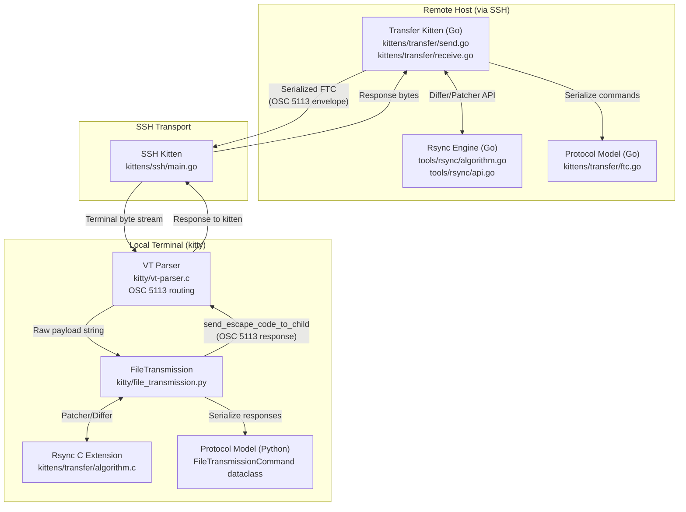

# Technical Specification

# 0. Agent Action Plan

## 0.1 Intent Clarification


### 0.1.1 Core Feature Objective

Based on the prompt, the Blitzy platform understands that the new feature requirement is to produce a comprehensive investigative document that traces the complete data journey of kitty's file transfer protocol over SSH connections. This is an onboarding and deep-dive analysis task — no source code in the repository is to be modified. Specifically, the deliverable is a markdown document placed at `blitzy/documentation/kitty_815df1e210e0.md` that answers the following questions with evidence from the codebase:

- **Protocol Handshake Initiation**: How the transfer kitten initiates the protocol handshake and what escape sequences establish the transfer session over the terminal connection. The investigation must trace from the Go CLI entry point (`kittens/transfer/main.go`) through the `SendManager.initialize()` and `start_transfer()` flow in `kittens/transfer/send.go`, showing how the OSC 5113 envelope (`\x1b]5113;id=<request_id>;...\x1b\\`) is constructed and how the Python-side `FileTransmission` class in `kitty/file_transmission.py` receives and dispatches it via the VT parser (`kitty/vt-parser.c`, case `FILE_TRANSFER_CODE`).

- **Rsync-Style Delta Transfer Mechanism**: How kitty implements rsync-style delta transfer, and what data structures track file signatures and differences. The analysis must cover the `Patcher` and `Differ` types in `tools/rsync/api.go`, the `BlockHash` struct (20-byte records with Index, WeakHash, StrongHash) and rolling checksum in `tools/rsync/algorithm.go`, and the 12-byte signature header format (version, checksum_type, strong_hash_type, weak_hash_type, block_size). It must explain that block size is computed as `sqrt(file_size)` and files must exceed 4096 bytes to qualify for rsync.

- **Data Encoding and Reassembly in the Terminal Stream**: When file chunks are transmitted, how they are encoded in the terminal stream and how the receiving side reassembles them while distinguishing transfer data from regular terminal output. The investigation must detail the `FileTransmissionCommand` struct in `kittens/transfer/ftc.go` — semicolon-delimited `key=value` wire format, base64-encoded data field, 4096-byte chunk splitting via `split_for_transfer()`, optional zlib compression, and the OSC 5113 code that the VT parser uses to demultiplex file transfer commands from normal terminal I/O.

- **Transfer Resumption Behavior**: If a transfer is interrupted and restarted, what state allows it to resume rather than starting over, and where resumption metadata is stored. The investigation must document that the protocol does not implement explicit session resume — there is no persistent checkpoint state on disk. Instead, the rsync delta mechanism inherently provides efficient re-transfer: when a file already exists at the destination, the receiver generates a signature from the existing file (via `PatchFile` / `Patcher.CreateSignatureIterator()` in `kitty/file_transmission.py`), and the sender computes a delta against that signature, transmitting only changed blocks. The `existing_stat` field on `DestFile` detects the presence of destination files.

- **Delta Transfer Efficiency Demonstration**: A practical experiment that transfers a file, modifies a small portion, and re-transfers, demonstrating that the second transfer sends substantially less data. The experiment must build kitty from source, create a test file exceeding 4096 bytes, perform an initial transfer, modify a small portion, re-transfer with `--transmit-deltas`, and capture the rsync statistics output from `print_rsync_stats()` in `kittens/transfer/utils.go` showing the delta-to-total ratio. All temporary test files must be cleaned up afterward.

### 0.1.2 Special Instructions and Constraints

- **No Source Modifications**: The user explicitly states: "Do not modify any source files." All source files in the repository must remain untouched. The only file to be created is the documentation deliverable at `blitzy/documentation/kitty_815df1e210e0.md`.
- **Temporary Files Permitted with Cleanup**: Temporary test files used for the delta transfer experiment are allowed but must be cleaned up after the experiment is complete.
- **Build From Source Requirement**: The user requests building kitty from source as part of the onboarding exercise, establishing an SSH connection using the SSH kitten, and performing actual file transfers for experiential understanding.
- **Evidence-Based Answers**: Each answer must trace through the actual source code, citing specific files, functions, struct definitions, and line-level evidence. No speculative or assumed behavior.
- **Implementation Rule — SWE-AtlasQnA-Repo**: A markdown document named `kitty_815df1e210e0.md` must be created in the `blitzy/documentation` directory that comprehensively answers all questions posed, provides thinking/rationale behind each answer, bases all assertions on the code as truth, and does not modify any existing files.

### 0.1.3 Technical Interpretation

These feature requirements translate to the following technical implementation strategy:

- To **trace the protocol handshake**, we will analyze `kittens/transfer/send.go` (`SendManager.initialize()`, `start_transfer()`, `send_file_metadata()`), the wire format model in `kittens/transfer/ftc.go` (`FileTransmissionCommand.Serialize()`), and the host-side dispatcher in `kitty/file_transmission.py` (`FileTransmission.handle_serialized_command()`). The escape code routing path goes through `kitty/control-codes.h` (`#define FILE_TRANSFER_CODE 5113`) and `kitty/vt-parser.c`.

- To **document the rsync delta mechanism**, we will analyze the `Differ` and `Patcher` types in `tools/rsync/api.go`, the core hashing and diffing algorithm in `tools/rsync/algorithm.go` (rolling checksum, xxh3 strong hash, `diff.read_next()` sliding window, `OpBlock`/`OpData`/`OpHash`/`OpBlockRange` operation types), and the integration points in `kittens/transfer/send.go` (`on_signature_data_received()`, `start_delta_calculation()`, `next_chunk()`) and `kitty/file_transmission.py` (`PatchFile`, `SourceFile.next_chunk()`, `ActiveReceive.transmit_rsync_signature()`).

- To **explain data encoding and stream demultiplexing**, we will document the `FileTransmissionCommand` serialization format (semicolon-delimited key=value pairs, base64 data, OSC 5113 prefix/suffix), chunk splitting at 4096 bytes, zlib compression integration, and the VT parser's role in routing OSC 5113 to the file transfer handler while regular terminal output follows normal escape code paths.

- To **address transfer resumption**, we will document that no explicit resume state exists, cite the absence of any persistent checkpoint mechanism in the codebase, and explain how the rsync delta mechanism provides functional equivalence to resumption by transmitting only differences against the existing destination file.

- To **demonstrate delta efficiency**, we will create a step-by-step experimental procedure using `kitten transfer --transmit-deltas`, showing the rsync statistics output that quantifies how much data was saved.


## 0.2 Repository Scope Discovery


### 0.2.1 Comprehensive File Analysis

The following files and directories form the complete scope of investigation for the file transfer protocol analysis. Every file listed was identified through systematic repository exploration and confirmed relevant by reading its contents.

**Protocol Model Layer (Wire Format and Command Definitions)**

| File Path | Purpose | Relevance |
|-----------|---------|-----------|
| `kittens/transfer/ftc.go` | Go-side `FileTransmissionCommand` struct, `Action`/`Compression`/`FileType`/`TransmissionType` enums, semicolon-delimited wire serialization, base64 encoding, `split_for_transfer()` (4096-byte chunking) | Central protocol model — defines every field, enum, and serialization rule for the transfer protocol wire format |
| `kitty/file_transmission.py` | Python-side `FileTransmissionCommand` dataclass (mirror of Go struct), `serialize()`/`deserialize()`, C extension `parse_ftc`, `ErrorCode` enum, `FileTransmission` orchestrator class, `ActiveReceive`, `ActiveSend`, `DestFile`, `PatchFile`, `SourceFile` | Host-side protocol handling — the terminal emulator's complete implementation of file transfer sessions |
| `kitty/control-codes.h` | `#define FILE_TRANSFER_CODE 5113` — the OSC code constant | Defines the escape code that identifies file transfer data in the terminal byte stream |

**Sender-Side Implementation (Kitten → Terminal)**

| File Path | Purpose | Relevance |
|-----------|---------|-----------|
| `kittens/transfer/send.go` | `SendManager` state machine, `File` struct (local_path, rsync_capable, differ, delta_loader, deltabuf), `files_for_send()` file discovery, `initialize()`/`start_transfer()`/`send_file_metadata()`, `on_signature_data_received()`, `start_delta_calculation()`, `next_chunk()`/`next_chunks()`, OSC event loop | Complete sender-side protocol flow — from file discovery through handshake, rsync signature reception, delta computation, and chunk transmission |
| `kittens/transfer/main.go` | Entry point dispatching to `send_main()` or `receive_main()` based on `opts.Direction`, bypass password handling | Transfer kitten CLI entry — shows how send vs. receive mode is selected |

**Receiver-Side Implementation (Terminal → Kitten)**

| File Path | Purpose | Relevance |
|-----------|---------|-----------|
| `kittens/transfer/receive.go` | Receiver state machine (`state_waiting_for_permission` → `state_transferring`), `remote_file` struct (patcher, expect_diff, decompressor), `filesystem_file`/`patch_file` output implementations, `request_files()` (signature generation for rsync), `sigwriter` buffering, `finalize_transfer()` | Complete receiver-side protocol flow — from metadata reception through rsync signature generation, delta application, and file finalization |

**Rsync Algorithm Engine**

| File Path | Purpose | Relevance |
|-----------|---------|-----------|
| `tools/rsync/algorithm.go` | Core rsync implementation: `BlockHash` (20-byte struct: Index, WeakHash, StrongHash), rolling checksum (`full()`, `add_one_byte()`), `diff` struct with `hash_lookup` map and sliding window `read_next()`, operation types (`OpBlock`, `OpData`, `OpHash`, `OpBlockRange`), `ApplyDelta()`, xxh3 hashing, `DefaultBlockSize=6144`, `BlockHashSize=20` | The mathematical core of delta transfer — signature generation, diff computation, and delta application |
| `tools/rsync/api.go` | Public API: `Patcher` (receiver: `NewPatcher()`, `CreateSignatureIterator()`, `StartDelta()`/`UpdateDelta()`/`FinishDelta()`), `Differ` (sender: `NewDiffer()`, `AddSignatureData()`, `FinishSignatureData()`, `CreateDelta()`), 12-byte signature header format | Integration-facing rsync API that the transfer kitten and terminal host use to perform delta operations |
| `tools/rsync/api_test.go` | Test suite for rsync roundtrip, hashing, and edge cases | Validates correctness of the rsync algorithm |
| `kittens/transfer/algorithm.c` | C extension for rsync operations used by the Python side | Performance-critical rsync operations accessible from the Python host |

**Utilities and Supporting Code**

| File Path | Purpose | Relevance |
|-----------|---------|-----------|
| `kittens/transfer/utils.go` | `encode_bypass()` (X25519 encryption), `should_be_compressed()` (skip pre-compressed formats), `print_rsync_stats()` (delta/signature/total reporting) | Transfer utilities — bypass auth, compression decisions, and the statistics output that demonstrates delta efficiency |
| `kittens/transfer/utils.py` | Python-side transfer utilities | Supporting utilities for the Python transfer code |
| `kittens/transfer/rsync.pyi` | Python type stubs for the C rsync extension (`Patcher`, `Differ` classes) | Type definitions that document the Python-side rsync API |

**SSH Kitten (Connection Layer)**

| File Path | Purpose | Relevance |
|-----------|---------|-----------|
| `kittens/ssh/main.go` | SSH kitten orchestration — establishes SSH connection, bootstraps kitty shell integration on remote, makes `kitten` binary available remotely | The transport layer that enables file transfer over SSH — the SSH kitten bootstraps the environment required for the transfer kitten to operate |

**Escape Code Routing (Terminal Parser)**

| File Path | Purpose | Relevance |
|-----------|---------|-----------|
| `kitty/vt-parser.c` | VT terminal parser — routes OSC escape code 5113 to the file transfer handler, demultiplexing transfer data from regular terminal output | The mechanism by which the terminal distinguishes file transfer commands from normal terminal I/O |

**Build System**

| File Path | Purpose | Relevance |
|-----------|---------|-----------|
| `go.mod` / `go.sum` | Go module definition — declares Go 1.22 and all Go dependencies including `zeebo/xxh3` | Defines the Go toolchain version and cryptographic hash library used by the rsync engine |
| `setup.py` | Python build configuration | Build configuration for the Python components of kitty |
| `Makefile` | Build orchestration | Primary build entry point for compiling kitty from source |

**Tests**

| File Path | Purpose | Relevance |
|-----------|---------|-----------|
| `kitty_tests/file_transmission.py` | Test suite: `test_rsync_roundtrip()`, `test_rsync_hashers()`, `test_transfer_receive()`, `test_transfer_send()`, `PtyFileTransmission` test harness | Validates the complete file transfer and rsync protocol implementation |

**Documentation**

| File Path | Purpose | Relevance |
|-----------|---------|-----------|
| `docs/file-transfer-protocol.rst` | Official protocol specification — handshake sequences, data/end_data flow, delta transfer specification, signature/delta binary format, compression, file metadata rules | The authoritative protocol specification that documents the wire format, session lifecycle, and rsync integration |
| `docs/kittens/transfer.rst` | User-facing transfer kitten documentation — basic usage, delta transfers, bypass configuration | End-user documentation showing how to invoke transfers and enable delta mode |
| `docs/kittens/ssh.rst` | SSH kitten documentation | Documents how to establish SSH connections using the SSH kitten |

### 0.2.2 Integration Point Discovery

- **OSC Escape Code Routing**: The VT parser in `kitty/vt-parser.c` identifies OSC code 5113 (defined in `kitty/control-codes.h`) and routes the payload to `kitty/file_transmission.py`'s `FileTransmission.handle_serialized_command()`. This is the demultiplexing boundary that separates file transfer data from normal terminal output.
- **Kitten ↔ Terminal Communication**: The sender kitten (`kittens/transfer/send.go`) writes OSC-wrapped commands to stdout and listens for OSC responses from the terminal. The receiver kitten (`kittens/transfer/receive.go`) follows the same pattern in reverse.
- **Rsync Engine Integration**: The Go `tools/rsync/` package is consumed by both `kittens/transfer/send.go` (via `rsync.NewDiffer()`, `differ.CreateDelta()`) and `kittens/transfer/receive.go` (via `rsync.NewPatcher()`, `patcher.CreateSignatureIterator()`). The Python side in `kitty/file_transmission.py` has its own `Patcher` and `Differ` wrappers backed by the C extension `kittens/transfer/algorithm.c`.
- **SSH Bootstrap**: `kittens/ssh/main.go` establishes the SSH connection and ensures the `kitten` binary is available on the remote host, enabling `kitten transfer` to execute remotely and communicate with the local kitty terminal.

### 0.2.3 New File Requirements

A single new file is required:

| File Path | Purpose |
|-----------|---------|
| `blitzy/documentation/kitty_815df1e210e0.md` | Comprehensive markdown document answering all questions about kitty's file transfer protocol, including protocol handshake tracing, rsync delta mechanism documentation, data encoding analysis, resumption behavior explanation, and delta efficiency demonstration |

No new source files, test files, or configuration files are created — this is a read-only investigation and documentation task.


## 0.3 Dependency Inventory


### 0.3.1 Private and Public Packages

The following packages are directly relevant to the file transfer protocol implementation. Versions are extracted from the dependency manifests `go.mod` and `go.sum` in the repository root.

| Registry | Package Name | Version | Purpose |
|----------|-------------|---------|---------|
| Go modules | `github.com/zeebo/xxh3` | v1.0.2 | xxHash3 implementation used for both strong block hashes (xxh3-64) and whole-file integrity checksums (xxh3-128) in the rsync algorithm (`tools/rsync/algorithm.go`) |
| Go modules | `github.com/klauspost/cpuid/v2` | v2.2.5 | CPU feature detection — indirect dependency of `zeebo/xxh3` for hardware-accelerated hashing |
| Go modules | `github.com/google/uuid` | v1.6.0 | UUID generation used in request ID creation for transfer sessions |
| Go modules | `github.com/google/go-cmp` | v0.6.0 | Deep comparison utilities used in rsync test assertions (`tools/rsync/api_test.go`) |
| Go modules | `golang.org/x/sys` | v0.21.0 | System call interfaces used for file metadata operations (permissions, mtime, stat) in the transfer kitten |
| Go modules | `golang.org/x/exp` | v0.0.0-20230801115018-d63ba01acd4b | Experimental Go packages — provides `slices` and other utilities used in transfer code |
| Go stdlib | `compress/zlib` | (stdlib) | Zlib compression/decompression for optional file data compression during transfer |
| Go stdlib | `encoding/base64` | (stdlib) | Base64 encoding for the `data` field and other binary fields in the wire protocol |
| Go stdlib | `crypto/rand` | (stdlib) | Cryptographic random number generation for session IDs and bypass encryption |
| Python stdlib | `zlib` | (stdlib) | Python-side zlib decompression for compressed file data received by the terminal host |
| Python C ext | `kittens/transfer/algorithm.c` | (in-repo) | C extension providing rsync `Patcher` and `Differ` classes to the Python host for performance-critical signature generation and delta application |
| Go module | Go toolchain | 1.22 | Required Go version declared in `go.mod` — the minimum Go version needed to build the transfer kitten and rsync engine |

### 0.3.2 Dependency Updates

No dependency updates are required for this task. This is a read-only investigation — no packages need to be added, removed, or upgraded. All dependencies listed above are already present and correctly versioned in the repository's `go.mod` and `go.sum` files.

The only action is creating the output markdown document, which has no package dependencies.


## 0.4 Integration Analysis


### 0.4.1 Existing Code Touchpoints

The file transfer protocol spans four architectural layers that integrate through well-defined boundaries. The following documents every integration point that the investigation must trace and explain.

**Layer 1: Terminal Parser → File Transfer Handler**

- `kitty/control-codes.h` (line 233): Defines `#define FILE_TRANSFER_CODE 5113`, the OSC code constant that the VT parser uses to identify file transfer commands in the terminal byte stream.
- `kitty/vt-parser.c`: Contains the `case FILE_TRANSFER_CODE` branch in the OSC dispatch logic. When the parser encounters an escape sequence starting with `\x1b]5113;`, it extracts the payload (everything between the OSC introducer and the string terminator `\x1b\\`) and routes it to the Python-side file transfer handler.
- `kitty/file_transmission.py` (`FileTransmission.handle_serialized_command()`): Entry point that receives the raw serialized command string from the VT parser, deserializes it into a `FileTransmissionCommand` dataclass (using the C extension `parse_ftc` for performance), and dispatches based on the `action` field to the appropriate handler (`_receive_*` for send sessions, `_send_*` for receive sessions).

**Layer 2: Kitten CLI → Terminal (Bidirectional OSC Communication)**

- `kittens/transfer/send.go` (`SendManager.initialize()`): Constructs the OSC prefix `\x1b]5113;id=<request_id>;` and suffix `\x1b\\`. All subsequent protocol messages are serialized as `prefix + serialized_fields + suffix` and written to the terminal's stdin.
- `kittens/transfer/send.go` (event loop): Registers an OSC handler via `loop.OnEscapeCode` that listens for `FileTransferCode` responses from the terminal. Responses are deserialized via `NewFileTransmissionCommand()` in `kittens/transfer/ftc.go`.
- `kittens/transfer/receive.go` (`start_transfer()`): Same OSC envelope pattern for receiver-initiated sessions. The kitten writes `Action_receive` to the terminal and listens for status responses.
- `kitty/file_transmission.py` (`write_ftc_to_child()`): The terminal host sends responses back to the kitten by calling `window.screen.send_escape_code_to_child(ESC_OSC, data)`, wrapping the serialized `FileTransmissionCommand` in an OSC 5113 escape sequence directed at the child process.

**Layer 3: Rsync Engine ↔ Transfer Protocol**

- `kittens/transfer/send.go` (`on_signature_data_received()`): When the terminal sends signature data for a file (during a send-to-terminal rsync transfer), this method feeds raw bytes to `file.differ.AddSignatureData()` and, upon receiving `Action_end_data`, calls `differ.FinishSignatureData()` followed by `file.start_delta_calculation()`.
- `kittens/transfer/send.go` (`start_delta_calculation()`): Opens the source file, creates a delta buffer, and calls `differ.CreateDelta(actual_file, deltabuf)` which returns a `delta_loader` function. Subsequent `next_chunk()` calls invoke the loader to stream delta operations into the buffer.
- `kittens/transfer/receive.go` (`request_files()`): For rsync-capable files on the receiver side, creates `rsync.NewPatcher(expected_size)` and calls `patcher.CreateSignatureIterator(file, &sigwriter)` to generate and transmit the file's signature data back to the terminal.
- `kittens/transfer/receive.go` (`patch_file` struct): Wraps `rsync.Patcher` — `StartDelta(temp, src)` / `UpdateDelta(data)` / `FinishDelta()` — to apply incoming delta data and produce the patched file via temp-file-then-rename.
- `kitty/file_transmission.py` (`ActiveReceive.transmit_rsync_signature()`): Python-side signature transmission — reads blocks from `PatchFile.next_signature_block()` and sends them as `Action_data` / `Action_end_data` messages to the kitten.
- `kitty/file_transmission.py` (`SourceFile.next_chunk()`): Python-side delta generation — for rsync transfers, calls `differ.next_op()` to produce delta operations; for simple transfers, reads raw file data. Output is optionally zlib-compressed.

**Layer 4: SSH Bootstrap → Transfer Kitten Availability**

- `kittens/ssh/main.go`: The SSH kitten establishes the SSH connection and bootstraps kitty's shell integration on the remote host. This includes making the `kitten` binary available remotely (either by uploading it or using a pre-installed version), which is a prerequisite for running `kitten transfer` on the remote machine. Without this bootstrap, the transfer kitten would not be available over SSH.

### 0.4.2 Data Flow Integration Diagram



### 0.4.3 Protocol State Machine Integration

The transfer protocol's state machine spans both the kitten and terminal sides, with transitions triggered by serialized `FileTransmissionCommand` messages. The investigation must trace these integrated state transitions:

**Send Session (kitten sends files to terminal):**

- Kitten: `SEND_WAITING_FOR_PERMISSION` → sends `Action_send` → waits for terminal `status=OK`
- Terminal: Creates `ActiveReceive`, prompts user, sends `status=OK` or `status=EPERM`
- Kitten: → `SEND_PERMISSION_GRANTED` → calls `send_file_metadata()` → sends `Action_file` per file
- Terminal: Creates `DestFile` per file, responds with `status=STARTED` (includes `ttype=rsync` and `size` if file exists and qualifies)
- Kitten: For rsync files → file enters `WAITING_FOR_DATA` state, creates `rsync.NewDiffer()`
- Terminal: Sends signature data via `Action_data` / `Action_end_data` (from `PatchFile.next_signature_block()`)
- Kitten: `on_signature_data_received()` feeds to `differ.AddSignatureData()` → `FinishSignatureData()` → `start_delta_calculation()` → file enters `TRANSMITTING`
- Kitten: `next_chunk()` reads from `delta_loader` → `split_for_transfer()` at 4096 bytes → sends `Action_data` / `Action_end_data`
- Terminal: `DestFile.write_data()` decompresses and applies delta via `PatchFile` → `patcher.apply_delta_data()`
- Kitten: Sends `Action_finish` → session complete

**Receive Session (kitten receives files from terminal):**

- Kitten: Sends `Action_receive` + `Action_file` per spec → waits for terminal `status=OK`
- Terminal: Creates `ActiveSend`, prompts user → sends `status=OK` → iterates files via `iter_file_metadata()`
- Kitten: Receives file metadata → for rsync-capable files, creates `rsync.NewPatcher(expected_size)` → generates and sends signature via `patcher.CreateSignatureIterator()`
- Terminal: `SourceFile` receives signature → `differ.add_signature_data()` / `finish_signature_data()` → `differ.next_op()` generates delta
- Terminal: Sends delta chunks via `Action_data` / `Action_end_data`
- Kitten: `patch_file.write()` → `patcher.UpdateDelta(data)` → `FinishDelta()` → `os.Rename(temp, dest)`


## 0.5 Technical Implementation


### 0.5.1 File-by-File Execution Plan

This task produces a single deliverable file. No source files are modified. The execution plan covers the investigative analysis and document generation.

**Group 1 — Output Document:**

- CREATE: `blitzy/documentation/kitty_815df1e210e0.md` — Comprehensive markdown document answering all file transfer protocol questions with code-level evidence

**Group 2 — Temporary Experiment Files (created then cleaned up):**

- CREATE (temporary): Test file exceeding 4096 bytes for delta transfer demonstration
- CREATE (temporary): Modified copy of test file with a small change for re-transfer experiment
- CLEANUP: All temporary test files removed after the experiment completes

### 0.5.2 Implementation Approach — Document Structure

The output document `blitzy/documentation/kitty_815df1e210e0.md` must be organized into the following sections, each answering a specific question from the user's prompt with full code-level tracing:

**Section 1: Protocol Handshake and Escape Sequence Establishment**

This section traces the complete handshake from the kitten CLI to the terminal host:

- Entry point in `kittens/transfer/main.go` — dispatches to `send_main()` based on `opts.Direction`
- `SendManager.initialize()` in `kittens/transfer/send.go` — constructs the OSC envelope with prefix `\x1b]5113;id=<request_id>;` and suffix `\x1b\\`
- `start_transfer()` — sends the initial `Action_send` command with bypass password through the OSC envelope
- Wire format from `kittens/transfer/ftc.go` — `FileTransmissionCommand.Serialize()` produces semicolon-delimited `key=value` pairs where string fields are base64-encoded and the data field uses standard base64 encoding
- VT parser routing in `kitty/vt-parser.c` — the `case FILE_TRANSFER_CODE` (5113) branch extracts the payload and routes it to Python
- Terminal dispatch in `kitty/file_transmission.py` — `FileTransmission.handle_serialized_command()` deserializes and dispatches based on `action`
- User permission flow — terminal prompts user (unless bypass password matches), sends `status=OK` or `status=EPERM` back through `write_ftc_to_child()` which calls `window.screen.send_escape_code_to_child(ESC_OSC, data)`

The document must include the actual escape sequence format:

```
\x1b]5113;ac=snd;id=abc123;pw=BASE64_BYPASS\x1b\\
```

**Section 2: Rsync-Style Delta Transfer Mechanism**

This section documents the data structures and algorithms:

- `BlockHash` struct in `tools/rsync/algorithm.go` — 20 bytes: `uint64 Index` + `uint32 WeakHash` + `uint64 StrongHash`
- Signature header format from `tools/rsync/api.go` — 12 bytes: `uint16 version(0)` + `uint16 checksum_type(0=XXH3-128)` + `uint16 strong_hash_type(0=XXH3-64)` + `uint16 weak_hash_type(0=rsync_rolling)` + `uint32 block_size`
- Block size calculation: `sqrt(expected_input_size)`, capped at `MaxBlockSize` (1MB), minimum enforced by rsync capability threshold (files > 4096 bytes)
- Rolling checksum in `tools/rsync/algorithm.go` — classic rsync rolling checksum with `alpha`/`beta` components, `full()` for initial window computation, `add_one_byte()` for O(1) sliding
- Diff algorithm (`diff.read_next()`) — sliding window over source file, `hash_lookup` map from weak_hash to `[]BlockHash`, for each window position: compute rolling checksum → check hash_lookup → if weak match, verify xxh3-64 strong hash → emit `OpBlock`. No match → advance by one byte (accumulate as `OpData`). Consecutive `OpBlock` merged into `OpBlockRange`. Final `OpHash` emits xxh3-128 whole-file checksum
- Operation types: `OpBlock` (9 bytes), `OpBlockRange` (13 bytes), `OpData` (5+N bytes), `OpHash` (3+N bytes) — all little-endian serialized
- Delta application via `ApplyDelta()` — processes operations: `OpBlock`/`OpBlockRange` seek into target and copy blocks, `OpData` writes new content, `OpHash` verifies integrity

**Section 3: Data Encoding and Stream Reassembly**

This section explains how file data is encoded for terminal transport and how the receiver distinguishes it:

- Data field encoding: raw bytes → optional zlib compression → base64 encoding (standard encoding, no padding) → embedded in `d=` field of the semicolon-delimited command string
- Chunk splitting: `split_for_transfer()` in `kittens/transfer/ftc.go` divides data into 4096-byte chunks, each wrapped as `Action_data` except the last which uses `Action_end_data`
- OSC envelope: each chunk is wrapped as `\x1b]5113;ac=data;id=ID;fid=FID;d=BASE64_CHUNK\x1b\\` (or `ac=end_data` for the final chunk)
- Demultiplexing: The VT parser in `kitty/vt-parser.c` processes the byte stream character by character. When it encounters `\x1b]` (OSC introducer), it reads until the string terminator `\x1b\\`. If the OSC code is 5113, the payload is routed to the file transfer handler. All other escape sequences and plain text follow normal terminal processing paths. This is how file transfer data is separated from regular terminal output
- Compression strategy: `should_be_compressed()` in `kittens/transfer/utils.go` skips already-compressed formats (zip, gz, bz2, xz, images, video); other files use zlib compression when enabled
- Decompression on receive: `kittens/transfer/receive.go` maintains a stream decompressor per file in `remote_file.decompressor`; `kitty/file_transmission.py` decompresses in `DestFile.write_data()`

**Section 4: Transfer Resumption Behavior**

This section documents the absence of explicit resume and explains the rsync-based functional equivalent:

- No explicit resume mechanism exists in the codebase — there are no persistent checkpoint files, no session state serialization, no partial-transfer tracking on disk. A search for "resume" across all transfer source files yields zero results
- If a transfer is interrupted (e.g., by Ctrl+C), the kitten sends `Action_cancel` and the terminal drops the session. A restart begins a fresh session with a new request ID
- The rsync delta mechanism provides implicit resumption efficiency: when a file that was partially transferred in a previous (interrupted) session already exists at the destination, the receiver detects it via `existing_stat` (in `kitty/file_transmission.py`, `DestFile.__init__()` calls `os.stat(self.name)`) and responds with `status=STARTED; ttype=rsync; size=existing_size`
- The receiver then generates a signature from the existing (partial or complete) file, the sender computes a delta, and only the differing portions are transmitted. For a file that was 90% transferred before interruption, only approximately 10% of the data needs to be re-sent
- The `PatchFile` class in `kitty/file_transmission.py` creates a temp file, applies the delta via `patcher.apply_delta_data()`, and atomically renames on completion — ensuring no corruption of the destination if a second interruption occurs

**Section 5: Delta Transfer Efficiency Demonstration**

This section provides a step-by-step experimental procedure:

- Build kitty from source using the Makefile
- Create a test file larger than 4096 bytes (the rsync capability threshold from `kittens/transfer/send.go` line 131)
- Perform an initial transfer using `kitten transfer --transmit-deltas`
- Modify a small portion of the file (e.g., change 100 bytes in a 100KB file)
- Re-transfer with `--transmit-deltas`
- Capture and analyze the rsync statistics output from `print_rsync_stats()` in `kittens/transfer/utils.go`, which reports: delta size, signature size, total size, and the percentage transmitted
- The second transfer should show substantially less data transmitted (delta+signature as a small fraction of total size), demonstrating that the rsync algorithm detected unchanged blocks via the weak/strong hash comparison and only transmitted the modified portions
- Clean up all temporary test files

### 0.5.3 Key Code Evidence to Include in Document

The output document must include short, precise code references demonstrating each mechanism. The following are the critical evidence points:

- The OSC prefix construction: `self.prefix = fmt.Sprintf("\x1b]%d;id=%s;", kitty.FileTransferCode, self.manager.request_id)` from `kittens/transfer/send.go`
- The rsync capability check: `rsync_capable: file_type == FileType_regular && stat_result.Size() > 4096` from `kittens/transfer/send.go`
- The block size calculation: block_size derived from `sqrt(expected_input_size)` in `tools/rsync/api.go` `NewPatcher()`
- The rolling checksum sliding: `add_one_byte()` method in `tools/rsync/algorithm.go`
- The signature header write: 12-byte header with version, checksum_type, strong_hash_type, weak_hash_type, block_size in `tools/rsync/api.go`
- The split_for_transfer chunk limit: 4096-byte maximum in `kittens/transfer/ftc.go`
- The existing file detection: `self.existing_stat = os.stat(self.name)` in `kitty/file_transmission.py`
- The rsync stats output: `print_rsync_stats(total_bytes, delta_bytes, signature_bytes)` in `kittens/transfer/utils.go`


## 0.6 Scope Boundaries


### 0.6.1 Exhaustively In Scope

**Files to Read and Analyze (no modifications):**

- `kittens/transfer/**/*.go` — All Go source files in the transfer kitten: `ftc.go`, `send.go`, `receive.go`, `main.go`, `utils.go`
- `kittens/transfer/algorithm.c` — C rsync extension for Python-side performance
- `kittens/transfer/rsync.pyi` — Python type stubs documenting the C extension API
- `kittens/transfer/utils.py` — Python transfer utilities
- `tools/rsync/**/*.go` — All Go source files in the rsync engine: `algorithm.go`, `api.go`, `api_test.go`
- `kitty/file_transmission.py` — Terminal-side file transfer orchestrator
- `kitty/control-codes.h` — OSC code constant definition (`FILE_TRANSFER_CODE 5113`)
- `kitty/vt-parser.c` — VT parser escape code routing logic
- `kittens/ssh/main.go` — SSH kitten bootstrap and connection management
- `kitty_tests/file_transmission.py` — Test suite for file transfer and rsync roundtrips
- `docs/file-transfer-protocol.rst` — Official protocol specification document
- `docs/kittens/transfer.rst` — Transfer kitten user documentation
- `docs/kittens/ssh.rst` — SSH kitten user documentation
- `go.mod` / `go.sum` — Dependency manifests for Go version and library verification
- `setup.py` — Python build configuration
- `Makefile` — Build system entry point

**File to Create:**

- `blitzy/documentation/kitty_815df1e210e0.md` — The sole deliverable document

**Temporary Files (created and destroyed during experiment):**

- Temporary test files for the delta transfer efficiency demonstration (paths determined at runtime, cleaned up immediately after experiment)

### 0.6.2 Explicitly Out of Scope

- **Source code modifications**: No files in the repository are modified. The user explicitly states: "Do not modify any source files."
- **GPU rendering pipeline**: `kitty/` files related to graphics rendering (`kitty/gl*.c`, `kitty/shaders/`, `kitty/graphics*.c`) are not relevant to file transfer
- **Other kittens**: Kittens unrelated to file transfer (`kittens/diff/`, `kittens/icat/`, `kittens/themes/`, `kittens/clipboard/`, etc.) are out of scope
- **Shell integration**: `shell-integration/` directory — not involved in the file transfer protocol
- **Third-party libraries**: `3rdparty/` — external C libraries for rendering and input, not related to file transfer
- **Window management**: `kitty/window*.py`, `kitty/tab*.py`, `kitty/layout*.py` — windowing system is unrelated
- **Configuration system**: `kitty/options/`, `kitty/conf/` — configuration parsing is not part of the file transfer protocol (except `file_transfer_confirmation_bypass` which is covered)
- **Logo and branding**: `logo/` directory
- **GLFW and GLAD**: `glfw/`, `glad/` — OpenGL windowing and loader libraries
- **Performance optimization**: No profiling, benchmarking, or performance improvements beyond the delta transfer efficiency observation
- **New feature development**: No features are being added, only existing protocol behavior is being documented
- **Refactoring or code cleanup**: Explicitly excluded — this is a read-only investigation


## 0.7 Rules for Feature Addition


### 0.7.1 User-Specified Rules

The user has provided the following explicit rules and constraints that must be strictly observed:

- **SWE-AtlasQnA-Repo Rule**: Create a new markdown document named `kitty_815df1e210e0.md` (derived from the source branch name `kitty_815df1e210e0`) that comprehensively answers the questions posed in the prompt. The document must provide thinking and rationale behind each answer, base all assertions on the code as the source of truth, and must not modify any existing files in the source repository. The document is placed in the `blitzy/documentation` directory.

- **No Source File Modifications**: The user explicitly states: "Do not modify any source files." This applies to every file in the repository without exception. Only the output markdown document and temporary test files are permitted to be created.

- **Temporary File Cleanup**: The user states: "Temporary test files are fine but clean them up afterwards." Any files created for the delta transfer efficiency experiment must be removed after the experiment is complete. No residual test artifacts should remain.

- **Evidence-Based Documentation**: All answers in the output document must be grounded in actual source code evidence. No assumptions, speculation, or inferred behavior. Each claim must cite specific files, functions, data structures, and where possible, line numbers.

- **Build From Source**: The investigation includes building kitty from source as part of the onboarding experience. The build system uses `Makefile` at the repository root with Go 1.22 and Python 3 as prerequisites.

- **Complete Protocol Tracing**: The user requires tracing the "complete journey of file data through the transfer protocol" — this mandates end-to-end coverage from the kitten CLI invocation through SSH transport, OSC encoding, VT parser routing, terminal-side handling, rsync delta computation, and data reassembly. No stage in the pipeline should be omitted.

### 0.7.2 Conventions and Patterns to Follow

- **Document Format**: The output must be a well-structured markdown document with clear section headings, code blocks with language annotations, and inline code references for file paths and function names.
- **Code References**: Use backtick formatting for all code entities (file paths, function names, variable names, struct names). Provide short inline code snippets where they illuminate the explanation, but do not reproduce entire functions.
- **Diagram Style**: Use Mermaid diagrams where they clarify architectural relationships or data flow, consistent with the technical specification's conventions.
- **Answer Structure**: Each question from the user's prompt should be addressed in a dedicated section with clear rationale connecting the source code evidence to the answer.


## 0.8 References


### 0.8.1 Codebase Files and Folders Searched

The following files and folders were systematically explored to derive all conclusions in this Agent Action Plan. Each entry was retrieved using repository inspection tools and read in full or in targeted ranges.

**Root-Level Exploration:**

| Path | Type | Purpose of Search |
|------|------|-------------------|
| `` (root) | Folder | Initial repository structure discovery — identified all top-level directories and build files |
| `kittens/` | Folder | Kitten subpackage discovery — identified `transfer/`, `ssh/`, `tui/` as relevant |
| `tools/` | Folder | Go support library discovery — identified `rsync/`, `crypto/`, `tui/` as relevant |
| `kitty/` | Folder | Core application tree discovery — identified `file_transmission.py`, `control-codes.h`, `vt-parser.c` |

**Transfer Protocol Files (Read in Full):**

| File Path | Lines Read | Key Findings |
|-----------|------------|--------------|
| `kittens/transfer/ftc.go` | 1–339 (full) | `FileTransmissionCommand` struct, Action/Compression/FileType/TransmissionType enums, wire serialization format, `split_for_transfer()` |
| `kittens/transfer/main.go` | 1–72 (full) | Entry point dispatching to send_main/receive_main, bypass password handling |
| `kittens/transfer/send.go` | 1–1289 (full, in ranges) | Complete sender state machine, File struct, rsync integration, delta computation, chunk transmission |
| `kittens/transfer/receive.go` | 1–650 | Receiver state machine, patch_file/filesystem_file implementations, signature generation, finalization |
| `kittens/transfer/utils.go` | 1–115 (full) | encode_bypass(), should_be_compressed(), print_rsync_stats() |
| `tools/rsync/algorithm.go` | 1–656 (full, in ranges) | BlockHash, rolling checksum, diff algorithm, operation types, ApplyDelta() |
| `tools/rsync/api.go` | 1–288 (full) | Patcher/Differ public API, signature header format, block size calculation |
| `kitty/file_transmission.py` | 1–1249 (full, in ranges) | FileTransmissionCommand dataclass, FileTransmission orchestrator, ActiveReceive, ActiveSend, PatchFile, DestFile, SourceFile |

**Supporting Files (Read or Searched):**

| File Path | Lines Read | Key Findings |
|-----------|------------|--------------|
| `kitty/control-codes.h` | Line 233 (grep) | `#define FILE_TRANSFER_CODE 5113` |
| `kitty/vt-parser.c` | grep for FILE_TRANSFER_CODE | OSC 5113 routing case in VT parser |
| `go.mod` | 1–30 | Go 1.22, zeebo/xxh3 v1.0.2, all Go dependencies |
| `kitty_tests/file_transmission.py` | 140–220 | test_rsync_roundtrip(), PtyFileTransmission test harness |

**Documentation Files (Read):**

| File Path | Lines Read | Key Findings |
|-----------|------------|--------------|
| `docs/file-transfer-protocol.rst` | 1–500 | Official protocol specification: handshake sequences, data flow, delta transfer spec, signature/delta binary format |
| `docs/kittens/transfer.rst` | 1–90 | User documentation: basic usage, delta transfer flag (--transmit-deltas), bypass configuration |

**Folder Structures Explored:**

| Folder Path | Key Children Discovered |
|-------------|------------------------|
| `kittens/transfer/` | ftc.go, send.go, receive.go, main.go, utils.go, utils.py, algorithm.c, rsync.pyi (12 files total) |
| `tools/rsync/` | algorithm.go, api.go, api_test.go (3 files) |
| `kittens/ssh/` | main.go, askpass.go, config.go, utils.go (10 files total) |

### 0.8.2 Technical Specification Sections Consulted

| Section | Key Information Gathered |
|---------|------------------------|
| 4.9 Protocol Workflows | Protocol flow diagrams for file transfer sessions, handshake sequence documentation |
| 2.1 Feature Catalog | Feature descriptions confirming file transfer protocol architecture and rsync delta support |

### 0.8.3 External References

| Reference | Relevance |
|-----------|-----------|
| https://rsync.samba.org/tech_report/tech_report.html | The rsync technical report — the algorithm implemented in `tools/rsync/algorithm.go` is based on this specification, as noted in the source code comment |
| https://rsync.samba.org/tech_report/node3.html | Rsync rolling checksum specification — the weak hash algorithm used in the signature generation |
| https://github.com/Cyan4973/xxHash/blob/dev/doc/xxhash_spec.md | xxHash algorithm specification — the strong hash (xxh3-64) and checksum (xxh3-128) used by the rsync engine |

### 0.8.4 Attachments

No attachments were provided by the user. No Figma URLs were specified. The task is purely an investigation of the existing codebase.

### 0.8.5 Output Deliverable

| File | Location | Description |
|------|----------|-------------|
| `kitty_815df1e210e0.md` | `blitzy/documentation/` | Comprehensive markdown document answering all questions about kitty's file transfer protocol over SSH, including protocol handshake tracing, rsync delta mechanism documentation, data encoding and stream reassembly analysis, transfer resumption behavior explanation, and delta transfer efficiency demonstration with experimental evidence |


