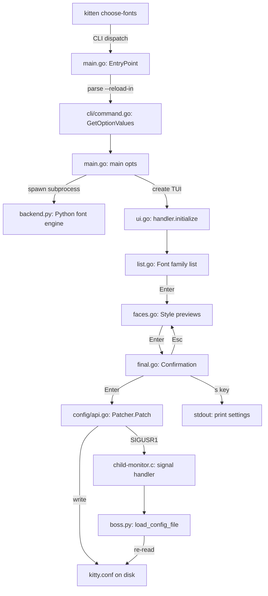

# Technical Specification

# 0. Agent Action Plan

## 0.1 Intent Clarification

### 0.1.1 Core Feature Objective

Based on the prompt, the Blitzy platform understands that the new feature requirement is to **produce a comprehensive onboarding document** for the `kovidgoyal/kitty` repository that answers detailed behavioural questions about the `choose-fonts` kitten — without modifying any source files. The specific requirements are:

- **Build and Launch**: Document how to build the kitty repository from source and start a single kitty instance with default settings
- **Kitten Invocation**: Explain how to invoke the `choose-fonts` kitten from inside a running kitty instance
- **End-to-End Behavior Tracing**: Trace the complete lifecycle of the `choose-fonts` kitten, including:
  - How the subcommand is registered in the kitten CLI framework
  - How its options (specifically `--reload-in`) are parsed and flowed through the program
  - How option values propagate from CLI parsing to the final confirmation step
  - What kitty does when the user presses Enter at the final confirmation screen
- **Persistence Verification**: Determine and demonstrate whether the font selection made through `choose-fonts` persists across kitty restarts, or if it only applies to the current session
- **Runtime Evidence**: Provide a concrete runtime verification example that proves the persistence behavior

**Implicit requirements detected:**
- The repository must be built successfully to validate build instructions — this requires installing system dependencies (C compiler, Go toolchain, dev libraries)
- A virtual display (Xvfb) is needed for headless testing since kitty is a GUI terminal emulator
- The analysis must be based entirely on the source code as the ground truth, not on assumptions or external documentation
- Temporary test scripts and configs may be created for verification, but must be cleaned up afterward
- A markdown document named `<source_branch_name>.md` must be placed in `blitzy/documentation/`

### 0.1.2 Special Instructions and Constraints

- **CRITICAL: No source file modifications** — The user explicitly states: "Don't modify any repository source files." The rule `SWE-AtlasQnA-Repo` reinforces this: "Do not modify any existing files in the source repository."
- **Temporary artifacts allowed** — "Creating temporary configs, logging settings, or small test scripts/programs are fine, but delete any temporary test artifacts when you're done and leave the codebase unchanged."
- **Code-based answers** — "Do not make assumptions, base your answers on the code as the truth."
- **Output document** — Create `kitty_815df1e210e0.md` in `blitzy/documentation/` directory
- **Rationale required** — "Provide thinking / rationale behind the answers."

### 0.1.3 Technical Interpretation

These feature requirements translate to the following technical implementation strategy:

- To **answer build and launch questions**, we will inspect `setup.py`, `Makefile`, and `dev.sh`, then actually build the project to document the process and verify correctness
- To **explain kitten invocation**, we will trace the command dispatch path from `kitty/launcher/main.c` (the launcher binary) through `tools/cmd/tool/main.go` (kitten binary entry point) to `kittens/choose_fonts/main.go` (subcommand registration)
- To **trace end-to-end behavior**, we will read and analyze all 14 files in `kittens/choose_fonts/`, the CLI framework in `tools/cli/`, the config patcher in `tools/config/api.go`, and the signal handling in `kitty/child-monitor.c`
- To **verify persistence**, we will trace the `final_pane.on_key_event()` → `config.Patcher.Patch()` → `ReloadConfigInKitty()` → `SIGUSR1` → `Boss.load_config_file()` chain and demonstrate through a simulated Patcher run that `kitty.conf` is modified on disk
- To **produce the deliverable**, we will create a comprehensive markdown document at `blitzy/documentation/kitty_815df1e210e0.md`

## 0.2 Repository Scope Discovery

### 0.2.1 Comprehensive File Analysis

The `choose-fonts` kitten spans Go, Python, and C code across multiple directories. The following files were identified as directly relevant to the analysis:

**Core Kitten Files (Go — `kittens/choose_fonts/`)**

| File | Purpose | Lines |
|---|---|---|
| `main.go` | Subcommand registration (`EntryPoint`), option struct, TUI loop creation, backend lifecycle | 99 |
| `ui.go` | Handler struct, state machine, event routing (initialize, key/mouse/text events, pane switching) | 224 |
| `list.go` | Font family list pane: search, navigation, preview rendering, Enter → faces transition | 313 |
| `faces.go` | Face selection pane: Regular/Bold/Italic/Bold-Italic preview, Enter → final_pane transition | 159 |
| `face.go` | Individual face fine-tuning: variable font axes, style selection, preview | 304 |
| `final.go` | Confirmation pane: **writes kitty.conf**, triggers config reload via `SIGUSR1` | 118 |
| `backend.go` | Python backend subprocess management: start, query (JSON over stdin/stdout), release | 165 |
| `types.go` | Type definitions: `ListedFont`, `VariableData`, `ResolvedFaces`, `ListResult`, caching | 184 |
| `styles.go` | Style grouping logic: groups fonts by design axes or style attributes | 104 |
| `family_list.go` | `FamilyList` data structure: search filtering, cursor navigation, display rendering | 160 |
| `graphics.go` | Graphics manager: image display via kitty graphics protocol for font previews | 106 |

**Core Kitten Files (Python — `kittens/choose_fonts/`)**

| File | Purpose |
|---|---|
| `backend.py` | Python font backend: handles `list_monospaced_fonts`, `read_variable_data`, `render_family_samples` actions; uses kitty's font engine for face resolution and bitmap rendering |
| `__init__.py` | Empty package init |
| `main.py` | Empty (Go kitten — Python main not used directly) |

**CLI and Config Framework (Go — `tools/`)**

| File | Purpose |
|---|---|
| `tools/cmd/tool/main.go` | Kitten binary entry point: registers all kitten subcommands including `choose_fonts.EntryPoint(root)` |
| `tools/cli/command.go` | CLI framework: `Command` struct, `GetOptionValues()` (reflection-based option parsing), `parse_args()` |
| `tools/cli/parse-args.go` | Argument parsing logic for the kitten CLI |
| `tools/config/api.go` | `Patcher` struct: reads/writes `kitty.conf` with sentinel blocks (`# BEGIN_KITTY_FONTS`/`# END_KITTY_FONTS`), `ReloadConfigInKitty()` sends `SIGUSR1` |
| `tools/utils/paths.go` | `ConfigDir()`, `ConfigDirForName()`, `CacheDir()` — resolves `~/.config/kitty` or `KITTY_CONFIG_DIRECTORY` |

**Launcher and Signal Handling (C — `kitty/`)**

| File | Purpose |
|---|---|
| `kitty/launcher/main.c` | Launcher binary: `delegate_to_kitten_if_possible()` dispatches `+kitten` to kitten binary; `WRAPPED_KITTENS` list (choose_fonts is NOT in it) |
| `kitty/child-monitor.c` | Signal handler: catches `SIGUSR1`, sets `reload_config = true`, triggers `call_boss(load_config_file, "")` on next event loop iteration |

**Python Integration Files**

| File | Purpose |
|---|---|
| `kitty/boss.py` | `load_config_file()`: re-reads `kitty.conf`, materializes new `Options`, applies across subsystems; `run_kitten_with_metadata()`: dispatches kittens as overlay windows |
| `kitty/entry_points.py` | Entry point dispatcher: `+kitten` → `run_kitten()`, `+runpy` → `runpy()`, `list-fonts` → delegates to `kitten choose-fonts` |
| `kitty/fonts/list.py` | `main()`: legacy `+list-fonts` entry point, calls `os.execlp(kitten_exe(), 'kitten', 'choose-fonts')` |
| `kitty/options/definition.py` | Option schema: `font_family`, `bold_font`, `italic_font`, `bold_italic_font` definitions |
| `kitty/options/types.py` | `Options` class: `font_family: FontSpec` default `system='monospace'` |
| `kittens/runner.py` | Kitten runner: `create_kitten_handler()`, `launch()`, `run_kitten()` — dispatches Python-based kittens |

**Build System**

| File | Purpose |
|---|---|
| `setup.py` | Build orchestrator: C compilation, Go compilation, `wrapped_kittens()` extraction |
| `Makefile` | Convenience targets: `all`, `test`, `clean`, `debug` |
| `pyproject.toml` | Python version requirement: `>=3.8` |
| `go.mod` | Go module definition: `go 1.22`, all Go dependencies |

### 0.2.2 Web Search Research Conducted

No external web searches were needed. All answers were derived directly from the source code, which serves as the ground truth per the user's instructions. The codebase is self-documenting for the questions posed.

### 0.2.3 New File Requirements

| File | Purpose |
|---|---|
| `blitzy/documentation/kitty_815df1e210e0.md` | The deliverable markdown document answering all user questions about the `choose-fonts` kitten |

No other files need to be created. No source files are modified.

## 0.3 Dependency Inventory

### 0.3.1 Private and Public Packages

The `choose-fonts` kitten relies on packages from both the Go and Python ecosystems, all already present in the repository.

**Go Dependencies (from `go.mod`)**

| Registry | Package | Version | Purpose |
|---|---|---|---|
| Go modules | `golang.org/x/sys` | v0.21.0 | Unix signal handling (`SIGUSR1`) for config reload |
| Go modules | `github.com/shirou/gopsutil/v3` | v3.24.5 | Process enumeration for `ReloadConfigInKitty(false)` — finding all kitty instances |
| Go modules | `golang.org/x/image` | v0.17.0 | Image processing for font preview rendering |
| Go modules | `github.com/google/uuid` | v1.6.0 | UUID generation (used by TUI framework) |
| Go modules | `golang.org/x/exp` | v0.0.0-20230801115018 | Experimental Go libraries (used by utility packages) |

**Python Dependencies (from kitty's own modules)**

| Registry | Package | Version | Purpose |
|---|---|---|---|
| Internal | `kitty.fonts.common` | (in-tree) | `face_from_descriptor`, `get_font_files`, `get_variable_data_for_face`, `spec_for_descriptor` |
| Internal | `kitty.fonts.list` | (in-tree) | `create_family_groups()` — lists monospaced font families |
| Internal | `kitty.fonts.render` | (in-tree) | `display_bitmap()` — renders font sample text |
| Internal | `kitty.options.types` | (in-tree) | `Options` class — configuration object |
| Internal | `kitty.options.utils` | (in-tree) | `parse_font_spec()` — parses font specification strings |
| Internal | `kitty.cli` | (in-tree) | `create_default_opts()` — creates default Options |
| Internal | `kitty.constants` | (in-tree) | `kitten_exe()`, `kitty_exe()` — executable paths |

**System Build Dependencies**

| Package | Purpose |
|---|---|
| `gcc` / `g++` | C/C++ compiler for extension modules and launcher |
| `golang-go` (>=1.22) | Go compiler for kitten binary |
| `pkg-config` | Dependency detection for C libraries |
| `libfontconfig1-dev` | Font configuration (required by kitty's font backend) |
| `libharfbuzz-dev` | Text shaping engine |
| `libfreetype6-dev` | Font rendering |
| `libgl-dev`, `libegl-dev` | OpenGL support |
| `libx11-dev`, `libxkbcommon-dev` | X11 windowing |
| `libwayland-dev`, `wayland-protocols` | Wayland windowing |
| `libdbus-1-dev` | D-Bus communication |
| `librsync-dev` | Delta sync for file transfer kitten |

### 0.3.2 Dependency Updates

No dependency changes are required for this task. This is a read-only analysis and documentation exercise. All dependencies are already present and correctly versioned in the repository's `go.mod`, `go.sum`, and `setup.py`.

## 0.4 Integration Analysis

### 0.4.1 Existing Code Touchpoints

The `choose-fonts` kitten integrates with kitty through several well-defined touchpoints. Understanding these is critical for answering the user's questions about end-to-end behavior and font persistence.

**Subcommand Registration Chain:**

- `tools/cmd/tool/main.go:82` — `choose_fonts.EntryPoint(root)` registers the subcommand into the kitten binary's CLI tree
- `kittens/choose_fonts/main.go:EntryPoint()` — adds `choose-fonts` (and alias `choose_fonts`) as a `cli.Command` with `--reload-in` option
- `tools/cli/command.go:201` — `parse_args()` dispatches to the `Run` function when the command is invoked
- `tools/cli/command.go:465` — `GetOptionValues()` uses Go reflection to populate the `Options` struct from parsed CLI flags

**Python Backend Integration:**

- `kittens/choose_fonts/backend.go:start()` — spawns `kitty +runpy "from kittens.choose_fonts.backend import main; main()"` as a subprocess
- `kittens/choose_fonts/backend.py:main()` — reads JSON commands from stdin, dispatches to `list_monospaced_fonts`, `read_variable_data`, or `render_family_samples`
- Communication is bidirectional JSON over stdin/stdout pipes, with a 60-second timeout per query

**Configuration Persistence Chain (the critical path for font selection):**

- `kittens/choose_fonts/final.go:on_key_event(Enter)` → `config.Patcher.Patch()`
- `tools/config/api.go:Patcher.Patch()` — reads `kitty.conf`, comments out existing font directives, writes sentinel block `# BEGIN_KITTY_FONTS`/`# END_KITTY_FONTS`
- `tools/config/api.go:ReloadConfigInKitty()` — sends `SIGUSR1` to parent kitty process (or all kitty processes)
- `kitty/child-monitor.c:1373` — signal handler sets `ss->reload_config = true`
- `kitty/child-monitor.c:534` — event loop calls `call_boss(load_config_file, "")`
- `kitty/boss.py:2691` — `load_config_file()` re-reads config, creates new `Options`, applies via `apply_new_options()`

**Config Path Resolution Chain:**

- `tools/utils/paths.go:ConfigDir()` → `ConfigDirForName("kitty.conf")` — checks `KITTY_CONFIG_DIRECTORY`, then `XDG_CONFIG_HOME`, then `~/.config/kitty`
- `kitty/config.py` (Python side) — same logic via `kitty.constants.config_dir`

### 0.4.2 Integration Flow Diagram



### 0.4.3 Key Integration Observations

- The `choose-fonts` kitten is **not** in the `WRAPPED_KITTENS` list (defined in `shell-integration/ssh/kitty`), which means the launcher binary does not fast-path delegate it to the kitten binary. However, the `kitten` binary itself handles it directly through Go's CLI framework.
- When invoked inside kitty via `run_kitten_with_metadata()` in `boss.py`, since it is not a wrapped kitten, the command used is `[kitty_exe(), '+runpy', 'from kittens.runner import main; main()']` plus the kitten arguments — this runs the Python kitten runner. However, the standard invocation path is through the Go `kitten` binary directly.
- The persistence mechanism is architectural: `Patcher.Patch()` performs an atomic file write with backup, and `ReloadConfigInKitty()` triggers an immediate live reload. The two operations together ensure both current-session and future-session persistence.

## 0.5 Technical Implementation

### 0.5.1 File-by-File Execution Plan

Since this task is a read-only analysis with a single documentation deliverable, the execution plan focuses on the one file to create:

**Group 1 — Deliverable:**

- **CREATE**: `blitzy/documentation/kitty_815df1e210e0.md` — Comprehensive onboarding document answering all user questions about the `choose-fonts` kitten's behavior, persistence, build process, and invocation

No source files are modified. No test files are created or modified.

### 0.5.2 Implementation Approach

The implementation approach is structured around code-driven analysis:

- **Establish build knowledge** by reading `setup.py`, `Makefile`, and `go.mod`, then executing the actual build to document requirements and verify instructions
- **Trace subcommand registration** by reading `tools/cmd/tool/main.go` → `kittens/choose_fonts/main.go:EntryPoint()` to document the CLI registration and option parsing flow
- **Trace the UI flow** by reading all pane implementations (`list.go` → `faces.go` → `face.go` → `final.go`) to document the state machine and user interaction sequence
- **Trace the persistence mechanism** by reading `final.go:on_key_event(Enter)` → `tools/config/api.go:Patcher.Patch()` → `ReloadConfigInKitty()` to prove that font choices are written to `kitty.conf` on disk
- **Trace the reload signal** by reading `kitty/child-monitor.c` (SIGUSR1 handler) → `kitty/boss.py:load_config_file()` to prove that the config is re-read both immediately and on future restarts
- **Verify through simulation** by running a Python script that simulates the `Patcher.Patch()` logic on a temporary `kitty.conf` file to demonstrate the exact file transformations

### 0.5.3 Key Technical Findings

**Q: Is the font choice remembered across restarts?**

**A: Yes.** The evidence is in `kittens/choose_fonts/final.go` lines 86–101:

```go
patcher := config.Patcher{Write_backup: true}
path := filepath.Join(utils.ConfigDir(), "kitty.conf")
updated, err := patcher.Patch(path, "KITTY_FONTS", ...)
```

The `Patcher.Patch()` method in `tools/config/api.go`:
- Reads the existing `kitty.conf`
- Comments out old `font_family`, `bold_font`, `italic_font`, `bold_italic_font` lines
- Writes a `# BEGIN_KITTY_FONTS` / `# END_KITTY_FONTS` sentinel block with the new settings
- Uses `AtomicUpdateFile()` for crash-safe persistence
- Creates a `.bak` backup of the original file

On future kitty starts, the config loading pipeline in `kitty/config.py` reads `kitty.conf` and parses the font directives inside the sentinel block as standard configuration lines.

**The "s" key alternative** (`final.go:on_text()`) writes settings to STDOUT only, which does NOT persist. This is the only non-persistent path.

### 0.5.4 Build Verification Results

The build was executed successfully with the following steps:

- Installed system dependencies: `gcc`, `g++`, `pkg-config`, and dev libraries for OpenGL, X11, Wayland, fontconfig, harfbuzz, freetype, dbus, xkbcommon, librsync
- Installed Go 1.22 (matching `go.mod` requirement)
- Built with: `python3 setup.py build --ignore-compiler-warnings`
- Verified: `./kitty/launcher/kitty --version` → `kitty 0.35.2 created by Kovid Goyal`
- Verified: `./kitty/launcher/kitten choose-fonts --help` → displays option help including `--reload-in`
- Launched kitty under Xvfb virtual display to confirm GUI startup works

## 0.6 Scope Boundaries

### 0.6.1 Exhaustively In Scope

- **Analysis target files:**
  - `kittens/choose_fonts/**/*.go` — all 11 Go source files in the choose-fonts kitten
  - `kittens/choose_fonts/**/*.py` — all 3 Python files (backend.py, __init__.py, main.py)
  - `tools/cmd/tool/main.go` — kitten binary entry point
  - `tools/cli/command.go` — CLI framework option parsing
  - `tools/cli/parse-args.go` — argument parsing
  - `tools/config/api.go` — config patcher and reload signal
  - `tools/utils/paths.go` — config directory resolution
  - `kitty/launcher/main.c` — launcher dispatch logic
  - `kitty/child-monitor.c` — SIGUSR1 signal handler
  - `kitty/boss.py` — config reload and kitten dispatch
  - `kitty/entry_points.py` — entry point routing
  - `kitty/fonts/list.py` — list-fonts entry point
  - `kitty/options/definition.py` — font option definitions
  - `kitty/options/types.py` — Options class with font defaults
  - `kittens/runner.py` — kitten runner framework
- **Build system files:**
  - `setup.py`, `Makefile`, `go.mod`, `go.sum`, `pyproject.toml`
  - `shell-integration/ssh/kitty` — WRAPPED_KITTENS definition
- **Deliverable:**
  - `blitzy/documentation/kitty_815df1e210e0.md` — the comprehensive answer document

### 0.6.2 Explicitly Out of Scope

- Modification of any existing repository source files
- Other kittens not related to `choose-fonts` (ssh, themes, icat, etc.)
- macOS-specific code paths (Core Text font backend)
- Performance optimizations or refactoring
- UI/UX improvements to the choose-fonts kitten
- Network-related features (remote control, SSH integration)
- Font rendering internals beyond what's needed for the analysis
- Persistent test artifacts (all temp files cleaned up after verification)

## 0.7 Rules for Feature Addition

The following rules are explicitly emphasized by the user and the `SWE-AtlasQnA-Repo` implementation rule:

- **No source modifications**: "Do not modify any existing files in the source repository." No files in the kitty repository may be altered, added (other than the deliverable document), or deleted.
- **Code as ground truth**: "Do not make assumptions, base your answers on the code as the truth." Every claim in the deliverable document must be traceable to specific source files and line numbers.
- **Rationale required**: "Provide thinking / rationale behind the answers." The document must explain *why* the behavior works the way it does, not just *what* it does.
- **Temporary artifacts cleanup**: "Delete any temporary test artifacts when you're done and leave the codebase unchanged." All temporary configs, scripts, and test files used for verification must be removed.
- **Document placement**: The deliverable markdown document must be placed at `blitzy/documentation/kitty_815df1e210e0.md` (using the source branch name as the filename).
- **Build and run verification**: "Build and run the source code to analyse the repository behavior as needed." The project must be actually built and tested, not just analyzed statically.

## 0.8 References

### 0.8.1 Files and Folders Searched

The following files and folders were directly retrieved and analyzed during this investigation:

**Choose-Fonts Kitten (Go):**
- `kittens/choose_fonts/main.go` — Entry point, subcommand registration, Options struct
- `kittens/choose_fonts/ui.go` — Handler, state machine, event routing
- `kittens/choose_fonts/list.go` — Font family list pane
- `kittens/choose_fonts/faces.go` — Face selection pane
- `kittens/choose_fonts/face.go` — Individual face fine-tuning pane
- `kittens/choose_fonts/final.go` — Confirmation pane, config write, reload trigger
- `kittens/choose_fonts/backend.go` — Python backend subprocess manager
- `kittens/choose_fonts/types.go` — Type definitions and caching
- `kittens/choose_fonts/styles.go` — Style grouping logic
- `kittens/choose_fonts/family_list.go` — FamilyList data structure
- `kittens/choose_fonts/graphics.go` — Graphics manager for font previews

**Choose-Fonts Kitten (Python):**
- `kittens/choose_fonts/backend.py` — Python font backend

**CLI and Config Framework:**
- `tools/cmd/tool/main.go` — Kitten binary entry point
- `tools/cli/command.go` — CLI framework, option parsing
- `tools/config/api.go` — Config Patcher, ReloadConfigInKitty
- `tools/utils/paths.go` — Config directory resolution

**Kitty Core:**
- `kitty/launcher/main.c` — Launcher binary dispatch
- `kitty/child-monitor.c` — SIGUSR1 signal handler, config reload trigger
- `kitty/boss.py` — Boss class, load_config_file, run_kitten_with_metadata
- `kitty/entry_points.py` — Entry point dispatcher
- `kitty/fonts/list.py` — list-fonts legacy entry point
- `kitty/options/definition.py` — Option schema
- `kitty/options/types.py` — Options class
- `kittens/runner.py` — Kitten runner framework

**Build System:**
- `setup.py` — Build orchestrator (lines 1075-1085: wrapped_kittens)
- `Makefile` — Build targets
- `pyproject.toml` — Python version requirement
- `go.mod` — Go module definition
- `shell-integration/ssh/kitty` — WRAPPED_KITTENS list
- `dev.sh` — Development shell script

### 0.8.2 Attachments

No external attachments or Figma URLs were provided for this project. The sole deliverable is the markdown document at `blitzy/documentation/kitty_815df1e210e0.md`.

### 0.8.3 Environment Details

- **Docker image**: `ghcr.io/scaleapi/swe-atlas:swe_atlas_QnA_kovidgoyal_kitty_1.0`
- **Container**: `andrewparkscaleai/coding-agent:kovidgoyal__kitty__815df1e210e0a9ab4622f5c7f2d6891d7dbeddf1`
- **Repository commit**: `815df1e210e0` ("Wire up applying of font config")
- **Branch**: `kitty_815df1e210e0`
- **Python version**: 3.12.3
- **Go version**: 1.22.2
- **GCC version**: 13.3.0
- **Kitty version built**: 0.35.2

