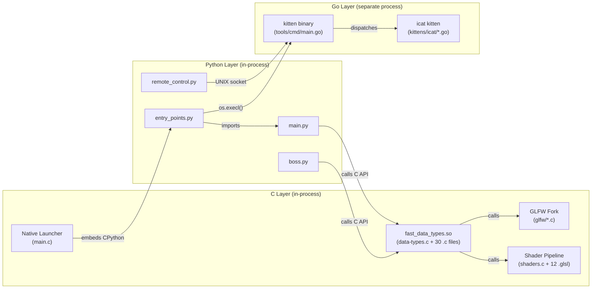

# Technical Specification

# 0. Agent Action Plan

## 0.1 Intent Clarification

### 0.1.1 Core Feature Objective

Based on the prompt, the Blitzy platform understands that the new feature requirement is to produce a comprehensive runtime-investigation document that answers deep architectural questions about how the Kitty terminal emulator divides rendering-adjacent work across its three implementation languages (Python, C, and Go). The deliverable is a single Markdown document placed at `blitzy/documentation/kitty_815df1e210e0.md` that captures verifiable, runtime-derived evidence rather than static code-reading assumptions.

The specific investigation objectives are:

- **Build and launch Kitty from source** — Compile the repository's C extensions, Go `kitten` binary, and Python orchestration layer, then start the terminal emulator inside the sandboxed environment
- **Apply sustained rendering pressure** — Execute workloads that produce heavy colored output, scrollback churn, repeated window resizes, and tab switching to push the rendering pipeline into continuous operation
- **Introspect loaded modules and libraries** — Identify which Kitty-specific C extension modules (`fast_data_types`, etc.) and which major rendering/font shared libraries (FreeType, HarfBuzz, OpenGL, Fontconfig/CoreText) are mapped into the main Kitty process at runtime
- **Measure thread-activity delta** — Compare the thread count and activity profile of the Kitty process at idle versus under sustained rendering stress, correlating thread behavior with the documented three-thread architecture (Main, I/O, Talk)
- **Query the remote control interface under load** — Use `kitty @` commands (such as `ls`, `get-text`, `get-colors`) to capture live state while the terminal is under rendering pressure, including the exact commands issued and their outputs
- **Observe the kitten process model** — Execute `kitty +kitten icat` on an image file and document the process relationship between the main `kitty` process and the `kitten` child, including whether kitten runs in-process or as a separate executable
- **Inspect the kitten binary** — Use `file`, `ldd`/`otool`, `nm`, or similar tools to confirm that the `kitten` binary is a statically-linked Go executable, not a Python script or a C extension loaded into the main process
- **Capture symbol or stack snapshots** — Obtain at least one symbol-level or stack-level snapshot (via `/proc/PID/maps`, `pmap`, `strace`, `py-spy`, `gdb`, `perf`, or similar) of the Kitty process during the stress run; if a specific tool is blocked, document the error and use an alternative method
- **Infer language responsibilities from artifacts** — Based exclusively on the collected runtime evidence, infer which responsibilities belong to Python, C, and Go respectively
- **Falsify plausible-but-wrong interpretations** — Explicitly rule out at least two interpretations that would be plausible from code-reading alone but are contradicted by the runtime observations
- **Identify a portability-versus-performance tradeoff** — Describe at least one design tradeoff between portability and performance that is directly supported by the runtime observations
- **Leave the repository unchanged** — Temporary scripts used during investigation must be cleaned up; no permanent modifications to existing repository files

### 0.1.2 Special Instructions and Constraints

- **SWE-AtlasQnA-Repo Rule**: The user's project rule mandates that the output be a new markdown document named `kitty_815df1e210e0.md` placed in the `blitzy/documentation` directory. No existing repository files may be modified and no other code may be added. The document must provide thinking and rationale behind every answer, basing conclusions on code-as-truth, not assumptions.
- **No persistent repository modifications**: Temporary helper scripts (e.g., stress-test generators, strace wrappers) are allowed during the investigation but must be removed after results are captured.
- **Runtime-first methodology**: All conclusions about the Python/C/Go division must derive from observable runtime artifacts — process maps, thread lists, loaded libraries, stack traces, remote-control outputs — not from static code reading alone. Code references may support but not substitute for runtime evidence.
- **Verifiable observations**: Every command used for inspection must appear in the output document with its full invocation and (summarized) output, so that another engineer can reproduce the observations.
- **Environment constraints**: The sandboxed environment may lack a physical GPU, display server, or certain tools. The document must honestly report what could and could not be observed, showing errors where tools were blocked and the fallback methods used.

### 0.1.3 Technical Interpretation

These feature requirements translate to the following technical implementation strategy:

- To **produce the investigation document**, we will create a single Markdown file `blitzy/documentation/kitty_815df1e210e0.md` that systematically walks through each investigation phase with commands, outputs, analysis, and conclusions.
- To **build Kitty from source**, we will install Python ≥ 3.8, GCC/Clang with C11 support, Go 1.22, and the required native libraries (FreeType, HarfBuzz, Fontconfig, OpenGL/Mesa, libpng, lcms2, libcrypto), then execute the `setup.py` build system and `go build` for the kitten binary.
- To **apply rendering pressure**, we will use shell-based stress generators (rapid `printf` with ANSI color codes, `seq` piped to `cat`, `yes` with escape sequences) alongside programmatic resize and tab-creation via the remote-control interface.
- To **introspect runtime state**, we will read `/proc/PID/maps` for loaded `.so` files, use `python -c "import kitty.fast_data_types"` introspection, query `/proc/PID/task/` for thread enumeration, and invoke `kitty @ ls` for window/tab state.
- To **observe kitten process relationships**, we will run `kitty +kitten icat <image>` and simultaneously inspect `ps`, `pstree`, and `/proc` to capture PID, PPID, and executable paths.
- To **capture stack/symbol snapshots**, we will attempt `py-spy`, `/proc/PID/maps`, `gdb -batch`, `strace`, or `perf` in order of preference, documenting any tool that is unavailable and the fallback used.
- To **infer and falsify**, we will correlate all collected runtime artifacts into a coherent model of language responsibilities, then explicitly construct and refute two common misconceptions.

## 0.2 Repository Scope Discovery

### 0.2.1 Comprehensive File Analysis

The investigation touches every major subsystem of the Kitty repository because the user's questions span the full Python/C/Go language boundary. Below is a categorized inventory of all files and directories relevant to the runtime investigation and the conclusions the document must draw.

**Core C Engine — Performance-Critical Hot Paths (kitty/*.c, kitty/*.h)**

| File / Pattern | Relevance to Investigation |
|---|---|
| `kitty/child-monitor.c` | Three-thread architecture (Main, I/O, Talk); `main_loop()`, `io_loop()`, `talk_loop()` — thread activity observations |
| `kitty/vt-parser.c`, `kitty/vt-parser.h` | VT escape sequence parsing — appears in C stack frames under stress |
| `kitty/screen.c`, `kitty/screen.h` | Screen model updates — hot path during scrollback churn |
| `kitty/line.c`, `kitty/line-buf.c` | Line buffer management — hot under heavy output |
| `kitty/shaders.c` | OpenGL shader compilation/execution — GPU rendering path |
| `kitty/gl.c`, `kitty/gl-wrapper.c` | GLAD/OpenGL binding layer — loaded library evidence |
| `kitty/freetype.c`, `kitty/fontconfig.c` | FreeType/Fontconfig font discovery — library linkage evidence |
| `kitty/glyph-cache.c` | GPU glyph texture atlas — rendering performance path |
| `kitty/fonts.c`, `kitty/fonts.h` | Font subsystem orchestration — HarfBuzz shaping evidence |
| `kitty/graphics.c`, `kitty/graphics.h` | Graphics protocol (icat uses this) — image handling path |
| `kitty/keys.c`, `kitty/key_encoding.c` | Input handling — active during stress keyboard input |
| `kitty/state.c`, `kitty/state.h` | Global state structure — thread-shared data model |
| `kitty/data-types.c`, `kitty/data-types.h` | `fast_data_types` C extension module — central native module |
| `kitty/simd-string-128.c`, `kitty/simd-string-256.c` | SIMD acceleration — architecture-specific optimization evidence |
| `kitty/mouse.c` | Mouse event processing |
| `kitty/colors.c`, `kitty/colors.h` | Color management — sRGB conversion |
| `kitty/history.c` | Scrollback ring buffer — stressed during scrollback churn |
| `kitty/png-reader.c` | PNG decoding — used by icat image path |
| `kitty/kittens.c` | Native kitten response parser |

**GLSL Shaders — GPU Rendering Pipeline (kitty/*.glsl)**

| File | Purpose |
|---|---|
| `kitty/cell_vertex.glsl`, `kitty/cell_fragment.glsl` | Text cell rendering |
| `kitty/border_vertex.glsl`, `kitty/border_fragment.glsl` | Window border decoration |
| `kitty/graphics_vertex.glsl`, `kitty/graphics_fragment.glsl` | Inline image compositing (icat) |
| `kitty/bgimage_vertex.glsl`, `kitty/bgimage_fragment.glsl` | Background image rendering |
| `kitty/tint_vertex.glsl`, `kitty/tint_fragment.glsl` | Window tint overlay |
| `kitty/alpha_blend.glsl`, `kitty/linear2srgb.glsl` | Utility blending/color-space |

**Python Orchestration Layer (kitty/*.py)**

| File / Pattern | Relevance to Investigation |
|---|---|
| `kitty/main.py` | Application startup — GLFW init, font init, Boss creation, `main_loop()` entry |
| `kitty/entry_points.py` | Entry point dispatch — routes `+kitten`, `+hold`, GUI, etc. |
| `kitty/boss.py` | Central lifecycle controller — window/tab management, remote control dispatch |
| `kitty/shaders.py` | GLSL shader loading and preprocessor macro injection |
| `kitty/config.py` | Configuration loading pipeline |
| `kitty/remote_control.py` | Remote control protocol (client/server) — used to query live state |
| `kitty/constants.py` | Version (0.35.2), paths, `kitten_exe()` function |
| `kitty/window.py`, `kitty/tabs.py` | Window/tab Python-level management |
| `kitty/child.py` | PTY/child process spawning |
| `kitty/session.py` | Session creation for initial window layout |
| `kitty/borders.py` | Border shader program loading |
| `kitty/fast_data_types.pyi` | Typing stub for the `fast_data_types` C extension |

**Remote Control Commands (kitty/rc/*.py)**

| File | Investigation Use |
|---|---|
| `kitty/rc/ls.py` | `kitty @ ls` — JSON window/tab tree under load |
| `kitty/rc/get_text.py` | `kitty @ get-text` — screen content extraction |
| `kitty/rc/get_colors.py` | `kitty @ get-colors` — color state query |

**Native Launcher (kitty/launcher/)**

| File | Relevance |
|---|---|
| `kitty/launcher/main.c` | Process entry point — CPython embedding, path resolution, fast-path argument parsing |
| `kitty/launcher/single-instance.c` | Single-instance IPC via UNIX sockets |
| `kitty/launcher/launcher.h` | CLIOptions structure |

**Go CLI Tools and Kitten Binary (tools/)**

| File / Pattern | Relevance to Investigation |
|---|---|
| `tools/cmd/main.go` | Go `kitten` binary entry point — evidence of Go runtime |
| `tools/cmd/at/` | `kitty @` remote-control Go implementation |
| `tools/cmd/tool/` | Subcommand registration |
| `tools/utils/` | Shared utilities (image handling, shm, etc.) |
| `tools/tui/` | Go TUI support layer |
| `tools/crypto/` | X25519/AES-GCM for encrypted remote control |
| `go.mod` | Go 1.22 module declaration with 15 direct dependencies |
| `go.sum` | Dependency checksum ledger |

**Kittens — Python/Go Mixed Packages (kittens/)**

| File / Pattern | Relevance to Investigation |
|---|---|
| `kittens/icat/main.go` | icat Go implementation — process relationship observation |
| `kittens/icat/main.py` | icat Python CLI docs shim |
| `kittens/icat/native.go` | Native Go image decoding |
| `kittens/icat/detect.go` | Terminal graphics capability probing |
| `kittens/icat/transmit.go` | Graphics protocol transmission |
| `kittens/runner.py` | Kitten resolution and dynamic module loading |

**GLFW Platform Layer (glfw/)**

| File / Pattern | Relevance |
|---|---|
| `glfw/glfw.py` | Build helper and code generation |
| `glfw/x11_*.c`, `glfw/wl_*.c`, `glfw/cocoa_*.m` | Platform backend source — loaded library evidence |
| `glfw/glfw3.h` | GLFW 3.4 API header |
| `glfw/init.c`, `glfw/window.c`, `glfw/input.c` | Runtime initialization |

**Build System**

| File | Relevance |
|---|---|
| `setup.py` | Central build orchestrator — C compilation flags, Go build invocation, extension module registration |
| `Makefile` | Developer build surface |
| `pyproject.toml` | Python ≥ 3.8 requirement, mypy config |

**3rd Party Vendored Code (3rdparty/)**

| File | Relevance |
|---|---|
| `3rdparty/uthash.h` | Hash table macros used in C extensions |
| `3rdparty/ringbuf/` | Circular FIFO for I/O stream buffers |
| `3rdparty/base64/` | Fast Base64 codec with SIMD acceleration |

**Test Infrastructure (kitty_tests/)**

| File | Relevance |
|---|---|
| `kitty_tests/main.py` | Test runner that discovers Python/Go tests |
| `kitty_tests/parser.py` | VT parser stress tests |
| `kitty_tests/graphics.py` | Graphics protocol tests |
| `kitty_tests/gr.py` | Graphics protocol demo script |

**Code Generation (gen/)**

| File | Relevance |
|---|---|
| `gen/go_code.py` | Generates Go constants, completions, RC wrappers |
| `gen/key_constants.py` | Generates key tables across C, Python, Go |
| `gen/wcwidth.py` | Generates Unicode tables for C and Go |

### 0.2.2 Integration Point Discovery

The investigation requires understanding these cross-component integration points:

- **C Extension ↔ Python**: The `kitty.fast_data_types` module (compiled from `kitty/data-types.c` plus 30+ `.c` files) is the primary bridge — Python calls into C for screen operations, GLFW init, font loading, shader compilation, and child monitoring. Observable via `/proc/PID/maps` showing the `.so` file.
- **Main Thread ↔ I/O Thread ↔ Talk Thread**: Defined in `kitty/child-monitor.c`, threads are created via `pthread_create` and synchronized through mutexes (`children_lock`, `talk_lock`) and wakeup pipes. Observable via `/proc/PID/task/`.
- **Kitty Process ↔ Kitten Process**: The `kitten_exe()` function in `kitty/constants.py` returns the path to the Go `kitten` binary. When `kitty +kitten icat` is invoked, `entry_points.py` calls `os.execl(kitten_exe(), "kitten", *args)`, replacing the child process image with the Go binary. Observable via `ps`, `pstree`, and `file` on the binary.
- **Remote Control Protocol**: `kitty @ ls` connects via UNIX socket (configured by `--listen-on`) and sends JSON-encoded commands through the encrypted RC protocol. The Talk thread in `child-monitor.c` handles the socket I/O, dispatching to Python RC command modules in `kitty/rc/`.
- **GLFW ↔ OpenGL ↔ Shaders**: GLFW provides the platform window and OpenGL context; `kitty/gl.c` loads GL functions via GLAD; `kitty/shaders.c` compiles and executes the 12 GLSL shader files. Observable via `libGL.so`, `libEGL.so`, or Mesa libraries in the process map.

### 0.2.3 New File Requirements

**New Documentation File to Create:**

- `blitzy/documentation/kitty_815df1e210e0.md` — The comprehensive runtime investigation document answering all questions posed in the user's prompt. This file will contain:
  - Build and launch observations
  - Loaded module and library inventory
  - Thread activity comparison (idle vs. stress)
  - Remote control query outputs
  - Kitten process relationship analysis
  - Kitten binary inspection results
  - Symbol/stack snapshot capture
  - Language responsibility inference with evidence
  - Two falsified interpretations
  - One portability-vs-performance tradeoff
  - Full command/output transcripts for reproducibility

**Temporary Scripts (created and cleaned up during investigation):**

- `/tmp/stress_test.sh` — Shell script generating colored output, scrollback pressure, and resize commands
- `/tmp/inspect_runtime.sh` — Shell script capturing process maps, thread lists, and library loads

No existing repository files will be modified.

## 0.3 Dependency Inventory

### 0.3.1 Private and Public Packages

The following table catalogs all key packages relevant to building Kitty from source, running the investigation, and understanding the runtime artifacts. Versions are drawn directly from `pyproject.toml`, `go.mod`, `setup.py`, and `glfw/glfw3.h`.

**Build-Time Language Runtimes**

| Registry | Package | Version | Purpose |
|---|---|---|---|
| System | Python | ≥ 3.8 (from `pyproject.toml` line 2) | Embedded CPython interpreter; orchestration layer |
| System | GCC or Clang | C11-capable (`-std=c11` in `setup.py`) | C extension compilation |
| System | Go | 1.22 (from `go.mod` line 3) | Static `kitten` binary compilation |

**Native C Libraries (linked via pkg-config)**

| Registry | Package | Version | Purpose |
|---|---|---|---|
| System/pkg-config | FreeType | ≥ 2.0 (pkg-config `freetype2`) | Glyph rasterization (`kitty/freetype.c`) |
| System/pkg-config | HarfBuzz | ≥ 1.5 (documented in tech spec) | OpenType text shaping for ligatures |
| System/pkg-config | Fontconfig | System version (Linux only) | Font discovery (`kitty/fontconfig.c`) |
| System/pkg-config | libpng | System version | PNG decoding (`kitty/png-reader.c`) |
| System/pkg-config | lcms2 | System version | ICC color profile management |
| System/pkg-config | libcrypto (OpenSSL) | System version | X25519/AES-GCM encryption for remote control |
| System | OpenGL | 3.3+ (via GLAD loader in `kitty/gl.c`) | GPU rendering pipeline |
| System | Mesa/libGL | System version | Software/hardware GL implementation |
| System | zlib | System version | Compression support |

**Vendored C Dependencies (in-tree)**

| Registry | Package | Version | Purpose |
|---|---|---|---|
| In-tree | GLFW | 3.4 (vendored fork in `glfw/`) | Cross-platform windowing (X11/Wayland/Cocoa) |
| In-tree | uthash | Vendored (`3rdparty/uthash.h`) | Header-only C hash table macros |
| In-tree | ringbuf | Vendored (`3rdparty/ringbuf/`) | Circular FIFO for I/O stream buffers |
| In-tree | base64 | Vendored (`3rdparty/base64/`) | Fast Base64 codec with SIMD |

**Go Dependencies (from `go.mod`)**

| Registry | Package | Version | Purpose |
|---|---|---|---|
| go.pkg | `github.com/ALTree/bigfloat` | v0.2.0 | Arbitrary-precision floating point |
| go.pkg | `github.com/alecthomas/chroma/v2` | v2.14.0 | Syntax highlighting (diff kitten) |
| go.pkg | `github.com/bmatcuk/doublestar/v4` | v4.6.1 | Glob pattern matching |
| go.pkg | `github.com/dlclark/regexp2` | v1.11.0 | .NET-compatible regex engine |
| go.pkg | `github.com/edwvee/exiffix` | v0.0.0-20240229 | EXIF-aware image orientation (icat) |
| go.pkg | `github.com/google/go-cmp` | v0.6.0 | Deep comparison for testing |
| go.pkg | `github.com/google/uuid` | v1.6.0 | UUID generation |
| go.pkg | `github.com/kovidgoyal/imaging` | v1.6.3 | Image processing (resize, decode) |
| go.pkg | `github.com/seancfoley/ipaddress-go` | v1.6.0 | IP address parsing |
| go.pkg | `github.com/shirou/gopsutil/v3` | v3.24.5 | System/process information |
| go.pkg | `github.com/zeebo/xxh3` | v1.0.2 | xxHash3 hashing |
| go.pkg | `golang.org/x/exp` | v0.0.0-20230801 | Experimental Go packages |
| go.pkg | `golang.org/x/image` | v0.17.0 | Image format support |
| go.pkg | `golang.org/x/sys` | v0.21.0 | System calls and platform specifics |
| go.pkg | `howett.net/plist` | v1.0.1 | Apple plist parsing |

**Runtime Inspection Tools (for investigation, not project dependencies)**

| Tool | Purpose |
|---|---|
| `file` | Binary format identification (ELF/Mach-O, static vs. dynamic) |
| `ldd` / `readelf` | Shared library dependency listing |
| `nm` | Symbol table inspection |
| `strace` / `ltrace` | System call / library call tracing |
| `pmap` / `/proc/PID/maps` | Memory map inspection |
| `ps` / `pstree` | Process relationship observation |
| `py-spy` | Python stack sampling profiler |
| `gdb` | Stack-level snapshot capture |

### 0.3.2 Dependency Updates

This task does not require any dependency updates to existing files. The project is being investigated as-is, and the only output is a new documentation file. No `import` changes, `package.json` modifications, or `requirements.txt` updates are needed.

However, the investigation requires the following build-time dependencies to be **installed in the environment** for compilation:

- Python development headers (`python3-dev` or equivalent)
- FreeType development libraries (`libfreetype-dev`)
- HarfBuzz development libraries (`libharfbuzz-dev`)
- Fontconfig development libraries (`libfontconfig1-dev`)
- OpenGL/Mesa development libraries (`libgl-dev`, `libegl-dev`, `libgles-dev`)
- libpng development libraries (`libpng-dev`)
- lcms2 development libraries (`liblcms2-dev`)
- OpenSSL development libraries (`libssl-dev`)
- X11/Wayland development libraries (`libx11-dev`, `libxkbcommon-dev`, `libwayland-dev`)
- D-Bus development libraries (`libdbus-1-dev`)
- Go 1.22 toolchain
- pkg-config

## 0.4 Integration Analysis

### 0.4.1 Existing Code Touchpoints

The investigation interacts with the existing codebase exclusively through **read-only observation** and **runtime introspection**. No source modifications are made. The following touchpoints define where the investigation observes the running system.

**Direct Observation Points (runtime only, no modification):**

- **`kitty/launcher/main.c`** — Process entry; the native C launcher bootstraps CPython via `Py_InitializeFromConfig` and `Py_RunMain`, or in frozen builds uses the embedded interpreter. Observation: the compiled `kitty` binary in the build output directory is the investigation target. The launcher's role is confirmed by inspecting the process executable path and loaded interpreter libraries.

- **`kitty/entry_points.py` (lines 10-12, 151-197)** — Entry point dispatch. When the first argument is `+kitten icat`, the function `icat()` calls `os.execl(kitten_exe(), "kitten", *args)`, replacing the Python process image with the Go `kitten` binary. This `os.execl` is the critical code path that produces the process-separation observation for kitten vs. kitty.

- **`kitty/main.py` (lines 441-521)** — Application `_main()` function. The startup sequence — `parse_args → create_opts → setup_environment → init_glfw → run_app → boss.child_monitor.main_loop()` — defines the initialization order observable in startup logs and process state.

- **`kitty/child-monitor.c` (lines 55-62, 280-295, 1258-1274)** — The `ChildMonitor` struct holds `io_thread` and `talk_thread` pthread handles. The `start()` method (line 281) creates the I/O thread via `pthread_create(&self->io_thread, NULL, io_loop, self)` and optionally the talk thread. The `main_loop()` method (line 1259) invokes `run_main_loop(process_global_state, self)`. These threads are observable via `/proc/PID/task/`.

- **`kitty/child-monitor.c` (lines 833-896)** — The `render_os_window()` and `render()` functions. Under stress, `render()` iterates over all OS windows, calling `render_os_window()` which invokes `make_os_window_context_current()`, `prepare_to_render_os_window()`, `render_prepared_os_window()`, and `swap_window_buffers()`. These functions are the hot C path visible in stack traces.

- **`kitty/shaders.c` (lines 20-60)** — Shader program enumeration (`CELL_PROGRAM`, `BORDERS_PROGRAM`, `GRAPHICS_PROGRAM`, etc.) and sprite map management. The `alloc_sprite_map()` function queries `GL_MAX_TEXTURE_SIZE` — observable as OpenGL calls in strace output.

- **`kitty/data-types.c`** — The `fast_data_types` C extension module init. This single `.so` file bundles all C extensions (screen, line, child-monitor, fonts, graphics, shaders, etc.) into one importable Python module. Observable in `/proc/PID/maps` as a large `.so` file.

- **`kitty/remote_control.py`** — The remote control protocol layer. When `kitty @ ls` is invoked, the client serializes a JSON command, optionally encrypts it, and sends it over a UNIX socket. The server side (running in the Talk thread) deserializes, authorizes, and dispatches to the appropriate `kitty/rc/*.py` handler. Observable in the command outputs captured during the investigation.

- **`kitty/rc/ls.py`** — The `ls` remote command returns a JSON tree of OS windows, tabs, windows, and their properties. Under load, this reveals the number of active windows, tab titles, and window dimensions.

**Kitten Process Model Observation Points:**

- **`kitty/constants.py` (lines 82-84)** — `kitten_exe()` returns `os.path.join(os.path.dirname(kitty_exe()), 'kitten')`. This establishes that the `kitten` binary is a separate file adjacent to the `kitty` binary.

- **`tools/cmd/main.go` (lines 14-35)** — The Go `main()` function. This is the entry point of the statically-compiled `kitten` binary. It constructs a CLI command tree and dispatches to subcommands. Observable by running `file` on the binary and seeing `ELF 64-bit ... statically linked` (or `Go buildID` markers).

- **`kittens/icat/main.go`** — The `icat` kitten's Go-side entry point. When `kitten icat` runs, this Go code handles image decoding, terminal capability detection, and graphics protocol transmission. The process runs as a **separate OS process**, not loaded into the main kitty process.

### 0.4.2 Database/Schema Updates

No database or schema updates are required. Kitty uses only in-memory data structures (glyph cache in GPU texture atlas, scrollback ring buffer, screen model arrays) with no persistent database. The investigation observes these in-memory structures through remote control queries, not through any database interface.

### 0.4.3 Cross-Language Integration Boundaries

The investigation must trace these specific cross-language boundaries at runtime:

The key runtime observation is that the C and Python layers share a single process (with C code running as Python extension modules), while the Go layer always runs as a **separate process** communicating via sockets or terminal escape sequences.

## 0.5 Technical Implementation

### 0.5.1 File-by-File Execution Plan

The implementation consists of a single deliverable file plus temporary helper scripts. Every step below contributes to populating the output document.

**Group 1 — Environment Preparation:**

- INSTALL: Python ≥ 3.8 with development headers — Runtime for kitty process
- INSTALL: Go 1.22 — Compiler for the `kitten` static binary
- INSTALL: GCC/Clang with C11 support — Compiler for C extension modules
- INSTALL: Native libraries (FreeType, HarfBuzz, Fontconfig, OpenGL/Mesa, libpng, lcms2, libssl, libx11, libxkbcommon, libdbus-1, libwayland) — Linked by C extensions
- INSTALL: Inspection tools (strace, gdb, pmap, or py-spy as available)

**Group 2 — Build Phase:**

- EXECUTE: `python3 setup.py build` — Compiles all C extensions into `build/` directory, producing the `fast_data_types` `.so` file
- EXECUTE: `go build -v -o build/kitten tools/cmd` — Compiles the static Go `kitten` binary
- VERIFY: `file build/kitty` and `file build/kitten` — Confirms binary types (C launcher ELF vs. Go static ELF)

**Group 3 — Runtime Investigation (sequential phases):**

- CREATE (temporary): `/tmp/stress_test.sh` — Generates rapid colored output with ANSI escapes, scrollback churn via large `seq` output, and programmatic resizes
- EXECUTE: Launch kitty with `--listen-on unix:/tmp/kitty-test.sock` to enable remote control
- CAPTURE: `/proc/$(pgrep kitty)/maps` — Loaded `.so` files and memory layout
- CAPTURE: `/proc/$(pgrep kitty)/task/` — Thread enumeration at idle
- EXECUTE: Run stress test script in the kitty terminal
- CAPTURE: `/proc/$(pgrep kitty)/task/` — Thread enumeration under stress
- EXECUTE: `kitty @ --to unix:/tmp/kitty-test.sock ls` — Window/tab state under load
- EXECUTE: `kitty @ --to unix:/tmp/kitty-test.sock get-colors` — Color state query
- EXECUTE: `kitty +kitten icat <test-image>` — Kitten process observation
- CAPTURE: `ps aux | grep -E 'kitty|kitten'` — Process relationship during icat
- EXECUTE: `file build/kitten` — Binary format identification
- EXECUTE: `ldd build/kitten 2>&1 || readelf -d build/kitten` — Linkage analysis
- EXECUTE: `nm build/kitten 2>/dev/null | head -20 || go tool nm build/kitten | head -20` — Symbol inspection
- CAPTURE: Stack snapshot via `strace -p PID -e trace=write,read -c` or `cat /proc/PID/maps` or `gdb -batch -ex 'thread apply all bt' -p PID` — Symbol-level snapshot during stress
- CLEANUP: Remove `/tmp/stress_test.sh` and any other temporary files

**Group 4 — Document Assembly:**

- CREATE: `blitzy/documentation/kitty_815df1e210e0.md` — Final output document
  - Section 1: Build and Launch Observations
  - Section 2: Loaded Modules and Libraries
  - Section 3: Thread Activity (Idle vs. Stress)
  - Section 4: Remote Control Interface Queries
  - Section 5: Kitten Process Relationship
  - Section 6: Kitten Binary Inspection
  - Section 7: Symbol/Stack Snapshot
  - Section 8: Language Responsibility Inference
  - Section 9: Two Falsified Interpretations
  - Section 10: Portability vs. Performance Tradeoff
  - Appendix: Full Command Transcripts

### 0.5.2 Implementation Approach per File

The approach follows a strict **observe-then-document** methodology:

- **Establish the build environment** by installing all required compilers, libraries, and tools, then compiling Kitty from source using the repository's `setup.py` build system and `go build` for the kitten binary
- **Launch and observe the baseline** by starting kitty with remote control enabled, capturing the process map, thread list, and loaded libraries at idle to establish the baseline state
- **Apply stress and re-observe** by running intensive colored output, scrollback generation, and resize operations while re-capturing thread activity, CPU usage, and remote control state to measure the delta from baseline
- **Observe kitten separation** by executing `kitty +kitten icat` on a test image and capturing the process tree to demonstrate that kitten runs as a separate Go binary, not as a Python module inside the kitty process
- **Inspect the kitten binary** using `file`, `ldd`, and `nm` to confirm it is a statically-linked Go binary with Go runtime symbols, establishing that Go code never runs inside the main kitty process
- **Capture stack/symbol evidence** using whatever inspection tools are available (strace, /proc/maps, gdb, py-spy, perf) to obtain at least one snapshot showing C-level and Python-level stack frames during rendering stress
- **Synthesize conclusions** by correlating all runtime artifacts into a coherent model, explicitly falsifying two common misconceptions, and identifying a portability-performance tradeoff grounded in the evidence
- **Assemble the document** with full command transcripts, analysis, and conclusions, placing it at `blitzy/documentation/kitty_815df1e210e0.md`

### 0.5.3 Investigation Methodology

The document must address each of the user's questions with the following investigation approach:

| Question | Method | Expected Evidence |
|---|---|---|
| What gets loaded into the main process? | `/proc/PID/maps`, `python -c "print(dir(fast_data_types))"` | `.so` paths for libfreetype, libharfbuzz, libGL, libfontconfig; `fast_data_types` extension |
| How does thread activity change? | `/proc/PID/task/` count at idle vs. stress | Thread count stays at 3 (Main/IO/Talk) but CPU time distribution shifts |
| What does the control interface expose? | `kitty @ ls`, `kitty @ get-colors` | JSON window/tab tree, color palette |
| How does kitten relate to kitty? | `ps`, `pstree`, process tree during `icat` | Separate PID, parent-child relationship, `os.execl` replacement |
| What runtime/language is kitten? | `file`, `ldd`, `nm` on the kitten binary | `ELF 64-bit statically linked`, `runtime.main`, Go build metadata |
| Symbol/stack snapshot | strace, /proc/maps, gdb, py-spy | C frames (`render_os_window`, `do_parse`), Python frames (`boss.py`) |
| Python vs C vs Go responsibilities | Correlation of all evidence | C: parsing+rendering+fonts; Python: orchestration+config+RC; Go: CLI+kittens+remote |
| Two falsified interpretations | Counter-evidence from runtime | E.g., "Go handles rendering" (false: no Go libraries in process map) |
| Portability-performance tradeoff | Binary inspection + architecture analysis | Go static binary = portable but no SIMD; C extensions = fast but platform-compiled |

## 0.6 Scope Boundaries

### 0.6.1 Exhaustively In Scope

**Output Artifact:**
- `blitzy/documentation/kitty_815df1e210e0.md` — The sole deliverable; a comprehensive runtime investigation document

**Repository Files Analyzed (read-only, using trailing wildcards where patterns apply):**
- `kitty/*.c` — All C source files in the core terminal engine (vt-parser, screen, child-monitor, shaders, fonts, graphics, keys, state, etc.)
- `kitty/*.h` — All C header files defining data structures, state, and interfaces
- `kitty/*.py` — All Python orchestration modules (main, boss, entry_points, remote_control, config, shaders, constants, etc.)
- `kitty/*.glsl` — All 12 GLSL shader files constituting the GPU rendering pipeline
- `kitty/*.pyi` — Type stubs for C extension modules
- `kitty/launcher/*.c` — Native launcher source (main.c, single-instance.c)
- `kitty/launcher/*.h` — Launcher header (launcher.h)
- `kitty/rc/*.py` — All 41 remote control command modules
- `kitty/options/**/*.py` — Configuration schema, parser, types
- `kitty/layout/**/*.py` — Layout engine modules
- `kitty/fonts/**/*.py` — Font subsystem Python modules
- `kittens/icat/*.go` — icat Go implementation (main.go, native.go, detect.go, transmit.go, process_images.go, magick.go)
- `kittens/icat/*.py` — icat Python CLI shim
- `kittens/runner.py` — Kitten discovery and execution framework
- `tools/cmd/main.go` — Go kitten binary entry point
- `tools/cmd/**/*.go` — All Go command implementations
- `tools/utils/**/*.go` — Go utility libraries
- `tools/tui/**/*.go` — Go TUI support
- `tools/crypto/**/*.go` — Go cryptographic support
- `glfw/**/*.c` — GLFW platform backends (X11, Wayland, Cocoa, null)
- `glfw/**/*.h` — GLFW headers
- `glfw/**/*.m` — GLFW Objective-C source (macOS)
- `3rdparty/**/*` — Vendored C dependencies (uthash, ringbuf, base64)
- `gen/**/*.py` — Code generation scripts
- `gen/**/*.txt` — Code generation data files
- `kitty_tests/**/*.py` — Test infrastructure and regression suites
- `setup.py` — Central build orchestrator
- `Makefile` — Developer build commands
- `pyproject.toml` — Python project metadata
- `go.mod`, `go.sum` — Go module definition and checksums
- `shell.nix` — Nix development shell definition
- `dev.sh`, `test.py`, `__main__.py` — Developer utility scripts

**Runtime Observation Targets:**
- The compiled `kitty` binary (C launcher + embedded CPython)
- The compiled `kitten` binary (Go static binary)
- The compiled `fast_data_types` `.so` extension module
- The running kitty process (PID, threads, memory maps, loaded libraries)
- The running kitten process during `icat` invocation
- UNIX socket for remote control communication
- `/proc/PID/maps`, `/proc/PID/task/`, `/proc/PID/status` pseudo-files

**Investigation Phases:**
- Build compilation and binary verification
- Idle-state baseline observation
- Rendering stress application and observation
- Remote control interface querying under load
- Kitten process relationship observation
- Kitten binary inspection
- Stack/symbol snapshot capture
- Evidence synthesis and document assembly

### 0.6.2 Explicitly Out of Scope

- **Modification of any existing repository file** — The SWE-AtlasQnA-Repo rule prohibits changes to existing files
- **Addition of code to the repository** — Only the documentation file in `blitzy/documentation/` is permitted
- **Performance benchmarking** — The investigation describes qualitative behavior (thread activity, loaded libraries) not quantitative benchmarks (fps, throughput)
- **macOS/Cocoa-specific observations** — The sandboxed environment is Linux-based; Cocoa/CoreText paths cannot be exercised
- **Wayland-specific observations** — Unless a Wayland compositor is available; X11 or headless paths may be used instead
- **GPU-accelerated rendering validation** — The sandbox likely lacks a physical GPU; software rendering via Mesa/llvmpipe is acceptable for observation purposes
- **Security audit of the remote control protocol** — Encryption and authorization are not investigated beyond observing that the protocol functions
- **Refactoring or optimization recommendations** — The document answers the user's architectural questions, not suggesting improvements
- **Windows, mobile, or web platform investigation** — Explicitly excluded by Kitty's platform scope
- **Custom kitten development** — Only built-in kittens (specifically `icat`) are exercised
- **Shell integration testing** — Not part of the user's investigation questions

## 0.7 Rules for Feature Addition

### 0.7.1 Project-Specific Rules

The user has specified the following implementation rule under **SWE-AtlasQnA-Repo**:

- **Create a new markdown document** named `kitty_815df1e210e0.md` (matching the source branch name `kitty_815df1e210e0`) that comprehensively answers the questions posed in the prompt
- **Provide thinking and rationale** behind every answer — the document must not simply state conclusions but must walk through the reasoning chain that leads from runtime evidence to each inference
- **Do not make assumptions** — base all answers on the code (and runtime behavior) as the source of truth, not on general knowledge of how terminal emulators typically work
- **Do not modify any existing files** in the source repository
- **Do not add any other code** in the source repository besides the requested document
- **Place the generated document** in the `blitzy/documentation` directory in the destination repo

### 0.7.2 Investigation-Specific Rules

- **Runtime-first evidence**: Every claim about the Python/C/Go division must be supported by a specific runtime artifact (process map entry, thread listing, binary inspection result, remote control output, or stack frame). Static code references may provide context but cannot be the sole evidence.
- **Verifiable methodology**: Every inspection command must be recorded with its full invocation and output (or summarized output) so that the observations can be independently reproduced.
- **Honest error reporting**: If a tool is unavailable or blocked (e.g., `perf` requires root, `py-spy` not installed), the document must report the error and describe the alternative method used. Gaps in evidence must be acknowledged.
- **Repository cleanliness**: Temporary scripts (stress generators, inspection wrappers) must be deleted after the investigation completes. The final state of the repository must be identical to the initial state, with only the new documentation file added.
- **At least two falsified interpretations**: The document must explicitly construct and refute two specific interpretations of the language division that would be plausible from superficial inspection but are contradicted by the runtime evidence.
- **At least one tradeoff**: The document must identify and describe one portability-versus-performance tradeoff that is directly supported by the runtime observations, not by general software engineering principles.
- **Process isolation observation**: The kitten process model must be demonstrated through actual process tree inspection (ps, pstree, or /proc), not inferred from source code alone.
- **Binary-level evidence**: The `kitten` binary must be inspected with `file`, `ldd`, and/or `nm` to confirm its language and linkage characteristics, providing concrete evidence for the Go layer's runtime nature.

### 0.7.3 Architectural Conventions to Follow

Based on the existing repository structure and documented architecture:

- **Three-language boundary**: The document must respect and articulate the established boundary — C for hot paths (parsing, rendering, fonts), Python for orchestration (config, kittens runner, layout, remote control commands), Go for static CLI tooling (kitten binary, remote control client)
- **Three-thread model**: Thread observations should align with the documented Main/IO/Talk thread architecture in `child-monitor.c`
- **Extension module unity**: The `fast_data_types` C extension is a single `.so` file containing all C-level types and functions — the document should reflect this monolithic extension design
- **Kitten process model**: Kittens built in Go (`icat`, etc.) run as separate processes via `os.execl` — the document should demonstrate this with process tree evidence; Python-based kittens run within the kitty process via dynamic import

## 0.8 References

### 0.8.1 Repository Files and Folders Searched

The following files and directories were directly retrieved and analyzed to derive the conclusions in this Agent Action Plan:

**Root-Level Files:**
- `setup.py` — Central build orchestrator; C extension compilation, Go binary build (`build_static_kittens`), compiler flags, security hardening
- `pyproject.toml` — Python ≥ 3.8 requirement (`requires-python = ">=3.8"`), mypy strict configuration, ruff linting rules
- `go.mod` — Go 1.22 module declaration, 15 direct dependencies including imaging, chroma, gopsutil, xxh3
- `go.sum` — Go dependency checksum ledger
- `Makefile` — Developer build commands
- `__main__.py` — Script execution entry point
- `dev.sh` — Development launcher
- `test.py` — Test entry point

**Core Application (kitty/):**
- `kitty/entry_points.py` — Entry point dispatch; `icat()` calls `os.execl(kitten_exe())`, `main()` routes to `kitty_main()`
- `kitty/main.py` — Application startup: config loading → GLFW init → font init → Boss creation → `main_loop()`
- `kitty/constants.py` — Version 0.35.2, `kitty_exe()`, `kitten_exe()`, config directory resolution
- `kitty/boss.py` (summary) — Central lifecycle controller; global singleton for windows, tabs, remote control
- `kitty/remote_control.py` (summary) — RC protocol implementation: command serialization, encryption, authorization
- `kitty/shaders.py` — GLSL source loading, preprocessor macro injection, `CompileError` class
- `kitty/fast_data_types.pyi` — Type stubs for C extension: constants, GLFW keys, functions, types

**C Engine Layer (kitty/*.c, kitty/*.h):**
- `kitty/child-monitor.c` — Three-thread architecture (`io_thread`, `talk_thread`), `main_loop()`, `render()`, `io_loop()`, `talk_loop()`, child management, PTY I/O multiplexing
- `kitty/data-types.c` — `fast_data_types` module initialization; includes charsets, base64, control-codes, monotonic
- `kitty/shaders.c` — Shader program management; sprite map allocation; OpenGL state
- `kitty/state.h` — Global state structure (`OPT()` macro, rendering options, color values, timing parameters)
- `kitty/vt-parser.c` (via summary) — VT escape sequence parsing state machine
- `kitty/screen.c`, `kitty/line.c` (via summary) — Screen model and line buffer management
- `kitty/gl.c`, `kitty/gl-wrapper.c` (via summary) — GLAD OpenGL loader and wrapper
- `kitty/freetype.c`, `kitty/fontconfig.c` (via summary) — Font discovery and rasterization
- `kitty/glyph-cache.c` (via summary) — GPU texture atlas for glyph caching
- `kitty/graphics.c` (via summary) — Graphics protocol and image buffer management
- `kitty/kittens.c` — Native kitten response parser (DCS protocol framing)

**Native Launcher (kitty/launcher/):**
- `kitty/launcher/main.c` — Process entry; CPython embedding, path resolution, fast-path argument parsing
- `kitty/launcher/single-instance.c` — UNIX socket IPC for single-instance mode
- `kitty/launcher/launcher.h` — CLIOptions structure definition

**GLSL Shaders (kitty/*.glsl):**
- 12 shader files: `cell_vertex.glsl`, `cell_fragment.glsl`, `border_vertex.glsl`, `border_fragment.glsl`, `bgimage_vertex.glsl`, `bgimage_fragment.glsl`, `graphics_vertex.glsl`, `graphics_fragment.glsl`, `tint_vertex.glsl`, `tint_fragment.glsl`, `alpha_blend.glsl`, `linear2srgb.glsl`

**Remote Control Commands (kitty/rc/):**
- `kitty/rc/base.py` (via summary) — `RemoteCommand` base class, 41 command modules
- `kitty/rc/ls.py` — JSON window/tab tree command
- `kitty/rc/get_text.py` — Screen content extraction
- `kitty/rc/get_colors.py` — Color state query

**Go Tools (tools/):**
- `tools/README.rst` — Documents tools/ as home for statically compiled kitten utilities
- `tools/cmd/main.go` — Go binary entry point; CLI command tree construction, dispatch to subcommands
- `tools/cmd/at/` (summary) — Remote control `@` command Go implementation
- `tools/cmd/tool/` (summary) — Subcommand registration
- `tools/utils/` (summary) — Shared Go utilities
- `tools/crypto/` (summary) — X25519/AES-GCM encryption
- `tools/tui/` (summary) — Go TUI support layer

**Kittens (kittens/):**
- `kittens/runner.py` — Kitten resolution, alias mapping, dynamic module import, result serialization
- `kittens/icat/` (full directory summary) — Go-implemented image viewer: `main.go`, `native.go`, `detect.go`, `transmit.go`, `process_images.go`, `magick.go`
- `kittens/icat/main.py` — Python CLI documentation shim
- `kittens/icat/__init__.py` — Empty package marker

**GLFW Platform Layer (glfw/):**
- `glfw/` (full directory summary) — Vendored GLFW 3.4 fork with ~65 files across Cocoa, X11, Wayland, null backends
- `glfw/glfw.py` — Build helper and Wayland protocol generation
- `glfw/glfw3.h` — GLFW 3.4 public API header

**Vendored Dependencies (3rdparty/):**
- `3rdparty/uthash.h` — Header-only hash table macros
- `3rdparty/ringbuf/` — Circular FIFO for I/O buffers
- `3rdparty/base64/` — Fast Base64 codec with SIMD

**Code Generation (gen/):**
- `gen/` (full directory summary) — Code generation scripts for C, Python, and Go: configs, keys, Unicode tables, cursors, APC parsers

**Test Infrastructure (kitty_tests/):**
- `kitty_tests/` (full directory summary) — Test harness, PTY-driven integration tests, graphics protocol tests

**Technical Specification Sections Retrieved:**
- Section 3.1 — Programming Languages (C11, Python ≥ 3.8, Go 1.22, GLSL, Objective-C)
- Section 4.1 — High-Level System Workflow (application lifecycle, event loop architecture)
- Section 4.8 — Kittens Framework Execution Flow (kitten resolution, execution, serialization)
- Section 5.1 — High-Level Architecture (six-layer architecture, three-language strategy, data flows)
- Section 6.1 — Core Services Architecture (single-process model, three-thread architecture, in-memory stores)
- Section 7.2 — GPU Rendering Pipeline (six-stage shader pipeline, font rendering, threaded rendering)

### 0.8.2 Attachments

No attachments were provided for this project. No Figma URLs or design files are referenced.

### 0.8.3 External References

- Kitty repository source branch: `kitty_815df1e210e0`
- Output document: `blitzy/documentation/kitty_815df1e210e0.md`
- Kitty project website: `https://sw.kovidgoyal.net/kitty/`
- Kitty version under investigation: 0.35.2 (from `kitty/constants.py` line 25)
- Go module: `kitty` at Go 1.22 (from `go.mod`)
- Python requirement: ≥ 3.8 (from `pyproject.toml`)
- C standard: C11 with `-std=c11` (from `setup.py`)

