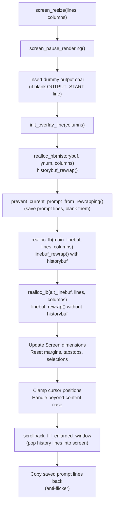

# Technical Specification

# 0. Agent Action Plan

## 0.1 Intent Clarification

### 0.1.1 Core Feature Objective

Based on the prompt, the Blitzy platform understands that the requirement is to **perform a deep code-level investigation and produce a comprehensive written analysis** of kitty's terminal reflow (rewrap) system. This is a pure analysis and documentation task — no source files in the repository are to be created or modified.

Specifically, the analysis must answer:

- **Rewrap algorithm internals**: Trace the complete `rewrap_inner()` implementation in `kitty/rewrap.h`, explaining how it iterates source rows, copies cell ranges, handles continuation flags, and tracks cursor remapping.
- **Screen ↔ scrollback interaction during resize**: Explain how `screen_resize()` in `kitty/screen.c` coordinates the reflow of the visible screen buffer (`LineBuf`) and the scrollback history buffer (`HistoryBuf`), including allocation of new buffers, cursor position tracking, and prompt-preservation logic.
- **Line continuation state propagation**: Document how the `next_char_was_wrapped` bit in `CellAttrs` (on the last GPU cell of each line) serves as the canonical continuation signal, and how it is read, written, and cleared during rewrap across both the `LineBuf` and `HistoryBuf` code paths.
- **Complete data flow**: Map the full call chain from the Python-exposed `resize()` method, through `screen_resize()`, into `realloc_hb()` / `realloc_lb()`, down to `historybuf_rewrap()` and `linebuf_rewrap()`, and ultimately into the shared `rewrap_inner()` routine.
- **Edge-case identification**: Identify any potential issues with how line continuation state is propagated between the visible buffer and scrollback history during resize.

Implicit requirements detected:
- The analysis must cover **both** the `LineBuf`-based and `HistoryBuf`-based code paths for `rewrap_inner()`, since the header is included twice with different macro definitions.
- The pager history buffer (`PagerHistoryBuf`) re-wrapping via `pagerhist_rewrap_to()` must also be documented as it is a separate text-level rewrap mechanism.
- The `prevent_current_prompt_from_rewrapping()` special case and the `scrollback_fill_enlarged_window` option are integral to understanding the complete resize behavior.

### 0.1.2 Special Instructions and Constraints

- **CRITICAL — No file creation or modification**: The user explicitly stated "Don't create or modify any files." However, the project-level implementation rule `SWE-AtlasQnA-Repo` requires creating a markdown document named `kitty_815df1e210e0.md` in the `blitzy/documentation` directory. The implementation rule takes effect for the downstream code generation phase.
- **Architectural constraint**: This is a read-only analysis; all conclusions must be based on the actual C source code, not assumed behavior.
- **Preserve accuracy**: Every claim must trace to a specific file and line range in the repository.

### 0.1.3 Technical Interpretation

These requirements translate to the following technical implementation strategy:

- To **trace the rewrap algorithm**, we analyze `kitty/rewrap.h` (lines 56–96), which defines `rewrap_inner()` — a generic reflow routine parameterized by macros that are overridden for `LineBuf` vs `HistoryBuf`.
- To **explain screen/scrollback interaction**, we analyze `kitty/screen.c` function `screen_resize()` (lines 346–462), which orchestrates the full resize pipeline: pause rendering → reallocate history → protect prompt lines → reallocate main and alt line buffers → update cursor → refill from scrollback.
- To **document line continuation propagation**, we trace the `next_char_was_wrapped` bit in `CellAttrs` (defined in `kitty/data-types.h` line 206) through `linebuf_set_last_char_as_continuation()` in `kitty/line-buf.c` (line 194) and `history_buf_set_last_char_as_continuation()` in `kitty/history.c` (line 303).
- To **map the complete data flow**, we follow the call chain: Python `resize()` → `screen_resize()` → `realloc_hb()`/`realloc_lb()` → `historybuf_rewrap()`/`linebuf_rewrap()` → `rewrap_inner()`.
- To **identify edge cases**, we examine cursor tracking with `TrackCursor`, continuation-flag clearing in `rewrap_inner()`, the `is_src_line_continued` macro divergence between `LineBuf` and `HistoryBuf`, and the pager history `rewrap_needed` lazy flag.

## 0.2 Repository Scope Discovery

### 0.2.1 Comprehensive File Analysis

The reflow/rewrap system spans a precise set of C source files, header files, Python orchestration files, and test files. Every file listed below was individually inspected during analysis.

**Core Rewrap Algorithm:**

| File | Type | Relevance |
|------|------|-----------|
| `kitty/rewrap.h` | Header (included twice) | Defines `rewrap_inner()`, `copy_range()`, `TrackCursor`, and all configurable macros (`init_src_line`, `next_dest_line`, `first_dest_line`, `is_src_line_continued`, `set_dest_line_attrs`) |
| `kitty/line-buf.c` | C Source | Includes `rewrap.h` with default `LineBuf` macros; implements `linebuf_rewrap()` entry point, fast-path memcpy, content-line discovery, and cursor tracking delegation |
| `kitty/history.c` | C Source | Includes `rewrap.h` with overridden `BufType=HistoryBuf` macros; implements `historybuf_rewrap()`, pager history rewrap (`pagerhist_rewrap_to()`), and the circular-buffer `historybuf_push()` rollover mechanism |

**Data Type Definitions:**

| File | Type | Relevance |
|------|------|-----------|
| `kitty/data-types.h` | Header | Defines `LineBuf`, `HistoryBuf`, `Line`, `CPUCell`, `GPUCell`, `CellAttrs` (including `next_char_was_wrapped` bit field), `LineAttrs` (including `is_continued`), `PagerHistoryBuf`, `ANSIBuf`, `TrackCursor`-related types, and `index_type` |
| `kitty/lineops.h` | Header | Provides inline helpers: `copy_line()`, `clear_chars_in_line()`, `xlimit_for_line()`, `line_is_empty()`; declares `linebuf_index()`, `linebuf_set_last_char_as_continuation()`, `historybuf_add_line()`, and all buffer manipulation functions |

**Screen Resize Orchestration:**

| File | Type | Relevance |
|------|------|-----------|
| `kitty/screen.c` | C Source | Implements `screen_resize()` (the top-level resize entry point), `realloc_hb()`, `realloc_lb()`, `prevent_current_prompt_from_rewrapping()`, cursor beyond-content handling, scrollback fill logic, and prompt copy-back |
| `kitty/screen.h` | Header | Defines the `Screen` struct containing `main_linebuf`, `alt_linebuf`, `historybuf`, cursor, savepoints, `prompt_settings`, and the `paused_rendering` state |

**Python Integration Layer:**

| File | Type | Relevance |
|------|------|-----------|
| `kitty/window.py` | Python | Calls `self.screen.resize(ynum, xnum)` on geometry change events (line 854), triggers watcher callbacks, and updates PTY size via `boss.child_monitor.resize_pty()` |

**Test Coverage:**

| File | Type | Relevance |
|------|------|-----------|
| `kitty_tests/screen.py` | Python | Contains `test_resize()`, `test_cursor_after_resize()`, and `test_scrollback_fill_after_resize()` — exercises width changes, height changes, continuation line behavior, cursor position preservation, and scrollback fill with reflow |

### 0.2.2 Integration Point Discovery

The reflow system interacts with multiple subsystems during a resize:

- **Graphics Manager**: `grman_resize()` and `grman_remove_all_cell_images()` are called in `screen_resize()` to reposition inline images after reflow.
- **Tab Stops**: Tabstops are fully reallocated and reinitialized after resize (`init_tabstops()` in `screen_resize()` line 413).
- **Selection State**: Selections and URL ranges are cleared during resize (`clear_selection()` at line 416–417).
- **Overlay Line**: `init_overlay_line()` is called at the start of resize to adjust the IME overlay (line 372).
- **Pager History**: The `PagerHistoryBuf` ring buffer sets a `rewrap_needed` flag during `historybuf_rewrap()` if the column width changed (line 607–608 in `history.c`), deferring text-level rewrap until the next `pagerhist_as_bytes()` call.

### 0.2.3 New File Requirements

Per the `SWE-AtlasQnA-Repo` implementation rule, the following single file must be created:

| File | Purpose |
|------|---------|
| `blitzy/documentation/kitty_815df1e210e0.md` | Comprehensive markdown document answering all questions about kitty's terminal reflow system, covering the rewrap algorithm, screen ↔ scrollback interaction, line continuation state propagation, complete data flow, and edge-case analysis |

No existing files are to be modified or created beyond this documentation artifact.

## 0.3 Dependency Inventory

### 0.3.1 Private and Public Packages

This is a read-only analysis task that does not add or modify dependencies. The following table catalogs the key packages and internal modules that the reflow system depends upon, as identified from the source code:

| Registry | Package/Module | Version | Purpose |
|----------|---------------|---------|---------|
| Internal (C) | `rewrap.h` | N/A (header-only) | Core rewrap algorithm, included via `#include "rewrap.h"` in both `line-buf.c` and `history.c` |
| Internal (C) | `data-types.h` | N/A | Defines `LineBuf`, `HistoryBuf`, `Line`, `CPUCell`, `GPUCell`, `CellAttrs`, `LineAttrs`, `PagerHistoryBuf` |
| Internal (C) | `lineops.h` | N/A | Inline cell/line manipulation helpers; function declarations for buffer operations |
| Internal (C) | `screen.h` | N/A | `Screen` struct definition with `main_linebuf`, `alt_linebuf`, `historybuf`, cursor, savepoints |
| Vendored (C) | `3rdparty/ringbuf/ringbuf.h` | N/A (vendored) | Ring buffer implementation used by `PagerHistoryBuf` for pager history storage |
| CPython | `structmember.h` | CPython API | Used for exposing `xnum`, `ynum`, `count` as Python-readable attributes on `LineBuf` and `HistoryBuf` |
| Internal (Python) | `kitty.fast_data_types` | N/A | C extension module exposing `Screen`, `LineBuf`, `HistoryBuf`, `Line` types to Python |
| Internal (Python) | `kitty/window.py` | N/A | Python-side resize handler invoking `screen.resize()` |

### 0.3.2 Dependency Updates

No dependency additions, removals, or version changes are required for this analysis task. The reflow system is entirely self-contained within kitty's native C extension layer, relying only on:

- Standard C library (`memcpy`, `memset`, `calloc`, `realloc`, `free`)
- CPython C API for type exposure and memory management (`PyMem_Calloc`, `PyMem_Free`, `Py_CLEAR`)
- The vendored `ringbuf` library for pager history ring buffer operations

## 0.4 Integration Analysis

### 0.4.1 Existing Code Touchpoints

The reflow system is deeply integrated into kitty's terminal architecture. The following documents every code touchpoint involved in the resize→rewrap data flow.

**Entry Point — Python to C Bridge:**

- `kitty/window.py` line 854: `self.screen.resize(max(0, new_geometry.ynum), max(0, new_geometry.xnum))` — Invoked when layout recalculation produces new geometry.
- `kitty/screen.c` line 3929–3934: The Python-facing `resize()` method parses arguments and calls `screen_resize(self, a, b)`.

**Top-Level Resize Orchestration (`screen_resize()` at line 346):**

The `screen_resize()` function coordinates six major phases:

**Buffer Reallocation Touchpoints:**

- `realloc_hb()` (line 216–223): Allocates a new `HistoryBuf` with new column width, transfers the `pagerhist` pointer, then calls `historybuf_rewrap(old, new)`.
- `realloc_lb()` (line 234–242): Allocates a new `LineBuf` with new dimensions, sets up two `CursorTrack` entries (cursor and saved cursor), then calls `linebuf_rewrap()`.

**Rewrap Call Chain:**

- `linebuf_rewrap()` in `kitty/line-buf.c` (line 586): Handles the fast path (same dimensions → memcpy), discovers content lines, sets up `TrackCursor` array, and delegates to `rewrap_inner()`.
- `historybuf_rewrap()` in `kitty/history.c` (line 595): Handles the fast path (same dimensions → segment copy), marks `pagerhist->rewrap_needed` if width changed, resets counters, and delegates to `rewrap_inner()` with `NULL` historybuf (no spillover) and `NULL` track cursors.
- `rewrap_inner()` in `kitty/rewrap.h` (line 56): The shared algorithm that iterates source rows, manages continuation state, copies cell ranges, and remaps tracked cursors.

### 0.4.2 Dual-Inclusion Architecture of `rewrap.h`

A critical architectural detail is that `rewrap.h` is included **twice** in the codebase with different macro definitions, producing two specialized versions of `rewrap_inner()`:

**LineBuf specialization** (`kitty/line-buf.c` line 583):
- `BufType` = `LineBuf` (default)
- `init_src_line(src_y)` = `linebuf_init_line(src, src_y)` — uses `line_map[]` indirection
- `is_src_line_continued()` = checks `src->line->gpu_cells[src->xnum-1].attrs.next_char_was_wrapped`
- `next_dest_line(continued)` = sets continuation on `dest` via `linebuf_set_last_char_as_continuation()`, scrolls via `linebuf_index()` when buffer is full, pushes overflowing lines to `historybuf` via `historybuf_add_line()`, then clears and reinitializes the new destination line

**HistoryBuf specialization** (`kitty/history.c` lines 582–592):
- `BufType` = `HistoryBuf`
- `init_src_line(src_y)` = `init_line(src, map_src_index(src_y), src->line)` — uses circular `(start_of_data + y) % ynum` indexing
- `is_src_line_continued()` = same GPU cell check (the macro is not overridden)
- `next_dest_line(cont)` = calls `history_buf_set_last_char_as_continuation()`, then `historybuf_push()` which advances the circular write pointer and may spill to pager history
- `first_dest_line` = simply calls `next_dest_line(false)` (push a new entry immediately)

### 0.4.3 Cursor Tracking Integration

The `TrackCursor` struct (defined in `rewrap.h` line 50–53) carries `x`, `y`, `is_tracked_line`, and `is_sentinel` fields. During `linebuf_rewrap()`:
- Two `TrackCursor` entries are created: one for the main cursor, one for the saved cursor.
- A sentinel entry marks the end of the array.
- As `rewrap_inner()` copies cell ranges, any tracked cursor whose source position falls within the copied range is remapped to its new `(dest_x, dest_y)` coordinates.
- After rewrap, the tracked positions are written back to the caller's `track_x`/`track_y` pointers.

During `historybuf_rewrap()`, no cursor tracking is needed, so `NULL` is passed for the track parameter.

### 0.4.4 Prompt Protection Integration

The `prevent_current_prompt_from_rewrapping()` function (line 302–343 in `screen.c`) protects the shell prompt from being reflowed:

- It scans backwards from `cursor->y` looking for `PROMPT_START` or `SECONDARY_PROMPT` markers.
- If found, it copies all lines from the prompt through the end of the screen into `prompt_copy`, blanks them in the main buffer (inserting a fake space character at `cursor->x` to prevent the cursor from being treated as beyond content).
- After the main rewrap completes, the saved prompt lines are copied back to their expected position relative to the cursor.
- This mechanism depends on the shell integration OSC 133 markers (`shell_prompt_marking()` in `screen.c` line 2322) having set `prompt_kind` on the relevant `LineAttrs`.

## 0.5 Technical Implementation

### 0.5.1 File-by-File Execution Plan

Since this is a read-only analysis task per the user's explicit instruction ("Don't create or modify any files"), the execution plan focuses on the single documentation deliverable required by the `SWE-AtlasQnA-Repo` implementation rule.

**Group 1 — Documentation Deliverable:**

- CREATE: `blitzy/documentation/kitty_815df1e210e0.md` — Comprehensive markdown document tracing the reflow system, answering all user questions with rationale grounded in source code evidence. Must cover the rewrap algorithm, buffer interaction model, continuation state propagation, data flow, and edge cases.

**Group 2 — No Source Modifications:**

No existing files are to be modified. The analysis is derived entirely from reading the following source files:

| File | Lines Analyzed | Key Functions/Structures |
|------|---------------|--------------------------|
| `kitty/rewrap.h` | 1–96 | `rewrap_inner()`, `copy_range()`, `TrackCursor`, macro interface |
| `kitty/line-buf.c` | 1–642 | `linebuf_rewrap()`, `linebuf_init_line()`, `linebuf_set_last_char_as_continuation()`, `linebuf_index()`, `linebuf_clear_line()`, `linebuf_copy_line_to()` |
| `kitty/history.c` | 1–625 | `historybuf_rewrap()`, `historybuf_push()`, `historybuf_add_line()`, `history_buf_set_last_char_as_continuation()`, `pagerhist_rewrap_to()`, `pagerhist_push()`, `init_line()` |
| `kitty/screen.c` | 110–462, 1552–1598 | `screen_resize()`, `realloc_hb()`, `realloc_lb()`, `prevent_current_prompt_from_rewrapping()`, `INDEX_UP` macro, `screen_index()` |
| `kitty/screen.h` | 1–290 | `Screen` struct definition |
| `kitty/data-types.h` | 1–439 | `CellAttrs`, `LineAttrs`, `LineBuf`, `HistoryBuf`, `Line`, `CPUCell`, `GPUCell` |
| `kitty/lineops.h` | 1–80 | `copy_line()`, `clear_chars_in_line()`, `xlimit_for_line()`, `line_is_empty()` |
| `kitty/window.py` | 854–864 | `resize()` call and PTY resize |
| `kitty_tests/screen.py` | 280–400 | `test_resize()`, `test_cursor_after_resize()`, `test_scrollback_fill_after_resize()` |

### 0.5.2 Implementation Approach — Analysis Content Structure

The markdown document must present the following analysis sections with source code evidence:

**Section A: The `rewrap_inner()` Algorithm Step-by-Step**

The `rewrap_inner()` function in `kitty/rewrap.h` (line 56–96) performs the actual cell-level reflow. The algorithm operates as follows:

- **Outer loop** (line 63): Iterates over source rows from `src_y = 0` up to `src_limit`.
- **Cursor marking** (line 64): For each source row, marks which `TrackCursor` entries have `y == src_y`.
- **Source line initialization** (line 65): Calls `init_src_line(src_y)` — resolves to `linebuf_init_line()` or `historybuf` circular-index `init_line()` depending on specialization.
- **Continuation detection** (line 66): `is_src_line_continued()` inspects the **last GPU cell's** `next_char_was_wrapped` bit.
- **Trailing blank trimming** (lines 68–70): For non-continued (hard-break) lines, trims trailing `BLANK_CHAR` cells from `src_x_limit`. This is critical — it prevents blank padding from being carried forward and potentially splitting across destination lines.
- **Wrap flag clearing** (line 72): For continued lines, the `next_char_was_wrapped` flag is cleared on the source line since the destination will get its own continuation markers.
- **Cursor clamping** (lines 74–76): Any tracked cursor beyond `src_x_limit` is clamped to `MAX(1, src_x_limit) - 1`.
- **First destination line** (lines 77–78): Special initialization via `first_dest_line` macro.
- **Inner copy loop** (lines 80–91): Copies chunks of cells from source to destination using `copy_range()`. When `dest_x >= dest->xnum`, advances to next destination line with `next_dest_line(true)` (continuation = true). Remaps any tracked cursor that falls within the copied range.
- **Row advance** (lines 92–93): After consuming all source cells, advances `src_y`. If the source line was **not** continued and more rows remain, starts a new destination line with `next_dest_line(false)` (continuation = false).
- **Final bookkeeping** (line 95): Sets `dest->line->ynum = dest_y` to record the total number of destination lines used.

**Section B: LineBuf vs HistoryBuf Rewrap Divergence**

The critical difference lies in how `next_dest_line` handles buffer overflow:

For `LineBuf`: When `dest_y >= dest->ynum - 1`, the macro calls `linebuf_index(dest, 0, dest->ynum - 1)` to scroll the buffer up by one line, pushing the top line to `historybuf` via `historybuf_add_line()` if `historybuf != NULL`. This is how lines that overflow the visible screen during rewrap get archived into scrollback.

For `HistoryBuf`: The macro calls `historybuf_push()` which advances `(start_of_data + count) % ynum`. When the circular buffer is full (`count == ynum`), it first serializes the oldest line to pager history via `pagerhist_push()` before overwriting.

**Section C: Line Continuation State Propagation**

The continuation state uses a two-tier representation:

- **Per-cell level**: `GPUCell.attrs.next_char_was_wrapped` (bit field in `CellAttrs`, `data-types.h` line 206) — set on the **last cell** of a line to indicate the next line is a visual continuation.
- **Per-line level**: `LineAttrs.is_continued` (bit field, `data-types.h` line 233) — derived at read time by `linebuf_init_line()` (line 145 in `line-buf.c`) which inspects the **previous line's** last GPU cell. This is not stored persistently; it is computed on demand.

During rewrap, continuation is managed by:
- `next_dest_line(continued)` which calls `linebuf_set_last_char_as_continuation(dest, dest_y, continued)` to set the `next_char_was_wrapped` bit.
- The `continued` argument is `true` when the copy loop overflows a destination line mid-source-row, and `false` when starting a new logical line.

**Section D: Identified Potential Edge Cases**

- **Cursor remapping off-by-one** (line 87): The expression `t->x = dest_x + (t->x - src_x + (t->x > 0))` adds an extra +1 for non-zero cursor positions. This adjustment accounts for cursor positioning conventions but could produce unexpected results if a cursor is at position 0 on a continued line.
- **Pager history lazy rewrap**: When the column width changes during `historybuf_rewrap()`, the pager history buffer sets `rewrap_needed = true` (line 608 in `history.c`) but does not immediately rewrap. The actual text-level rewrap only occurs when `pagerhist_as_bytes()` or `pagerhist_as_text()` is called. If pager history is large, this deferred cost could be significant.
- **Continuation state and blank-line trimming**: In `rewrap_inner()` lines 68–70, trailing blanks are only trimmed for non-continued lines. For continued lines, the entire `src->xnum` is preserved. If a continued line has trailing blanks that were padding (not user content), they will be carried into the destination, potentially shifting subsequent content.
- **`HistoryBuf` line 0 continuation detection**: In `history.c` `init_line()` (line 167–176), when `num == 0` (the oldest line in the circular buffer), continuation is determined by checking whether the **pager history ring buffer ends without a newline**. If the pager history is empty or absent, `is_continued` defaults to `false`, which could incorrectly split a logical line that spans the boundary between pager history and structured history.

### 0.5.3 User Interface Design

Not applicable — this is a code analysis task with no UI changes.

## 0.6 Scope Boundaries

### 0.6.1 Exhaustively In Scope

The following files and components are in scope for this analysis and documentation task:

**Core Rewrap Algorithm Files:**
- `kitty/rewrap.h` — complete file (the shared rewrap engine)
- `kitty/line-buf.c` — `linebuf_rewrap()`, `linebuf_init_line()`, `linebuf_set_last_char_as_continuation()`, `linebuf_line_ends_with_continuation()`, `linebuf_index()`, `linebuf_clear_line()`, `linebuf_copy_line_to()`, `init_line()`, buffer allocation
- `kitty/history.c` — `historybuf_rewrap()`, `historybuf_push()`, `historybuf_add_line()`, `historybuf_pop_line()`, `history_buf_set_last_char_as_continuation()`, `pagerhist_rewrap_to()`, `pagerhist_push()`, `init_line()`, segment management, circular buffer indexing

**Resize Orchestration:**
- `kitty/screen.c` — `screen_resize()`, `realloc_hb()`, `realloc_lb()`, `prevent_current_prompt_from_rewrapping()`, `INDEX_UP` macro, `screen_index()`, scrollback fill logic, prompt copy-back

**Data Type Definitions:**
- `kitty/data-types.h` — `CellAttrs` (especially `next_char_was_wrapped`), `LineAttrs` (especially `is_continued`, `prompt_kind`), `LineBuf`, `HistoryBuf`, `Line`, `CPUCell`, `GPUCell`, `PagerHistoryBuf`, `ANSIBuf`
- `kitty/screen.h` — `Screen` struct, `CursorTrack`, `Savepoint`, `OverlayLine`
- `kitty/lineops.h` — inline helpers for line/cell manipulation

**Python Integration:**
- `kitty/window.py` — `resize()` call path (line 854)

**Test Coverage:**
- `kitty_tests/screen.py` — `test_resize()`, `test_cursor_after_resize()`, `test_scrollback_fill_after_resize()`

**Documentation Output:**
- `blitzy/documentation/kitty_815df1e210e0.md` — the sole file to be created

### 0.6.2 Explicitly Out of Scope

- **GPU rendering pipeline** (`kitty/shaders.c`, `kitty/*.glsl`) — not related to reflow logic
- **Font subsystem** (`kitty/freetype.c`, `kitty/fonts.c`, `kitty/glyph-cache.c`) — glyph rendering is independent of reflow
- **VT parser** (`kitty/vt-parser.c`) — escape sequence parsing does not participate in resize
- **Graphics protocol** (`kitty/graphics.c`) — `grman_resize()` is called during resize but is not part of the text reflow analysis
- **Remote control** (`kitty/rc/`, `kitty/remote_control.py`) — unrelated to reflow
- **Configuration system** (`kitty/options/`, `kitty/config.py`) — only the `scrollback_fill_enlarged_window` and `scrollback_pager_history_size` options are tangentially relevant
- **Shell integration** (`shell-integration/`) — only the OSC 133 prompt markers interact with the prompt-protection mechanism
- **Kittens** (`kittens/`) — no kitten participates in the reflow pipeline
- **Go tools** (`tools/`) — the Go-side `indent-and-wrap.go` wrapping engine is completely independent from the C-side terminal reflow
- **Build system** (`setup.py`, `Makefile`) — no build changes required
- **Any modification to existing repository files** — explicitly prohibited by the user

## 0.7 Rules for Feature Addition

### 0.7.1 Project-Level Implementation Rules

The following rules are explicitly specified for this project and must be observed:

**Rule: SWE-AtlasQnA-Repo**
- Create a new markdown document named `kitty_815df1e210e0.md` (derived from the source branch name `kitty_815df1e210e0`) that comprehensively answers the question(s) posed in the prompt.
- Provide thinking and rationale behind the answers.
- Do not make assumptions; base all answers on the code as the truth.
- Do not modify any existing files in the source repository.
- Do not add any other code in the source repository besides the requested document.
- Place the generated document in the `blitzy/documentation` directory in the destination repo.

### 0.7.2 User-Specified Constraints

- **No file creation or modification in the source tree**: The user explicitly stated "Don't create or modify any files." This applies to all files in the kitty source repository. The only permissible file creation is the documentation deliverable per the project implementation rule.
- **Evidence-based analysis only**: Every conclusion in the analysis document must be traceable to specific source file locations. No assumptions about behavior are acceptable.
- **Complete data flow coverage**: The analysis must trace the full path from the Python `resize()` entry point through every C function down to the cell-level copy operations in `rewrap_inner()`.
- **Edge case identification required**: The user specifically requests identification of "potential issues with how line continuation state is propagated between these two buffers" — the analysis must provide concrete, code-referenced findings.

## 0.8 References

### 0.8.1 Files and Folders Searched

The following files were retrieved and analyzed during the context-gathering phase, forming the evidentiary basis for all conclusions in this plan:

**Core Reflow Implementation (read in full):**
- `kitty/rewrap.h` — Complete file (96 lines). The shared header-only rewrap engine with `rewrap_inner()`, `copy_range()`, `TrackCursor`, and all configurable macros.
- `kitty/line-buf.c` — Lines 1–642. LineBuf type implementation including `linebuf_rewrap()`, `linebuf_init_line()`, line manipulation functions, and LineBuf specialization of `rewrap.h`.
- `kitty/history.c` — Lines 1–625. HistoryBuf type implementation including `historybuf_rewrap()`, pager history management, `historybuf_push()`, circular buffer indexing, and HistoryBuf specialization of `rewrap.h`.
- `kitty/screen.c` — Lines 110–462 (constructor through `screen_resize()`), lines 1539–1598 (`screen_index()`, `screen_scroll()`), lines 3925–3940 (Python `resize()` wrapper). Full resize orchestration flow.

**Data Type and Interface Headers (read in full):**
- `kitty/data-types.h` — Complete file (439 lines). All type definitions including `CellAttrs`, `LineAttrs`, `LineBuf`, `HistoryBuf`, `Line`, `CPUCell`, `GPUCell`, `PagerHistoryBuf`.
- `kitty/screen.h` — Complete file (290 lines). `Screen` struct definition and all screen function declarations.
- `kitty/lineops.h` — Lines 1–80. Inline helpers and function declarations for line/buffer operations.

**Python Integration:**
- `kitty/window.py` — Lines 854–864 (resize call path, PTY resize, watcher callbacks).

**Test Coverage:**
- `kitty_tests/screen.py` — Lines 280–400. Three test methods: `test_resize()`, `test_cursor_after_resize()`, `test_scrollback_fill_after_resize()`.

**Folders Explored:**
- Root folder (`""`) — Full repository structure assessment.
- `kitty/` — Core application tree containing all C extensions, Python modules, shaders, and headers.
- `kitty_tests/` — Test suite containing screen regression tests.

**Tech Spec Sections Consulted:**
- "4.3 TERMINAL INPUT/OUTPUT PIPELINE" — VT parser and rendering pipeline context.
- "4.5 WINDOW AND TAB LIFECYCLE" — Window resize state transitions and PTY lifecycle.
- "5.2 COMPONENT DETAILS" — VT Parser and Screen Model architecture, GPU rendering pipeline, and component relationships.

### 0.8.2 Attachments

No attachments were provided for this project. No Figma URLs or external design assets are associated with this task.

### 0.8.3 External References

No external URLs or third-party documentation were required. All analysis is based entirely on the source code within the kitty repository.

