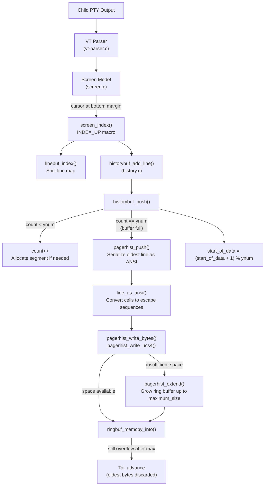

# Technical Specification

# 0. Agent Action Plan

## 0.1 Intent Clarification

### 0.1.1 Core Feature Objective

Based on the prompt, the Blitzy platform understands that the new feature requirement is to produce a comprehensive investigative analysis document examining Kitty terminal emulator's `HistoryBuf` scrollback buffer behavior under extreme-throughput stress conditions, and to place this document in the `blitzy/documentation` directory of the repository without modifying any existing source files. The analysis must be grounded entirely in what the code itself reveals, not in theory alone.

The user is specifically asking about the following behavioral questions, each of which requires deep code-level evidence:

- **Segment Allocation Under Flood**: What actually happens inside `HistoryBuf` (defined in `kitty/data-types.h`, implemented in `kitty/history.c`) as it fills, stretches, and carves out new segments when an enormous volume of text arrives in a short time? The segmented storage model uses a fixed `SEGMENT_SIZE` of 2048 lines per segment, and new segments are allocated on demand via `add_segment()`. The analysis must trace how this lazy allocation unfolds when the buffer goes from empty to full under sustained pressure.

- **Segmented Scrollback ↔ Pager Ring Buffer Interaction**: How does the `PagerHistoryBuf` (a byte-level ring buffer backed by `3rdparty/ringbuf/ringbuf.c`) interact with the line-level `HistoryBuf` circular buffer? When the main scrollback is full and a new line is pushed via `historybuf_push()`, the oldest line is serialized as ANSI text into the pager ring buffer through `pagerhist_push()`. The ring buffer starts at 1 MB and grows on demand via `pagerhist_extend()` up to `scrollback_pager_history_size`. The user wants to understand whether this transition is smooth or introduces observable hesitation.

- **Active Scrolling During Output Flood**: What changes when a user is actively scrolled back (via `scrolled_by` in `kitty/screen.h`) while new data is arriving at full speed? The `screen_update_cell_data()` function in `kitty/screen.c` adjusts `scrolled_by` by adding `history_line_added_count`, and `visual_line_()` resolves display lines from the history buffer. The user wants to know whether this concurrent access pattern holds up under stress.

- **Allocation, Wrapping, and Retention at Runtime**: The user wants to observe how memory structures evolve as pressure builds, including segment allocation growth, ring buffer resizing, and the circular indexing arithmetic (`start_of_data`, `count`, modular addressing).

### 0.1.2 Special Instructions and Constraints

- **Implementation Rule "SWE-AtlasQnA-Repo"**: The user's project rules mandate creating a new markdown document named `kitty_815df1e210e0.md` (matching the source branch name) that comprehensively answers the questions posed in the prompt, with thinking and rationale based on the code as truth.
- **No Repository Modifications**: Existing files in the source repository must not be modified. No code additions are permitted other than the requested analysis document.
- **Output Location**: The generated document must be placed in the `blitzy/documentation` directory in the destination repository.
- **Temporary Scripts for Observation**: The user mentions that temporary scripts may be used for observation, but the repository itself should remain unchanged and anything temporary should be cleaned up afterward. Since the implementation rule forbids adding any code besides the document, observation scripts will not be added to the repository; instead, the document will describe how such scripts could be constructed and what they would reveal.
- **Code as Truth**: All answers must be derived from actual code inspection, not assumptions or general terminal emulator theory.

### 0.1.3 Technical Interpretation

These feature requirements translate to the following technical implementation strategy:

- To **answer the HistoryBuf flood-fill question**, we will trace the code path from `screen_index()` → `INDEX_UP` macro → `historybuf_add_line()` → `historybuf_push()` in `kitty/history.c`, documenting how `start_of_data` and `count` evolve, how `segment_for()` triggers lazy `add_segment()` calls, and how the circular buffer wraps around `ynum`.

- To **explain the segmented scrollback ↔ pager ring buffer relationship**, we will trace `pagerhist_push()` which serializes the oldest line as ANSI text via `line_as_ansi()`, then writes it through `pagerhist_write_ucs4()` → `pagerhist_write_bytes()`, which may trigger `pagerhist_extend()` to grow the ring buffer. The ring buffer's overflow behavior in `ringbuf_memcpy_into()` (advancing the tail pointer to discard oldest data when full at maximum capacity) will be documented.

- To **address concurrent scrolling during output**, we will analyze `screen_update_cell_data()` in `kitty/screen.c` where `scrolled_by` is adjusted by `history_line_added_count`, and how `visual_line_()` resolves lines from `historybuf` vs. `linebuf` depending on scroll position.

- To **create the deliverable**, we will create a single markdown file `blitzy/documentation/kitty_815df1e210e0.md` containing the comprehensive analysis with code references, data flow descriptions, and behavioral explanations.

## 0.2 Repository Scope Discovery

### 0.2.1 Comprehensive File Analysis

The Kitty terminal emulator repository (version 0.35.2, branch `kitty_815df1e210e0`) is a three-language project (C, Python, Go) with the scrollback buffer subsystem implemented primarily in C as a CPython extension. The following files have been identified as directly relevant to the user's questions and to the derivation of the analysis document.

**Core HistoryBuf Implementation Files (Read and Analyzed)**

| File Path | Relevance | Status |
|---|---|---|
| `kitty/history.c` | Primary implementation of `HistoryBuf` type: segmented allocation, circular buffer logic, `pagerhist_push()`, `pagerhist_extend()`, ANSI serialization, rewrap | Fully analyzed |
| `kitty/data-types.h` | Struct definitions for `HistoryBuf`, `HistoryBufSegment`, `PagerHistoryBuf`, `LineBuf`, `Line`, `CPUCell`, `GPUCell`, `LineAttrs` | Fully analyzed |
| `kitty/screen.c` | Screen model: `INDEX_UP` macro, `screen_index()`, `screen_scroll()`, `screen_update_cell_data()`, `visual_line_()`, `scrolled_by` management | Fully analyzed |
| `kitty/screen.h` | Screen struct definition including `scrolled_by`, `historybuf`, `history_line_added_count`, `paused_rendering` | Fully analyzed |
| `kitty/rewrap.h` | `rewrap_inner()` algorithm for reflowing content between buffers of different widths | Fully analyzed |
| `kitty/line-buf.c` | `LineBuf` type: line map indirection, CPU/GPU cell storage, `linebuf_index()` for scroll-up | Summary reviewed |
| `kitty/lineops.h` | Shared inline helpers and declarations for line/buffer operations | Summary reviewed |
| `kitty/line.c` | `Line` type: cell access, ANSI serialization via `line_as_ansi()`, continuation state | Summary reviewed |

**Ring Buffer Infrastructure (Read and Analyzed)**

| File Path | Relevance | Status |
|---|---|---|
| `3rdparty/ringbuf/ringbuf.c` | Complete ring buffer FIFO implementation: `ringbuf_new()`, `ringbuf_memcpy_into()` with overflow semantics (tail advance), `ringbuf_bytes_free()`, `ringbuf_capacity()` | Fully analyzed |
| `3rdparty/ringbuf/ringbuf.h` | Public API header: opaque `ringbuf_t` handle, capacity/used/free queries, read/write/copy operations | Fully analyzed |

**Configuration and Python Integration (Read and Analyzed)**

| File Path | Relevance | Status |
|---|---|---|
| `kitty/options/definition.py` | Scrollback config options: `scrollback_lines` (default 2000), `scrollback_pager_history_size` (default 0 MB), `scrollback_fill_enlarged_window` | Analyzed |
| `kitty/options/types.py` | Typed `Options` class with `scrollback_lines: int`, `scrollback_pager_history_size: int` | Analyzed |
| `kitty/window.py` | `pagerhist()` function, `as_text()` with history integration, `show_scrollback()`, scroll action methods (`scroll_line_up`, `scroll_page_up`, etc.) | Analyzed |

**Test Coverage Files (Read and Analyzed)**

| File Path | Relevance | Status |
|---|---|---|
| `kitty_tests/datatypes.py` | `test_historybuf()`: push/pop, rewrap to wider/narrower/same, large buffer (3000 lines), ANSI serialization | Analyzed |
| `kitty_tests/screen.py` | `test_resize()`, `test_scrollback_fill_after_resize()`: scrollback reflow, cursor preservation | Analyzed |
| `kitty_tests/__init__.py` | `filled_history_buf()` and `filled_line_buf()` test fixtures | Analyzed |

### 0.2.2 Integration Point Discovery

The scrollback system has the following integration touchpoints relevant to understanding stress behavior:

- **Screen → HistoryBuf**: `screen_index()` in `kitty/screen.c` calls the `INDEX_UP` macro, which invokes `historybuf_add_line()` when the cursor is at the bottom margin on the main screen buffer with `margin_top == 0`.
- **HistoryBuf → PagerHistoryBuf**: `historybuf_push()` calls `pagerhist_push()` when `self->count == self->ynum` (buffer is full), serializing the oldest line via `line_as_ansi()` before overwriting it.
- **PagerHistoryBuf → ringbuf**: `pagerhist_write_bytes()` calls `ringbuf_memcpy_into()`, with `pagerhist_extend()` growing the ring buffer when space is insufficient.
- **Scrolled Display → HistoryBuf**: `visual_line_()` reads from `historybuf` when `y < scrolled_by`, and `screen_update_cell_data()` adjusts `scrolled_by` by `history_line_added_count` each render frame.
- **Configuration → Buffer Sizing**: `alloc_historybuf()` is called in the Screen constructor with `MAX(scrollback, lines)` for `ynum` and `OPT(scrollback_pager_history_size)` for the pager history.

### 0.2.3 Web Search Research Conducted

No external web research was required for this task. All analysis is derived directly from codebase inspection, consistent with the "SWE-AtlasQnA-Repo" rule requiring code as the sole source of truth.

### 0.2.4 New File Requirements

- **New documentation file to create**:
  - `blitzy/documentation/kitty_815df1e210e0.md` — Comprehensive analysis document answering all user questions about HistoryBuf behavior under extreme throughput stress, segment allocation dynamics, pager ring buffer interaction, concurrent scrolling behavior, and memory structure evolution. This is the sole deliverable.

## 0.3 Dependency Inventory

### 0.3.1 Private and Public Packages

Since this task produces only an analysis document and introduces no new code or runtime dependencies, the dependency inventory documents the packages already present in the repository that are relevant to the analysis scope.

| Registry | Package Name | Version | Purpose |
|---|---|---|---|
| Source (C) | `kitty/history.c` | N/A (part of kitty 0.35.2) | Core `HistoryBuf` implementation with segmented allocation and pager history |
| Source (C) | `kitty/screen.c` | N/A (part of kitty 0.35.2) | Screen state machine with `scrolled_by` tracking and `INDEX_UP` scroll logic |
| Vendored (C) | `3rdparty/ringbuf/` | Public Domain (2011) | Byte-addressable FIFO ring buffer used by `PagerHistoryBuf` |
| Source (Python) | `kitty/fast_data_types` | N/A (CPython extension) | Python bindings exposing `HistoryBuf`, `LineBuf`, `Screen` types |
| Source (Python) | `kitty/window.py` | N/A (part of kitty 0.35.2) | Scroll action handlers and `pagerhist()` text extraction |
| Source (Go) | `tools/utils/ring.go` | N/A (part of kitty 0.35.2) | Generic Go ring buffer (separate from C ring buffer, used by Go tooling layer) |
| Runtime | Python | ≥ 3.8 (`pyproject.toml`) | Runtime for Kitty's Python layer and test suite |
| Runtime | Go | 1.22 (`go.mod`) | Build-time for Go CLI tools |
| Runtime | C11 | GCC/Clang (`setup.py`: `-std=c11`) | Compilation of native extensions including `history.c` |

### 0.3.2 Dependency Updates

No dependency updates are required. This task does not add, remove, or modify any package dependencies. The analysis document references existing code only.

**Import Updates**: Not applicable — no source code files are being created or modified.

**External Reference Updates**: Not applicable — no configuration, build, or CI files are affected.

## 0.4 Integration Analysis

### 0.4.1 Existing Code Touchpoints

No existing code will be modified. The following integration points are documented here because they form the basis of the analysis that the deliverable document will contain. Understanding these touchpoints is essential to correctly answering the user's questions.

**Data Flow Under High-Throughput Output**

The complete data path from child process output to scrollback storage follows this sequence, traced through the actual code:

**Segment Allocation Chain (kitty/history.c)**

- `historybuf_push()` computes `idx = (start_of_data + count) % ynum`
- `init_line()` calls `cpu_lineptr()` → `segment_for()` which checks `seg_num >= num_segments`
- If the segment doesn't exist yet and `SEGMENT_SIZE * num_segments < ynum`, `add_segment()` is called
- `add_segment()` performs a single `calloc()` for CPU cells + GPU cells + LineAttrs contiguously, then `realloc()` on the segment array
- Each segment holds exactly 2048 lines worth of cell data

**Pager History Overflow Chain (3rdparty/ringbuf/ringbuf.c)**

- `ringbuf_memcpy_into()` calculates `overflow = count > ringbuf_bytes_free(dst)`
- Copies data into the ring in up to two memcpy operations (before and after wrap)
- On overflow: `dst->tail = ringbuf_nextp(dst, dst->head)` — oldest data is silently discarded
- The ring buffer maintains the invariant that `head` and `tail` are always valid pointers into the allocated buffer, with one sentinel byte separating full from empty states

**Scrolled-Back Display During Active Output (kitty/screen.c)**

- `screen_update_cell_data()`: `if (self->scrolled_by) self->scrolled_by = MIN(self->scrolled_by + history_line_added_count, self->historybuf->count)`
- For each visible row where `y < scrolled_by`: reads from `historybuf` via `historybuf_init_line()`
- For each visible row where `y >= scrolled_by`: reads from `linebuf` via `linebuf_init_line()`
- The `history_line_added_count` accumulator ensures the scroll position tracks new lines being pushed into history, keeping the viewed content stable

### 0.4.2 Key Behavioral Observations for the Analysis Document

The following code-grounded observations will form the core content of the deliverable:

- **No locking on HistoryBuf**: The `HistoryBuf` struct has no mutex or synchronization primitive. All access occurs on the main thread — the I/O thread reads from the PTY and the main thread parses and writes to the buffer. This is safe because Kitty's architecture serializes parsing and rendering on a single thread.

- **Segment allocation is lazy but deterministic**: `segment_for()` only allocates when `seg_num >= num_segments && SEGMENT_SIZE * num_segments < ynum`. Once all segments needed for `ynum` lines exist, no further allocation occurs. For a 2000-line buffer, this means at most `ceil(2000/2048) = 1` segment, so the first segment allocated at construction time is sufficient.

- **Pager history growth is chunked**: `pagerhist_extend()` grows by `MAX(1MB, minsz)` increments up to `maximum_size`, meaning the ring buffer does not reallocate on every overflow but in substantial chunks.

- **The `scrolled_by` adjustment is bounded**: `MIN(scrolled_by + history_line_added_count, historybuf->count)` ensures the scroll position never exceeds the available history count, preventing out-of-bounds reads.

- **Dirty-line tracking is per-line, not per-buffer**: Each line has a `has_dirty_text` flag in its `LineAttrs`, and the render loop only re-renders lines that are dirty. When scrolled back, history lines are initialized and rendered individually.

## 0.5 Technical Implementation

### 0.5.1 File-by-File Execution Plan

Since the implementation rule "SWE-AtlasQnA-Repo" strictly prohibits modifying existing files and permits only the creation of a single analysis document, the execution plan consists of exactly one file creation.

**Group 1 — Deliverable Document**

- **CREATE**: `blitzy/documentation/kitty_815df1e210e0.md` — Comprehensive markdown analysis document answering all user questions about `HistoryBuf` behavior under extreme throughput stress. This document will contain:
  - Rationale and thinking behind each answer
  - Code references with file paths and line-number context
  - Behavioral trace-throughs of the segment allocation, pager ring buffer, and scrolled-back display paths
  - Discussion of edge cases and subtle behaviors
  - Suggested observation approaches (described textually, not as committed code)

No other files will be created, modified, or deleted.

### 0.5.2 Implementation Approach

The document creation follows a structured analytical approach:

- **Establish the data model foundation** by documenting the struct layouts from `kitty/data-types.h`: `HistoryBuf` (circular buffer with segmented backing), `HistoryBufSegment` (contiguous CPU+GPU+attrs block), `PagerHistoryBuf` (ring buffer wrapper with maximum size and rewrap flag).

- **Trace the fill path** through `historybuf_push()` in `kitty/history.c`, showing how `count` increments until it reaches `ynum`, at which point `pagerhist_push()` is called and `start_of_data` advances modularly.

- **Trace the segment allocation path** through `segment_for()` → `add_segment()`, showing the `realloc` + `calloc` pattern and explaining that segments are allocated lazily but only up to `ceil(ynum / SEGMENT_SIZE)` total segments.

- **Trace the pager ring buffer growth path** through `pagerhist_write_bytes()` → `pagerhist_extend()`, showing the `MIN(maximum_size, capacity + MAX(1MB, minsz))` growth formula and the ring buffer's overflow semantics from `ringbuf_memcpy_into()`.

- **Trace the concurrent scroll path** through `screen_update_cell_data()` and `visual_line_()`, showing how `scrolled_by` is adjusted atomically per render frame and how the display correctly resolves lines from history vs. screen buffer.

- **Document observation strategies** that a user could employ (e.g., using Python's `HistoryBuf` API from `fast_data_types` to inspect `.count`, `.ynum`, and `pagerhist_as_bytes()` size) without modifying the repository.

### 0.5.3 Document Structure

The deliverable `kitty_815df1e210e0.md` will be organized into the following sections:

- **Introduction**: Restates the investigation goals
- **HistoryBuf Data Model**: Struct-level explanation of the segmented circular buffer
- **Filling and Overflow Under Flood**: Step-by-step trace of what happens as the buffer fills
- **Segment Allocation Dynamics**: How and when new segments are carved out
- **Pager History Ring Buffer Interaction**: The spillover mechanism and growth behavior
- **Scrolling While Data Arrives**: How `scrolled_by` tracking works concurrently
- **Memory Structure Evolution Under Pressure**: How allocation patterns change as load increases
- **Observation Approaches**: Suggested scripts and techniques for runtime inspection
- **Conclusion**: Summary of findings

## 0.6 Scope Boundaries

### 0.6.1 Exhaustively In Scope

- **Analysis document**: `blitzy/documentation/kitty_815df1e210e0.md`
- **Source files analyzed for deriving the document content**:
  - `kitty/history.c` — HistoryBuf segmented allocation, circular buffer logic, `pagerhist_push()`, `pagerhist_extend()`, `pagerhist_rewrap_to()`, ANSI serialization, rewrap entry points
  - `kitty/data-types.h` — Struct definitions for `HistoryBuf`, `HistoryBufSegment`, `PagerHistoryBuf`, `LineBuf`, `Line`, `CPUCell`, `GPUCell`, `LineAttrs`, `ANSIBuf`
  - `kitty/screen.c` — `screen_index()`, `INDEX_UP` macro, `screen_scroll()`, `screen_update_cell_data()`, `visual_line_()`, `screen_clear_scrollback()`, Screen constructor (`alloc_historybuf` call)
  - `kitty/screen.h` — Screen struct with `scrolled_by`, `historybuf`, `history_line_added_count`, `paused_rendering.scrolled_by`
  - `kitty/rewrap.h` — `rewrap_inner()` algorithm, `copy_range()`, `TrackCursor` struct, macro overrides for HistoryBuf-specific rewrap
  - `kitty/line-buf.c` — `LineBuf` type, `linebuf_index()`, `linebuf_init_line()`, rewrap integration
  - `kitty/lineops.h` — Line operation declarations and inline helpers
  - `kitty/line.c` — `line_as_ansi()` serialization used by `pagerhist_push()`
  - `3rdparty/ringbuf/ringbuf.c` — Ring buffer: `ringbuf_new()`, `ringbuf_memcpy_into()` overflow semantics, `ringbuf_bytes_free()`, `ringbuf_capacity()`, `ringbuf_findchr()`
  - `3rdparty/ringbuf/ringbuf.h` — Ring buffer API surface
  - `kitty/options/definition.py` — `scrollback_lines`, `scrollback_pager_history_size`, `scrollback_fill_enlarged_window`
  - `kitty/options/types.py` — Typed Options fields
  - `kitty/window.py` — `pagerhist()`, `as_text()`, `show_scrollback()`, scroll action methods
  - `kitty_tests/datatypes.py` — `test_historybuf()` test cases including 3000-line stress, rewrap
  - `kitty_tests/screen.py` — `test_resize()`, `test_scrollback_fill_after_resize()`
  - `kitty_tests/__init__.py` — `filled_history_buf()`, `filled_line_buf()` fixtures

### 0.6.2 Explicitly Out of Scope

- Modification of any existing source file in the repository
- Adding any code (scripts, tests, or otherwise) to the repository beyond the analysis document
- GPU rendering pipeline behavior (shaders, OpenGL, glyph cache)
- VT parser internals beyond the dispatch to screen operations
- Font pipeline, keyboard handling, or other non-scrollback subsystems
- Go tooling layer ring buffer (`tools/utils/ring.go`) — this is a separate generic Go implementation unrelated to the C-level `PagerHistoryBuf`
- Performance benchmarking or profiling — the analysis is code-structural, not empirical
- Cross-platform windowing differences (Wayland vs X11 vs macOS) in relation to scrollback
- Shell integration mechanisms beyond their interaction with scrollback markers (OSC 133)
- Remote control `scroll_window` command implementation details

## 0.7 Rules for Feature Addition

### 0.7.1 User-Specified Rules

The following rules are explicitly specified by the user and the project's implementation directives:

- **SWE-AtlasQnA-Repo Rule**: Create a new markdown document named `kitty_815df1e210e0.md` (matching the source branch name `kitty_815df1e210e0`) that comprehensively answers the questions posed in the prompt. Provide thinking and rationale behind the answers. Do not make assumptions — base answers on the code as the truth. Do not modify any existing files in the source repository. Do not add any other code in the source repository besides the requested document. Place the generated document in the `blitzy/documentation` directory.

- **Repository Immutability**: The user explicitly states "the repository itself should remain unchanged, and anything temporary should be cleaned up afterward." This reinforces the SWE-AtlasQnA-Repo rule that only the analysis document may be added.

- **Code-Grounded Analysis**: The user wants to "observe how allocation, wrapping, and retention really behave at runtime and see hints of how the underlying memory structures evolve as pressure builds, without relying only on theory or code reading." While the deliverable is a document (not runnable code), its content must demonstrate deep understanding derived from actual code paths, not theoretical descriptions.

### 0.7.2 Derived Implementation Constraints

- The analysis document must reference specific file paths, function names, struct fields, and line-number ranges to demonstrate code-grounded reasoning
- Answers must distinguish between what the code guarantees (e.g., `SEGMENT_SIZE = 2048`) and what is configurable (e.g., `scrollback_lines` default 2000)
- The document should describe observation approaches (e.g., using Kitty's Python API to inspect `HistoryBuf.count` and `pagerhist_as_bytes()`) without adding executable scripts to the repository
- All behavioral claims must be traceable to specific code in `kitty/history.c`, `kitty/screen.c`, `3rdparty/ringbuf/ringbuf.c`, or other analyzed files

## 0.8 References

### 0.8.1 Repository Files and Folders Searched

The following files and folders were systematically retrieved and analyzed to derive the conclusions in this Agent Action Plan:

**Core Scrollback Implementation (Fully Read)**
- `kitty/history.c` (lines 1–625) — Complete `HistoryBuf` implementation including segment allocation (`add_segment`, `segment_for`), circular buffer push/pop (`historybuf_push`, `historybuf_pop_line`), pager history integration (`pagerhist_push`, `pagerhist_write_bytes`, `pagerhist_write_ucs4`, `pagerhist_extend`, `pagerhist_clear`, `pagerhist_rewrap_to`), line initialization (`init_line`, `index_of`), ANSI serialization (`as_ansi`, `pagerhist_as_bytes`, `pagerhist_as_text`), rewrap macros and `historybuf_rewrap`, Python type registration
- `kitty/rewrap.h` (lines 1–97) — Complete `rewrap_inner()` algorithm with macro-overridable hooks for source/destination line management, copy_range helper, TrackCursor struct

**Struct Definitions (Targeted Extraction)**
- `kitty/data-types.h` (lines 255–295 via grep) — `HistoryBufSegment`, `PagerHistoryBuf`, `HistoryBuf` struct definitions, `alloc_historybuf` declaration

**Screen Model (Targeted Sections)**
- `kitty/screen.c` (lines 128–140) — Screen constructor, `alloc_historybuf` call with `OPT(scrollback_pager_history_size)`
- `kitty/screen.c` (lines 1545–1600) — `INDEX_UP` macro, `screen_index()`, `screen_scroll()`
- `kitty/screen.c` (lines 1900–1950) — `dirty_scroll`, `screen_clear_scrollback`, `screen_move_into_scrollback`
- `kitty/screen.c` (lines 2700–2770) — `screen_update_cell_data()` with `scrolled_by` adjustment, history/linebuf line rendering
- `kitty/screen.c` (lines 2843–2870) — `visual_line_()` resolution logic
- `kitty/screen.h` (lines 85–170) — Complete Screen struct definition

**Ring Buffer (Fully Read)**
- `3rdparty/ringbuf/ringbuf.c` (lines 1–330) — Complete ring buffer implementation: struct layout, `ringbuf_new`, `ringbuf_memcpy_into` with overflow, `ringbuf_memset`, `ringbuf_bytes_free/used`, `ringbuf_findchr`, `ringbuf_copy`
- `3rdparty/ringbuf/ringbuf.h` (lines 1–60) — Public API declarations

**Configuration (Targeted Extraction)**
- `kitty/options/definition.py` (lines 369–422) — Scrollback section: `scrollback_lines`, `scrollback_pager_history_size`, `scrollback_fill_enlarged_window` definitions
- `kitty/options/types.py` (lines 406–574) — Typed Options fields for scrollback settings

**Python Integration (Targeted Sections)**
- `kitty/window.py` (lines 355–465) — `pagerhist()`, `as_text()` with pager history integration
- `kitty/window.py` (lines 1735–1770) — `show_scrollback()` method
- `kitty/window.py` (lines 1832–1870) — Scroll action methods

**Test Coverage (Targeted Sections)**
- `kitty_tests/datatypes.py` (lines 487–565) — `test_historybuf()`: push, pop, 3000-line stress, rewrap to same/wider/narrower, dirty lines
- `kitty_tests/screen.py` (lines 280–400) — `test_resize()`, `test_scrollback_fill_after_resize()`
- `kitty_tests/__init__.py` (lines 167–190) — `filled_line_buf()`, `filled_history_buf()` fixture definitions

**Summaries Reviewed**
- `kitty/line-buf.c` — LineBuf type summary (allocation, line map, mutation, rewrap)
- `kitty/lineops.h` — Line operation header summary (declarations, inline helpers)
- `kitty/line.c` — Line type summary (cell access, ANSI serialization, URL detection)
- `tools/utils/ring.go` — Go ring buffer summary (confirmed unrelated to C PagerHistoryBuf)

**Tech Spec Sections Retrieved**
- Section 1.1 Executive Summary — Project overview, three-language architecture, version 0.35.2
- Section 2.1 Feature Catalog — F-018 Scrollback Buffer feature definition
- Section 5.2 Component Details — VT Parser and Screen Model architecture, child monitor threading

**Root Repository Structure**
- Root folder contents retrieved via `get_source_folder_contents` — identified all top-level directories and files

### 0.8.2 Attachments

No attachments were provided by the user for this project.

### 0.8.3 Project Metadata

| Attribute | Value |
|---|---|
| Repository | Kitty Terminal Emulator |
| Version | 0.35.2 (`kitty/constants.py` line 25) |
| Branch | `kitty_815df1e210e0` |
| License | GPLv3 |
| Primary Languages | C, Python (≥ 3.8), Go (1.22) |
| Deliverable | `blitzy/documentation/kitty_815df1e210e0.md` |
| Implementation Rule | SWE-AtlasQnA-Repo |

