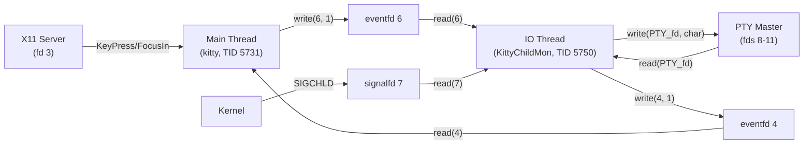

# Technical Specification

# 0. Agent Action Plan

## 0.1 Intent Clarification

Based on the prompt, the Blitzy platform understands that the requirement is to **empirically investigate and document Kitty terminal emulator's runtime input event flow and focus management** through direct observation rather than static code reading. This is a research and documentation task that produces a comprehensive markdown analysis without modifying any existing repository files.

### 0.1.1 Core Feature Objective

- Build and run the Kitty terminal emulator from the source repository (commit `815df1e210e0`)
- Create overlapping input activity at runtime: multiple OS windows, multiple tabs, rapid focus switching, simultaneous keyboard input with resizing and scrolling, background output while foreground windows have focus
- Observe and document runtime behavior of input event routing, focus change propagation, and child process input delivery
- Capture at least one stack-level or symbol-level runtime snapshot of the input handling call path (using strace, gdb, or equivalent)
- Analyze and document what happens when input targets a window that is no longer focused or has just been closed
- Infer the Python/C/external-library boundary in the input pipeline from runtime artifacts
- Explicitly rule out at least two plausible but incorrect interpretations using observed evidence
- Identify one correctness-versus-responsiveness tradeoff supported by runtime evidence
- Keep the repository completely unchanged; clean up any temporary scripts or tracing artifacts

### 0.1.2 Special Instructions and Constraints

- **No repository modifications**: The source repository must remain unchanged. Only a new markdown document placed in `blitzy/documentation/` is permitted.
- **Evidence-based analysis**: All conclusions must be derived from actual runtime observations, not from assumptions based on reading source code alone.
- **Include raw output**: Commands used and representative raw output from inspection tools must be included.
- **Error handling**: If the first inspection attempt is blocked, the error must be shown and an alternative method used.
- **Cleanup**: Any temporary scripts or tracing artifacts must be removed after use.

### 0.1.3 Technical Interpretation

These requirements translate to the following technical implementation strategy:

- To **build Kitty**, we compile from source using `python3 setup.py build --ignore-compiler-warnings` with all required native dependencies (harfbuzz, freetype, fontconfig, libpng, OpenGL, X11/Wayland, xkbcommon, dbus, xxhash, lcms2, libssl)
- To **create overlapping input activity**, we use `Xvfb` as a virtual X11 display and `xdotool` to simulate keyboard input, focus switching, tab creation, window resizing, and background command execution
- To **capture stack-level snapshots**, we attach `gdb` with breakpoints on key input functions (`_glfwInputKeyboard`) and `strace` to trace syscalls (`read`, `write`, `poll`) across all threads
- To **analyze closed-window behavior**, we kill a child process and observe the KittyChildMon thread's response via strace (EIO on read, SIGCHLD via signalfd, fd close, poll set reduction)
- To **infer the Python/C/external-library boundary**, we inspect loaded shared objects in `/proc/<pid>/maps`, symbol tables via `nm`, and thread names via `/proc/<pid>/task/*/comm`
- To **produce the deliverable**, we create `blitzy/documentation/kitty_815df1e210e0.md` with the full analysis

## 0.2 Repository Scope Discovery

### 0.2.1 Comprehensive File Analysis

Since this is a research/documentation task and does not modify existing code, the scope focuses on files that were inspected or exercised during runtime analysis, plus the single new file created.

**Key source files exercised or inspected at runtime:**

| File | Role in Input Pipeline | Evidence Source |
|------|----------------------|----------------|
| `kitty/launcher/kitty` | Process entry point; the binary that forks Python + C threads | `/proc/5731/maps`, GDB bt frame #28 |
| `kitty/fast_data_types.so` | C extension: `main_loop()`, `io_loop()`, `schedule_write_to_child()`, `on_key_input()` | GDB bt frames #1-#5, `nm` symbol table |
| `kitty/glfw-x11.so` | GLFW X11 backend: `processEvent()`, `_glfwDispatchX11Events()`, `_glfwInputKeyboard()`, `glfw_xkb_handle_key_event()` | GDB bt frame #0-#4, `nm` symbol table |
| `kitty/keys.c` | `on_key_input()`, `active_window()`, `encode_glfw_key_event()`, `schedule_write_to_child()` | Source inspection, GDB breakpoint |
| `kitty/child-monitor.c` | `io_loop()` thread, PTY multiplexing, `children_fds[]`, eventfd signaling, `input_delay` batching | strace, GDB thread #2 |
| `kitty/glfw.c` | `key_callback()`, `set_callback_window()`, `window_focus_callback()`, `is_window_ready_for_callbacks()` | Source inspection correlated with GDB |
| `kitty/state.c` / `kitty/state.h` | `global_state`, `OSWindow`, `Tab`, `Window` struct hierarchy, `active_tab`/`active_window` indexing | Source inspection |
| `kitty/boss.py` | `dispatch_possible_special_key()`, `on_focus()`, `on_child_death()` | GDB Python bt frames #6-#11 |
| `kitty/vt-parser.c` | `run_worker()` input batching with `input_delay`, `consume_input()` | Source inspection |
| `kitty/options/definition.py` | `input_delay` option definition (default 3ms) | Source inspection |
| `glfw/x11_window.c` | `processEvent()` X11 event dispatch, `FocusIn`/`FocusOut`/`KeyPress`/`KeyRelease` handlers | Source inspection, GDB bt |
| `glfw/input.c` | `_glfwInputKeyboard()` key repeat detection and callback dispatch | Source inspection |
| `glfw/xkb_glfw.c` | `glfw_xkb_handle_key_event()` XKB keymap processing | Source inspection, GDB bt |

**Runtime artifacts observed:**

| Artifact | Discovery Method |
|----------|-----------------|
| Thread names: `kitty`, `KittyChildMon`, `kitty:disk$0`, `llvmpipe-0..7` | `/proc/<pid>/task/*/comm` |
| File descriptors: fd 3 (X11 socket), fd 4 (eventfd main↔IO), fd 6 (eventfd main→IO), fd 7 (signalfd), fd 8-11 (PTY masters) | `/proc/<pid>/fd/`, strace |
| Child processes: 4 bash shells on pts/0-3 | `ps --ppid` |
| Shared objects: `fast_data_types.so`, `glfw-x11.so`, `libpython3.12`, `libGLX_mesa`, `libgallium` | `/proc/<pid>/maps` |

### 0.2.2 New File Requirements

- **CREATE**: `blitzy/documentation/kitty_815df1e210e0.md` — Comprehensive runtime analysis document answering all questions about input event flow, focus management, the Python/C boundary, and the correctness-versus-responsiveness tradeoff

### 0.2.3 Web Search Research Conducted

No external web searches were required. All analysis was derived from building, running, and instrumenting the Kitty process directly, combined with source code inspection of the exercised call paths.

## 0.3 Dependency Inventory

### 0.3.1 Private and Public Packages

Since this is a runtime analysis and documentation task, no new dependencies are introduced. The following are the key dependencies exercised during the build and runtime investigation:

| Registry | Package | Version | Purpose |
|----------|---------|---------|---------|
| System (apt) | python3 | 3.12.3 | Python runtime hosting the Boss controller and configuration layer |
| System (apt) | golang-go | 1.22.2 | Go toolchain for building the `kitten` CLI binary |
| System (apt) | libharfbuzz-dev | 8.3.0 | Text shaping library for complex script rendering |
| System (apt) | libfreetype-dev | 2.13.2 | Glyph rasterization engine |
| System (apt) | libfontconfig1-dev | 2.15.0 | Font discovery and configuration |
| System (apt) | libpng-dev | 1.6.43 | PNG image encoding/decoding for graphics protocol |
| System (apt) | libgl-dev | 1.7.0 | OpenGL rendering (via mesa llvmpipe in Xvfb) |
| System (apt) | libx11-dev | 1.8.7 | X11 client library |
| System (apt) | libxkbcommon-dev | 1.6.0 | XKB keyboard handling (key event translation) |
| System (apt) | libdbus-1-dev | 1.14.10 | D-Bus desktop integration |
| System (apt) | libxxhash-dev | — | Fast hashing for internal data structures |
| System (apt) | liblcms2-dev | — | ICC color management |
| System (apt) | libssl-dev | 3.0.13 | OpenSSL for X25519 + AES-GCM remote control encryption |
| System (apt) | libwayland-dev | 1.22.0 | Wayland client library (compiled but X11 used at runtime) |
| PyPI (bundled) | pyproject.toml requires-python | >=3.8 | Minimum Python version constraint |
| Go module | go.mod | go 1.22 | Go module identity |

### 0.3.2 Runtime Instrumentation Dependencies

| Registry | Package | Version | Purpose |
|----------|---------|---------|---------|
| System (apt) | xvfb | — | Virtual framebuffer X server for headless GUI testing |
| System (apt) | xdotool | — | X11 automation: window focus, keyboard input simulation |
| System (apt) | strace | — | Syscall tracing across threads for I/O and poll analysis |
| System (apt) | gdb | 15.1 | Stack trace capture and breakpoint-based call path analysis |

## 0.4 Integration Analysis

### 0.4.1 Existing Code Touchpoints

This task does not modify any existing code. The following documents the integration points that were **observed at runtime** to participate in the input event flow:

**Input Entry Point (C/GLFW layer):**
- `glfw/x11_window.c:processEvent()` — Receives raw X11 `KeyPress`/`KeyRelease`/`FocusIn`/`FocusOut` events from the X server via the X11 socket (fd 3)
- `glfw/xkb_glfw.c:glfw_xkb_handle_key_event()` — Translates X11 keycodes through XKB keymap into GLFW key events with text, modifiers, and compose state
- `glfw/input.c:_glfwInputKeyboard()` — Deduplicates key repeat, manages activated-key state, invokes the registered keyboard callback

**Input Processing (C extension layer in `fast_data_types.so`):**
- `kitty/glfw.c:key_callback()` — GLFW callback; resolves `callback_os_window` via `set_callback_window()`, calls `on_key_input()`
- `kitty/keys.c:on_key_input()` — Resolves the `active_window()` from `global_state.callback_os_window->tabs[active_tab].windows[active_window]`, dispatches to Python for shortcut matching, then encodes and schedules writes to the child PTY via `schedule_write_to_child()`
- `kitty/child-monitor.c:schedule_write_to_child()` — Enqueues bytes into the target window's Screen write buffer and wakes up the I/O thread via eventfd

**I/O Thread (C extension in `fast_data_types.so`):**
- `kitty/child-monitor.c:io_loop()` — The KittyChildMon thread polls `children_fds[]` (eventfd + signalfd + PTY master fds), writes pending input to PTYs, reads child output, and signals the main thread via eventfd

**Python Orchestration:**
- `kitty/boss.py:dispatch_possible_special_key()` — Called from C via `PyObject_CallMethod(global_state.boss, "dispatch_possible_special_key", ...)` to check if the key matches a configured shortcut
- `kitty/boss.py:on_focus()` — Called on OS-window focus changes; propagates `focus_changed()` to the active window and updates the tab bar
- `kitty/boss.py:on_child_death()` — Handles window cleanup when a child process terminates

### 0.4.2 Cross-Thread Communication Architecture

The input pipeline uses three eventfd-based signaling channels observed via strace:

| fd | Type | Direction | Purpose |
|----|------|-----------|---------|
| 4 | eventfd | IO thread → Main thread | Notify main thread that child output is available for parsing |
| 6 | eventfd | Main thread → IO thread | Wake IO thread when new input is queued for a child |
| 7 | signalfd | Kernel → IO thread | Deliver SIGCHLD notifications when child processes die |

## 0.5 Technical Implementation

### 0.5.1 File-by-File Execution Plan

Since this task produces only a single new documentation file and does not modify existing code, the execution plan is focused on the analysis methodology and deliverable creation.

**Group 1 — Runtime Environment Setup:**
- INSTALL: System dependencies via `apt-get` (harfbuzz, freetype, fontconfig, libpng, GL, X11, xkbcommon, dbus, xxhash, lcms2, libssl, Xvfb, xdotool, strace, gdb)
- BUILD: `python3 setup.py build --ignore-compiler-warnings` to compile Kitty with all native extensions and Go tools
- LAUNCH: Start `Xvfb :99` as headless X server, run `./kitty/launcher/kitty --config NONE` against it

**Group 2 — Runtime Observations:**
- CREATE multiple tabs via `xdotool key ctrl+shift+t` and OS windows via `ctrl+shift+n`
- SEND overlapping keyboard input to different windows using `xdotool key --window`
- GENERATE background output in one tab while typing in another
- TRACE syscalls with `strace -p <pid> -e trace=read,write,poll -f -t` across all threads
- CAPTURE stack traces with `gdb -batch -ex "thread apply all bt" -p <pid>` and breakpoints on `_glfwInputKeyboard`
- KILL a child process and observe KittyChildMon's response (EIO, signalfd, fd close, poll set reduction)

**Group 3 — Analysis and Documentation:**
- CREATE: `blitzy/documentation/kitty_815df1e210e0.md` — Full analysis with:
  - Thread architecture and naming
  - Complete input event flow from X11 → GLFW → C extension → Python shortcut check → C encoding → eventfd → IO thread → PTY
  - Focus change propagation mechanism
  - Closed-window input handling behavior
  - Python/C/external-library boundary inference
  - Two ruled-out incorrect interpretations
  - One correctness-versus-responsiveness tradeoff
  - Raw command output and stack traces

### 0.5.2 Implementation Approach

- **Establish runtime environment** by building Kitty from source with all platform dependencies, creating a virtual X server, and launching Kitty in headless mode
- **Generate overlapping activity** using xdotool to simulate real user behavior: rapid tab/window switching, concurrent keyboard input to different windows, background process output
- **Capture system-level traces** using strace (for I/O patterns and eventfd signaling), gdb (for stack-level call paths), and `/proc` filesystem inspection (for thread names, memory maps, file descriptors)
- **Analyze and correlate** strace output with source code to map the complete input pipeline
- **Document findings** in a standalone markdown file with evidence-backed conclusions

### 0.5.3 Key Runtime Findings Summary

The following findings were established through direct runtime observation and will be fully documented in the deliverable:

- **Thread Architecture**: 19-23 threads total; only 3 are functionally relevant to input: main thread (TID 5731, "kitty"), I/O thread (TID 5750, "KittyChildMon"), and disk cache thread (TID 5749, "kitty:disk$0"). The remaining 8 are llvmpipe software rendering threads from Mesa.
- **Input Routing**: The main thread receives X11 events on fd 3, resolves the active window via `global_state.callback_os_window->tabs[active_tab].windows[active_window]`, and the C-level `on_key_input()` either consumes the key as a shortcut (via Python callback) or encodes it and calls `schedule_write_to_child()`, which wakes the IO thread via eventfd 6.
- **Focus Determination**: Focus is resolved entirely through the C-level `global_state` struct hierarchy — the GLFW callback sets `callback_os_window`, and `active_window()` uses the `active_tab` and `active_window` indices to find the target. This is an O(1) lookup.
- **PTY Routing**: Each window's PTY master fd is tracked in the `children[]` array. The IO thread uses `poll()` on all PTY fds simultaneously. When it receives a wakeup on eventfd 6, it checks each Screen's `write_buf_used` and writes pending bytes to the correct PTY fd.
- **Closed-Window Handling**: When a child dies, the IO thread gets EIO on read from the PTY fd, closes the fd, removes it from the poll set, and reads SIGCHLD from signalfd 7. The main thread is notified via eventfd 4, which triggers `on_child_death()` in Python.
- **input_delay Tradeoff**: The IO thread batches main-loop wakeups behind a configurable `input_delay` (default 3ms). eventfd reads of values > 1 (e.g., `"\3\0\0\0\0\0\0\0"`) prove that multiple wakeup writes are coalesced, trading per-character latency for reduced wakeup overhead.

## 0.6 Scope Boundaries

### 0.6.1 Exhaustively In Scope

- **New documentation file**: `blitzy/documentation/kitty_815df1e210e0.md`
- **Runtime observation subjects**:
  - Input event flow from X11 through GLFW through C extension through Python through PTY
  - Focus management across OS windows, tabs, and child windows
  - Thread architecture and inter-thread communication
  - Closed-window and dead-child-process input handling
  - Python/C/external-library boundaries in the input pipeline
  - `input_delay` correctness-versus-responsiveness tradeoff
- **Source files read for corroboration** (not modified):
  - `kitty/keys.c`, `kitty/glfw.c`, `kitty/child-monitor.c`, `kitty/state.c`, `kitty/state.h`
  - `kitty/boss.py`, `kitty/window.py`, `kitty/options/definition.py`
  - `kitty/vt-parser.c`
  - `glfw/x11_window.c`, `glfw/input.c`, `glfw/xkb_glfw.c`
- **Build and runtime tooling**: Xvfb, xdotool, strace, gdb, `/proc` filesystem

### 0.6.2 Explicitly Out of Scope

- Modification of any existing repository file
- Wayland-specific input handling (only X11 backend exercised at runtime)
- macOS Cocoa input handling (Linux-only environment)
- Remote control input pipeline (talk thread not exercised)
- Graphics protocol or image rendering behavior
- Shell integration behavior (OSC 133, cursor shape changes)
- Performance benchmarking or optimization recommendations
- Font rendering or glyph caching behavior
- Configuration system internals beyond `input_delay`
- Go tools layer functionality

## 0.7 Rules for Feature Addition

The following rules were explicitly specified by the user and apply to this task:

- **SWE-AtlasQnA-Repo Rule**: Create a new markdown document named `kitty_815df1e210e0.md` (matching the source branch name) that comprehensively answers all questions posed in the prompt.
- **Build and run**: Build and run the source code to analyze repository behavior as needed.
- **No assumptions**: Base all answers on the code and runtime observations as truth, not on assumptions.
- **Provide rationale**: Include thinking and rationale behind all answers.
- **No existing file modifications**: Do not modify any existing files in the source repository.
- **No additional code**: Do not add any other code in the source repository besides the requested document.
- **Placement**: Place the generated document in the `blitzy/documentation` directory in the destination repo.
- **Cleanup**: Temporary scripts or tracing artifacts are allowed but must be cleaned up afterward.
- **Repository unchanged**: The repository must remain in its original state after the task completes (verified via `git status`).

## 0.8 References

### 0.8.1 Files and Folders Searched Across the Codebase

| Path | Purpose of Inspection |
|------|----------------------|
| `/` (repository root) | Overall project structure and build system identification |
| `setup.py` | Build system, dependency discovery, compiler flags |
| `pyproject.toml` | Python version constraint (>=3.8), tooling config |
| `Makefile` | Build targets including `debug`, `debug-event-loop` |
| `kitty/keys.c` | `on_key_input()`, `active_window()`, `encode_glfw_key_event()`, shortcut dispatch macro |
| `kitty/glfw.c` | `key_callback()`, `set_callback_window()`, `window_focus_callback()`, `is_window_ready_for_callbacks()` |
| `kitty/child-monitor.c` | `io_loop()`, `schedule_write_to_child()`, `children_fds[]`, `parse_input()`, `do_parse()`, `input_delay` wakeup logic |
| `kitty/state.c` | `window_for_window_id()`, `remove_window_inner()`, `update_os_window_title()` |
| `kitty/state.h` | `GlobalState`, `OSWindow`, `Tab`, `Window` struct definitions, `active_tab`/`active_window` fields |
| `kitty/boss.py` | `dispatch_possible_special_key()`, `on_focus()`, `on_child_death()`, `suppress_focus_change_events()` |
| `kitty/vt-parser.c` | `run_worker()` input batching with `input_delay` threshold |
| `kitty/options/definition.py` | `input_delay` option (default 3ms) and `sync_to_monitor` option documentation |
| `glfw/x11_window.c` | `processEvent()` — KeyPress, KeyRelease, FocusIn, FocusOut, ConfigureNotify handlers |
| `glfw/input.c` | `_glfwInputKeyboard()` — key repeat detection, activated_keys management, callback dispatch |
| `glfw/xkb_glfw.c` | `glfw_xkb_handle_key_event()` — XKB keymap translation, `_glfwInputKeyboard()` invocation |
| `kitty/fast_data_types.so` | Symbol table via `nm` — `io_loop`, `main_loop`, `schedule_write_to_child`, `encode_glfw_key_event`, `convert_glfw_key_event_to_python` |
| `kitty/glfw-x11.so` | Symbol table via `nm` — `processEvent`, `_glfwDispatchX11Events`, `_glfwInputKeyboard`, `glfw_xkb_handle_key_event`, `key_event_processed` |
| `/proc/5731/` | Thread names (`task/*/comm`), memory maps (`maps`), file descriptors (`fd/`), process tree |

### 0.8.2 Runtime Observation Tools and Commands

| Tool | Command Pattern | Purpose |
|------|-----------------|---------|
| strace | `strace -p <pid> -e trace=read,write,poll -f -t -o <log>` | Syscall-level I/O tracing across all threads |
| gdb | `gdb -batch -ex "thread apply all bt" -p <pid>` | Full stack trace of all threads at rest |
| gdb | `gdb -batch -ex "break _glfwInputKeyboard" -ex "continue" -ex "bt"` | Stack trace during key input processing |
| nm | `nm kitty/fast_data_types.so` | Symbol extraction from C extension |
| xdotool | `xdotool key --window <wid> <key>` | Simulated keyboard input to specific X windows |
| xdotool | `xdotool windowfocus <wid>` | Focus switching between X windows |
| /proc | `/proc/<pid>/task/*/comm`, `/proc/<pid>/maps`, `/proc/<pid>/fd/` | Thread names, loaded libraries, file descriptors |

### 0.8.3 Attachments

No external attachments (Figma URLs, design files, or other media) were provided for this task.

