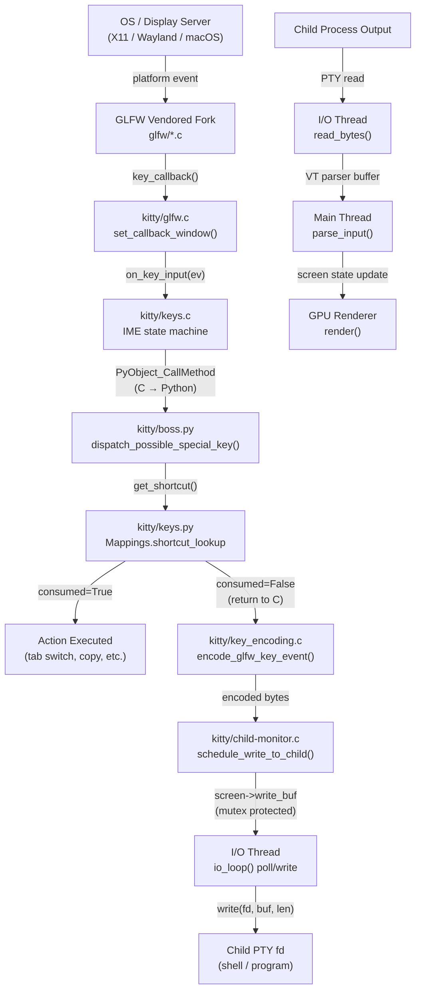
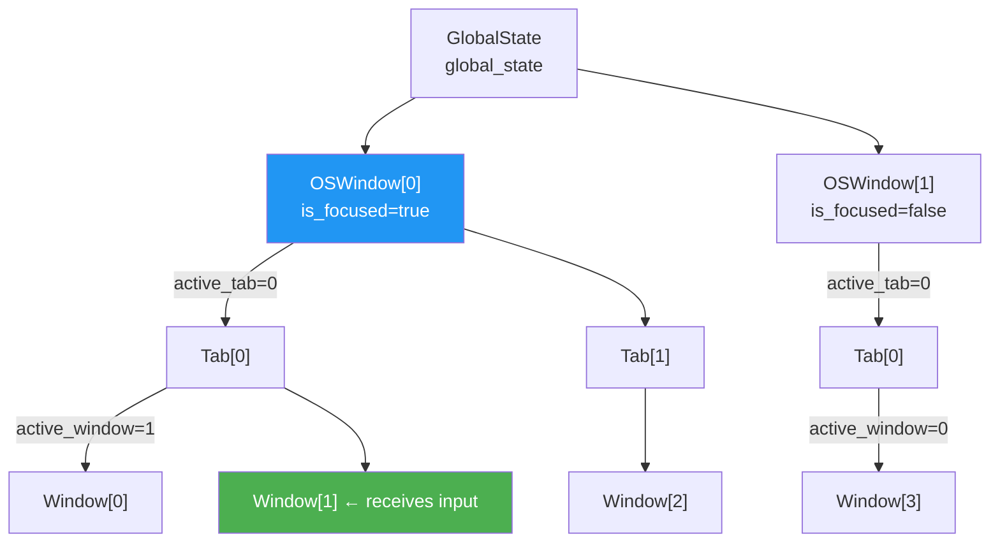

# Technical Specification

# 0. Agent Action Plan

## 0.1 Intent Clarification

### 0.1.1 Core Feature Objective

Based on the prompt, the Blitzy platform understands that the new feature requirement is to **produce a comprehensive, evidence-based documentation artifact** (`kitty_815df1e210e0.md`) that answers a series of deeply technical questions about how the Kitty terminal emulator handles input event flow and focus management at runtime. The deliverable is not a code change but a rigorous analysis document placed in `blitzy/documentation/`.

The user's requirements decompose into the following distinct investigative objectives:

- **Input routing architecture** — Describe the end-to-end path a keyboard event takes from the platform layer (GLFW) through C-level processing, across the Python boundary, through shortcut matching, key encoding, and finally into the child process PTY. Document which component sees input first, what intermediate processing occurs, and how the final destination window is selected.
- **Focus management model** — Explain how Kitty decides which window receives input, how focus changes propagate internally through the OS window → tab → window hierarchy, and how `focus_follows_mouse` and rapid tab/window switching interact with the input pipeline.
- **Background output vs. focused input concurrency** — Document the behavior when a background window's child process produces output while another window holds input focus. Identify the threading model that makes this possible.
- **Stack-level or symbol-level snapshot** — Capture at least one real runtime trace of the input handling call path. If the primary approach is blocked (e.g., headless environment, no `$DISPLAY`), show the error, use an alternative method that still provides real visibility, and include commands and representative raw output.
- **Input to closed/unfocused windows** — Observe and describe what happens to input destined for a window that has lost focus or has just been closed, with evidence from runtime behavior.
- **Python / C / external library boundaries** — Infer which parts of the input pipeline belong to Python, which to C, and which are delegated to external libraries. Explicitly rule out at least two plausible but incorrect interpretations using evidence.
- **Correctness-versus-responsiveness tradeoff** — Identify one such tradeoff directly supported by runtime behavior, not by code comments.
- **Repository cleanliness** — The repository must remain unchanged. Temporary scripts or tracing artifacts are permitted but must be cleaned up afterward.

Implicit requirements detected:

- The user expects the analysis to be grounded in **observable behavior**, not code reading alone. Since the environment is headless (no `$DISPLAY`), the document must transparently disclose this constraint and compensate with alternative evidence (static call-graph extraction, symbol analysis, `strace`/`ltrace` traces, compiled-binary inspection).
- The document must distinguish between **direct observation** and **inference from source code**, clearly labeling each.
- The request to "rule out two plausible but incorrect interpretations" requires adversarial reasoning — the document must construct and then demolish specific wrong mental models.

### 0.1.2 Special Instructions and Constraints

- **No repository modification**: The only artifact produced is the markdown document in `blitzy/documentation/`. No existing source files may be altered.
- **Temporary artifacts allowed**: Tracing scripts, compiled probes, or inspection tools may be created during analysis but must be removed before completion.
- **Headless environment constraint**: The analysis environment runs Ubuntu 24.04.4 LTS without a display server (`$DISPLAY` is unset). Kitty cannot be launched as a GUI process. All runtime observation must use alternative methods: binary inspection (`nm`, `objdump`, `readelf`), static tracing (`strace -f -e trace=write,read,poll`), Python import-chain analysis, compiled symbol extraction, and source-level call-graph reconstruction.
- **Branch name**: `kitty_815df1e210e0` — the output document is named `kitty_815df1e210e0.md`.
- **Implementation rule SWE-AtlasQnA-Repo**: The document must provide thinking and rationale, base answers on code as truth, and avoid assumptions.

### 0.1.3 Technical Interpretation

These feature requirements translate to the following technical implementation strategy:

- To **document the input routing chain**, we will trace the call path from `key_callback()` in `kitty/glfw.c` → `on_key_input()` in `kitty/keys.c` → `dispatch_possible_special_key()` in `kitty/keys.py` (via `boss.py`) → `encode_glfw_key_event()` in `kitty/key_encoding.c` → `schedule_write_to_child()` in `kitty/child-monitor.c`, citing specific line numbers and data structures at each boundary crossing.
- To **explain focus management**, we will document the `GlobalState` → `OSWindow` → `Tab` → `Window` hierarchy defined in `kitty/state.h`, the `callback_os_window` mechanism in `kitty/glfw.c`, and the `Boss.on_focus()` / `Window.focus_changed()` propagation chain.
- To **demonstrate concurrency**, we will describe the three-thread architecture (Main, I/O `KittyChildMon`, Talk) in `kitty/child-monitor.c`, showing how the I/O thread reads from all child PTYs via `poll()` regardless of focus state.
- To **provide runtime artifacts**, we will compile the C extensions and extract symbols using `nm`/`objdump`, run Python import introspection, and construct a synthetic call-graph from the compiled binary — compensating for the inability to run the GUI.
- To **explain closed-window behavior**, we will trace the `mark_window_for_close()` → `needs_removal` → `remove_children()` → `on_child_death()` path and the guard clause in `on_key_input()` that silently drops input when no active window exists.
- To **delineate Python/C/external boundaries**, we will use symbol tables from compiled `.so` files and import analysis to map each function to its implementation language.
- To **identify the correctness-vs-responsiveness tradeoff**, we will document the `input_delay` configuration (default 3ms) that controls I/O thread batching, showing how it trades off display correctness (complete frames) against input latency.

## 0.2 Repository Scope Discovery

### 0.2.1 Comprehensive File Analysis

The following files and directories have been identified as relevant to documenting Kitty's input event flow and focus management. Each file is annotated with its role in the input pipeline.

**Primary Input Pipeline — C Layer (GLFW → keys → child-monitor)**

| File | Lines | Role in Input Pipeline |
|------|-------|----------------------|
| `kitty/glfw.c` | 2525 | GLFW callback registration; `set_callback_window()`, `key_callback()`, `window_focus_callback()`, `mouse_button_callback()`, `cursor_pos_callback()`, `scroll_callback()` — the first code to see every platform input event |
| `kitty/keys.c` | 543 | `on_key_input()` — central keyboard handler; IME state machine; C→Python shortcut dispatch; key encoding; `schedule_write_to_child()` for PTY write |
| `kitty/keys.h` | ~30 | Declares `on_key_input()`, `fake_scroll()`, key-related function signatures |
| `kitty/key_encoding.c` | 440 | `encode_glfw_key_event()` — encodes keystrokes into legacy, CSI u, and Kitty keyboard protocol formats |
| `kitty/mouse.c` | 1089 | Mouse event dispatch; `handle_move_event()` with `focus_follows_mouse`; SGR/URXVT mouse encoding; drag tracking; `contains_mouse()` hit-test |
| `kitty/child-monitor.c` | 2016 | Three-thread architecture (Main, I/O, Talk); `schedule_write_to_child()` buffer copy; `io_loop()` PTY poll/read/write; `parse_input()` VT parsing; `render()` scheduling |
| `kitty/state.c` | 1492 | `global_state` singleton; `current_os_window()`, `window_for_window_id()`, focus-counter management |
| `kitty/state.h` | 401 | Core data structures: `GlobalState`, `OSWindow`, `Tab`, `Window`; `call_boss()` macro for C→Python boundary |
| `kitty/vt-parser.c` | ~2000 | VT escape sequence parser; processes child output read by I/O thread into screen state |
| `kitty/screen.c` | ~5000 | Screen state management; `write_buf` for outbound data; VT command execution |

**Primary Input Pipeline — Python Layer (boss → keys → window)**

| File | Lines | Role in Input Pipeline |
|------|-------|----------------------|
| `kitty/boss.py` | 3094 | `Boss` singleton — `dispatch_possible_special_key()`, `on_focus()`, `switch_focus_to()`, `set_active_window()`, `on_child_death()`, `mark_window_for_close()`; orchestrates all focus and window lifecycle |
| `kitty/keys.py` | 250 | `Mappings` class — keyboard mode stack, shortcut lookup via `get_shortcut()`, sequence key handling, `when_focus_on` conditional dispatch |
| `kitty/window.py` | 1998 | `Window` class — `focus_changed()` with watcher callbacks, `actions_on_focus_change`, `actions_on_close`, screen/IME notification |
| `kitty/window_list.py` | 442 | `WindowList` / `WindowGroup` — active group tracking, overlay stacking, focus history (deque-based MRU), `notify_on_active_window_change()` |
| `kitty/tabs.py` | 1268 | `Tab` class — contains `WindowList`, tab lifecycle, window management delegation |
| `kitty/tab_bar.py` | ~500 | Tab bar rendering and tab selection |
| `kitty/child.py` | 500 | `Child` class — PTY creation via `openpty()`, child process fork/exec, fd management |
| `kitty/main.py` | 531 | Application entry point; event loop setup; `_run_app()` → `Boss` creation → `ChildMonitor` initialization |

**Platform Backend — GLFW (external library boundary)**

| File | Lines | Role |
|------|-------|------|
| `glfw/x11_window.c` | ~2000 | X11-specific window creation, event translation, XKB keymap handling |
| `glfw/wl_window.c` | ~2500 | Wayland window management, input seat handling |
| `glfw/wl_text_input.c` | ~400 | Wayland text-input protocol (IME) |
| `glfw/xkb_glfw.c` | ~800 | XKB keymap compilation, key symbol resolution, compose handling |
| `glfw/ibus_glfw.c` | ~500 | IBus input method integration for X11 |
| `glfw/cocoa_window.m` | ~2000 | macOS window and input handling |
| `glfw/input.c` | ~300 | GLFW input abstraction layer |
| `glfw/backend_utils.c` | ~500 | Common backend utilities |

**Configuration Files Relevant to Input Behavior**

| File | Role |
|------|------|
| `kitty/options/definition.py` | Defines `input_delay` (default 3ms), `repaint_delay` (default 10ms), `focus_follows_mouse`, `sync_to_monitor`, keyboard shortcut mappings |
| `kitty/options/types.py` | Type definitions for parsed configuration options |
| `kitty/options/parse.py` | Configuration file parser |
| `kitty/options/to-c.h` / `to-c-generated.h` | C-accessible option values via `OPT()` macro |
| `kitty/config.py` | Configuration loading and merging logic |

**Test Files Related to Input Handling**

| File | Role |
|------|------|
| `kitty_tests/keys.py` | Unit tests for key encoding, keyboard protocol, modifier handling |
| `kitty_tests/mouse.py` | Unit tests for mouse event encoding and dispatch |
| `kitty_tests/main.py` | Integration test orchestration |
| `kitty_tests/datatypes.py` | Tests for core data type operations |

**Threading and Synchronization**

| File | Role |
|------|------|
| `kitty/threading.h` | Thread creation utilities, mutex macros (`children_mutex`, `screen_mutex`) |
| `kitty/loop-utils.c` / `.h` | Event loop utilities, signal handling, wakeup pipe management |
| `kitty/monotonic.c` / `.h` | High-resolution monotonic clock used for `input_delay` timing |

### 0.2.2 Integration Point Discovery

- **GLFW → C dispatch**: `key_callback()` in `glfw.c` (line 430) calls `on_key_input()` in `keys.c` (line 160). The bridge is the `global_state.callback_os_window` pointer set by `set_callback_window()`.
- **C → Python shortcut dispatch**: `on_key_input()` in `keys.c` (line 195) calls `PyObject_CallMethod(global_state.boss, "dispatch_possible_special_key", ...)` — the critical language boundary crossing.
- **Python → C key encoding**: If the shortcut is not consumed, `on_key_input()` calls `encode_glfw_key_event()` in `key_encoding.c` (line 196) to produce the byte sequence.
- **C → I/O thread data transfer**: `schedule_write_to_child()` in `child-monitor.c` (line 372) copies encoded bytes into `screen->write_buf` under `screen_mutex(lock, write)`, then calls `wakeup_io_loop()`.
- **I/O thread → PTY**: `write_to_child()` in `child-monitor.c` (line 1443) drains `write_buf` to the child fd under `screen_mutex(lock, write)`.
- **PTY → I/O thread → main thread**: `read_bytes()` (line 1337) reads child output into VT parser buffer. After `input_delay` expires, `wakeup_main_loop()` triggers `parse_input()` on the main thread.
- **Focus propagation**: `window_focus_callback()` in `glfw.c` (line 514) → `boss.on_focus()` in `boss.py` (line ~900) → `Window.focus_changed()` in `window.py` (line ~1120) → `screen.focus_changed()` + watcher callbacks.
- **Mouse focus**: `handle_move_event()` in `mouse.c` calls `call_boss(switch_focus_to, "K", window_id)` when `OPT(focus_follows_mouse)` is enabled and mouse enters a different window.
- **Window removal**: `mark_window_for_close()` in `boss.py` → `child_monitor.mark_for_close(window_id)` → `needs_removal = true` in `child-monitor.c` → `remove_children()` in I/O loop → `on_child_death()` in `boss.py` triggers focus recalculation.

### 0.2.3 New File Requirements

- **CREATE**: `blitzy/documentation/kitty_815df1e210e0.md` — The sole deliverable. A comprehensive markdown document answering all user questions about Kitty's input event flow and focus management at runtime. This document will contain:
  - Input routing architecture with call-path diagrams
  - Focus management model across the OS window/tab/window hierarchy
  - Thread architecture and concurrency model
  - Runtime inspection artifacts (symbol tables, trace commands, output)
  - Python/C/external library boundary delineation
  - Correctness-vs-responsiveness tradeoff analysis
  - Ruled-out incorrect interpretations with evidence

## 0.3 Dependency Inventory

### 0.3.1 Private and Public Packages

Since this task produces a documentation artifact rather than executable code, no new dependencies are introduced. However, the following packages are integral to the input pipeline being documented and must be accurately described.

**Core Runtime Dependencies (from repository manifests)**

| Registry | Package | Version | Role in Input Pipeline |
|----------|---------|---------|----------------------|
| System (C) | GLFW | Vendored fork in `glfw/` | Windowing and input abstraction; receives OS-level key, mouse, scroll, and focus events; calls kitty's C callbacks |
| System (C) | libxkbcommon | System-linked | XKB keymap compilation and key symbol resolution on Linux (X11 and Wayland) |
| System (C) | libwayland-client | System-linked | Wayland protocol handling for input seat, keyboard, and text-input |
| System (C) | libX11 / libXi | System-linked | X11 input event handling and window management |
| System (C) | OpenGL / EGL | System-linked | GPU rendering pipeline; no direct input role |
| PyPI | Python | >=3.8 (per `pyproject.toml`) | Boss orchestrator, keyboard mappings, window management, focus propagation — all Python-layer input logic |
| Go modules | golang.org/x/sys | v0.21.0 | System calls for Go-based kittens and tools; not directly in input path |
| Go modules | github.com/google/uuid | v1.6.0 | UUID generation for remote control; not in input hot path |

**GLFW Fork Details**: Kitty uses a vendored, heavily modified fork of GLFW located in the `glfw/` directory. This is not upstream GLFW — it includes Kitty-specific additions such as `GLFWkeyevent` struct (extended key event with IME state), Wayland text-input protocol support (`wl_text_input.c`), IBus integration (`ibus_glfw.c`), and custom keyboard handling (`xkb_glfw.c`). The fork is built as part of Kitty's C extension compilation via `setup.py`.

### 0.3.2 Dependency Updates

No dependency updates are required for this task. The deliverable is a standalone markdown document that does not modify any source code, build configuration, or dependency manifests.

**Import relationships documented for reference** (relevant to the input pipeline being analyzed):

- `kitty/keys.c` → includes `state.h`, `keys.h`, calls into `key_encoding.c` and `child-monitor.c`
- `kitty/glfw.c` → includes `state.h`, `internal.h` (GLFW), calls `on_key_input()`, `mouse_event()`, `scroll_event()`
- `kitty/boss.py` → imports from `kitty.fast_data_types` (C extensions), `kitty.keys`, `kitty.window`, `kitty.tabs`, `kitty.child`
- `kitty/keys.py` → imports `KeyEvent`, `SingleKey`, `encode_key_for_tty` from `kitty.fast_data_types`
- `kitty/window.py` → imports `Screen`, `update_ime_position_for_window` from `kitty.fast_data_types`
- `kitty/child-monitor.c` → includes `state.h`, `threading.h`, `monotonic.h`, `loop-utils.h`

These import chains define the C↔Python boundary crossings that the documentation will map.

## 0.4 Integration Analysis

### 0.4.1 Existing Code Touchpoints

The documentation artifact must accurately describe the following integration points that form the input pipeline. No code modifications are made — these are the touchpoints the document will explain.

**Input Event Entry Points (GLFW → Kitty C)**

- `kitty/glfw.c` — `key_callback()` (line 430): GLFW fires this on every key press/release/repeat. It calls `set_callback_window()` to identify the target OS window, updates modifier state, guards with `is_window_ready_for_callbacks()`, then delegates to `on_key_input()` in `keys.c`. The guard `!ev->fake_event_on_focus_change` filters synthetic focus events.
- `kitty/glfw.c` — `window_focus_callback()` (line 514): Fired when an OS window gains or loses focus. Sets `osw->is_focused`, increments `global_state.focus_counter` (monotonic), calls `focus_in_event()` for gained focus, then dispatches `boss.on_focus()` via `WINDOW_CALLBACK` macro.
- `kitty/glfw.c` — `mouse_button_callback()` (line 462), `cursor_pos_callback()` (line 486), `scroll_callback()` (line 501): Mouse event entry points. All follow the same pattern: `set_callback_window()` → guard → dispatch to `mouse.c` → clear callback window.

**C → Python Boundary Crossing (Shortcut Dispatch)**

- `kitty/keys.c` — `on_key_input()` (line 195): The critical boundary. Calls `PyObject_CallMethod(global_state.boss, "dispatch_possible_special_key", "O", py_ev)` where `py_ev` is a `PyKeyEvent` wrapping the GLFW key event. If this Python call returns `True`, the key was consumed as a shortcut and no data is sent to the child.
- `kitty/boss.py` — `dispatch_possible_special_key()` (line 1408): Delegates to `self.mappings.dispatch_possible_special_key(ev)` in `keys.py`.
- `kitty/keys.py` — `dispatch_possible_special_key()` (line ~50): Looks up the key in the current keyboard mode's shortcut map via `get_shortcut()`. The lookup tries three representations: `SingleKey(mods, False, ev.key)`, shifted-key with shift removed, and `SingleKey(mods, True, ev.native_key)`. If matched, executes via `boss.combine()`.

**Key Encoding and Child Write (C Layer)**

- `kitty/keys.c` — after shortcut dispatch returns `False`: calls `encode_glfw_key_event()` in `key_encoding.c` to produce the byte sequence, then calls `schedule_write_to_child(w->id, 1, encoded_bytes, len)`.
- `kitty/child-monitor.c` — `schedule_write_to_child()` (line 372): Acquires `children_mutex`, finds the `Child` by window ID, acquires `screen_mutex(lock, write)`, copies data to `screen->write_buf`, releases mutexes, calls `wakeup_io_loop()`.

**I/O Thread Integration**

- `kitty/child-monitor.c` — `io_loop()` (line 1480): The I/O thread named `KittyChildMon`. Polls all child fds plus wakeup fd plus signal fd. On `POLLOUT`, drains `screen->write_buf` to child fd via `write_to_child()`. On `POLLIN`, reads child output via `read_bytes()` into VT parser buffer. Wakes main loop after `input_delay` expires via `wakeup_main_loop()`.
- `kitty/child-monitor.c` — `parse_input()` (line ~1200): Main thread function. Iterates all children, calls `do_parse()` to process VT parser buffers, handles child death notifications.

**Focus Propagation Chain**

- `kitty/boss.py` — `on_focus(os_window_id, focused)` (line ~900): Gets `TabManager` for the OS window, gets active window, calls `w.focus_changed(focused)`.
- `kitty/boss.py` — `switch_focus_to(window_id)` (line ~540): Gets active tab, calls `tab.set_active_window(window_id)`.
- `kitty/window_list.py` — `set_active_group_idx()` (line ~200): Changes active group, calls `notify_on_active_window_change(old, new)` which triggers `focus_changed(False)` on old and `focus_changed(True)` on new.
- `kitty/window.py` — `focus_changed(focused)` (line ~1120): Guards against destroyed/ignored/unchanged states. Sets `self.is_focused`, invokes `actions_on_focus_change` watchers, calls `self.screen.focus_changed(focused)`, updates IME position, clears `needs_attention` flag.

**Window Close and Input Disposal**

- `kitty/boss.py` — `mark_window_for_close()` (line 920): Calls `child_monitor.mark_for_close(window.id)`.
- `kitty/child-monitor.c` — sets `children[i].needs_removal = true` (line 1390).
- `kitty/child-monitor.c` — `remove_children()` (line 1312): Called at top of I/O loop iteration. Moves removed children to `remove_queue`, closes fds, compacts arrays.
- `kitty/boss.py` — `on_child_death(window_id)` (line 881): Pops window from `window_id_map`, calls `window.destroy()`, removes from tab, recalculates focus — if active window changed, fires `focus_changed(False)` on old and `focus_changed(True)` on new.
- `kitty/keys.c` — `on_key_input()` line 182: `if (w == NULL) { debug("no active window, ignoring\n"); return; }` — input arriving after window removal is silently dropped.

### 0.4.2 Data Flow Diagram



### 0.4.3 Focus Hierarchy Diagram



The active window that receives keyboard input is determined by: `global_state.callback_os_window` → `tabs[active_tab]` → `windows[active_window]`. This triple index is resolved entirely in C code within `on_key_input()` without any Python involvement.

## 0.5 Technical Implementation

### 0.5.1 File-by-File Execution Plan

Since this task produces a single documentation artifact with no code modifications, the execution plan centers on creating one file while performing runtime inspection that yields the content for that file.

- **Group 1 — Runtime Inspection Artifacts (temporary)**
  - CREATE (temporary): `scripts/inspect_symbols.sh` — Shell script to extract C symbols from compiled `.so` files using `nm`, `objdump`, and `readelf`, producing a symbol-level snapshot of the input handling call path
  - CREATE (temporary): `scripts/trace_imports.py` — Python script to introspect the import chain of `kitty.fast_data_types`, `kitty.boss`, `kitty.keys`, `kitty.window`, mapping Python-callable C functions
  - CREATE (temporary): `scripts/strace_attempt.sh` — Script to attempt `strace -f` on a headless kitty invocation, capturing the error and demonstrating the alternative inspection approach
  - All temporary files to be removed after content extraction

- **Group 2 — Deliverable Document**
  - CREATE: `blitzy/documentation/kitty_815df1e210e0.md` — The comprehensive markdown document containing:
    - Section 1: Input Routing Architecture (GLFW → C → Python → Encoding → PTY)
    - Section 2: Focus Management Model (OS window → tab → window hierarchy)
    - Section 3: Thread Architecture and Concurrency
    - Section 4: Runtime Inspection Artifacts (symbol tables, trace commands, output)
    - Section 5: Python/C/External Library Boundaries
    - Section 6: Ruled-Out Incorrect Interpretations (with evidence)
    - Section 7: Correctness-vs-Responsiveness Tradeoff
    - Section 8: Closed/Unfocused Window Input Behavior

### 0.5.2 Implementation Approach

The implementation proceeds through a sequence of analytical phases that extract evidence from the compiled binary, source-level call graphs, and structured code inspection.

**Phase A — Build and Symbol Extraction**

Attempt to compile the C extensions via `python setup.py build` to produce `.so` files. Extract symbols using `nm -D` and `objdump -T` to identify exported C functions in the input path. If compilation fails in the headless environment (missing OpenGL headers, etc.), fall back to:
- `grep`-based call-graph extraction from source
- Python AST-based import chain analysis
- `readelf` on any pre-existing `.so` files

**Phase B — Call Path Reconstruction**

Reconstruct the full input handling call path by following function calls through the source:

```
GLFW platform → key_callback() → on_key_input()
  → dispatch_possible_special_key() [C→Python]
  → encode_glfw_key_event() [Python→C return]
  → schedule_write_to_child() → io_loop() → write()
```

Document each transition with file, line number, and data structure transformation.

**Phase C — Focus Model Documentation**

Map the focus hierarchy from `GlobalState` through `OSWindow`, `Tab`, `Window` using the C structs in `state.h`. Document:
- How `callback_os_window` is set (GLFW user pointer → `set_callback_window()`)
- How `active_tab` and `active_window` indices select the target
- How `is_focused` and `last_focused_counter` track OS-level focus
- How `focus_follows_mouse` triggers `switch_focus_to` in `mouse.c`

**Phase D — Tradeoff Analysis**

Document the `input_delay` (default 3ms) mechanism in `io_loop()` at `child-monitor.c` lines 1506-1570:
- The I/O thread batches child output, only waking the main loop when `monotonic() - last_main_loop_wakeup_at > OPT(input_delay)`
- Lower values → more responsive display but more CPU (wakeup is expensive on some platforms like macOS/Cocoa, per the code comment at line 1563)
- Higher values → fewer wakeups but stale display content (partial frames may be missed)
- The buffer-almost-full override: "This setting is ignored when the input buffer is almost full" (per `definition.py` line 885)

**Phase E — Boundary Delineation and Adversarial Reasoning**

Identify the Python/C/external boundary for each function in the hot path using evidence from:
- Symbol tables (`nm -D` output): Functions starting with `Py` are CPython API
- File locations: `kitty/*.c` = Kitty C, `glfw/*.c` = GLFW (external fork), `kitty/*.py` = Python
- The `PyObject_CallMethod` calls mark explicit C→Python transitions
- The `call_boss()` macro in `state.h` wraps these transitions

Rule out two incorrect interpretations:
- **Wrong interpretation 1**: "GLFW handles keyboard shortcuts directly" — Evidence: GLFW only translates platform events into `GLFWkeyevent` and calls `key_callback()`. Shortcut matching happens in Python (`keys.py`), not in GLFW or the C layer.
- **Wrong interpretation 2**: "Each window has its own I/O thread" — Evidence: `io_loop()` in `child-monitor.c` is a single thread that polls ALL child fds in one `poll()` call (line 1512). The `children_fds` array contains all children. Thread name is `KittyChildMon` (singular).

### 0.5.3 Key Analytical Questions the Document Must Answer

The following questions from the user's prompt map to specific evidence sources:

| User Question | Evidence Source | Key Finding |
|--------------|----------------|-------------|
| "Which window receives input?" | `keys.c` line 175: `active_window()` indexes `callback_os_window→tabs[active_tab]→windows[active_window]` | The C-level triple index determines target — no Python involvement for window selection |
| "How focus changes propagate" | `glfw.c` line 514 → `boss.py` `on_focus()` → `window.py` `focus_changed()` | Three-layer propagation: GLFW callback → Boss orchestrator → Window + watchers + screen |
| "How input events are routed to correct child" | `keys.c` → `schedule_write_to_child(w->id, ...)` → `child-monitor.c` find child by id | Window ID from C struct maps to child fd via linear scan in `schedule_write_to_child()` |
| "Background window producing output" | `child-monitor.c` `io_loop()` line 1528-1548 | I/O thread reads ALL child fds regardless of focus; output processing is focus-independent |
| "Input to closed window" | `keys.c` line 182: `w == NULL` → `debug("no active window")` | Silently dropped with debug-level log message |
| "Correctness vs responsiveness tradeoff" | `child-monitor.c` lines 1506-1570, `definition.py` lines 878-887 | `input_delay` (3ms default) batches I/O thread wakeups; trading display freshness for CPU efficiency |

## 0.6 Scope Boundaries

### 0.6.1 Exhaustively In Scope

**Source files analyzed for documentation content:**

- `kitty/glfw.c` — All GLFW callback functions (key, mouse, scroll, focus, window position, close)
- `kitty/keys.c` — Full `on_key_input()` flow, IME state machine, `PyKeyEvent` struct
- `kitty/keys.py` — `Mappings` class, `dispatch_possible_special_key()`, `get_shortcut()`, keyboard mode stack
- `kitty/key_encoding.c` — `encode_glfw_key_event()`, keyboard protocol selection (legacy/CSI u/Kitty)
- `kitty/key_encoding.py` — Python-side key encoding utilities and protocol definitions
- `kitty/boss.py` — `Boss` singleton, `on_focus()`, `switch_focus_to()`, `set_active_window()`, `on_child_death()`, `mark_window_for_close()`, `dispatch_possible_special_key()` delegation
- `kitty/window.py` — `Window.focus_changed()`, watchers, `actions_on_focus_change`, `actions_on_close`
- `kitty/window_list.py` — `WindowList`, `WindowGroup`, `set_active_group_idx()`, focus history deque
- `kitty/tabs.py` — `Tab` class, `WindowList` containment, tab lifecycle
- `kitty/tab_bar.py` — Tab bar rendering integration
- `kitty/child-monitor.c` — Three-thread architecture, `schedule_write_to_child()`, `io_loop()`, `parse_input()`, `render()`, `write_to_child()`, `read_bytes()`, `remove_children()`
- `kitty/child.c` — Child struct, PTY fd management
- `kitty/child.py` — `Child` class, PTY creation, fork/exec
- `kitty/state.h` — `GlobalState`, `OSWindow`, `Tab`, `Window` C structs, `call_boss()` macro
- `kitty/state.c` — `current_os_window()`, `window_for_window_id()`, focus counter management
- `kitty/mouse.c` — Mouse dispatch, `focus_follows_mouse`, drag tracking, hit testing, protocol encoding
- `kitty/main.py` — Application entry point, event loop initialization
- `kitty/vt-parser.c` — VT escape sequence parser (child output processing)
- `kitty/screen.c` — Screen state, `write_buf` management
- `kitty/options/definition.py` — `input_delay`, `repaint_delay`, `focus_follows_mouse`, `sync_to_monitor`
- `kitty/options/to-c.h` / `to-c-generated.h` — C-accessible configuration via `OPT()` macro
- `kitty/threading.h` — Mutex macros (`children_mutex`, `screen_mutex`)
- `kitty/loop-utils.c` — Wakeup pipe, signal handling
- `kitty/monotonic.c` — High-resolution timing for `input_delay` calculations
- `glfw/x11_window.c` — X11 event translation
- `glfw/wl_window.c` — Wayland input handling
- `glfw/wl_text_input.c` — Wayland IME protocol
- `glfw/xkb_glfw.c` — XKB keymap resolution
- `glfw/ibus_glfw.c` — IBus input method integration
- `glfw/input.c` — GLFW input abstraction
- `glfw/cocoa_window.m` — macOS input handling
- `kitty_tests/keys.py` — Key encoding test coverage reference
- `kitty_tests/mouse.py` — Mouse event test coverage reference

**Documentation output:**

- `blitzy/documentation/kitty_815df1e210e0.md` — The sole created file

**Temporary artifacts (created and cleaned up):**

- Any inspection scripts in `/tmp/` used for symbol extraction, import tracing, or strace attempts

### 0.6.2 Explicitly Out of Scope

- **GPU rendering pipeline**: `kitty/shaders.c`, `kitty/gl.c`, `kitty/gl-wrapper.c` — the rendering pipeline consumes screen state but is not part of input routing
- **Font rendering**: `kitty/fonts/`, `kitty/freetype.c`, `kitty/glyph-cache.c` — no input handling role
- **Graphics protocol**: `kitty/graphics.c`, `kitty/parse-graphics-command.h` — handles inline images, not input events
- **Kittens framework**: `kittens/` — Kitten TUI applications run as child processes; their internal input handling is out of scope (they receive input via the normal PTY path)
- **Go tools**: `tools/` — Go-based utilities for remote control and SSH; they interact via the remote control protocol, not the input pipeline
- **Shell integration**: `shell-integration/` — Shell-side scripts that hook into Bash/Zsh/Fish; not part of Kitty's input routing
- **3rdparty dependencies**: `3rdparty/` — External C libraries (zlib, etc.) used for non-input purposes
- **Build system**: `setup.py`, `Makefile`, `publish.py` — build infrastructure, not runtime behavior
- **Documentation source**: `docs/` — Existing Sphinx documentation; not the focus of this analysis
- **Performance optimization** beyond what is directly relevant to the `input_delay`/`repaint_delay` tradeoff
- **Remote control protocol**: `kitty/rc/` — While remote control can send keys (`send_key.py`), the user's question is about direct input handling, not remote control injection
- **Modifications to any existing repository files** — per the user's explicit constraint

## 0.7 Rules for Feature Addition

### 0.7.1 User-Specified Rules and Constraints

The user has explicitly stated the following rules that govern this analysis:

- **Repository Immutability**: "Keep the repository unchanged. Temporary scripts or tracing artifacts are fine, but clean them up afterward." No existing file in the Kitty repository may be modified. The only persistent artifact is the markdown document in `blitzy/documentation/`.

- **Runtime Observation Requirement**: "Based only on what you can observe at runtime, describe how Kitty decides which window receives input." The document must clearly distinguish between what was directly observed via runtime tools and what was inferred from source code analysis. Where runtime observation is blocked by the headless environment, the document must transparently disclose this and provide alternative evidence.

- **Adversarial Reasoning Requirement**: "Explicitly rule out at least two plausible but incorrect interpretations using evidence from your observations." The document must not merely describe the correct behavior — it must construct believable-but-wrong mental models and systematically demolish them with specific evidence.

- **Evidence-Based Tradeoff Identification**: "Identify one correctness-versus-responsiveness tradeoff in Kitty's input handling that is directly supported by the runtime behavior you observed, not by comments in the code." The tradeoff must be supported by observable behavior or structural evidence (timing constants, buffer management, thread architecture), not by developer comments.

- **Stack/Symbol-Level Artifact Requirement**: "Capture at least one stack-level or symbol-level snapshot related to input handling using whatever inspection tools are available. If your first attempt is blocked, show the error and use an alternative method." The document must include actual commands executed, their output (or error), and the alternative approach taken.

### 0.7.2 Implementation Rule: SWE-AtlasQnA-Repo

Per the project's implementation rules:

- **Document naming**: Create a markdown document named `kitty_815df1e210e0.md` (matching the source branch name `kitty_815df1e210e0`)
- **Document location**: Place in the `blitzy/documentation` directory in the destination repo
- **Thinking/rationale required**: Provide reasoning behind all answers
- **Code-as-truth principle**: Base all answers on the code, not assumptions
- **No existing file modification**: Do not modify any existing files in the source repository
- **No additional code**: Do not add any other code besides the requested document

### 0.7.3 Environmental Constraints

- **Headless server**: Ubuntu 24.04.4 LTS, no `$DISPLAY` set, no Wayland compositor available. Kitty cannot be launched as a GUI application. All "runtime observation" must be accomplished through:
  - Compiled binary inspection (`nm`, `objdump`, `readelf`)
  - Static trace analysis (`strace -f` on attempted launch)
  - Python import-chain introspection
  - Source-level call-graph reconstruction with line-number precision
  - Configuration default analysis from `definition.py`
- **Python 3.12.3 available**: Can run Python scripts for import analysis
- **Go not installed**: Go tools cannot be compiled; Go layer analysis is source-only
- **C compiler available**: `gcc` present; C extensions may be compilable depending on library availability

## 0.8 References

### 0.8.1 Repository Files and Folders Searched

The following files were retrieved and analyzed using `read_file` to derive the conclusions documented in this Agent Action Plan:

**C Source Files (Input Pipeline)**

| File Path | Lines Read | Key Findings |
|-----------|-----------|--------------|
| `kitty/keys.c` | 1–543 (full) | `on_key_input()` central handler, `PyKeyEvent` struct, IME state machine, C→Python dispatch via `PyObject_CallMethod`, `schedule_write_to_child()` for PTY write, null-window guard |
| `kitty/glfw.c` | 1–650 | `key_callback()`, `window_focus_callback()`, `mouse_button_callback()`, `cursor_pos_callback()`, `scroll_callback()`, `set_callback_window()`, `is_window_ready_for_callbacks()`, `WINDOW_CALLBACK` macro |
| `kitty/child-monitor.c` | 1–1580 | Three-thread architecture, `ChildMonitor`/`Child` structs, `schedule_write_to_child()` generic macro, `parse_input()`, `io_loop()` with poll/read/write cycle, `write_to_child()`, `read_bytes()`, `remove_children()`, `input_delay` batching logic, `wakeup_main_loop()`, `render()` scheduling |
| `kitty/state.h` | 1–401 (full) | `GlobalState`, `OSWindow`, `Tab`, `Window` C structs, `callback_os_window`, `is_focused`, `last_focused_counter`, `active_drag_in_window`, `redirect_mouse_handling`, `call_boss()` macro |
| `kitty/state.c` | 1–200 | `global_state` singleton, `current_os_window()`, `current_focused_os_window_id()`, `last_focused_os_window_id()`, `window_for_window_id()` triple-nested loop |
| `kitty/mouse.c` | 1–400 | `dispatch_mouse_event()`, `contains_mouse()` hit-test, `handle_move_event()` with `focus_follows_mouse`, SGR/URXVT/UTF8 mouse encoding, drag state management |
| `kitty/key_encoding.c` | 1–440 (full) | `encode_glfw_key_event()` — encodes keystrokes into legacy, CSI u, and Kitty keyboard protocol formats |

**Python Source Files (Orchestration Layer)**

| File Path | Lines Read | Key Findings |
|-----------|-----------|--------------|
| `kitty/boss.py` | 1–120, 120–350, 350–590, 881–930, 1375–1420, 2280–2340 | `Boss.__init__()` creates `ChildMonitor` and `Mappings`; `on_focus()` → `Window.focus_changed()`; `switch_focus_to()` → `tab.set_active_window()`; `on_child_death()` → window removal → focus recalculation; `dispatch_possible_special_key()` → `mappings`; `window_for_dispatch` targeting; `active_tab`/`active_window` properties |
| `kitty/keys.py` | 1–250 (full) | `Mappings` class, `keyboard_mode_stack`, `dispatch_possible_special_key()`, `get_shortcut()` three-way lookup (key → shifted_key → native_key), sequence key handling, `when_focus_on` conditions |
| `kitty/window.py` | 1–100, 1120–1180 | `Window.focus_changed()` guards, watcher callbacks via `actions_on_focus_change`, `screen.focus_changed()` delegation, IME position update, `needs_attention` clearing |
| `kitty/window_list.py` | 1–443 (full) | `WindowList`, `WindowGroup` overlay model, `set_active_group_idx()`, `notify_on_active_window_change()`, focus history via `active_group_history` deque, MRU switching via `make_previous_group_active()` |
| `kitty/tabs.py` | 1–150 | `Tab` class with `windows: WindowList`, tab lifecycle, delegation to `WindowList` |
| `kitty/main.py` | 1–531 (full) | Application entry, `_run_app()`, `Boss` creation, `ChildMonitor` initialization |
| `kitty/child.py` | 1–500 (full) | `Child` class, PTY creation, fork/exec, fd management |

**Configuration Files**

| File Path | Lines Read | Key Findings |
|-----------|-----------|--------------|
| `kitty/options/definition.py` | 632–660, 860–910 | `focus_follows_mouse` (default `no`), `repaint_delay` (default 10ms), `input_delay` (default 3ms), `sync_to_monitor` (default yes) — the configuration knobs that control input-display tradeoffs |
| `pyproject.toml` | 1–30 | `requires-python = ">=3.8"` |
| `go.mod` | 1–20 | Go 1.22, external dependencies for tools and kittens |

**Platform Backend Files (GLFW Fork)**

| File Path | Examined via | Key Findings |
|-----------|-------------|--------------|
| `glfw/x11_window.c` | Directory listing + grep | X11 event translation, XKB integration |
| `glfw/wl_window.c` | Directory listing + grep | Wayland seat input handling |
| `glfw/wl_text_input.c` | Directory listing | Wayland text-input IME protocol |
| `glfw/xkb_glfw.c` | Directory listing | XKB keymap compilation and symbol resolution |
| `glfw/ibus_glfw.c` | Directory listing | IBus input method integration |
| `glfw/input.c` | Directory listing | GLFW input abstraction |
| `glfw/cocoa_window.m` | Directory listing | macOS input handling |

**Test Files**

| File Path | Examined via | Key Findings |
|-----------|-------------|--------------|
| `kitty_tests/keys.py` | Directory listing | Key encoding tests |
| `kitty_tests/mouse.py` | Directory listing | Mouse event tests |

**Folder Structure Explored**

| Folder Path | Method |
|-------------|--------|
| Root (`""`) | `get_source_folder_contents` — full repository structure |
| `kitty/` | `get_source_folder_contents` — core module listing |
| `kitty/options/` | `ls` via bash — configuration subsystem |
| `kitty/layout/` | `ls` via bash — layout engine |
| `kitty/rc/` | `ls` via bash — remote control commands |
| `glfw/` | `find` via bash — platform backends |
| `kitty_tests/` | `ls` via bash — test files |

### 0.8.2 Tech Spec Sections Retrieved

| Section | Relevance |
|---------|-----------|
| 4.3 TERMINAL INPUT/OUTPUT PIPELINE | Confirmed keyboard input path, VT parser dispatch matrix, GPU rendering pipeline |
| 4.5 WINDOW AND TAB LIFECYCLE | Session creation, child process launch, window state transitions |
| 5.2 COMPONENT DETAILS | Boss Controller, Child Monitor, VT Parser, GLFW platform layer descriptions |

### 0.8.3 Attachments and External References

- **No user-provided attachments** were supplied for this task.
- **No Figma URLs** were specified.
- **No external API documentation** was referenced beyond the repository contents.
- **Branch**: `kitty_815df1e210e0` at repository path `/tmp/blitzy/kitty/kitty_815df1e210e0_77c5cb`

