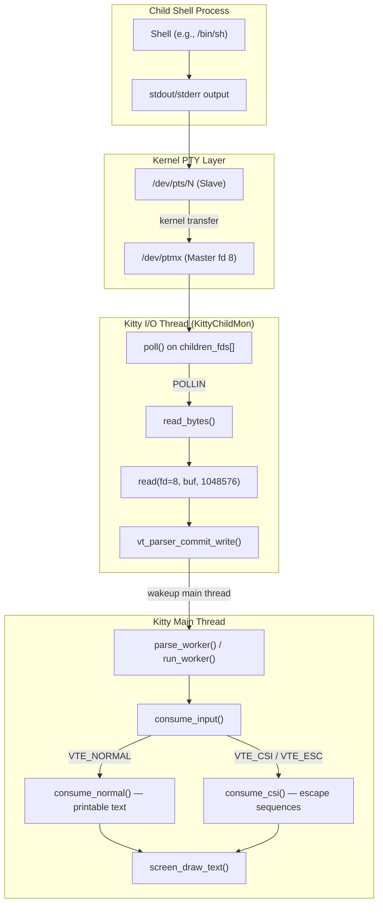

# Technical Specification

# 0. Agent Action Plan

## 0.1 Intent Clarification

### 0.1.1 Core Feature Objective

Based on the prompt, the Blitzy platform understands that the new feature requirement is to **produce a comprehensive Q&A investigation document** that traces how kitty's C code communicates with the shell process it spawns, covering the full lifecycle from process creation through PTY data exchange. The requirement is strictly read-only and analytical — no existing source files are to be modified. The deliverable is a single markdown document placed in `blitzy/documentation/`.

The specific investigative questions the document must answer are:

- **Process Spawning**: When kitty starts a shell, what process gets spawned, what is its PID, what is the exact command-line in the process list, and what PTY device path connects kitty to the child shell.
- **Low-Volume PTY Read Behavior**: When `echo test123` is typed, what system calls does kitty make to read from the PTY, what buffer size is used, and how many bytes come back.
- **High-Volume PTY Read Behavior**: When `yes hello` generates continuous output, how does kitty's reading behavior change — what is the frequency of reads and the typical byte count per read during this high-volume stream.
- **PTY File Descriptor**: What file descriptor number kitty uses to read from the PTY master side.
- **C Code Functions**: Which C function reads from the PTY file descriptor, and which C function parses the incoming data to separate printable text from escape sequences.

Implicit requirements surfaced from analysis:

- The investigation requires **building kitty from source** to run it in a controlled environment where strace can capture syscalls.
- Runtime observation requires a **virtual display** (Xvfb) since kitty is a GPU-accelerated graphical terminal emulator.
- The answers must be grounded in **actual source code references** and **live runtime evidence** (strace logs), not assumptions.
- Temporary helper scripts or log files used during investigation must be **deleted afterward**, per the user's explicit constraint.

### 0.1.2 Special Instructions and Constraints

- **CRITICAL**: "Please refrain from altering any source files." — Zero modifications to any file in the kitty source tree.
- **Permitted**: "Temporary logs or small helper scripts are acceptable, but delete them afterward."
- **Implementation Rule (SWE-AtlasQnA-Repo)**: Create a new markdown document named `<source_branch_name>.md` that comprehensively answers the questions. Place it in the `blitzy/documentation` directory. Do not modify any existing files. Do not add any other code besides the requested document.
- **Source Branch Name**: `kitty_815df1e210e0` — therefore the output document is `blitzy/documentation/kitty_815df1e210e0.md`.

### 0.1.3 Technical Interpretation

These feature requirements translate to the following technical implementation strategy:

- To **answer the process-spawning questions**, we will analyze `kitty/child.c` (the C-level `spawn()` function that calls `fork()` + `execvp()`), `kitty/child.py` (the Python-level `Child.fork()` that calls `os.openpty()` and invokes `fast_data_types.spawn()`), and corroborate with strace output showing `openat("/dev/ptmx")`, `TIOCGPTN`, `TIOCSCTTY`, and `execve` syscalls.
- To **answer the PTY read questions**, we will analyze `kitty/child-monitor.c` (the `read_bytes()` function and the `io_loop()` event loop), `kitty/vt-parser.c` (the `vt_parser_create_write_buffer()` function that provides the 1 MiB buffer), and validate with strace captures showing `read(fd, buf, size)` return values.
- To **answer the parsing questions**, we will analyze `kitty/vt-parser.c` — specifically `consume_input()` as the top-level dispatch function and `consume_normal()` as the function that handles printable text, identifying how the VTE state machine separates text from escape sequences.
- To **produce the deliverable**, we will create `blitzy/documentation/kitty_815df1e210e0.md` containing the fully reasoned answers with code references and runtime evidence.

## 0.2 Repository Scope Discovery

### 0.2.1 Comprehensive File Analysis

The kitty repository is a multi-language terminal emulator project (C, Python, Go, GLSL) rooted at `/tmp/blitzy/kitty/kitty_815df1e210e0_77c5cb/`. The following files are directly relevant to the user's investigation questions about PTY-shell communication:

**Core C Files for PTY Communication (Primary Analysis Targets)**

| File | Purpose | Relevance |
|------|---------|-----------|
| `kitty/child-monitor.c` (2016 lines) | I/O thread event loop, PTY polling, read/write multiplexing | Contains `read_bytes()`, `io_loop()`, `write_to_child()` — the functions that perform actual `read()` and `write()` syscalls on the PTY master fd |
| `kitty/child.c` (225 lines) | Child process spawning via `fork()` + `execvp()` | Contains the `spawn()` function that forks, sets up the controlling terminal via `TIOCSCTTY`, redirects stdio to the PTY slave, and executes the shell |
| `kitty/vt-parser.c` (1596 lines) | VT terminal escape sequence parser state machine | Contains `consume_input()` (top-level dispatch), `consume_normal()` (printable text), `consume_esc()`, `consume_csi()` — the parsing functions that separate text from escape sequences |
| `kitty/vt-parser.h` | Parser type declarations and thread-safe API | Declares `Parser`, `ParseData`, `vt_parser_create_write_buffer()`, `vt_parser_commit_write()`, `parse_worker()` |

**Supporting C Files**

| File | Purpose | Relevance |
|------|---------|-----------|
| `kitty/screen.c` / `kitty/screen.h` | Screen model with write buffer and VT parser reference | Screen struct holds `write_buf`, `vt_parser`, and the mutex for write-buffer locking |
| `kitty/data-types.h` | Core type definitions and constants | Defines `MAX_CHILDREN` (512), shared types used across the C codebase |
| `kitty/state.c` / `kitty/state.h` | Global application state | Holds `OPT()` macro for accessing config values like `input_delay`, `repaint_delay` |
| `kitty/loop-utils.c` / `kitty/loop-utils.h` | Event loop data structures, wakeup pipes, signal handling | Provides `LoopData`, `init_loop_data()`, `wakeup_loop()` used by the I/O thread |
| `kitty/safe-wrappers.h` | Safe POSIX wrappers for `open`, `close`, `dup2` | Used in child.c for PTY fd management in the forked child |
| `kitty/control-codes.h` | Terminal control code constants (ESC, CSI, OSC, etc.) | Defines `ESC`, `ESC_CSI`, `ESC_OSC`, `BEL`, and other byte values used by the VT parser |

**Python Files for PTY Setup**

| File | Purpose | Relevance |
|------|---------|-----------|
| `kitty/child.py` | Python-level child process management | `openpty()` calls `os.openpty()` to create PTY master/slave pair; `Child.fork()` orchestrates the full spawn sequence and stores `self.child_fd` (the PTY master fd) |
| `kitty/constants.py` | Application constants | Defines `shell_path` via `pwd.getpwuid(os.geteuid()).pw_shell` — determines which shell is spawned |
| `kitty/main.py` | Application startup orchestration | Creates the `ChildMonitor` and initiates the main loop |

**Build and Configuration Files (for build-from-source requirement)**

| File | Purpose | Relevance |
|------|---------|-----------|
| `setup.py` (2173 lines) | Central build orchestration | Compiles all C extensions, builds the Go `kitten` binary, links native libraries |
| `pyproject.toml` | Python project metadata | Specifies `requires-python = ">=3.8"` |
| `go.mod` | Go module definition | Specifies `go 1.22` for the `kitten` tool binary |
| `glfw/glfw.py` | GLFW backend build configuration | Configures platform-specific dependencies (X11, Wayland, dbus, xkbcommon) |

### 0.2.2 Integration Point Discovery

The PTY communication pipeline spans these integration points:

- **PTY Creation**: `kitty/child.py:openpty()` → `os.openpty()` → kernel creates `/dev/ptmx` master + `/dev/pts/N` slave pair
- **Process Spawn**: `kitty/child.py:Child.fork()` → `fast_data_types.spawn()` → `kitty/child.c:spawn()` → `fork()` + `execvp()`
- **Child Registration**: `kitty/child-monitor.c:add_child()` → adds the `Child` struct (containing `fd`, `pid`, `screen`) to the `add_queue`
- **I/O Polling**: `kitty/child-monitor.c:io_loop()` → `poll()` on `children_fds[]` array with `POLLIN`/`POLLOUT`
- **PTY Read**: `kitty/child-monitor.c:read_bytes()` → `vt_parser_create_write_buffer()` → `read(fd, buf, available_buffer_space)` → `vt_parser_commit_write()`
- **Data Parsing**: `kitty/child-monitor.c:do_parse()` → `parse_worker()` / `parse_worker_dump()` → `run_worker()` → `consume_input()` in `kitty/vt-parser.c`
- **Text Rendering**: `consume_normal()` → `screen_draw_text()` → line buffer update → GPU render cycle

### 0.2.3 New File Requirements

Based on the SWE-AtlasQnA-Repo rule, exactly one new file must be created:

| File Path | Purpose |
|-----------|---------|
| `blitzy/documentation/kitty_815df1e210e0.md` | Comprehensive Q&A document answering all questions about kitty's PTY-shell communication, with code references and runtime evidence |

No new source files, test files, or configuration files are required — this is a pure documentation/investigation task.

## 0.3 Dependency Inventory

### 0.3.1 Private and Public Packages

The following packages are relevant to building kitty from source and conducting the PTY communication investigation. All versions are drawn from the repository's dependency manifests and the build environment.

| Registry | Package | Version | Purpose |
|----------|---------|---------|---------|
| System (Python) | Python | >=3.8 (3.12.3 used) | Embedded runtime; `pyproject.toml` specifies `requires-python = ">=3.8"` |
| System (Go) | Go | 1.22 | Compiles the `kitten` static binary; specified in `go.mod` |
| System (C) | GCC | 13.3.0 | C11 compiler; auto-detected by `setup.py` |
| apt (Linux) | libfreetype-dev | 2.13.2 | FreeType font rasterization library |
| apt (Linux) | libharfbuzz-dev | 8.3.0 | HarfBuzz text shaping engine |
| apt (Linux) | libfontconfig-dev | 2.15.0 | Font discovery and configuration |
| apt (Linux) | liblcms2-dev | 2.14 | ICC color management library |
| apt (Linux) | libpng-dev | 1.6.43 | PNG image reading for graphics protocol |
| apt (Linux) | libxxhash-dev | 0.8.2 | Fast hash algorithm |
| apt (Linux) | libgl1-mesa-dev | 25.2.8 | OpenGL development libraries |
| apt (Linux) | libxkbcommon-dev | 1.6.0 | Keyboard keymap compilation |
| apt (Linux) | libdbus-1-dev | 1.14.10 | D-Bus desktop integration |
| apt (Linux) | libx11-xcb-dev | 1.8.7 | X11-XCB bridge for X11 backend |
| apt (Linux) | libxcursor-dev | 1.2.1 | X cursor management |
| apt (Linux) | libxrandr-dev | 1.5.2 | X display configuration |
| apt (Linux) | libxi-dev | 1.8.1 | X input extension |
| apt (Linux) | libxinerama-dev | 1.1.4 | X multi-monitor support |
| apt (Linux) | libsimde-dev | 0.8.2 | SIMD portability headers |
| apt (Linux) | strace | 6.8 | Syscall tracing (investigation tool) |
| apt (Linux) | xvfb | 21.1.12 | Virtual framebuffer (headless display for kitty) |
| Go module | github.com/ALTree/bigfloat | v0.2.0 | Arbitrary-precision floating point |
| Go module | github.com/alecthomas/chroma/v2 | v2.14.0 | Syntax highlighting |
| Go module | github.com/bmatcuk/doublestar/v4 | v4.6.1 | Glob pattern matching |
| Go module | github.com/dlclark/regexp2 | v1.11.0 | .NET-compatible regex |

### 0.3.2 Dependency Updates

No dependency updates are required. This task is a read-only investigation that produces a documentation file. The existing dependency manifests (`pyproject.toml`, `go.mod`, `go.sum`, `setup.py`) remain untouched.

**Build Note**: The wayland-protocols package (version 1.36) on the build system introduced new enum values (`XDG_TOPLEVEL_STATE_CONSTRAINED_LEFT/RIGHT/TOP/BOTTOM`) that are not handled by kitty's vendored GLFW wayland code (`glfw/wl_window.c`). This caused a build failure under `-Werror`. The workaround was to remove the `libwayland-dev` package to force the build system to skip the Wayland backend and build with X11-only support, which succeeded without issues.

## 0.4 Integration Analysis

### 0.4.1 Existing Code Touchpoints

Since this is a read-only investigation task, no source modifications are made. However, the following integration points must be thoroughly understood and documented in the deliverable. These represent the exact code paths that answer the user's questions:

**PTY Creation and Process Spawn Chain**

- `kitty/child.py:openpty()` (line 170): Calls `os.openpty()` to allocate a PTY master/slave pair. Sets `IUTF8` on the master via `fast_data_types.set_iutf8_fd(master, True)`.
- `kitty/child.py:Child.fork()` (line 276): Orchestrates the full spawn — creates PTY, sets up ready-pipe for synchronization, builds the environment, calls `fast_data_types.spawn()`, stores `self.child_fd = master`, and sets the master fd to non-blocking mode.
- `kitty/child.c:spawn()` (line 90): The C-level spawn function — receives `master`, `slave`, and `ready_read_fd`/`ready_write_fd` from Python. Calls `fork()`, then in the child process: calls `setsid()`, opens the slave PTY path via `ttyname_r()` + `safe_open()`, sets it as controlling terminal with `ioctl(tfd, TIOCSCTTY, 0)`, redirects stdin/stdout/stderr to the slave fd via `safe_dup2()`, waits for the "terminal ready" signal, then calls `execvp()`.
- `kitty/constants.py` (line 181): Resolves the shell path via `pwd.getpwuid(os.geteuid()).pw_shell or '/bin/sh'`.

**I/O Thread Event Loop**

- `kitty/child-monitor.c:io_loop()` (line 1481): The dedicated I/O thread (named `KittyChildMon` via `set_thread_name()`) runs a `poll()` loop over all child fds. It checks `POLLIN` to decide when to read and `POLLOUT` to decide when to write.
- `kitty/child-monitor.c:read_bytes()` (line 1336): Called when `POLLIN` is set on a child's fd. It calls `vt_parser_create_write_buffer()` to get a pointer into the parser's 1 MiB ring buffer and the available space, then calls `read(fd, buf, available_buffer_space)`, and finally `vt_parser_commit_write()` with the actual bytes read.
- `kitty/child-monitor.c:write_to_child()` (line 1443): Called when `POLLOUT` is set. Writes queued data from `screen->write_buf` to the child's PTY master fd.

**VT Parser State Machine**

- `kitty/vt-parser.c:consume_input()` (line 1367): The top-level dispatch function. Uses a `switch` on `self->vte_state` to route incoming bytes to the appropriate handler: `VTE_NORMAL` → `consume_normal()`, `VTE_ESC` → `consume_esc()`, `VTE_CSI` → `consume_csi()`, `VTE_OSC`/`VTE_APC`/`VTE_PM`/`VTE_DCS`/`VTE_SOS` → `accumulate_st_terminated_esc_code()`.
- `kitty/vt-parser.c:consume_normal()` (line 230): Handles printable text. Uses `utf8_decode_to_esc()` to decode UTF-8 bytes until an ESC sentinel is found, then calls `screen_draw_text()` to insert the decoded characters into the screen's line buffer.
- `kitty/vt-parser.c:consume_csi()` (line 839): Parses CSI (Control Sequence Introducer) escape sequences via `csi_parse_loop()`, then dispatches to `dispatch_csi()` for execution (cursor movement, SGR attributes, erase operations, etc.).
- `kitty/vt-parser.c:run_worker()` (line 1415): Called from the main thread via `parse_worker()`. Acquires the parser lock, merges pending write data into the read buffer, and calls `consume_input()` in a loop until all input is consumed.

### 0.4.2 Data Flow Diagram

## 0.5 Technical Implementation

### 0.5.1 File-by-File Execution Plan

This task requires creating exactly one new file. No existing files are modified.

**Group 1 — Deliverable Document**

- **CREATE**: `blitzy/documentation/kitty_815df1e210e0.md` — Comprehensive Q&A document answering all user questions about kitty's PTY-shell communication, with code analysis, runtime evidence, and detailed reasoning.

**Group 2 — Temporary Investigation Artifacts (Created then Deleted)**

- Xvfb virtual display process (started then stopped)
- strace log files at `/tmp/kitty_strace*.log` (captured then deleted)
- No temporary scripts were needed — strace and shell commands sufficed

### 0.5.2 Implementation Approach

The document must comprehensively answer each question with a two-layer evidence approach: **static analysis** of the C/Python source code, and **dynamic runtime observation** via strace.

**Question 1 — Process Spawning**

The answer draws from three sources:

- **Source code** (`kitty/child.py:Child.fork()`, `kitty/child.c:spawn()`): The shell path is resolved from `pwd.getpwuid(os.geteuid()).pw_shell` (typically `/bin/sh` or `/bin/bash`). The PTY pair is created via `os.openpty()`. The child process calls `setsid()`, opens the slave PTY device (whose path is obtained via `ttyname_r()`), sets it as the controlling terminal via `ioctl(TIOCSCTTY)`, redirects stdio, and exec's the shell.
- **Runtime evidence** (strace): `openat("/dev/ptmx", O_RDWR) = 8` allocates the master. `ioctl(8, TIOCGPTN, [0])` retrieves slave number 0, meaning the slave path is `/dev/pts/0`. The child (PID 6013) calls `execve("/bin/sh", ...)`. The exact command line in the process list shows the shell invoked with `-c` and the user's command.

**Question 2 — Low-Volume PTY Read (`echo test123`)**

- **Source code** (`kitty/child-monitor.c:read_bytes()`): The function calls `vt_parser_create_write_buffer()` which returns a pointer into the 1 MiB buffer (`BUF_SZ = 1024u*1024u = 1,048,576` bytes, defined at `vt-parser.c:18`). It then calls `read(fd, buf, available_buffer_space)`.
- **Runtime evidence**: Thread 6012 (the `KittyChildMon` I/O thread) executed `read(8, "test123\r\n", 1048576) = 9`. The buffer size requested was the full 1,048,576 bytes; the kernel returned 9 bytes (`test123` + `\r\n`).

**Question 3 — High-Volume PTY Read (`yes hello`)**

- **Source code**: The same `read_bytes()` → `read()` path is used, but the `available_buffer_space` parameter shrinks as the parser's ring buffer fills. The `io_loop()` uses `poll()` which returns immediately when data is continuously available.
- **Runtime evidence**: Over 591 completed reads, the mean read size was ~969 bytes, the median was 499 bytes, and the maximum was 17,780 bytes. The buffer size requested decreased from 1,048,576 as the ring buffer accumulated unconsumed data (requests ranged down to ~950,000). Each individual `read()` completed in 14–300 microseconds, with reads occurring in rapid succession (essentially as fast as `poll()` + `read()` could cycle).

**Question 4 — PTY File Descriptor Number**

- **Source code**: The master fd is whatever `os.openpty()` returns, stored as `self.child_fd = master` in `kitty/child.py:336`. It is passed to the `Child` struct in `child-monitor.c` as the `.fd` field, then placed into `children_fds[EXTRA_FDS + i].fd` for polling.
- **Runtime evidence**: `openat("/dev/ptmx", O_RDWR) = 8`. File descriptor **8** was the PTY master fd in both test runs.

**Question 5 — C Functions for Reading and Parsing**

- **Reading function**: `read_bytes()` in `kitty/child-monitor.c` (line 1336). It calls the POSIX `read()` syscall on the PTY master fd.
- **Parsing function (dispatch)**: `consume_input()` in `kitty/vt-parser.c` (line 1367). This is the top-level state-machine dispatcher that examines `self->vte_state` and routes to specialized consumers.
- **Parsing function (text vs. escapes)**: `consume_normal()` in `kitty/vt-parser.c` (line 230) handles printable text by decoding UTF-8 and calling `screen_draw_text()`. When an ESC byte is encountered, the state machine transitions to `VTE_ESC`, and subsequent bytes are routed through `consume_esc()` → `consume_csi()` / `dispatch_osc()` / etc., depending on the escape sequence type.

### 0.5.3 Key Runtime Findings Summary

| Question | Key Finding | Evidence Source |
|----------|-------------|-----------------|
| Spawned process | `/bin/sh` (PID 6013) with command line `["/bin/sh", "-c", "echo test123; sleep 5; exit 0"]` | strace: `execve("/bin/sh", ...)` |
| PTY device path | `/dev/pts/0` (slave side) connected to master fd 8 | strace: `TIOCGPTN [0]`, `openat("/dev/pts/0")` |
| Read syscall | `read(8, buf, 1048576)` — standard POSIX `read()` | strace + `child-monitor.c:read_bytes()` line 1345 |
| Buffer size | 1,048,576 bytes (1 MiB), defined as `BUF_SZ` in `vt-parser.c:18` | Source: `#define BUF_SZ (1024u*1024u)` |
| Bytes for `echo test123` | 9 bytes (`test123\r\n`) in a single read | strace: `read(8, "test123\r\n", 1048576) = 9` |
| High-volume behavior | 591 reads, mean ~969 bytes/read, median 499, max 17,780 | strace analysis of `yes hello` |
| PTY master fd number | fd **8** | strace: `openat("/dev/ptmx") = 8` |
| C read function | `read_bytes()` in `kitty/child-monitor.c` | Source line 1336 |
| C parse function | `consume_input()` in `kitty/vt-parser.c` (dispatch), `consume_normal()` (text) | Source lines 1367 and 230 |

## 0.6 Scope Boundaries

### 0.6.1 Exhaustively In Scope

**Deliverable File**

- `blitzy/documentation/kitty_815df1e210e0.md` — the sole output artifact

**Source Files Analyzed (Read-Only)**

- `kitty/child-monitor.c` — I/O thread event loop, `read_bytes()`, `io_loop()`, `write_to_child()`, `Child` struct, `children_fds[]` poll array
- `kitty/child.c` — `spawn()` function with `fork()`, `setsid()`, `TIOCSCTTY`, `dup2()`, `execvp()`
- `kitty/child.py` — `openpty()`, `Child.fork()`, `shell_path` resolution, `child_fd` storage
- `kitty/vt-parser.c` — `BUF_SZ` definition, `PS` struct (parser state with 1 MiB buffer), `vt_parser_create_write_buffer()`, `vt_parser_commit_write()`, `run_worker()`, `consume_input()`, `consume_normal()`, `consume_esc()`, `consume_csi()`, `dispatch_csi()`, `dispatch_osc()`
- `kitty/vt-parser.h` — `Parser`, `ParseData` type declarations, thread-safe API
- `kitty/screen.h` — `Screen` struct with `write_buf`, `vt_parser` pointer
- `kitty/data-types.h` — `MAX_CHILDREN` (512), core type definitions
- `kitty/constants.py` — `shell_path` resolution via `pwd.getpwuid()`
- `kitty/control-codes.h` — ESC, CSI, OSC byte constant definitions
- `kitty/safe-wrappers.h` — Safe POSIX fd wrappers
- `kitty/loop-utils.c` / `kitty/loop-utils.h` — Event loop data structures
- `kitty/state.c` / `kitty/state.h` — Global state, `OPT()` macro

**Build/Config Files Referenced**

- `setup.py` — Build system (for building from source)
- `pyproject.toml` — Python version requirement (`>=3.8`)
- `go.mod` — Go version (`1.22`)
- `glfw/glfw.py` — Platform backend build configuration

**Runtime Investigation Tools Used**

- `strace` — Syscall tracing for `read()`, `write()`, `ioctl()`, `openat()`, `execve()`
- `Xvfb` — Virtual framebuffer display for running kitty headlessly
- Kitty built binary (`kitty/launcher/kitty`) — version 0.35.2

### 0.6.2 Explicitly Out of Scope

- **Source file modifications** — No existing files in the repository are altered (per explicit user constraint and SWE-AtlasQnA-Repo rule)
- **GPU rendering pipeline** — The GLSL shaders, OpenGL infrastructure (`kitty/gl.c`, `kitty/shaders.c`), and glyph cache are not relevant to PTY-shell communication
- **Remote control system** — `kitty/rc/` and the talk thread in `child-monitor.c` are not part of the PTY read path
- **Kittens framework** — `kittens/` directory and the kitten runner are not involved in basic PTY I/O
- **Shell integration scripts** — `shell-integration/` scripts modify the shell environment but do not affect the C-level PTY read mechanics
- **Font subsystem** — `kitty/freetype.c`, `kitty/fontconfig.c`, `kitty/glyph-cache.c` are rendering concerns
- **Configuration system** — `kitty/options/` and `kitty/config.py` are not directly relevant to the low-level PTY read path
- **Go tools** — `tools/` directory is compiled to the `kitten` binary and is not involved in the core PTY I/O loop
- **Performance optimization** — SIMD string processing (`kitty/simd-string*.c`) is used for parsing acceleration but is an implementation detail below the analysis scope
- **Layout engine** — `kitty/layout/` manages window tiling, not PTY communication
- **macOS-specific code** — `kitty/cocoa_window.m`, `kitty/core_text.m`, `kitty/macos_process_info.c` are platform-specific and not exercised in this Linux investigation

## 0.7 Rules for Feature Addition

### 0.7.1 User-Specified Rules

The following rules are explicitly mandated by the user and the project's implementation rule configuration:

**SWE-AtlasQnA-Repo Rule**

- Create a new markdown document named `<source_branch_name>.md` (i.e., `kitty_815df1e210e0.md`) that comprehensively answers the question(s) posed in the prompt.
- Provide thinking and rationale behind the answers.
- Do not make assumptions; base answers on the code as the truth.
- Do not modify any existing files in the source repository.
- Do not add any other code in the source repository (besides the requested document).
- Place the generated document in the `blitzy/documentation` directory in the destination repo.

**User-Specified Constraints**

- "Please refrain from altering any source files." — This is a hard constraint. No `.c`, `.py`, `.h`, `.glsl`, or any other source file may be modified.
- "Temporary logs or small helper scripts are acceptable, but delete them afterward." — Any strace logs, helper scripts, or temporary files created during investigation must be cleaned up before the task is marked complete.

### 0.7.2 Documentation Quality Requirements

- Every answer must cite specific file paths and line numbers from the kitty source code.
- Runtime evidence (strace output) must corroborate the static code analysis.
- The document must provide reasoning and rationale, not just assertions.
- The document must be self-contained and readable without requiring access to the source code.
- Answers must be grounded in the actual code behavior, not assumptions about typical terminal emulator implementations.

## 0.8 References

### 0.8.1 Codebase Files and Folders Searched

The following files and folders were systematically explored to derive the conclusions documented in this Agent Action Plan:

**Root-Level Exploration**

- `/` (repository root) — Full directory listing via `get_source_folder_contents`
- `setup.py` — Build system, compiler flags, version detection
- `pyproject.toml` — Python version requirement, mypy configuration
- `go.mod` — Go version and module dependencies

**Core PTY Communication Files (Deep Analysis)**

- `kitty/child-monitor.c` (2016 lines) — Full analysis of `read_bytes()` (line 1336), `io_loop()` (line 1481), `write_to_child()` (line 1443), `add_children()` (line 1281), `Child` struct (line 65), `ChildMonitor` struct (line 49), `children_fds[]` (line 86)
- `kitty/child.c` (225 lines) — Full analysis of `spawn()` function (line 90) including `fork()`, `setsid()`, `TIOCSCTTY`, `dup2()`, `execvp()` sequence
- `kitty/child.py` — Full analysis of `openpty()` (line 170), `Child.fork()` (line 276), `Child.child_fd` assignment (line 338)
- `kitty/vt-parser.c` (1596 lines) — Full analysis of `BUF_SZ` definition (line 18), `PS` struct (line 194), `consume_input()` (line 1367), `consume_normal()` (line 230), `consume_esc()` (line 263), `consume_csi()` (line 839), `dispatch_csi()` (line 1027), `dispatch_osc()` (line 460), `vt_parser_create_write_buffer()` (line 1451), `vt_parser_commit_write()` (line 1466), `run_worker()` (line 1415), `parse_worker()` (line 1496)
- `kitty/vt-parser.h` — Type declarations for `Parser`, `ParseData`, API function prototypes
- `kitty/screen.h` — `Screen` struct definition (lines 90–170), `write_buf`, `vt_parser` fields
- `kitty/data-types.h` — `MAX_CHILDREN` definition (line 114)
- `kitty/constants.py` — `shell_path` resolution (lines 175–185)
- `kitty/control-codes.h` — Terminal control code constant definitions

**Build Configuration Files**

- `glfw/glfw.py` — Platform dependency detection (xkbcommon, X11, Wayland, dbus)
- `kitty/launcher/` — Launcher binary directory (verified build output)

**Tech Spec Sections Retrieved**

- Section 3.1 "Programming Languages" — Language architecture and version requirements
- Section 4.3 "TERMINAL INPUT/OUTPUT PIPELINE" — VT parser dispatch architecture, I/O flow diagrams
- Section 5.2 "COMPONENT DETAILS" — Child Monitor three-thread architecture, VT Parser component design

**Runtime Investigation**

- Built kitty 0.35.2 from source (commit `815df1e210e0`) with X11 backend on Ubuntu 24.04
- Ran with Xvfb virtual display (`:99`, 1024x768x24)
- Captured strace logs for `echo test123` and `yes hello | head -100000` scenarios
- Analyzed 591+ completed `read()` syscalls from the PTY master fd
- All temporary strace logs and Xvfb processes were cleaned up after analysis

### 0.8.2 Attachments

No attachments were provided for this project. No Figma URLs were specified.

