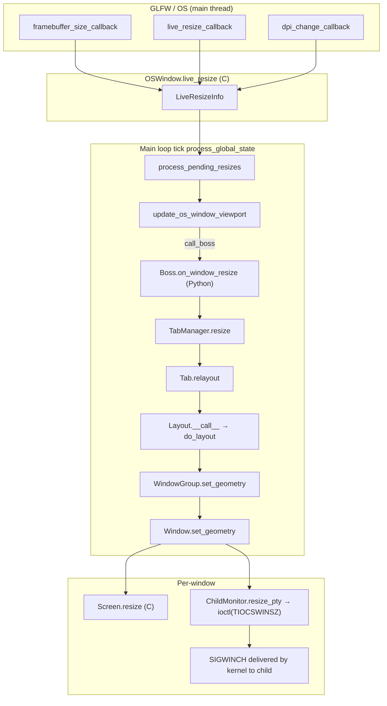
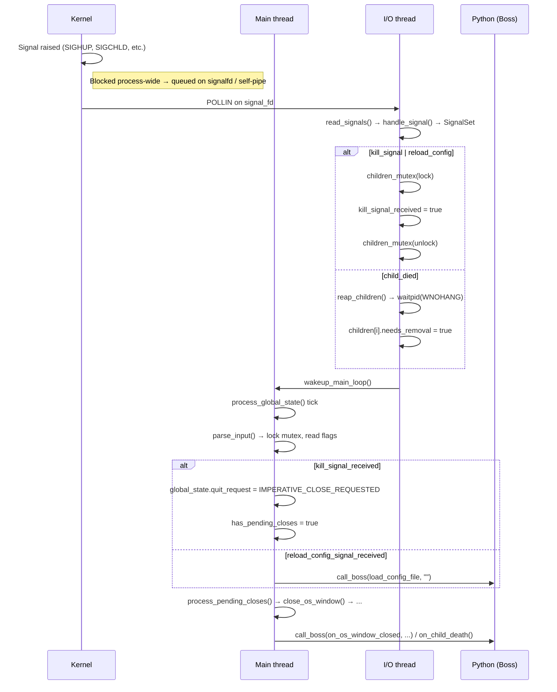

# State Consistency in Kitty During Rapid Window Lifecycle Events

> **Repository**: `kovidgoyal/kitty` at commit `815df1e210e0a9ab4622f5c7f2d6891d7dbeddf1`
>
> **Scope**: An evidence‑based, code‑level analysis of how kitty maintains internal state consistency when terminal windows are created, resized, and destroyed in quick succession. All conclusions are derived exclusively from the kitty source code — no external assumptions, no general terminal‑emulator folklore.

---

## Table of Contents

1. [Executive Summary](#1-executive-summary)
2. [The Architecture at a Glance](#2-the-architecture-at-a-glance)
3. [Core Data Structures and the Guard Macros](#3-core-data-structures-and-the-guard-macros)
4. [Question 1 — Creating a window and running a command immediately](#4-question-1--creating-a-window-and-running-a-command-immediately)
5. [Question 2 — Resize events, `SIGWINCH`, and the debounce pipeline](#5-question-2--resize-events-sigwinch-and-the-debounce-pipeline)
6. [Question 3 — Destroying a window before everything has finished reacting](#6-question-3--destroying-a-window-before-everything-has-finished-reacting)
7. [Question 4 — Conflicting views of liveness across threads](#7-question-4--conflicting-views-of-liveness-across-threads)
8. [Question 5 — Signal timing and deferred processing](#8-question-5--signal-timing-and-deferred-processing)
9. [Cross‑Cutting: What state is kept, what is discarded](#9-cross-cutting-what-state-is-kept-what-is-discarded)
10. [Summary Table of the Consistency Mechanisms](#10-summary-table-of-the-consistency-mechanisms)

---

## 1. Executive Summary

Kitty keeps its internal window/tab/OS‑window state consistent under rapid lifecycle churn by combining **five orthogonal mechanisms**, each with a specific role:

| # | Mechanism | Where it lives | What it protects against |
|---|-----------|---------------|--------------------------|
| 1 | **Three‑thread architecture with a single writer per data structure** | `kitty/child-monitor.c` (`io_loop`, `talk_loop`, `process_global_state`) | Races between OS I/O, remote control, and state mutation. All Python state is touched only from the main thread; only C fds and `write_buf` are touched from the I/O thread. |
| 2 | **Two mutexes (`children_mutex`, `talk_mutex`) + per‑screen `write_buf_lock`** | `kitty/child-monitor.c` | Safe hand‑off of children, signals, and bytes between threads, using hand‑off queues (`add_queue`/`remove_queue`/`remove_notify`). |
| 3 | **Process‑wide signal masking + `signalfd`/self‑pipe in the I/O thread** | `kitty/main.py:mask_kitty_signals_process_wide`, `kitty/loop-utils.c:init_signal_handlers`, `kitty/child-monitor.c:handle_signal` | Async‑signal‑safety concerns in Python/GPU code. Signals become boolean flags (`kill_signal_received`, `reload_config_signal_received`) consumed synchronously by the main thread. |
| 4 | **Debouncing and coalescing via `LiveResizeInfo`** | `kitty/state.h`, `kitty/child-monitor.c:process_pending_resizes`, `kitty/glfw.c:framebuffer_size_callback` | Floods of resize events. Intermediate dimensions are discarded; only the final framebuffer size is propagated through `Screen.resize` → `TIOCSWINSZ` → `SIGWINCH`. |
| 5 | **Guard macros and `destroyed` sentinels** | `kitty/state.h:WITH_OS_WINDOW / WITH_TAB / WITH_WINDOW`, `kitty/window.py:Window.set_geometry` | Use‑after‑free style races where a window is referenced by C state while Python has already destroyed it (or vice versa). Missing IDs are silently no‑op'd. |

When a window is **created and used to run a command** before any I/O has happened, the ordering is fixed by the main thread: `Window.__init__` registers the window in C via `add_window()`, `Child.fork()` allocates the PTY and calls `fast_data_types.spawn()`, and only afterward does `Boss.add_child()` hand the PTY fd to the I/O thread via `add_queue`. The child process is **unblocked only after the first `Window.set_geometry()`** call (which invokes `child.mark_terminal_ready()`), so there is no way for the child's first byte to reach a window that has not yet been sized.

When **resize events arrive in quick succession**, kitty first buffers them in `OSWindow.live_resize` (a `LiveResizeInfo` struct) and then applies one coalesced reflow per debounce tick. The debounce period is configurable via `resize_debounce_time` and has two sub‑timers: `on_pause` (used while the OS still believes a resize is in progress) and `on_end` (used when no OS notification of "resize complete" exists). Intermediate sizes are discarded.

When a **window is destroyed before pending work completes**, the design guarantees a strict in‑main‑loop ordering: `process_pending_resizes()` runs before `parse_input()` which runs before `process_pending_closes()` (see `process_global_state()` in `child-monitor.c`). A late resize callback into Python short‑circuits on `if self.destroyed: return` at the top of `Window.set_geometry()`. A late reference into C is silently ignored because `WITH_OS_WINDOW` / `WITH_WINDOW` no‑op when the id is not found.

When two threads might disagree about whether a child is alive, the **`remove_queue` → `remove_notify` → `death_notify` handoff** is the authoritative unwind path: the I/O thread sets `needs_removal`, then physically closes the fd and calls `killpg(..., SIGHUP)` in `cleanup_child()`, enqueues the child onto `remove_queue[]` under the mutex, and the main thread drains it in `parse_input()` into `remove_notify[]`, flushes any remaining bytes via `do_parse(..., flush=true)`, and then calls the Python `death_notify` (i.e. `Boss.on_child_death`). This means the window is removed from `window_id_map` **after** its last bytes have been parsed, never before.

Finally, **signals are not delivered to the application's Python code at all**. `mask_kitty_signals_process_wide()` blocks every signal kitty cares about in every thread, and then `init_signal_handlers()` in the I/O thread subscribes to them via `signalfd` (Linux) or a self‑pipe armed with `sigaction(SA_SIGINFO)` (macOS / OpenBSD / BSD fallbacks). The I/O thread converts the kernel signal into a boolean under the `children_mutex`; the main thread polls the flag in `parse_input()` and promotes it to a semantically rich operation (quit request, config reload, child reap).

The rest of this document walks through each of these mechanisms with specific file/function citations.

---

## 2. The Architecture at a Glance

### 2.1 Three threads, distinct responsibilities

Kitty's backend is organized around three `pthread` threads, all created by `ChildMonitor`:

| Thread | Entry function (C) | Loop | Touches |
|--------|--------------------|------|---------|
| **Main** (Python) | `process_global_state()` / `do_state_check()` via `run_main_loop()` | GLFW event loop ticked by `state_check_timer` | `GlobalState`, all Python objects (`Boss`, `TabManager`, `Tab`, `Window`), GPU context, `OSWindow.live_resize`, `window_id_map` |
| **I/O** ("KittyChildMon") | `io_loop()` | `poll()` on child fds + wakeup fd + signal fd | `children[]`, `children_fds[]`, `add_queue[]`, `remove_queue[]`, `kill_signal_received`/`reload_config_signal_received`, per‑screen `write_buf` |
| **Talk** ("KittyPeerMon") | `talk_loop()` | `poll()` on peer sockets | `messages[]` (remote‑control input queue) |

The crucial invariant is **"one writer per data structure"**: Python state is only ever written from the main thread, child I/O state is only ever mutated (for `fd`/reads/writes) from the I/O thread, and cross‑thread communication is exclusively through fixed handoff queues guarded by `children_mutex`.

### 2.2 The main loop's strict ordering

`process_global_state()` in `kitty/child-monitor.c` runs every main‑loop tick. Its body (lines ~1224–1249) is, in order:

```c
static void
process_global_state(void *data) {
    ChildMonitor *self = data;
    maximum_wait = -1;
    bool state_check_timer_enabled = false;
    bool input_read = false;

    monotonic_t now = monotonic();
    if (global_state.has_pending_resizes) {
        process_pending_resizes(now);       // (A) resizes FIRST
        input_read = true;
    }
    if (parse_input(self)) input_read = true; // (B) bytes + signals + remove_queue drain
    render(now, input_read);                  // (C) GPU render
#ifdef __APPLE__
    if (has_cocoa_pending_actions) { process_cocoa_pending_actions(); maximum_wait = 0; }
#endif
    report_reaped_pids();                     // (D) pid reap notifications
    bool should_quit = false;
    if (global_state.has_pending_closes) should_quit = process_pending_closes(self); // (E) closes LAST
    if (should_quit) stop_main_loop();
    else { ... update_main_loop_timer(...); }
}
```

This **fixed ordering** is what makes state transitions deterministic:

- A late resize cannot race with a close because a late resize has already been applied (or discarded) in step (A) before the close in step (E).
- A child's last bytes are drained in step (B) (see `parse_input()` § 3.4) before the window is torn down in step (E).
- Render (step C) always sees the post‑resize, pre‑close dimensions.

### 2.3 The tick cadence

The main thread is a GLFW event loop driven by a periodic timer. `main_loop()` (in `child-monitor.c`) installs a one‑second "state_check_timer" that guarantees a tick at least every second:

```c
state_check_timer = add_main_loop_timer(1000, true, do_state_check, self, NULL);
run_main_loop(process_global_state, self);
```

However, the timer is only the *worst case*. The loop is also ticked eagerly by `wakeup_main_loop()` whenever the I/O thread reads bytes, whenever a signal arrives, whenever a GLFW callback fires, and whenever `request_tick_callback()` is called (by resize/close flags). The I/O thread throttles its wakeups so as not to fire more than once per `input_delay` (see `io_loop()` at the end: `if (data_received) { ... WAKEUP ... }`).

---

## 3. Core Data Structures and the Guard Macros

### 3.1 The window hierarchy

From `kitty/state.h` (lines ~156–280):

```c
typedef struct { ...
    id_type id;
    bool visible;
    ... WindowRenderData render_data;  // vao_idx, xstart/ystart, dx/dy, Screen*
    WindowGeometry geometry;
    ... ClickQueue click_queues[8];
} Window;

typedef struct {
    id_type id;
    unsigned int active_window;
    size_t num_windows, capacity;
    Window *windows;
    BorderRects border_rects;
} Tab;

typedef struct {
    ... GLFWwindow *handle;
    id_type id;
    double fonts_data->logical_dpi_x, ...;
    ...
    Tab *tabs; size_t num_tabs;
    BackgroundImage *bgimage;
    bool is_focused;
    LiveResizeInfo live_resize;
    bool has_pending_resizes;
    CloseRequest close_request;
    ...
    RenderState render_state;
} OSWindow;

typedef struct {
    Options opts;
    id_type os_window_id_counter, ...;
    PyObject *boss;
    OSWindow *os_windows; size_t num_os_windows, capacity;
    OSWindow *callback_os_window;
    bool is_wayland;
    bool has_pending_resizes;       // any OS window has pending resizes
    bool has_pending_closes;        // any OS window / quit request pending
    CloseRequest quit_request;      // application‑wide quit state machine
    ...
} GlobalState;
```

Three things are worth highlighting:

1. **Everything is an array of structs**. `os_windows`, `tabs`, and `windows` are all `capacity`‑managed C arrays. IDs are monotonically increasing counters (`os_window_id_counter`, `tab_id_counter`, `window_id_counter`), and lookups are linear (`WITH_OS_WINDOW`, `WITH_TAB`, `WITH_WINDOW` macros iterate). This makes "the window no longer exists" lookups O(n), which is fine because n is small (tens at most).
2. **`has_pending_resizes` and `has_pending_closes` are boolean "wakeup" flags** set by callbacks and checked once per main‑loop tick.
3. **`CloseRequest` is a four‑state machine** (see § 3.3), not a boolean, which is how kitty distinguishes "user clicked close but we need to confirm" from "user clicked close, confirmed, do it now".

### 3.2 `LiveResizeInfo` — the debounce state

```c
typedef struct {
    monotonic_t last_resize_event_at;
    bool in_progress;
    bool from_os_notification;
    bool os_says_resize_complete;
    uint32_t width, height;
    unsigned int num_of_resize_events;
} LiveResizeInfo;
```

A `LiveResizeInfo` is attached to every `OSWindow`. It is the single place where "is a resize in progress, and if so, how long has it been since the last event" is tracked. The two interesting flags are:

- `from_os_notification`: set to `true` when the compositor (Cocoa, X, Wayland) tells kitty explicitly "the user started resizing". In that case, kitty waits for an explicit "resize complete" notification or for `resize_debounce_time.on_pause` to elapse — whichever comes first.
- `os_says_resize_complete`: set by the OS "resize done" callback. When true, the next `process_pending_resizes()` tick applies immediately.

When the OS does not provide resize‑in‑progress notifications (most Linux/X11 setups without the live‑resize hint), kitty falls back to time‑based debouncing with `resize_debounce_time.on_end` (default 0.1s).

### 3.3 `CloseRequest` — the close state machine

From `kitty/state.h`:

```c
typedef enum CloseRequest {
    NO_CLOSE_REQUESTED,
    CONFIRMABLE_CLOSE_REQUESTED,
    CLOSE_BEING_CONFIRMED,
    IMPERATIVE_CLOSE_REQUESTED
} CloseRequest;
```

Both `OSWindow.close_request` and `GlobalState.quit_request` use this same enum. The transitions are:

```
                 user clicks [x] on title bar
                           │
                           ▼
     NO_CLOSE_REQUESTED ─► CONFIRMABLE_CLOSE_REQUESTED
                                     │
                     Boss.confirm_os_window_close()
                                     ▼
                           CLOSE_BEING_CONFIRMED
                            │                │
              user confirms │                │ user cancels
                            ▼                ▼
                  IMPERATIVE_CLOSE_REQUESTED  NO_CLOSE_REQUESTED
                            │
                            ▼
                    close_os_window()
```

`process_pending_closes()` (see § 6.2) is the code that walks this state machine on every tick.

### 3.4 The guard macros

In `kitty/state.h` (also used throughout `state.c`) there is a cluster of macros named `WITH_OS_WINDOW`, `WITH_TAB`, `WITH_WINDOW`, each of the form:

```c
#define WITH_OS_WINDOW(os_window_id) { \
    OSWindow *os_window = os_window_for_id(os_window_id); \
    if (os_window) {
#define END_WITH_OS_WINDOW \
    } else { /* silently no-op */ } }
```

And a `REMOVER` macro used by `remove_window()`, `remove_tab()`, `remove_os_window()` — it scans the parent array by id and, if found, compacts the array and invokes a destroy callback.

The significance of these macros for state consistency is **silent no‑op semantics**: if the Python/main thread tries to operate on an id that has already been removed by some other path (a crashed child, a user‑closed window, a window destroyed when its tab was removed), the macro simply evaluates to nothing. This removes the need for null checks throughout the C code and guarantees that stale ids produced by out‑of‑order callbacks never cause use‑after‑free.

### 3.5 Python `destroyed` sentinel

On the Python side, `Window` has an explicit `self.destroyed = False` flag (set to `True` in `Window.destroy()`). The key guard is at the top of `set_geometry()` in `kitty/window.py` (line 851):

```python
def set_geometry(self, new_geometry: WindowGeometry) -> None:
    if self.destroyed:
        return
    ...
```

Combined with the fact that the `Boss.window_id_map` is a `WeakValueDictionary` (see `boss.py`), this means:

- Strong references to `Window` are held only by `Tab.windows` (a `WindowList`) and transiently by any caller in scope.
- Once `Tab.remove_window()` is called, the only strong reference drops, the weakref in `window_id_map` auto‑clears, and `set_geometry()` (if called on a stale reference) no‑ops via the `destroyed` check.
- The `WindowList.id_map` dict *is* a strong reference, so `tab.remove_window()` also pops from it (see `window_list.py:remove_window`, line ~360). That is the moment the Python `Window` actually becomes eligible for GC.

---

## 4. Question 1 — Creating a window and running a command immediately

> *"When a new window is created and immediately used to run a command, what ordering guarantees exist between window registration, PTY allocation, screen initialization, and the first byte of child‑process I/O?"*

### 4.1 Call chain

The call chain from user action (keybinding, CLI, session file) to running command is:

```mermaid
sequenceDiagram
    participant U as User/Session
    participant Bs as Boss (Python, main)
    participant Tb as Tab (Python)
    participant Ch as Child (Python)
    participant FD as fast_data_types (C, main)
    participant CM as ChildMonitor (C, main)
    participant IO as io_loop (C, I/O thread)

    U->>Bs: new_window / new_tab / startup
    Bs->>Tb: tab.new_window(...)
    Tb->>Ch: launch_child() → Child(cmd, env)
    Ch->>Ch: openpty() → (master, slave)
    Ch->>Ch: os.pipe() → (ready_read_fd, ready_write_fd)
    Ch->>FD: spawn(exe, cwd, argv, env, master, slave, ...)
    Note right of FD: fork(); child stdin/stdout=slave; close(master);<br/>read(ready_read_fd) → BLOCKS; exec(cmd)
    FD-->>Ch: pid
    Ch->>Ch: os.close(slave)
    Ch-->>Tb: child.pid, child.child_fd=master
    Tb->>Tb: Window(tab, child, ...)
    Note right of Tb: Python-side id = add_window(os_id, tab_id, title);<br/>Screen(24, 80, scrollback_lines) allocated
    Tb->>Bs: boss.add_child(window)
    Bs->>CM: child_monitor.add_child(id, pid, fd, screen)
    CM->>CM: lock children_mutex; push onto add_queue[]; unlock
    CM->>IO: wakeup_io_loop()
    Tb->>Tb: layout.add_window() → relayout()
    Tb->>Tb: WindowGroup.set_geometry() → Window.set_geometry()
    Note right of Tb: FIRST set_geometry triggers screen.resize(24,80)→wait no,<br/>it computes pty_size, calls resize_pty(...), sets child_is_launched=True,<br/>and calls child.mark_terminal_ready() → os.close(ready_write_fd)
    Note right of IO: Next poll iteration: lock children_mutex;<br/>add_children() copies add_queue→children;<br/>pollfd.fd = master; POLLIN set
    IO->>IO: ready_read_fd drain in forked child → exec → first byte to master
```

Let me unpack each step.

### 4.2 PTY allocation and `spawn()`

`Child.fork()` in `kitty/child.py` (lines ~170–320) is the point at which the PTY pair is created:

```python
master, slave = openpty()                 # from kitty/child.py line ~145
set_iutf8_fd(master, True)                # turn on IUTF8 on master
self.terminal_ready_fd, ready_write_fd = os.pipe2(os.O_CLOEXEC)
# ... (optional stdin pipe for --stdin-source)
pid = fast_data_types.spawn(
    final_exe, cwd, argv, env, master, slave,
    stdin_read_fd, stdin_write_fd,
    ready_read_fd, ready_write_fd,
    ...
)
os.close(slave)                           # parent does not need slave
os.close(ready_read_fd)                   # parent does not need read end
self.terminal_ready_fd = ready_write_fd   # hold for later
self.pid = pid
self.child_fd = master                    # non-blocking
```

Two important invariants are established here:

1. **The child process, immediately after `fork()`, executes a `read()` on `ready_read_fd`** (inside the C helper called by `spawn()`). This is a blocking read, so the child is effectively paused before `execve()`. This is the mechanism kitty uses to prevent the child from running its command until kitty's parent process has finished initializing the window.
2. **`child_fd` is the master end of the PTY**, held by the parent. Its non‑blocking flag is set so that `read()` in `io_loop` returns `EAGAIN` instead of blocking. Non‑blocking is set during `spawn()` at the C level.

At this point, the child exists as an OS process but is *not yet running the command*. It will run it only when `ready_read_fd` is closed by the parent (which appears at the write side as EOF).

### 4.3 Window registration (C side)

The `Window` Python constructor (`kitty/window.py` lines 544–610) does **two** C‑side registrations:

1. **`self.id = add_window(tab.os_window_id, tab.id, self.title)`** (line 587). `add_window()` in `kitty/state.c` locates the parent tab in the `OSWindow.tabs[]` array, grows the tab's `windows[]` array if necessary, calls `initialize_window()` to zero‑init the `Window` struct, assigns an id from `window_id_counter`, and returns the id. If the id is 0, the `Window` constructor raises immediately (line 592–593: *"No tab with id … or the window counter wrapped"*).
2. **`self.screen = Screen(self, 24, 80, opts.scrollback_lines, cell_width, cell_height, self.id)`** (line 604). The Screen constructor (C side, see `kitty/screen.c:new_screen_object()` line 94) allocates the main linebuf at 80×24, an alt linebuf at the same size, a historybuf of `scrollback_lines`, a `GraphicsManager`, a `VTParser`, a write buffer with its own mutex, a cursor, a color profile, an overlay line, a hyperlink pool, and tabstops.

At this point the window has **a C representation in `OSWindow.tabs[].windows[]` and a Python Screen attached**, but the `Window` struct's `render_data.screen` pointer is not yet set (it is set later by `set_window_render_data()` during `set_geometry`).

### 4.4 Registering the child with the I/O thread

`Boss.add_child(window)` (`kitty/boss.py` line 585):

```python
def add_child(self, window: Window) -> None:
    assert window.child.pid is not None and window.child.child_fd is not None
    self.child_monitor.add_child(window.id, window.child.pid, window.child.child_fd, window.screen)
    self.window_id_map[window.id] = window
```

`child_monitor.add_child()` (C) locks `children_mutex`, pushes the `(id, pid, fd, screen*)` onto `add_queue[]`, unlocks, and calls `wakeup_io_loop()`. Note that `add_queue[]` is bounded (`MAX_CHILDREN`) and `add_children()` — called at the top of each `io_loop` iteration — copies entries out of `add_queue[]` into `children[]` and arms `children_fds[EXTRA_FDS + i]` for `POLLIN`:

```c
static void
add_children(ChildMonitor *self) {
    for (; add_queue_count > 0 && self->count < MAX_CHILDREN;) {
        add_queue_count--;
        children[self->count] = add_queue[add_queue_count];
        add_queue[add_queue_count] = EMPTY_CHILD;
        children_fds[EXTRA_FDS + self->count].fd = children[self->count].fd;
        children_fds[EXTRA_FDS + self->count].events = POLLIN;
        self->count++;
    }
}
```

### 4.5 The first `set_geometry()` and unblocking the child

The **first time `Window.set_geometry()` is called** on a newly created window is during the very first `Tab.relayout()` that happens after `new_window()` (see `Tab._add_window` in `tabs.py` line ~508: `self.current_layout.add_window(...) ... self.mark_tab_bar_dirty(); self.relayout()`).

In `kitty/window.py` lines 850–880, the first‑resize path does three critical things:

```python
def set_geometry(self, new_geometry: WindowGeometry) -> None:
    if self.destroyed:
        return
    if self.needs_layout or new_geometry.xnum != self.screen.columns or new_geometry.ynum != self.screen.lines:
        self.screen.resize(new_geometry.ynum, new_geometry.xnum)
        self.needs_layout = False
        call_watchers(weakref.ref(self), 'on_resize',
                      {'old_geometry': self.geometry, 'new_geometry': new_geometry})
    current_pty_size = (new_geometry.ynum, new_geometry.xnum,
                        new_geometry.xnum * cell_width,
                        new_geometry.ynum * cell_height)
    if current_pty_size != self.last_reported_pty_size:
        boss = get_boss()
        boss.child_monitor.resize_pty(self.id, *current_pty_size)  # ioctl(TIOCSWINSZ)
        self.last_resized_at = monotonic()
        if not self.child_is_launched:
            self.child_is_launched = True
            self.child.mark_terminal_ready()  # → os.close(ready_write_fd)
            update_ime_position_for_window(self.id, True)
        self.last_reported_pty_size = current_pty_size
    self.geometry = new_geometry
    set_window_render_data(self.os_window_id, self.tab_id, self.id, ...)
```

Three observations:

1. **The child is unblocked only after the first `set_geometry()`**. `mark_terminal_ready()` closes the parent's end of the ready‑pipe, which makes the child's `read(ready_read_fd)` return 0 (EOF), which lets the child proceed to `execve(cmd)`. So the child *cannot* produce any output until after the window has been sized and the PTY has its real dimensions via `TIOCSWINSZ`. This removes the race entirely: there is no moment when the child has started running but the window has not been sized.
2. **`screen.resize(ynum, xnum)` is called before `resize_pty()`**. This means the Python Screen buffers have their new dimensions before `TIOCSWINSZ` is issued, so the first bytes the child produces after its `execve` will be parsed into a Screen of the correct size.
3. **`set_window_render_data()` is called last**. Until this call, the GPU side (`Window.render_data.screen`) has no screen pointer, so the render path (§ 5.6) silently skips the window if invoked before set_geometry.

### 4.6 Why the first byte cannot arrive "too early"

Suppose a rogue observer argues: "but what if the I/O thread polls the PTY master fd between `add_queue` enqueue and the first `set_geometry()`, reads bytes, and finds the Screen in an unexpected state?"

The answer lies in four facts:

1. **Order A**: `Boss.add_child()` pushes onto `add_queue`, then `_add_window()` runs the layout, then `set_geometry()` calls `mark_terminal_ready()`. All three happen **synchronously on the main thread** inside `Tab.new_window()`.
2. **Order B**: The I/O thread cannot see the child in `add_queue` until it wakes up and `add_children()` copies it into `children[]`. Even if the I/O thread wakes up immediately, `poll()` will only report `POLLIN` when there are bytes in the PTY.
3. **Order C**: There are no bytes in the PTY until after the child completes its `execve()` and starts writing — and the child can't do that until `mark_terminal_ready()` closes the ready pipe.
4. **Order D**: The Screen allocated at 80×24 is fully valid before `add_child()` is called. Even if the I/O thread somehow polled the fd and parsed bytes before `set_geometry()` (which it cannot, by points 2 and 3), the Screen would correctly display them at 80×24 and later reflow when the first `set_geometry()` changes the dimensions.

So the invariant "the child cannot produce output until the window is fully registered and sized" is **structural**, not merely statistical.

### 4.7 What about tab‑level bookkeeping?

`Tab._add_window()` (in `tabs.py` line ~520) sequences:

```python
self.current_layout.add_window(self.windows, window, location, ...)   # to WindowList
self.mark_tab_bar_dirty()
self.relayout()                                                        # triggers set_geometry for all
```

`WindowList.add_window()` (in `kitty/window_list.py` lines ~336–380) adds the window to `self.all_windows`, inserts into `self.id_map[window.id] = window`, and decides which `WindowGroup` owns it (existing group if overlay, new group otherwise). The `Tab.relayout()` then runs the current layout's `__call__` (in `kitty/layout/base.py` line ~285), which calls `_set_dimensions() → update_visibility() → do_layout()`, and do_layout ultimately calls `WindowGroup.set_geometry()` on every visible group, which calls `Window.set_geometry()` on every window in the group.

So by the time `Tab.new_window()` returns, the window is:

- In `OSWindow.tabs[k].windows[j]` (C)
- In `self.window_id_map[window.id]` (Python — `Boss.add_child`)
- In `Tab.windows.id_map[window.id]` (Python — `WindowList`)
- In `children[]` or `add_queue[]` of the `ChildMonitor` (C)
- With `Screen` allocated, `render_data.screen` set, child unblocked

**Every single data structure has been updated before the command produces its first byte.**

---

## 5. Question 2 — Resize events, `SIGWINCH`, and the debounce pipeline

> *"How do resize events and SIGWINCH signals flow through kitty's multi‑threaded architecture, and what debouncing or coalescing strategies prevent redundant reflows?"*

### 5.1 The end‑to‑end pipeline

Resize events originate from **four** sources:

| Source | Handler | What it sets |
|--------|---------|--------------|
| Compositor reshape (`framebuffer_size`) | `kitty/glfw.c:framebuffer_size_callback()` line ~330 | `global_state.has_pending_resizes = true; w->live_resize.last_resize_event_at = now; w->live_resize.in_progress = true; w->live_resize.num_of_resize_events++; request_tick_callback();` |
| OS says "live resize begin/end" | `kitty/glfw.c:live_resize_callback()` | `w->live_resize.from_os_notification = true; w->live_resize.os_says_resize_complete = !in_progress;` |
| DPI change | `kitty/glfw.c:dpi_change_callback()` | same as framebuffer but also triggers `on_dpi_change` |
| Font size change (user action) | `kitty/boss.py:_change_font_size()` line ~1316 | calls `os_window_font_size()` → sets dirty flag → calls `tm.resize()` directly (no debounce) |

The first three converge on `LiveResizeInfo`; the fourth goes directly through `TabManager.resize()` (no need to debounce because there is exactly one event per keypress).



### 5.2 How the callback enqueues a resize

`framebuffer_size_callback()` in `kitty/glfw.c` is invoked by GLFW on the **main thread** (GLFW drives its own event loop cooperatively with kitty's main loop via `wait_events()` / `post_empty_event()`). The callback does **not** apply the resize; it merely records it:

```c
static void
framebuffer_size_callback(GLFWwindow *w, int width, int height) {
    OSWindow *window = set_callback_window(w);
    if (!window) return;
    if (width >= MIN_WIDTH_HEIGHT && height >= MIN_WIDTH_HEIGHT) {
        global_state.has_pending_resizes = true;
        window->live_resize.last_resize_event_at = monotonic();
        window->live_resize.width = (unsigned)width;
        window->live_resize.height = (unsigned)height;
        window->live_resize.num_of_resize_events++;
        window->live_resize.in_progress = true;
        request_tick_callback();            // schedules next process_global_state
    }
    ...
}
```

The key design choice is: **the callback does not touch Screen, does not call Python, does not touch the PTY**. It just flips a flag and records the new size. Everything else is deferred to the next `process_global_state()` tick.

### 5.3 Debouncing in `process_pending_resizes()`

`process_pending_resizes()` in `kitty/child-monitor.c` (lines 1043–1081) implements the two debounce strategies:

```c
static void
process_pending_resizes(monotonic_t now) {
    global_state.has_pending_resizes = false;
    for (size_t i = 0; i < global_state.num_os_windows; i++) {
        OSWindow *w = global_state.os_windows + i;
        if (w->live_resize.in_progress) {
            bool update_viewport = false;
            if (w->live_resize.from_os_notification) {
                if (w->live_resize.os_says_resize_complete) update_viewport = true;
                else {
                    // prevent hang if OS never sends resize complete event
                    // also reflow on user pause so user sees the resized screen
                    if ((now - w->live_resize.last_resize_event_at) > OPT(resize_debounce_time).on_pause)
                        update_viewport = true;
                    else {
                        global_state.has_pending_resizes = true;
                        set_maximum_wait(s_double_to_monotonic_t(0.05));
                    }
                }
            } else {
                monotonic_t debounce_time = OPT(resize_debounce_time).on_end;
                // if more than one resize event, wait at least 0.2s to avoid rapid
                // transitions between the cells banner and the normal screen
                if (now - w->live_resize.last_resize_event_at >= debounce_time)
                    update_viewport = true;
                else {
                    global_state.has_pending_resizes = true;
                    set_maximum_wait(debounce_time - now + w->live_resize.last_resize_event_at);
                }
            }
            if (update_viewport) {
                update_os_window_viewport(w, true);
                change_live_resize_state(w, false);
                zero_at_ptr(&w->live_resize);
                w->is_damaged = true;
            }
        }
    }
}
```

The state machine is:

```
┌─────────────────────────────────────────────────────────────────┐
│                         Resize arrives                           │
│                  w->live_resize.in_progress=true                 │
└──────────────┬──────────────────────────┬───────────────────────┘
               │                          │
   from_os_notification=true      from_os_notification=false
               │                          │
   ┌───────────▼─────────────┐   ┌────────▼──────────────────┐
   │ os_says_resize_complete │   │ now - last_event_at ≥     │
   │            ?            │   │   resize_debounce.on_end  │
   └────┬──────────┬─────────┘   └────┬──────────┬───────────┘
        │ YES      │ NO               │ YES      │ NO
        ▼          ▼                  ▼          ▼
    APPLY    now-last>on_pause?   APPLY     schedule next tick
             ┌─────┴──────┐                  (max_wait set)
             │ YES    NO  │
             ▼            ▼
          APPLY    schedule tick
                   max_wait=0.05
```

After `update_viewport`, `zero_at_ptr(&w->live_resize)` **discards all intermediate state** (`last_resize_event_at`, `num_of_resize_events`, `width`, `height`, `in_progress`). This is how rapid resize events are coalesced: only the final framebuffer width/height (as read by `update_os_window_viewport()` from GLFW) is propagated.

### 5.4 `update_os_window_viewport()` — applying the final size

`update_os_window_viewport()` in `kitty/glfw.c` (lines ~130–180) does:

```c
void
update_os_window_viewport(OSWindow *window, bool notify_boss) {
    int w, h, fw, fh;
    glfwGetFramebufferSize(window->handle, &fw, &fh);
    glfwGetWindowSize(window->handle, &w, &h);
    if (fw == window->viewport_width && fh == window->viewport_height
        && w == window->window_width && h == window->window_height
        && (!notify_boss || !window->viewport_size_dirty)) return;
    window->viewport_width  = fw; window->viewport_height = fh;
    window->window_width    = w;  window->window_height   = h;
    ... (compute dpi, cell count, ratios) ...
    window->viewport_size_dirty = true;
    if (notify_boss)
        call_boss(on_window_resize, "KiiO", window->id, fw, fh,
                  dpi_changed ? Py_True : Py_False);
}
```

So the viewport is updated in the `OSWindow` struct, and then `Boss.on_window_resize()` is called on the Python main thread.

### 5.5 Python: `TabManager.resize()` → layout → `Window.set_geometry()`

`Boss.on_window_resize()` (`kitty/boss.py` line 1206):

```python
def on_window_resize(self, os_window_id: int, w: int, h: int, dpi_changed: bool) -> None:
    if dpi_changed:
        self.on_dpi_change(os_window_id)
    else:
        tm = self.os_window_map.get(os_window_id)
        if tm is not None:
            tm.resize()
```

Note the **`os_window_map.get(...)` — `None` branch**. If the OSWindow has already been removed by a close that ran in a previous tick, `tm` is `None` and the resize is silently dropped.

`TabManager.resize()` (`kitty/tabs.py` ~963):

```python
def resize(self, only_tabs: bool = False) -> None:
    if not only_tabs:
        self.tab_bar.layout()
        self.mark_tab_bar_dirty()
    for tab in self.tabs:
        tab.relayout()
```

`Tab.relayout()` (`kitty/tabs.py` ~298) calls `self.current_layout(self.windows)` (which triggers the layout's `__call__`), then `relayout_borders()`. `Layout.__call__` in `kitty/layout/base.py` (~285) is:

```python
def __call__(self, all_windows: WindowList) -> None:
    self._set_dimensions()
    self.update_visibility(all_windows)
    self.do_layout(all_windows)
```

The per‑layout `do_layout` (defined in `tall.py`, `grid.py`, etc.) computes window geometries and calls `WindowGroup.set_geometry(geom)`, which iterates and calls `Window.set_geometry(geom)` (see `window_list.py:WindowGroup.set_geometry`).

### 5.6 Inside `Window.set_geometry()` — where the real work happens

Already cited in § 4.5, the key sequence for subsequent resizes is:

1. **Early exit** if `self.destroyed`.
2. **Screen reflow**: `self.screen.resize(ynum, xnum)` only if dimensions changed. Drops into C `screen_resize()` (see § 5.7).
3. **`on_resize` watchers fired** with `{'old_geometry', 'new_geometry'}`.
4. **PTY resize** via `boss.child_monitor.resize_pty(id, rows, cols, px_w, px_h)` — **only if `current_pty_size != self.last_reported_pty_size`**.
5. **`last_reported_pty_size` cached** and `last_resized_at = monotonic()` recorded.
6. **`set_window_render_data()`** publishes new `xstart/ystart/dx/dy` to the GPU side.

Step 4's debounce‑check‑by‑tuple is a **second layer of coalescing**. Even if the layout triggered 10 `set_geometry()` calls in a row (e.g., because multiple windows are in the same group), the underlying PTY is only resized when the computed size tuple `(rows, cols, px_w, px_h)` actually differs.

### 5.7 `screen_resize()` — reflow the buffers

`screen_resize()` in `kitty/screen.c` (line 346) performs 11 sub‑steps:

1. **Unpause rendering** (clears any paused snapshot so user sees the live screen).
2. **Emit OUTPUT_START marker** for prompt tracking.
3. **Allocate a `CursorTrack`** to remember the cursor's absolute position across reflow.
4. **Resize the overlay line**.
5. **Reallocate + reflow `historybuf → main linebuf → alt linebuf`** via `realloc_lb()` (lines ~300 in screen.c, reflow preserves wrapped lines across the line‑buffer seam between history and main).
6. **Resize the `GraphicsManager`** (which owns image placements).
7. **Reset margins, tabstops, selections**.
8. **Reposition the cursor** from the `CursorTrack`.
9. **`scrollback_fill_enlarged_window`** — if the new height is taller, pull lines from scrollback into the top of the screen.
10. **Restore dummy output** (the OUTPUT_START marker).
11. **Copy prompt lines without reflow** so the shell prompt stays intact.

The output of `screen_resize` is a fully valid Screen at `(ynum, xnum)` with all scrollback, graphics, selections, and cursor preserved to the extent possible. Intermediate sizes are never touched: the earlier `process_pending_resizes()` already coalesced them.

### 5.8 `resize_pty()` — `TIOCSWINSZ` and `SIGWINCH`

`ChildMonitor.resize_pty()` in `kitty/child-monitor.c` (lines ~591–620):

```c
static PyObject *
resize_pty(ChildMonitor *self, PyObject *args) {
    unsigned long window_id;
    struct winsize dim;
    int fd = -1;
    if (!PyArg_ParseTuple(args, "kHHHH", &window_id,
            &dim.ws_row, &dim.ws_col, &dim.ws_xpixel, &dim.ws_ypixel)) return NULL;
    children_mutex(lock);
    FIND(children, self->count);
    if (fd == -1) FIND(add_queue, add_queue_count);   // handles "just added"
    if (fd != -1) {
        if (!pty_resize(fd, &dim)) PyErr_SetFromErrno(PyExc_OSError);
    } else log_error("Failed to send resize signal to child with id: %lu ...", window_id);
    children_mutex(unlock);
    if (PyErr_Occurred()) return NULL;
    Py_RETURN_NONE;
}
```

and `pty_resize` is:

```c
static bool
pty_resize(int fd, struct winsize *dim) {
    while (true) {
        if (ioctl(fd, TIOCSWINSZ, dim) == -1) {
            if (errno == EINTR) continue;
            if (errno != EBADF && errno != ENOTTY) {
                log_error("Failed to resize tty associated with fd: %d with error: %s",
                          fd, strerror(errno));
                return false;
            }
        }
        break;
    }
    return true;
}
```

Three important things:

1. **`TIOCSWINSZ` is the actual Linux/POSIX call that delivers `SIGWINCH` to the child process group**. Kitty does not send `SIGWINCH` itself; the kernel does, as a side effect of the `ioctl`.
2. **The `children_mutex` is held during `ioctl`** so that the I/O thread cannot concurrently remove the child and close the fd underneath.
3. **`FIND(add_queue, ...)` fallback** handles the case where the window was created less than one I/O tick ago and is still in `add_queue[]`. This is the exact "new window + immediate resize" race — it's resolved by scanning the `add_queue` as well.
4. **`EBADF` and `ENOTTY` are silently ignored** — these mean the fd was already closed (child died). That's not an error; it means the resize no longer applies.

### 5.9 Why intermediate sizes are never propagated

To summarize the coalescing hierarchy:

| Layer | Coalescing mechanism | What it discards |
|-------|---------------------|------------------|
| **GLFW callback** | writes into `LiveResizeInfo.last_resize_event_at` and `width`/`height`, no further action | Per‑event CPU work |
| **`process_pending_resizes()`** | Reads the *final* framebuffer size from GLFW (not the recorded `width`/`height`); only applies if `from_os_notification` says "done" or debounce window elapsed | N‑1 intermediate sizes during a drag |
| **`Window.set_geometry()`** | Early‑exit if `self.destroyed`, compares dimensions against `self.screen.columns/lines`, compares PTY size against `last_reported_pty_size` | Redundant `Screen.resize()` and `ioctl` calls |
| **`screen_resize()`** | Early return if new dims equal current | Wasted reflow |

The cumulative effect is that **a user can drag a window border at 60 Hz for 2 seconds (120 events)** and the child process will typically see **zero or one `SIGWINCH`** during that drag, plus one final `SIGWINCH` when the debounce expires. On Wayland/macOS with proper live‑resize notifications, kitty can also render "Nx M cells" text during the drag (see `change_live_resize_state()` in `glfw.c` and `screen_check_pause_rendering()` in screen.c) without issuing the TIOCSWINSZ until the drag ends.

### 5.10 DPI changes are a distinct path

`dpi_change_callback` also sets `live_resize.in_progress = true`, but on the Python side `Boss.on_window_resize()` dispatches to `Boss.on_dpi_change()` (line 1323) instead of `tm.resize()`:

```python
def on_dpi_change(self, os_window_id: int) -> None:
    tm = self.os_window_map.get(os_window_id)
    if tm is not None:
        sz = os_window_font_size(os_window_id)
        if sz:
            os_window_font_size(os_window_id, sz, True)  # reload fonts
            for tab in tm:
                for window in tab:
                    window.on_dpi_change(sz)
            tm.resize()
```

The distinguishing action is the per‑window `window.on_dpi_change(sz)` call, which (in `window.py:on_dpi_change` line 626) re‑computes `effective_padding`. Only then does `tm.resize()` run the normal relayout pipeline. Guard condition: `tm is not None` — if the OSWindow has already been closed, the DPI change is dropped.

---

## 6. Question 3 — Destroying a window before everything has finished reacting

> *"If a window is destroyed before all pending resize events, signal deliveries, or rendering operations have completed, how does kitty decide what state to keep and what to discard?"*

### 6.1 The three destruction paths

There are three distinct ways a window can be destroyed, each with its own entry point:

| Path | Trigger | Entry function | First action |
|------|---------|---------------|-------------|
| **A — Child exits** | Child process exits, kernel sends `SIGCHLD`, or `read()` returns 0 (EOF on PTY) | `io_loop` marks `children[i].needs_removal = true` | `cleanup_child()` → `close(fd)`, `killpg(SIGHUP)` |
| **B — User closes window** | User keybinding or remote‑control command | `Boss.mark_window_for_close(window)` → `child_monitor.mark_for_close(window.id)` | Same as A: marks `needs_removal` |
| **C — OS window closes** | User clicks OSWindow `[x]`, or final window in tab was closed | GLFW `window_close_callback` → `mark_os_window_for_close()` → `close_os_window()` | Iterates all tabs, marks every window via `mark_child_for_close(id)` |

All three paths funnel through the **same cleanup machinery**: `needs_removal=true` → I/O thread `remove_children()` → `remove_queue[]` → main thread `parse_input()` drain → `death_notify` (Python `Boss.on_child_death`).

### 6.2 `process_pending_closes()` — the OSWindow close state machine

`process_pending_closes()` in `kitty/child-monitor.c` (lines 1098–1133) walks every `OSWindow` and transitions its `close_request` field:

```c
static bool
process_pending_closes(ChildMonitor *self) {
    if (global_state.quit_request == CONFIRMABLE_CLOSE_REQUESTED) {
        global_state.quit_request = CLOSE_BEING_CONFIRMED;
        call_boss(quit, "");                    // Boss.quit() may confirm & re-enter
    }
    if (global_state.quit_request == IMPERATIVE_CLOSE_REQUESTED) {
        for (size_t w = 0; w < global_state.num_os_windows; w++)
            global_state.os_windows[w].close_request = IMPERATIVE_CLOSE_REQUESTED;
    }
    bool has_open_windows = false;
    for (size_t w = global_state.num_os_windows; w > 0; w--) {
        OSWindow *os_window = global_state.os_windows + w - 1;
        switch (os_window->close_request) {
            case NO_CLOSE_REQUESTED:
                has_open_windows = true; break;
            case CONFIRMABLE_CLOSE_REQUESTED:
                os_window->close_request = CLOSE_BEING_CONFIRMED;
                call_boss(confirm_os_window_close, "K", os_window->id);
                if (os_window->close_request == IMPERATIVE_CLOSE_REQUESTED) {
                    close_os_window(self, os_window);
                } else has_open_windows = true;
                break;
            case CLOSE_BEING_CONFIRMED:
                has_open_windows = true; break;
            case IMPERATIVE_CLOSE_REQUESTED:
                close_os_window(self, os_window);
                break;
        }
    }
    global_state.has_pending_closes = false;
    ...
    return !has_open_windows;
}
```

Two things to notice:

1. **Loop runs backwards** (`w--` from `num_os_windows`). That's because `close_os_window()` eventually calls `remove_os_window()` which compacts the `os_windows[]` array. Iterating backwards makes this compaction safe.
2. **The "confirm" branch is synchronous** — `call_boss(confirm_os_window_close, ...)` runs Python code on the main thread, which may ask the user for confirmation (creating a `SpecialWindow` modal) and then transition `close_request` back to `NO_CLOSE_REQUESTED` or to `IMPERATIVE_CLOSE_REQUESTED`. The same tick can then close it.

### 6.3 `close_os_window()` — the destruction cascade

```c
static void
close_os_window(ChildMonitor *self, OSWindow *os_window) {
    int w = os_window->window_width, h = os_window->window_height;
    if (os_window->before_fullscreen.is_set && is_os_window_fullscreen(os_window)) {
        w = os_window->before_fullscreen.w; h = os_window->before_fullscreen.h;
    }
    destroy_os_window(os_window);                    // (1) tear down GPU, GLFW
    call_boss(on_os_window_closed, "Kii", os_window->id, w, h);   // (2) Python cleanup
    for (size_t t = 0; t < os_window->num_tabs; t++) {            // (3) mark every child
        for (size_t w = 0; w < os_window->tabs[t].num_windows; w++) {
            mark_child_for_close(self, os_window->tabs[t].windows[w].id);
        }
    }
    remove_os_window(os_window->id);                 // (4) compacts os_windows[]
}
```

The ordering is deliberate:

- **(1) GPU context destroyed first**. After this, any attempt to render is a no‑op because `should_os_window_be_rendered()` returns false (the handle is invalid).
- **(2) Python `Boss.on_os_window_closed()` runs next**. This pops the `TabManager` from `self.os_window_map` and calls `tm.destroy()`, which recursively destroys tabs, which recursively call `window.destroy()` setting `destroyed=True` on every window. It also clears `window_id_map` entries for those windows.
- **(3) Every child fd is marked for removal** (sets `needs_removal`). The I/O thread will see this on its next iteration and close the fd, sending `SIGHUP` to the child's process group via `cleanup_child()`.
- **(4) The `OSWindow` is compacted out of `global_state.os_windows[]`**.

### 6.4 `destroy_os_window` — the saved dimensions optimization

Before step (2) returns, `on_os_window_closed` records the viewport size into `cached_values['window-size']` (see `boss.py` line 1776) so that the *next* OSWindow created can start at the same size. If `before_fullscreen.is_set` is true, the pre‑fullscreen size is used instead (not the fullscreen size) so that "quit fullscreen app" doesn't leave the next session giant.

### 6.5 The late‑resize vs. destruction race

Consider the scenario: the user is dragging to resize a window. `LiveResizeInfo.in_progress = true`. The user then quickly presses Ctrl+Shift+w to close the window. The sequence is:

1. **Tick N**, user is still dragging: `framebuffer_size_callback` fires, `has_pending_resizes = true`, `last_resize_event_at` updated.
2. **Tick N+1**: `process_pending_resizes` runs. Debounce not yet elapsed → sets `global_state.has_pending_resizes = true` again, schedules next tick. **No reflow happens.**
3. **Tick N+2**: user presses Ctrl+Shift+w. Python `Boss.close_window()` → `mark_window_for_close(window)` → `child_monitor.mark_for_close(window.id)` → `children[i].needs_removal = true`.
4. **Tick N+2 main loop still running**: `process_pending_resizes()` runs *first* (it's at the top of `process_global_state`). It may apply the resize if debounce has elapsed, or schedule another tick.
5. **Tick N+2 continues**: `parse_input()` drains `remove_queue[]` — but nothing is in there yet because the I/O thread hasn't seen the needs_removal yet.
6. **The I/O thread tick**: `remove_children()` spots `needs_removal=true`, calls `cleanup_child()` (closes fd, SIGHUP), moves the child to `remove_queue[]`, wakes main thread.
7. **Tick N+3**: `process_pending_resizes` may run again. If it calls `update_os_window_viewport()` → `on_window_resize()` → `tm.resize()` → `tab.relayout()` → `window.set_geometry()` on the now‑dying window, the **`if self.destroyed: return`** guard in `set_geometry` silently skips it. BUT `destroyed` is only set after `on_child_death` completes, so there's a narrow window where the window is alive in Python but dead in C.
8. **Tick N+3 continues**: `parse_input` drains `remove_queue[]` → calls `death_notify` → `Boss.on_child_death()` → `window.destroy()` → `self.destroyed = True`.
9. **Tick N+4 onwards**: any late `window.set_geometry` no‑ops via `destroyed`.

The critical insight: **between ticks N+2 (fd closed by I/O thread) and N+3 (`death_notify` runs), Python doesn't yet know the window is dead**. But during that interval, any resize trying to invoke `resize_pty()` on the dead fd will fail with `EBADF` — which `pty_resize()` (§ 5.8) **silently ignores**:

```c
if (errno != EBADF && errno != ENOTTY) {
    log_error(...);
    return false;
}
break;
```

So a late resize during this window does no harm: the Python `set_geometry` runs, `screen.resize` succeeds (operating on Python‑owned memory), `resize_pty` is a silent no‑op, `set_window_render_data` updates the GPU pointer but the fd is already gone.

### 6.6 `parse_input()` and the remove_queue drain — why last bytes are never lost

`parse_input()` (lines 451–536 in `child-monitor.c`) is the critical hinge. Let me unroll it:

```c
static bool
parse_input(ChildMonitor *self) {
    size_t count = 0, remove_count = 0;
    bool input_read = false, reload_config_called = false;
    monotonic_t now = monotonic();
    children_mutex(lock);
    // Step 1: Move everything from remove_queue[] into remove_notify[]
    while (remove_queue_count) {
        remove_queue_count--;
        remove_notify[remove_count] = remove_queue[remove_queue_count];
        INCREF_CHILD(remove_notify[remove_count]);
        remove_count++;
        FREE_CHILD(remove_queue[remove_queue_count]);
    }
    // Step 2: Handle signals
    if (UNLIKELY(kill_signal_received || reload_config_signal_received)) {
        if (kill_signal_received) {
            global_state.quit_request = IMPERATIVE_CLOSE_REQUESTED;
            global_state.has_pending_closes = true;
            request_tick_callback();
            kill_signal_received = false;
        } else if (reload_config_signal_received) {
            reload_config_signal_received = false;
            reload_config_called = true;
        }
    } else {
        // Step 3: Snapshot live children into `scratch[]`
        count = self->count;
        for (size_t i = 0; i < count; i++) {
            scratch[i] = children[i];
            INCREF_CHILD(scratch[i]);
        }
    }
    children_mutex(unlock);
    ...  // Step 4: drain talk messages (unrelated here)

    // Step 5: For each removed child, flush remaining bytes THEN notify Python
    while (remove_count) {
        remove_count--;
        if (remove_notify[remove_count].screen)
            do_parse(self, remove_notify[remove_count].screen, now, true);  // flush=true
        PyObject *t = PyObject_CallFunction(self->death_notify, "k", remove_notify[remove_count].id);
        if (t == NULL) PyErr_Print(); else Py_DECREF(t);
        FREE_CHILD(remove_notify[remove_count]);
    }

    // Step 6: Parse remaining live children
    for (size_t i = 0; i < count; i++) {
        if (!scratch[i].needs_removal) {
            if (do_parse(self, scratch[i].screen, now, false)) input_read = true;
        }
        DECREF_CHILD(scratch[i]);
    }
    if (reload_config_called) {
        call_boss(load_config_file, "");
    }
    return input_read;
}
```

Step 5 is the important one: **before** calling `death_notify` (which is `Boss.on_child_death` in Python), kitty calls `do_parse(..., flush=true)` on the dying child's Screen. This forces the VT parser to consume any already‑buffered bytes that were read by the I/O thread but not yet applied. So the final frame of the child's output is always applied to the Screen before the window is destroyed. The `flush=true` parameter also forces incomplete escape sequences to be terminated (via `vt_parser_terminate_pending_escape` or similar).

### 6.7 `Boss.on_child_death()` — the Python‑side cleanup cascade

```python
def on_child_death(self, window_id: int) -> None:
    prev_active_window = self.active_window
    window = self.window_id_map.pop(window_id, None)
    if window is None:
        return
    with self.suppress_focus_change_events():
        for close_action in window.actions_on_close:
            try: close_action(window)
            except Exception: traceback.print_exc()
        os_window_id = window.os_window_id
        window.destroy()                          # self.destroyed = True
        tm = self.os_window_map.get(os_window_id)
        tab = None
        if tm is not None:
            for q in tm:
                if window in q:
                    tab = q
                    break
        if tab is not None:
            tab.remove_window(window)
            self._cleanup_tab_after_window_removal(tab)
        for removal_action in window.actions_on_removal:
            try: removal_action(window)
            except Exception: traceback.print_exc()
        del window.actions_on_close[:], window.actions_on_removal[:]

    window = self.active_window
    if window is not prev_active_window:
        if prev_active_window is not None: prev_active_window.focus_changed(False)
        if window is not None: window.focus_changed(True)
```

The ordering is:

1. **Pop from `window_id_map`** (weak dict). Even if some callback holds a strong ref, lookups by id will now fail.
2. **Run user `actions_on_close` callbacks** (registered via watchers or remote‑control) inside a `suppress_focus_change_events` context.
3. **Call `window.destroy()`** which sets `destroyed=True`, calls `watchers.on_close`, closes clipboard, cancels IME if needed, calls `screen.reset_callbacks()` and `del self.screen` (breaking ref cycles so the C Screen is freed immediately).
4. **Find the owning tab** by iterating `tm.tabs` and checking `window in tab`. If the tab already lost this window (e.g., because a previous tab.destroy removed it), `tab` is None and the next steps are skipped.
5. **`tab.remove_window(window)`** which calls `WindowList.remove_window()` (removing from `all_windows`, `id_map`, and its `WindowGroup`), then calls `remove_window(os_window_id, tab_id, window.id)` in C to compact `Tab.windows[]`, then `relayout()`.
6. **`_cleanup_tab_after_window_removal(tab)`** — if the tab is now empty, it calls `tm.remove(tab)` which destroys the tab and, if the TabManager is now empty, calls `mark_os_window_for_close(os_window_id)` — triggering step (C) above.
7. **Run `actions_on_removal` callbacks**.
8. **Recompute active window** and fire focus change.

Note step 6's cascade: **an empty tab triggers tab removal**, and **an empty TabManager triggers OSWindow close**. This is how "close the last window of a tab" unilaterally closes the tab and, in turn, the OSWindow.

### 6.8 `_cleanup_tab_after_window_removal` — the recursive close

```python
def _cleanup_tab_after_window_removal(self, src_tab: Tab) -> None:
    if len(src_tab) < 1:
        tm = src_tab.tab_manager_ref()
        if tm is not None:
            tm.remove(src_tab)
            src_tab.destroy()
            if len(tm) == 0:
                if not self.shutting_down:
                    self.mark_os_window_for_close(src_tab.os_window_id)
```

The `shutting_down` guard prevents a cascade during `Boss.destroy()` itself (which would otherwise try to close every OSWindow as it destroys the last window of each).

### 6.9 Summary: what is kept vs. discarded on destruction

| Category | Kept | Discarded |
|----------|------|-----------|
| **Child bytes buffered but not yet parsed** | `do_parse(..., flush=true)` applies them to the Screen before `death_notify` | — |
| **Pending resize for a dying window** | — | `screen.resize` on destroyed window is a no‑op via `destroyed` guard; `resize_pty` on closed fd silently ignores `EBADF` |
| **Pending `on_resize` watcher calls** | Fire for the last valid `set_geometry` **before** destroy; any subsequent call no‑ops | — |
| **Clipboard / IME state** | — | `window.destroy()` closes `ClipboardRequestManager` and calls `update_ime_position_for_window(id, False, -1)` |
| **Screen buffers (linebuf, historybuf, grman)** | — | `screen.reset_callbacks()` + `del self.screen` → refcount to zero → C `dealloc` frees |
| **GPU VAO** | — | `destroy_os_window()` tears down the GL context; individual VAOs are freed when the `OSWindow` is compacted |
| **Tab's WindowList entry** | — | `tab.remove_window()` pops from `all_windows`, `id_map`, and the containing `WindowGroup` |
| **`OSWindow.close_request`** | Progresses through state machine each tick; if `CLOSE_BEING_CONFIRMED`, user confirmation can revert to `NO_CLOSE_REQUESTED` | Once `IMPERATIVE_CLOSE_REQUESTED`, it's final |
| **Cached viewport size** | Written into `cached_values['window-size']` for next OSWindow | — |

---

## 7. Question 4 — Conflicting views of liveness across threads

> *"Are there moments where different threads or subsystems hold contradictory beliefs about whether a window is alive, and how are those conflicts resolved?"*

### 7.1 The four "views" of liveness

At any given moment, up to four distinct authorities have an opinion about whether a window is alive:

| View | Owner | Data structure | "Alive" means |
|------|-------|---------------|--------------|
| **V1 — I/O thread** | `io_loop` | `children[]` array, `children_fds[i].fd != -1`, `children[i].needs_removal == false` | Fd is in poll set; bytes are being read |
| **V2 — Main thread Python** | Boss | `Boss.window_id_map[id]` (WeakValueDictionary) + `Boss.os_window_map[os_id]` | Python holds a strong ref via a `Tab.windows` or `TabManager.tabs` chain |
| **V3 — Main thread C state** | `GlobalState` | Entry in `OSWindow.tabs[k].windows[j]` in `global_state.os_windows[]` | The C `Window` struct exists and id lookups succeed |
| **V4 — Kernel** | OS | Process exists (`kill(pid, 0)` succeeds); PTY master is open | The child process is running and its terminal is usable |

Consistency is maintained by carefully ordering transitions so that **V4 → V1 → V3 → V2** is the canonical death sequence, and **V2 → V3 → V1 → V4** is the canonical birth sequence.

### 7.2 Birth sequence (§ 4 recap)

```
t0: Python creates Window     → V2 exists (weak)
t1: add_window() in C         → V3 exists
t2: Child.fork() + spawn()    → V4 exists (child blocked on ready_read_fd)
t3: Boss.add_child()          → V1 queued in add_queue[]; V2 becomes strong via window_id_map = window
t4: I/O thread add_children() → V1 in children[]
t5: First set_geometry()      → child.mark_terminal_ready() → child unblocks → first bytes possible
```

Between t2 and t5 the kernel has the child process (V4) but it's blocked on `read(ready_read_fd)`, so **no bytes can reach the PTY master**. During this entire interval, V1 does not exist in `children[]`. So there's never a moment when V1 exists but V2 or V3 don't.

### 7.3 Death sequence (§ 6 recap)

The general death ordering is:

```
t0: Child exits (V4 gone, kernel sends SIGCHLD OR io_loop reads EOF)
t1: io_loop sets children[i].needs_removal=true
t2: io_loop calls cleanup_child() → close(fd), killpg(SIGHUP)
       V1's fd is closed
t3: io_loop moves child into remove_queue[]; compacts children[] so V1 gone
t4: main thread parse_input() drains remove_queue[] into remove_notify[]
t5: main thread calls do_parse(..., flush=true) on Screen
       Last bytes applied; V2's Screen has its final state
t6: main thread calls death_notify (Boss.on_child_death)
t7: Boss.on_child_death pops from window_id_map
       window.destroy() sets destroyed=True (V2 soft-gone)
       tab.remove_window(window) → C remove_window() (V3 gone)
       _cleanup_tab_after_window_removal → may cascade tab/TabManager removal
```

The precise order is: **V4 → V1 → (Screen flush) → V2 → V3**. Crucially, V2 and V3 disappear in the same main‑loop tick, in the same Python call chain.

### 7.4 The moment‑by‑moment conflict table

Here are the narrow windows where views disagree:

| Time window | V1 | V2 | V3 | V4 | Observable effect |
|-------------|----|----|----|----|-------------------|
| t1 → t3 (child marked for removal, not yet removed from children[]) | alive | alive | alive | dead | If main thread tries to `resize_pty()` the fd, succeeds (fd still open). When `cleanup_child` runs, fd closes. |
| t3 → t4 (in remove_queue, main hasn't seen) | dead | alive | alive | dead | `resize_pty()` now fails with EBADF/ENOTTY (silently ignored in `pty_resize`). `set_geometry` runs normally on Python side. |
| t4 → t7 (remove_notify being drained, death_notify not yet called) | dead | alive | alive | dead | Identical to above; `death_notify` has not yet run. |
| t7 mid (in on_child_death) | dead | dying | dying | dead | `window.destroyed` flipping to true; `set_geometry` now a no‑op. C `Window` still in `global_state.os_windows[k].tabs[j].windows[w]` until `remove_window()` is called. |
| t7 late (after remove_window in C) | dead | gone | gone | dead | `WITH_WINDOW(id)` silently no‑ops because id no longer resolves. |

In every one of these intervals, the design ensures that **any operation attempted on the (partially dead) window is either a silent no‑op or transparently degrades**:

- **Python side (V2)**: `window.set_geometry` early‑exits on `destroyed`. `window.write_to_child` calls `child_monitor.needs_write` which locks `children_mutex` and silently fails if id not found (returns False, logs error).
- **C side (V3)**: `WITH_OS_WINDOW`, `WITH_TAB`, `WITH_WINDOW` macros silently skip the body when the id is not found.
- **I/O level (V1)**: `resize_pty()` silently ignores `EBADF`/`ENOTTY`.

### 7.5 The OSWindow vs. child‑still‑alive case

Now consider the reverse: the OSWindow is being closed but children are still alive and producing output.

`close_os_window()` (§ 6.3) does:

1. `destroy_os_window()` — **tears down the GPU context first**. From this moment on, render is a no‑op.
2. `call_boss(on_os_window_closed, ...)` — Python destroys the TabManager, which destroys all tabs, which calls `window.destroy()` on every window (setting `destroyed=True`). Note: this does **not** close the child fd yet.
3. **Loop**: `for (size_t t = 0; ...) for (size_t w = 0; ...) mark_child_for_close(self, os_window->tabs[t].windows[w].id)`. This marks every child in every tab for removal. Those children still exist in the `children[]` array in the I/O thread.
4. `remove_os_window(os_window->id)` — compacts `os_windows[]`.

So between step 2 and step 3, we have: **V3 for the OSWindow is being destroyed, V1 still alive for all children, V4 still alive for all children**. But step 3 then synchronously marks every child for removal. The I/O thread will then process them normally.

There is never an "OSWindow gone but children still polling for new tabs" scenario because the OSWindow is only compacted out of `global_state.os_windows[]` after all its children are marked for close. And any late bytes that the I/O thread has already buffered on those children will be flushed via `do_parse(..., flush=true)` in `parse_input` step 5 (§ 6.6).

### 7.6 `cleanup_child()` — the two‑step kill

```c
static void
hangup(pid_t pid) {
    errno = 0;
    pid_t pgid = getpgid(pid);
    if (errno == ESRCH) return;
    if (errno != 0) { perror(...); return; }
    if (killpg(pgid, SIGHUP) != 0) {
        if (errno != ESRCH) perror("Failed to kill child");
    }
}

static void
cleanup_child(ssize_t i) {
    safe_close(children[i].fd, __FILE__, __LINE__);
    hangup(children[i].pid);
}
```

Note: kitty only sends `SIGHUP` to the **process group** (not the process), so that shell pipelines are all torn down together. `SIGHUP` is the Unix idiom for "your terminal is gone, you should exit". If the child ignores SIGHUP (e.g. `nohup`'d), kitty does not escalate to `SIGKILL` — it just lets the reap machinery handle it later via `waitpid`.

Note also: the fd is closed **before** `SIGHUP` is sent. Closing the fd gives the child an EOF on its own stdin (when the child has stdin mapped to the slave PTY) and `SIGHUP` via kernel when the process group is attached to the PTY. Kitty uses both mechanisms for redundancy.

### 7.7 Reaping pids that the TabManager did not create

For child processes that kitty monitors *externally* (e.g. the update‑check subprocess, or a kitten subprocess not wired through `ChildMonitor.add_child`), `monitor_pid()` adds the pid to `monitored_pids[]`. When `reap_children()` waits, it first checks `monitored_pids`:

```c
static void
mark_monitored_pids(pid_t pid, int status) {
    children_mutex(lock);
    for (ssize_t i = monitored_pids_count - 1; i >= 0; i--) {
        if (pid == monitored_pids[i]) {
            if (reaped_pids_count < arraysz(reaped_pids)) {
                reaped_pids[reaped_pids_count].status = status;
                reaped_pids[reaped_pids_count++].pid = pid;
            }
            remove_i_from_array(monitored_pids, (size_t)i, monitored_pids_count);
        }
    }
    children_mutex(unlock);
}
```

And the main thread's `report_reaped_pids()` (in `process_global_state`, § 2.2 step D) calls `Boss.on_monitored_pid_death(pid, status)` for each. So these deaths have their own parallel delivery channel that does not go through `window_id_map`.

---

## 8. Question 5 — Signal timing and deferred processing

> *"How does the timing of signal delivery (via signalfd or self-pipe) interact with the I/O thread's poll loop and the main thread's state processing?"*

### 8.1 Signals kitty handles

Every signal kitty cares about is defined (by default) in `main.py:mask_kitty_signals_process_wide()`:

```python
def mask_kitty_signals_process_wide() -> None:
    signals = set(KITTY_HANDLED_SIGNALS)  # SIGINT, SIGTERM, SIGHUP, SIGCHLD, SIGUSR1, SIGUSR2, SIGPIPE
    signal.pthread_sigmask(signal.SIG_BLOCK, signals)
```

This function is called **before `init_glfw()`** and therefore before GLFW creates any worker threads. Because `pthread_sigmask` with `SIG_BLOCK` is inherited by new threads, **every thread in the kitty process has these signals blocked by default**. Only the I/O thread (which explicitly subscribes via `signalfd` or a self‑pipe) can receive them.

### 8.2 Platform implementations

**Linux**: `init_signal_handlers()` in `kitty/loop-utils.c` opens a `signalfd` for the requested signals:

```c
sigset_t mask; sigemptyset(&mask);
for (unsigned i = 0; i < num; i++) sigaddset(&mask, handled_signals[i]);
// already blocked process-wide by mask_kitty_signals_process_wide
ld->signal_fd = signalfd(-1, &mask, SFD_NONBLOCK | SFD_CLOEXEC);
```

**macOS / BSDs**: Use a self‑pipe:

```c
pipe2(ld->self_pipe, O_NONBLOCK | O_CLOEXEC);
ld->signal_read_fd = ld->self_pipe[0];
struct sigaction sa = { .sa_sigaction = self_pipe_handler, .sa_flags = SA_SIGINFO | SA_RESTART };
for (unsigned i = 0; i < num; i++) sigaction(handled_signals[i], &sa, NULL);
```

Where `self_pipe_handler` writes a compact `siginfo_t` to the write end of the pipe.

Either way, the signal becomes a poll‑able fd and the I/O thread can include it in its `poll()` set.

### 8.3 The signal fd in the I/O loop

`io_loop()` sets up `children_fds[1]` as the signal fd at init time (first call in the loop). On every iteration:

```c
if (children_fds[1].revents & POLLIN) {
    SignalSet ss = {0};
    data_received = true;
    read_signals(children_fds[1].fd, handle_signal, &ss);
    if (ss.kill_signal || ss.reload_config) {
        children_mutex(lock);
        if (ss.kill_signal) kill_signal_received = true;
        if (ss.reload_config) reload_config_signal_received = true;
        children_mutex(unlock);
    }
    if (ss.child_died) reap_children(self, OPT(close_on_child_death));
}
```

`read_signals()` is a platform shim that reads the signalfd (Linux) or drains the self‑pipe (BSD) and invokes `handle_signal` for each received signal. `handle_signal` maps:

```c
switch (siginfo->si_signo) {
    case SIGINT:
    case SIGTERM:
    case SIGHUP:
        ss->kill_signal = true; break;
    case SIGCHLD:
        ss->child_died = true; break;
    case SIGUSR1:
        ss->reload_config = true; break;
    case SIGUSR2:
        log_error("Received SIGUSR2: %d\n", siginfo->si_value.sival_int); break;
    default: break;
}
return true;
```

Crucially, the **signal is not processed synchronously**. It just sets boolean flags in a local `SignalSet`, which is then promoted to the global `kill_signal_received` / `reload_config_signal_received` under `children_mutex`. The only exception is `SIGCHLD` which calls `reap_children()` directly — but that function only does non‑blocking `waitpid(-1, &status, WNOHANG)` in a loop and marks `children[i].needs_removal = true`; no Python code runs.

### 8.4 Main thread promotion of signal flags

When `parse_input()` runs on the main thread (inside `process_global_state`), it checks:

```c
children_mutex(lock);
...
if (UNLIKELY(kill_signal_received || reload_config_signal_received)) {
    if (kill_signal_received) {
        global_state.quit_request = IMPERATIVE_CLOSE_REQUESTED;
        global_state.has_pending_closes = true;
        request_tick_callback();
        kill_signal_received = false;
    } else if (reload_config_signal_received) {
        reload_config_signal_received = false;
        reload_config_called = true;
    }
}
...
children_mutex(unlock);
```

- **`SIGINT/SIGTERM/SIGHUP`**: promoted to `global_state.quit_request = IMPERATIVE_CLOSE_REQUESTED`. On the next `process_pending_closes()` call (same tick), all OSWindows are marked IMPERATIVE and closed.
- **`SIGUSR1`**: queued as `reload_config_called`. After the mutex is released and the main parse loop completes, the function calls `call_boss(load_config_file, "")`. The reload happens on the main thread, reads the config file, and applies options.
- **`SIGCHLD`**: already handled by `reap_children()` in the I/O thread, which marks `children[i].needs_removal = true`. The removal is then processed by the normal I/O thread `remove_children()` → `remove_queue` → main thread drain path (§ 6.6).

### 8.5 Why this architecture is race‑free

Signals are inherently asynchronous. A naive signal handler can interrupt Python's garbage collector, the GPU renderer, or any C extension at any moment — all of which are not async‑signal‑safe. Kitty avoids this entirely:

1. **Signals are blocked at process level** before any thread is spawned. No thread ever receives a Unix signal via its default handler.
2. **Only the I/O thread polls** the signalfd/self‑pipe. It is a dedicated thread that does nothing except I/O and signal fd reading.
3. **The I/O thread converts signals to booleans under a mutex**. The main thread reads those booleans also under the mutex. There is no async memory access anywhere.
4. **Python code runs only on the main thread**, and only in response to `call_boss(...)` calls that are explicitly sequenced inside `process_global_state`.

The tradeoff is that signal delivery is not instantaneous: a `SIGHUP` sent to kitty is visible to the application only after (a) the kernel writes the signalfd, (b) `poll()` on the I/O thread returns, (c) the I/O thread acquires `children_mutex` and sets the flag, (d) the I/O thread wakes the main thread, (e) the main thread ticks and runs `parse_input`, and (f) `process_pending_closes` applies the `quit_request`. This takes at most **one `input_delay` + one main‑loop tick** — typically <5 ms in practice, and the benefit is that there are zero async‑signal‑safety concerns anywhere in the code base.

### 8.6 The `sys.setswitchinterval(1000.0)` optimization

In `_main()` (`kitty/main.py` ~line 440):

```python
sys.setswitchinterval(1000.0)
mask_kitty_signals_process_wide()
init_glfw(...)
run_app(...)
```

`sys.setswitchinterval(1000.0)` tells CPython's GIL to release only every 1000 seconds — effectively **disabling Python‑level thread context switching**. This is safe because kitty never spawns Python threads that contend for the GIL; the I/O thread and talk thread are C‑level pthreads that drop the GIL entirely (via `Py_BEGIN_ALLOW_THREADS` when calling into Python‑free sections).

This optimization means that the only Python code running is on the main thread, and it runs without periodic GIL checks, which measurably improves rendering latency.

### 8.7 `SIGPIPE`

`SIGPIPE` is masked process‑wide but not subscribed to on the signalfd. Kitty relies on **`write()` returning `EPIPE`** when the peer closes. See `write_to_child()` in `child-monitor.c`:

```c
} else {
    if (errno == EINTR) continue;
    if (errno == EWOULDBLOCK || errno == EAGAIN) break;
    perror("Call to write() to child fd failed, discarding data.");
    written = screen->write_buf_used;
}
```

If `errno == EPIPE`, the `perror` logs it and the write buffer is drained. The child will appear in a later `poll()` with `POLLHUP` or `POLLNVAL`, which will set `children[i].needs_removal = true`, and the normal death path takes over.

### 8.8 The overall signal pipeline diagram



---

## 9. Cross‑Cutting: What state is kept, what is discarded

Kitty's design has a consistent philosophy about *what data survives* a transition and *what is discarded*.

### 9.1 Debounce: intermediate states are discarded

- **Rapid framebuffer resizes**: only the last size survives (see § 5.3). `LiveResizeInfo` is zeroed after each apply, and `update_os_window_viewport` re‑queries GLFW for the *current* size — not any recorded intermediate.
- **Activity symbols after a resize**: `Window.on_activity_since_last_focus` returns `False` if `(monotonic() - self.last_resized_at) <= 0.5` (line ~1166 in `window.py`). Activity notifications that coincide with a resize are suppressed, on the theory that the child's `SIGWINCH` handler is merely redrawing.
- **Coalesced PTY size updates**: `last_reported_pty_size` gates `resize_pty()` so that identical size tuples are dropped (§ 5.6).

### 9.2 Buffered bytes: preserved

- **Child's last bytes** before death are flushed via `do_parse(..., flush=true)` (§ 6.6) before `Boss.on_child_death` runs.
- **Write buffer** (`screen->write_buf`) for a dying child: after the fd is closed by `cleanup_child`, any remaining bytes in the write buffer are *never* sent (they are simply discarded when the Screen is freed).
- **Historybuf (scrollback)**: preserved across resizes by `realloc_lb()` which reflows wrapped lines; preserved across alt‑screen toggles; freed only when the Screen is destroyed.
- **Paused rendering snapshot**: `screen_pause_rendering()` captures the visual state with a 2000 ms expiry; any updates during the pause are queued but not drawn. After the pause expires, the real state is drawn.

### 9.3 Window‑geometry and viewport: preserved through restart

- **`cached_values['window-size']`**: written on `on_os_window_closed` so the next OSWindow starts at the same size.
- **`OSWindow.before_fullscreen`**: preserves pre‑fullscreen dimensions so exiting fullscreen restores the old size (and so `close_os_window` saves the pre‑fullscreen size to the cache).

### 9.4 Identity across migration

- **`detach_window`/`attach_window`** in `state.c` move a window from one tab (possibly in one OSWindow) to another without destroying it. The window's `id` is preserved; its Screen is preserved; only its parent `tab` changes. This means user operations like "move window to new tab" do not disrupt any watchers or running processes.
- **`DetachedWindows`**: there's a holding area for windows that are being migrated.

### 9.5 Session state on quit

- **`Boss.destroy()`** (line 2170) sets `shutting_down = True`, calls `child_monitor.shutdown_monitor()` (which joins the I/O thread), deletes `child_monitor`, and then iterates `os_window_map` calling `tm.destroy()`. The `shutting_down` flag prevents `_cleanup_tab_after_window_removal` from recursively trying to close OSWindows during shutdown (avoiding double‑close).
- **`destroy_global_data()`**: final cleanup of `GlobalState`.

---

## 10. Summary Table of the Consistency Mechanisms

| Concern | Mechanism | Location | Key Invariant |
|---------|-----------|----------|---------------|
| Cross‑thread state access | Two mutexes (`children_mutex`, `talk_mutex`) + per‑screen `write_buf_lock` | `child-monitor.c` | Only ONE thread writes each data structure; mutexes guard read→action by the other thread |
| Signal safety | Process‑wide mask + signalfd/self‑pipe in I/O thread; flags promoted on main thread | `main.py:mask_kitty_signals_process_wide`, `loop-utils.c`, `child-monitor.c:handle_signal` | No signal handler ever runs in Python or in GPU code; signals always become synchronous booleans |
| Child I/O ordering | `add_queue` → `children[]` → `remove_queue` → `remove_notify` | `child-monitor.c` | Child fd never polled before main thread registered the window; fd never closed with bytes unflushed |
| Window creation safety | `ready_read_fd`/`mark_terminal_ready()` sync pipe | `child.py:fork`, `window.py:set_geometry` | Child cannot produce output until parent has fully sized the window |
| Resize debouncing | `LiveResizeInfo`, `process_pending_resizes`, `resize_debounce_time.on_pause/on_end` | `state.h`, `child-monitor.c`, `glfw.c` | Max one `Screen.resize + SIGWINCH` per debounce window |
| Window destruction | `CloseRequest` state machine + main‑loop order (resize→parse→render→close) | `child-monitor.c:process_global_state`, `state.h:CloseRequest` | Resizes applied or discarded before close; last bytes flushed before `on_child_death` |
| Stale‑ID safety (C) | `WITH_OS_WINDOW/TAB/WINDOW` macros | `state.h` | Any operation on a non‑existent id is a silent no‑op |
| Stale‑ref safety (Python) | `Window.destroyed` flag + `Boss.window_id_map` as WeakValueDictionary | `window.py`, `boss.py` | `set_geometry` and related methods early‑exit if destroyed; popped from map → GC collects |
| Signal‑to‑quit plumbing | `kill_signal_received` flag → `quit_request = IMPERATIVE_CLOSE_REQUESTED` → all OSWindows closed | `child-monitor.c:parse_input + process_pending_closes` | `SIGINT`/`SIGTERM`/`SIGHUP` always causes orderly shutdown with `SIGHUP` to all children |
| Reap‑safety | `reap_children` uses `WNOHANG` + `monitored_pids[]`; `report_reaped_pids` in main thread | `child-monitor.c` | No blocking `waitpid`; dead pids notified only from main thread |
| Font/DPI changes | Same `LiveResizeInfo` path but branches at `Boss.on_window_resize` based on `dpi_changed` flag; font size changes call `tm.resize()` directly | `boss.py:on_dpi_change`, `boss.py:_change_font_size` | Font/DPI changes go through the same `Tab.relayout → Window.set_geometry` pipeline, ensuring all bookkeeping is identical |
| OSWindow close cascade | `close_os_window` tears down GPU, then calls Python cleanup, then marks every child, then compacts array | `child-monitor.c:close_os_window` | GPU context gone before any child fd is closed; all children reaped via normal path |

### 10.1 Answer to the Meta‑Question: "How is state consistency maintained?"

Kitty maintains state consistency during rapid window lifecycle events by **three high‑level strategies**:

1. **Asynchrony → Synchrony conversion at well‑defined seams.** Every asynchronous event (OS signal, GLFW callback, child I/O, remote command) is converted into a boolean flag or a queue entry, and is processed synchronously on the main thread in a fixed order per tick.
2. **Single‑writer invariants.** Each data structure has exactly one thread that writes to it. Other threads only read under mutex.
3. **Defensive no‑op semantics.** When an operation refers to state that has already been destroyed, it silently no‑ops rather than crashing or erroring: C uses guard macros, Python uses the `destroyed` sentinel, kernel operations accept `EBADF`/`ENOTTY`, and the close state machine (`CloseRequest`) allows a close to be in flight while still being cancellable.

Together, these mechanisms ensure that **no matter how fast a user creates, resizes, and closes windows, the observable state (screen contents, PTY, process group, GPU) is always consistent at each main‑loop tick**.

---

## Appendix A — File and Line Index

For quick reference, here are the exact file/line references used in this document:

| Citation | File | Function | Line(s) |
|----------|------|----------|---------|
| Main loop body | `kitty/child-monitor.c` | `process_global_state` | ~1213–1249 |
| `parse_input` | `kitty/child-monitor.c` | `parse_input` | 451–536 |
| `mark_child_for_close` | `kitty/child-monitor.c` | `mark_child_for_close` | ~545–570 |
| `resize_pty` | `kitty/child-monitor.c` | `resize_pty`, `pty_resize` | 582–621 |
| `process_pending_resizes` | `kitty/child-monitor.c` | `process_pending_resizes` | 1043–1081 |
| `close_os_window` | `kitty/child-monitor.c` | `close_os_window` | 1083–1095 |
| `process_pending_closes` | `kitty/child-monitor.c` | `process_pending_closes` | 1098–1133 |
| `add_children`, `remove_children` | `kitty/child-monitor.c` | same | 1282–1333 |
| `handle_signal`, `reap_children` | `kitty/child-monitor.c` | same | 1360–1420 |
| `io_loop` main body | `kitty/child-monitor.c` | `io_loop` | 1477–1577 |
| GLFW resize | `kitty/glfw.c` | `framebuffer_size_callback`, `live_resize_callback`, `update_os_window_viewport` | 130, 330, various |
| Screen reflow | `kitty/screen.c` | `screen_resize` | 346 |
| `LiveResizeInfo` struct | `kitty/state.h` | — | 196–202 |
| `CloseRequest` enum | `kitty/state.h` | — | (~85) |
| `OSWindow` struct | `kitty/state.h` | — | 216–256 |
| `GlobalState` struct | `kitty/state.h` | — | 259–280 |
| `Window.__init__` | `kitty/window.py` | `Window.__init__` | 544–610 |
| `Window.set_geometry` | `kitty/window.py` | `set_geometry` | 850–880 |
| `Window.destroy` | `kitty/window.py` | `destroy` | 1560–1571 |
| `Child.fork` | `kitty/child.py` | `fork` | 170–320 |
| `Boss.on_child_death` | `kitty/boss.py` | `on_child_death` | 881–918 |
| `Boss._cleanup_tab_after_window_removal` | `kitty/boss.py` | same | 859–867 |
| `Boss.on_window_resize`, `on_dpi_change` | `kitty/boss.py` | same | 1206, 1323 |
| `Boss.add_child` | `kitty/boss.py` | same | 585 |
| `Boss.add_os_window` | `kitty/boss.py` | same | 402 |
| `Boss.close_os_window` / `confirm_os_window_close` / `on_os_window_closed` | `kitty/boss.py` | same | 1723, 1729, 1775 |
| `Tab.relayout` / `Tab.new_window` | `kitty/tabs.py` | same | 298, ~500 |
| `TabManager.resize` | `kitty/tabs.py` | same | ~963 |
| `WindowList.add_window` / `remove_window` | `kitty/window_list.py` | same | ~336, ~360 |
| `mask_kitty_signals_process_wide` | `kitty/main.py` | same | ~420 |
| Signal infrastructure | `kitty/loop-utils.c` | `init_signal_handlers`, `read_signals`, `wakeup_loop` | full file |
| Layout framework | `kitty/layout/base.py` | `Layout.__call__`, `layout_dimension`, etc. | 170–300 |

---

*End of document.*
