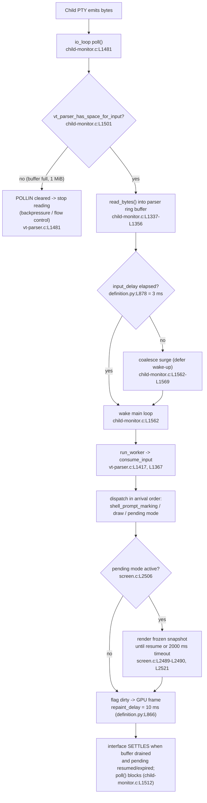

# How Kitty's Terminal-Interaction Pipeline Behaves End-to-End

> A source-grounded, run-first technical Q&A about how raw terminal input becomes
> screen state in **kitty**, with special attention to surges, the "pause/resume"
> synchronized-output mechanism, event ordering, alignment of shell-integration
> hints with ordinary text, backpressure, unstable remotes, and how the interface
> "settles again."
>
> **Repository HEAD:** `815df1e210e0a9ab4622f5c7f2d6891d7dbeddf1`
> **Scope:** read-only investigation + documentation. No existing repository file was
> modified; this document is the only artifact added.

---

## Introduction

### What the pipeline is

When a program running inside kitty (a shell, `vim`, `ssh`, a pager, …) writes bytes,
those bytes travel a well-defined path before a single pixel changes:

```
child PTY  ──►  I/O thread poll()  ──►  parser ring buffer  ──►  batched wake-up
           ──►  main-thread parse  ──►  screen operations    ──►  dirty flag  ──►  GPU frame
```

The performance-critical middle of that path — the **VT parser** and the **screen model** —
is compiled C, reachable from Python only through the `kitty/fast_data_types.so`
C-extension. The orchestration around it (the child monitor, its threads, shell
integration) is a mix of C and Python. Everything this document asserts about the
pipeline is anchored to an exact `file:line` in that code and, wherever behavior is
claimed, backed by output captured by **building and running** the code.

### Environment (as observed)

| Component | Value observed | Reference |
|-----------|----------------|-----------|
| Repo HEAD | `815df1e210e0a9ab4622f5c7f2d6891d7dbeddf1` | `git rev-parse HEAD` |
| Python (build/observe) | 3.13.7 (satisfies `requires-python = ">=3.8"`) | [pyproject.toml:L2] |
| Go (pinned) | `go 1.22` | [go.mod:L3] |
| Build artifact | `kitty/fast_data_types.so`, **1,253,792 bytes** | `stat -c%s` (below) |

### Run-first methodology (this is the FIRST thing that was done)

Nothing here was written from reading alone. The C extension was built first, then
each code path was exercised headlessly and its output captured **verbatim**, and only
then was the prose written around that evidence.

**1. Build the C extension.** The parser and screen model do not exist as observable
objects until `kitty/fast_data_types.so` is compiled:

```bash
CI=true python3 setup.py build --ignore-compiler-warnings
```

Observed: exit code `0`. On a clean tree this from-scratch build ran 122 compile steps
and 5 link steps with **no warnings or errors** (re-running the exact same command once
the artifacts already exist prints no compile lines, because the build is incremental —
`setup.py`'s `--full` flag [setup.py:L1905-L1909] would be required to force a rebuild of
unchanged files). The key lines (verbatim from the build log):

```
[1/122] Compiling kitty/screen.c ...
[7/122] Compiling kitty/child-monitor.c ...
[10/122] Compiling kitty/vt-parser.c ...
[11/122] Compiling kitty/vt-parser.c ...
...
[1/5] Linking kitty/fast_data_types ...
 done
```

`--ignore-compiler-warnings` drops `-pedantic-errors -Werror` — the logic is literally
`werror = '' if ignore_compiler_warnings else '-pedantic-errors -Werror'`
[setup.py:L491], the flag default is at [setup.py:L188], and the CLI flag is registered
at [setup.py:L2003-L2004]. In this environment the flag is required only to bypass a
Wayland windowing-backend warning under a newer gcc; the terminal parser/screen paths
compile cleanly (no warning lines appear for them above).

> **Why `kitty/vt-parser.c` appears TWICE (`[10/122]` and `[11/122]`).** `setup.py`
> deliberately compiles the parser a second time with `DUMP_COMMANDS` defined —
> `return 'kitty/vt-parser.c', [], ['DUMP_COMMANDS']` [setup.py:L722]. That second
> object is the dump-enabled parser worker `parse_worker_dump` [kitty/vt-parser.c:L1493].
> The trace-reporting macros `REPORT_COMMAND` and `REPORT_OSC2` are guarded by
> `#ifdef DUMP_COMMANDS` and only fire in that variant, which the test harness selects
> whenever a dump callback is supplied. **This double-compile is exactly why the
> dispatched-command trace used throughout this document is observable at all.**

**2. Verify the extension imports.** Observed verbatim:

```bash
python3 -c "import kitty.fast_data_types as f; print(f'IMPORT OK; has Screen: {hasattr(f, \"Screen\")}; has Parser: {hasattr(f, \"Parser\")}')"
```
```
IMPORT OK; has Screen: True; has Parser: True
```

Both the `Screen` (screen model) and `Parser` (VT parser) types are present, so the
real pipeline objects can now be driven headlessly.

### The headless observation surface (methodology — read-only)

All observation uses the test harness, which drives the **real** compiled parser and
screen without a GPU or windowing system:

- `parse_bytes(screen, data, dump_callback=None)` [kitty_tests/__init__.py:L30] loops
  `screen.test_create_write_buffer()` [kitty_tests/__init__.py:L33] →
  `screen.test_commit_write_buffer(data, dest)` [kitty_tests/__init__.py:L34] →
  `screen.test_parse_written_data(dump_callback)` [kitty_tests/__init__.py:L36]. That
  is the same create-buffer / commit-write / parse cycle the real I/O thread uses.
- `create_screen(...)` [kitty_tests/__init__.py:L237] builds a real `Screen` (after
  `set_options()` [kitty_tests/__init__.py:L223]).
- `CmdDump` [kitty_tests/parser.py:L29] is a `list` whose `__call__` appends each
  dispatched-command tuple (skipping `'bytes'`, stripping a leading `'error'`);
  `get_result()` [kitty_tests/parser.py:L38] coalesces consecutive `'draw'` commands;
  `cnv()` [kitty_tests/parser.py:L23] converts each `memoryview` argument to `str`.

The single mixed-input trace that anchors this whole document was produced by a
temporary script kept **outside** the repository (`/tmp/observe_pipeline.py`, removed
afterward). Its exact input and output appear in Q3.

---

## Q1 — Entry, surge, and "paused then resumed": where the byte stream first enters, and how it becomes something the application can react to

### Where the bytes first enter the system

The very first place raw PTY bytes enter kitty is the **I/O thread's `read_bytes()`**:

- `read_bytes(int fd, Screen *screen)` is defined at [kitty/child-monitor.c:L1337]. It
  does **not** read into a scratch buffer and copy later — it reads PTY bytes **straight
  into the parser's own ring buffer**. It obtains that destination via
  `vt_parser_create_write_buffer()` [kitty/vt-parser.c:L1451] and finalizes the bytes it
  actually read with `vt_parser_commit_write()` [kitty/vt-parser.c:L1465].
- `read_bytes()` is driven by the I/O thread's `poll()` loop, `io_loop()`
  [kitty/child-monitor.c:L1481]. The per-child read is invoked at
  [kitty/child-monitor.c:L1531]:
  `has_more = read_bytes(children_fds[EXTRA_FDS + i].fd, children[i].screen);`

So the answer to *"where does it first enter the system?"* is precise: **the I/O
thread's `read_bytes()` at [kitty/child-monitor.c:L1337], reading PTY bytes directly
into the VT parser's ring buffer.** From that instant the bytes are the parser's
responsibility, and the parser is the single point at which the stream is serialized
into commands the screen model — and therefore the application — can react to.

**Rationale.** Reading directly into the parser's buffer avoids an intermediate copy on
the hot path, and — more importantly — it makes the parser the *sole* point of
serialization. There is exactly one buffer and one consumer, which is the structural
reason ordering can never drift (see Q3).

### Surges: a burst does not become a wake-up storm

A surge of input is absorbed by the parser's ring buffer, whose capacity is
`#define BUF_SZ (1024u*1024u)` — **1 MiB** [kitty/vt-parser.c:L18]. A burst is read into
that buffer in as few `read()` calls as the kernel allows; it does **not** translate
into one main-thread wake-up per read. Wake-ups are **coalesced** behind `input_delay`
(the mechanism is detailed in Q2), so a flood of bytes is amortized into a small number
of main-loop wake-ups rather than a storm.

**Rationale.** The expensive step is waking the main thread, not buffering bytes; so
kitty buffers greedily (1 MiB) and wakes lazily. A surge is thus "flattened" into the
buffer and drained in batches.

### "Paused then resumed" = synchronized output (DEC private mode 2026)

The evocative phrase *"paused then resumed"* names a real, standardized feature:
**synchronized output**, a.k.a. **DEC private mode 2026**. Externally (this is industry
terminology, not kitty-specific) an application brackets an atomic screen update with:

- enable / "pause": `\x1b[?2026h`
- disable / "resume": `\x1b[?2026l`

The intent of the feature — as stated by its originators — is to avoid showing a
half-drawn screen (e.g. while paging through a document): no new content is rendered
until the update ends, at which point changes are applied atomically. While paused, the
terminal keeps *processing* incoming text and sequences; only *rendering* is frozen at
the last state.

> **External sources (terminology only — not kitty-specific).** The synchronized-output
> feature and its `\x1b[?2026h` / `\x1b[?2026l` (a.k.a. BSU / ESU) control sequences are
> defined by the community "Synchronized Output" specification — living document at
> <https://gist.github.com/christianparpart/d8a62cc1ab659194337d73e399004036> (mirrored at
> <https://github.com/contour-terminal/vt-extensions/blob/master/synchronized-output.md>) —
> which itself derives from the original iTerm2 proposal at
> <https://gitlab.com/gnachman/iterm2/-/wikis/synchronized-updates-spec>. That spec is the
> basis for the "enable keeps rendering the last state while still processing input; disable
> fetches the latest grid buffer" and "avoid a half-drawn screen" statements above. These
> references establish standard terminology only; every claim about kitty's *own* behavior
> in this document is grounded in kitty source citations.

Inside kitty this maps onto `screen_pause_rendering()` [kitty/screen.c:L2506], whose
snapshot/resume behavior is detailed in Q4. kitty also recognizes the **DCS** form of
the control — `\x1bP=1s\x1b\\` to start and `\x1bP=2s\x1b\\` to stop — routed in
`dispatch_dcs()` [kitty/vt-parser.c:L620]:

- `=1s` → `REPORT_COMMAND(screen_start_pending_mode)` [kitty/vt-parser.c:L639], then
  `screen_pause_rendering(self->screen, true, 0)`.
- `=2s` → `REPORT_COMMAND(screen_stop_pending_mode)` [kitty/vt-parser.c:L644], then
  `screen_pause_rendering(self->screen, false, 0)`.

That the "pause" control rides the very same byte stream as ordinary text is shown
empirically by the trace in Q3, whose third line is exactly:

```
('screen_start_pending_mode',)
```

produced by the `\x1bP=1s\x1b\\` bytes at the end of a mixed input.

**Rationale.** Because the pause/resume control is *just another sequence in the same
serialized stream*, "paused then resumed" cannot reorder relative to the text around it.
The pause takes effect precisely where the application put it, which is what makes an
atomic screen update atomic.

---

## Q2 — The "unseen conductor": how timing, ordering, and state hand-offs are divided, and what decides which event gets handled first

### The conductor is the `ChildMonitor` and its three threads

There is no single function that "runs" the terminal; the coordination is done by the
`ChildMonitor` and **three cooperating threads**, each with a distinct responsibility:

| Thread | Entry point | Responsibility |
|--------|-------------|----------------|
| I/O thread | `io_loop()` [kitty/child-monitor.c:L1481] | `poll()` the PTYs + control fds, read bytes into parser buffers, write pending output to children |
| Main thread | `main_loop()` [kitty/child-monitor.c:L1259] | parse buffered bytes, apply screen operations, drive rendering |
| Talk thread | `talk_loop()` [kitty/child-monitor.c:L1805] | serve the remote-control ("kitten @") socket, off the hot path |

This split is the "unseen conductor": the I/O thread never blocks on parsing or
rendering, and the main thread never blocks on `read()`/`write()` syscalls. The
existence of these three threads and their responsibilities is established by the source
citations in the table above (their entry points `io_loop()`/`main_loop()`/`talk_loop()`).
The `test_parser_threading` test captured below does **not** itself spawn these threads;
it validates the write-buffer handoff protocol that the I/O and main threads rely on —
the mechanism by which one side commits bytes and the other parses them.

### What decides which event gets handled first — a FIXED `poll()` descriptor ordering

The I/O thread multiplexes everything through one `poll()` over an array whose **first
two slots are reserved** for control descriptors: `#define EXTRA_FDS 2`
[kitty/child-monitor.c:L35]. Those two leading slots are assigned deterministically:

```c
children_fds[0].fd = self->io_loop_data.wakeup_read_fd; children_fds[1].fd = self->io_loop_data.signal_read_fd;
```
[kitty/child-monitor.c:L183]

Child PTYs occupy the slots *after* those two (`children_fds[EXTRA_FDS + i]`,
e.g. [kitty/child-monitor.c:L1501, L1531]). After `poll()` returns — the blocking form
is at [kitty/child-monitor.c:L1512] and the delayed/batched form at
[kitty/child-monitor.c:L1509] — the ready descriptors are serviced in a **fixed order**:

1. **Wake-up eventfd, drained FIRST:**
   `if (children_fds[0].revents && POLLIN) drain_fd(children_fds[0].fd); // wakeup`
   [kitty/child-monitor.c:L1515]
2. **Signalfd, read SECOND:** `read_signals(children_fds[1].fd, handle_signal, &ss);`
   [kitty/child-monitor.c:L1519] (handles child death, kill, config-reload signals).
3. **Child PTYs, serviced LAST:** the `read_bytes()` loop at
   [kitty/child-monitor.c:L1529-L1531].

So the direct answer to *"what decides which event gets handled first?"* is: **a fixed
descriptor ordering — wake-up eventfd (slot 0) first, signalfd (slot 1) second, child
PTY data last.** Control and lifecycle events always take priority over data.

**Rationale.** A fixed ordering makes scheduling **deterministic**: a request to wake or
reconfigure, or the news that a child died, is always observed before more of that
child's data is ingested. This prevents, for example, reading a dead child's stale bytes
ahead of reaping it, and guarantees a wake-up request is consumed before the loop
decides whether to block again.

### The cross-thread wake-up and signal primitives

The two priority descriptors are backed by Linux primitives created in `loop-utils.c`:

- The wake-up channel is an **eventfd**: `ld->wakeup_read_fd = eventfd(0, EFD_CLOEXEC | EFD_NONBLOCK);`
  [kitty/loop-utils.c:L70]. Another thread nudges the loop via `wakeup_loop()`
  [kitty/loop-utils.c:L113]; the loop empties it with `drain_fd()`
  [kitty/loop-utils.h:L76].
- Signals are delivered synchronously through a **signalfd**:
  `ld->signal_read_fd = signalfd(-1, &ld->signals, SFD_NONBLOCK | SFD_CLOEXEC);`
  [kitty/loop-utils.c:L42], read via `read_signals()` [kitty/loop-utils.c:L131].

**Rationale.** Turning asynchronous signals into a *pollable fd* (signalfd) and using an
eventfd for cross-thread nudges means the "conductor" only ever waits in **one** place —
`poll()` — and never races a signal handler against the main loop. Everything the
conductor must react to is a file descriptor with a fixed priority.

### Surge coalescing / batching: the `input_delay` metronome

The main loop is **not** woken on every read. The I/O loop only wakes it after
`input_delay` has elapsed since the last wake-up. The mechanism (verbatim):

```c
#define WAKEUP { wakeup_main_loop(); last_main_loop_wakeup_at = now; has_pending_wakeups = false; }
        // we only wakeup the main loop after input_delay as wakeup is an expensive operation
        // on some platforms, such as cocoa
        if (data_received) {
            if ((now = monotonic()) - last_main_loop_wakeup_at > OPT(input_delay)) WAKEUP
            else has_pending_wakeups = true;
        } else {
            if (has_pending_wakeups && (now = monotonic()) - last_main_loop_wakeup_at > OPT(input_delay)) WAKEUP
        }
```
[kitty/child-monitor.c:L1562-L1569]

The comment states the reason literally: **"we only wakeup the main loop after
input_delay as wakeup is an expensive operation"** [kitty/child-monitor.c:L1563-L1564].
When a wake-up is deferred, the *next* `poll()` is bounded so the pending wake-up cannot
be delayed beyond `input_delay`:
`monotonic_t time_delta = OPT(input_delay) - (now - last_main_loop_wakeup_at);`
[kitty/child-monitor.c:L1508], feeding the delayed `poll()` at
[kitty/child-monitor.c:L1509].

The measured default is `input_delay = 3` ms — `opt('input_delay', '3', ...)`
[kitty/options/definition.py:L878]. Its own documentation notes it is **"ignored when
the input buffer is almost full"** [kitty/options/definition.py:L885] (i.e. under
surge/backpressure kitty stops waiting and drains — see Q3).

### Observed evidence: the parser's split-input handoff and dispatch paths

Command:

```bash
LANG=C.UTF-8 LC_ALL=C.UTF-8 python3 test.py parser_threading simple_parsing prompt_marking
```

Verbatim output:

```
Running under CI: False
test_parser_threading (kitty_tests.parser.TestParser.test_parser_threading) ... ok
test_simple_parsing (kitty_tests.parser.TestParser.test_simple_parsing) ... ok
test_prompt_marking (kitty_tests.screen.TestScreen.test_prompt_marking) ... ok

----------------------------------------------------------------------
Ran 3 tests in 0.046s

OK
```

`test_parser_threading ... ok` confirms the parser correctly reassembles control
sequences that are **split across successive write-buffer commits** — the create-buffer →
commit → parse handoff (`test_create_write_buffer` / `test_commit_write_buffer` /
`test_parse_written_data`) that the I/O and main threads use to pass data across the
thread boundary — rather than proving the three ChildMonitor threads run concurrently
(the test is synchronous and does not spawn them; see [kitty_tests/parser.py:L93]);
`test_simple_parsing ... ok` confirms basic parse→screen dispatch; and
`test_prompt_marking ... ok` confirms the OSC 133 hint path used in Q3. (The elapsed
time `0.046s` is the value observed on this run and will vary between runs.)

**Rationale.** The conductor divides work so that the three responsibilities — moving
bytes (I/O thread), interpreting them (main thread), and answering remote control (talk
thread) — never block one another, while the fixed `poll()` order and the `input_delay`
metronome make *when* each event is handled predictable rather than racy.


---

## Q3 — Alignment under mixed hints, backpressure, and an unstable remote

### Alignment: hints and text share ONE serialized parser, so ordering cannot drift

Shell-integration "hints" are **OSC 133** sequences (prompt/command/output markers).
They are not carried on a side channel — they arrive **interleaved with ordinary text in
the same byte stream** and traverse the **same parser**. In the parser, OSC 133 is
routed to the screen via `REPORT_OSC2(shell_prompt_marking, code, mv)`
[kitty/vt-parser.c:L539] and the call `shell_prompt_marking(self->screen, (char*)buf + i)`
[kitty/vt-parser.c:L544]. On the screen side, `shell_prompt_marking()`
[kitty/screen.c:L2328] parses the mark via `parse_prompt_mark()` [kitty/screen.c:L2316]
and fires the `cmd_output_marking` callbacks:

- prompt start → `CALLBACK("cmd_output_marking", "O", Py_False)` [kitty/screen.c:L2338]
- command start → `CALLBACK("cmd_output_marking", "OO", Py_True, c)` [kitty/screen.c:L2347]
- command end → `CALLBACK("cmd_output_marking", "Os", Py_None, exit_status)` [kitty/screen.c:L2352]

Because there is exactly **one stream** and **one serialized parser**, ordering is
**intrinsically preserved**: a hint and the text around it are dispatched in arrival
order by construction. This is the empirical core of the whole answer, and it is proven
directly.

#### The observed proof (verbatim)

A temporary script (`/tmp/observe_pipeline.py`, kept outside the repo and deleted
afterward) drove the **real** compiled parser and screen with a single mixed stream: an
OSC 133;A prompt hint, then ordinary text `"$ "`, then a DCS `=1s` pending-mode start.

The code:

```python
import sys
sys.path.insert(0, '.')  # repo root, so 'kitty' and 'kitty_tests' import
from kitty_tests import BaseTest, parse_bytes
from kitty_tests.parser import CmdDump

class _Obs(BaseTest):
    def runTest(self):
        pass

t = _Obs()
screen = t.create_screen(cols=20, lines=5)
cd = CmdDump()
# Mixed stream: OSC 133;A prompt hint  +  ordinary text "$ "  +  DCS =1s pending-mode start
mixed = b'\x1b]133;A\x1b\\$ \x1bP=1s\x1b\\'
print("MIXED_INPUT_REPR:", repr(mixed))
parse_bytes(screen, mixed, cd)
print("--- dispatched-command trace ---")
for cmd in cd.get_result():
    print(cmd)
```

Command and verbatim output:

```
$ python /tmp/observe_pipeline.py         # run from the repo root
MIXED_INPUT_REPR: b'\x1b]133;A\x1b\\$ \x1bP=1s\x1b\\'
--- dispatched-command trace ---
('shell_prompt_marking', 133, 'A')
('draw', '$ ')
('screen_start_pending_mode',)
```

The three commands come out in **exactly the order the bytes arrived**:

1. `('shell_prompt_marking', 133, 'A')` — the OSC 133;A shell-integration hint
   (`133` is the OSC code, `'A'` = prompt start).
2. `('draw', '$ ')` — the ordinary text.
3. `('screen_start_pending_mode',)` — the pause/resume control.

This single trace **empirically proves the thesis**: shell-integration hints, ordinary
text, and the pause/resume control are dispatched by **the same serialized parser, in
arrival order**. That is *why* screen state, command context, and input meaning stay
aligned and cannot "drift out of sync" — there is no second channel that could race the
first.

#### Where the hints come from

kitty injects the shell-integration scripts by editing each shell's startup
environment: `setup_bash_env()` [kitty/shell_integration.py:L70],
`setup_zsh_env()` [kitty/shell_integration.py:L49],
`setup_fish_env()` [kitty/shell_integration.py:L16], all driven by
`modify_shell_environ()` [kitty/shell_integration.py:L218], which sets
`env['KITTY_SHELL_INTEGRATION'] = ksi` [kitty/shell_integration.py:L223]. The scripts
that actually emit the OSC 133 markers live under
`shell-integration/{bash,zsh,fish,ssh}`. For example `shell-integration/bash/kitty.bash`
emits the command-start marker `\e]133;C` — `builtin printf "\e]133;C;cmdline=%q\a"`
[shell-integration/bash/kitty.bash:L208] — and, in the prompt strings, the command-end
and prompt-start markers `\e]133;D` and `\e]133;A`
[shell-integration/bash/kitty.bash:L239-L240] (`ps1]+="...\e]133;D;$?\a\e]133;A\a..."` at
L239 and the secondary-prompt `\e]133;A` at L240). These are exactly the markers that
become the `shell_prompt_marking` dispatches above.

### Backpressure / flow control: reads pause when the parser buffer is full

kitty requests `POLLIN` for a child **only while the parser still has room**. In the I/O
loop, per child, per iteration:

```c
children_fds[EXTRA_FDS + i].events = vt_parser_has_space_for_input(screen->vt_parser) ? POLLIN : 0;
```
[kitty/child-monitor.c:L1501]

`vt_parser_has_space_for_input()` [kitty/vt-parser.c:L1477] returns:

```c
ans = self->read.sz + self->write.pending < BUF_SZ;
```
[kitty/vt-parser.c:L1481]

with `BUF_SZ = 1 MiB` [kitty/vt-parser.c:L18]. So when the parser's unconsumed input plus
pending bytes reach 1 MiB, `POLLIN` is cleared for that child and **kitty stops reading
its PTY**. The kernel PTY buffer then fills and the child's next `write()` **blocks** —
natural, correct backpressure that slows the producer instead of dropping or reordering
data. (Symmetrically, `POLLOUT` is only requested when there is output to write:
`children_fds[EXTRA_FDS + i].events |= (screen->write_buf_used ? POLLOUT : 0);`
[kitty/child-monitor.c:L1503].)

Under this backpressure the input-batching delay is intentionally bypassed: the parser's
worker gate flushes when the buffer is nearly full —
`if (flush || pd->time_since_new_input >= OPT(input_delay) || self->read.sz + 16 * 1024 > BUF_SZ)`
[kitty/vt-parser.c:L1425] — and `input_delay`'s own docs say it is "ignored when the
input buffer is almost full" [kitty/options/definition.py:L885].

### Unstable remote / an interrupted "resume": the timeout safety net

The danger case: an application sends "pause" (enter synchronized output) and then the
connection drops — an unstable/interrupted remote — so the matching "resume" **never
arrives**. Without a safeguard the screen would freeze forever. kitty bounds this with a
timeout. On every render-preparation pass the child monitor calls
`screen_check_pause_rendering(WD.screen, now)` once per visible window
[kitty/child-monitor.c:L729]. That function (defined at [kitty/screen.c:L2489-L2490]):

```c
screen_check_pause_rendering(Screen *self, monotonic_t now) {
    if (self->paused_rendering.expires_at && now > self->paused_rendering.expires_at) screen_pause_rendering(self, false, 0);
```
[kitty/screen.c:L2489-L2490]

i.e. once the pause deadline passes, it force-resumes. That deadline uses the default
timeout when the application supplies none: `if (for_in_ms <= 0) for_in_ms = 2000;` —
**2000 ms** [kitty/screen.c:L2521]. For context, this is the same class of safety net
other terminals use — tmux, for instance, "defers flushing pane output until the
application disables it ... or a 1 second timeout expires" (external, terminology only:
tmux PR #4744, <https://github.com/tmux/tmux/pull/4744>); kitty's default of `2000` ms is
grounded in the kitty source citation above.

Malformed transitions are rejected rather than allowed to corrupt state: a "start"
issued **while already pending**, or a "stop" **while not pending**, is refused —
`screen_pause_rendering()` returns `false` and the parser reports it as an application
error at [kitty/vt-parser.c:L639-L648] (start-already-pending error string just after
L639; stop-while-not-pending error string just after L644).

### So — does it behave differently under backpressure or an unstable remote?

Answered explicitly:

- **Ordering / alignment: UNCHANGED.** It is still one serialized parser, so hints and
  text stay in arrival order no matter how heavy the load [kitty/vt-parser.c:L539, L544;
  kitty/screen.c:L2328] — the trace above is the proof.
- **Pacing: CHANGES under backpressure.** When the 1 MiB buffer fills, `POLLIN` is
  cleared and reads pause, blocking the child [kitty/child-monitor.c:L1501;
  kitty/vt-parser.c:L1481]; input batching is bypassed to drain faster
  [kitty/vt-parser.c:L1425].
- **Recovery: CHANGES with an unstable remote.** A lost "resume" is recovered by the
  `2000` ms auto-resume [kitty/screen.c:L2489-L2490, L2521] instead of freezing.

**Rationale.** Single-stream serialization is what *guarantees* alignment (there is no
race). Buffer-space backpressure means kitty degrades gracefully by **slowing the
producer**, never by dropping or reordering. And the `2000` ms timeout is the safety net
that keeps an unstable remote from freezing the screen indefinitely.


---

## Q4 — The full lifecycle: from "mixed input arrives" to "the interface settles again," and how the moving parts "keep rhythm"

### Arrival-to-settle, one continuous flow

1. **A child PTY emits bytes.** The I/O thread notices them in `io_loop()`'s `poll()`
   [kitty/child-monitor.c:L1481].
2. **Flow-control gate.** Before reading, `POLLIN` is requested for that child only if
   the parser has room: `vt_parser_has_space_for_input(...)` [kitty/child-monitor.c:L1501;
   kitty/vt-parser.c:L1481]. If the 1 MiB buffer is full, `POLLIN` is cleared →
   backpressure; otherwise the read proceeds.
3. **Read into the parser ring buffer.** `read_bytes()` [kitty/child-monitor.c:L1337]
   reads PTY bytes straight into the buffer obtained from
   `vt_parser_create_write_buffer()` [kitty/vt-parser.c:L1451] and committed with
   `vt_parser_commit_write()` [kitty/vt-parser.c:L1465]; invoked at
   [kitty/child-monitor.c:L1531].
4. **Batched wake-up.** The main loop is woken only after `input_delay = 3` ms
   [kitty/options/definition.py:L878] has elapsed since the last wake-up — the batching
   logic at [kitty/child-monitor.c:L1562-L1569] ("wakeup is an expensive operation"
   [kitty/child-monitor.c:L1563]).
5. **Main-thread parse.** `run_worker()` [kitty/vt-parser.c:L1417] drives
   `consume_input()` [kitty/vt-parser.c:L1367], turning buffered bytes into commands.
   The worker also flushes early under pressure via its gate at
   [kitty/vt-parser.c:L1425].
6. **Dispatch to screen operations.** Each command becomes a screen op — `draw`,
   `shell_prompt_marking` [kitty/screen.c:L2328], or a pending-mode transition — in the
   arrival order proven by the Q3 trace.
7. **Pending mode vs. normal render.** If synchronized output is active,
   `screen_pause_rendering()` [kitty/screen.c:L2506] has taken a **frozen snapshot** —
   line buffer, cursor, color profile, selections, URL ranges, and graphics state — and
   set an `expires_at` deadline (snapshot fields at [kitty/screen.c:L2522-L2542]); the
   screen renders that snapshot until the app resumes or the `2000` ms timeout
   [kitty/screen.c:L2521] triggers `screen_check_pause_rendering()`
   [kitty/screen.c:L2489-L2490]. Otherwise the screen is flagged dirty and a GPU frame is
   produced, paced by `repaint_delay = 10` ms [kitty/options/definition.py:L866] with
   `sync_to_monitor = yes` [kitty/options/definition.py:L889].
8. **The interface settles.** Once the buffer drains and any pending-mode snapshot has
   resumed (on the app's "resume") or expired (on the `2000` ms timeout), no work
   remains: the I/O thread's next `poll()` blocks indefinitely [kitty/child-monitor.c:L1512]
   with nothing pending. That quiescent, blocked `poll()` **is** "settled."

### The rhythm (the two delays are the metronome)

The system "keeps rhythm" via two configured cadences plus the structural guarantees:

- `input_delay = 3` ms [kitty/options/definition.py:L878] batches *input* so the main
  loop is not woken per byte (and is bypassed when the buffer is nearly full, so a surge
  drains promptly).
- `repaint_delay = 10` ms [kitty/options/definition.py:L866] paces *rendering*
  (~100 FPS), with `sync_to_monitor = yes` [kitty/options/definition.py:L889] aligning
  frames to the display; `repaint_delay` is itself ignored when there is pending input to
  minimize latency [kitty/options/definition.py:L873-L874].
- Single-stream serialization (Q3) keeps *meaning* aligned, and 1 MiB buffer-space
  backpressure [kitty/vt-parser.c:L18, L1481] keeps producer, parser, and renderer from
  running away from one another.

Together these keep production (child), parsing (main thread), and rendering (GPU) in a
stable cadence — fast when there is work, blocked and idle when there is not.

### Lifecycle flowchart



**Rationale.** The lifecycle is a loop with two throttles and one serialization point.
The throttles (`input_delay`, `repaint_delay`) keep the loop from spinning per-byte or
per-pixel; the serialization point (one parser) keeps every event in order; and the
buffer-space gate keeps a fast producer from overwhelming the pipe. "Settling" is simply
the loop reaching a state with no bytes to read and no pending snapshot, at which point
`poll()` blocks and the CPU goes idle.

---

## Coverage Pass

Every sub-question is answered in its own section, each grounded in exact `file:line`
citations and backed by verbatim observed output.

- [x] **Q1 — Entry, surge, pause/resume.** Bytes first enter at the I/O thread's
  `read_bytes()` [kitty/child-monitor.c:L1337], reading straight into the parser ring
  buffer via `vt_parser_create_write_buffer()`/`vt_parser_commit_write()`
  [kitty/vt-parser.c:L1451, L1465]; surges are absorbed by the 1 MiB `BUF_SZ`
  [kitty/vt-parser.c:L18] and coalesced wake-ups; "paused then resumed" = synchronized
  output / DEC 2026, `screen_pause_rendering()` [kitty/screen.c:L2506], DCS `=1s`/`=2s`
  [kitty/vt-parser.c:L639, L644]. *Evidence:* build+import (`IMPORT OK; has Screen: True; has Parser: True`)
  and the trace line `('screen_start_pending_mode',)`.
- [x] **Q2 — The unseen conductor.** `ChildMonitor` + three threads (`io_loop()`
  [kitty/child-monitor.c:L1481], `main_loop()` [kitty/child-monitor.c:L1259],
  `talk_loop()` [kitty/child-monitor.c:L1805]); which event first = fixed `poll()` order
  `EXTRA_FDS = 2` [kitty/child-monitor.c:L35], fd assignment
  [kitty/child-monitor.c:L183], drain wake-up first [kitty/child-monitor.c:L1515],
  signals second [kitty/child-monitor.c:L1519], PTYs last [kitty/child-monitor.c:L1531];
  batching `input_delay = 3` ms [kitty/options/definition.py:L878;
  kitty/child-monitor.c:L1562-L1569]. *Evidence:* `test_parser_threading ... ok`
  (validates the cross-commit parser handoff the I/O and main threads rely on — not
  thread concurrency).
- [x] **Q3 — Alignment / backpressure / unstable remote.** One serialized parser routes
  hints and text (`shell_prompt_marking` [kitty/vt-parser.c:L539, L544;
  kitty/screen.c:L2328]) so ordering cannot drift; backpressure via the `POLLIN` gate on
  `vt_parser_has_space_for_input()` [kitty/child-monitor.c:L1501; kitty/vt-parser.c:L1481]
  with `BUF_SZ = 1 MiB` [kitty/vt-parser.c:L18]; unstable-remote recovery via the
  `2000` ms pending timeout auto-resume [kitty/screen.c:L2489-L2490, L2521]. *Evidence:*
  the verbatim 3-line dispatched-command trace (hint → draw → pending, in arrival order).
- [x] **Q4 — Full lifecycle & rhythm.** PTY → `poll()` → space gate → `read_bytes()` →
  `input_delay` wake → `run_worker()`/`consume_input()` [kitty/vt-parser.c:L1417, L1367]
  → dispatch → pending snapshot [kitty/screen.c:L2506, L2522-L2542] or dirty → GPU frame
  (`repaint_delay = 10` ms [kitty/options/definition.py:L866], `sync_to_monitor = yes`
  [kitty/options/definition.py:L889]) → settle at a blocked `poll()`
  [kitty/child-monitor.c:L1512]. *Evidence:* the full build (122 compile + 5 link steps,
  exit 0) and the passing focused tests (`Ran 3 tests in 0.046s`, `OK`).

**Values quoted exactly (never paraphrased):** `input_delay = 3`
[kitty/options/definition.py:L878]; `repaint_delay = 10` [kitty/options/definition.py:L866];
`sync_to_monitor = yes` [kitty/options/definition.py:L889]; `BUF_SZ = 1 MiB`
(`#define BUF_SZ (1024u*1024u)`) [kitty/vt-parser.c:L18]; pending-mode default timeout
`2000` ms (`if (for_in_ms <= 0) for_in_ms = 2000;`) [kitty/screen.c:L2521]; artifact size
`1,253,792` bytes (observed via `stat -c%s`); focused-test elapsed `0.046s` (this run).

**Limitations / not independently verified by running code.** The GPU frame and monitor
sync (`repaint_delay`, `sync_to_monitor`) and the wall-clock effect of the `2000` ms
timeout were **not** exercised at runtime — all observation here is headless (no GPU or
windowing system), which is sufficient for the parser/screen pipeline under study but
means the rendering trigger and the timeout's real-time expiry are asserted from the
source (cited above), not measured. The external DEC-2026 control sequences
`\x1b[?2026h` / `\x1b[?2026l` are cited only as industry terminology; kitty's own
observed control in the trace is the DCS `=1s` form (`('screen_start_pending_mode',)`).

