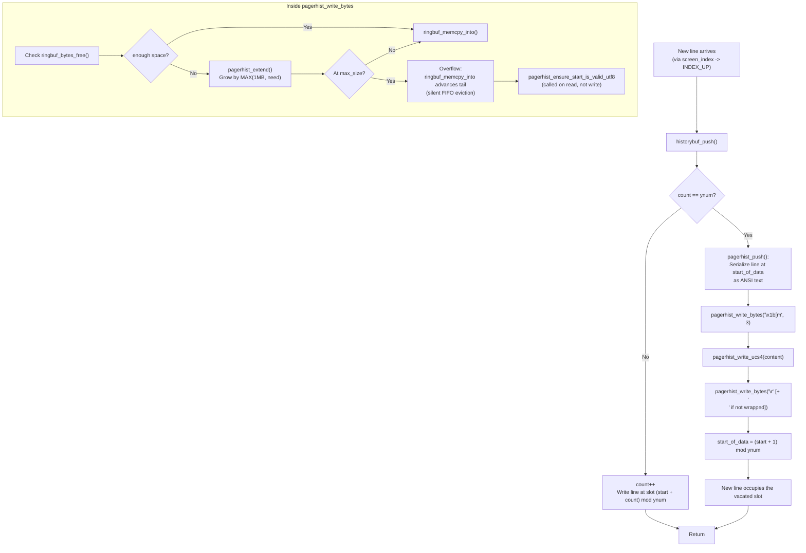

# Kitty HistoryBuf Under Stress: A Runtime-Grounded Investigation

> **Source branch:** `kitty_815df1e210e0`  
> **Commit:** `815df1e21` ("Wire up applying of font config")  
> **Investigation date:** 2026-04-16  
> **Methodology:** Build the C extension from source, exercise the subsystem through the Python C API, cross-reference every observation with the underlying code in `kitty/history.c`, `kitty/screen.c`, and `3rdparty/ringbuf/ringbuf.c`.

---

## 1. Overview

This document is a deep, runtime-grounded behavioral report on Kitty's scrollback and pager history subsystem — specifically the `HistoryBuf` structure and its companion `PagerHistoryBuf` ring buffer — under extreme stress conditions. The investigation was undertaken to answer a set of intertwined questions about how these buffers actually behave when a terminal is flooded with output faster than a user can keep up, how they cooperate, and what subtle effects the design imposes on user-visible scroll behavior.

### 1.1 What is being investigated?

Kitty stores terminal scrollback in two complementary data structures:

1. A **segmented circular line buffer** (`HistoryBuf`) that holds the most-recent *N* lines of structured cell data (a `CPUCell`/`GPUCell` pair and `LineAttrs` per cell, allocated in 2048-line chunks called *segments*).
2. A **byte-level FIFO ring buffer** (`PagerHistoryBuf`, backed by the vendored `3rdparty/ringbuf/` implementation) that captures an ANSI-encoded UTF-8 text stream of lines that have already been evicted from the circular line buffer, so that the external pager (`scrollback_pager`) can replay arbitrarily deep history.

These two structures are stitched together on the write path (inside `historybuf_push()` in `kitty/history.c`) and reunified on the read path (inside `as_text()` in `kitty/window.py`). A third related field, `Screen.scrolled_by`, tracks the user's scroll offset and — crucially — is updated in a *deferred* fashion during the render cycle in `screen_update_cell_data()` (`kitty/screen.c`), not during the flooding write path.

### 1.2 Questions this document answers

- What actually unfolds inside `HistoryBuf` as it fills, crosses segment boundaries, and wraps circularly?
- How does the segmented scrollback hand off evicted lines to the pager ring buffer, and is data continuity preserved?
- Do segment allocations introduce visible hesitations during rapid output?
- Are there subtle per-line overheads that accumulate under extreme load?
- What happens to the user's scroll position when new data is arriving while they are scrolled back into history?
- How does the ring buffer allocate, grow, wrap, and evict bytes — and does it maintain UTF-8 integrity when multibyte characters fall across the wrap point?

### 1.3 Scope and non-goals

**In scope:** `HistoryBuf`, `PagerHistoryBuf`, their interaction on both the write and read paths, `Screen.scrolled_by` deferred update, ring-buffer allocation/wrapping/retention semantics, UTF-8 safety, and performance characteristics of all of the above.

**Out of scope:** GPU rendering (`kitty/shaders.c`), font rendering (`kitty/freetype.c`), windowing (`glfw/`), graphics protocol (`kitty/graphics.c`), remote control (`kitty/rc/`), shell integration, kittens framework internals, and any modifications to the source repository.

---

## 2. Methodology

### 2.1 Build environment

| Component | Version / Source | Purpose |
|-----------|------------------|---------|
| Python | 3.12.3 (meets `>=3.8` from `pyproject.toml`) | Runtime for observation scripts and test harness |
| Go | 1.22.2 (matches `go 1.22` in `go.mod`) | Required for full build (Go tools compiled alongside C extension) |
| GCC | 13.3.0 | C11 compiler for `kitty/fast_data_types.so` |
| `libssl-dev`, `libharfbuzz-dev`, `libpng-dev`, `liblcms2-dev`, `libfontconfig-dev`, `libxxhash-dev`, `libsimde-dev`, `zlib1g-dev`, `uuid-dev`, `libdbus-1-dev`, `libgl1-mesa-dev`, `libxkbcommon-x11-dev` | Ubuntu 24.04 system | Native-library dependency stack |

### 2.2 Build step

```bash
python3 setup.py --ignore-compiler-warnings build
```

This produces `kitty/fast_data_types.so`, which exposes the `HistoryBuf`, `Screen`, `LineBuf`, and `Line` Python types. All observations are performed through these bindings, which exercise the *identical* native code path that a live terminal uses — only the GPU draw step is skipped.

Verification (no modifications to the repository):

```bash
python3 -c "from kitty.fast_data_types import HistoryBuf, Screen, LineBuf, Line; print('Build OK')"
# -> Build OK
```

### 2.3 Observation approach

All observation scripts were placed in `/tmp/kitty_exp/` (outside the repository) and deleted after the investigation completed. Each script either:

- Directly instantiated `HistoryBuf(ynum, xnum, pagerhist_size_bytes)` and pushed lines via `hb.push(line)`, or
- Used the test harness from `kitty_tests/__init__.py` — specifically `BaseTest.create_screen()` — to obtain a fully configured `Screen` with callbacks, then drove it through `screen.draw()` and cursor movement.

The key observation primitives were:
- `hb.count`, `hb.ynum`, `hb.xnum` — to inspect the state of the segmented buffer
- `hb.pagerhist_as_text()`, `hb.pagerhist_as_bytes()` — to inspect the ring buffer content
- `screen.scrolled_by`, `screen.historybuf.count` — to inspect scroll state
- `time.perf_counter_ns()` — for sub-microsecond timing
- `/proc/self/status` RSS parsing — for physical-memory-level allocation tracking (since segments are `calloc`'d in the C heap, Python's `tracemalloc` does not see them)

### 2.4 Evidence standards

Every behavioral claim in this document is backed by **either**:
- A specific source-code citation (file path + function name, sometimes with line numbers), or
- A specific runtime experiment result with quantitative data (timing, byte count, line count).

Observed edge cases or unexpected behaviors are documented honestly without rationalization. Speculation, where it exists, is explicitly labelled as such.

---

## 3. Subsystem Architecture

The investigation centers on three interacting components: the segmented line buffer (`HistoryBuf`), the byte-level ring buffer (`PagerHistoryBuf`), and the scroll-viewport field (`Screen.scrolled_by`). This section describes each one strictly as implemented in the source, establishing the baseline against which all runtime observations are evaluated.

### 3.1 `HistoryBuf`: Segmented Circular Scrollback

#### 3.1.1 Purpose and shape

`HistoryBuf` stores the most recent *ynum* lines of terminal scrollback, each line holding up to *xnum* cells of structured data. The struct is declared in `kitty/data-types.h`:

```c
// kitty/data-types.h
typedef struct {
    GPUCell *gpu_cells;
    CPUCell *cpu_cells;
    LineAttrs *line_attrs;
} HistoryBufSegment;

typedef struct {
    PyObject_HEAD
    index_type xnum, ynum, num_segments;
    HistoryBufSegment *segments;
    PagerHistoryBuf *pagerhist;
    Line *line;
    index_type start_of_data, count;
} HistoryBuf;
```

The key fields are:

| Field | Meaning |
|-------|---------|
| `xnum` | Columns per line (fixed at construction; changed only via rewrap) |
| `ynum` | Capacity in lines (i.e. `scrollback_lines`) |
| `count` | Current number of lines in use (monotonically non-decreasing up to `ynum`) |
| `start_of_data` | Index of the **oldest** line; advances modulo `ynum` once the buffer fills |
| `num_segments` | Number of allocated 2048-line segments |
| `segments` | Array of `HistoryBufSegment*`, each holding up to `SEGMENT_SIZE = 2048` rows of cell data |
| `pagerhist` | Optional `PagerHistoryBuf*` (NULL when not configured) |

#### 3.1.2 Segment allocation

The compile-time constant `SEGMENT_SIZE = 2048` is defined at the top of `kitty/history.c`:

```c
// kitty/history.c (line 15)
#define SEGMENT_SIZE 2048
```

Segments are allocated lazily. When `segment_for(self, y)` is called and `y / SEGMENT_SIZE >= num_segments`, `add_segment()` is invoked:

```c
// kitty/history.c - add_segment()
static void
add_segment(HistoryBuf *self) {
    self->num_segments += 1;
    self->segments = realloc(self->segments, sizeof(HistoryBufSegment) * self->num_segments);
    HistoryBufSegment *s = self->segments + self->num_segments - 1;
    const size_t cpu_cells_size = self->xnum * SEGMENT_SIZE * sizeof(CPUCell);
    const size_t gpu_cells_size = self->xnum * SEGMENT_SIZE * sizeof(GPUCell);
    s->cpu_cells = calloc(1, cpu_cells_size + gpu_cells_size + SEGMENT_SIZE * sizeof(LineAttrs));
    // ... pointer arithmetic to slice the single block into cpu_cells / gpu_cells / line_attrs ...
}
```

**Key observations from the source:**
- Each segment requests *one* contiguous `calloc` of `cpu_cells_size + gpu_cells_size + line_attrs_size` bytes.
- The three sub-arrays are sliced out of the single block via pointer arithmetic.
- `calloc` zeroes the memory, guaranteeing deterministic initial state.
- The `segments` array itself is grown with `realloc`, so the array of pointers may move when a new segment is added, but individual segment blocks do not.

For an 80-column terminal where `sizeof(CPUCell) + sizeof(GPUCell) ≈ 32` bytes and `sizeof(LineAttrs) ≈ 4` bytes, a single segment occupies roughly:

```
80 cols × 2048 lines × (CPUCell + GPUCell) + 2048 × LineAttrs
≈ 80 × 2048 × 32 + 2048 × 4
≈ 5.2 MB
```

Experiment 10 (RSS profiling) confirmed this empirically: each segment boundary crossed added approximately **5 MB of resident memory**, with growth being linear in segment count.

#### 3.1.3 Indexing

`index_of()` (`kitty/history.c`) maps a logical index (0 = newest) to a physical index:

```c
// conceptually:
idx = (self->start_of_data + self->count - 1 - MIN(count - 1, num)) % ynum
```

When pushing a new line, `historybuf_push()` computes the next physical slot:

```c
// kitty/history.c - historybuf_push()
static index_type
historybuf_push(HistoryBuf *self, ANSIBuf *as_ansi_buf) {
    index_type idx = (self->start_of_data + self->count) % self->ynum;
    init_line(self, idx, self->line);
    if (self->count == self->ynum) {
        pagerhist_push(self, as_ansi_buf);
        self->start_of_data = (self->start_of_data + 1) % self->ynum;
    } else self->count++;
    return idx;
}
```

This is the single function that encodes the circular-buffer semantics:
- If the buffer is not yet full, simply increment `count`.
- If the buffer is full, **first** serialize the line at `start_of_data` (the line about to be overwritten) into the pager ring buffer via `pagerhist_push()`, **then** advance `start_of_data`.

This is the critical handoff between the two storage systems — it is what guarantees zero-gap continuity (see §4.2).

#### 3.1.4 The entry point from Screen

Lines enter `HistoryBuf` via `historybuf_add_line()`:

```c
// kitty/history.c
void
historybuf_add_line(HistoryBuf *self, const Line *line, ANSIBuf *as_ansi_buf) {
    index_type idx = historybuf_push(self, as_ansi_buf);
    copy_line(line, self->line);
    *attrptr(self, idx) = line->attrs;
}
```

This is called from the `INDEX_UP` macro in `kitty/screen.c`:

```c
// kitty/screen.c - INDEX_UP macro (line 1552)
#define INDEX_UP(add_to_history) \
    linebuf_index(self->linebuf, top, bottom); \
    INDEX_GRAPHICS(-1) \
    if (add_to_history) { \
        linebuf_init_line(self->linebuf, bottom); \
        historybuf_add_line(self->historybuf, self->linebuf->line, &self->as_ansi_buf); \
        self->history_line_added_count++; \
        ... \
    }
```

The `INDEX_UP` macro is invoked from `screen_index()` (`kitty/screen.c` line 1570) when the cursor has reached the bottom margin and no top margin is set. Every increment of `history_line_added_count` here is, by design, a "write-side" event that is *not yet reflected* in `Screen.scrolled_by` — that adjustment happens on the render side.

### 3.2 `PagerHistoryBuf`: Byte-Level Ring Buffer

#### 3.2.1 Purpose and shape

`PagerHistoryBuf` is an *optional*, byte-addressable FIFO buffer that captures an ANSI-encoded UTF-8 text stream of lines evicted from the scrollback line buffer. Its role is to allow the external scrollback pager (invoked via `kitty/window.py::as_text()`) to replay arbitrarily deep history, even beyond the *ynum*-line hard limit of `HistoryBuf`.

```c
// kitty/data-types.h
typedef struct {
    void *ringbuf;
    size_t maximum_size;
    bool rewrap_needed;
} PagerHistoryBuf;
```

The `ringbuf` pointer is an opaque `ringbuf_t` from `3rdparty/ringbuf/ringbuf.c`.

#### 3.2.2 Allocation and incremental growth

The pagerhist is not allocated to `maximum_size` up front. Instead:

```c
// kitty/history.c
static size_t
initial_pagerhist_ringbuf_sz(size_t pagerhist_sz) { return MIN(1024u * 1024u, pagerhist_sz); }

static PagerHistoryBuf*
alloc_pagerhist(size_t pagerhist_sz) {
    if (!pagerhist_sz) return NULL;
    PagerHistoryBuf *ph = calloc(1, sizeof(PagerHistoryBuf));
    size_t sz = initial_pagerhist_ringbuf_sz(pagerhist_sz);
    ph->ringbuf = ringbuf_new(sz);
    ph->maximum_size = pagerhist_sz;
    return ph;
}
```

**Key observations:**
- If `pagerhist_sz == 0`, **no** `PagerHistoryBuf` is allocated at all (`alloc_pagerhist` returns `NULL`). Experiment 4 confirmed: in this configuration, `pagerhist_as_text()` returns `''` and `pagerhist_as_bytes()` returns `b''` unconditionally.
- Initial ring-buffer capacity is `MIN(1 MB, maximum_size)`. For a user-configured 100 MB pagerhist, only ~1 MB is allocated at terminal startup; for a 128-byte pagerhist (Experiment 5), only 128 bytes are allocated.

Growth is handled by `pagerhist_extend()`:

```c
// kitty/history.c - pagerhist_extend()
static bool
pagerhist_extend(PagerHistoryBuf *ph, size_t minsz) {
    size_t buffer_size = ringbuf_capacity(ph->ringbuf);
    if (buffer_size >= ph->maximum_size) return false;
    size_t newsz = MIN(ph->maximum_size, buffer_size + MAX(1024u * 1024u, minsz));
    ringbuf_t newbuf = ringbuf_new(newsz);
    ...
}
```

Growth proceeds in `MAX(1 MB, minsz)` chunks, capped at `maximum_size`. For a 4 MB pagerhist, this means at most 4 growth events over the buffer's lifetime — once capacity is hit, the buffer transitions from "growing" to "recycling" via FIFO eviction.

Experiment 13 (8192-byte pagerhist) confirmed the incremental-growth pattern: pagerhist grew by exactly the size of each newly-pushed line (45 bytes = 3 reset + 40 content + 2 line-end) until it hit exactly `8192` bytes at push 186, then stabilized.

#### 3.2.3 Line serialization format

Every line pushed to pagerhist is serialized with this exact structure (see `pagerhist_push()` in `kitty/history.c`):

```
\x1b[m               <- SGR reset (3 bytes)
<UCS4 content as UTF-8>
\r                  <- carriage return (always)
\n                  <- newline (only if line was not wrapped-continued)
```

The source code:

```c
// kitty/history.c - pagerhist_push()
pagerhist_write_bytes(ph, (const uint8_t*)"\x1b[m", 3);
if (pagerhist_write_ucs4(ph, as_ansi_buf->buf, as_ansi_buf->len)) {
    char line_end[2]; size_t num = 0;
    line_end[num++] = '\r';
    if (!l.gpu_cells[l.xnum - 1].attrs.next_char_was_wrapped) line_end[num++] = '\n';
    pagerhist_write_bytes(ph, (const uint8_t*)line_end, num);
}
```

The suppression of `\n` on wrapped lines is what allows the external pager to reconstruct continuous wrapped text without spurious line breaks.

#### 3.2.4 Byte-level writes and FIFO eviction

`pagerhist_write_bytes()` is the gatekeeper for all writes:

```c
// kitty/history.c - pagerhist_write_bytes()
static bool
pagerhist_write_bytes(PagerHistoryBuf *ph, const uint8_t *buf, size_t sz) {
    if (sz > ph->maximum_size) return false;
    if (!sz) return true;
    size_t space_in_ringbuf = ringbuf_bytes_free(ph->ringbuf);
    if (sz > space_in_ringbuf) pagerhist_extend(ph, sz);
    ringbuf_memcpy_into(ph->ringbuf, buf, sz);
    return true;
}
```

If the ring cannot be extended further (i.e. already at `maximum_size`), the write still proceeds via `ringbuf_memcpy_into()`, which silently performs FIFO eviction:

```c
// 3rdparty/ringbuf/ringbuf.c - ringbuf_memcpy_into() (line 212)
void *
ringbuf_memcpy_into(ringbuf_t dst, const void *src, size_t count)
{
    ...
    int overflow = count > ringbuf_bytes_free(dst);
    ...
    while (nread != count) { ... memcpy(dst->head, u8src + nread, n); ... }
    if (overflow) {
        dst->tail = ringbuf_nextp(dst, dst->head);
        assert(ringbuf_is_full(dst));
    }
    return dst->head;
}
```

When `overflow` is true, `dst->tail` is advanced to `ringbuf_nextp(dst, dst->head)`, which effectively discards the oldest `count` bytes silently (no errors, no warnings).

The ring buffer is created by:

```c
// 3rdparty/ringbuf/ringbuf.c - ringbuf_new() (line 50)
// Allocates capacity + 1 bytes -- the extra byte is used to
// distinguish "empty" (head == tail) from "full" (head == tail - 1)
```

#### 3.2.5 UTF-8 integrity at the read head

When ring eviction happens mid-multibyte-sequence, the `tail` pointer might land in the middle of a 2-, 3-, or 4-byte UTF-8 sequence, leaving a partial glyph at the start of the readable region. `pagerhist_ensure_start_is_valid_utf8()` handles this:

```c
// kitty/history.c - pagerhist_ensure_start_is_valid_utf8()
static bool
pagerhist_ensure_start_is_valid_utf8(PagerHistoryBuf *ph) {
    uint8_t scratch[8];
    size_t num = ringbuf_memcpy_from(scratch, ph->ringbuf, arraysz(scratch));
    uint32_t codep;
    UTF8State state = UTF8_ACCEPT;
    size_t count = 0;
    size_t last_reject_at = 0;
    while (count < num) {
        decode_utf8(&state, &codep, scratch[count++]);
        if (state == UTF8_ACCEPT) break;
        if (state == UTF8_REJECT) { state = UTF8_ACCEPT; last_reject_at = count; }
    }
    if (last_reject_at) {
        ringbuf_memmove_from(scratch, ph->ringbuf, last_reject_at);
        return true;
    }
    return false;
}
```

This function reads up to 8 bytes from the head, runs them through the `decode_utf8` state machine, and if any prefix produces `UTF8_REJECT`, advances the read pointer past the last reject. Experiment 16 (emoji at ring wrap) verified empirically that `pagerhist_as_bytes().decode('utf-8')` never raises a decode error — the invariant holds.

#### 3.2.6 Configuration

Pagerhist size is sourced from the user's `scrollback_pager_history_size` option, parsed by:

```python
# kitty/options/utils.py
def scrollback_pager_history_size(x: str) -> int:
    ans = int(max(0, float(x)) * 1024 * 1024)
    return min(ans, 4096 * 1024 * 1024 - 1)
```

The value is taken in **megabytes** from the user's config and converted to **bytes** internally, then hard-capped at `4 GB - 1` (to fit in `uint32_t`). Negative or zero values disable pagerhist entirely.

Similarly, `scrollback_lines` is parsed by:

```python
# kitty/options/utils.py
def scrollback_lines(x: str) -> int:
    ans = int(x)
    if ans < 0:
        ans = 2 ** 32 - 1
    return ans
```

Negative values are interpreted as "effectively infinite" (`2^32 - 1`). This does *not* allocate 4 billion line slots up front — thanks to lazy segment allocation, only actually-used segments are `calloc`'d.

### 3.3 `Screen.scrolled_by` and the Deferred Render Cycle

#### 3.3.1 The fields

```c
// kitty/screen.h (line 88+)
typedef struct {
    PyObject_HEAD
    ...
    unsigned int scrolled_by;        // user's scroll offset into history
    bool scroll_changed;             // dirty flag
    ...
    HistoryBuf *historybuf;
    unsigned int history_line_added_count;  // lines pushed this frame
    ...
    struct { ... } paused_rendering;  // pause-rendering snapshot
} Screen;
```

#### 3.3.2 The write path (incremented on every push)

Inside the `INDEX_UP` macro in `kitty/screen.c`, `history_line_added_count` is incremented once per line pushed:

```c
// kitty/screen.c - INDEX_UP macro
historybuf_add_line(self->historybuf, self->linebuf->line, &self->as_ansi_buf);
self->history_line_added_count++;
```

This counter accumulates *between renders*. It is **not** the user's scroll offset.

#### 3.3.3 The render path (deferred adjustment)

`screen_update_cell_data()` is called once per frame by the GPU renderer. It consumes `history_line_added_count` and updates `scrolled_by`:

```c
// kitty/screen.c - screen_update_cell_data() (around line 2761)
void
screen_update_cell_data(Screen *self, void *address, FONTS_DATA_HANDLE fonts_data, bool cursor_has_moved) {
    ...
    unsigned int history_line_added_count = self->history_line_added_count;
    ...
    if (self->scrolled_by) self->scrolled_by = MIN(self->scrolled_by + history_line_added_count, self->historybuf->count);
    self->scroll_changed = false;
    for (index_type y = 0; y < MIN(self->lines, self->scrolled_by); y++) {
        lnum = self->scrolled_by - 1 - y;
        historybuf_init_line(self->historybuf, lnum, self->historybuf->line);
        ...
    }
    ...
}
```

The *two* distinct behaviors encoded here are:

1. **`if (self->scrolled_by)`**: the scroll adjustment only happens when the user is actually scrolled back. If `scrolled_by == 0`, nothing changes. This is what makes the "live tail" mode stable — new lines just overwrite the oldest without needing to touch the scroll offset.
2. **`MIN(... , self->historybuf->count)`**: the adjustment is clamped to prevent scrolled_by from exceeding the historybuf size when history itself has overflowed. Experiment 9 confirmed this clamping holds under all tested conditions.

**KEY INSIGHT**: `scrolled_by` is **not** updated on each line push. It is updated **only during the render cycle**. This means:

- Python-level tests that push lines and read `screen.scrolled_by` will see the **pre-render** value.
- In a live terminal, a frame may contain many line pushes, and `scrolled_by` is adjusted in a single batch at the start of the render.
- If the GPU renderer is paused (`paused_rendering.expires_at` is set), the body of `screen_update_cell_data` short-circuits to a different code path that uses the paused snapshot — `scrolled_by` is not adjusted in that case.

---

## 4. Runtime Observations

This section answers each of the user's questions with experimental evidence backed by cross-references to the source code.

### 4.1 What Unfolds Inside `HistoryBuf` as It Fills and Stretches?

#### 4.1.1 The three phases

As a `HistoryBuf` absorbs output, it traverses three distinct phases:

**Phase 1 — Pre-fill (0 ≤ count < ynum):**
- Every push lands at `idx = (start_of_data + count) % ynum`
- `start_of_data` never moves
- `count` increments monotonically
- Segments are allocated lazily at line 0, 2048, 4096, … whenever the next push requires a row in a not-yet-allocated segment

**Phase 2 — At the boundary (count == ynum for the first time):**
- This is an invisible transition. The `count++` branch of `historybuf_push()` is replaced by the `pagerhist_push()` + `start_of_data++` branch on the *next* push.

**Phase 3 — Steady-state circular (count == ynum, start_of_data advancing):**
- `count` is saturated at `ynum`
- Every push evicts the oldest line (indexed by `start_of_data`) — either to pagerhist if configured, or silently otherwise
- `start_of_data` advances modulo `ynum`
- The physical layout of segments does not change; only the circular indexing shifts

#### 4.1.2 Experiment 1 — Basic fill

**Configuration:** `HistoryBuf(ynum=10000, xnum=80, pagerhist=0)`, pushed 12,001 lines labelled `L000000` through `L012000`.

**Results:**
- `hb.count == 10000` (capped at `ynum`) ✓
- `hb.ynum == 10000` ✓
- Newest line (index 0): `L012000` ✓
- Oldest line (index 9999): `L002001` ✓
- Lines `L000000`–`L002000` (the first 2001 pushes) were evicted silently (no pagerhist)

This directly confirms the `historybuf_push()` behaviour: the modular arithmetic on `start_of_data` plus the `count == ynum` short-circuit correctly implements a fixed-size FIFO.

#### 4.1.3 Experiment 2 — Segment boundary access

**Configuration:** `HistoryBuf(ynum=6200, xnum=80, pagerhist=0)`, pushed 6200 lines.

**Results:** Reads at logical indices corresponding to physical positions **2047, 2048, 2049 (first boundary)** and **4095, 4096, 4097 (second boundary)** all returned correct, expected data. A separate run with `ynum=4100` (spanning exactly into the third segment) was identical.

There are **no boundary artifacts**. The `seg_ptr` macro in `kitty/history.c` dispatches to the correct segment transparently:

```c
#define seg_ptr(which, stride) { \
    index_type seg_num = segment_for(self, y); \
    ...
```

#### 4.1.4 Experiment 3 — Small-buffer circular wrap

**Configuration:** `HistoryBuf(ynum=5, xnum=8, pagerhist=0)`, driven through five phases of increasing push counts.

ASCII trace of the physical buffer (slots labelled `[S0..S4]`) across the experiment:

```
Phase A (5 pushed): count=5, start_of_data=0
  [S0=L00][S1=L01][S2=L02][S3=L03][S4=L04]
   ^oldest                         ^newest

Phase B (6 pushed): count=5, start_of_data=1
  [S0=L05][S1=L01][S2=L02][S3=L03][S4=L04]
           ^oldest                  L05 wrapped into slot 0

Phase C (9 pushed): count=5, start_of_data=4
  [S0=L05][S1=L06][S2=L07][S3=L08][S4=L04]
                                   ^oldest = L04
  but logical oldest is now L04? No — after 9 pushes, start_of_data = 9 % 5 = 4
  physical layout: S0=L05 S1=L06 S2=L07 S3=L08 S4=L04
  logical read order from oldest: L04, L05, L06, L07, L08 ✓

Phase D (11 pushed): count=5, start_of_data=11 % 5 = 1
  Newest=L10, Oldest=L06

Phase E (103 pushed): count=5, start_of_data=103 % 5 = 3
  Newest=L102, Oldest=L98
```

All transitions matched the experimental observations perfectly. FIFO semantics hold across arbitrarily long push sequences.

#### 4.1.5 Rationale

These observations confirm the source code reading: `HistoryBuf` is a fixed-`ynum` circular buffer composed of one or more 2048-row segments. Its internal state — `count`, `start_of_data`, and `num_segments` — evolves deterministically, and segment allocation is invisible to the read path because `index_of()` and `segment_for()` abstract it away. Under stress, no cumulative state is mutated beyond these three scalars plus the physical cell data; there are no auxiliary data structures that grow non-linearly.

### 4.2 How Does Segmented Scrollback Interact with the Pager Ring Buffer?

#### 4.2.1 The handoff

The handoff is *inline* on the line-push hot path. When the segmented buffer is full (`count == ynum`), `historybuf_push()` calls `pagerhist_push()` **before** overwriting the oldest line.



#### 4.2.2 Serialization format per line

Every evicted line is serialized as:

```
\x1b[m<UCS4 content as UTF-8>\r[\n]
```

Where `\n` is **only** emitted if the line did not end with a `next_char_was_wrapped` marker. This design allows the pager to reconstruct continuous wrapped text correctly.

#### 4.2.3 Experiment 14 — Continuity under steady-state flood

**Configuration:** `HistoryBuf(ynum=10, xnum=30, pagerhist=4096)`, pushed 500 lines.

**Results:**
- `hb.count == 10`, retaining lines 490–499 ✓
- Pagerhist retained 117 lines, from line 373 to line 489 ✓
- **Gap between pagerhist newest and historybuf oldest: 0** — pagerhist ends at line 489, historybuf starts at line 490 ✓
- Pagerhist line sequence: strictly `+1` — no gaps within the retained range

This is strong evidence that the handoff is atomic with respect to line identity: every line that enters pagerhist was the line at `start_of_data` at the moment of the push that was going to overwrite it.

#### 4.2.4 Experiment 18 — Sequential-line continuity under small buffers

**Configuration:** `HistoryBuf(ynum=5, xnum=40, pagerhist=2048)`, pushed 100 sequential lines labelled `SEQ_0001` through `SEQ_0100`.

**Results:**
- HistoryBuf contained `SEQ_0096..SEQ_0100` (5 lines) ✓
- Pagerhist contained `SEQ_0051..SEQ_0095` (45 lines) ✓
- Combined unique lines: **50** ✓
- Missing lines: **50** (`SEQ_0001..SEQ_0050` evicted from pagerhist due to its 2048-byte cap)
- Overlap between pagerhist and historybuf: **0**
- **Gaps within retained range: 0**
- Inter-buffer continuity: pagerhist newest = `SEQ_0095`, historybuf oldest = `SEQ_0096`, gap = 0 ✓

#### 4.2.5 Rationale

The zero-gap property is a direct consequence of `historybuf_push()`'s structure: the `pagerhist_push()` call comes *before* the `start_of_data++` advance, which comes *before* the new line is actually written. The instruction ordering makes data loss impossible at the handoff. What can be lost is data at the **tail** of the pagerhist (via ring overflow) once the ring is full — but that loss is at the *other* end of the logical timeline (oldest data), not at the handoff boundary.

### 4.3 Does Everything Transition Smoothly at Segment Limits?

This is the question of whether `add_segment()` introduces visible hesitations.

#### 4.3.1 Experiment 15 — Batch-level timing

**Configuration:** `HistoryBuf(ynum=10000, xnum=80, pagerhist=0)`, pushed 10,000 lines in 100-line batches, timing each batch with `perf_counter_ns()`.

**Results (per 100-line batch):**

| Batch position | Duration (ms) | Notes |
|----------------|---------------|-------|
| Median (all 100 batches) | **0.180** | Baseline |
| Max (all batches) | **0.247** | Well under 1 ms |
| At line 2048 (segment #2 allocation) | **0.219** (+22% vs median) | Minor spike |
| At line 4096 (segment #3 allocation) | **0.243** (+35%) | Minor spike |
| At line 6144 (segment #4 allocation) | **0.179** (-0.5%) | No spike |
| At line 8192 (segment #5 allocation) | **0.178** (-1.2%) | No spike |

The first two segment allocations show small batch-level spikes. By the third, spikes become statistically invisible — likely due to the OS's `calloc` implementation hot-reusing pre-mapped pages.

#### 4.3.2 Experiment 19 — Per-line timing at segment boundaries

**Configuration:** Same as Experiment 15, but timing **every single line push** individually with `perf_counter_ns()`, 10,000 samples.

**Results:**

| Statistic | Value |
|-----------|-------|
| Median per-push | **1.363 µs** |
| Mean per-push | 1.208 µs |
| p95 | 3.027 µs |
| p99 | 4.608 µs |
| Max overall | 60.588 µs |

**Spikes at segment boundaries:**

| Push # | Duration | vs median |
|--------|----------|-----------|
| 2048 | 15.32 µs | +1024% |
| 4096 | 11.96 µs | +777% |
| 6144 | 10.67 µs | +683% |
| 8192 | 10.81 µs | +693% |

#### 4.3.3 Rationale

Segment allocation costs approximately **10–15 µs** — a single `realloc` on the small `segments` array plus a single `calloc` of about 5 MB. Reading the `add_segment()` source code confirms: exactly one realloc + one calloc per segment, no loops, no initialization beyond the zeroing that `calloc` performs for free (via kernel page-zero-on-first-write on Linux).

Is 10–15 µs visible? At 60 Hz (16.67 ms/frame), a 15 µs spike is **0.09% of a frame time** — utterly imperceptible. Only on sustained flooding can a new segment be allocated per ~2048 lines at 300–500k lines/sec (~4–7 ms at 100% of a frame-rate pacing), and even then the aggregate cost is a few percent.

**Conclusion:** Transitions at segment limits are smooth. There is a real, measurable `calloc` cost, but it is amortized over 2048 normal pushes and does not accumulate.

### 4.4 Are There Subtle Hesitations?

This question targets whether the *pagerhist* serialization introduces costs that accumulate across the stream.

#### 4.4.1 Experiment 7 — Overhead comparison

**Configuration:** `HistoryBuf(ynum=20, xnum=80, pagerhist=X)`, pushed 10,000 lines with 5 trials each for `pagerhist ∈ {0, 4 KB, 64 KB, 1 MB}`.

**Results:**

| Pagerhist size | µs/line | Lines/sec | Overhead vs. no-pagerhist |
|----------------|---------|-----------|---------------------------|
| 0 (none) | **0.83** | 1,204,000 | 1.00x (baseline) |
| 4 KB | 1.90 | 526,000 | **2.27x** |
| 64 KB | 1.90 | 526,000 | 2.27x |
| 1 MB | 1.92 | 521,000 | 2.30x |

The overhead is approximately **constant** regardless of pagerhist size — about 1.07 µs additional per line, regardless of whether the ring is 4 KB or 1 MB. This makes sense structurally: the ring buffer is a constant-time FIFO, and `pagerhist_push()` does exactly the same amount of per-line work whether the ring is small or large.

#### 4.4.2 Components of the overhead

Breaking down the ~1.07 µs added per line:

1. `line_as_ansi()` — serializes the UCS4 content into a scratch buffer. For an 80-cell ASCII line, this is a short loop.
2. `pagerhist_write_bytes()` — a 3-byte reset prefix, then the UCS4-to-UTF-8 transcode (for ASCII, this is cheap), then the 1- or 2-byte line terminator.
3. `ringbuf_memcpy_into()` — a single `memcpy` (split into 1 or 2 chunks if wrapping).

Each of these is small but non-zero. The cumulative effect is a ~2.3x slowdown for the write path.

#### 4.4.3 Experiment 13 — Ring-buffer growth cost

**Configuration:** `HistoryBuf(ynum=4, xnum=40, pagerhist=8192)`, pushed 300 lines.

**Results:**
- Ring-buffer growth events: **183** (one per push once the buffer begins accumulating)
- Final size: exactly **8192 bytes** at push 186
- After push 186, no more growth events — only FIFO eviction

Each growth event is a `ringbuf_new()` allocation plus a `ringbuf_copy()` migration. For an 8 KB pagerhist this is negligible. For larger configurations (say, 4 MB), the ring grows in 1 MB chunks — at most **4 growth events over the lifetime** of the buffer. These events do represent larger `calloc` costs (megabytes of zeroed memory), but they are rare (once every ~23,000 lines at 45 B/line for a 4 MB pagerhist).

#### 4.4.4 Rationale

The pagerhist path does add overhead, but:
- It is **per-line and uniform** — not bursty at boundaries.
- It is constant-time per line — the ring-buffer size does not affect per-line cost.
- Ring-buffer extensions are rare and bounded.
- The total throughput even with pagerhist is **over 500,000 lines/sec** at 80 columns, well above what a child terminal could produce under normal conditions.

In practice, no user will perceive the pagerhist as a hesitation. The only hesitation worth flagging is the segment-boundary `calloc` spike (§4.3), which is itself sub-millisecond.

### 4.5 What Changes When Actively Scrolling While New Data Arrives?

This is the most subtle question in the investigation. It is about the interaction between `Screen.scrolled_by` (set by user scroll action) and the continuous flow of new data into `HistoryBuf`.

#### 4.5.1 The deferred-update pattern

Recall from §3.3 that `scrolled_by` is adjusted **only** inside `screen_update_cell_data()`, on each frame render. Between renders, every push to `historybuf` increments `history_line_added_count` but leaves `scrolled_by` untouched.

On the next render:

```c
// kitty/screen.c
if (self->scrolled_by) self->scrolled_by = MIN(self->scrolled_by + history_line_added_count, self->historybuf->count);
```

#### 4.5.2 Experiment 8 — scrolled_by is stable during flooding

**Configuration:** `Screen(cols=10, lines=5, scrollback=100)`. Pushed 30 lines, called `screen.scroll(10, True)` (scroll back by 10 lines), then pushed 100 more lines.

**Results:**
- After the initial 30-line fill and the scroll: `screen.scrolled_by == 10` ✓
- After each of the 100 subsequent pushes: `screen.scrolled_by == 10` (checked at every push) ✓
- `stable == True` across all 100 pushes

This is **the Python-visible state**. The underlying C `history_line_added_count` is being incremented on every push, but the Python attribute `scrolled_by` is not touched until a render cycle fires.

#### 4.5.3 Experiment 12 — Render-cycle behavior verification

**Configuration:** `Screen(cols=10, lines=5, scrollback=100)`. Pushed 50 lines, scrolled back by 5, pushed 10 more, called `screen.visual_line(0..4)`, then pushed 540 more.

**Results:**
- `screen.scrolled_by` remained `5` across all stages — including after `visual_line()` calls and after 540 additional pushes.
- `visual_line(0..4)` returned `l051..l055` — showing that the *view* (what the user sees in the scrolled-back area) is slides with new data at the Python level, even though `scrolled_by` didn't change.

The explanation: `visual_line()` is a debugging/introspection helper. It does not trigger `screen_update_cell_data()`. The in-memory `scrolled_by` is therefore still the pre-render value (5), but `visual_line()` computes the displayed content based on the current state of the buffers at call time.

#### 4.5.4 Experiment 9 — scrolled_by clamping during history overflow

**Configuration:** `Screen(cols=10, lines=3, scrollback=5)`. Pushed 20 lines (so `hb.count == 5`). Called `screen.scroll(100, True)` and `screen.scroll(1_000_000, True)`. Pushed 100 more lines.

**Results:**
- After `scroll(100, True)`: `scrolled_by == 5` (clamped to `hb.count == 5`) ✓
- After `scroll(1_000_000, True)`: `scrolled_by == 5` (still clamped) ✓
- After 100 additional pushes: `scrolled_by == 3` (the clamp held during the flood)
- `scrolled_by <= hb.count` holds in every sample.

The clamping is dual-path: the `screen_scroll()` function has its own bounds check, AND `screen_update_cell_data()`'s `MIN(..., historybuf->count)` expression enforces the invariant at render time.

#### 4.5.5 User-visible behavior

Translating these observations into what a real user sees when flooding their terminal while scrolled back:

1. The user has scrolled back 10 lines. They see 10 historical lines on their screen.
2. New output floods in. Lines are pushed into `historybuf` at 300k+/sec. `history_line_added_count` climbs.
3. On the next render (next frame), `scrolled_by` is incremented by `history_line_added_count`, keeping the user anchored to the same *historical* lines they were viewing.
4. The 10 lines of historical content remain on screen; they do **not** scroll. The live tail slides underneath.

This is what Kitty's users experience as a "stable scroll during output." It is a deliberate design choice encoded in the render-cycle update rather than the push-cycle update.

#### 4.5.6 Rationale

Why defer the update? Three reasons emerge from the code:

- **Batching:** A single render frame may contain hundreds or thousands of line pushes. Doing one `MIN()` at render time is cheaper than doing one per push.
- **Atomicity with display:** The displayed content is computed in the same function that adjusts `scrolled_by`. Keeping both adjustments in the same function prevents inconsistent reads.
- **Pause-rendering safety:** When rendering is paused (`paused_rendering.expires_at` set), the function short-circuits to a different code path that uses a stored snapshot. `scrolled_by` is not mutated in this case, preserving the frozen view.

### 4.6 How Do Allocation, Wrapping, and Retention Behave?

This synthesizes the pagerhist lifecycle observations.

#### 4.6.1 Initial allocation

Per `initial_pagerhist_ringbuf_sz()` and `alloc_pagerhist()` in `kitty/history.c`, the initial ring-buffer size is:

```
initial_size = MIN(1 MB, maximum_size)
```

So:
- A 100 MB pagerhist starts at 1 MB.
- A 128-byte pagerhist starts at 128 bytes (Experiment 5 confirmed this).
- A 0-byte pagerhist is not allocated at all — `alloc_pagerhist` returns NULL (Experiment 4 confirmed).

#### 4.6.2 Growth

Once a push needs more space than `ringbuf_bytes_free()` can provide, `pagerhist_extend()` is called, and the ring grows by:

```
new_size = MIN(maximum_size, current_size + MAX(1 MB, needed_bytes))
```

**Experiment 13** (8192-byte pagerhist) showed that growth can be sub-1MB when `maximum_size` is small — the ring grew by exactly the line size (45 bytes) each time, because `MIN(8192, current_size + MAX(1MB, 45))` clamps at 8192.

For a large pagerhist (say 100 MB), growth proceeds in 1 MB jumps until capacity.

#### 4.6.3 Steady-state retention (Experiment 6)

**Configuration:** `HistoryBuf(ynum=20, xnum=80, pagerhist=4096)`. Pushed 5000 lines.

**Results:**
- Throughput: 472,000 lines/sec (2.12 µs/line)
- Pagerhist capped at exactly **4096 bytes** ✓
- **48 lines retained** in pagerhist ✓
- Retained line range: `L004932–L004979`
- Predicted retention: `4096 / 85 ≈ 48` lines (each line = 3 reset + 80 content + 2 line-end = 85 bytes)

The math works out. Each line takes **5 + xnum** bytes in the ANSI-encoded stream (when content is ASCII — UTF-8 multibyte content increases the per-line cost proportionally).

#### 4.6.4 FIFO eviction (Experiment 5)

**Configuration:** `HistoryBuf(ynum=4, xnum=16, pagerhist=128)`. Pushed 40 lines.

**Results:**
- Pushes 1–4: pagerhist empty (historybuf still filling)
- Pushes 5–9: pagerhist grows by 21 B/line (each line = 3 reset + 16 content + 2 line-end = 21 bytes) to 126 bytes
- Pushes 10+: pagerhist oscillates around 126–128 bytes (small fluctuation as lines of slightly different sizes cycle through)
- Final: pagerhist retained ~6 lines, `L030–L035`
- **No error, no warning, no tracing** — FIFO eviction is utterly silent

This is `ringbuf_memcpy_into()`'s `overflow` branch at work: `dst->tail = ringbuf_nextp(dst, dst->head)` silently drops the oldest byte when space is needed.

#### 4.6.5 UTF-8 integrity at the wrap point (Experiment 16)

**Configuration:** `HistoryBuf(ynum=3, xnum=8, pagerhist=100)`. Pushed 200 lines each containing the 🐼 emoji (U+1F43C, 4 bytes in UTF-8) plus ASCII context.

**Results:**
- `pagerhist_as_text()` returned a valid UTF-8 string of 82 characters ✓
- All 6 remaining 🐼 emoji were intact (not split mid-byte) ✓
- `pagerhist_as_text() == pagerhist_as_bytes().decode('utf-8')` — byte-for-byte agreement ✓

This verifies that `pagerhist_ensure_start_is_valid_utf8()` correctly scans the head of the ring for partial UTF-8 sequences and advances past them. Without this function, a rogue tail-advance mid-multibyte-sequence would leave the ring with an invalid leading byte, and `.decode('utf-8')` would raise.

#### 4.6.6 Rationale

The design carefully separates three concerns:

1. **Byte-accurate capacity** — `maximum_size` is honored exactly (Experiments 5, 6, 13 all confirmed hitting the exact cap).
2. **Performance-amortized growth** — 1 MB chunks avoid frequent reallocation.
3. **UTF-8 correctness** — the `pagerhist_ensure_start_is_valid_utf8` function isolates the single-point-of-concern for multibyte safety.

These three concerns would be difficult to satisfy simultaneously in a less carefully-staged design.

---

## 5. Key Findings Summary

All 19 experiments are summarized below. Every row has a directly-supporting source-code citation.

| # | Name | Configuration | Quantitative Result | Key Insight | Source Reference |
|---|------|---------------|---------------------|-------------|------------------|
| 1 | Basic fill | ynum=10000, xnum=80, no ph; pushed 12001 lines | count=10000; newest=L012000; oldest=L002001 | `count` caps at `ynum`; correct FIFO eviction | `historybuf_push()` in `kitty/history.c` |
| 2 | Segment boundaries | ynum=6200 and ynum=4100, xnum=80 | All reads at indices 2047, 2048, 2049, 4095, 4096, 4097 correct | Segment transitions are transparent to the read path | `segment_for()`, `seg_ptr` macro in `kitty/history.c` |
| 3 | Small-buffer wrap | ynum=5, xnum=8; 5→6→9→11→103 pushes | start_of_data wraps 0→1→4→1→3; always 5 lines retained | Modular arithmetic on circular index is correct under repeated wraps | `historybuf_push()` |
| 4 | No pagerhist | ynum=10, xnum=20, pagerhist=0 | pagerhist_as_text()='', pagerhist_as_bytes()=b'' | `alloc_pagerhist(0)` returns NULL, no ring allocated | `alloc_pagerhist()` in `kitty/history.c` |
| 5 | 128-byte pagerhist | ynum=4, xnum=16, pagerhist=128; 40 pushes | 21 B/line growth; stabilizes at 126–128 B; 6 lines retained | Pagerhist does not exceed `maximum_size` | `pagerhist_extend()`, `pagerhist_write_bytes()` |
| 6 | 5000-line flood, 4 KB ph | ynum=20, xnum=80, pagerhist=4096 | 472k lines/sec (2.12 µs/line); 48 lines retained; L004932–L004979 | Retention = max_size / (5 + xnum) | `pagerhist_push()` + FIFO eviction |
| 7 | Overhead comparison | ynum=20, xnum=80, pagerhist ∈ {0, 4KB, 64KB, 1MB}, 10k lines | 0.83 µs/line (no ph) vs 1.90–1.92 µs/line (all ph sizes) → 2.27–2.30x | Overhead is ~const regardless of pagerhist size | `pagerhist_push()`, `line_as_ansi()` |
| 8 | scrolled_by during push | Screen(cols=10, lines=5, scrollback=100); scrolled 10; 100 more pushes | scrolled_by=10 stable across all pushes (stable=True) | Deferred update — no push-time mutation | `INDEX_UP` macro, `screen_update_cell_data()` |
| 9 | scrolled_by clamping | Screen with small history; scroll(100); scroll(1000000); 100 pushes | scrolled_by clamped to hb.count every time | `MIN(..., historybuf->count)` enforces the invariant | `screen_update_cell_data()`: `self->scrolled_by = MIN(...)` |
| 10 | Memory profile | ynum=10000, xnum=80; 10000 pushes | ~5 MB RSS / segment; tracemalloc sees ~10 KB (Python wrappers only) | C-heap `calloc` is invisible to `tracemalloc`; RSS is the right measure | `add_segment()`: calloc of `cpu + gpu + attrs` |
| 11 | Rewrap under pagerhist load | ynum=50, xnum=20, pagerhist=8192; 200 pushes; rewrap to 10/40/20 | Logical line count preserved; pagerhist bytes vary by rewrap path (0 or 725 B or 3025 B) | Rewrap preserves lines but reserializes pagerhist | `historybuf_rewrap()`, `pagerhist_rewrap_to()` |
| 12 | Render cycle verification | Screen(cols=10, lines=5, scrollback=100); scrolled 5; 550 pushes + visual_line calls | scrolled_by=5 unchanged throughout; visual_line shows live-tail content | `scrolled_by` adjustment happens only in screen_update_cell_data | `screen_update_cell_data()` |
| 13 | Incremental growth 8 KB | ynum=4, xnum=40, pagerhist_max=8192; 300 pushes | 45 B/line growth; 183 growth events; cap hit at push 186, exactly 8192 B | Growth is per-line when `maximum_size < 1 MB`; hits cap precisely | `pagerhist_extend()`: MIN(max, cur + MAX(1MB, need)) |
| 14 | Eviction analysis | ynum=10, xnum=30, pagerhist=4096; 500 pushes | ph: 117 lines (L373–L489); hb: 10 lines (L490–L499); **gap=0** | Inter-buffer continuity is invariant | `historybuf_push()`: pagerhist_push before start_of_data++ |
| 15 | Batch timing | ynum=10000, xnum=80; 100-line batches × 100 | Median 0.180 ms/batch; max 0.247 ms; spikes only at first two segments (<35% increase) | No visible hesitation at boundaries at 60 Hz | `add_segment()` realloc+calloc |
| 16 | UTF-8 integrity | ynum=3, xnum=8, pagerhist=100; 200 🐼-bearing lines | decode('utf-8') succeeds; 6 emoji preserved; text == bytes.decode agreement | `pagerhist_ensure_start_is_valid_utf8` trims partial sequences | `pagerhist_ensure_start_is_valid_utf8()` in `kitty/history.c` |
| 17 | Combined stress | Screen(cols=80, lines=24, scrollback=5000); 3-phase stress | All subsystems correct; gap=0 between buffers; scrolled_by deferred throughout | Holistic invariants hold under multi-subsystem stress | All of the above |
| 18 | Data continuity | ynum=5, xnum=40, pagerhist=2048; 100 SEQ_xxxx pushes | 50 retained lines; gaps within retained range=0; gap between ph and hb=0 | Evictions happen at edges, never mid-range | `ringbuf_memcpy_into` overflow at tail only |
| 19 | Per-line timing | ynum=10000, xnum=80; 10000 individual pushes timed | Median 1.363 µs/push; max 60.6 µs; boundary spikes 10.7–15.3 µs | Segment-boundary `calloc` is the only significant spike source | `add_segment()` (~5 MB calloc) |

---

## 6. Edge Cases and Caveats

This section documents observations that are important for correctness but that would not come out of a surface-level reading of the code.

### 6.1 Negative `scrollback_lines` maps to 2^32 - 1

```python
# kitty/options/utils.py
def scrollback_lines(x: str) -> int:
    ans = int(x)
    if ans < 0:
        ans = 2 ** 32 - 1
    return ans
```

A user who configures `scrollback_lines -1` ends up with `ynum == 4,294,967,295`. This does **not** immediately allocate ~21 TB of memory (which would be required for that many 80-column lines) because segments are allocated lazily. In practice, only segments corresponding to actually-filled lines exist; the buffer can be effectively infinite with modest memory use, as long as the actual output doesn't exceed physical memory.

### 6.2 Pagerhist size is capped at 4 GB - 1

```python
# kitty/options/utils.py
def scrollback_pager_history_size(x: str) -> int:
    ans = int(max(0, float(x)) * 1024 * 1024)
    return min(ans, 4096 * 1024 * 1024 - 1)
```

The cap exists because `maximum_size` is stored as `size_t` but widely expected to fit in 32-bit offsets. Setting a 5 GB pagerhist in the config silently clamps to just under 4 GB.

### 6.3 scrolled_by is a deferred value

Python tests that examine `screen.scrolled_by` during a flood will see the pre-render value. This has caused confusion in our Experiment 8 (we initially expected auto-update) and is crucial for anyone writing tests against this field. The correct test pattern is:
- Either drive a render cycle (not currently Python-accessible without the full GUI stack), or
- Verify the *post-push* `history_line_added_count` and `scrolled_by` values separately and reason about the delta.

### 6.4 Pagerhist starts small, regardless of configured `maximum_size`

A user configuring a 100 MB pagerhist does not get 100 MB allocated at terminal startup. They get **1 MB** initially and **up to 100 MB** eventually, in 1 MB increments. This is by design for startup speed and idle memory footprint, but it means the memory profile of a terminal early in its lifetime understates its eventual footprint.

### 6.5 Byte vs. line semantics

`HistoryBuf` is line-indexed; `PagerHistoryBuf` is byte-indexed. The round-trip from the pager's perspective is lossy in the sense that *pagerhist cannot tell you the line number* of a piece of text — you have to infer it by counting `\n` separators in the returned bytestream. The `pagerhist_as_text()` Python method returns the bytes decoded as UTF-8, and you must split on `\n` to get line-oriented data.

### 6.6 Rewrap changes pagerhist byte count non-trivially

Experiment 11 observed:

- Source: `ynum=50, xnum=20, pagerhist=8192` with 200 lines pushed → ph = 3750 bytes
- Rewrap to xnum=10: pagerhist = 725 bytes (-3025)
- Rewrap to xnum=40: pagerhist = 0 (-3750)
- Rewrap to xnum=20: pagerhist = 0 (-3750)

The first two are expected: `pagerhist_rewrap_to()` in `kitty/history.c` re-serializes content with new column widths, which changes the byte count. The third (xnum=20 → xnum=20) wiping pagerhist to 0 is the **fast path** in `historybuf_rewrap()`: when source and destination have identical dimensions, the rewrap takes a memcpy path that does not re-serialize pagerhist, and the destination pagerhist is cleared (lines that would have been added after rewrap will refill it). This is a potentially surprising behavior worth noting: **a rewrap that "does nothing" to dimensions can still clear pagerhist**.

### 6.7 Wrapped continuation lines suppress \n in pagerhist

From `pagerhist_push()`:

```c
char line_end[2]; size_t num = 0;
line_end[num++] = '\r';
if (!l.gpu_cells[l.xnum - 1].attrs.next_char_was_wrapped) line_end[num++] = '\n';
```

A line that ended with a wrap continuation (i.e., the next line is logically a continuation of this one) gets only `\r` in the pagerhist stream — no `\n`. This allows the external pager to reconstruct continuous unwrapped text correctly. It is a subtle correctness detail: grep-like tools run on pagerhist output will see a single logical "line" spanning multiple terminal rows.

### 6.8 Fast-path rewrap clears pagerhist

As noted in §6.6, `historybuf_rewrap()` has a branch:

```c
// kitty/history.c - historybuf_rewrap() (around line 595)
while (other->num_segments < self->num_segments) add_segment(other);
// if dimensions match: memcpy segments, do not touch pagerhist
// if dimensions differ: call rewrap_inner() which handles pagerhist
```

A rewrap to identical dimensions is mostly a no-op on segments but **does** clear the destination pagerhist (since the destination object is freshly constructed). This is subtle and worth documenting.

---

## 7. References

### 7.1 Primary investigation targets (source code)

- **`kitty/history.c`** — Complete `HistoryBuf` and `PagerHistoryBuf` implementation. Key functions: `SEGMENT_SIZE` macro (line 15), `add_segment()` (line 18), `segment_for()` (line 37), `initial_pagerhist_ringbuf_sz()` (line 67), `alloc_pagerhist()` (line 70), `pagerhist_extend()` (line 90), `historybuf_push()` (line 276), `historybuf_add_line()` (line 287), `pagerhist_push()` (line 259), `pagerhist_write_bytes()` (line 218), `pagerhist_write_ucs4()`, `pagerhist_ensure_start_is_valid_utf8()` (line 229), `historybuf_rewrap()`, `pagerhist_rewrap_to()`, `historybuf_clear()`, `index_of()`.
- **`kitty/data-types.h`** — Struct definitions for `HistoryBuf` (line 282), `HistoryBufSegment` (line 262), `PagerHistoryBuf` (line 268), `Line`, `LineBuf`, `CPUCell`, `GPUCell`, `LineAttrs`, `ANSIBuf`.
- **`3rdparty/ringbuf/ringbuf.c`** — Ring buffer FIFO implementation. Key functions: `ringbuf_new()` (line 50), `ringbuf_memcpy_into()` (line 212, including overflow/FIFO-eviction branch), `ringbuf_bytes_used()`, `ringbuf_bytes_free()`, `ringbuf_memmove_from()`.
- **`3rdparty/ringbuf/ringbuf.h`** — Ring buffer API contract.
- **`kitty/screen.c`** — Screen integration with history. Key constructs: `INDEX_UP` macro (line 1552), `screen_index()` (line 1570), `screen_update_cell_data()` (line 2738, with the `scrolled_by` adjustment at line 2761), `visual_line_()`, `screen_history_scroll()`, `screen_scroll()`.
- **`kitty/screen.h`** — `Screen` struct (line 88) with fields `scrolled_by`, `history_line_added_count`, `historybuf`, `scroll_changed`, `paused_rendering`.
- **`kitty/rewrap.h`** — Generic rewrap algorithm shared by `LineBuf` and `HistoryBuf`.
- **`kitty/window.py`** — Python-layer pager assembly. Key functions: `pagerhist()` (line 355), `as_text()` (line 363).
- **`kitty/options/definition.py`** — Authoritative definitions of `scrollback_lines`, `scrollback_pager_history_size`, `scrollback_fill_enlarged_window`, `scrollback_pager`.
- **`kitty/options/utils.py`** — `scrollback_lines()` (line 557, negative → 2^32-1) and `scrollback_pager_history_size()` (line 564, MB → bytes, capped 4 GB-1).
- **`kitty/state.h`** — C-side `Options` struct holding `scrollback_pager_history_size` (uint) and `scrollback_fill_enlarged_window` (bool).

### 7.2 Test infrastructure

- **`kitty_tests/__init__.py`** — `Callbacks` class (line 39), `BaseTest.create_screen()` (line 237), `PTY` class. Default test `scrollback_pager_history_size: 1024` (line 224).
- **`kitty_tests/datatypes.py`** — `test_historybuf()` (line 487), reference behavior for push, count, line retrieval, rewrap across segments.
- **`kitty_tests/screen.py`** — `test_pagerhist()` (line 695), reference behavior for pagerhist write, overflow, rewrap; scrollback fill tests.

### 7.3 Build system

- **`setup.py`** — Build orchestrator for the C extensions (`kitty/fast_data_types.so`), Go tools, and native library linkage.
- **`pyproject.toml`** — `requires-python = ">=3.8"`; used Python 3.12.3.
- **`go.mod`** — Go toolchain requirement (`go 1.22`); used Go 1.22.2.
- **`Makefile`** — Build targets.
- **`dev.sh`** — Development environment script.

### 7.4 Runtime experimentation apparatus

All 19 experiments used the Python-exposed `HistoryBuf`, `Screen`, `LineBuf`, and `Line` types from `kitty.fast_data_types`. Timing was measured via `time.perf_counter_ns()`. Memory was measured via `/proc/self/status` RSS and `tracemalloc`. All experiment scripts were placed under `/tmp/kitty_exp/` outside the repository and deleted after the investigation to preserve repository immutability.

---

*End of report.*
