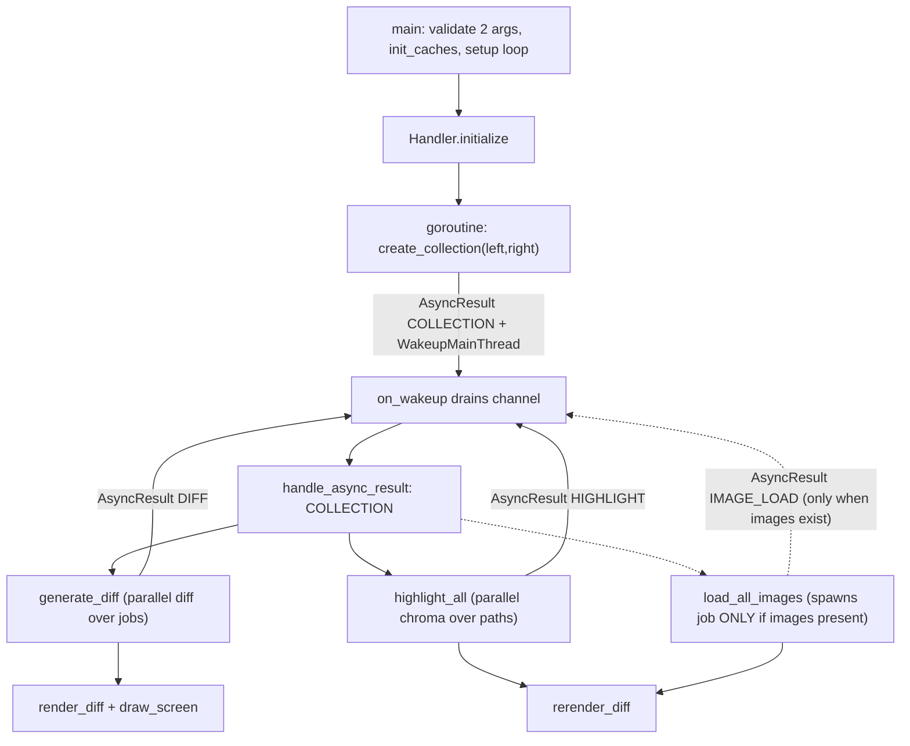

# Inside kitty's "diff kitten": A Source-Grounded Runtime Walkthrough

> An engineer-onboarding deep dive into how the **diff kitten** (`kittens/diff/`) behaves at
> runtime — file pairing, rename "magic", caching, parallelism, concurrency safety, binary/image
> handling, the end-to-end flow, and the diff algorithm itself.
>
> **Methodology.** Every behavioral claim below is grounded in the source code, which is the single
> source of truth, and is attributed to a precise `file:Lstart-Lend` locator. The kitten was also
> **built and run** (and its Go tests executed) purely to *observe and confirm* the documented
> behavior; see the [verification appendix](#how-this-was-verified). Each answer is structured as
> **(a) the direct answer**, then **(b) the rationale / mechanism**, then **(c) the citations**.

---

## Orientation: what the diff kitten is and how it runs

The diff kitten is a **compiled Go program** that ships inside kitty's multi-call `kitten` binary and
is invoked as `kitten diff <left> <right>`. It renders a full-screen, side-by-side terminal diff of
two files *or* two directories.

A common point of confusion for new contributors is the pair of Python files in `kittens/diff/`.
These are **only a configuration-schema and CLI-help shim** — they are *not* the runtime. The proof
is in the Python entry point itself, which refuses to run and defers to the Go binary:

```python
def main(args: List[str]) -> None:
    raise SystemExit('Must be run as kitten diff')
```

That guard lives at `kittens/diff/main.py:L13-14`. The companion `kittens/diff/__init__.py:L4-9`
defines `syntax_aliases(x)`, a small config-string parser that turns space-separated `ext:alias`
tokens into a `map` (used to override the syntax-highlighting language for a file extension).

The **true runtime** is Go. The entry function `main` is at `kittens/diff/main.go:L102-175`, and it is
registered as a CLI sub-command through `EntryPoint` at `kittens/diff/main.go:L177-179`.

Build facts that bound the behavior described here:

- The module is `module kitty` (`go.mod:L1`) built with `go 1.22` (`go.mod:L3`).
- Syntax highlighting is provided by the chroma library, pinned at
  `github.com/alecthomas/chroma/v2 v2.14.0` (`go.mod:L7`).
- The Python config shim targets `requires-python = ">=3.8"` (`pyproject.toml:L2`).

### Table of contents

- [Q1 — Directory file-pairing](#q1--directory-file-pairing)
- [Q2 — Rename detection (the "magic")](#q2--rename-detection-the-magic)
- [Q3 — Caching pipeline & efficiency](#q3--caching-pipeline--efficiency)
- [Q4 — Multiple-file processing (parallelism)](#q4--multiple-file-processing-parallelism)
- [Q5 — Parallel-highlight concurrency safety](#q5--parallel-highlight-concurrency-safety)
- [Q6 — Binary & image handling](#q6--binary--image-handling)
- [Q7 — Full runtime flow (end-to-end)](#q7--full-runtime-flow-end-to-end)
- [Q8 — Diff matching regions (the algorithm)](#q8--diff-matching-regions-the-algorithm)
- [How this was verified](#how-this-was-verified)

---

## Q1 — Directory file-pairing

### Direct answer

When you point the kitten at two directories, it **walks each directory tree independently**,
collecting the set of **relative path names** beneath each side (honoring ignore patterns), and then
pairs files by the **set intersection of those relative names**. In other words, a file in `left/`
and a file in `right/` "belong together" **if and only if they have the same relative path**. Among
the paired names, files whose *contents* differ — or whose *mode* differs — become **changes**; names
that exist on only one side become candidate **removals** / **additions**, which are then refined by
rename detection (see [Q2](#q2--rename-detection-the-magic)).

### Rationale / mechanism

The pairing is deliberately simple, deterministic, and independent of file ordering or inode
identity: it is pure name-set algebra over relative paths. This is why the result is stable across
runs and filesystems, and why ignore patterns (for backups, VCS detritus, etc.) can prune noise
before any comparison happens.

**Walking a single side.** `walk` takes a base directory, the ignore patterns, and the output
collections. It absolutizes the base (`filepath.Abs`) and traverses with `filepath.WalkDir`
(`kittens/diff/collect.go:L260-294`, specifically `L261-265`). For every entry it consults the
`allowed` gate (`collect.go:L269`); when an entry is **not** allowed, a **directory** returns
`fs.SkipDir` — pruning the entire subtree — while a disallowed **file** is simply skipped
(`collect.go:L270-275`). Directories themselves are never recorded as comparable items
(`collect.go:L276-278`). For each surviving file, its key is computed **relative to the walked root**
via `filepath.Rel(base, path)` (`collect.go:L283`) and stored into the name set and the
name→path / path→name maps (`collect.go:L287-291`).

**What counts as "allowed".** `allowed` returns `false` when the file's base name matches any ignore
pattern, using Go's `filepath.Match(pattern, filepath.Base(path))` (`kittens/diff/collect.go:L230-238`,
the match at `L233`). The patterns come from `conf.Ignore_name`. (Note: the glob engine here is the
standard library's `filepath.Match`, not a third-party globber.)

**The pairing itself.** `collect_files` walks both sides with `conf.Ignore_name`
(`kittens/diff/collect.go:L296-369`, the two walks at `L299-305`) and then computes the heart of the
pairing:

```go
common_names := left_names.Intersect(right_names)
```

at `collect.go:L306`. For each common name it reads both files via `data_for_path`; if the byte
contents differ it records a change with `add_change` (`collect.go:L308-319`). If the contents are
**identical but the file mode differs**, it still records a change (`collect.go:L320-330`) — a mode
flip is a real difference worth showing.

### Observable verification

The directory walk is directly exercised by `TestDiffCollectWalk`
(`kittens/diff/collect_test.go:L19-54`). It builds a temporary tree (`collect_test.go:L20-31`), walks
it with the ignore patterns `["*~", "#*#", "b"]` (`collect_test.go:L42`), and asserts the resulting
names are exactly `{d, e, f/g, h space}` (`collect_test.go:L33`). That single assertion proves several
behaviors at once:

- Backup files (`e~`) and emacs auto-save files (`#d#`) are excluded by the `*~` and `#*#` globs.
- The literal pattern `b` prunes **both** the top-level file `b` **and** the directory `a/b` — so
  `a/b/c` never appears (subtree pruning via `fs.SkipDir`).
- Names are **relative**, and nested or space-containing paths are preserved verbatim (`f/g`,
  `h space`).

This test passes in the build container (see the [appendix](#how-this-was-verified)).

---

## Q2 — Rename detection (the "magic")

### Direct answer

A rename is detected **purely from file content — with no reliance on filenames at all**. For every
name present only on the left (a candidate *removal*) and every name present only on the right (a
candidate *addition*), the kitten computes an **MD5 hash of the file's bytes**. If a removed file's
hash equals an added file's hash, it then performs a **byte-for-byte equality confirmation**, and only
then records a **rename** (left → right). That is precisely why it feels "magical" — you move or
rename a file, give no hint, and the tool just *knows* — yet it is entirely **deterministic**:
identical content ⇒ identical MD5 ⇒ confirmed-equal bytes ⇒ rename.

### Rationale / mechanism

After the name-intersection pairing of [Q1](#q1--directory-file-pairing), the "leftovers" on each side
are computed by set subtraction: `removed := left_names.Subtract(common_names)` (`collect.go:L332`)
and `added := right_names.Subtract(common_names)` (`collect.go:L333`). These are the only candidates a
rename could possibly involve.

To match candidates efficiently, the kitten precomputes a hash for every added and every removed file
into two maps (`ahash`, `rhash`) using `hash_for_path` (`kittens/diff/collect.go:L334-346`).
`hash_for_path` reads the bytes once (via the cached `data_for_path`) and returns
`md5.Sum(...)` of them (`collect.go:L106-116`, the hash at `L112`; the `crypto/md5` import is at
`collect.go:L6`). MD5 is used here **not for security but as a fast content fingerprint** — a cheap way
to find candidate matches without comparing every removed file against every added file byte-by-byte.

The match loop is where the "magic" is demystified
(`kittens/diff/collect.go:L347-364`): for each removed file's hash `rh`, it scans the added hashes; on
a hash hit (`ah == rh`, `collect.go:L350`) it **re-reads both files and confirms they are byte-for-byte
equal**:

```go
if ld == rd {
    self.add_rename(left_path_map[name], right_path_map[n])
```

at `collect.go:L353-354`, after which the matched addition is discarded from the `added` set
(`collect.go:L355`). The byte-equality check is the guard against the astronomically unlikely case of
an MD5 collision — so the recorded rename is *exact*, never merely "probably the same file." If no
confirmed match is found, the file is recorded as a removal via `add_removal` (`collect.go:L361-363`).
Any additions left unmatched after the loop become genuine adds via `add_add` (`collect.go:L365-367`).

**Why this looks magical but isn't:** there is *no filename heuristic*, no similarity threshold, no
fuzzy scoring. Matching is content-hash plus exact-byte comparison, so the outcome is fully
reproducible and explainable. A renamed-but-edited file will *not* be matched as a rename (its bytes
changed, so its hash changed) — it will instead show as a removal + addition, which is the correct,
conservative behavior.

### Observable verification

Running `kitten diff` on two directories where `left/old_name.txt` and `right/new_name.txt` hold
identical bytes renders them as a **single paired entry** (both names shown together, no line-by-line
content diff) — visibly distinct from the separate "added"/"removed" entries produced for files that
exist on only one side. See the [appendix](#how-this-was-verified).

---

## Q3 — Caching pipeline & efficiency

### Direct answer

The kitten keeps **seven package-level LRU caches**, all keyed by **absolute path** and all created at
a fixed capacity of **4096 entries**. Raw file bytes are read **on first access and then reused while
the cache entry stays resident** in the `data_cache` — and re-read only if the LRU later evicts that
entry; every higher-level artifact — MD5 hash, sanitized lines, syntax-highlighted lines,
mimetype, size, and the text/binary verdict — is **lazily derived on first access and memoized** on
top of that. Repeated work (re-rendering, scrolling, re-diffing the same file) is therefore served
from cache. Efficiency comes from three things working together: **(a)** raw bytes read once per
cache residency (re-read only if evicted) with layered reuse, **(b)** bounded memory via LRU eviction
at capacity 4096, and **(c)** a correctness safeguard that prevents a half-finished highlight from
corrupting the layout.

### Rationale / mechanism

**The seven caches.** They are declared together at `kittens/diff/collect.go:L20-24`:
`mimetypes_cache`, `data_cache`, and `hash_cache` (each `string → string`), `size_cache`
(`string → int64`), `lines_cache` and `highlighted_lines_cache` (each `string → []string`), and
`is_text_cache` (`string → bool`). They are all constructed in `init_caches`
(`collect.go:L26-37`), which sets `const sz = 4096` (`collect.go:L29`) and calls
`utils.NewLRUCache[...](sz)` seven times (`collect.go:L30-36`).

**The layered, lazily-populated pipeline.** The base layer is `data_for_path`
(`kittens/diff/collect.go:L65-70`), which performs a single `os.ReadFile` and stores the bytes as a
**zero-copy string view** through `utils.UnsafeBytesToString` (`collect.go:L67-68`) — avoiding a copy
of potentially large file contents. Every other accessor builds on it:

- `hash_for_path` derives the MD5 fingerprint (`collect.go:L106-116`).
- `lines_for_path` derives sanitized, split lines: `text_to_lines(sanitize(...))`
  (`collect.go:L138-146`, the transform at `L144`).
- `highlighted_lines_for_path` returns syntax-colored lines when available (`collect.go:L148-157`).

**The correctness safeguard.** `highlighted_lines_for_path` does *not* blindly trust the highlight
cache. It returns the cached highlighted lines **only if** they exist **and** their count matches the
plain line count; otherwise it falls back to plain lines:

```go
if ans, found := highlighted_lines_cache.Get(path); found && len(ans) == len(plain_lines) {
    return ans, nil
}
```

at `collect.go:L153-156`. The *why*: highlighting runs **asynchronously and in parallel** (see
[Q4](#q4--multiple-file-processing-parallelism) / [Q5](#q5--parallel-highlight-concurrency-safety)),
so at render time a file's highlight may be missing or — momentarily — out of sync with its plain
lines. Because the side-by-side layout aligns left and right by line index, a mismatched line count
would *misalign the whole view*. The kitten therefore prefers a correct, un-colored render over a
colored-but-misaligned one.

**The generic cache.** All seven instances are the generic `LRUCache[K, V]` in
`tools/utils/cache.go`, whose struct is a `map[K]V` plus a `sync.RWMutex`, a `max_size`, and a
`*list.List` for recency ordering (`tools/utils/cache.go:L13-18`). The workhorse is `GetOrCreate`
(`cache.go:L39-58`): it first reads under a read lock (`cache.go:L40-42`); on a miss it calls the
`create` function (`cache.go:L46`), then takes the **write lock** to store the value, push the key to
the front of the recency list, and — crucially — **evict the least-recently-used entry** when the list
exceeds `max_size`:

```go
k := self.lru.Remove(self.lru.Back()) // when lru.Len() > max_size
delete(self.data, k.(K))
```

at `cache.go:L51-54`. This fixed-4096 eviction is what bounds memory regardless of how many files a
directory diff touches. `Get` reads under a read lock (`cache.go:L25-30`), and `MustGetOrCreate`
(`cache.go:L60-72`) is the error-free variant used by `is_path_text` and `mimetype_for_path`.

---

## Q4 — Multiple-file processing (parallelism)

### Direct answer

When many files are involved, both **diffing** and **syntax-highlighting** are fanned out across files
using a **single shared worker-pool primitive**, `Context.Parallel`. It spawns up to
`runtime.NumCPU()` goroutines, each of which pulls file indices off a shared channel and processes
them until the channel is drained.

### Rationale / mechanism

**The worker pool.** `Context.Parallel(start, stop, fn)` lives at
`tools/utils/images/utils.go:L27-56`. It computes `count = stop - start` and returns immediately if
there is nothing to do (`utils.go:L28-31`). The worker count defaults to `runtime.NumCPU()` when not
explicitly set, and is capped at `count` so it never spawns more workers than items
(`utils.go:L33-39`). It then builds a **buffered channel** sized to `count`, pushes every index
`start..stop` into it, and **closes** it (`utils.go:L41-45`). Finally it launches `procs` goroutines,
each running `fn(c)`, and joins them with a `sync.WaitGroup` (`utils.go:L47-55`). Because the channel
is pre-filled and closed, each worker simply ranges over it; the channel hands out each index to
exactly one worker.

**Parallel diffing.** `diff(jobs, context_count)` (`kittens/diff/patch.go:L352-377`) builds an
`images.Context` (`patch.go:L354`) and a buffered `results` channel (`patch.go:L360`), then calls
`ctx.Parallel(0, len(jobs), ...)` (`patch.go:L361`). Each worker pulls a job index, runs
`do_diff(job.file1, job.file2, context_count)` (`patch.go:L365`), and pushes the result onto the
channel (`patch.go:L366`). After the pool finishes, the results are gathered into a
`map[string]*Patch` keyed by the left path (`patch.go:L370-375`).

**Parallel highlighting.** `highlight_all(paths)` (`kittens/diff/highlight.go:L217-228`) calls
`ctx.Parallel(0, len(paths), ...)` (`highlight.go:L219`); each worker pulls an index `i`
(`highlight.go:L220`), highlights `paths[i]` via `highlight_file` (`highlight.go:L221-222`), and on
success stores the colored lines into the highlight cache (`highlight.go:L224`).

**Which files get diff jobs.** The per-file `diff_job` list is assembled by `generate_diff`
(`kittens/diff/ui.go:L142-159`), which walks the collection and enqueues a job **only for `"diff"`-typed
entries where both sides are text** — binary and image entries are handled separately (see
[Q6](#q6--binary--image-handling)), and adds/removals/renames don't need a two-file textual diff.


---

## Q5 — Parallel-highlight concurrency safety

### Direct answer

Parallel highlighting never "steps on itself" because each worker is handed a **distinct file index**
from the shared channel, so it reads a **distinct path** and writes a **distinct cache key**. No two
goroutines ever touch the same key, and all cache access is mediated by the cache's `sync.RWMutex`.
The disjoint-key property is the linchpin of the whole design.

### Rationale / mechanism

**Distinct-key partitioning.** In `highlight_all` (`kittens/diff/highlight.go:L217-228`), the worker
body is `for i := range nums { path := paths[i]; ...; highlighted_lines_cache.Set(path, ...) }`
(`highlight.go:L220-224`). Because `Context.Parallel` hands each index to exactly one worker (see
[Q4](#q4--multiple-file-processing-parallelism)), each `i` — and therefore each `path`, and therefore
each cache key — is processed by exactly one goroutine. There is structurally no way for two workers
to write the same key.

**The subtle-but-correct design point.** Look closely at how the highlight cache is written.
`LRUCache.Set` takes a **read** lock, not a write lock, and does not update the recency list:

```go
self.lock.RLock() // read lock, not a write lock
self.data[key] = val
self.lock.RUnlock()
```

at `tools/utils/cache.go:L32-37`. In general, writing to a Go `map` while holding only a read lock —
and while other goroutines may also be writing — is a data race. **It is safe here precisely because
the highlighter guarantees disjoint keys**: every worker writes a *different* map key, so there is
never a concurrent write to the *same* entry, and during the parallel highlight phase `highlight_all`
is the only writer to `highlighted_lines_cache`. (By contrast, `GetOrCreate` takes the full write lock
for its mutations — `cache.go:L39-58` — because it also mutates the shared recency list.) This is a
deliberate optimization: skipping the write lock avoids serializing the highlight workers on a single
mutex, and the correctness obligation it creates (disjoint keys) is satisfied by the partitioning
above. The line-count safeguard in `highlighted_lines_for_path` (see
[Q3](#q3--caching-pipeline--efficiency), `collect.go:L153`) provides a second layer of protection, so
even a not-yet-written highlight degrades to plain lines rather than a corrupt render.

**The per-file highlighter.** For completeness, `highlight_file`
(`kittens/diff/highlight.go:L161-215`) selects a chroma lexer via `lexers.Match`
(`highlight.go:L175`) with a content-analysis fallback `lexers.Analyse` (`highlight.go:L178`),
coalesces tokens with `chroma.Coalesce` (`highlight.go:L184`), tokenizes with `lexer.Tokenise`
(`highlight.go:L205`), and formats through `chroma.FormatterFunc(ansi_formatter)`
(`highlight.go:L209`). The chroma packages are imported at `highlight.go:L17-19`. The custom
`ansi_formatter` (`highlight.go:L84-159`) emits SGR escape sequences and — importantly —
**independently formats each line of a multiline token** (`highlight.go:L138-156`); the in-code
comment explains why (`highlight.go:L138-139`): pagers like `less` reset SGR formatting at line
boundaries, so each line must carry its own color codes to render correctly in isolation.

---

## Q6 — Binary & image handling

### Direct answer

Before rendering each entry, the kitten classifies each file as **text**, **binary**, or **image**,
and the `render` dispatcher branches accordingly: text files get a normal side-by-side line diff;
binary files get a one-line **size message** (no content diff); images get an actual **inline image**
placed via the kitty graphics protocol; and renames get a single "renamed" message with no content
diff.

### Rationale / mechanism

**Classification.** `is_path_text(path)` (`kittens/diff/collect.go:L86-104`) returns `false` if the
file is an image, `false` if it is the same file as `/dev/null` (an empty-side sentinel), and
otherwise reads the bytes and returns `utf8.ValidString(data)` — i.e., a file is "text" if it is valid
UTF-8. The verdict is memoized in `is_text_cache` via `MustGetOrCreate`. The image test `is_image`
(`collect.go:L82-84`) simply checks for an `"image/"` mimetype prefix.

**The dispatcher.** `render` (`kittens/diff/render.go:L696-770`) computes two booleans per entry:
`is_binary := !is_path_text(path)`, promoted to `true` when a `"diff"` entry's *other* side is
non-text (`render.go:L706-709`), and `is_img` derived from `is_image` on either side
(`render.go:L710`). It then switches on the entry type (`render.go:L712`):

- `case "diff"` (`render.go:L713`): if binary → `image_lines` when it is an image
  (`render.go:L716`) else `binary_lines` (`render.go:L718`); otherwise the text path `lines_for_diff`
  (`render.go:L721`).
- `case "add"` (`render.go:L726`) and `case "removal"` (`render.go:L739`): the same image/binary
  branch, otherwise `all_lines` for the single present side (`render.go:L734`, `render.go:L747`).
- `case "rename"` (`render.go:L752`): `rename_lines` (`render.go:L753`).
- `default` (`render.go:L757`): returns an "Unknown change type" error (`render.go:L758`).

**The branch leaves.**

- `image_lines` (`kittens/diff/render.go:L333-392`) **prepares** the image entry but does **not** emit
  any graphics itself: it builds a header of the form `"Dimensions: WxH"` and a human-readable size
  using `image_collection.ResolutionOf` (`render.go:L342`) and the size text (`render.go:L344`),
  reserves the logical image rows via `image_lines_offset` (`render.go:L352`), fills a
  "Loading image..." placeholder while the load is pending (`render.go:L364`), records the per-side
  image **keys** (`render.go:L370`, `render.go:L374`), and tags the logical line `IMAGE_LINE`
  (`render.go:L390`). The **actual** graphics-protocol placement happens later, during drawing:
  `draw_image_pair` / `draw_image` (`kittens/diff/ui.go:L319-337`) call
  `image_collection.PlaceImageSubRect` (`tools/tui/graphics/collection.go:L155-181`), which builds a
  `GRT_action_display` graphics command and writes it to the loop (`collection.go:L177-180`).
- `binary_lines` (`kittens/diff/render.go:L446`) emits a single `"Binary file: <human-readable size>"`
  line per side (`render.go:L452`) and **no content diff**.
- `rename_lines` (`kittens/diff/render.go:L684-694`) emits the single message
  `"The file <old> was renamed to <new>"` (`render.go:L688`) and no content diff.

**Tie-back to the runtime.** Images are loaded **asynchronously** by `load_all_images`
(`kittens/diff/ui.go:L190-211`) into an `image_collection`; while the load is pending the placeholder
text "Loading image..." is shown, and once the load completes the kitten re-renders and the image is
emitted to the terminal via kitty's graphics protocol (APC escape codes) **during drawing**
(`draw_image_pair` / `draw_image`, `ui.go:L319-337`). This is why image entries appear in two stages
at runtime (see [Q7](#q7--full-runtime-flow-end-to-end) and the [appendix](#how-this-was-verified)).


---

## Q7 — Full runtime flow (end-to-end)

### Direct answer

`kitten diff <left> <right>` validates that it received exactly two inputs, initializes the caches and
the TUI loop, then runs an **asynchronous pipeline**: a background goroutine builds the file
*collection* (the [Q1](#q1--directory-file-pairing) pairing plus [Q2](#q2--rename-detection-the-magic)
rename detection). When the collection completes, the main thread invokes **three producer methods** —
**diffing**, **highlighting**, and **image loading**. Diffing and highlighting *always* spawn a
background job, but image loading spawns one **only when the diff actually contains images** —
so an image-free diff fans out into just two jobs, not three. Each spawned job posts a typed result
back to the main thread, which re-renders the side-by-side view as results arrive. The diff algorithm
([Q8](#q8--diff-matching-regions-the-algorithm)) is invoked during the diffing job.

### Rationale / mechanism — tracing the journey

1. **Entry & validation.** `main` (`kittens/diff/main.go:L102-175`) loads configuration
   (`main.go:L104`), then requires exactly two arguments — returning
   `"You must specify exactly two files/directories to compare"` otherwise (`main.go:L108-110`). It
   resolves the diff backend with `set_diff_command` (`main.go:L111`), initializes all caches with
   `init_caches()` (`main.go:L114`), and registers a `defer` that removes any temporary remote
   directories on exit (`main.go:L116-120`).
2. **Remote (SSH) inputs (edge case).** Each argument passes through `get_remote_file`
   (`main.go:L92`, `L121`/`L125`); an `ssh:`-prefixed input (`main.go:L93`) is fetched by
   `get_ssh_file` (`main.go:L51`) into a fresh temp directory (`os.MkdirTemp`, `main.go:L52`) via an
   `ssh ... tar` pipeline (`main.go:L61`). That temp directory is exactly what the deferred
   `os.RemoveAll` cleans up.
3. **More validation & loop setup.** Both inputs must be the same kind (`isdir(left) != isdir(right)`
   is an error, `main.go:L129-131`) and must exist (`main.go:L132-137`). The kitten creates the event
   loop with `loop.New()` (`main.go:L138`), enables mouse tracking (`main.go:L139`), constructs the
   `Handler{left, right, lp}` (`main.go:L143`), and wires callbacks: `OnInitialize` (a closure that
   calls `h.initialize()`, `main.go:L144-151`) and `OnWakeup = h.on_wakeup` (`main.go:L152`), among
   others, before calling `lp.Run()` (`main.go:L163`).
4. **Async kickoff.** `Handler.initialize` (`kittens/diff/ui.go:L114-140`) creates a buffered
   `async_results` channel of size 32 (`ui.go:L132`) and launches a background goroutine that calls
   `create_collection(left, right)`, pushes an `AsyncResult` onto the channel, and calls
   `lp.WakeupMainThread()` (`ui.go:L133-137`).
5. **Collection.** `create_collection` (`kittens/diff/collect.go:L371-405`) dispatches to
   `collect_files` for two directories (`collect.go:L386`) — performing the [Q1](#q1--directory-file-pairing)
   pairing and [Q2](#q2--rename-detection-the-magic) rename detection — or records a single
   `add_change` for two plain files (`collect.go:L401`); finally `finalize()` stable-sorts the paths by
   name (`collect.go:L403`).
6. **Wakeup drain.** When woken, `on_wakeup` (`kittens/diff/ui.go:L161-177`) drains the
   `async_results` channel (`ui.go:L165`) and dispatches each result to `handle_async_result`.
7. **Fan-out.** `handle_async_result` (`kittens/diff/ui.go:L245-275`) is the hub. On a `COLLECTION`
   result (`ui.go:L247`) it stores the collection and invokes the three producer methods —
   `generate_diff()` (`ui.go:L249`), `highlight_all()` (`ui.go:L250`), and `load_all_images()`
   (`ui.go:L251`). On a `DIFF` result (`ui.go:L252`) it stores the diff map, computes statistics,
   renders, and draws the screen (`ui.go:L253-268`). `IMAGE_RESIZE` (`ui.go:L269`) and
   `IMAGE_LOAD`/`HIGHLIGHT` (`ui.go:L272`) trigger a re-render (`ui.go:L271`, `ui.go:L273`). Note that
   the three methods do **not** all spawn a job unconditionally: `generate_diff` (`ui.go:L142-159`)
   and `highlight_all` (`ui.go:L179-188`) **always** launch a goroutine that posts a `DIFF` /
   `HIGHLIGHT` result, whereas `load_all_images` (`ui.go:L190-211`) first counts image paths and
   spawns its `IMAGE_LOAD` goroutine **only when `self.image_count > 0`** (the guard at `ui.go:L202`,
   goroutine at `ui.go:L204-209`) — so a diff with no images produces just two async jobs. Each
   spawned goroutine posts a typed `AsyncResult` and wakes the main thread, which is how its work
   re-enters the single-threaded render path safely.
8. **Diffing & rendering.** The parallel `diff` ([Q4](#q4--multiple-file-processing-parallelism))
   produces the `*Patch` per file; `render` ([Q6](#q6--binary--image-handling)) lays out the
   side-by-side lines; the matching-region algorithm ([Q8](#q8--diff-matching-regions-the-algorithm))
   underlies each file's patch.



### Edge cases woven through the flow

- **Identical files produce no output.** The built-in diff returns a `nil` slice when the two texts
  are identical (`kittens/diff/diff.go:L49-52`), so unchanged files contribute nothing to the view.
  (Observed: a file with identical content on both sides is absent from the rendered diff.)
- **Symlinks are resolved before diffing.** `run_diff` resolves both inputs with
  `filepath.EvalSymlinks` (`kittens/diff/patch.go:L282`, the resolutions at `L286` and `L290`) so the
  result is consistent with `git difftool`.
- **Missing trailing newline.** A file not terminated by a newline gets a
  `"No newline at end of file"` marker appended to its last line (`kittens/diff/diff.go:L172-182`,
  the marker at `L179`).
- **Mixed line endings.** `splitlines_like_git` (`kittens/diff/patch.go:L189-214`) splits on `\n`
  (`L199-201`), bare `\r` (`L202-204`), and `\r\n` (`L205-208`), so CRLF and old-Mac files line up
  correctly.

---

## Q8 — Diff matching regions (the algorithm)

### Direct answer

Matching regions are found by a built-in **anchored diff**, copied (with modifications) from the Go
standard library's `internal/diff`. Rather than minimizing the total number of inserted/removed lines
(the classic approach that can cost O(n²)), it finds the **longest common subsequence of lines that
are *unique to both sides*** — these unique lines act as **anchors** — and then expands each anchor
outward and inward while the surrounding lines remain equal. This runs in **O(n log n)** and yields
cleaner output. Within an individual changed line, an intra-line **"changed center"** further narrows
the highlight to the bytes that actually differ.

### Rationale / mechanism

**Provenance.** The file header states it was copied from the Go stdlib's `internal/diff/diff.go`
(`kittens/diff/diff.go:L1-2`). The doc comment that explains the approach is at `diff.go:L21-48`: the
**unique-line anchors** idea (`diff.go:L32-38`), the **O(n log n) vs O(n²)** guarantee
(`diff.go:L39-40`), and the relationship to "patience diff" along with why that name is avoided
(`diff.go:L42-48`).

**The driver.** `Diff(oldName, old, newName, new, num_of_context_lines)` (`kittens/diff/diff.go:L49-167`)
short-circuits identical inputs to a `nil` slice (`diff.go:L50-51`) — no output. Otherwise it iterates
over the matches returned by `tgs(x, y)` (`diff.go:L74`) and, for each anchor, **expands the matching
region**:

- backward, while the preceding lines on both sides are equal:
  `for start.x > done.x && start.y > done.y && x[start.x-1] == y[start.y-1] { start.x--; start.y-- }`
  (`diff.go:L85-88`);
- forward, while the following lines on both sides are equal:
  `for end.x < len(x) && end.y < len(y) && x[end.x] == y[end.y] { end.x++; end.y++ }`
  (`diff.go:L90-93`).

**Splitting into lines.** `lines(x)` (`kittens/diff/diff.go:L172-182`) splits on `\n` via
`strings.SplitAfter` (`diff.go:L173`) and appends the BSD/GNU-style "No newline at end of file" note
when the final line lacks a trailing newline (`diff.go:L179`).

**The unique-line LCS.** `tgs(x, y)` (`kittens/diff/diff.go:L192-263`) returns the index pairs of the
longest common subsequence of lines that appear exactly once in each of `x` and `y`. Its provenance is
attributed in-code to **Algorithm A from Thomas G. Szymanski, "A Special Case of the Maximal Common
Subsequence Problem," Princeton TR #170 (January 1975)** (`diff.go:L188-191`, available at
`https://research.swtch.com/tgs170.pdf`; the "Apply Algorithm A" step is at `diff.go:L229`). The
routine frames the search with sentinels `{len(x), len(y)}` (`diff.go:L254`) and `{0, 0}`
(`diff.go:L262`).

**Intra-line region detection.** Once a line is known to have changed, `changed_center(left, right)`
(`kittens/diff/patch.go:L86-99`) narrows the highlight to the bytes that differ: it finds the common
prefix length (`ans.offset`, `patch.go:L90-91`), the common suffix length (`patch.go:L92-94`), and the
differing middle sizes (`ans.left_size`, `ans.right_size`, `patch.go:L95-96`). `Chunk.finalize`
computes one center per changed line, but only when the chunk has equal counts on both sides
(`left_count == right_count`, `patch.go:L101-107`, the guard at `L102`).

**External backends, and how `auto` resolves.** The kitten can also shell out to an external differ.
The command templates are `GIT_DIFF = "git diff --no-color --no-ext-diff --exit-code -U_CONTEXT_
--no-index --"` (`kittens/diff/patch.go:L21`) and `DIFF_DIFF = "diff -p -U _CONTEXT_ --"`
(`patch.go:L22`). `find_differ` prefers `git` (`patch.go:L36`), then GNU `diff` (`patch.go:L38`), then
the built-in algorithm (`patch.go:L34-42`); `set_diff_command` maps the configured value
`auto`/`builtin`/`diff`/`git`/custom (`patch.go:L44-62`). The built-in anchored diff documented above
is the **guaranteed fallback** when no external differ is available. In the build container `auto`
resolves to `git` (git is present), but the built-in algorithm is documented here because it is the
in-repo, self-contained implementation and the always-available fallback.


---

## How this was verified

Per the project's "code is the source of truth" rule, **source reading is the primary basis** for
every claim above. To *corroborate* (never to override) the source, the kitten was built and run, and
its Go tests executed, inside the Go 1.22 build container. Build/run is for observation only; **no
repository file was modified**, and every temporary fixture and script used for observation lived
outside the repository tree and was deleted afterward, leaving only this document as a new untracked
file.

### Build tooling (how the kitten is produced)

- The `kitten` binary is produced by `setup.py`'s `build_static_kittens` step (`setup.py:L1130`),
  which first resolves the required Go version by comparing `go list -f {{.GoVersion}} -m`
  (`setup.py:L1139`) against `go version` (`setup.py:L1140`) and aborts with a clear error if the
  installed toolchain is too old (`setup.py:L1141-1142`).
- The `Makefile` exposes `all` → `python3 setup.py` (`Makefile:L12-13`) and `test` →
  `python3 setup.py test` (`Makefile:L15-16`); `dev.sh` runs `exec go run bypy/devenv.go "$@"`
  (`dev.sh:L9`).

### Unit test (real result)

`go test ./kittens/diff/...` was executed and **passed**, including `TestDiffCollectWalk`
(`kittens/diff/collect_test.go:L19-54`):

```
=== RUN   TestDiffCollectWalk
--- PASS: TestDiffCollectWalk (0.00s)
PASS
ok      kitty/kittens/diff      0.021s
```

This confirms the [Q1](#q1--directory-file-pairing) ignore-pattern handling (`*~`, `#*#`, and the
literal `b` pruning both file `b` and directory `a/b`) and the relative, nested, space-preserving
naming.

### Runtime fixtures (real observation)

A pair of temporary directories was created **outside the repository** containing: a content-changed
text file, an identical text file, a content-identical rename pair, a pure addition, a pure removal, a
binary file (differing sizes), and a PNG image (differing dimensions). Running `kitten diff` against
them (driving the full-screen TUI through a pseudo-terminal sized with non-zero pixel dimensions, so
`update_screen_size` does not divide by zero) produced a side-by-side view whose observed behavior
matched the source exactly:

- **Q1 pairing:** the changed text file rendered as a unified-style text diff with a hunk header
  (`@@ -1,3 +1,3 @@`) and the single changed line; the **identical** file was **absent** from the view
  (corroborating the `nil`-diff short-circuit, `diff.go:L49-52`); the add/removal files rendered as
  "This file was added" / "This file was removed"; entries were ordered alphabetically by name
  (corroborating `finalize`, `collect.go:L403`).
- **Q2 rename:** the content-identical pair rendered as a **single paired entry** (both names shown
  together, no content diff), clearly distinct from the separate add/removal entries — corroborating
  the content-hash + byte-equality rename match (`collect.go:L347-364`) and `rename_lines`
  (`render.go:L684-694`).
- **Q6 binary:** the binary file rendered as `Binary file: 4 KB` / `Binary file: 8 KB` with no content
  diff — corroborating `binary_lines` (`render.go:L446-452`).
- **Q6 image:** the PNG rendered with a `Dimensions: WxH` + size header and a transient
  "Loading image..." placeholder — corroborating the `image_lines` *preparation* step
  (`render.go:L333-392`) — while the captured terminal byte-stream contained kitty
  graphics-protocol APC escapes (`ESC _ G ...`) emitted at **draw** time, corroborating
  `draw_image_pair` (`ui.go:L319-337`) → `PlaceImageSubRect` (`collection.go:L155-181`); image
  loading itself is asynchronous via `load_all_images` (`ui.go:L190-211`).
- **Q7 async pipeline:** the view briefly displayed "Calculating diff, please wait..." before results
  appeared, and image entries updated in a second pass — corroborating the
  `COLLECTION → DIFF/HIGHLIGHT (+ conditional IMAGE_LOAD)` fan-out (`ui.go:L245-275`), where the
  `IMAGE_LOAD` job only appears because the fixture contained an image.

> **Honesty note.** The `go test` output above is real captured output. The `kitten diff` observations
> are real but are described in prose because the kitten is a full-screen TUI that positions text with
> cursor-movement escape sequences; where exact on-screen positioning (e.g., the right-column rename
> message) is not reproduced verbatim, the cited source is authoritative. No console output has been
> fabricated.

### Question → primary source map

| Question | Primary source (verified) | Runtime corroboration |
|----------|---------------------------|-----------------------|
| Q1 Directory file-pairing | `collect.go:L260-294` (`walk`), `collect.go:L296-369` (`collect_files`, intersection at `L306`); `collect.go:L230-238` (`allowed`) | `TestDiffCollectWalk`; changed vs. identical vs. add/removal entries observed |
| Q2 Rename detection | `collect.go:L347-364` (match loop), `collect.go:L106-116` (`hash_for_path`, MD5 at `L112`) | content-identical pair shown as one rename entry |
| Q3 Caching pipeline | `collect.go:L20-37` (7 caches, cap 4096), `collect.go:L65-157` (accessors); `tools/utils/cache.go:L13-72` | served implicitly by repeated render/scroll |
| Q4 Multiple-file parallelism | `tools/utils/images/utils.go:L27-56` (`Parallel`); `patch.go:L352-377` (diff); `highlight.go:L217-228` (highlight) | multi-file directory diff processed |
| Q5 Parallel-highlight safety | `highlight.go:L217-228` (disjoint keys); `tools/utils/cache.go:L32-37` (`Set` RLock) | highlighted multi-file output |
| Q6 Binary & image handling | `render.go:L696-770` (dispatch); `collect.go:L86-104` (`is_path_text`); `render.go:L333-392` (`image_lines` *prepares*) / `render.go:L446` / `render.go:L684`; actual placement at draw: `ui.go:L319-337` → `collection.go:L155-181` | "Binary file: …", "Dimensions: …", graphics APC escapes |
| Q7 Full runtime flow | `main.go:L102-175`; `ui.go:L114-275` (async pipeline) | "Calculating diff…" then staged results |
| Q8 Diff matching regions | `diff.go:L21-263` (anchored diff, `tgs`); `patch.go:L86-99` (`changed_center`) | hunk header + changed line observed; `nil` for identical |

### Caveat

The build container provides the Go 1.22 toolchain (`go.mod:L3`), `git`, and GNU `diff`, so under the
default `auto` backend the kitten selects `git` while the built-in anchored diff
([Q8](#q8--diff-matching-regions-the-algorithm)) remains the guaranteed fallback. Where a specific run
was not feasible to capture verbatim, the documented behavior is grounded in the cited source rather
than invented output — consistent with the rule that code is the single source of truth.

