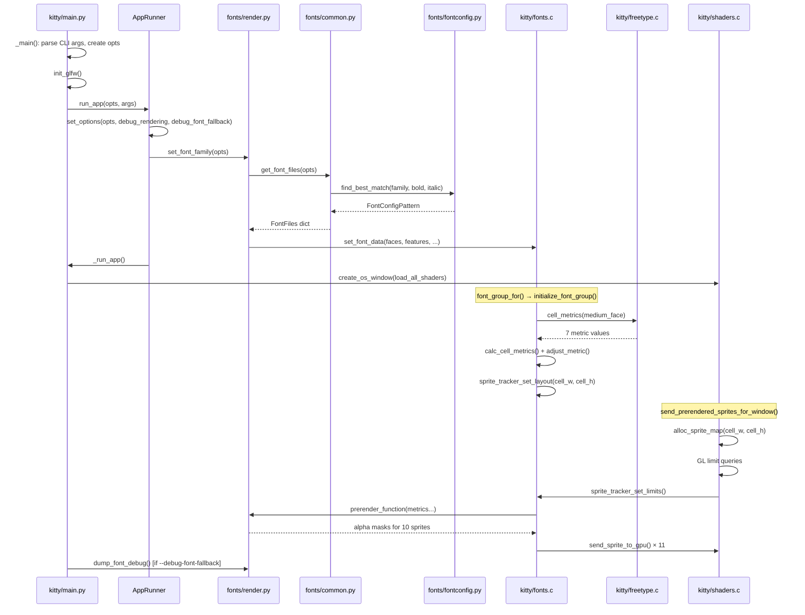
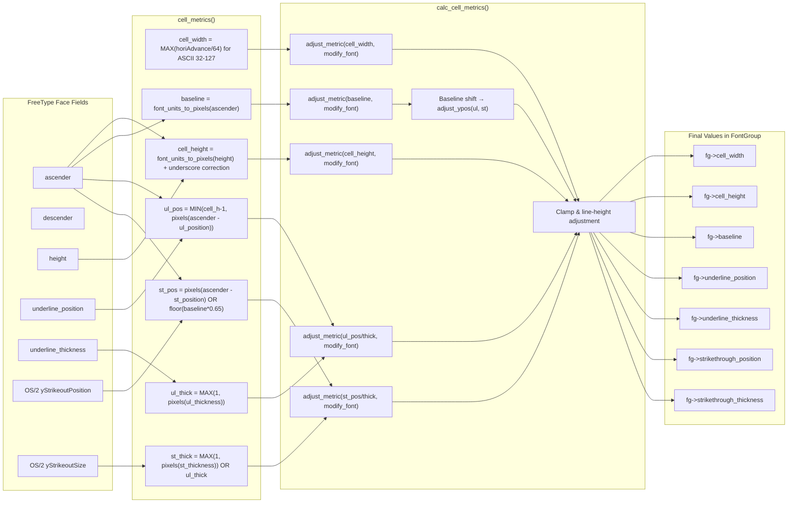

# Kitty Text Shaping, Font Fallback, Cell Metrics & GPU Atlas Deep-Dive

> **Branch:** `kitty_815df1e210e0`
>
> **Document type:** Technical Q&A — source-code-only analysis
>
> **Methodology:** Every answer in this document is derived exclusively from reading the kitty source code. No assumptions are made. No external behavior is inferred without code evidence. All claims include source citations.

---

## Table of Contents

- [Introduction & Scope](#introduction--scope)
- [Q1 — Unicode Shaping & Font Fallback at Startup](#q1--unicode-shaping--font-fallback-at-startup)
  - [1.1 HarfBuzz Buffer Creation and Configuration](#11-harfbuzz-buffer-creation-and-configuration)
  - [1.2 Per-Font Feature Configuration](#12-per-font-feature-configuration)
  - [1.3 Ligature Control via disable_ligatures and font_features](#13-ligature-control-via-disable_ligatures-and-font_features)
  - [1.4 BiDi Handling — RTL Arabic and LTR English](#14-bidi-handling--rtl-arabic-and-ltr-english)
  - [1.5 HarfBuzz Shaping Execution](#15-harfbuzz-shaping-execution)
  - [1.6 Combining Diacritics and Variation Selectors](#16-combining-diacritics-and-variation-selectors)
  - [1.7 Font Family Resolution Chain](#17-font-family-resolution-chain)
  - [1.8 Fallback Font Discovery and Debug Output](#18-fallback-font-discovery-and-debug-output)
  - [1.9 Runtime Configuration Confirmation](#19-runtime-configuration-confirmation)
- [Q2 — Cell Metrics, Baseline & Decoration Alignment](#q2--cell-metrics-baseline--decoration-alignment)
  - [2.1 cell_metrics() Algorithm](#21-cell_metrics-algorithm)
  - [2.2 calc_cell_metrics() Adjustment Pipeline](#22-calc_cell_metrics-adjustment-pipeline)
  - [2.3 Pre-rendered Sprite Upload Sequence](#23-pre-rendered-sprite-upload-sequence)
- [Q3 — GPU Texture Atlas Initialization](#q3--gpu-texture-atlas-initialization)
  - [3.1 SpriteMap Allocation and GL Limit Queries](#31-spritemap-allocation-and-gl-limit-queries)
  - [3.2 Sprite Tracker Limits and Layout Computation](#32-sprite-tracker-limits-and-layout-computation)
  - [3.3 GPUSpriteTracker Struct and Increment Logic](#33-gpuspritetracker-struct-and-increment-logic)
  - [3.4 Texture Format and Filtering](#34-texture-format-and-filtering)
  - [3.5 Sprite Upload to GPU](#35-sprite-upload-to-gpu)
  - [3.6 Atlas Readiness Verification](#36-atlas-readiness-verification)
- [Q4 — Observation-Only Debug Methodology](#q4--observation-only-debug-methodology)
  - [4.1 CLI Debug Flags](#41-cli-debug-flags)
  - [4.2 Startup Call Chain and Flag Propagation](#42-startup-call-chain-and-flag-propagation)
  - [4.3 Expected Diagnostic Output Format](#43-expected-diagnostic-output-format)
  - [4.4 Restoring Settings](#44-restoring-settings)
- [Diagrams](#diagrams)
  - [Font Initialization Call-Chain](#font-initialization-call-chain)
  - [HarfBuzz Shaping Pipeline](#harfbuzz-shaping-pipeline)
  - [Font Fallback Resolution](#font-fallback-resolution)
  - [GPU Atlas Layout](#gpu-atlas-layout)
  - [Cell Metrics Derivation](#cell-metrics-derivation)
- [Source Code References](#source-code-references)

---

## Introduction & Scope

This document is a technical deep-dive Q&A that comprehensively answers four interconnected question clusters about kitty's internals:

| Cluster | Topic |
|---------|-------|
| **Q1** | Unicode shaping, font fallback, and BiDi (RTL/LTR) support at startup |
| **Q2** | Cell metrics, baseline positioning, and decoration alignment (underline, strikethrough) |
| **Q3** | GPU texture atlas initialization — page layout, sizing, and capacity |
| **Q4** | Observation-only debug methodology for verifying the above at runtime |

**Ground rules:**

- ALL answers are grounded in source code — no assumptions.
- NO source files are modified — this is observational only.
- Every claim includes a `Source:` citation pointing to the specific file, function, or line.
- Debug flags (`--debug-rendering`, `--debug-font-fallback`) are session-only CLI arguments that leave no persistent changes.

### Source Files Analyzed

| File | Role |
|------|------|
| `kitty/fonts.c` | Font group init, HarfBuzz shaping, fallback, sprite tracker, pre-rendered sprites |
| `kitty/freetype.c` | FreeType face init, `cell_metrics()`, `identify_for_debug()` output |
| `kitty/shaders.c` | SpriteMap allocation, GL texture creation, sprite upload |
| `kitty/fonts/render.py` | `set_font_family()`, `prerender_function()`, `dump_font_debug()` |
| `kitty/fonts/common.py` | `get_font_files()`, `get_font_from_spec()`, variable font handling |
| `kitty/fonts/fontconfig.py` | fontconfig enumeration, `FCScorer`, `find_best_match()` |
| `kitty/main.py` | Startup entry point, debug flag propagation |
| `kitty/debug_config.py` | `debug_config()` output format |
| `kitty/state.h` | `Options` struct, `debug_fonts()` macro, `GlobalState` |
| `kitty/data-types.h` | `FONTS_DATA_HEAD`, `CPUCell`, `GPUCell`, `NUM_UNDERLINE_STYLES` |
| `kitty/unicode-data.h` | `VS15`, `VS16`, `codepoint_for_mark()` |
| `kitty/glyph-cache.c` / `.h` | GPU-side glyph cache management |
| `kitty/cli.py` | `--debug-rendering`, `--debug-font-fallback` flag definitions |
| `kitty/options/definition.py` | Default values for font options |
| `kitty/fonts.h` | Font subsystem API contract |

---

## Q1 — Unicode Shaping & Font Fallback at Startup

### 1.1 HarfBuzz Buffer Creation and Configuration

**How does the text shaping engine configure its HarfBuzz buffer and feature set at startup?**

During module initialization, `init_fonts()` creates and configures a global HarfBuzz buffer that is reused for all subsequent shaping operations.

**Buffer creation:**

The function allocates a single persistent `hb_buffer_t`, pre-allocates space for 2048 glyphs, and sets the cluster level to `HB_BUFFER_CLUSTER_LEVEL_MONOTONE_CHARACTERS`:

```c
harfbuzz_buffer = hb_buffer_create();
hb_buffer_pre_allocate(harfbuzz_buffer, 2048);
hb_buffer_set_cluster_level(harfbuzz_buffer, HB_BUFFER_CLUSTER_LEVEL_MONOTONE_CHARACTERS);
```

**Rationale:** `MONOTONE_CHARACTERS` ensures that cluster indices increase monotonically, which simplifies the mapping from shaped glyphs back to terminal cells. The 2048-glyph pre-allocation avoids repeated allocations for typical terminal line lengths.

Source: `kitty/fonts.c:init_fonts()` L1746–1749

**Default feature constants:**

Three global HarfBuzz features are created as negative (disable) features:

| Index | Feature | Effect |
|-------|---------|--------|
| `LIGA_FEATURE` (0) | `-liga` | Disable standard ligatures |
| `DLIG_FEATURE` (1) | `-dlig` | Disable discretionary ligatures |
| `CALT_FEATURE` (2) | `-calt` | Disable contextual alternates |

These are parsed from their string forms via `hb_feature_from_string()` and stored in the global `hb_features[3]` array.

**Rationale:** The `-liga`, `-dlig`, and `-calt` features serve as a palette from which per-font feature sets are constructed. They are not applied globally to all fonts; instead, each `Font` struct gets its own subset of these features based on configuration. The `-calt` feature is always the *last* entry in each font's feature list so it can be conditionally included/excluded at shaping time to implement the `disable_ligatures` option.

Source: `kitty/fonts.c:init_fonts()` L1750–1758, `kitty/fonts.c` L42 (`hb_features[3]`), L45 (`HBFeature` enum)

---

### 1.2 Per-Font Feature Configuration

**How are HarfBuzz features configured on a per-font basis?**

Each `Font` struct receives its own `ffs_hb_features` array during `init_font()`. The feature set is determined by two factors: whether the user has specified `font_features` for that font's PostScript name, and whether the font is a known problematic family.

**Resolution logic:**

1. The font's PostScript name is retrieved via `postscript_name_for_face(face)`.
2. The `font_feature_settings` dictionary (populated from the `font_features` config option) is checked for an entry matching the PostScript name.
3. **If user-specified features exist**: they are copied into `ffs_hb_features`, and `-calt` is appended as the final feature. The total count is `len + 1`.
4. **If no user features exist**: A default set is built:
   - For fonts with PostScript names starting with `"NimbusMonoPS-"`: `-liga` and `-dlig` are added (to work around ligature issues in that font family).
   - `-calt` is always added as the last feature.

**The invariant:** The last entry in every font's `ffs_hb_features` is always the `-calt` feature. This enables the `disable_ligatures` mechanism: when ligatures should be disabled at the cursor position, the shaping pass simply excludes the last feature (effectively enabling `calt`), because `calt` is the contextual-alternates feature that drives most programming ligatures.

Source: `kitty/fonts.c:init_font()` L294–328

---

### 1.3 Ligature Control via disable_ligatures and font_features

**How does kitty control ligature rendering?**

Ligature control operates at two levels: a global `disable_ligatures` option and a per-font `font_features` option.

**`disable_ligatures` option:**

| Value | Default | Effect |
|-------|---------|--------|
| `never` | **Yes** | Always render ligatures (no features disabled at shaping time) |
| `cursor` | No | Disable ligatures only when the cursor is positioned over them |
| `always` | No | Never render ligatures |

Source: `kitty/options/definition.py` L115–133

**Rationale:** This option controls the `disable_ligature` boolean passed into `shape()`. When `disable_ligature` is `false`, the full feature list is passed to `hb_shape()` (all features including `-calt`). When `true`, `num_features` is decremented by 1, excluding the last `-calt` feature — which means `calt` is *not* disabled, so contextual alternates still apply. The other features (`-liga`, `-dlig`, or user-specified ones) remain active.

Source: `kitty/fonts.c:shape()` L811–813

**`font_features` option:**

Allows specifying arbitrary OpenType features per PostScript name:

```
font_features FiraCode-Retina +zero +onum
```

Features are parsed via `hb_feature_from_string()` in `parse_font_feature()` and stored as `hb_feature_t` structs. These are passed through `set_font_data()` as the `font_feature_settings` dictionary, keyed by PostScript name.

Source: `kitty/fonts.c:parse_font_feature()` L1714–1727, `kitty/options/definition.py` L135–189

---

### 1.4 BiDi Handling — RTL Arabic and LTR English

**How does kitty handle bidirectional text when processing mixed Arabic (RTL) and English (LTR) content?**

BiDi handling is managed entirely by HarfBuzz's segment property guessing, with an optional `force_ltr` override. Kitty does **not** implement a full Unicode Bidirectional Algorithm (UBA); instead, it relies on HarfBuzz's per-buffer direction auto-detection.

**Buffer loading in `load_hb_buffer()`:**

1. The buffer is cleared with `hb_buffer_clear_contents()`.
2. Cells are iterated: for each cell, the base codepoint (`cpu_cell->ch`) is added to `shape_buffer`, followed by any combining marks from `cc_idx[0..2]` (resolved via `codepoint_for_mark()`).
3. Wide characters (width == 2) cause the next cell to be skipped.
4. All codepoints are added to the HarfBuzz buffer via `hb_buffer_add_utf32()`.
5. **HarfBuzz auto-detection**: `hb_buffer_guess_segment_properties(harfbuzz_buffer)` is called. This function analyzes the codepoints and automatically sets:
   - **Script** (e.g., Arabic, Latin)
   - **Language**
   - **Direction** (RTL for Arabic scripts, LTR for Latin scripts)
6. **`force_ltr` override**: If `OPT(force_ltr)` is `true`, the direction is unconditionally overridden to `HB_DIRECTION_LTR`.

```c
hb_buffer_guess_segment_properties(harfbuzz_buffer);
if (OPT(force_ltr)) hb_buffer_set_direction(harfbuzz_buffer, HB_DIRECTION_LTR);
```

**Rationale:** Without `force_ltr` (the default — `false`), HarfBuzz auto-detects direction per segment. Arabic text segments receive RTL direction and undergo Arabic shaping (initial/medial/final/isolated forms). English segments receive LTR direction. Word-level RTL reordering is performed automatically by HarfBuzz. The `force_ltr` option exists primarily for use with external BiDi tools like GNU FriBidi, which expect the terminal to treat all text as LTR and handle reordering externally.

**Default configuration:**

| Option | Default | Source |
|--------|---------|--------|
| `force_ltr` | `False` (`'no'`) | `kitty/options/definition.py` L64 |

Source: `kitty/fonts.c:load_hb_buffer()` L672–689, `kitty/state.h` L75

---

### 1.5 HarfBuzz Shaping Execution

**What happens when `shape()` is called to produce glyph output?**

The `shape()` function is the core shaping entry point. It:

1. Calls `load_hb_buffer()` to populate the HarfBuzz buffer with codepoints.
2. Calls `hb_shape()` with the font's per-font HarfBuzz features:
   ```c
   size_t num_features = fobj->num_ffs_hb_features;
   if (num_features && !disable_ligature) num_features--;
   hb_shape(font, harfbuzz_buffer, fobj->ffs_hb_features, num_features);
   ```
3. Retrieves shaped glyph information via `hb_buffer_get_glyph_infos()` and positions via `hb_buffer_get_glyph_positions()`.

**Feature application logic:**

- When `disable_ligature` is `false` (ligatures allowed): the full feature list is passed, including the trailing `-calt`. This means `calt` is *disabled*, preventing contextual alternates from forming ligatures.
- When `disable_ligature` is `true` (ligatures suppressed at cursor): `num_features` is decremented by 1, *excluding* `-calt`. This means `calt` remains *enabled* — but the other disable features (`-liga`, `-dlig`) still suppress standard and discretionary ligatures.

**Rationale:** This seemingly inverted logic makes sense because the `disable_ligatures` option at the "cursor" level wants to break apart ligatures only where the cursor sits. The `-calt` feature controls contextual alternates, which is the OpenType feature most programming fonts use for their ligatures. Excluding `-calt` from the disable list allows `calt` to operate normally, producing the visual effect of "ligatures not suppressed."

Source: `kitty/fonts.c:shape()` L786–820

---

### 1.6 Combining Diacritics and Variation Selectors

**How does kitty handle combining diacritics and variation selectors (VS15/VS16)?**

**CPUCell structure:**

Each terminal cell stores a base codepoint and up to three combining character indices:

```c
typedef struct {
    char_type ch;              // base codepoint (uint32_t)
    hyperlink_id_type hyperlink_id;
    combining_type cc_idx[3];  // up to 3 combining chars (uint16_t each)
} CPUCell;
```

Combining characters are stored as indices into an internal marks table and resolved at shaping time via `codepoint_for_mark(cc_idx[i])`.

Source: `kitty/data-types.h` L223–228

**Variation selectors:**

VS15 (text presentation) and VS16 (emoji presentation) are stored as combining mark indices:

| Selector | Index Value | Purpose |
|----------|------------|---------|
| VS15 | 1364 | Text presentation selector |
| VS16 | 1365 | Emoji presentation selector |

Source: `kitty/unicode-data.h` L5

**In `load_hb_buffer()`**, combining marks — including VS15/VS16 — are added to the shape buffer after the base codepoint. This means HarfBuzz sees the full sequence (base + combining marks + variation selectors) and can apply correct shaping.

**Emoji presentation detection:**

The function `has_emoji_presentation()` returns `true` when:
- The cell width is 2 (wide character), AND
- The codepoint is classified as emoji, AND
- `cc_idx[0]` is NOT VS15 (text presentation)

This determines whether the emoji font or the text font should render the glyph.

Source: `kitty/fonts.c:has_emoji_presentation()` L430–432, `kitty/fonts.c:load_hb_buffer()` L681–683

---

### 1.7 Font Family Resolution Chain

**What font families and fallback chains are configured at startup?**

The font resolution chain flows from Python configuration through fontconfig to FreeType face instantiation.

**Entry point — `set_font_family()`:**

Called from `AppRunner.__call__()` during startup:

1. Calls `get_font_files(opts)` to resolve medium/bold/italic/bold-italic faces.
2. Builds `current_faces` list: medium at index 0, then bold, italic, bold-italic.
3. Creates symbol map fonts via `create_symbol_map(opts)`.
4. Calls `set_font_data()` to push all font descriptors into the C layer.

Source: `kitty/fonts/render.py:set_font_family()` L173–193

**Font file resolution — `get_font_files()`:**

| Step | Action | Source |
|------|--------|--------|
| 1 | Call `get_font_from_spec(opts.font_family)` for the medium font | `kitty/fonts/common.py` L284 |
| 2 | For variable fonts, call `find_medium_variant()` to select the Regular named style | `kitty/fonts/common.py` L286–287 |
| 3 | For bold/italic/bi, call `get_font_from_spec()` with the resolved medium font | `kitty/fonts/common.py` L289–293 |

The `attr_map` maps style combinations to config option names:

| (bold, italic) | Config Option |
|----------------|---------------|
| `(False, False)` | `font_family` |
| `(True, False)` | `bold_font` |
| `(False, True)` | `italic_font` |
| `(True, True)` | `bold_italic_font` |

Source: `kitty/fonts/common.py:get_font_files()` L281–296

**Default font family:** `'monospace'`

Source: `kitty/options/definition.py` L35

**Fontconfig resolution — `find_best_match()`:**

On Linux, `all_fonts_map()` builds font maps from fontconfig:

```python
ans = fc_list(spacing=FC_DUAL) + fc_list(spacing=FC_MONO)
```

This creates four maps: `family_map`, `ps_map`, `full_map`, `variable_map`.

Source: `kitty/fonts/fontconfig.py:all_fonts_map()` L47–54

`find_best_match()` searches in order:

1. **`ps_map`** → exact PostScript name match
2. **`full_map`** → full name match
3. **`family_map`** → family name match
4. **Fallback**: `fc_match()` with `FC_MONO` and `FC_DUAL` spacing, then `find_last_resort_text_font()`

Source: `kitty/fonts/fontconfig.py:find_best_match()` L170–213

**Scoring — `FCScorer.score()`:**

Candidates are scored with a tuple `Score(variable_score, bold_score/1000 + italic_score/110, monospace_match, width_score)`:

| Component | Formula |
|-----------|---------|
| `variable_score` | 0 if preferred and variable, else 1 |
| `bold_score` | `abs(target_weight - candidate_weight)` |
| `italic_score` | `abs(target_slant - candidate_slant)` |
| `monospace_match` | 0 if MONO spacing, else 1 |
| `width_score` | `abs(candidate_width - FC_WIDTH_NORMAL)` |

Source: `kitty/fonts/fontconfig.py:FCScorer.score()` L122–138

---

### 1.8 Fallback Font Discovery and Debug Output

**How does kitty find fallback fonts for characters not present in the main font, and what debug output is produced?**

**Cell-level font routing — `font_for_cell()`:**

| Condition | Result |
|-----------|--------|
| ch == 0, space, en-space, tab, IMAGE_PLACEHOLDER | `BLANK_FONT` |
| Box-drawing ranges (0x2500–0x259f, 0x2800–0x28ff, 0xe0b0–0xe0bf, 0xee00–0xee0b, 0x1fb00–0x1fbae) | `BOX_FONT` |
| In `symbol_maps` | Corresponding symbol font index |
| Main font (medium/bold/italic/bi based on attrs) has the glyph | Main font index |
| Otherwise | `fallback_font()` |

Source: `kitty/fonts.c:font_for_cell()` L563–605

**Fallback font cache — `fallback_font()`:**

1. Builds a hash key from style flags + cell text (UTF-8).
2. Looks up `fg->fallback_font_map` (a uthash hash table).
3. **Cache hit**: returns the cached font index immediately.
4. **Cache miss**: calls `load_fallback_font()`, stores the result.

Source: `kitty/fonts.c:fallback_font()` L519–544

**Fallback font loading — `load_fallback_font()`:**

1. Limits fallback fonts to 100 per font group.
2. Selects a base face (medium/bold/italic/bi) matching the cell's style.
3. Calls `create_fallback_face()` — implemented by the platform backend (Python).
4. **If `global_state.debug_font_fallback` is true**: calls `output_cell_fallback_data()`.
5. Sets the face size to match `cell_height`.
6. Verifies the font contains the required glyphs via `has_cell_text()`.
7. If the font lacks the glyphs and debug is enabled, prints a diagnostic message.

Source: `kitty/fonts.c:load_fallback_font()` L480–517

**Debug output — `output_cell_fallback_data()`:**

When `--debug-font-fallback` is active, this function prints to stderr:

- `U+<hex>` for the base codepoint
- `U+<hex>` for each combining mark
- `bold` / `italic` / `emoji_presentation` flags as applicable
- If the face is a `PyLong` (reusing a previous fallback): `"using previous fallback font at index: "`
- The face object's repr (via `PyObject_Print`)

Source: `kitty/fonts.c:output_cell_fallback_data()` L456–468

**The `debug_fonts` macro:**

```c
#define debug_fonts(...) if (global_state.debug_font_fallback) { timed_debug_print(__VA_ARGS__); }
```

This is aliased as `debug` in `kitty/fonts.c` (line 18: `#define debug debug_fonts`), so all `debug(...)` calls in that file are gated behind the `debug_font_fallback` flag.

Source: `kitty/state.h` L16, `kitty/fonts.c` L18

---

### 1.9 Runtime Configuration Confirmation

**What runtime configuration values confirm font and shaping selections before any text rendering begins?**

Two independent mechanisms report font configuration at startup:

**1. `debug_config()` — always available:**

Called via `kitty --debug-config` or internally for debug output. It prints:

| Section | Content |
|---------|---------|
| Version | kitty version with git rev |
| OS | `uname` output; macOS `sw_vers` info; Linux `/etc/issue` and `/etc/lsb-release` |
| Compositor | Wayland/X11 compositor name |
| OpenGL | `opengl_version_string()` |
| Frozen | True/False |
| **Fonts** | For each entry in `current_fonts()` that has `identify_for_debug()`, prints `key: font.identify_for_debug()` |
| Paths | kitty exe, base dir, extensions dir, system shell |
| Config | Loaded config files, overrides, non-default option values |
| Environment | Important environment variables |

Source: `kitty/debug_config.py:debug_config()` L231–292

**2. `dump_font_debug()` — when `--debug-font-fallback` is set:**

Prints the resolved font faces:

```
Text fonts:
  Normal: Face(family=... style=... ps_name=... path=...)
  Bold: Face(family=... style=... ps_name=... path=...)
  Italic: Face(family=... style=... ps_name=... path=...)
  Bold-Italic: Face(family=... style=... ps_name=... path=...)
Symbol map fonts:
  Face(family=... style=... ps_name=... path=...)
```

Source: `kitty/fonts/render.py:dump_font_debug()` L161–170

**3. `identify_for_debug()` — Face repr format:**

Each FreeType Face produces a debug string:

```
Face(family=<name> style=<style> ps_name=<ps> path=<path> ttc_index=<n> variant=<bool> named_instance=<bool> scalable=<bool> color=<bool>)
```

Source: `kitty/freetype.c:repr()` L352–363

---

## Q2 — Cell Metrics, Baseline & Decoration Alignment

### 2.1 cell_metrics() Algorithm

**What default cell metrics, baseline positioning, and decoration alignment values are computed during initialization?**

The `cell_metrics()` function in `kitty/freetype.c` computes seven values from FreeType face metrics:

**cell_width:**

Computed by `calc_cell_width()` — iterates ASCII 32–127 (printable characters), loads each glyph, and takes the **maximum** of `ceil(horiAdvance / 64.0)` across all glyphs:

```c
for (char_type i = 32; i < 128; i++) {
    ans = MAX(ans, (unsigned int)ceilf((float)self->face->glyph->metrics.horiAdvance / 64.f));
}
```

**Rationale:** The cell width must accommodate the widest ASCII glyph to prevent clipping. The `/64.0` converts from FreeType's 26.6 fixed-point format to pixels.

Source: `kitty/freetype.c:calc_cell_width()` L373–383

**cell_height:**

Computed by `calc_cell_height(self, true)`:

1. Base: `font_units_to_pixels_y(self, self->height)` = `ceil(FT_MulFix(height, y_scale) / 64.0)`
2. **Underscore correction**: If the rendered height of `'_'` exceeds the base cell height, the cell height is increased to accommodate it. A debug message is printed when `debug_font_fallback` is active.

**Rationale:** Some fonts (particularly at certain sizes) render the underscore below the descender line. Without this correction, underscores would be clipped.

Source: `kitty/freetype.c:calc_cell_height()` L140–152

**baseline:**

```c
*baseline = font_units_to_pixels_y(self, self->ascender);
```

The baseline is the ascender value converted from font units to pixels: `ceil(FT_MulFix(ascender, y_scale) / 64.0)`. This positions the baseline at the top of the ascender, measuring from the top of the cell.

Source: `kitty/freetype.c:cell_metrics()` L391

**underline_position:**

```c
*underline_position = MIN(*cell_height - 1,
    font_units_to_pixels_y(self, MAX(0, self->ascender - self->underline_position)));
```

Measured from the **top** of the cell. The FreeType `underline_position` is a negative offset below the baseline; subtracting it from `ascender` converts to a top-of-cell measurement. Clamped to `cell_height - 1`.

Source: `kitty/freetype.c:cell_metrics()` L392

**underline_thickness:**

```c
*underline_thickness = MAX(1, font_units_to_pixels_y(self, self->underline_thickness));
```

At least 1 pixel thick.

Source: `kitty/freetype.c:cell_metrics()` L393

**strikethrough_position:**

Two cases:

| Condition | Formula |
|-----------|---------|
| OS/2 `yStrikeoutPosition != 0` | `MIN(cell_height-1, font_units_to_pixels_y(self, MAX(0, ascender - strikethrough_position)))` |
| No OS/2 data | `floor(baseline * 0.65)` — heuristic fallback |

**Rationale:** The OS/2 table provides the font designer's intended strikethrough position. When absent, 65% of the baseline provides a visually reasonable approximation (roughly the x-height center).

Source: `kitty/freetype.c:cell_metrics()` L395–399

**strikethrough_thickness:**

| Condition | Formula |
|-----------|---------|
| OS/2 `yStrikeoutSize > 0` | `MAX(1, font_units_to_pixels_y(self, strikethrough_thickness))` |
| No OS/2 data | Same as `underline_thickness` |

Source: `kitty/freetype.c:cell_metrics()` L400–404

**FreeType face initialization — source of raw values:**

In `init_ft_face()`:

- `ascender`, `descender`, `height`, `underline_position`, `underline_thickness` are copied directly from `self->face` (the FreeType face struct).
- `strikethrough_position` and `strikethrough_thickness` are read from the OS/2 SFNT table:

```c
TT_OS2 *os2 = (TT_OS2*)FT_Get_Sfnt_Table(face, FT_SFNT_OS2);
if (os2 != NULL) {
    self->strikethrough_position = os2->yStrikeoutPosition;
    self->strikethrough_thickness = os2->yStrikeoutSize;
}
```

Source: `kitty/freetype.c:init_ft_face()` L212–234

---

### 2.2 calc_cell_metrics() Adjustment Pipeline

**How does `calc_cell_metrics()` adjust the raw values from `cell_metrics()`?**

After computing raw cell metrics, `calc_cell_metrics()` applies user-specified `modify_font` adjustments:

**Step 1 — Get raw metrics:**

```c
cell_metrics(fg->fonts[fg->medium_font_idx].face, &cell_width, &cell_height, ...);
```

Source: `kitty/fonts.c:calc_cell_metrics()` L375

**Step 2 — Apply cell_width and cell_height adjustments:**

```c
adjust_metric(&cw, OPT(cell_width).val, OPT(cell_width).unit, fg->logical_dpi_x);
adjust_metric(&ch, OPT(cell_height).val, OPT(cell_height).unit, fg->logical_dpi_y);
```

The `adjust_metric()` function supports three adjustment units:

| Unit | Calculation |
|------|-------------|
| `POINT` | `round(adj * (dpi / 72.0))` — convert pt to px |
| `PERCENT` | `round(abs(adj) * metric / 100.0)` — scale by percentage |
| `PIXEL` | `round(adj)` — direct pixel offset |

Clamping: cell_width ∈ [2, 1000], cell_height ∈ [4, 1000].

Source: `kitty/fonts.c:adjust_metric()` L351–363, `kitty/fonts.c:calc_cell_metrics()` L379–392

**Step 3 — Apply decoration and baseline adjustments:**

Adjustments are applied via the same `adjust_metric()` to: `underline_thickness`, `underline_position`, `strikethrough_thickness`, `strikethrough_position`, `baseline`.

Source: `kitty/fonts.c:calc_cell_metrics()` L398–399

**Step 4 — Baseline shift propagation:**

If baseline changed, underline and strikethrough positions are shifted by the same delta via `adjust_ypos()`:

```c
if (baseline_before != baseline) {
    int adjustment = baseline - baseline_before;
    baseline = adjust_ypos(baseline_before, cell_height, adjustment);
    underline_position = adjust_ypos(underline_position, cell_height, adjustment);
    strikethrough_position = adjust_ypos(strikethrough_position, cell_height, adjustment);
}
```

**Rationale:** Decorations are positioned relative to the baseline. When the baseline moves, decorations must move proportionally to maintain visual consistency.

Source: `kitty/fonts.c:calc_cell_metrics()` L402–407

**Step 5 — Final clamping and line-height adjustment:**

- `underline_position = MIN(cell_height - 1, underline_position)`
- If `line_height_adjustment > 1`: baseline and underline_position shift down by half the adjustment.

Source: `kitty/fonts.c:calc_cell_metrics()` L409–417

**Step 6 — Store and configure:**

- Calls `sprite_tracker_set_layout()` with final cell dimensions.
- Stores all seven values in the `FontGroup` struct.
- Calls `ensure_canvas_can_fit(fg, 8)` to pre-allocate the rendering canvas.

Source: `kitty/fonts.c:calc_cell_metrics()` L418–421

**`modify_font` configuration option:**

Configurable adjustments per the `modify_font` option in `kitty.conf`:

```
modify_font underline_position -2
modify_font underline_thickness 150%
modify_font cell_width 80%
```

Supported metrics: `underline_position`, `underline_thickness`, `strikethrough_position`, `strikethrough_thickness`, `cell_width`, `cell_height`, `baseline`.

The `Options` struct stores each as a `{float val; AdjustmentUnit unit}` pair.

Source: `kitty/options/definition.py` L192–220, `kitty/state.h` L100–101

---

### 2.3 Pre-rendered Sprite Upload Sequence

**What sprites are pre-rendered during initialization, and in what order?**

**`send_prerendered_sprites()`:**

1. **Blank cell** — sent at position (0, 0, 0) with an empty canvas.
2. Calls `prerender_function()` (Python) with all cell metric values.
3. Iterates returned alpha masks, renders each to canvas, uploads to GPU.
4. **Assertion**: all pre-rendered sprites must fit on the first row (y == 0).

Source: `kitty/fonts.c:send_prerendered_sprites()` L1449–1473

**`prerender_function()` sprite order:**

| Index | Sprite | Function Call |
|-------|--------|---------------|
| 1–5 | Underline styles 1–5 | `render_special(underline=1..5)` |
| 6 | Strikethrough | `render_special(strikethrough=True)` |
| 7 | Missing glyph | `render_special(missing=True)` |
| 8 | Cursor beam (which=1) | `render_cursor(1, ...)` |
| 9 | Cursor underline (which=2) | `render_cursor(2, ...)` |
| 10 | Cursor hollow (which=3) | `render_cursor(3, ...)` |

**Total pre-rendered sprites:** 1 (blank) + 5 (underlines) + 1 (strikethrough) + 1 (missing) + 3 (cursors) = **11 sprites**.

The `MISSING_GLYPH` constant is defined as `NUM_UNDERLINE_STYLES + 2` (= 5 + 2 = 7), which matches position index 7 in the sprite atlas (0-indexed: blank=0, underlines=1–5, strikethrough=6, missing=7).

Source: `kitty/fonts/render.py:prerender_function()` L364–396, `kitty/fonts.c` L15 (`MISSING_GLYPH`), `kitty/data-types.h` L213 (`NUM_UNDERLINE_STYLES = 5u`)

---

## Q3 — GPU Texture Atlas Initialization

### 3.1 SpriteMap Allocation and GL Limit Queries

**What initial page layout, sizing, and capacity allocations are reported at launch for the glyph texture atlas?**

**SpriteMap struct:**

```c
typedef struct {
    unsigned int cell_width, cell_height;
    int xnum, ynum, x, y, z, last_num_of_layers, last_ynum;
    GLuint texture_id;
    GLint max_texture_size, max_array_texture_layers;
} SpriteMap;
```

Default initial values (`NEW_SPRITE_MAP`): `xnum=1, ynum=1, last_num_of_layers=1, last_ynum=-1`.

Source: `kitty/shaders.c` L24–31

**`alloc_sprite_map()` — first-call initialization:**

On the very first call (when `max_texture_size == 0`):

1. Queries `GL_MAX_TEXTURE_SIZE` via `glGetIntegerv()`.
2. Queries `GL_MAX_ARRAY_TEXTURE_LAYERS` via `glGetIntegerv()`.
3. **macOS capping** (compile-time `#ifdef __APPLE__`):
   - `max_texture_size = MIN(8192, max_texture_size)`
   - `max_array_texture_layers = MIN(512, max_array_texture_layers)`
   - **Rationale:** Apple systems may have multiple GPUs with different capabilities. The comment cites Apple's published OpenGL capabilities table. Capping to 8192×512 ensures safety across GPU switches.
4. Calls `sprite_tracker_set_limits(max_texture_size, max_array_texture_layers)` to propagate limits to the font system.

Then for every call:

5. Allocates `SpriteMap` via `calloc(1, sizeof(SpriteMap))`.
6. Copies `NEW_SPRITE_MAP` defaults, sets `cell_width`, `cell_height`, and stores both GL limits.

Source: `kitty/shaders.c:alloc_sprite_map()` L50–70

---

### 3.2 Sprite Tracker Limits and Layout Computation

**`sprite_tracker_set_limits()`:**

Stores the GL limits into module-level variables:

```c
max_texture_size = max_texture_size_;
max_array_len = MIN(0xfffu, max_array_len_);
```

The z-layer count is capped to 4095 (`0xfff`) regardless of the GPU-reported value.

**Rationale:** The `sprite_z` field in `GPUCell` is a `sprite_index` (uint16_t) and uses the upper bits for flags (e.g., bit 14 = colored flag in `set_cell_sprite()`), so z must be bounded.

Source: `kitty/fonts.c:sprite_tracker_set_limits()` L237–240

**`sprite_tracker_set_layout()`:**

Computes the grid dimensions for the sprite atlas:

```c
sprite_tracker->xnum = MIN(MAX(1u, max_texture_size / cell_width), (size_t)UINT16_MAX);
sprite_tracker->max_y = MIN(MAX(1u, max_texture_size / cell_height), (size_t)UINT16_MAX);
sprite_tracker->ynum = 1;
sprite_tracker->x = 0; sprite_tracker->y = 0; sprite_tracker->z = 0;
```

| Parameter | Formula | Description |
|-----------|---------|-------------|
| `xnum` | `min(max(1, max_texture_size / cell_width), 65535)` | Glyphs per row |
| `max_y` | `min(max(1, max_texture_size / cell_height), 65535)` | Max rows per layer |
| `ynum` | 1 (initial) | Current rows — grows dynamically |
| `x, y, z` | 0, 0, 0 | Reset position |

**Example:** For a typical system with `max_texture_size = 8192` and a font with `cell_width = 8`, `cell_height = 16`:
- `xnum = 8192 / 8 = 1024` glyphs per row
- `max_y = 8192 / 16 = 512` max rows per layer

Source: `kitty/fonts.c:sprite_tracker_set_layout()` L276–281

---

### 3.3 GPUSpriteTracker Struct and Increment Logic

**GPUSpriteTracker:**

```c
typedef struct {
    size_t max_y;
    unsigned int x, y, z, xnum, ynum;
} GPUSpriteTracker;
```

This struct tracks the current write position in the 3D sprite atlas.

Source: `kitty/fonts.c` L35–38

**`do_increment()` — position advancement:**

```c
fg->sprite_tracker.x++;
if (x >= xnum) { x = 0; y++; ynum = MIN(MAX(ynum, y + 1), max_y); }
if (y >= max_y) { y = 0; z++; }
if (z >= MIN(UINT16_MAX, max_array_len)) error = 2;  // out of texture space
```

**Total capacity:** `xnum × max_y × z_limit` sprite slots, where `z_limit = MIN(65535, max_array_len)`.

**Example:** With `xnum=1024`, `max_y=512`, `z_limit=512`:
- Capacity = 1024 × 512 × 512 = **268,435,456** sprite slots.

Source: `kitty/fonts.c:do_increment()` L243–253

---

### 3.4 Texture Format and Filtering

**`realloc_sprite_texture()`:**

Creates a new `GL_TEXTURE_2D_ARRAY` texture with:

| Parameter | Value | Rationale |
|-----------|-------|-----------|
| Min filter | `GL_NEAREST` | Prevents glyph bleeding at cell edges |
| Mag filter | `GL_NEAREST` | No interpolation between glyph texels |
| Wrap S | `GL_CLAMP_TO_EDGE` | Prevents texture coordinate wrap-around |
| Wrap T | `GL_CLAMP_TO_EDGE` | Same |
| Internal format | `GL_SRGB8_ALPHA8` | sRGB color space with alpha |

**Dimensions:**

```c
width = xnum * cell_width;
height = ynum * cell_height;
znum = z + 1;
glTexStorage3D(GL_TEXTURE_2D_ARRAY, 1, GL_SRGB8_ALPHA8, width, height, znum);
```

**Rationale:** `GL_NEAREST` filtering is critical for terminal rendering — any bilinear interpolation would cause visible artifacts at glyph boundaries. `GL_SRGB8_ALPHA8` enables hardware sRGB-to-linear conversion, matching kitty's color-correct rendering pipeline.

**Reallocation with data preservation:**

If an existing texture exists, old data is copied via `copy_image_sub_data()`:
- If `glCopyImageSubData` is available (ARB_copy_image extension): zero-copy GPU-side transfer.
- Otherwise: slow readback path with `glGetTexImage()` → `glTexSubImage3D()`, with a one-time warning logged.

Source: `kitty/shaders.c:realloc_sprite_texture()` L107–134, `kitty/shaders.c:copy_image_sub_data()` L84–104

---

### 3.5 Sprite Upload to GPU

**`send_sprite_to_gpu()`:**

Uploads a single cell-sized sprite to the texture atlas:

1. Checks if reallocation is needed (z exceeded layers or ynum grew).
2. Binds the texture, sets `GL_UNPACK_ALIGNMENT = 4`.
3. Converts cell coordinates to pixel coordinates:
   ```c
   x *= sprite_map->cell_width;
   y *= sprite_map->cell_height;
   ```
4. Uploads via:
   ```c
   glTexSubImage3D(GL_TEXTURE_2D_ARRAY, 0, x, y, z,
       cell_width, cell_height, 1,
       GL_RGBA, GL_UNSIGNED_INT_8_8_8_8, buf);
   ```

**Rationale:** `GL_UNSIGNED_INT_8_8_8_8` packs 4 bytes per pixel in a single uint32, matching kitty's internal `pixel` type (uint32_t). The alignment of 4 matches this 4-byte-per-pixel layout.

Source: `kitty/shaders.c:send_sprite_to_gpu()` L146–156

---

### 3.6 Atlas Readiness Verification

**What startup logs verify the atlas is ready to receive shaped glyph data?**

**`send_prerendered_sprites_for_window()`:**

Called per OS window when `sprite_map` is NULL:

```c
void send_prerendered_sprites_for_window(OSWindow *w) {
    FontGroup *fg = (FontGroup*)w->fonts_data;
    if (!fg->sprite_map) {
        fg->sprite_map = alloc_sprite_map(fg->cell_width, fg->cell_height);
        send_prerendered_sprites(fg);
    }
}
```

After this call completes:

1. `alloc_sprite_map()` has queried GL limits, set sprite tracker limits and layout.
2. `send_prerendered_sprites()` has uploaded all 11 pre-rendered sprites (blank, 5 underlines, strikethrough, missing glyph, 3 cursors).
3. The texture atlas is allocated, bound, and populated — **ready to receive shaped glyph data**.

**Readiness indicators:**
- `fg->sprite_map != NULL` — atlas is allocated
- `sprite_tracker.z == 0, y == 0, x == 11` — 11 sprites uploaded on first row
- `sprite_map->texture_id > 0` — OpenGL texture is created

**No explicit "atlas ready" log message** is emitted by default. The atlas readiness can be confirmed via:
- `--debug-rendering` flag: causes GL error checking after every call, so any atlas allocation failure would be logged immediately.
- `debug_config()` output: confirms OpenGL version and frozen state, implying successful GL context creation.

Source: `kitty/fonts.c:send_prerendered_sprites_for_window()` L1520–1527

---

## Q4 — Observation-Only Debug Methodology

### 4.1 CLI Debug Flags

**`--debug-rendering` / `--debug-gl`:**

```
--debug-rendering --debug-gl
type=bool-set
```

Causes all OpenGL calls to check for errors; prints miscellaneous debug rendering information. Sets `global_state.debug_rendering = true` at runtime.

Source: `kitty/cli.py` L989–993

**`--debug-font-fallback`:**

```
--debug-font-fallback
type=bool-set
```

Prints information about the selection of fallback fonts for characters not present in the main font. Sets `global_state.debug_font_fallback = true` at runtime.

Source: `kitty/cli.py` L1002–1005

---

### 4.2 Startup Call Chain and Flag Propagation

The debug flags flow through the startup chain as follows:

| Step | Function | Action |
|------|----------|--------|
| 1 | `_main()` | Parses CLI args via `parse_args()`, creates opts, calls `init_glfw()` then `run_app()` |
| 2 | `AppRunner.__call__()` | Receives `args.debug_rendering` and `args.debug_font_fallback` |
| 3 | `set_options(opts, is_wayland(), args.debug_rendering, args.debug_font_fallback)` | Propagates flags to C `global_state` |
| 4 | `set_font_family(opts)` | Resolves fonts, calls `set_font_data()` |
| 5 | `_run_app()` → `create_os_window(..., load_all_shaders)` | Triggers `alloc_sprite_map()` + `send_prerendered_sprites_for_window()` |
| 6 | `boss.start(window_id, startup_sessions)` | Starts the event loop |
| 7 | `if args.debug_font_fallback: dump_font_debug()` | Prints resolved font info to stderr |

Source: `kitty/main.py` L441–520 (`_main()`), L247–255 (`AppRunner.__call__()`), L220–229 (`_run_app()`)

---

### 4.3 Expected Diagnostic Output Format

**`debug_config()` output:**

```
kitty <version> created by Kovid Goyal
Linux <hostname> <kernel> ...
Running under: <compositor>
OpenGL: <version string>
Frozen: False
Fonts:
  medium: Face(family=<name> style=Regular ps_name=<ps> path=<path> ...)
  bold: Face(family=<name> style=Bold ps_name=<ps> path=<path> ...)
  italic: Face(family=<name> style=Italic ps_name=<ps> path=<path> ...)
  bi: Face(family=<name> style=Bold Italic ps_name=<ps> path=<path> ...)
Paths:
  kitty: /usr/bin/kitty
  base dir: <path>
  extensions dir: <path>
  system shell: /bin/bash
Loaded config files:
  <paths>
<non-default option values>
Important environment variables seen by the kitty process:
  PATH       <value>
  LANG       <value>
  ...
```

Source: `kitty/debug_config.py:debug_config()` L231–292

**`dump_font_debug()` output (with `--debug-font-fallback`):**

```
Text fonts:
  Normal: Face(family=<name> style=Regular ps_name=<ps> path=<path> ttc_index=0 variant=False named_instance=False scalable=True color=False)
  Bold: Face(family=<name> style=Bold ps_name=<ps> path=<path> ...)
  Italic: Face(family=<name> style=Italic ps_name=<ps> path=<path> ...)
  Bold-Italic: Face(family=<name> style=Bold Italic ps_name=<ps> path=<path> ...)
Symbol map fonts:
  Face(family=<name> ...)
```

Source: `kitty/fonts/render.py:dump_font_debug()` L161–170

**Fallback font selection output (with `--debug-font-fallback`, during rendering):**

When a character triggers fallback font loading:

```
U+<hex> [U+<hex> ...] [bold] [italic] [emoji_presentation] Face(family=<name> style=<style> ...)
```

If the selected font does not contain the required glyphs:

```
The font chosen by the OS for the text: U+<hex> [U+<hex> ...] is Face(...) but it does not actually contain glyphs for that text
```

Source: `kitty/fonts.c:output_cell_fallback_data()` L456–468, `kitty/fonts.c:load_fallback_font()` L502–510

---

### 4.4 Restoring Settings

**All debug flags are session-only CLI arguments.**

- `--debug-rendering` and `--debug-font-fallback` set `global_state.debug_rendering` and `global_state.debug_font_fallback` **in memory only**.
- **NO persistent configuration file changes** are made. These flags are not written to `kitty.conf` or any other file.
- **Closing the kitty process fully restores default behavior** — no cleanup action is required.

The `GlobalState` struct holds these as simple booleans:

```c
bool debug_rendering, debug_font_fallback;
```

They are set once during `set_options()` at startup and remain constant for the session lifetime.

Source: `kitty/state.h` L270 (GlobalState), `kitty/main.py` L249

---

## Diagrams

### Font Initialization Call-Chain



### HarfBuzz Shaping Pipeline

```mermaid
flowchart TD
    A[shape&#40;cells, font, disable_ligature&#41;] --> B[load_hb_buffer&#40;&#41;]
    B --> C[hb_buffer_clear_contents&#40;&#41;]
    C --> D[Iterate cells]
    D --> E{Width == 2?}
    E -->|Yes| F[Skip next cell]
    E -->|No| G[Add ch to shape_buffer]
    F --> G
    G --> H{cc_idx&#91;i&#93; != 0?}
    H -->|Yes| I[Add codepoint_for_mark&#40;cc_idx&#91;i&#93;&#41;]
    I --> H
    H -->|No| D
    D -->|Done| J[hb_buffer_add_utf32&#40;shape_buffer&#41;]
    J --> K[hb_buffer_guess_segment_properties&#40;&#41;]
    K --> L{OPT&#40;force_ltr&#41;?}
    L -->|Yes| M[hb_buffer_set_direction&#40;LTR&#41;]
    L -->|No| N[Keep auto-detected direction]
    M --> O[hb_shape&#40;font, buffer, features, num&#41;]
    N --> O
    O --> P{disable_ligature?}
    P -->|Yes| Q[num_features-- &#40;exclude -calt&#41;]
    P -->|No| R[Full feature list]
    Q --> S[hb_buffer_get_glyph_infos&#40;&#41;]
    R --> S
    S --> T[hb_buffer_get_glyph_positions&#40;&#41;]
    T --> U[Return shaped glyphs]
```



### Font Fallback Resolution

```mermaid
flowchart TD
    A[font_for_cell&#40;cpu_cell, gpu_cell&#41;] --> B{ch == 0 / space / tab?}
    B -->|Yes| C[Return BLANK_FONT]
    B -->|No| D{Box drawing range?}
    D -->|Yes| E[Return BOX_FONT]
    D -->|No| F{In symbol_maps?}
    F -->|Yes| G[Return symbol font index]
    F -->|No| H[Select main font by style]
    H --> I{has_cell_text&#40;&#41;?}
    I -->|Yes| J[Return main font index]
    I -->|No| K[fallback_font&#40;&#41;]
    K --> L{Hash lookup in fallback_font_map}
    L -->|Cache hit| M[Return cached index]
    L -->|Cache miss| N[load_fallback_font&#40;&#41;]
    N --> O{Count > 100?}
    O -->|Yes| P[Return MISSING_FONT]
    O -->|No| Q[create_fallback_face&#40;&#41;]
    Q --> R{debug_font_fallback?}
    R -->|Yes| S[output_cell_fallback_data&#40;&#41;]
    R -->|No| T[Continue]
    S --> T
    T --> U[set_size_for_face&#40;&#41;]
    U --> V{has_cell_text&#40;&#41;?}
    V -->|Yes| W[Store in cache, return index]
    V -->|No| X{debug?}
    X -->|Yes| Y[Log mismatch warning]
    X -->|No| Z[Return MISSING_FONT]
    Y --> Z
```



### GPU Atlas Layout

```mermaid
flowchart TD
    A[send_prerendered_sprites_for_window&#40;&#41;] --> B{sprite_map == NULL?}
    B -->|No| C[Return — already initialized]
    B -->|Yes| D[alloc_sprite_map&#40;cell_w, cell_h&#41;]
    D --> E{max_texture_size == 0?}
    E -->|Yes| F[glGetIntegerv&#40;GL_MAX_TEXTURE_SIZE&#41;]
    F --> G[glGetIntegerv&#40;GL_MAX_ARRAY_TEXTURE_LAYERS&#41;]
    G --> H{macOS?}
    H -->|Yes| I["Cap: MIN(8192, size), MIN(512, layers)"]
    H -->|No| J[Use raw GL values]
    I --> K[sprite_tracker_set_limits&#40;&#41;]
    J --> K
    E -->|No| K
    K --> L["max_array_len = MIN(0xfff, layers)"]
    L --> M[sprite_tracker_set_layout&#40;&#41;]
    M --> N["xnum = max_texture_size / cell_width"]
    N --> O["max_y = max_texture_size / cell_height"]
    O --> P["ynum = 1, x=0, y=0, z=0"]
    P --> Q[send_prerendered_sprites&#40;&#41;]
    Q --> R[Upload blank cell at &#40;0,0,0&#41;]
    R --> S[prerender_function&#40;&#41; → 10 alpha masks]
    S --> T[realloc_sprite_texture&#40;&#41;]
    T --> U["glTexStorage3D(GL_SRGB8_ALPHA8, w, h, z+1)"]
    U --> V["send_sprite_to_gpu() × 11"]
    V --> W["glTexSubImage3D(GL_UNSIGNED_INT_8_8_8_8)"]
    W --> X[Atlas ready for shaped glyphs]
```



### Cell Metrics Derivation



---

## Source Code References

| File | Functions / Structures Documented |
|------|-----------------------------------|
| `kitty/fonts.c` | `init_fonts()`, `init_font()`, `initialize_font_group()`, `calc_cell_metrics()`, `adjust_metric()`, `adjust_ypos()`, `load_hb_buffer()`, `shape()`, `font_for_cell()`, `fallback_font()`, `load_fallback_font()`, `output_cell_fallback_data()`, `sprite_tracker_set_layout()`, `sprite_tracker_set_limits()`, `do_increment()`, `send_prerendered_sprites()`, `send_prerendered_sprites_for_window()`, `set_font_data()`, `parse_font_feature()`, `FontGroup`, `GPUSpriteTracker`, `Font`, `SymbolMap` |
| `kitty/freetype.c` | `cell_metrics()`, `calc_cell_width()`, `calc_cell_height()`, `init_ft_face()`, `set_size_for_face()`, `face_from_descriptor()`, `repr()` / `identify_for_debug()`, `postscript_name_for_face()`, `Face` struct |
| `kitty/shaders.c` | `alloc_sprite_map()`, `realloc_sprite_texture()`, `send_sprite_to_gpu()`, `copy_image_sub_data()`, `ensure_sprite_map()`, `SpriteMap` struct, `NEW_SPRITE_MAP` |
| `kitty/fonts/render.py` | `set_font_family()`, `get_font_files()` (via common), `prerender_function()`, `dump_font_debug()`, `descriptor_for_idx()`, `create_symbol_map()` |
| `kitty/fonts/common.py` | `get_font_files()`, `get_font_from_spec()`, `get_fine_grained_font()`, `attr_map`, `find_medium_variant()`, `find_bold_italic_variant()` |
| `kitty/fonts/fontconfig.py` | `all_fonts_map()`, `create_font_map()`, `find_best_match()`, `find_last_resort_text_font()`, `FCScorer.score()`, `weight_range_for_family()` |
| `kitty/main.py` | `_main()`, `AppRunner.__call__()`, `_run_app()`, debug flag propagation chain |
| `kitty/debug_config.py` | `debug_config()`, `compositor_name()`, `compare_opts()` |
| `kitty/state.h` | `Options` struct (`force_ltr`, `disable_ligatures`, `modify_font` fields), `GlobalState` (`debug_rendering`, `debug_font_fallback`), `debug_fonts()` macro, `debug_rendering()` macro, `OPT()` macro |
| `kitty/data-types.h` | `FONTS_DATA_HEAD` macro, `CPUCell` (ch, cc_idx[3]), `GPUCell` (attrs, sprite_x/y/z), `CellAttrs`, `NUM_UNDERLINE_STYLES` (5), `DisableLigature` enum, `combining_type` (uint16_t), `pixel` (uint32_t) |
| `kitty/unicode-data.h` | `VS15` (1364), `VS16` (1365), `codepoint_for_mark()` |
| `kitty/glyph-cache.c` | `find_or_create_sprite_position()`, sprite position hash table management |
| `kitty/glyph-cache.h` | `SpritePosition` struct, `GlyphProperties` struct, glyph cache API |
| `kitty/cli.py` | `--debug-rendering` (L989–993), `--debug-font-fallback` (L1002–1005), `--debug-input` (L996–999) |
| `kitty/options/definition.py` | `font_family` (default `'monospace'`, L35), `font_size` (default `11.0`, L59), `force_ltr` (default `'no'`, L64), `disable_ligatures` (default `'never'`, L115), `font_features` (L135), `modify_font` (L192), `symbol_map` (L84), `narrow_symbols` (L98) |
| `kitty/fonts.h` | `cell_metrics()` signature, `render_glyphs_in_cells()`, `create_fallback_face()`, `sprite_tracker_set_limits()`, `sprite_tracker_current_layout()`, `StringCanvas` struct |
