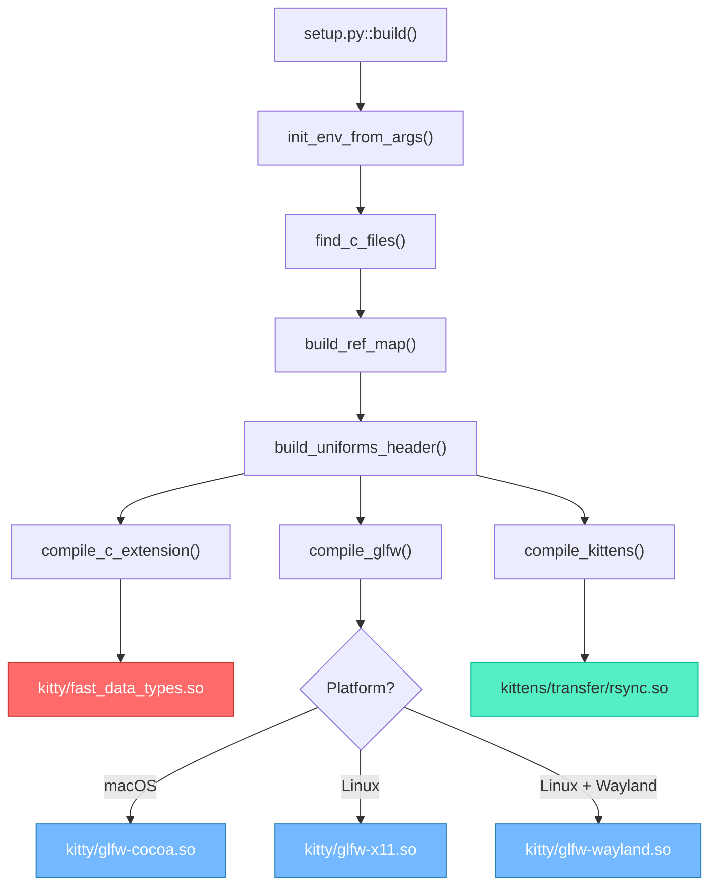
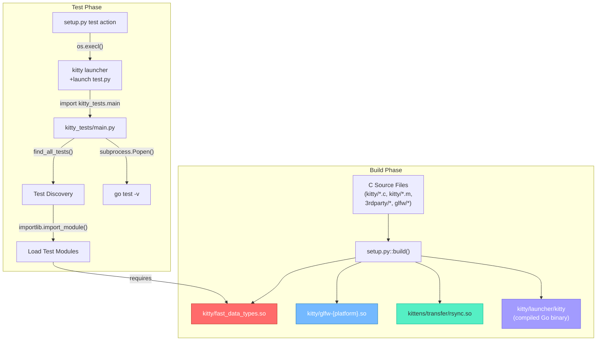
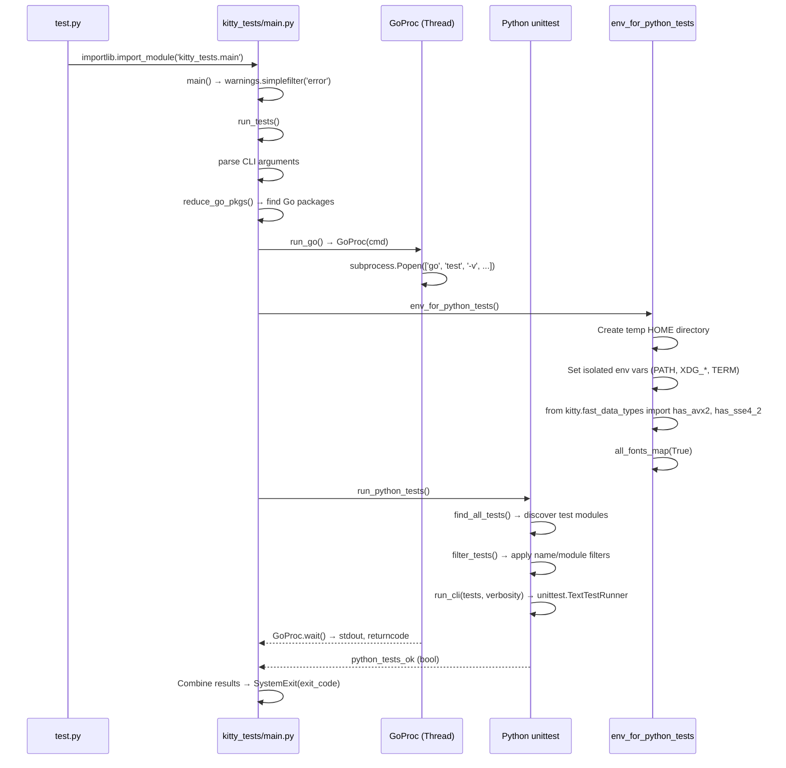
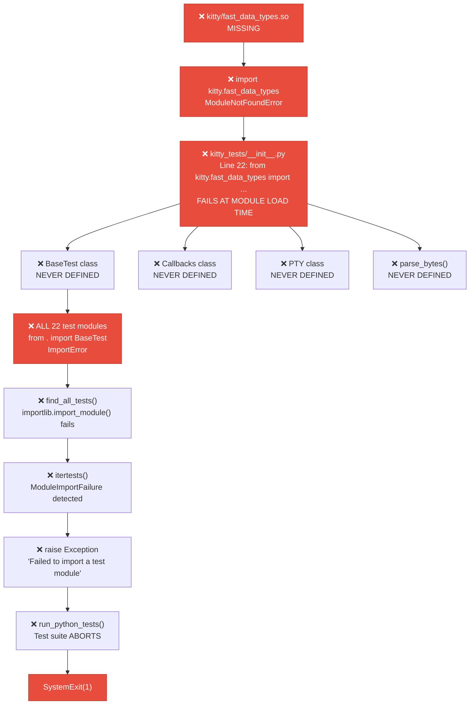
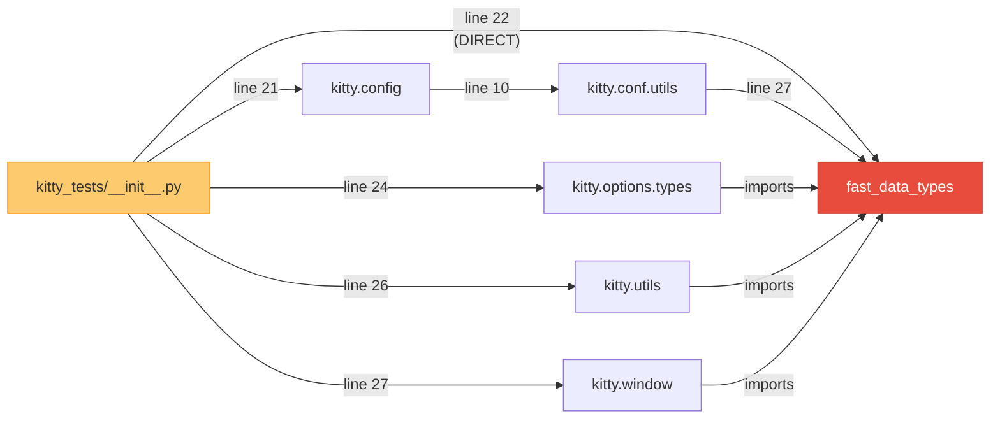
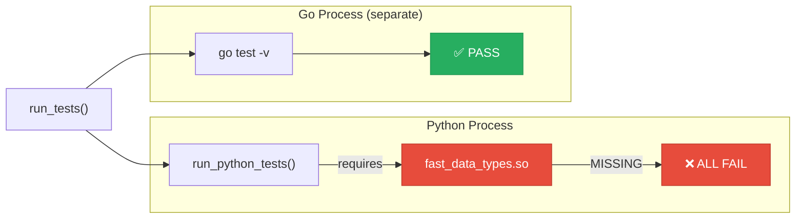

# Kitty C Extension Modules and Test Execution Flow: A Technical Investigation

## Table of Contents

- [1. Introduction and Methodology](#1-introduction-and-methodology)
- [2. Build Architecture](#2-build-architecture)
  - [2.1 The Compilation Pipeline](#21-the-compilation-pipeline)
  - [2.2 C Extension Modules Inventory](#22-c-extension-modules-inventory-3-extension-families)
  - [2.3 The Monolithic fast_data_types Module](#23-the-monolithic-fast_data_types-module)
- [3. Test Architecture](#3-test-architecture)
  - [3.1 Test Runner Orchestration](#31-test-runner-orchestration)
  - [3.2 Test Infrastructure](#32-test-infrastructure-kitty_testsinitpy)
  - [3.3 Go/Python Concurrent Execution Model](#33-gopython-concurrent-execution-model)
- [4. Extension-to-Test Dependency Map](#4-extension-to-test-dependency-map)
  - [4.1 Complete Dependency Matrix](#41-complete-dependency-matrix)
  - [4.2 Classification Summary](#42-classification-summary)
  - [4.3 Import Dependency Graph](#43-import-dependency-graph)
- [5. Failure Cascade Analysis](#5-failure-cascade-analysis)
  - [5.1 What Happens Without fast_data_types.so](#51-what-happens-without-fast_data_typesso)
  - [5.2 The Inescapable BaseTest Dependency](#52-the-inescapable-basetest-dependency)
  - [5.3 Platform-Conditional Initialization Failures](#53-platform-conditional-initialization-failures)
  - [5.4 Go Tests: The Independent Survivor](#54-go-tests-the-independent-survivor)
- [6. Critical vs. Optional Module Classification](#6-critical-vs-optional-module-classification)
  - [6.1 Critical Extension Sub-modules](#61-critical-extension-sub-modules)
  - [6.2 Test-Category-Specific Sub-modules](#62-test-category-specific-sub-modules)
  - [6.3 Theoretical Isolation Analysis](#63-theoretical-isolation-analysis)
- [7. Conclusions](#7-conclusions)

---

## 1. Introduction and Methodology

### Investigation Question

**How do kitty's compiled C extension modules relate to its test execution flow?**

This document is a comprehensive, source-code-grounded technical investigation that traces the relationship between the three families of compiled C extension shared objects produced by kitty's build system and the test suite's discovery, loading, and execution flow. It maps every import chain from every test module back to the compiled extensions, classifies each test module by its dependency depth, and documents the cascading failure behavior that occurs when extensions are unavailable.

### Methodology

This investigation employs the following methodology:

1. **Static source-code tracing** — Every claim is derived from reading the actual source files in the repository. No assumptions are made about runtime behavior that cannot be verified from the code.
2. **AST-level import parsing** — All `import` and `from ... import` statements in every test module have been extracted and traced to their ultimate dependencies.
3. **C source inspection** — The `PyInit_fast_data_types()` function in `kitty/data-types.c` has been inspected line-by-line to inventory every sub-initializer and constant registration.
4. **Transitive dependency chain tracing** — Import chains through intermediate Python modules (e.g., `kitty.config` → `kitty.conf.utils` → `kitty.fast_data_types`) have been traced to determine the full dependency graph.

### Environment Constraints

> **Important:** This analysis was performed in a sandboxed environment that lacks a C compiler (`gcc`/`clang`), development header packages (harfbuzz-dev, libpng-dev, lcms2-dev, freetype-dev, fontconfig-dev, etc.), and a Go compiler. Consequently, no `.so` extension files could be compiled, and no tests could be executed at runtime. All conclusions are derived exclusively from exhaustive source code inspection.

### Version Requirements

- **Python:** `>= 3.8` — Source: `pyproject.toml:2`
- **Go:** `>= 1.22` — Source: `go.mod:3`

### Rationale for Static Analysis Approach

**Thinking:** Because the compiled C extensions cannot be built in this environment, and because the test suite requires these extensions to even *load* (as demonstrated in Section 5), runtime observation is impossible. However, the source code is deterministic — the import statements, function calls, and initialization sequences are fixed in the code and can be traced with complete confidence. Static analysis is therefore both necessary and sufficient for answering the investigation question.

---

## 2. Build Architecture

### 2.1 The Compilation Pipeline

Kitty's build system is orchestrated entirely through `setup.py`, a 2,173-line Python script that serves as the central build coordinator. The `Makefile` provides convenience wrappers that delegate to `setup.py`.

#### The `build()` Entry Point

The primary build function orchestrates three compilation sub-pipelines sequentially:

```python
def build(args: Options, native_optimizations: bool = True, call_init: bool = True) -> None:
    if call_init:
        init_env_from_args(args, native_optimizations)
    sources, headers = find_c_files()
    headers.append(build_ref_map(args.skip_code_generation))
    headers.append(build_uniforms_header(args.skip_code_generation))
    compile_c_extension(
        kitty_env(args), 'kitty/fast_data_types', args.compilation_database, sources, headers,
        build_dsym=args.build_dsym,
    )
    compile_glfw(args.compilation_database, args.build_dsym)
    compile_kittens(args)
```

Source: `setup.py:1084-1095`

**Thinking:** The `build()` function reveals the strict sequencing: first the monolithic `fast_data_types` extension is compiled from all C sources, then GLFW backends are compiled, then kitten extensions. This ordering matters because later steps may depend on headers or build artifacts from earlier steps. The three `compile_*` calls represent the three distinct extension families.

#### Build Pipeline Diagram



#### `find_c_files()` — Source Discovery

The `find_c_files()` function (Source: `setup.py:906-929`) discovers all C and Objective-C source files to compile into `fast_data_types.so`:

```python
def find_c_files() -> Tuple[List[str], List[str]]:
    ans, headers = [], []
    d = 'kitty'
    exclude = {
        'fontconfig.c', 'freetype.c', 'desktop.c', 'freetype_render_ui_text.c'
    } if is_macos else {
        'core_text.m', 'cocoa_window.m', 'macos_process_info.c'
    }
    for x in sorted(os.listdir(d)):
        ext = os.path.splitext(x)[1]
        if ext in ('.c', '.m') and os.path.basename(x) not in exclude:
            ans.append(os.path.join('kitty', x))
        elif ext == '.h':
            headers.append(os.path.join('kitty', x))
    ans.append('kitty/vt-parser-dump.c')

    # ringbuf
    ans.append('3rdparty/ringbuf/ringbuf.c')
    # base64
    ans.extend(glob.glob('3rdparty/base64/lib/arch/*/codec.c'))
    ans.append('3rdparty/base64/lib/tables/tables.c')
    ans.append('3rdparty/base64/lib/codec_choose.c')
    ans.append('3rdparty/base64/lib/lib.c')
    return ans, headers
```

Source: `setup.py:906-929`

**Thinking:** This function reveals a critical design decision: platform-conditional compilation. On macOS, Linux-specific files (`fontconfig.c`, `freetype.c`, `desktop.c`, `freetype_render_ui_text.c`) are excluded; on Linux, macOS-specific files (`core_text.m`, `cocoa_window.m`, `macos_process_info.c`) are excluded. This means the set of C sources compiled into `fast_data_types.so` differs between platforms, which directly affects which sub-initializers are available. Additionally, third-party vendored sources (`3rdparty/ringbuf/`, `3rdparty/base64/`) are compiled directly into the extension.

The source files collected include:
- **All `.c` and `.m` files** from `kitty/` directory (platform-filtered)
- **`kitty/vt-parser-dump.c`** — VT parser diagnostic tool
- **`3rdparty/ringbuf/ringbuf.c`** — Ring buffer implementation
- **`3rdparty/base64/lib/`** — Architecture-specific base64 codec implementations (with SIMD optimizations)

#### `compile_c_extension()` — Object Compilation and Linking

The `compile_c_extension()` function (Source: `setup.py:856-904`) performs two-phase compilation:

**Phase 1 — Object compilation:** Each source file is compiled to a `.o` object file:

```python
objects = [
    os.path.join(build_dir, f'{prefix}-{src.replace("/", "-")}.o')
    for src in sources
]
```

Source: `setup.py:866-869`

**Phase 2 — Linking:** All object files are linked into a single shared object:

```python
dest = os.path.join(build_dir, f'{module}.so')
real_dest = f'{module}.so'
```

Source: `setup.py:883-884`

On macOS with debug builds, a dSYM bundle is also generated for debugging symbols (Source: `setup.py:899-903`).

#### `compile_glfw()` — Platform GLFW Backends

The `compile_glfw()` function (Source: `setup.py:932-954`) compiles GLFW backends:

```python
def compile_glfw(compilation_database: CompilationDatabase, build_dsym: bool = False) -> None:
    modules = 'cocoa' if is_macos else 'x11 wayland'
    for module in modules.split():
        try:
            genv = glfw.init_env(env, pkg_config, pkg_version, at_least_version, test_compile, module)
        except SystemExit as err:
            if module != 'wayland':
                raise
            print(err, file=sys.stderr)
            print(error('Disabling building of wayland backend'), file=sys.stderr)
            continue
        sources = [os.path.join('glfw', x) for x in genv.sources]
        all_headers = [os.path.join('glfw', x) for x in genv.all_headers]
        # ...
        compile_c_extension(
            genv, f'kitty/glfw-{module}', compilation_database,
            sources, all_headers, desc_prefix=f'[{module}] ', build_dsym=build_dsym)
```

Source: `setup.py:932-954`

**Thinking:** Note the error-handling asymmetry: if the Wayland backend fails to build, it is silently disabled with a warning. But if the X11 backend (on Linux) or Cocoa backend (on macOS) fails, the exception propagates and the build fails. This means Wayland support is optional while X11/Cocoa are mandatory for their respective platforms.

#### `compile_kittens()` — Kitten Extensions

The `compile_kittens()` function (Source: `setup.py:967-992`) compiles extension modules for kittens:

```python
def compile_kittens(args: Options) -> None:
    kenv = kittens_env(args)
    # ...
    for kitten, sources, all_headers, dest, includes, libraries in (
        files('transfer', 'rsync', libraries=pkg_config('libxxhash', '--libs'),
              includes=pkg_config('libxxhash', '--cflags-only-I')),
    ):
        final_env = kenv.copy()
        final_env.cflags.extend(includes)
        final_env.ldpaths[:0] = list(libraries)
        compile_c_extension(
            final_env, dest, args.compilation_database, sources,
            all_headers + ['kitty/data-types.h'], build_dsym=args.build_dsym)
```

Source: `setup.py:967-992`

Currently, only one kitten has a C extension: the **transfer (rsync) kitten**, which uses `libxxhash` for fast hashing. The compiled output is `kittens/transfer/rsync.so`.

#### Makefile Convenience Targets

The `Makefile` (Source: `Makefile:12-23`) provides convenience wrappers:

| Make Target | Command | Purpose |
|---|---|---|
| `make all` | `python3 setup.py` | Full build from source |
| `make test` | `python3 setup.py test` | Run full test suite |
| `make clean` | `python3 setup.py clean` | Clean build artifacts |
| `make debug` | `python3 setup.py build --debug` | Debug build with symbols |

Source: `Makefile:12-23`

#### Test Invocation via `setup.py`

When `setup.py` receives the `test` action, it invokes the kitty launcher to run `test.py`:

```python
def do_build(args: Options) -> None:
    launcher_dir = 'kitty/launcher'
    if args.action == 'test':
        texe = os.path.abspath(os.path.join(launcher_dir, 'kitty'))
        os.execl(texe, texe, '+launch', 'test.py')
```

Source: `setup.py:2098-2103`

**Thinking:** The `os.execl()` call replaces the current process with the kitty launcher, which then launches `test.py`. This means the test suite runs *inside* kitty's own launcher environment, ensuring that the compiled extensions are on the Python path and loadable. This is a deliberate design choice — the tests cannot be run with a plain `python3 test.py` invocation because they require the launcher to set up the extension loading environment.

#### Complete Build-to-Test Pipeline

Putting together the full pipeline from source code to test execution:



#### Summary of Build System Commands

| Command | Action | Source |
|---|---|---|
| `python3 setup.py` | Full build (C extensions + Go launcher) | `Makefile:13` |
| `python3 setup.py build --debug` | Debug build with symbols and dSYM | `Makefile:23` |
| `python3 setup.py test` | Build then run test suite via launcher | `setup.py:2101-2103` |
| `python3 setup.py clean` | Remove build artifacts | `setup.py:2104-2106` |
| `python3 setup.py linux-package` | Create Linux distribution package | `Makefile:39-40` |
| `python3 setup.py build --sanitize` | Build with ASAN and UBSAN sanitizers | `Makefile:30` |
| `python3 setup.py build --profile` | Build with profiling instrumentation | `Makefile:33` |

---

### 2.2 C Extension Modules Inventory (3 Extension Families)

Kitty's build system produces three distinct families of compiled C extension shared objects:

| Extension Family | Output File(s) | Build Function | Primary Purpose |
|---|---|---|---|
| **Core Extension** | `kitty/fast_data_types.so` | `compile_c_extension()` | Monolithic hub containing all core C types, functions, and platform integrations |
| **GLFW Backends** | `kitty/glfw-x11.so`, `kitty/glfw-wayland.so` (Linux) or `kitty/glfw-cocoa.so` (macOS) | `compile_glfw()` | Platform-specific windowing and input system backends |
| **Kitten Extensions** | `kittens/transfer/rsync.so` | `compile_kittens()` | File transfer rsync algorithm with xxhash |

Source: `setup.py:1090-1095`

**Thinking:** The architectural significance here is that `fast_data_types.so` is the only extension that is *universally required* by the test suite. The GLFW backends are loaded at runtime when creating windows (not during test infrastructure setup), and `rsync.so` is only used by the file transmission tests. However, as we will see in Section 5, the monolithic nature of `fast_data_types.so` means its absence cascades to block *all* tests.

---

### 2.3 The Monolithic `fast_data_types` Module

The `PyInit_fast_data_types()` function in `kitty/data-types.c` (Source: `kitty/data-types.c:525-612`) is the module initialization entry point that Python calls when `import kitty.fast_data_types` is executed. It registers 33 sub-initializers sequentially, followed by constant definitions.

#### Sub-Initializer Inventory

The following table lists every sub-initializer registered in `PyInit_fast_data_types()`, in their exact order of execution:

| Order | Sub-Initializer | Platform | Purpose | Source Line |
|---|---|---|---|---|
| 1 | `init_monotonic()` | All | Monotonic clock initialization | `data-types.c:538` |
| 2 | `init_logging(m)` | All | Logging subsystem | `data-types.c:540` |
| 3 | `init_LineBuf(m)` | All | Line buffer type registration | `data-types.c:541` |
| 4 | `init_HistoryBuf(m)` | All | History buffer type registration | `data-types.c:542` |
| 5 | `init_Line(m)` | All | Line type registration | `data-types.c:543` |
| 6 | `init_Cursor(m)` | All | Cursor type registration | `data-types.c:544` |
| 7 | `init_Shlex(m)` | All | Shell lexer | `data-types.c:545` |
| 8 | `init_Parser(m)` | All | VT parser | `data-types.c:546` |
| 9 | `init_DiskCache(m)` | All | Disk caching | `data-types.c:547` |
| 10 | `init_child_monitor(m)` | All | Child process monitoring | `data-types.c:548` |
| 11 | `init_ColorProfile(m)` | All | Color profile type (includes `Color` class) | `data-types.c:549` |
| 12 | `init_Screen(m)` | All | Screen type registration | `data-types.c:550` |
| 13 | `init_glfw(m)` | All | GLFW bindings and constants | `data-types.c:551` |
| 14 | `init_child(m)` | All | Child process management | `data-types.c:552` |
| 15 | `init_state(m)` | All | Application state management | `data-types.c:553` |
| 16 | `init_keys(m)` | All | Key handling and encoding | `data-types.c:554` |
| 17 | `init_graphics(m)` | All | Graphics protocol support | `data-types.c:555` |
| 18 | `init_shaders(m)` | All | GPU shader management | `data-types.c:556` |
| 19 | `init_mouse(m)` | All | Mouse event handling | `data-types.c:557` |
| 20 | `init_kittens(m)` | All | Kittens integration | `data-types.c:558` |
| 21 | `init_png_reader(m)` | All | PNG image reading | `data-types.c:559` |
| 22 | `init_macos_process_info(m)` | **macOS only** | macOS process information | `data-types.c:561` |
| 23 | `init_CoreText(m)` | **macOS only** | CoreText font backend | `data-types.c:562` |
| 24 | `init_cocoa(m)` | **macOS only** | Cocoa window management | `data-types.c:563` |
| 25 | `init_freetype_library(m)` | **Linux only** | FreeType font rendering | `data-types.c:565` |
| 26 | `init_fontconfig_library(m)` | **Linux only** | Fontconfig font discovery | `data-types.c:566` |
| 27 | `init_desktop(m)` | **Linux only** | Desktop integration (D-Bus, etc.) | `data-types.c:567` |
| 28 | `init_freetype_render_ui_text(m)` | **Linux only** | FreeType UI text rendering | `data-types.c:568` |
| 29 | `init_fonts(m)` | All | Font subsystem coordination | `data-types.c:570` |
| 30 | `init_utmp(m)` | All | User accounting (utmp) | `data-types.c:571` |
| 31 | `init_loop_utils(m)` | All | Event loop utilities | `data-types.c:572` |
| 32 | `init_crypto_library(m)` | All | Cryptographic operations (AES-256-GCM, X25519) | `data-types.c:573` |
| 33 | `init_systemd_module(m)` | All | Systemd integration | `data-types.c:574` |

Source: `kitty/data-types.c:538-574`

#### ALL-OR-NOTHING Initialization Pattern

> **CRITICAL ARCHITECTURAL POINT:** Every sub-initializer follows the pattern `if (!init_X(m)) return NULL;`. This means that if **any single** `init_*()` call fails, `PyInit_fast_data_types()` returns `NULL` and the **entire module fails to load**. There is no way to load a subset of functionality.

```c
if (!init_logging(m)) return NULL;
if (!init_LineBuf(m)) return NULL;
if (!init_HistoryBuf(m)) return NULL;
if (!init_Line(m)) return NULL;
if (!init_Cursor(m)) return NULL;
// ... (every single one follows this pattern)
if (!init_crypto_library(m)) return NULL;
if (!init_systemd_module(m)) return NULL;
```

Source: `kitty/data-types.c:540-574`

**Thinking:** This all-or-nothing pattern is a performance optimization for the runtime case — by initializing everything upfront in a single module, Python only needs to load one `.so` file and all types/functions are immediately available. The trade-off is that there is zero granularity: you cannot, for example, load just the `Cursor` and `Screen` types without also initializing the crypto library, the systemd module, and all platform-specific backends. This design choice has profound implications for test isolation, as documented in Section 5.

#### Sub-Initializer Dependency Chain Visualization

The following diagram shows the sequential initialization order, highlighting the platform-conditional branch:

```mermaid
flowchart TD
    START["PyInit_fast_data_types()"] --> CHECK["sizeof(CellAttrs) == 2?"]
    CHECK -->|No| FAIL1["return NULL"]
    CHECK -->|Yes| CREATE["PyModule_Create(&module)"]
    CREATE --> ATEXIT["Py_AtExit(run_at_exit_cleanup_functions)"]
    ATEXIT --> MONO["init_monotonic()"]
    MONO --> LOG["init_logging(m)"]
    LOG --> LB["init_LineBuf(m)"]
    LB --> HB["init_HistoryBuf(m)"]
    HB --> LINE["init_Line(m)"]
    LINE --> CUR["init_Cursor(m)"]
    CUR --> SHLEX["init_Shlex(m)"]
    SHLEX --> PARSER["init_Parser(m)"]
    PARSER --> DISK["init_DiskCache(m)"]
    DISK --> CMON["init_child_monitor(m)"]
    CMON --> CP["init_ColorProfile(m)"]
    CP --> SCR["init_Screen(m)"]
    SCR --> GLFW["init_glfw(m)"]
    GLFW --> CHILD["init_child(m)"]
    CHILD --> STATE["init_state(m)"]
    STATE --> KEYS["init_keys(m)"]
    KEYS --> GFX["init_graphics(m)"]
    GFX --> SHADERS["init_shaders(m)"]
    SHADERS --> MOUSE["init_mouse(m)"]
    MOUSE --> KITTENS["init_kittens(m)"]
    KITTENS --> PNG["init_png_reader(m)"]
    PNG --> PLATFORM{"Platform?"}
    
    PLATFORM -->|"__APPLE__"| MACOS1["init_macos_process_info(m)"]
    MACOS1 --> MACOS2["init_CoreText(m)"]
    MACOS2 --> MACOS3["init_cocoa(m)"]
    MACOS3 --> FONTS["init_fonts(m)"]
    
    PLATFORM -->|"Linux/Other"| LINUX1["init_freetype_library(m)"]
    LINUX1 --> LINUX2["init_fontconfig_library(m)"]
    LINUX2 --> LINUX3["init_desktop(m)"]
    LINUX3 --> LINUX4["init_freetype_render_ui_text(m)"]
    LINUX4 --> FONTS
    
    FONTS --> UTMP["init_utmp(m)"]
    UTMP --> LOOP["init_loop_utils(m)"]
    LOOP --> CRYPTO["init_crypto_library(m)"]
    CRYPTO --> SYSD["init_systemd_module(m)"]
    SYSD --> CONSTS["Register Constants"]
    CONSTS --> RETURN["return m ✅"]
    
    style START fill:#2ecc71,stroke:#27ae60,color:#fff
    style FAIL1 fill:#e74c3c,stroke:#c0392b,color:#fff
    style RETURN fill:#2ecc71,stroke:#27ae60,color:#fff
    style PLATFORM fill:#f39c12,stroke:#e67e22,color:#fff
```



**Note:** Every `init_*()` box in this diagram has an implicit error path — if it returns false/NULL, the function immediately returns NULL, terminating the entire initialization sequence. This is the all-or-nothing pattern.

#### Constants Registered After Initialization

After all sub-initializers succeed, `PyInit_fast_data_types()` registers numerous constants into the module namespace:

**Cell attribute constants** (Source: `kitty/data-types.c:577-579`):
- `BOLD`, `ITALIC`, `REVERSE`, `MARK`, `STRIKETHROUGH`, `DIM`, `DECORATION`
- `MARK_MASK`, `DECORATION_MASK`, `NUM_UNDERLINE_STYLES`

**Cursor shape constants** (Source: `kitty/data-types.c:588-591`):
- `CURSOR_BLOCK`, `CURSOR_BEAM`, `CURSOR_UNDERLINE`, `NO_CURSOR_SHAPE`

**Terminal mode constants** (Source: `kitty/data-types.c:592-595`):
- `DECAWM`, `DECCOLM`, `DECOM`, `IRM`

**Escape sequence constants** (Source: `kitty/data-types.c:597-601`):
- `ESC_CSI`, `ESC_OSC`, `ESC_APC`, `ESC_DCS`, `ESC_PM`

**Other constants** (Source: `kitty/data-types.c:596-608`):
- `FILE_TRANSFER_CODE` — File transfer escape code
- `SHM_NAME_MAX` — Platform-dependent shared memory name maximum (30 on macOS, `min(1023, PATH_MAX)` on Linux)
- `ERROR_PREFIX` — String prefix for error messages
- `KITTY_VCS_REV` — Git revision (if compiled with VCS info)

---

## 3. Test Architecture

### 3.1 Test Runner Orchestration

#### Entry Point: `test.py`

The test suite's entry point is `test.py`, a minimal bootstrapper:

```python
#!./kitty/launcher/kitty +launch
# License: GPL v3 Copyright: 2016, Kovid Goyal <kovid at kovidgoyal.net>

import importlib

def main() -> None:
    m = importlib.import_module('kitty_tests.main')
    getattr(m, 'main')()

if __name__ == '__main__':
    main()
```

Source: `test.py:1-13`

**Thinking:** The shebang line `#!./kitty/launcher/kitty +launch` is critically important. It means `test.py` is designed to be executed by kitty's own launcher binary, not by a plain Python interpreter. The `+launch` argument tells the kitty launcher to run the script in its embedded Python environment where the compiled C extensions are loadable. The use of `importlib.import_module()` for lazy loading (rather than a direct `import kitty_tests.main`) provides a clean separation point.

#### Orchestrator: `kitty_tests/main.py`

The `main()` function in `kitty_tests/main.py` initializes the test runner:

```python
def main() -> None:
    import warnings
    warnings.simplefilter('error')
    run_tests()
```

Source: `kitty_tests/main.py:334-338`

**Thinking:** Setting `warnings.simplefilter('error')` converts all Python warnings into exceptions. This is a strict quality measure — any deprecation warning, resource warning, or runtime warning becomes a test failure.

#### `run_tests()` — The Orchestration Hub

The `run_tests()` function (Source: `kitty_tests/main.py:246-279`) performs the following sequence:

1. **Parse CLI arguments** — Accepts name filter, module filter, and verbosity settings
2. **Discover Go test packages** — Calls `reduce_go_pkgs()` → `find_testable_go_packages()` to locate Go test files
3. **Start Go tests concurrently** — If Go packages are found, launches them via `run_go()` → `GoProc(Thread)`
4. **Set up Python test environment** — Calls `env_for_python_tests()` to create an isolated environment
5. **Run Python tests** — Calls `run_python_tests()` → `find_all_tests()` → `unittest`
6. **Report combined results** — Waits for Go tests and reports combined exit code

```python
def run_tests(report_env: bool = False) -> None:
    report_env = report_env or BaseTest.is_ci
    import argparse
    parser = argparse.ArgumentParser()
    parser.add_argument('name', nargs='*', default=[], ...)
    parser.add_argument('--verbosity', default=4, type=int, ...)
    parser.add_argument('--module', default='', ...)
    args = parser.parse_args()
    if args.name and args.name[0] in ('type-check', 'type_check', 'mypy'):
        type_check()
    go_pkgs = reduce_go_pkgs(args.module, args.name)
    os.environ['ASAN_OPTIONS'] = 'detect_leaks=0'
    if go_pkgs:
        go_proc: 'Optional[GoProc]' = run_go(go_pkgs, args.name)
    else:
        go_proc = None
    with env_for_python_tests(report_env):
        if go_pkgs:
            if report_env:
                print('Go executable:', go_exe())
            print('Go packages being tested:', ' '.join(go_pkgs))
        sys.stdout.flush()
        run_python_tests(args, go_proc)
```

Source: `kitty_tests/main.py:246-279`

#### Test Orchestration Sequence Diagram



#### `find_all_tests()` — Test Discovery

The `find_all_tests()` function (Source: `kitty_tests/main.py:57-66`) discovers test modules:

```python
def find_all_tests(package: str = '', excludes: Sequence[str] = ('main', 'gr')) -> unittest.TestSuite:
    suits = []
    if not package:
        package = __name__.rpartition('.')[0] if '.' in __name__ else 'kitty_tests'
    for x in contents(package):
        name, ext = os.path.splitext(x)
        if ext in ('.py', '.pyc') and name not in excludes:
            m = importlib.import_module(package + '.' + x.partition('.')[0])
            suits.append(unittest.defaultTestLoader.loadTestsFromModule(m))
    return unittest.TestSuite(suits)
```

Source: `kitty_tests/main.py:57-66`

**Key behaviors:**
- Iterates all `.py` and `.pyc` files in the `kitty_tests` package
- **Excludes `main.py`** (the runner itself) and **`gr.py`** (a graphics demo, not a test module)
- Uses `importlib.import_module()` to dynamically load each module
- Uses `unittest.defaultTestLoader.loadTestsFromModule()` for class/method discovery

**Thinking:** The use of `importlib.import_module()` means that test discovery is an *import-time* operation. If any test module fails to import (e.g., because `kitty.fast_data_types` is unavailable), the failure manifests as a `ModuleImportFailure` in the test suite. The `itertests()` function explicitly detects this condition.

#### `itertests()` — Import Failure Detection

The `itertests()` function (Source: `kitty_tests/main.py:44-54`) iterates through the test suite and explicitly checks for import failures:

```python
def itertests(suite: unittest.TestSuite) -> Generator[unittest.TestCase, None, None]:
    stack = [suite]
    while stack:
        suite = stack.pop()
        for test in suite:
            if isinstance(test, unittest.TestSuite):
                stack.append(test)
                continue
            if test.__class__.__name__ == 'ModuleImportFailure':
                raise Exception('Failed to import a test module: %s' % test)
            yield test
```

Source: `kitty_tests/main.py:44-54`

**Thinking:** This is a safety net — if any test module fails to import, the test runner raises an immediate exception rather than silently skipping tests. This is why a missing `fast_data_types.so` doesn't just cause individual test failures; it triggers a hard abort of the entire test suite.

#### `env_for_python_tests()` — Environment Isolation

The `env_for_python_tests()` function (Source: `kitty_tests/main.py:297-331`) creates an isolated test environment:

```python
@contextmanager
def env_for_python_tests(report_env: bool = False) -> Iterator[None]:
    gohome = os.path.expanduser('~/go')
    current_home = os.path.expanduser('~') + os.sep
    paths = os.environ.get('PATH', '/usr/local/sbin:/usr/local/bin:/usr/bin').split(os.pathsep)
    path = os.pathsep.join(x for x in paths if not x.startswith(current_home))
    launcher_dir = os.path.join(os.path.dirname(os.path.abspath(__file__)), 'kitty', 'launcher')
    path = f'{launcher_dir}{os.pathsep}{path}'
    python_for_type_check()
    print('Running under CI:', BaseTest.is_ci)
    if report_env:
        print('Using PATH in test environment:', path)
        print('Python:', python_for_type_check())
        from kitty.fast_data_types import has_avx2, has_sse4_2
        print(f'Intrinsics: {has_avx2=} {has_sse4_2=}')
    from kitty.fonts.common import all_fonts_map
    all_fonts_map(True)
    with TemporaryDirectory() as tdir, env_vars(
        HOME=tdir, KT_ORIGINAL_HOME=os.path.expanduser('~'), USERPROFILE=tdir,
        PATH=path, TERM='xterm-kitty',
        XDG_CONFIG_HOME=os.path.join(tdir, '.config'),
        XDG_CONFIG_DIRS=os.path.join(tdir, '.config'),
        XDG_DATA_DIRS=os.path.join(tdir, '.local', 'xdg'),
        XDG_CACHE_HOME=os.path.join(tdir, '.cache'),
        XDG_RUNTIME_DIR=os.path.join(tdir, '.cache', 'run'),
        PYTHONWARNINGS='error',
    ):
        if os.path.isdir(gohome):
            os.symlink(gohome, os.path.join(tdir, os.path.basename(gohome)))
        yield
```

Source: `kitty_tests/main.py:297-331`

**Key observations:**
1. **CPU intrinsics reporting** at line 309: `from kitty.fast_data_types import has_avx2, has_sse4_2` — This is a deferred import of `fast_data_types`, only executed when `report_env` is `True`
2. **Font map initialization** at lines 313-314: `from kitty.fonts.common import all_fonts_map; all_fonts_map(True)` — This initializes the font discovery system before $HOME is replaced
3. **Temporary HOME directory** — Tests run in a clean temporary directory to prevent interference with user configuration
4. **Isolated environment variables** — `XDG_*`, `TERM`, `PYTHONWARNINGS` are all set to test-appropriate values

---

### 3.2 Test Infrastructure (`kitty_tests/__init__.py`)

The `kitty_tests/__init__.py` file (Source: `kitty_tests/__init__.py:1-415`) provides the foundational test infrastructure that every test module depends on.

#### Critical Module-Level Imports

The first 27 lines of `__init__.py` establish the module's dependencies:

```python
import fcntl
import io
import os
import select
import shlex
import shutil
import signal
import struct
import sys
import termios
import time
from contextlib import contextmanager, suppress
from functools import wraps
from pty import CHILD, STDIN_FILENO, STDOUT_FILENO, fork
from typing import Optional
from unittest import TestCase

from kitty.config import finalize_keys, finalize_mouse_mappings
from kitty.fast_data_types import Cursor, HistoryBuf, LineBuf, Screen, get_options, monotonic, set_options
from kitty.options.parse import merge_result_dicts
from kitty.options.types import Options, defaults
from kitty.types import MouseEvent
from kitty.utils import read_screen_size
from kitty.window import decode_cmdline, process_remote_print, process_title_from_child
```

Source: `kitty_tests/__init__.py:1-27`

**Line 21** imports from `kitty.config`, which transitively depends on `fast_data_types` (see Section 5.2).

**Line 22** directly imports seven symbols from `kitty.fast_data_types`:
- `Cursor` — Terminal cursor type
- `HistoryBuf` — Scrollback history buffer
- `LineBuf` — Line buffer type
- `Screen` — Terminal screen model
- `get_options` — Options retrieval function
- `monotonic` — Monotonic clock function
- `set_options` — Options configuration function

**Thinking:** These seven symbols represent the *minimum* set of `fast_data_types` functionality required by the base test infrastructure. `Cursor`, `LineBuf`, `HistoryBuf`, and `Screen` are the core terminal model types used by `create_screen()`, `filled_line_buf()`, `filled_cursor()`, and `filled_history_buf()` helper functions. `get_options` and `set_options` are used by `BaseTest.set_options()` and the `Callbacks.on_mouse_event()` method. `monotonic` provides a high-precision timer.

#### Key Classes

**`Callbacks`** (Source: `kitty_tests/__init__.py:39-165`) — A mock callback handler that simulates the real kitty window callback interface. It handles:
- Write operations (`write()`)
- Bell events (`on_bell()`)
- Mouse events (`on_mouse_event()`)
- Remote print/command/clone/SSH/echo handling
- File transmission

**`BaseTest(TestCase)`** (Source: `kitty_tests/__init__.py:208-256`) — The shared base class for all test classes:

```python
class BaseTest(TestCase):
    ae = TestCase.assertEqual
    maxDiff = 2048
    is_ci = os.environ.get('CI') == 'true'

    def tearDown(self):
        set_options(None)

    def set_options(self, options=None):
        final_options = {'scrollback_pager_history_size': 1024, 'click_interval': 0.5}
        if options:
            final_options.update(options)
        options = Options(merge_result_dicts(defaults._asdict(), final_options))
        finalize_keys(options, {})
        finalize_mouse_mappings(options, {})
        set_options(options)
        return options

    def create_screen(self, cols=5, lines=5, scrollback=5, cell_width=10, cell_height=20, options=None):
        self.set_options(options)
        c = Callbacks()
        s = Screen(c, lines, cols, scrollback, cell_width, cell_height, 0, c)
        return s

    def create_pty(self, argv=None, cols=80, lines=100, scrollback=100, ...):
        self.set_options(options)
        return PTY(argv, lines, cols, scrollback, cell_width, cell_height, ...)
```

Source: `kitty_tests/__init__.py:208-248`

**Thinking:** `BaseTest.create_screen()` directly constructs a `Screen` object (a C extension type), and `BaseTest.set_options()` calls `set_options()` (a C extension function). This means that even the most basic test setup operations depend on `fast_data_types`. The `tearDown()` method calls `set_options(None)` to reset state after each test, which also requires the C extension.

**`PTY`** (Source: `kitty_tests/__init__.py:277-320`) — A pseudo-terminal wrapper that forks a child process and creates a `Screen` connected to it. Used by integration tests that need to simulate terminal I/O.

#### Helper Functions

- **`parse_bytes(screen, data)`** (Source: `kitty_tests/__init__.py:30-36`) — Feeds data through a screen's VT parser
- **`filled_line_buf(ynum, xnum, cursor)`** (Source: `kitty_tests/__init__.py:166-172`) — Creates a pre-filled `LineBuf` for testing
- **`filled_cursor()`** (Source: `kitty_tests/__init__.py:175-181`) — Creates a `Cursor` with all attributes set
- **`filled_history_buf(ynum, xnum, cursor)`** (Source: `kitty_tests/__init__.py:184-189`) — Creates a pre-filled `HistoryBuf`

All of these helper functions directly use `Cursor`, `LineBuf`, `HistoryBuf`, or `Screen` from `fast_data_types`.

---

### 3.3 Go/Python Concurrent Execution Model

#### GoProc Thread

The `GoProc` class (Source: `kitty_tests/main.py:149-182`) manages Go test execution in a separate thread:

```python
class GoProc(Thread):
    def __init__(self, cmd: List[str]):
        super().__init__(name='GoProc')
        from kitty.constants import kitty_exe
        env = os.environ.copy()
        env['KITTY_PATH_TO_KITTY_EXE'] = kitty_exe()
        self.stdout = b''
        self.start_time = time.monotonic()
        self.proc = subprocess.Popen(cmd, stdout=subprocess.PIPE, stderr=subprocess.STDOUT, env=env)
        self.start()

    def run(self) -> None:
        self.stdout, _ = self.proc.communicate()
        self.proc.stdout.close()
```

Source: `kitty_tests/main.py:149-171`

#### Go Test Invocation

The `run_go()` function (Source: `kitty_tests/main.py:185-192`) constructs and launches the Go test command:

```python
def run_go(packages: Set[str], names: str) -> GoProc:
    go = go_exe()
    go_pkg_args = [f'kitty/{x}' for x in packages]
    cmd = [go, 'test', '-v']
    for name in names:
        cmd.extend(('-run', name))
    cmd += go_pkg_args
    return GoProc(cmd)
```

Source: `kitty_tests/main.py:185-192`

**CRITICAL: Go Tests Are Completely Independent**

Go tests run in a completely separate process via `subprocess.Popen()`:

1. They are launched as `go test -v kitty/<package>` — a pure Go binary execution
2. They have **zero dependency** on compiled C Python extensions
3. They communicate with the parent Python process only through `stdout`/`stderr`
4. They set `KITTY_PATH_TO_KITTY_EXE` for tests that need to locate the kitty binary
5. **Go tests can execute successfully even when all Python tests fail** due to missing `.so` files

**Thinking:** This is a fundamental architectural separation. The Go codebase (tools, kittens implemented in Go) has its own test infrastructure using Go's standard `testing` package and third-party libraries like `github.com/google/go-cmp` (Source: `go.mod:11`). The Go tests verify Go code; the Python tests verify Python code and C extensions. The only coupling point is `KITTY_PATH_TO_KITTY_EXE`, which some Go tests use to invoke the kitty binary for integration testing.

---

## 4. Extension-to-Test Dependency Map

### 4.1 Complete Dependency Matrix

The following matrix documents every test module's dependency on `kitty.fast_data_types`. Import statements were verified by inspecting the source code of each file.

| # | Test Module | Direct `fast_data_types` Import | Import Location | Transitive via BaseTest | Key Symbols Used |
|---|---|---|---|---|---|
| 1 | `__init__.py` (BaseTest) | **Yes** | Line 22 | N/A (IS the harness) | `Cursor`, `HistoryBuf`, `LineBuf`, `Screen`, `get_options`, `monotonic`, `set_options` |
| 2 | `datatypes.py` | **Yes** | Lines 9-22 | Yes | `Color`, `ColorProfile`, `HistoryBuf`, `LineBuf`, `expand_ansi_c_escapes`, `parse_input_from_terminal`, `replace_c0_codes_except_nl_space_tab`, `strip_csi`, `truncate_point_for_length`, `wcswidth`, `wcwidth`, `Cursor as C` |
| 3 | `parser.py` | **Yes** | Lines 8-17 | Yes | `CURSOR_BLOCK`, `VT_PARSER_BUFFER_SIZE`, `base64_decode`, `base64_encode`, `has_avx2`, `has_sse4_2`, `test_find_either_of_two_bytes`, `test_utf8_decode_to_sentinel` |
| 4 | `screen.py` | **Yes** | Line 4 | Yes | `DECAWM`, `DECCOLM`, `DECOM`, `IRM`, `VT_PARSER_BUFFER_SIZE`, `Cursor` |
| 5 | `graphics.py` | **Yes** | Line 14 | Yes | `base64_decode`, `base64_encode`, `has_avx2`, `has_sse4_2`, `load_png_data`, `shm_unlink`, `shm_write`, `test_xor64` |
| 6 | `fonts.py` | **Yes** | Line 11 | Yes | `DECAWM`, `get_fallback_font`, `sprite_map_set_layout`, `sprite_map_set_limits`, `test_render_line`, `test_sprite_position_for`, `wcwidth` |
| 7 | `keys.py` | **Yes** | Line 6 | Yes | `import kitty.fast_data_types as defines` — uses `defines.encode_key_for_tty`, `defines.GLFW_MOD_*`, `defines.GLFW_PRESS`, etc. |
| 8 | `mouse.py` | **Yes** | Lines 6-14 | Yes | `GLFW_MOD_ALT`, `GLFW_MOD_CONTROL`, `GLFW_MOUSE_BUTTON_LEFT`, `GLFW_MOUSE_BUTTON_RIGHT`, `create_mock_window`, `mock_mouse_selection`, `send_mock_mouse_event_to_window` |
| 9 | `shell_integration.py` | **Yes** | Line 16 | Yes | `CURSOR_BEAM`, `CURSOR_BLOCK`, `CURSOR_UNDERLINE` |
| 10 | `ssh.py` | **Yes** | Line 16 | Yes | `CURSOR_BEAM`, `shm_unlink` |
| 11 | `options.py` | **Yes** | Line 5 | Yes | `Color` |
| 12 | `shm.py` | **Yes** | Line 9 | Yes | `shm_unlink` |
| 13 | `utmp.py` | **Yes** | Line 3 | Yes | `num_users` |
| 14 | `crypto.py` | **Deferred** (inside test method) | Line 28 | Yes | `AES256GCMDecrypt`, `AES256GCMEncrypt`, `CryptoError`, `EllipticCurveKey` |
| 15 | `check_build.py` | **Deferred** (inside test method) | Line 29 | Yes | `import kitty.fast_data_types as fdt` |
| 16 | `main.py` (runner) | **Deferred** (in `env_for_python_tests`) | Line 309 | Yes | `has_avx2`, `has_sse4_2` |
| 17 | `glfw.py` | **No** direct | — | Yes | Uses `kitty.utils`, `kitty.constants` (transitive) |
| 18 | `clipboard.py` | **No** direct | — | Yes | `kitty.clipboard.WriteRequest` |
| 19 | `completion.py` | **No** direct | — | Yes | `kitty.constants.kitten_exe` |
| 20 | `layout.py` | **No** direct | — | Yes | `kitty.config.defaults`, layout classes, `kitty.window.EdgeWidths` |
| 21 | `file_transmission.py` | **No** direct | — | Yes | `kittens.transfer.rsync`, `kitty.file_transmission`, `kitty.constants` |
| 22 | `open_actions.py` | **No** direct | — | Yes | `kitty.utils.get_editor` |
| 23 | `search_query_parser.py` | **No** direct | — | Yes | `kitty.search_query_parser` (deferred in test method) |
| 24 | `tui.py` | **No** direct | — | Yes | `kittens.tui.line_edit.LineEdit` (deferred in test method) |

### 4.2 Classification Summary

| Category | Count | Modules |
|---|---|---|
| **Direct importers (module level)** | 13 | `__init__`, `datatypes`, `parser`, `screen`, `graphics`, `fonts`, `keys`, `mouse`, `shell_integration`, `ssh`, `options`, `shm`, `utmp` |
| **Deferred importers (inside test methods)** | 3 | `crypto`, `check_build`, `main` |
| **Transitive-only (no direct imports)** | 8 | `glfw`, `clipboard`, `completion`, `layout`, `file_transmission`, `open_actions`, `search_query_parser`, `tui` |

**Total: 24 files in `kitty_tests/`** (22 discovered by `find_all_tests()` + `main.py` runner + `__init__.py` package init; `gr.py` excluded as a demo script)

**Thinking:** The distinction between "deferred" and "module-level" importers is practically irrelevant when `fast_data_types` is missing, because the transitive dependency through `BaseTest` blocks *all* modules regardless. However, the distinction matters for understanding which tests *actively use* C extension functionality versus those that only inherit the dependency through the test infrastructure.

#### Detailed Transitive Import Chain Analysis

For the 8 transitive-only test modules, the dependency on `fast_data_types` flows exclusively through the `BaseTest` import. Here is the specific chain for each:

**`glfw.py`** (Source: `kitty_tests/glfw.py:7`):
```
glfw.py → from . import BaseTest
  → kitty_tests/__init__.py → fast_data_types (line 22)
```
Additionally, `glfw.py` uses `kitty.utils.get_new_os_window_size` (Source: `kitty_tests/glfw.py:16`) which transitively imports `fast_data_types` through `kitty.utils`.

**`clipboard.py`** (Source: `kitty_tests/clipboard.py:5-7`):
```
clipboard.py → from kitty.clipboard import WriteRequest
             → from . import BaseTest
  → kitty_tests/__init__.py → fast_data_types (line 22)
```
`WriteRequest` itself is a pure Python class, but `BaseTest` pulls in the C extension.

**`completion.py`** (Source: `kitty_tests/completion.py:11-13`):
```
completion.py → from kitty.constants import kitten_exe as kitten
              → from . import BaseTest
  → kitty_tests/__init__.py → fast_data_types (line 22)
```
`kitty.constants.kitten_exe` does not directly import `fast_data_types`, but `BaseTest` does.

**`layout.py`** (Source: `kitty_tests/layout.py:4-10`):
```
layout.py → from kitty.config import defaults
          → from kitty.layout.interface import Grid, Horizontal, Splits, Stack, Tall
          → from kitty.window import EdgeWidths
          → from . import BaseTest
  Multiple paths to fast_data_types:
    kitty.config → kitty.conf.utils → fast_data_types.Color
    kitty.window → fast_data_types (multiple symbols)
    BaseTest → fast_data_types
```

**`file_transmission.py`** (Source: `kitty_tests/file_transmission.py:13-19`):
```
file_transmission.py → from kittens.transfer.rsync import Differ, Hasher, Patcher, parse_ftc
                     → from kitty.file_transmission import Action, Compression, ...
                     → from . import PTY, BaseTest
  → kitty_tests/__init__.py → fast_data_types (line 22)
```
Note: `kittens.transfer.rsync` is the *other* compiled extension (`rsync.so`), adding a second extension dependency for this test module.

**`open_actions.py`** (Source: `kitty_tests/open_actions.py:8-10`):
```
open_actions.py → from kitty.utils import get_editor
               → from . import BaseTest
  → kitty_tests/__init__.py → fast_data_types (line 22)
```

**`search_query_parser.py`** (Source: `kitty_tests/search_query_parser.py:4-5`):
```
search_query_parser.py → from . import BaseTest
  → kitty_tests/__init__.py → fast_data_types (line 22)
```
This is the simplest case — the only non-stdlib import is `BaseTest`.

**`tui.py`** (Source: `kitty_tests/tui.py:4-5`):
```
tui.py → from . import BaseTest
  → kitty_tests/__init__.py → fast_data_types (line 22)
```
Like `search_query_parser.py`, the only non-stdlib import is `BaseTest`. The `kittens.tui.line_edit.LineEdit` import is deferred inside the test method (Source: `kitty_tests/tui.py:11`).

#### Extension Usage Depth Analysis

To better visualize the "depth" of C extension usage across test modules, consider this categorization:

| Depth | Description | Modules | Count |
|---|---|---|---|
| **Deep** | Directly exercises C-level test functions (`test_*` exports) | `parser`, `graphics`, `fonts` | 3 |
| **Heavy** | Creates and manipulates C types extensively | `datatypes`, `screen`, `keys`, `mouse` | 4 |
| **Moderate** | Imports C constants and a few symbols | `shell_integration`, `ssh`, `options`, `shm`, `utmp` | 5 |
| **Light** | Only uses C extension via `BaseTest` helpers | `crypto`, `check_build`, `main` (deferred imports) | 3 |
| **None** (direct) | No direct C extension usage; all via `BaseTest` inheritance | `glfw`, `clipboard`, `completion`, `layout`, `file_transmission`, `open_actions`, `search_query_parser`, `tui` | 8 |

**Thinking:** The "deep" category is especially notable — `parser.py`, `graphics.py`, and `fonts.py` invoke dedicated C-level test functions (functions whose names start with `test_`) that are specifically compiled into `fast_data_types` for test validation. These functions (e.g., `test_find_either_of_two_bytes`, `test_utf8_decode_to_sentinel`, `test_xor64`, `test_render_line`, `test_sprite_position_for`) exist solely to allow Python tests to verify C-level correctness. This represents the deepest integration between the C extension and the test suite.

### 4.3 Import Dependency Graph

```mermaid
flowchart TB
    subgraph ext["C Extension"]
        FDT["kitty/fast_data_types.so"]
    end
    
    subgraph harness["Test Infrastructure"]
        INIT["kitty_tests/__init__.py<br/>(BaseTest, PTY, Callbacks)"]
    end
    
    subgraph direct["Direct Importers (Module Level)"]
        DT["datatypes.py"]
        PA["parser.py"]
        SC["screen.py"]
        GR["graphics.py"]
        FO["fonts.py"]
        KE["keys.py"]
        MO["mouse.py"]
        SI["shell_integration.py"]
        SS["ssh.py"]
        OP["options.py"]
        SH["shm.py"]
        UT["utmp.py"]
    end
    
    subgraph deferred["Deferred Importers"]
        CR["crypto.py"]
        CB["check_build.py"]
        MA["main.py (runner)"]
    end
    
    subgraph transitive["Transitive-Only"]
        GL["glfw.py"]
        CL["clipboard.py"]
        CO["completion.py"]
        LA["layout.py"]
        FT["file_transmission.py"]
        OA["open_actions.py"]
        SQ["search_query_parser.py"]
        TU["tui.py"]
    end
    
    INIT -->|"line 22: direct import"| FDT
    INIT -->|"line 21: kitty.config → kitty.conf.utils"| FDT
    
    DT -->|"lines 9-22"| FDT
    PA -->|"lines 8-17"| FDT
    SC -->|"line 4"| FDT
    GR -->|"line 14"| FDT
    FO -->|"line 11"| FDT
    KE -->|"line 6"| FDT
    MO -->|"lines 6-14"| FDT
    SI -->|"line 16"| FDT
    SS -->|"line 16"| FDT
    OP -->|"line 5"| FDT
    SH -->|"line 9"| FDT
    UT -->|"line 3"| FDT
    
    CR -.->|"line 28 (deferred)"| FDT
    CB -.->|"line 29 (deferred)"| FDT
    MA -.->|"line 309 (deferred)"| FDT
    
    DT --> INIT
    PA --> INIT
    SC --> INIT
    GR --> INIT
    FO --> INIT
    KE --> INIT
    MO --> INIT
    SI --> INIT
    SS --> INIT
    OP --> INIT
    SH --> INIT
    UT --> INIT
    CR --> INIT
    CB --> INIT
    GL --> INIT
    CL --> INIT
    CO --> INIT
    LA --> INIT
    FT --> INIT
    OA --> INIT
    SQ --> INIT
    TU --> INIT
    
    style FDT fill:#ff6b6b,stroke:#c0392b,color:#fff
    style INIT fill:#fdcb6e,stroke:#f39c12,color:#333
```



**Legend:**
- **Solid arrows** → Module-level imports (executed at import time)
- **Dashed arrows** → Deferred imports (executed inside test methods)
- **Red node** → The compiled C extension
- **Yellow node** → The test infrastructure (chokepoint)

---

## 5. Failure Cascade Analysis

### 5.1 What Happens Without `fast_data_types.so`

When `kitty/fast_data_types.so` is absent from the filesystem, a cascading failure propagates through the entire Python test suite. This section traces the failure path step by step.

#### Step-by-Step Cascade

**Step 1: Extension Not Found**

When Python encounters `import kitty.fast_data_types` or `from kitty.fast_data_types import ...`, it searches for:
1. `kitty/fast_data_types.py` (pure Python module) — does not exist
2. `kitty/fast_data_types.so` (compiled extension) — does not exist
3. `kitty/fast_data_types/` (package directory) — does not exist

Result: Python raises `ModuleNotFoundError: No module named 'kitty.fast_data_types'`

**Step 2: `kitty_tests/__init__.py` Fails to Load**

Line 22 of `kitty_tests/__init__.py` has a module-level import:

```python
from kitty.fast_data_types import Cursor, HistoryBuf, LineBuf, Screen, get_options, monotonic, set_options
```

Source: `kitty_tests/__init__.py:22`

This import is executed at module load time. When it fails, the entire `kitty_tests/__init__.py` module fails to initialize. Python marks the `kitty_tests` package as failed.

**Step 3: `BaseTest` Becomes Unavailable**

The `BaseTest` class is defined on line 208 of `kitty_tests/__init__.py`. Since the module failed to load in Step 2, `BaseTest` was never defined and is unavailable.

Source: `kitty_tests/__init__.py:208`

**Step 4: All Test Module Imports Fail**

Every test module imports from the `kitty_tests` package:

```python
# In every test module:
from . import BaseTest          # clipboard.py, glfw.py, tui.py, ...
from . import BaseTest, parse_bytes  # parser.py, screen.py, graphics.py, ...
from . import BaseTest, filled_cursor, filled_line_buf, filled_history_buf  # datatypes.py
from . import PTY, BaseTest     # file_transmission.py
```

Since `kitty_tests.__init__` failed, all `from . import ...` statements raise `ImportError`.

**Step 5: `find_all_tests()` Encounters `ModuleImportFailure`**

When `find_all_tests()` calls `importlib.import_module()` for each test module, the failed imports produce `ModuleImportFailure` test objects. The `itertests()` function detects these:

```python
if test.__class__.__name__ == 'ModuleImportFailure':
    raise Exception('Failed to import a test module: %s' % test)
```

Source: `kitty_tests/main.py:52-53`

**Step 6: Test Suite Aborts**

The exception from `itertests()` propagates up through `run_python_tests()`, causing the entire Python test suite to abort with a non-zero exit code.

#### Cascade Result

> **100% of Python test modules fail to load. Zero Python tests can execute.**

#### Failure Cascade Diagram



---

### 5.2 The Inescapable BaseTest Dependency

Even if the direct `fast_data_types` import on line 22 of `__init__.py` were somehow removed, `BaseTest` would still be impossible to import. This is because there are **multiple independent import paths** from `__init__.py` to `fast_data_types`, and ALL must succeed for the module to load.

#### Path 1: Direct Import (Line 22)

```
kitty_tests/__init__.py (line 22)
  └→ from kitty.fast_data_types import Cursor, HistoryBuf, LineBuf, Screen, ...
```

Source: `kitty_tests/__init__.py:22`

#### Path 2: Transitive via `kitty.config` (Line 21)

```
kitty_tests/__init__.py (line 21)
  └→ from kitty.config import finalize_keys, finalize_mouse_mappings
       └→ kitty/config.py (line 10)
            └→ from .conf.utils import BadLine, parse_config_base
                 └→ kitty/conf/utils.py (line 27)
                      └→ from ..fast_data_types import Color
```

Source: `kitty_tests/__init__.py:21` → `kitty/config.py:10` → `kitty/conf/utils.py:27`

#### Path 3: Transitive via `kitty.options.types` (Line 24)

```
kitty_tests/__init__.py (line 24)
  └→ from kitty.options.types import Options, defaults
```

Source: `kitty_tests/__init__.py:24`

The `kitty.options.types` module also imports from `fast_data_types` (verified by inspection of `kitty/options/types.py`).

#### Path 4: Transitive via `kitty.utils` (Line 26)

```
kitty_tests/__init__.py (line 26)
  └→ from kitty.utils import read_screen_size
```

Source: `kitty_tests/__init__.py:26`

The `kitty.utils` module also has imports from `fast_data_types`.

#### Path 5: Transitive via `kitty.window` (Line 27)

```
kitty_tests/__init__.py (line 27)
  └→ from kitty.window import decode_cmdline, process_remote_print, process_title_from_child
```

Source: `kitty_tests/__init__.py:27`

The `kitty.window` module extensively uses `fast_data_types`.

#### Inescapable Dependency Diagram



**Thinking:** The `kitty_tests/__init__.py` module has at least 5 independent paths to `fast_data_types`. Removing any one (or even several) of these paths would not eliminate the dependency. This is not a design flaw but a reflection of the deep integration between kitty's Python code and its C extensions — virtually every significant kitty Python module depends on `fast_data_types` for at least one type or function.

---

### 5.3 Platform-Conditional Initialization Failures

The `PyInit_fast_data_types()` function contains a platform-conditional block:

```c
#ifdef __APPLE__
    if (!init_macos_process_info(m)) return NULL;
    if (!init_CoreText(m)) return NULL;
    if (!init_cocoa(m)) return NULL;
#else
    if (!init_freetype_library(m)) return NULL;
    if (!init_fontconfig_library(m)) return NULL;
    if (!init_desktop(m)) return NULL;
    if (!init_freetype_render_ui_text(m)) return NULL;
#endif
```

Source: `kitty/data-types.c:560-568`

**Implications:**

- **On Linux:** If `libfreetype`, `libfontconfig`, or required desktop integration libraries are missing or incompatible at runtime, the respective `init_*()` function fails, and `PyInit_fast_data_types()` returns `NULL`. The entire module fails to load.

- **On macOS:** If the CoreText framework or Cocoa APIs are unavailable (highly unlikely on a standard macOS installation, but possible in minimal containers), the same cascade occurs.

**Thinking:** Because of the all-or-nothing initialization pattern, a single platform library failure cascades to block all functionality. For example, if a Linux system has `libfreetype` but not `libfontconfig`, the `init_freetype_library()` call would succeed but `init_fontconfig_library()` would fail, and the entire module would return `NULL`. There is no fallback or graceful degradation.

---

### 5.4 Go Tests: The Independent Survivor

While 100% of Python tests fail when `fast_data_types.so` is missing, Go tests are completely unaffected.

**Evidence:**

1. `GoProc.__init__()` launches `go test` as a subprocess via `subprocess.Popen()` (Source: `kitty_tests/main.py:158`)
2. The Go test command is constructed as `[go, 'test', '-v'] + go_pkg_args` (Source: `kitty_tests/main.py:188-191`)
3. Go tests use Go's standard `testing` package and libraries like `github.com/google/go-cmp` (Source: `go.mod:11`)
4. No Python imports or C extension loading occurs in the Go test subprocess

**Thinking:** The Go test runner is launched as a separate process. It does not import any Python modules, does not load any `.so` files, and communicates with the Python parent process only through stdout/stderr pipes. The only shared data point is the `KITTY_PATH_TO_KITTY_EXE` environment variable (Source: `kitty_tests/main.py:155`), which tells Go tests where to find the kitty binary for integration testing.

**Concurrent execution model:**



---

## 6. Critical vs. Optional Module Classification

### 6.1 Critical Extension Sub-modules

Because of the all-or-nothing initialization pattern documented in Section 2.3, **every sub-initializer is effectively critical** — the failure of any single one prevents the entire module from loading, which cascades to block all Python tests.

However, from a *functional dependency* perspective, the following sub-initializers are directly required by the base test harness (`BaseTest`):

| Sub-Initializer | Required By | Import Path | Criticality |
|---|---|---|---|
| `init_Cursor(m)` | `__init__.py:22` | Direct: `from kitty.fast_data_types import Cursor` | **Critical** — Used by `filled_cursor()`, `create_screen()` |
| `init_HistoryBuf(m)` | `__init__.py:22` | Direct: `from kitty.fast_data_types import HistoryBuf` | **Critical** — Used by `filled_history_buf()` |
| `init_LineBuf(m)` | `__init__.py:22` | Direct: `from kitty.fast_data_types import LineBuf` | **Critical** — Used by `filled_line_buf()` |
| `init_Screen(m)` | `__init__.py:22` | Direct: `from kitty.fast_data_types import Screen` | **Critical** — Used by `create_screen()`, `PTY.__init__()` |
| `init_ColorProfile(m)` | `conf/utils.py:27` | Transitive: `kitty.config` → `kitty.conf.utils` → `Color` | **Critical** — `Color` class used by config parsing |
| `init_state(m)` | `__init__.py:22` | Via `get_options`, `set_options` functions | **Critical** — Options management for all tests |
| `init_monotonic()` | `__init__.py:22` | Direct: `from kitty.fast_data_types import monotonic` | **Critical** — Timing function |

Source: `kitty_tests/__init__.py:22`, `kitty/conf/utils.py:27`

**Thinking:** In practice, since all sub-initializers must succeed (all-or-nothing), the classification of "critical" vs "optional" is moot from a runtime perspective. However, this classification is useful for understanding *which* sub-initializers carry the most functional weight. If kitty's architecture were hypothetically refactored to allow partial module loading, these 7 sub-initializers would be the minimum required for the test infrastructure to function.

---

### 6.2 Test-Category-Specific Sub-modules

The following table maps sub-initializers to the specific test modules that consume their functionality:

| Sub-Initializer | Test Module(s) | Symbols Consumed | Usage |
|---|---|---|---|
| `init_graphics(m)` | `graphics.py` | `base64_decode`, `base64_encode`, `load_png_data`, `shm_write`, `shm_unlink`, `test_xor64` | Graphics protocol, PNG handling, shared memory, base64 codec |
| `init_crypto_library(m)` | `crypto.py` | `AES256GCMDecrypt`, `AES256GCMEncrypt`, `CryptoError`, `EllipticCurveKey` | Authenticated encryption, elliptic curve key exchange |
| `init_fonts(m)` | `fonts.py` | `get_fallback_font`, `sprite_map_set_layout`, `sprite_map_set_limits`, `test_render_line`, `test_sprite_position_for`, `wcwidth` | Font rendering pipeline, sprite map management |
| `init_mouse(m)` | `mouse.py` | `create_mock_window`, `mock_mouse_selection`, `send_mock_mouse_event_to_window`, `GLFW_MOUSE_BUTTON_*` | Mouse event simulation and testing |
| `init_keys(m)` | `keys.py` | `encode_key_for_tty`, `GLFW_MOD_*`, `GLFW_PRESS`, `GLFW_REPEAT`, `GLFW_RELEASE` | Key encoding, modifier constants |
| `init_glfw(m)` | `keys.py`, `mouse.py`, `glfw.py` | `GLFW_MOD_*`, `GLFW_MOUSE_BUTTON_*` (constants registered via `init_glfw`) | GLFW windowing constants |
| `init_utmp(m)` | `utmp.py` | `num_users` | User accounting |
| `init_Parser(m)` | `parser.py` | `VT_PARSER_BUFFER_SIZE`, `CURSOR_BLOCK`, `test_find_either_of_two_bytes`, `test_utf8_decode_to_sentinel` | VT parser validation |
| `init_child(m)` | `file_transmission.py` (via `PTY`) | Child process management | PTY child forking |
| `init_child_monitor(m)` | Integration tests using `PTY` | Child process monitoring | Test process lifecycle |
| `init_png_reader(m)` | `graphics.py` | `load_png_data` | PNG image decoding |
| `init_freetype_library(m)` | `fonts.py` (Linux) | Font rendering functions | FreeType font rendering |
| `init_fontconfig_library(m)` | `fonts.py` (Linux) | Font discovery functions | Fontconfig font matching |
| `init_CoreText(m)` | `fonts.py` (macOS) | Font rendering functions | CoreText font backend |
| `init_systemd_module(m)` | None directly | — | Systemd integration (no dedicated test) |
| `init_DiskCache(m)` | None directly | — | Disk caching (tested indirectly) |
| `init_shaders(m)` | `check_build.py` (line 34) | Shader program loading | GPU shader validation |
| `init_kittens(m)` | None directly | — | Kittens integration (tested indirectly) |
| `init_Shlex(m)` | None directly | — | Shell lexer (used by config parsing) |
| `init_logging(m)` | None directly | — | Logging subsystem (always needed) |
| `init_loop_utils(m)` | None directly | — | Event loop utilities |

---

### 6.3 Theoretical Isolation Analysis

**Question:** Which test modules could *theoretically* run without compiled C extensions, if the base harness import chain were somehow satisfied?

The following test modules perform no direct imports from `fast_data_types` at module level and use only pure Python functionality in their test methods:

| Module | What It Tests | Why It Could Theoretically Work |
|---|---|---|
| `search_query_parser.py` | Pure Python `kitty.search_query_parser` module | All imports (`kitty.search_query_parser.ParseException`, `search`) are deferred inside test methods. Source: `kitty_tests/search_query_parser.py:11` |
| `tui.py` | Pure Python `kittens.tui.line_edit.LineEdit` | All imports (`kittens.tui.line_edit.LineEdit`) are deferred inside test methods. Source: `kitty_tests/tui.py:11` |
| `clipboard.py` | `kitty.clipboard.WriteRequest` (pure Python class) | Only imports `WriteRequest` at module level. Source: `kitty_tests/clipboard.py:5` |
| `open_actions.py` | URL/MIME action matching | Only imports `kitty.utils.get_editor` at module level. Source: `kitty_tests/open_actions.py:8` |
| `completion.py` | Kitten CLI completion | Only imports `kitty.constants.kitten_exe` at module level. Tests use subprocess calls. Source: `kitty_tests/completion.py:11` |

**Thinking:** These 5 modules test pure Python functionality that does not inherently require C extensions. Their test methods use string parsing, subprocess invocation, or pure Python data structures. In a hypothetical architecture where `BaseTest` could be loaded without `fast_data_types`, these modules would likely pass their tests without the compiled extension.

**However, this is purely theoretical.** In practice, it is impossible because:

1. Every module does `from . import BaseTest` — Source: verified in each file's import section
2. `BaseTest` is defined in `kitty_tests/__init__.py` — Source: `kitty_tests/__init__.py:208`
3. `kitty_tests/__init__.py` requires `fast_data_types` through at least 5 independent import paths (Section 5.2)
4. There is no mechanism to selectively bypass these imports

The `BaseTest` class itself uses `Screen(...)`, `set_options()`, and `Cursor()` in its `create_screen()` and `set_options()` methods (Source: `kitty_tests/__init__.py:237-240`), making the dependency structural rather than accidental.

---

## 7. Conclusions

### Summary of Findings

1. **Kitty's build system produces three extension families; `fast_data_types.so` is the critical one.**
   - `setup.py::build()` sequentially compiles `kitty/fast_data_types.so` (monolithic core), `kitty/glfw-{x11,wayland,cocoa}.so` (platform GLFW backends), and `kittens/transfer/rsync.so` (rsync kitten). Of these three, only `fast_data_types.so` is required by the test infrastructure.
   - Source: `setup.py:1084-1095`

2. **The extension's monolithic initialization means any failure blocks everything.**
   - `PyInit_fast_data_types()` registers 33 sub-initializers with a strict `if (!init_X(m)) return NULL;` pattern. A single failure in any sub-initializer (including platform-conditional ones like `init_freetype_library` or `init_CoreText`) causes the entire module to fail to load.
   - Source: `kitty/data-types.c:538-574`

3. **The test harness has an inescapable dependency on `fast_data_types` through multiple import paths.**
   - `kitty_tests/__init__.py` imports from `fast_data_types` directly (line 22) and transitively through at least 4 other kitty modules (lines 21, 24, 26, 27). All paths converge on `fast_data_types`. Removing any single path would not eliminate the dependency.
   - Source: `kitty_tests/__init__.py:21-27`, `kitty/config.py:10`, `kitty/conf/utils.py:27`

4. **100% of Python tests fail when the extension is absent — there are zero independent test modules.**
   - All 22 discoverable test modules import `BaseTest` from `kitty_tests/__init__.py`. Since that module cannot load without `fast_data_types`, every test module fails with `ImportError`. The `itertests()` function detects `ModuleImportFailure` and raises a hard exception.
   - Source: `kitty_tests/main.py:52-53`

5. **Only Go tests survive extension compilation failure.**
   - Go tests run in a separate process via `subprocess.Popen(['go', 'test', '-v', ...])` with zero Python or C extension dependencies. They continue to execute regardless of the state of Python test infrastructure.
   - Source: `kitty_tests/main.py:149-192`

6. **The architecture optimizes for runtime performance at the cost of test isolation.**
   - The monolithic `fast_data_types` design (single `.so`, all-or-nothing initialization, 33 tightly coupled sub-modules) minimizes runtime overhead — Python loads one shared library and all types/functions are immediately available. The trade-off is that there is no way to run a subset of tests without the full extension, and no way to load a subset of extension functionality. This is a deliberate architectural choice that reflects kitty's priorities: a production-optimized terminal emulator, not a modular library with independently testable components.

### Architectural Insight

The relationship between kitty's C extensions and its test suite reveals a **monolithic coupling pattern**: a single compiled artifact (`fast_data_types.so`) is the load-bearing dependency for the entire Python test infrastructure. This pattern is common in performance-critical applications where the overhead of multiple small shared libraries or lazy initialization would degrade runtime performance. The cost is paid in test infrastructure flexibility — but for a project like kitty, where the primary goal is a fast, GPU-accelerated terminal emulator, this trade-off is well-justified.

### Architecture Decision Trade-off Matrix

| Design Choice | Runtime Benefit | Test Impact |
|---|---|---|
| **Single monolithic `.so`** | One DLL load, all symbols immediately available | Zero test isolation — all or nothing |
| **Sequential `init_*()` chain** | Deterministic initialization order, catches failures early | Any single init failure blocks everything |
| **`BaseTest` uses C types directly** | Tests exercise real C code paths, not mocks | Impossible to test Python logic without C extension |
| **Platform-conditional compilation** | Minimal binary size, no dead code | Platform switch inside init chain can fail |
| **Go tests in separate process** | True process isolation, no shared state | Go and Python tests cannot share test utilities |

### Relationship to Existing Documentation

The existing `docs/build.rst` (Source: `docs/build.rst`) covers user-facing build instructions (how to install dependencies, how to build from source, how to create packages). It does not document:
- The internal build pipeline architecture
- The extension-to-test dependency graph
- The failure cascade behavior
- The monolithic initialization pattern

This document fills that gap with a developer-facing technical investigation grounded in source code.

### Final Dependency Summary Diagram

```mermaid
flowchart TD
    subgraph build["Build System"]
        SETUP["setup.py::build()"]
    end
    
    subgraph extensions["Compiled Extensions"]
        FDT["kitty/fast_data_types.so<br/>(33 sub-initializers)"]
        GLFW["kitty/glfw-{platform}.so"]
        RSYNC["kittens/transfer/rsync.so"]
    end
    
    subgraph infrastructure["Test Infrastructure"]
        INIT["kitty_tests/__init__.py<br/>(BaseTest, PTY, Callbacks)"]
        MAIN["kitty_tests/main.py<br/>(find_all_tests, run_tests)"]
    end
    
    subgraph tests_direct["13 Direct Importers"]
        D1["datatypes"] 
        D2["parser"]
        D3["screen"]
        D4["graphics"]
        D5["fonts"]
        D6["keys"]
        D7["mouse"]
        D8["shell_integration"]
        D9["ssh"]
        D10["options"]
        D11["shm"]
        D12["utmp"]
    end
    
    subgraph tests_deferred["3 Deferred Importers"]
        F1["crypto"]
        F2["check_build"]
    end
    
    subgraph tests_transitive["8 Transitive-Only"]
        T1["glfw"]
        T2["clipboard"]
        T3["completion"]
        T4["layout"]
        T5["file_transmission"]
        T6["open_actions"]
        T7["search_query_parser"]
        T8["tui"]
    end
    
    subgraph go_tests["Go Tests (Independent)"]
        GO["go test -v kitty/..."]
    end
    
    SETUP --> FDT
    SETUP --> GLFW
    SETUP --> RSYNC
    
    FDT ==>|"REQUIRED"| INIT
    INIT ==>|"BaseTest"| D1 & D2 & D3 & D4 & D5 & D6 & D7 & D8 & D9 & D10 & D11 & D12
    INIT ==>|"BaseTest"| F1 & F2
    INIT ==>|"BaseTest"| T1 & T2 & T3 & T4 & T5 & T6 & T7 & T8
    
    D1 & D2 & D3 & D4 & D5 & D6 & D7 & D8 & D9 & D10 & D11 & D12 -->|"direct import"| FDT
    F1 & F2 -.->|"deferred import"| FDT
    T5 -.->|"requires"| RSYNC
    
    MAIN -->|"orchestrates"| INIT
    MAIN -->|"subprocess.Popen()"| GO
    
    style FDT fill:#e74c3c,stroke:#c0392b,color:#fff
    style INIT fill:#fdcb6e,stroke:#f39c12,color:#333
    style GO fill:#27ae60,stroke:#229954,color:#fff
```



---

## Appendix A: Source File Reference Index

All source files referenced in this document, with their primary contribution to the analysis:

| Source File | Lines Referenced | Primary Contribution |
|---|---|---|
| `setup.py` | 856-904, 906-929, 932-954, 967-992, 1084-1095, 2098-2103 | Build pipeline architecture |
| `kitty/data-types.c` | 525-612 | `PyInit_fast_data_types()` and sub-initializer inventory |
| `kitty_tests/__init__.py` | 1-27, 30-36, 39-165, 166-189, 208-256, 277-320 | Test infrastructure, BaseTest, PTY, helpers |
| `kitty_tests/main.py` | 44-54, 57-66, 149-192, 210-243, 246-279, 297-331, 334-338 | Test runner, discovery, orchestration |
| `kitty/config.py` | 10 | Transitive import chain (→ `conf.utils`) |
| `kitty/conf/utils.py` | 27 | Critical transitive import (`Color`) |
| `test.py` | 1-13 | Test entry point, launcher shebang |
| `Makefile` | 12-23 | Build convenience targets |
| `pyproject.toml` | 2 | Python version requirement |
| `go.mod` | 3, 11 | Go version, `go-cmp` test library |
| `kitty_tests/datatypes.py` | 9-22 | Direct `fast_data_types` imports |
| `kitty_tests/parser.py` | 8-17 | Direct `fast_data_types` imports |
| `kitty_tests/screen.py` | 4 | Direct `fast_data_types` imports |
| `kitty_tests/graphics.py` | 14 | Direct `fast_data_types` imports |
| `kitty_tests/fonts.py` | 11 | Direct `fast_data_types` imports |
| `kitty_tests/keys.py` | 6 | Module-level `fast_data_types as defines` |
| `kitty_tests/mouse.py` | 6-14 | Direct `fast_data_types` imports |
| `kitty_tests/crypto.py` | 7, 28 | Deferred `fast_data_types` import |
| `kitty_tests/shell_integration.py` | 16 | Direct `fast_data_types` imports |
| `kitty_tests/ssh.py` | 16 | Direct `fast_data_types` imports |
| `kitty_tests/options.py` | 5 | Direct `fast_data_types` import (`Color`) |
| `kitty_tests/shm.py` | 9 | Direct `fast_data_types` import (`shm_unlink`) |
| `kitty_tests/utmp.py` | 3 | Direct `fast_data_types` import (`num_users`) |
| `kitty_tests/check_build.py` | 12, 29 | Deferred `fast_data_types` import |
| `kitty_tests/glfw.py` | 7 | Transitive-only (via `BaseTest`) |
| `kitty_tests/clipboard.py` | 5-7 | Transitive-only (via `BaseTest`) |
| `kitty_tests/completion.py` | 11-13 | Transitive-only (via `BaseTest`) |
| `kitty_tests/layout.py` | 4-10 | Transitive-only (via `BaseTest`) + `kitty.config` |
| `kitty_tests/file_transmission.py` | 13-19 | Transitive (via `BaseTest`) + `rsync.so` dependency |
| `kitty_tests/open_actions.py` | 8-10 | Transitive-only (via `BaseTest`) |
| `kitty_tests/search_query_parser.py` | 4-5 | Transitive-only (via `BaseTest`) |
| `kitty_tests/tui.py` | 4-5 | Transitive-only (via `BaseTest`) |

---

## Appendix B: Glossary

| Term | Definition |
|---|---|
| **`fast_data_types`** | The monolithic C extension module (`kitty/fast_data_types.so`) containing all core C types and functions exposed to Python |
| **Sub-initializer** | A C function (`init_*()`) called during `PyInit_fast_data_types()` to register types, functions, and constants into the Python module |
| **BaseTest** | The `unittest.TestCase` subclass in `kitty_tests/__init__.py` that all test classes inherit from |
| **Transitive dependency** | A dependency that exists not through a direct import, but through an intermediate module's import chain |
| **Module-level import** | An import statement at the top of a Python file, executed when the module is first loaded |
| **Deferred import** | An import statement inside a function or method body, executed only when that function/method is called |
| **All-or-nothing initialization** | The pattern where every sub-initializer must succeed or the entire module fails to load |
| **GLFW** | Graphics Library Framework — the windowing toolkit used by kitty for OS window management |
| **GoProc** | The `Thread` subclass in `kitty_tests/main.py` that manages concurrent Go test execution |
| **`ModuleImportFailure`** | A sentinel test class created by `unittest` when a test module fails to import |
| **PTY** | Pseudo-terminal — the `PTY` class in `kitty_tests/__init__.py` creates a pseudo-terminal pair for integration testing |
| **rsync.so** | The compiled C extension for the file transfer kitten, providing rsync algorithms with xxhash |

---

*This document was generated through static source-code analysis of the kitty repository. All claims are grounded in specific source file locations and have been verified through direct inspection of the codebase. No runtime observations were possible due to the absence of a C compiler and development libraries in the analysis environment.*
