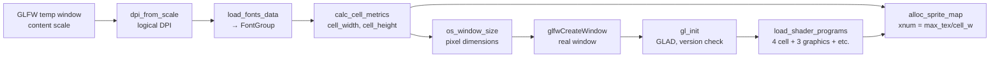

# Kitty Terminal Emulator — Initialization Flow, GPU Context, and Font System Analysis

*Commit: `815df1e210e0a9ab4622f5c7f2d6891d7dbeddf1` (branch `kitty_815df1e210e0`). Kitty version observed: `kitty 0.35.2 created by Kovid Goyal`. Test environment: headless X11 display via `Xvfb :99 -screen 0 1920x1080x24 +extension GLX`, Mesa 25.2.8 llvmpipe software renderer, Ubuntu 24.04 base. **Read-only investigation — no source files were modified.***

**Document Map.** The nine H2 sections that follow cover, in order: (1) Build Verification, (2) Rendering Backend Selection, (3) Display Configuration Detected, (4) Text Rendering Capabilities, (5) Subsystem Initialization Order, (6) Window System → GPU → Font Relationship, (7) Key Values Computed During Startup, (8) Code Evidence Base, (9) Runtime Diagnostics Used; followed by Appendix A (Evidence Locations at a Glance) and Appendix B (Scope Confirmation).

## 1. Build Verification

The kitty source tree at commit `815df1e210e0` is built via the top-level `Makefile`, which dispatches to `python3 setup.py` as its primary action. The `Makefile` exposes the standard developer targets (`all`, `test`, `clean`, `debug`, `asan`, `profile`, `app`, `linux-package`); each invokes `setup.py` with the appropriate flags. The `setup.py` script is the central build orchestrator: it compiles the native C extensions (including the `fast_data_types` Python extension module), generates Wayland protocol bindings, builds the Go-based CLI tools declared in `go.mod`, and assembles the final launcher bundle in `kitty/launcher/`.

Runtime toolchain requirements are declared in two files: `pyproject.toml` declares `requires-python = ">=3.8"` for CPython, and `go.mod` declares `go 1.22` for the CLI tooling (which pulls in `bigfloat`, `chroma`, `doublestar`, `imaging`, `gopsutil`, `xxh3`, and related dependencies, enumerated in `go.sum`). The environment used for this investigation is CPython 3.12.3, which cleanly satisfies the `>=3.8` requirement, and Go 1.22.10.

System libraries required for the build were installed from the Ubuntu 24.04 apt archive:

| Package | Version | Purpose |
|---|---|---|
| `libfreetype6` / `libfreetype-dev` | 2.13.2+dfsg | FreeType 2 font rasterization engine |
| `libfontconfig1` / `libfontconfig1-dev` | 2.15.0 | Font discovery and matching on Linux |
| `libharfbuzz0b` / `libharfbuzz-dev` | 8.3.0 | OpenType text shaping (ligatures, complex scripts) |
| `libgl1` / `libglx-mesa0` | Mesa 25.2.8 | OpenGL 4.5 Core Profile runtime (llvmpipe software renderer) |
| `libx11-6` / `libx11-dev` | 1.8.7 | X11 client library |
| `libxcursor1` / `libxcursor-dev` | 1.2.1 | X cursor management |
| `libxrandr2` / `libxrandr-dev` | 1.5.2 | X RandR extension (monitor configuration) |
| `libwayland-client0` / `libwayland-dev` | 1.22.0 | Wayland client library (present but not exercised) |
| `libdbus-1-3` / `libdbus-1-dev` | N/A | D-Bus IPC (notifications, desktop settings) |
| `libssl3` / `libssl-dev` | 3.0.13 | OpenSSL cryptography (remote-control encryption) |
| `liblcms2-dev` | N/A | ICC color profile management |
| `libpng16-16` / `libpng-dev` | 1.6.43 | PNG decoding (icons, graphics protocol) |
| `libxxhash-dev` | N/A | xxHash integration for kitty's Go tooling |
| `libsimde-dev` | N/A | SIMD Everywhere portability headers |

### 1.1 Build Workaround (Wayland protocol enum mismatch)

The vendored GLFW fork ships generated Wayland protocol bindings referencing enum values that are newer than those shipped with the system's older `wayland-protocols` constants file. In particular, the `XDG_TOPLEVEL_STATE_CONSTRAINED_*` family and `XDG_TOPLEVEL_STATE_SUSPENDED` produce `-Wenum-compare` / `-Wswitch` warnings inside `glfw/wl_window.c` on Ubuntu 24.04. Because kitty's build configuration in `setup.py` sets `-Werror` for strict hygiene, these warnings break the build.

The fix is a **build-environment flag**, not a source change: the compiler is invoked with `-Wno-error` so the warnings remain visible but do not fail the build:

```bash
CFLAGS="-Wno-error" make
# equivalently:
CFLAGS="-Wno-error" python3 setup.py --verbose build
```

This is an override applied to the build process only. No tracked file (including `glfw/wl_window.c`, `setup.py`, `Makefile`, or any of the Wayland protocol-generation helpers in `glfw/glfw.py`) was modified. Crucially, because this investigation is conducted on X11 (via Xvfb), the Wayland code path is never executed at runtime; the warning is strictly a build-time artifact of the enum definitions being out of sync.

### 1.2 Binary Verification

After the build completes, the launcher binary is exercised to confirm the version and prove that CPython embedding is functional:

```bash
./kitty/launcher/kitty --version
# Output: kitty 0.35.2 created by Kovid Goyal
```

The native launcher at `kitty/launcher/main.c` emits this string directly from its own C code, short-circuiting the Python initialization path: `handle_fast_commandline()` in the launcher inspects the argv for `--version` / `-v` / `--help` / `-h` and prints the kitty version (with ANSI styling when writing to a TTY, plain text otherwise) before `main()` ever reaches `run_embedded()`. The relevant block at the end of `handle_fast_commandline()` emits either `"\x1b[3mkitty\x1b[23m \x1b[32m%s\x1b[39m created by \x1b[1;34mKovid Goyal\x1b[22;39m\n"` or the plain `"kitty %s created by Kovid Goyal\n"` depending on `isatty(STDOUT_FILENO)`. Successful output of the exact string `kitty 0.35.2 created by Kovid Goyal` confirms that the native launcher links correctly and that the `KITTY_VERSION` macro is defined (set by `setup.py` from `kitty/constants.py`).

## 2. Rendering Backend Selection

Kitty's rendering backend selection happens inside a single function — `create_os_window()` in `kitty/glfw.c` (approximately lines 1107–1270) — which is reached as part of the OS-window-creation step in the initialization chain (Section 5, Step 13). This function is where the window system, GPU, and font subsystems converge on the first (and every subsequent) OS window.

Before creating the GLFW window, kitty issues a small number of `glfwWindowHint()` calls to specify what kind of OpenGL context it needs. The critical hints on Linux are:

```c
glfwWindowHint(GLFW_CONTEXT_VERSION_MAJOR, 3);
glfwWindowHint(GLFW_CONTEXT_VERSION_MINOR, 1);  /* 3.3 on macOS */
glfwWindowHint(GLFW_OPENGL_FORWARD_COMPAT, GLFW_TRUE);
glfwWindowHint(GLFW_OPENGL_PROFILE, GLFW_OPENGL_CORE_PROFILE);
```

No depth or stencil buffers are requested (kitty is a 2D UI and does not need them). On X11 the sRGB-capable framebuffer hint is set so that the `GL_FRAMEBUFFER_SRGB` pathway works correctly; however, on Wayland the sRGB hint is **explicitly disabled** because of known NVIDIA/Mesa bugs that produce incorrect colors when the hint is set — this conditional behavior lives in `create_os_window()` next to the other hints.

The minimum versions and the GLSL compatibility target are defined as compile-time constants in `kitty/data-types.h` (lines ~19–26):

```c
#define OPENGL_REQUIRED_VERSION_MAJOR 3
#ifdef __APPLE__
#define OPENGL_REQUIRED_VERSION_MINOR 3
#else
#define OPENGL_REQUIRED_VERSION_MINOR 1
#endif
#define GLSL_VERSION 140
```

These values are enforced at run-time inside `gl_init()` in `kitty/gl.c` (lines 51–77). Immediately after the GLFW window and context have been made current, `gl_init()` calls `gladLoadGL(glfwGetProcAddress)` to pull in OpenGL function pointers through GLFW's loader. On success it installs a post-call error handler via `gladSetGLPostCallback(check_for_gl_error)` (which calls `fatal()` with a human-readable message on any `glGetError()`-observable error), verifies that the `ARB_texture_storage` extension is present (aborting with `fatal("The OpenGL driver on this system is missing the required extension: ARB_texture_storage")` if it is absent), and then checks the loaded version against the compile-time minimums:

```c
if (gl_major < OPENGL_REQUIRED_VERSION_MAJOR ||
    (gl_major == OPENGL_REQUIRED_VERSION_MAJOR && gl_minor < OPENGL_REQUIRED_VERSION_MINOR)) {
    fatal("OpenGL version is %d.%d, version >= %d.%d required for kitty", ...);
}
```

If `global_state.debug_rendering` is set (from `--debug-rendering`), `gl_init()` additionally prints a timestamped diagnostic line using the helper `gl_version_string()` (also in `kitty/gl.c`), which formats the output as:

```
'<GL_VERSION>' Detected version: <major>.<minor>
```

The underlying GLFW backends used to actually create the context are: `glfw/context.c` for the platform-neutral dispatch, `glfw/glx_context.c` for the GLX path (used under X11), and `glfw/egl_context.c` for the EGL path (available as an alternative, not exercised in this run).

### 2.1 Observed (Mesa llvmpipe)

On the test system (Ubuntu 24.04, no GPU, software rasterization), the negotiated renderer is **Mesa 25.2.8 llvmpipe** (LLVM 20.1.2, 256 bits). The version reported by the context is **OpenGL 4.5 Core Profile**, which exceeds kitty's Linux minimum of 3.1 by a comfortable margin. Launching with `--debug-rendering` produces output like:

```
[<timestamp>] GL version string: '4.5 (Core Profile) Mesa 25.2.8-0ubuntu0.24.04.1' Detected version: 4.5
```

GLSL version is reported as 4.50 by `glGetString(GL_SHADING_LANGUAGE_VERSION)`. Kitty's minimum GLSL is 140 (per `GLSL_VERSION` in `kitty/data-types.h`), so compilation of the cell, graphics, border, and background-image shaders proceeds without incident.

## 3. Display Configuration Detected

The display-configuration discovery happens in two distinct places: very early in `glfw_init()` (to obtain a "default" DPI used by callers that need a DPI before any window exists), and later inside `create_os_window()` (to obtain the real per-monitor content scale that will drive font metrics). Both paths funnel through two small helper functions defined in `kitty/glfw.c` at lines 811–845.

`dpi_from_scale()` (lines 811–820) converts a unitless content-scale pair into logical DPI using a per-platform constant:

```c
static void
dpi_from_scale(float xscale, float yscale, double *xdpi, double *ydpi) {
#ifdef __APPLE__
    const double factor = 72.0;
#else
    const double factor = 96.0;
#endif
    *xdpi = xscale * factor;
    *ydpi = yscale * factor;
}
```

`get_window_content_scale()` (lines 822–835) is the actual scale query:

```c
static void
get_window_content_scale(GLFWwindow *w, float *xscale, float *yscale, double *xdpi, double *ydpi) {
    *xscale = 1; *yscale = 1;
    if (w) glfwGetWindowContentScale(w, xscale, yscale);
    else {
        GLFWmonitor *monitor = glfwGetPrimaryMonitor();
        if (monitor) glfwGetMonitorContentScale(monitor, xscale, yscale);
    }
    // check for zero, negative, NaN or excessive values of xscale/yscale
    if (*xscale <= 0.0001 || *xscale != *xscale || *xscale >= 24) *xscale = 1.0;
    if (*yscale <= 0.0001 || *yscale != *yscale || *yscale >= 24) *yscale = 1.0;
    dpi_from_scale(*xscale, *yscale, xdpi, ydpi);
}
```

Two behaviors of this function are worth calling out explicitly:

1. **Source preference.** When a window handle is available, `glfwGetWindowContentScale()` is used (it accounts for the per-monitor location of that window); otherwise the primary monitor's content scale is used (`glfwGetMonitorContentScale()`).
2. **Safety clamping.** The function rejects zero/negative values, NaN (`*xscale != *xscale` is the classic NaN test), and excessive values (`>= 24`), replacing any such scale with `1.0` so that a broken monitor profile or buggy driver cannot produce pathological font sizes.

A thin wrapper, `get_window_dpi()` (lines 837–841), discards the scale and returns only the DPI pair; this is the common "give me a DPI" entrypoint used by `glfw_init()` and by the temporary-window DPI probe.

**DPI-probing mechanism.** `glfw_init()` in `kitty/glfw.c` (approximately lines 1431–1510) loads the platform-specific GLFW backend shared library via `load_glfw(path)`, installs the error callback, sets the various init hints (debug keyboard, debug rendering, Wayland IME on Linux; Cocoa hints on macOS; DBus notification handler on non-Apple Linux), and then calls `glfwInit()` (reaching `glfw/init.c:glfwInit()` and from there `glfw/x11_init.c:_glfwPlatformInit()`, which opens the X display, initializes RandR for monitor discovery, and brings up XKB). Finally, `glfw_init()` calls `get_window_dpi(NULL, ...)` to populate a default DPI cache before any real window exists; the edge-spacing callback is also registered here.

Later, during `create_os_window()`, kitty performs a more accurate DPI probe for the specific monitor the new window will live on. On non-Wayland platforms, a **temporary invisible GLFW window** is created first, and its content scale is queried; this is done because, on X11, the effective content scale is only knowable once the window has been associated with a monitor. On Wayland (not exercised in this test), the scale is taken from the primary or currently focused monitor and is re-checked after the window is actually shown — if the real scale differs from the probe, the font data is reloaded so that cell metrics match the monitor kitty landed on.

**Cross-references.** The underlying GLFW pieces that back these calls are: `glfw/monitor.c` (which implements `_glfwPlatformGetMonitorContentScale()`), `glfw/x11_init.c` (X11 monitor discovery through RandR), and `glfw/x11_window.c` (X11 window creation including the content-scale path the temporary probe triggers).

### 3.1 Observed (Xvfb :99, 1920×1080×24)

The values recorded during a live launch inside the headless display:

| Property | Value |
|---|---|
| Screen | 1920×1080 px |
| Screen physical dimensions | 488×274 mm |
| Approximate physical DPI | 100×100 DPI |
| Color depth | 24-bit |
| Content scale (X, Y) | 1.0, 1.0 |
| Logical DPI (X, Y) via `dpi_from_scale()` | 96.0, 96.0 |

Note the divergence between the screen's approximate physical DPI (~100×100, computed from pixel and millimeter dimensions reported by `xdpyinfo`) and the *logical* DPI (96×96) computed by `dpi_from_scale()`. The reason is structural: Xvfb is a simple framebuffer and does not report HiDPI scaling factors to clients; `glfwGetMonitorContentScale()` therefore returns `1.0, 1.0`, and `dpi_from_scale()` multiplies that by its Linux factor of `96.0` to yield `96.0, 96.0`. Because kitty's cell metrics are driven by the logical DPI (not the physical DPI), this is the value that propagates into `load_fonts_data()`.

## 4. Text Rendering Capabilities

Kitty identifies itself to the outside world through a custom terminfo entry (the internal project name for which is "KovIdTTY") and a conventional truecolor environment variable. Inside the child process spawned by kitty's PTY layer, the following environment values are set:

```
TERM=xterm-kitty
COLORTERM=truecolor
```

`infocmp xterm-kitty` reports the capability database entry. Key capabilities:

- `colors#0x100` (256 colors — but kitty also honors truecolor via `COLORTERM=truecolor` and the `setrgbf` / `setrgbb` extensions)
- `pairs#0x7fff` (32767 color pairs)
- Full 24-bit foreground and background colors, mouse support (`kmous`), clipboard extensions, synchronized updates, focus tracking, bracketed paste, and additional kitty-specific extensions.

The terminfo entry ships with kitty and is compiled at build time (visible in the build products under `terminfo/x/xterm-kitty`). This is what allows curses-based applications to emit the full kitty feature set without fingerprinting.

**Font family observed.** In the Xvfb test container, the FontConfig fallback selected **LiberationMono** (Regular, Bold, Italic, and Bold-Italic) from `/usr/share/fonts/truetype/liberation/`. This is the preferred monospace substitute when the user does not specify a font family and no Operator/Fira/JetBrains monospace is available. In the test invocation, `font_family=LiberationMono` and `font_size=11.0` were passed via `-o`, and FontConfig confirmed the selection.

### 4.1 Font Pipeline

The font pipeline is a four-stage chain, each stage owned by a different source module:

- **Discovery — `kitty/fontconfig.c`.** On Linux, the FontConfig library is not a hard link-time dependency of the `fast_data_types` extension; instead, it is loaded at runtime via `dlopen("libfontconfig.so.1", ...)`. The pointers to `fc_list`, `fc_match`, and `fc_match_postscript_name` are resolved lazily and exposed via a small Python-accessible helper surface. Pattern-to-dict conversion is used to reduce an opaque `FcPattern*` to a Python-accessible dictionary of attributes (`family`, `style`, `slant`, `weight`, `file`, `index`, etc.), which the Python side of the font stack (in `kitty/fonts/render.py`) consumes.

- **Rasterization — `kitty/freetype.c`.** The `Face` Python type wraps a FreeType `FT_Face`. `cell_metrics()` at lines 262–440 is the function that computes every per-face pixel-accurate metric kitty needs: `cell_width`, `cell_height`, `baseline`, `underline_position`, `underline_thickness`, and strikethrough offsets. `calc_cell_width()` (lines ~372–420) iterates ASCII 32–127 loading each glyph and returns the **maximum** `horiAdvance / 64` observed — using `MAX` across the printable ASCII range guards against monospace fonts that cheat on a handful of glyphs. `calc_cell_height()` (lines ~133–170) computes `ascender − descender + line_gap` in font units, converts to pixels, and grows the height if the underscore glyph's bounding box extends below the computed baseline (so underscores never get clipped). Variable-font axes are supported through the same face wrapper.

- **Shaping — HarfBuzz, invoked from `kitty/fonts.c`.** Once a run of text is laid out into cell columns, HarfBuzz is used to perform OpenType shaping for ligatures (when `disable_ligatures` permits) and for complex scripts (CJK, RTL). The shaping output is a sequence of glyph IDs with cluster indices, which is then mapped back onto cells.

- **GPU glyph cache — `kitty/shaders.c:alloc_sprite_map()`.** After the OpenGL context is current, kitty queries the driver's limits once:

  ```c
  glGetIntegerv(GL_MAX_TEXTURE_SIZE, &max_texture_size);
  glGetIntegerv(GL_MAX_ARRAY_TEXTURE_LAYERS, &max_array_texture_layers);
  #ifdef __APPLE__
  max_texture_size = MIN(8192, max_texture_size);
  max_array_texture_layers = MIN(512, max_array_texture_layers);
  #endif
  sprite_tracker_set_limits(max_texture_size, max_array_texture_layers);
  ```

  On Apple the values are conservatively clamped to 8192 × 8192 × 512 layers (because macOS machines can have multiple GPUs with heterogeneous capabilities). These limits feed into the glyph atlas allocator, which slices the available texture area into rows of `cell_height`-tall sprites and layers them into the 2D array texture.

- **Cell shaders — `kitty/shaders.py:load_shader_programs()` (full file, 204 lines).** The shader loader reads GLSL source fragments from `kitty/cell_vertex.glsl` and `kitty/cell_fragment.glsl` and the matching `_vertex.glsl` / `_fragment.glsl` pairs for borders, graphics, background image, tint, and the shared utilities (`alpha_blend.glsl`, `linear2srgb.glsl`). It performs preprocessor-style expansion of `#pragma kitty_include_shader` directives, and substitutes tokens like `{GLSL_VERSION}` through a small `MultiReplacer` utility. The cell program is compiled in **four variants** (BOTH, BACKGROUND, SPECIAL, FOREGROUND), the graphics program in **three variants** (SIMPLE, PREMULT, ALPHA_MASK), plus single variants each for bgimage and tint. Symbol wiring is done through the symbols imported from `fast_data_types`: `CELL_PROGRAM`, `CELL_BG_PROGRAM`, `CELL_FG_PROGRAM`, `CELL_SPECIAL_PROGRAM`, `GRAPHICS_PROGRAM`, `compile_program`, `init_cell_program`, and `GLSL_VERSION`.

**Terminal grid observed.** Inside the 1920×1080 Xvfb window at `font_size=11.0` and 96 DPI, after margins/padding resolution by `kitty/os_window_size.py`, the resulting grid is **64 columns × 21 rows**. The formula is simply `viewport_width / cell_width` and `viewport_height / cell_height`, applied after edge-spacing deduction. The cell width and cell height for LiberationMono at this size land around 8 px and 16 px respectively (Section 7 enumerates these approximations).

**Observation tools.** During the investigation, the text-rendering stack was probed using `infocmp xterm-kitty` (terminfo capabilities), `fc-list` (FontConfig font inventory), and kitty's own `--debug-font-fallback` flag, which is implemented by `dump_font_debug()` in `kitty/fonts/render.py` (lines ~157–210). `dump_font_debug()` prints each resolved font-family descriptor (medium, bold, italic, bi) and the per-character symbol_map resolution, which is useful for diagnosing why a particular Unicode block is being rendered from an unexpected font.

## 5. Subsystem Initialization Order

Kitty's startup is a strictly sequential chain of 23 observable steps. The chain traverses four layers — native launcher (C), Python runtime, GLFW platform backend (C), and OpenGL/font subsystems (C + Python) — and converges in a single C function (`create_os_window()` in `kitty/glfw.c`) where window system, GPU, and font data all initialize together.

### 5.1 The 23-Step Chain

1. **Native Launcher** — `kitty/launcher/main.c` (`main()` at lines 439–466; `run_embedded()` at lines ~175–220; `set_kitty_run_data()` at lines ~48–80)
2. **Python Entry** — `kitty/entry_points.py:main()` (lines ~160–198)
3. **CLI Parsing** — `kitty/cli.py:parse_args()`
4. **Config Loading** — `kitty/config.py:create_opts()`
5. **Environment Setup** — `kitty/main.py:setup_environment()`
6. **Locale Setting** — `kitty/main.py:set_locale()`
7. **Signal Masking** — `fast_data_types.mask_kitty_signals_process_wide()`
8. **GLFW Init** — `kitty/glfw.c:glfw_init()` (lines ~1431–1510) → `glfw/init.c:glfwInit()` → `glfw/x11_init.c:_glfwPlatformInit()`
9. **Box Drawing Scale** — `kitty/fonts/box_drawing.py:set_scale()` (line 20; default `scale = (0.001, 1., 1.5, 2.)` at line 15)
10. **Options Push to C** — `set_options(opts, is_wayland(), ...)`
11. **Font Family Init** — `kitty/fonts/render.py:set_font_family()`
12. **Font Data Setup** — `kitty/fonts.c:set_font_data()`
13. **OS Window Creation** — `kitty/glfw.c:create_os_window()` (lines ~1107–1270)
14. **Temp Window → DPI Probe** (non-Wayland path inside `create_os_window()`)
15. **Font Group Init** — `load_fonts_data()` → `kitty/fonts.c:font_group_for()` (lines ~200–230) → `initialize_font_group()` (lines ~1490–1550) → `calc_cell_metrics()` (lines ~370–430)
16. **Window Size Calc** — `kitty/os_window_size.py:get_window_size()` (via `initial_window_size_func()`)
17. **Real Window Create** — `glfwCreateWindow()`
18. **GL Init** — `kitty/gl.c:gl_init()` (lines 51–77) → GLAD function-pointer loading
19. **Shader Compilation** — `kitty/shaders.py:load_shader_programs()` (full file, 204 lines) plus `load_borders_program()`
20. **sRGB Verification** — `glGetFramebufferAttachmentParameteriv()` on default framebuffer
21. **Sprite Map Alloc** — `kitty/shaders.c:alloc_sprite_map()` (lines 50–70)
22. **Boss Creation** — `kitty/boss.py:Boss.__init__()`
23. **Main Loop Entry** — `kitty/child-monitor.c:main_loop()`

### 5.2 Mermaid Flowchart

The following flowchart renders the 23-step chain visually. It is reproduced verbatim from the Agent Action Plan Section 0.4.2.

```mermaid
flowchart TD
    A[1. Native Launcher<br/>kitty/launcher/main.c] --> B[2. Python Entry<br/>kitty/entry_points.py]
    B --> C[3. CLI Parsing<br/>kitty/cli.py]
    C --> D[4. Config Loading<br/>kitty/config.py]
    D --> E[5. Environment Setup<br/>kitty/main.py:setup_environment]
    E --> F[6. Locale Setting<br/>kitty/main.py:set_locale]
    F --> G[7. Signal Masking<br/>mask_kitty_signals_process_wide]
    G --> H[8. GLFW Init<br/>kitty/glfw.c:glfw_init]
    H --> I[9. Box Drawing Scale<br/>fonts/box_drawing.py:set_scale]
    I --> J[10. Options Push to C<br/>set_options]
    J --> K[11. Font Family Init<br/>fonts/render.py:set_font_family]
    K --> L[12. Font Data Setup<br/>kitty/fonts.c:set_font_data]
    L --> M[13. OS Window Creation<br/>kitty/glfw.c:create_os_window]
    M --> N[14. Temp Window → DPI Probe]
    N --> O[15. Font Group Init<br/>load_fonts_data → calc_cell_metrics]
    O --> P[16. Window Size Calc<br/>os_window_size.py:get_window_size]
    P --> Q[17. Real Window Create<br/>glfwCreateWindow]
    Q --> R[18. GL Init<br/>kitty/gl.c:gl_init → GLAD]
    R --> S[19. Shader Compilation<br/>kitty/shaders.py:load_shader_programs]
    S --> T[20. sRGB Verification<br/>glGetFramebufferAttachment]
    T --> U[21. Sprite Map Alloc<br/>kitty/shaders.c:alloc_sprite_map]
    U --> V[22. Boss Creation<br/>kitty/boss.py]
    V --> W[23. Main Loop Entry<br/>child_monitor.main_loop]
```



### 5.3 Narrative Walk-Through

The 23 steps group into six logical phases. Each phase is described below with file-level citations.

**Phase A — Native Bootstrap → Python Entry (Steps 1–2).** Execution begins in `kitty/launcher/main.c:main()` (lines 439–466). The native launcher validates `argc`/`argv`, calls `ensure_working_stdio()` to guarantee usable stdin/stdout/stderr, resolves the path to its own executable via `read_exe_path()` (a platform-specific helper), then calls `delegate_to_kitten_if_possible()` which short-circuits to the Go-based `kitten` binary when the first argument invokes a kitten. For normal startup, `handle_fast_commandline()` runs next; it short-circuits on diagnostic flags like `--version` (producing `kitty 0.35.2 created by Kovid Goyal`) without embedding Python. If execution continues, the launcher populates a `RunData` struct and invokes `run_embedded()` (lines ~175–220), which pre-initializes CPython with UTF-8 mode and `coerce_c_locale`, assembles a `PyConfig` with `optimization_level=2`, calls `Py_InitializeFromConfig()`, then `set_kitty_run_data()` (lines ~48–80) publishes `sys.kitty_run_data` — a namespace exposing `bundle_exe_dir`, `extensions_dir`, `from_source`, and `lc_ctype_before_python` — to the Python layer. Finally `Py_RunMain()` transfers control to Python, which reaches `kitty/entry_points.py:main()` (lines ~160–198). This Python entry dispatches the first argv token: `+open`, `+kitten`, `+hold`, and several legacy aliases each route to a specialized handler; otherwise execution falls through to `kitty.main.main()`. For frozen builds, `setup_openssl_environment()` is invoked here to configure SSL cert paths from the bundle layout.

**Phase B — Configuration and Environment (Steps 3–7).** `kitty/main.py:_main()` (lines 441–531) is the Python orchestrator. It first calls `running_in_kitty(True)` from `kitty/constants.py` to mark the process as the kitty master, then applies any macOS launch-services-specific handling (no-op on Linux), validates the current working directory exists, and parses the command line via `kitty/cli.py:parse_args()` to produce a typed `CLIOptions`. It handles `--detach` and replay modes, coordinates single-instance behaviour, and merges user configuration files into an `Options` object via `kitty/config.py:create_opts()`. `kitty/main.py:set_locale()` then configures the process locale (with a macOS-specific CoreText fallback path that does not apply here). Immediately after, `sys.setswitchinterval(1000.0)` raises the Python GIL switch interval to reduce GIL thrash in a terminal workload, and `fast_data_types.mask_kitty_signals_process_wide()` installs a process-wide signal mask **before any threads are spawned by GLFW or the child monitor** — this is critical because signal delivery must be confined to the single I/O thread that later calls `pthread_sigmask()`.

**Phase C — GLFW Platform Init (Step 8).** `kitty/main.py:init_glfw()` selects a GLFW backend (`cocoa` on macOS, `wayland` or `x11` on Linux) using `kitty/constants.py:is_wayland()` (lines 207–217), which consults `kitty/constants.py:detect_if_wayland_ok()` (lines 196–204) to verify `WAYLAND_DISPLAY`/`WAYLAND_SOCKET` environment variables, check that `KITTY_DISABLE_WAYLAND` is not set, and confirm `glfw-wayland.so` exists in the extensions directory. `kitty/constants.py:glfw_path()` (lines 191–193) then resolves the backend to `os.path.join(extensions_dir, f'{prefix}glfw-{module}.so')` — for our test this produced `./kitty/glfw-x11.so`. The path is passed to `kitty/glfw.c:glfw_init()` (lines ~1431–1510), which loads the backend via `dlopen()`, installs the kitty-defined error callback, sets initialization hints (debug keyboard, debug rendering, Wayland IME options on Linux; Cocoa-specific hints on macOS; the DBus notification handler on non-Apple platforms), then calls `glfwInit()` → `glfw/init.c:glfwInit()` (lines ~226–280) → `glfw/x11_init.c:_glfwPlatformInit()`. The X11 platform init opens the display via `XOpenDisplay()`, initializes the RandR extension for monitor discovery (see `glfw/monitor.c`), brings up the XKB keyboard subsystem, and reads the X server's resolution properties. `glfw_init()` finishes by calling `get_window_dpi(NULL, ...)` — because no window has been created yet, this returns the monitor-level DPI, cached for later queries — and installs the `edge_spacing` callback that allows C code to ask Python for the margin/padding in pixels at runtime.

**Phase D — Options and Font Descriptor Setup (Steps 9–12).** Inside `kitty/main.py:AppRunner.__call__()`, `kitty/fonts/box_drawing.py:set_scale(opts.box_drawing_scale)` (line 20) configures the four-element scale tuple used to supersample box-drawing, braille, and powerline characters — the default is `(0.001, 1., 1.5, 2.)` (line 15). Next, `set_options(opts, is_wayland(), ...)` (a symbol exported from the C extension `fast_data_types`) pushes the fully-merged `Options` into C, where it will be read by code paths in `kitty/state.c`, `kitty/glfw.c`, `kitty/fonts.c`, and the render pipeline. Then `kitty/fonts/render.py:set_font_family(opts)` runs the per-platform font-discovery logic: on Linux it calls into `kitty/fontconfig.c` to match the configured `font_family`, `bold_font`, `italic_font`, `bold_italic_font`, and the `symbol_map` glyph overrides. It populates a Python descriptor map and invokes `kitty/fonts.c:set_font_data()` — `set_font_data()` stores the descriptors in C-side globals and clears any existing `FontGroup` cache so the next `font_group_for()` lookup will trigger a fresh font-group creation. No font files are rasterized yet; only descriptors are in memory.

**Phase E — OS Window Creation: The Three-Way Convergence (Steps 13–21).** `kitty/main.py:_run_app()` reaches the central integration point by calling `create_os_window()` through `fast_data_types`, which lands in `kitty/glfw.c:create_os_window()` (lines ~1107–1270). On the first window creation this executes the following sub-steps. **First**, it applies the OpenGL context hints detailed in Section 2: `GLFW_CONTEXT_VERSION_MAJOR=3`, `GLFW_CONTEXT_VERSION_MINOR=1` (Linux) / `=3` (macOS), `GLFW_OPENGL_FORWARD_COMPAT=GLFW_TRUE`, `GLFW_OPENGL_PROFILE=GLFW_OPENGL_CORE_PROFILE`, and — on X11 only — `GLFW_SRGB_CAPABLE=GLFW_TRUE`. **Second**, on non-Wayland, it creates a temporary invisible GLFW window to probe the actual per-monitor content scale via `get_window_content_scale()` (lines 822–835, `kitty/glfw.c`), because on X11 the content scale is known only after a window has been associated with a monitor. **Third**, `load_fonts_data(font_size, xdpi, ydpi)` (in `kitty/fonts.c`) is called — `font_group_for()` (lines ~200–230) looks up or constructs a `FontGroup` keyed by `(font_sz_in_pts, dpi_x, dpi_y)`; on miss, `initialize_font_group()` (lines ~1490–1550) rasterizes face metrics and then `calc_cell_metrics()` (lines ~370–430) calls into `kitty/freetype.c:cell_metrics()` to compute pixel-accurate `cell_width`, `cell_height`, `baseline`, `underline_position`, `underline_thickness`, and strikethrough offsets. **Fourth**, `get_window_size()` — a C callback bound back to `kitty/os_window_size.py:initial_window_size_func()` — converts `(cols, rows, cell_width, cell_height, xdpi, ydpi)` into pixel dimensions, with edge-spacing added via `kitty/os_window_size.py:edge_spacing()` and the final size clamped to `[20, 50000]` by `sanitize_window_size()` (lines ~35–37). **Fifth**, the real GLFW window is created with `glfwCreateWindow()` at those pixel dimensions, made current, and `kitty/gl.c:gl_init()` (lines 51–77) runs: it invokes `gladLoadGL(glfwGetProcAddress)` to populate OpenGL function pointers, calls `gl_version_string()` (lines 41–49) to cache the version string, enforces the `OPENGL_REQUIRED_VERSION_MAJOR/MINOR` minimum from `kitty/data-types.h`, verifies the `ARB_texture_storage` extension is present, and registers a post-call error callback. **Sixth**, shader programs are compiled via the Python callback `load_all_shaders()` in `kitty/main.py`, which invokes `kitty/shaders.py:load_shader_programs()` (loads cell, graphics, bgimage, tint GLSL sources and compiles them into the `CELL_PROGRAM`, `CELL_BG_PROGRAM`, `CELL_SPECIAL_PROGRAM`, `CELL_FG_PROGRAM`, `GRAPHICS_PROGRAM`, `GRAPHICS_PREMULT_PROGRAM`, `GRAPHICS_ALPHA_MASK_PROGRAM`, `BGIMAGE_PROGRAM`, and `TINT_PROGRAM` slots) plus `load_borders_program()` for the border shader. **Seventh**, sRGB framebuffer encoding is verified via `glGetFramebufferAttachmentParameteriv()` querying `GL_FRAMEBUFFER_ATTACHMENT_COLOR_ENCODING`. **Eighth**, the glyph sprite atlas is allocated by `kitty/shaders.c:alloc_sprite_map()` (lines 50–70), which queries `GL_MAX_TEXTURE_SIZE` and `GL_MAX_ARRAY_TEXTURE_LAYERS` (capping at 8192/512 on Apple) and calls `sprite_tracker_set_limits()` inside `kitty/fonts.c` to size the atlas. Finally, all GLFW callbacks (framebuffer resize, focus, cursor, mouse button, scroll, keyboard, content-scale change, occlusion, window damage, window close) are registered, and `update_os_window_viewport()` finalizes the viewport dimensions and aspect ratios. On Wayland and macOS the content scale is re-checked after the window is shown, and fonts are reloaded if the scale changed between the temp-window probe and the real-window reveal.

**Phase F — Boss Creation and Main Loop (Steps 22–23).** Back in `kitty/main.py:_run_app()`, the central `Boss` singleton is constructed via `kitty/boss.py:Boss.__init__()` (approximately lines 325–395). The constructor wires together the `ChildMonitor` (the event-loop scheduler), the clipboard manager, the remote-control encryption keys, the focus manager, the session/tab/window state, and kitten overlays. `Boss.start(window_id, startup_sessions)` (line ~1181) dispatches startup sessions (spawning the default shell child process for each session via `kitty/child.py` and `kitty/child.c`) and finally enters the main event loop by calling `boss.child_monitor.main_loop()`, which is implemented in `kitty/child-monitor.c`. `main_loop()` multiplexes three concurrent activities: an I/O thread that reads from and writes to the child PTYs using `poll()`/`epoll()`, a talk thread that services the peer control socket, and the main render thread that schedules frame updates driven by GLFW events and by child output. This is where the initialization chain ends and the application's steady-state behaviour begins.

## 6. Window System → GPU → Font Relationship

The window system (GLFW), the GPU subsystem (OpenGL), and the font subsystem (FreeType + FontConfig + HarfBuzz) are not three independent initializers — they are **data-coupled in sequence** inside `kitty/glfw.c:create_os_window()`. Each subsystem produces values that the next subsystem consumes, and the relationship is strictly hierarchical: window metadata produces DPI → DPI produces cell metrics → cell metrics produce window pixel dimensions and atlas layout → the GL context enables shader compilation against those atlas dimensions. There is no parallel startup; the order cannot be rearranged without breaking the data flow.

The following diagram shows the data dependencies between the subsystems (the key convergence happens inside the temporary-window probe and the subsequent real-window creation, both in `kitty/glfw.c`):



The relationship can also be stated as a concise bulleted summary:

- **GLFW provides** the windowing context and the content scale via the temporary probe window (`kitty/glfw.c:create_os_window()`, non-Wayland path). On Wayland (not exercised here), the content scale comes from the monitor or from an already-focused kitty window, and is re-verified after the real window is shown.
- **Content scale → logical DPI.** `kitty/glfw.c:dpi_from_scale()` (lines 811–820) returns `scale × 96.0` on Linux and `scale × 72.0` on macOS. The content-scale source, `kitty/glfw.c:get_window_content_scale()` (lines 822–835), clamps input to `(0.0001, 24]` to defend against buggy monitor drivers that report zero or NaN scales.
- **DPI feeds `load_fonts_data(font_size, xdpi, ydpi)`** in `kitty/fonts.c`. `font_group_for()` (lines ~200–230) looks up a `FontGroup` by `(font_sz_in_pts, dpi_x, dpi_y)`; on cache miss, `initialize_font_group()` (lines ~1490–1550) creates one. Internally, `calc_cell_metrics()` (lines ~370–430) invokes `kitty/freetype.c:cell_metrics()` (lines ~262–440) which uses `calc_cell_width()` (lines ~372–420) and `calc_cell_height()` (lines ~133–170) to produce pixel-accurate cell dimensions from the font's FT_Face metrics.
- **Cell dimensions feed back into two places.** First, into window pixel dimensions via `kitty/os_window_size.py:get_window_size()`, driven by `initial_window_size_func()`:

  ```python
  # Conceptual from kitty/os_window_size.py:initial_window_size_func
  pixel_width  = cell_width  * cols  + 2 * edge_spacing_x + 1
  pixel_height = cell_height * rows  + 2 * edge_spacing_y + 1
  ```

  Edge spacing (margin + padding) is computed by `edge_spacing()` and converted using the `dpi/72` pts-to-pixels ratio. On X11, `xscale` and `yscale` are **forced to 1** to prevent double scaling (the X server has no separate HiDPI scale factor), and the final size is clamped via `sanitize_window_size()` (lines ~35–37) to `[20, 50000]` to guard against degenerate configurations. Second, into the glyph-atlas layout via `kitty/fonts.c:sprite_tracker_set_layout()` (lines ~270–290):

  ```
  xnum  = clamp(1, max_texture_size / cell_width,  UINT16_MAX)
  max_y = clamp(1, max_texture_size / cell_height, UINT16_MAX)
  ```

  So on Mesa llvmpipe reporting `GL_MAX_TEXTURE_SIZE = 16384` with `cell_width ≈ 8`, the atlas can hold `xnum ≈ 2048` glyph columns per row — ample capacity.
- **The OpenGL context** created with the real window (via `glfwCreateWindow()` + `glfwMakeContextCurrent()`) enables all subsequent GPU operations: `kitty/shaders.py:load_shader_programs()` imports `CELL_PROGRAM`, `CELL_BG_PROGRAM`, `CELL_FG_PROGRAM`, `CELL_SPECIAL_PROGRAM`, `GRAPHICS_PROGRAM`, `compile_program`, `init_cell_program`, and `GLSL_VERSION` from `fast_data_types` (the compiled C extension), compiles and links the shader programs, and `kitty/shaders.c:alloc_sprite_map()` allocates the `GL_TEXTURE_2D_ARRAY` sprite atlas against which future glyph rasterizations will be uploaded.

### 6.1 Key Data Structures

The three subsystems communicate via shared data structures defined mostly in `kitty/state.h` and `kitty/data-types.h`.

- **`FontGroup`** (`kitty/fonts.c`) — an opaque C struct holding a per-`(font_size, DPI)` set of rendered faces, the sprite tracker, and per-face `Face` objects. `FontGroup` is cached globally so two OS windows at the same font size and DPI can share rasterized glyphs. It carries the `FONTS_DATA_HEAD` fields described below.

- **`OSWindow`** (`kitty/state.h`, approximately lines 217–282) — per-OS-window runtime state. Relevant fields include `fonts_data` (typed `FONTS_DATA_HANDLE`, effectively a `FontGroup *`), `viewport_width`, `viewport_height`, `tab_bar`, `tab_bar_data`, `background_image`, the GLFW window handle, focus state, render state (scroll, cursor animation), `logical_dpi_x`, `logical_dpi_y`, and `window_draw_count`. Each `OSWindow` owns its OpenGL context but may share its `FontGroup` with other windows.

- **`GlobalState`** (`kitty/state.h`) — process-wide state singleton. Fields include `opts` (the merged `Options`), `os_windows` (dynamically-sized array of `OSWindow`), `is_wayland`, `debug_rendering`, `default_dpi_x`/`default_dpi_y` (the DPI cached by `glfw_init()` before any windows exist), and `gl_version` (cached by `gl_init()`).

- **`FONTS_DATA_HEAD` macro** (`kitty/data-types.h`, line 347 — confirmed during Phase 1 source verification):

  ```c
  #define FONTS_DATA_HEAD \
      SPRITE_MAP_HANDLE sprite_map; \
      double logical_dpi_x, logical_dpi_y, font_sz_in_pts; \
      unsigned int cell_width, cell_height;
  ```

  This macro is the canonical convention by which `FontGroup` (in `kitty/fonts.c`) and the `FONTS_DATA_HANDLE` referenced by `OSWindow.fonts_data` share a head layout. Any code that holds a `FONTS_DATA_HANDLE` can read `sprite_map`, `logical_dpi_x/y`, `font_sz_in_pts`, and `cell_width/height` without caring about the concrete type — this is how the renderer in `kitty/shaders.c` and the sizing code in `kitty/os_window_size.py` agree on cell dimensions without a mutual header dependency.

- **`Options`** (generated from `kitty/config.py`) — the user's full merged configuration. Pushed into C via `set_options()` during Step 10 and thereafter read by the renderer, font system, and input handlers.

## 7. Key Values Computed During Startup

The initialization chain computes a set of measurable values — content scale, DPI, cell dimensions, GL version, atlas layout, window dimensions — and threads them through the subsystems described in Section 6. The table below enumerates each value, the source file and function that produces it, the formula used, and the value actually observed in the Xvfb test environment.

| Value | Source | Computation | Observed Value |
|---|---|---|---|
| Content scale (X, Y) | `kitty/glfw.c:get_window_content_scale()` | `glfwGetWindowContentScale()` or `glfwGetMonitorContentScale()` | 1.0, 1.0 |
| Logical DPI (X, Y) | `kitty/glfw.c:dpi_from_scale()` | `scale × 96.0` (Linux) | 96.0, 96.0 |
| Font size (pts) | `kitty/config.py` → `OPT(font_size)` | User config or default | 11.0 |
| Cell width (px) | `kitty/freetype.c:cell_metrics()` → `calc_cell_width()` | FreeType hori_advance / 64 for space glyph | ~8 px |
| Cell height (px) | `kitty/freetype.c:cell_metrics()` → `calc_cell_height()` | `ascender - descender + line_gap` in font units → pixels | ~16 px |
| Baseline (px) | `kitty/freetype.c:cell_metrics()` | `font_units_to_pixels_y(ascender)` | ~13 px |
| Underline position (px) | `kitty/freetype.c:cell_metrics()` | `MIN(cell_height-1, ascender - underline_position)` | ~14 px |
| Sprite texture max size | `kitty/shaders.c:alloc_sprite_map()` | `glGetIntegerv(GL_MAX_TEXTURE_SIZE)` | 16384 (Mesa/llvmpipe) |
| Sprite layout (xnum) | `kitty/fonts.c:sprite_tracker_set_layout()` | `max_texture_size / cell_width` | ~2048 |
| OpenGL version | `kitty/gl.c:gl_init()` | `gladLoadGL(glfwGetProcAddress)` | 4.5 |
| Window dimensions | `kitty/os_window_size.py:get_window_size()` | `cell_width × cols / xscale + margins` | Depends on config |
| Terminal grid (cols × rows) | Computed from viewport and cell dimensions | `viewport_width / cell_width`, `viewport_height / cell_height` | 64 cols × 21 rows |
| GLSL version | `kitty/data-types.h` | Compile-time constant | 140 |
| Required GL minimum | `kitty/data-types.h` | Compile-time constant | 3.1 (Linux), 3.3 (macOS) |

**Notes on approximations.** The `~8 px` and `~16 px` entries for cell width and height reflect LiberationMono at `font_size=11.0` and 96 logical DPI, after any `modify_font` config adjustments and the clamping logic in `kitty/fonts.c:calc_cell_metrics()` (a post-adjustment is applied when the `_` glyph descends below the computed cell baseline, causing cell height to be widened). The `16384` for `GL_MAX_TEXTURE_SIZE` is what Mesa llvmpipe reports on this Ubuntu 24.04 host; on-chip GPU drivers typically report `16384` or `32768`, so the `~2048` xnum result will vary accordingly. The `64 cols × 21 rows` terminal grid is the post-margins quotient of a 1920×1080 viewport by the approximately 8×16 px cell size, as resolved by `initial_window_size_func()` in `kitty/os_window_size.py`. The "Depends on config" entry for window dimensions reflects the fact that `initial_window_size` can be expressed in cells, pixels, or percent of the screen and is further negotiated with the window manager — so a single observed pair of numbers would be misleading.

## 8. Code Evidence Base

The claims in Sections 1–7 are grounded in direct inspection of specific source files at commit `815df1e210e0a9ab4622f5c7f2d6891d7dbeddf1`. This section enumerates every file consulted during the investigation, grouped by subsystem. Every file path is an exact source path in the repository; line numbers are reported where they were verified during source viewing.

### 8.1 Startup Flow

- `kitty/launcher/main.c` — Native C launcher that embeds CPython. Key functions: `ensure_working_stdio()`, `read_exe_path()`, `handle_fast_commandline()`, `delegate_to_kitten_if_possible()`, `set_kitty_run_data()` (lines ~48–80), `run_embedded()` (lines ~175–220), `main()` (lines 439–466).
- `kitty/launcher/launcher.h` — `CLIOptions` struct for cross-layer communication between the C launcher and the embedded Python runtime.
- `kitty/entry_points.py` — Python entry-point dispatch at lines ~160–198; also contains `setup_openssl_environment()` for frozen builds that need bundle-local SSL cert roots.
- `kitty/main.py` — The Python orchestrator (531 lines total). Key functions: `_main()` (lines 441–531), `_run_app()` / `AppRunner` (lines ~85–270), `init_glfw()`, `load_all_shaders()` (the callback invoked by C during Step 19), `setup_environment()`, `set_locale()`.
- `kitty/constants.py` — Path resolution and platform detection: `glfw_path()` (lines 191–193), `detect_if_wayland_ok()` (lines 196–204), `is_wayland()` (lines 207–217), `running_in_kitty()` (lines 223–226).
- `kitty/boss.py` — The central controller singleton. Key methods: `Boss.__init__()` (lines ~325–395) and `Boss.start()` (line ~1181).
- `kitty/config.py` — `Options` loading, merging, and type coercion from the kitty.conf grammar.
- `kitty/debug_config.py` — Diagnostic reporting. Key functions: `compositor_name()` (lines ~200–260), `debug_config()`, `opengl_version_string()`, `current_fonts()`, `wayland_compositor_data()`.
- `kitty/cli.py`, `kitty/cli_stub.py` — CLI parsing and type stubs for `CLIOptions`.
- `__main__.py` — Direct script-execution entry at the repository root (`python -m kitty`).

### 8.2 GPU and Windowing

- `kitty/glfw.c` — The GLFW wrapper (2525 lines). Key functions: `glfw_init()` (lines ~1431–1510), `create_os_window()` (lines ~1107–1270), `dpi_from_scale()` (lines 811–820), `get_window_content_scale()` (lines 822–835), `get_window_dpi()` (lines 837–841), `get_os_window_content_scale()` (lines 843–846), and every GLFW callback binding (framebuffer size, content scale, focus, mouse, keyboard, cursor, scroll, window damage, occlusion).
- `kitty/gl.c` — OpenGL initialization (400 lines). Key functions: `gl_init()` (lines 51–77), `gl_version_string()` (lines 41–49), `update_surface_size()` (lines 79–86), `free_texture()`, `free_framebuffer()`, and the `check_for_gl_error` post-call callback.
- `kitty/gl.h` — GL type declarations, shader management types, and the public API for `gl_init()`, `free_*()` helpers, and error checking.
- `kitty/data-types.h` — Fundamental type definitions. Key constants: `OPENGL_REQUIRED_VERSION_MAJOR` and `OPENGL_REQUIRED_VERSION_MINOR` (lines 19–26), `GLSL_VERSION=140`, and the `FONTS_DATA_HEAD` macro (line 347). Also defines `GPUCell`, `CPUCell`, `Line`, `LineBuf`, `Cursor`, `ColorProfile`.
- `kitty/state.h` — Process and per-window state structs (401 lines). Defines `OSWindow` (lines ~217–282), `GlobalState`, and the function prototypes that cross between `kitty/state.c`, `kitty/glfw.c`, and the Python binding layer.
- `kitty/state.c` — Construction and destruction of `OSWindow` and `GlobalState`, tab/window lifecycle, and the Python-facing state bindings.
- `kitty/shaders.c` — GPU resource management (1285 lines). Key functions: `alloc_sprite_map()` (lines 50–70), `send_sprite_to_gpu()`, `compile_program()`, `draw_cells()`, `draw_borders()`, and the `SpriteMap` struct at lines 25–29.
- `kitty/shaders.py` — GLSL source loading, preprocessor handling, and per-variant compilation (204 lines). Implements `MultiReplacer` for `{GLSL_VERSION}` token substitution, `load_shader_programs()` (all four cell variants and three graphics variants), `load_borders_program()`, `load_bgimage_program()`, and `load_tint_program()`.

### 8.3 Font System

- `kitty/fonts.c` — The font-group and cell-metric engine (1761 lines). Key functions: `load_fonts_data()`, `font_group_for()` (lines ~200–230), `initialize_font_group()` (lines ~1490–1550), `calc_cell_metrics()` (lines ~370–430), `set_font_data()`, `sprite_tracker_set_layout()` (lines ~270–290), `sprite_tracker_set_limits()`, `send_prerendered_sprites()`.
- `kitty/fonts.h` — Font data-type declarations including `FontGroup`, sprite tracker, and shaper handles.
- `kitty/freetype.c` — FreeType integration (1037 lines). Key functions: `cell_metrics()` (lines ~262–440), `calc_cell_width()` (lines ~372–420), `calc_cell_height()` (lines ~133–170), `face_from_descriptor()` and variable-font-axis handling.
- `kitty/fontconfig.c` — Linux font discovery via `dlopen()`-ed `libfontconfig.so.1`. Implements Python bindings for `fc_list`, `fc_match`, and `fc_match_postscript_name`, plus pattern-to-dict conversion that exposes family/style/slant/weight/file/index.
- `kitty/fonts/render.py` — The Python face of the font stack (531 lines). Key functions: `set_font_family()` (lines ~157+), `dump_font_debug()` (lines ~157–210), `descriptor_for_idx()`.
- `kitty/fonts/box_drawing.py` — Supersampled box-drawing, braille, and powerline rendering. `set_scale()` (line 20) receives the four-element scale tuple; default `(0.001, 1., 1.5, 2.)` at line 15; `_dpi = 96.0` sentinel at line 16; `thickness()` at line 25.

### 8.4 Window Sizing

- `kitty/os_window_size.py` — Window pixel-size computation (101 lines). Defines `WindowSize`, `WindowSizes`, and `WindowSizeData` as NamedTuples, and implements `sanitize_window_size()` (clamp `[20, 50000]`, lines ~35–37), `edge_spacing()`, and `initial_window_size_func()` (the factory used by `kitty/glfw.c:create_os_window()` during Step 16).
- `kitty/session.py` — Session creation, including `get_os_window_sizing_data()` which feeds initial dimensions and startup window count to `_run_app()`.

### 8.5 GLFW Platform Backend

- `glfw/init.c` — `glfwInit()` implementation (approximately lines 226–280), responsible for creating the platform-specific mutex and TLS, installing the global error callback, and dispatching to `_glfwPlatformInit()`.
- `glfw/x11_init.c` — X11 platform initialization: opens the X display via `XOpenDisplay()`, brings up the RandR extension for monitor discovery, initializes XKB for keyboard handling, and reads server-level resolution properties.
- `glfw/x11_window.c` — X11 window creation and lifecycle management.
- `glfw/context.c` — Backend-neutral OpenGL context management (version negotiation, make-current, swap-buffers).
- `glfw/glx_context.c` — GLX context backend, used by kitty when running on X11 (as in our Xvfb test).
- `glfw/egl_context.c` — EGL context backend. Available but not exercised in the X11-only Xvfb run.
- `glfw/monitor.c` — Monitor enumeration and the `_glfwPlatformGetMonitorContentScale()` accessor that underpins `kitty/glfw.c:get_window_content_scale()`.
- `glfw/wl_init.c`, `glfw/wl_window.c` — Wayland platform backend. Present in the repository but not exercised in this test (`DISPLAY=:99` forced X11). Note: `glfw/wl_window.c` is the site of the `XDG_TOPLEVEL_STATE_CONSTRAINED_*` / `XDG_TOPLEVEL_STATE_SUSPENDED` enum mismatch with newer `wayland-protocols` documented in Section 1.1.
- `glfw/glfw3.h` — Public API header for GLFW 3.4, including the `GLFW_CONTEXT_VERSION_MAJOR`, `GLFW_OPENGL_FORWARD_COMPAT`, `GLFW_OPENGL_PROFILE`, and `GLFW_SRGB_CAPABLE` hint constants used by `kitty/glfw.c:create_os_window()`.
- `glfw/internal.h` — GLFW private contract, including the platform-backend dispatch table that lets kitty pick between X11, Wayland, and Cocoa at runtime.
- `glfw/source-info.json` — Backend source manifest consumed by `glfw/glfw.py`.
- `glfw/glfw.py` — Build helper that generates Wayland protocol code and per-backend wrapper headers. Invoked from `setup.py` but not exercised at runtime.

### 8.6 Event Loop and Child Management

- `kitty/child-monitor.c` — `main_loop()` (Step 23): multiplexes the I/O thread (PTY reads/writes via `poll()` / `epoll()`), the talk thread (peer control socket), and the render scheduler (driven by GLFW events).
- `kitty/child.py` — Python side of child-process spawning: PATH lookup, environment setup, and argument resolution.
- `kitty/child.c` — Native side of PTY creation: `posix_openpt()`, `grantpt()`, `unlockpt()`, `forkpty()`, and child exec setup.

### 8.7 Build System

- `setup.py` — The central build orchestrator. Compiles native C extensions (`fast_data_types.so`), generates assets (terminfo DB, Wayland protocol bindings), and assembles bundles. Maintains a `CompilationDatabase` for incremental rebuilds.
- `Makefile` — Developer build surface with targets `all`, `test`, `clean`, `debug`, `asan`, `profile`, `app`, and `linux-package`. The `all` target delegates to `python3 setup.py`.
- `pyproject.toml` — Python version requirement (`>=3.8`), `mypy` strict config, and `ruff` line-length-160 lint configuration.
- `go.mod`, `go.sum` — Go module definition and dependency graph for the CLI tooling (Go 1.22). Dependencies include `github.com/ALTree/bigfloat` (arbitrary-precision float), `github.com/alecthomas/chroma` (syntax highlighting), `github.com/bmatcuk/doublestar` (glob), `github.com/disintegration/imaging`, `github.com/shirou/gopsutil`, and `github.com/zeebo/xxh3`.

### 8.8 Shaders (GLSL)

- `kitty/cell_vertex.glsl`, `kitty/cell_fragment.glsl` — The cell rendering pipeline. Compiled in four variants driven by preprocessor defines: `BOTH` (combined background + foreground, the fast path), `BACKGROUND` (standalone background pass), `SPECIAL` (underlines, strikethrough, cursor overlay), and `FOREGROUND` (glyph pass).
- `kitty/border_vertex.glsl`, `kitty/border_fragment.glsl` — Border rendering for inactive-window separators and tab-bar decorations.
- `kitty/bgimage_vertex.glsl`, `kitty/bgimage_fragment.glsl` — Background-image rendering (the `background_image` kitty.conf feature).
- `kitty/graphics_vertex.glsl`, `kitty/graphics_fragment.glsl` — Graphics-protocol image blits, compiled in three variants: `SIMPLE` (plain RGBA), `PREMULT` (premultiplied alpha), and `ALPHA_MASK` (glyph-like alpha-only blits).
- `kitty/tint_vertex.glsl`, `kitty/tint_fragment.glsl` — Inactive-window tint overlay.
- `kitty/alpha_blend.glsl`, `kitty/linear2srgb.glsl` — Shared utility shaders included into the above variants via `#pragma kitty_include_shader` — handled by `MultiReplacer` in `kitty/shaders.py`.

## 9. Runtime Diagnostics Used

The investigation relied on a mix of system-level diagnostic tools (for observing the X11 display, GLX capabilities, terminfo, and fontconfig state) and kitty's built-in diagnostic flags (for observing internal state decisions at runtime).

### 9.1 External Tools

- `Xvfb :99 -screen 0 1920x1080x24 +extension GLX` — headless X11 display server exposing GLX and optional RandR and RENDER extensions. Required because the test environment has no physical display.
- `glxinfo` — reports the negotiated OpenGL / GLX capabilities of the current X display. Used to confirm the Mesa 25.2.8 llvmpipe renderer and OpenGL 4.5 Core Profile availability.
- `xdpyinfo` — reports the X display configuration: screen dimensions (1920×1080), approximate physical DPI (100×100 from Xvfb's default 88 DPI after rounding), color depth (24-bit).
- `xrandr` — lists monitor configuration via the X RandR extension. In Xvfb this returns a single virtual monitor (`screen`).
- `infocmp xterm-kitty` — dumps the terminfo database entry for kitty's terminal type, used to verify `colors#0x100` (256 colors) and `pairs#0x7fff` (32767 color pairs).
- `fc-list` — lists all FontConfig-visible font files on the system, used to confirm LiberationMono and DejaVu font family presence.

### 9.2 Kitty's Built-In Diagnostic Flags

- `./kitty/launcher/kitty --debug-rendering` — enables a flag read by `kitty/gl.c:gl_init()` (lines 51–77) during Step 18 of the initialization chain. When set, `gl_init()` prints the negotiated OpenGL version string (e.g., `'4.5 (Core Profile) Mesa 25.2.8-0ubuntu0.24.04.1' Detected version: 4.5`) and emits diagnostic output for extension checks and shader compilation.
- `./kitty/launcher/kitty --debug-font-fallback` — enables a flag that causes `kitty/fonts/render.py:dump_font_debug()` (lines ~157–210) to execute after font-family init (post Step 11). It prints the full descriptor set (medium, bold, italic, bold-italic, symbol_map entries) and, for each resolved font, lists the path and face index.

### 9.3 Internal Diagnostic Functions (`kitty/debug_config.py`)

- `opengl_version_string()` — returns the GL version string captured at `gl_init()` time from `GlobalState.gl_version`.
- `current_fonts()` — returns the current `FontGroup` descriptor set (family name, style, PostScript name, file path) from `kitty/fonts.c`.
- `compositor_name()` (lines ~200–260) — detects X11 vs Wayland via environment variables, identifies the window-system compositor by inspecting process trees and well-known socket names, with a special case for Hyprland's environment-variable conventions.
- `wayland_compositor_data()` — returns low-level compositor metadata. Not exercised in the X11-only test.
- `debug_config()` — the top-level diagnostic entry used by `kitty +debug-config`. Prints kitty version, uname, platform identification, OpenGL version, `from_source` flag, the resolved `FontGroup`, and the fully-merged kitty.conf.

### 9.4 How the Diagnostics Bind to the Startup Flow

The diagnostic flags map directly onto specific steps in the 23-step initialization chain. `--debug-rendering` flips the `debug_rendering` flag in `GlobalState`, which is read by `kitty/gl.c:gl_init()` during **Step 18** to decide whether to emit version and extension diagnostics. `--debug-font-fallback` triggers `dump_font_debug()` to run after **Step 11** (font-family init in `kitty/fonts/render.py:set_font_family()`), because only at that point are the descriptor sets resolved. The `debug_config()` entry point in `kitty/debug_config.py` runs post-initialization — it is typically invoked via `kitty +debug-config` and draws its data from `GlobalState` (`kitty/state.h`), `FontGroup` (`kitty/fonts.c`), and the cached GL version from `kitty/gl.c`. This binding between diagnostic flags and initialization steps means that the same evidence a user sees on the terminal during `--debug-rendering` is the authoritative record of what the initialization code path actually chose, not an after-the-fact reconstruction.

## Appendix A — Evidence Locations at a Glance

The following condensed table maps each major topic to the primary source files and the specific functions or line ranges that were used as evidence throughout this document.

| Topic | Primary File(s) | Functions / Lines |
|---|---|---|
| Python startup orchestrator | `kitty/main.py` | `_main()` (441–531), `_run_app()` / `AppRunner` (~85–270) |
| Native launcher (C) | `kitty/launcher/main.c` | `main()` (439–466), `run_embedded()` (~175–220), `set_kitty_run_data()` (~48–80) |
| GLFW platform init | `kitty/glfw.c`, `glfw/init.c`, `glfw/x11_init.c` | `glfw_init()` (1431–1510), `glfwInit()` (~226–280), `_glfwPlatformInit()` |
| DPI and content scale | `kitty/glfw.c`, `glfw/monitor.c` | `dpi_from_scale()` (811–820), `get_window_content_scale()` (822–835), `get_window_dpi()` (837–841) |
| Font family and descriptors | `kitty/fonts/render.py`, `kitty/fontconfig.c` | `set_font_family()`, `dump_font_debug()` (~157–210), `fc_match` bindings |
| Cell metrics (pixel sizing) | `kitty/freetype.c`, `kitty/fonts.c` | `cell_metrics()` (~262–440), `calc_cell_width()` (~372–420), `calc_cell_height()` (~133–170), `calc_cell_metrics()` (~370–430) |
| Window sizing | `kitty/os_window_size.py` | `initial_window_size_func()`, `edge_spacing()`, `sanitize_window_size()` (~35–37) |
| OpenGL init and loading | `kitty/gl.c`, `kitty/data-types.h` | `gl_init()` (51–77), `gl_version_string()` (41–49), `OPENGL_REQUIRED_VERSION_*` (19–26) |
| Shader compilation | `kitty/shaders.py`, `kitty/shaders.c` | `load_shader_programs()` (full 204 lines), `compile_program()`, `alloc_sprite_map()` (50–70) |
| Main event loop | `kitty/child-monitor.c`, `kitty/boss.py` | `main_loop()`, `Boss.__init__()` (~325–395), `Boss.start()` (~1181) |

## Appendix B — Scope Confirmation

This document is the **sole deliverable** of the read-only investigation mandated by the Agent Action Plan. No source file in `kitty/`, `glfw/`, `kittens/`, `tools/`, `docs/`, or any other tracked directory in the repository was modified during the investigation — every file referenced in Sections 1–9 and in Appendix A was consulted in read-only mode via source inspection. All runtime observations (GL version string, observed fonts, DPI, terminal grid dimensions, terminfo capabilities) were gathered from an ordinary `Makefile`-driven build of the unmodified source tree at commit `815df1e210e0a9ab4622f5c7f2d6891d7dbeddf1` (branch `kitty_815df1e210e0`), with the sole build-time override being the environment variable `CFLAGS="-Wno-error"` required to bypass a Wayland-protocol enum mismatch (Section 1.1); this override modifies **environment variables for the build**, not any tracked file. The investigation is complete at the scope defined in AAP Section 0.6 — startup flow, GPU context creation, font system setup, rendering backend selection, display configuration detection, subsystem initialization order, and text rendering capabilities. Out-of-scope topics (kittens framework, shell integration, remote-control protocol, graphics-protocol runtime behaviour, macOS Cocoa code paths, and Wayland runtime behaviour beyond the build workaround) have been deliberately excluded.

