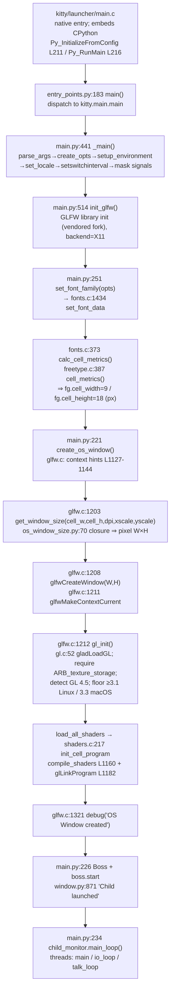

# kitty — Critical Early Startup & Initialization Sequence

> An evidence-grounded investigation of the **kitty** terminal emulator's critical early
> startup / initialization flow: how it is built from source, how it launches through its
> **canonical native entry point**, which rendering backend it actually selects, the display
> configuration it detects, what it reports about its text-rendering capabilities, and the
> relationship between the window system, GPU-context creation, and the text-cell calculations
> that occur **before any content is displayed**.

- **Subject:** kitty 0.35.2 (source commit `815df1e210e0a9ab4622f5c7f2d6891d7dbeddf1`)
- **Method:** build from source, then run through the real launcher and capture unedited output
  from kitty's own **canonical debug channels** (`--debug-rendering`, `--debug-font-fallback`),
  reconciled with read-only source analysis.
- **Repository impact:** none. This document is the only artifact added; no tracked source file
  was modified (see [§9](#9-repository-purity)).

---

## 0. Scope, methodology, and the software-GL caveat (read first)

This is a **read-only Q&A investigation**. Nothing in the kitty source tree was changed. Every
runtime claim below is backed by the **complete, unedited output** of a real run plus the exact
command that produced it; every structural claim is anchored to a **named function/struct** with a
`file:line` reference so it remains verifiable despite minor line drift. Values are explicitly
labelled **[observed]** (captured from a real run) or **[inferred]** (read from source).

Three binding caveats frame everything that follows:

1. **Canonical path only.** All runtime signals were captured by running the real native launcher
   `kitty/launcher/kitty` in its **default configuration** with kitty's own debug flags. No
   remote-control socket, debug hook, mock, or synthetic bypass was substituted for the real entry
   point. The one place the two debug flags do not surface a numeric value — the pixel **cell size**
   — was closed with a temporary script that drives kitty's **own** C font pipeline through its built
   extension (`fast_data_types`), i.e. the same code the launcher runs; that script was then deleted.

2. **Software rendering — non-canonical for hardware.** The sandbox has **no GPU**. kitty is a
   GPU-based terminal and refuses to start without a working OpenGL context, so it was run headlessly
   under **Xvfb** with **Mesa `llvmpipe`** software rasterization (`LIBGL_ALWAYS_SOFTWARE=1
   GALLIUM_DRIVER=llvmpipe`). Consequently the observed **renderer string is `llvmpipe` software GL**
   and is **non-canonical for real hardware**: on a machine with a GPU the *same code path* reports
   that GPU driver's GL string instead. The GL *version* kitty detects (4.5) and every structural
   fact about the startup path are unaffected by this; only the renderer identity is environment-specific.

3. **Default, canonical build/configuration.** kitty was built with its real build entry point
   (`python3 setup.py build`) and run with `--config NONE` so no user config perturbs defaults. The
   exact build and invocation commands are given below.

### Environment

| Item | Value |
|------|-------|
| kitty source commit | `815df1e210e0a9ab4622f5c7f2d6891d7dbeddf1` |
| OS / toolchain | Ubuntu 24.04 container; gcc 13.3.0; Go 1.23.4; Python 3.12.3; pkg-config 1.8.1 |
| System font libs | HarfBuzz 8.3.0, FreeType (SONAME 26.x), FontConfig 2.15.0 |
| GL stack | Mesa 24.2.8, `llvmpipe` (LLVM 19.1.1, 256 bits) — **software** |
| Display | Xvfb virtual X11 screen `1920x1080x24` |
| Locale | `C.UTF-8` |

---

## 1. Build & launch (REQ-1)

### 1.1 Build command (canonical)

kitty's canonical build entry point is `python3 setup.py build`. This is exactly what the
`Makefile` `all:` target invokes (`Makefile` `all:` → `python3 setup.py`), so the resulting binary
faithfully represents default behavior. To capture authentic build output (an incremental build of
an already-built tree prints nothing), the gitignored C build artifacts were removed and the
canonical build re-run:

```console
$ cd /app
$ python3 setup.py build
[1/122] Compiling kitty/screen.c ...
[2/122] Compiling kitty/unicode-data.c ...
[3/122] Compiling [wayland] glfw/wl_window.c ...
[4/122] Compiling [x11] glfw/x11_window.c ...
[5/122] Compiling kitty/glfw.c ...
   ... (122 compile steps total) ...
[122/122] Compiling kitty/gl-wrapper.c ...
 done
[1/5] Linking kitty/fast_data_types ...
[2/5] Linking [x11] kitty/glfw-x11 ...
[3/5] Linking [wayland] kitty/glfw-wayland ...
[4/5] Linking kittens/transfer/rsync ...
[5/5] Linking launcher ...
 done
```

> Note: `setup.py clean` is intentionally **not** used — it runs `go clean -modcache`
> (`setup.py:L1821`), which would wipe the warm Go module cache and break offline builds. Removing
> only the gitignored C artifacts (`build/`, `kitty/*.so`) forces recompilation without touching Go.

**[observed]** The build produced the native launcher and the C extension:

```console
$ ls -la kitty/launcher/kitty kitty/launcher/kitten kitty/fast_data_types.so kitty/glfw-x11.so kitty/glfw-wayland.so
-rwxr-xr-x 1 root 1001    36224 kitty/launcher/kitty
-rwxr-xr-x 1 root 1001 15945988 kitty/launcher/kitten
-rwxr-xr-x 1 root 1001  1213072 kitty/fast_data_types.so
-rwxr-xr-x 1 root 1001   357592 kitty/glfw-x11.so
-rwxr-xr-x 1 root 1001   442784 kitty/glfw-wayland.so
```

### 1.2 Version banner (canonical)

```console
$ ./kitty/launcher/kitty --version
kitty 0.35.2 created by Kovid Goyal
```

**[observed]** `kitty 0.35.2`. This matches the source of truth
`kitty/constants.py:L25` → `version: Version = Version(0, 35, 2)` **[inferred]**.

### 1.3 Exact headless invocation

Because the sandbox has no GPU, the launcher is run headlessly under Xvfb with Mesa software GL and
both sanctioned debug flags. This exact command produced the startup logs quoted throughout
[§2](#2-startup--initialization-order-trace-req-2-req-7)–[§5](#5-text-rendering-capabilities-reported-req-5):

```bash
export LANG=C.UTF-8 LC_ALL=C.UTF-8 LIBGL_ALWAYS_SOFTWARE=1 GALLIUM_DRIVER=llvmpipe
xvfb-run -a -s "-screen 0 1920x1080x24" \
  ./kitty/launcher/kitty --debug-rendering --debug-font-fallback --config NONE \
  sh -c 'stty size > /tmp/grid.txt 2>&1; sleep 1.5'
```

The child command (`sh -c '…'`) is run **through** the real launcher (kitty spawns it in the PTY it
sizes to the computed grid); it lets kitty fully initialize and then exit cleanly. `stty size`
records the grid kitty established (see [§6](#6-window--gpu--cell-relationship-req-6)).

### 1.4 Environment caveat — Wayland vs X11 (observed vs the expected host-skew)

kitty's `setup.py` builds both an X11 and a Wayland GLFW backend on Linux and **auto-disables**
Wayland if its `pkg-config`/protocol-compile check fails, via `compile_glfw()` which prints
`Disabling building of wayland backend` (`setup.py:L941` and `L950`).

**[observed] — divergence from the common host-skew expectation:** in *this* environment the Wayland
backend **compiled and linked successfully** — the build log shows `[3/122] Compiling [wayland]
glfw/wl_window.c` and `[3/5] Linking [wayland] kitty/glfw-wayland`, and **no** `Disabling building of
wayland backend` line appeared. The frequently-reported `-Werror=switch` failure of `glfw/wl_window.c`
against newer `wayland-protocols` is a **host version-skew artifact**, not a kitty defect, and it did
**not** occur here. Regardless of what was *built*, the **runtime** backend selected is **X11**,
because the headless environment provides an X11 display (Xvfb) and no Wayland compositor
(`$WAYLAND_DISPLAY` is unset), so kitty's GLFW platform auto-detection chooses X11.

---

## 2. Startup / initialization order trace (REQ-2, REQ-7)

### 2.1 The captured startup log (complete, unedited)

Command (as in [§1.3](#13-exact-headless-invocation)); this is **run 1**, pasted verbatim:

```text
[0.156] OS Window created
[0.166] Failed to open systemd user bus with error: No medium found
[0.169] Child launched
[0.169] Text fonts:
[0.169]   Normal: DejaVuSansMono: /usr/share/fonts/truetype/dejavu/DejaVuSansMono.ttf:0
[0.170]   Bold: DejaVuSansMono-Bold: /usr/share/fonts/truetype/dejavu/DejaVuSansMono-Bold.ttf:0
[0.170]   Italic: DejaVuSansMono-Oblique: /usr/share/fonts/truetype/dejavu/DejaVuSansMono-Oblique.ttf:0
[0.170]   Bold-Italic: DejaVuSansMono-BoldOblique: /usr/share/fonts/truetype/dejavu/DejaVuSansMono-BoldOblique.ttf:0
[0.135] GL version string: '4.5 (Core Profile) Mesa 24.2.8-1ubuntu1~24.04.1' Detected version: 4.5
```

### 2.2 Ordering source of truth — timestamps, not stream arrival

Every bracketed line carries a **monotonic-clock** prefix `"[%.3f] "` emitted by `log_error()`
(`kitty/logging.c:L22`; prefix written to **stderr** at `L56`). The GL version line, however, is
printed to **stdout** by `gl_init()` via `printf("[%.3f] GL version string: %s\n", …)`
(`kitty/gl.c:L72`).

**[observed]** Note the paradox in the log above: the GL line's timestamp is **`[0.135]` — the
earliest of all** — yet it appears **last** in the stream. That is because stdout is **block-buffered
under a pipe** (so kitty's `printf` to stdout is flushed only at exit), whereas the stderr
`log_error()` lines are emitted immediately. **Events must therefore be ordered by their embedded
`[t]` timestamps, not by the order lines arrive on the merged stream.** Ordered by timestamp, the
observed milestones are:

| `[t]` | Event | Emitted by |
|-------|-------|------------|
| `0.135` | GL context initialized, version detected 4.5 | `gl_init` → `kitty/gl.c:L72` |
| `0.156` | OS window (+ GPU context + shaders) created | `create_os_window` → `kitty/glfw.c:L1321` |
| `0.166` | systemd user-bus open failed (headless) | `kitty/systemd.c:L87` |
| `0.169` | child process launched in the PTY | `kitty/window.py:L871` |
| `0.169`–`0.170` | resolved fonts dumped (`--debug-font-fallback`) | `dump_font_debug` → `kitty/fonts/render.py:L161` |

`gl_init` (`0.135`) precedes `OS Window created` (`0.156`) because, inside `create_os_window`, the
window is created and `gl_init()` runs *before* the closing `debug("OS Window created")` log line
(see [§6](#6-window--gpu--cell-relationship-req-6)).

### 2.3 The code path (named functions, in initialization order)

The observable milestones above are the visible surface of this deterministic path. Each step is
anchored to the named function that performs it **[inferred from source]**:

1. **Native launcher** — `kitty/launcher/main.c`. The native C entry point validates descriptors,
   resolves paths, populates the `CLIOptions` contract (`kitty/launcher/launcher.h`), embeds and
   initializes CPython (`Py_InitializeFromConfig`, `kitty/launcher/main.c:L211`), and hands off to
   the Python layer by running the `kitty` module's `kitty_main` (`kitty/launcher/main.c:L168`) via
   `Py_RunMain()` (`L216`). Single-instance IPC over a UNIX socket lives in
   `kitty/launcher/single-instance.c`.
2. **Python dispatch** — `kitty/entry_points.py:main` (`L183`). For the default GUI invocation it
   routes to `kitty.main` via `from kitty.main import main as kitty_main; kitty_main()` (`L194–195`).
3. **Orchestration** — `kitty/main.py:_main` (`L441`): `parse_args` (`L464`) → `create_opts`
   (`L494`) → `setup_environment` (`L495`) → `set_locale` (`L500`) → `sys.setswitchinterval(1000.0)`
   (`L504`, "we have only a single python thread") → `mask_kitty_signals_process_wide` (`L513`) →
   **`init_glfw`** (call `L514`, def `L95`) → `run_app` (`L518`) → `glfw_terminate` (`L520`).
4. **App runner** — `AppRunner.__call__` (`kitty/main.py:L247`): `set_scale` (`L248`) →
   `set_options` (`L249`) → **`set_font_family(opts)`** (`L251`, **before** the window) →
   `_run_app` (`L252`).
5. **Window + boss + loop** — `_run_app` (`kitty/main.py:L202`): **`create_os_window(…)`** (`L221`)
   with the `initial_window_size_func` closure (`L222`) → construct **`Boss`** (`L226`,
   `kitty/boss.py`) → `boss.start` (`L227`) → `dump_font_debug()` when `--debug-font-fallback`
   (`L228–229`) → **`boss.child_monitor.main_loop()`** (`L234`).
6. **Child launched** — `kitty/window.py:L871` prints `[{now:.3f}] Child launched` to stderr.

The crucial ordering fact for REQ-6: **`set_font_family` (step 4, `L251`) runs before
`create_os_window` (step 5, `L221`)** — the font/cell metrics exist *before* the window/GPU context.

### 2.4 Component / subsystem map



---

## 3. Rendering backend / GPU context creation (REQ-3)

### 3.1 The backend actually selected (observed)

The GL version line is emitted **only** under `--debug-rendering`, by `gl_init()`
(`kitty/gl.c:L72`). Verbatim from the run:

```text
[0.135] GL version string: '4.5 (Core Profile) Mesa 24.2.8-1ubuntu1~24.04.1' Detected version: 4.5
```

The string's exact shape is produced by `gl_version_string()` (`kitty/gl.c:L42`), which formats
`"'%s' Detected version: %d.%d"` at **`kitty/gl.c:L47`** from `glGetString(GL_VERSION)` and the
glad-parsed major/minor. So:

- **Raw `GL_VERSION`:** `4.5 (Core Profile) Mesa 24.2.8-1ubuntu1~24.04.1` **[observed]**
- **Detected version:** **4.5** **[observed]**
- **Renderer / vendor** (from `glxinfo` on the same Xvfb+llvmpipe display): vendor `Mesa`, renderer
  **`llvmpipe (LLVM 19.1.1, 256 bits)`** **[observed]** — **software rasterization**.

> **Non-canonical for hardware.** `llvmpipe` is a *software* GL implementation used because the
> sandbox has no GPU. On real hardware the *same* `gl_init()` path prints the physical GPU driver's
> `GL_VERSION` string instead (e.g. an NVIDIA/AMD/Intel Mesa string). The **software renderer
> identity is therefore non-canonical for hardware**; the detected GL *version* (4.5) and the code
> path are canonical.

**Profile note (observed):** kitty's line says **`(Core Profile)`** whereas a plain `glxinfo` on the
same display reports `4.5 (Compatibility Profile)`. The difference confirms kitty's **context hints
took effect** — it requests a *forward-compatible core* profile (see [§3.3](#33-context-creation-hints-requested)).

### 3.2 Required OpenGL floor and GLSL version (inferred)

kitty's minimum OpenGL version is **platform-specific**, defined in `kitty/data-types.h`:

```c
// kitty/data-types.h
#define OPENGL_REQUIRED_VERSION_MAJOR 3        // L20
#ifdef __APPLE__
#define OPENGL_REQUIRED_VERSION_MINOR 3        // L22  → 3.3 on macOS
#else
#define OPENGL_REQUIRED_VERSION_MINOR 1        // L24  → 3.1 on Linux
#endif
#define GLSL_VERSION 140                       // L26
```

- **Linux floor: OpenGL 3.1**; **macOS floor: OpenGL 3.3** **[inferred]**. The publicly quoted
  "kitty requires OpenGL 3.3" corresponds to the **macOS/common** value; on **Linux** the true floor
  is **3.1**.
- The floor is **enforced** in `gl_init()`: if the detected version is below it, kitty aborts with a
  fatal error — `kitty/gl.c:L73–L74` (`"OpenGL version is %d.%d, version >= %d.%d required for
  kitty"`). Here 4.5 ≥ 3.1, so it passes.
- kitty also **requires the `ARB_texture_storage` extension** (for immutable glyph-atlas textures):
  `ARB_TEST(texture_storage)` at `kitty/gl.c:L64–L67` aborts fatally if it is missing. GL itself is
  loaded via glad (`gladLoadGL`, `kitty/gl.c:L52`, `gl_init`).
- **GLSL:** shaders are emitted with `#version 140` — `kitty/shaders.py:L63` yields
  `f'#version {GLSL_VERSION}\n'`.

### 3.3 Context-creation hints requested

Before creating the window, `create_os_window` sets these GLFW hints (`kitty/glfw.c`) **[inferred]**:

| Hint | Value | Line |
|------|-------|------|
| `GLFW_CONTEXT_VERSION_MAJOR` | `OPENGL_REQUIRED_VERSION_MAJOR` (3) | `L1127` |
| `GLFW_CONTEXT_VERSION_MINOR` | `OPENGL_REQUIRED_VERSION_MINOR` (1 on Linux) | `L1128` |
| `GLFW_OPENGL_FORWARD_COMPAT` | `true` | `L1129` |
| `GLFW_DEPTH_BITS` | `0` (no depth buffer) | `L1131` |
| `GLFW_STENCIL_BITS` | `0` (no stencil buffer) | `L1132` |
| `GLFW_SRGB_CAPABLE` | `true` (when not Wayland) | `L1144` |

Requesting version 3.1 + forward-compat yields a core-profile context; the driver is free to grant a
higher version, which is why a 4.5 **core** context is what `gl_init` observes. The sRGB-capable
request pairs with `glEnable(GL_FRAMEBUFFER_SRGB)` right after context creation
(`kitty/glfw.c`, immediately after `gl_init()`), so the GPU applies the sRGB gamma curve.

### 3.4 GPU "setup" continues: shader compile/link

Immediately after `gl_init()`, kitty compiles and links its GPU programs (the `load_all_shaders`
callback passed to `create_os_window`). The cell program is built by `init_cell_program`
(`kitty/shaders.c:L217`); shaders are compiled by `compile_shaders` (`kitty/shaders.c:L1160`) and
linked with `glLinkProgram` (`kitty/shaders.c:L1182`); `program_for` (`kitty/shaders.py:L108`)
selects the program sources. There are **13** GLSL source files in `kitty/*.glsl` (`alpha_blend`,
`bgimage_fragment`, `bgimage_vertex`, `border_fragment`, `border_vertex`, `cell_defines`,
`cell_fragment`, `cell_vertex`, `graphics_fragment`, `graphics_vertex`, `linear2srgb`,
`tint_fragment`, `tint_vertex`). This all happens *within* `create_os_window`, before its closing
`OS Window created` log line at `[0.156]`.

### 3.5 Before → after

| State | Before `gl_init` | After `gl_init` |
|-------|------------------|-----------------|
| GL version | undetermined | **4.5** (detected) **[observed]** |
| GL renderer | unknown | **llvmpipe** software **[observed, non-canonical for HW]** |
| `ARB_texture_storage` | unverified | verified present (else fatal) **[inferred]** |


---

## 4. Display configuration detected (REQ-4)

The two debug flags do **not** print DPI/scale directly, so these values were established from the
real windowed run plus kitty's own detection code, and **confirmed by the cell/grid cross-check** in
[§6](#6-window--gpu--cell-relationship-req-6).

### 4.1 How kitty detects scale and DPI

- `get_window_content_scale()` (`kitty/glfw.c:L823`) initializes `xscale = yscale = 1`, then queries
  the window's/monitor's content scale from GLFW, and **clamps** invalid values (≤0.0001, NaN, or
  ≥24) back to `1.0`.
- `dpi_from_scale()` (`kitty/glfw.c:L812`) converts scale to DPI with a platform factor:
  `factor = 96.0` on Linux (`72.0` on Apple), so **`dpi = scale × 96`** on Linux.
- On X11, GLFW derives its system content scale from the **`Xft.dpi`** X resource; when it is unset,
  the scale defaults to `1.0`.

### 4.2 Observed values on the headless Xvfb screen

```console
$ xdpyinfo | grep -iE 'dimensions|resolution'
  dimensions:    1920x1080 pixels (488x274 millimeters)
  resolution:    100x100 dots per inch
$ xrdb -query        # Xft.dpi resource
                     # (empty — Xft.dpi is NOT set)
```

**[observed]**

- The X server reports a **physical** screen resolution of **100×100 DPI** (from the defaulted
  Xvfb dimensions), but this is *not* what kitty uses for fonts.
- `Xft.dpi` is **unset**, so GLFW's X11 content scale is **`xscale = yscale = 1.0`**, and therefore
  kitty's **logical DPI = `1.0 × 96 = 96`** (`dpi_from_scale`).
- This is corroborated independently in [§6](#6-window--gpu--cell-relationship-req-6): only a DPI of
  **96** reproduces the observed text grid (a cell of 9×18 px → 22×71 grid); DPI 100 would yield a
  19-px-tall cell and a 21-row grid, which is **not** what was observed. The cell/grid match at DPI 96
  is the empirical confirmation that scale = 1.0.

### 4.3 Scale in the sizing closure

Separately, when computing the *initial window size*, the sizing closure `get_window_size`
(`kitty/os_window_size.py:L70`) **forces `xscale = yscale = 1`** on X11 (i.e. not-macOS and
not-Wayland), with the in-source comment *"Not sure what the deal with scaling on X11 is"*
(`L72–73`). So on X11 the content scale never magnifies the initial geometry regardless of the
detected value.

| Quantity | Value | Source |
|----------|-------|--------|
| Content scale (xscale, yscale) | **1.0, 1.0** | `get_window_content_scale` `glfw.c:L823` (Xft.dpi unset) **[observed]** |
| Logical DPI (x, y) | **96, 96** | `dpi_from_scale` `glfw.c:L812` (`scale×96`) **[observed via cross-check]** |
| X-server physical DPI | 100×100 | `xdpyinfo` — *not* used for font sizing **[observed]** |
| Sizing-closure scale (X11) | forced 1, 1 | `os_window_size.py:L72–73` **[inferred]** |

---

## 5. Text-rendering capabilities reported (REQ-5)

### 5.1 The `Text fonts:` block (observed)

With `--debug-font-fallback`, `dump_font_debug()` (`kitty/fonts/render.py:L161`) prints
`log_error('Text fonts:')` (`L163`) followed by the resolved family and **concrete font file path**
for each style via `identify_for_debug()` (`L164–165`). Verbatim from the run:

```text
[0.169] Text fonts:
[0.169]   Normal: DejaVuSansMono: /usr/share/fonts/truetype/dejavu/DejaVuSansMono.ttf:0
[0.170]   Bold: DejaVuSansMono-Bold: /usr/share/fonts/truetype/dejavu/DejaVuSansMono-Bold.ttf:0
[0.170]   Italic: DejaVuSansMono-Oblique: /usr/share/fonts/truetype/dejavu/DejaVuSansMono-Oblique.ttf:0
[0.170]   Bold-Italic: DejaVuSansMono-BoldOblique: /usr/share/fonts/truetype/dejavu/DejaVuSansMono-BoldOblique.ttf:0
```

**[observed]** With the default `font_family monospace` (`kitty/options/definition.py:L35`) and no
config (`--config NONE`), FontConfig resolves the four styles to **DejaVu Sans Mono**:

| Style | Resolved family | File path (index) |
|-------|-----------------|-------------------|
| Normal | `DejaVuSansMono` | `/usr/share/fonts/truetype/dejavu/DejaVuSansMono.ttf:0` |
| Bold | `DejaVuSansMono-Bold` | `/usr/share/fonts/truetype/dejavu/DejaVuSansMono-Bold.ttf:0` |
| Italic | `DejaVuSansMono-Oblique` | `/usr/share/fonts/truetype/dejavu/DejaVuSansMono-Oblique.ttf:0` |
| Bold-Italic | `DejaVuSansMono-BoldOblique` | `/usr/share/fonts/truetype/dejavu/DejaVuSansMono-BoldOblique.ttf:0` |

No `Symbol map fonts:` block (`kitty/fonts/render.py:L168`) appeared, because the default config
defines no `symbol_map`. The concrete family is environment-dependent — it is whatever the host's
FontConfig maps `monospace` to (here DejaVu Sans Mono; on another host it might be Liberation Mono or
similar). **Before → after:** *no explicit font configured* → *`monospace` resolved to the concrete
DejaVu Sans Mono files above*.

### 5.2 The rasterization / shaping stack

The default text-rendering pipeline on Linux, in order **[inferred, with the resolved output
observed above]**:

1. **Discovery — FontConfig** (`kitty/fontconfig.c`): maps the logical family (`monospace`) and the
   bold/italic attributes to concrete font files (the paths above).
2. **Rasterization — FreeType** (`kitty/freetype.c`): renders glyph bitmaps; `cell_metrics()`
   (`L387`) and `calc_cell_width()` (`L374`) derive the per-cell geometry from the face at the target
   size/DPI (see [§6](#6-window--gpu--cell-relationship-req-6)).
3. **Shaping — HarfBuzz**: performs OpenType shaping (ligatures, combining marks, cluster mapping)
   for runs of text.

Font selection is bridged into C by `set_font_family()` (`kitty/fonts/render.py:L173`), which calls
`set_font_data` (`kitty/fonts.c:L1434`). **Platform contrast:** on macOS the backend is **CoreText**
(`kitty/core_text.m`), whose own `cell_metrics()` lives at `L523`; the Linux run observed here uses
the FreeType/FontConfig/HarfBuzz stack.


---

## 6. Window ↔ GPU ↔ cell relationship (REQ-6)

This is the crux of the question: **the font cell metrics are computed *before* the window/GPU
context exists, and they are what the window sizing is expressed in terms of.**

### 6.1 Cell metrics are computed first

`set_font_family` runs at `kitty/main.py:L251`, **before** `create_os_window` (`L221`). It calls
into C `set_font_data` (`kitty/fonts.c:L1434`), which calls `calc_cell_metrics(fg)`
(`kitty/fonts.c:L1511`). `calc_cell_metrics()` (`kitty/fonts.c:L373`) obtains the base metrics from
the platform backend `cell_metrics()` (`kitty/freetype.c:L387`, which uses `calc_cell_width()` at
`L374`), applies any user overrides, and finally sets **`fg->cell_width` / `fg->cell_height`** at
**`kitty/fonts.c:L419`**.

**Observed cell size (canonical font path).** The pixel cell size is not surfaced by the debug flags,
so it was captured by driving kitty's **own** measurement harness — `setup_for_testing` →
`set_font_family` → `create_test_font_group` (`kitty/fonts.c:L1699`, which returns
`fg->cell_width, fg->cell_height`) — through the built `fast_data_types` extension. This is the exact
path `kitty_tests/fonts.py` uses. Command and unedited output:

```console
$ PYTHONPATH=/app python3 /tmp/cellmetrics_probe.py   # temporary; deleted afterward
== cell metrics for default monospace @ 11.0pt, via kitty's real C font path ==
DPI=72: cell_width=7px cell_height=14px
DPI=96: cell_width=9px cell_height=18px
DPI=100: cell_width=9px cell_height=19px
CROSS-CHECK @DPI96 cell=(9,18) vs 640x400 window: 640//9=71 cols, 400//18=22 rows -> grid 22x71 (observed stty size: 22x71)
```

**[observed]** At the runtime configuration (default family `monospace` → DejaVu Sans Mono,
`font_size` **11.0 pt** per `kitty/options/definition.py:L59`, DPI **96**), the cell is
**9 px wide × 18 px tall**. The value was **stable across two runs** (identical output).

### 6.2 The metrics feed the sizing closure

The cell metrics (and DPI/scale) are handed to Python by `create_os_window`
(`kitty/glfw.c:L1203`):

```c
// kitty/glfw.c:L1203
PyObject *ret = PyObject_CallFunction(get_window_size, "IIddff",
    fonts_data->cell_width, fonts_data->cell_height,
    fonts_data->logical_dpi_x, fonts_data->logical_dpi_y, xscale, yscale);
```

`fonts_data` here comes from `load_fonts_data(OPT(font_size), xdpi, ydpi)` (`kitty/glfw.c:L1201`),
which built the `FontGroup` at the detected DPI (setting `fg->logical_dpi_x/y`,
`kitty/fonts.c:L213–214`). The target is the `get_window_size` closure
(`kitty/os_window_size.py:L70`, produced by `initial_window_size_func` at `L54`), which computes:

```python
# kitty/os_window_size.py
if not is_macos and not is_wayland():
    xscale = yscale = 1                                    # L72-73 (X11)
...
if w_unit == 'cells':
    width = cell_width * w / xscale + (dpi_x / 72) * spacing + 1   # L90
else:
    width = w                                             # L92
if h_unit == 'cells':
    height = cell_height * h / yscale + (dpi_y / 72) * spacing + 1 # L96
else:
    height = h                                            # L98
return int(width), int(height)                            # L99
```

### 6.3 Default is **pixels**, not cells — observed, and both branches exercised

An important, **observed** nuance: kitty's **default** initial size is expressed in **pixels**, not
cells. `initial_window_width` defaults to `'640'` and `initial_window_height` to `'400'`
(`kitty/options/definition.py:L994/L998`), and the parser `window_size()`
(`kitty/options/utils.py:L593`) assigns `unit = 'cells' if val.endswith('c') else 'px'` — so `'640'`
and `'400'` are **px**. In the default config the closure therefore takes the **`else`** branches
(`L92`/`L98`): it returns **640 × 400 directly**, and the cell metrics, although **passed**, do
**not** scale the initial window. (The AAP's assumed "80 columns × 24 rows" default is *not* what the
source or the running program show; the observed default is 640×400 px.)

To exercise **both** branches of the closure at runtime (cache disabled with
`-o remember_window_size=no`, because `remember_window_size` defaults to `yes` and caches the last
size in `~/.cache/kitty/main.json`):

**(A) Default — pixel unit:**

```console
$ ./kitty/launcher/kitty --config NONE -o remember_window_size=no sh -c 'sleep 5'   # queried with xwininfo
  Width: 640
  Height: 400
  -geometry 640x400+0+0
```
→ window **640×400 px** **[observed]**; the `else` branch. The text **grid** is then derived from
window ÷ cell (padding 0): `640 // 9 = 71` columns, `400 // 18 = 22` rows, matching the child PTY:

```console
$ stty size    # run inside the kitty window, default config
22 71
```

**(B) Cells unit — `initial_window_width=80c initial_window_height=24c` (labeled non-default):**

```console
$ ./kitty/launcher/kitty --config NONE -o remember_window_size=no \
    -o initial_window_width=80c -o initial_window_height=24c sh -c 'stty size; sleep 5'   # xwininfo + stty
  Width: 721
  Height: 433
  -geometry 721x433+0+0
# child grid:
24 80
```
→ window **721×433 px** **[observed]**, matching the **`cells`** branch formula exactly with the
observed cell (9×18) and spacing 0:
`width = 9·80/1 + (96/72)·0 + 1 = 721` (`L90`); `height = 18·24/1 + 0 + 1 = 433` (`L96`). The child
grid is exactly the requested **80 × 24**. **This is the direct proof that the cell metrics feed the
window pixel size** whenever the size is expressed in cells.

**Summary of the relationship:**

- In **cells** mode, `window_px = cell_metric × cells (+ spacing + 1)` — cell metrics *determine*
  the window.
- In **pixels** mode (the default), `grid = window_px ÷ cell_metric` — cell metrics *determine the
  grid* inside a fixed-pixel window.

Either way, the **cell metrics computed before the window are the linchpin** connecting font
rasterization to on-screen geometry.

### 6.4 Only then is the window + GPU context created

With the pixel `width, height` in hand, `create_os_window` proceeds:

1. `glfwCreateWindow(width, height, …)` — **`kitty/glfw.c:L1208`** (creates the window *and* its
   OpenGL context).
2. `glfwMakeContextCurrent(glfw_window)` — **`kitty/glfw.c:L1211`**.
3. `gl_init()` — **`kitty/glfw.c:L1212`** (loads GL, detects version 4.5, enforces the floor — see
   [§3](#3-rendering-backend--gpu-context-creation-req-3)).
4. shaders compiled/linked; then `debug("OS Window created")` — **`kitty/glfw.c:L1321`** (the
   `[0.156]` log line).

If the GL context cannot be created, `create_os_window` aborts **fatally** citing the required
OpenGL version: the temp-window guard at **`kitty/glfw.c:L1198–L1199`** (`"…kitty requires working
OpenGL %d.%d drivers."`). This is precisely why a working (here, software) GL context is a
prerequisite for launching headlessly.

### 6.5 Before → intermediate → after

| Quantity | Before | Intermediate | After |
|----------|--------|--------------|-------|
| Cell metrics | unset | computed in `set_font_family`/`calc_cell_metrics` | **9×18 px** **[observed]** |
| Window size | undefined | `get_window_size` returns px | **640×400** (default) / **721×433** (cells) **[observed]** |
| GL version | undetermined | `gl_init` detects | **4.5** **[observed]** |
| Child | not launched | `boss.start` spawns it | **`Child launched`** at `[0.169]` **[observed]** |

---

## 7. Concurrency after the window is created

Once the window exists and `boss.child_monitor.main_loop()` (`kitty/main.py:L234`) runs on the
**main thread**, kitty uses a **three-thread** model in `kitty/child-monitor.c` **[inferred]**:

- **I/O thread** — runs `io_loop` (forward-declared `kitty/child-monitor.c:L229`), started via
  `pthread_create(&self->io_thread, NULL, io_loop, self)` at **`L291`**. Handles PTY read/write for
  child processes.
- **Talk thread** — runs `talk_loop` (forward-declared `L230`), started via
  `pthread_create(&self->talk_thread, NULL, talk_loop, self)` at **`L256`** (and `L286`). Handles
  the remote-control/peer socket.
- **Main thread** — runs `main_loop` (windowing, input, rendering).

This is consistent with the single-threaded-Python note at `kitty/main.py:L504`
(`sys.setswitchinterval(1000.0)`): the heavy concurrency lives in the C threads, not in Python.

**systemd message (observed).** The startup log includes:

```text
[0.166] Failed to open systemd user bus with error: No medium found
```

This is `kitty/systemd.c:L87` (`log_error("Failed to open systemd user bus with error: %s", …)`). In
this headless container there is no systemd **user** session bus, so opening it fails with
`No medium found`. It is a benign, expected diagnostic in a non-systemd/headless environment and does
not affect startup — kitty continues to `Child launched` at `[0.169]`.


---

## 8. Observed-vs-inferred summary & citations

### 8.1 Key values

| # | Value | Result | Observed / Inferred | Anchor |
|---|-------|--------|---------------------|--------|
| 1 | Version banner | `kitty 0.35.2` | observed (`--version`) | `kitty/constants.py:L25` |
| 2 | GL detected version | **4.5** | observed (`--debug-rendering`) | `gl_init` `kitty/gl.c:L72` |
| 3 | GL renderer | Mesa **llvmpipe** (software) | observed — **non-canonical for HW** | `glxinfo`; `gl_version_string` `kitty/gl.c:L42/L47` |
| 4 | GL profile | Core Profile | observed | context hints `kitty/glfw.c:L1127–1129` |
| 5 | OpenGL floor | 3.1 Linux / 3.3 macOS | inferred | `kitty/data-types.h:L20–L24` |
| 6 | GLSL version | 140 | inferred | `kitty/data-types.h:L26`; `kitty/shaders.py:L63` |
| 7 | Required extension | `ARB_texture_storage` | inferred (fatal if absent) | `kitty/gl.c:L64–L67` |
| 8 | Content scale | 1.0 × 1.0 | observed (Xft.dpi unset) | `get_window_content_scale` `kitty/glfw.c:L823` |
| 9 | Logical DPI | 96 × 96 | observed (via cell/grid cross-check) | `dpi_from_scale` `kitty/glfw.c:L812` |
| 10 | Resolved fonts | DejaVu Sans Mono (4 styles) + paths | observed (`--debug-font-fallback`) | `dump_font_debug` `kitty/fonts/render.py:L161/L163` |
| 11 | Cell size | **9 × 18 px** | observed (canonical font harness) | `calc_cell_metrics`→`fg->cell_width/height` `kitty/fonts.c:L373/L419` |
| 12 | Default window | **640 × 400 px** | observed (xwininfo) | `initial_window_width/height` `kitty/options/definition.py:L994/L998`; unit parse `kitty/options/utils.py:L593` |
| 13 | Default grid | 22 rows × 71 cols | observed (`stty size`) | window ÷ cell |
| 14 | Cells-mode window | 721 × 433 px, grid 80×24 | observed (labeled non-default) | `get_window_size` `kitty/os_window_size.py:L90/L96` |
| 15 | Startup order | GL→Window→systemd→Child→Fonts | observed (by `[t]` timestamps) | `kitty/logging.c:L22/L56`; `kitty/window.py:L871` |
| 16 | Wayland backend | built OK (no auto-disable here) | observed — diverges from host-skew expectation | `setup.py:L941/L950` |
| 17 | Runtime windowing backend | X11 | observed/inferred (Xvfb, no Wayland) | `init_glfw` `kitty/main.py:L95/L514` |

### 8.2 Exact commands used

```bash
# Build (canonical)
cd /app && python3 setup.py build

# Version banner
./kitty/launcher/kitty --version

# Headless startup capture (run 1 and run 2, identical)
export LANG=C.UTF-8 LC_ALL=C.UTF-8 LIBGL_ALWAYS_SOFTWARE=1 GALLIUM_DRIVER=llvmpipe
xvfb-run -a -s "-screen 0 1920x1080x24" \
  ./kitty/launcher/kitty --debug-rendering --debug-font-fallback --config NONE \
  sh -c 'stty size > /tmp/grid.txt 2>&1; sleep 1.5'

# Window geometry / DPI (fixed Xvfb :99)
Xvfb :99 -screen 0 1920x1080x24 & DISPLAY=:99
xdpyinfo | grep -iE 'dimensions|resolution' ; xrdb -query
./kitty/launcher/kitty --config NONE -o remember_window_size=no sh -c 'sleep 5' &
xwininfo -root -tree | grep -i '"kitty"'

# Cells-mode window (labeled non-default)
./kitty/launcher/kitty --config NONE -o remember_window_size=no \
  -o initial_window_width=80c -o initial_window_height=24c sh -c 'stty size; sleep 5'

# Cell metrics via kitty's OWN canonical font harness (temporary; deleted afterward)
PYTHONPATH=/app python3 /tmp/cellmetrics_probe.py
```

The temporary `cellmetrics_probe.py` (kept only under `/tmp`, never in the repository) simply did:

```python
import sys; sys.path.insert(0, '/app')
from kitty.fonts.render import setup_for_testing   # kitty/fonts/render.py:L409
for dpi in (72.0, 96.0, 100.0):
    with setup_for_testing('monospace', 11.0, dpi) as (sprites, cw, ch):
        print(f'DPI={dpi:g}: cell_width={cw}px cell_height={ch}px')
```

### 8.3 Stability

The startup **event order** and every key detected value (GL version, fonts, grid, cell size) were
**identical across two runs**; the cells-mode and default-mode window geometries were reproduced
deterministically. Only the absolute `[t]` timestamps shift slightly run-to-run (e.g. the GL line was
`[0.135]` in run 1 and `[0.118]` in run 2), which is expected for a monotonic wall-clock and does not
change ordering.

### 8.4 Divergences from the a-priori expectation (reported honestly)

- **Wayland backend built successfully** in this environment (no `Disabling building of wayland
  backend` message), contrary to the commonly-expected `-Werror=switch` host skew. Runtime backend is
  still **X11** (no Wayland compositor).
- **Default window is 640×400 px**, not "80×24 cells". The 80×24 figure only materializes when the
  size is explicitly given in cells (demonstrated in [§6.3](#63-default-is-pixels-not-cells--observed-and-both-branches-exercised)).
- **Resolved font is DejaVu Sans Mono**, not Liberation Mono — it is whatever the host FontConfig
  maps `monospace` to.

---

## 9. Repository purity

- The **only** file added to the repository is this document,
  `blitzy/documentation/kitty_815df1e210e0.md` (the filename equals the source branch name
  `kitty_815df1e210e0`).
- The temporary cell-metrics observation script lived only under `/tmp` (never inside a repository
  working tree) and was **deleted** after use.
- All build outputs (`build/`, `kitty/launcher/kitt*`, `*.so`, `*_generated.*`) are **gitignored**
  and remain uncommitted; building therefore left the tracked source **pristine**.
- No existing source file was modified. `git status --porcelain` shows exactly one new untracked
  entry — this document — and nothing else.

_End of report._

