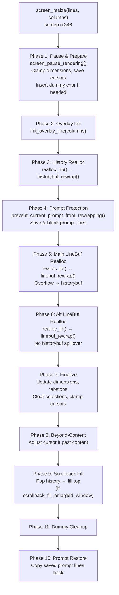
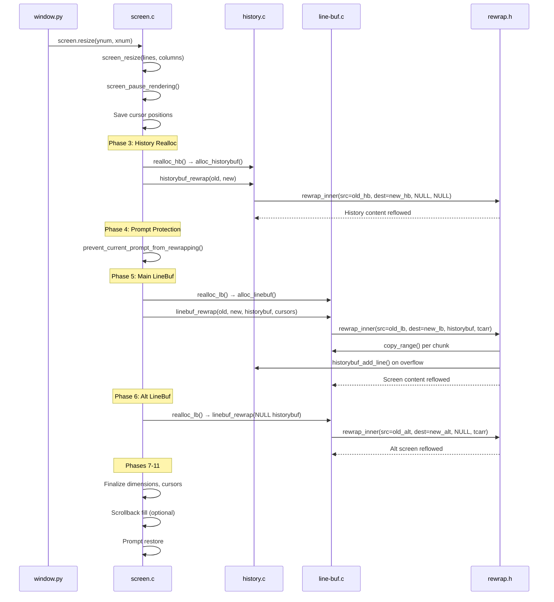

# Kitty Terminal Reflow (Rewrap) System — Comprehensive Analysis

This document presents a deep, code-level investigation of kitty's terminal reflow (rewrap) system. The analysis covers the `rewrap_inner()` algorithm internals, screen-to-scrollback interaction during resize, line continuation state propagation, the complete data flow from Python entry point through every C function to cell-level copy operations, and identification of potential edge cases in line continuation state propagation between the visible buffer and scrollback history.

Every claim in this document is traced to specific source file locations within the kitty repository. No assumptions about behavior are made; all conclusions are grounded in the actual C and Python source code.

---

## Table of Contents

- [A. The `rewrap_inner()` Algorithm Step-by-Step](#a-the-rewrap_inner-algorithm-step-by-step)
  - [A.1 Supporting Data Structures](#a1-supporting-data-structures)
  - [A.2 Algorithm Walkthrough](#a2-algorithm-walkthrough)
- [B. Dual-Inclusion Architecture of `rewrap.h`](#b-dual-inclusion-architecture-of-rewraph)
  - [B.1 Default Macros (LineBuf Specialization)](#b1-default-macros-linebuf-specialization)
  - [B.2 HistoryBuf Specialization](#b2-historybuf-specialization)
  - [B.3 Critical Difference: Buffer Overflow Handling](#b3-critical-difference-buffer-overflow-handling)
- [C. Screen ↔ Scrollback Interaction During Resize](#c-screen--scrollback-interaction-during-resize)
  - [C.1 `screen_resize()` Phase-by-Phase](#c1-screen_resize-phase-by-phase)
  - [C.2 Resize Pipeline Diagram](#c2-resize-pipeline-diagram)
- [D. Line Continuation State Propagation](#d-line-continuation-state-propagation)
  - [D.1 Two-Tier Representation](#d1-two-tier-representation)
  - [D.2 Setting Continuation During Rewrap](#d2-setting-continuation-during-rewrap)
  - [D.3 Reading Continuation State](#d3-reading-continuation-state)
  - [D.4 Clearing Continuation During Rewrap](#d4-clearing-continuation-during-rewrap)
  - [D.5 `set_dest_line_attrs` Macro](#d5-set_dest_line_attrs-macro)
- [E. Complete Data Flow](#e-complete-data-flow)
  - [E.1 Call Chain with Source References](#e1-call-chain-with-source-references)
  - [E.2 Sequence Diagram](#e2-sequence-diagram)
- [F. `linebuf_rewrap()` Entry Point Details](#f-linebuf_rewrap-entry-point-details)
- [G. `historybuf_rewrap()` Entry Point Details](#g-historybuf_rewrap-entry-point-details)
- [H. Pager History Rewrap](#h-pager-history-rewrap)
- [I. `historybuf_push()` and Overflow Mechanics](#i-historybuf_push-and-overflow-mechanics)
- [J. Edge-Case Identification](#j-edge-case-identification)
- [K. Test Coverage Analysis](#k-test-coverage-analysis)
- [L. Summary and Key Findings](#l-summary-and-key-findings)

---

## Source Files Analyzed

| File | Type | Relevance |
|------|------|-----------|
| `kitty/rewrap.h` | Header (included twice) | Defines `rewrap_inner()`, `copy_range()`, `TrackCursor`, and all configurable macros |
| `kitty/line-buf.c` | C Source | Includes `rewrap.h` with default `LineBuf` macros; implements `linebuf_rewrap()` entry point |
| `kitty/history.c` | C Source | Includes `rewrap.h` with overridden `HistoryBuf` macros; implements `historybuf_rewrap()`, pager history rewrap |
| `kitty/data-types.h` | Header | Defines `LineBuf`, `HistoryBuf`, `Line`, `CPUCell`, `GPUCell`, `CellAttrs`, `LineAttrs`, `PagerHistoryBuf` |
| `kitty/lineops.h` | Header | Inline helpers: `copy_line()`, `clear_chars_in_line()`, `xlimit_for_line()`, `line_is_empty()` |
| `kitty/screen.c` | C Source | Implements `screen_resize()`, `realloc_hb()`, `realloc_lb()`, `prevent_current_prompt_from_rewrapping()` |
| `kitty/screen.h` | Header | Defines the `Screen` struct with `main_linebuf`, `alt_linebuf`, `historybuf`, cursor, savepoints |
| `kitty/window.py` | Python | Calls `self.screen.resize(ynum, xnum)` on geometry change events |
| `kitty_tests/screen.py` | Python | Contains `test_resize()`, `test_cursor_after_resize()`, `test_scrollback_fill_after_resize()` |

---

## A. The `rewrap_inner()` Algorithm Step-by-Step

The `rewrap_inner()` function in `kitty/rewrap.h:56–96` is the shared, generic reflow routine that performs the actual cell-level rewrapping of terminal content from a source buffer into a destination buffer with potentially different dimensions. It is parameterized by preprocessor macros that are overridden depending on whether the buffer type is `LineBuf` or `HistoryBuf`.

### A.1 Supporting Data Structures

**`copy_range()` — Cell Copy Helper** (`kitty/rewrap.h:44–48`)

This inline function performs the low-level copying of a contiguous range of cells from one `Line` to another:

```c
static inline void
copy_range(Line *src, index_type src_at, Line* dest, index_type dest_at, index_type num) {
    memcpy(dest->cpu_cells + dest_at, src->cpu_cells + src_at, num * sizeof(CPUCell));
    memcpy(dest->gpu_cells + dest_at, src->gpu_cells + src_at, num * sizeof(GPUCell));
}
```

It copies both the `CPUCell` array (character data, hyperlink IDs, combining characters) and the `GPUCell` array (color, sprite position, cell attributes) in two `memcpy` operations. The `CPUCell` is 12 bytes (`kitty/data-types.h:228`) and `GPUCell` is 20 bytes (`kitty/data-types.h:221`).

**`TrackCursor` — Cursor Position Tracker** (`kitty/rewrap.h:50–53`)

```c
typedef struct TrackCursor {
    index_type x, y;
    bool is_tracked_line, is_sentinel;
} TrackCursor;
```

This struct is used to remap cursor positions during rewrap. An array of `TrackCursor` entries is passed to `rewrap_inner()`, with a sentinel entry (where `is_sentinel = true`) marking the end of the array. The `is_tracked_line` flag is set dynamically within the algorithm to indicate when the current source row matches the cursor's original `y` position.

### A.2 Algorithm Walkthrough

**Function Signature** (`kitty/rewrap.h:56–57`):

```c
static void
rewrap_inner(BufType *src, BufType *dest, const index_type src_limit,
             HistoryBuf UNUSED *historybuf, TrackCursor *track, ANSIBuf *as_ansi_buf)
```

Parameters:
- `src` / `dest`: Source and destination buffers (type depends on macro `BufType`)
- `src_limit`: Number of source rows to process
- `historybuf`: Spillover history buffer (only used by `LineBuf` specialization; `NULL` for `HistoryBuf`)
- `track`: Array of `TrackCursor` entries for cursor remapping (sentinel-terminated)
- `as_ansi_buf`: Temporary buffer for ANSI serialization during history push operations

**Initialization** (`kitty/rewrap.h:58–61`):

The function initializes tracking variables: `src_y`, `src_x`, `dest_x`, `dest_y`, `num` (copy chunk size), and `src_x_limit` (effective width of current source row). If `track` is `NULL`, it is pointed at a local sentinel entry `tc_end` to simplify the inner loops — this allows the cursor-tracking `for` loops to safely iterate zero times without a `NULL` check.

**Step 1: Outer Loop — Iterate Source Rows** (`kitty/rewrap.h:63`)

```c
do {
```

The algorithm uses a `do...while` loop that iterates source rows from `src_y = 0` up to `src_limit`. The `do...while` guarantees at least one iteration. The loop continues at line 94: `} while (src_y < src_limit);`

**Step 2: Cursor Marking** (`kitty/rewrap.h:64`)

```c
for (TrackCursor *t = track; !t->is_sentinel; t++) t->is_tracked_line = src_y == t->y;
```

For each source row, the algorithm marks which `TrackCursor` entries have their `y` coordinate matching the current `src_y`. This sets up `is_tracked_line` for use in the inner copy loop.

**Step 3: Source Line Initialization** (`kitty/rewrap.h:65`)

```c
init_src_line(src_y);
```

This is a configurable macro. For `LineBuf`, it resolves to `linebuf_init_line(src, src_y)` (`kitty/rewrap.h:15`), which uses `line_map[]` indirection to locate the physical row, sets up the `Line` struct's `cpu_cells` and `gpu_cells` pointers, and computes `is_continued` from the previous line's GPU cell (`kitty/line-buf.c:140–147`).

For `HistoryBuf`, it resolves to `init_line(src, map_src_index(src_y), src->line)` (`kitty/history.c:586`), where `map_src_index(y) = (src->start_of_data + y) % src->ynum` (`kitty/history.c:584`) implements circular buffer indexing.

**Step 4: Continuation Detection** (`kitty/rewrap.h:66`)

```c
const bool src_line_is_continued = is_src_line_continued();
```

The `is_src_line_continued()` macro (`kitty/rewrap.h:40–42`) inspects the **last GPU cell** of the source line:

```c
#define is_src_line_continued() (src->line->gpu_cells[src->xnum-1].attrs.next_char_was_wrapped)
```

This reads the `next_char_was_wrapped` bit from `CellAttrs` (`kitty/data-types.h:206`) on the last cell of the line. If set, the current line's content logically continues onto the next line (i.e., the line break was caused by line wrapping, not a hard newline from the application).

**Step 5: Trailing Blank Trimming** (`kitty/rewrap.h:67–70`)

```c
src_x_limit = src->xnum;
if (!src_line_is_continued) {
    while(src_x_limit && (src->line->cpu_cells[src_x_limit - 1].ch) == BLANK_CHAR) src_x_limit--;
}
```

For lines that are **not** continued (i.e., they end with a hard line break), trailing `BLANK_CHAR` cells (value `0`, defined at `kitty/data-types.h:115`) are trimmed from the effective width `src_x_limit`. This is a critical optimization: without trimming, blank padding cells from a wider source terminal would be carried forward and could cause spurious wrapping when reflowed into a narrower destination. For continued lines, the full `src->xnum` is preserved because the trailing cells may represent significant content that originally wrapped to the next line.

**Step 6: Wrap Flag Clearing** (`kitty/rewrap.h:71–73`)

```c
} else {
    src->line->gpu_cells[src->xnum-1].attrs.next_char_was_wrapped = false;
}
```

For continued lines, the `next_char_was_wrapped` flag is explicitly cleared on the source line. This is necessary because the destination buffer will get its own continuation markers set by the `next_dest_line(true)` calls during rewrap. If the flag were left set on the source, it could cause incorrect state if the source buffer were ever re-read.

**Step 7: Cursor Clamping** (`kitty/rewrap.h:74–76`)

```c
for (TrackCursor *t = track; !t->is_sentinel; t++) {
    if (t->is_tracked_line && t->x >= src_x_limit) t->x = MAX(1u, src_x_limit) - 1;
}
```

Any tracked cursor whose `x` position falls at or beyond the effective `src_x_limit` is clamped to `MAX(1, src_x_limit) - 1`. This prevents the cursor from referencing trimmed blank cells. The `MAX(1u, src_x_limit)` ensures that even for completely empty lines (where `src_x_limit == 0`), the cursor is placed at position 0 rather than underflowing.

**Step 8: First Destination Line** (`kitty/rewrap.h:77–78`)

```c
if (is_first_line) {
    first_dest_line; is_first_line = false;
}
```

The `first_dest_line` macro initializes the first destination line. For `LineBuf`, it resolves to `linebuf_init_line(dest, 0); set_dest_line_attrs(0)` (`kitty/rewrap.h:21`). For `HistoryBuf`, it simply calls `next_dest_line(false)` (`kitty/history.c:590`), which pushes a new entry into the circular buffer.

**Step 9: Inner Copy Loop** (`kitty/rewrap.h:80–91`)

```c
while (src_x < src_x_limit) {
    if (dest_x >= dest->xnum) { next_dest_line(true); dest_x = 0; }
    num = MIN(src->line->xnum - src_x, dest->xnum - dest_x);
    copy_range(src->line, src_x, dest->line, dest_x, num);
    for (TrackCursor *t = track; !t->is_sentinel; t++) {
        if (t->is_tracked_line && src_x <= t->x && t->x < src_x + num) {
            t->y = dest_y;
            t->x = dest_x + (t->x - src_x + (t->x > 0));
        }
    }
    src_x += num; dest_x += num;
}
```

This is the core of the reflow logic:

1. **Destination overflow check**: If `dest_x >= dest->xnum`, the current destination line is full. `next_dest_line(true)` is called with `continued = true`, marking this as a continuation (soft wrap). The `dest_x` is reset to 0.

2. **Chunk size calculation**: `num = MIN(src->line->xnum - src_x, dest->xnum - dest_x)` computes the maximum number of cells that can be copied in one operation — limited by either the remaining source cells or the remaining destination capacity.

3. **Cell copy**: `copy_range()` copies `num` cells of both CPU and GPU data from source position `src_x` to destination position `dest_x`.

4. **Cursor remapping**: For each tracked cursor on this source line (`is_tracked_line`) whose `x` falls within the just-copied range `[src_x, src_x + num)`:
   - `t->y = dest_y` — the cursor is now on the current destination row
   - `t->x = dest_x + (t->x - src_x + (t->x > 0))` — the cursor's x-position is mapped to the destination. The `(t->x > 0)` term adds +1 for non-zero cursor positions, accounting for the convention that cursor position X means "the cursor is positioned after character X-1" (i.e., a character-boundary offset).

5. **Advance pointers**: Both `src_x` and `dest_x` advance by `num`.

**Step 10: Row Advance** (`kitty/rewrap.h:92–93`)

```c
src_y++; src_x = 0;
if (!src_line_is_continued && src_y < src_limit) { init_src_line(src_y); next_dest_line(false); dest_x = 0; }
```

After consuming all cells from the current source row, `src_y` increments and `src_x` resets to 0. If the source line was **not** continued (hard line break) and there are more rows to process, a new destination line is started with `next_dest_line(false)` — the `false` indicates this is a hard line break, not a continuation. The `init_src_line(src_y)` call here is important for the `set_dest_line_attrs` macro inside `next_dest_line`, which copies the source line's attributes to the new destination line.

If the source line **was** continued, no new destination line is started — the next source row's cells will continue to fill the current destination line (or overflow into a new one via the inner loop's overflow check at line 81).

**Step 11: Final Bookkeeping** (`kitty/rewrap.h:95`)

```c
dest->line->ynum = dest_y;
```

After all source rows have been processed, `dest_y` (the index of the last destination row used) is stored in `dest->line->ynum`. This value is used by the caller to determine how many destination lines were generated by the rewrap. For `linebuf_rewrap()`, this becomes `num_content_lines_after = other->line->ynum + 1` (`kitty/line-buf.c:620`).

---

## B. Dual-Inclusion Architecture of `rewrap.h`

A critical architectural detail is that `kitty/rewrap.h` is included **twice** in the codebase — once in `kitty/line-buf.c` and once in `kitty/history.c` — with different macro definitions. This produces two specialized versions of `rewrap_inner()`: one operating on `LineBuf` and one on `HistoryBuf`.

### B.1 Default Macros (LineBuf Specialization)

When `rewrap.h` is included without prior macro overrides (as in `kitty/line-buf.c:583`), the default macros take effect:

**`BufType`** (`kitty/rewrap.h:10–12`):
```c
#ifndef BufType
#define BufType LineBuf
#endif
```
The buffer type defaults to `LineBuf`.

**`init_src_line`** (`kitty/rewrap.h:14–16`):
```c
#ifndef init_src_line
#define init_src_line(src_y) linebuf_init_line(src, src_y);
#endif
```
Uses `linebuf_init_line()` (`kitty/line-buf.c:140–147`), which initializes the shared `Line` struct via the `line_map[]` indirection array. The `line_map` allows logical-to-physical row mapping without moving cell data.

**`first_dest_line`** (`kitty/rewrap.h:20–22`):
```c
#ifndef first_dest_line
#define first_dest_line linebuf_init_line(dest, 0); set_dest_line_attrs(0)
#endif
```
Initializes the first destination line by pointing the `Line` struct at row 0 and copying source line attributes.

**`next_dest_line`** (`kitty/rewrap.h:24–38`):
```c
#define next_dest_line(continued) \
    linebuf_set_last_char_as_continuation(dest, dest_y, continued); \
    if (dest_y >= dest->ynum - 1) { \
        linebuf_index(dest, 0, dest->ynum - 1); \
        if (historybuf != NULL) { \
            linebuf_init_line(dest, dest->ynum - 1); \
            dest->line->attrs.has_dirty_text = true; \
            historybuf_add_line(historybuf, dest->line, as_ansi_buf); \
        }\
        linebuf_clear_line(dest, dest->ynum - 1, true); \
    } else dest_y++; \
    linebuf_init_line(dest, dest_y); \
    set_dest_line_attrs(dest_y);
```

This is the most complex macro. It:
1. Sets the continuation flag on the current destination line's last GPU cell via `linebuf_set_last_char_as_continuation()` (`kitty/line-buf.c:193–198`)
2. If the destination buffer is full (`dest_y >= dest->ynum - 1`):
   - Scrolls the buffer up by one line via `linebuf_index(dest, 0, dest->ynum - 1)` (`kitty/line-buf.c:316–327`), which rotates the `line_map[]` array
   - If a `historybuf` is provided, pushes the bottom line (which is about to be overwritten) to the history buffer via `historybuf_add_line()` (`kitty/history.c:286–291`)
   - Clears the new bottom line via `linebuf_clear_line()` (`kitty/line-buf.c:299–305`), which internally uses `clear_chars_in_line()` from `kitty/lineops.h:32–39` to zero out all CPU and GPU cells
3. If the buffer is not full, simply increments `dest_y`
4. Initializes the new destination line and copies source line attributes

**`is_src_line_continued`** (`kitty/rewrap.h:40–42`):
```c
#define is_src_line_continued() (src->line->gpu_cells[src->xnum-1].attrs.next_char_was_wrapped)
```
Reads the `next_char_was_wrapped` bit from the last GPU cell of the current source line.

### B.2 HistoryBuf Specialization

In `kitty/history.c:582–592`, the macros are overridden before including `rewrap.h`:

**`BufType`** (`kitty/history.c:582`):
```c
#define BufType HistoryBuf
```

**`map_src_index`** (`kitty/history.c:584`):
```c
#define map_src_index(y) ((src->start_of_data + y) % src->ynum)
```
Implements circular buffer indexing. `start_of_data` is the physical index of the oldest entry, and `y` is the logical offset from the oldest. The modulo operation wraps around when the sum exceeds the buffer capacity.

**`init_src_line`** (`kitty/history.c:586`):
```c
#define init_src_line(src_y) init_line(src, map_src_index(src_y), src->line);
```
Uses the `HistoryBuf`-specific `init_line()` (`kitty/history.c:161–177`), which resolves the circular index and handles the special case for `num == 0` (the oldest line) where continuation is determined by inspecting the pager history ring buffer.

**`next_dest_line`** (`kitty/history.c:588`):
```c
#define next_dest_line(cont) { \
    history_buf_set_last_char_as_continuation(dest, 0, cont); \
    LineAttrs *lap = attrptr(dest, historybuf_push(dest, as_ansi_buf)); \
    *lap = src->line->attrs; \
}
```
This:
1. Sets the continuation flag on the most recently pushed line via `history_buf_set_last_char_as_continuation()` (`kitty/history.c:302–307`)
2. Pushes a new entry into the circular buffer via `historybuf_push()` (`kitty/history.c:275–284`), which may spill the oldest line to pager history
3. Copies the source line attributes to the newly pushed entry

**`first_dest_line`** (`kitty/history.c:590`):
```c
#define first_dest_line next_dest_line(false);
```
Simply pushes the first entry as a non-continuation line.

**`is_src_line_continued`** — NOT overridden. Uses the default from `kitty/rewrap.h:40–42`.

### B.3 Critical Difference: Buffer Overflow Handling

The fundamental architectural difference between the two specializations lies in how `next_dest_line` handles buffer overflow:

- **LineBuf**: When the destination buffer is full, it **scrolls** the buffer up by rotating the `line_map[]` array via `linebuf_index()` (`kitty/line-buf.c:316–327`). The line that scrolls off the top is pushed to `historybuf` via `historybuf_add_line()` if a history buffer is provided. This is how lines that overflow the visible screen during rewrap get archived into scrollback history.

- **HistoryBuf**: The macro calls `historybuf_push()` (`kitty/history.c:275–284`) which advances the circular write pointer `(start_of_data + count) % ynum`. When the circular buffer is full (`count == ynum`), it first serializes the oldest line to pager history via `pagerhist_push()` (`kitty/history.c:258–273`) before overwriting. There is no "scrolling" — the circular buffer simply wraps around.

---

## C. Screen ↔ Scrollback Interaction During Resize

The `screen_resize()` function in `kitty/screen.c:345–463` orchestrates the complete resize pipeline, coordinating reflow of both the visible screen buffer (`LineBuf`) and the scrollback history buffer (`HistoryBuf`). The `Screen` struct that owns these buffers is defined in `kitty/screen.h:38–170`, containing `main_linebuf`, `alt_linebuf`, `historybuf`, cursor objects, savepoints, `prompt_settings`, and the `paused_rendering` state.

### C.1 `screen_resize()` Phase-by-Phase

**Phase 1: Pause & Prepare** (`kitty/screen.c:347–365`)

```c
screen_pause_rendering(self, false, 0);
lines = MAX(1u, lines); columns = MAX(1u, columns);
```

Rendering is paused to prevent partial updates. Dimensions are clamped to a minimum of 1. The function detects whether the main screen is active (`is_main = self->linebuf == self->main_linebuf`, line 350).

A special case handles blank `OUTPUT_START` lines (`kitty/screen.c:353–361`): if the cursor is at x=0 on a line marked `OUTPUT_START` and the first cell is empty, a dummy character `'<'` is inserted to ensure the line is preserved by reflow (which trims empty trailing lines). This character is removed after resize (line 439–443).

Cursor positions are saved into `CursorTrack` structs (`kitty/screen.c:226–232`) for the main cursor, main saved cursor (savepoint), and alt saved cursor:

```c
CursorTrack cursor = {.before = {self->cursor->x, self->cursor->y}};
CursorTrack main_saved_cursor = {.before = {self->main_savepoint.cursor.x, self->main_savepoint.cursor.y}};
CursorTrack alt_saved_cursor = {.before = {self->alt_savepoint.cursor.x, self->alt_savepoint.cursor.y}};
```

The `lines_after_cursor_before_resize` is computed at line 362 for later use in scrollback fill.

**Phase 2: Overlay Initialization** (`kitty/screen.c:372`)

```c
if (!init_overlay_line(self, columns, true)) return false;
```

The IME overlay line is reinitialized for the new column width.

**Phase 3: History Buffer Reallocation** (`kitty/screen.c:375–377`)

```c
HistoryBuf *nh = realloc_hb(self->historybuf, self->historybuf->ynum, columns, &self->as_ansi_buf);
```

`realloc_hb()` (`kitty/screen.c:216–223`) allocates a new `HistoryBuf` with the new column width (preserving the same number of rows), transfers the `pagerhist` pointer from the old buffer, and calls `historybuf_rewrap(old, ans, as_ansi_buf)` to reflow the history content. The old historybuf is released via `Py_CLEAR`.

**Phase 4: Prompt Protection** (`kitty/screen.c:378–383`)

```c
if (is_main) {
    prompt_copy = (PyObject*)alloc_linebuf(self->lines, self->columns);
    num_of_prompt_lines = prevent_current_prompt_from_rewrapping(
        self, (LineBuf*)prompt_copy, &num_of_prompt_lines_above_cursor);
}
```

`prevent_current_prompt_from_rewrapping()` (`kitty/screen.c:302–343`) scans backwards from `cursor->y` looking for `PROMPT_START` or `SECONDARY_PROMPT` markers in `LineAttrs.prompt_kind` (`kitty/data-types.h:230,236`). If found:
- All lines from the prompt through the end of the screen are copied into `prompt_copy`
- These lines are blanked in the main buffer
- A fake space character is inserted at `cursor->x` on lines at or below the cursor to prevent "beyond content" detection during rewrap
- The function is gated by `self->prompt_settings.redraws_prompts_at_all` (`kitty/screen.c:305`)

This mechanism prevents the shell prompt from being reflowed, which would confuse the shell's own redraw logic (particularly visible with zsh right-side prompts).

**Phase 5: Main LineBuf Reallocation** (`kitty/screen.c:384–391`)

```c
LineBuf *n = realloc_lb(self->main_linebuf, lines, columns,
    &num_content_lines_before, &num_content_lines_after,
    self->historybuf, &cursor, &main_saved_cursor, &self->as_ansi_buf);
```

`realloc_lb()` (`kitty/screen.c:234–242`) allocates a new `LineBuf` with the new dimensions, copies cursor tracking coordinates into temporary slots, and calls `linebuf_rewrap()` to perform the actual reflow. The `historybuf` is passed as the spillover target — lines that overflow the new visible area during rewrap are pushed into history.

After reallocation, `setup_cursor(cursor)` and `setup_cursor(main_saved_cursor)` (`kitty/screen.c:366–370`) extract the remapped cursor positions and compute `is_beyond_content` and `num_content_lines`. Graphics are updated via `grman_remove_all_cell_images` and `grman_resize` (line 390–391).

**Phase 6: Alt LineBuf Reallocation** (`kitty/screen.c:393–401`)

```c
n = realloc_lb(self->alt_linebuf, lines, columns,
    &num_content_lines_before, &num_content_lines_after,
    NULL, &cursor, &alt_saved_cursor, &self->as_ansi_buf);
```

Same as the main buffer but with `NULL` for the history buffer — the alt screen does not have scrollback history. Graphics for the alt screen are also updated.

**Phase 7: Finalize Dimensions** (`kitty/screen.c:403–418`)

The screen's `lines` and `columns` are updated. Margins are reset to full screen. Tabstops are reallocated and reinitialized via `init_tabstops()`. Selections and URL ranges are cleared. All cursor positions are clamped to the new bounds (`kitty/screen.c:419–423`):

```c
#define S(c, w) c->x = MIN(w.after.x, self->columns - 1); c->y = MIN(w.after.y, self->lines - 1);
    S(self->cursor, cursor);
    S((&(self->main_savepoint.cursor)), main_saved_cursor);
    S((&(self->alt_savepoint.cursor)), alt_saved_cursor);
#undef S
```

**Phase 8: Beyond-Content Handling** (`kitty/screen.c:424–427`)

```c
if (cursor.is_beyond_content) {
    self->cursor->y = cursor.num_content_lines;
    if (self->cursor->y >= self->lines) { self->cursor->y = self->lines - 1; screen_index(self); }
}
```

If the cursor was positioned beyond the content area (i.e., on empty lines below all text), it is moved to the first line after the content. If this position is beyond the screen, `screen_index()` (`kitty/screen.c:1569–1577`) scrolls the screen.

**Phase 9: Scrollback Fill** (`kitty/screen.c:428–438`)

```c
if (is_main && OPT(scrollback_fill_enlarged_window)) {
    const unsigned int top = 0, bottom = self->lines-1;
    while (self->cursor->y + 1 < self->lines &&
           self->lines - self->cursor->y > lines_after_cursor_before_resize) {
        if (!historybuf_pop_line(self->historybuf, self->alt_linebuf->line)) break;
        INDEX_DOWN;
        linebuf_copy_line_to(self->main_linebuf, self->alt_linebuf->line, 0);
        self->cursor->y++;
    }
}
```

When `scrollback_fill_enlarged_window` is enabled and the main screen is active, this loop fills newly available space at the top of an enlarged window by popping lines from the history buffer (`historybuf_pop_line()` at `kitty/history.c:293–300`). Each popped line is inserted at the top via `INDEX_DOWN` (reverse scroll, `kitty/screen.c:289–299`) followed by `linebuf_copy_line_to()`. The cursor position and savepoint are adjusted to maintain relative positioning.

**Phase 10: Prompt Restore** (`kitty/screen.c:444–461`)

```c
if (num_of_prompt_lines) {
    LineBuf *src = (LineBuf*)prompt_copy;
    for (index_type src_line = 0,
            y = num_of_prompt_lines_above_cursor <= self->cursor->y ?
                self->cursor->y - num_of_prompt_lines_above_cursor : 0;
            src_line < num_of_prompt_lines && y < self->lines;
            y++, src_line++) {
        linebuf_init_line(src, src_line);
        linebuf_copy_line_to(self->main_linebuf, src->line, y);
    }
}
```

The saved prompt lines are copied back to prevent flickering during shell redraw. The copy starts at `cursor->y - num_of_prompt_lines_above_cursor`, placing the prompt at the correct position relative to the new cursor.

**Phase 11: Dummy Char Cleanup** (`kitty/screen.c:439–443`)

```c
if (dummy_output_inserted && self->cursor->y < self->lines) {
    linebuf_init_line(self->linebuf, self->cursor->y);
    self->linebuf->line->cpu_cells[0].ch = 0;
    self->cursor->x = 0;
}
```

If a dummy `'<'` character was inserted in Phase 1, it is cleared and the cursor is reset to x=0.

### C.2 Resize Pipeline Diagram



---

## D. Line Continuation State Propagation

### D.1 Two-Tier Representation

The line continuation state in kitty uses a two-tier model:

**Per-cell level** — `GPUCell.attrs.next_char_was_wrapped` (`kitty/data-types.h:206`):

```c
typedef union CellAttrs {
    struct {
        // ... other fields ...
        uint16_t next_char_was_wrapped : 1;
    };
    uint16_t val;
} CellAttrs;
```

This bit field is set on the **last GPU cell** of a line (at index `xnum - 1`) to indicate that the next line is a visual continuation of the current one. This is the canonical, persistently stored continuation signal.

**Per-line level** — `LineAttrs.is_continued` (`kitty/data-types.h:231–239`):

```c
typedef union LineAttrs {
    struct {
        uint8_t is_continued : 1;
        // ... other fields ...
    };
    uint8_t val;
} LineAttrs;
```

This field is **NOT persistently stored** for `LineBuf`. It is computed on demand by `linebuf_init_line()` (`kitty/line-buf.c:145`):

```c
self->line->attrs.is_continued = idx > 0 ?
    gpu_lineptr(self, self->line_map[idx - 1])[self->xnum - 1].attrs.next_char_was_wrapped : false;
```

For `HistoryBuf`, the `is_continued` is read from the `LineAttrs` stored in the segment (`kitty/history.c:166`) but is then overridden by checking the previous line's GPU cell (`kitty/history.c:167–176`).

### D.2 Setting Continuation During Rewrap

During the rewrap operation, continuation state is set on destination lines by the `next_dest_line(continued)` macro:

**For LineBuf** — `linebuf_set_last_char_as_continuation()` (`kitty/line-buf.c:193–198`):
```c
void linebuf_set_last_char_as_continuation(LineBuf *self, index_type y, bool continued) {
    if (y < self->ynum) {
        gpu_lineptr(self, self->line_map[y])[self->xnum - 1].attrs.next_char_was_wrapped = continued;
    }
}
```

**For HistoryBuf** — `history_buf_set_last_char_as_continuation()` (`kitty/history.c:302–307`):
```c
static void history_buf_set_last_char_as_continuation(HistoryBuf *self, index_type y, bool wrapped) {
    if (self->count > 0) {
        gpu_lineptr(self, index_of(self, y))[self->xnum-1].attrs.next_char_was_wrapped = wrapped;
    }
}
```

The `continued` argument is `true` when the inner copy loop overflows a destination line mid-source-row (line 81 in `rewrap.h`), indicating a soft wrap. It is `false` when starting a new logical line (line 93 in `rewrap.h`), indicating a hard line break.

### D.3 Reading Continuation State

Continuation state is read at three key points:

1. **`linebuf_init_line()`** (`kitty/line-buf.c:145`): For `LineBuf`, computes `is_continued` from the previous line's last GPU cell. For `idx == 0`, defaults to `false`.

2. **`init_line()` in HistoryBuf** (`kitty/history.c:161–177`): For `num > 0`, checks `gpu_lineptr(self, num - 1)[self->xnum-1].attrs.next_char_was_wrapped`. For `num == 0` (the oldest line in the circular buffer), checks whether the pager history ring buffer ends without a newline:
   ```c
   if (self->pagerhist && self->pagerhist->ringbuf &&
       (sz = ringbuf_bytes_used(self->pagerhist->ringbuf)) > 0) {
       size_t pos = ringbuf_findchr(self->pagerhist->ringbuf, '\n', sz - 1);
       if (pos >= sz) l->attrs.is_continued = true;
   }
   ```

3. **`linebuf_line_ends_with_continuation()`** (`kitty/line-buf.c:188–191`): A direct check on the last GPU cell of a specified line, used by the `as_ansi` serialization and `is_continued` Python method.

### D.4 Clearing Continuation During Rewrap

In `rewrap_inner()` at `kitty/rewrap.h:72`, for continued source lines:

```c
src->line->gpu_cells[src->xnum-1].attrs.next_char_was_wrapped = false;
```

The flag is cleared on the source line to prevent it from persisting beyond the rewrap. The destination will receive its own continuation markers through the `next_dest_line(true)` calls.

### D.5 `set_dest_line_attrs` Macro

The `set_dest_line_attrs` macro (`kitty/rewrap.h:18`) propagates line-level attributes from source to destination:

```c
#define set_dest_line_attrs(dest_y) \
    dest->line_attrs[dest_y] = src->line->attrs; \
    src->line->attrs.prompt_kind = UNKNOWN_PROMPT_KIND;
```

This copies the full `LineAttrs` (including `has_dirty_text`, `has_image_placeholders`, `prompt_kind`) from the source line to the destination. After copying, `prompt_kind` is cleared on the source to `UNKNOWN_PROMPT_KIND` (`kitty/data-types.h:230`) to prevent duplication — since a single wide source line may be split across multiple destination rows, only the first destination row should carry the prompt marker.

---

## E. Complete Data Flow

### E.1 Call Chain with Source References

The complete call chain from the Python entry point to the cell-level copy operations:

1. **Python entry**: `kitty/window.py:854`
   ```python
   self.screen.resize(max(0, new_geometry.ynum), max(0, new_geometry.xnum))
   ```
   Called from `Window.set_geometry()` when layout recalculation produces new geometry.

2. **Python-to-C bridge**: `kitty/screen.c:3928–3935`
   ```c
   static PyObject* resize(Screen *self, PyObject *args) {
       unsigned int a=1, b=1;
       if(!PyArg_ParseTuple(args, "|II", &a, &b)) return NULL;
       screen_resize(self, a, b);
       ...
   }
   ```
   Parses Python arguments and calls the C-level `screen_resize()`.

3. **Resize orchestration**: `kitty/screen.c:345–463`
   `screen_resize()` coordinates the full pipeline (detailed in Section C).

4. **History buffer reallocation**: `kitty/screen.c:216–223`
   ```c
   static HistoryBuf* realloc_hb(HistoryBuf *old, unsigned int lines,
                                  unsigned int columns, ANSIBuf *as_ansi_buf) {
       HistoryBuf *ans = alloc_historybuf(lines, columns, 0);
       ans->pagerhist = old->pagerhist; old->pagerhist = NULL;
       historybuf_rewrap(old, ans, as_ansi_buf);
       return ans;
   }
   ```

5. **History rewrap**: `kitty/history.c:594–614`
   `historybuf_rewrap()` handles the fast path (same dimensions → segment memcpy), sets `pagerhist->rewrap_needed` if width changed (line 607–608), resets counters, and calls `rewrap_inner(self, other, self->count, NULL, NULL, as_ansi_buf)` (line 611) with `NULL` historybuf and `NULL` track cursors.

6. **LineBuf reallocation**: `kitty/screen.c:234–242`
   ```c
   static LineBuf* realloc_lb(LineBuf *old, unsigned int lines, unsigned int columns,
                               ..., HistoryBuf *hb, CursorTrack *a, CursorTrack *b, ...) {
       LineBuf *ans = alloc_linebuf(lines, columns);
       linebuf_rewrap(old, ans, nclb, ncla, hb, &a->temp.x, &a->temp.y, &b->temp.x, &b->temp.y, as_ansi_buf);
       return ans;
   }
   ```

7. **LineBuf rewrap**: `kitty/line-buf.c:585–622`
   `linebuf_rewrap()` handles the fast path (same dimensions → memcpy), discovers content lines, creates a `TrackCursor tcarr[3]` array (two cursors + sentinel), and calls `rewrap_inner(self, other, *num_content_lines_before, historybuf, tcarr, as_ansi_buf)` (line 617).

8. **Core reflow**: `kitty/rewrap.h:56–96`
   `rewrap_inner()` performs the actual cell-level reflow as described in Section A.

### E.2 Sequence Diagram



---

## F. `linebuf_rewrap()` Entry Point Details

The `linebuf_rewrap()` function (`kitty/line-buf.c:585–622`) is the entry point for reflowing a `LineBuf`.

**Signature** (`kitty/line-buf.c:586`):
```c
void linebuf_rewrap(LineBuf *self, LineBuf *other,
    index_type *num_content_lines_before, index_type *num_content_lines_after,
    HistoryBuf *historybuf,
    index_type *track_x, index_type *track_y, index_type *track_x2, index_type *track_y2,
    ANSIBuf *as_ansi_buf)
```

**Fast Path** (`kitty/line-buf.c:591–598`): If `other->xnum == self->xnum && other->ynum == self->ynum` (identical dimensions), the function performs a direct `memcpy` of all buffers: `line_map`, `line_attrs`, `cpu_cell_buf`, and `gpu_cell_buf`. Content line counts are set to `self->ynum` and the function returns immediately. No rewrap is needed.

**Content Line Discovery** (`kitty/line-buf.c:600–608`): Scans backwards from the last line (`self->ynum - 1`) to find the first non-empty line (a line containing at least one non-`BLANK_CHAR` cell). The number of content lines is `first + 1`.

**Empty Buffer Handling** (`kitty/line-buf.c:610–614`): If all lines are empty, both `num_content_lines_before` and `num_content_lines_after` are set to 0 and the function returns. This correctly handles the case of a completely blank screen.

**TrackCursor Setup** (`kitty/line-buf.c:616`):
```c
TrackCursor tcarr[3] = {
    {.x = *track_x, .y = *track_y},
    {.x = *track_x2, .y = *track_y2},
    {.is_sentinel = true}
};
```
Creates an array of 3 entries: two cursor positions (the main cursor and saved cursor from `CursorTrack`) plus a sentinel entry.

**Rewrap Call** (`kitty/line-buf.c:617`):
```c
rewrap_inner(self, other, *num_content_lines_before, historybuf, (TrackCursor*)tcarr, as_ansi_buf);
```

**Result Extraction** (`kitty/line-buf.c:618–621`): After rewrap, the tracked cursor positions are written back to the caller's pointers. `num_content_lines_after` is computed as `other->line->ynum + 1` (recall that `rewrap_inner` stores the last destination row index in `dest->line->ynum` at line 95 of `rewrap.h`). All content lines in the destination are marked dirty for re-rendering.

---

## G. `historybuf_rewrap()` Entry Point Details

The `historybuf_rewrap()` function (`kitty/history.c:594–614`) is the entry point for reflowing a `HistoryBuf`.

**Segment Allocation** (`kitty/history.c:596`):
```c
while(other->num_segments < self->num_segments) add_segment(other);
```
Ensures the destination has at least as many segments as the source. Segments are SEGMENT_SIZE (2048) lines each (`kitty/history.c:15`).

**Fast Path** (`kitty/history.c:597–605`): If dimensions are identical (`other->xnum == self->xnum && other->ynum == self->ynum`), performs segment-level `memcpy` of all CPU cells, GPU cells, and line attributes, then copies `count` and `start_of_data` directly.

**Pager History Flag** (`kitty/history.c:607–608`):
```c
if (other->pagerhist && other->xnum != self->xnum && ringbuf_bytes_used(other->pagerhist->ringbuf))
    other->pagerhist->rewrap_needed = true;
```
If the column width changed and there is existing pager history data, the `rewrap_needed` flag is set on the destination's `PagerHistoryBuf` (`kitty/data-types.h:271`). The actual text-level rewrap is deferred.

**Counter Reset** (`kitty/history.c:609`):
```c
other->count = 0; other->start_of_data = 0;
```
The destination starts empty; `rewrap_inner` will populate it via `historybuf_push()` calls.

**Rewrap Call** (`kitty/history.c:610–611`):
```c
if (self->count > 0) {
    rewrap_inner(self, other, self->count, NULL, NULL, as_ansi_buf);
```
Called with `NULL` for both `historybuf` (no spillover target — history-to-history rewrap doesn't push to another buffer) and `track` (no cursor tracking needed for history content).

**Post-Rewrap Cleanup** (`kitty/history.c:612`): All lines in the destination are marked dirty for re-rendering.

---

## H. Pager History Rewrap

The `pagerhist_rewrap_to()` function (`kitty/history.c:391–432`) is a **separate text-level rewrap mechanism** that operates on the raw ANSI-encoded text stored in the pager history ring buffer — fundamentally different from the cell-level `rewrap_inner()`.

**Lazy Triggering**: The rewrap is triggered lazily. When `historybuf_rewrap()` detects a column width change, it sets `pagerhist->rewrap_needed = true` (`kitty/history.c:608`). The actual rewrap only occurs when the pager history is accessed via `pagerhist_as_bytes()` (`kitty/history.c:461–483`), which checks the flag at line 467:
```c
if (ph->rewrap_needed) pagerhist_rewrap_to(self, self->xnum);
```

**Algorithm**: The function creates a new `PagerHistoryBuf` with a fresh ring buffer. It then processes the old ring buffer character-by-character using `pagerhist_remove_char()` (`kitty/history.c:376–389`), which decodes UTF-8 from the ring buffer one codepoint at a time. The `WRITE_CHAR` macro (`kitty/history.c:408–415`) tracks `num_in_current_line` (cell width consumed on the current line) and inserts a `\r` soft-break character when adding a character would exceed `cells_in_line`. Newlines (`\n`) reset the line counter to 0. Carriage returns (`\r`) from the old content are skipped (line 424). Character widths are determined via `wcswidth_step()`.

**Buffer Replacement** (`kitty/history.c:429–430`):
```c
free_pagerhist(self);
self->pagerhist = nph;
```
The old pager history is freed and replaced with the newly rewrapped one.

---

## I. `historybuf_push()` and Overflow Mechanics

The `historybuf_push()` function (`kitty/history.c:275–284`) manages the circular buffer write operations for `HistoryBuf`:

```c
static index_type historybuf_push(HistoryBuf *self, ANSIBuf *as_ansi_buf) {
    index_type idx = (self->start_of_data + self->count) % self->ynum;
    init_line(self, idx, self->line);
    if (self->count == self->ynum) {
        pagerhist_push(self, as_ansi_buf);
        self->start_of_data = (self->start_of_data + 1) % self->ynum;
    } else self->count++;
    return idx;
}
```

1. **Index computation**: `idx = (start_of_data + count) % ynum` — the next write position in the circular buffer.
2. **Line initialization**: `init_line(self, idx, self->line)` sets up the `Line` struct pointers for the position about to be written.
3. **Buffer full case** (`count == ynum`): The oldest line (at `start_of_data`) is serialized to pager history via `pagerhist_push()` (`kitty/history.c:258–273`), then `start_of_data` advances by 1 (wrapping around via modulo). The count remains unchanged.
4. **Buffer not full**: Simply increments `count`.

**`pagerhist_push()`** (`kitty/history.c:258–273`) serializes the line being evicted from structured history into the pager history ring buffer:

1. Initializes a `Line` struct for the line at `start_of_data`
2. Serializes it to ANSI escape codes via `line_as_ansi()` into the provided `ANSIBuf`
3. Writes the SGR reset sequence `\x1b[m` to the ring buffer
4. Writes the ANSI content
5. Writes a carriage return `\r`
6. If the line is **not** a continuation (i.e., `!l.gpu_cells[l.xnum - 1].attrs.next_char_was_wrapped`), also writes a newline `\n`

The newline/no-newline distinction preserves the continuation state: lines that were soft-wrapped end with only `\r`, while hard-break lines end with `\r\n`. This is crucial for the `init_line()` function's ability to detect continuation for line 0 of the `HistoryBuf` by checking if the pager history ends without a newline (`kitty/history.c:172–174`).

---

## J. Edge-Case Identification

### J.1 Cursor Remapping Off-by-One

**Location**: `kitty/rewrap.h:87`

```c
t->x = dest_x + (t->x - src_x + (t->x > 0));
```

The expression adds `+1` for non-zero cursor positions via `(t->x > 0)`. This accounts for the cursor positioning convention where cursor at position X means "after character X-1." However, this could produce `t->x == dest->xnum` when:
- The cursor is at the last cell of a continued source line (e.g., `t->x == src->xnum - 1`)
- That cell maps to the last cell of a destination line (e.g., `dest_x + (t->x - src_x) == dest->xnum - 1`)

In that case, `dest_x + (t->x - src_x + 1) == dest->xnum`, placing the cursor one past the valid cell range. The cursor is subsequently clamped by `screen_resize()` at `kitty/screen.c:419`:
```c
c->x = MIN(w.after.x, self->columns - 1);
```

This clamping provides a safety net, but the remapped position may be semantically incorrect — the cursor should arguably be at position 0 of the next line rather than clamped to the end of the current line.

### J.2 Pager History Lazy Rewrap Latency

**Location**: `kitty/history.c:607–608` (flag set), `kitty/history.c:467` (lazy trigger)

When the column width changes, `pagerhist->rewrap_needed = true` is set, but the actual text-level rewrap is deferred until `pagerhist_as_bytes()` or `pagerhist_as_text()` is called. For large pager histories (up to `scrollback_pager_history_size` bytes), the character-by-character iteration in `pagerhist_rewrap_to()` (`kitty/history.c:391–432`) could cause a significant latency spike when the user first scrolls to pager history after a resize. The rewrap processes every byte in the ring buffer sequentially, decoding UTF-8 and computing character widths via `wcswidth_step()`.

### J.3 Continuation State and Blank-Line Trimming Interaction

**Location**: `kitty/rewrap.h:67–70`

Trailing blanks are trimmed only for non-continued lines:
```c
src_x_limit = src->xnum;
if (!src_line_is_continued) {
    while(src_x_limit && (src->line->cpu_cells[src_x_limit - 1].ch) == BLANK_CHAR) src_x_limit--;
}
```

For continued lines, `src_x_limit` remains `src->xnum`, preserving the full line width. If a continued line has trailing blank cells that are padding (e.g., a line with content "hello" followed by blanks in a 80-column terminal, but marked as continued because an application wrote beyond the visible area), those blank cells are carried into the destination. When reflowing into a narrower terminal, these extra blank cells can cause additional line wraps that would not occur if they were trimmed, shifting subsequent content downward.

This is an intentional design choice — continued lines must preserve their full width because the content on the next line is logically contiguous. Trimming trailing blanks from a continued line could lose significant whitespace that an application deliberately placed. However, it does mean that padding blanks from wide terminals can produce unexpected visual expansion when narrowing.

### J.4 HistoryBuf Line 0 Continuation Detection Boundary

**Location**: `kitty/history.c:167–176`

For `num == 0` (the oldest line in the circular buffer), continuation is determined by inspecting the pager history ring buffer:

```c
if (num > 0) {
    l->attrs.is_continued = gpu_lineptr(self, num - 1)[self->xnum-1].attrs.next_char_was_wrapped;
} else {
    l->attrs.is_continued = false;
    size_t sz;
    if (self->pagerhist && self->pagerhist->ringbuf &&
        (sz = ringbuf_bytes_used(self->pagerhist->ringbuf)) > 0) {
        size_t pos = ringbuf_findchr(self->pagerhist->ringbuf, '\n', sz - 1);
        if (pos >= sz) l->attrs.is_continued = true;
    }
}
```

If the pager history is empty or absent (`self->pagerhist` is `NULL` or `ringbuf_bytes_used == 0`), `is_continued` defaults to `false`. This could incorrectly split a logical line that spans the boundary between pager history and structured history in these scenarios:
- `scrollback_pager_history_size` is set to 0 (no pager history allocated)
- Pager history data was evicted due to ring buffer capacity limits
- The ring buffer was reset (e.g., via `pagerhist_clear()`)

In such cases, a logical line that was originally continuous across the pager/structured boundary would appear as two separate lines — the first ending without continuation. This is a data-loss edge case inherent to the tiered storage design.

### J.5 Content Line Count Variable Reuse in `screen_resize()`

**Location**: `kitty/screen.c:366–370, 384–398`

The `setup_cursor` macro at `kitty/screen.c:366–370`:
```c
#define setup_cursor(which) { \
    which.after.x = which.temp.x; which.after.y = which.temp.y; \
    which.is_beyond_content = num_content_lines_before > 0 && self->cursor->y >= num_content_lines_before; \
    which.num_content_lines = num_content_lines_after; \
}
```

This macro uses `num_content_lines_before` and `num_content_lines_after`, which are **overwritten** between the main and alt `LineBuf` processing (lines 384 and 394). The variable reuse is correct because:
- For the main buffer (line 387): `setup_cursor(cursor)` uses the main buffer's content counts
- For the alt buffer (line 397): `setup_cursor(cursor)` uses the alt buffer's content counts
- The `is_main` flag gates which buffer's `setup_cursor` applies to the actual cursor

However, `setup_cursor(main_saved_cursor)` at line 389 uses the **main buffer's** counts, and `setup_cursor(alt_saved_cursor)` at line 398 uses the **alt buffer's** counts — this is the correct behavior since each savepoint belongs to its respective buffer. The subtlety is that the variable names don't encode which buffer they refer to, requiring careful reading to verify correctness.

### J.6 `set_dest_line_attrs` Prompt Kind Clearing

**Location**: `kitty/rewrap.h:18`

```c
#define set_dest_line_attrs(dest_y) \
    dest->line_attrs[dest_y] = src->line->attrs; \
    src->line->attrs.prompt_kind = UNKNOWN_PROMPT_KIND;
```

When `rewrap_inner()` splits a wide source line across multiple destination rows, `set_dest_line_attrs` is called for each new destination row. On the first call, `src->line->attrs.prompt_kind` carries the original value (e.g., `PROMPT_START`). After the copy, it is cleared to `UNKNOWN_PROMPT_KIND`. On subsequent calls for additional destination rows from the same source, `prompt_kind` will be `UNKNOWN_PROMPT_KIND`.

This is **intentional behavior** — prompt markers should only appear on the first physical line of a wrapped prompt. However, it means that:
- If a prompt line is rewrapped from a narrow terminal to a wider one (joining what were previously multiple lines), the joined line correctly has the prompt marker only once
- If a prompt line is rewrapped from a wide terminal to a narrower one (splitting into multiple lines), only the first destination line carries the prompt marker
- The `prevent_current_prompt_from_rewrapping()` function at `kitty/screen.c:302–343` provides an additional safety mechanism by removing prompt lines from the reflow pipeline entirely

---

## K. Test Coverage Analysis

The test file `kitty_tests/screen.py` contains three test methods that exercise the reflow system:

### `test_resize()` (`kitty_tests/screen.py:280–306`)

Tests basic width and height changes:
- **Width reduction** (5→10 columns): Draws 5 lines of 5 characters each, resizes to 10 columns. Verifies that lines are joined: `'0'*5 + '1'*5` on a single row.
- **Dramatic narrowing** (10→1): Resizes to 1 column. Verifies content is preserved in history: `'3\n3\n3\n3\n3\n2'`.
- **Width reduction then expansion**: Draws content at 5 columns, resizes to 3, then verifies that drawing new content and resizing back to 7 produces correct results: `'xxx\nxx\nbb\n\n'`.

### `test_cursor_after_resize()` (`kitty_tests/screen.py:308–341`)

Tests cursor position preservation:
- **Cursor Y preservation**: Draws two lines, records `cursor.y`, resizes width. Verifies `cursor.y` unchanged.
- **Cursor tracking on long wrapped lines**: Draws text that wraps extensively ("two three four five |||"), resizes to larger dimensions. Verifies the cursor's Y still points to a line containing '|'.
- **Cursor X preservation after height reduction**: Draws 'a', records `cursor.x`, reduces height. Verifies `cursor.x` unchanged.
- **Cursor stability across height changes**: Draws 'abc', records `cursor.x`, increases height to 7 then decreases to 5. Verifies `cursor.x` remains stable.

### `test_scrollback_fill_after_resize()` (`kitty_tests/screen.py:343–401`)

Tests the `scrollback_fill_enlarged_window` feature:
- **Reverse scroll**: Draws 6 lines into 5-line screen, calls `reverse_scroll(2, True)`. Verifies history lines are pulled back: `'0', '1', '2', '3', '4'`.
- **Height increase, width unchanged**: Draws 6 lines, resizes to 7 lines. Verifies all content visible: `'0', '1', '2', '3', '4', '5', ''`.
- **Height + width increase**: Draws lines including a 15-character continued line ('3'*15), resizes from 5×5 to 7×12. Verifies rewrap + fill: `'0', '1', '2', '333333333333', '333', '', ''`.
- **Height increase + width decrease**: 5→6 lines, 5→4 columns. Verifies: `'0', '1', '2', '3333', '3', ''`.
- **Height unchanged + width increase**: 5 lines, 5→12 columns. Verifies: `'1', '2', '333333333333', '333', ''`.
- **Height decrease + width increase**: 5→4 lines, 5→12 columns. Verifies: `'2', '333333333333', '333', ''`.
- **Large continued text**: Draws `'x' * (columns * lines * 2) + 'abcde'`, resizes with 2 more lines. Verifies additional scrollback lines fill the space: `'xxxxx', 'xxxxx', 'xxxxx', 'xxxxx', 'xxxxx', 'abcde', '>'`.

---

## L. Summary and Key Findings

### Architecture Recap

Kitty's terminal reflow system is built around a **dual-inclusion header pattern** where `kitty/rewrap.h` defines a generic `rewrap_inner()` algorithm that is specialized via preprocessor macros for both `LineBuf` (visible screen) and `HistoryBuf` (scrollback history). The resize pipeline is orchestrated by `screen_resize()` in `kitty/screen.c`, which coordinates a carefully ordered sequence: pause rendering, reallocate history, protect prompt lines, reallocate main and alt line buffers, finalize dimensions, handle cursor positioning, fill from scrollback, and restore prompt.

### Key Design Decisions

1. **Dual-inclusion pattern for `rewrap.h`**: Rather than using runtime polymorphism (function pointers or virtual dispatch), kitty uses compile-time specialization via preprocessor macros. This produces two optimized versions of the reflow algorithm — one for `LineBuf` with line_map indirection and history spillover, and one for `HistoryBuf` with circular buffer indexing and pager history overflow. This avoids any runtime overhead in the performance-critical reflow path.

2. **Two-tier continuation state**: The `next_char_was_wrapped` bit on the last GPU cell of each line is the canonical, persistently stored signal. The `LineAttrs.is_continued` field is computed on demand from the previous line's GPU cell, avoiding the need to maintain consistency between two stored fields during cell-level operations. This design ensures that any operation modifying cells automatically updates the continuation state without requiring separate bookkeeping.

3. **Lazy pager history rewrap**: By deferring the text-level rewrap of pager history until it is actually accessed, kitty avoids an O(n) cost during every resize. For users who resize frequently but rarely access deep scrollback, this provides a significant performance benefit. The tradeoff is a potential latency spike on first access after resize.

4. **Prompt protection mechanism**: The `prevent_current_prompt_from_rewrapping()` function removes prompt lines from the reflow pipeline entirely, relying on the shell to redraw them. This prevents visual glitches (particularly with zsh's right-side prompt) caused by the terminal's reflow logic producing different line breaks than the shell expects. The saved lines are restored after reflow as a flickering mitigation.

### Edge Case Severity Assessment

| Edge Case | Severity | Impact |
|-----------|----------|--------|
| J.1: Cursor remapping off-by-one | Low | Mitigated by post-rewrap clamping in `screen_resize()` |
| J.2: Pager history lazy rewrap latency | Low | Only affects users accessing deep scrollback after resize |
| J.3: Continuation + blank trimming | Low | Intentional design; blanks are preserved to maintain content integrity |
| J.4: HistoryBuf line 0 boundary | Medium | Could incorrectly split logical lines when pager history is absent or evicted |
| J.5: Variable reuse in setup_cursor | Low | Code is correct but requires careful reading; no runtime impact |
| J.6: Prompt kind clearing on split | Low | Intentional behavior; prompt protection provides additional safety |

The most significant edge case is **J.4** (HistoryBuf line 0 continuation detection), where the absence of pager history data can cause a logical line spanning the pager/structured boundary to be incorrectly split. This is inherent to the tiered storage architecture and would require either always allocating pager history or implementing an alternative continuation tracking mechanism for the boundary case.
