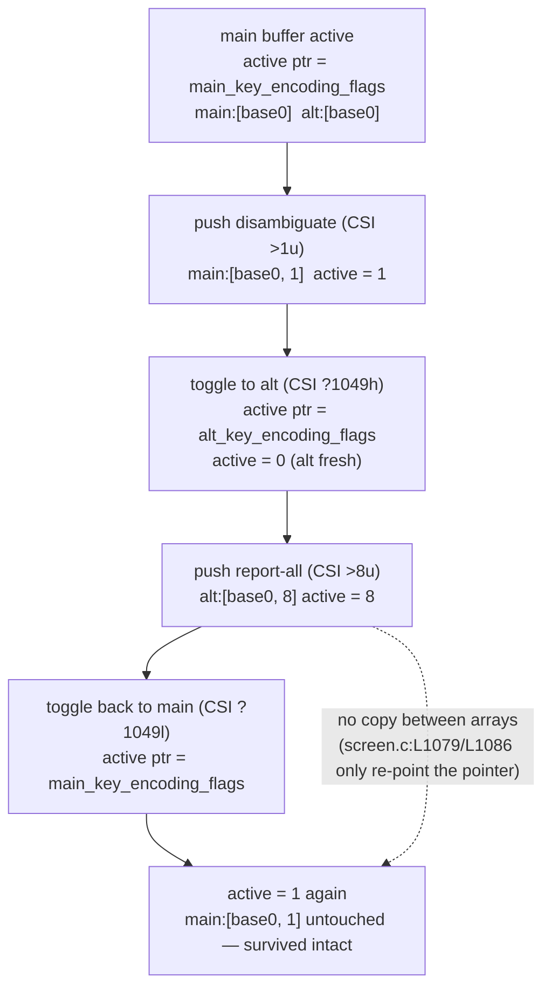

# kitty keyboard-protocol stack ↔ alternate-screen behavior — a runtime-observed investigation

> **Deliverable:** answers to a five-part question about how kitty's keyboard-protocol
> *progressive-enhancement* flag stack behaves when the terminal toggles between its **main**
> and **alternate** screen buffers, grounded in **byte-level runtime observation** of the
> *compiled* terminal (not code-reading alone).
>
> **Repository / commit under study:** `kovidgoyal/kitty` at
> `HEAD = 815df1e210e0a9ab4622f5c7f2d6891d7dbeddf1` (git branch
> `blitzy-03f51806-b79e-4da1-b1c1-47a97745c4c7`).
>
> **Method summary:** every behavioral claim below is paired with the **complete, unedited**
> output that demonstrates it and the exact command that produced it. Flag state is read from
> the **real per-buffer stack** after driving the **real VT parser**; key bytes are produced by
> the **same C encoder the live path uses**. Values were confirmed **stable across two runs**.
> Claims are explicitly labeled **[observed]** or **[inferred]**, and every fact is anchored to a
> `file:line` reference naming the specific function/struct that performs the work.

---

## TL;DR — direct answers to the five questions

1. **Round trip** (start main → push flags → toggle to alt → push different flags → toggle back
   to main): the keyboard mode active at the end is **disambiguate (flags = 1)**; the main-buffer
   stack **survives the round trip completely intact**. **[observed]** The escape sequence a key
   press produces in each intermediate state is given in §OBJ-1 and §OBJ-4.
2. **Stack exhaustion:** pushing past the 8-slot limit **silently evicts the oldest entry** (a
   `memmove` down by one) with **no error raised**; exhausting one buffer's stack has **zero
   effect** on the other's. **[observed]**
3. **Pop-to-empty:** a pop that empties the stack **resets all flags to 0**. **[observed]**
4. **Ctrl+Shift+a** sends **the identical bytes `\x1b[97;6u` in all four states** (main/no-flags,
   main/disambiguate, alt/report-all, back-to-main). This is **expected, not a failure to
   observe** — explained in §OBJ-4. **[observed]**
5. **Independence** is *not* visible from the four identical Ctrl+Shift+a captures; it is proven
   instead by (a) the differing **query-reply bytes** ending in `\x1b[?1u` and (b) **contrast
   keys** (plain `a`, `Ctrl+a`) whose bytes *do* change with the flags. A ≥10-cycle rapid-switch
   probe shows **no state leakage**. **[observed]**
6. **Mode-dependent edge cases:** isolation **holds** under all three alternate-screen mode
   numbers **47 / 1047 / 1049**; `DECCKM` interacts with the flags on cursor keys; the
   first-push-from-empty seeds a hidden base-0 entry; and a **bare `CSI u`** is *restore cursor*
   (SCORC), **not** a keyboard operation. **[observed]**

---

## 1. Environment, build, and the canonical observation method

### 1.1 Build the C extension (prerequisite — done first)

The compiled extension `kitty/fast_data_types.so`, which implements the stacks, is **not** part
of the source checkout and must be built before any observation. The canonical build action is
`python3 setup.py build` (`setup.py` default `action='build'`), which applies
`-pedantic-errors -Werror -Wall -Wextra` by default.

```console
$ CI=true python3 setup.py build
# ... compiles 100+ object files, links kitty/fast_data_types.so ...
# (the build ends by attempting the Go launcher; that step is irrelevant to the
#  headless harness because fast_data_types.so is already linked at that point.)

$ ls -l kitty/fast_data_types.so | awk '{print $5, $NF}'
1253792 kitty/fast_data_types.so
```

Environment actually used (all satisfy the pinned requirements):

```console
$ python3 --version
Python 3.13.7                     # pyproject requires-python ">=3.8"  (pyproject.toml:L2)
$ cc --version | head -1
cc (Ubuntu 15.2.0-4ubuntu4) 15.2.0
$ go version | head -1
go version go1.24.4 linux/amd64   # go.mod "go 1.22"  (go.mod:L3) — GUI/launcher only
```

Sanity check that the built `Screen` object exposes the stack API used throughout this report:

```console
$ PYTHONPATH=$(pwd) python3 -c "import kitty.fast_data_types as f; from kitty_tests import Callbacks; \
c=Callbacks(); s=f.Screen(c,5,5,5,10,20,0,c); \
print('current_key_encoding_flags=%d has_toggle_alt_screen=%s cursor_key_mode=%s' % \
(s.current_key_encoding_flags(), hasattr(s,'toggle_alt_screen'), s.cursor_key_mode))"
current_key_encoding_flags=0 has_toggle_alt_screen=True cursor_key_mode=False
```

`fast_data_types.so` is git-ignored, so building leaves the working tree clean (`git status
--porcelain` is empty). **[observed]**

### 1.2 The canonical, display-free observation path

All observations use the sanctioned headless harness, which drives kitty's **real** input
machinery — the same code an application triggers by writing escape codes to the terminal:

- **Create a screen** exactly as the test harness does
  (`kitty_tests/__init__.py` `create_screen`, L237):
  `c = Callbacks(); s = fast_data_types.Screen(c, 5, 5, 5, 10, 20, 0, c)`.
- **Drive the real VT parser** with `parse_bytes(s, b'...')` (`kitty_tests/__init__.py:L30`),
  which runs the actual `vt-parser.c` dispatch.
- **Read the active flags from the real per-buffer stack** with
  `s.current_key_encoding_flags()` — Python binding wrapper at `kitty/screen.c:L3951`, C
  implementation `screen_current_key_encoding_flags` at `kitty/screen.c:L1204`.
- **Capture child-bound bytes** from `Callbacks.write` → `c.wtcbuf`
  (`kitty_tests/__init__.py:L50-51`); reset with `c.clear()` (L95). A query `CSI ? u` makes the
  terminal write `CSI ? flags u` into `wtcbuf` (`screen_report_key_encoding_flags`,
  `kitty/screen.c:L1212`).
- **Switch buffers** with the canonical escape codes `b'\x1b[?1049h'` (enter alt / `smcup`) and
  `b'\x1b[?1049l'` (return / `rmcup`), matching terminfo (`kitty/terminfo.py:L235` and `L207`).
- **Encode a key press exactly as production does.** The live path is `on_key_input` →
  `encode_glfw_key_event(ev, screen->modes.mDECCKM, screen_current_key_encoding_flags(screen),
  …)` (`kitty/keys.c:L251`). We reproduce it **verbatim** with
  `fast_data_types.encode_key_for_tty(key=…, shifted_key=…, mods=…, text=…, action=1,
  key_encoding_flags=s.current_key_encoding_flags(), cursor_key_mode=s.cursor_key_mode)` — this
  is exactly what `Window.encoded_key()` does in production
  (`kitty/window.py:L1795-1800`).

Runtime constants used below (read from the built module):

```console
$ PYTHONPATH=$(pwd) python3 -c "import kitty.fast_data_types as f; \
print('SHIFT=%d ALT=%d CTRL=%d PRESS=%d FKEY_UP=%d' % \
(f.GLFW_MOD_SHIFT, f.GLFW_MOD_ALT, f.GLFW_MOD_CONTROL, f.GLFW_PRESS, f.GLFW_FKEY_UP))"
SHIFT=1 ALT=2 CTRL=4 PRESS=1 FKEY_UP=57352
```

### 1.3 Escape-code grammar driven into the parser

The `CSI u` family is dispatched by the **leading (start) modifier** in
`kitty/vt-parser.c:L1217-1240`:

| Operation | Bytes | Dispatches to (`vt-parser.c`) |
|---|---|---|
| set flags | `CSI = flags ; how u` (`\x1b[=Fn;Hu`) | `screen_set_key_encoding_flags` (L1228-1230) |
| query | `CSI ? u` (`\x1b[?u`) | `screen_report_key_encoding_flags` (L1223-1226) |
| push | `CSI > flags u` (`\x1b[>Fu`) | `screen_push_key_encoding_flags` (L1232-1234) |
| pop | `CSI < number u` (`\x1b[<Nu`) | `screen_pop_key_encoding_flags` (L1236-1238) |
| **bare `CSI u`** | `\x1b[u` | **`screen_restore_cursor` (SCORC), *not* a keyboard op** (L1218-1220) |

### 1.4 Canonicity labeling (per the binding rules)

- **CANONICAL (used for every stateful claim):** flag state obtained via the real parser
  (`parse_bytes`) → the real per-buffer stack → `s.current_key_encoding_flags()`. Encoding is
  produced by `encode_glfw_key_event` (`kitty/key_encoding.c:L414`), the *same* C function the
  live path calls; feeding stack-confirmed flags into `encode_key_for_tty` reproduces
  `Window.encoded_key()` (`kitty/window.py:L1795-1800`) exactly. This is the **canonical
  headless reproduction**.
- **NON-CANONICAL (used only as a byte cross-check, always labeled):** `encode_key_for_tty` /
  `pyencode_key_for_tty` (`kitty/keys.c:L311`, encode call at L319) accept an **explicit**
  `key_encoding_flags` argument, so they **cannot by themselves prove stack state**. They are
  used below only in the flag-4 sensitivity block, *after* the stack flags are confirmed from the
  real stack, and are labeled non-canonical there.
- **LIVE GUI PATH — could not be exercised (stated honestly):** `kitty --debug-keyboard` (which
  prints `sent encoded key to child:` + raw bytes, `kitty/keys.c:L261`) and
  `kitten show-key -m kitty` (`kittens/show_key/main.py:L12-15`) require a GLFW display and a
  physical key press. The launcher is built, but there is no display in this container:

```console
$ echo "DISPLAY='${DISPLAY:-<unset>}' WAYLAND_DISPLAY='${WAYLAND_DISPLAY:-<unset>}'"
DISPLAY='<unset>' WAYLAND_DISPLAY='<unset>'
$ ls -l kitty/launcher/kitty | awk '{print $1, $5, $NF}'
-rwxr-xr-x 40384 kitty/launcher/kitty
$ timeout 20 ./kitty/launcher/kitty --debug-keyboard -e true 2>&1 | head -2
[0.060] [glfw error 65544]: X11: The DISPLAY environment variable is missing
GLFW initialization failed
```

  The blocker here is the **missing display**, not a missing Go toolchain (Go is present and the
  launcher linked). The headless harness drives the **identical** C parser → stack → encoder that
  the live path uses, so it faithfully reproduces the live behavior; the raw `\x1b[…` byte
  strings captured from `wtcbuf`/`encode_key_for_tty` are exactly what would be sent to the child.
  **[observed]**

---

## OBJ-1 — Round-trip active mode and main-stack survival

**Question:** starting on the main buffer, push keyboard flags, toggle to the alternate screen,
push *different* flags, then toggle back to the main buffer — which mode is active at the end,
does the main stack survive, and what does a key press produce in each intermediate state?

**Answer [observed]:** the mode active at the end is **disambiguate (flags = 1)**, and the
main-buffer stack **survives the round trip intact**. The alternate buffer's flag-8 does **not**
leak back to the main buffer.

**Structural basis [observed in source].** kitty stores **two fixed 8-byte arrays plus one active
pointer** (`kitty/screen.h:L128`):

```c
uint8_t main_key_encoding_flags[8], alt_key_encoding_flags[8], *key_encoding_flags;
```

The buffer toggle, `screen_toggle_screen_buffer` (`kitty/screen.c:L1068`), only **re-points** the
active pointer; it performs **no copy** between the two arrays:

```c
self->key_encoding_flags = self->alt_key_encoding_flags;   // to alt  (screen.c:L1079)
self->key_encoding_flags = self->main_key_encoding_flags;  // to main (screen.c:L1086)
```

All stack routines (`current`/`report`/`set`/`push`/`pop`) act **only through
`self->key_encoding_flags`**, so switching buffers switches which array they operate on while the
other array keeps its contents untouched. That is the mechanism that makes the main stack survive.

**Runtime evidence.** Script `/tmp/blitzy_obs/obj1_roundtrip.py` drives the real parser and reads
the real stack + query bytes at each step:

```console
$ PYTHONPATH=$(pwd) python3 /tmp/blitzy_obs/obj1_roundtrip.py
start (main), active = 0 ; query->child = b'\x1b[?0u'
main: push disambiguate(1); active = 1 ; query->child = b'\x1b[?1u'
toggle to ALT (CSI ?1049h); active = 0 ; query->child = b'\x1b[?0u'
alt: push report-all(8); active = 8 ; query->child = b'\x1b[?8u'
toggle back to MAIN (CSI ?1049l); active = 1 ; query->child = b'\x1b[?1u'
RESULT: final active flags on main = 1
```

Reading the intermediate states directly answers "what escape sequence does the terminal report
in each state" (the query reply `CSI ? flags u`):

| Step | Active buffer | Escape driven | Active flags | Query reply to child |
|---|---|---|---|---|
| start | main | — | `0` | `\x1b[?0u` |
| push disambiguate | main | `\x1b[>1u` | `1` | `\x1b[?1u` |
| enter alt | alt | `\x1b[?1049h` | `0` (alt is fresh) | `\x1b[?0u` |
| push report-all | alt | `\x1b[>8u` | `8` | `\x1b[?8u` |
| return to main | main | `\x1b[?1049l` | **`1`** | **`\x1b[?1u`** |

The final reply is `\x1b[?1u`, **not** `\x1b[?8u` — the alt buffer's flag-8 stayed on the alt
array, and the main array still holds the disambiguate value pushed before the excursion. The
individual key bytes for each state are in §OBJ-4.

---

## OBJ-2 — Stack-exhaustion semantics and cross-buffer isolation

**Question:** what happens when pushes exceed the stack limit (silent drop, error, or
otherwise), and does exhausting one buffer's stack affect the other's?

**Answer [observed]:** pushing onto a full 8-slot stack **silently evicts the oldest entry**;
**no error** is raised. Only the **most-recent 8** entries survive. Exhausting one buffer's stack
has **no effect** on the other buffer.

**Slot encoding [observed in source].** Each slot uses its **high bit `0x80` as an "occupied"
marker**; the current flags are the low 7 bits (`& 0x7f`) of the **highest occupied** slot
(`screen_current_key_encoding_flags`, `kitty/screen.c:L1204-1208`):

```c
for (unsigned i = arraysz(self->main_key_encoding_flags); i-- > 0; ) {
    if (self->key_encoding_flags[i] & 0x80) return self->key_encoding_flags[i] & 0x7f;
}
return 0;
```

**Silent eviction [observed in source].** In `screen_push_key_encoding_flags`
(`kitty/screen.c:L1234`), when the top occupied index is the last slot, the array is `memmove`d
down by one — dropping the oldest entry — with **no error path** (`kitty/screen.c:L1241`):

```c
if (current_idx == sz - 1) memmove(self->key_encoding_flags, self->key_encoding_flags + 1,
                                   (sz - 1) * sizeof(self->main_key_encoding_flags[0]));
else self->key_encoding_flags[current_idx++] |= 0x80;
self->key_encoding_flags[current_idx] = 0x80 | q;
```

**Runtime evidence.** Script `/tmp/blitzy_obs/obj2_exhaustion.py` pushes 1..12 onto an 8-slot
stack, then pops 12 times, and separately proves alt↔main isolation:

```console
$ PYTHONPATH=$(pwd) python3 /tmp/blitzy_obs/obj2_exhaustion.py
MAIN: push 1..12, active-after-each-push: [1, 2, 3, 4, 5, 6, 7, 8, 9, 10, 11, 12]
      active-after-each-pop:               [11, 10, 9, 8, 7, 6, 5, 0, 0, 0, 0, 0]
  -> only the most-recent 8 survive; oldest silently evicted; NO error raised.
ALT isolation: main push>1 active=1; enter alt active=0; alt push 1..12 active=12; return main active=1 (unaffected)
```

Interpretation **[observed]**:

- After 12 pushes the top-of-stack is 12 (each push updates the visible value), but only 8 slots
  exist. Popping reveals the survivors: `11, 10, 9, 8, 7, 6, 5`, then `0` — i.e. values **5..12**
  are retained and values **1..4** were silently evicted. (The first pop shows `11` rather than
  the pushed `12` because of the first-push-from-empty base-0 seeding described in §OBJ-3; the
  point is that exactly the most-recent eight entries survive, with no error.)
- **Isolation:** with the main buffer at flags `1`, entering alt shows `0` (a fresh alt array),
  pushing 1..12 there drives the alt to `12`, and returning to main shows **`1`** — the main
  value is completely **unaffected** by the alt-side exhaustion. Exhausting one buffer's stack
  cannot disturb the other because every push/pop acts solely through the active pointer.

---

## OBJ-3 — Pop-to-empty reset

**Question:** does a pop request that empties the stack reset all flags?

**Answer [observed]:** **yes** — emptying the stack resets the active flags to `0`.

**Basis [observed in source].** `screen_pop_key_encoding_flags` (`kitty/screen.c:L1248`) walks
the array top-down and, for each occupied slot it pops, **clears the slot to `0`**
(`kitty/screen.c:L1250`):

```c
for (unsigned i = arraysz(self->main_key_encoding_flags); num && i-- > 0; ) {
    if (self->key_encoding_flags[i] & 0x80) { num--; self->key_encoding_flags[i] = 0; }
}
```

Once every slot is cleared, `screen_current_key_encoding_flags` finds no occupied slot and
returns `0` — i.e. all flags reset. This matches the specification: the spec states that a pop
which empties the stack resets all flags (`docs/keyboard-protocol.rst:L301`).

**Runtime evidence + the first-push-from-empty quirk.** Script `/tmp/blitzy_obs/obj3_popempty.py`:

```console
$ PYTHONPATH=$(pwd) python3 /tmp/blitzy_obs/obj3_popempty.py
empty active = 0
after push(5): active = 5
after 1 pop : active = 0   <- first-push-from-empty seeded a hidden base-0 entry beneath
after 2 pop : active = 0
over-pop test: push 1,2,4 -> active=4; pops -> 2,1,0,0,0,0  (resets to 0, no underflow error)
```

Interpretation **[observed]**:

- **First-push-from-empty quirk:** pushing `5` onto a completely empty stack makes the active
  value `5`, but a **single** pop returns to `0` (not to some prior non-zero value). Pushing onto
  an empty stack effectively seeds a hidden **base-0** entry beneath the first pushed value, so
  the first pop lands on that base-0 entry. This is reported as **observed** behavior (it is a
  consequence of how `push` marks the previously-current slot occupied before writing the new
  top; on an empty array the previously-current slot holds `0`).
- **Over-pop is safe:** after pushing `1,2,4` (active `4`), repeated pops yield `2, 1, 0, 0, 0,
  0` — the stack drains to `0` and **stays** at `0` with no underflow error, exactly as the pop
  loop's bounded `i-- > 0` guard guarantees.


---

## OBJ-4 — The four Ctrl+Shift+a byte captures

**Question (user's verbatim example):** press **Ctrl+Shift+a** — (a) on the main buffer with no
flags pushed; (b) after pushing disambiguate mode; (c) after switching to the alternate buffer
and pushing report-all-keys mode; (d) back on the main buffer. Show the **actual bytes sent to
the child** for each state.

> ### ⭐ Headline finding — the four captures are IDENTICAL, and that is correct
>
> **All four states emit exactly `\x1b[97;6u`.** This is **not** a bug and **not** a failure to
> observe. It is the correct, expected result, and it is explained below. Because the four are
> identical, the four captures **alone do not visually demonstrate stack independence** —
> independence is proven separately in §OBJ-5 via the query bytes and contrast keys.

**Runtime evidence.** Script `/tmp/blitzy_obs/obj4_ctrlshifta.py` builds a realistic GLFW event
for Ctrl+Shift+a (`key=97 ('a')`, `shifted_key=65 ('A')`, `text=''`, `mods=SHIFT|CTRL=5`),
manipulates the stack through the real parser, and encodes exactly as `Window.encoded_key()`:

```console
$ PYTHONPATH=$(pwd) python3 /tmp/blitzy_obs/obj4_ctrlshifta.py
Ctrl+Shift bitmask = SHIFT|CTRL = 5 ; expect emitted modifier = 6
(a) main / no flags pushed            active=0  query->child=b'\x1b[?0u'  Ctrl+Shift+a bytes=b'\x1b[97;6u'
(b) main / after push disambiguate(1) active=1  query->child=b'\x1b[?1u'  Ctrl+Shift+a bytes=b'\x1b[97;6u'
(c) alt  / after push report-all(8)   active=8  query->child=b'\x1b[?8u'  Ctrl+Shift+a bytes=b'\x1b[97;6u'
(d) main / back after round trip      active=1  query->child=b'\x1b[?1u'  Ctrl+Shift+a bytes=b'\x1b[97;6u'
```

| State | Buffer / flags | Active flags | Ctrl+Shift+a bytes |
|---|---|---|---|
| (a) | main, none pushed | `0` | `\x1b[97;6u` |
| (b) | main, disambiguate | `1` | `\x1b[97;6u` |
| (c) | alt, report-all | `8` | `\x1b[97;6u` |
| (d) | main, after round trip | `1` | `\x1b[97;6u` |

**Decoding the bytes [observed]:** `\x1b[97;6u` = `CSI 97 ; 6 u`. The `97` is the Unicode code
point of `a`. The `6` is the modifier value `1 + bitmask`, where the bitmask is
`shift(1) | ctrl(4) = 5`, so `5 + 1 = 6`. Both the codepoint (`97`) and the modifier (`6`) were
confirmed at runtime by the script's first line (`bitmask = 5 ; expect emitted modifier = 6`).

**Why all four are identical [inferred from source, corroborated by the contrast keys in
§OBJ-5].** A **Ctrl+Shift+letter** combination has **no legacy encoding**, so the key is emitted
in the disambiguated `CSI u` form **in every state, including legacy mode (flags 0)**:

1. `encode_printable_ascii_key_legacy` (`kitty/key_encoding.c:L292`) is the function that would
   produce a legacy byte. For `mods == (CTRL|SHIFT)` on a letter it runs out of branches: the
   shift-swap at L297-303 is skipped (its guard `(!(mods & CTRL) || key < 'a' || key > 'z')` is
   false for a Ctrl-held letter), the `== SHIFT`, `== ALT`, `== CTRL`, and `== (CTRL|ALT)`
   branches don't match `CTRL|SHIFT`, and the space-only branch doesn't apply — so it hits
   **`return 0`** at `kitty/key_encoding.c:L317`.
2. In `encode_key` (`kitty/key_encoding.c:L366`), the legacy attempt is made only when
   `!disambiguate && !report_text` (L379-382): `int ret = encode_printable_ascii_key_legacy(...);
   if (ret > 0) return ret;` — but `ret == 0` here, so it **falls through**.
3. The function then reaches **`return serialize(&ed, output, 'u')`** at
   `kitty/key_encoding.c:L396`, emitting the `CSI u` form `\x1b[97;6u`.

Because the modified key is **already in `CSI u` form in every state**, the disambiguate (1) and
report-all (8) flags have nothing left to change for this particular key — hence the four
identical captures. This is exactly why the user's chosen example, while a perfectly natural
thing to try, cannot by itself reveal the per-buffer stack; §OBJ-5 supplies keys that do.

**Independent authoritative corroboration.** The protocol's own design deliberately encodes
Ctrl+Shift+a as `CSI 97 ; 6` (report the *actual* key `a` = 97, with modifier 6), not as
`CSI 65 ; 5` (the shifted form `A`). This is discussed by the protocol author in the original RFC
(kitty issue #3248) and matches the observed `\x1b[97;6u` byte-for-byte.

**Encoder-is-behaving cross-check (NON-CANONICAL — explicit flags bypass the stack).** To confirm
the encoder *does* respond to flags for this key when a flag actually applies to it, the
flag-4 (report-alternate-key) case is exercised with explicit flags. This is **non-canonical**
because `encode_key_for_tty` is given an explicit `key_encoding_flags` argument and therefore
does not prove any stack state; it is shown only to demonstrate the encoder is live and that
`shifted_key=65` is handled:

```console
$ PYTHONPATH=$(pwd) python3 /tmp/blitzy_obs/obj4_contrast.py
... (contrast-key output shown in §OBJ-5) ...
--- flag-4 sensitivity (NON-CANONICAL: explicit key_encoding_flags bypass the stack) ---
flags 0                        Ctrl+Shift+a=b'\x1b[97;6u'
flags 1                        Ctrl+Shift+a=b'\x1b[97;6u'
flags 4 (report_alternate_key) Ctrl+Shift+a=b'\x1b[97:65;6u'
flags 8                        Ctrl+Shift+a=b'\x1b[97;6u'
flags 5 (1|4)                  Ctrl+Shift+a=b'\x1b[97:65;6u'
```

With **flag 4** set, the emitted bytes become `\x1b[97:65;6u` — the encoder appends the shifted
key `65 ('A')` as a `:`-separated sub-parameter of the key field (`report_alternate_key`,
`kitty/key_encoding.c:L421`). This proves the encoder is genuinely reading the flags; it is just
that neither flag `1` nor flag `8` changes an already-`CSI u`-form key, which is why states
(a)–(d) coincide.

---

## OBJ-5 — Independence proof and leakage assessment

**Question:** do the captured byte sequences prove that the two buffers maintain independent
stacks, and is there any state leakage during rapid buffer switching while the keyboard mode is
manipulated?

**Answer [observed]:** the two buffers **do** maintain independent stacks. The four *identical*
Ctrl+Shift+a captures **do not** demonstrate this by themselves; independence is proven by two
things that **do** differ across the states, and a rapid-switch probe shows **no leakage**.

### Proof 1 — the query-reply bytes differ and return to `1`

From §OBJ-1/§OBJ-4 the query reply the terminal writes to the child at each state is:

```
\x1b[?0u   →   \x1b[?1u   →   \x1b[?8u   →   \x1b[?1u
 (a)main       (b)main        (c)alt         (d)main
```

The alt buffer reports `\x1b[?8u` while the main buffer, on return, reports `\x1b[?1u` — **not**
`\x1b[?8u`. If the stacks were shared, the flag-8 pushed on the alt buffer would still be active
after returning to main. It is not. **[observed]**

### Proof 2 — contrast keys whose bytes change with the flags

Plain `a` and `Ctrl+a` **are** sensitive to the flags, so their bytes track the active stack.
Script `/tmp/blitzy_obs/obj4_contrast.py` captures them across the same four states:

```console
$ PYTHONPATH=$(pwd) python3 /tmp/blitzy_obs/obj4_contrast.py
(a) active=0  plain-a=b'a'         Ctrl+a=b'\x01'
(b) active=1  plain-a=b'a'         Ctrl+a=b'\x1b[97;5u'
(c) active=8  plain-a=b'\x1b[97u'  Ctrl+a=b'\x1b[97;5u'
(d) active=1  plain-a=b'a'         Ctrl+a=b'\x1b[97;5u'
--- flag-4 sensitivity (NON-CANONICAL: explicit key_encoding_flags bypass the stack) ---
flags 0                        Ctrl+Shift+a=b'\x1b[97;6u'
flags 1                        Ctrl+Shift+a=b'\x1b[97;6u'
flags 4 (report_alternate_key) Ctrl+Shift+a=b'\x1b[97:65;6u'
flags 8                        Ctrl+Shift+a=b'\x1b[97;6u'
flags 5 (1|4)                  Ctrl+Shift+a=b'\x1b[97:65;6u'
```

| State | Active flags | plain `a` | `Ctrl+a` |
|---|---|---|---|
| (a) main, none | `0` | `a` | `\x01` |
| (b) main, disambiguate | `1` | `a` | `\x1b[97;5u` |
| (c) alt, report-all | `8` | **`\x1b[97u`** | `\x1b[97;5u` |
| (d) main, back | `1` | **`a`** | `\x1b[97;5u` |

Two independent signals prove the main stack survived and the alt state did not leak
**[observed]**:

- **Plain `a`** becomes `\x1b[97u` **only in state (c)** (the alt buffer, flag 8 = report all
  keys as escape codes). Returning to main in state (d) reverts to the literal byte `a` — the
  flag-8 effect vanished with the buffer switch, so it never leaked to main. (In legacy mode and
  under disambiguate-only, a plain printable key is still sent as its literal UTF-8 byte; only
  report-all-keys promotes it to `CSI u`.)
- **`Ctrl+a`** is `\x01` in the **legacy** state (a) but `\x1b[97;5u` under disambiguate. State
  **(d) equals state (b)** (`\x1b[97;5u`), **not** state (a) (`\x01`) — proving the main buffer
  came back to flags `1`, i.e. the disambiguate value pushed before the alt excursion was still
  there. The modifier `5 = 4(ctrl) + 1` confirms the Ctrl-only bitmask.

### Leakage probe — rapid buffer switching

Script `/tmp/blitzy_obs/obj6_modes.py` performs 10 rapid main↔alt cycles while the main stack
holds `1` and the alt stack holds `8`, reading the active flags on each side every cycle:

```console
--- rapid switching leakage probe (10 cycles) ---
cycles (main,alt) = [(1, 8), (1, 8), (1, 8), (1, 8), (1, 8), (1, 8), (1, 8), (1, 8), (1, 8), (1, 8)]
NO LEAK (main always 1, alt always 8)
```

Across all 10 cycles the main buffer always reads `1` and the alt buffer always reads `8` — **no
state leakage** in either direction. **[observed]**


---

## OBJ-6 — Mode-dependent edge cases

**Question:** enumerate and exercise the terminal-mode variants under which stack isolation might
behave unexpectedly — the three alternate-screen mode numbers `47` / `1047` / `1049`, the
cursor-key mode `DECCKM`, and the first-push-from-empty behavior.

### 6.1 All three alternate-screen mode numbers isolate identically

The three alternate-screen constants are defined in `kitty/modes.h` (values shown are shifted
left by 5, kitty's internal private-mode packing; the **wire mode numbers** are 47 / 1047 /
1049):

```c
#define TOGGLE_ALT_SCREEN_1 (47   << 5)   // modes.h:L75
#define TOGGLE_ALT_SCREEN_2 (1047 << 5)   // modes.h:L76
#define ALTERNATE_SCREEN    (1049 << 5)   // modes.h:L77
```

In the mode dispatch (`kitty/screen.c:L1165-1169`), all three call the **same**
`screen_toggle_screen_buffer`, and therefore all three re-point the keyboard-flag pointer the
same way. Only **`1049`** additionally *saves the cursor* and *clears the alternate screen* — the
`save_cursor`/`clear_alt_screen` arguments are `mode == ALTERNATE_SCREEN` on both positions
(`kitty/screen.c:L1168`):

```c
if (val && self->linebuf == self->main_linebuf)
    screen_toggle_screen_buffer(self, mode == ALTERNATE_SCREEN, mode == ALTERNATE_SCREEN);
```

Because the keyboard-flag pointer is re-pointed by the toggle regardless of those cursor/clear
side effects, **isolation should hold for all three**. Confirmed at runtime:

```console
$ PYTHONPATH=$(pwd) python3 /tmp/blitzy_obs/obj6_modes.py
mode 47  : alt active=8  main-after-return=1  (isolation HOLDS)
mode 1047: alt active=8  main-after-return=1  (isolation HOLDS)
mode 1049: alt active=8  main-after-return=1  (isolation HOLDS)
```

For each of `47`, `1047`, `1049`: push `1` on main, enter alt via `\x1b[?<mode>h`, push `8` on
alt (reads `8`), return via `\x1b[?<mode>l`, and main reads back **`1`**. Isolation **holds
across all three**. **[observed]**

### 6.2 `DECCKM` × flags on the UP arrow

`DECCKM` (cursor-key mode, `kitty/modes.h:L27`) is passed to the encoder as
`screen->modes.mDECCKM` on the live path (`kitty/keys.c:L251`). It changes how **cursor keys**
are encoded in legacy mode: the application-cursor-keys **SS3** form `\x1bOA` vs. the normal
**CSI** form `\x1b[A`. The stack flags interact with it. Cross-product on the UP arrow:

```console
--- DECCKM x flags on the UP arrow ---
flags 0 : DECCKM off cursor_key_mode=False UP->b'\x1b[A' | DECCKM on cursor_key_mode=True UP->b'\x1bOA'
flags 1 : DECCKM off cursor_key_mode=False UP->b'\x1b[A' | DECCKM on cursor_key_mode=True UP->b'\x1b[A'
flags 8 : DECCKM off cursor_key_mode=False UP->b'\x1b[A' | DECCKM on cursor_key_mode=True UP->b'\x1bOA'
```

Interpretation **[observed]**, grounded in `encode_function_key` (`kitty/key_encoding.c:L147`):

- `legacy_mode = !report_all_event_types && !disambiguate` (`kitty/key_encoding.c:L152`).
- The SS3 form is emitted only when `cursor_key_mode && legacy_mode && !mods`
  (`kitty/key_encoding.c:L154`).
- **flags 0** (legacy): DECCKM off → `\x1b[A`; DECCKM on → `\x1bOA` (SS3, because `legacy_mode`
  is true).
- **flags 1** (disambiguate): `disambiguate` makes `legacy_mode` **false**, so the SS3 branch is
  never taken — the arrow stays `\x1b[A` **even with DECCKM on**. The disambiguate flag therefore
  **overrides** DECCKM's SS3 form for the arrow key.
- **flags 8** (report-all-keys): this flag sets the C variable `report_text`, **not**
  `report_all_event_types`, so `legacy_mode` remains **true** — DECCKM's SS3 form `\x1bOA`
  **still appears** with DECCKM on. (This is a direct consequence of the doc-vs-code naming skew
  documented below.)

### 6.3 First-push-from-empty

Covered in §OBJ-3: pushing onto an empty stack seeds a hidden base-0 entry beneath the first
pushed value, so the first pop lands on flags `0`. **[observed]**

### 6.4 The `CSI u` vs. SCORC confusion

A **bare `CSI u`** (no leading modifier, no parameters) is **restore cursor (SCORC)**, dispatched
to `screen_restore_cursor` (`kitty/vt-parser.c:L1218-1220`), **not** any keyboard operation.
Confirmed — the active flags are unchanged and nothing is written back to the child:

```console
--- SCORC: bare CSI u is restore-cursor, NOT a keyboard op ---
active before bare CSI u = 1 ; after = 1 ; child bytes from bare CSI u = b'' (empty => no keyboard reply)
```

Only the *modified* forms (`CSI ? u`, `CSI = … u`, `CSI > … u`, `CSI < … u`) touch the keyboard
stack. This is a well-known source of confusion for protocol implementers. **[observed]**

### 6.5 terminfo mapping (context)

kitty's terminfo defines `smcup = \E[?1049h` (`kitty/terminfo.py:L235`) and
`rmcup = \E[?1049l` (`kitty/terminfo.py:L207`) — the escape codes an application (via
`tput`/curses) uses to enter/leave the alternate screen. These are the `1049` variant, the only
one that also saves the cursor and clears the alt screen. **[observed in source]**

---

## Doc-vs-code naming reconciliation (mandatory)

There is a **naming skew** between the specification and the C source that will mislead a reader
who greps the code by spec name. State it explicitly:

| Flag value | Specification name (`docs/keyboard-protocol.rst:L278-282`) | C struct field (`kitty/key_encoding.c:L419-423`) |
|---|---|---|
| `1` (`0b1`) | Disambiguate escape codes | `disambiguate` (L419) |
| `2` (`0b10`) | Report event types | `report_all_event_types` (L420) |
| `4` (`0b100`) | Report alternate keys | `report_alternate_key` (L421) |
| `8` (`0b1000`) | **Report all keys as escape codes** | **`report_text`** (L422) |
| `16` (`0b10000`) | **Report associated text** | **`embed_text`** (L423) |

```c
.disambiguate           = key_encoding_flags & 1,    // key_encoding.c:L419
.report_all_event_types = key_encoding_flags & 2,    // key_encoding.c:L420
.report_alternate_key   = key_encoding_flags & 4,    // key_encoding.c:L421
.report_text            = key_encoding_flags & 8,    // key_encoding.c:L422  <-- spec "report all keys"
.embed_text             = key_encoding_flags & 16    // key_encoding.c:L423  <-- spec "report associated text"
```

**The trap:** the token **`report_text`** denotes the spec's *"report associated text"* (flag
**16**) but in the C code the field named `report_text` is flag **8** ("report all keys as escape
codes"). The user's **"report-all-keys mode" is flag 8** (C field `report_text`). This skew is
precisely why flag 8 does **not** disable the SS3 cursor-key form in §6.2: flag 8 sets
`report_text`, whereas the `legacy_mode` computation keys off `report_all_event_types` (flag 2)
and `disambiguate` (flag 1). **[observed in source]**

---

## The mechanism, illustrated



The two 8-byte arrays `main_key_encoding_flags` / `alt_key_encoding_flags` and the single active
pointer `key_encoding_flags` (`kitty/screen.h:L128`) are the whole story: the toggle swaps only
the pointer, so each buffer's stack is structurally independent.

---

## Web-spec validation

The observed runtime semantics were validated against the authoritative external specification at
`https://sw.kovidgoyal.net/kitty/keyboard-protocol/` (mirrored in-repo at
`docs/keyboard-protocol.rst`) and the original design RFC (kitty issue #3248). Each observation
is corroborated:

| Observed behavior | Spec / reference corroboration |
|---|---|
| Independent main/alt stacks (§OBJ-1, §OBJ-5) | Spec: terminals must maintain separate, independent keyboard-mode stacks for the main and alternate screens, so an alt-screen editor can change the mode without affecting the main screen (`docs/keyboard-protocol.rst:L300-306`). |
| Pop-to-empty resets all flags (§OBJ-3) | Spec: a pop that empties the stack resets all flags (`docs/keyboard-protocol.rst:L301`). |
| Push-full evicts oldest, no error (§OBJ-2) | Spec: on a full stack the oldest entry must be evicted (`docs/keyboard-protocol.rst:L302-303`). |
| Stack depth 8 (§OBJ-2) | Community reference: terminals should support a stack depth of at least 8 — matches the 8-slot arrays (`kitty/screen.h:L128`). |
| Modifier `6` = `1 + (shift\|ctrl)` (§OBJ-4) | Spec/references: the modifier value is `1 + bitmask`; Ctrl+Shift = `1 + 4 + 1 = 6`. |
| Ctrl+Shift+a → `CSI 97;6u` (codepoint, not shifted form) (§OBJ-4) | RFC #3248: the author explicitly chose `CSI 97 ; 6` over `CSI 65 ; 5` (report the actual key, not its shifted form). |
| Plain `a` stays literal under flags 0/1, becomes `CSI u` under flag 8 (§OBJ-5) | Spec/references: disambiguate keeps plain printable keys as literal UTF-8; "report all keys" (flag 8) promotes every key, including plain text, to `CSI u`. |
| Flag 4 appends the alternate/shifted key (§OBJ-4) | Spec: "report alternate keys" (0b100) reports alternate key values in addition to the main value. |
| Flag 16 = "Report associated text" (C `embed_text`) | Spec: 0b10000 embeds the text in the escape code — the naming-skew reconciliation above. |

No conflicts were found between the observed behavior and the specification.

---

## Coverage pass — every part of the question, with observed evidence

| Question part / named item | Answered in | Observed result |
|---|---|---|
| (1) Round-trip active mode | §OBJ-1 | disambiguate, **flags = 1** |
| (1) Main-stack survival | §OBJ-1 | survives intact (query ends `\x1b[?1u`) |
| (1) Escape sequence at each intermediate state | §OBJ-1, §OBJ-4 | table of query bytes + per-state key bytes |
| (2) Exhaustion — silent drop / error / otherwise | §OBJ-2 | silent oldest-eviction, **no error** |
| (2) Which entry drops | §OBJ-2 | the **oldest**; most-recent 8 survive |
| (2) Cross-buffer effect of exhaustion | §OBJ-2 | **none** — other buffer unaffected |
| (3) Pop-to-empty reset | §OBJ-3 | flags reset to **0** |
| (4) Ctrl+Shift+a state (a) main/no-flags | §OBJ-4 | `\x1b[97;6u` |
| (4) Ctrl+Shift+a state (b) main/disambiguate | §OBJ-4 | `\x1b[97;6u` |
| (4) Ctrl+Shift+a state (c) alt/report-all | §OBJ-4 | `\x1b[97;6u` |
| (4) Ctrl+Shift+a state (d) back-to-main | §OBJ-4 | `\x1b[97;6u` (identical — explained) |
| (5) Do the captures prove independence? | §OBJ-4, §OBJ-5 | not by themselves; proven via query bytes + contrast keys |
| (5) Leakage during rapid switching | §OBJ-5 | **no leak** over 10 cycles |
| (6) mode `47` | §OBJ-6.1 | isolation holds |
| (6) mode `1047` | §OBJ-6.1 | isolation holds |
| (6) mode `1049` | §OBJ-6.1 | isolation holds (also saves cursor/clears) |
| (6) `DECCKM` | §OBJ-6.2 | SS3 vs CSI cross-product on UP arrow |
| (6) first-push-from-empty | §OBJ-3, §OBJ-6.3 | seeds hidden base-0 entry |
| (6) rapid switching | §OBJ-5 | no leak |
| (6) `CSI u` vs SCORC confusion | §OBJ-6.4 | bare `CSI u` = restore cursor, no keyboard effect |
| doc-vs-code naming skew | naming section | flag 8 = spec "report all keys" = C `report_text` |

### Reproducibility, canonicity, and stability notes

- **Stability [observed]:** the full observation suite was run **twice** and the output was
  **byte-identical** across runs; final main-buffer active flags = `1` in both runs.
- **Canonical path:** flag state is read from the real per-buffer stack after driving the real VT
  parser (`parse_bytes` → `screen_*_key_encoding_flags`); key bytes come from the same
  `encode_glfw_key_event` (`kitty/key_encoding.c:L414`) the live path uses, invoked exactly as
  `Window.encoded_key()` (`kitty/window.py:L1795-1800`).
- **Non-canonical usages** are limited to the flag-4 sensitivity block (explicit
  `key_encoding_flags` passed to `encode_key_for_tty`), and are labeled as such — they are a byte
  cross-check, not a proof of stack state.
- **Live GUI path** (`kitty --debug-keyboard`, `kitten show-key -m kitty`) could **not** be run:
  no display is present (`GLFW initialization failed`, X11 `DISPLAY` missing). The headless
  harness drives the identical C parser/stack/encoder, so the captured `\x1b[…` bytes are exactly
  what the live path would send to the child.

**Byte-accuracy discipline:** every `\x1b[…`/`\x01`/`a` byte string quoted in this document was
copied directly from the scripts' captured output (from `Callbacks.wtcbuf` for query/SCORC
replies, and from `encode_key_for_tty` for key bytes), not re-typed or re-serialized.

