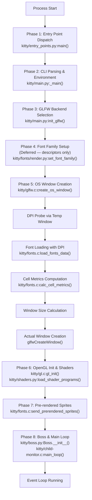
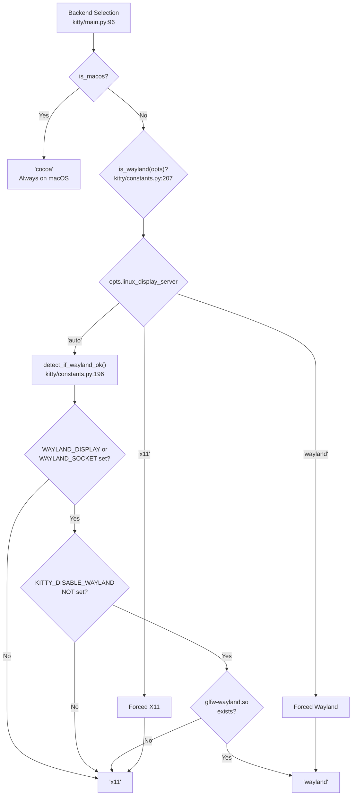
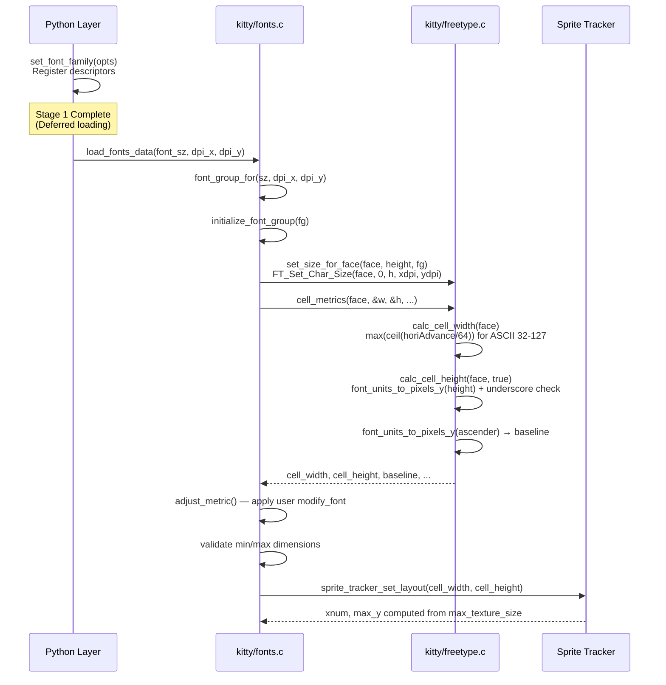
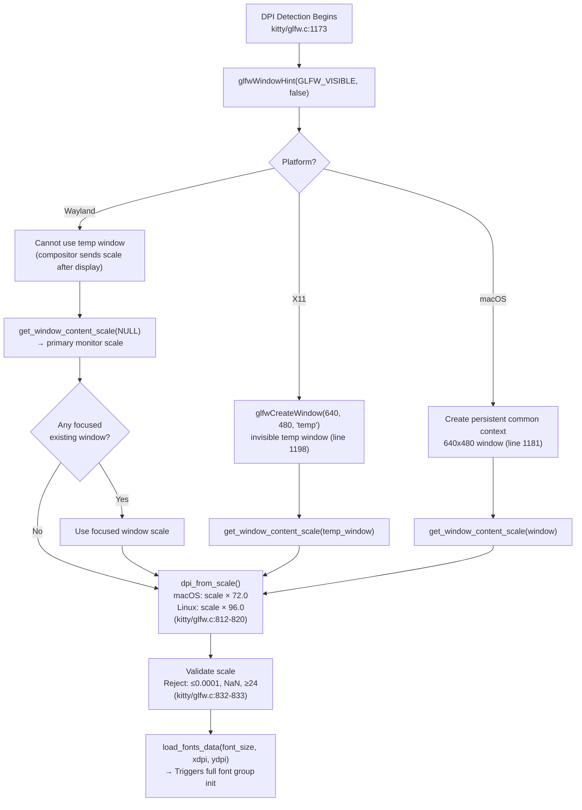
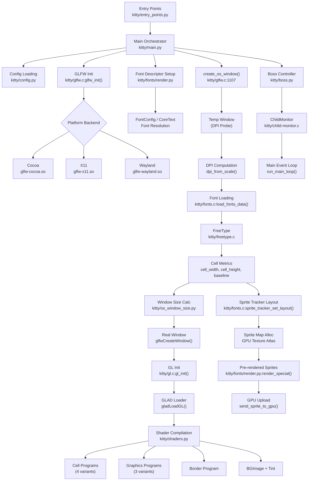
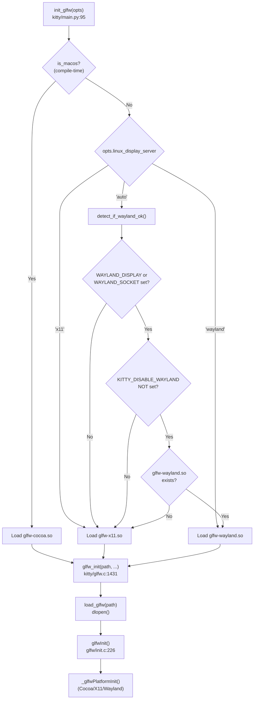

# Kitty Terminal Emulator — Initialization Flow Analysis

## Introduction & Rationale

This document provides a comprehensive, code-derived technical analysis of the kitty terminal emulator's initialization (startup) flow. It traces every step from process launch through to the first rendered frame, with specific focus on:

- **GPU context creation** — How the OpenGL context is established, which GLFW backend is selected, what OpenGL version and extensions are required, and how the sRGB framebuffer is configured.
- **Font system setup** — How fonts are loaded and resolved, how FreeType/HarfBuzz compute cell metrics (`cell_width`, `cell_height`, `baseline`, `underline_position`), and how the font group is initialized before rendering.
- **Rendering backend selection** — How kitty determines which windowing backend to use (`cocoa`, `wayland`, or `x11`) and how the `is_wayland()` logic works, including DPI detection and content scaling.
- **Text cell calculations** — How `calc_cell_width()` and `calc_cell_height()` work, how `font_units_to_pixels_y/x()` convert FreeType font units, and how sprite tracker layouts are derived from cell dimensions.
- **Subsystem initialization order** — A clear ordered mapping of which subsystems initialize in what sequence and what inter-dependencies exist between them.

**Methodology:** Every claim in this document is derived from direct source code analysis. All citations reference specific files, functions, and line numbers within the kitty repository. No assumptions are made — the code is treated as the single source of truth.

**Scope:** This analysis covers the "early startup phase" — from process entry through main loop entry. Post-initialization runtime behavior (event loop internals, VT parsing, graphics protocol, remote control) is out of scope.

---

## Startup Sequence Overview (Ordered Phases)

The kitty initialization flow proceeds through eight ordered phases, spanning both Python and C layers:

| Phase | Description | Primary Files | Key Output |
|-------|-------------|---------------|------------|
| 1 | Entry Point Dispatch | `kitty/entry_points.py` | Routes to GUI main or subcommand |
| 2 | CLI Parsing & Environment Setup | `kitty/main.py` | Parsed options, locale, environment |
| 3 | GLFW Backend Selection & Initialization | `kitty/main.py`, `kitty/constants.py`, `kitty/glfw.c`, `glfw/init.c` | Platform backend loaded, default DPI |
| 4 | Font System Setup & Cell Metric Computation | `kitty/fonts/render.py`, `kitty/fonts.c`, `kitty/freetype.c` | cell_width, cell_height, baseline, sprite layout |
| 5 | OS Window Creation & GPU Context | `kitty/glfw.c` | OpenGL context, DPI-aware window |
| 6 | OpenGL Initialization & Shader Compilation | `kitty/gl.c`, `kitty/shaders.py` | GLAD loaded, shaders compiled |
| 7 | Pre-rendered Sprites & Window Finalization | `kitty/fonts.c`, `kitty/fonts/render.py` | Glyph cache populated, callbacks registered |
| 8 | Boss Controller & Main Loop Entry | `kitty/main.py`, `kitty/boss.py`, `kitty/child-monitor.c` | Event loop running |

> **Rationale:** These phases are not arbitrary groupings — they reflect actual sequential dependencies in the code. For example, font metrics (Phase 4) cannot be computed without DPI (Phase 3/5), and shaders (Phase 6) cannot be compiled without the OpenGL context (Phase 5).



---

## Phase 1: Entry Point Dispatch

### Overview

The kitty process begins at `kitty/entry_points.py:main()` (lines 183–197). This function serves as a dispatcher that routes execution to either the GUI application or one of several subcommands.

### Detailed Flow

**Step 1: Frozen Build SSL Setup**

Source: `kitty/entry_points.py:184-187`

```python
if getattr(sys, 'frozen', False):
    ext_dir = getattr(sys, 'kitty_run_data').get('extensions_dir')
    if ext_dir:
        setup_openssl_environment(ext_dir)
```

For frozen (bundled) builds, `setup_openssl_environment()` (lines 170–180) sets `SSL_CERT_FILE` to the bundled `cacert.pem` file. The path varies by platform: on macOS it's three directories up from `ext_dir`; on Linux it's one directory up.

**Step 2: First Argument Dispatch**

Source: `kitty/entry_points.py:188-197`

```python
first_arg = '' if len(sys.argv) < 2 else sys.argv[1]
func = entry_points.get(first_arg)
```

The `entry_points` dictionary (lines 151–157) maps recognized first arguments:
- `'icat'` → `icat()` — Delegates to `kitten` executable
- `'list-fonts'` → `list_fonts()` — Font listing utility
- `'+'` → `namespaced()` — Dispatches `+hold`, `+complete`, `+runpy`, `+launch`, `+open`, `+kitten`, etc.

**Step 3: Default GUI Path**

If `first_arg` is not a recognized entry point and does not start with `+`, execution falls through to the default GUI path:

Source: `kitty/entry_points.py:193-195`

```python
from kitty.main import main as kitty_main
kitty_main()
```

This imports and calls `kitty/main.py:main()` (lines 524–530), which wraps `_main()` in a try/except block that logs tracebacks via `log_error()`:

Source: `kitty/main.py:524-530`

```python
def main() -> None:
    try:
        _main()
    except Exception:
        import traceback
        tb = traceback.format_exc()
        log_error(tb)
```

> **Rationale:** The entry point dispatch is deliberately simple — a dictionary lookup. This keeps startup overhead minimal for the common case (no recognized first argument = launch GUI). The `namespaced()` function (lines 138–148) provides extensibility for subcommands via the `+` prefix convention.

---

## Phase 2: CLI Parsing & Environment Setup

### Overview

The `_main()` function in `kitty/main.py` (lines 441–521) orchestrates the full pre-display initialization sequence. This is the longest single function in the startup path and performs configuration loading, environment setup, locale initialization, and GLFW bootstrapping.

### Detailed Sequence

**Step 1: Set Running Flag**

Source: `kitty/main.py:442`

`running_in_kitty(True)` — Sets a global flag indicating we are inside the kitty process.

**Step 2: macOS Launch Services Handling**

Source: `kitty/main.py:445-448`

On macOS, when launched via Launch Services (Finder, Dock), the `KITTY_LAUNCHED_BY_LAUNCH_SERVICES` environment variable is set. In this case:
- CWD is changed to `~` (user home)
- Additional command-line arguments are read from `~/.config/kitty/macos-launch-services-cmdline`

**Step 3: CWD Validation**

Source: `kitty/main.py:449-454`

Checks if the current working directory is valid (accessible). Falls back to `~` if not.

**Step 4: CLI Argument Parsing**

Source: `kitty/main.py:464`

```python
cli_opts, rest = parse_args(args=args, result_class=CLIOptions, ...)
```

Parses command-line arguments into a `CLIOptions` object. The `rest` contains any remaining arguments to be passed as shell arguments.

**Step 5: Detach and Replay Handling**

Source: `kitty/main.py:470-478`

- `--detach`: Forks the process to run in the background
- `--replay-commands`: Replays remote control commands and exits

**Step 6: Single Instance Setup**

Source: `kitty/main.py:479-492`

Reads `KITTY_SI_DATA` environment variable for single-instance mode. Extracts the talk file descriptor and socket path for IPC.

**Step 7: Options Creation**

Source: `kitty/main.py:494`

```python
opts = create_opts(cli_opts, accumulate_bad_lines=bad_lines)
```

Creates the full `Options` object by loading and parsing `kitty.conf` configuration files.

**Step 8: Environment Setup**

Source: `kitty/main.py:495`

```python
setup_environment(opts, cli_opts)
```

This function (lines 403–421) ensures the correct `kitty` and `kitten` binaries are in `PATH`, expands `listen_on` addresses, and sets up `MANPATH` for frozen builds.

**Step 9: Locale Configuration**

Source: `kitty/main.py:499-502`

```python
set_locale()
```

The `set_locale()` function (lines 424–438) calls `locale.setlocale(locale.LC_ALL, '')`. On macOS, it first calls `ensure_macos_locale()` (lines 266–284) which uses Cocoa APIs to detect the system language when `LANG` is not set, constructing a value like `en_US.UTF-8`.

**Step 10: Python Thread Interval Optimization**

Source: `kitty/main.py:504`

```python
sys.setswitchinterval(1000.0)
```

Sets the Python GIL switch interval to 1000 seconds (effectively infinite). Since kitty uses only a single Python thread, this eliminates unnecessary context switch overhead.

**Step 11: Signal Masking**

Source: `kitty/main.py:513`

```python
mask_kitty_signals_process_wide()
```

Masks signals process-wide before the display backend starts threads. This ensures display backend threads (GLFW, Wayland) do not handle signals that kitty needs to process on the main thread.

**Step 12: GLFW Initialization**

Source: `kitty/main.py:514`

```python
init_glfw(opts, cli_opts.debug_keyboard, cli_opts.debug_rendering)
```

This triggers Phase 3 (GLFW Backend Selection).

**Step 13: Application Launch**

Source: `kitty/main.py:516-518`

```python
with setup_profiling():
    run_app(opts, cli_opts, bad_lines, talk_fd)
```

Enters the `AppRunner.__call__()` method, which triggers font setup, window creation, Boss instantiation, and the main loop.

---

## Phase 3: GLFW Backend Selection & Initialization

### Overview

Kitty uses a forked version of GLFW (vendored in `glfw/`) for window management. The backend selection is a critical early decision that determines which display protocol is used for the entire session lifetime.

### Backend Selection Logic

**Three-Way Decision**

Source: `kitty/main.py:95-98` — `init_glfw()`

```python
glfw_module = 'cocoa' if is_macos else ('wayland' if is_wayland(opts) else 'x11')
```

The logic is:
1. **macOS** → Always `'cocoa'` (no other option)
2. **Linux + Wayland OK** → `'wayland'`
3. **Linux + no Wayland** → `'x11'` (fallback)

**is_wayland() Detection**

Source: `kitty/constants.py:207-217`

```python
def is_wayland(opts=None):
    if is_macos:
        return False
    if opts.linux_display_server == 'auto':
        ans = detect_if_wayland_ok()
    else:
        ans = opts.linux_display_server == 'wayland'
    setattr(is_wayland, 'ans', ans)
    return ans
```

The result is cached via `setattr(is_wayland, 'ans', ans)` so subsequent calls without `opts` return the cached value.

**detect_if_wayland_ok() — Three-Condition Gate**

Source: `kitty/constants.py:196-204`

All three conditions must be true for Wayland:
1. `WAYLAND_DISPLAY` or `WAYLAND_SOCKET` environment variable exists
2. `KITTY_DISABLE_WAYLAND` environment variable is NOT set
3. The `glfw-wayland.so` shared library file exists on disk

**Platform-Specific .so Loading**

Source: `kitty/constants.py:191-193` — `glfw_path()`

```python
def glfw_path(module):
    prefix = 'kitty.' if getattr(sys, 'frozen', False) else ''
    return os.path.join(extensions_dir, f'{prefix}glfw-{module}.so')
```

This constructs the path to the platform-specific GLFW shared library (e.g., `glfw-x11.so`, `glfw-wayland.so`, or `glfw-cocoa.so`).



### GLFW Initialization (C Layer)

**init_glfw_module() Python Wrapper**

Source: `kitty/main.py:90-92`

```python
def init_glfw_module(glfw_module, debug_keyboard=False, debug_rendering=False, wayland_enable_ime=True):
    if not glfw_init(glfw_path(glfw_module), edge_spacing, debug_keyboard, debug_rendering, wayland_enable_ime):
        raise SystemExit('GLFW initialization failed')
```

**glfw_init() C Function**

Source: `kitty/glfw.c:1431-1468`

The C-level `glfw_init()` performs these steps in order:

1. **Line 1441:** `load_glfw(path)` — Dynamically loads the platform-specific `.so` file via `dlopen`.
2. **Line 1443:** `glfwSetErrorCallback(error_callback)` — Registers error handler.
3. **Lines 1444–1447:** Sets GLFW init hints:
   - `GLFW_DEBUG_KEYBOARD` — Debug keyboard events
   - `GLFW_DEBUG_RENDERING` — Debug rendering pipeline
   - `GLFW_WAYLAND_IME` — Wayland input method support
4. **Lines 1448–1450 (macOS only):**
   - `GLFW_COCOA_CHDIR_RESOURCES = 0` — Don't change directory to Resources
   - `GLFW_COCOA_MENUBAR = 0` — Don't create default menubar
5. **Lines 1451–1454 (Linux only):** Sets DBus notification handler.
6. **Line 1456:** `glfwInit(monotonic_start_time)` — Calls the GLFW library initialization.
7. **Lines 1457–1464 (on success):**
   - macOS: Sets `glfwSetCocoaURLOpenCallback`
   - Linux: Sets `glfwSetDrawTextFunction`
   - All: `get_window_dpi(NULL, &global_state.default_dpi.x, &global_state.default_dpi.y)` — Computes default DPI
   - Stores `edge_spacing_func`

**glfwInit() Library-Level Initialization**

Source: `glfw/init.c:226-270`

1. **Line 228–229:** Guard against double-initialization.
2. **Line 232:** Zeroes the `_glfw` global state struct.
3. **Line 236:** `_glfwPlatformInit()` — Calls platform-specific init (Cocoa/X11/Wayland connection, display enumeration).
4. **Lines 242–248:** Creates mutex and TLS (thread-local storage) slots for error handling and context management.
5. **Line 252:** Sets `_glfw.initialized = true`.
6. **Line 254:** `glfwDefaultWindowHints()` — Resets window hints to defaults.
7. **Lines 256–267:** Loads default gamepad mappings.

---

## Phase 4: Font System Setup & Cell Metric Computation

### Overview

Font initialization in kitty is a two-stage process:
1. **Stage 1 (Python, during `AppRunner.__call__()`):** Resolve font descriptors and register them with the C backend — but actual FreeType face loading is deferred.
2. **Stage 2 (C, during `create_os_window()`):** Once DPI is known, load FreeType faces and compute cell metrics.

This two-stage design exists because cell metrics depend on DPI, which is only available after the display system is initialized.

### Stage 1: Font Descriptor Registration

**AppRunner.__call__() Entry**

Source: `kitty/main.py:247-252`

```python
def __call__(self, opts, args, bad_lines=(), talk_fd=-1):
    set_scale(opts.box_drawing_scale)
    set_options(opts, is_wayland(), args.debug_rendering, args.debug_font_fallback)
    try:
        set_font_family(opts)
        _run_app(opts, args, bad_lines, talk_fd)
```

Three setup calls precede font initialization:
- `set_scale()` — Configures box-drawing character scale factors
- `set_options()` — Pushes Python options to C global state, including `is_wayland` flag and debug settings

**set_font_family()**

Source: `kitty/fonts/render.py:173-193`

1. **Line 177:** `font_map = get_font_files(opts)` — Resolves font descriptors for the four font styles (medium, bold, italic, bold-italic) using FontConfig (Linux) or CoreText (macOS).

2. **Line 178:** `current_faces = [(font_map['medium'], False, False)]` — Medium font is always index 0.

3. **Lines 179–184:** Appends bold (index 1), italic (index 2), and bold-italic (index 3) if they exist.

4. **Lines 186–187:** Creates `symbol_map` (user-configured font overrides for specific Unicode ranges) and `narrow_symbols` map.

5. **Lines 189–193:** `set_font_data(...)` — Registers all font data with the C backend:
   - `render_box_drawing` callback for custom box drawing
   - `prerender_function` callback for special glyph pre-rendering
   - `descriptor_for_idx` callback for face lookup by index
   - Font style indices and symbol map data
   - Font size in points

> **Critical insight:** `set_font_data()` does NOT load FreeType faces. It stores callbacks and descriptors. Actual face loading happens in Stage 2 when DPI is available.

### Stage 2: FreeType Face Loading and Cell Metric Computation

This stage is triggered during `create_os_window()` (Phase 5) after DPI is determined.

**load_fonts_data()**

Source: `kitty/fonts.c:1529-1533`

```c
FONTS_DATA_HANDLE load_fonts_data(double font_sz_in_pts, double dpi_x, double dpi_y) {
    FontGroup *fg = font_group_for(font_sz_in_pts, dpi_x, dpi_y);
    return (FONTS_DATA_HANDLE)fg;
}
```

**font_group_for() — Font Group Lookup/Creation**

Source: `kitty/fonts.c:203-218`

Searches existing font groups for a matching `(font_sz, dpi_x, dpi_y)` tuple. If none found, creates a new `FontGroup` and calls `initialize_font_group()`.

**initialize_font_group() — Core Font Loading**

Source: `kitty/fonts.c:1495-1517`

1. **Line 1496:** Allocates fonts array with capacity `10 + num_symbol_fonts`.
2. **Line 1499:** `fonts_count = 1` — Index 0 is reserved for the box-drawing font.
3. **Line 1501:** `fg->medium_font_idx = initialize_font(fg, 0, "medium")` — Loads the medium (regular) font face via FreeType.
4. **Line 1502:** Loads bold, italic, and bold-italic faces.
5. **Lines 1504–1509:** Loads symbol map fonts.
6. **Line 1511:** **`calc_cell_metrics(fg)`** — The critical cell metrics computation.
7. **Lines 1513–1516:** Rescales symbol map faces to match `cell_height`.

**calc_cell_metrics() — Cell Dimension Computation**

Source: `kitty/fonts.c:373-422`

1. **Line 375:** Calls `cell_metrics()` on the medium font face to get raw metrics.
2. **Lines 379–380:** Applies user `modify_font cell_width/cell_height` adjustments.
3. **Lines 384–392:** Validates dimensions (minimum: width=2, height=4; maximum: 1000).
4. **Lines 398–399:** Applies user adjustments for underline/strikethrough/baseline.
5. **Lines 414–417:** Additional baseline/underline adjustments when line height changed.
6. **Line 418:** `sprite_tracker_set_layout(&fg->sprite_tracker, cell_width, cell_height)` — Computes sprite atlas grid dimensions.
7. **Lines 419–420:** Stores all computed metrics in the FontGroup struct.
8. **Line 421:** `ensure_canvas_can_fit(fg, 8)` — Ensures the rendering canvas can hold 8 cells.

### FreeType Cell Metrics Computation

**cell_metrics()**

Source: `kitty/freetype.c:387-405`

This function computes all critical cell dimensions from the medium font face:

```c
void cell_metrics(PyObject *s, unsigned int* cell_width, ...) {
    Face *self = (Face*)s;
    *cell_width = calc_cell_width(self);           // Line 389
    *cell_height = calc_cell_height(self, true);    // Line 390
    *baseline = font_units_to_pixels_y(self, self->ascender);  // Line 391
    *underline_position = MIN(*cell_height - 1,
        font_units_to_pixels_y(self, MAX(0, self->ascender - self->underline_position)));  // Line 392
    *underline_thickness = MAX(1, font_units_to_pixels_y(self, self->underline_thickness));  // Line 393
    // Strikethrough from OS/2 table or fallback (lines 395-404)
}
```

**calc_cell_width() — Maximum ASCII Glyph Advance**

Source: `kitty/freetype.c:374-383`

```c
static unsigned int calc_cell_width(Face *self) {
    unsigned int ans = 0;
    for (char_type i = 32; i < 128; i++) {
        int glyph_index = FT_Get_Char_Index(self->face, i);
        if (load_glyph(self, glyph_index, FT_LOAD_DEFAULT)) {
            ans = MAX(ans, (unsigned int)ceilf((float)self->face->glyph->metrics.horiAdvance / 64.f));
        }
    }
    return ans;
}
```

**Algorithm:** Iterates all printable ASCII characters (32–127), loads each glyph, computes `ceil(horiAdvance / 64.0)`, and returns the **maximum** value. The division by 64 converts from FreeType's 26.6 fixed-point format to floating point pixels.

> **Rationale:** Using the maximum advance ensures every ASCII character fits within a single cell. This is conservative but correct — a monospace font should have uniform advances, but this handles non-ideal fonts gracefully.

**calc_cell_height() — Font Height with Underscore Workaround**

Source: `kitty/freetype.c:141-152`

```c
static unsigned int calc_cell_height(Face *self, bool for_metrics) {
    unsigned int ans = font_units_to_pixels_y(self, self->height);
    if (for_metrics) {
        unsigned int underscore_height = get_height_for_char(self, '_');
        if (underscore_height > ans) {
            // Increase cell height for buggy fonts
            return underscore_height;
        }
    }
    return ans;
}
```

**Algorithm:** Converts the font's `height` metric (in font units) to pixels. When `for_metrics` is true, also checks if the underscore character extends beyond the computed height — if so, increases the cell height. This workaround handles fonts where the underscore descends below the declared bounding box.

**font_units_to_pixels_y() — The Core Conversion**

Source: `kitty/freetype.c:92-93`

```c
static int font_units_to_pixels_y(Face *self, int x) {
    return (int)ceil((double)FT_MulFix(x, self->face->size->metrics.y_scale) / 64.0);
}
```

**Formula:** `ceil(FT_MulFix(x, y_scale) / 64.0)`

- `FT_MulFix(x, y_scale)` multiplies font units by the y-axis scaling factor (determined by `FT_Set_Char_Size`)
- Division by 64.0 converts from 26.6 fixed-point to floating-point pixels
- `ceil()` rounds up to the nearest integer pixel

The x-axis equivalent (`font_units_to_pixels_x`, lines 97–98) uses `x_scale` instead.

**set_size_for_face() — FreeType Character Size**

Source: `kitty/freetype.c:190-197`

```c
bool set_size_for_face(PyObject *s, unsigned int desired_height, bool force, FONTS_DATA_HANDLE fg) {
    Face *self = (Face*)s;
    FT_F26Dot6 w = (FT_F26Dot6)(ceil(fg->font_sz_in_pts * 64.0));
    FT_UInt xdpi = (FT_UInt)fg->logical_dpi_x, ydpi = (FT_UInt)fg->logical_dpi_y;
    // ...
    return set_font_size(self, w, w, xdpi, ydpi, desired_height, fg->cell_height);
}
```

This converts the font size in points to 26.6 fixed-point (`pts * 64`) and passes it along with the logical DPI to `set_font_size()`, which calls `FT_Set_Char_Size(face, 0, char_height, xdpi, ydpi)`.

### Sprite Tracker Layout

**sprite_tracker_set_layout()**

Source: `kitty/fonts.c:276-281`

```c
static void sprite_tracker_set_layout(GPUSpriteTracker *st, unsigned int cell_width, unsigned int cell_height) {
    st->xnum = MIN(MAX(1u, max_texture_size / cell_width), (size_t)UINT16_MAX);
    st->max_y = MIN(MAX(1u, max_texture_size / cell_height), (size_t)UINT16_MAX);
    st->ynum = 1;
    st->x = 0; st->y = 0; st->z = 0;
}
```

This computes how many glyph cells fit in the GPU texture atlas:
- `xnum` = cells per row = `max_texture_size / cell_width` (clamped to UINT16_MAX)
- `max_y` = maximum rows = `max_texture_size / cell_height` (clamped to UINT16_MAX)
- Tracking starts at position (0, 0, 0) with 1 active row



---

## Phase 5: OS Window Creation & GPU Context

### Overview

`create_os_window()` in `kitty/glfw.c` (lines 1107–1323) is the most complex function in the initialization path. It creates the actual window, establishes the OpenGL context, probes DPI, triggers font loading, computes window dimensions, and sets up all event callbacks.

### First-Window OpenGL Hints

Source: `kitty/glfw.c:1126-1151`

For the first window only, the following GLFW hints are set:

| Hint | Value | Source Line | Purpose |
|------|-------|-------------|---------|
| `GLFW_CONTEXT_VERSION_MAJOR` | 3 | 1127 | OpenGL major version |
| `GLFW_CONTEXT_VERSION_MINOR` | 3 (macOS) / 1 (Linux) | 1128 | OpenGL minor version |
| `GLFW_OPENGL_FORWARD_COMPAT` | true | 1129 | Forward-compatible context |
| `GLFW_DEPTH_BITS` | 0 | 1131 | No depth buffer (unused) |
| `GLFW_STENCIL_BITS` | 0 | 1132 | No stencil buffer (unused) |
| `GLFW_SRGB_CAPABLE` | true (non-Wayland) | 1144 | sRGB framebuffer support |

**SRGB Wayland Exclusion:** The `GLFW_SRGB_CAPABLE` hint is deliberately NOT set on Wayland due to two known bugs:
- NVIDIA EGL driver crash (GitHub issue #7021)
- Mesa sRGB surface bug (GitHub issue #7174)

Source: `kitty/glfw.c:1138-1144`

**macOS-specific hints (lines 1145–1150):**
- Sets activation policy
- Enables graphics switching (for dual-GPU laptops)
- Registers reopen handler and global menu

### DPI Probing via Temporary Window

The DPI probing strategy differs by platform:

**Non-Wayland (X11 / macOS):**

Source: `kitty/glfw.c:1197-1200`

```c
temp_window = glfwCreateWindow(640, 480, "temp", NULL, common_context);
get_window_content_scale(temp_window, &xscale, &yscale, &xdpi, &ydpi);
```

A temporary invisible 640×480 window is created solely to query the display's content scale factor. The window is created with `GLFW_VISIBLE = false` (line 1176).

> **Rationale:** On X11, the content scale must be queried from an actual window. Creating a temp window avoids the visual artifact of resizing the real window after creation. On macOS, a persistent `apple_preserve_common_context` window is created instead (lines 1180–1183).

**Wayland:**

Source: `kitty/glfw.c:1187-1196`

On Wayland, the compositor only sends scale information after a window is displayed, so a temp window cannot be used for DPI probing. Instead:
1. First attempts `get_window_content_scale(NULL, ...)` which falls back to the primary monitor scale.
2. Then checks if any existing OS window is focused and uses its scale if available.

### DPI Computation from Content Scale

**get_window_content_scale()**

Source: `kitty/glfw.c:823-835`

1. If a window is provided, calls `glfwGetWindowContentScale(w, xscale, yscale)`.
2. If no window (NULL), gets scale from primary monitor via `glfwGetMonitorContentScale()`.
3. **Validation (lines 832–833):** Rejects scale values that are ≤0.0001, NaN (detected via `*xscale != *xscale`), or ≥24. Falls back to 1.0 for invalid values.
4. Calls `dpi_from_scale()` to convert scale to DPI.

**dpi_from_scale()**

Source: `kitty/glfw.c:812-820`

```c
static void dpi_from_scale(float xscale, float yscale, double *xdpi, double *ydpi) {
#ifdef __APPLE__
    const double factor = 72.0;
#else
    const double factor = 96.0;
#endif
    *xdpi = xscale * factor;
    *ydpi = yscale * factor;
}
```

- **macOS:** Base DPI = 72.0 (Apple's traditional points-per-inch)
- **Linux:** Base DPI = 96.0 (X11/Wayland standard)

For example, on a macOS Retina display with scale 2.0: `xdpi = 2.0 × 72.0 = 144.0`.



### Font Loading with DPI

Source: `kitty/glfw.c:1202`

```c
FONTS_DATA_HANDLE fonts_data = load_fonts_data(OPT(font_size), xdpi, ydpi);
```

This triggers Stage 2 of font initialization (see Phase 4). The computed DPI values flow into FreeType's `FT_Set_Char_Size()` to produce pixel-accurate glyph metrics.

### Window Size Calculation

Source: `kitty/glfw.c:1203-1206`

```c
PyObject *ret = PyObject_CallFunction(get_window_size, "IIddff",
    fonts_data->cell_width, fonts_data->cell_height,
    fonts_data->logical_dpi_x, fonts_data->logical_dpi_y, xscale, yscale);
```

This calls back into Python's `initial_window_size_func()` (`kitty/os_window_size.py:54`), which computes the window pixel dimensions from:
- Cell dimensions (from font metrics)
- Number of cells (from configuration: `initial_window_width/height`)
- DPI and scale factors
- Margin and padding settings

### Actual Window Creation

Source: `kitty/glfw.c:1208-1211`

```c
GLFWwindow *glfw_window = glfwCreateWindow(width, height, title, NULL, temp_window ? temp_window : common_context);
if (temp_window) { glfwDestroyWindow(temp_window); temp_window = NULL; }
glfwMakeContextCurrent(glfw_window);
```

The real window is created sharing the OpenGL context with the temp window (or common context). The temp window is immediately destroyed. The new window's GL context is made current.

### OpenGL Context Initialization

Source: `kitty/glfw.c:1212`

```c
if (is_first_window) gl_init();
```

On the first window only, `gl_init()` is called to load OpenGL function pointers and validate the GL version (see Phase 6).

### sRGB Enable and Verification

Source: `kitty/glfw.c:1213-1249`

```c
glEnable(GL_FRAMEBUFFER_SRGB);  // Line 1214
```

After enabling sRGB, the code verifies the framebuffer actually supports sRGB encoding:

```c
GLint encoding;
glGetFramebufferAttachmentParameteriv(GL_FRAMEBUFFER, GL_BACK_LEFT,
    GL_FRAMEBUFFER_ATTACHMENT_COLOR_ENCODING, &encoding);
if (encoding != GL_SRGB) log_error("The output buffer does not support sRGB color encoding...");
```

### Post-Show DPI Re-check

Source: `kitty/glfw.c:1232-1241`

On Wayland and macOS, after the window is shown (displayed), the DPI is rechecked. If the compositor placed the window on a different monitor than expected, the DPI may have changed. If so, fonts are reloaded with the new DPI.

### Window State and Callback Registration

Source: `kitty/glfw.c:1253-1293`

The function concludes by:
1. Adding the `OSWindow` to global state (line 1253)
2. Setting `fonts_data` on the window (line 1264)
3. Sending pre-rendered sprites (line 1273) — see Phase 7
4. Updating the viewport (line 1276)
5. Registering ALL GLFW callbacks (lines 1277–1293):
   - Window position, close, refresh, focus, occlusion, iconify
   - Framebuffer size, live resize, content scale (DPI change)
   - Mouse button, cursor position, cursor enter, scroll
   - Keyboard, file drop

---

## Phase 6: OpenGL Initialization & Shader Compilation

### OpenGL Context via GLAD

**gl_init()**

Source: `kitty/gl.c:52-77`

This function runs exactly once (guarded by `glad_loaded` static flag):

1. **Line 55:** `global_state.gl_version = gladLoadGL(glfwGetProcAddress)` — GLAD loads ALL OpenGL function pointers by querying GLFW for the platform's `getProcAddress` function.

2. **Lines 56–58:** Fatal error if GLAD loading failed.

3. **Lines 59–61:** If NOT in debug rendering mode, uninstalls GL debug callbacks (for performance).

4. **Line 62:** `gladSetGLPostCallback(check_for_gl_error)` — Registers a post-call error checker that runs after every GL function call, catching errors like `GL_INVALID_ENUM`, `GL_INVALID_VALUE`, `GL_OUT_OF_MEMORY`.

5. **Lines 63–68:** Tests for required ARB extensions:
   - `ARB_texture_storage` — Required for immutable texture allocation

6. **Lines 70–71:** Extracts major/minor version from the loaded GL version.

7. **Line 72:** If debug rendering enabled, prints the GL version string.

8. **Lines 73–75:** **Version validation** — Fatal error if the loaded GL version is less than required:
   - macOS: requires OpenGL ≥ 3.3
   - Linux: requires OpenGL ≥ 3.1

### OpenGL/GLSL Version Constants

Source: `kitty/data-types.h:20-26`

```c
#define OPENGL_REQUIRED_VERSION_MAJOR 3
#ifdef __APPLE__
#define OPENGL_REQUIRED_VERSION_MINOR 3
#else
#define OPENGL_REQUIRED_VERSION_MINOR 1
#endif
#define GLSL_VERSION 140
```

> **Rationale:** macOS requires 3.3 because Apple only supports OpenGL 3.2+ in Core Profile mode (forward-compatible). Linux can use 3.1 because Mesa and NVIDIA drivers support the required features at this lower version. GLSL 140 corresponds to OpenGL 3.1 and provides all shader features kitty needs.

### Shader Compilation Pipeline

**load_all_shaders()**

Source: `kitty/main.py:82-87`

```python
def load_all_shaders(semi_transparent=False):
    load_shader_programs(semi_transparent)
    load_borders_program()
```

**Program Class — GLSL Source Loading**

Source: `kitty/shaders.py:43-81`

The `Program` class handles shader source loading:

1. **Line 63:** Prepends `#version 140\n` to every shader source.
2. **Lines 72–81:** Processes `#pragma kitty_include_shader <name>` directives for include-style composition, generating `#line` directives for proper error reporting.

**LoadShaderPrograms.__call__() — Multi-Variant Compilation**

Source: `kitty/shaders.py:147-204`

The cell rendering program is compiled in **4 variants** with different macro definitions:

| Variant | Program ID | WHICH_PHASE Macro | Purpose |
|---------|------------|-------------------|---------|
| BOTH | `CELL_PROGRAM` | `PHASE_BOTH` | Combined background + foreground (single pass) |
| BACKGROUND | `CELL_BG_PROGRAM` | `PHASE_BACKGROUND` | Background colors only |
| SPECIAL | `CELL_SPECIAL_PROGRAM` | `PHASE_SPECIAL` | Decorations (underlines, strikethrough) |
| FOREGROUND | `CELL_FG_PROGRAM` | `PHASE_FOREGROUND` | Text glyphs only |

Each variant receives additional macro substitutions:
- `TRANSPARENT` — `'1'` or `'0'` based on background opacity
- `FG_OVERRIDE_THRESHOLD` — Text foreground override threshold
- `TEXT_NEW_GAMMA` — Gamma correction strategy

The graphics program is compiled in **3 variants** (lines 186–197):

| Variant | Program ID | Purpose |
|---------|------------|---------|
| SIMPLE | `GRAPHICS_PROGRAM` | Standard image rendering |
| PREMULT | `GRAPHICS_PREMULT_PROGRAM` | Pre-multiplied alpha images |
| ALPHA_MASK | `GRAPHICS_ALPHA_MASK_PROGRAM` | Alpha mask rendering |

Additional programs compiled:
- `bgimage` → `BGIMAGE_PROGRAM` (background image)
- `tint` → `TINT_PROGRAM` (color tinting)
- Border program via `load_borders_program()` from `kitty/borders.py`

Final step: `init_cell_program()` (line 201) initializes cell program uniforms and attributes.

---

## Phase 7: Pre-rendered Sprites & Window Finalization

### Overview

Before any terminal content can be rendered, kitty pre-renders a set of special glyphs into the sprite atlas. These include underline styles, strikethrough, cursor shapes, and a missing glyph placeholder.

### Sprite Map Allocation

**send_prerendered_sprites_for_window()**

Source: `kitty/fonts.c:1520-1527`

```c
void send_prerendered_sprites_for_window(OSWindow *w) {
    FontGroup *fg = (FontGroup*)w->fonts_data;
    if (!fg->sprite_map) {
        fg->sprite_map = alloc_sprite_map(fg->cell_width, fg->cell_height);
        send_prerendered_sprites(fg);
    }
}
```

The sprite map is allocated lazily — only on the first window using a given font group. `alloc_sprite_map()` allocates the GPU texture memory for the glyph cache.

### Pre-rendered Sprite Generation

**send_prerendered_sprites()**

Source: `kitty/fonts.c:1449-1473`

1. **Lines 1453–1457:** First sprite is a **blank cell** — a fully transparent cell used for empty cells.

2. **Line 1458:** Calls the Python `prerender_function` callback with all cell metrics:

```c
PyObject *args = PyObject_CallFunction(prerender_function, "IIIIIIIffdd",
    fg->cell_width, fg->cell_height, fg->baseline,
    fg->underline_position, fg->underline_thickness,
    fg->strikethrough_position, fg->strikethrough_thickness,
    OPT(cursor_beam_thickness), OPT(cursor_underline_thickness),
    fg->logical_dpi_x, fg->logical_dpi_y);
```

3. **Lines 1460–1471:** For each returned cell address, increments the sprite position and sends the pixel data to the GPU.

**render_special() — Python Pre-render Callback**

Source: `kitty/fonts/render.py:284-321`

The `render_special()` function generates pixel data for special glyphs:

| Sprite Index | Type | Description |
|-------------|------|-------------|
| 0 | Blank | Empty/transparent cell |
| 1 | Solid underline | Standard underline |
| 2 | Double underline | Two parallel lines |
| 3 | Curly underline | Wavy/curly decoration |
| 4 | Dotted underline | Dotted line |
| 5 | Dashed underline | Dashed line |
| 6 | Strikethrough | Horizontal line through middle |
| 7 | Missing glyph | Placeholder rectangle |
| 8+ | Cursors | Beam and underline cursor shapes |

Each sprite is rendered into a `ctypes.c_ubyte` array of size `cell_width × cell_height` as an alpha mask, then sent to the GPU.

---

## Phase 8: Boss Controller & Main Loop Entry

### Overview

The Boss controller is kitty's central lifecycle manager. Its creation marks the transition from initialization to steady-state operation.

### Application Launch Sequence

**_run_app()**

Source: `kitty/main.py:202-236`

1. **Lines 202–211:** Platform-specific setup:
   - macOS: Global keyboard shortcuts, custom beam cursor, custom app icon
   - X11: Window icon (not set on Wayland — no icon protocol)

2. **Lines 213–225:** Creates startup sessions, computes window sizing data, and creates the OS window via `create_os_window()` (triggers Phases 5–7).

3. **Line 226:** `boss = Boss(opts, args, cached_values, global_shortcuts, talk_fd)` — Creates the Boss.

4. **Line 227:** `boss.start(window_id, startup_sessions)` — Starts the Boss with the first window.

5. **Line 234:** `boss.child_monitor.main_loop()` — Enters the main event loop.

6. **Line 236:** `boss.destroy()` — Cleanup on exit.

### Boss Initialization

**Boss.__init__()**

Source: `kitty/boss.py:323-375`

The Boss constructor:
1. Sets up clipboard, encryption keys, and window tracking (lines 334–354)
2. Configures remote control permissions (lines 357–361)
3. Sets up listen socket if remote control is enabled (lines 363–368)
4. **Lines 370–374:** Creates `ChildMonitor`:

```python
self.child_monitor = ChildMonitor(
    self.on_child_death,
    DumpCommands(args) if args.dump_commands or args.dump_bytes else None,
    talk_fd, listen_fd,
)
```

5. **Line 375:** `set_boss(self)` — Registers the Boss as the global singleton.

### Main Loop Entry

**main_loop()**

Source: `kitty/child-monitor.c:1258-1262`

```c
static PyObject* main_loop(ChildMonitor *self, PyObject *a) {
    state_check_timer = add_main_loop_timer(1000, true, do_state_check, self, NULL);
    run_main_loop(process_global_state, self);
```

1. **Line 1261:** Adds a 1-second recurring state check timer.
2. **Line 1262:** `run_main_loop(process_global_state, self)` — Enters the GLFW event loop.

At this point, initialization is complete and kitty begins processing input, rendering terminal content, and handling events.

---

## Subsystem Relationship Map

The following diagram shows how kitty's subsystems interconnect during initialization:



---

## Key Values Computed During Startup

| Value | Formula / Derivation | Source | Description |
|-------|---------------------|--------|-------------|
| `cell_width` | `max(ceil(horiAdvance / 64.0))` for ASCII 32–127 | `kitty/freetype.c:374-383` | Maximum horizontal advance across all printable ASCII glyphs |
| `cell_height` | `ceil(FT_MulFix(height, y_scale) / 64.0)`, adjusted for underscore | `kitty/freetype.c:141-152` | Font height in pixels, increased if underscore extends beyond |
| `baseline` | `ceil(FT_MulFix(ascender, y_scale) / 64.0)` | `kitty/freetype.c:391` | Distance from top of cell to baseline in pixels |
| `underline_position` | `min(cell_height - 1, font_units_to_pixels_y(max(0, ascender - underline_position)))` | `kitty/freetype.c:392` | Y-position of underline from top of cell |
| `underline_thickness` | `max(1, font_units_to_pixels_y(underline_thickness))` | `kitty/freetype.c:393` | Underline thickness in pixels (minimum 1) |
| `strikethrough_position` | From OS/2 table: `font_units_to_pixels_y(ascender - strikethrough_position)`, or fallback: `floor(baseline × 0.65)` | `kitty/freetype.c:395-399` | Y-position of strikethrough line |
| `strikethrough_thickness` | From OS/2 table or equals `underline_thickness` | `kitty/freetype.c:400-404` | Strikethrough line thickness |
| `sprite_tracker.xnum` | `min(max(1, max_texture_size / cell_width), UINT16_MAX)` | `kitty/fonts.c:277` | Glyph cells per row in texture atlas |
| `sprite_tracker.max_y` | `min(max(1, max_texture_size / cell_height), UINT16_MAX)` | `kitty/fonts.c:278` | Maximum rows in texture atlas layer |
| `xdpi` | `xscale × factor` (macOS: 72.0, Linux: 96.0) | `kitty/glfw.c:812-820` | Logical X-axis DPI |
| `ydpi` | `yscale × factor` (macOS: 72.0, Linux: 96.0) | `kitty/glfw.c:812-820` | Logical Y-axis DPI |
| `font_units_to_pixels_y(x)` | `ceil(FT_MulFix(x, face→size→metrics.y_scale) / 64.0)` | `kitty/freetype.c:92-93` | General font unit to pixel conversion (Y-axis) |
| `font_units_to_pixels_x(x)` | `ceil(FT_MulFix(x, face→size→metrics.x_scale) / 64.0)` | `kitty/freetype.c:97-98` | General font unit to pixel conversion (X-axis) |
| `FT_char_size` | `ceil(font_sz_in_pts × 64.0)` | `kitty/freetype.c:192` | FreeType char size in 26.6 fixed-point |
| `OPENGL_REQUIRED_VERSION` | 3.3 (macOS) / 3.1 (Linux) | `kitty/data-types.h:20-25` | Minimum OpenGL version required |
| `GLSL_VERSION` | 140 | `kitty/data-types.h:26` | GLSL shader language version |
| `default_dpi` | Queried via `get_window_dpi(NULL)` during `glfw_init()` | `kitty/glfw.c:1463` | Default system DPI stored in `global_state` |

---

## Rendering Backend Selection Logic

### Decision Architecture

Kitty's rendering backend selection is a compile-time (platform) and runtime (configuration + environment) decision:

**Level 1 — Platform Detection (Compile-Time)**

- macOS (`__APPLE__` defined): Always uses Cocoa. No other backend is available. The `is_macos` constant is set at import time in `kitty/constants.py`.
- Linux: Proceeds to Level 2.

**Level 2 — Configuration Check**

Source: `kitty/constants.py:207-217`

The `opts.linux_display_server` configuration option has three values:
- `'auto'` (default): Proceeds to Level 3 auto-detection
- `'wayland'`: Forces Wayland (regardless of environment)
- `'x11'`: Forces X11 (regardless of environment)

**Level 3 — Auto-Detection**

Source: `kitty/constants.py:196-204`

`detect_if_wayland_ok()` performs three environment checks:

1. **Wayland session active:** Either `WAYLAND_DISPLAY` or `WAYLAND_SOCKET` must be set in the environment.
2. **Not disabled:** `KITTY_DISABLE_WAYLAND` must NOT be set.
3. **Library available:** The `glfw-wayland.so` shared library must exist on disk at the expected path.

All three conditions must pass. If any fails, X11 is used as the fallback.

**Caching**

The `is_wayland()` result is cached via function attribute: `setattr(is_wayland, 'ans', ans)`. Subsequent calls without `opts` (i.e., `is_wayland()` with no argument) return the cached value via `getattr(is_wayland, 'ans')`.

**Library Loading**

Source: `kitty/constants.py:191-193`

The platform-specific GLFW library is loaded from:
- Normal: `{extensions_dir}/glfw-{module}.so`
- Frozen: `{extensions_dir}/kitty.glfw-{module}.so`

Where `{module}` is `cocoa`, `wayland`, or `x11`.



---

## Display Configuration Detection

### Content Scale and DPI Pipeline

Kitty's display configuration detection serves a single critical purpose: determining the DPI values that FreeType uses to convert font sizes (in points) to pixel dimensions. The pipeline has multiple stages with platform-specific behavior.

### Stage 1: Default DPI (During glfw_init)

Source: `kitty/glfw.c:1463`

```c
get_window_dpi(NULL, &global_state.default_dpi.x, &global_state.default_dpi.y);
```

Called immediately after successful `glfwInit()`. With NULL window, this queries the primary monitor's content scale. The result is stored in `global_state.default_dpi` for use as a fallback.

### Stage 2: Window-Specific DPI (During create_os_window)

The DPI probing during window creation is platform-specific (documented in Phase 5):

- **X11:** Uses temp invisible 640×480 window → `get_window_content_scale(temp_window, ...)`
- **macOS:** Uses persistent common context window → `get_window_content_scale(window, ...)`
- **Wayland:** Uses primary monitor or focused existing window → `get_window_content_scale(NULL or focused, ...)`

### Stage 3: Post-Show DPI Verification

Source: `kitty/glfw.c:1232-1241`

On Wayland and macOS, after the window is displayed, the DPI is re-queried. If it differs from the pre-show probe (e.g., the compositor placed the window on a different monitor), fonts are reloaded with the corrected DPI:

```c
if (global_state.is_wayland || is_apple) {
    get_window_content_scale(glfw_window, &n_xscale, &n_yscale, &n_xdpi, &n_ydpi);
    if (n_xdpi != xdpi || n_ydpi != ydpi) {
        fonts_data = load_fonts_data(OPT(font_size), n_xdpi, n_ydpi);
    }
}
```

### Scale Validation

Source: `kitty/glfw.c:832-833`

```c
if (*xscale <= 0.0001 || *xscale != *xscale || *xscale >= 24) *xscale = 1.0;
if (*yscale <= 0.0001 || *yscale != *yscale || *yscale >= 24) *yscale = 1.0;
```

Three invalid-scale conditions are detected:
1. **Near-zero:** `scale ≤ 0.0001` (would produce tiny DPI)
2. **NaN:** `scale != scale` (IEEE 754 NaN self-inequality)
3. **Excessive:** `scale ≥ 24` (would produce absurdly large DPI)

In all cases, the scale falls back to 1.0 (producing base DPI: 72.0 on macOS, 96.0 on Linux).

### DPI Conversion Formula Summary

| Platform | Base Factor | Scale 1.0 DPI | Scale 2.0 DPI | Source |
|----------|-------------|---------------|---------------|--------|
| macOS (Cocoa) | 72.0 | 72.0 | 144.0 | `kitty/glfw.c:814` |
| Linux (X11/Wayland) | 96.0 | 96.0 | 192.0 | `kitty/glfw.c:816` |

---

## Text Rendering Capabilities

### Rendering Pipeline Overview

Kitty's text rendering pipeline converts font files into GPU-cached glyph sprites that are composited by OpenGL shaders:

1. **Font Resolution** — FontConfig (Linux) or CoreText (macOS) resolves font family names to font files.
   - Source: `kitty/fonts/render.py:177` — `get_font_files(opts)`

2. **FreeType Rasterization** — FreeType loads font faces and rasterizes individual glyphs into bitmaps.
   - Source: `kitty/freetype.c` — `init_ft_face()`, `load_glyph()`, `render_glyph()`

3. **HarfBuzz Text Shaping** — HarfBuzz performs complex text shaping (ligatures, combining characters, bidirectional text).
   - Source: `kitty/freetype.c:159` — `hb_ft_font_changed(self->harfbuzz_font)` is called after FreeType font size changes to synchronize the HarfBuzz font object.

4. **Cell Metric Computation** — FreeType metrics are converted to pixel dimensions that define the terminal cell grid (documented in Phase 4).

5. **Box Drawing Custom Rendering** — Box-drawing and block characters (U+2500–U+259F) are rendered algorithmically rather than from font glyphs.
   - Source: `kitty/fonts/render.py:189` — `render_box_drawing` callback registered with `set_font_data()`
   - Scale factors: `kitty/fonts/box_drawing.py` via `set_scale(opts.box_drawing_scale)`

6. **Sprite Atlas Management** — Rendered glyphs are cached in a GPU texture atlas organized by the sprite tracker.
   - Source: `kitty/fonts.c:276-281` — `sprite_tracker_set_layout()`
   - Layout: `xnum × max_y × z` grid, where z represents texture array layers

7. **Pre-rendered Special Sprites** — Underlines, strikethroughs, cursors, and missing glyph placeholders are pre-rendered before any content.
   - Source: `kitty/fonts.c:1449-1473`, `kitty/fonts/render.py:284-321`

8. **GPU Shader Rendering** — Cell program shaders composite glyph sprites with colors, decorations, and effects.
   - Source: `kitty/shaders.py:147-204` — Four cell program variants handle different rendering phases.

### Key Design Decisions

- **Glyph caching vs. per-frame rasterization:** Kitty caches all rendered glyphs in GPU texture memory (sprite atlas). This trades GPU memory for rendering speed — glyphs are rasterized once and reused.

- **Cell-based layout:** All text is rendered on a fixed cell grid where every cell has identical `cell_width × cell_height` dimensions. Wide characters occupy two cells. This is fundamental to terminal emulator design.

- **sRGB color pipeline:** The `GL_FRAMEBUFFER_SRGB` enable (line 1214 of `kitty/glfw.c`) ensures colors are stored and blended in linear space but displayed with the sRGB gamma curve, producing perceptually correct color output.

---

## Source File Reference Index

| File Path | Key Functions (with line numbers) | Role in Initialization |
|-----------|----------------------------------|----------------------|
| `kitty/entry_points.py` | `main()` (183), `namespaced()` (138), `setup_openssl_environment()` (170) | Top-level entry point dispatch |
| `kitty/main.py` | `_main()` (441), `init_glfw()` (95), `init_glfw_module()` (90), `AppRunner.__call__()` (247), `_run_app()` (202), `load_all_shaders()` (82), `set_locale()` (424), `setup_environment()` (403), `main()` (524) | Main startup orchestrator |
| `kitty/glfw.c` | `glfw_init()` (1431), `create_os_window()` (1107), `get_window_content_scale()` (823), `dpi_from_scale()` (812), `get_window_dpi()` (838), `update_os_window_viewport()` (130) | GLFW initialization, OS window creation, DPI detection |
| `kitty/gl.c` | `gl_init()` (52), `gl_version_string()` (42), `update_surface_size()` (80) | OpenGL context initialization via GLAD |
| `kitty/fonts.c` | `initialize_font_group()` (1495), `calc_cell_metrics()` (373), `load_fonts_data()` (1529), `font_group_for()` (203), `sprite_tracker_set_layout()` (276), `send_prerendered_sprites()` (1449), `send_prerendered_sprites_for_window()` (1520) | Font group management, cell metrics, sprite atlas |
| `kitty/freetype.c` | `cell_metrics()` (387), `calc_cell_width()` (374), `calc_cell_height()` (141), `font_units_to_pixels_y()` (92), `font_units_to_pixels_x()` (97), `set_size_for_face()` (190), `set_font_size()` (155) | FreeType cell calculations, font unit conversion |
| `kitty/fonts/render.py` | `set_font_family()` (173), `create_symbol_map()` (139), `render_special()` (284), `descriptor_for_idx()` (157) | Python font orchestration, pre-render callbacks |
| `kitty/fonts/common.py` | `get_font_files()` | Font file resolution via system font APIs |
| `kitty/shaders.py` | `Program.__init__()` (48), `Program._load_sources()` (61), `Program.compile()` (87), `LoadShaderPrograms.__call__()` (147) | GLSL shader source loading and compilation |
| `kitty/shaders.c` | Shader program enum definitions | C-level shader program management |
| `kitty/state.h` | `GlobalState` (259), `OSWindow` (216), `Options` structs | Global state and OS window structure definitions |
| `kitty/data-types.h` | `OPENGL_REQUIRED_VERSION_MAJOR/MINOR` (20–25), `GLSL_VERSION` (26), `FONTS_DATA_HEAD` (347) | OpenGL/GLSL version constants, font data structure |
| `kitty/os_window_size.py` | `initial_window_size_func()` (54), `edge_spacing()` (40) | Window dimension calculation from cell metrics |
| `kitty/constants.py` | `is_wayland()` (207), `detect_if_wayland_ok()` (196), `glfw_path()` (191) | Backend detection, platform constants |
| `kitty/boss.py` | `Boss.__init__()` (323) | Central lifecycle controller |
| `kitty/session.py` | `get_os_window_sizing_data()` (24), `create_sessions()` | Session creation and window sizing data |
| `kitty/debug_config.py` | `debug_config()` | Debug output: GL version, compositor, fonts |
| `kitty/child-monitor.c` | `main_loop()` (1259), `run_main_loop()` | Main event loop entry |
| `kitty/borders.py` | `load_borders_program()` | Border shader compilation |
| `kitty/config.py` | Configuration loading and option creation | Configuration parsing during startup |
| `glfw/init.c` | `glfwInit()` (226), `glfwDefaultWindowHints()` | GLFW library-level initialization |
| `kitty/fonts.h` | `cell_metrics()`, `set_size_for_face()` declarations | Font API contract declarations |
| `kitty/gl.h` | `gl_init()`, GL structure declarations | GL function and structure declarations |
