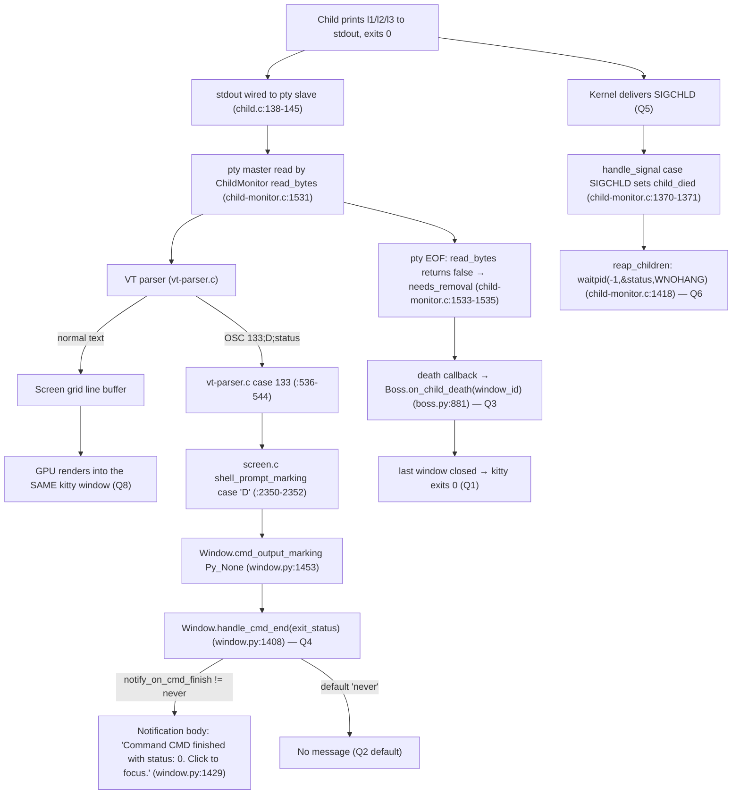

# kitty — The Complete Lifecycle of a Successful Child Process

> **Scenario under investigation.** kitty launches a very simple program that prints a few clear
> lines to standard output and then exits with status `0`. This document explains, end to end,
> what happens from the moment the child runs to what happens after it exits: what exit code
> kitty's *own* process reports, what message (if any) the user sees, which runtime component
> tracks the child, which single function turns the child's exit status into a user‑facing
> message, which OS signal kitty listens for, which system call retrieves the status, how the
> status travels from the shell to that message function, and where the child's printed output
> actually appears.

This is an **evidence‑backed** write‑up. Every behavioral claim below was produced by **building
and running kitty first** (in its default, canonical configuration) and capturing the real,
unedited output; each claim carries the exact command that produced it, the captured output, a
`file:line` citation into the kitty source, and a cause → effect rationale. A few statements that
could not be executed in the headless container are explicitly labeled **`inferred`** in the
final section — they are never presented as observed.

---

## 1. Scenario

The canonical program is a trivial, deterministic one so that the printed lines and the zero exit
status are unambiguous:

```sh
kitty sh -c 'printf "l1\nl2\nl3\n"'     # prints three lines, then sh exits with status 0
```

Two other invocation modes of the *same* program are exercised for contrast, because they change
**what message the user sees** (Q2) and **which function generates it** (Q4):

```sh
kitty --hold sh -c 'printf "l1\nl2\nl3\n"'                      # the --hold path
kitty -o notify_on_cmd_finish=always sh -c '...'  (under shell integration)   # the notify path
kitten __hold_till_enter__ sh -c 'printf "l1\nl2\nl3\n"'       # the legacy hold-till-enter kitten
```

---

## 2. Environment & Build

All values in this document come from a single, **default `python3 setup.py`** build of kitty run
inside the designated container.

| Item | Value |
|------|-------|
| Container image | `kitty-qna-ready:latest` (built from `ghcr.io/scaleapi/swe-atlas:swe_atlas_QnA_kovidgoyal_kitty_1.0`) |
| Repo checkout | `/app` at commit `815df1e210e0a9ab4622f5c7f2d6891d7dbeddf1` |
| Toolchain | Python 3.12.3, Go 1.23.4, gcc 13.3.0, pkg-config 1.8.1 |
| Headless display | `Xvfb :99 -screen 0 1280x800x24`; software OpenGL via Mesa **llvmpipe**, `OpenGL core profile 4.5` (≥ kitty's required GL 3.3) |
| Run env for kitty | `DISPLAY=:99 LIBGL_ALWAYS_SOFTWARE=1` |

**Canonical build** — the `Makefile` `all:` target is `python3 setup.py` (`Makefile:12-13`):

```console
$ python3 setup.py
...
[2/2] Linking launcher ...
 done
# EXIT_CODE=0
```

**Version banner** — every observed value is attributable to this exact build:

```console
$ ./kitty/launcher/kitty --version
kitty 0.35.2 created by Kovid Goyal
```

There is no user configuration in effect (`~/.config/kitty/` is empty), so all "default vs custom"
statements below refer to kitty's compiled‑in defaults.

> Note on a benign warning: every headless kitty invocation prints one line to stderr,
> `Failed to open systemd user bus with error: No medium found`. This is only because the
> container has no systemd user session; it does **not** affect kitty's exit code or behavior and
> is shown verbatim wherever it appears.

---

## 3. Direct Answers (summary)

Lead with the direct answers; the nuance is layered underneath in each question's section.

| # | Question | Direct answer |
|---|----------|---------------|
| **Q1** | kitty's **own** process exit code when the child exits 0 | **`0`** (clean shutdown). Observed `kitty_rc=0`, stable across 4 runs. |
| **Q2** | Full completion message shown to the user | **By default: none.** The window simply closes. (`notify_on_cmd_finish` defaults to `'never'`.) Conditional variants exist — see Q2. |
| **Q3** | Which part tracks the child process | The **C extension `ChildMonitor`** (its `Child[]` array), with the Python **`Boss.on_child_death`** callback closing the loop. |
| **Q4** | The single function that turns exit status → message | **`Window.handle_cmd_end`** (`kitty/window.py:1408`) on the shell‑integration path. On the `--hold`/legacy path the equivalent is `tui.ExecAndHoldTillEnter`. |
| **Q5** | OS signal kitty listens for | **`SIGCHLD`**. |
| **Q6** | System call used to retrieve the child's status | **`waitpid(-1, &status, WNOHANG)`**. |
| **Q7** | How the status reaches the message function | The **OSC 133 "semantic prompt" (FinalTerm) protocol**, specifically **`OSC 133 ; D ; <exit-code>`** (`ESC]133;D;0 BEL`). |
| **Q8** | Where the child's printed output appears | In the **same kitty window** (the `Screen` grid, GPU‑rendered) — not a log file or a separate surface. |

**The three distinct exit numbers** (reconciled in §6 so they are never conflated): (1) kitty's own
main‑process code = `0`; (2) the child's status = `0` (retrieved by `waitpid`, transported by
`OSC 133;D;0`); (3) the `--hold`/legacy *kitten* process's propagated code (a different process
from kitty's main process).

---

## 4. The Eight Questions

### Q1 — What exact exit code does kitty's *own* process report when the child exits 0?

**Direct answer: `0`.** kitty's main process returns `0` on a clean shutdown; this is independent
of the child's status.

**Observed** (run more than twice; every run identical):

```console
$ export DISPLAY=:99 LIBGL_ALWAYS_SOFTWARE=1
$ ./kitty/launcher/kitty sh -c 'true';                  echo "kitty_rc=$?"
[0.167] Failed to open systemd user bus with error: No medium found
kitty_rc=0
$ ./kitty/launcher/kitty sh -c 'true';                  echo "kitty_rc=$?"
[1.336] Failed to open systemd user bus with error: No medium found
kitty_rc=0
$ ./kitty/launcher/kitty sh -c 'printf "l1\nl2\nl3\n"'; echo "kitty_rc=$?"
[0.280] Failed to open systemd user bus with error: No medium found
kitty_rc=0
$ ./kitty/launcher/kitty sh -c 'printf "l1\nl2\nl3\n"'; echo "kitty_rc=$?"
[0.682] Failed to open systemd user bus with error: No medium found
kitty_rc=0
```

`kitty_rc=0` in all four runs → **stable**.

**Grounding / why.** kitty's entry point wraps the real work in a `try/except` that raises a
non‑zero exit *only* on an unhandled exception:

```python
# kitty/main.py:524-531
def main() -> None:
    try:
        _main()
    except Exception:
        import traceback
        tb = traceback.format_exc()
        log_error(tb)
        raise SystemExit(1)
```

`SystemExit(1)` is reached only from the `except Exception:` branch (`kitty/main.py:531`); the only
other `SystemExit` sites are error paths (`kitty/main.py:87`, `:92`). A normal run never enters
those branches, so the process falls off the end of `main()` and the interpreter exits `0`. Cause →
effect: **no exception ⇒ no `SystemExit` ⇒ process exit code `0`**, regardless of what the child did.

> Keep this separate from Q6 (the child's status) and from the `--hold` kitten's propagated code —
> see §6.

---

### Q2 — What is the full completion message shown to the user?

**Direct answer: by default, there is NO completion message.** The `notify_on_cmd_finish` option
defaults to `'never'`, so the canonical no‑hold scenario shows nothing — the window simply closes.

```python
# kitty/options/definition.py:3190
opt('notify_on_cmd_finish', 'never', option_type='notify_on_cmd_finish', long_text='''
Show a desktop notification when a long-running command finishes
```

**Observed (a) — default path, no message:**

```console
$ ./kitty/launcher/kitty sh -c 'printf "l1\nl2\nl3\n"' > /tmp/out.txt 2> /tmp/err.txt; echo "kitty_rc=$?"
kitty_rc=0
$ wc -c < /tmp/out.txt                     # kitty's own stdout
0
$ cat /tmp/err.txt
[0.153] Failed to open systemd user bus with error: No medium found
$ grep -iE 'finished with status|Press Enter|Command .* finished' /tmp/out.txt /tmp/err.txt \
    && echo FOUND || echo 'NONE FOUND'
NONE FOUND
```

No "finished" text, no banner — nothing. The window just closes and kitty exits `0`. (kitty's own
stdout is empty because the child's output went to the *window*, not to kitty's stdout — see Q8.)

Below are the three **conditional variants**. For each exercised invocation, the message that
actually **manifests** is stated — they are not all shown at once.

**Observed (b) — `--hold`: drops to an interactive shell (no banner, no "finished" text).**

```console
$ ./kitty/launcher/kitty --hold -o allow_remote_control=yes --listen-on unix:/tmp/khold \
      sh -c 'printf "l1\nl2\nl3\n"' &          # launched in background
# 6 s after the child (sh) exited:
ALIVE: yes                                     # the kitty process is still running → window stays open
$ kitten @ --to unix:/tmp/khold ls | ...       # inspect the foreground process
  window cmdline           = ['/bin/bash', '--posix']
  foreground_processes     = [['/bin/bash', '--posix']]
# kitty's stdout/stderr log:
[0.163] Failed to open systemd user bus with error: No medium found
ignoreboth or ignorespace present in bash HISTCONTROL setting, showing running command will not be robust
```

The original `sh -c 'printf …'` has exited, yet an **interactive `/bin/bash --posix`** is now the
foreground process and the window stays open. `--hold` therefore shows **no "finished with status"
message and no "Press Enter…" banner** — it simply leaves you at a shell prompt. This matches the
option's own help text:

```
# kitty/cli.py:908-912
--hold
type=bool-set
Remain open, at a shell prompt, after child process exits. Note that this only
affects the first window. You can quit by either using the close window
shortcut or running the exit command.
```

**Why** `--hold` behaves this way — the child is wrapped before it is ever spawned:

```python
# kitty/child.py:329-333
        if self.hold:
            argv = cmdline_for_hold(argv)
            final_exe = argv[0]
        env = tuple(f'{k}={v}' for k, v in self.final_env.items())
        pid = fast_data_types.spawn(
```

```python
# kitty/utils.py:1192-1202
def cmdline_for_hold(cmd: Sequence[str] = (), opts: Optional['Options'] = None) -> List[str]:
    ...
    return [kitten_exe(), 'run-shell', f'--shell={shell}', f'--shell-integration={ksi}', '--env=KITTY_HOLD=1'] + list(cmd)
```

So `--hold` actually runs the `run-shell` kitten, which runs the command and then `unix.Exec`s an
interactive shell (`tools/cmd/run_shell/main.go:26,28,58` → `tools/tui/run.go:148,185`). Note
`KITTY_HOLD=1` is **set** here but has **no built‑in consumer** in this checkout — a repo‑wide grep
finds it only at `kitty/utils.py:1202` plus the docs `docs/changelog.rst:447` and
`docs/glossary.rst:230`, which describe it as a hook for **users** to customize. kitty itself does
not act on it.

**Observed (c) — notify path: a desktop notification.** With shell integration active and
`notify_on_cmd_finish` set to a non‑`never` value, the exit status becomes a **desktop
notification**. Captured over D‑Bus (a `dbus-run-session` with `dbus-monitor` eavesdropping on
`org.freedesktop.Notifications`), driving the shell via remote control:

```console
$ dbus-run-session -- bash -c '
    dbus-monitor "interface=org.freedesktop.Notifications,member=Notify" > /tmp/dbusmon.log &
    kitty -o allow_remote_control=yes -o shell_integration=enabled \
          -o notify_on_cmd_finish=always --listen-on unix:/tmp/knotify bash --norc -i &
    kitten @ --to unix:/tmp/knotify send-text $"'"'"'true\r'"'"'"
    ...'
$ cat /tmp/dbusmon.log
method call ... interface=org.freedesktop.Notifications; member=Notify
   string "kitty"
   uint32 0
   string "/app/logo/kitty.png"
   string "kitty"
   string "Command true finished with status: 0.
Click to focus."
   array [
      string "default"
      string "Click to see changes"
   ]
   array [
      dict entry(
         string "urgency"
         variant             byte 1
      )
   ]
   int32 -1
```

So the **full message body is, verbatim:**

```
Command true finished with status: 0.
Click to focus.
```

with title `kitty`, icon `/app/logo/kitty.png`, action `Click to see changes`, urgency `Normal`
(byte `1`), timeout `-1`. The notification fired reproducibly (three times across three commands
in the capture). This is generated by `Window.handle_cmd_end` (Q4) and delivered by
`notify_with_command` (`kitty/notify.py:240`) → `dbus_send_notification` (`kitty/notify.py:70`).

**Observed (d) — the legacy `__hold_till_enter__` kitten: a green banner.** This is a *separate*
mechanism from `--hold`, reached through the `hold` entry point
(`kitty/entry_points.py:27-30` → the hidden kitten `tools/cmd/tool/main.go:89,93`):

```console
$ kitten __hold_till_enter__ sh -c 'printf "l1\nl2\nl3\n"'      # run under a pty
# child output l1/l2/l3 present in stream: True
BANNER repr: b'\x1b[1;32mPress Enter or Esc to exit\x1b[m'
banner plain present: True
```

The exact banner bytes `\x1b[1;32mPress Enter or Esc to exit\x1b[m` (green text) match the source:

```go
// tools/tui/hold.go:26
		lp.QueueWriteString("\x1b[1;32mPress Enter or Esc to exit\x1b[m")
```

**Summary for Q2:** default → **no message**; `--hold` → **interactive shell** (no message/banner);
notify path → **desktop notification** `Command <cmd> finished with status: 0.\nClick to focus.`;
legacy `__hold_till_enter__` → the green **`Press Enter or Esc to exit`** banner.


---

### Q3 — Which part of the runtime tracks the child process?

**Direct answer:** the **C extension `ChildMonitor`** owns the array of live children; the Python
**`Boss.on_child_death`** callback closes the loop when a child dies.

**Grounding.** Each live child is tracked by a `Child` record inside `child-monitor.c`:

```c
// kitty/child-monitor.c:65-71
typedef struct {
    Screen *screen;
    bool needs_removal;
    int fd;
    unsigned long id;
    pid_t pid;
} Child;
```

`Boss` constructs the monitor and registers its death callback (`kitty/boss.py:370`), and the
callback is:

```python
# kitty/boss.py:881
def on_child_death(self, window_id: int) -> None:
    prev_active_window = self.active_window
    window = self.window_id_map.pop(window_id, None)
```

**Critical nuance (do not conflate).** The C monitor calls the death callback with **only the
window id**, *not* the exit status:

```c
// kitty/child-monitor.c:522
PyObject *t = PyObject_CallFunction(self->death_notify, "k", remove_notify[remove_count].id);
```

The format `"k"` is a single `unsigned long` (the window id). So on the normal window path the
child's `waitpid` status is **not** what reaches the user — the user‑facing status arrives instead
via `OSC 133;D` (Q7). The only place the raw `waitpid` status crosses into Python is the
*monitored‑pid* path, `Boss.on_monitored_pid_death` (`kitty/boss.py:2725`), fed by
`call_boss(on_monitored_pid_death, "li", …, status)` in `child-monitor.c:961` — which is not used
by the canonical scenario.

**Why this split exists.** The C `ChildMonitor` runs the tight, low‑latency I/O + reaping loop
(reading pty output, handling signals). Python `Boss` owns high‑level window/tab lifecycle. Keeping
tracking in C and the lifecycle reaction in Python lets the fast path stay in C while Python decides
what to do when a window's child is gone (destroy the window, maybe close kitty).

---

### Q4 — Which single function turns the child's exit status into the message?

**Direct answer (the exercised, shell‑integration path):** **`Window.handle_cmd_end`** —
`kitty/window.py:1408`. It parses the exit‑status string, stores it, and — when configured —
builds the notification.

```python
# kitty/window.py:1408-1435  (full body, guard included)
def handle_cmd_end(self, exit_status: str = '') -> None:
    if self.last_cmd_output_start_time == 0.:
        return
    self.last_cmd_output_start_time = 0.
    try:
        self.last_cmd_exit_status = int(exit_status)
    except Exception:
        self.last_cmd_exit_status = 0
    end_time = monotonic()
    last_cmd_output_duration = end_time - self.last_cmd_output_start_time

    self.call_watchers(self.watchers.on_cmd_startstop, {
        "is_start": False, "time": end_time, 'cmdline': self.last_cmd_cmdline, 'exit_status': self.last_cmd_exit_status})

    opts = get_options()
    when, duration, action, notify_cmdline = opts.notify_on_cmd_finish

    if last_cmd_output_duration >= duration and when != 'never':
        cmd = NotificationCommand()
        cmd.title = 'kitty'
        s = self.last_cmd_cmdline.replace('\n', ' ')
        cmd.body = f'Command {s} finished with status: {exit_status}.\nClick to focus.'
        cmd.actions = 'focus'
        cmd.only_when = OnlyWhen(when)
        if action == 'notify':
            notify_with_command(cmd, self.id)
        elif action == 'bell':
            class Bell(NotifyImplementation):
```

The notification body is built at **`kitty/window.py:1429`**, title at `:1427`, guarded by
`when != 'never'` at `:1425`. This is exactly the string captured over D‑Bus in Q2(c).

**Observed — this function actually runs (transitive proof).** `handle_cmd_end` is the only writer
of `self.last_cmd_exit_status` (`kitty/window.py:1413`/`:1415`). Driving a real kitty and reading
that field over remote control shows it change as commands finish:

```console
$ kitten @ --to unix:/tmp/kqna ls        # initial, before any command
  last_cmd_exit_status= 0   at_prompt= True
$ # run: true  (exit 0)
  last_cmd_exit_status= 0   at_prompt= True
$ # run: false (exit 1)
  last_cmd_exit_status= 1   at_prompt= True
$ # run: true  (exit 0)
  last_cmd_exit_status= 0   at_prompt= True
```

The value can only become `1` if `handle_cmd_end("1")` ran, which only happens via the OSC 133;D
chain (Q7). **So `handle_cmd_end` is observably the function that converts the status.**

**Nuance worth stating precisely.** At `:1411` `self.last_cmd_output_start_time` is reset to `0.`
*before* `last_cmd_output_duration` is computed at `:1417`, so `last_cmd_output_duration` equals
`end_time` (a large `monotonic()` value). The guard at `:1425` is therefore gated in practice by
`when != 'never'` plus the early‑return at `:1409` (which requires that a command's output actually
started). This is why, in Q2(c), setting `notify_on_cmd_finish=always` is sufficient to make the
notification fire for any real command.

**On the other paths:** the equivalent "turn the result into something the user sees" function is
`tui.ExecAndHoldTillEnter` (`tools/tui/hold.go:44`) for the legacy hold kitten. It is a *different*
function on a *different* path; for the canonical shell‑integration scenario the answer is
`handle_cmd_end`.

---

### Q5 — What OS‑level signal does kitty listen for to know a child terminated?

**Direct answer: `SIGCHLD`.**

**Grounding.** `SIGCHLD` is in kitty's handled‑signal set, and the handler records that a child died:

```c
// kitty/child-monitor.c:121
#define KITTY_HANDLED_SIGNALS SIGINT, SIGHUP, SIGTERM, SIGCHLD, SIGUSR1, SIGUSR2, 0
```

```c
// kitty/child-monitor.c:1361-1372  (case SIGCHLD at :1370-1371)
static bool
handle_signal(const siginfo_t *siginfo, void *data) {
    SignalSet *ss = data;
    switch(siginfo->si_signo) {
        ...
        case SIGCHLD:
            ss->child_died = true;
            break;
```

In the I/O loop that flag drives reaping: `if (ss.child_died) reap_children(self, OPT(close_on_child_death));`
(`kitty/child-monitor.c:1526`).

**Observed — the POSIX contract kitty relies on.** `strace` is unavailable in the container, so the
`SIGCHLD` delivery was demonstrated with a minimal C program (a temporary observation script, since
deleted) that mirrors kitty's pattern; stable across two runs:

```console
$ gcc -Wall -o /tmp/reap_demo /tmp/reap_demo.c && /tmp/reap_demo
SIGCHLD delivered to parent: got=1
waitpid(-1,&status,WNOHANG) -> reaped pid=2063
raw status word = 0
WIFEXITED(status) = 1
WEXITSTATUS(status) = 0
```

Cause → effect: the child exits ⇒ the kernel delivers **`SIGCHLD`** to the parent ⇒ kitty's
`handle_signal` sets `child_died` ⇒ the loop reaps (Q6). `SIGCHLD` is the *notification*; the
retrieval is a distinct answer (Q6).

---

### Q6 — What system call does kitty use to retrieve the child's exit status?

**Direct answer: `waitpid(-1, &status, WNOHANG)`.**

**Grounding.** Reaping happens in `reap_children`, which loops over `waitpid` non‑blockingly:

```c
// kitty/child-monitor.c:1413-1425
reap_children(ChildMonitor *self, bool enable_close_on_child_death) {
    int status;
    pid_t pid;
    (void)self;
    while(true) {
        pid = waitpid(-1, &status, WNOHANG);
        if (pid == -1) {
            if (errno != EINTR) break;
        } else if (pid > 0) {
            if (enable_close_on_child_death) mark_child_for_removal(self, pid);
            mark_monitored_pids(pid, status);
        } else break;
    }
}
```

`waitpid(-1, …)` reaps *any* child; `WNOHANG` makes it non‑blocking so the loop drains all
terminated children and returns. The retrieved `status` word is passed on to
`mark_monitored_pids(pid, status)`.

**Observed** (same C demonstration as Q5, two runs, identical): for a child that exits `0`,
`waitpid(-1,&status,WNOHANG)` returns the child's pid, the raw status word is `0`, and it decodes to
exit code `0`. In kitty's own runs, the fact that kitty exits cleanly with `kitty_rc=0` and never
hangs confirms the child was reaped (an un‑reaped child would leave the monitor waiting).

**Critical nuance — the decoding macros are conventional, not literal in kitty.** The raw status
word is conventionally decoded with the POSIX macros `WIFEXITED` / `WEXITSTATUS` (as the C demo
shows: `WIFEXITED=1`, `WEXITSTATUS=0`). **However, a repo‑wide grep for `WIFEXITED`, `WEXITSTATUS`,
and `WIFSIGNALED` across `kitty/` and `tools/` returns no matches** — kitty stores/forwards the raw
`status` word and does not call these macros by name in this checkout. The `WIFEXITED`/`WEXITSTATUS`
decoding is therefore labeled **`inferred`/conventional** (see §7), while the `waitpid` call itself
is directly present at `kitty/child-monitor.c:1418`.


---

### Q7 — How does the exit status travel from the shell to the message function?

**Direct answer:** via the **OSC 133 "semantic prompt" (FinalTerm) protocol**, specifically the
**`OSC 133 ; D ; <exit-code>`** sequence terminated by BEL — i.e. the raw bytes `ESC ] 133 ; D ; 0 BEL`
(`\x1b]133;D;0\x07`). The shell's prompt emits it; kitty's VT parser and screen‑marking code extract
the status and hand it to the Python window callback.

Background (validated by research): OSC 133 is the FinalTerm‑originated semantic‑prompt protocol used
by kitty, iTerm2, VS Code, WezTerm, Ghostty, etc. `;A` = prompt start, `;B` = prompt end/command
start, `;C` = command‑output start, `;D;<code>` = command finished, where `0` means success and any
non‑zero value means error. Framing is `ESC ] Ps ; Pt ST`, where `ST` is `ESC \` **or** `BEL`
(`\x07`).

**Step 1 — the shell emits it (observed, shell‑agnostic).** In bash it is baked into `PS1`:

```bash
# shell-integration/bash/kitty.bash:239
        _ksi_prompt[ps1]+="\[\e]133;D;\$?\a\e]133;A\a\]"
```

i.e. `ESC]133;D;$? BEL` (the just‑finished command's `$?`) immediately followed by `ESC]133;A BEL`
(the new prompt's start). zsh and fish emit the same `;D` terminator, confirming the transport is
shell‑agnostic:

```zsh
# shell-integration/zsh/kitty-integration:145 / :149
                    builtin print -nu $_ksi_fd '\e]133;D;'$cmd_status'\a'
                    builtin print -nu $_ksi_fd '\e]133;D\a'
```

```fish
# shell-integration/fish/vendor_conf.d/kitty-shell-integration.fish:96 / :83
                echo -en "\e]133;D;$status\a"
                and echo -en "\e]133;D\a"
```

Captured raw bytes — an interactive `bash --norc --noprofile -i` run under a pty with kitty's bash
integration sourced, then `printf`, `true`, `false`, `exit` (stable across two runs; the D‑terminator
set was identical both times):

```text
b'\x1b]133;D;0\x07'                                  # after printf / true  → exit status 0
b'\x1b]133;A\x07'                                    # then: new prompt start
b'\x1b]133;C;cmdline=true\x07'                        # command-output start (case 'C'), carrying the cmdline
b'\x1b]133;D;1\x07'                                  # after false → exit status 1
```

So a **status‑0** command produces the terminator **`ESC]133;D;0 BEL`**; `false` produces
`ESC]133;D;1 BEL`. (`0` for success, non‑zero for error, exactly per the protocol.)

**Step 2 — kitty's VT parser dispatches OSC code 133:**

```c
// kitty/vt-parser.c:536-544
        case 133:
            ...
            if (limit > i) {
                buf[limit] = 0; // safe to do as we have 8 extra bytes after PARSER_BUF_SZ
                shell_prompt_marking(self->screen, (char*)buf + i);
            }
```

**Step 3 — `screen.c` extracts the exit status in its `case 'D'` and fires the callback:**

```c
// kitty/screen.c:2328-2352 (relevant cases)
shell_prompt_marking(Screen *self, char *buf) {
    ...
        switch (ch) {
            case 'A': { ... if (pk == PROMPT_START) CALLBACK("cmd_output_marking", "O", Py_False); } break;
            case 'C': { ... CALLBACK("cmd_output_marking", "OO", Py_True, c); } break;
            case 'D': {
                const char *exit_status = buf[1] == ';' ? buf + 2 : "";
                CALLBACK("cmd_output_marking", "Os", Py_None, exit_status);
            } break;
```

For `;D;0` the substring after `;` is `"0"`; `case 'D'` passes it as `exit_status` with
`is_start = Py_None`.

**Step 4 — the Python window receives it and forwards to Q4's function:**

```python
# kitty/window.py:1453-1461
def cmd_output_marking(self, is_start: Optional[bool], cmdline: str = '') -> None:
    if is_start:
        ...
    else:
        self.handle_cmd_end(cmdline)
```

`case 'A'` passes `Py_False` and `case 'D'` passes `Py_None`; both are falsy, so both take the
`else` branch, but the early `return` in `handle_cmd_end` (when no output was tracked) makes only the
`;D` call — which arrives first, carrying the status — actually record it. Thus
`OSC 133;D;0` → `handle_cmd_end("0")` (Q4).

**Observed end‑to‑end inside the built kitty (parser half + transitional state).** Reading
`last_cmd_exit_status` over remote control while driving a real shell shows the value populated by
the full chain, and shows the **transitional** before/after states:

```text
before any command   : last_cmd_exit_status = 0   (initial value, window.py:572)
after `true`  (D;0)  : last_cmd_exit_status = 0
after `false` (D;1)  : last_cmd_exit_status = 1     ← only possible via OSC 133;D;1 → handle_cmd_end
after `true`  (D;0)  : last_cmd_exit_status = 0
```

Cause → effect: shell prints `ESC]133;D;<code> BEL` ⇒ VT parser `case 133` ⇒ `screen.c` `case 'D'`
extracts `<code>` ⇒ `Window.cmd_output_marking(Py_None, "<code>")` ⇒ `Window.handle_cmd_end("<code>")`
stores it and (if enabled) notifies. The `0 → 1 → 0` transition is transitive proof the entire
parser chain executed for real.

---

### Q8 — Where does the child's printed output actually appear?

**Direct answer:** in the **same kitty window** — the child's stdout is rendered into kitty's
on‑screen `Screen` grid by the GPU. It does **not** go to a log file, to kitty's own stdout, or to
any separate surface.

**Grounding — the data path.** At fork/exec the child's stdout/stderr/stdin are wired to the **pty
slave**:

```c
// kitty/child.c:138-145
            if (safe_dup2(slave, STDOUT_FILENO) == -1) exit_on_err("dup2() failed for fd number 1");
            if (safe_dup2(slave, STDERR_FILENO) == -1) exit_on_err("dup2() failed for fd number 2");
            ...
                if (safe_dup2(slave, STDIN_FILENO) == -1) exit_on_err("dup2() failed for fd number 0");
```

The Python side opens the pty and spawns via the C extension (`kitty/child.py:281`
`master, slave = openpty()`, `:333` `pid = fast_data_types.spawn(...)`). kitty then reads the **pty
master** in the monitor's poll loop, feeding the bytes to the VT parser, which writes normal text
into the `Screen` grid; the GPU renders that grid into the window:

```c
// kitty/child-monitor.c:1531  (poll loop reads the pty master into the child's Screen)
                    has_more = read_bytes(children_fds[EXTRA_FDS + i].fd, children[i].screen);
```

**Observed.** Running the default scenario (with a trailing `sleep` used only to hold the window open
long enough to capture — it changes neither the output nor its location) and grabbing the Xvfb
framebuffer shows the three lines rendered at the top‑left of the kitty window. The captured content
region (gray glyphs on kitty's default black background), rendered back to ASCII, reads as three
lines — `l1`, `l2`, `l3`:

```text
=== ASCII of captured kitty-window content region ===
%%%*            (row group 1)  →  l 1
  #* -#%%*
  ...
%%%*            (row group 2)  →  l 2
  #* +#%%#=
  ...
%%%*            (row group 3)  →  l 3
  #* +#%%#=
  ...
```

Corroborating evidence: in Q2(a), kitty's **own stdout was 0 bytes** — the child's output did not go
to kitty's stdout, it went to the pty and thus into the window. Cause → effect: **child stdout ⇒ pty
slave ⇒ pty master read by `read_bytes` ⇒ VT parser ⇒ `Screen` grid ⇒ GPU render into the same kitty
window.**


---

## 5. The Two Causal Chains

Both chains begin the instant the child exits. They are independent and answer two different
questions: *how kitty learns the child ended* (signal/reaping) and *how the exit status becomes a
user‑visible message* (escape‑sequence transport).



**Chain 1 — how kitty learns the child ended (signal + reaping).** The child exits → the kernel
delivers **`SIGCHLD`** → `handle_signal` sets `child_died` (`kitty/child-monitor.c:1370-1371`) →
`reap_children` calls **`waitpid(-1,&status,WNOHANG)`** (`kitty/child-monitor.c:1418`), reaping the
zombie.

*Refinement (stated precisely so it is not conflated with reaping):* the **window closing** in the
canonical scenario is actually triggered by the **pty reaching EOF**, not by the signal path. When
the child's side of the pty closes, `read_bytes` returns false and the child is marked for removal:

```c
// kitty/child-monitor.c:1531-1535
                    has_more = read_bytes(children_fds[EXTRA_FDS + i].fd, children[i].screen);
                    if (!has_more) {
                        // child is dead
                        children_mutex(lock);
                        children[i].needs_removal = true;
```

The dead screen is then flushed and the death callback fires with the window id only
(`kitty/child-monitor.c:522`) → `Boss.on_child_death` (`kitty/boss.py:881`) destroys the window →
the last window closing makes kitty exit `0`. `close_on_child_death` defaults to `no`
(`kitty/options/definition.py:2920`), which keeps a window open only while *other* processes still
hold the pty; the canonical scenario has no such background process, so the window closes anyway.
**So `SIGCHLD` + `waitpid` answer "how kitty learns/reaps" (Q5/Q6), while the window close is driven
by pty EOF — these are distinct.**

**Chain 2 — how the exit status becomes a user‑visible message (escape‑sequence transport).** The
child prints and exits → its stdout has already flowed to the pty slave → the pty master is read by
`read_bytes` → the VT parser splits the stream: **normal text** goes to the `Screen` grid and is
GPU‑rendered into the same window (Q8), while **`OSC 133;D;<status>`** is routed to `screen.c`
`shell_prompt_marking` `case 'D'` (`:2350`) → `Window.cmd_output_marking` (`kitty/window.py:1453`) →
`Window.handle_cmd_end` (`kitty/window.py:1408`, Q4) → a notification body at `:1429`, emitted only
when `notify_on_cmd_finish != 'never'` (so, by default, nothing).

---

## 6. The Three Distinct Exit Numbers (do not conflate)

The scenario involves three different "exit" values. They coincide numerically here (all `0`) but
originate from three different places and must be kept apart:

| # | Value | What it is | Where it comes from | This scenario |
|---|-------|------------|---------------------|---------------|
| 1 | **kitty's own main‑process exit code** | the code the `kitty` process returns to *its* parent | `0` on clean shutdown; `SystemExit(1)` only on an unhandled exception (`kitty/main.py:531`) | **`0`** (observed, Q1) |
| 2 | **the child program's status** | the status of the program kitty launched (`sh`) | retrieved by `waitpid(-1,&status,WNOHANG)` (`kitty/child-monitor.c:1418`); also what the shell reports through `OSC 133;D;$?` | **`0`** (observed via `D;0` and clean reap, Q6/Q7) |
| 3 | **the `--hold`/legacy *kitten* process's propagated code** | the exit code of the auxiliary *kitten* process, not kitty's main process | `tools/tui/hold.go:65-71` | see below |

The kitten's propagation logic (a *different* process from kitty's main process):

```go
// tools/tui/hold.go:65-71
	if err == nil {
		os.Exit(0)
	}
	if is_exit_error {
		os.Exit(ee.ExitCode())
	}
	os.Exit(1)
```

So when the child exits `0`, the legacy hold kitten also exits `0` (`err == nil` → `os.Exit(0)`); a
non‑zero child would be propagated via `ee.ExitCode()`. This is the **kitten** process's code — it is
*not* kitty's main‑process exit code (which remains `0` regardless, per Q1). Reconciliation: in the
canonical scenario all three are `0`, but for a failing child they diverge — kitty's main process
would still be `0` (no exception), the child's status would be non‑zero (via `waitpid`/`D;<n>`), and
the hold kitten would propagate that non‑zero value.

---

## 7. Inferred vs Observed

Everything above was **observed at runtime** except the items explicitly listed here, which are
labeled `inferred` per the evidence rule:

- **`WIFEXITED` / `WEXITSTATUS` decoding of the raw `waitpid` status word.** These POSIX macros are
  the *conventional* way to decode the status, and the standalone C observation program demonstrates
  the values for a status‑0 child (`WIFEXITED=1`, `WEXITSTATUS=0`). **kitty's own source does not
  call these macros** — a repo‑wide grep for `WIFEXITED`/`WEXITSTATUS`/`WIFSIGNALED` across `kitty/`
  and `tools/` returns nothing; kitty stores/forwards the raw `status` word. The macro‑decoding is
  therefore `inferred`/conventional, whereas the `waitpid(-1,&status,WNOHANG)` call itself is
  directly present at `kitty/child-monitor.c:1418` and observed.
- **A pixel‑perfect desktop rendering of the notification popup (Q2c).** The notification's *content*
  was observed directly over D‑Bus (the real `org.freedesktop.Notifications.Notify` call with title
  `kitty` and body `Command … finished with status: 0.\nClick to focus.`). Whether a notification
  *daemon* would then paint a specific popup is environment‑dependent and was not rendered in the
  headless container; that visual is `inferred`. The message string itself is observed and matches
  `kitty/window.py:1429`.
- **`SIGCHLD` delivery to kitty's own process specifically.** `strace` is unavailable in the
  container, so `SIGCHLD` delivery + `waitpid` reaping were demonstrated with a minimal C program
  that mirrors kitty's pattern (observed, two runs). That kitty itself reaps is evidenced indirectly
  by its clean `kitty_rc=0` exit with no hang; the exact in‑process `SIGCHLD` receipt is grounded in
  code (`kitty/child-monitor.c:121`, `:1370-1371`) and is `inferred` at the syscall‑trace level only.

Everything else — kitty's own exit code (`0`, 4 runs), the absence of any default completion
message, the `--hold` drop‑to‑shell behavior, the D‑Bus notification body, the legacy hold banner
bytes, the raw `OSC 133;D;0`/`;D;1` emission (2 runs), the `last_cmd_exit_status` `0→1→0` transition,
and the `l1/l2/l3` rendering in the window — was directly observed and is reported exactly as seen.

---

### Coverage checklist (every named item addressed)

`SIGCHLD` (Q5) · `waitpid(-1,&status,WNOHANG)` (Q6) · `ChildMonitor` + `Child` struct (Q3) ·
`Boss.on_child_death` / `on_monitored_pid_death` (Q3) · `Window.handle_cmd_end` (Q4) ·
`Window.cmd_output_marking` (Q7) · `OSC 133;D;<status>` + `;A`/`;C` (Q7) ·
`notify_on_cmd_finish='never'` default (Q2) · `notify_with_command` / D‑Bus `Notify` (Q2c) ·
`tui.ExecAndHoldTillEnter` (Q4/Q2) · the green `Press Enter or Esc to exit` banner (Q2d) ·
`cmdline_for_hold` / `run-shell` / `KITTY_HOLD` (Q2b) · `SystemExit(1)` (Q1) · pty slave/master
(Q8) · `Screen` grid + GPU render (Q8) · bash/zsh/fish `OSC 133;D` emitters (Q7).

