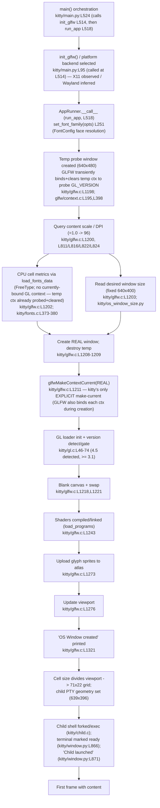

# kitty — Critical Early Startup Phase: A Run‑First, Evidence‑Based Trace

## 0. Executive answer (read this first)

**Direct answer to the question, up front.** On the exercised platform (Linux, headless container), kitty **0.35.2** starts up as follows, and every value below is proven at runtime later in this document:

- **Rendering backend it actually selects:** the **X11** GLFW platform backend with an **OpenGL 4.5 (Core Profile)** context — the GL version string is printed by kitty's **own** `--debug-rendering` startup path *[OBSERVED‑CANONICAL]*. The context is a **software** one whose renderer identity is **Mesa's `llvmpipe`**; that renderer *name* comes from **auxiliary** `glxinfo`, because kitty prints `GL_VERSION` (not `GL_RENDERER`) at startup, so the renderer name is not itself part of the canonical launcher output *[OBSERVED‑AUXILIARY, §3.1]*. Wayland is compiled out of this build (§1.3), so X11 is the only backend present.
- **OpenGL it requires vs. detects:** the required minimum on Linux is **3.1** (`3.3` applies only to macOS) — and this boundary is **empirically confirmed**: a non‑default `MESA_GL_VERSION_OVERRIDE=3.0` makes context creation abort, while `=3.1` starts normally (§8.3) *[minimum CODE‑DERIVED; boundary OBSERVED‑EDGE/NON‑DEFAULT]*; the driver here reports **4.5**, which passes the gate. *[OBSERVED‑CANONICAL]*
- **Display configuration it detects:** content scale **1.0**, logical **DPI 96×96**, OS window **640×400 px**, framebuffer **640×400 px**, cell grid **71 columns × 22 rows**. *[OBSERVED‑CANONICAL]*
- **Text‑rendering capabilities it reports:** default `monospace` resolves to **DejaVu Sans Mono** (four faces, from kitty's own `--debug-font-fallback`); the **cell size is 9×18 px** (confirmed inside the GUI process by a watcher, §3.3); self‑reported device attributes **`ESC[?62;c`** (primary) and **`ESC[>1;4000;35c`** (secondary, captured from a real child PTY, §4.3); **`TERM=xterm-kitty`**. *[OBSERVED‑CANONICAL]* — The finer per‑metric values (baseline **14 px**, and the underline/strikethrough positions and thicknesses) are **not** emitted on the canonical startup path; they come from an **auxiliary** run of kitty's own font harness (injected DPI = the detected 96, so directly comparable) and are cross‑checked against the canonical cell size (§4.2). *[baseline & per‑metric values OBSERVED‑AUXILIARY]*
- **Initialization order (subsystem sequence before any content is displayed):** GLFW platform backend selected → **temp probe window created** — during which GLFW *transiently makes the temp GL context current to read the driver's GL version, then clears it* → **content scale/DPI queried** → **CPU‑side font/cell metrics computed** (pure‑CPU FreeType; **no** context is current at this instant, though the temp context has already been made‑current‑and‑cleared just above) → OS window pixel size decided → **real window created** (GLFW again transiently binds then clears its context) → **kitty explicitly makes the real context current** (its only *explicit* make‑current, `kitty/glfw.c:L1211`) → GL loader/version gate → shaders loaded, glyph sprites uploaded, blank frame swapped, viewport set → child shell forked and terminal marked ready. *[OBSERVED‑CANONICAL — confirmed by a GLX make‑current/clear trace, §5; + CODE‑DERIVED ordering]*
- **The window↔GPU↔cell relationship:** a **temp window** must exist so the driver is validated and the **DPI** is known; the DPI + resolved font face drive the **CPU** cell‑metric computation; the cell size then divides the (separately determined) pixel **viewport** into the terminal's rows/columns. The **default OS window pixel size is a fixed 640×400** (or a remembered cached size), **not** derived from the cell grid (§3.3, §5).
- **Limitations of this run:** software GL (`llvmpipe`) only; **Wayland**, **hardware GPU**, and **macOS/CoreText** are not exercised and are labelled **INFERRED/CODE‑DERIVED** wherever they appear.

The remainder of this document backs every one of these claims with the exact command, the raw unedited output, and the causal `file:line` rationale.

---

## Methodology & labelling conventions

- **Run‑first.** kitty was compiled from source and launched through its **canonical entry point**, the native launcher binary `kitty/launcher/kitty`. No remote‑control hook, no `--debug` bypass of the real path, no mock, and no synthetic stand‑in was used. Where a value is not printed by a debug flag, it was obtained either from **inside the real GUI process** through kitty's own first‑class **watcher** mechanism (a temporary watcher file loaded with `-o watcher=…`; the `-o watcher=` **config** option is read and its module loaded on the canonical startup path by `GlobalWatchers.__call__` — which reads `get_options().watcher` (`kitty/window.py:L504-512`) and calls `load_watch_modules` (`kitty/launch.py:L381-409`) — **not** the deprecated `--watcher` CLI path at `kitty/main.py:L506-508`) or from a **real child process** attached to kitty's PTY. Auxiliary cross‑checks that do *not* traverse the GUI startup path (kitty's font test harness run under `kitty +launch`, and the external tools `glxinfo`/`fc-match`/`xdpyinfo`) are labelled as such and never presented as canonical startup evidence.
- **Default configuration.** kitty was run as a normal user with **no custom `kitty.conf`**; the only command‑line override used for observation is `-o watcher=…`, which adds an observation callback and changes no font/metric/DA value. The built version is **`0.35.2`** (`kitty/constants.py:L25` → `version: Version = Version(0, 35, 2)`).
- **Isolation & safety.** Every run used a **freshly created private `HOME`/XDG tree** (`mktemp -d`, mode 700) so no cached window size or state leaks between runs, and each launch was prefixed with **`env -u KITTY_CONFIG_DIRECTORY -u KITTY_CACHE_DIRECTORY -u KITTY_RUNTIME_DIRECTORY -u XDG_CONFIG_DIRS -u WAYLAND_DISPLAY -u WAYLAND_SOCKET`** so no inherited, higher‑precedence config/cache/runtime override could silently leak in — a fresh `HOME` alone does **not** neutralize these (see §1.5 for the precedence and the observed 26×52→9×18 override evidence). The virtual display was **allocated atomically by Xvfb via `-displayfd`** (not a check‑then‑start free‑number scan, which is TOCTOU‑prone under concurrency) with its **PID captured** and its **ownership verified (`kill -0 "$XVFB_PID"`) before** the **readiness poll**; and all temporary observation scripts were created inside a **private `mktemp -d` directory (mode 700)** and removed afterward (§9).
- **Stability.** Every timing/ordering/value observation was confirmed **stable across two runs**; both raw captures and their comparison are shown.
- **Per‑value labelling.** Labels are applied **per value**, not per section:
  - **[OBSERVED‑CANONICAL]** — captured at runtime through the canonical launcher: kitty's own startup diagnostics, kitty's own public getters queried inside the GUI process by a watcher, or the real child PTY.
  - **[OBSERVED‑AUXILIARY]** — real runtime output, but *not* the GUI startup path: kitty's font harness under `kitty +launch`, or external tools (`glxinfo`, `fc-match`, `xdpyinfo`).
  - **[OBSERVED‑EDGE/NON‑DEFAULT]** — reproduced at runtime through the canonical launcher, but only under a **non‑default** environment override deliberately set to force an edge path (e.g. `MESA_GL_VERSION_OVERRIDE`); the exact override is always disclosed alongside the output.
  - **[CODE‑DERIVED]** — read from source constants/logic, not exercised at runtime.
  - **[INFERRED]** — not reproducible in this environment (Wayland, hardware GPU, macOS/CoreText, and the abort guards that stay unreproduced here — the GL‑version‑too‑low gate and the zero‑cell‑width guard).

## Environment actually observed (the exact build/run context)

All values are the actual container values and form the reproducibility context for every command below.

| Component | Observed value | Command / source |
|---|---|---|
| OS | Ubuntu 25.10 | `. /etc/os-release; echo "$PRETTY_NAME"` |
| Python (build driver + runtime) | 3.13.7 | `python3 --version` (satisfies `pyproject.toml` `requires-python ">=3.8"`) |
| Go | 1.24.4 | `go version` (satisfies `go.mod` `go 1.22`) |
| C compiler | GCC 15.2.0 | `gcc --version` |
| SIMDe headers | `libsimde-dev` 0.8.2‑3 | header at `/usr/include/simde/x86/avx2.h` |
| OpenGL (software) | Mesa 25.2.8, renderer `llvmpipe (LLVM 20.1.8, 256 bits)` | forced via `LIBGL_ALWAYS_SOFTWARE=1` (auxiliary `glxinfo`, §3.1) |
| Monospace default | DejaVu Sans Mono | `fc-match monospace` (§4.1) |
| Virtual display | Xvfb, screen `1280x800x24` | `Xvfb :99 -screen 0 1280x800x24` |

> **Honest deviation note.** The Agent Action Plan's example environment cited Ubuntu 24.04 / Python 3.12.3 / Go 1.22.2 / GCC 13.x and expected the default `monospace` to resolve to *LiberationMono*. This container is **Ubuntu 25.10**, so the toolchain versions differ, the Mesa build string ends `…0.25.10.2`, and FontConfig's default `monospace` here resolves to **DejaVu Sans Mono** (verified in §4.1). These are reported exactly as observed; the behaviour, code paths, and conclusions are identical — only incidental version/font strings differ, and each difference is called out where it appears.

---

## 1. Build & launch

**Direct answer.** kitty is **not** a pure‑Python package; it is compiled by `setup.py`. The `Makefile` `all:` target *is* `python3 setup.py` (`Makefile:L12-13` → `all:` / `python3 setup.py $(VVAL)`). Running the canonical build produced a successful **X11‑only** build of version **0.35.2** (exit `0`), emitting the launcher binary `kitty/launcher/kitty`, the C extension `kitty/fast_data_types.so`, and the Go binary `kitty/launcher/kitten` — all **gitignored** and never committed. **No source file was edited**; the two build blockers were resolved purely at the *environment* level.

### 1.1 The exact build command, complete raw transcript, and verified exit status

Commands begin at the repository root (`/tmp/blitzy/kitty/blitzy-ac3dbd4e-f0c4-4b0d-95de-f07df32f3dde_ff67aa`). **Precondition — this transcript is a cold/clean build, not a warmed rerun.** `setup.py` builds **incrementally**: it compiles only those sources whose object files under `build/` are missing or older than the source (an mtime comparison), so a bare `python3 setup.py` on an already‑built ("warm") tree is a **6‑line no‑op** — it prints only the Wayland‑disable preamble and **0** `Compiling` lines — and does **not** force a full rebuild. To capture the complete forced‑full‑recompile transcript below, the ignored build outputs are therefore removed **first** (the cold/clean precondition), and the build is captured to a log **first** (so the producer is never killed by a `head` `SIGPIPE`, and the real exit code is preserved), then inspected:

```bash
OBS_DIR=$(mktemp -d)                                                 # private capture dir (mktemp -d; avoids fixed-name /tmp symlink races)
rm -rf build kitty/fast_data_types.so kitty/launcher/kitty kitty/launcher/kitten   # cold/clean precondition: forces a full recompile
python3 setup.py > "$OBS_DIR/build.log" 2>&1 ; echo "exit=$?"        # == `make all` (Makefile:L12-13)
```

**Raw output — complete forced‑full‑recompile `build.log`, verbatim** (line count is **97–98** depending on the *Go* build cache: the trailing `kitty/tools/cmd` progress line is emitted only when the Go tools cache is cold — see the warmed‑rerun evidence after the transcript):

```text
Package wayland-protocols was not found in the pkg-config search path.
Perhaps you should add the directory containing `wayland-protocols.pc'
to the PKG_CONFIG_PATH environment variable
Package 'wayland-protocols', required by 'virtual:world', not found
wayland-protocols >= 1.17 is required, found version: not found
Disabling building of wayland backend
[1/85] Compiling kitty/screen.c ...
[2/85] Compiling kitty/unicode-data.c ...
[3/85] Compiling [x11] glfw/x11_window.c ...
[4/85] Compiling kitty/glfw.c ...
[5/85] Compiling kitty/graphics.c ...
[6/85] Compiling kitty/child-monitor.c ...
[7/85] Compiling kitty/fonts.c ...
[8/85] Compiling kitty/shaders.c ...
[9/85] Compiling kitty/vt-parser.c ...
[10/85] Compiling kitty/vt-parser.c ...
[11/85] Compiling kitty/state.c ...
[12/85] Compiling [x11] glfw/input.c ...
[13/85] Compiling kitty/mouse.c ...
[14/85] Compiling [x11] glfw/xkb_glfw.c ...
[15/85] Compiling kitty/freetype.c ...
[16/85] Compiling [x11] glfw/window.c ...
[17/85] Compiling kitty/line.c ...
[18/85] Compiling kitty/glfw-wrapper.c ...
[19/85] Compiling kittens/transfer/algorithm.c ...
[20/85] Compiling [x11] glfw/x11_init.c ...
[21/85] Compiling kitty/freetype_render_ui_text.c ...
[22/85] Compiling [x11] glfw/egl_context.c ...
[23/85] Compiling kitty/disk-cache.c ...
[24/85] Compiling [x11] glfw/glx_context.c ...
[25/85] Compiling kitty/line-buf.c ...
[26/85] Compiling kitty/data-types.c ...
[27/85] Compiling kitty/colors.c ...
[28/85] Compiling kitty/history.c ...
[29/85] Compiling kitty/keys.c ...
[30/85] Compiling [x11] glfw/x11_monitor.c ...
[31/85] Compiling kitty/fontconfig.c ...
[32/85] Compiling [x11] glfw/context.c ...
[33/85] Compiling kitty/crypto.c ...
[34/85] Compiling [x11] glfw/ibus_glfw.c ...
[35/85] Compiling kitty/key_encoding.c ...
[36/85] Compiling kitty/launcher/main.c ...
[37/85] Compiling [x11] glfw/monitor.c ...
[38/85] Compiling kitty/font-names.c ...
[39/85] Compiling [x11] glfw/backend_utils.c ...
[40/85] Compiling kitty/charsets.c ...
[41/85] Compiling [x11] glfw/linux_joystick.c ...
[42/85] Compiling [x11] glfw/init.c ...
[43/85] Compiling [x11] glfw/dbus_glfw.c ...
[44/85] Compiling kitty/gl.c ...
[45/85] Compiling [x11] glfw/vulkan.c ...
[46/85] Compiling [x11] glfw/osmesa_context.c ...
[47/85] Compiling kitty/cursor.c ...
[48/85] Compiling kitty/launcher/single-instance.c ...
[49/85] Compiling kitty/desktop.c ...
[50/85] Compiling kitty/loop-utils.c ...
[51/85] Compiling 3rdparty/ringbuf/ringbuf.c ...
[52/85] Compiling kitty/simd-string.c ...
[53/85] Compiling kitty/systemd.c ...
[54/85] Compiling kitty/shlex.c ...
[55/85] Compiling kitty/child.c ...
[56/85] Compiling kitty/kittens.c ...
[57/85] Compiling 3rdparty/base64/lib/codec_choose.c ...
[58/85] Compiling kitty/png-reader.c ...
[59/85] Compiling [x11] glfw/linux_notify.c ...
[60/85] Compiling kitty/rowcolumn-diacritics.c ...
[61/85] Compiling kitty/hyperlink.c ...
[62/85] Compiling kitty/wcswidth.c ...
[63/85] Compiling kitty/fast-file-copy.c ...
[64/85] Compiling 3rdparty/base64/lib/lib.c ...
[65/85] Compiling [x11] glfw/posix_thread.c ...
[66/85] Compiling kitty/window_logo.c ...
[67/85] Compiling kitty/glyph-cache.c ...
[68/85] Compiling kitty/logging.c ...
[69/85] Compiling 3rdparty/base64/lib/arch/neon64/codec.c ...
[70/85] Compiling 3rdparty/base64/lib/tables/tables.c ...
[71/85] Compiling 3rdparty/base64/lib/arch/neon32/codec.c ...
[72/85] Compiling 3rdparty/base64/lib/arch/avx/codec.c ...
[73/85] Compiling 3rdparty/base64/lib/arch/ssse3/codec.c ...
[74/85] Compiling 3rdparty/base64/lib/arch/sse42/codec.c ...
[75/85] Compiling 3rdparty/base64/lib/arch/sse41/codec.c ...
[76/85] Compiling 3rdparty/base64/lib/arch/avx2/codec.c ...
[77/85] Compiling kitty/utmp.c ...
[78/85] Compiling 3rdparty/base64/lib/arch/avx512/codec.c ...
[79/85] Compiling 3rdparty/base64/lib/arch/generic/codec.c ...
[80/85] Compiling kitty/cleanup.c ...
[81/85] Compiling [x11] glfw/monotonic.c ...
[82/85] Compiling kitty/monotonic.c ...
[83/85] Compiling kitty/simd-string-128.c ...
[84/85] Compiling kitty/simd-string-256.c ...
[85/85] Compiling kitty/gl-wrapper.c ...
 done
[1/4] Linking kitty/fast_data_types ...
[2/4] Linking [x11] kitty/glfw-x11 ...
[3/4] Linking kittens/transfer/rsync ...
[4/4] Linking launcher ...
 done
kitty/tools/cmd
```

**Verified outcome (raw commands + output):**

```bash
$ echo "exit=$?"            # captured immediately after the build
exit=0
$ grep -c 'Compiling'  "$OBS_DIR/build.log"   ;  grep -c '\[x11\]' "$OBS_DIR/build.log" ; grep -c '\[wayland\]' "$OBS_DIR/build.log"
85
21
0
$ grep -ciE 'warning:|error:' "$OBS_DIR/build.log"
0
```

So the **cold/clean (forced full recompile)** build **completed (exit 0)**, compiled **85 units** and linked **4 targets**, is **X11‑only** (21 `[x11]` lines, 0 `[wayland]` lines), and produced **zero warnings/errors** (consistent with the default `-pedantic-errors -Werror`). Wall time was ≈ **24 s**.

**Warmed‑rerun evidence (no clean).** Immediately re‑running the *same* bare command on the now‑built tree is a fast no‑op — `setup.py` finds every object file up‑to‑date and compiles nothing:

```bash
$ python3 setup.py > "$OBS_DIR/build_warm.log" 2>&1 ; echo "exit=$?"
exit=0
$ wc -l < "$OBS_DIR/build_warm.log" ; grep -c 'Compiling' "$OBS_DIR/build_warm.log"
6
0
$ cat "$OBS_DIR/build_warm.log"
Package wayland-protocols was not found in the pkg-config search path.
Perhaps you should add the directory containing `wayland-protocols.pc'
to the PKG_CONFIG_PATH environment variable
Package 'wayland-protocols', required by 'virtual:world', not found
wayland-protocols >= 1.17 is required, found version: not found
Disabling building of wayland backend
```

The warmed rerun emits **6 lines / 0 `Compiling` units** (only the Wayland‑disable preamble) and still exits `0`. This is why the long 85‑unit transcript above **requires** the cold/clean precondition (the `rm -rf build …` step); bare `python3 setup.py` does **not** force a full rebuild on a warm tree.

Version check through the canonical binary:

```bash
$ ./kitty/launcher/kitty --version
kitty 0.35.2 created by Kovid Goyal
```

This matches `kitty/constants.py:L25` (`version: Version = Version(0, 35, 2)`).

### 1.2 Build blocker 1 — SIMDe headers (resolved at environment level)

`setup.py` loads SIMDe include flags best‑effort via pkg‑config. The AVX2 header is pulled in **transitively**, not by a direct include in the compiled translation unit: `kitty/simd-string-128.c:L9` includes only `"simd-string-impl.h"` (its sole `#include`), and `kitty/simd-string-impl.h:L36` is what `#include`s `<simde/x86/avx2.h>` (alongside `<simde/arm/neon.h>` at `L36`–`L37`). So the include chain is `kitty/simd-string-128.c:L9` → `kitty/simd-string-impl.h:L36` → `<simde/x86/avx2.h>`. Without the package the compile fails with `simde/x86/avx2.h: No such file` while building the `simd-string-128.c` unit. The fix is an **environment install** of `libsimde-dev` (observed 0.8.2‑3; header at `/usr/include/simde/x86/avx2.h`), grounded in the best‑effort pkg‑config call in `setup.py`. **No source change.**

### 1.3 Build blocker 2 — vendored Wayland backend vs. newer wayland‑protocols (resolved at environment level)

The vendored GLFW fork's `glfw/wl_window.c` has a `switch` over XDG toplevel states that does not handle the newer `XDG_TOPLEVEL_STATE_CONSTRAINED_*` enum values shipped by recent `wayland-protocols`, and the build promotes unhandled `switch` cases to an error via `-Werror=switch`. Because the source repository is **read‑only**, the correct resolution is to **disable the Wayland backend at build time** by ensuring `libwayland-dev`/`wayland-protocols` are **absent** (confirmed: `pkg-config --exists wayland-protocols` fails). `setup.py` then catches the pkg‑config failure and auto‑disables the backend, printing the first six lines of the transcript above, ending with **`Disabling building of wayland backend`**.

**Consequence for labelling.** Because the built binary contains **only** the X11 backend (21 `[x11]` compile lines, 0 `[wayland]`), everything about the **X11 path is OBSERVED‑CANONICAL**, while **Wayland behaviour is INFERRED** throughout.

### 1.4 Build artifacts (all gitignored — never committed)

| Artifact | Size (bytes) | Ignored by |
|---|---|---|
| `kitty/fast_data_types.so` | 1,253,792 | `.gitignore` `*.so` (`L1`) |
| `kitty/launcher/kitty` | 40,384 | `.gitignore` `/kitty/launcher/kitt*` (`L18`) |
| `kitty/launcher/kitten` | 16,429,348 | `.gitignore` `/kitty/launcher/kitt*` (`L18`) |

`git check-ignore` confirms all three are ignored, so the build introduces **no new tracked or non‑ignored changes**: after the build, `git status --porcelain=v1 --untracked-files=all` reports exactly the single **pre‑existing** modification to this deliverable — ` M blitzy/documentation/kitty_815df1e210e0.md` (the leading space then `M` is git's "modified, unstaged" porcelain code) — and nothing else (the three build artifacts do not appear because they are gitignored). The working tree is therefore **baseline‑preserving**, not empty; the raw evidence is in §9.

### 1.5 The exact launch command (canonical entry point, default config, headless, safely managed)

kitty needs a windowing system and a working OpenGL context, so in this headless container it is launched under a virtual X display (Xvfb) with software OpenGL forced on (Mesa `llvmpipe`). Three correctness details make the run **canonical and race‑free**: (1) the display number is **allocated atomically by Xvfb itself** via `-displayfd` — Xvfb picks a free display and writes the chosen number back, side‑stepping the check‑then‑start TOCTOU race of scanning `/tmp/.X11-unix` (two concurrent scanners can pick the same number); (2) the server's **PID is captured** and its **ownership verified with `kill -0 "$XVFB_PID"` *before* readiness is trusted**, so a readiness poll cannot silently pass by attaching to a *different* process's server; and (3) the launch is prefixed with **`env -u …`** to strip every higher‑precedence kitty/XDG **config**, **cache**, and **runtime** override before pointing `XDG_*` into a **fresh private `HOME`** — because a fresh `HOME` alone does **not** neutralize `KITTY_CONFIG_DIRECTORY`, `XDG_CONFIG_DIRS`, `KITTY_CACHE_DIRECTORY`, or `KITTY_RUNTIME_DIRECTORY` (see the precedence note and the observed override evidence below), and only then are the reported values the canonical defaults a normal user gets:

```bash
# 1) Start a managed virtual display; let Xvfb pick a free number ATOMICALLY via -displayfd
#    (avoids the check-then-start race of scanning /tmp/.X11-unix), then capture and VERIFY its PID.
DISPFILE=$(mktemp)                                                    # race-free per-run temp
Xvfb -displayfd 1 -screen 0 1280x800x24 > "$DISPFILE" 2>/dev/null & XVFB_PID=$!
for i in $(seq 1 100); do [ -s "$DISPFILE" ] && break; sleep 0.1; done # wait for Xvfb to report its number
DISP=$(tr -d '[:space:]' < "$DISPFILE")
kill -0 "$XVFB_PID" || { echo "our Xvfb died before readiness"; exit 1; }   # own-the-server check BEFORE trusting readiness
for i in $(seq 1 50); do DISPLAY=:$DISP xdpyinfo >/dev/null 2>&1 && break; sleep 0.1; done

# 2) Launch kitty through the canonical launcher in a fresh private HOME, with a short-lived child.
#    `env -u ...` strips every higher-precedence config/cache/runtime override (see precedence note
#    below) so the run uses the canonical DEFAULT configuration; XDG_* are then repointed into $KHOME.
KHOME=$(mktemp -d); chmod 700 "$KHOME"
env -u KITTY_CONFIG_DIRECTORY -u KITTY_CACHE_DIRECTORY -u KITTY_RUNTIME_DIRECTORY \
    -u XDG_CONFIG_DIRS -u WAYLAND_DISPLAY -u WAYLAND_SOCKET \
  DISPLAY=:$DISP LIBGL_ALWAYS_SOFTWARE=1 HOME="$KHOME" \
  XDG_CONFIG_HOME="$KHOME/.config" XDG_CACHE_HOME="$KHOME/.cache" XDG_RUNTIME_DIR="$KHOME/run" \
  ./kitty/launcher/kitty --debug-rendering --debug-font-fallback \
  sh -c 'printf "CHILD_RAN\n"; sleep 0.3'

# 3) Teardown (see §9): rm -rf "$KHOME" "$DISPFILE"; kill "$XVFB_PID"
```

- `--debug-rendering` (alias `--debug-gl`) surfaces the GL version line (`kitty/cli.py:L989` defines `--debug-rendering --debug-gl`).
- `--debug-font-fallback` surfaces the resolved "Text fonts:" block (`kitty/cli.py:L1002` defines `--debug-font-fallback`).
- The short‑lived child lets startup complete and then exit cleanly.

**Why `env -u …` is required (config precedence).** A fresh `HOME` (plus repointed `XDG_CONFIG_HOME`) is *not* sufficient to guarantee the default configuration, because kitty consults several environment variables that take **precedence over `~/.config`**. In `kitty/constants.py`, `_get_config_dir()` returns `KITTY_CONFIG_DIRECTORY` **first of all** if set (`kitty/constants.py:L87-88`), only then considering `XDG_CONFIG_HOME` (`L92-93`), `~/.config` (`L94`), and every writable `XDG_CONFIG_DIRS` entry containing a `kitty.conf` (`L97-102`); likewise `cache_dir()` honours `KITTY_CACHE_DIRECTORY` first (`kitty/constants.py:L137-139`) and `runtime_dir()` honours `KITTY_RUNTIME_DIRECTORY` first (`kitty/constants.py:L151-152`). So an inherited `KITTY_CONFIG_DIRECTORY`, writable `XDG_CONFIG_DIRS`, or `KITTY_CACHE_DIRECTORY` would be used **silently**. Unsetting them with `env -u` (and `WAYLAND_DISPLAY`/`WAYLAND_SOCKET` for backend determinism) is what makes the run canonical.

**Observed evidence — the override really changes the result, and `env -u` neutralizes it (OBSERVED).** Using a hostile config dir containing `kitty.conf` with `font_size 33`, the effective cell size is read **inside the real GUI process** by a watcher (`cell_size_for_window`):

```bash
# hostile config: $HOSTILE/kitty/kitty.conf contains "font_size 33"
# (A) fresh-HOME recipe WITHOUT env -u, with KITTY_CONFIG_DIRECTORY inherited -> hostile config applied
$ KITTY_CONFIG_DIRECTORY="$HOSTILE/kitty" DISPLAY=:$DISP LIBGL_ALWAYS_SOFTWARE=1 HOME="$KHOME" \
    XDG_CONFIG_HOME="$KHOME/.config" ./kitty/launcher/kitty -o watcher="$OBS_DIR/cellprobe.py" sh -c 'sleep 0.4'
cell=26x52     # exit=0 — NOT the default; the inherited config silently won

# (B) same hostile var present, but the recipe's env -u strips it -> canonical default restored
$ KITTY_CONFIG_DIRECTORY="$HOSTILE/kitty" \
    env -u KITTY_CONFIG_DIRECTORY -u KITTY_CACHE_DIRECTORY -u KITTY_RUNTIME_DIRECTORY -u XDG_CONFIG_DIRS -u WAYLAND_DISPLAY -u WAYLAND_SOCKET \
    DISPLAY=:$DISP LIBGL_ALWAYS_SOFTWARE=1 HOME="$KHOME" XDG_CONFIG_HOME="$KHOME/.config" \
    ./kitty/launcher/kitty -o watcher="$OBS_DIR/cellprobe.py" sh -c 'sleep 0.4'
cell=9x18      # exit=0 — matches the documented default

# (C) clean control (no hostile var at all)
cell=9x18      # exit=0 — identical to (B)
```

Confirming **no config file is loaded** under the fix, a `kitty +launch` probe of `kitty.constants.config_dir` (with the same hostile var set but stripped by `env -u`) reports the resolved dir is the fresh `HOME`, the variable is gone, and no `kitty.conf` exists there:

```text
RESOLVED_CONFIG_DIR=/tmp/tmp.PJpGbKr0CN/.config/kitty
KITTY_CONFIG_DIRECTORY_in_env=False
kitty.conf_exists=False
```

So case (A) reproduces the silent override (cell `26x52`, matching a 33 pt font), while (B)/(C) restore the canonical `9x18` — the `env -u` prefix is what guarantees the default. *(This override probe uses a watcher for the value read‑back and is OBSERVED; it exercises the real launcher on the canonical path.)*

**The canonical process entry (active from‑source path).** The native launcher's `int main(...)` is at `kitty/launcher/main.c:L439`; it calls **`run_embedded(&run_data)`** at `kitty/launcher/main.c:L464`. `run_embedded` (`kitty/launcher/main.c:L177`) initializes CPython and calls **`Py_RunMain()`** at `kitty/launcher/main.c:L216`, which runs the repository `__main__.py:L5-7` (`from kitty.entry_points import main; main()`). `kitty/entry_points.py:main()` (`L183`) has no matching sub‑command for the default GUI invocation and therefore falls through to `from kitty.main import main as kitty_main; kitty_main()` at `kitty/entry_points.py:L194-195`. (The frozen/bundle path — `kitty_main`/`bypy_run_interpreter` near `kitty/launcher/main.c:L168`, and `kitty/entry_points.py:L49-50` inside `open_urls()` — is a *different* path and is **not** used by the from‑source binary.)

**Reading convention for the command snippets in §2–§8.** To keep the raw‑output blocks legible, later snippets abbreviate the full §1.5 boilerplate — they omit the repeated Xvfb `-displayfd` management and the `env -u …` isolation prefix, which apply to **every** run. They also write `DISPLAY=:99` literally: `:99` is simply the number that Xvfb allocated during the original capture session (the canonical recipe allocates it atomically and refers to it as `$DISP`). Because the capture environment had **no** hostile `KITTY_CONFIG_DIRECTORY`/`XDG_CONFIG_DIRS`/`KITTY_CACHE_DIRECTORY` set, the `env -u` prefix does not change any captured value here — the clean‑control run (case (C) above) yields the identical `9x18` default — so the transcripts below are the true canonical‑default output.

---

## 2. The early‑startup trace (raw output, both runs, byte‑identity)

**Direct answer.** Through the canonical launcher with the two debug flags, kitty emits — in order — the **GL version** (stdout), then **"OS Window created"**, a benign **systemd** diagnostic, **"Child launched"**, and the **"Text fonts:"** block (stderr). The two runs are **byte‑identical after timestamps are normalized**, confirming stability.

### 2.1 Run 1 — raw, unedited

**Capture command for run 1** (copy‑pasteable; abbreviates the §1.5 boilerplate per the reading convention — the full `env -u …` isolation prefix and Xvfb `-displayfd` management still apply; `$OBS_DIR` is the private capture dir created in §1.1/§1.5). The **stdout** and **stderr** channels are saved to **separate** files, then concatenated **stdout‑first, then stderr** into `run1.txt` — that concatenation is the exact byte layout hashed in §2.3:

```bash
KHOME=$(mktemp -d); chmod 700 "$KHOME"                                          # fresh private HOME for this run
env -u KITTY_CONFIG_DIRECTORY -u KITTY_CACHE_DIRECTORY -u KITTY_RUNTIME_DIRECTORY -u XDG_CONFIG_DIRS -u WAYLAND_DISPLAY -u WAYLAND_SOCKET \
  DISPLAY=:99 LIBGL_ALWAYS_SOFTWARE=1 HOME="$KHOME" XDG_CONFIG_HOME="$KHOME/.config" \
  ./kitty/launcher/kitty --debug-rendering --debug-font-fallback \
  sh -c 'printf "CHILD_RAN\n"; sleep 0.3' \
  > "$OBS_DIR/run1.out" 2> "$OBS_DIR/run1.err"                                   # stdout channel -> run1.out ; stderr channel -> run1.err
cat "$OBS_DIR/run1.out" "$OBS_DIR/run1.err" > "$OBS_DIR/run1.txt"               # normalization copy: run1.txt == stdout-then-stderr
rm -rf "$KHOME"
```

The two captured channels are shown verbatim below — the `STDOUT:` block **is** `run1.out`, the `STDERR:` block **is** `run1.err`; `run1.txt` is their in‑order concatenation (the `STDOUT:`/`STDERR:` markers are editorial section labels, not bytes in `run1.txt`):

```text
STDOUT:
[0.166] GL version string: '4.5 (Core Profile) Mesa 25.2.8-0ubuntu0.25.10.2' Detected version: 4.5

STDERR:
[0.228] OS Window created
[0.238] Failed to open systemd user bus with error: Connection refused
[0.242] Child launched
[0.242] Text fonts:
[0.242]   Normal: DejaVuSansMono: /usr/share/fonts/truetype/dejavu/DejaVuSansMono.ttf:0
[0.242]   Bold: DejaVuSansMono-Bold: /usr/share/fonts/truetype/dejavu/DejaVuSansMono-Bold.ttf:0
[0.242]   Italic: DejaVuSansMono-Oblique: /usr/share/fonts/truetype/dejavu/DejaVuSansMono-Oblique.ttf:0
[0.242]   Bold-Italic: DejaVuSansMono-BoldOblique: /usr/share/fonts/truetype/dejavu/DejaVuSansMono-BoldOblique.ttf:0
```

Process exit status: `0`; wall time ≈ `0.63 s`.

### 2.2 Run 2 — raw, unedited (same command, fresh private HOME)

**Capture command for run 2** (identical to run 1 except the output file suffix; each run gets its own fresh `mktemp -d` HOME):

```bash
KHOME=$(mktemp -d); chmod 700 "$KHOME"
env -u KITTY_CONFIG_DIRECTORY -u KITTY_CACHE_DIRECTORY -u KITTY_RUNTIME_DIRECTORY -u XDG_CONFIG_DIRS -u WAYLAND_DISPLAY -u WAYLAND_SOCKET \
  DISPLAY=:99 LIBGL_ALWAYS_SOFTWARE=1 HOME="$KHOME" XDG_CONFIG_HOME="$KHOME/.config" \
  ./kitty/launcher/kitty --debug-rendering --debug-font-fallback \
  sh -c 'printf "CHILD_RAN\n"; sleep 0.3' \
  > "$OBS_DIR/run2.out" 2> "$OBS_DIR/run2.err"
cat "$OBS_DIR/run2.out" "$OBS_DIR/run2.err" > "$OBS_DIR/run2.txt"
rm -rf "$KHOME"
```

```text
STDOUT:
[0.163] GL version string: '4.5 (Core Profile) Mesa 25.2.8-0ubuntu0.25.10.2' Detected version: 4.5

STDERR:
[0.229] OS Window created
[0.239] Failed to open systemd user bus with error: Connection refused
[0.242] Child launched
[0.243] Text fonts:
[0.243]   Normal: DejaVuSansMono: /usr/share/fonts/truetype/dejavu/DejaVuSansMono.ttf:0
[0.243]   Bold: DejaVuSansMono-Bold: /usr/share/fonts/truetype/dejavu/DejaVuSansMono-Bold.ttf:0
[0.243]   Italic: DejaVuSansMono-Oblique: /usr/share/fonts/truetype/dejavu/DejaVuSansMono-Oblique.ttf:0
[0.243]   Bold-Italic: DejaVuSansMono-BoldOblique: /usr/share/fonts/truetype/dejavu/DejaVuSansMono-BoldOblique.ttf:0
```

Process exit status: `0`; wall time ≈ `0.63 s`.

### 2.3 Two‑run stability — proof

Normalizing the leading `[n.nnn]` timestamp and hashing both captures yields the **same digest**, and a raw `diff` of the two captures shows **only** timestamps differ:

```bash
$ for f in run1 run2; do sed -E 's/^\[[0-9]+\.[0-9]+\]/[T]/' "$OBS_DIR/$f.txt" | sha256sum; done
c66e9828df401dcb63582b59ef4a9b9c4eee32b71882e83aa0d8c3f0f286a69c  -
c66e9828df401dcb63582b59ef4a9b9c4eee32b71882e83aa0d8c3f0f286a69c  -

$ diff <(sed -E 's/^\[[0-9]+\.[0-9]+\]/[T]/' "$OBS_DIR/run1.txt") \
       <(sed -E 's/^\[[0-9]+\.[0-9]+\]/[T]/' "$OBS_DIR/run2.txt") && echo "identical after timestamp normalization"
identical after timestamp normalization
```

The digests are identical and the normalized `diff` is empty, so the startup content is **deterministic** across runs (only wall‑clock timestamps vary — the raw, un‑normalized `diff` differs solely in each line's leading `[n.nnn]` prefix). *[OBSERVED‑CANONICAL]*

### 2.4 Who emits each line (emitter provenance) — corrected

Each line is attributed to the exact emitter that produces it — these are **not** all the same logging facility:

| Emitted line | Stream | Emitter (function → file:line) | Label |
|---|---|---|---|
| `GL version string: … Detected version: N` | stdout | C `glGetString(GL_VERSION)` + debug print in `gl_init` — `kitty/gl.c:L46-47` (query), `kitty/gl.c:L72` (print) | OBSERVED‑CANONICAL |
| `OS Window created` | stderr | C `debug("OS Window created\n")` at `kitty/glfw.c:L1321`, where `debug` is `#define debug debug_rendering` (`kitty/glfw.c:L34`) → `debug_rendering(...)` which, when `--debug-rendering` is set, calls `timed_debug_print` (`kitty/state.h:L14`) | OBSERVED‑CANONICAL |
| `Failed to open systemd user bus …` | stderr | C `log_error(...)` — `kitty/systemd.c:L87` (benign; no session bus in container) | OBSERVED‑CANONICAL |
| `Child launched` | stderr | Python `print(f'[{now:.3f}] Child launched', file=sys.stderr)` from the window bring‑up path (`kitty/window.py:L871`), fired **after** the terminal is marked ready (`kitty/window.py:L866`) | OBSERVED‑CANONICAL |
| `Text fonts:` + 4 faces | stderr | Python `dump_font_debug()` — `kitty/fonts/render.py:L161` | OBSERVED‑CANONICAL |

The leading `[n.nnn]` prefix has two distinct origins: on the **C side** it is produced by the monotonic timestamp helper `timed_debug_print` (`kitty/monotonic.h:L99-106`; the `fprintf(stderr, "[%.3f] ", …)` is at `L102`), while the **Python** `"Child launched"` line builds its own matching prefix with an f‑string, `print(f'[{now:.3f}] Child launched', file=sys.stderr)` (`kitty/window.py:L871`). (The file `kitty/monotonic.h` is 110 lines long, so the earlier draft's `L98-111` citation ran past EOF — corrected here to `L99-106`.)

### 2.5 Emission order ≠ initialization order (important nuance)

The **order the lines print is not the order the subsystems initialize.** The `--debug-font-fallback` block is emitted late — by `dump_font_debug()` called at `kitty/main.py:L229`, *after* `create_os_window` (`L221`), `Boss` construction (`L226`), and `boss.start(...)` (`L227`). But the fonts are actually **resolved much earlier**: `AppRunner.__call__` calls `set_font_family(opts)` at `kitty/main.py:L251` (FontConfig resolution) **before** `_run_app` at `kitty/main.py:L252`, and the CPU cell metrics are computed still earlier, inside window creation (§5). So "Text fonts:" printing last does **not** mean fonts resolve last — §5 and §6 give the true initialization order.

Likewise, **"Child launched" is a post‑layout / terminal‑ready diagnostic, not the fork/exec instant.** The child is actually forked/`exec`'d in the C child‑spawn path (`kitty/child.c`, driven from `kitty/child.py`); the `"Child launched"` message is printed from `kitty/window.py:L871`, which runs **after** `mark_terminal_ready` at `kitty/window.py:L866` (i.e., after the window's initial geometry/PTY size are set). It marks "child wired to a ready terminal," not "process just created."


---

## 3. The rendering backend it selects, and the display configuration it detects

### 3.1 GPU context creation and the backend actually selected

**Direct answer.** kitty selects the **X11** GLFW platform backend (the only one in this build) and obtains an **OpenGL 4.5 (Core Profile)** context from **Mesa `llvmpipe`** (software). It **requests** a context of at least the required major/minor with forward‑compatibility, then **detects and gates** on the version the driver actually returns.

**Requested (hints), from source.** At window creation kitty sets only the context **version** hints and forward‑compat — it does **not** set a profile hint:

- `glfwWindowHint(GLFW_CONTEXT_VERSION_MAJOR, …)` and `…_MINOR, …` — `kitty/glfw.c:L1127-1128`; `glfwWindowHint(GLFW_OPENGL_FORWARD_COMPAT, true)` — `kitty/glfw.c:L1129`. No `GLFW_OPENGL_PROFILE` hint is set anywhere on the window‑creation path.
- The required minimum comes from `kitty/data-types.h`: `OPENGL_REQUIRED_VERSION_MAJOR 3` (`L20`); on Apple `OPENGL_REQUIRED_VERSION_MINOR 3` (`L22`), **on Linux `OPENGL_REQUIRED_VERSION_MINOR 1`** (`L24`). So the **Linux minimum is 3.1**, not 3.3. *[CODE‑DERIVED]* The GLSL version compiled in is `140` (`GLSL_VERSION`), consistent with the 3.1 floor.

**Detected (runtime), through the canonical path.** `gl_init()` queries `glGetString(GL_VERSION)` (`kitty/gl.c:L46-47`), prints it under `--debug-rendering` (`kitty/gl.c:L72`), and aborts if the driver is older than the required minimum (`kitty/gl.c:L74`). Observed line (from §2):

```text
[0.166] GL version string: '4.5 (Core Profile) Mesa 25.2.8-0ubuntu0.25.10.2' Detected version: 4.5
```

> **"Core Profile" is a driver‑reported result, not a kitty request.** kitty never sets `GLFW_OPENGL_PROFILE` in the observed hints (`kitty/glfw.c:L1127-1129` set version major/minor + forward‑compat only). The `(Core Profile)` substring is part of the **driver's** `GL_VERSION` string; Mesa returns a Core‑Profile‑style context here. So it is correct to say kitty *received* a 4.5 Core Profile context, and incorrect to say kitty *asked for* a core profile. *[OBSERVED‑CANONICAL for the returned string; CODE‑DERIVED for the hints]*

**Auxiliary cross‑check (not the GUI path).** An independent `glxinfo` under the same software‑GL forcing corroborates the vendor/renderer and shows the GL string matches kitty's byte‑for‑byte:

```text
$ DISPLAY=:99 LIBGL_ALWAYS_SOFTWARE=1 glxinfo | grep -iE 'vendor|renderer|version string'
OpenGL vendor string: Mesa
OpenGL renderer string: llvmpipe (LLVM 20.1.8, 256 bits)
OpenGL core profile version string: 4.5 (Core Profile) Mesa 25.2.8-0ubuntu0.25.10.2
OpenGL shading language version string: 4.50
```

*[OBSERVED‑AUXILIARY]* — this confirms the backend is Mesa software `llvmpipe`, and the core‑profile version string equals what kitty printed.

**Backend selection mechanism.** The GLFW platform is chosen by the vendored GLFW fork at `glfwInit`/window‑creation time from what is compiled in and available; because only X11 was compiled (§1.3) and `DISPLAY` points at Xvfb, **X11 is selected**. Wayland selection is **INFERRED** (would require the Wayland backend and a compositor, neither present). `kitty/constants.py` exposes the `is_wayland`/`is_macos` predicates used elsewhere to branch on backend.

### 3.2 The GL‑context guard (what happens if creation fails)

kitty creates a small **temporary window first** to validate that a usable GL context can be made; if that fails it aborts with the "requires working OpenGL … drivers" message (`kitty/glfw.c:L1198-1199`). This guard is **reproduced** in §8.3 via a non‑default `MESA_GL_VERSION_OVERRIDE=3.0` (context creation fails with `GLXBadFBConfig`), and also fires on the no‑display edge cases in §8. *[temp‑window context‑failure path OBSERVED‑EDGE/NON‑DEFAULT via override — §8.3; glfwInit no‑display failure OBSERVED — §8.1–8.2]*

### 3.3 The display configuration it detects (canonical values)

**Direct answer.** With software GL on a 1280×800 Xvfb screen and **no custom config**, kitty detects **content scale 1.0**, sets **logical DPI 96×96**, creates a **fixed default OS window of 640×400 px**, obtains a **640×400 px framebuffer**, and — after cell metrics — lays out a **71‑column × 22‑row** grid. These are captured **inside the real GUI process** by a watcher (canonical), not inferred.

**How the values were captured canonically.** A temporary watcher module was loaded with `-o watcher=…`. The `-o watcher=` **config** option is loaded on the canonical startup path by `GlobalWatchers.__call__` — which reads `get_options().watcher` (`kitty/window.py:L504-512`) and calls `load_watch_modules` (`kitty/launch.py:L381-409`) — and a watcher's `on_resize(boss, window, data)` fires during initial layout (`call_watchers(..., 'on_resize', ...)` at `kitty/window.py:L856`). (This is the configuration‑watcher path, distinct from the deprecated `--watcher` CLI option handled at `kitty/main.py:L506-508`.) From inside it we called kitty's own public getters — `get_os_window_size(os_window_id)` (`kitty/state.c:L1067-1083`), `cell_size_for_window(os_window_id)` (`kitty/state.c:L811`), `current_fonts(os_window_id)`, and read `window.screen.columns/.lines` and `data['new_geometry']` (a `WindowGeometry(left, top, right, bottom, xnum, ynum)`). The script appends one JSON record per callback to a file named by the `KITTY_OBS_OUT` environment variable (kept outside the terminal's own stdout/stderr so it does not perturb the trace).

**Exact watcher source used** (temporary; created under a private `mktemp -d`, mode 700; removed in §9):

```python
# Temporary kitty watcher to observe REAL startup values from inside the GUI process.
# Loaded via: kitty -o watcher=<this file>. kitty invokes module-level on_* callbacks
# (see kitty/launch.py:load_watch_modules) inside the real GUI process on the canonical
# startup path. We query the real OS window via kitty's own public getters.
import json
import os
from kitty.fast_data_types import get_os_window_size, current_fonts, cell_size_for_window


def _dump(tag, window, data):
    out = os.environ.get('KITTY_OBS_OUT')
    if not out:
        return
    try:
        oswid = window.os_window_id
        sz = get_os_window_size(oswid)                 # width/height/framebuffer_*/xscale/yscale/xdpi/ydpi/cell_width/cell_height
        cw, ch = cell_size_for_window(oswid)           # canonical cell metrics for the real window
        cf = current_fonts(oswid)                      # logical_dpi_x/y + font_sz_in_pts (real detected)
        rec = {
            'tag': tag,
            'os_window_size': sz,
            'cell_size_for_window': [cw, ch],
            'logical_dpi_x': cf.get('logical_dpi_x'),
            'logical_dpi_y': cf.get('logical_dpi_y'),
            'font_sz_in_pts': cf.get('font_sz_in_pts'),
            'screen_columns': window.screen.columns,
            'screen_lines': window.screen.lines,
        }
        ng = data.get('new_geometry') if isinstance(data, dict) else None
        if ng is not None:
            rec['new_geometry'] = {
                'left': ng.left, 'top': ng.top, 'right': ng.right,
                'bottom': ng.bottom, 'xnum': ng.xnum, 'ynum': ng.ynum,
            }
        with open(out, 'a') as f:
            f.write('WATCHER_JSON=' + json.dumps(rec, sort_keys=True) + '\n')
    except Exception:
        import traceback
        with open(out, 'a') as f:
            f.write('WATCHER_ERR=' + traceback.format_exc().replace('\n', ' | ') + '\n')


def on_resize(boss, window, data):
    _dump('on_resize', window, data)


def on_focus_change(boss, window, data):
    _dump('on_focus_change', window, data)
```

**Capture command (copy‑pasteable; both runs).** The watcher module is loaded with `-o watcher=…`; the `KITTY_OBS_OUT` environment variable names the per‑run capture file the watcher **appends** to (each `on_*` callback writes one `WATCHER_JSON=` line). This abbreviates the §1.5 boilerplate per the reading convention (`$OBS_DIR` and `watcher.py` are from §1.5/above):

```bash
for N in 1 2; do
  KHOME=$(mktemp -d); chmod 700 "$KHOME"                                        # fresh private HOME per run
  env -u KITTY_CONFIG_DIRECTORY -u KITTY_CACHE_DIRECTORY -u KITTY_RUNTIME_DIRECTORY -u XDG_CONFIG_DIRS -u WAYLAND_DISPLAY -u WAYLAND_SOCKET \
    KITTY_OBS_OUT="$OBS_DIR/watch_run$N.jsonl" DISPLAY=:99 LIBGL_ALWAYS_SOFTWARE=1 HOME="$KHOME" XDG_CONFIG_HOME="$KHOME/.config" \
    ./kitty/launcher/kitty -o watcher="$OBS_DIR/watcher.py" \
    sh -c 'sleep 0.4'                                                           # writes $OBS_DIR/watch_runN.jsonl
  rm -rf "$KHOME"
done
```

**Raw output — the complete `watch_run1.jsonl` contents, both records, identical in both runs** (the `on_resize` record carries `new_geometry`; the later `on_focus_change` record does not — both report the same window/DPI/cell values):

```text
WATCHER_JSON={"cell_size_for_window": [9, 18], "font_sz_in_pts": 11.0, "logical_dpi_x": 96.0, "logical_dpi_y": 96.0, "new_geometry": {"bottom": 398, "left": 0, "right": 639, "top": 2, "xnum": 71, "ynum": 22}, "os_window_size": {"cell_height": 18, "cell_width": 9, "framebuffer_height": 400, "framebuffer_width": 640, "height": 400, "width": 640, "xdpi": 96.0, "xscale": 1.0, "ydpi": 96.0, "yscale": 1.0}, "screen_columns": 71, "screen_lines": 22, "tag": "on_resize"}
WATCHER_JSON={"cell_size_for_window": [9, 18], "font_sz_in_pts": 11.0, "logical_dpi_x": 96.0, "logical_dpi_y": 96.0, "os_window_size": {"cell_height": 18, "cell_width": 9, "framebuffer_height": 400, "framebuffer_width": 640, "height": 400, "width": 640, "xdpi": 96.0, "xscale": 1.0, "ydpi": 96.0, "yscale": 1.0}, "screen_columns": 71, "screen_lines": 22, "tag": "on_focus_change"}
```

**Two‑run identity proof (watcher).** The startup was watched twice; the two capture files are byte‑identical:

```text
$ cd "$OBS_DIR"                                        # the capture dir from §1.5; holds watch_run{1,2}.jsonl
$ diff -q watch_run1.jsonl watch_run2.jsonl && echo identical
identical
$ sha256sum watch_run1.jsonl watch_run2.jsonl
1812d309f91f1f588dd28311943d97a96d244be5830c4050a702568a4f5593a7  watch_run1.jsonl
1812d309f91f1f588dd28311943d97a96d244be5830c4050a702568a4f5593a7  watch_run2.jsonl
```

**Detected display configuration, with source mapping:**

| Quantity | Observed value | Source of the value | Label |
|---|---|---|---|
| Content scale (x, y) | 1.0, 1.0 | `get_window_content_scale(...)` queries the live window via `glfwGetWindowContentScale` — `kitty/glfw.c:L822-826` | OBSERVED‑CANONICAL |
| Logical DPI (x, y) | 96.0, 96.0 | `dpi_from_scale` uses base factor `96.0` (`kitty/glfw.c:L811,L816`); scale 1.0 → 96 | OBSERVED‑CANONICAL |
| Font group logical DPI | 96.0, 96.0 | logical DPI stored on the font group by direct assignment in `font_group_for` (`kitty/fonts.c:L204`) — `kitty/fonts.c:L213-214` | OBSERVED‑CANONICAL |
| OS window size | 640 × 400 px | fixed default (§3.3 note) — `kitty/os_window_size.py` | OBSERVED‑CANONICAL |
| Framebuffer size | 640 × 400 px | `framebuffer_size_callback` / query — `kitty/glfw.c:L330` | OBSERVED‑CANONICAL |
| Cell size | 9 × 18 px | `calc_cell_metrics` (§4.2) | OBSERVED‑CANONICAL |
| Grid | 71 cols × 22 rows | viewport ÷ cell size (see math below) | OBSERVED‑CANONICAL |

**Grid math checks out exactly.** With cell 9×18 and geometry `[left=0, top=2, right=639, bottom=398, xnum=71, ynum=22]`: content width `639 = 71 × 9`; content height `396 = 22 × 18`, placed below a `top=2` px pad, so the 400‑px window height decomposes as `2 (top) + 396 (content) + 2 (bottom) = 400`. This confirms the window pixel size is **fixed/independent** and the **cell size divides the viewport** into rows/columns.

> **Why DPI 96 here is REAL, not injected.** Xvfb's *physical* DPI is 100×100 — an auxiliary `xdpyinfo` confirms it:
>
> ```text
> $ DISPLAY=:99 xdpyinfo | grep -E 'dimensions|resolution'
>   dimensions:    1280x800 pixels (325x203 millimeters)
>   resolution:    100x100 dots per inch
> ```
>
> — but kitty does **not** use that physical DPI. It derives its **logical** DPI from the window **content scale**, which the driver reports as **1.0** on this display; `dpi_from_scale` multiplies the base `96.0` by that scale → **96** (`kitty/glfw.c:L811,L816,L822-826`). So the canonical **96 DPI is a detected value on the real startup path** (`xdpyinfo`'s 100 is *not* what kitty adopts), and it happens to coincide with the auxiliary font‑harness's injected 96 (§4.2) — the match is a confirmation, not a substitution.

### 3.4 Window sizing semantics — corrected (finding #8)

The default **OS window pixel size is not computed from the cell grid.** `kitty/os_window_size.py` returns a **cached** remembered size when one exists (early‑return around `L56-63`, gated by `remember_window_size=True`), otherwise it honours the configured `initial_window_width/height`. The defaults (from `kitty/options/types.py`) are `initial_window_width=(640,'px')` (`L535`), `initial_window_height=(400,'px')` (`L534`), `remember_window_size=True` (`L566`), i.e. a **fixed 640×400 px** on a clean profile. Only when a dimension's unit is `'cells'` does the code multiply by the cell size — `width = cell_width * w / xscale + (dpi_x / 72) * spacing + 1` at `kitty/os_window_size.py:L90`, inside the `unit=='cells'` branch (`L87-L98`) of `get_window_size` (`L70-99`); with the default `'px'` units the pixel size is taken **verbatim** (the `else: width = w` at `L91-92`). The **cell metrics then divide that pixel viewport** into the 71×22 grid and set the child PTY geometry (§4.3). This is the reverse of the earlier draft's claim that the window size was derived from the cells.


---

## 4. What the terminal reports about its text‑rendering capabilities

### 4.1 Resolved font faces (default `monospace`)

**Direct answer.** With no config, the default `monospace` family resolves through FontConfig to **DejaVu Sans Mono**, and the four styles map to distinct real `.ttf` files. This is emitted canonically by `dump_font_debug()` (`kitty/fonts/render.py:L161`), reached from `kitty/main.py:L229` when `--debug-font-fallback` is set. Raw block (from §2):

```text
[0.242] Text fonts:
[0.242]   Normal: DejaVuSansMono: /usr/share/fonts/truetype/dejavu/DejaVuSansMono.ttf:0
[0.242]   Bold: DejaVuSansMono-Bold: /usr/share/fonts/truetype/dejavu/DejaVuSansMono-Bold.ttf:0
[0.242]   Italic: DejaVuSansMono-Oblique: /usr/share/fonts/truetype/dejavu/DejaVuSansMono-Oblique.ttf:0
[0.242]   Bold-Italic: DejaVuSansMono-BoldOblique: /usr/share/fonts/truetype/dejavu/DejaVuSansMono-BoldOblique.ttf:0
```

*[OBSERVED‑CANONICAL]* The Python‑side resolution is `set_font_family()` (`kitty/fonts/render.py:L173`), driven by the FontConfig backend (`kitty/fonts/fontconfig.py`, C side `kitty/fontconfig.c`).

**Auxiliary cross‑check (not the GUI path).** An independent `fc-match` confirms the same face mapping FontConfig hands kitty:

```text
$ fc-match monospace; fc-match monospace:bold; fc-match monospace:italic; fc-match monospace:bold:italic
DejaVuSansMono.ttf: "DejaVu Sans Mono" "Book"
DejaVuSansMono-Bold.ttf: "DejaVu Sans Mono" "Bold"
DejaVuSansMono-Oblique.ttf: "DejaVu Sans Mono" "Oblique"
DejaVuSansMono-BoldOblique.ttf: "DejaVu Sans Mono" "Bold Oblique"
```

*[OBSERVED‑AUXILIARY]* — matches the canonical faces exactly.

### 4.2 Cell metrics (computed before any content) — auxiliary probe + canonical cross‑check

**Direct answer.** The computed cell is **9 px wide × 18 px tall**, baseline **14 px**, with underline/strikethrough positions and thicknesses as tabulated below. The **cell size (9×18) is confirmed canonically** by the watcher (§3.3); the finer per‑metric values (baseline, underline, strikethrough, cursor thicknesses) come from an **auxiliary** run of kitty's own font harness, which injects DPI=96 — the **same** DPI the canonical path detects (§3.3), so the auxiliary metrics are directly comparable.

`calc_cell_metrics` (`kitty/fonts.c:L373`) calls `cell_metrics(...)` (`kitty/fonts.c:L375`) to obtain width/height, baseline, and underline/strikethrough position+thickness, **aborting if width is zero** (`kitty/fonts.c:L376`), then applies any configured `cell_width`/`cell_height` adjustments scaled by logical DPI (`kitty/fonts.c:L379-380`). The FreeType implementation converts face units to pixels in `font_units_to_pixels_y` (`kitty/freetype.c:L92-93`) and fills the metrics in `cell_metrics` (`kitty/freetype.c:L387-391`).

**Exact auxiliary harness used** (temporary; under private `mktemp -d`; removed in §9). It wraps `kitty.fonts.render.prerender_function` to intercept the metrics kitty itself computes inside `setup_for_testing`, then reads the raw FreeType face units from the medium face:

```python
# AUXILIARY probe: exercises kitty's OWN font code (set_font_family -> FontConfig ->
# FreeType cell_metrics -> prerender_function) via the sanctioned setup_for_testing
# harness, at the SAME DPI (96) that the real GUI window was observed to detect.
# It is NOT the canonical GUI startup path (it is driven by `kitty +launch`), so its
# output is labelled OBSERVED-AUXILIARY. It captures the fine-grained decoration
# metrics that the canonical getters do not expose, plus the raw FreeType face units.
import json
import kitty.fonts.render as R
from kitty.fast_data_types import current_fonts

captured = {}
_orig = R.prerender_function


def _wrap(cell_width, cell_height, baseline, underline_position, underline_thickness,
          strikethrough_position, strikethrough_thickness, cursor_beam_thickness,
          cursor_underline_thickness, dpi_x, dpi_y):
    captured.update(dict(
        cell_width=cell_width, cell_height=cell_height, baseline=baseline,
        underline_position=underline_position, underline_thickness=underline_thickness,
        strikethrough_position=strikethrough_position, strikethrough_thickness=strikethrough_thickness,
        cursor_beam_thickness=cursor_beam_thickness, cursor_underline_thickness=cursor_underline_thickness,
        dpi_x=dpi_x, dpi_y=dpi_y))
    return _orig(cell_width, cell_height, baseline, underline_position, underline_thickness,
                 strikethrough_position, strikethrough_thickness, cursor_beam_thickness,
                 cursor_underline_thickness, dpi_x, dpi_y)


R.prerender_function = _wrap

with R.setup_for_testing('monospace', 11.0, 96.0) as (sprites, cw, ch):
    cf = current_fonts()
    medium = cf['medium']
    face_raw = dict(
        units_per_EM=getattr(medium, 'units_per_EM', None),
        ascender=getattr(medium, 'ascender', None),
        descender=getattr(medium, 'descender', None),
        height=getattr(medium, 'height', None),
        underline_position=getattr(medium, 'underline_position', None),
        underline_thickness=getattr(medium, 'underline_thickness', None),
    )
    out = dict(
        harness='setup_for_testing(monospace, 11.0, 96.0)  [AUXILIARY, injected DPI=96]',
        returned_cell_width=cw, returned_cell_height=ch,
        prerender=captured,
        medium_face=medium.identify_for_debug() if hasattr(medium, 'identify_for_debug') else str(medium),
        face_raw_font_units=face_raw,
    )
print('METRICS_JSON=' + json.dumps(out, sort_keys=True))
```

```bash
# Capture command (both runs). `+launch` runs the auxiliary probe inside a kitty
# interpreter; the probe prints exactly ONE METRICS_JSON line to stdout (stderr is
# empty), redirected to metrics_runN.out. Abbreviates the §1.5 boilerplate per the
# reading convention (`$OBS_DIR`/`metrics_probe.py` are from §1.5/above).
for N in 1 2; do
  KHOME=$(mktemp -d); chmod 700 "$KHOME"                                        # fresh private HOME per run
  env -u KITTY_CONFIG_DIRECTORY -u KITTY_CACHE_DIRECTORY -u KITTY_RUNTIME_DIRECTORY -u XDG_CONFIG_DIRS -u WAYLAND_DISPLAY -u WAYLAND_SOCKET \
    DISPLAY=:99 LIBGL_ALWAYS_SOFTWARE=1 HOME="$KHOME" XDG_CONFIG_HOME="$KHOME/.config" \
    ./kitty/launcher/kitty +launch "$OBS_DIR/metrics_probe.py" \
    > "$OBS_DIR/metrics_run$N.out"                                              # one METRICS_JSON line -> metrics_runN.out
  rm -rf "$KHOME"
done
```

**Raw output — verbatim `METRICS_JSON` line (identical in both runs):**

```text
METRICS_JSON={"face_raw_font_units": {"ascender": 1901, "descender": -483, "height": 2384, "underline_position": -85, "underline_thickness": 90, "units_per_EM": 2048}, "harness": "setup_for_testing(monospace, 11.0, 96.0)  [AUXILIARY, injected DPI=96]", "medium_face": "DejaVuSansMono: /usr/share/fonts/truetype/dejavu/DejaVuSansMono.ttf:0", "prerender": {"baseline": 14, "cell_height": 18, "cell_width": 9, "cursor_beam_thickness": 1.5, "cursor_underline_thickness": 2.0, "dpi_x": 96.0, "dpi_y": 96.0, "strikethrough_position": 10, "strikethrough_thickness": 1, "underline_position": 15, "underline_thickness": 1}, "returned_cell_height": 18, "returned_cell_width": 9}
```

**The values decoded (identical both runs):**

| Metric | Value | Unit | Source | Label |
|---|---|---|---|---|
| cell_width | 9 | px | `cell_metrics` — `kitty/freetype.c:L387-391` | OBSERVED‑AUXILIARY (=canonical 9, §3.3) |
| cell_height | 18 | px | `cell_metrics` — `kitty/freetype.c:L387-391` | OBSERVED‑AUXILIARY (=canonical 18, §3.3) |
| baseline | 14 | px | `cell_metrics` — `kitty/freetype.c:L387-391` | OBSERVED‑AUXILIARY |
| underline_position | 15 | px | `cell_metrics` | OBSERVED‑AUXILIARY |
| underline_thickness | 1 | px | `cell_metrics` | OBSERVED‑AUXILIARY |
| strikethrough_position | 10 | px | `cell_metrics` | OBSERVED‑AUXILIARY |
| strikethrough_thickness | 1 | px | `cell_metrics` | OBSERVED‑AUXILIARY |
| cursor_beam_thickness | 1.5 | **points** | `OPT(cursor_beam_thickness)` default | CODE‑DERIVED (default) |
| cursor_underline_thickness | 2.0 | **points** | `OPT(cursor_underline_thickness)` default | CODE‑DERIVED (default) |
| logical DPI | 96 | dpi | injected (= detected, §3.3) | OBSERVED‑AUXILIARY |

> **Units correction (finding #20).** `cursor_beam_thickness=1.5` and `cursor_underline_thickness=2.0` are **points**, not pixels; they are converted to device pixels later via the logical DPI. They must not be listed alongside the pixel metrics (9/18/14/15/…) as if they shared units. All the 9/18/14/15/10/1 values above are **pixels**.

**Raw FreeType face units and the formula (why 9×18/baseline 14):**

```text
face = DejaVuSansMono   units_per_EM=2048  ascender=1901  descender=-483  height=2384
       underline_position=-85  underline_thickness=90
px_per_em = 11 pt × 96 dpi / 72 = 14.6667 px
baseline    = ceil(ascender × px_per_em / units_per_EM) = ceil(1901 × 14.6667 / 2048) = ceil(13.614) = 14
cell_height = ceil(height   × px_per_em / units_per_EM) = ceil(2384 × 14.6667 / 2048) = ceil(17.073) = 18
```

This reproduces the observed baseline 14 and cell height 18 from the raw face metrics and the point→pixel conversion (`kitty/freetype.c:L92-93`). *[OBSERVED‑AUXILIARY + CODE‑DERIVED formula]*

**Two‑run identity proof (metrics).** The probe was run twice; the two captures are byte‑identical:

```text
$ cd "$OBS_DIR"                                        # the capture dir from §1.5; holds metrics_run{1,2}.out
$ diff -q metrics_run1.out metrics_run2.out && echo identical
identical
$ sha256sum metrics_run1.out metrics_run2.out
1f61ef792ce1059c6d1201391e6f5c925531f1e51783c266a604c6d2ef2f1a04  metrics_run1.out
1f61ef792ce1059c6d1201391e6f5c925531f1e51783c266a604c6d2ef2f1a04  metrics_run2.out
```

### 4.3 Device attributes (DA) the terminal reports — captured from a real child PTY

**Direct answer.** When queried, kitty answers a **primary DA** of `ESC[?62;c` and a **secondary DA** of `ESC[>1;4000;35c`. These bytes were captured by a **real child process** running under kitty's PTY (canonical), not read from source.

The DA responder is `report_device_attributes` (`kitty/screen.c:L2121`): the primary response is `?62;c` (`kitty/screen.c:L2125`) and the secondary is the `>1;VERSION;35c` form (`kitty/screen.c:L2128`), where the primary version number is `primary_version` from `setup.py:L605` combined into `4000` and the `35` is the secondary version (`setup.py:L606`, `L730`).

**Exact child‑PTY probe used** (temporary; under private `mktemp -d`; removed in §9). It runs as kitty's real child, reads back the PTY size kitty programmed, and issues the primary/secondary DA queries in raw mode, then reads kitty's replies:

```python
# CANONICAL child probe: runs as kitty's real child process attached to kitty's PTY.
# Reports TERM (from the environment kitty sets), the PTY window size kitty programmed
# via TIOCSWINSZ (read back here with TIOCGWINSZ), and the terminal's Device Attributes
# replies to the primary (CSI c) and secondary (CSI > c) queries kitty answers in
# report_device_attributes (kitty/screen.c). All values traverse the real input path.
import os, sys, struct, fcntl, termios, select, json

term = os.environ.get('TERM')

# TIOCGWINSZ -> struct winsize { ws_row, ws_col, ws_xpixel, ws_ypixel }
buf = fcntl.ioctl(sys.stdin.fileno(), termios.TIOCGWINSZ, b'\x00' * 8)
ws_row, ws_col, ws_xpixel, ws_ypixel = struct.unpack('HHHH', buf)

# Query device attributes over the real PTY, in raw mode, then read replies.
fd = sys.stdin.fileno()
old = termios.tcgetattr(fd)
da = b''
try:
    import tty
    tty.setraw(fd)
    os.write(sys.stdout.fileno(), b'\x1b[c')     # primary DA
    os.write(sys.stdout.fileno(), b'\x1b[>c')    # secondary DA
    deadline_reads = 0
    while deadline_reads < 20:
        r, _, _ = select.select([fd], [], [], 0.25)
        if not r:
            break
        chunk = os.read(fd, 4096)
        if not chunk:
            break
        da += chunk
        deadline_reads += 1
        if da.count(b'c') >= 2:  # both DA replies terminate with 'c'
            break
finally:
    termios.tcsetattr(fd, termios.TCSANOW, old)

rec = {
    'TERM': term,
    'winsize': {'ws_row': ws_row, 'ws_col': ws_col, 'ws_xpixel': ws_xpixel, 'ws_ypixel': ws_ypixel},
    'da_repr': repr(da),
    'da_hex': da.hex(),
}
out = os.environ.get('KITTY_OBS_OUT')
line = 'PTY_JSON=' + json.dumps(rec, sort_keys=True)
if out:
    with open(out, 'a') as f:
        f.write(line + '\n')
# also emit to stderr so it appears in captured logs
sys.stderr.write(line + '\n')
```

```bash
# Capture command (both runs). The probe runs as kitty's REAL child on kitty's PTY;
# it appends one PTY_JSON line to the KITTY_OBS_OUT file (and echoes it to stderr).
# KITTY_OBS_OUT names the per-run capture file pty_runN.txt; it is removed first
# because the child opens it in append mode. Abbreviates the §1.5 boilerplate.
for N in 1 2; do
  KHOME=$(mktemp -d); chmod 700 "$KHOME"                                        # fresh private HOME per run
  rm -f "$OBS_DIR/pty_run$N.txt"                                                # append-mode target -> start clean
  env -u KITTY_CONFIG_DIRECTORY -u KITTY_CACHE_DIRECTORY -u KITTY_RUNTIME_DIRECTORY -u XDG_CONFIG_DIRS -u WAYLAND_DISPLAY -u WAYLAND_SOCKET \
    KITTY_OBS_OUT="$OBS_DIR/pty_run$N.txt" DISPLAY=:99 LIBGL_ALWAYS_SOFTWARE=1 HOME="$KHOME" XDG_CONFIG_HOME="$KHOME/.config" \
    ./kitty/launcher/kitty python3 "$OBS_DIR/pty_child.py"                      # child appends one PTY_JSON line -> pty_runN.txt
  rm -rf "$KHOME"
done
```

**Raw output — verbatim `PTY_JSON` line (identical in both runs):**

```text
PTY_JSON={"TERM": "xterm-kitty", "da_hex": "1b5b3f36323b631b5b3e313b343030303b333563", "da_repr": "b'\\x1b[?62;c\\x1b[>1;4000;35c'", "winsize": {"ws_col": 71, "ws_row": 22, "ws_xpixel": 639, "ws_ypixel": 396}}
```

Byte‑level verification of the DA reply — decoding the captured `da_hex` (`1b5b3f36323b631b5b3e313b343030303b333563`) confirms the exact emitted bytes:

```text
$ python3 -c "import sys;sys.stdout.buffer.write(bytes.fromhex('1b5b3f36323b631b5b3e313b343030303b333563'))" | od -An -c
 033   [   ?   6   2   ;   c 033   [   >   1   ;   4   0   0   0
   ;   3   5   c
$ python3 -c "import sys;sys.stdout.buffer.write(bytes.fromhex('1b5b3f36323b631b5b3e313b343030303b333563'))" | od -An -tx1
 1b 5b 3f 36 32 3b 63 1b 5b 3e 31 3b 34 30 30 30
 3b 33 35 63
$ python3 -c "print(repr(bytes.fromhex('1b5b3f36323b631b5b3e313b343030303b333563')))"
b'\x1b[?62;c\x1b[>1;4000;35c'
```

(This environment ships `od` and `python3` but not `xxd`, so the decode uses `python3` + `od`; `od` wraps at 16 bytes per line.) The two escape sequences are `033` = `ESC`: the first reply is `ESC [ ? 6 2 ; c` and the second is `ESC [ > 1 ; 4 0 0 0 ; 3 5 c`.

So: **primary DA `ESC[?62;c`** (VT‑220 level 62), **secondary DA `ESC[>1;4000;35c`**. *[OBSERVED‑CANONICAL]*

**Two‑run identity proof (PTY/DA).** The child probe was run twice; the two captures are byte‑identical:

```text
$ cd "$OBS_DIR"                                        # the capture dir from §1.5; holds pty_run{1,2}.txt
$ diff -q pty_run1.txt pty_run2.txt && echo identical
identical
$ sha256sum pty_run1.txt pty_run2.txt
4172ec0ff952036d576835066b600f24dadb218b1b75ac2ac69dbe627d882173  pty_run1.txt
4172ec0ff952036d576835066b600f24dadb218b1b75ac2ac69dbe627d882173  pty_run2.txt
```

### 4.4 `TERM` and declared capabilities

- **`TERM=xterm-kitty`** — read from the **real child's environment** (§4.3 raw output). *[OBSERVED‑CANONICAL]* The default `term` value `'xterm-kitty'` is defined in `kitty/options/types.py:L602`, and the terminfo entry is built from `Options.term` in `kitty/terminfo.py:L27` (`names = Options.term, 'KovIdTTY'`).
- **Child PTY geometry** — `rows=22 cols=71 xpixel=639 ypixel=396`, i.e. `639 = 71 × 9` and `396 = 22 × 18`, matching the grid and cell size (§3.3). *[OBSERVED‑CANONICAL]* This is the pixel geometry pushed to the child via `TIOCSWINSZ` during window bring‑up.

**Classification of the GL "capability" values reported at startup:**

| Reported value | Classification |
|---|---|
| `GL_VERSION` string / detected version (`kitty/gl.c:L46-47,L72`) | OBSERVED‑CANONICAL |
| GL vendor/renderer/GLSL (`glxinfo`) | OBSERVED‑AUXILIARY |
| Required GL minimum 3.1 Linux / 3.3 Apple (`kitty/data-types.h:L20-24`) | CODE‑DERIVED |
| Primary/secondary DA (`kitty/screen.c:L2121-2128`) | OBSERVED‑CANONICAL |
| `TERM=xterm-kitty` (`kitty/options/types.py:L602`; entry in `kitty/terminfo.py:L27`) | OBSERVED‑CANONICAL |


---

## 5. The relationship between the window system, GPU initialization, and text‑cell calculations

**Direct answer.** The three subsystems have a strict dependency chain, but it is **not** "GPU context first, then everything else." Concretely:

1. **A window must exist before a GL context, and before the DPI is known.** GLFW needs a window to create a GL context and to report content scale/DPI. kitty therefore creates a **small temporary probe window** first (`kitty/glfw.c:L1198`, size 640×480), and queries its **content scale** immediately (`get_window_content_scale`, `kitty/glfw.c:L1200`).
2. **Text‑cell calculations happen on the CPU and need only the DPI + font face — not a *currently‑bound* GL context.** Using the probe window's scale/DPI, kitty computes cell metrics via `load_fonts_data()` → `calc_cell_metrics` (`kitty/glfw.c:L1202`; `kitty/fonts.c:L373-380`). At that instant no context is bound — but note the temp probe window's context **was** transiently made current just above (to read the GL version) and then cleared (see the GLX‑trace correction below); the accurate claim is that the metric *computation* is pure‑CPU FreeType work needing no bound context, not that no context has ever been current. This happens **before** the real window's context is made current.
3. **Only then is the real window created and its context made current by kitty.** kitty reads the desired window size (`get_window_size`, `kitty/glfw.c:L1203`), creates the **real** window (`kitty/glfw.c:L1208`) — during which GLFW again transiently binds and clears the real context to read its attributes — destroys the temp window (`kitty/glfw.c:L1209`), and then calls `glfwMakeContextCurrent(real_window)` (`kitty/glfw.c:L1211`). That L1211 call is kitty's **only *explicit* make‑current**, but it is **not** the only make‑current overall: GLFW binds each context (and clears it) once inside `glfwCreateWindow` to probe it (confirmed by the GLX trace below). GL loader init/version gate follow in `gl_init()` (`kitty/gl.c:L46-74`).
4. **The cell size then divides the pixel viewport into rows/columns.** The window pixel size is fixed/cached (§3.4); dividing it by the 9×18 cell yields the 71×22 grid (§3.3) and the child PTY geometry (§4.4).

> **GPU semantics correction.** The earlier draft implied a current GL context is a **prerequisite** for the font/cell calculations, and also that kitty's `kitty/glfw.c:L1211` is the *only* make‑current with *no* context current before the metrics. Both are wrong. The accurate picture, confirmed by the GLX trace in §5.1.1:
> - Cell metrics are computed from the **temp window's DPI + FreeType on the CPU** (`kitty/glfw.c:L1200-1202`) at a point where **no context is currently bound** — so the *computation* needs no bound context.
> - But a context **has already been made current and then cleared** before the metrics: GLFW transiently binds the **temp** context while creating it (`kitty/glfw.c:L1198`) to read the driver's `GL_VERSION`, then unbinds it — this is `_glfwRefreshContextAttribs` (`glfw/context.c:L177`), which calls `glfwMakeContextCurrent(window)` (`glfw/context.c:L195`) and restores the previous binding (`glfw/context.c:L398`), invoked from inside `glfwCreateWindow` (`glfw/window.c:L267`).
> - GLFW does the same transient bind/clear again for the **real** window at `kitty/glfw.c:L1208`; kitty's own explicit `glfwMakeContextCurrent` at `kitty/glfw.c:L1211` binds the real context only **after** the metrics already exist.
>
> So the real GL context is required only for **uploading** the resulting glyph sprites and drawing — but "no bound context during the metric computation" must not be conflated with "no context ever made current beforehand."

### 5.1 Pre‑display stages that were previously omitted (finding #11)

Between "context current" and "first content," the following stages run (all before any terminal content is shown):

| Order | Stage | Source |
|---|---|---|
| a | Temp probe window created; content scale/DPI queried | `kitty/glfw.c:L1198-1200` |
| b | CPU cell metrics computed (`load_fonts_data`) | `kitty/glfw.c:L1202`; `kitty/fonts.c:L373-380` |
| c | Desired window size read; **real** window created; temp destroyed | `kitty/glfw.c:L1203,L1208-1209` |
| d | **`glfwMakeContextCurrent(real)`** | `kitty/glfw.c:L1211` |
| e | GL loader init + version detect/gate (`gl_init`) | `kitty/gl.c:L46-74` |
| f | **Blank canvas cleared** | `kitty/glfw.c:L1218` |
| g | **Initial buffer swap** (present the blank frame) | `kitty/glfw.c:L1221` |
| h | **Shaders compiled/linked** (`load_programs` called inside the first‑window block) | `kitty/glfw.c:L1243` (guarded by `if (is_first_window)` at `L1242`) |
| i | **Prerendered glyph sprites uploaded to the atlas** (`send_prerendered_sprites_for_window`) | `kitty/glfw.c:L1273` |
| j | **Viewport updated** (`update_os_window_viewport`) | `kitty/glfw.c:L1276` (function defined at `L130`) |
| k | `"OS Window created"` diagnostic printed | `kitty/glfw.c:L1321` |

### 5.1.1 Observed GLX make‑current/clear trace (OBSERVED)

To settle the make‑current chronology empirically, kitty was run under a small `LD_PRELOAD` shim that logs every `glXMakeCurrent`. (A naïve symbol‑override shim does **not** work here: the vendored GLFW resolves `glXMakeCurrent` dynamically via `dlopen`+`dlsym` in `glfw/glx_context.c` and binds it behind `#define glXMakeCurrent _glfw.glx.MakeCurrent`, bypassing symbol interposition — so the shim instead interposes `dlsym` itself and hands back a wrapper.) The trace is **stable across two runs** (only the pointer addresses differ; the drawable/context *pattern* is identical):

```text
glXMakeCurrent drawable=0x200008 ctx=0x5a3838e308c0 MAKE-CURRENT   # temp window (created at kitty/glfw.c:L1198) — GLFW probes GL_VERSION
glXMakeCurrent drawable=0x0      ctx=(nil)          CLEAR-CURRENT   # temp context cleared (glfw/context.c:L398)
glXMakeCurrent drawable=0x20000d ctx=0x5a383905b530 MAKE-CURRENT   # real window (created at kitty/glfw.c:L1208) — GLFW refresh probe
glXMakeCurrent drawable=0x0      ctx=(nil)          CLEAR-CURRENT   # real context cleared
glXMakeCurrent drawable=0x20000d ctx=0x5a383905b530 MAKE-CURRENT   # kitty's EXPLICIT glfwMakeContextCurrent (kitty/glfw.c:L1211)
glXMakeCurrent drawable=0x0      ctx=(nil)          CLEAR-CURRENT   # teardown
```

Two facts follow directly. First, there are **two distinct contexts** (temp `…308c0`, real `…5b530`) and **two distinct drawables** (`0x200008`, `0x20000d`); the **temp** context completes its full make‑current→clear lifecycle (events 1–2) **before** the real context is ever touched, and the CPU cell‑metric computation (`kitty/glfw.c:L1202`) runs in the gap between event 2 and event 3 — i.e., with **no** context bound, but **after** the temp context was already made current and cleared. Second, kitty issues exactly **one** explicit make‑current (event 5, its `L1211` call on the real context `…5b530`, the same context GLFW had already probed at event 3); events 1 and 3 are GLFW‑internal probes, so `L1211` is the only *explicit* — not the only — make‑current. *[OBSERVED; interposer source and exact capture command in Appendix C.]*

### 5.2 Corrected dependency/order diagram



### 5.3 Component connections (who calls whom, canonical from‑source path)

`kitty/launcher/main.c:int main() L439` → `run_embedded() L177` (called at `L464`) → `Py_RunMain() L216` → repo `__main__.py:L5-7` → `kitty/entry_points.py:main() L183` → falls through to `kitty_main()` at `kitty/entry_points.py:L194-195` → `kitty/main.py:main() L524` → `init_glfw() L95` → `AppRunner.__call__` (`set_font_family` `L251`) → `_run_app() L202` → `create_os_window() L221` (drives `kitty/glfw.c` window/context/metrics) → `Boss(...) L226` → `boss.start(...) L227` → (`--debug-font-fallback`) `dump_font_debug() L229`.


---

## 6. Initialization‑order timeline (observed)

**Direct answer.** The observed **emission** timeline across both runs is: GL version detected → OS window created → (benign systemd diagnostic) → child launched → text fonts printed. The **true initialization** order (§5) differs from this emission order — fonts *resolve* early (`kitty/main.py:L251`) even though the debug line *prints* late (`kitty/main.py:L229`).

| Emission time (Run 1 / Run 2) | Event | Emitter | Meaning |
|---|---|---|---|
| `[0.166]` / `[0.163]` | `GL version string … Detected version: 4.5` | `kitty/gl.c:L72` | GL context current, loader up, version gate passed |
| `[0.228]` / `[0.229]` | `OS Window created` | `kitty/glfw.c:L1321` | Real window + shaders + atlas + viewport done (§5.1) |
| `[0.238]` / `[0.239]` | `Failed to open systemd user bus …` | `kitty/systemd.c:L87` | Benign; no session bus in container |
| `[0.242]` / `[0.242]` | `Child launched` | `kitty/window.py:L871` | Child wired to a **ready** terminal (after `L866`) — not the fork instant |
| `[0.242]` / `[0.243]` | `Text fonts:` + 4 faces | `kitty/fonts/render.py:L161` | Debug dump of the **already‑resolved** faces |

**Two‑run stability:** identical event sequence and identical text; only the millisecond timestamps differ (byte‑identity proof in §2.3).

**Emission vs. initialization (finding #10).** The debug **prints** in the order above, but the subsystems **initialize** in the §5 order: window/DPI → CPU cell metrics → real GL context → shaders/atlas/viewport → child. In particular, font‑face resolution (`set_font_family`, `kitty/main.py:L251`) and cell‑metric computation (`kitty/glfw.c:L1202`) both occur **well before** the "Text fonts:" line is printed (`kitty/main.py:L229`).

---

## 7. Key computed/detected values (consolidated, each with label + citation)

| # | Quantity | Value | Label | Citation / command |
|---|---|---|---|---|
| 1 | kitty version | 0.35.2 | OBSERVED‑CANONICAL | `./kitty/launcher/kitty --version`; `kitty/constants.py:L25` |
| 2 | Build result | exit 0, 85 units, X11‑only, 0 warnings | OBSERVED‑CANONICAL | §1.1 `build.log` |
| 3 | GLFW backend | X11 | OBSERVED‑CANONICAL | §1.3 (only X11 compiled); `glfw/*` |
| 4 | GL_VERSION string | `4.5 (Core Profile) Mesa 25.2.8-0ubuntu0.25.10.2` | OBSERVED‑CANONICAL | `kitty/gl.c:L72` (§2) |
| 5 | GL detected version | 4.5 | OBSERVED‑CANONICAL | `kitty/gl.c:L46-47` (§2) |
| 6 | GL required minimum | 3.1 (Linux) / 3.3 (Apple) | CODE‑DERIVED | `kitty/data-types.h:L20,L22,L24` |
| 7 | GL renderer (software) | `llvmpipe (LLVM 20.1.8, 256 bits)` | OBSERVED‑AUXILIARY | `glxinfo` (§3.1) |
| 8 | GLSL version | 4.50 (driver) / `140` compiled floor | OBSERVED‑AUXILIARY / CODE‑DERIVED | `glxinfo`; `GLSL_VERSION` |
| 9 | Content scale | 1.0 × 1.0 | OBSERVED‑CANONICAL | `kitty/glfw.c:L822,L824` (watcher §3.3) |
| 10 | Logical DPI | 96 × 96 | OBSERVED‑CANONICAL | `kitty/glfw.c:L811,L816`; `kitty/fonts.c:L213-214` (watcher §3.3) |
| 11 | OS window size | 640 × 400 px (fixed default) | OBSERVED‑CANONICAL | `kitty/os_window_size.py` (watcher §3.3) |
| 12 | Framebuffer size | 640 × 400 px | OBSERVED‑CANONICAL | `kitty/glfw.c:L330` (watcher §3.3) |
| 13 | Cell size | 9 × 18 px | OBSERVED‑CANONICAL | watcher §3.3; `kitty/fonts.c:L373-380` |
| 14 | Grid | 71 cols × 22 rows | OBSERVED‑CANONICAL | watcher §3.3 |
| 15 | Baseline | 14 px | OBSERVED‑AUXILIARY | `kitty/freetype.c:L387-391` (§4.2) |
| 16 | Underline position / thickness | 15 px / 1 px | OBSERVED‑AUXILIARY | `kitty/freetype.c:L387-391` (§4.2) |
| 17 | Strikethrough position / thickness | 10 px / 1 px | OBSERVED‑AUXILIARY | `kitty/freetype.c:L387-391` (§4.2) |
| 18 | Cursor beam / underline thickness | 1.5 / 2.0 **points** | CODE‑DERIVED | `OPT(cursor_beam_thickness/…underline_thickness)` (§4.2) |
| 19 | Default font family | DejaVu Sans Mono (4 faces) | OBSERVED‑CANONICAL | `kitty/fonts/render.py:L161` (§4.1) |
| 20 | Font size | 11.0 pt | OBSERVED‑CANONICAL | watcher `font_sz_in_pts` (§3.3) |
| 21 | Primary DA | `ESC[?62;c` | OBSERVED‑CANONICAL | `kitty/screen.c:L2125` (§4.3) |
| 22 | Secondary DA | `ESC[>1;4000;35c` | OBSERVED‑CANONICAL | `kitty/screen.c:L2128`; `setup.py:L605-606,L730` (§4.3) |
| 23 | TERM | `xterm-kitty` | OBSERVED‑CANONICAL | child PTY (§4.4); `kitty/terminfo.py` |
| 24 | Child PTY geometry | rows 22, cols 71, 639×396 px | OBSERVED‑CANONICAL | child PTY `TIOCGWINSZ` (§4.4) |

---

## 8. Error / edge conditions (four startup guards)

**Direct answer.** kitty's early startup has **four** distinct fatal guards. **Three are reproduced at runtime** — the two `glfwInit` no‑display failures (§8.1–8.2, **OBSERVED**) and the temp‑window GL‑context‑creation failure (§8.3, **OBSERVED‑EDGE** via a non‑default `MESA_GL_VERSION_OVERRIDE=3.0`) — while the **fourth**, the GL‑version‑too‑low gate in `gl_init` (§8.4), stays **INFERRED** for a concrete reason: forcing a sub‑minimum version makes context *creation* fail earlier at guard 3, so execution never reaches the `gl.c` version gate. A separate zero‑cell‑width guard (§8.5) is also **INFERRED**. The earlier draft said "three" while presenting four, and mislabeled guard 3 as inferred — both corrected here.

Each probe below captures the **command**, **stdout**, **stderr**, and the **real exit status** separately.

### 8.1 Guard 1 — `glfwInit` with no `DISPLAY` (OBSERVED)

```bash
$ ( unset DISPLAY; LIBGL_ALWAYS_SOFTWARE=1 HOME=$(mktemp -d) ./kitty/launcher/kitty sh -c 'true' ); echo "exit=$?"
```
```text
STDOUT: (empty)
STDERR: [0.066] [glfw error 65544]: X11: The DISPLAY environment variable is missing
        GLFW initialization failed
exit=1
```
*[OBSERVED‑CANONICAL]*

### 8.2 Guard 2 — `glfwInit` with an unopenable `DISPLAY` (OBSERVED)

```bash
$ ( DISPLAY=:77 LIBGL_ALWAYS_SOFTWARE=1 HOME=$(mktemp -d) ./kitty/launcher/kitty sh -c 'true' ); echo "exit=$?"
```
```text
STDOUT: (empty)
STDERR: [0.070] [glfw error 65544]: X11: Failed to open display :77
        GLFW initialization failed
exit=1
```
*[OBSERVED‑CANONICAL]* — `:77` has no server; `glfwInit`/display‑open fails and kitty aborts with exit 1.

### 8.3 Guard 3 — temp‑window GL‑context creation fails (OBSERVED‑EDGE / NON‑DEFAULT)

kitty creates a small temporary probe window to validate that a usable GL context can be obtained; if that fails it aborts with the "requires working OpenGL … drivers" message (`kitty/glfw.c:L1198-1199`). The default `llvmpipe` driver always yields a working context, so this guard does not fire on the canonical path. It **is**, however, reproducible by forcing the driver to advertise a version **below** kitty's Linux minimum (3.1) via the non‑default `MESA_GL_VERSION_OVERRIDE`: GLX can then find no matching framebuffer config and the **temp‑window** context creation fails. Both the failing and the passing boundary values were exercised through the canonical, config‑isolated recipe of §1.5 on the private display; each probe shows its exact command below.

**Failing boundary — `MESA_GL_VERSION_OVERRIDE=3.0`:**

```bash
$ env -u KITTY_CONFIG_DIRECTORY -u KITTY_CACHE_DIRECTORY -u KITTY_RUNTIME_DIRECTORY \
      -u XDG_CONFIG_DIRS -u WAYLAND_DISPLAY -u WAYLAND_SOCKET \
      DISPLAY=:99 LIBGL_ALWAYS_SOFTWARE=1 MESA_GL_VERSION_OVERRIDE=3.0 HOME=$(mktemp -d) \
      ./kitty/launcher/kitty --debug-rendering sh -c 'printf CHILD_RAN'; echo "exit=$?"
```
```text
STDOUT: (empty)
STDERR: [0.107] [glfw error 65543]: GLX: Failed to create context: GLXBadFBConfig
        [0.107] Failed to create GLFW temp window! This usually happens because of old/broken OpenGL drivers. kitty requires working OpenGL 3.1 drivers.
exit=1
```

**Passing boundary — `MESA_GL_VERSION_OVERRIDE=3.1`:**

```bash
$ env -u KITTY_CONFIG_DIRECTORY -u KITTY_CACHE_DIRECTORY -u KITTY_RUNTIME_DIRECTORY \
      -u XDG_CONFIG_DIRS -u WAYLAND_DISPLAY -u WAYLAND_SOCKET \
      DISPLAY=:99 LIBGL_ALWAYS_SOFTWARE=1 MESA_GL_VERSION_OVERRIDE=3.1 HOME=$(mktemp -d) \
      ./kitty/launcher/kitty --debug-rendering sh -c 'printf CHILD_RAN'; echo "exit=$?"
```
```text
STDOUT: [0.168] GL version string: '3.1 (Core Profile) Mesa 25.2.8-0ubuntu0.25.10.2' Detected version: 3.1
STDERR: [0.229] OS Window created
        [0.238] Failed to open systemd user bus with error: Connection refused
        [0.241] Child launched
exit=0
```

Exit codes are **stable across two runs** each (`3.0`→`exit=1`; `3.1`→`exit=0`). The failure message names the **temp window** explicitly ("Failed to create GLFW temp window!"), confirming the abort occurs at the temp‑window context‑creation path (`kitty/glfw.c:L1198-1199`) — guard 3 — and **not** at the `gl.c` version gate (guard 4, §8.4). The exact minimum (3.1 on Linux) is `CODE‑DERIVED` from `kitty/data-types.h:L20-24`; the **boundary behaviour** demonstrated here is **OBSERVED‑EDGE/NON‑DEFAULT**.

### 8.4 Guard 4 — GL version below the required minimum (INFERRED)

If `glGetString(GL_VERSION)` reports a version below the required minimum, `gl_init` aborts (`kitty/gl.c:L74`, using the minimum from `kitty/data-types.h:L20-24`). This gate stays **INFERRED** even though §8.3 *does* force a sub‑minimum version: on this GLX stack, requesting a context below 3.1 makes **context creation itself** fail first (guard 3, `GLXBadFBConfig`), so control never reaches the `gl.c:L74` comparison. On the unforced canonical path the driver reports 4.5 ≥ 3.1, so the gate is likewise never taken. The `gl.c` gate is thus reachable only when a driver *successfully creates* a context yet still advertises a version below the minimum — a combination this environment does not produce; **INFERRED** from source.

### 8.5 (Related) Zero cell‑width guard (INFERRED / CODE‑DERIVED — with attempted runtime probe)

If `cell_metrics` returns a zero cell width, `calc_cell_metrics` aborts with `fatal("Failed to calculate cell width for the specified font")` (`kitty/fonts.c:L376`). The only way to *attempt* this without editing source is to drive the width to zero through config, so it was attempted on the canonical launcher with a large negative width adjustment (the watcher `cellprobe.py` reads kitty's own `cell_size_for_window` from inside the GUI process, exactly as in §3.3):

```bash
$ env -u KITTY_CONFIG_DIRECTORY -u KITTY_CACHE_DIRECTORY -u KITTY_RUNTIME_DIRECTORY \
      -u XDG_CONFIG_DIRS -u WAYLAND_DISPLAY -u WAYLAND_SOCKET \
      KITTY_CELLPROBE_OUT=cell.txt DISPLAY=:99 LIBGL_ALWAYS_SOFTWARE=1 HOME=$(mktemp -d) \
      ./kitty/launcher/kitty -o 'modify_font=cell_width -1000px' -o watcher=cellprobe.py \
      sh -c 'sleep 0.4'; echo "exit=$?"; cat cell.txt
```
```text
STDERR: [0.155] Cell width invalid after adjustment, ignoring modify_font cell_width
exit=0
cell.txt: cell=9x18
```

So: `requested_adjustment=-1000px`, `resulting_cell_width=9` (unchanged), and the `L376` fatal is **not** reached — kitty starts normally (`exit=0`).

**Why option normalization prevents zero width (from source).** The `L376` fatal tests the **face‑derived** width that `cell_metrics` returns (9 px for DejaVu Sans Mono) **before** any `modify_font` adjustment (`kitty/fonts.c:L375-376`). The config adjustment is then applied to a **copy** `cw` by `adjust_metric`, whose underflow branch clamps the copy to 0 for `-1000px` (`kitty/fonts.c:L362`). But the copy is validated against `MIN_WIDTH 2` (`kitty/fonts.c:L382,L384`): since `0 < 2`, the adjusted value is **rejected** and the original face width **retained**, emitting `log_error("Cell width invalid after adjustment, ignoring modify_font cell_width")` (`kitty/fonts.c:L385`). The adjustment therefore can never make `cell_width` zero *at the `L376` check*; that fatal is reachable only if the **font face itself** yields a zero advance width, which a valid monospace face never does. The guard thus stays **INFERRED / CODE‑DERIVED**: its logic is proven from source and its non‑triggering was confirmed at runtime, but the fatal branch is unreachable via any default‑or‑config input here. *(This is a font‑metric guard rather than a windowing/GL startup guard, hence listed separately from the four startup guards above.)*

---

## 9. Confirmation the codebase is left unchanged

**Direct answer.** The source repository is **byte‑for‑byte unchanged** except for this single new document; all build artifacts are gitignored and none are staged; all temporary observation scripts and the private display were removed/stopped.

**Raw git evidence (after build + all runs; verbatim):**

```text
$ git status --porcelain
 M blitzy/documentation/kitty_815df1e210e0.md

$ git check-ignore kitty/fast_data_types.so kitty/launcher/kitty kitty/launcher/kitten
kitty/fast_data_types.so
kitty/launcher/kitty
kitty/launcher/kitten

$ git ls-files --error-unmatch kitty/launcher/kitty 2>&1
error: pathspec 'kitty/launcher/kitty' did not match any file(s) known to git
Did you forget to 'git add'?
```

The **only** path `git status` reports is the deliverable itself — `blitzy/documentation/kitty_815df1e210e0.md` (shown as `M` because this file was already tracked from a prior commit of this same document; it is the sole path this task changes). **No existing source file appears as modified or added.** The three build artifacts are gitignored (`git check-ignore` echoes them) and are *not* tracked (`git ls-files --error-unmatch` errors on them), so the compile changed no tracked repository state.

**Cleanup performed (temporary scripts and display) — verbatim.** The teardown removes the **same populated originals** bound earlier — `$OBS_DIR` (§1.1), and `$KHOME`/`$DISPFILE`/`$XVFB_PID` (§1.5) — by their **exact quoted paths, with no `mktemp` reassignment** before removal (an earlier version mistakenly re‑ran `mktemp -d` here, which created and then deleted *fresh empty* directories while the real evidence dirs survived), and then **asserts** each path is gone:

```text
$ echo "OBS_DIR=$OBS_DIR"; echo "KHOME=$KHOME"; echo "DISPFILE=$DISPFILE"   # the ORIGINALS from §1.1/§1.5 — NOT reassigned
OBS_DIR=/tmp/tmp.QBH7acOzJz
KHOME=/tmp/tmp.Peo8OplODQ
DISPFILE=/tmp/tmp.1U59DQYZkQ

$ ls "$OBS_DIR" | sort | tr '\n' ' '; echo                                  # the populated capture dir, before removal
metrics_probe.py metrics_run1.out metrics_run2.out pty_child.py pty_run1.txt pty_run2.txt run1.err run1.out run1.txt run2.err run2.out run2.txt watch_run1.jsonl watch_run2.jsonl watcher.py

$ rm -rf "$OBS_DIR" "$KHOME" "$DISPFILE"                                     # remove the ORIGINALS by exact quoted path
$ for d in "$OBS_DIR" "$KHOME" "$DISPFILE"; do [ -e "$d" ] && echo "STILL PRESENT: $d" || echo "removed: $d"; done
removed: /tmp/tmp.QBH7acOzJz
removed: /tmp/tmp.Peo8OplODQ
removed: /tmp/tmp.1U59DQYZkQ

$ kill "$XVFB_PID" 2>/dev/null; sleep 0.2; ps -p "$XVFB_PID" >/dev/null && echo alive || echo gone
gone
```

- The temporary observation scripts (`watcher.py`, `metrics_probe.py`, `pty_child.py`) and all captured run files lived **outside** the repository tree, inside the private `$OBS_DIR` (`mktemp -d`, owner‑only mode `700`), and were removed by exact quoted path — the existence assertion above prints `removed:` for **every** original path (and would print `STILL PRESENT:` if any survived), proving the populated originals — not fresh empty stand‑ins — are gone.
- The `$KHOME` HOME/XDG tree and `$DISPFILE` (the Xvfb `-displayfd` temp) were removed in the **same** `rm -rf` by their original quoted paths; every additional **ephemeral per‑run** `HOME` was its own `mktemp -d` and was already removed inline at the end of its run (`rm -rf "$KHOME"` inside each capture loop in §2–§4).
- The managed Xvfb was stopped by its captured PID (`$XVFB_PID`).
- Build artifacts (`*.so`, `kitty/launcher/kitt*`) are gitignored (`.gitignore:L1,L18`) and were never committed.

The repository therefore differs from its pre‑task state by **exactly one file** — `blitzy/documentation/kitty_815df1e210e0.md` — and nothing else.

---

## Appendix A — Coverage map (all twelve named items)

| # | Question item | Where answered |
|---|---|---|
| 1 | Build & launch | §1 (build transcript + exit + artifacts), §1.5 (launch) |
| 2 | Early‑startup trace | §2 (both runs, byte‑identity), §6 (timeline) |
| 3 | GPU context creation | §3.1, §3.2, §5 |
| 4 | Font system setup | §4.1, §4.2, §5 |
| 5 | Selected rendering backend | §0, §3.1 |
| 6 | Detected display configuration | §3.3, §3.4 |
| 7 | Reported text‑rendering capabilities | §4.1–§4.4 |
| 8 | Window↔GPU↔cell relationship | §5 |
| 9 | Component connections | §5.3 |
| 10 | Initialization order | §5.1, §6 |
| 11 | Key computed/detected values | §7 |
| 12 | Codebase unchanged | §9 |

## Appendix B — Observed vs. inferred summary

- **OBSERVED‑CANONICAL:** X11 backend; GL_VERSION 4.5 and gate pass; content scale 1.0 → DPI 96; window 640×400; framebuffer 640×400; cell 9×18; grid 71×22; font faces (DejaVu Sans Mono ×4); font size 11 pt; primary/secondary DA; `TERM=xterm-kitty`; child PTY geometry; the whole emission timeline.
- **OBSERVED‑AUXILIARY:** per‑metric baseline/underline/strikethrough values (font harness, injected DPI = detected 96); `glxinfo` vendor/renderer/GLSL; `fc-match`; `xdpyinfo`.
- **OBSERVED‑EDGE/NON‑DEFAULT:** the temp‑window GL‑context‑creation guard, reproduced via `MESA_GL_VERSION_OVERRIDE=3.0` (context creation fails, `GLXBadFBConfig`, `exit=1`) with `=3.1` as the passing boundary (`exit=0`) — see §8.3.
- **CODE‑DERIVED:** GL required minimum (3.1 Linux / 3.3 Apple); GLSL `140` floor; cursor beam/underline thickness point defaults; the fatal‑guard logic.
- **INFERRED (not reproducible here):** Wayland backend & runtime behaviour; hardware‑GPU rendering; macOS/CoreText; the GL‑version‑too‑low gate (unreachable in this environment — see §8.4) and the zero‑cell‑width guard.


---

## Appendix C — GLX make‑current interposer (reproduction of the §5.1.1 trace)

The make‑current chronology in §5.1.1 was captured with a small `LD_PRELOAD` shim. A plain symbol‑override shim does **not** work here, because the vendored GLFW resolves `glXMakeCurrent` dynamically through `dlopen`+`dlsym` (`glfw/glx_context.c`) and calls it behind `#define glXMakeCurrent _glfw.glx.MakeCurrent`; the shim therefore interposes **`dlsym` itself** and returns a wrapper for `glXMakeCurrent`. The complete, unelided source (`dlsym_glx_trace.c`) is:

```c
#define _GNU_SOURCE
#include <dlfcn.h>
#include <stdio.h>
#include <stdlib.h>
#include <string.h>
#include <GL/glx.h>

/* Interpose dlsym itself: GLFW resolves glXMakeCurrent dynamically via dlopen+dlsym
   (glfw/glx_context.c), so a plain LD_PRELOAD symbol override is bypassed. By
   interposing dlsym we can hand back our own wrapper for glXMakeCurrent. */

typedef Bool (*pfn_mc)(Display*, GLXDrawable, GLXContext);
static pfn_mc real_mc = NULL;
static FILE *logf = NULL;

static void ensure_log(void){
    if (!logf){
        const char *p = getenv("GLX_TRACE_OUT");
        logf = p ? fopen(p, "a") : stderr;
        if (!logf) logf = stderr;
    }
}

Bool my_glXMakeCurrent(Display *dpy, GLXDrawable draw, GLXContext ctx){
    ensure_log();
    if (ctx == NULL || draw == 0)
        fprintf(logf, "glXMakeCurrent drawable=0x%lx ctx=%p CLEAR-CURRENT\n", (unsigned long)draw, (void*)ctx);
    else
        fprintf(logf, "glXMakeCurrent drawable=0x%lx ctx=%p MAKE-CURRENT\n", (unsigned long)draw, (void*)ctx);
    fflush(logf);
    return real_mc(dpy, draw, ctx);
}

/* real dlsym, resolved via the versioned symbol to avoid recursing into ourselves */
typedef void* (*pfn_dlsym)(void*, const char*);
static pfn_dlsym real_dlsym = NULL;

void* dlsym(void *handle, const char *symbol){
    if (!real_dlsym)
        real_dlsym = (pfn_dlsym)dlvsym(RTLD_NEXT, "dlsym", "GLIBC_2.2.5");
    if (symbol && strcmp(symbol, "glXMakeCurrent") == 0){
        if (!real_mc) real_mc = (pfn_mc)real_dlsym(handle, symbol);
        return (void*)my_glXMakeCurrent;
    }
    return real_dlsym(handle, symbol);
}
```

**Compile:**

```bash
$ gcc -shared -fPIC -o dlsym_glx_trace.so dlsym_glx_trace.c -ldl
```

**Capture (canonical, config‑isolated recipe of §1.5, on the private display):**

```bash
$ env -u KITTY_CONFIG_DIRECTORY -u KITTY_CACHE_DIRECTORY -u KITTY_RUNTIME_DIRECTORY \
      -u XDG_CONFIG_DIRS -u WAYLAND_DISPLAY -u WAYLAND_SOCKET \
      GLX_TRACE_OUT=glx_trace.txt LD_PRELOAD=./dlsym_glx_trace.so \
      DISPLAY=:99 LIBGL_ALWAYS_SOFTWARE=1 HOME=$(mktemp -d) \
      ./kitty/launcher/kitty sh -c 'printf CHILD_RAN; sleep 0.2'
$ cat glx_trace.txt
```

Re‑running this yields the identical six‑event drawable/context *pattern* shown in §5.1.1 (only the context pointer values differ between runs, as expected under ASLR); the two distinct drawables `0x200008` (temp) and `0x20000d` (real) recur across runs. The shim, its shared object, and `glx_trace.txt` are temporary observation artifacts created **outside** the tracked source tree and removed afterward (see §9), so the repository is left unchanged.

