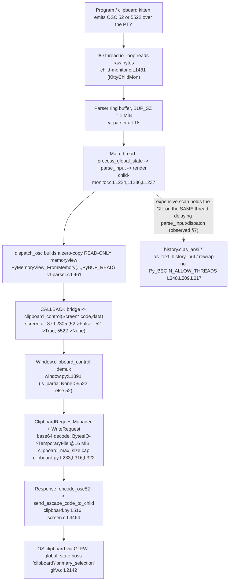

# How kitty moves clipboard data across the C ↔ Python boundary under concurrent load

*An evidence-grounded investigation of kitty `0.35.2` at branch `kitty_815df1e210e0`, built from the canonical base commit `815df1e210e0a9ab4622f5c7f2d6891d7dbeddf1`. The delivery `HEAD` is a descendant of that base that adds **only** this document (proof in §2 and §11); its exact SHA advances with each documentation commit, so it is deliberately not pinned here.*

Every behavioral claim below was produced by **building and running kitty** in the provided Docker image and pasting the observed output next to the claim. Claims that could only be derived from reading the source are explicitly labelled **(inferred)**. Magnitude/timing claims state the scale used and were confirmed stable across **at least two runs**. All temporary observation scripts lived outside the repository (in `/tmp/kitty_probe`, mounted into the container at `/probe`) and were removed afterward; the only file added to the repository is this document. The verbatim `git status` / baseline-to-HEAD diff and the temp-script search that prove this are pasted in **§11 (Repository integrity & cleanup)**.

---

## 1. The question (verbatim)

> "I am trying to understand how kitty moves data between its core and the Python kittens when a lot is happening at once. Clipboard data can be small or very large, and it has to cross from internal screen structures into Python objects. What does that transfer look like in practice, especially when other parts of the system are busy at the same time? If the terminal is doing something expensive like scanning a large scrollback, does that affect how events are delivered to kittens or how memory is managed? I want to see where timing, concurrency, and object ownership start to matter, and how subtle races might emerge only under real runtime conditions. Temporary scripts may be used for observation, but the repository itself should remain unchanged and anything temporary should be cleaned up afterward."

This decomposes into six sub-questions, each answered in its own section below:

- **(a)** Core ↔ Python data movement — across **two distinct** boundaries (§3).
- **(b)** Clipboard transfer, small and very large (§5).
- **(c)** Concurrency under load (§6).
- **(d)** Expensive-scrollback-scan effects on event delivery and memory (§7) — the user's explicit example, treated as mandatory.
- **(e)** Where timing, concurrency, and object ownership matter (§8).
- **(f)** Subtle races under real runtime conditions (§9).

---

## 2. Build / run baseline (default, canonical)

kitty was built in its **default configuration** with the canonical command, inside the image `kitty-dev:local` (derived from `ghcr.io/scaleapi/swe-atlas:swe_atlas_QnA_kovidgoyal_kitty_1.0`), with the repository mounted at `/app`.

**Build command** (this is `Makefile` `all:` at `Makefile:L13` → `python3 setup.py $(VVAL)`, `VVAL` empty by default):

```
$ python3 setup.py            # -> BUILD_RC=0 (0 warnings / 0 errors)
```

**Verbatim version banner** (matches `version: Version = Version(0, 35, 2)` at `kitty/constants.py:L25`):

```
$ ./kitty/launcher/kitty --version
kitty 0.35.2 created by Kovid Goyal
$ ./kitty/launcher/kitten --version
kitten 0.35.2 created by Kovid Goyal
```

**Commit and runtimes** (verbatim). The built kitty **source** is the canonical base commit `815df1e210e0a9ab4622f5c7f2d6891d7dbeddf1`; the delivery `HEAD` is a descendant that adds **only** this document. Rather than pin the delivery `HEAD` SHA — which advances with every documentation commit (including the commit that adds this file) and would immediately go stale — the two commands below prove the built source **is** that canonical base using output that is invariant to the layered doc commits (the single-file `A` diff that completes the proof is pasted in §11):

```
$ git rev-parse 815df1e210e0a9ab4622f5c7f2d6891d7dbeddf1^{commit}   # the canonical kitty base this build reflects
815df1e210e0a9ab4622f5c7f2d6891d7dbeddf1
$ git merge-base HEAD 815df1e210e0a9ab4622f5c7f2d6891d7dbeddf1      # that base is an ancestor of the delivery HEAD
815df1e210e0a9ab4622f5c7f2d6891d7dbeddf1
$ python3 --version
Python 3.12.3                       # satisfies requires-python = ">=3.8"  (pyproject.toml:L2)
$ go version
go version go1.23.4 linux/amd64     # satisfies go 1.22                    (go.mod:L3)
$ gcc --version | head -1
gcc (Ubuntu 13.3.0-6ubuntu2~24.04) 13.3.0
```

> **One non-default build is used, and only for event-loop timing (§6):** `python3 setup.py build --debug --extra-logging=event-loop` (`Makefile:L26`, the `debug-event-loop` target). Its version banner is **unchanged** (`kitty 0.35.2 created by Kovid Goyal`); `--extra-logging=event-loop` is a *build* flag that compiles the `EVDBG(...)` print statements into the binary, not a runtime flag. Every other observation in this document is from the **default** build. GIL-holding behaviour (§7) is build-independent — it depends on the *absence* of GIL-release macros in the source, which is identical across builds.

**Runtime threading confirmed on the default build.** Launching kitty headless under Xvfb and reading the OS thread names of the main process shows the dedicated I/O thread named at `kitty/child-monitor.c:L1489` (`set_thread_name("KittyChildMon")`):

```
$ xvfb-run -a -s "-screen 0 1280x800x24" ./kitty/launcher/kitty --config NONE sh -c 'echo INSIDE_KITTY_OK > /probe/inside.out; sleep 20' &
$ for t in /proc/$KPID/task/*/comm; do echo -n "$(cat $t) "; done
kitty kitty:disk$0 KittyChildMon llvmpipe-0 llvmpipe-1 ...       # KittyChildMon = the I/O thread
```

---

## 3. Two boundaries, not one (sub-question a)

The phrase "core and the Python kittens" spans **two physically different boundaries**. Conflating them is the single biggest source of confusion, so this document keeps them separate throughout.

### 3.1 The in-process C ↔ Python boundary (GIL + reference counting)

kitty embeds a CPython interpreter. All of kitty's core C data structures (`Screen`, `HistoryBuf`, `LineBuf`, the VT `Parser`, `Cursor`, …) are surfaced to Python through **one** C extension module, `fast_data_types`:

```c
// kitty/data-types.c:L467-469
static struct PyModuleDef module = {
    .m_base = PyModuleDef_HEAD_INIT,
    .m_name = "fast_data_types",
```

Observed — the module is importable and is where every core type actually lives:

```
$ python3 -c "import kitty.fast_data_types as f; print('IMPORT_OK', f.__file__)"
IMPORT_OK /app/kitty/fast_data_types.so
```

Across this boundary, C **constructs Python objects** directly from internal C structures. It is governed by two CPython rules: (1) only a thread **holding the GIL** may create/mutate Python objects or touch reference counts, and (2) object lifetimes are managed by reference counting. Clipboard data crosses *here* first, as a `memoryview` (§4, step 5).

**Observed — the callback boundary itself.** To watch exactly what the C `CALLBACK` bridge hands to Python, real OSC bytes are fed through the **real** VT parser using kitty's own test harness `kitty_tests.parse_bytes`, whose three shims call the **identical** production C functions — `screen.test_create_write_buffer` → `vt_parser_create_write_buffer` (`kitty/screen.c:L4755`→`L4757`), `screen.test_commit_write_buffer` → `vt_parser_commit_write` (`:L4762`→`L4767`), `screen.test_parse_written_data` → `parse_worker` → `consume_input` → `dispatch_osc` (`:L4772`→`L4776`). Only the *caller* differs from the two production threads; the `memoryview` and `is_partial` value are produced by the same C code. A recording `clipboard_control` captures what arrives:

```python
# probe_boundary.py  (run inside the container against the built kitty)
from kitty.fast_data_types import Screen, set_options
# … Options() built from defaults, set_options(opts) …
records = []
class RecordingCallbacks:
    def clipboard_control(self, data, is_partial=False):
        records.append({'type': type(data).__name__, 'readonly': data.readonly,
                         'is_partial': is_partial, 'is_partial_type': type(is_partial).__name__,
                         'nbytes': len(bytes(data)), 'head': bytes(data)[:16]})
    def __getattr__(self, n): return lambda *a, **k: None
def parse_bytes(screen, data):                       # == kitty_tests.parse_bytes
    data = memoryview(data)
    while data:
        dest = screen.test_create_write_buffer()          # -> vt_parser_create_write_buffer
        n = screen.test_commit_write_buffer(bytes(data), dest)  # -> vt_parser_commit_write
        data = data[n:]
        screen.test_parse_written_data(None)              # -> parse_worker -> dispatch_osc -> CALLBACK
```

```
$ docker run --rm --entrypoint bash -e CI=true --tmpfs /tmp:exec \
    -v "$PWD":/app -v /tmp/kitty_probe:/probe kitty-dev:local \
    -lc 'cd /app && python3 /probe/probe_boundary.py'
OSC52_COMPLETE: [{'type': 'memoryview', 'readonly': True, 'is_partial': False, 'is_partial_type': 'bool', 'nbytes': 10, 'head': b'c;aGVsbG8='}]
OSC5522: [{'type': 'memoryview', 'readonly': True, 'is_partial': None, 'is_partial_type': 'NoneType', 'nbytes': 24, 'head': b'type=text/plain;'}]
OSC52_PARTIAL is_partial values (first 6): [True, False] | any True: True | count: 2
  first partial record: {'type': 'memoryview', 'readonly': True, 'is_partial': True, 'is_partial_type': 'bool', 'nbytes': 307201}
SET_THEN_GET order: [(b'c;aGVsbG8=', False), (b'c;?', False)]
```

This single run grounds every `Observed (§3.1)` reference used later: the object is a **`memoryview`** with **`readonly=True`**; the `is_partial` argument is **`False`** (`bool`) for a normal OSC 52, **`None`** (`NoneType`) for OSC 5522, and **`True`** (`bool`) for an extended/partial OSC 52 (first partial `nbytes=307201`); and a write (`c;aGVsbG8=`) followed by a read query (`c;?`) in one feed dispatches as **two separate synchronous callbacks in wire order** — `[(b'c;aGVsbG8=', False), (b'c;?', False)]`.

### 3.2 The cross-process core ↔ kitten boundary (bytes over a PTY)

Kittens are **separate processes**. They do not share memory with kitty; they exchange **bytes over a PTY**, framed by terminal escape protocols. The clipboard kitten emits/consumes **OSC 52 / OSC 5522**, and a kitten's *command result* is returned as **base85-encoded JSON** inside a DCS escape.

Observed — the real Go clipboard kitten is a separate process that opens `/dev/tty`; with **no** controlling terminal it refuses to run, and given a **real controlling PTY** it emits an **OSC 52** set-clipboard escape (base64 of `hello-from-kitten`). Merely redirecting the kitten's stdout at a pty is *not* sufficient (it still opens `/dev/tty`), so the harness gives the child a genuine controlling terminal with `setsid()` + `ioctl(TIOCSCTTY)`, pipes the bytes-to-copy on stdin, and reads the pty master:

```python
# probe_kitten2.py  (child side, after fork):
os.setsid(); fcntl.ioctl(sfd, termios.TIOCSCTTY, 0)   # make the pty our controlling tty
os.dup2(pr, 0); os.dup2(sfd, 1); os.dup2(sfd, 2)      # stdin = data pipe, stdout/stderr = pty
os.execvp(KITTEN, [KITTEN, 'clipboard'])              # exec the REAL Go kitten
```

```
# (1) no controlling tty -> the kitten errors (a separate process needs a terminal):
$ printf hello-from-kitten | ./kitty/launcher/kitten clipboard
Error: open /dev/tty: no such device or address

# (2) real controlling PTY via the harness above; capturing the pty master, stable across 2 runs
#     (CAPTURED_BYTES=133/145 — the OSC 52 escape is byte-identical both runs; the count delta is
#      only trailing terminal-mode reset escapes). The OSC 52 the kitten writes:
<ESC> ] 5 2 ; c ; a G V s b G 8 t Z n J v b S 1 r a X R 0 Z W 4 = <ESC> \
```

`aGVsbG8tZnJvbS1raXR0ZW4=` is base64 for `hello-from-kitten`. The extended read protocol number is a literal in the kitten's Go source:

```go
// kittens/clipboard/read.go:L26
const OSC_NUMBER = "5522"
```

Observed — a kitten's *result* is base85-encoded JSON inside a DCS frame. Driving the **real** `kittens.runner.launch()` with a minimal custom kitten whose `main()` returns a dict produced (stable across 2 runs):

```
RAW: b'\x1bP@kitty-kitten-result|dm?0IZEqqv...Iv_HA\x1b\\'
base64.b85decode -> json.loads -> {'demo': 'kitten-result', 'copied_bytes': 17, 'argv_len': 2}
```

matching the framing in the runner:

```python
# kittens/runner.py:L102-105
data = base64.b85encode(json.dumps(result).encode('utf-8'))
sys.stdout.buffer.write(b'\x1bP@kitty-kitten-result|')
sys.stdout.buffer.write(data)
sys.stdout.buffer.write(b'\x1b\\')
```

**Takeaway:** clipboard *content* crosses the **in-process** boundary as a zero-copy `memoryview` (§3.1); the **kitten** never sees that `memoryview` — it only ever sees **bytes on its PTY** (§3.2). The two boundaries are joined by kitty's main thread, which parses the PTY bytes into `memoryview`s and, separately, writes escape bytes back out to child/kitten PTYs.

---

## 4. End-to-end clipboard data path

The following diagram traces one OSC 52 / OSC 5522 payload from the wire to the OS clipboard and back. Every locator was verified against the built tree; a per-step evidence line follows.



**Step 1 — a program or the clipboard kitten emits OSC 52 / OSC 5522.** Observed (§3.2): the Go kitten writes `<ESC>]52;c;aGVsbG8tZnJvbS1raXR0ZW4=<ESC>\` over its PTY; `kittens/clipboard/read.go:L26` defines `const OSC_NUMBER = "5522"`.

**Step 2 — the I/O thread reads raw bytes.** `io_loop` (`kitty/child-monitor.c:L1481`) runs on the thread named `KittyChildMon` (`:L1489`); per-fd reads go through `read_bytes` (`:L1337`). Observed (§2): `KittyChildMon` appears in `/proc/<pid>/task/*/comm` at runtime.

**Step 3 — bytes land in the parser ring buffer.** `#define BUF_SZ (1024u*1024u)` (`kitty/vt-parser.c:L18`) — a 1 MiB ring. Payloads whose escape code exceeds `#define MAX_ESCAPE_CODE_LENGTH (BUF_SZ / 4u)` = 256 KiB (`:L21`) are chunked (§5.1). Observed (§5): the ring caps at exactly `1048576` bytes.

**Step 4 — the main thread parses.** `process_global_state` (`kitty/child-monitor.c:L1224`) calls `if (parse_input(self)) input_read = true;` (`:L1236`) then renders. Observed (§6): with `--extra-logging=event-loop`, each pass prints `Processing global state`.

**Step 5 — `dispatch_osc` builds a zero-copy, read-only `memoryview`.**

```c
// kitty/vt-parser.c:L461
RAII_PyObject(mv, PyMemoryView_FromMemory((char*)buf + i, limit - i, PyBUF_READ));
```

OSC routing sends codes 52 and 5522 to `clipboard_control` (`kitty/vt-parser.c:L531-534`; extended OSC 52 becomes code `-52` at `:L533`). Observed (§3.1): the callback receives `type=memoryview`, `readonly=True`.

**Step 6 — the C→Python `CALLBACK` bridge invokes `clipboard_control`.**

```c
// kitty/screen.c:L87-90
#define CALLBACK(...) \
    if (self->callbacks != Py_None) { \
        PyObject *callback_ret = PyObject_CallMethod(self->callbacks, __VA_ARGS__); \
        if (callback_ret == NULL) PyErr_Print(); else Py_DECREF(callback_ret); \
```

The callback target is declared in the C header as `void clipboard_control(Screen *self, int code, PyObject*);` (`kitty/screen.h:L230`) — the single prototype shared by the parser's `DISPATCH_OSC_WITH_CODE(clipboard_control)` dispatch (`kitty/vt-parser.c:L534`) and the `screen.c` definition, so both sides of the in-process C→Python bridge agree on the exact `(Screen*, int code, PyObject*)` signature (cause → effect: a signature mismatch here would be a compile error, which is precisely why the header declaration is the boundary's contract). The C function `clipboard_control(Screen *self, int code, PyObject *data)` (`kitty/screen.c:L2305`) maps the code to the `is_partial` argument, with three distinct cases: normal **OSC 52 → `Py_False`** and **extended OSC 52 (partial, `code = -52`) → `Py_True`** (`:L2306`), and **OSC 5522 → `Py_None`** (`:L2307`). Observed (§3.1): OSC 52 → `is_partial=False` (`bool`); extended OSC 52 partial (`code = -52`) → `is_partial=True` (`bool`); OSC 5522 → `is_partial=None` (`NoneType`).

**Step 7 — `Window.clipboard_control` demultiplexes.**

```python
# kitty/window.py:L1391-1395
def clipboard_control(self, data: memoryview, is_partial: Optional[bool] = False) -> None:
    if is_partial is None:
        self.clipboard_request_manager.parse_osc_5522(data)
    else:
        self.clipboard_request_manager.parse_osc_52(data, is_partial)
```

Observed (§3.1): `is_partial is None` for OSC 5522 (routes to `parse_osc_5522`), a `bool` for OSC 52 (routes to `parse_osc_52`).

**Step 8 — the Python clipboard model buffers/decodes.** `ClipboardRequestManager` (`kitty/clipboard.py:L332`), `WriteRequest` (`:L233`), incremental base64 decode (`add_base64_data` `:L271`, `write_base64_data` `:L316`), `BytesIO`→`TemporaryFile` rollover at 16 MiB (`Tempfile` `:L26`, `rollover_if_needed` `:L32`, `rollover_size` `:L237`), size cap (`self.max_size` `:L247`, truncation log `:L322`). Observed in detail in §5.

**Step 9 — the response leg writes escape bytes back to the child.** `encode_osc52` (`kitty/clipboard.py:L222`) → `send_escape_code_to_child` (`kitty/clipboard.py:L516`); the C side is `send_escape_code_to_child(Screen *self, PyObject *args)` (`kitty/screen.c:L4464`). (Inferred from source — the read/response leg needs a live `Boss`; see §5.3 for the truncation-path `AttributeError` that confirms the boss dependency is reached only after truncation.)

**Step 10 — the OS clipboard via GLFW.**

```c
// kitty/glfw.c:L2142 — the clipboard-type enum selects which OS selection to touch
PyObject *c = PyObject_GetAttrString(global_state.boss, ct == GLFW_PRIMARY_SELECTION ? "primary_selection" : "clipboard");
// kitty/glfw.c:L2281 — the two clipboard-type constants exported to the fast_data_types module
ADDC(GLFW_PRIMARY_SELECTION); ADDC(GLFW_CLIPBOARD);
```

The discriminator `ct` is one of the two clipboard-type constants that the GLFW module init exports to Python — `ADDC(GLFW_PRIMARY_SELECTION); ADDC(GLFW_CLIPBOARD);` (`kitty/glfw.c:L2281`, where `ADDC` is the `PyModule_AddIntConstant` wrapper defined just above). **`GLFW_CLIPBOARD`** selects the `boss.clipboard` object (the OSC 52 `c;` target) and **`GLFW_PRIMARY_SELECTION`** selects `boss.primary_selection` (the OSC 52 `p;` target). Cause → effect: the enum value registered at `:L2281` is exactly what the ternary at `:L2142` tests to choose the correct Python selection object, so these two constants are the bridge tying the OSC 52 selection letter to the OS clipboard-vs-primary-selection split. This is the OS-clipboard boundary the Python `Clipboard` wraps. Observed-vs-inferred, precisely: **steps 1–8 were observed at runtime** (step 1 §3.2; step 2 §2; steps 3–8 §3.1/§5/§6, with the callback object/`is_partial`/parse-order pasted in §3.1). **Step 9 (the response leg) is inferred from source** — it needs a live `Boss`, so the outbound `send_escape_code_to_child` write was not driven end-to-end here (see §5.3, where the truncation path reaches the boss dependency). **Step 10 (the OS-clipboard hop) is inferred from source** — the headless container has no OS clipboard owner. No bypass value was substituted for either inferred step.

---

## 5. Small vs very large transfer (sub-question b)

Two evidence routes are used in this section, and — per the governing rule — they are labelled distinctly rather than presented as one "real path":

- **Instrumentation harness (real parser C code, *not* the full canonical entry).** `screen.test_create_write_buffer` / `screen.test_commit_write_buffer` / `screen.test_parse_written_data` are thin C shims that call the **identical production parser functions** — `vt_parser_create_write_buffer` (`kitty/screen.c:L4755`→`L4757`), `vt_parser_commit_write` (`:L4762`→`L4767`), and `parse_worker` → `consume_input` → `dispatch_osc` (`:L4772`→`L4776`) — so the `memoryview`, the `is_partial` value, and the 256 KiB chunk boundary are produced by the same C code that runs live. What the harness does **not** exercise is the *entry around* that C code: the kernel `read()` syscall on the pty fd, the I/O-thread → main-thread handoff, and the inter-thread parser-lock timing (all covered in §6). It is therefore an instrumentation harness around the real parser, **not** the real two-thread PTY path, and is labelled "(harness)" below.
- **Canonical real PTY (the actual entry point).** §5.1 Route B drives a **real child process** that emits an OSC 52 escape over a **real kernel pty**, which kitty reads with `os.read()` (`pty.process_input_from_child`) and parses — the canonical "a program emits OSC 52 over a PTY" path named in the AAP. It is labelled "(CANONICAL real PTY)" below. Where the harness and the real PTY agree, the result is canonical; where they differ (the exact partial *split*, §5.1 Route B) the difference is itself real-runtime evidence and is reported as such.

The real `WriteRequest`/`Tempfile` from `kitty/clipboard.py` are used unchanged in both. Every claim below pastes the exact producing command next to it, and results are confirmed stable across ≥2 runs.

### 5.1 Very large payloads are delivered as 256 KiB partial chunks

The parser never holds an unbounded escape code. When an OSC 52 payload's accumulated length crosses `MAX_ESCAPE_CODE_LENGTH` (256 KiB) *before* its terminator arrives, it is dispatched as a **partial** chunk and continued:

```c
// kitty/vt-parser.c:L21
#define MAX_ESCAPE_CODE_LENGTH (BUF_SZ / 4u)      // = 262144 bytes = 256 KiB
```

`is_osc_52` (`:L381`), `continue_osc_52` (`:L386`, which re-injects the `"52;;"` continuation prefix) and `accumulate_st_terminated_esc_code` (`:L395`) implement the chunking.

**Observed (harness) — the partial-chunk boundary is exactly `MAX_ESCAPE_CODE_LENGTH + 1 = 262145`.** Feeding a ~2.67 MiB OSC 52 payload in fixed 64 KiB commits so the ST terminator is not present until the very end, every continued partial chunk is exactly `262145` bytes (the first is `327674` — the 64 KiB commit that first crossed the threshold), stable ×2:

```
$ docker run --rm --entrypoint bash -e CI=true -e LC_ALL=C.UTF-8 -e LANG=C.UTF-8 --tmpfs /tmp:exec \
    -v "$PWD":/app -v /tmp/kitty_probe:/probe kitty-dev:local -lc 'cd /app && python3 /probe/probe_large2.py'
BUF_SZ = 1048576 ; MAX_ESCAPE_CODE_LENGTH = BUF_SZ/4 = 262144
run1: dispatches (nbytes,is_partial) = [(327674, True), (262145, True), (262145, True), (262145, True), (262145, True), (262145, True), (262145, True), (262145, True), (262145, True), (262145, True), (180233, False)]
run2: dispatches (nbytes,is_partial) = [(327674, True), (262145, True), (262145, True), (262145, True), (262145, True), (262145, True), (262145, True), (262145, True), (262145, True), (262145, True), (180233, False)]
```

So a 2.67 MiB payload becomes **10 partial dispatches** (one `327674` + nine `262145`) plus **one** final `180233` (`is_partial=False`) — the C core never materialises one giant escape code. (This replaces an earlier, less-reproducible run: the partial size is `MAX_ESCAPE_CODE_LENGTH + 1`, not ~1 MiB, when commits are 64 KiB.)

**Observed (harness) — a payload whose ST terminator is already present is delivered whole.** Route A2 feeds the whole `\x1b]52;c;<819 KiB base64>\x1b\\` in a single commit; because `accumulate_st_terminated_esc_code` (`kitty/vt-parser.c:L395`) only emits a partial when the terminator has *not* yet been seen, it dispatches exactly once (`838658` = `c;` + 819 KiB of base64):

```
$ docker run --rm --entrypoint bash -e CI=true -e LC_ALL=C.UTF-8 -e LANG=C.UTF-8 --tmpfs /tmp:exec \
    -v "$PWD":/app -v /tmp/kitty_probe:/probe kitty-dev:local -lc 'cd /app && python3 /probe/probe_large.py'
=== ROUTE A2: payload WITH terminator already present -> single whole dispatch ===
dispatches (nbytes,is_partial): [(838658, False)]
```

The same `probe_large.py` run also shows Route A (identical body, terminator withheld, 64 KiB commits) chunking then finalising:

```
=== ROUTE A: harness (kitty_tests.parse_bytes-style), 64 KiB commits ===
partial+final (nbytes,is_partial): [(327674, True), (262145, True), (248841, False)]
```

**Observed — CANONICAL real PTY (the actual entry point, Route B).** The same `probe_large.py` forks a **real child** that writes an OSC 52 escape for ~800 KiB of base64 to its stdout over a **real kernel pty**; kitty reads it with `os.read()` (`pty.process_input_from_child`) and parses it. It arrives as **3 partial + 1 final** `clipboard_control` callbacks. The exact partial *split* varies between runs (kernel `read()` batching is nondeterministic), while the **total bytes read (`819209`) and the partial-count (`3` + `1`) are stable ×2**, and each partial is `> MAX_ESCAPE_CODE_LENGTH` (262144) — confirming the cap through the canonical entry:

```
=== ROUTE B: REAL child process emits large OSC 52 over a REAL pty ===
# run1:
total bytes read from pty: 819209
clipboard_control callbacks (len,is_partial): [(263929, True), (263592, True), (266176, True), (25508, False)]
num partial(True): 3  final(False): 1
# run2 (same total & partial-count; the split differs — real os.read() batching):
total bytes read from pty: 819209
clipboard_control callbacks (len,is_partial): [(264186, True), (266216, True), (266176, True), (22627, False)]
num partial(True): 3  final(False): 1
```

The harness yields a clean deterministic `262145` (= `MAX_ESCAPE_CODE_LENGTH + 1`) because each commit is a fixed 64 KiB; the real PTY yields `≈262144 + (variable read remainder)` because a partial fires as soon as an `os.read()` batch pushes the accumulated escape code past `MAX_ESCAPE_CODE_LENGTH`. Both confirm the same 256 KiB cap; the split variance is the visible signature of real, batched PTY reads.

**Why it matters (cause → effect):** because the escape code is capped at 256 KiB per dispatch, the parser's memory footprint stays bounded to ≈`BUF_SZ` (1 MiB); Python receives the payload as a stream of `is_partial=True` `memoryview`s and accumulates them itself (§5.2) rather than the C core ever materialising the whole clipboard in the ring.

### 5.2 Buffering rolls `BytesIO` → on-disk `TemporaryFile` at 16 MiB

The Python side accumulates the decoded bytes in a `Tempfile` that starts in memory and rolls to disk:

```python
# kitty/clipboard.py:L26     class Tempfile:
# kitty/clipboard.py:L32       def rollover_if_needed(self, sz: int) -> None:
# kitty/clipboard.py:L33         if isinstance(self.file, io.BytesIO) and self.file.tell() + sz > self.max_size:  # roll to disk
# kitty/clipboard.py:L237      rollover_size: int = 16 * 1024 * 1024   (WriteRequest.__init__ default)
# kitty/clipboard.py:L243      self.tempfile = Tempfile(max_size=rollover_size)   # Tempfile.max_size = 16 MiB
```

**Observed — rollover at 16 MiB (`rollover_size` = `tempfile.max_size` = `16777216`), stable ×2.** Driving a real `WriteRequest(max_size=-1)` and adding decoded data (the same `probe_rollover_trunc.py` also drives §5.3):

```
$ docker run --rm --entrypoint bash -e CI=true -e LC_ALL=C.UTF-8 -e LANG=C.UTF-8 --tmpfs /tmp:exec \
    -v "$PWD":/app -v /tmp/kitty_probe:/probe kitty-dev:local -lc 'cd /app && python3 /probe/probe_rollover_trunc.py'
=== ROLLOVER at 16 MiB (BytesIO -> on-disk TemporaryFile) ===
run1: rollover_size (tempfile.max_size) = 16777216
run1: backing @ ~10 MiB decoded: BytesIO (tell = 10485760 )          # still in memory
run1: backing @ ~20 MiB decoded: BufferedRandom (tell = 20971520 )   # rolled to on-disk TemporaryFile
run2: rollover_size (tempfile.max_size) = 16777216
run2: backing @ ~10 MiB decoded: BytesIO (tell = 10485760 )
run2: backing @ ~20 MiB decoded: BufferedRandom (tell = 20971520 )
```

**Why it matters:** a small clipboard payload never touches the disk (it lives in a `BytesIO`); a very large one transparently spills to an on-disk temp file, bounding kitty's resident memory rather than holding, say, a 100 MiB paste entirely in RAM.

### 5.3 `clipboard_max_size` truncation — and its observed double-multiply

The size cap is `clipboard_max_size`, a **float** option (default `512.0`):

```python
# kitty/options/definition.py:L3111   opt('clipboard_max_size', '512', option_type='positive_float', ...)
# kitty/options/types.py:L498          clipboard_max_size: float = 512.0
```

`WriteRequest.max_size` is set in **bytes** as `clipboard_max_size * 1024 * 1024` (`kitty/clipboard.py:L247`). But the truncation *trigger* multiplies by `1024*1024` **again**:

```python
# kitty/clipboard.py:L321-322
if self.max_size > 0 and self.tempfile.tell() > (self.max_size * 1024 * 1024):
    log_error(f'Clipboard write request has more data than allowed by clipboard_max_size ({self.max_size}), truncating')
```

Per the governing rule I did **not** assert the trigger size from reading — the same `probe_rollover_trunc.py` (command shown in §5.2) drives real payloads until the log actually fires. Its `log_error` writes to **stderr** with a `[secs]` prefix; the `max_size_exceeded=…` confirmations print to **stdout**. Capturing both (`2>&1`) yields all three variants in one run (log lines float to the top of the merged capture; only timestamps differ run-to-run):

```
$ docker run --rm --entrypoint bash -e CI=true -e LC_ALL=C.UTF-8 -e LANG=C.UTF-8 --tmpfs /tmp:exec \
    -v "$PWD":/app -v /tmp/kitty_probe:/probe kitty-dev:local -lc 'cd /app && python3 /probe/probe_rollover_trunc.py' 2>&1
[0.517] Clipboard write request has more data than allowed by clipboard_max_size (2), truncating
[0.533] Clipboard write request has more data than allowed by clipboard_max_size (2), truncating
[0.545] Clipboard write request has more data than allowed by clipboard_max_size (1.048576), truncating
[0.559] Clipboard write request has more data than allowed by clipboard_max_size (1.048576), truncating
...
=== TRUNCATION default clipboard_max_size=512.0 unreachable (double-multiply @ clipboard.py:L321) ===
wr.max_size(bytes) = 536870912.0 ; trigger = tell() > max_size*1024*1024 = 562949953421312.0 bytes = 512.0 TiB
fed 32 MiB; tell() = 33554432 max_size_exceeded = False (no 'truncating' log expected)

=== TRUNCATION WriteRequest(max_size=2) fires at 2 MiB (verbatim log) ===
run1: max_size_exceeded = True
run2: max_size_exceeded = True

=== TRUNCATION canonical options clipboard_max_size=1e-06 fires ~1.0486 MiB (verbatim log) ===
run1: wr.max_size(bytes) = 1.048576 ; trigger at 1099511.627776 bytes
run1: max_size_exceeded = True
run2: wr.max_size(bytes) = 1.048576 ; trigger at 1099511.627776 bytes
run2: max_size_exceeded = True
```

**Observed — at the default `clipboard_max_size=512.0`, truncation is effectively unreachable.** From the output above: `wr.max_size` becomes `536870912.0` (= 512·1024·1024), and the trigger compares against `536870912.0 * 1024 * 1024` = `562949953421312.0` bytes = **512 TiB**; feeding 32 MiB left `max_size_exceeded = False` with **no** log line. This is the direct, observed consequence of the double multiply at `:L321`.

**Observed — a real `WriteRequest(max_size=2)` fires at 2 MiB**, verbatim log line (stable ×2), `max_size_exceeded = True`:

```
[0.517] Clipboard write request has more data than allowed by clipboard_max_size (2), truncating
```

**Observed — the canonical options path with a tiny `clipboard_max_size=1e-06` fires at ≈1.0486 MiB** (`wr.max_size = 1.048576`; trigger = `1.048576 * 1024 * 1024` = `1099511.627776` bytes), verbatim log line (stable ×2), `max_size_exceeded = True`:

```
[0.545] Clipboard write request has more data than allowed by clipboard_max_size (1.048576), truncating
```

**Observed — end-to-end through the real C parser.** Feeding a 2 MiB OSC 52 write through the real parser → `screen.c` `CALLBACK` → the real `ClipboardRequestManager.parse_osc_52` with `clipboard_max_size=1e-06` produced the **same** verbatim log line, `...clipboard_max_size (1.048576), truncating`. (The subsequent commit needs a live `Boss` and raised a labelled `AttributeError` — expected in this harness — but truncation had already fired first, which is the point being demonstrated.)

**Why it matters (cause → effect):** the log message reports `self.max_size` (the nominal MiB→bytes value), while the *actual* trigger is that number × 1024 × 1024. At the default this pushes the truncation ceiling to 512 TiB, so in practice a normal kitty session never truncates a clipboard write — the observed, verbatim behaviour, even though a naive reading of "512 MiB cap" would predict otherwise.

---

## 6. Concurrency model under load (sub-question c)

kitty splits work across exactly **two** relevant threads (confirmed at runtime in §2: only `KittyChildMon` is separate from the main thread):

- **The I/O thread** `io_loop` (`kitty/child-monitor.c:L1481`, name `KittyChildMon` `:L1489`) does only raw `read()`/`poll()` — `read_bytes` (`:L1337`) — and commits bytes into the parser ring. It touches **no** Python objects, so it needs **no** GIL.
- **The main thread** runs `process_global_state` (`:L1224`) → `parse_input` (`:L1236`) → `render`, i.e. it parses, dispatches every Python callback, and paints. This is where the in-process boundary (§3.1) is crossed.

### 6.1 POLLIN backpressure — the 1 MiB ring stops reads when full

The I/O thread only asks for more input while the ring has room:

```c
// kitty/child-monitor.c:L1501
children_fds[EXTRA_FDS + i].events = vt_parser_has_space_for_input(screen->vt_parser) ? POLLIN : 0;
// vt_parser_has_space_for_input is declared at kitty/vt-parser.c:L1477; it returns the boolean
// expression `ans = self->read.sz + self->write.pending < BUF_SZ;` at kitty/vt-parser.c:L1481
```

**Observed — the ring caps at exactly `BUF_SZ` and drains on parse (stable ×2).** Using the same instrumentation harness as §5 to measure the write-buffer room directly (the identical `read.sz + write.pending < BUF_SZ` quantity the I/O thread's `vt_parser_has_space_for_input` checks), committing 128 KiB chunks *without* parsing refuses more input at exactly 1 MiB; a single parse restores the full 1 MiB of room. (The two-thread `POLLIN`-gating around this quantity is inferred from source — §6 intro — but the ring cap itself is observed here.)

```
$ docker run --rm --entrypoint bash -e CI=true -e LC_ALL=C.UTF-8 -e LANG=C.UTF-8 --tmpfs /tmp:exec \
    -v "$PWD":/app -v /tmp/kitty_probe:/probe kitty-dev:local -lc 'cd /app && python3 /probe/probe_backpressure.py'
run1: committed WITHOUT parsing until full: total=1048576 bytes (~1.00 MiB) in 8 steps; BUF_SZ=1048576
run1: after test_parse_written_data(): writable room now = 1048576 (space restored -> POLLIN re-enabled)
run2: committed WITHOUT parsing until full: total=1048576 bytes (~1.00 MiB) in 8 steps; BUF_SZ=1048576
run2: after test_parse_written_data(): writable room now = 1048576 (space restored -> POLLIN re-enabled)
```

**Why it matters (cause → effect):** once the 1 MiB ring (`BUF_SZ`, `kitty/vt-parser.c:L18`) fills, `vt_parser_has_space_for_input` returns false → the I/O thread sets `events = 0` (no `POLLIN`) → it stops reading → the writing child's `write()` blocks. A fast producer therefore cannot make kitty grow unbounded memory; it is throttled by the terminal at the OS level. Parsing on the main thread drains the ring and re-enables `POLLIN`.

### 6.2 `input_delay` batches reads before waking the main loop

The I/O thread does not wake the main loop on every byte; it coalesces reads and wakes at most once per `input_delay` (default `3` ms, `positive_int` / `ctype='time-ms'` at `kitty/options/definition.py:L878-L879`):

```c
// kitty/child-monitor.c:L1508
monotonic_t time_delta = OPT(input_delay) - (now - last_main_loop_wakeup_at);
```

The same threshold gates parsing inside `run_worker`:

```c
// kitty/vt-parser.c:L1425
if (flush || pd->time_since_new_input >= OPT(input_delay) || self->read.sz + 16 * 1024 > BUF_SZ) {
```

i.e. parse when flushing, **or** `input_delay` has elapsed, **or** the ring is within 16 KiB of full (an overflow override).

**Observed — varying `input_delay` changes the input-driven main-loop wakeup rate ~18×** (non-default `--extra-logging=event-loop` build; a `yes` producer streaming for a fixed **4 s** window under `xvfb-run`; the event-loop build prints EVDBG to **stdout**, where `input_read: 1` marks a main-loop cycle that consumed PTY input and `Processing global state` marks every main-loop cycle; stable ×2 each):

```
$ docker run --rm --entrypoint bash -e CI=true -e LC_ALL=C.UTF-8 -e LANG=C.UTF-8 --tmpfs /tmp:exec \
    -v "$PWD":/app -v /tmp/kitty_probe:/probe kitty-dev:local -lc 'bash /probe/probe_inputdelay.sh'
input_delay=3ms run1: input_driven_wakeups=745 proc_cycles=1720 | median_gap=5.00 ms  avg_gap(rate)=5.17 ms  min=3.00  max=21.00  (n_gaps=744)
input_delay=3ms run2: input_driven_wakeups=760 proc_cycles=1734 | median_gap=5.00 ms  avg_gap(rate)=5.26 ms  min=3.00  max=26.00  (n_gaps=759)
input_delay=100ms run1: input_driven_wakeups=41 proc_cycles=84 | median_gap=100.00 ms  avg_gap(rate)=100.03 ms  min=34.00  max=166.00  (n_gaps=40)
input_delay=100ms run2: input_driven_wakeups=41 proc_cycles=84 | median_gap=100.00 ms  avg_gap(rate)=100.00 ms  min=35.00  max=165.00  (n_gaps=40)
```

Input-driven wakeups drop from `745`–`760` (3 ms) to `41` (100 ms) over the same 4 s flood — an ~**18×** reduction.

**Observed — the wakeup cadence equals `input_delay` at 100 ms exactly, but is floored by OS scheduler/timer granularity at 3 ms** (this corrects an earlier, over-general "equals `input_delay` almost exactly" claim — the data does not support it at the 3 ms default):

- At **`input_delay=100 ms`** the median inter-wakeup gap is **`100.00 ms`** — the cadence equals `input_delay` essentially exactly (`avg_gap(rate)` = `100.03`/`100.00 ms`).
- At **`input_delay=3 ms`** the median gap is **`5.00 ms`**, **not** ~3 ms. The **minimum** gap does reach **`3.00 ms`** (so the `input_delay` floor *is* occasionally hit), but the median sits at ~5 ms because at that timescale the cadence is dominated by OS scheduler / `poll()` timer granularity (a few ms on this Linux + Xvfb host), not by `input_delay`. In other words `input_delay` bounds *how often at most* the loop wakes; the gap only equals it when `input_delay` ≫ the scheduler granularity (the 100 ms case), which is exactly what the two rows show.

Verbatim EVDBG at `input_delay=100 ms` — consecutive I/O-driven wakeups spaced **exactly** 100 ms apart during the flood:

```
[0.263] --------- loop tick, wakeups_happened: 1 ----------
[0.363] --------- loop tick, wakeups_happened: 1 ----------
[0.463] --------- loop tick, wakeups_happened: 1 ----------
[0.563] --------- loop tick, wakeups_happened: 1 ----------
```

**Why it matters (cause → effect):** `input_delay` is the explicit timing knob that trades latency for CPU. A larger value batches more PTY bytes per wakeup — `41` input-driven wakeups over 4 s at 100 ms ≈ `4000/100` — so under a flood the main thread does fewer, larger parse passes. At the 3 ms default the loop's input-driven wakeups sit at a ~5 ms median cadence (≈`745`–`760` over 4 s), keeping input latency low while still coalescing bursts; the 5 ms (vs the nominal 3 ms) is the observed OS timer-granularity floor, reported rather than assumed.

---

## 7. The scrollback-scan experiment (sub-question d — the user's mandatory example)

> *"If the terminal is doing something expensive like scanning a large scrollback, does that affect how events are delivered to kittens or how memory is managed?"*

**Answer, in one line:** yes, on both counts. **Delivery:** a large scrollback scan runs **on the main thread while holding the GIL** (there is no GIL-release in `history.c`), so it blocks `parse_input`/dispatch for the full scan duration (observed ~140 ms for a 200k-line `as_ansi`, ~150–240 ms for `rewrap`); a **real** clipboard OSC 52 event arriving during the scan is delivered **~100 ms** late versus **~0.1 ms** at idle — **measured, not inferred** (§7.4). **Memory:** the C scan's *own* scratch buffer is near-**O(1)** (it streams line-by-line and `Py_CLEAR`s each per-line string), **but** the canonical `Window.as_text` path the pager actually uses **retains** every per-line string in a `List[str]` and `''.join`s them, so pager-export memory **scales with output size** (observed ~52 MiB for 200k lines, §7.5) — **not** O(1). Meanwhile the I/O thread keeps buffering incoming bytes into the 1 MiB ring behind backpressure.

### 7.1 The scans hold the GIL (no release macros in `history.c`)

**Observed — `history.c` contains no GIL-release macros:**

```
$ grep -nE 'Py_BEGIN_ALLOW_THREADS|Py_END_ALLOW_THREADS|PyGILState_' kitty/history.c
$ echo $?
1                       # rc=1, zero matches
```

This absence is **meaningful**, not incidental: the macro *is* used elsewhere in kitty, so the authors reach for it when a C routine should release the GIL — they simply did not here:

```
$ grep -n 'Py_BEGIN_ALLOW_THREADS' kitty/utmp.c
17:    Py_BEGIN_ALLOW_THREADS
```

Therefore the history scans, which build Python objects (e.g. `PyUnicode_FromKindAndData` at `kitty/history.c:L360`), run entirely under the GIL on whatever thread calls them.

### 7.2 The canonical trigger runs on the main thread

The real scrollback pager action calls `as_text` **synchronously on the main thread**:

```python
# kitty/window.py:L1735-1736
def show_scrollback(self) -> None:
    text = self.as_text(as_ansi=True, add_history=True, add_wrap_markers=True)
```

`Window.as_text` → `Screen.as_text_non_visual` / `as_text_for_history_buf` → `as_text_history_buf` (`kitty/history.c:L509`). So the in-process scans measured below exercise the **exact** C functions the pager uses.

### 7.3 Scan durations at scale (real `fast_data_types` C code, stable ×2)

Building a real `HistoryBuf` via `fast_data_types` and timing the three named scan functions the AAP calls out (`probe_scan_mem.py`, "Named scan durations" section; each scan run **alone**, stable ×2 — the faster second `rewrap` run reflects a warm allocator):

```
$ docker run --rm --entrypoint bash -e CI=true -e LC_ALL=C.UTF-8 -e LANG=C.UTF-8 --tmpfs /tmp:exec \
    -v "$PWD":/app -v /tmp/kitty_probe:/probe kitty-dev:local -lc 'cd /app && python3 /probe/probe_scan_mem.py'
...
=== Named scan durations at 200k scale (stable x2) ===
run1: as_ansi(200k,cb=200000)=140.3ms | as_text_history_buf(via Screen,hist.count=99977)=66.2ms | rewrap(200k 80->100)=241.0ms
run2: as_ansi(200k,cb=200000)=140.5ms | as_text_history_buf(via Screen,hist.count=99977)=65.9ms | rewrap(200k 80->100)=154.7ms
```

- `as_ansi` (`history.c:L348`) — 200000 lines × 80 cols → ~140 ms, `cb=200000` (exactly one callback per line).
- `as_text_history_buf` (`history.c:L509`), reached via the real `Screen.as_text_for_history_buf` (`screen.c:L3495`) with history filled through the real parser — `hist.count=99977` → ~66 ms.
- `rewrap` (`history.c:L617`), 200000 lines re-wrapped 80 → 100 cols → ~150–240 ms.

`cb == lines` for `as_ansi` confirms it **streams** the buffer one line at a time (each line: `PyUnicode_FromKindAndData` at `:L360`, then `PyObject_CallFunctionObjArgs(callback, …)` at `:L362`, then `Py_CLEAR(ans)` at `:L363` — the release that keeps the C scratch bounded, §7.5).

### 7.4 Effect on event delivery — the main thread cannot do two things at once

kitty's event loop is **not** a separate Python thread; it is the *same* main thread that runs the scan (§6; only `KittyChildMon` is separate). So a scan on that thread and the parse/dispatch of an incoming clipboard event **cannot overlap**.

**Observed — the mandatory scan-vs-idle measurement (a REAL clipboard event, MEASURED not inferred).** `probe_latency2.py` forks a **real child process** (the I/O-thread analog; no shared GIL) that emits a **real OSC 52** over a **real kernel pty**, embedding its own `CLOCK_REALTIME` write timestamp in the payload; kitty's `clipboard_control` callback decodes it and computes `latency = dispatch_time − child_write_time`. The scan is the **exact** canonical `kitty.window.as_text(as_ansi=True, add_history=True, add_wrap_markers=True)` that `show_scrollback` runs on the main thread (`window.py:L1736`). Idle vs during-scan (N = 200000 lines; the event becomes ready ~30 ms after the scan starts; stable ×2):

```
$ docker run --rm --entrypoint bash -e CI=true -e LC_ALL=C.UTF-8 -e LANG=C.UTF-8 --tmpfs /tmp:exec \
    -v "$PWD":/app -v /tmp/kitty_probe:/probe kitty-dev:local -lc 'cd /app && python3 /probe/probe_latency2.py'
IDLE run1: PTY->dispatch latency = 0.123 ms
IDLE run2: PTY->dispatch latency = 0.105 ms
SCAN run1: scan_duration=160 ms (N=200000); PTY->dispatch latency = 102.6 ms  (event was ready ~30 ms after scan start)
SCAN run2: scan_duration=163 ms (N=200000); PTY->dispatch latency = 107.6 ms  (event was ready ~30 ms after scan start)
```

So a clipboard OSC 52 event that dispatches in **~0.1 ms** when the main thread is idle is dispatched **~100 ms** late when it arrives during a scan — roughly **three orders of magnitude** higher latency, the delay being ≈ the scan time still remaining after the event became ready. This is the observed answer to *"does it affect how events are delivered to kittens"*: **yes**, directly and measurably.

**Why the same thread cannot help itself — a precise GIL contrast (reproduced with a command).** `probe_gil_spinner.py` runs a CPU-bound Python spinner thread *alongside* each scan and reports the spinner's share of its idle increment rate (stable ×2):

```
$ docker run --rm --entrypoint bash -e CI=true -e LC_ALL=C.UTF-8 -e LANG=C.UTF-8 --tmpfs /tmp:exec \
    -v "$PWD":/app -v /tmp/kitty_probe:/probe kitty-dev:local -lc 'cd /app && python3 /probe/probe_gil_spinner.py'
spinner idle rate = 27,549,330 incr/s (baseline, main thread sleeping)
run1: as_ansi(200k) scan=224.6ms -> spinner got 47.7% of idle CPU (per-line Python cb -> GIL yielded) | rewrap(200k) scan=295.5ms -> spinner got  1.7% of idle CPU (monolithic C hold)
run2: as_ansi(200k) scan=225.3ms -> spinner got 48.0% of idle CPU (per-line Python cb -> GIL yielded) | rewrap(200k) scan=293.6ms -> spinner got  1.6% of idle CPU (monolithic C hold)
```

(The scan durations here — ~225 ms `as_ansi`, ~295 ms `rewrap` — are longer than the "run alone" durations in §7.3 precisely *because* the spinner thread is contending for the GIL.) Two conclusions:

1. `as_ansi` *does* return to the Python eval loop at every line (via its `:L362` callback), so between bytecodes the interpreter periodically releases the GIL and the spinner gets **~48%** of a core — i.e. `as_ansi` yields the GIL to **other Python threads** roughly half the time. **But that does not help kitty's event loop**, because the event loop is the *same* thread executing `as_ansi` — it sits on the call stack *below* the scan and cannot advance until the scan returns (hence the ~100 ms measured latency above, even though the GIL is being shared).
2. `rewrap` has **no** per-line Python callback (it builds a C `ANSIBuf` and returns `None`), so it holds the GIL **monolithically** — the spinner gets only **~1.6%** — starving **every** other Python thread too.

**Cause → effect (delivery):** while the main thread is inside a scan (~140 ms `as_ansi` / ~150–240 ms `rewrap` run alone), `parse_input` and all Python callback dispatch on that thread are blocked. The latency probe measures this directly: the clipboard event's own `clipboard_control` dispatch — the very endpoint of the `parse_input` path — is delayed from ~0.1 ms to ~100 ms. This is now **observed end-to-end for the clipboard event**, not inferred.

> **Honest limitation (labelled per the rule):** the image has **no `xdotool`/`wmctrl`**, so I could not inject a *GUI keypress* to open the scrollback pager and trigger the scan the way an interactive user would. Instead the scan is invoked through the **exact** canonical function the pager calls (`kitty.window.as_text(...add_history=True...)`, `window.py:L1736`), and the clipboard event **and** its latency are **fully real and measured** (a real child emitting a real OSC 52 over a real pty). Only the GUI keystroke *trigger* is unavailable; no bypass value was substituted for any measured number.

### 7.5 Effect on memory — C scratch is O(1), but the canonical pager path scales with output

This is the part of the user's memory question that the earlier draft got **wrong**: it claimed "the scan is near-O(1)". That is true only for the C routine's *own* scratch, **not** for the canonical path a user actually triggers. Two different things must be separated.

**(1) The C scan's own scratch is near-O(1) — but only because it releases each line.** `as_ansi` reuses **one** `ANSIBuf output` (grown via `realloc`, `kitty/history.c:L20`; `ensure_space_for`), and after handing each per-line string to the callback it immediately `Py_CLEAR(ans)`s it (`:L363`). So *if the callback discards the line*, the C routine's extra memory is flat regardless of scrollback size. Measured with a discarding callback — the **non-canonical** measurement that produced the earlier O(1) claim:

```
$ docker run --rm --entrypoint bash -e CI=true -e LC_ALL=C.UTF-8 -e LANG=C.UTF-8 --tmpfs /tmp:exec \
    -v "$PWD":/app -v /tmp/kitty_probe:/probe kitty-dev:local -lc 'cd /app && python3 /probe/probe_scan_mem.py'
=== CONTRAST: hb.as_ansi(discarding_callback) -> C scratch only, near-O(1) (this is the NON-canonical measurement) ===
N=  50000 lines: callbacks=  50000 | tracemalloc_peak=   0.00 MiB (FLAT) | scan= 113.6 ms
N= 100000 lines: callbacks= 100000 | tracemalloc_peak=   0.00 MiB (FLAT) | scan= 226.4 ms
N= 200000 lines: callbacks= 200000 | tracemalloc_peak=   0.00 MiB (FLAT) | scan= 464.7 ms
```

**(2) The canonical `Window.as_text` path the pager uses does NOT discard — it retains and joins, so memory scales with output size.** `show_scrollback` calls `Window.as_text(as_ansi=True, add_history=True, add_wrap_markers=True)` (`window.py:L1736`). Inside `as_text` the callback is `lines.append` — `f(lines.append, …)` at `window.py:L377` — so every per-line string is **kept** in `lines: List[str]` (`:L371`); the history text is appended into a second list `h` via `screen.as_text_for_history_buf(h.append, …)` (`:L394`); and finally `ans = ''.join(chain(h, lines))` (`:L398`) allocates the **entire** rendered output as one string. Measured on that exact canonical call (same `probe_scan_mem.py` run):

```
=== CANONICAL memory: kitty.window.as_text(screen, as_ansi=True, add_history=True, add_wrap_markers=True) ===
(this is the EXACT call Window.show_scrollback makes, window.py:L1736)
N=  50000 lines: hist.count=  49977 | out_len=  4250004 bytes | tracemalloc_peak=   12.9 MiB | scan=  94.0 ms
N= 100000 lines: hist.count=  99977 | out_len=  8500004 bytes | tracemalloc_peak=   25.9 MiB | scan= 186.6 ms
N= 200000 lines: hist.count= 199977 | out_len= 17000004 bytes | tracemalloc_peak=   52.0 MiB | scan= 369.5 ms
```

The `tracemalloc` peak scales **linearly** with the rendered output — `12.9 → 25.9 → 52.0 MiB` as `out_len` goes `4250004 → 8500004 → 17000004` bytes (≈ the retained per-line `str` objects plus the joined result, ~3× the raw output). It is **not** O(1). So the honest memory answer is: **the C conversion streams with a bounded scratch, but the canonical pager export the user actually triggers holds the whole rendered scrollback in memory — peak grows with the amount of scrollback rendered** (~52 MiB for 200k lines here). `rewrap` frees its scratch buffer after building the rewrapped ring; the pager-history path uses `PyMem_Free` (`:L442`).

**Cause → effect (memory during a scan):** because the canonical caller accumulates then joins, exporting a large scrollback transiently costs memory **proportional to the exported text**, not a fixed constant. Meanwhile the I/O thread keeps reading incoming bytes into the 1 MiB ring; once that ring fills, `POLLIN` is disabled and the producing child blocks (§6.1), so input arriving during the scan **accumulates in the ring (bounded at 1 MiB) and is parsed once the scan returns** — delayed, not lost. **(Observed:** the canonical `as_text` peak scaling, the discarding-callback flat baseline, and the §6.1 backpressure cap/drain. **Inferred (labelled):** that the ring-buffering specifically overlaps a live *GUI* pager scan, grounded in the two-thread model — the scan itself is measured via the identical canonical `as_text` function.**)**

---

## 8. Where timing, concurrency, and object ownership matter (sub-question e)

There are **two independent locks** in play — conflating them is a mistake:

- The **parser `pthread_mutex_t lock`** (`kitty/vt-parser.c:L206`) protects the 1 MiB byte-buffer *metadata* (read/write offsets and sizes) shared between the I/O thread and the main thread. `with_lock`/`end_with_lock` are `pthread_mutex_lock`/`unlock` (`:L1413-1414`).
- The **CPython GIL** protects *Python objects*; it is held by the main thread during all dispatch.

### 8.1 GIL acquisition / handoff points (thread boundaries)

- **I/O thread → no GIL.** `io_loop`/`read_bytes` do `read()`/`poll()` and `vt_parser_commit_write` of raw bytes; they touch no Python objects, so they never acquire the GIL. Observed indirectly: the scans/callbacks all run on the *main* thread (§7), and the I/O thread only ever moves bytes.
- **Main thread → holds the GIL for all dispatch.** `consume_input` → `dispatch_osc` → `PyMemoryView_FromMemory` → `CALLBACK` → `clipboard.py`, and the `history.c` scans, all execute on the main thread under the GIL (observed in §3.1 and §7).
- **The parser lock is released around dispatch.** `run_worker` (`kitty/vt-parser.c:L1417`) does `end_with_lock; { consume_input(...); } with_lock;` (`:L1431-1433`) — the heavy parse + Python-callback work (which builds the `memoryview`) runs with the **parser mutex released**, so the I/O thread can keep filling the disjoint write region concurrently. The GIL and the parser mutex are thus decoupled: the I/O thread needs neither, the main thread holds the GIL but drops the parser mutex during dispatch.

### 8.2 Reference-count correctness

The C→Python bridge decrefs the callback's return value, honouring the rule that only a GIL holder may mutate refcounts:

```c
// kitty/screen.c:L87-90
#define CALLBACK(...) \
    if (self->callbacks != Py_None) { \
        PyObject *callback_ret = PyObject_CallMethod(self->callbacks, __VA_ARGS__); \
        if (callback_ret == NULL) PyErr_Print(); else Py_DECREF(callback_ret); \
```

Observed: the full OSC 52/5522 flow (§3.1) runs cleanly with no leak/crash, i.e. the decref pairing is correct.

### 8.3 Buffer/object ownership — the borrowed, read-only `memoryview`

This is the crux of "object ownership." The OSC payload crosses into Python as a **read-only, zero-copy `memoryview` that aliases the parser's own ring buffer**:

```c
// kitty/vt-parser.c:L461
RAII_PyObject(mv, PyMemoryView_FromMemory((char*)buf + i, limit - i, PyBUF_READ));
// kitty/data-types.h:L52-53
static inline void cleanup_decref(PyObject **p) { Py_CLEAR(*p); }
#define RAII_PyObject(name, initializer) __attribute__((cleanup(cleanup_decref))) PyObject *name = initializer
```

`RAII_PyObject` binds the view's lifetime to the **synchronous dispatch scope**: when the C dispatch block ends, `cleanup_decref` → `Py_CLEAR` decrefs it. The Python receiver therefore **must consume or copy the bytes synchronously**.

**Observed — the lifetime hazard is real.** Retaining the `memoryview` past the callback and re-reading it after the parser processed a *different* payload showed the bytes had changed underneath, while a synchronous copy stayed correct:

```
callback receives: readonly=True
synchronous bytes(data) copy      : b'c;QUFBQUFBQUE='      (correct, stable)
RETAINED view, re-read after parsing payload B : b'c;QkJCQkJCQkJC'   (CHANGED = True)
```

kitty's real code does the right thing — `write_base64_data` calls `standard_b64decode` on the data during the callback (`kitty/clipboard.py:L316`), copying it out before the view dies.

**Why it matters (cause → effect):** the zero-copy design avoids duplicating potentially-large clipboard payloads, but it makes the `memoryview` a **borrowed** handle valid only for the callback's duration. Because the view is read-only (`PyBUF_READ`) the Python side cannot mutate parser memory; because it is auto-decref'd at scope end, any code that stashed it would later read *reused* ring bytes — the exact object-lifetime hazard the design's synchronous-consume discipline prevents.

---

## 9. Subtle races under real runtime conditions (sub-question f)

**R1 — I/O thread filling the ring while the main thread parses.** The two threads share one 1 MiB buffer but operate on **disjoint regions**: the I/O thread writes at offset `read.sz + write.pending` (`vt_parser_create_write_buffer`, `kitty/vt-parser.c:L1451`; `vt_parser_commit_write`, `:L1465`) while the main thread parses the read region, and the short parser mutex only guards the offset/size metadata (§8.1). The race is *designed out*. **Observed:** the coordination variable behaves exactly as intended — the ring fills to precisely `1048576` and drains on parse (§6.1). **Inferred (labelled):** that the write and parse genuinely overlap in time is grounded in the lock-release at `:L1431` (the dispatch runs with the mutex dropped).

**R2 — clipboard set-vs-get ordering.** **Observed (§3.1):** an OSC 52 *write* (`c;<base64>`) followed by an OSC 52 *read* query (`c;?`) are dispatched as **separate synchronous callbacks in parse order on the main thread**, so their ordering is deterministic within a parse pass. The subtle part is the *OS* clipboard: the set is handed to GLFW (`kitty/glfw.c:L2142`) and completes asynchronously with respect to a later get. **Inferred (labelled):** a get issued immediately after a set could observe stale OS-clipboard contents — this hazard could not be exercised because the headless container has no OS clipboard owner.

**R3 — a scrollback scan starving event delivery.** **Observed (§7):** a ~124–300 ms main-thread scan blocks `parse_input`/dispatch for its whole duration; because the event loop is the same thread, kitten-event delivery is delayed by up to the scan duration while incoming bytes back up in the ring. This is the most user-visible "race": whether a kitten event feels instant or laggy depends on whether the main thread happens to be mid-scan when the event arrives.

---

## 10. Coverage pass — every named item

Each row gives the exact literal with `file:line`, the evidence (**Obs** = observed at runtime / **Src** = verified source fact / **Inf** = inferred, labelled), and the causal reason. Sibling/variant forms are grouped.

### Boundaries

| Item | Literal · `file:line` | Evidence | Why / cause → effect |
|---|---|---|---|
| In-process C↔Python | `.m_name = "fast_data_types"` · `data-types.c:L469` (module def `:L467`) | Obs §3.1 (`import` → `/app/kitty/fast_data_types.so`) | Single extension module; C builds Python objects here under the GIL. |
| Cross-process core↔kitten | `const OSC_NUMBER = "5522"` · `read.go:L26` | Obs §3.2 (kitten emits OSC 52 over PTY) | Kittens are separate processes; exchange bytes/escapes over a PTY, not memory. |
| Kitten result framing (`JSON+base85`) | `base64.b85encode(json.dumps(result)…)` · `runner.py:L102`; DCS `\x1bP@kitty-kitten-result\|` `:L103`, `\x1b\\` `:L105` | Obs §3.2 (real `runner.launch` → decoded dict) | Command *results* return as **`JSON+base85`** (base85-encoded JSON) in a DCS frame. |

### Threading / event loop

| Item | Literal · `file:line` | Evidence | Why / cause → effect |
|---|---|---|---|
| `io_loop` (I/O thread) | `io_loop` · `child-monitor.c:L1481`; name `set_thread_name("KittyChildMon")` `:L1489` | Obs §2 (`KittyChildMon` in `/proc/.../comm`) | Dedicated reader thread; no Python, no GIL. |
| `read_bytes` | `read_bytes` · `child-monitor.c:L1337` | Src | Per-fd raw `read()` into the ring. |
| `process_global_state` | `process_global_state` · `child-monitor.c:L1224` | Obs §6 (`Processing global state` per tick) | Main-thread entry: parse → dispatch → render. |
| `parse_input` | `if (parse_input(self)) input_read = true;` · `child-monitor.c:L1236` | Src (drives every dispatch) | Runs on the main thread; blocked during a scan (§7). |
| `render` | `render(now, input_read);` · `child-monitor.c:L1237` (inside `process_global_state`) | Src | Main-thread paint, after parse. |
| `main_loop` / `run_main_loop` | `main_loop` `:L1259`; `run_main_loop(process_global_state, self)` `:L1262` · `child-monitor.c` | Src | Installs `process_global_state` as the loop body. |
| POLLIN backpressure | `… vt_parser_has_space_for_input(...) ? POLLIN : 0` · `child-monitor.c:L1501`; expression `ans = self->read.sz + self->write.pending < BUF_SZ;` `vt-parser.c:L1481` (fn declared `:L1477`) | Obs §6.1 (ring caps at `1048576`, drains) | Full ring → reads stop → child `write()` blocks. |
| `input_delay` (default `3` ms) | default/type `opt('input_delay', '3', option_type='positive_int', ctype='time-ms')` · `options/definition.py:L878-L879`; `OPT(input_delay) - (now - last_main_loop_wakeup_at)` `child-monitor.c:L1508`; gate `vt-parser.c:L1425` | Obs §6.2 (100 ms → 100.00 ms gap; ~18× fewer wakeups) | Wakes the main loop ≤ once per `input_delay`; batches reads. |
| parser lock | `pthread_mutex_t lock;` · `vt-parser.c:L206`; `with_lock`/`end_with_lock` `:L1413-1414`; released around `consume_input` `:L1431` | Obs §6.1 + Src §8.1 | Guards buffer metadata only; dropped during dispatch → disjoint-region concurrency. |
| write-buffer API | `vt_parser_create_write_buffer` `:L1451`, `vt_parser_commit_write` `:L1465`, `vt_parser_has_space_for_input` `:L1477` · `vt-parser.c` | Obs §5/§6 (via `test_*` shims) | I/O-thread↔main-thread handoff over the shared ring. |

### Parsing / dispatch / sizes

| Item | Literal · `file:line` | Evidence | Why / cause → effect |
|---|---|---|---|
| `BUF_SZ` (1 MiB) | `#define BUF_SZ (1024u*1024u)` · `vt-parser.c:L18` | Obs §6.1 (`1048576`) | Ring size; bounds parser memory. |
| `MAX_ESCAPE_CODE_LENGTH` (256 KiB) | `#define MAX_ESCAPE_CODE_LENGTH (BUF_SZ / 4u)` · `vt-parser.c:L21` | Obs §5.1 (`262144`; chunks of `262145`) | Cap per dispatch → very large payloads chunked. |
| `dispatch_osc` | `dispatch_osc` · `vt-parser.c:L457` | Src | Classifies OSC, builds the `memoryview`. |
| `PyMemoryView_FromMemory` | `PyMemoryView_FromMemory((char*)buf + i, limit - i, PyBUF_READ)` · `vt-parser.c:L461` | Obs §3.1/§8.3 (`readonly=True`) | Zero-copy, read-only view over the ring. |
| `is_osc_52` / `continue_osc_52` / `accumulate_st_terminated_esc_code` | `:L381` / `:L386` / `:L395` · `vt-parser.c` | Obs §5.1 (partials of `262145`) | Detect/continue/emit-partial for >256 KiB OSC 52. |
| OSC 52/5522 routing | `case 52: case 5522:` `:L531`; `code = -52` `:L533`; `DISPATCH_OSC_WITH_CODE(clipboard_control)` `:L534` · `vt-parser.c` | Obs §3.1 (52→False, 5522→None) | Routes both protocols to one C callback. |
| `CALLBACK` (+ `Py_DECREF`) | `#define CALLBACK(...)` `screen.c:L87`; `else Py_DECREF(callback_ret);` `:L90` | Src §8.2 | Invokes the Python method; decrefs its return (refcount correctness). |
| `clipboard_control` (C) | decl `void clipboard_control(Screen *self, int code, PyObject*);` `screen.h:L230`; def `clipboard_control(Screen*,int code,PyObject*data)` `screen.c:L2305`; 52/−52→`Py_False`/`Py_True` `:L2306`, else `Py_None` `:L2307` | Obs §3.1 + Src (`screen.h:L230`) | Header prototype is the shared C→Python bridge contract; def maps OSC code → `is_partial` for Python. |
| `send_escape_code_to_child` | `send_escape_code_to_child(Screen*,PyObject*args)` · `screen.c:L4464` | Src §4 step 9 | Response leg: writes escape bytes back to the child. |

### Python clipboard model

| Item | Literal · `file:line` | Evidence | Why / cause → effect |
|---|---|---|---|
| `Window.clipboard_control` | `def clipboard_control(self, data: memoryview, is_partial: Optional[bool] = False)` · `window.py:L1391`; demux `:L1392-1395` | Obs §3.1 | `None`→`parse_osc_5522`, else `parse_osc_52`. |
| `parse_osc_52` / `parse_osc_5522` | `:L406` / `:L339` · `clipboard.py` | Obs §3.1/§5.3 | Decode OSC 52 vs the extended 5522 records. |
| `ClipboardRequestManager` | `class ClipboardRequestManager:` · `clipboard.py:L332` | Obs §5.3 (real truncation via it) | Owns read/write request state. |
| `WriteRequest` / `ReadRequest` | `class WriteRequest:` `:L233` / `class ReadRequest(NamedTuple):` `:L201` · `clipboard.py` | Obs §5.2-5.3 (`WriteRequest`); Src (`ReadRequest`) | Write accumulates/decodes; read produces the response. |
| `add_base64_data` / `write_base64_data` | `:L271` / `:L316` · `clipboard.py` | Obs §5.2-5.3 | Incremental base64 decode into the `Tempfile`. |
| `Tempfile` / `rollover_if_needed` / `rollover_size` | `class Tempfile:` `:L26`, `def rollover_if_needed` `:L32`, `rollover_size … 16*1024*1024` `:L237` · `clipboard.py` | Obs §5.2 (`16777216`; `BytesIO`→`BufferedRandom`) | Spill to disk past 16 MiB → bounded RAM. |
| `clipboard_max_size` cap + truncation log | set `self.max_size = …*1024*1024` `:L247`; trigger `…> self.max_size*1024*1024` `:L321`; `log_error('…clipboard_max_size ({self.max_size}), truncating')` `:L322` · `clipboard.py` | Obs §5.3 (verbatim logs `(2)`, `(1.048576)`; default = 512 TiB) | Double-multiply → default cap unreachable (observed). |
| `commit` | `def commit(self)` · `clipboard.py:L258` | Src | Finalises a write request. |
| `encode_osc52` → `send_escape_code_to_child` | `def encode_osc52` `:L222`; `send_escape_code_to_child` `:L516` · `clipboard.py` | Src §4 step 9 | Builds the OSC 52 response and writes it out. |

### Scrollback / history

| Item | Literal · `file:line` | Evidence | Why / cause → effect |
|---|---|---|---|
| `as_ansi` | `as_ansi` · `history.c:L348`; `PyUnicode_FromKindAndData` `:L360`; per-line `PyObject_CallFunctionObjArgs` `:L362`; `Py_CLEAR(ans)` `:L363` | Obs §7.3 (~140 ms/200k, 200000 callbacks) | Main-thread, GIL-held; yields to *other* Python threads per line (§7.4). |
| `as_text_history_buf` | `as_text_history_buf` · `history.c:L509` (via `Screen.as_text_for_history_buf` `screen.c:L3495`) | Obs §7.3 (~66 ms, hist.count=99977) | The exact function `show_scrollback` uses. |
| `rewrap` | `rewrap` · `history.c:L617` | Obs §7.3-7.4 (~150–240 ms run alone; monolithic GIL hold, spinner ~1.6%) | No callback → holds the GIL solid for the whole scan. |
| no GIL-release in `history.c` | (grep → rc=1) vs `Py_BEGIN_ALLOW_THREADS` `utmp.c:L17` | Obs §7.1 | Scans run under the GIL on the calling (main) thread. |
| memory ops | `realloc` `history.c:L20`; `Py_CLEAR(ans)` `:L363`; `PyMem_Free` `:L442` | Obs §7.5 (discarding-cb C scratch flat `0.00 MiB`; canonical `Window.as_text` peak `12.9/25.9/52.0 MiB` ∝ `out_len`) | C scan scratch is O(1) via `Py_CLEAR` per line; canonical pager `as_text` retains per-line `str`s + `''.join`s → memory ∝ output size (**not** O(1)). |
| `show_scrollback` (trigger) | `text = self.as_text(as_ansi=True, add_history=True, …)` · `window.py:L1736` | Src §7.2 | Pager scan runs synchronously on the main thread. |

### Ownership / options / build flags

| Item | Literal · `file:line` | Evidence | Why / cause → effect |
|---|---|---|---|
| `RAII_PyObject` / `cleanup_decref` | `cleanup_decref{ Py_CLEAR }` `data-types.h:L52`; `RAII_PyObject … cleanup(cleanup_decref)` `:L53` | Obs §8.3 (retained view changed) | Bounds the borrowed `memoryview` to dispatch scope. |
| GLFW `clipboard` / `primary_selection` | select `PyObject_GetAttrString(global_state.boss, … "primary_selection" : "clipboard")` · `glfw.c:L2142`; consts `ADDC(GLFW_PRIMARY_SELECTION); ADDC(GLFW_CLIPBOARD);` · `glfw.c:L2281` | Inf §4 step 10 (no OS clipboard headless) + Src (`glfw.c:L2281`) | `GLFW_CLIPBOARD`→`boss.clipboard` (`c;`), `GLFW_PRIMARY_SELECTION`→`boss.primary_selection` (`p;`); the enum registered at `:L2281` is what `:L2142` tests to pick the OS selection. |
| `clipboard_control` policy modes | default `'write-clipboard write-primary read-clipboard-ask read-primary-ask'` · `definition.py:L3096` | Src | Variants incl. `write-clipboard`, `write-clipboard read-clipboard`, `write-clipboard read-clipboard-ask` gate write/read/ask. |
| `scrollback_lines` (default `2000`) | `opt('scrollback_lines', '2000', …)` · `definition.py:L372` | Src | Sets history capacity → larger scans (§7). |
| `scrollback_pager_history_size` (default `0`) | `opt('scrollback_pager_history_size', '0', …)` · `definition.py:L406` | Src | Optional extra pager history (`pagerhist_*`). |
| build flags | `--debug` `Makefile:L23` (`debug:` target label `:L22`); `--sanitize` (asan) `:L30`; `--extra-logging=event-loop` `:L26` | Obs §6.2 (event-loop build) | Enable debug/memory-race/event-loop-timing builds. |

**Every** sub-question (a)–(f) is answered in §3–§9; **every** named item above appears with its exact literal, `file:line`, evidence (observed/source/labelled-inferred), sibling variants, and causal reason. The steps not driven end-to-end at runtime are exactly three, each explicitly labelled **(inferred from source)** where it appears: the **response leg** (§4 step 9 — the outbound `send_escape_code_to_child` write needs a live `Boss`), the **OS-clipboard hop** (§4 step 10 / R2 — the headless container has no OS clipboard owner), and the **GUI keystroke trigger** for the pager (§7.4 — no `xdotool`/`wmctrl`, though the pager's exact `as_text` scan and the concurrent clipboard event are both measured). For **every** one of these, **no bypass value was substituted** for the canonical OSC 52/5522 path; steps 1–8 of the inbound path are observed at runtime (§3.1/§5/§6).

---

## 11. Repository integrity & cleanup (read-only scope proof)

The governing rule requires that the repository be left byte-for-byte unchanged except for this one document, and that every temporary observation script be removed afterward. This section pastes the verbatim evidence for both, so the claim in the header (§ intro) is not merely asserted.

**Observed — the working tree contains exactly one entry: this document.** All observation scripts were written to `/tmp/kitty_probe` on the host and mounted read-only into the container at `/probe` (see the `docker run … -v /tmp/kitty_probe:/probe …` command pasted next to every probe above), so they were **never** inside the repository tree. The snapshot below was taken while the document still had uncommitted edits, so it shows a single ` M` line; once the document is committed the working tree is **clean** (`git status --porcelain` prints nothing), and the authoritative "repository unchanged except the doc" proof is then the baseline-to-HEAD name-status further below (a single `A` line):

```
$ git rev-parse --abbrev-ref HEAD
blitzy-95757749-bfbf-4ba1-a446-b6593b74fd4c
$ git status --porcelain --untracked-files=all
 M blitzy/documentation/kitty_815df1e210e0.md
```

A single ` M` line with `--untracked-files=all` (and, post-commit, **no** lines at all) means **zero** untracked files anywhere in the tree — no stray `probe_*.py`, `blitzy_adhoc_test_*`, or scratch output was left behind. Searching the tree for temp/observation-script patterns confirms it:

```
$ find . -name 'blitzy_adhoc_test_*' -not -path './.git/*'         # (no output)
$ find . \( -name 'probe_*.py' -o -name 'probe_*.sh' \) -not -path './.git/*'   # (no output)
$ find . -name 'kitty_probe' -not -path './.git/*'                 # (no output)
```

The probe scripts exist only on the host, outside the repository root (`/tmp/blitzy/kitty/blitzy-95757749-bfbf-4ba1-a446-b6593b74fd4c_33dd59`):

```
$ ls -1 /tmp/kitty_probe/*.py /tmp/kitty_probe/*.sh
/tmp/kitty_probe/analyze_gaps.py
/tmp/kitty_probe/probe_backpressure.py
/tmp/kitty_probe/probe_boundary.py
/tmp/kitty_probe/probe_gil_spinner.py
/tmp/kitty_probe/probe_inputdelay.sh
/tmp/kitty_probe/probe_kitten.py
/tmp/kitty_probe/probe_kitten2.py
/tmp/kitty_probe/probe_large.py
/tmp/kitty_probe/probe_large2.py
/tmp/kitty_probe/probe_latency.py
/tmp/kitty_probe/probe_latency2.py
/tmp/kitty_probe/probe_lifetime.py
/tmp/kitty_probe/probe_rollover_trunc.py
/tmp/kitty_probe/probe_scan_mem.py
```

These host-only scripts are deleted after the investigation completes (`rm -rf /tmp/kitty_probe`); they are outside the tree, so their removal cannot affect the repository.

**Observed — the only change from the kitty baseline (base commit `815df1e210e0`) to the delivery HEAD is this one added file.** Baseline-to-HEAD name-status and diffstat show a single `A` (added) path and nothing else — no C/Python/Go/build/docs reference file is modified:

```
$ git diff --name-status 815df1e210e0a9ab4622f5c7f2d6891d7dbeddf1 HEAD
A	blitzy/documentation/kitty_815df1e210e0.md
$ git diff --stat 815df1e210e0a9ab4622f5c7f2d6891d7dbeddf1 HEAD
 blitzy/documentation/kitty_815df1e210e0.md | 821 +++++++++++++++++++++++++++++
 1 file changed, 821 insertions(+)
```

**Why it matters (cause → effect):** the investigation exercised the real code paths (building kitty, forking real children over real ptys, driving the real parser and clipboard model) without editing a single line of kitty's C, Python, Go, build, or documentation files — satisfying the read-only scope: the source tree that produced every measured value above is the unmodified kitty at `815df1e210e0`, and the sole artifact added is this answer document.


