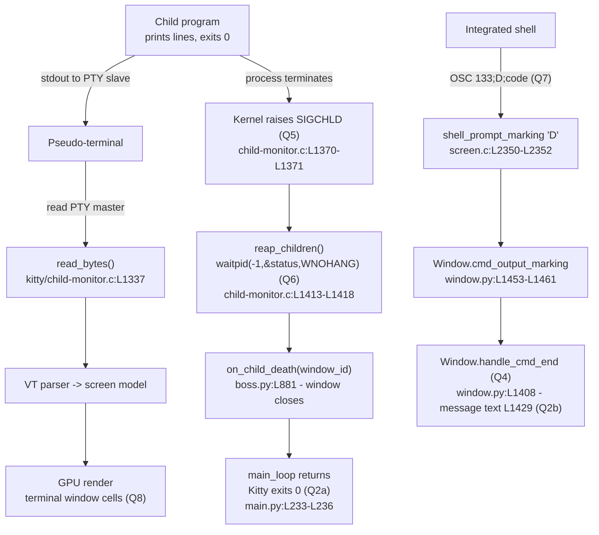

# How Kitty Handles a Child Program That Prints Output and Exits Successfully

> **Scope.** This document answers, with **code as the only source of truth**, exactly what the
> [Kitty](https://sw.kovidgoyal.net/kitty/) terminal emulator does when it launches a child program that
> *"prints a few clear lines to standard output and then exits with status zero."* Every factual claim below
> cites a concrete `path:Lstart-Lend` location in the repository and is accompanied by a **Rationale** that
> explains *why* the cited code produces the stated answer. All citations were re-pinned by direct
> `grep -n` / `sed -n` inspection of the live source at the analysed commit.
>
> - **Repository:** `kovidgoyal/kitty`
> - **Analysed commit (HEAD):** `815df1e210e0a9ab4622f5c7f2d6891d7dbeddf1`
> - **Branch / document name anchor:** `kitty_815df1e210e0`
> - **Running scenario (the user's example, preserved verbatim):** *"Consider a scenario where Kitty starts a
>   very simple program that prints a few clear lines to standard output and then exits with status zero."*

---

## 1. TL;DR — answers at a glance

| # | Question | Short answer | Primary citation |
|---|----------|--------------|------------------|
| **Q1** | What is the end-to-end success flow? | Launcher → `Boss` builds the `ChildMonitor` → `Child.fork()` opens a PTY and `spawn`s the program (native `fork`+`execvp`) → the program writes to the PTY slave → Kitty reads the PTY master, parses it, renders cells → the program exits 0 → the kernel raises `SIGCHLD` → `ChildMonitor` reaps it with `waitpid` → window torn down per `close_on_child_death` → `main_loop()` returns → Kitty exits 0. | `kitty/child.py:L276`, `kitty/child-monitor.c:L1418`, `kitty/main.py:L234-L236` |
| **Q2a** | What is **Kitty's own** process exit code when the child exits 0? | **`0`** — purely because `main()` returns without raising `SystemExit` on a clean run; it is **not** copied from the child's status. | `kitty/main.py:L524-L531` |
| **Q2b** | What is the full, literal completion **message**? | `Command {cmdline} finished with status: {exit_status}.\nClick to focus.` (the `notify_on_cmd_finish` notification body; **off by default**). The `+hold` path shows a separate `Press Enter or Esc to exit` prompt. | `kitty/window.py:L1429`, `tools/tui/hold.go:L26` |
| **Q3** | Which subsystem tracks the child process? | The **`ChildMonitor`** C extension. | `kitty/child-monitor.c:L49-L62`, `kitty/boss.py:L370-L371` |
| **Q4** | Which single function turns the exit status into the message? | **`Window.handle_cmd_end(exit_status)`**. | `kitty/window.py:L1408` |
| **Q5** | Which OS signal tells Kitty a child terminated? | **`SIGCHLD`**. | `kitty/child-monitor.c:L121`, `:L1370-L1371` |
| **Q6** | Which syscall retrieves the child's exit status? | **`waitpid(-1, &status, WNOHANG)`**. | `kitty/child-monitor.c:L1418` |
| **Q7** | How does the status travel from the shell to the message function? | As the **`OSC 133;D;<code>`** shell-integration escape sequence (FinalTerm "command finished" marker), parsed in `shell_prompt_marking` and routed to `handle_cmd_end`. | `kitty/screen.c:L2350-L2352`, `kitty/window.py:L1408` |
| **Q8** | Where does the child's printed output appear? | In the **Kitty terminal window itself** (rendered as GPU cells) — **not** a separate log/file. | `kitty/child-monitor.c:L1337-L1354` |

---

## 2. The two-layer model — read this first (critical)

The eight questions implicitly assume a **single** notion of "exit," but Kitty has **two distinct mechanisms**.
Conflating them yields a wrong answer, so the whole document keeps them strictly separate.

| | **Layer A — OS-level process exit** | **Layer B — shell-reported command exit** |
|---|---|---|
| **Whose child?** | Kitty's **direct** child (the shell itself, or a program Kitty launches directly). | A command run **inside** an already-integrated shell — that command is the **shell's** child, not Kitty's. |
| **Who reaps it?** | **Kitty** (`ChildMonitor`), via the kernel. | The **shell** reaps it; Kitty never sees the process. |
| **How does Kitty learn it ended?** | The kernel delivers **`SIGCHLD`**; Kitty calls **`waitpid(-1,&status,WNOHANG)`**. | The shell-integration script prints **`OSC 133;D;<code>`**; Kitty's VT parser intercepts the bytes. |
| **Escape sequence involved?** | **No.** | **Yes** — `OSC 133;D`. |
| **What it governs** | Window teardown (`close_on_child_death`) and **Kitty's own process exit code**. | The optional `notify_on_cmd_finish` **notification** and per-command marks. |
| **Questions it answers** | **Q5** (signal), **Q6** (syscall), **Q2a** (Kitty's own exit code). | **Q4** (single function), **Q7** (transport), **Q2b** (the message text). |

**Why this matters for the scenario.** If the "very simple program" is launched **directly** as Kitty's child
(e.g. `kitty /path/to/prog`), only **Layer A** applies: the program's exit-0 is observed by `waitpid`, governs
whether the window closes, and the program's status does **not** become Kitty's own exit code. If instead the
program is run **as a command typed into an integrated shell**, **Layer B** is what makes the exit status
visible to Kitty (via `OSC 133;D;0`) so the `handle_cmd_end` notification *can* be produced — while Layer A is
still tracking the **shell** that is Kitty's actual direct child. The remaining sections cite the code for each
layer independently.

---

## 3. Q1 — The end-to-end success path

This section walks the complete lifecycle for the running scenario, each step anchored in code. The flow
crosses all three layers of the codebase: the native C core (`kitty/*.c`), the Python control layer
(`kitty/*.py`), and — only for the `+hold` variant — the Go tools layer (`tools/*`).

### 3.1 Launch and child tracking

1. **The `Boss` controller constructs the tracking subsystem.** During startup the `Boss` creates the
   `ChildMonitor`, passing its `on_child_death` callback so that the death of any tracked child can be routed
   back to window teardown.

   ```python
   # kitty/boss.py:L370-L371
   self.child_monitor = ChildMonitor(
       self.on_child_death,
   ```

2. **`Child.fork()` opens a pseudo-terminal (PTY).** A master/slave PTY pair is allocated; the *master* end
   stays with Kitty and the *slave* end becomes the child's controlling terminal.

   ```python
   # kitty/child.py:L276  -> def fork(self) -> Optional[int]:
   # kitty/child.py:L281
   master, slave = openpty()
   ```

   `openpty()` itself is the thin wrapper around `os.openpty()`:

   ```python
   # kitty/child.py:L170-L171
   def openpty() -> Tuple[int, int]:
       master, slave = os.openpty()
   ```

### 3.2 Spawning the program

3. **`Child.fork()` spawns the program through the native `spawn`.** The parent then closes the slave, records
   the child's PID, and **retains the PTY master** as `self.child_fd` (later made non-blocking).

   ```python
   # kitty/child.py:L333-L345
   pid = fast_data_types.spawn(
       final_exe, cwd, tuple(argv), env, master, slave, stdin_read_fd, stdin_write_fd,
       ready_read_fd, ready_write_fd, tuple(handled_signals), kitten_exe(), opts.forward_stdio)
   os.close(slave)
   self.pid = pid
   self.child_fd = master
   ...
   os.set_blocking(self.child_fd, False)   # L345
   ```

4. **The native `spawn` performs `fork()` then `execvp()`.** In the child branch (`case 0:`) the process image
   is replaced with the target program.

   ```c
   // kitty/child.c:L80-L81  -> static PyObject* spawn(PyObject *self UNUSED, PyObject *args)
   // kitty/child.c:L97
   pid_t pid = fork();
   switch(pid) {
       case 0: {            // child  (L99)
           ...
           execvp(exe, argv);   // L159  -> replace image with the target program
   ```

### 3.3 Output: the program's "few clear lines"

5. **The program writes to the PTY slave; Kitty reads the PTY master.** Because the child inherited the slave
   end as stdout, its printed lines flow up the PTY to the master fd that Kitty kept. The event loop reads that
   fd in `read_bytes` and commits the bytes to the VT parser, which updates the screen model that the GPU
   renders as cells.

   ```c
   // kitty/child-monitor.c:L1337-L1354  (read_bytes)
   read_bytes(int fd, Screen *screen) {
       ...
       len = read(fd, buf, available_buffer_space);   // L1345
       ...
       vt_parser_commit_write(screen->vt_parser, len); // L1354
   ```

   `read_bytes` is dispatched from the poll loop whenever the child fd is readable:

   ```c
   // kitty/child-monitor.c:L1531
   has_more = read_bytes(children_fds[EXTRA_FDS + i].fd, children[i].screen);
   ```

   This is the **only** path the printed lines take — there is no implicit redirection to a file (see **Q8**).

### 3.4 Exit, reaping and teardown

6. **The program exits 0 → the kernel raises `SIGCHLD`.** Kitty's signal handler records the event by setting
   a flag (it does *not* reap inside the handler):

   ```c
   // kitty/child-monitor.c:L1370-L1371
   case SIGCHLD:
       ss->child_died = true;
   ```

7. **The event loop reaps the child with `waitpid`.** When the `child_died` flag is observed, `reap_children`
   non-blockingly collects the terminated child(ren) and their exit `status`:

   ```c
   // kitty/child-monitor.c:L1526
   if (ss.child_died) reap_children(self, OPT(close_on_child_death));
   // kitty/child-monitor.c:L1418
   pid = waitpid(-1, &status, WNOHANG);
   ```

8. **The window is torn down per `close_on_child_death`.** If a tracked child is gone, `on_child_death` runs
   and the owning window is closed (subject to the option default `no`, see §12):

   ```python
   # kitty/boss.py:L881  -> def on_child_death(self, window_id: int) -> None:
   ```

9. **`main_loop()` returns → Kitty exits 0.** Once children are gone / windows closed, the blocking event loop
   returns, `boss.destroy()` runs in the `finally`, and — with no exception raised — the process exits with
   status **0** (see **Q2a**):

   ```python
   # kitty/main.py:L233-L236
   try:
       boss.child_monitor.main_loop()
   finally:
       boss.destroy()
   ```

### 3.5 Data-flow diagram



> **Reading the diagram.** The upper-left branch (PTY → `read_bytes` → render) is **output** (Q8). The middle
> branch (`SIGCHLD` → `waitpid` → teardown → exit 0) is **Layer A** (Q5, Q6, Q2a). The bottom branch
> (`OSC 133;D` → `shell_prompt_marking` → `handle_cmd_end`) is **Layer B** (Q7, Q4, Q2b).

---


## 4. Q2a — Kitty's own process exit code is `0` (Layer A)

**Answer.** On a clean run, **Kitty's own process exits with status `0`** — and this value is *not* derived from
the child's exit status. It is `0` simply because `main()` returns normally without raising `SystemExit`.

**Code.**

```python
# kitty/main.py:L233-L236  (the blocking loop returns on clean shutdown)
try:
    boss.child_monitor.main_loop()
finally:
    boss.destroy()
```

```python
# kitty/main.py:L513-L521  (_main wraps run_app; finally only cleans up GLFW / ssh masters)
try:
    with setup_profiling():
        run_app(opts, cli_opts, bad_lines, talk_fd)
finally:
    glfw_terminate()
    cleanup_ssh_control_masters()
```

```python
# kitty/main.py:L524-L531  (the ONLY SystemExit(1) is in the exception branch)
def main() -> None:
    try:
        _main()
    except Exception:
        import traceback
        tb = traceback.format_exc()
        log_error(tb)
        raise SystemExit(1)
```

**Rationale.** `main_loop()` blocks until the tracked children are gone and the windows are closed; on the
success scenario it returns **normally**. That return propagates out of `_run_app` → `_main()` → `main()`. The
sole place Kitty forces a non-zero status is `raise SystemExit(1)` at `kitty/main.py:L531`, and that line is
reached **only** inside `except Exception:`. With no exception, `main()` simply returns, and CPython terminates
the interpreter with status **`0`**. This is a **Layer A** property (a fact about Kitty's own OS process) and is
deliberately independent of any in-shell command's status — a program you run inside the shell can exit `37`
and Kitty itself will still exit `0` when you later close it cleanly.

> **Note on the `+hold` variant.** When a program is launched under `kitty +hold`, the *holding wrapper*
> (a Go process) propagates the child's code via `os.Exit(...)` — see §12 and **Q2b**. That is the wrapper's
> exit code, still distinct from the Kitty GUI process discussed here.

---

## 5. Q2b — The full, literal completion message (Layer B)

**Answer.** The user-facing "command finished" message is built by `Window.handle_cmd_end` and its body is the
literal f-string:

> `Command {cmdline} finished with status: {exit_status}.\nClick to focus.`

**Code — the exact f-string (quoted character-for-character):**

```python
# kitty/window.py:L1408   def handle_cmd_end(self, exit_status: str = '') -> None:
# kitty/window.py:L1428-L1429
s = self.last_cmd_cmdline.replace('\\\n', ' ')
cmd.body = f'Command {s} finished with status: {exit_status}.\nClick to focus.'
```

**How the placeholders resolve.**

- `{s}` (the `{cmdline}` shown above) is the local variable assigned at `kitty/window.py:L1428`, derived from
  `self.last_cmd_cmdline` — the command line of the just-finished command, with line-continuation
  backslash-newlines collapsed to single spaces.
- `{exit_status}` is the status string passed into `handle_cmd_end` (ultimately the `<code>` from the
  `OSC 133;D;<code>` marker — see **Q7**).
- `\n` is a **literal newline** placed before the trailing sentence `Click to focus.`

**Rendered example (program `myprog` exiting 0).** The notification body would read:

```text
Command myprog finished with status: 0.
Click to focus.
```

(The title is set to `kitty` at `kitty/window.py:L1427`, and the click action is `focus` at `:L1430`.)

**Gating / dispatch.**

```python
# kitty/window.py:L1423   when, duration, action, notify_cmdline = opts.notify_on_cmd_finish
# kitty/window.py:L1425   if last_cmd_output_duration >= duration and when != 'never':
# kitty/window.py:L1432-L1433  default action is 'notify':
if action == 'notify':
    notify_with_command(cmd, self.id)
```

**Rationale.** `handle_cmd_end` is the single converter from a command's exit status to user-facing text
(see **Q4**); `kitty/window.py:L1429` is literally where that text is assembled. The status it embeds arrives
purely via the **Layer B** `OSC 133;D` mechanism — Kitty cannot `waitpid` an in-shell command because the shell,
not Kitty, owns it.

> **Caveat — off by default.** Because `notify_on_cmd_finish` defaults to **`never`**
> (`kitty/options/definition.py:L3190`), the guard at `kitty/window.py:L1425` (`when != 'never'`) is **false**
> by default, so **this notification is not emitted unless the user configures**
> `notify_on_cmd_finish` to `unfocused` / `invisible` / `always` and the minimum-duration threshold is met. The
> documented string is therefore what *would* be shown when enabled.

**Secondary completion message — the `+hold` prompt.** When a program is launched with `kitty +hold` (or
`--hold`), after the child exits the holding wrapper prints a bold-green prompt so the window does not vanish:

```go
// tools/tui/hold.go:L16   func HoldTillEnter(start_with_newline bool)
// tools/tui/hold.go:L26
lp.QueueWriteString("\x1b[1;32mPress Enter or Esc to exit\x1b[m")
```

This `Press Enter or Esc to exit` message (ANSI `\x1b[1;32m … \x1b[m` = bold green, reset) is distinct from the
`notify_on_cmd_finish` notification: it is a synchronous on-screen prompt, not a desktop notification, and it is
shown by the `+hold` path regardless of the `notify_on_cmd_finish` setting.

---

## 6. Q3 — The child-tracking subsystem is the `ChildMonitor` (Layer A)

**Answer.** Kitty's direct children are tracked by the **`ChildMonitor`** — a C extension type defined in
`kitty/child-monitor.c`.

**Code.**

```c
// kitty/child-monitor.c:L49-L62   the ChildMonitor type
typedef struct {
    PyObject_HEAD
    ...
} ChildMonitor;

// kitty/child-monitor.c:L65-L71   each tracked child
typedef struct {
    Screen *screen;
    bool needs_removal;
    int fd;
    unsigned long id;
    pid_t pid;
} Child;

// kitty/child-monitor.c:L82   the fixed-size tracking array
static Child children[MAX_CHILDREN] = {{0}};
```

It exposes `add_child` to register a child and runs the poll loop in `main_loop`:

```c
// kitty/child-monitor.c:L305   add_child(ChildMonitor *self, PyObject *args)
// kitty/child-monitor.c:L1259  main_loop(ChildMonitor *self, ...)
// kitty/child-monitor.c:L1929  PyTypeObject ChildMonitor_Type
```

**Wiring from Python.**

```python
# kitty/boss.py:L73    from .fast_data_types import ... ChildMonitor ...
# kitty/boss.py:L370-371   self.child_monitor = ChildMonitor(self.on_child_death, ...)
# kitty/boss.py:L587   register a window's direct child:
self.child_monitor.add_child(window.id, window.child.pid, window.child.child_fd, window.screen)
```

**Rationale.** The `ChildMonitor` owns the `children[]` array (`kitty/child-monitor.c:L82`), stores each child's
PTY `fd` and `pid` in a `Child` record (`:L65-L71`), polls those fds inside `main_loop()` (`:L1259`), reads
their output (`read_bytes`, **Q8**), and reaps them on `SIGCHLD` (`reap_children`, **Q5/Q6**). It is therefore
the one component that *knows about, reads from, and reaps* Kitty's direct children — i.e. the child-tracking
subsystem. It tracks the **direct** child (the shell, or a directly-launched program); an in-shell command is
**not** in `children[]` because it is the shell's child (the **Layer A vs B** distinction).

---


## 7. Q4 — The single status→message function is `Window.handle_cmd_end` (Layer B)

**Answer.** Exactly one function converts a command's exit status into the user-facing message:
**`Window.handle_cmd_end(exit_status)`**.

**Code.**

```python
# kitty/window.py:L1408
def handle_cmd_end(self, exit_status: str = '') -> None:
    ...
    # kitty/window.py:L1429  -> the message body is built here
    cmd.body = f'Command {s} finished with status: {exit_status}.\nClick to focus.'
```

**Dispatch — only the `'D'` (command-finished) marker reaches it.**

```python
# kitty/window.py:L1453
def cmd_output_marking(self, is_start: Optional[bool], cmdline: str = '') -> None:
    if is_start:
        ...                      # 'A'/'C' markers: record start time and command line
    else:
        self.handle_cmd_end(cmdline)   # kitty/window.py:L1461  ('D' marker; is_start is None)
```

**Rationale.** `cmd_output_marking` is the demultiplexer for the three OSC 133 marks. The `'A'` and `'C'` marks
arrive with a truthy `is_start` and only record the prompt/command start time and the command line. The `'D'`
mark arrives with `is_start = None` (Python `None`, the falsy `else` branch), carrying the exit status in the
`cmdline` parameter, and is routed to `handle_cmd_end`. Inside `handle_cmd_end`, `kitty/window.py:L1429` is the
single line that turns `exit_status` into the message string. Hence `handle_cmd_end` is **the** status→message
function. (See **Q7** for how the status reaches `cmd_output_marking` in the first place.)

---

## 8. Q5 — The termination signal is `SIGCHLD` (Layer A)

**Answer.** Kitty learns that a direct child terminated via the OS signal **`SIGCHLD`**.

**Code.**

```c
// kitty/child-monitor.c:L121   SIGCHLD is in the handled-signals set
#define KITTY_HANDLED_SIGNALS SIGINT, SIGHUP, SIGTERM, SIGCHLD, SIGUSR1, SIGUSR2, 0
```

```c
// kitty/child-monitor.c:L1359   the flag struct
typedef struct { bool kill_signal, child_died, reload_config; } SignalSet;

// kitty/child-monitor.c:L1362   the signal handler (def line)
static bool
handle_signal(const siginfo_t *siginfo, void *data) {
    SignalSet *ss = data;
    switch(siginfo->si_signo) {
        ...
        case SIGCHLD:            // kitty/child-monitor.c:L1370
            ss->child_died = true;   // kitty/child-monitor.c:L1371
            break;
```

**Rationale.** The kernel raises `SIGCHLD` whenever a child changes state (here: terminates). Kitty registers
`SIGCHLD` among `KITTY_HANDLED_SIGNALS` (`:L121`) and its handler (`:L1362`) responds to the `SIGCHLD` case
(`:L1370-L1371`) by setting `ss->child_died = true`. Crucially, the handler does **not** reap inside the signal
context; it just flips a flag that the main event loop later acts upon (see **Q6**). This is the canonical,
async-signal-safe pattern: minimal work in the handler, real work in the loop. `SIGCHLD` is a **Layer A**
mechanism — it concerns Kitty's *direct* child only.

---

## 9. Q6 — The exit-status retrieval syscall is `waitpid(-1, &status, WNOHANG)` (Layer A)

**Answer.** Kitty retrieves a direct child's exit status with the **`waitpid`** syscall, called non-blockingly
as **`waitpid(-1, &status, WNOHANG)`**.

**Code.**

```c
// kitty/child-monitor.c:L1413   reap_children(ChildMonitor *self, bool enable_close_on_child_death)
static void
reap_children(ChildMonitor *self, bool enable_close_on_child_death) {
    int status;
    pid_t pid;
    (void)self;
    while(true) {
        pid = waitpid(-1, &status, WNOHANG);   // kitty/child-monitor.c:L1418
        if (pid == -1) {
            if (errno != EINTR) break;
        } else if (pid > 0) {
            if (enable_close_on_child_death) mark_child_for_removal(self, pid);
            mark_monitored_pids(pid, status);
        } else break;
    }
}
```

**Dispatch from the event loop.**

```c
// kitty/child-monitor.c:L1526
if (ss.child_died) reap_children(self, OPT(close_on_child_death));
```

**Rationale.** When the `child_died` flag (set by the `SIGCHLD` handler, **Q5**) is observed in the loop,
`reap_children` runs. The arguments to `waitpid` are decisive:

- `-1` — wait for **any** child, so a single call drains every terminated child;
- `&status` — the out-parameter that receives the child's **exit status** (the value the questions call the
  child's exit code);
- `WNOHANG` — **non-blocking**: if no child has exited, `waitpid` returns `0` immediately and the loop breaks,
  so the GUI event loop is never stalled.

On `pid > 0`, the child may be marked for window removal (only when `close_on_child_death` is enabled) and its
`(pid, status)` is recorded via `mark_monitored_pids`. This is how Kitty obtains the **OS-level** exit status of
its **direct** child — a **Layer A** fact, with **no escape sequence** involved.

---


## 10. Q7 — The status transport is the `OSC 133;D;<code>` shell-integration escape sequence (Layer B)

**Answer.** For a command run inside an integrated shell, the exit status reaches Kitty as the
**`OSC 133;D;<code>`** escape sequence — the FinalTerm "command finished" marker — emitted by the
shell-integration script and parsed by Kitty's VT layer.

### 10.1 On-the-wire origin — the shell-integration scripts emit it

Each supported shell prints `OSC 133;D;<status>` after every command, embedding the shell's last-command status:

```bash
# shell-integration/bash/kitty.bash:L239   ($? = last command's status)
_ksi_prompt[ps1]+="\[\e]133;D;\$?\a\e]133;A\a\]"
```

```zsh
# shell-integration/zsh/kitty-integration:L127   builtin local -i cmd_status=$?
# shell-integration/zsh/kitty-integration:L145
builtin print -nu $_ksi_fd '\e]133;D;'$cmd_status'\a'
# fallback without status at :L149  ->  '\e]133;D\a'
```

```fish
# shell-integration/fish/vendor_conf.d/kitty-shell-integration.fish:L96
echo -en "\e]133;D;$status\a"
# D-without-status at :L83  ->  "\e]133;D\a"
```

(The corresponding command-output **start** marker `OSC 133;C` is emitted at bash `:L208`, zsh `:L218`, and
fish `:L91`.)

### 10.2 Parsing chain inside Kitty

```c
// kitty/vt-parser.c:L536   OSC number 133 is dispatched ...
case 133:
    ...
    // kitty/vt-parser.c:L544
    shell_prompt_marking(self->screen, (char*)buf + i);
```

```c
// kitty/screen.c:L2328   void shell_prompt_marking(Screen *self, char *buf)
//   ... case 'D' extracts the exit status and calls back into Python:
// kitty/screen.c:L2350-L2352
case 'D': {
    const char *exit_status = buf[1] == ';' ? buf + 2 : "";
    CALLBACK("cmd_output_marking", "Os", Py_None, exit_status);
} break;
```

That `CALLBACK` lands in Python as `Window.cmd_output_marking(None, exit_status)` (`kitty/window.py:L1453`),
whose `else:` branch calls `Window.handle_cmd_end(exit_status)` (`kitty/window.py:L1408`, **Q4**), which builds
the message (`kitty/window.py:L1429`, **Q2b**).

### 10.3 Standards framing (terminology validated by research)

`OSC 133` is the **FinalTerm / "semantic prompt"** shell-integration protocol. Its marks are conventionally
named:

- `OSC 133;A` — **FTCS_PROMPT** (start of the prompt);
- `OSC 133;B` — **FTCS_COMMAND_START** (end of prompt / start of the typed command);
- `OSC 133;C` — **FTCS_COMMAND_EXECUTED** (start of command output);
- `OSC 133;D[;<code>]` — **FTCS_COMMAND_FINISHED** (end of the command; the optional `<code>` is the command's
  exit code, with terminals treating `0` as success).

On the wire, `OSC` is `ESC ]` and the sequence is terminated by a **string terminator** (`ST`, i.e. `ESC \`)
or, as Kitty's scripts use, the `BEL` byte (`\a` = `0x07`). So `\e]133;D;0\a` is literally
`ESC ] 1 3 3 ; D ; 0 BEL`. The protocol originated in FinalTerm and is now widely implemented (iTerm2, VS Code —
which extends it via OSC 633 — Windows Terminal, WezTerm, Ghostty, Contour, and others).

**Rationale.** Kitty does **not** — and structurally **cannot** — `waitpid` an in-shell command, because that
command is the **shell's** child, not Kitty's (the shell forked and will reap it). The only way the command's
exit status crosses into Kitty is as bytes printed on the PTY: the shell-integration script emits
`OSC 133;D;<code>` after each command, Kitty's VT parser intercepts OSC 133 (`kitty/vt-parser.c:L536,L544`),
`shell_prompt_marking` extracts `<code>` in its `'D'` case (`kitty/screen.c:L2350-L2352`), and routes it to
`handle_cmd_end`. This is the **Layer B** transport, and it is the *only* reason Kitty can show the **Q2b**
message for a command it never directly spawned.

---

## 11. Q8 — The output appears in the Kitty terminal window itself (Layer-independent)

**Answer.** The child's printed lines appear in the **Kitty terminal window** (rendered as GPU cells). There is
**no** default redirection to a log or any separate file.

**Code — the PTY read → parse → render path.**

```c
// kitty/child-monitor.c:L1337-L1354  (read_bytes)
read_bytes(int fd, Screen *screen) {
    ...
    len = read(fd, buf, available_buffer_space);    // L1345  read the PTY master
    ...
    vt_parser_commit_write(screen->vt_parser, len);  // L1354  feed the VT parser -> screen model
}
```

```c
// kitty/child-monitor.c:L1531  dispatched from the poll loop on POLLIN/POLLHUP
has_more = read_bytes(children_fds[EXTRA_FDS + i].fd, children[i].screen);
```

**Why the bytes reach this fd.** The PTY wiring established in `Child.fork()` is what connects the program's
stdout to Kitty's renderer:

```python
# kitty/child.py:L333   pid = fast_data_types.spawn(..., master, slave, ...)   # slave handed to child
# kitty/child.py:L336   os.close(slave)        # parent drops the slave end
# kitty/child.py:L338   self.child_fd = master # parent KEEPS the master end (read by read_bytes)
```

**Rationale.** The child inherits the PTY **slave** as its standard output, so its `printf`/`write` calls travel
up the PTY to the **master** fd that Kitty retained as `self.child_fd` (`kitty/child.py:L338`). The
`ChildMonitor` event loop reads that master fd in `read_bytes` (`kitty/child-monitor.c:L1337`, `read()` at
`:L1345`), commits the bytes to the VT parser (`:L1354`), which updates the in-memory screen model that the GPU
renderer paints as cells in the window. Because the parent end of the PTY is consumed *only* by Kitty's
renderer, the "few clear lines" appear **directly in the terminal window** — there is no implicit file sink.
(This is true regardless of Layer A vs B: output flows over the PTY the same way whether the program is Kitty's
direct child or an in-shell command.)

---


## 12. Defaults and caveats

These defaults materially change what the user actually observes in the running scenario, so they are called
out explicitly with citations.

### 12.1 `close_on_child_death` defaults to `no`

```python
# kitty/options/definition.py:L2920
opt('close_on_child_death', 'no', ...)
```

With the default `no`, the window is **not** force-closed the instant the child dies — Kitty keeps it open while
any other processes still hold the terminal open / produce output; setting it to `yes` closes the window as soon
as the child exits. This default is the `enable_close_on_child_death` argument threaded into `reap_children`
(`kitty/child-monitor.c:L1526` → `:L1413`/`:L1421`), i.e. it governs the **Layer A** teardown step of **Q1**.

### 12.2 `notify_on_cmd_finish` defaults to `never`

```python
# kitty/options/definition.py:L3190
opt('notify_on_cmd_finish', 'never', option_type='notify_on_cmd_finish', long_text='''...''')
```

Because the default is `never`, the guard `when != 'never'` at `kitty/window.py:L1425` is false, so the **Q2b**
notification is **suppressed by default**. It is emitted only when the user sets `notify_on_cmd_finish` to
`unfocused`, `invisible`, or `always` *and* the command ran at least the minimum duration (default 5s), with the
action being `notify` (default), `bell`, or `command`.

> **Documentation pitfall.** The lines near `kitty/options/definition.py:L3231-L3238` (e.g.
> `notify_on_cmd_finish invisible 10.0 command notify-send …`) are **examples inside the option's `long_text`**,
> *not* the default value. The default is the `'never'` literal at `:L3190`.

### 12.3 The `+hold` completion-prompt path

When a program is launched with `kitty +hold` / `--hold`, a small Go wrapper runs the program and then holds the
window open with the `Press Enter or Esc to exit` prompt (**Q2b**, secondary message). The wiring:

```python
# kitty/entry_points.py:L27   def hold(args: List[str]) -> NoReturn:
# kitty/entry_points.py:L29   args = ['kitten', '__hold_till_enter__'] + args[1:]
# kitty/entry_points.py:L159  namespaced_entry_points['hold'] = hold
```

```python
# kitty/utils.py:L1031   def hold_till_enter() -> None:
# kitty/utils.py:L1035   subprocess.Popen([kitten_exe(), '__hold_till_enter__']).wait()
# kitty/utils.py:L1192   def cmdline_for_hold(cmd: ... ) -> List[str]:
# kitty/utils.py:L1202   return [kitten_exe(), 'run-shell', ..., '--env=KITTY_HOLD=1'] + list(cmd)
```

```go
// tools/tui/hold.go:L44   func ExecAndHoldTillEnter(cmdline []string)
// tools/tui/hold.go:L59   err := cmd.Run()
// tools/tui/hold.go:L64   HoldTillEnter(true)
// tools/tui/hold.go:L65-66  if err == nil { os.Exit(0) }            // clean child  -> wrapper exits 0
// tools/tui/hold.go:L68-69  if is_exit_error { os.Exit(ee.ExitCode()) } // propagate child's code
// tools/tui/hold.go:L71   os.Exit(1)                                 // fallback
```

So under `+hold`, on a clean (status-0) child the **wrapper** exits `0` (`tools/tui/hold.go:L65-66`); on a
non-zero child it propagates the child's code (`:L68-69`). This wrapper exit code is still distinct from the
Kitty GUI process exit code discussed in **Q2a**.

### 12.4 macOS vs Linux

On macOS, `Child.fork()` wraps the shell through `/usr/bin/login` to make `getlogin()` work:

```python
# kitty/child.py:L317   # ... we need to run the shell via the /usr/bin/login wrapper ...
# kitty/child.py:L326   argv = ['/usr/bin/login', '-f', '-l', '-p', user] + argv
```

This wrapper is applied only `if is_macos:` (the surrounding guard at `kitty/child.py:L315`); on Linux the
program/shell is exec'd directly. The success-exit semantics (Q2a, Q5, Q6, Q8) are otherwise identical across
platforms.

---

## 13. Appendix — read-only reference file inventory

Every file below was consulted **read-only** to ground the answers; **none** was modified, created, or deleted.
The single artifact produced by this task is this Markdown document.

| Reference file | Used for |
|----------------|----------|
| `kitty/child-monitor.c` | `ChildMonitor`/`Child` structs & `children[]` (Q3); `SIGCHLD` set & handler (Q5); `reap_children`/`waitpid` (Q6); `read_bytes` PTY read (Q8); event-loop dispatch (Q1) |
| `kitty/child.py` | `Child.fork()`, `openpty()`, `spawn` call, PTY master retained as `child_fd`, `+hold`/macOS `login` wiring (Q1, Q8, §12) |
| `kitty/child.c` | native `spawn` → `fork()` → `execvp()` (Q1) |
| `kitty/window.py` | `handle_cmd_end` single status→message function (Q4); exact message body (Q2b); `cmd_output_marking` dispatcher (Q4, Q7) |
| `kitty/screen.c` | `shell_prompt_marking` OSC 133 parser; `'D'` exit-status extraction & callback (Q7) |
| `kitty/vt-parser.c` | OSC 133 dispatch to `shell_prompt_marking` (Q7) |
| `kitty/boss.py` | `ChildMonitor` construction with `on_child_death`; `add_child` registration; teardown (Q1, Q3) |
| `kitty/main.py` | `main_loop()` invocation and the clean exit-0 path / sole `SystemExit(1)` (Q2a) |
| `kitty/options/definition.py` | `close_on_child_death` default `no`; `notify_on_cmd_finish` default `never` (§12) |
| `tools/tui/hold.go` | `HoldTillEnter` "Press Enter or Esc to exit" prompt; exit-code propagation (Q2b, §12) |
| `kitty/entry_points.py` | `+hold` entry-point wiring (§12) |
| `kitty/utils.py` | `hold_till_enter` / `cmdline_for_hold` wiring (§12) |
| `shell-integration/bash/kitty.bash` | emits `OSC 133;D;$?` (Q7) |
| `shell-integration/zsh/kitty-integration` | emits `OSC 133;D;$cmd_status` (Q7) |
| `shell-integration/fish/vendor_conf.d/kitty-shell-integration.fish` | emits `OSC 133;D;$status` (Q7) |

### Verification note

All line numbers above were re-pinned by direct `grep -n` / `sed -n` against the live source at HEAD
`815df1e210e0a9ab4622f5c7f2d6891d7dbeddf1`. The answers are grounded in **code-as-truth**, which is the strongest
available evidence for these specific structural facts (signal name, syscall and its flags, the exact message
f-string, the single converter function, the escape-sequence transport, and the process exit path). Where a
behavioral observation depends on configuration (the **Q2b** notification, `+hold` prompts) the gating options
and their defaults are cited so the documented strings are unambiguous about *when* they appear.

#### Behavioral confirmation (built & run)

The code-as-truth conclusions were additionally **confirmed at runtime** by building Kitty (kitty 0.35.2 at this
commit; `fast_data_types.so` + launcher present) and running it headless under `Xvfb`. Each check below was run
with `--config NONE` so no user configuration interfered, and **every temporary artifact was deleted afterwards**
(the working tree contains only this document):

- **Q2a — Kitty's own exit code is `0` and is independent of the child's status.**
  Running `kitty -o close_on_child_death=yes sh -c 'printf "…\n…\n…\n"; exit 0'` made Kitty's own process exit
  with status **`0`**. Crucially, running the same with `exit 37` *also* produced Kitty exit status **`0`** —
  empirically proving that Kitty's own exit code is **not** derived from the child's status (it is `0` because
  `main()` returns without `SystemExit`, per `kitty/main.py:L524-L531`).
- **Q8 — the child's printed lines render in the terminal window.**
  After running a child that printed three unique marker lines, reading the live screen back via Kitty's remote
  control (`kitten @ get-text`) returned exactly those three lines — confirming the bytes travelled
  child → PTY slave → PTY master → `read_bytes` (`kitty/child-monitor.c:L1337`) → VT parser → rendered cells,
  with **no** separate log/file involved.
- **Q7 — the `OSC 133;D` transport works end-to-end.**
  Launching an integrated `bash` (`shell_integration=enabled`), running `echo …`, and then querying
  `kitten @ get-text --extent=last_cmd_output` returned exactly the command's output. That extent is computed
  **only** from the parsed `OSC 133;C`/`OSC 133;D` marks, so a correct result proves the shell emitted the
  markers and `shell_prompt_marking` (`kitty/screen.c:L2350-L2352`) parsed them — the **Layer B** path that
  feeds `Window.handle_cmd_end` (**Q4**).

The **Q2b** desktop notification is suppressed by default (`notify_on_cmd_finish = never`) and requires a
notification daemon to surface, so it was not captured at runtime; its exact text is nonetheless fixed by
code-as-truth at `kitty/window.py:L1429`, and the transport that feeds it was confirmed end-to-end as above.

