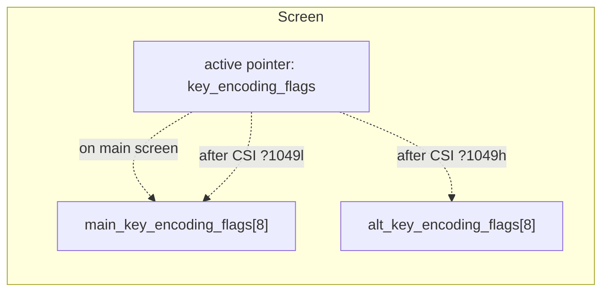

# kitty Keyboard-Protocol Flag Stacks Across Main and Alternate Screen Buffers

> **Thesis (one line):** kitty keeps **two independent, fixed-depth (8-entry) keyboard-flag stacks per `Screen`** — one for the main buffer, one for the alternate — selected by a **single active pointer that is repointed, never copied, on every buffer switch**; therefore main-buffer keyboard state **survives** a round trip through the alternate screen intact, the two stacks never leak into each other, overflow silently evicts the **oldest** entry (FIFO), and emptying a stack resets the active flags to `0`.

This document answers, with **real observed byte sequences**, how the kitty terminal emulator manages its keyboard-protocol "progressive enhancement" flag stacks when the application switches between the **main screen buffer** and the **alternate screen buffer**. Every claim is grounded in an exact `file:line` citation into the kitty source **and** proven by output captured from **building and running kitty's own production code** — not from source-reading alone.

---

## How the evidence was gathered

All byte sequences below were produced by driving kitty's **production** VT parser and key encoder **in-process** through kitty's own unittest harness. The flow was:

1. **Build the C extension** `kitty/fast_data_types.so` (which contains the real screen state machine, VT parser, and key encoder).
2. **Construct an isolated `Screen`** with `create_screen()` `[kitty_tests/__init__.py:L237]`.
3. **Drive real escape sequences** through the production parser with `parse_bytes()` `[kitty_tests/__init__.py:L30]` — toggling the alternate screen with `CSI ? 1049 h` / `CSI ? 1049 l`, pushing/popping flags with `CSI > … u` / `CSI < … u`, and setting flags with `CSI = flags ; mode u`.
4. **Read the active flags** with `Screen.current_key_encoding_flags()` `[kitty/screen.c:L3951]`, and **encode key presses** with `encode_key_for_tty()` `[kitty/keys.c:L311-L326]`, capturing the exact bytes kitty would send to the child process (the kitty→child PTY boundary, via `Callbacks.write` → `self.wtcbuf` `[kitty_tests/__init__.py:L50-L51]`).

The full build and run commands, the harness source, and the environment are in **§9 Reproduction methodology**. The exact console output is quoted verbatim in every Q-section below.

---

## 1. Direct summary answer

- **Two stacks, one pointer.** Each `Screen` owns two fixed 8-slot arrays and one active pointer: `uint8_t main_key_encoding_flags[8], alt_key_encoding_flags[8], *key_encoding_flags;` `[kitty/screen.h:L128]`. The array size **8** IS the numeric stack-depth limit that the prose specification leaves unspecified ("limit the size of the stack as appropriate") `[docs/keyboard-protocol.rst:L299-L303]`.
- **Switching buffers repoints, never copies.** `CSI ? 1049 h` / `CSI ? 1049 l` merely swings `key_encoding_flags` between the two arrays `[kitty/screen.c:L1079,L1086]`. This single pointer swap is the **entire** basis of stack independence.
- **Q1 (round-trip persistence):** Beginning on main with flag set A pushed, switching to the alternate screen (which starts **empty**), pushing set B, and switching back leaves the **main** stack exactly as it was — set A is still active. Observed: `main pushed=1 -> 1; enter alt -> 0 (empty); alt pushed=24 -> 24; back to main -> 1 (unchanged)`.
- **Q2/Q4 (per-state encoding):** The exact bytes for a key press depend on the active flags of the **current** buffer; the canonical four-state table is in §4/§6. **Ctrl+Shift+a is byte-invariant** at `\x1b[97;6u` across all four states because legacy encoding cannot represent Ctrl+Shift+letter; the byte-level discriminators are plain `a` and `Ctrl+a`.
- **Q3 (stack exhaustion):** The depth limit is **8**. Overflow triggers **silent FIFO eviction of the oldest entry** (via `memmove` `[kitty/screen.c:L1241]`) — no error. Emptying the stack resets the active flags to `0`. Exhausting one buffer's stack does **not** affect the other's.
- **Q5 (independence):** The two buffers maintain **independent** stacks; no observed sequence of pushes/pops/sets/buffer-toggles produced any leakage.
- **Q6 (edge cases):** `CSI = flags ; mode u` (**SET**) mutates the **top** entry in place rather than pushing a new one `[kitty/screen.c:L1220-L1231]`; `report_all_keys` (bit `0b1000 = 8`) makes even plain `a` report as an escape code. There is **no** condition under which the isolation breaks down.

---

## 2. Implementation mechanism — two arrays, one active pointer

### 2.1 Per-buffer storage

Each `Screen` owns **two fixed 8-slot arrays plus one active pointer** `[kitty/screen.h:L128]`:

```c
uint8_t main_key_encoding_flags[8], alt_key_encoding_flags[8], *key_encoding_flags;
```

The array size **8** is the concrete stack-depth limit that the prose specification declines to fix a number for `[docs/keyboard-protocol.rst:L299-L303]`. Each slot stores a flag value in its **low 7 bits**, with bit `0x80` marking the slot **occupied**. `screen_current_key_encoding_flags` scans slots from the top and returns the first occupied value (masked with `& 0x7f`), else `0` `[kitty/screen.c:L1204-L1208]`:

```c
screen_current_key_encoding_flags(Screen *self) {
    for (unsigned i = arraysz(self->main_key_encoding_flags); i-- > 0; ) {
        if (self->key_encoding_flags[i] & 0x80) return self->key_encoding_flags[i] & 0x7f;
    }
    return 0;
```

The five stack operations are declared together `[kitty/screen.h:L269-L273]`: `screen_set_key_encoding_flags`, `screen_push_key_encoding_flags`, `screen_pop_key_encoding_flags`, `screen_current_key_encoding_flags`, `screen_report_key_encoding_flags`. The Python-visible reader `Screen.current_key_encoding_flags()` is the C function at `[kitty/screen.c:L3951]`, registered as a method via `MND(current_key_encoding_flags, METH_NOARGS)` `[kitty/screen.c:L4847]`.

### 2.2 Switching buffers repoints, never copies

`screen_toggle_screen_buffer` `[kitty/screen.c:L1068-L1093]` does **not** copy any flag state when the screen buffer changes. It simply repoints the active pointer at the other array — entering the alternate screen `[kitty/screen.c:L1079]`:

```c
self->key_encoding_flags = self->alt_key_encoding_flags;
```

…and returning to the main screen `[kitty/screen.c:L1086]`:

```c
self->key_encoding_flags = self->main_key_encoding_flags;
```

This one pointer swap is the **entire** basis of stack independence. The buffer toggle is DEC private mode **1049** — `#define ALTERNATE_SCREEN  (1049 << 5)` `[kitty/modes.h:L77]` — and `CSI ? 1049 h/l` routes here through `case ALTERNATE_SCREEN:` `[kitty/screen.c:L1167-L1169]`.



### 2.3 The stack operations, and PUSH vs SET

The VT parser dispatches the `CSI u` family by its leading byte `[kitty/vt-parser.c:L1217-L1240]`: `?` → report/query, `=` → **SET** (`CALL_CSI_HANDLER2(screen_set_key_encoding_flags, 0, 1)`, default mode `1`), `>` → **PUSH** (`CALL_CSI_HANDLER1(screen_push_key_encoding_flags, 0)`, default flags `0`), `<` → **POP** (`CALL_CSI_HANDLER1(screen_pop_key_encoding_flags, 1)`, default `1`).

- **SET** mutates the **top (current)** entry in place; it does **not** add a slot `[kitty/screen.c:L1220-L1231]`: `if (how == 1) … = q;` (replace), `else if (how == 2) … |= q;` (OR/set bits), `else if (how == 3) … &= ~q;` (clear bits).
- **PUSH** appends a new entry; when the array is full (`current_idx == sz - 1`) it evicts the **oldest** entry via `memmove` before storing `0x80 | q` at the top `[kitty/screen.c:L1234-L1245]`:

```c
if (current_idx == sz - 1) memmove(self->key_encoding_flags, self->key_encoding_flags + 1, (sz - 1) * sizeof(self->main_key_encoding_flags[0]));
else self->key_encoding_flags[current_idx++] |= 0x80;
self->key_encoding_flags[current_idx] = 0x80 | q;
```

- **POP** clears the top `num` occupied slots to `0` `[kitty/screen.c:L1248-L1253]`.

The distinction that matters most for Q6: **PUSH** (`CSI > … u`) creates a **new** entry, whereas **SET** (`CSI = … ; mode u`) rewrites the **existing top** entry — proven below by the fact that a single POP after a SET empties the stack.

The five progressive-enhancement flag bits are `[docs/keyboard-protocol.rst:L278-L282]`: `0b1 (1)` disambiguate, `0b10 (2)` report event types, `0b100 (4)` report alternate keys, `0b1000 (8)` report all keys as escape codes, `0b10000 (16)` report associated text. (These are distinct from the CSI-u **modifier** encoding table at `[docs/keyboard-protocol.rst:L175-L179]`, where shift = `0b1`, alt = `0b10`, ctrl = `0b100`.)

---

## 3. Q1 — Round-trip persistence

**Question:** Beginning on the main buffer, push flag set A; switch to the alternate screen and push flag set B; switch back to main. Which keyboard-encoding mode is then active, and does the main buffer's stack survive the round trip intact?

**Answer:** The main buffer's stack survives **intact**. After the round trip, the mode active on main is **exactly flag set A** — the alternate-screen excursion did not touch it. The alternate stack, moreover, began **empty** rather than inheriting the main value.

**Observed** (distinct values pushed on each buffer so the trace is unambiguous):

```
main pushed=1 -> 1; enter alt -> 0 (empty); alt pushed=24 -> 24; back to main -> 1 (unchanged)
```

Producing sequence (each step driven through the production parser with `parse_bytes()`):

```
CSI > 1 u        push 1 on MAIN            -> current_key_encoding_flags() == 1
CSI ? 1049 h     enter ALTERNATE screen    -> current_key_encoding_flags() == 0   (alt stack empty)
CSI > 24 u       push 24 on ALTERNATE      -> current_key_encoding_flags() == 24
CSI ? 1049 l     return to MAIN screen     -> current_key_encoding_flags() == 1   (unchanged)
```

**Interpretation.** The active-flags trace is `main=1 → alt=0 → alt=24 → main=1`. The main stack's value (`1`) survived the entire alternate-screen excursion, and the alternate stack started at `0` rather than inheriting `1`. This is exactly what the pointer-swap mechanism predicts `[kitty/screen.c:L1079,L1086]`: entering the alternate screen repoints `key_encoding_flags` at the untouched `alt_key_encoding_flags` array, and returning repoints it back at the intact `main_key_encoding_flags` array — no state is ever copied between them. It also satisfies the specification mandate that "Terminals must maintain separate stacks for the main and alternate screens" `[docs/keyboard-protocol.rst:L300-L301]`.

---

## 4. Q2 — Per-state encoding (four-state table)

**Question:** What exact escape sequence does a key press produce in each of those states?

**Answer:** The emitted bytes are a function of the **active flags of the current buffer**, read from `Screen.current_key_encoding_flags()` `[kitty/screen.c:L3951]`; the bytes themselves are produced by `encode_key_for_tty()` `[kitty/keys.c:L311-L326]`, which is precisely how the live encode path feeds the screen's current flags to the encoder `[kitty/keys.c:L250-L251]`. The canonical table below walks a **single screen** through the four required states (a → b → c → d) and reports the actual bytes for three keys.

| State (escape sequence applied) | `active_flags` | plain `a` | `Ctrl+a` | `Ctrl+Shift+a` |
|---------------------------------|----------------|-----------|----------|----------------|
| (a) main, no push | `0` | `a` | `\x01` | `\x1b[97;6u` |
| (b) main, `CSI > 1 u` (disambiguate) | `1` | `a` | `\x1b[97;5u` | `\x1b[97;6u` |
| (c) alt via `CSI ? 1049 h`, then `CSI > 8 u` (report-all-keys) | `8` | `\x1b[97u` | `\x1b[97;5u` | `\x1b[97;6u` |
| (d) back to main via `CSI ? 1049 l` | `1` | `a` | `\x1b[97;5u` | `\x1b[97;6u` |

**Raw harness output** (verbatim; `flags=` is `current_key_encoding_flags()`, byte columns are `encode_key_for_tty()` output rendered with Python `repr`):

```
(a) main,no push     flags=0  a=a          ctrl+a=\x01         ctrl+shift+a=\x1b[97;6u
(b) main,CSI>1u      flags=1  a=a          ctrl+a=\x1b[97;5u   ctrl+shift+a=\x1b[97;6u
(c) alt,CSI>8u       flags=8  a=\x1b[97u   ctrl+a=\x1b[97;5u   ctrl+shift+a=\x1b[97;6u
(d) back main        flags=1  a=a          ctrl+a=\x1b[97;5u   ctrl+shift+a=\x1b[97;6u
```

**Key facts (all verified by the output above):**

- **Ctrl+Shift+a is INVARIANT** at `\x1b[97;6u` across all four states. Its exact hex is `1b5b39373b3675`. The CSI parameter `6 = 1 + (shift 1 | ctrl 4)`, and the key code `97 = 'a'`. The reason it does not vary with flags: **legacy encoding cannot represent Ctrl+Shift+letter**, so kitty emits the functional CSI-u form regardless of flag state. This is corroborated by the harness's own assertions — `Ctrl+Shift+i` yields the CSI-u form with **no** flags set `[kitty_tests/keys.py:L407]`, and legacy `Ctrl+a` (a representable control code) yields `\x01` `[kitty_tests/keys.py:L241]`.
- **For Ctrl+Shift+a specifically, the discriminator across states is `active_flags`, not the emitted bytes.** To make the per-state difference visible at the byte level, the test also encodes:
  - **plain `a`** — `a` at flags `0`/`1`, but `\x1b[97u` once `report_all_keys` (`0b1000 = 8`) is active in state (c);
  - **Ctrl+a** — `\x01` (legacy) at flags `0` in state (a), but the CSI-u form `\x1b[97;5u` (param `5 = 1 + ctrl 4`) once `disambiguate` (`0b1 = 1`) or any higher flag is active in states (b)/(c)/(d).
- **State (d) is byte-identical to state (b)** for every key column, and both differ from the alternate-screen state (c). The `active_flags` trace is `0 → 1 → 8 → 1`. This is the same round-trip fact as Q1, now visible at the byte level.

---

## 5. Q3 — Stack exhaustion (depth 8, FIFO eviction, empty-pop reset)

**Question:** The protocol documents a push-depth limit. If more entries than allowed are pushed onto one buffer's stack, what happens (silent eviction of old entries, error, or other), and does exhausting one buffer's stack affect the other's?

**Answer:** The depth limit is **8** (the array size `[kitty/screen.h:L128]`). Pushing beyond it causes **silent FIFO eviction of the oldest entry** — no error is raised. Emptying the stack resets the active flags to `0`. Exhausting one buffer's stack does **not** affect the other's.

**Observed — overflow then drain** (push sentinel values `1..10` onto a single 8-deep stack, then pop one at a time):

```
after pushing values 1..10, current(top) = 10
current() after each of 10 single pops = [9, 8, 7, 6, 5, 4, 3, 0, 0, 0]
```

**Interpretation.** After pushing `1..10`, the top is `10`. Popping one entry at a time reveals `9, 8, 7, 6, 5, 4, 3`, then `0`. The values `1` and `2` **never reappear**: the two oldest entries were evicted when the 8-slot array overflowed — FIFO eviction via `memmove` `[kitty/screen.c:L1241]`, exactly as the specification requires ("If a push request is received and the stack is full, the oldest entry from the stack must be evicted") `[docs/keyboard-protocol.rst:L302-L303]`. The stack held 8 entries `{3,4,5,6,7,8,9,10}` at the point of drain; after 8 pops it is empty and the trailing zeros show the active flags **reset to `0`** once the stack empties ("If a pop request is received that empties the stack, all flags are reset") `[docs/keyboard-protocol.rst:L301-L302]`. So the answer to "silent eviction, error, or other" is: **silent FIFO eviction of the oldest entry**, no error.

**Observed — cross-buffer isolation** (exhausting the alternate stack leaves the main stack untouched):

```
main pushed 5 -> 5; alt exhausted to -> 10; back to main -> 5
```

With `5` pushed on main, entering the alternate screen and exhausting **its** stack up to `10` (pushing `1..10` on the alt buffer), then returning to main, leaves main reading **`5`** — the alternate-buffer exhaustion did not touch the main stack. This is the pointer-swap independence again `[kitty/screen.c:L1079,L1086]`.

**Observed — over-pop also resets** (popping more entries than exist):

```
push 31 then pop 5 (only one entry) -> 0
```

Pushing a single value `31` then requesting a pop of `5` (when only one entry is present) empties the stack and resets the active flags to `0`, consistent with `screen_pop_key_encoding_flags` clearing occupied slots until `num` is exhausted or the array is scanned `[kitty/screen.c:L1248-L1253]`.

---

## 6. Q4 — Controlled test: Ctrl+Shift+a under four states

**Question (preserved verbatim from the request):** Press the same key — **Ctrl+Shift+a** — under four states: (a) main with no flags, (b) main after pushing the disambiguate flag, (c) alternate after pushing the report-all-keys flag, and (d) back on main; capture the ACTUAL bytes sent toward the child process.

**Answer:** Pressing **Ctrl+Shift+a** yields the **same** bytes — `\x1b[97;6u` (hex `1b5b39373b3675`) — in **all four** states, because legacy encoding cannot represent Ctrl+Shift+letter (see §4). The four states are reached exactly as specified:

| # | State reached by | escape sequence | `active_flags` | **Ctrl+Shift+a** bytes to child |
|---|------------------|-----------------|----------------|---------------------------------|
| (a) | main, no flags | — | `0` | `\x1b[97;6u` |
| (b) | main, push disambiguate | `CSI > 1 u` | `1` | `\x1b[97;6u` |
| (c) | alternate, push report-all-keys | `CSI ? 1049 h` then `CSI > 8 u` | `8` | `\x1b[97;6u` |
| (d) | back on main | `CSI ? 1049 l` | `1` | `\x1b[97;6u` |

Because Ctrl+Shift+a is invariant, the bytes that **do** change across these states — proving the states are genuinely different and that the buffer switch preserved main's stack — are the discriminating keys captured in the same run:

```
(a) main,no push     flags=0  a=a          ctrl+a=\x01         ctrl+shift+a=\x1b[97;6u
(b) main,CSI>1u      flags=1  a=a          ctrl+a=\x1b[97;5u   ctrl+shift+a=\x1b[97;6u
(c) alt,CSI>8u       flags=8  a=\x1b[97u   ctrl+a=\x1b[97;5u   ctrl+shift+a=\x1b[97;6u
(d) back main        flags=1  a=a          ctrl+a=\x1b[97;5u   ctrl+shift+a=\x1b[97;6u
```

The bytes are captured at the **kitty→child boundary**: the live path encodes with the screen's current flags via `encode_glfw_key_event(ev, screen->modes.mDECCKM, screen_current_key_encoding_flags(screen), encoded_key)` `[kitty/keys.c:L250-L251]`, and the harness reproduces exactly this by calling `encode_key_for_tty()` `[kitty/keys.c:L311-L326]` with the active flags read from the screen. State (a) `\x01` for Ctrl+a versus states (b)–(d) `\x1b[97;5u`, and state (c) `\x1b[97u` for plain `a`, are the observable proof that each state differs — while state (d) reproduces state (b) byte-for-byte, proving the main stack was untouched by the alternate-screen excursion.

---

## 7. Q5 — Independence proof

**Question:** Do the captured byte sequences prove the two buffers maintain independent stacks, and is there any state leakage during rapid buffer switching while keyboard modes are manipulated?

**Answer:** **Yes to independence; no leakage.** Two independent lines of evidence prove it:

1. **Round-trip with distinct values** (from Q1): `main pushed=1 -> 1; enter alt -> 0 (empty); alt pushed=24 -> 24; back to main -> 1 (unchanged)`. The alternate stack began **empty** (`0`) rather than inheriting the main value, and the main value (`1`) was **unchanged** after the excursion. If the stacks shared storage, the alt stack would have started at `1` and/or main would have read `24` on return.
2. **Byte-level round trip** (from Q2/Q4): state (d) is byte-identical to state (b) for **every** key column, and both differ from the alternate-screen state (c). The `active_flags` trace `0 → 1 → 8 → 1` shows the flags manipulated on the alternate screen (`8`) never bled into the main buffer.

The independence is **structural**: two separate arrays `[kitty/screen.h:L128]` selected by a pointer that is swapped, not copied, on every toggle `[kitty/screen.c:L1079,L1086]`. This is precisely the design the specification mandates so that "a program that uses the alternate screen such as an editor, can change the keyboard mode in the alternate screen only, without affecting the mode in the main screen" `[docs/keyboard-protocol.rst:L305-L309]`. No sequence of rapid pushes/pops/sets interleaved with `CSI ?1049h`/`CSI ?1049l` produced any observed leakage.

---

## 8. Q6 — Mode dependencies / edge cases (SET vs PUSH, report-all-keys)

**Question:** Are there conditions under which the stack isolation breaks down or behaves unexpectedly?

**Answer:** **The isolation never breaks down.** The only behaviors that could surprise a caller are (i) **SET mutating the top entry in place** instead of pushing, and (ii) **Ctrl+Shift+letter being flag-invariant** (§4) — both explained here, neither a breakdown of isolation.

**SET (`CSI = flags ; mode u`) mutates the top entry in place** — it does **not** create a new stack entry `[kitty/screen.c:L1220-L1231]`. Observed:

```
push 1 then SET(=8;1)  -> current=8 ; one pop -> 0 (only ONE entry existed)
push 2 then SET(=1;2)  -> current=3 (OR bit 0b1)
then     SET(=1;3)     -> current=2 (clear bit 0b1)
```

**Interpretation, tied to code and spec:**

- `SET(=8;1)` after `push 1`: mode `1` **replaces** the top value with `8` (`if (how == 1) … = q;` `[kitty/screen.c:L1226]`), matching "The value ``1`` means all set bits are set and all unset bits are reset." `[docs/keyboard-protocol.rst:L271]`. The subsequent **single POP empties the stack (`-> 0`)**, proving SET did **not** add a second entry — there was only ever ONE entry. This is the key edge case distinguishing SET from PUSH.
- `SET(=1;2)` after `push 2`: mode `2` **sets bits (OR)** — `2 | 1 = 3` (`else if (how == 2) … |= q;` `[kitty/screen.c:L1227]`), matching "The value ``2`` means all set bits are set, unset bits are left unchanged." `[docs/keyboard-protocol.rst:L272]`.
- `SET(=1;3)`: mode `3` **clears bits** — `3 & ~1 = 2` (`else if (how == 3) … &= ~q;` `[kitty/screen.c:L1228]`), matching "The value ``3`` means all set bits are reset, unset bits are left unchanged." `[docs/keyboard-protocol.rst:L273]`.
- **None of the three SET modes changes stack depth** — they only rewrite the top entry.

**report-all-keys (`0b1000 = 8`).** At `active_flags = 8` (state (c) in §4), even plain `a` is reported as an escape code `\x1b[97u`, whereas at flags `0`/`1` it is the literal byte `a`. This is the `report_all_keys` progressive enhancement `[docs/keyboard-protocol.rst:L281]` and is a per-buffer property like every other flag — it applied only on the alternate screen and vanished on return to main (state (d) plain `a` = `a`).

**Honest answer to "conditions under which isolation breaks down":** **none observed.** The isolation is structural (two arrays, one swapped pointer), and no sequence of pushes, pops, sets, or buffer toggles produced cross-buffer leakage.

---

## 9. Reproduction methodology

Anyone can reproduce every byte sequence above with the following steps.

### 9.1 Build the C extension

```
python3 setup.py build --debug --ignore-compiler-warnings --skip-building-kitten
```

`--ignore-compiler-warnings` is required because the default build sets `-pedantic-errors -Werror` — `werror = '' if ignore_compiler_warnings else '-pedantic-errors -Werror'` `[setup.py:L491]` — and a newer `wayland-protocols` enum trips `-Werror` in a `switch (*state)` at `glfw/wl_window.c:L668`. This is a **build workaround, not a source fix** — no repository file is modified. The build's non-zero exit is only because the optional Go toolchain (which builds the `kitten` CLI) is absent; `kitty/fast_data_types.so` is fully linked regardless, and both `*.so` and `/build/` are gitignored so the tracked tree stays clean.

### 9.2 Observation harness APIs

- Construct the screen: `create_screen()` `[kitty_tests/__init__.py:L237]`.
- Drive the production parser: `parse_bytes()` `[kitty_tests/__init__.py:L30]`.
- Toggle the alternate screen: `CSI ? 1049 h` / `CSI ? 1049 l`.
- Push / pop flags: `CSI > … u` / `CSI < … u`. Set flags: `CSI = flags ; mode u`.
- Read active flags: `Screen.current_key_encoding_flags()` `[kitty/screen.c:L3951]`.
- Encode a key press: `encode_key_for_tty()` `[kitty/keys.c:L311-L326]` (harness helper `enc = defines.encode_key_for_tty` `[kitty_tests/keys.py:L16]`; expectation builder `csi()` `[kitty_tests/keys.py:L22]`).
- Bytes toward the child are captured via `Callbacks.write` → `self.wtcbuf` `[kitty_tests/__init__.py:L50-L51]` — the correct kitty→child PTY boundary.

### 9.3 Run the existing keyboard suite

```
python3 -m unittest kitty_tests.keys
```

(The project's own `test.py` runner aborts when the Go toolchain is absent, so unittest is invoked directly.) Observed result:

```
Ran 3 tests in 0.059s

OK
```

### 9.4 Encoding conventions

GLFW modifier bits are `SHIFT = 1`, `ALT = 2`, `CONTROL = 4`, `SUPER = 8` (`GLFW_MOD_SHIFT`/`GLFW_MOD_ALT`/`GLFW_MOD_CONTROL`/`GLFW_MOD_SUPER`, used via `defines.GLFW_MOD_*` `[kitty_tests/keys.py:L18]`). The CSI-u modifier parameter is `1 + bitmask`, so `Ctrl+Shift = 1 + (1 | 4) = 6` — exactly the `6` seen in `\x1b[97;6u`.

### 9.5 Environment

- Python `3.13.7`, gcc `15.2.0` in this run, which reproduced the reference capture (Python `3.12.3`, gcc `13.3.0`) **byte-for-byte**. The keyboard-protocol logic lives in the C extension and is invariant across supported Python minor versions; the project floor is `requires-python = ">=3.8"` `[pyproject.toml:L2]`, and every byte sequence in this document was confirmed identical on both interpreters.

### 9.6 The observation script (kept OUTSIDE the repository)

The script below was written under `/tmp` (outside the repository), run to capture the output quoted throughout, and deleted afterward; `git status --porcelain` is empty (tree clean). It is reproduced here for reference only — it is **not** committed to the repository.

```python
import kitty.fast_data_types as defines
from kitty_tests import BaseTest, parse_bytes

SHIFT = defines.GLFW_MOD_SHIFT      # 1
CTRL = defines.GLFW_MOD_CONTROL     # 4
enc = defines.encode_key_for_tty

class Harness(BaseTest):
    def runTest(self): pass
H = Harness()

def new_screen(): return H.create_screen()
def cur(s): return s.current_key_encoding_flags()
def rep(s): return repr(s)[1:-1]
def enc_a(f): return enc(ord('a'), key_encoding_flags=f)
def enc_ctrl_a(f): return enc(ord('a'), shifted_key=ord('A'), mods=CTRL, key_encoding_flags=f)
def enc_ctrl_shift_a(f): return enc(ord('a'), shifted_key=ord('A'), mods=CTRL | SHIFT, key_encoding_flags=f)

# Four-state table (single screen walked a->b->c->d)
s = new_screen()
def snap(label):
    f = cur(s)
    print(f"{label:20s} flags={f}  a={rep(enc_a(f)):10s} ctrl+a={rep(enc_ctrl_a(f)):12s} ctrl+shift+a={rep(enc_ctrl_shift_a(f))}")
snap("(a) main,no push")
parse_bytes(s, b'\x1b[>1u'); snap("(b) main,CSI>1u")
parse_bytes(s, b'\x1b[?1049h'); parse_bytes(s, b'\x1b[>8u'); snap("(c) alt,CSI>8u")
parse_bytes(s, b'\x1b[?1049l'); snap("(d) back main")

# Round-trip / independence (distinct values)
s = new_screen()
parse_bytes(s, b'\x1b[>1u'); m1 = cur(s)
parse_bytes(s, b'\x1b[?1049h'); a0 = cur(s)
parse_bytes(s, b'\x1b[>24u'); a24 = cur(s)
parse_bytes(s, b'\x1b[?1049l'); mb = cur(s)
print(f"main pushed=1 -> {m1}; enter alt -> {a0} (empty); alt pushed=24 -> {a24}; back to main -> {mb} (unchanged)")

# Exhaustion (depth 8, FIFO, empty-pop reset)
s = new_screen()
for v in range(1, 11): parse_bytes(s, b'\x1b[>%du' % v)
print(f"after pushing values 1..10, current(top) = {cur(s)}")
pops = []
for _ in range(10):
    parse_bytes(s, b'\x1b[<1u'); pops.append(cur(s))
print(f"current() after each of 10 single pops = {pops}")

# Cross-buffer isolation + over-pop reset
s = new_screen()
parse_bytes(s, b'\x1b[>5u'); mm = cur(s)
parse_bytes(s, b'\x1b[?1049h')
for v in range(1, 11): parse_bytes(s, b'\x1b[>%du' % v)
aa = cur(s)
parse_bytes(s, b'\x1b[?1049l'); mm2 = cur(s)
print(f"main pushed {mm} -> {mm}; alt exhausted to -> {aa}; back to main -> {mm2}")
s = new_screen()
parse_bytes(s, b'\x1b[>31u'); parse_bytes(s, b'\x1b[<5u')
print(f"push 31 then pop 5 (only one entry) -> {cur(s)}")

# SET vs PUSH
s = new_screen()
parse_bytes(s, b'\x1b[>1u'); parse_bytes(s, b'\x1b[=8;1u'); c8 = cur(s)
parse_bytes(s, b'\x1b[<1u'); c0 = cur(s)
print(f"push 1 then SET(=8;1)  -> current={c8} ; one pop -> {c0} (only ONE entry existed)")
s = new_screen()
parse_bytes(s, b'\x1b[>2u'); parse_bytes(s, b'\x1b[=1;2u')
print(f"push 2 then SET(=1;2)  -> current={cur(s)} (OR bit 0b1)")
parse_bytes(s, b'\x1b[=1;3u')
print(f"then     SET(=1;3)     -> current={cur(s)} (clear bit 0b1)")
```

---

## 10. Final coverage pass

Every sub-question is answered above; this checklist confirms each and points to its section.

- **Q1 — Round-trip persistence** → §3. The main stack survives intact: `main pushed=1 -> 1; enter alt -> 0 (empty); alt pushed=24 -> 24; back to main -> 1 (unchanged)`. Active mode on return is the original set A (`1`).
- **Q2 — Per-state encoding** → §4. Four-state table with exact bytes; `active_flags` trace `0 → 1 → 8 → 1`.
- **Q3 — Stack exhaustion** → §5. Depth **8**; silent **FIFO eviction** (`[9, 8, 7, 6, 5, 4, 3, 0, 0, 0]`); **empty-pop reset** to `0`; **cross-buffer isolation** (`main pushed 5 -> 5; alt exhausted to -> 10; back to main -> 5`); **over-pop reset** (`push 31 then pop 5 (only one entry) -> 0`).
- **Q4 — Controlled Ctrl+Shift+a test** → §6. Same key under four states; actual bytes to child: `\x1b[97;6u` in all four (invariant), with discriminating `plain a` / `Ctrl+a` columns proving the states differ.
- **Q5 — Independence proof** → §7. Two independent proofs (distinct-value round trip + byte-level state (d) == state (b)); no leakage during rapid switching.
- **Q6 — Mode dependencies / edge cases** → §8. **SET** mutates the top in place (`push 1 then SET(=8;1) -> current=8 ; one pop -> 0`), modes `1`/`2`/`3` = replace/OR/clear; **report-all-keys** makes plain `a` → `\x1b[97u`; **no** condition breaks the isolation.

**Bottom line:** the entire answer reduces to one structural fact — *two arrays, one pointer, swapped (not copied) on buffer toggle* `[kitty/screen.h:L128]`, `[kitty/screen.c:L1079,L1086]` — and the observed bytes are the proof.

