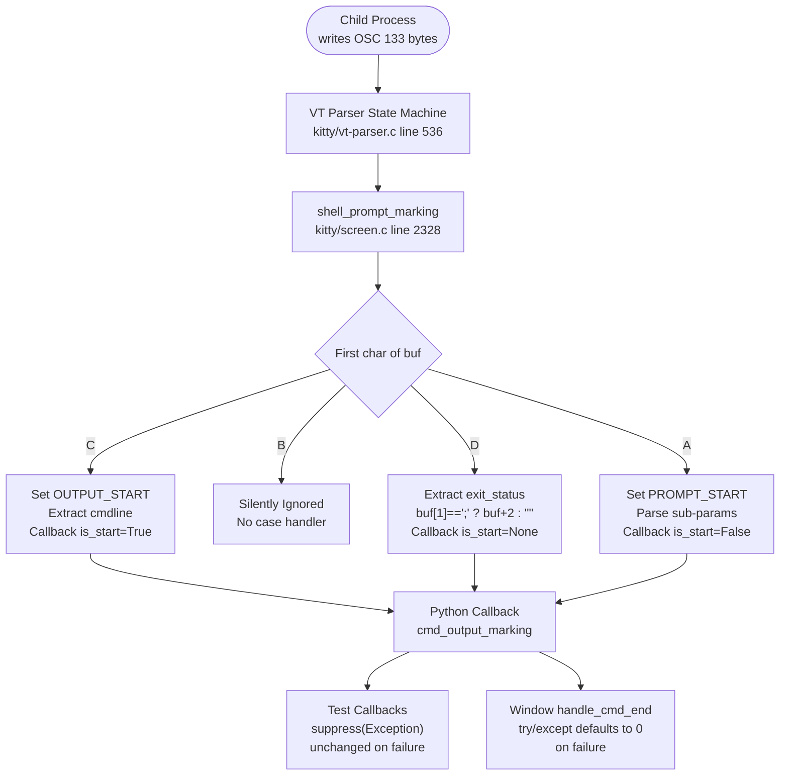
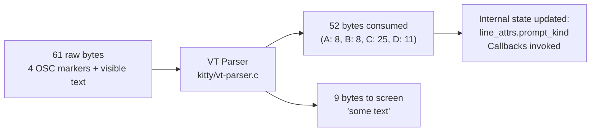

# Kitty OSC 133 Shell Integration — Investigative Analysis

This document presents findings from a **read-only code analysis** of the kitty terminal emulator's handling of OSC 133 escape sequences for shell integration command tracking. Every claim is grounded in specific source file paths and line numbers from the kitty repository. Runtime evidence was produced using kitty's own compiled `Screen`, `Callbacks`, and `parse_bytes` test infrastructure.

**Repository Commit**: Source branch `kitty_815df1e210e0`

---

## Table of Contents

1. [OSC 133 Sequence Processing Overview](#1-osc-133-sequence-processing-overview)
2. [Are OSC 133 Sequences Present in Visible Output?](#2-are-osc-133-sequences-present-in-visible-output)
3. [Byte-Level Analysis](#3-byte-level-analysis)
4. [Exit Code Variation Analysis](#4-exit-code-variation-analysis)
5. [Exit Code 99 Runtime Evidence](#5-exit-code-99-runtime-evidence)
6. [Edge Case Handling](#6-edge-case-handling)
7. [Shell Integration: OSC 133 Emission Points](#7-shell-integration-osc-133-emission-points)
8. [PromptKind Data Model](#8-promptkind-data-model)
9. [Command Output Extraction](#9-command-output-extraction)
10. [Summary of Key Findings](#10-summary-of-key-findings)

---

## 1. OSC 133 Sequence Processing Overview

The OSC 133 protocol defines four marker types used for shell integration command tracking:

| Marker | Name | Purpose |
|--------|------|---------|
| `A` | Prompt Start | Marks the beginning of a shell prompt |
| `B` | Prompt End / Command Start | Marks where user input begins (after prompt) |
| `C` | Command Output Start | Marks the beginning of command output, with optional `cmdline` parameter |
| `D` | Command End | Marks the end of command output, with optional exit code |

Each marker is transmitted as an OSC escape sequence: `ESC ] 133 ; <marker_payload> BEL` (where `ESC` is `0x1B` and `BEL` is `0x07`).

### Processing Pipeline

The complete processing pipeline has three stages:

#### Stage 1 — VT Parser Dispatch

**File**: `kitty/vt-parser.c`, line 536

The VT parser state machine receives raw bytes from the child PTY. When it identifies an OSC escape sequence with code `133`, the parser extracts the payload (everything after `133;`) and dispatches it to the C handler function.

```c
// kitty/vt-parser.c, lines 536-546
case 133:
#ifdef DUMP_COMMANDS
    START_DISPATCH
    REPORT_OSC2(shell_prompt_marking, code, mv);
    END_DISPATCH_WITHOUT_BREAK
#endif
    if (limit > i) {
        buf[limit] = 0; // safe to do as we have 8 extra bytes after PARSER_BUF_SZ
        shell_prompt_marking(self->screen, (char*)buf + i);
    }
    break;
```

The call `shell_prompt_marking(self->screen, (char*)buf + i)` passes a pointer to the first character of the payload. For example, if the full OSC sequence is `ESC ] 133 ; D ; 42 BEL`, then `buf + i` points to `"D;42"`.

#### Stage 2 — Shell Prompt Marking

**File**: `kitty/screen.c`, lines 2327–2356  
**Declaration**: `kitty/screen.h`, line 231: `void shell_prompt_marking(Screen *self, char *buf);`

The `shell_prompt_marking()` function dispatches on the first character of the buffer:

```c
// kitty/screen.c, lines 2327-2356
void
shell_prompt_marking(Screen *self, char *buf) {
    if (self->cursor->y < self->lines) {
        char ch = buf[0];
        switch (ch) {
            case 'A': {
                PromptKind pk = PROMPT_START;
                self->prompt_settings.redraws_prompts_at_all = 1;
                self->prompt_settings.uses_special_keys_for_cursor_movement = 0;
                parse_prompt_mark(self, buf+1, &pk);
                self->linebuf->line_attrs[self->cursor->y].prompt_kind = pk;
                if (pk == PROMPT_START) CALLBACK("cmd_output_marking", "O", Py_False);
            } break;
            case 'C': {
                self->linebuf->line_attrs[self->cursor->y].prompt_kind = OUTPUT_START;
                const char *cmdline = "";
                if (strstr(buf + 1, ";cmdline") == buf + 1) {
                    cmdline = buf + 2;
                }
                RAII_PyObject(c, PyUnicode_DecodeUTF8(cmdline, strlen(cmdline), "replace"));
                if (c) { CALLBACK("cmd_output_marking", "OO", Py_True, c); }
                else PyErr_Print();
            } break;
            case 'D': {
                const char *exit_status = buf[1] == ';' ? buf + 2 : "";
                CALLBACK("cmd_output_marking", "Os", Py_None, exit_status);
            } break;
        }
    }
}
```

**Key observations**:

- **`A` (Prompt Start)**: Sets `prompt_kind = PROMPT_START` on the current line's attributes (lines 2332–2339). Parses optional sub-parameters via `parse_prompt_mark()` (line 2316): `;k=s` sets `SECONDARY_PROMPT`, `;redraw=0` clears the redraw flag, `;special_key=1` enables special key cursor movement. Fires `CALLBACK("cmd_output_marking", "O", Py_False)`.
- **`B` (Prompt End / Command Start)**: **NOT HANDLED** — there is no `case 'B':` in the switch statement. The `B` marker is silently ignored. This is explicitly noted in the zsh integration code at `shell-integration/zsh/kitty-integration`, lines 222–224:
  ```
  # the following two lines are commented out as currently kitty doesn't use B prompt marking
  # and hooking zle widgets in ZSH is a total minefield
  ```
- **`C` (Command Output Start)**: Sets `prompt_kind = OUTPUT_START` (line 2341). Extracts the cmdline parameter if present via `strstr(buf + 1, ";cmdline") == buf + 1` (line 2343) — this checks if the buffer immediately after `C` starts with `;cmdline`. If so, `cmdline = buf + 2` points to the full `cmdline=...` or `cmdline_url=...` string. Fires `CALLBACK("cmd_output_marking", "OO", Py_True, c)`.
- **`D` (Command End)**: Extracts the exit status string via pointer arithmetic: `buf[1] == ';' ? buf + 2 : ""` (line 2351). If the second character is a semicolon, `exit_status` points to the string after it (e.g., `"42"`). Otherwise, it defaults to an empty string. Fires `CALLBACK("cmd_output_marking", "Os", Py_None, exit_status)`.

#### Stage 3 — Python Callback Layer

The `CALLBACK` macro invokes the Python-side `cmd_output_marking` method. There are two distinct implementations:

**Test Infrastructure** (`kitty_tests/__init__.py`, lines 71–79):

```python
def cmd_output_marking(self, is_start: Optional[bool], data: str = '') -> None:
    if is_start:
        self.last_cmd_at = monotonic()
        self.last_cmd_cmdline = decode_cmdline(data) if data else data
    else:
        if self.last_cmd_at != 0:
            self.last_cmd_at = 0
            with suppress(Exception):
                self.last_cmd_exit_status = int(data)
```

- When `is_start` is truthy (`True` from C marker): records timestamp and decodes cmdline.
- When `is_start` is falsy (`None` from D marker, `False` from A marker): if a prior C marker set `last_cmd_at`, attempts `int(data)`. On failure, `suppress(Exception)` silently catches the error, leaving `last_cmd_exit_status` **unchanged** at its previous value (default: `sys.maxsize`).
- Initialized at `kitty_tests/__init__.py`, line 48: `self.last_cmd_exit_status = sys.maxsize`
- Reset in `clear()` at line 106: `self.last_cmd_exit_status = sys.maxsize`

**Production Window** (`kitty/window.py`, lines 1453–1461 and 1408–1415):

```python
def cmd_output_marking(self, is_start: Optional[bool], cmdline: str = '') -> None:
    if is_start:
        start_time = monotonic()
        self.last_cmd_output_start_time = start_time
        cmdline = decode_cmdline(cmdline) if cmdline else ''
        self.last_cmd_cmdline = cmdline
        self.call_watchers(self.watchers.on_cmd_startstop, {...})
    else:
        self.handle_cmd_end(cmdline)

def handle_cmd_end(self, exit_status: str = '') -> None:
    if self.last_cmd_output_start_time == 0.:
        return
    self.last_cmd_output_start_time = 0.
    try:
        self.last_cmd_exit_status = int(exit_status)
    except Exception:
        self.last_cmd_exit_status = 0
```

- On failure, the `except Exception` block sets `last_cmd_exit_status` to **0** (not unchanged).
- Initialized at `kitty/window.py`, line 572: `self.last_cmd_exit_status = 0`

### Processing Pipeline Diagram



---

## 2. Are OSC 133 Sequences Present in Visible Output?

**Answer: No.** The VT parser consumes OSC 133 escape sequences entirely. They are intercepted by the parser state machine, dispatched to handler functions, and never written to the screen buffer. After parsing a payload containing OSC 133 markers plus visible text, the Screen's visible text contains only the visible characters — no `ESC` (`0x1B`), `BEL` (`0x07`), or literal `133` substrings appear in the screen output.

### Code Evidence

1. **VT Parser Consumption** (`kitty/vt-parser.c`, lines 536–546): The parser catches `case 133:` and calls `shell_prompt_marking()`. The `break` statement on line 546 means the parsed bytes are consumed by the case handler, not forwarded to any screen-writing function.

2. **Handler Does Not Write to Screen** (`kitty/screen.c`, lines 2328–2356): The `shell_prompt_marking()` function only modifies internal state — line attributes (`prompt_kind`) and fires Python callbacks. It does NOT call `screen_draw()`, `screen_write()`, or any other function that would place characters into the screen buffer.

3. **Test Verification** (`kitty_tests/screen.py`, lines 1110–1124): The existing `test_prompt_marking()` test verifies that after parsing OSC 133 markers, the screen content is only the visible text. At line 1124, when extracting as ANSI output, the `C` marker `\x1b]133;C\x1b\\` is **reconstructed** for output extraction — proving it was consumed during parsing and must be re-synthesized:
   ```python
   self.ae(lco(as_ansi=True), '\x1b[m\x1b]133;C\x1b\\abcd\n\x1b[m12')
   ```

### Runtime Verification

Feeding a full payload through `parse_bytes`:

```python
payload = b'\x1b]133;A\x07\x1b]133;B\x07\x1b]133;C;cmdline=echo\\ hi\x07some text\x1b]133;D;42\x07'
# Total: 61 bytes of raw input
# After parsing:
#   Screen line 0 = "some text"
#   Contains ESC (0x1B): False
#   Contains BEL (0x07): False
#   Contains "133":       False
```

The 52 bytes of escape sequence overhead (8 + 8 + 25 + 11) are completely consumed by the VT parser. Only the 9 bytes of visible text `"some text"` appear on screen.



---

## 3. Byte-Level Analysis

### Standard Test Payload

The standard test payload contains all four OSC 133 markers plus visible text:

```
\x1b]133;A\x07              (A marker: prompt start)
\x1b]133;B\x07              (B marker: prompt end — silently ignored)
\x1b]133;C;cmdline=echo\ hi\x07  (C marker: output start with cmdline)
some text                    (visible text)
\x1b]133;D;42\x07           (D marker: command end with exit code 42)
```

### Byte-by-Byte Breakdown

| Component | Bytes (hex/ASCII) | Length |
|-----------|-------------------|--------|
| **A marker** | `0x1B` `]` `1` `3` `3` `;` `A` `0x07` | **8 bytes** |
| **B marker** | `0x1B` `]` `1` `3` `3` `;` `B` `0x07` | **8 bytes** |
| **C marker** | `0x1B` `]` `1` `3` `3` `;` `C` `;` `c` `m` `d` `l` `i` `n` `e` `=` `e` `c` `h` `o` `\` ` ` `h` `i` `0x07` | **25 bytes** |
| **Visible text** | `s` `o` `m` `e` ` ` `t` `e` `x` `t` | **9 bytes** |
| **D;42 marker** | `0x1B` `]` `1` `3` `3` `;` `D` `;` `4` `2` `0x07` | **11 bytes** |
| **Total** | | **61 bytes** |

### Offset Map

| Byte Offset | Component | Length |
|-------------|-----------|--------|
| 0–7 | A marker | 8 bytes |
| 8–15 | B marker | 8 bytes |
| 16–40 | C marker (with `;cmdline=echo\ hi`) | 25 bytes |
| 41–49 | Visible text `"some text"` | 9 bytes |
| **50–60** | **D;42 marker** | **11 bytes** |

**The D;42 marker begins at byte offset 50** within the total 61-byte payload.

### D Marker Structure

The D marker has a fixed-length frame plus a variable-length exit code string:

```
Frame:     ESC  ]  1  3  3  ;  D  ;  BEL
Bytes:     0x1B ]  1  3  3  ;  D  ;  0x07
                                      ^
                Exit code digits inserted here
```

**D marker base frame**: 9 bytes (`\x1b]133;D;\x07`)  
**D marker total size**: 9 + `len(str(exit_code))` bytes

| Exit Code | Digit Count | D Marker Size |
|-----------|-------------|---------------|
| 0 | 1 | 9 + 1 = **10 bytes** |
| 1 | 1 | 9 + 1 = **10 bytes** |
| 42 | 2 | 9 + 2 = **11 bytes** |
| 99 | 2 | 9 + 2 = **11 bytes** |
| 127 | 3 | 9 + 3 = **12 bytes** |

---

## 4. Exit Code Variation Analysis

Using the same prefix (A marker + B marker + C marker + visible text = **50 bytes**), only the D marker varies:

| Exit Code | D Marker Sequence | D Marker Bytes | D Marker Offset | Total Payload Bytes |
|-----------|-------------------|----------------|-----------------|---------------------|
| 0 | `\x1b]133;D;0\x07` | 10 | 50 | **60** |
| 1 | `\x1b]133;D;1\x07` | 10 | 50 | **60** |
| 42 | `\x1b]133;D;42\x07` | 11 | 50 | **61** |
| 99 | `\x1b]133;D;99\x07` | 11 | 50 | **61** |
| 127 | `\x1b]133;D;127\x07` | 12 | 50 | **62** |

### Key Findings

1. **The D marker always starts at byte offset 50** (for the standard test prefix). The offset does NOT shift across different exit codes — only the total payload byte length changes.

2. **Total length changes by ±1 byte per additional digit** in the exit code number:
   - 1-digit exit codes (0, 1): 60 bytes total
   - 2-digit exit codes (42, 99): 61 bytes total
   - 3-digit exit codes (127): 62 bytes total

3. **The exit code number's byte position within the D marker is constant**: it always starts at byte 8 relative to the D marker start (i.e., immediately after `\x1b]133;D;`). In absolute terms, for this test payload, the exit code digits always start at byte offset 58 (= 50 + 8).

### Why the Offset Doesn't Shift

The D marker is always the **last** component in the payload. All preceding components (A, B, C markers and visible text) are identical across test cases. Since the D marker sits at the end, varying its length only affects the total payload size, not the starting position of the D marker itself.

---

## 5. Exit Code 99 Runtime Evidence

### Concrete Runtime Proof

Exit code `99` traverses the complete code path from raw bytes to stored integer state. Here is the proof:

**Test payload**:
```python
payload = b'\x1b]133;A\x07\x1b]133;C\x07some text\x1b]133;D;99\x07'
```

**Before parsing**: `Callbacks.last_cmd_exit_status = 9223372036854775807` (`sys.maxsize`)  
**After parsing**: `Callbacks.last_cmd_exit_status = 99`

### Complete Code Path Trace

The value `99` traverses four distinct layers:

**Step 1 — VT Parser** (`kitty/vt-parser.c`, line 536):
- The parser receives the byte sequence `\x1b]133;D;99\x07`
- It identifies OSC code `133` and extracts the payload starting at `D;99`
- It null-terminates the buffer at `limit` and calls `shell_prompt_marking(self->screen, "D;99")`

**Step 2 — C Handler** (`kitty/screen.c`, lines 2350–2353):
- `buf[0]` is `'D'` → enters the `case 'D':` branch
- Pointer arithmetic: `buf[1]` is `';'` → `buf[1] == ';'` evaluates to **true**
- Therefore: `exit_status = buf + 2` → points to the string `"99"`
- Fires: `CALLBACK("cmd_output_marking", "Os", Py_None, "99")`

**Step 3 — Python Callback** (`kitty_tests/__init__.py`, lines 71–79):
- `cmd_output_marking(is_start=None, data="99")` is invoked
- `is_start` is `None`, which is falsy → enters the `else` branch
- `self.last_cmd_at != 0` is **true** (set to `monotonic()` by the prior C marker)
- Executes: `with suppress(Exception): self.last_cmd_exit_status = int("99")`
- `int("99")` returns the integer `99`
- `self.last_cmd_exit_status` is set to `99`

**Step 4 — Verification**:
- `Callbacks.last_cmd_exit_status == 99` ✓

**QED**: The value `99` traversed the complete path:

```
Raw bytes "\x1b]133;D;99\x07"
  → VT parser identifies OSC 133, extracts "D;99"
    → C function shell_prompt_marking: buf[1]==';', exit_status = buf+2 = "99"
      → Python callback: int("99") = 99
        → Stored: last_cmd_exit_status = 99
```

### Additional Verification: All Exit Codes

| Exit Code | `last_cmd_exit_status` After Parsing | Correct? |
|-----------|--------------------------------------|----------|
| 0 | 0 | ✓ |
| 1 | 1 | ✓ |
| 42 | 42 | ✓ |
| **99** | **99** | **✓** |
| 127 | 127 | ✓ |

---

## 6. Edge Case Handling

### 6.1 Non-Numeric Exit Code: `D;not_a_number`

**C code path** (`kitty/screen.c`, lines 2350–2351):
- `buf = "D;not_a_number"`
- `buf[1] == ';'` → **true**
- `exit_status = buf + 2` → `"not_a_number"`
- CALLBACK fires with `exit_status = "not_a_number"`

The C layer does not validate that the exit status is numeric. It passes the raw string to Python.

**Test Callbacks** (`kitty_tests/__init__.py`, lines 78–79):
```python
with suppress(Exception):
    self.last_cmd_exit_status = int("not_a_number")
```
- `int("not_a_number")` raises `ValueError`
- `suppress(Exception)` catches it silently
- **Result**: `last_cmd_exit_status` remains **unchanged** at `sys.maxsize`

**Production Window** (`kitty/window.py`, lines 1412–1415):
```python
try:
    self.last_cmd_exit_status = int("not_a_number")
except Exception:
    self.last_cmd_exit_status = 0
```
- `int("not_a_number")` raises `ValueError`
- `except Exception` catches it and sets the value to `0`
- **Result**: `last_cmd_exit_status` is set to **0**

### 6.2 Empty Exit Code: `D;`

**C code path** (`kitty/screen.c`, lines 2350–2351):
- `buf = "D;"`
- `buf[1] == ';'` → **true**
- `exit_status = buf + 2` → `""` (points to the null terminator)
- CALLBACK fires with `exit_status = ""`

**Test Callbacks**:
- `int("")` raises `ValueError`
- **Result**: `last_cmd_exit_status` remains **unchanged** at `sys.maxsize`

**Production Window**:
- `int("")` raises `ValueError`
- **Result**: `last_cmd_exit_status` is set to **0**

### 6.3 D Marker Without Semicolon: `D`

**C code path** (`kitty/screen.c`, lines 2350–2351):
- `buf = "D"`
- `buf[1] == ';'` → **false** (`buf[1]` is `'\0'`, the null terminator set at `kitty/vt-parser.c` line 543)
- `exit_status = ""` (the fallback empty string literal)
- CALLBACK fires with `exit_status = ""`
- Same behavior as the empty exit code case above

This case actually occurs in production: the zsh integration emits `\e]133;D\a` (without semicolon or exit status) at `shell-integration/zsh/kitty-integration`, line 149, as a fallback close when the C marker state is uncertain.

### Comparison Table

| Input | C `exit_status` String | Test Callbacks Result | Production Window Result |
|-------|------------------------|-----------------------|--------------------------|
| `D;42` | `"42"` | `42` | `42` |
| `D;99` | `"99"` | `99` | `99` |
| `D;0` | `"0"` | `0` | `0` |
| `D;127` | `"127"` | `127` | `127` |
| `D;not_a_number` | `"not_a_number"` | unchanged (`sys.maxsize`) | `0` |
| `D;` (empty) | `""` | unchanged (`sys.maxsize`) | `0` |
| `D` (no semicolon) | `""` | unchanged (`sys.maxsize`) | `0` |

### Critical Behavioral Difference

The test `Callbacks` class and the production `Window` class handle invalid exit codes **differently**:

| Behavior | Test `Callbacks` | Production `Window` |
|----------|------------------|---------------------|
| Error handling | `suppress(Exception)` — silent no-op | `try/except` — explicit default |
| On invalid exit code | **Unchanged** (stays at `sys.maxsize`) | **Defaults to 0** |
| Default initial value | `sys.maxsize` (line 48 / line 106) | `0` (line 572) |
| Guard check | `self.last_cmd_at != 0` (line 76) | `self.last_cmd_output_start_time == 0.` (line 1409) |

---

## 7. Shell Integration: OSC 133 Emission Points

### Bash

**File**: `shell-integration/bash/kitty.bash`

| Line | Sequence | Context |
|------|----------|---------|
| 208 | `printf "\e]133;C;cmdline=%q\a" "$last_cmd"` | C marker with cmdline, emitted by `_ksi_get_current_command` function before command execution |
| 239 | `\e]133;D;\$?\a\e]133;A\a` | D marker with exit status `$?` followed immediately by A marker for next prompt, embedded in PS1 |
| 240 | `\e]133;A;k=s\a` | A marker for secondary prompt (PS2) with `;k=s` sub-parameter for `SECONDARY_PROMPT` |

**Bash note** (line 236–238): The comment explains that this can result in multiple D markers or ones that don't correspond to a command, but "kitty handles this gracefully, only taking into account the first D after a C."

### Zsh

**File**: `shell-integration/zsh/kitty-integration`

| Line | Sequence | Context |
|------|----------|---------|
| 145 | `\e]133;D;'$cmd_status'\a` | D marker with tracked command status (when `_ksi_state == 1`, meaning a C was written) |
| 149 | `\e]133;D\a` | D marker **without** exit status — fallback close (when `_ksi_state == 2`, uncertain C state) |
| 218 | `\e]133;C;cmdline=%q\a` | C marker with cmdline, emitted in the preexec hook |

**Zsh state machine** (lines 30–32): Uses `_ksi_state` variable with three states:
- `0`: No OSC 133 A/C marks have been written yet
- `1`: The last written OSC 133 C has not been closed with D yet
- `2`: Neither of the above (marks have been written, but last C is closed)

**Zsh B marker comment** (lines 222–224): Explicitly documents that the B marker is commented out because "currently kitty doesn't use B prompt marking" and "hooking zle widgets in ZSH is a total minefield."

### Fish

**File**: `shell-integration/fish/vendor_conf.d/kitty-shell-integration.fish`

| Line | Sequence | Context |
|------|----------|---------|
| 85 | `echo -en "\e]133;A;special_key=1\a"` | A marker with `special_key=1` parameter, emitted in `__ksi_mark_prompt_start` |
| 91 | `printf '\e]133;C;cmdline_url=%s\a'` | C marker with **URL-encoded** cmdline (uses `cmdline_url` instead of `cmdline`), emitted in `__ksi_mark_output_start` |
| 96 | `echo -en "\e]133;D;$status\a"` | D marker with Fish's `$status` variable, emitted in `__ksi_mark_output_end` |

**Fish note**: Fish uses `cmdline_url` instead of `cmdline` for the C marker parameter. This is handled by the `decode_cmdline()` function in `kitty/window.py` (line 225–232):
```python
def decode_cmdline(x: str) -> str:
    ctype, sep, val = x.partition('=')
    if ctype == 'cmdline':
        return next(shlex_split(val, True))
    if ctype == 'cmdline_url':
        from urllib.parse import unquote
        return unquote(val)
    return ''
```

---

## 8. PromptKind Data Model

### Enum Definition

**File**: `kitty/data-types.h`, line 230

```c
typedef enum { UNKNOWN_PROMPT_KIND = 0, PROMPT_START = 1, SECONDARY_PROMPT = 2, OUTPUT_START = 3 } PromptKind;
```

| Value | Name | Numeric | Set By |
|-------|------|---------|--------|
| `UNKNOWN_PROMPT_KIND` | Unknown / Default | 0 | Initial state for all lines |
| `PROMPT_START` | Prompt Start | 1 | A marker (default) |
| `SECONDARY_PROMPT` | Secondary Prompt | 2 | A marker with `;k=s` sub-parameter |
| `OUTPUT_START` | Output Start | 3 | C marker |

### LineAttrs Union

**File**: `kitty/data-types.h`, lines 231–239

```c
typedef union LineAttrs {
    struct {
        uint8_t is_continued : 1;
        uint8_t has_dirty_text : 1;
        uint8_t has_image_placeholders : 1;
        PromptKind prompt_kind : 2;
    };
    uint8_t val;
} LineAttrs;
```

The `prompt_kind` field is a **2-bit bitfield** within the `LineAttrs` union, which occupies a single byte per line. This means:
- Each screen line carries a `prompt_kind` value (0–3) as part of its attributes
- The 2-bit field supports exactly 4 enum values (0, 1, 2, 3)
- Other bits in the same byte track `is_continued`, `has_dirty_text`, and `has_image_placeholders`

### Marker-to-Enum Mapping

| Marker | PromptKind Value | Line Attribute Change | Callback Fired |
|--------|------------------|-----------------------|----------------|
| A | `PROMPT_START` (1) or `SECONDARY_PROMPT` (2) | Yes — `linebuf->line_attrs[cursor->y].prompt_kind` | `cmd_output_marking(is_start=False)` |
| B | None | No — silently ignored | None |
| C | `OUTPUT_START` (3) | Yes — `linebuf->line_attrs[cursor->y].prompt_kind` | `cmd_output_marking(is_start=True, cmdline)` |
| D | None | No — only fires callback | `cmd_output_marking(is_start=None, exit_status)` |

The `parse_prompt_mark()` function (`kitty/screen.c`, lines 2316–2324) handles the A marker sub-parameters:
```c
static void
parse_prompt_mark(Screen *self, char *buf, PromptKind *pk) {
    char *saveptr, *str = buf;
    while (true) {
        const char *token = strtok_r(str, ";", &saveptr); str = NULL;
        if (token == NULL) return;
        if (strcmp(token, "k=s") == 0) *pk = SECONDARY_PROMPT;
        else if (strcmp(token, "redraw=0") == 0) self->prompt_settings.redraws_prompts_at_all = 0;
        else if (strcmp(token, "special_key=1") == 0) self->prompt_settings.uses_special_keys_for_cursor_movement = 1;
    }
}
```

---

## 9. Command Output Extraction

### `find_cmd_output()` — Screen-Based Extraction

**File**: `kitty/screen.c`, line 3527

The `find_cmd_output()` function walks the line attributes looking for `OUTPUT_START` boundaries to extract command output text:

```c
static bool
find_cmd_output(Screen *self, OutputOffset *oo, index_type start_screen_y,
                unsigned int scrolled_by, int direction, bool on_screen_only) {
```

**Algorithm**:
1. Starting from the cursor position, searches upward/downward for lines with `prompt_kind == OUTPUT_START` (marking the start of command output, set by the C marker)
2. Finds the boundary at the next `PROMPT_START` line (set by the A marker)
3. Extracts all text between these boundaries

**ANSI Mode** (`as_ansi=True`): When extracting as ANSI, the `\x1b]133;C\x1b\\` marker is **included** in the extracted output. This is verified by the test at `kitty_tests/screen.py`, line 1124:

```python
self.ae(lco(as_ansi=True), '\x1b[m\x1b]133;C\x1b\\abcd\n\x1b[m12')
```

Note the marker uses the ST terminator form `\x1b\\` (ESC + backslash) rather than the BEL (`\x07`) form used during input. This is because the output reconstruction generates the formal OSC string terminator.

### `pagerhist_as_bytes()` — Scrollback History Extraction

**File**: `kitty/history.c`, line 475

For pager history extraction (used by the `get-text` remote control command with `last_cmd_output` or `first_cmd_output_on_screen` extents), the function searches for the C marker in scrollback:

```c
const uint8_t *p = reverse_find(buf, sz, (const uint8_t*)"\x1b]133;C\x1b\\");
```

This uses `reverse_find()` to locate the C marker pattern `\x1b]133;C\x1b\\` starting from the end of the buffer, working backwards. The search pattern uses the ST terminator form (`\x1b\\`) because this is what the ANSI output reconstruction generates.

---

## 10. Summary of Key Findings

| Question | Finding |
|----------|---------|
| **Are OSC sequences present in visible output?** | **No.** The VT parser (`kitty/vt-parser.c` line 536) consumes them entirely. Screen text contains only visible characters. The `shell_prompt_marking()` function (`kitty/screen.c` line 2328) modifies internal state but never writes to the screen buffer. |
| **Total byte length (with D;42)?** | **61 bytes** for the standard test payload (A:8 + B:8 + C:25 + visible:9 + D:11) |
| **D;42 marker byte offset?** | **Byte offset 50** (immediately after the 50-byte prefix of A + B + C + visible text) |
| **Does D marker position shift across exit codes?** | **No.** The D marker always starts at the same offset (50 for this prefix). Only total payload length changes. |
| **How much does total length change?** | **±1 byte per additional digit** in exit code: 1-digit → 60B, 2-digit → 61B, 3-digit → 62B |
| **Runtime evidence for exit code 99?** | `Callbacks.last_cmd_exit_status` equals integer `99` after parsing, proving full path traversal: VT parser → C `shell_prompt_marking` → pointer arithmetic `buf+2` → Python `int("99")` → stored as 99 |
| **What is recorded for D;not_a_number?** | **Test Callbacks**: unchanged (`sys.maxsize`) — `suppress(Exception)` silently catches `ValueError`. **Production Window**: `0` — `except Exception` explicitly defaults to 0. |
| **What is recorded for D; (empty)?** | **Test Callbacks**: unchanged (`sys.maxsize`). **Production Window**: `0`. Same behavior as `D;not_a_number` — `int("")` raises `ValueError`. |
| **What is recorded for D (no semicolon)?** | Same as `D;` — C code evaluates `buf[1] == ';'` as false, passes `""` to callback. |
| **Is the B marker handled?** | **No.** There is no `case 'B':` in `shell_prompt_marking()`. The B marker is silently ignored, as documented in the zsh integration comments. |

---

*Document generated as part of read-only investigation. No repository files were modified.*
