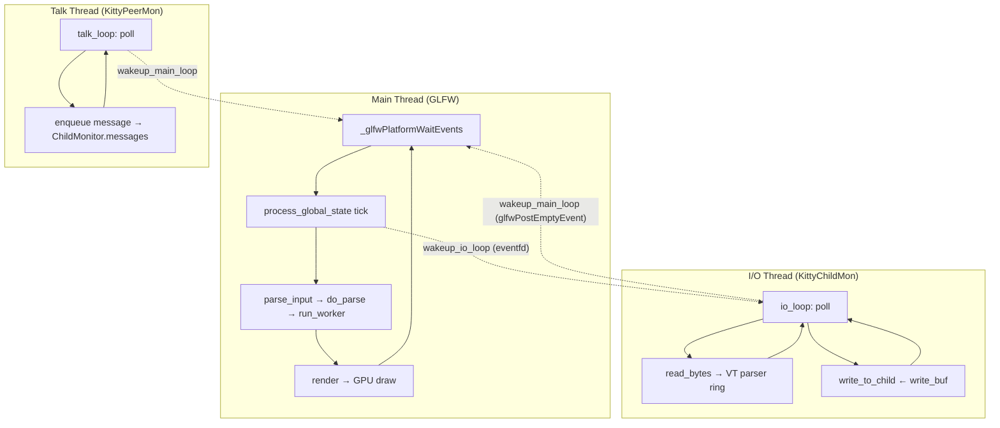
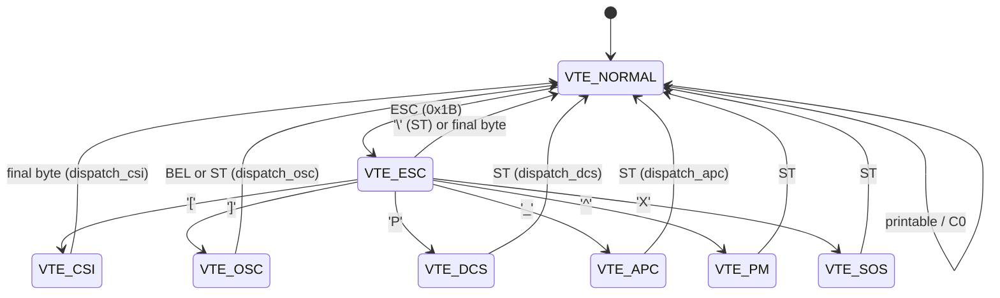
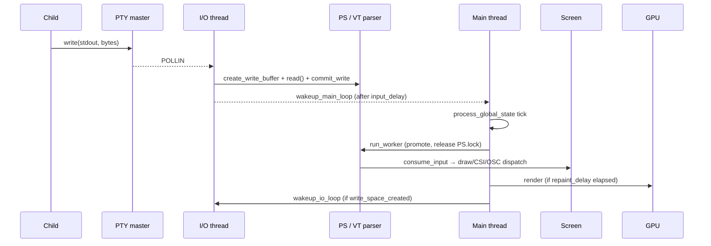

# Kitty Terminal Interaction Pipeline — End-to-End Runtime Trace (commit 815df1e21)

## 1. Introduction

This document traces the complete runtime behaviour of Kitty's terminal
interaction pipeline at commit `815df1e21` ("Wire up applying of font
config"), from the moment mixed input (keystrokes, paste bursts, resize
signals, shell-integration markers) arrives to the moment the interface
settles. Every claim is grounded in the actual source code of this
commit; nothing is assumed.

### 1.1 The three code layers

Kitty is stratified into three cooperating layers:

1. **C core** (`kitty/*.c`, `*.h`) — Threading, poll/epoll I/O, VT parsing,
   Screen model mutation, key encoding, resize plumbing, rendering glue.
2. **GLFW fork** (`glfw/*.c`, `glfw/*.h`) — A vendored GLFW fork providing
   the main event loop and platform-specific windowing backends
   (`x11_window.c`, `wl_window.c`, `cocoa_window.m`).
3. **Python orchestration** (`kitty/*.py`) — `Boss` singleton, `TabManager`,
   `Tab`, `Window`, `Child`, shell-integration setup, configuration.

### 1.2 Terminology (defined on first use)

| Term | Definition |
|------|-----------|
| **PTY** | Pseudo-terminal. A kernel pair of master/slave fds that presents line-discipline semantics. Created via `openpty` in `kitty/child.py`. |
| **OSC** | Operating System Command — ECMA-48 escape sequences of the form `ESC ] Ps ; Pt BEL` (or `ESC ] Ps ; Pt ESC \`). Dispatched in `dispatch_osc` at `kitty/vt-parser.c`. |
| **CSI** | Control Sequence Introducer — `ESC [ ...` sequences dispatched by `dispatch_csi` at `kitty/vt-parser.c`. |
| **DECSET / DECRST** | DEC private mode set / reset — `ESC [ ? Pm h` / `ESC [ ? Pm l`. Handled in `screen_set_mode` / `screen_reset_mode` at `kitty/screen.c`. |
| **SIGWINCH** | Signal sent by the kernel to a tty's foreground process group when the window size changes (via `ioctl(TIOCSWINSZ)`). |
| **DECARM** | DEC Auto-Repeat Mode (mode 8). Shifted constant `DECARM = (8 << 5)` at `kitty/modes.h:40`. |
| **VT state machine** | An 8-state parser (`VTEState` enum in `kitty/vt-parser.c` around line 160): `VTE_NORMAL`, `VTE_ESC`, `VTE_CSI`, `VTE_OSC`, `VTE_DCS`, `VTE_APC`, `VTE_PM`, `VTE_SOS`. |
| **POLLIN / POLLOUT** | Bit flags passed to `poll(2)` requesting notification of readable / writable fds. |
| **eventfd** | Linux kernel object usable as a wakeup source in `poll()`. Kitty uses it for `LoopData.wakeup_read_fd` on Linux; see `kitty/loop-utils.c`. |
| **signalfd** | Linux facility to receive signals via a readable fd. On macOS Kitty falls back to a self-pipe. |
| **ioctl** | Device control system call. Kitty uses `TIOCSWINSZ` (set window size) and `TIOCSCTTY` (set controlling tty). |
| **PENDING_MODE** | DEC private mode 2026, defined at `kitty/control-codes.h:235`. Shifted constant `PENDING_UPDATE = (2026 << 5)` at `kitty/modes.h:86`. Allows an application to freeze the renderer for atomic updates. |
| **BRACKETED_PASTE** | DEC private mode 2004. `BRACKETED_PASTE = (2004 << 5)` at `kitty/modes.h:81`. Wraps paste payload in `ESC [ 200~ ... ESC [ 201~`. |
| **HANDLE_TERMIOS_SIGNALS** | Kitty-specific mode `19997`. `HANDLE_TERMIOS_SIGNALS = (19997 << 5)` at `kitty/modes.h:89`. When set, Kitty converts Ctrl-C / Ctrl-Z / Ctrl-\ keystrokes directly into signals instead of writing raw bytes. |

### 1.3 Scope

The pipeline we trace carries a realistic "mixed input surge" — the user
typing while a command produces output while the window is being resized
while a remote-control peer sends a focus command. Each of these arrives
asynchronously on different threads and must serialize into a single
consistent screen state. Sections 2–14 build up the machinery piece by
piece, Section 15 is an end-to-end narrative, and Section 16 summarises
the invariants that make the rhythm work.

---

## 2. Three-Thread Architecture

Kitty runs exactly three threads end-to-end: the **main thread** (GLFW,
parsing, rendering), the **I/O thread** called `KittyChildMon` (reading
PTYs and writing to PTYs), and the **talk thread** called `KittyPeerMon`
(remote-control peer connections). All three are spawned in
`ChildMonitor.__cinit__` in `kitty/child-monitor.c`.

### 2.1 Main thread — `_glfwPlatformRunMainLoop`

The main thread enters `_glfwPlatformRunMainLoop` (`glfw/main_loop.h`
lines 26–38, full body reproduced below verbatim from source):

```c
void _glfwPlatformRunMainLoop(GLFWtickcallback tick_callback, void* data) {
    keep_going = 1;
    EventLoopData *eld = &_glfw.GLFW_LOOP_BACKEND.eventLoopData;
    while(keep_going) {
        _glfwPlatformWaitEvents();
        EVDBG("--------- loop tick, wakeups_happened: %d ----------", eld->wakeup_data_read);
        if (eld->wakeup_data_read) {
            eld->wakeup_data_read = false;
            tick_callback(data);
        }
    }
    EVDBG("main loop exiting");
}
```

The static `keep_going` flag is defined at `glfw/main_loop.h:16` and is
cleared by `_glfwPlatformStopMainLoop`. `_glfwPlatformWaitEvents` blocks
in the platform-specific poll/select until a real GLFW event (key,
mouse, resize) arrives, a timer expires, or `glfwPostEmptyEvent` is
called (which is what Kitty's `wakeup_main_loop` does).

Each iteration invokes Kitty's `process_global_state` tick callback
(defined at `kitty/child-monitor.c` lines 1223–1253). That tick runs
seven sub-phases in order, described in Section 9.

The crucial design property is that the loop **only ticks on wakeup**.
An idle Kitty sits in `poll()` consuming zero CPU until something real
happens.

### 2.2 I/O thread — `KittyChildMon`

The I/O thread runs `io_loop` at `kitty/child-monitor.c` starting around
line 1481. Its body is a five-step poll-driven cycle:

1. Build the `children_fds` array from the current `children[]` list,
   under `children_mutex`. For each child, add POLLIN (suppressed if the
   parser ring is full — see §11) and POLLOUT (suppressed if
   `write_buf_used == 0`).
2. Call `poll()` with a timeout derived from the input_delay batching
   deadline.
3. Process `revents`: POLLIN on a child calls `read_bytes` (§5.2);
   POLLOUT calls `write_to_child` (§8.3); POLLIN on the signal fd calls
   `read_signals`; POLLIN on the wakeup fd calls `drain_fd`.
4. Decide whether to wake the main thread. If any child produced data
   and at least `OPT(input_delay)` ms have passed since the last wakeup,
   call `wakeup_main_loop()` (equivalent to `glfwPostEmptyEvent()`). The
   relevant code lives at approximately lines 1562–1569:

   ```c
   now = monotonic();
   if (data_received && (now - last_main_loop_wakeup_at) > OPT(input_delay)) {
       WAKEUP;  // wakeup_main_loop(); last_main_loop_wakeup_at = now;
   }
   ```

5. Clean up any children marked `needs_removal` and loop.

This batching is load-bearing: with the default `input_delay` of 3 ms
(`kitty/options/definition.py:878`), the main thread wakes at most ~333
Hz regardless of child byte rate, and each wake drains everything in the
ring at once. Small-consume / many-wake pathology is eliminated
structurally.

The I/O thread **never** touches the Screen model, the line buffer, or
the cursor. It only reads/writes bytes and toggles the parser ring via
the thread-safe API.

### 2.3 Talk thread — `KittyPeerMon`

The talk thread runs `talk_loop` at approximately `kitty/child-monitor.c`
line 1805. It owns Unix-domain listening sockets for remote-control
connections, accumulates per-peer read buffers, and enqueues finished
messages into `ChildMonitor.messages` under `talk_mutex`. The main thread
drains this queue at the top of `parse_input` (see §9.3) and dispatches
each message to `Boss.peer_message_received` (Python,
`kitty/boss.py:776`).

### 2.4 Thread-interaction diagram



The dashed arrows are the only cross-thread signalling paths. All shared
state flows through four mutexes (see §3).

---

## 3. Mutex Hierarchy and Wakeup Infrastructure

### 3.1 The four mutexes

| Mutex | Declared | Protects | Held by |
|-------|----------|----------|---------|
| `children_lock` | `kitty/child-monitor.c:76` | the `children[]` array and `Child.refcnt` | main, I/O |
| `screen->write_buf_lock` | `kitty/screen.h:116` via `screen_mutex(...)` macro (`kitty/child-monitor.c:74`) | each `Screen.write_buf`, `write_buf_used`, `write_buf_sz` | main (enqueue), I/O (drain) |
| `talk_lock` | `kitty/child-monitor.c:78` | `ChildMonitor.messages[]` | main (dequeue), talk (enqueue) |
| `PS.lock` | `kitty/vt-parser.c:208` (inside `PS` struct at ~193) | the VT parser's 1 MiB ring buffer and its `read`/`write` sub-structs | main (consume), I/O (append) |

### 3.2 Lock ordering

Only one nesting is allowed anywhere in the code base:

```
children_mutex  →  screen_mutex(write)
```

This occurs in `schedule_write_to_child_generic` (macro body at
`kitty/child-monitor.c` approximately lines 323–370): the caller holds
`children_mutex` to find the `Child`, then takes that child's
`screen_mutex(write)` to append bytes. `PS.lock` and `talk_mutex` are
independent leaves; they are never held simultaneously with each other
or with the two above.

Because the lock DAG has no cycles, no two threads can deadlock.

### 3.3 `LoopData` — signal-safe wakeup infrastructure

The wakeup and signal primitives shared by both the I/O thread and the
talk thread live in a `LoopData` struct (defined at `kitty/loop-utils.h`
lines 32–44):

```c
typedef struct {
    int signal_read_fd, signal_write_fd;
    int wakeup_read_fd, wakeup_write_fd;
#ifdef HAS_SIGNAL_FD
    int signal_fd;
#endif
#ifdef HAS_EVENT_FD
    int wakeup_fd;  // aliased to wakeup_read_fd
#endif
    SignalSet signals_received;
    sigset_t oldset;
} LoopData;
```

`init_loop_data` (in `kitty/loop-utils.c`) installs either an `eventfd`
(Linux, when `HAS_EVENT_FD` is set) or a self-pipe (macOS, BSDs) as the
wakeup source, and either a `signalfd` (Linux) or a self-pipe for
signals.

### 3.4 `wakeup_loop`

`wakeup_loop` (at approximately `kitty/loop-utils.c:113–128`) writes a
single byte (pipe) or a `uint64_t` (eventfd) to the wakeup fd:

```c
void
wakeup_loop(LoopData *ld, bool in_signal_handler, const char *loop_name) {
    while(true) {
#ifdef HAS_EVENT_FD
        static const int64_t value = 1;
        ssize_t ret = write(ld->wakeup_fd, &value, sizeof value);
#else
        ssize_t ret = write(ld->wakeup_write_fd, "w", 1);
#endif
        if (ret < 0) {
            if (errno == EINTR) continue;
            if (!in_signal_handler)
                log_error("Failed to write to %s wakeup fd with error: %s",
                          loop_name, strerror(errno));
        }
        break;
    }
}
```

This function is **async-signal-safe** (it only calls `write` and
consults `errno`). Multiple wakeups in rapid succession coalesce into a
single tick because `drain_fd` at the reader side simply reads all
pending bytes at once. Coalescing is not a bug — it is the point: a
wakeup means "something is pending", not "exactly one thing is pending".

### 3.5 `wakeup_main_loop`

On the main thread the equivalent of `wakeup_loop` is
`wakeup_main_loop`, which is simply `glfwPostEmptyEvent()` (at
`kitty/glfw.c` around line 1807). GLFW's platform backend converts this
into whatever the platform needs to unblock `_glfwPlatformWaitEvents`
(e.g., writing to a Wayland display fd, or sending an Xlib event). Again
this is signal-safe and coalescing-friendly.

### 3.6 Signal delivery

On the I/O thread, signals are received via either `signalfd` or a
self-pipe. `read_signals` (`kitty/loop-utils.c` approximately lines
131–165) drains the fd, unpacks each pending signal, and invokes a
per-loop `handle_signal` callback. For the I/O thread, that callback
(`handle_signal` in `kitty/child-monitor.c:1519`) sets `ss.child_died =
true` on SIGCHLD, `ss.kill_received = true` on SIGTERM/SIGINT, etc.; the
main thread consults these flags at the top of `parse_input`.

The benefit of routing signals through a readable fd is that the C-layer
signal handler does **no** work beyond writing a byte, so it is trivially
async-signal-safe and impossible to deadlock in.

---

## 4. Input Entry Points — Keystrokes, Paste, Mouse

### 4.1 Keystroke path

```
OS hardware event
  → libinput / XServer / Wayland compositor / AppKit
  → GLFW platform backend (glfw/x11_window.c, wl_window.c, cocoa_window.m)
  → _glfwInputKeyboard              (glfw/input.c:306)
  → key_callback                    (kitty/glfw.c ≈430)
  → on_key_input                    (kitty/keys.c:166)
  → encode_glfw_key_event           (kitty/keys.c ≈251)
  → schedule_write_to_child         (kitty/keys.c:259)
```

`on_key_input` (line 166) dispatches the event through a series of gates
before encoding:

1. **Shortcut dispatch** — If the key+modifiers match a configured
   `map` entry, the Python action runs and the event is consumed.
2. **DECARM filter** — `if (action == GLFW_REPEAT && !screen->modes.mDECARM) return;`
   (at approximately `kitty/keys.c:244`). When the application has
   disabled auto-repeat (`DECRST 8`), synthetic auto-repeat events are
   dropped so the shell receives exactly one keystroke per physical press.
3. **Auto-scroll to bottom** — If the scrollback offset is non-zero, it
   is reset so the user sees the line they're typing on.
4. **Key encoding** — `encode_glfw_key_event` (pure function) consults
   the Screen's current key-encoding flags (Kitty protocol flags plus
   `DECCKM`, cursor-keys mode) and produces the byte sequence to send.
5. **Termios short-circuit** — If the encoded output is exactly one byte
   and `mHANDLE_TERMIOS_SIGNALS` is set, the byte is routed to
   `screen_send_signal_for_key` (§4.2) instead of being written to the PTY.
6. **Enqueue** — Otherwise, `schedule_write_to_child(window_id, num_bytes,
   bytes)` appends to the Screen's `write_buf`.

### 4.2 Termios signal short-circuit

`mHANDLE_TERMIOS_SIGNALS` is the shifted mode constant at `kitty/modes.h:89`
(`HANDLE_TERMIOS_SIGNALS = (19997 << 5)`). It is enabled by default so
that Kitty can map Ctrl-C / Ctrl-Z / Ctrl-\ directly to signals.

When set, a single-byte encoded key triggers `Child.send_signal_for_key`
(Python, `kitty/child.py:481`). That function:

1. Reads `termios.tcgetattr(self.child_fd)` to fetch VINTR, VQUIT, VSUSP.
2. Compares the byte against each and, if matched, looks up the
   corresponding signal (SIGINT, SIGQUIT, SIGTSTP).
3. Fetches the **current** foreground process group via
   `pgrp = os.tcgetpgrp(self.child_fd)` and calls
   `os.killpg(pgrp, signal)`.

The foreground pgrp is fetched on demand — not cached — because it
changes over the shell's lifetime (the shell's own pgrp becomes a
foreground job's pgrp on exec, and swaps back on job exit or Ctrl-Z).
Fetching at dispatch time is correct by construction.

If the mode is **off** (as when `vim` sets raw mode), the byte is simply
written to the PTY and the kernel's line discipline handles (or ignores)
it. Either way no bytes are silently lost.

### 4.3 `schedule_write_to_child` and the 100 MiB soft cap

`schedule_write_to_child` at `kitty/child-monitor.c:372` calls the
`schedule_write_to_child_generic` macro. Inside the macro, the key
safety check at line 341 is:

```c
if (screen->write_buf_used + sz > 100 * 1024 * 1024) {
    log_error("Too much data being sent to child with id: %lu, ignoring it", id);
    screen_mutex(unlock, write);
    break;
}
```

If the enqueue would cross 100 MiB of pending outbound data, the new
bytes are discarded and an error is logged. This is the **soft cap** —
see §11.3 and §14.5 for the full picture including the hard-OOM path
two lines later.

After the check the macro grows the allocation via `PyMem_RawRealloc`,
memcpy's the new bytes in, updates `write_buf_used`, releases the lock,
and calls `wakeup_io_loop(self, false)` so the I/O thread adds POLLOUT
on the next poll.

### 4.4 Paste

Paste enters via `Window.paste_text` in `kitty/window.py` around line
1713 (called from the `paste_from_clipboard` action). The Python
pipeline:

1. Encode the clipboard text to UTF-8.
2. If `screen.in_bracketed_paste_mode` (the application has set `DECSET
   2004`, i.e. `BRACKETED_PASTE` mode), call
   `sanitize_for_bracketed_paste` to strip any embedded `ESC [ 201~`
   terminator (preventing the paste from ending itself), then wrap with
   `ESC [ 200~ ... ESC [ 201~`. Otherwise translate `\r\n` / `\n`
   appropriately.
3. Pass the bytes to `self.screen.paste(text)`, which internally calls
   `schedule_write_to_child` in chunks.

Paste therefore flows through the **same** outbound plumbing as
keystrokes; the only difference is volume. The 100 MiB cap protects
against pathological paste sizes.

### 4.5 Mouse

Mouse events (`kitty/mouse.c`) similarly funnel into
`schedule_write_to_child`. Shifted mode constants at `kitty/modes.h:63–69`
control whether SGR-encoded mouse reports are sent
(`MOUSE_BUTTON_TRACKING = 1000 << 5`, `MOUSE_MOTION_TRACKING`,
`MOUSE_SGR_MODE`, etc.); `FOCUS_TRACKING = 1004 << 5` (`kitty/modes.h:66`)
controls whether `CSI I` / `CSI O` focus-gain/focus-loss reports go to
the child.

---

## 5. I/O Thread — Reading from Child Processes

Section 2.2 sketched the I/O loop; this section zooms into the read
path.

### 5.1 `read_bytes` — the read call

`read_bytes` at `kitty/child-monitor.c:1336–1357` (verbatim, lightly
abbreviated):

```c
static void
read_bytes(int fd, Screen *screen, ...) {
    while (true) {
        size_t available = 0;
        uint8_t *buf = vt_parser_create_write_buffer(screen->vt_parser, &available);
        if (!buf) break;  // ring full
        ssize_t len = read(fd, buf, available);
        if (len < 0) {
            vt_parser_commit_write(screen->vt_parser, 0);
            if (errno == EINTR || errno == EAGAIN) continue;
            ... /* child died, mark for removal */
            break;
        }
        if (len == 0) { /* EOF */ ...; break; }
        vt_parser_commit_write(screen->vt_parser, len);
        data_received = true;
    }
}
```

The three important properties:

1. **Zero-copy into the ring.** `vt_parser_create_write_buffer` returns
   a pointer directly into the parser's 1 MiB buffer (or NULL if there
   is no room, at which point we stop reading). No intermediate buffer
   is allocated.
2. **Incremental loop.** `while(true)` keeps reading until EAGAIN,
   short-read, or the ring fills. One POLLIN wakeup can drain the entire
   kernel PTY queue.
3. **EINTR retry.** `continue` on EINTR means signal delivery during
   `read()` is harmless — the loop simply retries.

### 5.2 `write_to_child` — the write call

`write_to_child` (same file, just after `read_bytes`) is the POLLOUT
handler. It acquires `screen_mutex(write)`, calls `write(fd, write_buf,
write_buf_used)`, handles partial writes by memmoving the remainder to
the front of `write_buf`, and releases the lock. If the write
eliminated all pending data, POLLOUT will be deasserted naturally on the
next `io_loop` rebuild.

### 5.3 Invariant

The I/O thread touches exactly three kinds of shared state:
`children_mutex` (to walk `children[]`), `PS.lock` (via the parser write
API), and `screen_mutex(write)` (to drain `write_buf`). It touches the
Screen model — lines, cursor, colors — **never**. This is the reason
rendering can run concurrently with PTY reads without any coordination:
they work on different data.

---

## 6. The VT Parser State Machine

### 6.1 The `PS` struct

Defined at `kitty/vt-parser.c` around line 193:

```c
typedef struct {
    Parser parser;
    struct { size_t pos, sz; } read;        // consumer side
    struct { size_t pending; } write;        // producer side (promoted into read.sz by run_worker)
    uint8_t buf[BUF_SZ + BUF_EXTRA];         // the 1 MiB ring
    uint8_t buf2[MAX_ESCAPE_CODE_LENGTH];    // long-escape accumulator (256 KiB)
    VTEState vte_state;
    ParsedCSI csi;
    UTF8Decoder utf8_decoder;
    pthread_mutex_t lock;                     // PS.lock at ~208
    monotonic_t new_input_at;
    bool has_pending_input;
    ...
} PS;
```

Key constants (all verbatim from source):

- `BUF_SZ = 1024*1024` at `kitty/vt-parser.c:18` — the 1 MiB ring capacity.
- `BUF_EXTRA = 64` at `kitty/vt-parser.c:20` — a small over-allocation
  that avoids wrap-around in the fast path.
- `MAX_ESCAPE_CODE_LENGTH = 256*1024` — the maximum payload a single
  OSC/DCS/APC can hold before being truncated with an error.

### 6.2 Eight states



### 6.3 `consume_input` dispatch

`consume_input` at `kitty/vt-parser.c:1367` is a switch on `vte_state`
that consumes as many bytes as possible in the current state before
transitioning. `consume_normal` (at line 230) has a SIMD fast path
(AVX2 or NEON when available) that scans for the next non-printable
byte using a single vector op, then bulk-dispatches runs of printable
characters to `screen_draw_text`. `consume_esc` (line 261) handles the
`ESC`-prefixed dispatch; `consume_csi` (line 839) parses CSI parameters;
`dispatch_osc` and `dispatch_csi` invoke the terminal-semantics layer.

### 6.4 `run_worker` — the consume driver

`run_worker` at `kitty/vt-parser.c:1417–1447` is the thread-safe entry
point invoked by the main thread. Its structure:

1. Take `PS.lock`.
2. **Promote** `write.pending` into `read.sz` — making newly-arrived
   bytes visible to the consumer.
3. Decide whether to consume: yes if `flush` is set, if the buffer is
   nearly full (`read.sz + 16 KiB > BUF_SZ`), or if at least
   `OPT(input_delay)` has elapsed since `new_input_at`. Otherwise set
   `pd->has_pending_input = true` and return — we'll wait for more.
4. **Release `PS.lock` around `consume_input`** (lines 1431–1433). This
   is what allows the I/O thread to continue appending new bytes into
   `write.pending` while the main thread is parsing. It is the key to
   the parser not being a serialization bottleneck under load.
5. Re-acquire `PS.lock`. Compact the ring: if `read.pos > 0`, `memmove`
   the remainder to offset 0 so we always have contiguous space. Ring
   compaction avoids wrap-around entirely, at the cost of an occasional
   memmove — which is cheap compared to the cost of branch-predicting
   wrap every byte.
6. Set `pd->write_space_created = true` if the buffer went from near-full
   to sufficiently empty — this tells `do_parse` to wake the I/O thread
   so it can re-arm POLLIN.

### 6.5 Per-PTY sequence diagram



### 6.6 Incrementality

The state machine is fully **incremental**. If a sequence arrives split
across multiple `read()` calls (common over SSH), `consume_input` simply
returns when it runs out of bytes; the state is preserved in
`vte_state`, the partial payload in `buf2`, the current CSI parameters
in `csi`. The next invocation resumes exactly where it stopped. This is
why latency spikes on the upstream link never desynchronise the parser —
a half-delivered OSC is just a state, not a fault.

---

## 7. Shell Integration — OSC 133, OSC 7, and Friends

### 7.1 The markers

Shell-integration scripts (`shell-integration/bash/kitty.bash`, plus zsh
and fish equivalents) emit specific escape sequences around command
lifecycle events. Setup is driven by `modify_shell_environ` in
`kitty/shell_integration.py`, which arranges for `kitty.bash` to be
sourced (or ZDOTDIR to be redirected, for zsh). Within
`shell-integration/bash/kitty.bash`:

- `_ksi_main` (line 102) — top-level installer that registers traps.
- `_ksi_set_mark` (line 126) — emits an OSC 133 `;B` mark (prompt
  continuation).
- `_ksi_prompt_command` (line 139) — emits the OSC 133 `;D` (command
  end) + `;A` (next prompt start) sequence via `PROMPT_COMMAND`, and
  `OSC 7` for CWD.

### 7.2 OSC dispatch table

`dispatch_osc` in `kitty/vt-parser.c` routes each OSC code. The table
below is the **mandatory OSC dispatch mapping** — the minimum set Kitty
understands for shell integration:

| OSC | Meaning | Dispatch target in Screen |
|-----|---------|---------------------------|
| **0** | Set window + icon title | `set_title`, `set_icon` (both) |
| **2** | Set window title | `set_title` |
| **7** | Report CWD (`kitty-shell-cwd://host/path`) | `process_cwd_notification` |
| **8** | Hyperlink | `set_active_hyperlink` |
| **10 / 11 / 12** | Set default fg / bg / cursor color | `set_dynamic_colors` |
| **22** | Set mouse cursor shape | `set_mouse_cursor_shape` |
| **30001 / 30101** | Kitty push / pop color stack | `push/pop_dynamic_colors` |
| **52** | Clipboard get/set | `set_clipboard_content` |
| **104 / 110–119** | Reset palette / dynamic colors | `reset_dynamic_color` |
| **133** | Shell integration prompt marking | `shell_prompt_marking` |
| **133;A** | Prompt start | `line_attrs[y].prompt_kind = PROMPT_START` |
| **133;C[;cmdline=…]** | Command start | `line_attrs[y].prompt_kind = OUTPUT_START`; fires `cmd_output_marking(True, cmdline)` in Python |
| **133;D[;exit_status]** | Command end | fires `cmd_output_marking(None, exit_status)` in Python |
| **777** | Notification (`kitty-notify`) | notification system |
| **1337** | iTerm2-compat passthrough | selected subset |

The 133 family is central. `shell_prompt_marking` at approximately
`kitty/screen.c:2328` branches on the first character:

- `'A'` — sets `self->prompt_settings.redraws_prompts_at_all = 1`,
  marks the current line with `PROMPT_START`, parses optional
  `redraw=1|0` and `k=s|c` sub-keys.
- `'C'` — marks the current line with `OUTPUT_START`, extracts
  `cmdline=...` payload, fires Python callback
  `CALLBACK("cmd_output_marking", "OO", Py_True, cmdline)`.
- `'D'` — extracts `exit_status`, fires
  `CALLBACK("cmd_output_marking", "Os", Py_None, exit_status)`.

### 7.3 `process_cwd_notification`

`process_cwd_notification` at approximately `kitty/screen.c:2393`
receives OSC 7's payload, decodes the `kitty-shell-cwd://` URI, and
stores the path into `screen->last_reported_cwd` (a `PyBytes`). Kitty
uses this for features like "open new window in same directory".

### 7.4 Synchronous interleaving — why markers never drift

The critical property is that `dispatch_osc` runs **inside**
`consume_input`, which runs inside `run_worker`, which runs inside
`do_parse`, which runs inside `parse_input`, which runs on the **main
thread** — the same thread that will mutate the cursor and line buffer
for intervening printable text.

So within a single parser call, if bytes are:

```
file1\n\e]133;D;0\a\e]133;A\a$
```

the parser processes them **strictly in order**:

1. `file1` drawn at row y, cursor advances.
2. `\n` — linefeed; cursor moves to row y+1.
3. `\e]133;D;0\a` — `dispatch_osc` fires `cmd_output_marking(None, '0')`
   callback. The line attrs record this is the end of output.
4. `\e]133;A\a` — `dispatch_osc` marks row y+1 as `PROMPT_START`.
5. `$` drawn on row y+1.

The OSC marker attaches to exactly the line where the shell intended it,
because the parser never reorders bytes and the OSC-handling code runs
synchronously in the same call that handles the surrounding text. There
is no separate "marker dispatch thread" that could arrive out of order.

### 7.5 Summary mapping

| Byte sequence | VT parser state transition | Terminal-layer call | Python callback |
|---------------|---------------------------|----|----|
| `\e]133;A\a` | NORMAL→ESC→OSC→NORMAL | `shell_prompt_marking("A")` | `cmd_output_marking(False, ...)` — no-op |
| `\e]133;C;cmdline=X\a` | NORMAL→ESC→OSC→NORMAL | `shell_prompt_marking("C;cmdline=X")` | `cmd_output_marking(True, "X")` |
| `\e]133;D;N\a` | NORMAL→ESC→OSC→NORMAL | `shell_prompt_marking("D;N")` | `cmd_output_marking(None, "N")` |
| `\e]7;kitty-shell-cwd://H/P\a` | NORMAL→ESC→OSC→NORMAL | `process_cwd_notification(7, payload)` | none (C-side only) |

---

## 8. Writing Back to the Child

Outbound bytes flow from any source — keystroke, paste, mouse report,
bracketed-paste wrapper, Python remote-control write — through exactly
one function: `schedule_write_to_child`.

### 8.1 `Screen.write_buf` data structure

Defined at `kitty/screen.h:114–116`:

```c
uint8_t *write_buf;        // PyMem_RawMalloc'd, grown via realloc
size_t write_buf_used;     // bytes actually queued
size_t write_buf_sz;       // allocated capacity
PyMutex write_buf_lock;    // accessed via screen_mutex() macro
```

The buffer starts small (`BUFSIZ`) and grows lazily via `PyMem_RawRealloc`.
Its logical ceiling is the 100 MiB soft cap (§4.3, §11.3, §14.5).

### 8.2 Drain path

The I/O thread's POLLOUT handler (`write_to_child`, §5.2) takes
`screen_mutex(write)`, calls `write(fd, write_buf, write_buf_used)`,
handles partial writes, and releases the lock. POLLOUT is re-computed
on the next `io_loop` iteration from `write_buf_used > 0`; when the
buffer empties, POLLOUT deasserts naturally.

### 8.3 Separation of inbound and outbound

A crucial invariant: **inbound bytes live in `PS.buf` (1 MiB ring),
outbound bytes live in `Screen.write_buf` (up to 100 MiB)**. They are
two independent buffers with independent mutexes (`PS.lock` and
`write_buf_lock`). This separation is why a heavy output burst (which
pressurises the inbound ring) never blocks keystrokes (which land in
the outbound buffer). The reverse is also true: a 100-KiB paste does
not impede PTY-output consumption.

---

## 9. Main Thread Tick — Parsing and Rendering

### 9.1 `process_global_state`

The tick callback, registered from `_run_app` in `kitty/main.py` and
invoked by `_glfwPlatformRunMainLoop`, lives at
`kitty/child-monitor.c:1223–1253`. In order:

1. `maximum_wait = -1`, `input_read = false`.
2. If `global_state.has_pending_resizes`, call
   `process_pending_resizes(now)` (see §10).
3. `input_read |= parse_input(self)`.
4. `render(now, input_read)`.
5. (macOS only) drain `cocoa_pending_actions`.
6. `report_reaped_pids()` — dispatches any SIGCHLD-reaped PIDs to
   Python watchers.
7. If `has_pending_closes`, call `process_pending_closes` (may set
   `should_quit`).
8. `update_main_loop_timer(state_check_timer, MAX(0, maximum_wait), ...)`
   so GLFW wakes itself when the next deadline arrives (input_delay
   window, paused_rendering expiry, etc.).

### 9.2 `parse_input`

At `kitty/child-monitor.c:451–539`:

1. Take `children_mutex`, copy `children[]` into a local `scratch[]`,
   increment each `Child.refcnt` (so the child cannot be freed mid-parse),
   read and clear the `kill_signal_received` and
   `reload_config_signal_received` flags, release `children_mutex`.
2. If `kill_signal_received`, invoke Python
   `Boss.kill_signal_received(...)`.
3. If `reload_config_signal_received`, invoke `Boss.reload_config("")`.
4. Take `talk_mutex`. Drain `self->messages[]` into a local array.
   Release `talk_mutex`.
5. For each peer message, call `Boss.peer_message_received(data, peer_id,
   is_remote_control_peer)` (`kitty/boss.py:776`). If it returns bytes,
   send them back to the peer via `send_response_to_peer`.
6. For each child marked removed, call `do_parse(..., flush=true)` to
   drain any last buffered input, then invoke `Boss.on_child_death` at
   `kitty/boss.py:881`.
7. For each live child, call `do_parse(..., flush=false)`.
8. Decrement each `Child.refcnt` in `scratch[]`; free if it hits zero.
9. Return whether any child produced input.

### 9.3 `do_parse`

At `kitty/child-monitor.c:438–449`:

```c
static bool
do_parse(ChildMonitor *self, Screen *screen, monotonic_t now, bool flush) {
    ParseData pd = {.dump_callback = self->dump_callback, .now = now};
    self->parse_func(screen, &pd, flush);
    if (pd.input_read) {
        if (pd.write_space_created) wakeup_io_loop(self, false);
        if (screen->paused_rendering.expires_at)
            set_maximum_wait(MAX(0, screen->paused_rendering.expires_at - now));
        else
            set_maximum_wait(OPT(input_delay) - pd.time_since_new_input);
    } else if (pd.has_pending_input) {
        set_maximum_wait(OPT(input_delay) - pd.time_since_new_input);
    }
    return pd.input_read;
}
```

Three effects worth noting:

- `wakeup_io_loop` on `write_space_created` is what re-arms POLLIN when
  the ring had previously been gated off (§11).
- If the screen is in PENDING_MODE (`paused_rendering.expires_at` set),
  clamp `maximum_wait` so the main loop wakes precisely at pause expiry.
- Otherwise, clamp to the remaining input_delay window so the next
  wake happens just in time for a batch-consume.

### 9.4 Timing defaults (from `kitty/options/definition.py`)

| Option | Default | Line | Effect |
|--------|--------:|-----:|--------|
| `input_delay` | 3 ms | 878 | I/O-thread wakeup batching; also `run_worker` consume-delay |
| `repaint_delay` | 10 ms | 866 | Minimum time between rendered frames (~100 Hz cap) |
| `resize_debounce_time` | 0.1 s / 0.5 s | 1182 | Resize coalescing: `on_pause` (X11/Wayland), `on_end` (macOS) |

### 9.5 The rendering step

`render` in `kitty/state.c` time-checks against `repaint_delay` first:
if the last render was less than `repaint_delay` ms ago and there is no
pending-input override, it calls `request_tick_callback` (in
`kitty/glfw.c` at approximately line 115) to schedule another tick and
returns without drawing. This is the frame-rate cap.

Otherwise it walks each OS window, queries each Screen for its dirty
region, uploads just-changed cells to a persistent GPU cell buffer, and
issues draw calls. `glfwSwapBuffers` performs the actual page flip.

The invariant: **`parse_input` always runs to completion; `render` may
be skipped**. So no text is ever "lost" — the authoritative screen
state always catches up with the parser; only intermediate frames are
coalesced.

---

## 10. Window Resize Pipeline

A resize is the most cross-cutting event in the system. It originates
in the OS, passes through GLFW, hits the C layer, crosses the Python
boundary for reflow, triggers an `ioctl` on the PTY, which signals the
child's process group, which causes the shell to redraw its prompt,
which re-emits OSC 133 markers, which arrive back through the regular
read pipeline.

### 10.1 The nine hops

1. **OS size event.** X11: `ConfigureNotify` in `glfw/x11_window.c`.
   Wayland: `xdg_toplevel.configure` in `glfw/wl_window.c`. macOS:
   `-[NSWindowDelegate windowDidResize:]` in `glfw/cocoa_window.m`.
   Each invokes `_glfwInputFramebufferSize` / `_glfwInputWindowSize`
   (defined in `glfw/window.c`).
2. **GLFW dispatches to Kitty callbacks.** The important two:
   - `live_resize_callback` (`kitty/glfw.c:316–328`) — records that a
     live resize is active, sets `has_pending_resizes = true`.
     On `started == false` (OS signals end), sets
     `os_says_resize_complete = true`.
   - `framebuffer_size_callback` (`kitty/glfw.c:330–348`) — updates
     `live_resize.width/height/last_resize_event_at/num_of_resize_events`,
     calls `update_surface_size`, requests a tick.
3. **Main tick resolves.** `process_pending_resizes` examines
   `live_resize`. The resize is **final** if any of:
   - `os_says_resize_complete == true` (macOS has signalled completion);
   - `now - last_resize_event_at >= OPT(resize_debounce_time.on_pause)`
     (default 0.1 s, used on X11 / Wayland because they have no native
     resize-end signal);
   - On macOS, `os_says_resize_complete == true` AND `now -
     last_resize_event_at >= OPT(resize_debounce_time.on_end)` (0.5 s).

   Otherwise return; the tick will come again via the timer.
4. **`update_os_window_viewport`** (`kitty/glfw.c:130–183`) recomputes
   DPI, cell metrics, and calls `call_boss(on_window_resize, "KiiO",
   os_window_id, w, h, dpi_changed)`.
5. **Python reflow.** `Boss.on_window_resize` (`kitty/boss.py:1206–1212`)
   dispatches to `Boss.on_dpi_change` for DPI changes or to
   `tm.resize()` on the matching `TabManager`. `TabManager.resize`
   (`kitty/tabs.py:963`) iterates every `Tab` and calls
   `Tab.relayout()` (`kitty/tabs.py:298`), which invokes the active
   layout on each window.
6. **`Window.set_geometry`** at `kitty/window.py:850` is the per-window
   entry point. Its signature is `set_geometry(self, new_geometry:
   WindowGeometry) -> None` — it takes a single `WindowGeometry`
   namedtuple (fields include `xnum`, `ynum`, `left`, `right`, `top`,
   `bottom`). Its body:

   ```python
   def set_geometry(self, new_geometry: WindowGeometry) -> None:
       if self.needs_layout or new_geometry_differs(self.geometry, new_geometry):
           self.screen.resize(max(0, new_geometry.ynum),
                              max(0, new_geometry.xnum))
           current_pty_size = (
               self.screen.lines, self.screen.columns,
               max(0, new_geometry.right - new_geometry.left),
               max(0, new_geometry.bottom - new_geometry.top),
           )
           boss = get_boss()
           boss.child_monitor.resize_pty(self.id, *current_pty_size)
           call_watchers(weakref.ref(self), 'on_resize', {...})
           self.geometry = new_geometry
           set_window_render_data(...)
   ```

   The Screen resize takes **two** arguments (rows, cols). The
   `resize_pty` call unpacks the 4-tuple `(lines, columns, xpixels,
   ypixels)` using `*current_pty_size`.
7. **`resize_pty`** at `kitty/child-monitor.c:592–636` takes
   `children_mutex`, finds the `Child` by id, and calls `pty_resize(fd,
   &dim)`:

   ```c
   struct winsize dim = {.ws_row = rows, .ws_col = cols,
                         .ws_xpixel = x_pixels, .ws_ypixel = y_pixels};
   while (ioctl(fd, TIOCSWINSZ, &dim) == -1 && errno == EINTR);
   ```

8. **Kernel delivers SIGWINCH** to every process in the PTY's foreground
   process group.
9. **Shell redraws prompt.** Under shell integration it re-emits `OSC
   133 ; A BEL`, possibly `OSC 7 BEL` (if CWD changed), the prompt
   itself, and any mode-set sequences. These bytes flow back through
   I/O thread → parser → `dispatch_osc` → `shell_prompt_marking` — the
   pipeline closes on itself.

### 10.2 Coalescing guarantees

Three mechanisms together prevent signal storms during a drag:

- **GLFW-level coalescing** — compositors send at most one configure
  event per frame.
- **`has_pending_resizes` idempotence** — many backend dispatches
  between two ticks collapse into one `process_pending_resizes` call.
- **`resize_debounce_time`** — even thousands of configure events
  produce at most one `resize_pty` after the user pauses (X11/Wayland)
  or the OS signals end (macOS).

Net effect: during an active drag, at most ~10 SIGWINCH per second
reach the child, bounding the shell's expensive prompt-redraw cost.

### 10.3 Diagram

```mermaid
flowchart LR
    OS[OS resize event<br/>X11/Wayland/macOS]
    GLFW[GLFW backend<br/>_glfwInput Size]
    GCall[kitty/glfw.c<br/>live_resize_callback<br/>framebuffer_size_callback]
    PR[global_state.has_pending_resizes<br/>+ live_resize debounce timer]
    Tick[Main tick<br/>process_pending_resizes]
    VP[update_os_window_viewport<br/>call_boss on_window_resize]
    BOSS[Python Boss.on_window_resize<br/>boss.py:1206]
    TM[TabManager.resize → Tab.relayout → Window.set_geometry]
    RP[ChildMonitor.resize_pty<br/>child-monitor.c:592]
    IOC[ioctl TIOCSWINSZ]
    SIG[Kernel sends SIGWINCH<br/>to child process group]
    SH[Shell catches SIGWINCH<br/>re-draws prompt<br/>re-emits OSC 133 markers]

    OS --> GLFW --> GCall --> PR --> Tick --> VP --> BOSS --> TM --> RP --> IOC --> SIG --> SH
    SH -.->|new bytes in PTY| OS
```



---

## 11. Backpressure and Flow Control

Kitty is a byte firehose with a fixed-size inbound buffer. When a child
outruns the parser, a three-layer flow-control system uses the kernel's
PTY buffering as the ultimate brake.

### 11.1 The three buffer layers

| Buffer | Capacity | Guard | Saturation behavior |
|--------|----------|-------|---------------------|
| Kernel PTY master read queue | 4–64 KiB (platform default) | none (kernel) | child's `write()` to its stdout blocks |
| Kitty VT parser ring | 1 MiB (`BUF_SZ` at `kitty/vt-parser.c:18`) | `vt_parser_has_space_for_input` | POLLIN cleared; kernel fills; child blocks |
| `Screen.write_buf` (outbound) | dynamic, 100 MiB cap | explicit check at `kitty/child-monitor.c:341` | new data discarded + error logged |

### 11.2 The parser-ring gate

`vt_parser_has_space_for_input` at `kitty/vt-parser.c:1477`:

```c
bool
vt_parser_has_space_for_input(const Parser *p) {
    PS *self = (PS *)p;
    bool ans = false;
    with_lock { ans = self->read.sz + self->write.pending < BUF_SZ; } end_with_lock;
    return ans;
}
```

The I/O loop consults this every iteration (line 1501):

```c
children_fds[EXTRA_FDS + i].events =
    vt_parser_has_space_for_input(screen->vt_parser) ? POLLIN : 0;
```

When the gate returns false, the poll events mask is **zero**: `poll()`
will not report POLLIN. Consequently:

- The kernel keeps accepting writes from the child into its master-side
  queue.
- When that queue fills, the kernel's `pty_write` path returns EAGAIN,
  so the child's `write()` blocks — stopping data production at the
  source.
- Kitty's main thread meanwhile continues parsing and rendering,
  draining the ring.

As the ring empties, `run_worker` sets `pd.write_space_created = true`;
`do_parse` calls `wakeup_io_loop`; the I/O thread wakes, rebuilds
`children_fds` with POLLIN re-armed, and flow resumes. This is
TCP-style flow control for free.

### 11.3 The 100 MiB outbound soft cap

The soft cap at `kitty/child-monitor.c:341` handles the pathological
inverse: a child that has stopped consuming its stdin (e.g., SIGTSTP'd)
combined with unbounded callers to `schedule_write_to_child`. Without
the cap, `write_buf` would grow unboundedly. With it, new data is
dropped (with an error log) once 100 MiB is reached. 100 MiB is far
beyond any legitimate paste, so real usage never hits it. See §14.5 for
the distinct hard-OOM path that shares the same macro.

### 11.4 Peer read cap

The talk thread caps each peer's read buffer at 64 KiB. A peer that
exceeds this is rejected and may be disconnected, preventing a rogue
remote-control client from exhausting memory.

---

## 12. Pause / Resume — SIGTSTP/SIGCONT and DECSET 2026 (PENDING_MODE)

Kitty has two distinct pause modes. The first is **process-level** (the
child stops running). The second is **rendering-level** (the renderer
holds its current image while the parser keeps mutating live state).

### 12.1 SIGTSTP / SIGCONT — process-level

Ctrl-Z produces the termios VSUSP byte (0x1A).

- If `mHANDLE_TERMIOS_SIGNALS` is set (default), the termios
  short-circuit (§4.2) delivers `SIGTSTP` via `os.killpg(os.tcgetpgrp(fd),
  SIGTSTP)` and **does not** write the byte to the PTY.
- If off, the byte is written; the kernel line discipline recognises
  VSUSP and delivers SIGTSTP itself.

Either way the effect is identical:

- The foreground process group stops. No more PTY output.
- The kernel queue stops growing but retains its contents.
- The parser ring retains whatever was already in it — nothing is lost.
- The I/O thread's `poll()` simply reports no POLLIN for that fd; it is
  idle for that child.
- The main thread keeps ticking and rendering, so the user still sees
  the shell's last output and the job-control notice bash printed.

On `fg`, bash calls `kill(-pgrp, SIGCONT)` plus `tcsetpgrp(0, pgrp)` to
resume the job and restore its terminal ownership. Buffered kernel data
flows in first, then fresh output.

### 12.2 DECSET 2026 — rendering-level (PENDING_MODE)

Full-screen TUIs need to update many cells atomically so the user never
sees a half-rendered intermediate frame. DEC private mode 2026
(`PENDING_MODE` at `kitty/control-codes.h:235`, shifted constant
`PENDING_UPDATE = (2026 << 5)` at `kitty/modes.h:86`) provides this.

**Set.** Application emits `ESC [ ? 2026 h`. `consume_csi` →
`dispatch_csi` → `screen_set_mode(..., PENDING_MODE << 5)` lands in the
switch at approximately `kitty/screen.c:1174`, which calls
`screen_pause_rendering(self, true, 0)`.

**Snapshot.** `screen_pause_rendering` at `kitty/screen.c:2506–2544`:

- If already paused, return false (idempotent).
- If `for_in_ms <= 0`, set `for_in_ms = 2000` at **line 2521** — the
  **default 2-second safety timeout** that prevents a crashed TUI from
  permanently freezing the terminal.
- Set `paused_rendering.expires_at = monotonic() + for_in_ms`.
- Snapshot `mDECSCNM`, `scrolled_by`, `mDECTCEM`, cursor, color profile.
- Allocate a frozen `linebuf` and copy every visible line and its
  `line_attrs`.
- Deep-copy `selections` and `url_ranges`.
- Call `grman_pause_rendering` to fork the graphics manager.

Now the screen is **split**: live state (`linebuf`, `cursor`,
`grman`, etc.) keeps being mutated by the parser; paused state is
what the renderer reads from.

**During pause.** `render` in `kitty/state.c` reads from
`paused_rendering.*` if `expires_at != 0 && now <= expires_at`. `do_parse`
(§9.3) clamps `maximum_wait` to the remaining pause time so the main
loop wakes exactly when the pause ends — no polling required.

**Unpause.** Three paths:

- **Explicit** — `ESC [ ? 2026 l` → `screen_reset_mode` → same switch
  → `screen_pause_rendering(self, false, 0)`. Clears `expires_at`,
  marks the screen dirty, resets per-selection rendered counts, calls
  `grman_pause_rendering(NULL, ...)` to release the snapshot.
- **Automatic expiry** — `screen_check_pause_rendering`
  (`kitty/screen.c:2489`) is a one-line check called from the render
  path each frame: `if (expires_at && now > expires_at)
  screen_pause_rendering(self, false, 0);`. This fail-opens after
  2 seconds so a crashed TUI never freezes the terminal permanently.

The 2-second default is long enough for legitimate bulk updates
(full-screen redraws are typically < 10 ms) and short enough that a
user does not perceive the terminal as locked.

### 12.3 Side-by-side

| | SIGTSTP / SIGCONT | DECSET 2026 |
|---|---|---|
| Initiator | User (Ctrl-Z) or kernel | Application (TUI) |
| What stops | Child process group | Kitty renderer only |
| Effect on parser | Idle (no new input) | Still parsing live state |
| Effect on screen | Last rendered frame shown | Pre-pause snapshot shown |
| Resume | SIGCONT (from `fg`) | DECRST 2026 or 2 s timeout |
| Data loss | None | None |

---

## 13. Event Priority and Serialization

Three concurrent event streams — PTY output, user input, peer messages
— all want to mutate a terminal window. Kitty avoids races via
(1) thread ownership, (2) deterministic in-tick ordering, and
(3) input-delay batching.

### 13.1 Thread ownership

- **I/O thread** owns PTY I/O. It mutates only the parser ring (via
  `PS.lock`) and reads `write_buf_used`. It never touches Screen state.
- **Main thread** owns user input, parsing, Screen mutation, and
  rendering. It is the **only** thread that writes to the Screen
  model.
- **Talk thread** owns peer I/O. It enqueues messages under
  `talk_mutex`. It never touches Screen or parser.

Because each stream is single-writer, most operations require no
cross-thread synchronisation at all. The three shared edges (parser
ring, write_buf, talk messages) each have exactly one mutex.

### 13.2 Deterministic in-tick ordering

Within one main-loop tick, `process_global_state` runs sub-phases in a
fixed order:

1. **Resize reflow first** (`process_pending_resizes`). So any parse
   below sees correct geometry; work on stale geometry would be wasted.
2. **Peer messages next** (top of `parse_input`). Remote-control
   commands like `kitten @ focus-window` take effect before child
   output is consumed. This keeps interactive `kitten @` feeling
   instantaneous and guarantees the command is reflected in the same
   frame.
3. **Per-child parse** (`do_parse` in a loop). Screen state is mutated,
   OSC handlers fire, Python callbacks run.
4. **Render**. The now-settled Screen state is uploaded to GPU and
   drawn.

The result: regardless of how many events accumulated between wakeups,
the user sees **one consistent frame per tick**.

### 13.3 Input-delay batching

The I/O thread's wakeup decision (§2.2) gates main-thread wakeups to at
most ~333 Hz (3 ms `input_delay`). Each wake drains everything in the
ring at once. On the consumer side, `run_worker` (§6.4) additionally
refuses to consume input younger than `input_delay` unless the buffer
is near full — so small bursts accumulate into one larger consume call,
which is far more cache-friendly than many tiny ones.

Two layers of batching give the main thread a steady rhythm of "wake,
drain everything, render, sleep".

### 13.4 Keyboard input priority

One might worry that constant child-output wakeups could starve user
typing. They cannot, because:

- Key events arrive on the main thread directly via the GLFW callback
  chain `_glfwPlatformWaitEvents → key_callback → on_key_input`.
- `on_key_input` touches the Screen only to **read** mode flags (no
  lock), call a pure encoder, and `schedule_write_to_child`.
- `schedule_write_to_child` takes `children_mutex` then
  `screen_mutex(write)`, appends bytes, calls `wakeup_io_loop`. Total
  time: microseconds. It never touches `PS.lock`.

So a keystroke never contends with parsing or rendering. The inbound
and outbound byte paths do not share a critical section.

### 13.5 A realistic race

At time T three things happen within 1 ms:

1. User types `x`.
2. Child emits 4 KiB of CSI + text.
3. Peer sends `kitten @ focus-window --id=7`.

The sequence is deterministic:

- The `x` keystroke handler runs on the main thread under
  `screen_mutex(write)` on window 3, queues the byte, calls
  `wakeup_io_loop`. Microseconds.
- In parallel, the I/O thread reads the 4 KiB into window 3's parser
  ring under `PS.lock`. It also writes the `x` via `write_to_child`. It
  fires `wakeup_main_loop` if 3 ms have elapsed.
- The talk thread finishes the peer message, enqueues it under
  `talk_mutex`, calls `wakeup_main_loop`.
- On the next tick: peer message dispatches first (window 7 focuses);
  then each child's `do_parse` runs (window 3's vim catches up); then
  `render` produces one frame showing both effects.

There is no ordering where `x` appears and then vanishes — the focus
change was dispatched **before** any Screen mutation.

---

## 14. Degraded Conditions

### 14.1 Unstable / high-latency remote child

Scenario: a shell over a stuttering SSH link, producing bytes in
unpredictable bursts, with escape sequences sometimes split across
multiple reads.

- The VT parser is **incremental** (§6.6). A partial `ESC ] 133 ; A`
  sits in `VTE_OSC` until its BEL arrives, however long that takes;
  then `dispatch_osc` runs normally. The application never notices.
- The I/O thread's `poll()` blocks efficiently during latency gaps —
  no busy-wait.
- `run_worker` releases `PS.lock` around `consume_input`
  (`kitty/vt-parser.c:1431–1433`), so new bytes can enter `write.pending`
  even while the main thread is mid-consume. Latency on one end does
  not serialise the other end.

### 14.2 Heavy output (`yes`, `cat big.log`, `find /`)

Scenario: a command produces 100 MB/s.

- Parser ring fills to 1 MiB in milliseconds.
- `vt_parser_has_space_for_input` returns false → I/O loop clears
  POLLIN → kernel PTY queue fills → child's `write()` blocks. The child
  throttles to the parse rate automatically.
- Main thread runs its normal rhythm: parses every `input_delay` ms,
  renders at most every `repaint_delay` ms. Each consume frees ring
  space; each parse that frees space sets `write_space_created = true`;
  `do_parse` wakes the I/O thread; POLLIN re-arms; more bytes flow.
- User keystrokes stay responsive because inbound (ring) and outbound
  (write_buf) paths do not share critical sections (§13.4).

### 14.3 Signal storms (rapid resize drag)

Scenario: a drag generates 200 configure events per second.

- `framebuffer_size_callback` records `last_resize_event_at` each time
  but does **not** propagate to the child.
- `has_pending_resizes = true` is a single idempotent flag.
- `process_pending_resizes` sees the resize is active and returns (§10.1
  step 3).
- After the user pauses, the 0.1 s (X11/Wayland) or 0.5 s (macOS)
  debounce elapses, `resize_pty` is called **once**, one SIGWINCH,
  one prompt redraw, one OSC 133 `;A`.

Net: at most ~10 SIGWINCH per second of drag, one final one at the end.

### 14.4 Kernel signals during I/O

Scenario: SIGCHLD fires while the I/O thread is blocked in `read()` on
another child's fd.

- `read()` returns `-1` with `errno = EINTR`.
- `read_bytes` retries on EINTR/EAGAIN (loop in `kitty/child-monitor.c`
  starting ≈ line 1344).
- The signal itself is queued via signalfd (Linux) or self-pipe
  (macOS). `read_signals` picks it up on the next `poll()` and
  `handle_signal` sets `ss.child_died = true`.
- After the revents loop, the I/O thread calls `reap_children` to
  `waitpid` and mark dead children for removal.

No byte loss; no data race; no main-thread signal handler.

### 14.5 Pressure on `write_buf` — two distinct failure modes

`schedule_write_to_child_generic` (macro at
`kitty/child-monitor.c:323–370`) has **two** failure paths with very
different semantics:

**(a) Soft 100 MiB cap — graceful drop.** At line 341:

```c
if (screen->write_buf_used + sz > 100 * 1024 * 1024) {
    log_error("Too much data being sent to child with id: %lu, ignoring it", id);
    screen_mutex(unlock, write);
    break;
}
```

New data is discarded, previously-enqueued bytes are unaffected, Kitty
continues normally. This is the guard against runaway clients that
write faster than the child can drain.

**(b) `PyMem_RawRealloc` failure — hard termination.** At line 348:

```c
screen->write_buf_sz = screen->write_buf_used + sz;
screen->write_buf = PyMem_RawRealloc(screen->write_buf, screen->write_buf_sz);
if (screen->write_buf == NULL) { fatal("Out of memory."); }
```

If the realloc actually returns NULL, `fatal(...)` (macro at
`kitty/data-types.h:49`: `log_error + exit(EXIT_FAILURE)`) terminates
the process. This is intentional: the invariants linking
`write_buf_sz`, `write_buf_used`, and the `write_buf` pointer would be
violated under a genuine OOM, so subsequent `memcpy`s would scribble
through a stale/NULL pointer. Clean exit is safer than limping.

In practice Linux's overcommit almost never returns NULL — the OOM
killer intervenes first. The soft cap is routine; the hard cap is
essentially never reached.

### 14.6 Crashed TUI holding PENDING_MODE

As in §12.2: the 2-second timer auto-unpauses, the live state becomes
visible (possibly with partial content), and the terminal is alive
again. The user can quit, scroll, or launch another command.

---

## 15. End-to-End Walkthrough Narrative

We now combine the pieces into a single narrative. The user has focused
a Kitty window running bash with shell integration. The terminal is
80×24. The cursor is at column 0 of row 5, below a prior prompt.

### 15.1 Typing `ls` + Enter

- Each key press: OS → libinput/Wayland/AppKit → GLFW platform backend
  → `_glfwInputKeyboard` (`glfw/input.c:306`) → `key_callback`
  (`kitty/glfw.c`≈430) → `on_key_input` (`kitty/keys.c:166`) →
  `encode_glfw_key_event` → `schedule_write_to_child` (byte queued in
  `Screen.write_buf` under `screen_mutex(write)`) → `wakeup_io_loop`.
- I/O thread's `poll()` sees POLLOUT, calls `write_to_child`, the byte
  goes to the PTY master.
- Line discipline echoes the byte back (master-side queue) and buffers
  it for the shell (slave-side queue). POLLIN fires on the next `poll()`.
- I/O thread's `read_bytes` pulls the echo into the parser ring via
  `vt_parser_create_write_buffer` + `read()` + `vt_parser_commit_write`.
  Sets `data_received = true`. Fires `wakeup_main_loop` if
  `input_delay` has elapsed since the last one.
- Main thread wakes, `process_global_state` runs, `parse_input` drains
  the ring, `run_worker` promotes+consumes, `consume_normal` places
  `l` at cursor, `render` draws the next frame. User sees `l` appear.
- `s` repeats the same flow. When Enter is pressed, the encoded byte
  is `\r`; line discipline translates CR→LF in the slave-side queue,
  echoes `\r\n` to the master-side queue.
- Shell reads `ls\n`, tokenises, forks `/bin/ls`. Before exec, the
  shell-integration `preexec` trap emits `OSC 133 ; C ; cmdline=ls BEL`.

### 15.2 Flow of the output burst

Between pressing Enter and the next prompt settling, the master fd
delivers (schematically):

```
\r\n                           ← CR/LF echo
\e]133;C;cmdline=ls\a          ← command-start marker
file1\nfile2\nfile3\n          ← ls output
\e]133;D;0\a                   ← command-end marker, exit 0
\e]7;kitty-shell-cwd://...\a   ← CWD notification (if changed)
\e]133;A\a                     ← next-prompt-start marker
$                              ← prompt string
```

The I/O thread pulls these bytes (possibly in one `read()`) into the
parser ring. After `input_delay`, the main thread wakes; `run_worker`
promotes and consumes:

1. `\r\n` → `consume_normal` → `screen_carriage_return`, `screen_linefeed`.
2. `\e]133;C;cmdline=ls\a` → `ESC`→`VTE_ESC`→`]`→`VTE_OSC`; payload
   accumulates until BEL; `dispatch_osc(133, "C;cmdline=ls")` calls
   `shell_prompt_marking("C;cmdline=ls")` which sets
   `line_attrs[cursor->y].prompt_kind = OUTPUT_START` and fires Python
   `cmd_output_marking(True, "ls")` (`kitty/window.py:1453`), which
   records command-start time and name.
3. `file1\n`, `file2\n`, `file3\n` → normal text + linefeeds.
4. `\e]133;D;0\a` → `shell_prompt_marking("D;0")` → fires Python
   `cmd_output_marking(None, "0")` which updates history, duration,
   exit status.
5. `\e]7;kitty-shell-cwd://H/P\a` → `process_cwd_notification` stores
   the path into `screen->last_reported_cwd`.
6. `\e]133;A\a` → `shell_prompt_marking("A")` sets
   `prompt_settings.redraws_prompts_at_all = 1` and the current line's
   `prompt_kind = PROMPT_START`.
7. `$ ` → drawn as normal text.

All in one tick. `render` produces one frame showing the output of
`ls` plus the fresh prompt. Crucially, `line_attrs` records the
OUTPUT_START / PROMPT_START boundaries on exactly the rows where the
shell wrote them — because `dispatch_osc` runs synchronously between
the printable-text dispatches, not on a separate thread.

### 15.3 Pasting a 10 KiB multi-line command

- Ctrl-Shift-V → `on_key_input` → shortcut dispatch → Python action →
  `Window.paste_text(text)` (`kitty/window.py`≈1713).
- If `screen.in_bracketed_paste_mode` (DECSET 2004 is set), the text is
  sanitised and wrapped in `ESC [ 200~ ... ESC [ 201~`.
- `self.screen.paste(text)` chunks the payload through multiple
  `schedule_write_to_child` calls under `screen_mutex(write)`.
- The I/O thread drains in successive POLLOUT iterations; partial
  writes are handled by the `memmove` inside `write_to_child`.
- The shell (with bracketed paste) treats the entire payload as one
  input, so readline/zle holds it at the prompt without interpreting
  line breaks as Enter.

### 15.4 Dragging the window edge

- User grabs the right edge, drags for 250 ms. OS delivers ~16
  configure events.
- First event → `live_resize_callback(started=true)` — records start.
- Each subsequent event → `framebuffer_size_callback` updates
  `live_resize.last_resize_event_at` and dimensions; sets
  `has_pending_resizes = true`; requests a tick.
- Each main tick runs `process_pending_resizes`, sees the resize is
  still active, returns. Multiple pending updates coalesce into one
  pending-flag.
- User stops dragging. 100 ms after the last event,
  `process_pending_resizes` finalises:
  `update_os_window_viewport` → `call_boss(on_window_resize, ...)` →
  `Boss.on_window_resize` (`kitty/boss.py:1206`) → `TabManager.resize`
  (`kitty/tabs.py:963`) → `Tab.relayout` → layout callable →
  **`Window.set_geometry(new_geometry)`** (`kitty/window.py:850`).
- `Window.set_geometry` calls `self.screen.resize(max(0, ynum), max(0,
  xnum))` (two arguments: rows, cols), then
  `boss.child_monitor.resize_pty(self.id, *current_pty_size)` where
  `current_pty_size` is the 4-tuple `(lines, columns, xpixels, ypixels)`.
- `resize_pty` → `ioctl(TIOCSWINSZ)` on the PTY master.
- Kernel sends SIGWINCH to the foreground process group.
- Bash catches SIGWINCH, readline/zle triggers a prompt redraw. With
  shell integration, this re-emits `\e]133;A\a` (and `\e]7;...\a` if
  CWD changed).
- Bytes flow back via I/O thread → parser → `dispatch_osc` →
  `shell_prompt_marking("A")` → marks the new prompt line as
  `PROMPT_START`.
- One more `render`, showing the resized window with its fresh prompt.

### 15.5 Ctrl-Z, then `fg`

- Ctrl-Z encoded as 0x1A. Because size == 1 and
  `mHANDLE_TERMIOS_SIGNALS` is default-set, the termios short-circuit
  runs: `screen_send_signal_for_key` → `Child.send_signal_for_key`
  (`kitty/child.py:481`) → matches VSUSP → `pgrp =
  os.tcgetpgrp(self.child_fd)` → `os.killpg(pgrp, signal.SIGTSTP)`.
- The foreground process group stops. If a command was running (e.g.,
  `sleep 100`), it is suspended; bash prints `[1]+ Stopped sleep 100`
  and re-emits its prompt with a fresh `\e]133;A\a`. If only bash was
  in the foreground, bash ignores SIGTSTP.
- The foreground pgrp is fetched from the tty **on demand** via
  `os.tcgetpgrp(self.child_fd)` at the instant of signalling — it is
  not cached, because it changes as jobs come and go. The kernel's TTY
  subsystem tracks the current foreground pgrp; asking at the last
  possible moment guarantees correctness.
- `fg` at the prompt: bytes flow as normal text. Bash recognises the
  builtin, calls `kill(-pgrp, SIGCONT)` plus `tcsetpgrp(0, pgrp)` on
  the most-recent stopped job. The resumed process continues running;
  no output is emitted immediately.

If instead `vim` (raw mode) is in the foreground when Ctrl-Z is
pressed, `vim` typically unsets `mHANDLE_TERMIOS_SIGNALS` — so Kitty
writes 0x1A directly to the PTY, and `vim` itself decides what to do
with it (it implements suspend).

### 15.6 Interleaving summary

At any moment the three threads are in different states:

- **Main thread** — Typically blocked in `_glfwPlatformWaitEvents`.
  Woken by a GLFW event, an empty-event wakeup, or a timer. Drains all
  pending input and renders one frame per wake.
- **I/O thread** — Typically blocked in `poll()`. Woken by POLLIN on a
  child, POLLOUT on a child with outbound data, POLLIN on the wakeup
  or signal fds, or its own poll timeout.
- **Talk thread** — Typically blocked in `poll()` on its listen and
  per-peer fds. Woken by connections, messages, or disconnections.

Each thread is idle for the vast majority of time. Typing latency is
one GLFW round-trip + one parse tick. Output rate is bounded by parse
throughput. Resize is bounded by debounce. All three are decoupled.

---

## 16. Conclusion

Kitty's interaction pipeline is a study in how careful mutex discipline,
incremental state-machine design, strategic coalescing, and separation
of concerns produce a system that is simultaneously high-throughput,
low-latency, and resilient.

The invariants that make the rhythm work are:

- **Three threads, each owning its event stream.** I/O thread owns PTY
  input. Main thread owns user input, parsing, and rendering. Talk
  thread owns peer ingress. No thread steps on another's data.
- **Four mutexes forming a DAG.** `children_mutex` (outermost) nests
  `screen_mutex(write)` in only one direction; `PS.lock` and
  `talk_mutex` are independent leaves. No cycles, so no deadlocks.
- **Three wakeup primitives — eventfd / self-pipe, signalfd /
  self-pipe, and `glfwPostEmptyEvent`.** Signal-safe, coalescing,
  zero-cost when idle.
- **A single-pass incremental VT state machine.** Partial sequences
  live across read boundaries for free. Upstream latency (slow SSH,
  paused child) never desynchronises the parser.
- **Synchronous OSC dispatch.** `dispatch_osc` runs inside
  `consume_input` on the same byte stream as the printable text, so
  OSC 133 markers attach to exactly the row where the shell wrote
  them. No skew.
- **Backpressure via POLLIN gating.** The 1 MiB ring fills, POLLIN is
  cleared, the kernel queue fills, the child's `write()` blocks —
  TCP-style flow control for free.
- **Deterministic in-tick ordering.** Resize before peer messages
  before PTY parse before render. The user sees one consistent frame
  per tick.
- **Input-delay batching + repaint-delay rate-limiting.** Bursts
  coalesce into single parse-plus-render cycles at ~333 Hz and ~100
  FPS respectively.
- **Resize debouncing.** Compositor storms of configure events produce
  at most ~10 SIGWINCH per second of active drag.
- **PENDING_MODE with a 2-second fail-open.** TUIs can freeze the
  renderer for atomic updates; a crashed TUI cannot permanently freeze
  the terminal.

The **rhythm** — wait, wake, drain, render, wait — is what the user
experiences. When a surge of mixed input (keystrokes, paste, resize,
OSC 133 markers) arrives, the rhythm does not break; each beat simply
does more work. Because every change is applied inside a single
main-thread tick in a fixed order, while the I/O thread fills the
inbound ring and the talk thread enqueues peer messages, the terminal
stays coherent. When the surge ends, the rhythm slows back to "wait"
and CPU usage drops to zero.

That is how Kitty, at commit `815df1e21` ("Wire up applying of font
config"), keeps its composure under arbitrary load: not by doing
anything fast, but by doing everything in the right order, with the
right locks, at the right time, and never more work than the user can
actually perceive.
