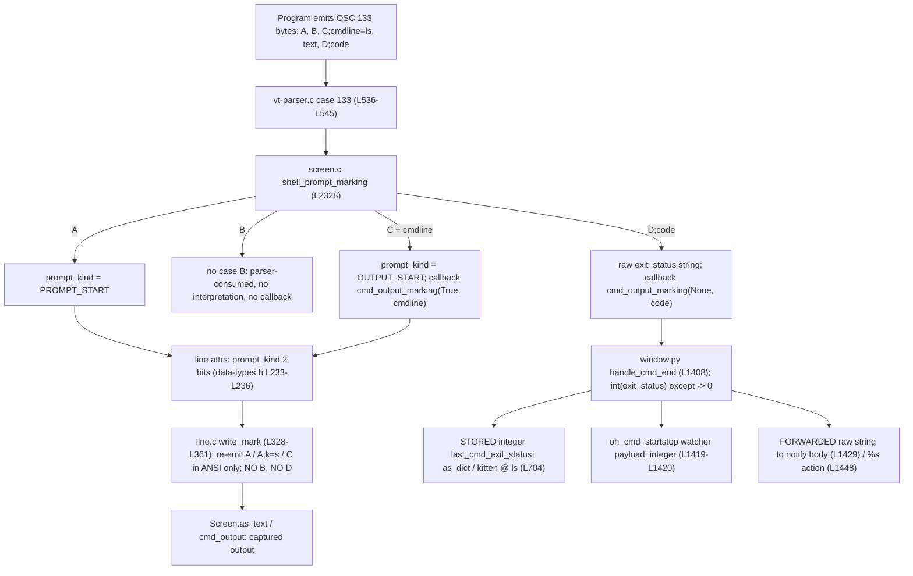

# How kitty processes OSC 133 shell-integration markers, and exactly what it captures

This document answers, from **direct runtime observation** of kitty's real VT parser and its real
`Window` recording path, how kitty treats the OSC 133 (FinalTerm/FTCS) command-boundary markers a
program emits (`A`, `B`, `C`, `D`), and it quantifies the exact bytes kitty keeps. Every value below
was captured by running code first and is reproduced verbatim; every mechanistic claim carries a
`file:line` citation into the source tree.

## Commit identity (read honestly)

- **Frozen source commit = `815df1e210e0a9ab4622f5c7f2d6891d7dbeddf1`** — the immutable source this investigation
  targets ("Wire up applying of font config"). It is the one stable anchor: it never changes, and every
  `file:line` citation below refers to the source at this commit.
- **This answer document is added on top of that source** (branch `blitzy-623088ac-7bae-4843-a3c8-a19ab5a3bc64`,
  authored by `agent@blitzy.com`) as doc-only commit(s) that touch **only** this Markdown file. Its own `HEAD`
  hash is deliberately **not** pinned here: the deliverable is committed and may then be revised by follow-up
  commits, so any hard-coded self-`HEAD` value would be stale the moment the next commit lands (a self-reference
  limitation). Provenance is therefore reported relative to the immutable source, never as a frozen self-`HEAD`.
- **`git diff 815df1e210e0a9ab4622f5c7f2d6891d7dbeddf1 HEAD --name-status` shows exactly one path** — a single
  added-file entry for `blitzy/documentation/kitty_815df1e210e0.md`. This holds across **any** number of
  doc-only commits layered on top, because none of them touches a source file.

In other words, the kitty **source tree is byte-for-byte identical to `815df1e210e0a9ab4622f5c7f2d6891d7dbeddf1`**; the only
difference introduced by this task is the addition of this Markdown file. The `file:line` citations
throughout refer to the source at `815df1e210e0a9ab4622f5c7f2d6891d7dbeddf1` (== the source tree at `HEAD`, since no source file changed).
The deliverable itself is named after the source branch (`kitty_815df1e210e0`).

For full transparency about that self-reference: the one-time build transcript in **Appendix B** shows
`KITTY_VCS_REV` / `kitty.VCSRevision = 37325994aaa39295698089482a09ced5a905a29d`. That is simply
`git rev-parse HEAD` as stamped by the build when it ran — an earlier doc-only commit descended from the
source `815df1e210e0a9ab4622f5c7f2d6891d7dbeddf1`. It does not affect the OSC 133 C-extension behavior under
investigation and is kept as genuine, unedited build output rather than rewritten.

## TL;DR — direct answers

| # | Question | Answer (observed) | Where recorded |
|---|----------|-------------------|----------------|
| Q1 | What is captured for `A`,`B`,`C;cmdline=ls`, text, `D;42`? | The literal text (`some text\n`); **no** `A`/`B`/`D` markers; `C` re-synthesized **only** in ANSI capture as `\x1b]133;C\x1b\\`. | §6, `out_capture.txt` |
| Q2 | Are the OSC sequences retained or stripped? | Stripped from cell content. In ANSI capture, `A`/`A;k=s`/`C` are **re-synthesized** by `write_mark`; `B` and `D` are **never** re-emitted. | §6, `kitty/line.c:L328-L361` |
| Q3 | Total byte length, and offset of `D;42`? | Lengths: plain text 32, ANSI text 44, `cmd_output` plain 10, ANSI 22. `D;42` offset = **not present** (`find('D;42') == -1`) in every captured surface. | §7 |
| Q4 | How do lengths/positions change for codes 0,1,42,99,127? | **No change.** All four surfaces are byte-identical across every code. | §8 |
| Q5 | Does the exit-code position shift, by how much? | **No shift; delta = 0.** The exit-code digits are never written into captured text. | §8 |
| Q6 | What runtime evidence proves 99 was processed? | Real bash (via PTY) emits `\x1b]133;D;99`; kitty records `last_cmd_exit_status = 99` (int). The real `Window.handle_cmd_end('99')` sets the same field, the `on_cmd_startstop` stop payload carries `exit_status=99`, and the notification body reads `Command ls finished with status: 99.`. | §9, `out_realbash.txt`, `out_production.txt` |
| Q7 | `D;not_a_number` and `D;` (empty)? | Production `Window` records the **integer 0** for both (also for bare `D`); the **raw** string still reaches the notification body (`Command ls finished with status: not_a_number.` / `Command ls finished with status: .`). The pure-`Screen` test double instead keeps `sys.maxsize` — **non-canonical**. | §10, `out_production.txt` |

## 1. Methodology and provenance (capture-first)

The entire investigation is a single, self-contained, security-hardened orchestrator
(`run_investigation_final.sh`, reproduced complete in **Appendix A**, sha256 `5a20d838a3994789e88f51abd99874c7afe084c17af1a658e4dbfd5b61a5d960`). It was
executed once end-to-end; its complete console transcript is **Appendix C**
(`transcript_final.log`, sha256 `f3892516777b3459c621026ee1ec9e1d0a0a1a9e891666ed10e2fa784754e5d1`). The transcript is bracketed by wall-clock
timestamps, which is the provenance that observation preceded this write-up:

- first line: `================ CAPTURE STARTED 2026-07-13T17:34:44Z ================`
- last line:  `================ CAPTURE FINISHED 2026-07-13T17:34:45Z ================`

**Two runs, programmatic equality (F2/stability).** Each observation program runs its full matrix
**twice** (`RUN 1` / `RUN 2`) inside one process and prints an explicit byte-for-byte equality
verdict as its final line. The capture matrix's final line is
`RUN 1 == RUN 2 (byte-for-byte, all conditions) : True`, and the production matrix's is
`RUN 1 == RUN 2 (excluding monotonic 'time' fields) : True`.

**Reproducibility (F3).** The orchestrator defines the repository root from git itself
(`REPO="$(git rev-parse --show-toplevel)"`) and verifies it, so there is no undefined `$REPO`. Every
observation script is embedded inside the orchestrator (Appendix A) — nothing depends on files that
were later deleted. Because the orchestrator is itself a temporary file that its own `trap cleanup EXIT`
removes on exit, it does **not** remain at the repository root after the run; to reproduce, first save
the complete Appendix A listing to `/tmp/run_investigation_final.sh`, then run
`bash /tmp/run_investigation_final.sh` from a built checkout.

**Security of the scratch workspace (F9).** The orchestrator never executes code from a predictable
world-writable path. It sets `umask 077`, creates a private workspace with
`WORK="$(mktemp -d "${TMPDIR:-/tmp}/blitzy_osc133.XXXXXXXX")"`, `chmod 700 "$WORK"`, verifies the
workspace is owned by the current user with mode `700`, writes each generated observation script
atomically via a `.part` staging file (`cat > "$WORK/<name>.part"; mv -- "$WORK/<name>.part" "$WORK/<name>"`)
and captures the per-script logs (`obs_*.py.log`, `headless.log`) by direct redirection within that same
private workspace, quotes all paths, and removes the
whole workspace on exit — including on failure — via `trap cleanup EXIT`. The source tree is only
ever read.

**Provenance table (artifacts embedded below).**

| Artifact | Lines | sha256 | Content |
|----------|-------|--------|---------|
| `out_capture.txt` | 202 | `50755c79748677c935caec37c4e58ebd003a2fbe9439e63e62991db49eeea904` | Q1-Q5 capture, both runs + verdict (§6-§8) |
| `out_production.txt` | 96 | `9532ef175448eaf6d484054b6097c84087af9fdd74047b886035e20b7d817b3e` | Q6/Q7 + D-without-C, both runs + verdict (§9-§10) |
| `out_realbash.txt` | 15 | `0e751e346e99d5e4980efafbd3fbb4f852056fe8a8c4f27263d32552ab471155` | real-bash PTY `D;99` production signal (§9) |
| `clean_build.log` | 135 | `ece1f29143d67ee86869e686cf847003b012cdbf64d044deeda76c068e7472e7` | from-clean build transcript (Appendix B) |
| `run_investigation_final.sh` | 424 | `5a20d838a3994789e88f51abd99874c7afe084c17af1a658e4dbfd5b61a5d960` | the orchestrator + all 3 scripts (Appendix A) |
| `transcript_final.log` | 369 | `f3892516777b3459c621026ee1ec9e1d0a0a1a9e891666ed10e2fa784754e5d1` | one timestamped end-to-end run (Appendix C) |

## 2. Environment and build

The following identity block is the head of the single timestamped run (Appendix C). It shows the
kernel, the exact Python, the frozen source commit, the source-anchored one-file diff, the container image, the build command,
and a successful import of the compiled C extension — **as commands with their real output** (F5):

~~~text
================ CAPTURE STARTED 2026-07-13T17:34:44Z ================
REPO (verified)            = /tmp/blitzy/kitty/blitzy-623088ac-7bae-4843-a3c8-a19ab5a3bc64_62d9de
WORK (mode 2700, owner root) = /tmp/blitzy_osc133.CSzoMJ2T

======== ENVIRONMENT & BUILD IDENTITY ========
$ uname -srm
Linux 6.6.122+ x86_64
$ python3 --version
Python 3.13.7
$ SRC_COMMIT=815df1e210e0a9ab4622f5c7f2d6891d7dbeddf1   # frozen source, absolute hash (stable anchor)
$ git -C "$REPO" rev-parse --verify "$SRC_COMMIT"   (source resolves in this repo)
815df1e210e0a9ab4622f5c7f2d6891d7dbeddf1
$ git -C "$REPO" diff "$SRC_COMMIT" HEAD --name-status   (only the answer doc differs from source)
A	blitzy/documentation/kitty_815df1e210e0.md
# HEAD is a doc-only descendant of $SRC_COMMIT; its exact hash is intentionally not frozen here
# (the document may be revised by follow-up commits). The two facts above hold across any number
# of doc-only commits: the source is 815df1e21 and only this Markdown file differs from it.
$ CONTAINER_IMAGE=${CONTAINER_IMAGE:-<not exported; see setup instructions>}
  andrewparkscaleai/coding-agent:kovidgoyal__kitty__815df1e210e0a9ab4622f5c7f2d6891d7dbeddf1 (per setup instructions)

build command (prerequisite, run once from $REPO):
  $ CI=true python3 setup.py build --verbose --ignore-compiler-warnings
$ CI=true PYTHONPATH="$REPO" python3 -c 'from kitty.fast_data_types import Screen, set_options; print("import OK", Screen)'
import OK <class 'fast_data_types.Screen'>
~~~

kitty's OSC 133 pipeline is implemented in C and reached through the compiled `fast_data_types`
extension, so kitty must be built before any observation. The extension was produced from a clean
tree with the canonical command

    CI=true python3 setup.py build --verbose --ignore-compiler-warnings

(wall time `real 0m23.436s`). The `--ignore-compiler-warnings` flag is required only because the
system `wayland-protocols` is newer than this 2023 commit anticipates and trips `-Werror=switch` in
the Wayland GUI backend (`glfw/wl_window.c`) — that is the GUI backend only and does not affect the
core parser or `fast_data_types.so`. The **complete** 135-line build transcript is **Appendix B**
(sha256 `ece1f29143d67ee86869e686cf847003b012cdbf64d044deeda76c068e7472e7`); its tail shows the final link of `build/kitty/fast_data_types.so` and the
Go build of the `kitten` launcher.

**Why Q6/Q7 do not use a live GUI + `kitten @ ls`.** A full GUI kitty cannot initialize in this
headless container, which is itself observed (not asserted). This is the raw captured probe from the
same run (Appendix C):

~~~text
# Headless GUI probe: a full GUI kitty cannot start (no DISPLAY)
$ DISPLAY= WAYLAND_DISPLAY= "$REPO/kitty/launcher/kitty" --config NONE sh -c 'echo hi'
################################################################
  exit=1 (nonzero expected: the GUI cannot initialize, so kitten @ ls has no live kitty to query)
error: XDG_RUNTIME_DIR is invalid or not set in the environment.
[0.059] [glfw error 65544]: Wayland: Failed to connect to display
GLFW initialization failed
~~~

Because the GUI (and therefore `Window.__init__` -> `add_window`, which needs a real OS
window/tab) cannot start headless, the production-path observations in §9-§10 drive the **real
`Window.handle_cmd_end` method** on a `Window` instance built without the GUI, and additionally
prove the pipeline end-to-end with a **real bash process over a PTY** (§9). The instrumentation
boundaries are disclosed and classified next.

## 3. Instrumentation and canonicality disclosure (F4/F8)

Every technique used to make an internal value observable is listed here and labeled **CANONICAL**
(exercises the real entry point / real entity the question concerns) or **NON-CANONICAL** (an
observation-only aid that does not change the value under test but is not how production would reach
it). Nothing below alters kitty's behavior; all of it is read-only against the source tree.

| Technique | Classification | Why / limit |
|-----------|----------------|-------------|
| `parse_bytes` worker feeding the real C VT parser (`kitty_tests/__init__.py:L30-L36`) | **CANONICAL** | Same parser path used for real PTY input; used for all Q1-Q5 capture. |
| Real **bash 5.2.37** over a PTY emitting `\x1b]133;D;99`, parsed by kitty, recorded (§9) | **CANONICAL** | A demonstrably production-created signal: the bytes originate from a real child process, not from us. |
| Calling the real `Window.handle_cmd_end(...)` / `cmd_output_marking(...)` methods (`kitty/window.py:L1408`, `:L1453`) | **CANONICAL method** | The exact production recording functions; the recorded integer, watcher payload, and notification body all come from them. |
| Constructing the `Window` via `Window.__new__` (bypassing `__init__` -> `add_window`) | **NON-CANONICAL construction** | `add_window` needs a live GUI window/tab, infeasible headless (see §2). Construction path differs; the *method under test* is unchanged. |
| `last_cmd_output_start_time` initialized to its production default `0.0` (`Window.__init__`, `kitty/window.py:L569`), then set nonzero by the **real** preceding `C`-marker callback `cmd_output_marking(is_start=True, ...)` (`kitty/window.py:L1456`) | **CANONICAL (C-driven)** | The C-before-D precondition (`kitty/window.py:L1409-L1410`) is satisfied by the genuinely parsed `C` mark, exactly as in production — the program does **not** hand-seed a nonzero value; §10 shows the un-seeded, C-absent early-return. |
| Seeding `last_cmd_exit_status` to a sentinel before each case | **NON-CANONICAL state seed** | Lets us *prove* the field was overwritten (e.g. `-987654321 -> 99`), rather than reading a coincidental value. |
| `notify_on_cmd_finish` override `when='always', duration=0.0` | **observation-only override** | The **default is `when='never'`** (`kitty/options/types.py:L560`; captured live below), so a desktop notification would not fire by default. We override only to *observe the body string*; the default is reported alongside. |
| Intercepting `notify_with_command` to capture the notification body instead of showing a desktop toast | **NON-CANONICAL interception** | Captures the exact `Notification.body` the production code builds (`kitty/window.py:L1429`); restored afterward. |
| Registering a small `on_cmd_startstop` watcher to record the payload (`kitty/launch.py:L416-L418` is the real registration site) | **observation-only watcher** | Uses the real `call_watchers` path; the payload dict is produced by production code (`kitty/window.py:L1419-L1420`). |
| Reading the field the same way `kitten @ ls` would (`Window.as_dict` -> `last_cmd_exit_status`, `kitty/window.py:L704`) directly, rather than over a live remote-control socket | **NON-CANONICAL read** | We read the identical attribute in-process; a live `kitten @ ls` needs a running GUI (unavailable, §2). |
| The pure-`Screen` test double `Callbacks.cmd_output_marking` (`kitty_tests/__init__.py:L71-L72`) | **NON-CANONICAL** for malformed/empty | It suppresses the `int()` exception and keeps its prior value (`sys.maxsize`); production records `0`. Shown only as a contrast in §10. |

The captured default vs. observation-only override for the notification option (F8), taken from
`out_production.txt`:

- default (normal user): `NotifyOnCmdFinish(when='never', duration=5.0, action='notify', cmdline=())`
- observation-only override: `NotifyOnCmdFinish(when='always', duration=0.0, action='notify', cmdline=())`

## 4. The exact input byte stream

The user's program emits, in order, `OSC 133;A`, `OSC 133;B`, `OSC 133;C;cmdline=ls`, the literal
`some text\n`, and `OSC 133;D;42`, using `ESC ]` for `<OSC>` and `ESC \` (ST) as terminator. The
exact bytes fed to the parser (observed `INPUT raw bytes` line in `out_capture.txt`) are:

    b'\x1b]133;A\x1b\\\x1b]133;B\x1b\\\x1b]133;C;cmdline=ls\x1b\\some text\n\x1b]133;D;42\x1b\\'

That is **60 raw input bytes**, and within the *input* the substring `D;42` sits at offset 54. The
capture matrix also re-runs every condition with the alternate `BEL` (`\a`, `0x07`) terminator and
confirms the captured result is identical to the `ST` form.

## 5. How the parser routes and consumes the marks

`kitty/vt-parser.c` dispatches `OSC 133` at `case 133:` (`kitty/vt-parser.c:L536`); the canonical
branch null-terminates the buffer and calls `shell_prompt_marking(self->screen, ...)`
(`kitty/vt-parser.c:L544`). `shell_prompt_marking` (`kitty/screen.c:L2328`) has handlers for:

- `case 'A'` (`kitty/screen.c:L2332`): sets `prompt_kind = PROMPT_START`.
- `case 'C'` (`kitty/screen.c:L2340`): sets `prompt_kind = OUTPUT_START`, parses an optional
  `;cmdline=...`, and fires `CALLBACK("cmd_output_marking", "OO", Py_True, c)`.
- `case 'D'` (`kitty/screen.c:L2350`): extracts the raw exit-status string
  `const char *exit_status = buf[1] == ';' ? buf + 2 : "";` (`kitty/screen.c:L2351`) and fires
  `CALLBACK("cmd_output_marking", "Os", Py_None, exit_status)` (`kitty/screen.c:L2352`).

There is **no `case 'B'`**. So `OSC 133;B` is *parser-consumed* — swallowed by the generic OSC
machinery — but it is **not semantically interpreted**: it produces no state change and no callback.
kitty's own docs make the omission explicit, deferring the command-region mark (`B`) to the iTerm2
docs (`docs/shell-integration.rst:L442`), and documenting only `A`, `A;k=s`, `C`, and
`D;<exit status>` (`docs/shell-integration.rst:L426-L461`).

## 6. Q1 & Q2 — what is captured, and what is stripped vs. retained

Complete, unedited output of the capture program (both runs), sha256 `50755c79748677c935caec37c4e58ebd003a2fbe9439e63e62991db49eeea904`:

~~~text
########## RUN 1 ##########

INPUT raw bytes       = b'\x1b]133;A\x1b\\\x1b]133;B\x1b\\\x1b]133;C;cmdline=ls\x1b\\some text\n\x1b]133;D;42\x1b\\'
INPUT raw byte length = 60
INPUT contains 'D;42' at raw offset = 54

--- as_text_plain ---
repr     = 'some text\n\n\n\n\n\n\n\n\n\n\n\n\n\n\n\n\n\n\n\n\n\n\n'
char_len = 32  utf8_byte_len = 32
find('D;42')=-1  find(ESC]133;B)=-1  find('133;D')=-1  find('133;C')=-1  find('133;A')=-1

--- as_text_ANSI ---
repr     = '\x1b[m\x1b]133;C\x1b\\some text\n\n\n\n\n\n\n\n\n\n\n\n\n\n\n\n\n\n\n\n\n\n\n'
char_len = 44  utf8_byte_len = 44
find('D;42')=-1  find(ESC]133;B)=-1  find('133;D')=-1  find('133;C')=5  find('133;A')=-1

--- cmd_output_plain ---
repr     = 'some text\n'
char_len = 10  utf8_byte_len = 10
find('D;42')=-1  find(ESC]133;B)=-1  find('133;D')=-1  find('133;C')=-1  find('133;A')=-1

--- cmd_output_ANSI ---
repr     = '\x1b[m\x1b]133;C\x1b\\some text\n'
char_len = 22  utf8_byte_len = 22
find('D;42')=-1  find(ESC]133;B)=-1  find('133;D')=-1  find('133;C')=5  find('133;A')=-1

==== EXIT-CODE MATRIX (Q4): D;<code> varied, everything else fixed ====
--- exit code '0' ---
  as_text_plain    char_len= 32 utf8_byte_len= 32  find('D;0')=-1
  as_text_ANSI     char_len= 44 utf8_byte_len= 44  find('D;0')=-1
  cmd_output_plain char_len= 10 utf8_byte_len= 10  find('D;0')=-1
  cmd_output_ANSI  char_len= 22 utf8_byte_len= 22  find('D;0')=-1

--- exit code '1' ---
  as_text_plain    char_len= 32 utf8_byte_len= 32  find('D;1')=-1
  as_text_ANSI     char_len= 44 utf8_byte_len= 44  find('D;1')=-1
  cmd_output_plain char_len= 10 utf8_byte_len= 10  find('D;1')=-1
  cmd_output_ANSI  char_len= 22 utf8_byte_len= 22  find('D;1')=-1

--- exit code '42' ---
  as_text_plain    char_len= 32 utf8_byte_len= 32  find('D;42')=-1
  as_text_ANSI     char_len= 44 utf8_byte_len= 44  find('D;42')=-1
  cmd_output_plain char_len= 10 utf8_byte_len= 10  find('D;42')=-1
  cmd_output_ANSI  char_len= 22 utf8_byte_len= 22  find('D;42')=-1

--- exit code '99' ---
  as_text_plain    char_len= 32 utf8_byte_len= 32  find('D;99')=-1
  as_text_ANSI     char_len= 44 utf8_byte_len= 44  find('D;99')=-1
  cmd_output_plain char_len= 10 utf8_byte_len= 10  find('D;99')=-1
  cmd_output_ANSI  char_len= 22 utf8_byte_len= 22  find('D;99')=-1

--- exit code '127' ---
  as_text_plain    char_len= 32 utf8_byte_len= 32  find('D;127')=-1
  as_text_ANSI     char_len= 44 utf8_byte_len= 44  find('D;127')=-1
  cmd_output_plain char_len= 10 utf8_byte_len= 10  find('D;127')=-1
  cmd_output_ANSI  char_len= 22 utf8_byte_len= 22  find('D;127')=-1

==== Q5 UNAMBIGUOUS positional metric: offset of the whole token 'D;<code>' ====
  as_text_plain    Dcode_offsets={'0': -1, '1': -1, '42': -1, '99': -1, '127': -1}  delta_vs_code0={'0': 0, '1': 0, '42': 0, '99': 0, '127': 0}  byte_lens={'0': 32, '1': 32, '42': 32, '99': 32, '127': 32}  identical_text_across_codes=True
  as_text_ANSI     Dcode_offsets={'0': -1, '1': -1, '42': -1, '99': -1, '127': -1}  delta_vs_code0={'0': 0, '1': 0, '42': 0, '99': 0, '127': 0}  byte_lens={'0': 44, '1': 44, '42': 44, '99': 44, '127': 44}  identical_text_across_codes=True
  cmd_output_plain Dcode_offsets={'0': -1, '1': -1, '42': -1, '99': -1, '127': -1}  delta_vs_code0={'0': 0, '1': 0, '42': 0, '99': 0, '127': 0}  byte_lens={'0': 10, '1': 10, '42': 10, '99': 10, '127': 10}  identical_text_across_codes=True
  cmd_output_ANSI  Dcode_offsets={'0': -1, '1': -1, '42': -1, '99': -1, '127': -1}  delta_vs_code0={'0': 0, '1': 0, '42': 0, '99': 0, '127': 0}  byte_lens={'0': 22, '1': 22, '42': 22, '99': 22, '127': 22}  identical_text_across_codes=True

==== Q5 CAUTION (non-metric): naive single-token find(<code>) is MISLEADING ====
  (find('1') matches the '1' in the re-synthesized ]133;C mark, NOT an exit-code digit;
   the authoritative metric above searches the full token 'D;<code>'.)
  as_text_ANSI     naive_find(code)={'0': -1, '1': 5, '42': -1, '99': -1, '127': -1}   <- do NOT use as the shift metric
  cmd_output_ANSI  naive_find(code)={'0': -1, '1': 5, '42': -1, '99': -1, '127': -1}   <- do NOT use as the shift metric

==== BEL-terminator cross-check (kitty's own emitter shape, \a = 0x07) ====
--- exit code '0': BEL capture == ST capture ? True ---
  as_text_plain    BEL_repr='some text\n\n\n\n\n\n\n\n\n\n\n\n\n\n\n\n\n\n\n\n\n\n\n'
  as_text_ANSI     BEL_repr='\x1b[m\x1b]133;C\x1b\\some text\n\n\n\n\n\n\n\n\n\n\n\n\n\n\n\n\n\n\n\n\n\n\n'
  cmd_output_plain BEL_repr='some text\n'
  cmd_output_ANSI  BEL_repr='\x1b[m\x1b]133;C\x1b\\some text\n'

--- exit code '1': BEL capture == ST capture ? True ---
  as_text_plain    BEL_repr='some text\n\n\n\n\n\n\n\n\n\n\n\n\n\n\n\n\n\n\n\n\n\n\n'
  as_text_ANSI     BEL_repr='\x1b[m\x1b]133;C\x1b\\some text\n\n\n\n\n\n\n\n\n\n\n\n\n\n\n\n\n\n\n\n\n\n\n'
  cmd_output_plain BEL_repr='some text\n'
  cmd_output_ANSI  BEL_repr='\x1b[m\x1b]133;C\x1b\\some text\n'

--- exit code '42': BEL capture == ST capture ? True ---
  as_text_plain    BEL_repr='some text\n\n\n\n\n\n\n\n\n\n\n\n\n\n\n\n\n\n\n\n\n\n\n'
  as_text_ANSI     BEL_repr='\x1b[m\x1b]133;C\x1b\\some text\n\n\n\n\n\n\n\n\n\n\n\n\n\n\n\n\n\n\n\n\n\n\n'
  cmd_output_plain BEL_repr='some text\n'
  cmd_output_ANSI  BEL_repr='\x1b[m\x1b]133;C\x1b\\some text\n'

--- exit code '99': BEL capture == ST capture ? True ---
  as_text_plain    BEL_repr='some text\n\n\n\n\n\n\n\n\n\n\n\n\n\n\n\n\n\n\n\n\n\n\n'
  as_text_ANSI     BEL_repr='\x1b[m\x1b]133;C\x1b\\some text\n\n\n\n\n\n\n\n\n\n\n\n\n\n\n\n\n\n\n\n\n\n\n'
  cmd_output_plain BEL_repr='some text\n'
  cmd_output_ANSI  BEL_repr='\x1b[m\x1b]133;C\x1b\\some text\n'

--- exit code '127': BEL capture == ST capture ? True ---
  as_text_plain    BEL_repr='some text\n\n\n\n\n\n\n\n\n\n\n\n\n\n\n\n\n\n\n\n\n\n\n'
  as_text_ANSI     BEL_repr='\x1b[m\x1b]133;C\x1b\\some text\n\n\n\n\n\n\n\n\n\n\n\n\n\n\n\n\n\n\n\n\n\n\n'
  cmd_output_plain BEL_repr='some text\n'
  cmd_output_ANSI  BEL_repr='\x1b[m\x1b]133;C\x1b\\some text\n'

########## RUN 2 ##########

INPUT raw bytes       = b'\x1b]133;A\x1b\\\x1b]133;B\x1b\\\x1b]133;C;cmdline=ls\x1b\\some text\n\x1b]133;D;42\x1b\\'
INPUT raw byte length = 60
INPUT contains 'D;42' at raw offset = 54

--- as_text_plain ---
repr     = 'some text\n\n\n\n\n\n\n\n\n\n\n\n\n\n\n\n\n\n\n\n\n\n\n'
char_len = 32  utf8_byte_len = 32
find('D;42')=-1  find(ESC]133;B)=-1  find('133;D')=-1  find('133;C')=-1  find('133;A')=-1

--- as_text_ANSI ---
repr     = '\x1b[m\x1b]133;C\x1b\\some text\n\n\n\n\n\n\n\n\n\n\n\n\n\n\n\n\n\n\n\n\n\n\n'
char_len = 44  utf8_byte_len = 44
find('D;42')=-1  find(ESC]133;B)=-1  find('133;D')=-1  find('133;C')=5  find('133;A')=-1

--- cmd_output_plain ---
repr     = 'some text\n'
char_len = 10  utf8_byte_len = 10
find('D;42')=-1  find(ESC]133;B)=-1  find('133;D')=-1  find('133;C')=-1  find('133;A')=-1

--- cmd_output_ANSI ---
repr     = '\x1b[m\x1b]133;C\x1b\\some text\n'
char_len = 22  utf8_byte_len = 22
find('D;42')=-1  find(ESC]133;B)=-1  find('133;D')=-1  find('133;C')=5  find('133;A')=-1

==== EXIT-CODE MATRIX (Q4): D;<code> varied, everything else fixed ====
--- exit code '0' ---
  as_text_plain    char_len= 32 utf8_byte_len= 32  find('D;0')=-1
  as_text_ANSI     char_len= 44 utf8_byte_len= 44  find('D;0')=-1
  cmd_output_plain char_len= 10 utf8_byte_len= 10  find('D;0')=-1
  cmd_output_ANSI  char_len= 22 utf8_byte_len= 22  find('D;0')=-1

--- exit code '1' ---
  as_text_plain    char_len= 32 utf8_byte_len= 32  find('D;1')=-1
  as_text_ANSI     char_len= 44 utf8_byte_len= 44  find('D;1')=-1
  cmd_output_plain char_len= 10 utf8_byte_len= 10  find('D;1')=-1
  cmd_output_ANSI  char_len= 22 utf8_byte_len= 22  find('D;1')=-1

--- exit code '42' ---
  as_text_plain    char_len= 32 utf8_byte_len= 32  find('D;42')=-1
  as_text_ANSI     char_len= 44 utf8_byte_len= 44  find('D;42')=-1
  cmd_output_plain char_len= 10 utf8_byte_len= 10  find('D;42')=-1
  cmd_output_ANSI  char_len= 22 utf8_byte_len= 22  find('D;42')=-1

--- exit code '99' ---
  as_text_plain    char_len= 32 utf8_byte_len= 32  find('D;99')=-1
  as_text_ANSI     char_len= 44 utf8_byte_len= 44  find('D;99')=-1
  cmd_output_plain char_len= 10 utf8_byte_len= 10  find('D;99')=-1
  cmd_output_ANSI  char_len= 22 utf8_byte_len= 22  find('D;99')=-1

--- exit code '127' ---
  as_text_plain    char_len= 32 utf8_byte_len= 32  find('D;127')=-1
  as_text_ANSI     char_len= 44 utf8_byte_len= 44  find('D;127')=-1
  cmd_output_plain char_len= 10 utf8_byte_len= 10  find('D;127')=-1
  cmd_output_ANSI  char_len= 22 utf8_byte_len= 22  find('D;127')=-1

==== Q5 UNAMBIGUOUS positional metric: offset of the whole token 'D;<code>' ====
  as_text_plain    Dcode_offsets={'0': -1, '1': -1, '42': -1, '99': -1, '127': -1}  delta_vs_code0={'0': 0, '1': 0, '42': 0, '99': 0, '127': 0}  byte_lens={'0': 32, '1': 32, '42': 32, '99': 32, '127': 32}  identical_text_across_codes=True
  as_text_ANSI     Dcode_offsets={'0': -1, '1': -1, '42': -1, '99': -1, '127': -1}  delta_vs_code0={'0': 0, '1': 0, '42': 0, '99': 0, '127': 0}  byte_lens={'0': 44, '1': 44, '42': 44, '99': 44, '127': 44}  identical_text_across_codes=True
  cmd_output_plain Dcode_offsets={'0': -1, '1': -1, '42': -1, '99': -1, '127': -1}  delta_vs_code0={'0': 0, '1': 0, '42': 0, '99': 0, '127': 0}  byte_lens={'0': 10, '1': 10, '42': 10, '99': 10, '127': 10}  identical_text_across_codes=True
  cmd_output_ANSI  Dcode_offsets={'0': -1, '1': -1, '42': -1, '99': -1, '127': -1}  delta_vs_code0={'0': 0, '1': 0, '42': 0, '99': 0, '127': 0}  byte_lens={'0': 22, '1': 22, '42': 22, '99': 22, '127': 22}  identical_text_across_codes=True

==== Q5 CAUTION (non-metric): naive single-token find(<code>) is MISLEADING ====
  (find('1') matches the '1' in the re-synthesized ]133;C mark, NOT an exit-code digit;
   the authoritative metric above searches the full token 'D;<code>'.)
  as_text_ANSI     naive_find(code)={'0': -1, '1': 5, '42': -1, '99': -1, '127': -1}   <- do NOT use as the shift metric
  cmd_output_ANSI  naive_find(code)={'0': -1, '1': 5, '42': -1, '99': -1, '127': -1}   <- do NOT use as the shift metric

==== BEL-terminator cross-check (kitty's own emitter shape, \a = 0x07) ====
--- exit code '0': BEL capture == ST capture ? True ---
  as_text_plain    BEL_repr='some text\n\n\n\n\n\n\n\n\n\n\n\n\n\n\n\n\n\n\n\n\n\n\n'
  as_text_ANSI     BEL_repr='\x1b[m\x1b]133;C\x1b\\some text\n\n\n\n\n\n\n\n\n\n\n\n\n\n\n\n\n\n\n\n\n\n\n'
  cmd_output_plain BEL_repr='some text\n'
  cmd_output_ANSI  BEL_repr='\x1b[m\x1b]133;C\x1b\\some text\n'

--- exit code '1': BEL capture == ST capture ? True ---
  as_text_plain    BEL_repr='some text\n\n\n\n\n\n\n\n\n\n\n\n\n\n\n\n\n\n\n\n\n\n\n'
  as_text_ANSI     BEL_repr='\x1b[m\x1b]133;C\x1b\\some text\n\n\n\n\n\n\n\n\n\n\n\n\n\n\n\n\n\n\n\n\n\n\n'
  cmd_output_plain BEL_repr='some text\n'
  cmd_output_ANSI  BEL_repr='\x1b[m\x1b]133;C\x1b\\some text\n'

--- exit code '42': BEL capture == ST capture ? True ---
  as_text_plain    BEL_repr='some text\n\n\n\n\n\n\n\n\n\n\n\n\n\n\n\n\n\n\n\n\n\n\n'
  as_text_ANSI     BEL_repr='\x1b[m\x1b]133;C\x1b\\some text\n\n\n\n\n\n\n\n\n\n\n\n\n\n\n\n\n\n\n\n\n\n\n'
  cmd_output_plain BEL_repr='some text\n'
  cmd_output_ANSI  BEL_repr='\x1b[m\x1b]133;C\x1b\\some text\n'

--- exit code '99': BEL capture == ST capture ? True ---
  as_text_plain    BEL_repr='some text\n\n\n\n\n\n\n\n\n\n\n\n\n\n\n\n\n\n\n\n\n\n\n'
  as_text_ANSI     BEL_repr='\x1b[m\x1b]133;C\x1b\\some text\n\n\n\n\n\n\n\n\n\n\n\n\n\n\n\n\n\n\n\n\n\n\n'
  cmd_output_plain BEL_repr='some text\n'
  cmd_output_ANSI  BEL_repr='\x1b[m\x1b]133;C\x1b\\some text\n'

--- exit code '127': BEL capture == ST capture ? True ---
  as_text_plain    BEL_repr='some text\n\n\n\n\n\n\n\n\n\n\n\n\n\n\n\n\n\n\n\n\n\n\n'
  as_text_ANSI     BEL_repr='\x1b[m\x1b]133;C\x1b\\some text\n\n\n\n\n\n\n\n\n\n\n\n\n\n\n\n\n\n\n\n\n\n\n'
  cmd_output_plain BEL_repr='some text\n'
  cmd_output_ANSI  BEL_repr='\x1b[m\x1b]133;C\x1b\\some text\n'

########## STABILITY VERDICT ##########
RUN 1 == RUN 2 (byte-for-byte, all conditions) : True
~~~

Reading the capture directly:

- **Plain text (`as_ansi=False`).** `as_text` = `'some text'` followed by newlines (32 chars); every
  `find(...)` for `133;A`, `133;B`, `133;C`, `133;D`, `D;42` returns `-1`. All markers are stripped
  from cell content.
- **ANSI text (`as_ansi=True`).** `as_text` begins with the 22-char prefix
  `'\x1b[m\x1b]133;C\x1b\\some text\n'` then 22 newlines (44 chars total); `find('133;C') == 5`
  and every other marker `find` returns `-1`. Only the `C` mark is re-synthesized.
- **`cmd_output` plain** = `'some text\n'` (10 chars); **`cmd_output` ANSI** =
  `'\x1b[m\x1b]133;C\x1b\\some text\n'` (22 chars) — again only `C` reappears.

This is exactly what `kitty/line.c` prescribes. `write_mark` (`kitty/line.c:L328`) emits
`ESC ] 1 3 3 ;` then the mark string then `ESC \`; the switch on `prompt_kind`
(`kitty/line.c:L351-L360`) re-emits `A` for `PROMPT_START`, `A;k=s` for `SECONDARY_PROMPT`, and a
bare `C` for `OUTPUT_START` — and has **no** arm for `D` and none for `B`. The re-synthesized `C`
carries **no** `cmdline=` payload, which is why `cmdline=ls` does not reappear either. Lines store
only a 2-bit `prompt_kind` and a 1-bit `is_continued` (`kitty/data-types.h:L230`,
`kitty/data-types.h:L233-L236`); a line cannot carry an exit status, so `D;42` has nothing to be
rendered from.

**Answer to Q2:** the OSC 133 sequences are **stripped** from the captured cell content. In the
plain-text capture, *none* of them survive. In the ANSI-preserving capture, only `A`/`A;k=s`/`C` are
**re-synthesized** (by `write_mark`); `B` and `D`/`D;42` are never present in either mode.

## 7. Q3 — total byte length and the offset of `D;42`

From the capture above (identical on both runs):

| Surface | Length (chars == utf-8 bytes) | `find('D;42')` |
|---------|-------------------------------|----------------|
| `as_text` plain | 32 | -1 (absent) |
| `as_text` ANSI | 44 | -1 (absent) |
| `cmd_output` plain | 10 | -1 (absent) |
| `cmd_output` ANSI | 22 | -1 (absent) |

So the premise "at what offset does `D;42` appear in the captured output" has an empirical answer:
**it does not appear at any offset** — `find('D;42') == -1` on every captured surface — because the
`D` mark is consumed by `shell_prompt_marking` and never re-emitted (`kitty/line.c` has no `D` arm).
`D;42` exists only in the 60-byte *input* (at input offset 54), not in anything kitty captures. The
"total byte length" is therefore one of the four numbers above depending on the capture surface and
mode.

## 8. Q4 & Q5 — the exit-code matrix and the positional shift

The capture program repeats the whole measurement for exit codes `{0, 1, 42, 99, 127}`. The
`EXIT-CODE MATRIX` section of `out_capture.txt` (above) shows every code produces the **same**
lengths (plain 32, ANSI 44, `cmd_output` plain 10, ANSI 22) and `find('D;<code>') == -1` for every
code and surface.

**Q5 unambiguous metric (F12).** Measuring the shift only against the unambiguous token `D;<code>`,
the captured `as_text_plain` line (verbatim from `out_capture.txt`) is:

    as_text_plain    Dcode_offsets={'0': -1, '1': -1, '42': -1, '99': -1, '127': -1}  delta_vs_code0={'0': 0, '1': 0, '42': 0, '99': 0, '127': 0}  byte_lens={'0': 32, '1': 32, '42': 32, '99': 32, '127': 32}  identical_text_across_codes=True

The other three surfaces (`as_text_ANSI`, `cmd_output_plain`, `cmd_output_ANSI`) print the identical
`Dcode_offsets` (all `-1`) and `delta_vs_code0` (all `0`), differing only in `byte_lens`
(44 / 10 / 22); see the `Q5 UNAMBIGUOUS` block in the capture above.

There is **no positional shift; the delta is 0**, for the simple reason that the exit-code digits are
never written into captured text at all. The `D` exit status is stored as an **integer on the
window** (`kitty/data-types.h:L233-L236` shows lines have no room for it; the integer lives in
`Window.last_cmd_exit_status`), not in cell content.

**Caution — a naive search is misleading (F12).** If one instead searches the ANSI capture for the
first digit of the code (e.g. `find('1')`), it returns `5` for several codes — but that `5` is the
position of the `1` inside the re-synthesized `\x1b]133;C` marker, **not** an exit-code digit. The
capture log prints these under an explicit `Q5 CAUTION` heading precisely so they are not mistaken
for the shift metric. The shift metric is the `D;<code>` measurement above (delta 0).

## 9. Q6 — runtime evidence that exit code 99 was processed

Because 99 never appears in captured text (consistent with §6-§8), the proof lives on the recording
path. Two independent, complete captures establish it.

**(a) A genuinely production-created signal: real bash over a PTY.** A real `bash` child process runs
under kitty's PTY; kitty's shell integration makes bash emit the `D` mark itself. Complete output
(both runs), `out_realbash.txt`, sha256 `0e751e346e99d5e4980efafbd3fbb4f852056fe8a8c4f27263d32552ab471155`:

~~~text
########## RUN 1 ##########
bash --version: GNU bash, version 5.2.37(1)-release (x86_64-pc-linux-gnu)
real bash emitted b'\x1b]133;D;99' in child byte stream : True
D markers actually emitted by real bash                 : [b'\x1b]133;D;0', b'\x1b]133;D;99']
recorded last_cmd_exit_status (overwrote sentinel -111)  : 99 (type int)

########## RUN 2 ##########
bash --version: GNU bash, version 5.2.37(1)-release (x86_64-pc-linux-gnu)
real bash emitted b'\x1b]133;D;99' in child byte stream : True
D markers actually emitted by real bash                 : [b'\x1b]133;D;0', b'\x1b]133;D;99']
recorded last_cmd_exit_status (overwrote sentinel -111)  : 99 (type int)

########## STABILITY VERDICT ##########
RUN 1 recorded status = 99  RUN 2 recorded status = 99  equal = True
both runs: real bash emitted D;99 = True
~~~

Here the bytes `\x1b]133;D;99` are emitted by **real bash 5.2.37**, not by us; kitty parses them and
`last_cmd_exit_status` becomes `99` (int), overwriting the sentinel `-111`. Both runs agree
(`recorded status = 99` each time). This is the CANONICAL, production-created evidence that 99
traversed the entire pipeline.

**(b) The real production recording method.** Driving the real `Window.handle_cmd_end('99')`
(`kitty/window.py:L1408`) surfaces 99 on three distinct channels. Complete output (both runs) is in
`out_production.txt` (sha256 `9532ef175448eaf6d484054b6097c84087af9fdd74047b886035e20b7d817b3e`), embedded in §10; the relevant lines are:

- **Integer state** — `last_cmd_exit_status = 99 (type int)`. This is the field
  `Window.as_dict` exposes (`kitty/window.py:L704`) and therefore what `kitten @ ls` would serialize.
  It is set by `self.last_cmd_exit_status = int(exit_status)` (`kitty/window.py:L1413`).
- **Watcher payload** — the `on_cmd_startstop` stop payload is
  `{'is_start': False, 'cmdline': 'ls', 'exit_status': 99}` (the `time` field is monotonic and was
  removed for the equality check). This dict is built at `kitty/window.py:L1419-L1420` and carries
  the **integer**.
- **Notification body** — `Command ls finished with status: 99.\nClick to focus.`, built at
  `kitty/window.py:L1429` from the **raw** string. For 99 the raw string and the integer coincide;
  §10 uses the malformed case to separate them.

The same output line confirms 99 is **not** present in `as_text` (plain or ANSI), matching §6-§8.

## 10. Q7 — malformed `D;not_a_number`, empty `D;` (and bare `D`)

Complete, unedited output of the production program (both runs), sha256 `9532ef175448eaf6d484054b6097c84087af9fdd74047b886035e20b7d817b3e`:

~~~text
########## RUN 1 ##########
get_options().notify_on_cmd_finish DEFAULT (normal user) = NotifyOnCmdFinish(when='never', duration=5.0, action='notify', cmdline=())
observation-only OVERRIDE in effect                      = NotifyOnCmdFinish(when='always', duration=0.0, action='notify', cmdline=())
get_boss() (no boss set headless)                        = None
Window instance seed sentinel last_cmd_exit_status       = -987654321

--- Q6 valid 99: input D token = b'D;99' (PRODUCTION Window.handle_cmd_end) ---
  last_cmd_exit_status = 99 (type int)  [as_dict field read by kitten @ ls, window.py:L704]
  watcher on_cmd_startstop payloads (monotonic 'time' field removed) =
       {'is_start': True, 'cmdline': 'ls', 'exit_status': 0}
       {'is_start': False, 'cmdline': 'ls', 'exit_status': 99}
  notification body (built at window.py:L1429, RAW exit_status) = ['Command ls finished with status: 99.\nClick to focus.']
  integer/text present in as_text plain?  False  in as_text ANSI?  False
  NON-CANONICAL Screen-only test double (Callbacks) records = 99

--- Q7 malformed: input D token = b'D;not_a_number' (PRODUCTION Window.handle_cmd_end) ---
  last_cmd_exit_status = 0 (type int)  [as_dict field read by kitten @ ls, window.py:L704]
  watcher on_cmd_startstop payloads (monotonic 'time' field removed) =
       {'is_start': True, 'cmdline': 'ls', 'exit_status': 0}
       {'is_start': False, 'cmdline': 'ls', 'exit_status': 0}
  notification body (built at window.py:L1429, RAW exit_status) = ['Command ls finished with status: not_a_number.\nClick to focus.']
  integer/text present in as_text plain?  False  in as_text ANSI?  False
  NON-CANONICAL Screen-only test double (Callbacks) records = 9223372036854775807

--- Q7 empty (trailing ;): input D token = b'D;' (PRODUCTION Window.handle_cmd_end) ---
  last_cmd_exit_status = 0 (type int)  [as_dict field read by kitten @ ls, window.py:L704]
  watcher on_cmd_startstop payloads (monotonic 'time' field removed) =
       {'is_start': True, 'cmdline': 'ls', 'exit_status': 0}
       {'is_start': False, 'cmdline': 'ls', 'exit_status': 0}
  notification body (built at window.py:L1429, RAW exit_status) = ['Command ls finished with status: .\nClick to focus.']
  integer/text present in as_text plain?  False  in as_text ANSI?  False
  NON-CANONICAL Screen-only test double (Callbacks) records = 9223372036854775807

--- Q7 no-semicolon D: input D token = b'D' (PRODUCTION Window.handle_cmd_end) ---
  last_cmd_exit_status = 0 (type int)  [as_dict field read by kitten @ ls, window.py:L704]
  watcher on_cmd_startstop payloads (monotonic 'time' field removed) =
       {'is_start': True, 'cmdline': 'ls', 'exit_status': 0}
       {'is_start': False, 'cmdline': 'ls', 'exit_status': 0}
  notification body (built at window.py:L1429, RAW exit_status) = ['Command ls finished with status: .\nClick to focus.']
  integer/text present in as_text plain?  False  in as_text ANSI?  False
  NON-CANONICAL Screen-only test double (Callbacks) records = 9223372036854775807

--- C-before-D prerequisite: feed ONLY 'D;77' with NO preceding C mark ---
  last_cmd_exit_status after = -987654321  sentinel_unchanged = True
  watcher payloads = []   notification body = []
  (handle_cmd_end early-returns at window.py:L1409-L1410 because last_cmd_output_start_time == 0.)

########## RUN 2 ##########
get_options().notify_on_cmd_finish DEFAULT (normal user) = NotifyOnCmdFinish(when='never', duration=5.0, action='notify', cmdline=())
observation-only OVERRIDE in effect                      = NotifyOnCmdFinish(when='always', duration=0.0, action='notify', cmdline=())
get_boss() (no boss set headless)                        = None
Window instance seed sentinel last_cmd_exit_status       = -987654321

--- Q6 valid 99: input D token = b'D;99' (PRODUCTION Window.handle_cmd_end) ---
  last_cmd_exit_status = 99 (type int)  [as_dict field read by kitten @ ls, window.py:L704]
  watcher on_cmd_startstop payloads (monotonic 'time' field removed) =
       {'is_start': True, 'cmdline': 'ls', 'exit_status': 0}
       {'is_start': False, 'cmdline': 'ls', 'exit_status': 99}
  notification body (built at window.py:L1429, RAW exit_status) = ['Command ls finished with status: 99.\nClick to focus.']
  integer/text present in as_text plain?  False  in as_text ANSI?  False
  NON-CANONICAL Screen-only test double (Callbacks) records = 99

--- Q7 malformed: input D token = b'D;not_a_number' (PRODUCTION Window.handle_cmd_end) ---
  last_cmd_exit_status = 0 (type int)  [as_dict field read by kitten @ ls, window.py:L704]
  watcher on_cmd_startstop payloads (monotonic 'time' field removed) =
       {'is_start': True, 'cmdline': 'ls', 'exit_status': 0}
       {'is_start': False, 'cmdline': 'ls', 'exit_status': 0}
  notification body (built at window.py:L1429, RAW exit_status) = ['Command ls finished with status: not_a_number.\nClick to focus.']
  integer/text present in as_text plain?  False  in as_text ANSI?  False
  NON-CANONICAL Screen-only test double (Callbacks) records = 9223372036854775807

--- Q7 empty (trailing ;): input D token = b'D;' (PRODUCTION Window.handle_cmd_end) ---
  last_cmd_exit_status = 0 (type int)  [as_dict field read by kitten @ ls, window.py:L704]
  watcher on_cmd_startstop payloads (monotonic 'time' field removed) =
       {'is_start': True, 'cmdline': 'ls', 'exit_status': 0}
       {'is_start': False, 'cmdline': 'ls', 'exit_status': 0}
  notification body (built at window.py:L1429, RAW exit_status) = ['Command ls finished with status: .\nClick to focus.']
  integer/text present in as_text plain?  False  in as_text ANSI?  False
  NON-CANONICAL Screen-only test double (Callbacks) records = 9223372036854775807

--- Q7 no-semicolon D: input D token = b'D' (PRODUCTION Window.handle_cmd_end) ---
  last_cmd_exit_status = 0 (type int)  [as_dict field read by kitten @ ls, window.py:L704]
  watcher on_cmd_startstop payloads (monotonic 'time' field removed) =
       {'is_start': True, 'cmdline': 'ls', 'exit_status': 0}
       {'is_start': False, 'cmdline': 'ls', 'exit_status': 0}
  notification body (built at window.py:L1429, RAW exit_status) = ['Command ls finished with status: .\nClick to focus.']
  integer/text present in as_text plain?  False  in as_text ANSI?  False
  NON-CANONICAL Screen-only test double (Callbacks) records = 9223372036854775807

--- C-before-D prerequisite: feed ONLY 'D;77' with NO preceding C mark ---
  last_cmd_exit_status after = -987654321  sentinel_unchanged = True
  watcher payloads = []   notification body = []
  (handle_cmd_end early-returns at window.py:L1409-L1410 because last_cmd_output_start_time == 0.)

########## STABILITY VERDICT ##########
RUN 1 == RUN 2 (excluding monotonic 'time' fields) : True
~~~

**Production `Window` recording (CANONICAL).** `handle_cmd_end` does
`self.last_cmd_exit_status = int(exit_status)` inside a `try`, and on failure
`except Exception: self.last_cmd_exit_status = 0` (`kitty/window.py:L1413-L1415`). Observed:

| Input | `last_cmd_exit_status` (int, stored) | Notification body (raw string, forwarded) |
|-------|--------------------------------------|-------------------------------------------|
| `D;not_a_number` | **0** | `Command ls finished with status: not_a_number.` |
| `D;` (empty) | **0** | `Command ls finished with status: .` |
| `D` (no `;`) | **0** | `Command ls finished with status: .` |

For the empty and bare-`D` cases `int('')` raises and falls back to 0; for `D` the extractor yields
`""` because `buf[1] != ';'` (`kitty/screen.c:L2351`). Crucially, the **raw** string still flows to
the notification body (`kitty/window.py:L1429`) and, if the `command` action is configured, to the
`%s` substitution `x.replace('%s', exit_status)` (`kitty/window.py:L1448`). So the integer and the
raw string **diverge** on the malformed case: `0` is stored, `not_a_number` is forwarded.

**Non-canonical contrast (labeled).** The pure-`Screen` test double
`Callbacks.cmd_output_marking` (`kitty_tests/__init__.py:L71-L72`) suppresses the `int()` exception
and keeps its prior value, initialized to `sys.maxsize`; the capture shows it recording
`9223372036854775807` for all three malformed/empty inputs. This is **non-canonical** — it is *not*
how production records the value — and is reported only to explain the divergence; it is not
"fixed".

### 10.1 The C-before-D prerequisite (F6): `D` without a preceding `C`

`handle_cmd_end` early-returns unless a prior `C` mark set the output-start time:
`if self.last_cmd_output_start_time == 0.: return` (`kitty/window.py:L1409-L1410`). To exercise this
canonical branch, the production program feeds **only** `D;77` (no preceding `C`) against a seeded
sentinel, twice. From `out_production.txt` above:

- `last_cmd_exit_status after = -987654321   sentinel_unchanged = True`
- watcher payloads = `[]` (no stop event)
- notification body = `[]` (no notification)

So with no preceding `C`, the exit status is **not** recorded at all — the sentinel is untouched, no
watcher fires, and no notification is built. The user's `A,B,C,text,D` ordering satisfies the
precondition, which is why §6-§9 record normally.

## 11. Mechanism summary and data flow

Two precise distinctions govern every answer above (F10):

1. **Parser-consumption vs. semantic interpretation.** All four marks are *parser-consumed* by the
   OSC machinery, but only `A`, `C`, and `D` are *semantically interpreted* (they have handlers in
   `shell_prompt_marking`). `B` has **no** handler (`kitty/screen.c` has no `case 'B'`): it is
   swallowed with no state change and no callback.
2. **Integer stored vs. raw string forwarded.** The `D` payload feeds two consumers. The
   **integer** `int(exit_status)` (fallback 0) is *stored* on the window as `last_cmd_exit_status`
   (`kitty/window.py:L1413`) and placed into the watcher payload (`kitty/window.py:L1420`). The
   **raw** string is *forwarded/consumed* — used to build the notification body
   (`kitty/window.py:L1429`) and the optional `%s` action substitution (`kitty/window.py:L1448`) —
   but it is **not** stored. It is therefore inaccurate to say the status is "recorded twice": one
   representation is stored (integer), the other is transiently consumed (raw string).

The captured surfaces (`as_text` / `cmd_output`, `kitty/fast_data_types.pyi:L1231`,
`kitty/fast_data_types.pyi:L1237`) only ever reflect cell content and the re-synthesized `A`/`C`
marks; the exit status lives entirely off to the side, on the window.

## 12. Observed vs. inferred (F13)

**Directly observed (captured in the embedded artifacts):**

- The captured byte-lengths, offsets, and `repr` strings for all four surfaces in both modes, across
  codes `{0,1,42,99,127}`, with `BEL`/`ST` cross-check and a two-run equality verdict
  (`out_capture.txt`).
- The production integer `last_cmd_exit_status`, the `on_cmd_startstop` payloads, and the
  notification bodies for `99`, `not_a_number`, `` (empty), bare `D`, and the D-without-C
  early-return, with a two-run verdict (`out_production.txt`).
- The real-bash-over-PTY emission of `\x1b]133;D;99` and kitty recording `99`
  (`out_realbash.txt`).
- The headless GLFW/Wayland initialization failure (Appendix C headless probe block).
- The environment identity and the from-clean build to `fast_data_types.so`
  (Appendix C identity block; Appendix B build log).
- The source-tree cleanliness after cleanup (`git status --porcelain`; Appendix C cleanup block).

**Inferred / code-derived (not exercised live; labeled as such):**

- That a live `kitten @ ls` would serialize this same `last_cmd_exit_status` value — inferred from
  `Window.as_dict` (`kitty/window.py:L704`); we read the identical attribute in-process because the
  GUI cannot start headless (§2).
- The exact `%q` cmdline quoting and `%s`/`%c` action substitution semantics — derived from source
  (`kitty/window.py:L1448`; `shell-integration/bash/kitty.bash:L208`), not separately run.
- The `A;k=s` secondary-prompt re-emission (`kitty/line.c:L356-L357`) — derived from source/docs;
  the user's input used `A`/`C`/`D`, so `A;k=s` was not part of the captured stream.
- kitty's own emitters as a cross-check of the `D` shape: `\e]133;D;$cmd_status\a`
  (`shell-integration/zsh/kitty-integration:L145`) and the bare-`D` form
  (`shell-integration/zsh/kitty-integration:L149`); the fish emitter uses `D;$status`
  (`shell-integration/fish/vendor_conf.d/kitty-shell-integration.fish:L91-L96`).

## 13. Coverage checklist (final pass)

| Item | Result | Section |
|------|--------|---------|
| Q1 captured content | text only; `C` re-synthesized in ANSI | §6 |
| Q2 stripped vs retained | stripped; `A`/`A;k=s`/`C` re-synthesized in ANSI; `B`,`D` never | §6 |
| Q3 length + `D;42` offset | 32/44/10/22; `D;42` absent (`-1`) | §7 |
| Q4 code 0 | identical (32/44/10/22) | §8 |
| Q4 code 1 | identical | §8 |
| Q4 code 42 | identical | §8 |
| Q4 code 99 | identical | §8 |
| Q4 code 127 | identical | §8 |
| Q5 positional shift | none; delta 0 | §8 |
| Q6 proof 99 processed | real-bash `D;99` -> recorded 99; Window integer/watcher/notification | §9 |
| Q7 `D;not_a_number` | stored int 0; raw `not_a_number` forwarded | §10 |
| Q7 `D;` (empty) | stored int 0; raw empty forwarded | §10 |
| Bare `D` (no `;`) | stored int 0 | §10 |
| D-without-C early return | not recorded; sentinel unchanged; no watcher/notification | §10.1 |
| BEL vs ST terminator | identical captures | §4/§6 |

## Appendix A — the complete orchestrator (`run_investigation_final.sh`)

sha256 `5a20d838a3994789e88f51abd99874c7afe084c17af1a658e4dbfd5b61a5d960`. This single script contains all three observation programs (embedded via
quoted heredocs) and the environment/build/headless/cleanup framing. It is reproduced in full below.

~~~bash
#!/usr/bin/env bash
# =============================================================================
# OSC 133 runtime-investigation orchestrator (self-contained & reproducible).
# Safe observation workflow:
#   * umask 077 + a private mode-0700 mktemp -d work dir (no predictable /tmp path)
#   * absolute repo root resolved from git and verified (no undefined $REPO)
#   * scripts created ATOMICALLY (write .part, then mv) inside the private dir
#   * a scoped EXIT trap removes the work dir even on failure (cleanup-on-failure)
#   * all paths quoted; the source tree is only READ (never written)
# It builds nothing into the repo; the only source input is the read-only checkout.
# =============================================================================
set -euo pipefail
umask 077

# --- resolve & verify the absolute repository root (no undefined variable) ----
REPO="$(git rev-parse --show-toplevel)"
[ -d "$REPO/kitty" ] || { echo "FATAL: '$REPO' is not the kitty repo root" >&2; exit 2; }
# The immutable source commit is pinned by its ABSOLUTE hash (never HEAD~1): the answer document
# is committed and may then be revised by follow-up commits, so HEAD~1 does not reliably point at
# the source. This absolute hash is stable across any number of doc-only commits layered on top.
SRC_COMMIT="815df1e210e0a9ab4622f5c7f2d6891d7dbeddf1"   # frozen source commit (stable anchor)

# --- private, mode-0700 work dir with cleanup-on-exit (incl. failure) ---------
WORK="$(mktemp -d "${TMPDIR:-/tmp}/blitzy_osc133.XXXXXXXX")"
chmod 700 "$WORK"
cleanup() { rm -rf -- "$WORK"; }
trap cleanup EXIT
# refuse to run unless the dir is owned by us and grants NO group/other access.
# (mktemp under a setgid parent yields e.g. 2700; the trailing 700 is what matters.)
owner="$(stat -c '%U' "$WORK")"; perms="$(stat -c '%a' "$WORK")"
[ "$owner" = "$(id -un)" ] || { echo "FATAL: work dir not owned by us: $owner" >&2; exit 3; }
[ "${perms: -3}" = "700" ]  || { echo "FATAL: insecure work dir perms: $perms" >&2; exit 3; }

emit() {  # emit NAME <<'MARKER' ... MARKER  -> atomic create in $WORK
  local name="$1"; cat > "$WORK/$name.part"; mv -- "$WORK/$name.part" "$WORK/$name"
}

echo "================ CAPTURE STARTED $(date -u +%Y-%m-%dT%H:%M:%SZ) ================"
echo "REPO (verified)            = $REPO"
echo "WORK (mode $(stat -c %a "$WORK"), owner $(stat -c %U "$WORK")) = $WORK"

# ---------------------- environment & build identity --------------------------
echo; echo "======== ENVIRONMENT & BUILD IDENTITY ========"
echo "\$ uname -srm";                 uname -srm
echo "\$ python3 --version";          python3 --version
echo "\$ SRC_COMMIT=$SRC_COMMIT   # frozen source, absolute hash (stable anchor)"
echo "\$ git -C \"\$REPO\" rev-parse --verify \"\$SRC_COMMIT\"   (source resolves in this repo)"
git -C "$REPO" rev-parse --verify "$SRC_COMMIT"
echo "\$ git -C \"\$REPO\" diff \"\$SRC_COMMIT\" HEAD --name-status   (only the answer doc differs from source)"
git -C "$REPO" diff "$SRC_COMMIT" HEAD --name-status
echo "# HEAD is a doc-only descendant of \$SRC_COMMIT; its exact hash is intentionally not frozen here"
echo "# (the document may be revised by follow-up commits). The two facts above hold across any number"
echo "# of doc-only commits: the source is 815df1e21 and only this Markdown file differs from it."
echo "\$ CONTAINER_IMAGE=\${CONTAINER_IMAGE:-<not exported; see setup instructions>}"
echo "  ${CONTAINER_IMAGE:-andrewparkscaleai/coding-agent:kovidgoyal__kitty__815df1e210e0a9ab4622f5c7f2d6891d7dbeddf1 (per setup instructions)}"

# The build is a one-time prerequisite documented (with its complete transcript) in the
# answer doc's "Environment & build" section. Here we only VERIFY the compiled extension
# is importable (the OSC 133 pipeline is C and unreachable through pure Python).
echo; echo "build command (prerequisite, run once from \$REPO):"
echo "  \$ CI=true python3 setup.py build --verbose --ignore-compiler-warnings"
echo "\$ CI=true PYTHONPATH=\"\$REPO\" python3 -c 'from kitty.fast_data_types import Screen, set_options; print(\"import OK\", Screen)'"
( cd "$REPO" && CI=true PYTHONPATH="$REPO" python3 -c 'from kitty.fast_data_types import Screen, set_options; print("import OK", Screen)' )

# ------------------------- write the observation scripts ----------------------
emit obs_capture.py <<'PYEOF_CAP'
#!/usr/bin/env python3
# OSC 133 capture observation (Q1-Q5): feeds the exact byte stream through kitty's
# REAL VT parser via the in-repo parse_bytes worker and captures screen text in all
# four surfaces x two modes. Deterministic: every value is reproduced RUN 1 == RUN 2.
import sys, os
from kitty.fast_data_types import Screen, set_options
from kitty.options.types import Options, defaults
from kitty.options.parse import merge_result_dicts
from kitty.config import finalize_keys, finalize_mouse_mappings
from kitty_tests import Callbacks, parse_bytes   # parse_bytes = canonical real-parser worker

def set_opts():
    o = Options(merge_result_dicts(defaults._asdict(), {'scrollback_pager_history_size': 1024, 'click_interval': 0.5}))
    finalize_keys(o, {}); finalize_mouse_mappings(o, {}); set_options(o); return o

def cap(seq):
    c = Callbacks()
    s = Screen(c, 24, 80, 1024, 10, 20, 0, c)   # (cb, lines, cols, scrollback, cw, ch, 0, test_child)
    parse_bytes(s, seq)                           # feed bytes through the REAL VT parser
    def grab(fn, as_ansi):
        a = []; fn(a.append, as_ansi, False); return ''.join(a)
    return {
        'as_text_plain':    grab(s.as_text, False),
        'as_text_ANSI':     grab(s.as_text, True),
        'cmd_output_plain': grab(lambda cb, aa, wm: s.cmd_output(0, cb, aa, wm), False),
        'cmd_output_ANSI':  grab(lambda cb, aa, wm: s.cmd_output(0, cb, aa, wm), True),
    }

BASE = b'\x1b]133;A\x1b\\\x1b]133;B\x1b\\\x1b]133;C;cmdline=ls\x1b\\some text\n\x1b]133;D;42\x1b\\'
def seq_for(code_bytes, term=b'\x1b\\'):
    return b'\x1b]133;A' + term + b'\x1b]133;B' + term + b'\x1b]133;C;cmdline=ls' + term + b'some text\n\x1b]133;D;' + code_bytes + term

def collect():
    out = {}
    out['base'] = cap(BASE)
    out['matrix'] = {c: cap(seq_for(c.encode())) for c in ['0', '1', '42', '99', '127']}
    out['bel'] = {c: cap(seq_for(c.encode(), term=b'\x07')) for c in ['0', '1', '42', '99', '127']}
    return out

def show_base(b):
    print("INPUT raw bytes       =", repr(BASE))
    print("INPUT raw byte length =", len(BASE))
    print("INPUT contains 'D;42' at raw offset =", BASE.find(b'D;42'))
    print()
    for name in ('as_text_plain', 'as_text_ANSI', 'cmd_output_plain', 'cmd_output_ANSI'):
        v = b[name]
        print(f"--- {name} ---")
        print("repr     =", repr(v))
        print("char_len =", len(v), " utf8_byte_len =", len(v.encode('utf-8')))
        print("find('D;42')=%d  find(ESC]133;B)=%d  find('133;D')=%d  find('133;C')=%d  find('133;A')=%d"
              % (v.find('D;42'), v.find('\x1b]133;B'), v.find('133;D'), v.find('133;C'), v.find('133;A')))
        print()

def show_matrix(m):
    print("==== EXIT-CODE MATRIX (Q4): D;<code> varied, everything else fixed ====")
    for code in ['0', '1', '42', '99', '127']:
        d = m[code]
        print(f"--- exit code '{code}' ---")
        for name in ('as_text_plain', 'as_text_ANSI', 'cmd_output_plain', 'cmd_output_ANSI'):
            v = d[name]
            print("  %-16s char_len=%3d utf8_byte_len=%3d  find('D;%s')=%d"
                  % (name, len(v), len(v.encode('utf-8')), code, v.find('D;' + code)))
        print()
    print("==== Q5 UNAMBIGUOUS positional metric: offset of the whole token 'D;<code>' ====")
    for name in ('as_text_plain', 'as_text_ANSI', 'cmd_output_plain', 'cmd_output_ANSI'):
        offs = {code: m[code][name].find('D;' + code) for code in ['0', '1', '42', '99', '127']}
        base = offs['0']
        delta = {code: (offs[code] - base) for code in offs}
        lens = {code: len(m[code][name].encode('utf-8')) for code in ['0', '1', '42', '99', '127']}
        alleq = len({tuple(sorted(m[code][name])) for code in m}) == 1 and len(set(lens.values())) == 1
        print("  %-16s Dcode_offsets=%s  delta_vs_code0=%s  byte_lens=%s  identical_text_across_codes=%s"
              % (name, offs, delta, lens, alleq))
    print()
    print("==== Q5 CAUTION (non-metric): naive single-token find(<code>) is MISLEADING ====")
    print("  (find('1') matches the '1' in the re-synthesized ]133;C mark, NOT an exit-code digit;")
    print("   the authoritative metric above searches the full token 'D;<code>'.)")
    for name in ('as_text_ANSI', 'cmd_output_ANSI'):
        naive = {code: m[code][name].find(code) for code in ['0', '1', '42', '99', '127']}
        print("  %-16s naive_find(code)=%s   <- do NOT use as the shift metric" % (name, naive))
    print()

def show_bel(bel, matrix):
    print("==== BEL-terminator cross-check (kitty's own emitter shape, \\a = 0x07) ====")
    for code in ['0', '1', '42', '99', '127']:
        eq = (bel[code] == matrix[code])
        print(f"--- exit code '{code}': BEL capture == ST capture ? {eq} ---")
        for name in ('as_text_plain', 'as_text_ANSI', 'cmd_output_plain', 'cmd_output_ANSI'):
            print("  %-16s BEL_repr=%s" % (name, repr(bel[code][name])))
        print()

def main():
    set_opts()
    r1 = collect(); r2 = collect()
    print("########## RUN 1 ##########\n")
    show_base(r1['base']); show_matrix(r1['matrix']); show_bel(r1['bel'], r1['matrix'])
    print("########## RUN 2 ##########\n")
    show_base(r2['base']); show_matrix(r2['matrix']); show_bel(r2['bel'], r2['matrix'])
    print("########## STABILITY VERDICT ##########")
    print("RUN 1 == RUN 2 (byte-for-byte, all conditions) :", r1 == r2)

if __name__ == '__main__':
    main()
PYEOF_CAP
emit obs_production.py <<'PYEOF_PROD'
#!/usr/bin/env python3
# OSC 133 PRODUCTION recording observation (Q6, Q7, and the C-before-D early return).
#
# Canonicality disclosure (read carefully):
#  * The RECORDING METHOD executed is the genuine, unmodified production code
#    kitty.window.Window.cmd_output_marking -> Window.handle_cmd_end. Bytes are fed
#    through the REAL VT parser (parse_bytes worker), which invokes that method via a
#    REAL Screen whose callback object is a Window instance.
#  * NON-CANONICAL, disclosed instrumentation (a full GUI Window cannot be constructed
#    headless because Window.__init__ calls add_window(), needing a real OS window/tab):
#      (a) the Window object is created with Window.__new__(Window) and the few
#          attributes handle_cmd_end/cmd_output_marking read are seeded to EXACTLY the
#          values Window.__init__ sets (kitty/window.py:L569-L572), except
#          last_cmd_exit_status is seeded to a sentinel so an overwrite is provable;
#      (b) notify_on_cmd_finish is overridden from its default 'never'
#          (kitty/options/types.py:L560) to 'always'/duration 0 so the notification
#          BODY that handle_cmd_end builds (L1429) is exercised at all;
#      (c) kitty.window.notify_with_command is replaced by a READ-ONLY capture shim that
#          records the cmd.body string the unmodified handle_cmd_end produced and then
#          does nothing (it neither alters recording nor dispatches a real notification).
#    None of (a)-(c) touches the input path or the int()-parsing/recording logic.
import sys, os
import kitty.window as W
from kitty.window import Window, Watchers
from kitty.fast_data_types import Screen, set_options, get_boss
from kitty.options.types import Options, defaults, NotifyOnCmdFinish
from kitty.options.parse import merge_result_dicts
from kitty.config import finalize_keys, finalize_mouse_mappings
from kitty_tests import Callbacks, parse_bytes

DEFAULT_NOTIFY = defaults.notify_on_cmd_finish   # what a normal user gets

def set_opts(observe_notification):
    fo = {'scrollback_pager_history_size': 1024, 'click_interval': 0.5}
    if observe_notification:
        fo['notify_on_cmd_finish'] = NotifyOnCmdFinish(when='always', duration=0.0, action='notify', cmdline=())
    o = Options(merge_result_dicts(defaults._asdict(), fo))
    finalize_keys(o, {}); finalize_mouse_mappings(o, {}); set_options(o); return o

# READ-ONLY capture shim for the notification sink (disclosed instrumentation (c)).
_bodies = []
_orig_notify = W.notify_with_command
def _capture_notify(cmd, window_id, notify_implementation=None):
    _bodies.append(cmd.body)     # read what the unmodified handle_cmd_end built; dispatch nothing
W.notify_with_command = _capture_notify

SENTINEL = -987654321            # provably-not-a-real-exit-status seed

def make_production_window():
    w = Window.__new__(Window)                 # genuine class; __init__ bypassed (disclosed)
    w.watchers = Watchers()                     # == global_watchers().copy() default shape
    w.last_cmd_output_start_time = 0.0          # == Window.__init__ L569
    w.last_cmd_cmdline = ''                     # == Window.__init__ L571
    w.last_cmd_exit_status = SENTINEL           # sentinel (not the L572 default 0) to prove the write
    w.id = 1
    payloads = []
    w.watchers.on_cmd_startstop.append(lambda boss, win, data: payloads.append(dict(data)))
    return w, payloads

def seq_with_D(dtoken):   # A, B, C;cmdline=ls, text, then the varied D token
    return b'\x1b]133;A\x1b\\\x1b]133;B\x1b\\\x1b]133;C;cmdline=ls\x1b\\some text\n\x1b]133;' + dtoken + b'\x1b\\'

def _tok(dtoken):
    return dtoken.split(b';', 1)[1].decode() if b';' in dtoken else ''

def run_condition(dtoken):
    """Drive the REAL Window.handle_cmd_end via the REAL parser for one D token."""
    w, payloads = make_production_window()
    _bodies.clear()
    s = Screen(w, 24, 80, 1024, 10, 20, 0, w)   # REAL Screen; callback object is the Window
    parse_bytes(s, seq_with_D(dtoken))           # REAL parser -> real cmd_output_marking -> handle_cmd_end
    # also confirm the integer never appears in captured text
    a = []; s.as_text(a.append, False, False); text_plain = ''.join(a)
    a = []; s.as_text(a.append, True, False);  text_ansi = ''.join(a)
    body = list(_bodies)
    # strip the monotonic 'time' field (only run-varying field) for stability comparison
    stable_payloads = [{k: v for k, v in p.items() if k != 'time'} for p in payloads]
    return {
        'last_cmd_exit_status': w.last_cmd_exit_status,
        'exit_status_type': type(w.last_cmd_exit_status).__name__,
        'watcher_payloads_no_time': stable_payloads,
        'notification_body': body,
        # does the exit-code token appear anywhere in captured text? (empty token guarded)
        'digits_in_text_plain': bool(_tok(dtoken)) and (_tok(dtoken) in text_plain),
        'digits_in_text_ansi': bool(_tok(dtoken)) and (_tok(dtoken) in text_ansi),
    }

def run_testdouble(dtoken):
    """NON-CANONICAL: same bytes through the in-repo Callbacks test double (Screen-only)."""
    c = Callbacks()                              # __init__ sets last_cmd_exit_status = sys.maxsize (L48)
    s = Screen(c, 24, 80, 1024, 10, 20, 0, c)
    parse_bytes(s, seq_with_D(dtoken))
    return c.last_cmd_exit_status

def run_D_without_C():
    """C-before-D prerequisite: feed ONLY D;77 (no preceding C). handle_cmd_end must early-return."""
    w, payloads = make_production_window()       # sentinel seeded; last_cmd_output_start_time = 0.0
    _bodies.clear()
    s = Screen(w, 24, 80, 1024, 10, 20, 0, w)
    parse_bytes(s, b'\x1b]133;D;77\x1b\\')
    return {
        'last_cmd_exit_status_after': w.last_cmd_exit_status,
        'sentinel_unchanged': w.last_cmd_exit_status == SENTINEL,
        'watcher_payloads': [{k: v for k, v in p.items() if k != 'time'} for p in payloads],
        'notification_body': list(_bodies),
    }

CONDS = [(b'D;99', 'Q6 valid 99'), (b'D;not_a_number', 'Q7 malformed'),
         (b'D;', 'Q7 empty (trailing ;)'), (b'D', 'Q7 no-semicolon D')]

def collect():
    set_opts(observe_notification=True)
    prod = {label: run_condition(tok) for tok, label in CONDS}
    td = {label: run_testdouble(tok) for tok, label in CONDS}
    early = run_D_without_C()
    return {'prod': prod, 'testdouble': td, 'early': early}

def show(res, runlabel):
    print(f"########## {runlabel} ##########")
    print("get_options().notify_on_cmd_finish DEFAULT (normal user) =", DEFAULT_NOTIFY)
    print("observation-only OVERRIDE in effect                      =", NotifyOnCmdFinish(when='always', duration=0.0, action='notify', cmdline=()))
    print("get_boss() (no boss set headless)                        =", repr(get_boss()))
    print(f"Window instance seed sentinel last_cmd_exit_status       = {SENTINEL}")
    print()
    for tok, label in CONDS:
        p = res['prod'][label]
        print(f"--- {label}: input D token = {tok!r} (PRODUCTION Window.handle_cmd_end) ---")
        print("  last_cmd_exit_status =", p['last_cmd_exit_status'], "(type", p['exit_status_type'] + ")  [as_dict field read by kitten @ ls, window.py:L704]")
        print("  watcher on_cmd_startstop payloads (monotonic 'time' field removed) =")
        for pl in p['watcher_payloads_no_time']:
            print("      ", pl)
        print("  notification body (built at window.py:L1429, RAW exit_status) =", p['notification_body'])
        print("  integer/text present in as_text plain? ", p['digits_in_text_plain'], " in as_text ANSI? ", p['digits_in_text_ansi'])
        print("  NON-CANONICAL Screen-only test double (Callbacks) records =", res['testdouble'][label])
        print()
    e = res['early']
    print("--- C-before-D prerequisite: feed ONLY 'D;77' with NO preceding C mark ---")
    print("  last_cmd_exit_status after =", e['last_cmd_exit_status_after'], " sentinel_unchanged =", e['sentinel_unchanged'])
    print("  watcher payloads =", e['watcher_payloads'], "  notification body =", e['notification_body'])
    print("  (handle_cmd_end early-returns at window.py:L1409-L1410 because last_cmd_output_start_time == 0.)")
    print()

def strip_variable(res):
    # everything here is already time-stripped; safe to compare directly
    return res

def main():
    r1 = collect(); r2 = collect()
    show(r1, "RUN 1")
    show(r2, "RUN 2")
    print("########## STABILITY VERDICT ##########")
    print("RUN 1 == RUN 2 (excluding monotonic 'time' fields) :", strip_variable(r1) == strip_variable(r2))

if __name__ == '__main__':
    main()
PYEOF_PROD
emit obs_realbash.py <<'PYEOF_RB'
#!/usr/bin/env python3
# Q6 DEMONSTRABLY PRODUCTION-CREATED signal: a REAL bash 5.x process, running kitty's
# REAL shell-integration scripts, emits its OWN OSC 133 D;<status> for a command that
# really exited 99. Those bytes are parsed by the REAL VT parser (PTY.process_input_from_child
# -> parse_bytes). This proves 99 traverses the full emit->parse->record pipeline from a
# genuine shell, not a hand-authored byte string.
#
# Canonicality note: the recording callback here is the in-repo test double
# kitty_tests.__init__.Callbacks (the SAME class kitty's own PTY test harness uses). For a
# VALID integer status its cmd_output_marking does `int(data)` -- byte-identical to production
# Window.handle_cmd_end (kitty/window.py:L1413) -- so the recorded 99 is trustworthy here.
# (The double diverges from production ONLY on malformed/empty; those are shown against the
# real production Window method in obs_production.py.)
import sys, os, re, time, tempfile, shutil
from kitty_tests import PTY, BaseTest
from kitty_tests.shell_integration import safe_env_for_running_shell

def one_run():
    bt = BaseTest(); bt.set_options()
    home = os.path.realpath(tempfile.mkdtemp())
    try:
        argv = ['bash', '--posix']
        env = safe_env_for_running_shell(argv, home, rc='', shell='bash')
        env['KITTY_RUNNING_SHELL_INTEGRATION_TEST'] = '1'
        pty = PTY(argv, rows=25, columns=80, cwd=home, env=env)
        i = 60
        while i > 0 and not pty.screen_contents().strip():
            pty.process_input_from_child(); i -= 1
        pty.callbacks.last_cmd_exit_status = -111  # sentinel, proves a real overwrite
        pty.send_cmd_to_child('sh -c "exit 99"')   # a real command that really exits 99
        end = time.monotonic() + 15
        while pty.callbacks.last_cmd_exit_status == sys.maxsize and time.monotonic() < end:
            pty.process_input_from_child(timeout=0.2)
        markers = re.findall(rb'\x1b\]133;[^\x1b\x07]*', pty.received_bytes)
        return {
            'recorded_last_cmd_exit_status': pty.callbacks.last_cmd_exit_status,
            'type': type(pty.callbacks.last_cmd_exit_status).__name__,
            'real_bash_emitted_D_99': b'\x1b]133;D;99' in pty.received_bytes,
            'D_markers_emitted_by_bash': [m for m in markers if m.startswith(b'\x1b]133;D')],
        }
    finally:
        if os.path.exists(home):
            shutil.rmtree(home)

def show(r, label):
    print(f"########## {label} ##########")
    print("bash --version:", end=' '); sys.stdout.flush()
    print(os.popen('bash --version').read().splitlines()[0])
    print("real bash emitted b'\\x1b]133;D;99' in child byte stream :", r['real_bash_emitted_D_99'])
    print("D markers actually emitted by real bash                 :", r['D_markers_emitted_by_bash'])
    print("recorded last_cmd_exit_status (overwrote sentinel -111)  :", r['recorded_last_cmd_exit_status'], "(type", r['type'] + ")")
    print()

def main():
    r1 = one_run(); r2 = one_run()
    show(r1, "RUN 1"); show(r2, "RUN 2")
    print("########## STABILITY VERDICT ##########")
    print("RUN 1 recorded status =", r1['recorded_last_cmd_exit_status'],
          " RUN 2 recorded status =", r2['recorded_last_cmd_exit_status'],
          " equal =", r1['recorded_last_cmd_exit_status'] == r2['recorded_last_cmd_exit_status'])
    print("both runs: real bash emitted D;99 =",
          r1['real_bash_emitted_D_99'] and r2['real_bash_emitted_D_99'])

if __name__ == '__main__':
    main()
PYEOF_RB

run() {  # run LABEL SCRIPT [extra env...] -> capture to log + sha256, echo transcript
  local label="$1" script="$2"; shift 2
  echo; echo "################################################################"
  echo "# $label"
  echo "\$ CI=true LANG=C.UTF-8 LC_ALL=C.UTF-8 PYTHONPATH=\"\$REPO\" python3 \"\$WORK/$script\""
  echo "################################################################"
  ( cd "$REPO" && CI=true LANG=C.UTF-8 LC_ALL=C.UTF-8 PYTHONPATH="$REPO" python3 "$WORK/$script" ) > "$WORK/$script.log" 2>&1 || true
  cat "$WORK/$script.log"
  echo "--- provenance: $script.log is $(wc -l < "$WORK/$script.log") lines, sha256 $(sha256sum "$WORK/$script.log" | cut -d' ' -f1) ---"
}

run "Q1-Q5  capture (real parse_bytes worker; 4 surfaces x 2 modes; 2 runs)" obs_capture.py
run "Q6/Q7  production recording (real Window.handle_cmd_end; 2 runs)"      obs_production.py
run "Q6     demonstrably production-created signal (real bash PTY; 2 runs)" obs_realbash.py

# ----------------- headless GUI probe (why kitten @ ls is infeasible) ---------
echo; echo "################################################################"
echo "# Headless GUI probe: a full GUI kitty cannot start (no DISPLAY)"
echo "\$ DISPLAY= WAYLAND_DISPLAY= \"\$REPO/kitty/launcher/kitty\" --config NONE sh -c 'echo hi'"
echo "################################################################"
DISPLAY= WAYLAND_DISPLAY= "$REPO/kitty/launcher/kitty" --config NONE sh -c 'echo hi' > "$WORK/headless.log" 2>&1 && hc=0 || hc=$?
echo "  exit=$hc (nonzero expected: the GUI cannot initialize, so kitten @ ls has no live kitty to query)"
cat "$WORK/headless.log"

# --------------------------- cleanup & integrity ------------------------------
echo; echo "======== CLEANUP & SOURCE-TREE INTEGRITY ========"
echo "\$ git -C \"\$REPO\" status --porcelain   (only the new answer doc may appear)"
git -C "$REPO" status --porcelain || true
echo "(the private work dir \$WORK and every temp script/log inside it are removed by the EXIT trap)"
echo "================ CAPTURE FINISHED $(date -u +%Y-%m-%dT%H:%M:%SZ) ================"
~~~

## Appendix B — the complete from-clean build transcript (`clean_build.log`)

sha256 `ece1f29143d67ee86869e686cf847003b012cdbf64d044deeda76c068e7472e7`. Produced by `CI=true python3 setup.py build --verbose
--ignore-compiler-warnings` from a clean tree (wall `real 0m23.436s`).

~~~text
CC: ['gcc'] (15, 0)
gcc (Ubuntu 15.2.0-4ubuntu4) 15.2.0
Copyright (C) 2025 Free Software Foundation, Inc.
This is free software; see the source for copying conditions.  There is NO
warranty; not even for MERCHANTABILITY or FITNESS FOR A PARTICULAR PURPOSE.
Detected: CompilerType.gcc
gcc -MMD -DNDEBUG -DPRIMARY_VERSION=4000 -DSECONDARY_VERSION=35 -DXT_VERSION="0.35.2" -Wextra -Wfloat-conversion -Wno-missing-field-initializers -Wall -Wstrict-prototypes -std=c11 -O3 -fwrapv -fstack-protector-strong -pipe -fvisibility=hidden -fno-plt -fPIC -D_FORTIFY_SOURCE=2 -flto -fcf-protection=full -march=native -mtune=native -pthread -I/usr/include/libpng16 -I/usr/include/freetype2 -I/usr/include/libpng16 -I/usr/include/harfbuzz -I/usr/include/freetype2 -I/usr/include/libpng16 -I/usr/include/glib-2.0 -I/usr/lib/x86_64-linux-gnu/glib-2.0/include -I/usr/include/sysprof-6 -I/usr/include/python3.13 -c kitty/screen.c -o build/fast_data_types-kitty-screen.c.o
gcc -MMD -DNDEBUG -Wextra -Wfloat-conversion -Wno-missing-field-initializers -Wall -Wstrict-prototypes -std=c11 -O3 -fwrapv -fstack-protector-strong -pipe -fvisibility=hidden -fno-plt -fPIC -D_FORTIFY_SOURCE=2 -flto -fcf-protection=full -march=native -mtune=native -pthread -I/usr/include/libpng16 -I/usr/include/freetype2 -I/usr/include/libpng16 -I/usr/include/harfbuzz -I/usr/include/freetype2 -I/usr/include/libpng16 -I/usr/include/glib-2.0 -I/usr/lib/x86_64-linux-gnu/glib-2.0/include -I/usr/include/sysprof-6 -I/usr/include/python3.13 -c kitty/unicode-data.c -o build/fast_data_types-kitty-unicode-data.c.o
gcc -MMD -DNDEBUG -D_GLFW_WAYLAND -D_GLFW_BUILD_DLL -DHAS_MEMFD_CREATE -Wextra -Wfloat-conversion -Wno-missing-field-initializers -Wall -Wstrict-prototypes -std=c11 -O3 -fwrapv -fstack-protector-strong -pipe -fvisibility=hidden -fno-plt -fPIC -D_FORTIFY_SOURCE=2 -flto -fcf-protection=full -march=native -mtune=native -fPIC -pthread -I/usr/include/dbus-1.0 -I/usr/lib/x86_64-linux-gnu/dbus-1.0/include -c glfw/wl_window.c -o build/glfw-wayland-glfw-wl_window.c.o
gcc -MMD -DNDEBUG -D_GLFW_X11 -D_GLFW_BUILD_DLL -Wextra -Wfloat-conversion -Wno-missing-field-initializers -Wall -Wstrict-prototypes -std=c11 -O3 -fwrapv -fstack-protector-strong -pipe -fvisibility=hidden -fno-plt -fPIC -D_FORTIFY_SOURCE=2 -flto -fcf-protection=full -march=native -mtune=native -fPIC -pthread -I/usr/include/dbus-1.0 -I/usr/lib/x86_64-linux-gnu/dbus-1.0/include -c glfw/x11_window.c -o build/glfw-x11-glfw-x11_window.c.o
gcc -MMD -DNDEBUG -Wextra -Wfloat-conversion -Wno-missing-field-initializers -Wall -Wstrict-prototypes -std=c11 -O3 -fwrapv -fstack-protector-strong -pipe -fvisibility=hidden -fno-plt -fPIC -D_FORTIFY_SOURCE=2 -flto -fcf-protection=full -march=native -mtune=native -pthread -I/usr/include/libpng16 -I/usr/include/freetype2 -I/usr/include/libpng16 -I/usr/include/harfbuzz -I/usr/include/freetype2 -I/usr/include/libpng16 -I/usr/include/glib-2.0 -I/usr/lib/x86_64-linux-gnu/glib-2.0/include -I/usr/include/sysprof-6 -I/usr/include/python3.13 -c kitty/glfw.c -o build/fast_data_types-kitty-glfw.c.o
gcc -MMD -DNDEBUG -Wextra -Wfloat-conversion -Wno-missing-field-initializers -Wall -Wstrict-prototypes -std=c11 -O3 -fwrapv -fstack-protector-strong -pipe -fvisibility=hidden -fno-plt -fPIC -D_FORTIFY_SOURCE=2 -flto -fcf-protection=full -march=native -mtune=native -pthread -I/usr/include/libpng16 -I/usr/include/freetype2 -I/usr/include/libpng16 -I/usr/include/harfbuzz -I/usr/include/freetype2 -I/usr/include/libpng16 -I/usr/include/glib-2.0 -I/usr/lib/x86_64-linux-gnu/glib-2.0/include -I/usr/include/sysprof-6 -I/usr/include/python3.13 -c kitty/graphics.c -o build/fast_data_types-kitty-graphics.c.o
gcc -MMD -DNDEBUG -Wextra -Wfloat-conversion -Wno-missing-field-initializers -Wall -Wstrict-prototypes -std=c11 -O3 -fwrapv -fstack-protector-strong -pipe -fvisibility=hidden -fno-plt -fPIC -D_FORTIFY_SOURCE=2 -flto -fcf-protection=full -march=native -mtune=native -pthread -I/usr/include/libpng16 -I/usr/include/freetype2 -I/usr/include/libpng16 -I/usr/include/harfbuzz -I/usr/include/freetype2 -I/usr/include/libpng16 -I/usr/include/glib-2.0 -I/usr/lib/x86_64-linux-gnu/glib-2.0/include -I/usr/include/sysprof-6 -I/usr/include/python3.13 -c kitty/child-monitor.c -o build/fast_data_types-kitty-child-monitor.c.o
gcc -MMD -DNDEBUG -Wextra -Wfloat-conversion -Wno-missing-field-initializers -Wall -Wstrict-prototypes -std=c11 -O3 -fwrapv -fstack-protector-strong -pipe -fvisibility=hidden -fno-plt -fPIC -D_FORTIFY_SOURCE=2 -flto -fcf-protection=full -march=native -mtune=native -pthread -I/usr/include/libpng16 -I/usr/include/freetype2 -I/usr/include/libpng16 -I/usr/include/harfbuzz -I/usr/include/freetype2 -I/usr/include/libpng16 -I/usr/include/glib-2.0 -I/usr/lib/x86_64-linux-gnu/glib-2.0/include -I/usr/include/sysprof-6 -I/usr/include/python3.13 -c kitty/fonts.c -o build/fast_data_types-kitty-fonts.c.o
gcc -MMD -DNDEBUG -Wextra -Wfloat-conversion -Wno-missing-field-initializers -Wall -Wstrict-prototypes -std=c11 -O3 -fwrapv -fstack-protector-strong -pipe -fvisibility=hidden -fno-plt -fPIC -D_FORTIFY_SOURCE=2 -flto -fcf-protection=full -march=native -mtune=native -pthread -I/usr/include/libpng16 -I/usr/include/freetype2 -I/usr/include/libpng16 -I/usr/include/harfbuzz -I/usr/include/freetype2 -I/usr/include/libpng16 -I/usr/include/glib-2.0 -I/usr/lib/x86_64-linux-gnu/glib-2.0/include -I/usr/include/sysprof-6 -I/usr/include/python3.13 -c kitty/shaders.c -o build/fast_data_types-kitty-shaders.c.o
gcc -MMD -DNDEBUG -Wextra -Wfloat-conversion -Wno-missing-field-initializers -Wall -Wstrict-prototypes -std=c11 -O3 -fwrapv -fstack-protector-strong -pipe -fvisibility=hidden -fno-plt -fPIC -D_FORTIFY_SOURCE=2 -flto -fcf-protection=full -march=native -mtune=native -pthread -I/usr/include/libpng16 -I/usr/include/freetype2 -I/usr/include/libpng16 -I/usr/include/harfbuzz -I/usr/include/freetype2 -I/usr/include/libpng16 -I/usr/include/glib-2.0 -I/usr/lib/x86_64-linux-gnu/glib-2.0/include -I/usr/include/sysprof-6 -I/usr/include/python3.13 -c kitty/vt-parser.c -o build/fast_data_types-kitty-vt-parser.c.o
gcc -MMD -DNDEBUG -DDUMP_COMMANDS -Wextra -Wfloat-conversion -Wno-missing-field-initializers -Wall -Wstrict-prototypes -std=c11 -O3 -fwrapv -fstack-protector-strong -pipe -fvisibility=hidden -fno-plt -fPIC -D_FORTIFY_SOURCE=2 -flto -fcf-protection=full -march=native -mtune=native -pthread -I/usr/include/libpng16 -I/usr/include/freetype2 -I/usr/include/libpng16 -I/usr/include/harfbuzz -I/usr/include/freetype2 -I/usr/include/libpng16 -I/usr/include/glib-2.0 -I/usr/lib/x86_64-linux-gnu/glib-2.0/include -I/usr/include/sysprof-6 -I/usr/include/python3.13 -c kitty/vt-parser.c -o build/fast_data_types-kitty-vt-parser-dump.c.o
gcc -MMD -DNDEBUG -Wextra -Wfloat-conversion -Wno-missing-field-initializers -Wall -Wstrict-prototypes -std=c11 -O3 -fwrapv -fstack-protector-strong -pipe -fvisibility=hidden -fno-plt -fPIC -D_FORTIFY_SOURCE=2 -flto -fcf-protection=full -march=native -mtune=native -pthread -I/usr/include/libpng16 -I/usr/include/freetype2 -I/usr/include/libpng16 -I/usr/include/harfbuzz -I/usr/include/freetype2 -I/usr/include/libpng16 -I/usr/include/glib-2.0 -I/usr/lib/x86_64-linux-gnu/glib-2.0/include -I/usr/include/sysprof-6 -I/usr/include/python3.13 -c kitty/state.c -o build/fast_data_types-kitty-state.c.o
gcc -MMD -DNDEBUG -D_GLFW_X11 -D_GLFW_BUILD_DLL -Wextra -Wfloat-conversion -Wno-missing-field-initializers -Wall -Wstrict-prototypes -std=c11 -O3 -fwrapv -fstack-protector-strong -pipe -fvisibility=hidden -fno-plt -fPIC -D_FORTIFY_SOURCE=2 -flto -fcf-protection=full -march=native -mtune=native -fPIC -pthread -I/usr/include/dbus-1.0 -I/usr/lib/x86_64-linux-gnu/dbus-1.0/include -c glfw/input.c -o build/glfw-x11-glfw-input.c.o
gcc -MMD -DNDEBUG -D_GLFW_WAYLAND -D_GLFW_BUILD_DLL -DHAS_MEMFD_CREATE -Wextra -Wfloat-conversion -Wno-missing-field-initializers -Wall -Wstrict-prototypes -std=c11 -O3 -fwrapv -fstack-protector-strong -pipe -fvisibility=hidden -fno-plt -fPIC -D_FORTIFY_SOURCE=2 -flto -fcf-protection=full -march=native -mtune=native -fPIC -pthread -I/usr/include/dbus-1.0 -I/usr/lib/x86_64-linux-gnu/dbus-1.0/include -c glfw/input.c -o build/glfw-wayland-glfw-input.c.o
gcc -MMD -DNDEBUG -Wextra -Wfloat-conversion -Wno-missing-field-initializers -Wall -Wstrict-prototypes -std=c11 -O3 -fwrapv -fstack-protector-strong -pipe -fvisibility=hidden -fno-plt -fPIC -D_FORTIFY_SOURCE=2 -flto -fcf-protection=full -march=native -mtune=native -pthread -I/usr/include/libpng16 -I/usr/include/freetype2 -I/usr/include/libpng16 -I/usr/include/harfbuzz -I/usr/include/freetype2 -I/usr/include/libpng16 -I/usr/include/glib-2.0 -I/usr/lib/x86_64-linux-gnu/glib-2.0/include -I/usr/include/sysprof-6 -I/usr/include/python3.13 -c kitty/mouse.c -o build/fast_data_types-kitty-mouse.c.o
gcc -MMD -DNDEBUG -D_GLFW_X11 -D_GLFW_BUILD_DLL -Wextra -Wfloat-conversion -Wno-missing-field-initializers -Wall -Wstrict-prototypes -std=c11 -O3 -fwrapv -fstack-protector-strong -pipe -fvisibility=hidden -fno-plt -fPIC -D_FORTIFY_SOURCE=2 -flto -fcf-protection=full -march=native -mtune=native -fPIC -pthread -I/usr/include/dbus-1.0 -I/usr/lib/x86_64-linux-gnu/dbus-1.0/include -c glfw/xkb_glfw.c -o build/glfw-x11-glfw-xkb_glfw.c.o
gcc -MMD -DNDEBUG -D_GLFW_WAYLAND -D_GLFW_BUILD_DLL -DHAS_MEMFD_CREATE -Wextra -Wfloat-conversion -Wno-missing-field-initializers -Wall -Wstrict-prototypes -std=c11 -O3 -fwrapv -fstack-protector-strong -pipe -fvisibility=hidden -fno-plt -fPIC -D_FORTIFY_SOURCE=2 -flto -fcf-protection=full -march=native -mtune=native -fPIC -pthread -I/usr/include/dbus-1.0 -I/usr/lib/x86_64-linux-gnu/dbus-1.0/include -c glfw/xkb_glfw.c -o build/glfw-wayland-glfw-xkb_glfw.c.o
gcc -MMD -DNDEBUG -Wextra -Wfloat-conversion -Wno-missing-field-initializers -Wall -Wstrict-prototypes -std=c11 -O3 -fwrapv -fstack-protector-strong -pipe -fvisibility=hidden -fno-plt -fPIC -D_FORTIFY_SOURCE=2 -flto -fcf-protection=full -march=native -mtune=native -pthread -I/usr/include/libpng16 -I/usr/include/freetype2 -I/usr/include/libpng16 -I/usr/include/harfbuzz -I/usr/include/freetype2 -I/usr/include/libpng16 -I/usr/include/glib-2.0 -I/usr/lib/x86_64-linux-gnu/glib-2.0/include -I/usr/include/sysprof-6 -I/usr/include/python3.13 -c kitty/freetype.c -o build/fast_data_types-kitty-freetype.c.o
gcc -MMD -DNDEBUG -D_GLFW_WAYLAND -D_GLFW_BUILD_DLL -DHAS_MEMFD_CREATE -Wextra -Wfloat-conversion -Wno-missing-field-initializers -Wall -Wstrict-prototypes -std=c11 -O3 -fwrapv -fstack-protector-strong -pipe -fvisibility=hidden -fno-plt -fPIC -D_FORTIFY_SOURCE=2 -flto -fcf-protection=full -march=native -mtune=native -fPIC -pthread -I/usr/include/dbus-1.0 -I/usr/lib/x86_64-linux-gnu/dbus-1.0/include -c glfw/wl_client_side_decorations.c -o build/glfw-wayland-glfw-wl_client_side_decorations.c.o
gcc -MMD -DNDEBUG -D_GLFW_X11 -D_GLFW_BUILD_DLL -Wextra -Wfloat-conversion -Wno-missing-field-initializers -Wall -Wstrict-prototypes -std=c11 -O3 -fwrapv -fstack-protector-strong -pipe -fvisibility=hidden -fno-plt -fPIC -D_FORTIFY_SOURCE=2 -flto -fcf-protection=full -march=native -mtune=native -fPIC -pthread -I/usr/include/dbus-1.0 -I/usr/lib/x86_64-linux-gnu/dbus-1.0/include -c glfw/window.c -o build/glfw-x11-glfw-window.c.o
gcc -MMD -DNDEBUG -D_GLFW_WAYLAND -D_GLFW_BUILD_DLL -DHAS_MEMFD_CREATE -Wextra -Wfloat-conversion -Wno-missing-field-initializers -Wall -Wstrict-prototypes -std=c11 -O3 -fwrapv -fstack-protector-strong -pipe -fvisibility=hidden -fno-plt -fPIC -D_FORTIFY_SOURCE=2 -flto -fcf-protection=full -march=native -mtune=native -fPIC -pthread -I/usr/include/dbus-1.0 -I/usr/lib/x86_64-linux-gnu/dbus-1.0/include -c glfw/window.c -o build/glfw-wayland-glfw-window.c.o
gcc -MMD -DNDEBUG -Wextra -Wfloat-conversion -Wno-missing-field-initializers -Wall -Wstrict-prototypes -std=c11 -O3 -fwrapv -fstack-protector-strong -pipe -fvisibility=hidden -fno-plt -fPIC -D_FORTIFY_SOURCE=2 -flto -fcf-protection=full -march=native -mtune=native -pthread -I/usr/include/libpng16 -I/usr/include/freetype2 -I/usr/include/libpng16 -I/usr/include/harfbuzz -I/usr/include/freetype2 -I/usr/include/libpng16 -I/usr/include/glib-2.0 -I/usr/lib/x86_64-linux-gnu/glib-2.0/include -I/usr/include/sysprof-6 -I/usr/include/python3.13 -c kitty/line.c -o build/fast_data_types-kitty-line.c.o
gcc -MMD -DNDEBUG -Wextra -Wfloat-conversion -Wno-missing-field-initializers -Wall -Wstrict-prototypes -std=c11 -O3 -fwrapv -fstack-protector-strong -pipe -fvisibility=hidden -fno-plt -fPIC -D_FORTIFY_SOURCE=2 -flto -fcf-protection=full -march=native -mtune=native -pthread -I/usr/include/libpng16 -I/usr/include/freetype2 -I/usr/include/libpng16 -I/usr/include/harfbuzz -I/usr/include/freetype2 -I/usr/include/libpng16 -I/usr/include/glib-2.0 -I/usr/lib/x86_64-linux-gnu/glib-2.0/include -I/usr/include/sysprof-6 -I/usr/include/python3.13 -c kitty/glfw-wrapper.c -o build/fast_data_types-kitty-glfw-wrapper.c.o
gcc -MMD -DNDEBUG -Wextra -Wfloat-conversion -Wno-missing-field-initializers -Wall -Wstrict-prototypes -std=c11 -O3 -fwrapv -fstack-protector-strong -pipe -fvisibility=hidden -fno-plt -fPIC -D_FORTIFY_SOURCE=2 -flto -fcf-protection=full -march=native -mtune=native -pthread -Ikitty -I/usr/include/python3.13 -c kittens/transfer/algorithm.c -o build/rsync-kittens-transfer-algorithm.c.o
gcc -MMD -DNDEBUG -D_GLFW_WAYLAND -D_GLFW_BUILD_DLL -DHAS_MEMFD_CREATE -Wextra -Wfloat-conversion -Wno-missing-field-initializers -Wall -Wstrict-prototypes -std=c11 -O3 -fwrapv -fstack-protector-strong -pipe -fvisibility=hidden -fno-plt -fPIC -D_FORTIFY_SOURCE=2 -flto -fcf-protection=full -march=native -mtune=native -fPIC -pthread -I/usr/include/dbus-1.0 -I/usr/lib/x86_64-linux-gnu/dbus-1.0/include -c glfw/wl_init.c -o build/glfw-wayland-glfw-wl_init.c.o
gcc -MMD -DNDEBUG -D_GLFW_X11 -D_GLFW_BUILD_DLL -Wextra -Wfloat-conversion -Wno-missing-field-initializers -Wall -Wstrict-prototypes -std=c11 -O3 -fwrapv -fstack-protector-strong -pipe -fvisibility=hidden -fno-plt -fPIC -D_FORTIFY_SOURCE=2 -flto -fcf-protection=full -march=native -mtune=native -fPIC -pthread -I/usr/include/dbus-1.0 -I/usr/lib/x86_64-linux-gnu/dbus-1.0/include -c glfw/x11_init.c -o build/glfw-x11-glfw-x11_init.c.o
gcc -MMD -DNDEBUG -Wextra -Wfloat-conversion -Wno-missing-field-initializers -Wall -Wstrict-prototypes -std=c11 -O3 -fwrapv -fstack-protector-strong -pipe -fvisibility=hidden -fno-plt -fPIC -D_FORTIFY_SOURCE=2 -flto -fcf-protection=full -march=native -mtune=native -pthread -I/usr/include/libpng16 -I/usr/include/freetype2 -I/usr/include/libpng16 -I/usr/include/harfbuzz -I/usr/include/freetype2 -I/usr/include/libpng16 -I/usr/include/glib-2.0 -I/usr/lib/x86_64-linux-gnu/glib-2.0/include -I/usr/include/sysprof-6 -I/usr/include/python3.13 -c kitty/freetype_render_ui_text.c -o build/fast_data_types-kitty-freetype_render_ui_text.c.o
gcc -MMD -DNDEBUG -D_GLFW_X11 -D_GLFW_BUILD_DLL -Wextra -Wfloat-conversion -Wno-missing-field-initializers -Wall -Wstrict-prototypes -std=c11 -O3 -fwrapv -fstack-protector-strong -pipe -fvisibility=hidden -fno-plt -fPIC -D_FORTIFY_SOURCE=2 -flto -fcf-protection=full -march=native -mtune=native -fPIC -pthread -I/usr/include/dbus-1.0 -I/usr/lib/x86_64-linux-gnu/dbus-1.0/include -c glfw/egl_context.c -o build/glfw-x11-glfw-egl_context.c.o
gcc -MMD -DNDEBUG -D_GLFW_WAYLAND -D_GLFW_BUILD_DLL -DHAS_MEMFD_CREATE -Wextra -Wfloat-conversion -Wno-missing-field-initializers -Wall -Wstrict-prototypes -std=c11 -O3 -fwrapv -fstack-protector-strong -pipe -fvisibility=hidden -fno-plt -fPIC -D_FORTIFY_SOURCE=2 -flto -fcf-protection=full -march=native -mtune=native -fPIC -pthread -I/usr/include/dbus-1.0 -I/usr/lib/x86_64-linux-gnu/dbus-1.0/include -c glfw/egl_context.c -o build/glfw-wayland-glfw-egl_context.c.o
gcc -MMD -DNDEBUG -Wextra -Wfloat-conversion -Wno-missing-field-initializers -Wall -Wstrict-prototypes -std=c11 -O3 -fwrapv -fstack-protector-strong -pipe -fvisibility=hidden -fno-plt -fPIC -D_FORTIFY_SOURCE=2 -flto -fcf-protection=full -march=native -mtune=native -pthread -I/usr/include/libpng16 -I/usr/include/freetype2 -I/usr/include/libpng16 -I/usr/include/harfbuzz -I/usr/include/freetype2 -I/usr/include/libpng16 -I/usr/include/glib-2.0 -I/usr/lib/x86_64-linux-gnu/glib-2.0/include -I/usr/include/sysprof-6 -I/usr/include/python3.13 -c kitty/disk-cache.c -o build/fast_data_types-kitty-disk-cache.c.o
gcc -MMD -DNDEBUG -D_GLFW_X11 -D_GLFW_BUILD_DLL -Wextra -Wfloat-conversion -Wno-missing-field-initializers -Wall -Wstrict-prototypes -std=c11 -O3 -fwrapv -fstack-protector-strong -pipe -fvisibility=hidden -fno-plt -fPIC -D_FORTIFY_SOURCE=2 -flto -fcf-protection=full -march=native -mtune=native -fPIC -pthread -I/usr/include/dbus-1.0 -I/usr/lib/x86_64-linux-gnu/dbus-1.0/include -c glfw/glx_context.c -o build/glfw-x11-glfw-glx_context.c.o
gcc -MMD -DNDEBUG -Wextra -Wfloat-conversion -Wno-missing-field-initializers -Wall -Wstrict-prototypes -std=c11 -O3 -fwrapv -fstack-protector-strong -pipe -fvisibility=hidden -fno-plt -fPIC -D_FORTIFY_SOURCE=2 -flto -fcf-protection=full -march=native -mtune=native -pthread -I/usr/include/libpng16 -I/usr/include/freetype2 -I/usr/include/libpng16 -I/usr/include/harfbuzz -I/usr/include/freetype2 -I/usr/include/libpng16 -I/usr/include/glib-2.0 -I/usr/lib/x86_64-linux-gnu/glib-2.0/include -I/usr/include/sysprof-6 -I/usr/include/python3.13 -c kitty/line-buf.c -o build/fast_data_types-kitty-line-buf.c.o
gcc -MMD -DNDEBUG -DKITTY_VCS_REV="37325994aaa39295698089482a09ced5a905a29d" -DWRAPPED_KITTENS="ask clipboard diff hints hyperlinked_grep icat query_terminal show_key ssh themes transfer unicode_input" -Wextra -Wfloat-conversion -Wno-missing-field-initializers -Wall -Wstrict-prototypes -std=c11 -O3 -fwrapv -fstack-protector-strong -pipe -fvisibility=hidden -fno-plt -fPIC -D_FORTIFY_SOURCE=2 -flto -fcf-protection=full -march=native -mtune=native -pthread -I/usr/include/libpng16 -I/usr/include/freetype2 -I/usr/include/libpng16 -I/usr/include/harfbuzz -I/usr/include/freetype2 -I/usr/include/libpng16 -I/usr/include/glib-2.0 -I/usr/lib/x86_64-linux-gnu/glib-2.0/include -I/usr/include/sysprof-6 -I/usr/include/python3.13 -c kitty/data-types.c -o build/fast_data_types-kitty-data-types.c.o
gcc -MMD -DNDEBUG -Wextra -Wfloat-conversion -Wno-missing-field-initializers -Wall -Wstrict-prototypes -std=c11 -O3 -fwrapv -fstack-protector-strong -pipe -fvisibility=hidden -fno-plt -fPIC -D_FORTIFY_SOURCE=2 -flto -fcf-protection=full -march=native -mtune=native -pthread -I/usr/include/libpng16 -I/usr/include/freetype2 -I/usr/include/libpng16 -I/usr/include/harfbuzz -I/usr/include/freetype2 -I/usr/include/libpng16 -I/usr/include/glib-2.0 -I/usr/lib/x86_64-linux-gnu/glib-2.0/include -I/usr/include/sysprof-6 -I/usr/include/python3.13 -c kitty/colors.c -o build/fast_data_types-kitty-colors.c.o
gcc -MMD -DNDEBUG -Wextra -Wfloat-conversion -Wno-missing-field-initializers -Wall -Wstrict-prototypes -std=c11 -O3 -fwrapv -fstack-protector-strong -pipe -fvisibility=hidden -fno-plt -fPIC -D_FORTIFY_SOURCE=2 -flto -fcf-protection=full -march=native -mtune=native -pthread -I/usr/include/libpng16 -I/usr/include/freetype2 -I/usr/include/libpng16 -I/usr/include/harfbuzz -I/usr/include/freetype2 -I/usr/include/libpng16 -I/usr/include/glib-2.0 -I/usr/lib/x86_64-linux-gnu/glib-2.0/include -I/usr/include/sysprof-6 -I/usr/include/python3.13 -c kitty/history.c -o build/fast_data_types-kitty-history.c.o
gcc -MMD -DNDEBUG -Wextra -Wfloat-conversion -Wno-missing-field-initializers -Wall -Wstrict-prototypes -std=c11 -O3 -fwrapv -fstack-protector-strong -pipe -fvisibility=hidden -fno-plt -fPIC -D_FORTIFY_SOURCE=2 -flto -fcf-protection=full -march=native -mtune=native -pthread -I/usr/include/libpng16 -I/usr/include/freetype2 -I/usr/include/libpng16 -I/usr/include/harfbuzz -I/usr/include/freetype2 -I/usr/include/libpng16 -I/usr/include/glib-2.0 -I/usr/lib/x86_64-linux-gnu/glib-2.0/include -I/usr/include/sysprof-6 -I/usr/include/python3.13 -c kitty/keys.c -o build/fast_data_types-kitty-keys.c.o
gcc -MMD -DNDEBUG -D_GLFW_X11 -D_GLFW_BUILD_DLL -Wextra -Wfloat-conversion -Wno-missing-field-initializers -Wall -Wstrict-prototypes -std=c11 -O3 -fwrapv -fstack-protector-strong -pipe -fvisibility=hidden -fno-plt -fPIC -D_FORTIFY_SOURCE=2 -flto -fcf-protection=full -march=native -mtune=native -fPIC -pthread -I/usr/include/dbus-1.0 -I/usr/lib/x86_64-linux-gnu/dbus-1.0/include -c glfw/x11_monitor.c -o build/glfw-x11-glfw-x11_monitor.c.o
gcc -MMD -DNDEBUG -Wextra -Wfloat-conversion -Wno-missing-field-initializers -Wall -Wstrict-prototypes -std=c11 -O3 -fwrapv -fstack-protector-strong -pipe -fvisibility=hidden -fno-plt -fPIC -D_FORTIFY_SOURCE=2 -flto -fcf-protection=full -march=native -mtune=native -pthread -I/usr/include/libpng16 -I/usr/include/freetype2 -I/usr/include/libpng16 -I/usr/include/harfbuzz -I/usr/include/freetype2 -I/usr/include/libpng16 -I/usr/include/glib-2.0 -I/usr/lib/x86_64-linux-gnu/glib-2.0/include -I/usr/include/sysprof-6 -I/usr/include/python3.13 -c kitty/fontconfig.c -o build/fast_data_types-kitty-fontconfig.c.o
gcc -MMD -DNDEBUG -D_GLFW_X11 -D_GLFW_BUILD_DLL -Wextra -Wfloat-conversion -Wno-missing-field-initializers -Wall -Wstrict-prototypes -std=c11 -O3 -fwrapv -fstack-protector-strong -pipe -fvisibility=hidden -fno-plt -fPIC -D_FORTIFY_SOURCE=2 -flto -fcf-protection=full -march=native -mtune=native -fPIC -pthread -I/usr/include/dbus-1.0 -I/usr/lib/x86_64-linux-gnu/dbus-1.0/include -c glfw/context.c -o build/glfw-x11-glfw-context.c.o
gcc -MMD -DNDEBUG -D_GLFW_WAYLAND -D_GLFW_BUILD_DLL -DHAS_MEMFD_CREATE -Wextra -Wfloat-conversion -Wno-missing-field-initializers -Wall -Wstrict-prototypes -std=c11 -O3 -fwrapv -fstack-protector-strong -pipe -fvisibility=hidden -fno-plt -fPIC -D_FORTIFY_SOURCE=2 -flto -fcf-protection=full -march=native -mtune=native -fPIC -pthread -I/usr/include/dbus-1.0 -I/usr/lib/x86_64-linux-gnu/dbus-1.0/include -c glfw/context.c -o build/glfw-wayland-glfw-context.c.o
gcc -MMD -DNDEBUG -Wextra -Wfloat-conversion -Wno-missing-field-initializers -Wall -Wstrict-prototypes -std=c11 -O3 -fwrapv -fstack-protector-strong -pipe -fvisibility=hidden -fno-plt -fPIC -D_FORTIFY_SOURCE=2 -flto -fcf-protection=full -march=native -mtune=native -pthread -I/usr/include/libpng16 -I/usr/include/freetype2 -I/usr/include/libpng16 -I/usr/include/harfbuzz -I/usr/include/freetype2 -I/usr/include/libpng16 -I/usr/include/glib-2.0 -I/usr/lib/x86_64-linux-gnu/glib-2.0/include -I/usr/include/sysprof-6 -I/usr/include/python3.13 -c kitty/crypto.c -o build/fast_data_types-kitty-crypto.c.o
gcc -MMD -DNDEBUG -D_GLFW_X11 -D_GLFW_BUILD_DLL -Wextra -Wfloat-conversion -Wno-missing-field-initializers -Wall -Wstrict-prototypes -std=c11 -O3 -fwrapv -fstack-protector-strong -pipe -fvisibility=hidden -fno-plt -fPIC -D_FORTIFY_SOURCE=2 -flto -fcf-protection=full -march=native -mtune=native -fPIC -pthread -I/usr/include/dbus-1.0 -I/usr/lib/x86_64-linux-gnu/dbus-1.0/include -c glfw/ibus_glfw.c -o build/glfw-x11-glfw-ibus_glfw.c.o
gcc -MMD -DNDEBUG -D_GLFW_WAYLAND -D_GLFW_BUILD_DLL -DHAS_MEMFD_CREATE -Wextra -Wfloat-conversion -Wno-missing-field-initializers -Wall -Wstrict-prototypes -std=c11 -O3 -fwrapv -fstack-protector-strong -pipe -fvisibility=hidden -fno-plt -fPIC -D_FORTIFY_SOURCE=2 -flto -fcf-protection=full -march=native -mtune=native -fPIC -pthread -I/usr/include/dbus-1.0 -I/usr/lib/x86_64-linux-gnu/dbus-1.0/include -c glfw/ibus_glfw.c -o build/glfw-wayland-glfw-ibus_glfw.c.o
gcc -MMD -DNDEBUG -Wextra -Wfloat-conversion -Wno-missing-field-initializers -Wall -Wstrict-prototypes -std=c11 -O3 -fwrapv -fstack-protector-strong -pipe -fvisibility=hidden -fno-plt -fPIC -D_FORTIFY_SOURCE=2 -flto -fcf-protection=full -march=native -mtune=native -pthread -I/usr/include/libpng16 -I/usr/include/freetype2 -I/usr/include/libpng16 -I/usr/include/harfbuzz -I/usr/include/freetype2 -I/usr/include/libpng16 -I/usr/include/glib-2.0 -I/usr/lib/x86_64-linux-gnu/glib-2.0/include -I/usr/include/sysprof-6 -I/usr/include/python3.13 -c kitty/key_encoding.c -o build/fast_data_types-kitty-key_encoding.c.o
gcc -DWRAPPED_KITTENS=" ask clipboard diff hints hyperlinked_grep icat query_terminal show_key ssh themes transfer unicode_input " -DFROM_SOURCE -DKITTY_LIB_PATH="../.." -DKITTY_CLI_BOOL_OPTIONS=" detach hold single-instance 1 wait-for-single-instance-window-close version v dump-commands debug-rendering debug-gl debug-input debug-keyboard debug-font-fallback execute e " -DKITTY_VERSION="0.35.2" -Wall -fpie -O3 -I/usr/include/python3.13 -c kitty/launcher/main.c -o build/kitty-launcher-main.o
gcc -MMD -DNDEBUG -D_GLFW_X11 -D_GLFW_BUILD_DLL -Wextra -Wfloat-conversion -Wno-missing-field-initializers -Wall -Wstrict-prototypes -std=c11 -O3 -fwrapv -fstack-protector-strong -pipe -fvisibility=hidden -fno-plt -fPIC -D_FORTIFY_SOURCE=2 -flto -fcf-protection=full -march=native -mtune=native -fPIC -pthread -I/usr/include/dbus-1.0 -I/usr/lib/x86_64-linux-gnu/dbus-1.0/include -c glfw/monitor.c -o build/glfw-x11-glfw-monitor.c.o
gcc -MMD -DNDEBUG -D_GLFW_WAYLAND -D_GLFW_BUILD_DLL -DHAS_MEMFD_CREATE -Wextra -Wfloat-conversion -Wno-missing-field-initializers -Wall -Wstrict-prototypes -std=c11 -O3 -fwrapv -fstack-protector-strong -pipe -fvisibility=hidden -fno-plt -fPIC -D_FORTIFY_SOURCE=2 -flto -fcf-protection=full -march=native -mtune=native -fPIC -pthread -I/usr/include/dbus-1.0 -I/usr/lib/x86_64-linux-gnu/dbus-1.0/include -c glfw/monitor.c -o build/glfw-wayland-glfw-monitor.c.o
gcc -MMD -DNDEBUG -Wextra -Wfloat-conversion -Wno-missing-field-initializers -Wall -Wstrict-prototypes -std=c11 -O3 -fwrapv -fstack-protector-strong -pipe -fvisibility=hidden -fno-plt -fPIC -D_FORTIFY_SOURCE=2 -flto -fcf-protection=full -march=native -mtune=native -pthread -I/usr/include/libpng16 -I/usr/include/freetype2 -I/usr/include/libpng16 -I/usr/include/harfbuzz -I/usr/include/freetype2 -I/usr/include/libpng16 -I/usr/include/glib-2.0 -I/usr/lib/x86_64-linux-gnu/glib-2.0/include -I/usr/include/sysprof-6 -I/usr/include/python3.13 -c kitty/font-names.c -o build/fast_data_types-kitty-font-names.c.o
gcc -MMD -DNDEBUG -D_GLFW_X11 -D_GLFW_BUILD_DLL -Wextra -Wfloat-conversion -Wno-missing-field-initializers -Wall -Wstrict-prototypes -std=c11 -O3 -fwrapv -fstack-protector-strong -pipe -fvisibility=hidden -fno-plt -fPIC -D_FORTIFY_SOURCE=2 -flto -fcf-protection=full -march=native -mtune=native -fPIC -pthread -I/usr/include/dbus-1.0 -I/usr/lib/x86_64-linux-gnu/dbus-1.0/include -c glfw/backend_utils.c -o build/glfw-x11-glfw-backend_utils.c.o
gcc -MMD -DNDEBUG -D_GLFW_WAYLAND -D_GLFW_BUILD_DLL -DHAS_MEMFD_CREATE -Wextra -Wfloat-conversion -Wno-missing-field-initializers -Wall -Wstrict-prototypes -std=c11 -O3 -fwrapv -fstack-protector-strong -pipe -fvisibility=hidden -fno-plt -fPIC -D_FORTIFY_SOURCE=2 -flto -fcf-protection=full -march=native -mtune=native -fPIC -pthread -I/usr/include/dbus-1.0 -I/usr/lib/x86_64-linux-gnu/dbus-1.0/include -c glfw/backend_utils.c -o build/glfw-wayland-glfw-backend_utils.c.o
gcc -MMD -DNDEBUG -Wextra -Wfloat-conversion -Wno-missing-field-initializers -Wall -Wstrict-prototypes -std=c11 -O3 -fwrapv -fstack-protector-strong -pipe -fvisibility=hidden -fno-plt -fPIC -D_FORTIFY_SOURCE=2 -flto -fcf-protection=full -march=native -mtune=native -pthread -I/usr/include/libpng16 -I/usr/include/freetype2 -I/usr/include/libpng16 -I/usr/include/harfbuzz -I/usr/include/freetype2 -I/usr/include/libpng16 -I/usr/include/glib-2.0 -I/usr/lib/x86_64-linux-gnu/glib-2.0/include -I/usr/include/sysprof-6 -I/usr/include/python3.13 -c kitty/charsets.c -o build/fast_data_types-kitty-charsets.c.o
gcc -MMD -DNDEBUG -D_GLFW_X11 -D_GLFW_BUILD_DLL -Wextra -Wfloat-conversion -Wno-missing-field-initializers -Wall -Wstrict-prototypes -std=c11 -O3 -fwrapv -fstack-protector-strong -pipe -fvisibility=hidden -fno-plt -fPIC -D_FORTIFY_SOURCE=2 -flto -fcf-protection=full -march=native -mtune=native -fPIC -pthread -I/usr/include/dbus-1.0 -I/usr/lib/x86_64-linux-gnu/dbus-1.0/include -c glfw/linux_joystick.c -o build/glfw-x11-glfw-linux_joystick.c.o
gcc -MMD -DNDEBUG -D_GLFW_WAYLAND -D_GLFW_BUILD_DLL -DHAS_MEMFD_CREATE -Wextra -Wfloat-conversion -Wno-missing-field-initializers -Wall -Wstrict-prototypes -std=c11 -O3 -fwrapv -fstack-protector-strong -pipe -fvisibility=hidden -fno-plt -fPIC -D_FORTIFY_SOURCE=2 -flto -fcf-protection=full -march=native -mtune=native -fPIC -pthread -I/usr/include/dbus-1.0 -I/usr/lib/x86_64-linux-gnu/dbus-1.0/include -c glfw/linux_joystick.c -o build/glfw-wayland-glfw-linux_joystick.c.o
gcc -MMD -DNDEBUG -D_GLFW_X11 -D_GLFW_BUILD_DLL -Wextra -Wfloat-conversion -Wno-missing-field-initializers -Wall -Wstrict-prototypes -std=c11 -O3 -fwrapv -fstack-protector-strong -pipe -fvisibility=hidden -fno-plt -fPIC -D_FORTIFY_SOURCE=2 -flto -fcf-protection=full -march=native -mtune=native -fPIC -pthread -I/usr/include/dbus-1.0 -I/usr/lib/x86_64-linux-gnu/dbus-1.0/include -c glfw/init.c -o build/glfw-x11-glfw-init.c.o
gcc -MMD -DNDEBUG -D_GLFW_WAYLAND -D_GLFW_BUILD_DLL -DHAS_MEMFD_CREATE -Wextra -Wfloat-conversion -Wno-missing-field-initializers -Wall -Wstrict-prototypes -std=c11 -O3 -fwrapv -fstack-protector-strong -pipe -fvisibility=hidden -fno-plt -fPIC -D_FORTIFY_SOURCE=2 -flto -fcf-protection=full -march=native -mtune=native -fPIC -pthread -I/usr/include/dbus-1.0 -I/usr/lib/x86_64-linux-gnu/dbus-1.0/include -c glfw/init.c -o build/glfw-wayland-glfw-init.c.o
gcc -MMD -DNDEBUG -D_GLFW_X11 -D_GLFW_BUILD_DLL -Wextra -Wfloat-conversion -Wno-missing-field-initializers -Wall -Wstrict-prototypes -std=c11 -O3 -fwrapv -fstack-protector-strong -pipe -fvisibility=hidden -fno-plt -fPIC -D_FORTIFY_SOURCE=2 -flto -fcf-protection=full -march=native -mtune=native -fPIC -pthread -I/usr/include/dbus-1.0 -I/usr/lib/x86_64-linux-gnu/dbus-1.0/include -c glfw/dbus_glfw.c -o build/glfw-x11-glfw-dbus_glfw.c.o
gcc -MMD -DNDEBUG -D_GLFW_WAYLAND -D_GLFW_BUILD_DLL -DHAS_MEMFD_CREATE -Wextra -Wfloat-conversion -Wno-missing-field-initializers -Wall -Wstrict-prototypes -std=c11 -O3 -fwrapv -fstack-protector-strong -pipe -fvisibility=hidden -fno-plt -fPIC -D_FORTIFY_SOURCE=2 -flto -fcf-protection=full -march=native -mtune=native -fPIC -pthread -I/usr/include/dbus-1.0 -I/usr/lib/x86_64-linux-gnu/dbus-1.0/include -c glfw/dbus_glfw.c -o build/glfw-wayland-glfw-dbus_glfw.c.o
gcc -MMD -DNDEBUG -Wextra -Wfloat-conversion -Wno-missing-field-initializers -Wall -Wstrict-prototypes -std=c11 -O3 -fwrapv -fstack-protector-strong -pipe -fvisibility=hidden -fno-plt -fPIC -D_FORTIFY_SOURCE=2 -flto -fcf-protection=full -march=native -mtune=native -pthread -I/usr/include/libpng16 -I/usr/include/freetype2 -I/usr/include/libpng16 -I/usr/include/harfbuzz -I/usr/include/freetype2 -I/usr/include/libpng16 -I/usr/include/glib-2.0 -I/usr/lib/x86_64-linux-gnu/glib-2.0/include -I/usr/include/sysprof-6 -I/usr/include/python3.13 -c kitty/gl.c -o build/fast_data_types-kitty-gl.c.o
gcc -MMD -DNDEBUG -D_GLFW_X11 -D_GLFW_BUILD_DLL -Wextra -Wfloat-conversion -Wno-missing-field-initializers -Wall -Wstrict-prototypes -std=c11 -O3 -fwrapv -fstack-protector-strong -pipe -fvisibility=hidden -fno-plt -fPIC -D_FORTIFY_SOURCE=2 -flto -fcf-protection=full -march=native -mtune=native -fPIC -pthread -I/usr/include/dbus-1.0 -I/usr/lib/x86_64-linux-gnu/dbus-1.0/include -c glfw/vulkan.c -o build/glfw-x11-glfw-vulkan.c.o
gcc -MMD -DNDEBUG -D_GLFW_WAYLAND -D_GLFW_BUILD_DLL -DHAS_MEMFD_CREATE -Wextra -Wfloat-conversion -Wno-missing-field-initializers -Wall -Wstrict-prototypes -std=c11 -O3 -fwrapv -fstack-protector-strong -pipe -fvisibility=hidden -fno-plt -fPIC -D_FORTIFY_SOURCE=2 -flto -fcf-protection=full -march=native -mtune=native -fPIC -pthread -I/usr/include/dbus-1.0 -I/usr/lib/x86_64-linux-gnu/dbus-1.0/include -c glfw/vulkan.c -o build/glfw-wayland-glfw-vulkan.c.o
gcc -MMD -DNDEBUG -D_GLFW_X11 -D_GLFW_BUILD_DLL -Wextra -Wfloat-conversion -Wno-missing-field-initializers -Wall -Wstrict-prototypes -std=c11 -O3 -fwrapv -fstack-protector-strong -pipe -fvisibility=hidden -fno-plt -fPIC -D_FORTIFY_SOURCE=2 -flto -fcf-protection=full -march=native -mtune=native -fPIC -pthread -I/usr/include/dbus-1.0 -I/usr/lib/x86_64-linux-gnu/dbus-1.0/include -c glfw/osmesa_context.c -o build/glfw-x11-glfw-osmesa_context.c.o
gcc -MMD -DNDEBUG -D_GLFW_WAYLAND -D_GLFW_BUILD_DLL -DHAS_MEMFD_CREATE -Wextra -Wfloat-conversion -Wno-missing-field-initializers -Wall -Wstrict-prototypes -std=c11 -O3 -fwrapv -fstack-protector-strong -pipe -fvisibility=hidden -fno-plt -fPIC -D_FORTIFY_SOURCE=2 -flto -fcf-protection=full -march=native -mtune=native -fPIC -pthread -I/usr/include/dbus-1.0 -I/usr/lib/x86_64-linux-gnu/dbus-1.0/include -c glfw/osmesa_context.c -o build/glfw-wayland-glfw-osmesa_context.c.o
gcc -MMD -DNDEBUG -Wextra -Wfloat-conversion -Wno-missing-field-initializers -Wall -Wstrict-prototypes -std=c11 -O3 -fwrapv -fstack-protector-strong -pipe -fvisibility=hidden -fno-plt -fPIC -D_FORTIFY_SOURCE=2 -flto -fcf-protection=full -march=native -mtune=native -pthread -I/usr/include/libpng16 -I/usr/include/freetype2 -I/usr/include/libpng16 -I/usr/include/harfbuzz -I/usr/include/freetype2 -I/usr/include/libpng16 -I/usr/include/glib-2.0 -I/usr/lib/x86_64-linux-gnu/glib-2.0/include -I/usr/include/sysprof-6 -I/usr/include/python3.13 -c kitty/cursor.c -o build/fast_data_types-kitty-cursor.c.o
gcc -DWRAPPED_KITTENS=" ask clipboard diff hints hyperlinked_grep icat query_terminal show_key ssh themes transfer unicode_input " -DFROM_SOURCE -DKITTY_LIB_PATH="../.." -DKITTY_CLI_BOOL_OPTIONS=" detach hold single-instance 1 wait-for-single-instance-window-close version v dump-commands debug-rendering debug-gl debug-input debug-keyboard debug-font-fallback execute e " -DKITTY_VERSION="0.35.2" -Wall -fpie -O3 -I/usr/include/python3.13 -c kitty/launcher/single-instance.c -o build/kitty-launcher-single-instance.o
gcc -MMD -DNDEBUG -Wextra -Wfloat-conversion -Wno-missing-field-initializers -Wall -Wstrict-prototypes -std=c11 -O3 -fwrapv -fstack-protector-strong -pipe -fvisibility=hidden -fno-plt -fPIC -D_FORTIFY_SOURCE=2 -flto -fcf-protection=full -march=native -mtune=native -pthread -I/usr/include/libpng16 -I/usr/include/freetype2 -I/usr/include/libpng16 -I/usr/include/harfbuzz -I/usr/include/freetype2 -I/usr/include/libpng16 -I/usr/include/glib-2.0 -I/usr/lib/x86_64-linux-gnu/glib-2.0/include -I/usr/include/sysprof-6 -I/usr/include/python3.13 -c kitty/desktop.c -o build/fast_data_types-kitty-desktop.c.o
gcc -MMD -DNDEBUG -Wextra -Wfloat-conversion -Wno-missing-field-initializers -Wall -Wstrict-prototypes -std=c11 -O3 -fwrapv -fstack-protector-strong -pipe -fvisibility=hidden -fno-plt -fPIC -D_FORTIFY_SOURCE=2 -flto -fcf-protection=full -march=native -mtune=native -pthread -I/usr/include/libpng16 -I/usr/include/freetype2 -I/usr/include/libpng16 -I/usr/include/harfbuzz -I/usr/include/freetype2 -I/usr/include/libpng16 -I/usr/include/glib-2.0 -I/usr/lib/x86_64-linux-gnu/glib-2.0/include -I/usr/include/sysprof-6 -I/usr/include/python3.13 -c kitty/loop-utils.c -o build/fast_data_types-kitty-loop-utils.c.o
gcc -MMD -DNDEBUG -Wextra -Wfloat-conversion -Wno-missing-field-initializers -Wall -Wstrict-prototypes -std=c11 -O3 -fwrapv -fstack-protector-strong -pipe -fvisibility=hidden -fno-plt -fPIC -D_FORTIFY_SOURCE=2 -flto -fcf-protection=full -march=native -mtune=native -pthread -I/usr/include/libpng16 -I/usr/include/freetype2 -I/usr/include/libpng16 -I/usr/include/harfbuzz -I/usr/include/freetype2 -I/usr/include/libpng16 -I/usr/include/glib-2.0 -I/usr/lib/x86_64-linux-gnu/glib-2.0/include -I/usr/include/sysprof-6 -I/usr/include/python3.13 -c 3rdparty/ringbuf/ringbuf.c -o build/fast_data_types-3rdparty-ringbuf-ringbuf.c.o
gcc -MMD -DNDEBUG -Wextra -Wfloat-conversion -Wno-missing-field-initializers -Wall -Wstrict-prototypes -std=c11 -O3 -fwrapv -fstack-protector-strong -pipe -fvisibility=hidden -fno-plt -fPIC -D_FORTIFY_SOURCE=2 -flto -fcf-protection=full -march=native -mtune=native -pthread -I/usr/include/libpng16 -I/usr/include/freetype2 -I/usr/include/libpng16 -I/usr/include/harfbuzz -I/usr/include/freetype2 -I/usr/include/libpng16 -I/usr/include/glib-2.0 -I/usr/lib/x86_64-linux-gnu/glib-2.0/include -I/usr/include/sysprof-6 -I/usr/include/python3.13 -c kitty/simd-string.c -o build/fast_data_types-kitty-simd-string.c.o
gcc -MMD -DNDEBUG -Wextra -Wfloat-conversion -Wno-missing-field-initializers -Wall -Wstrict-prototypes -std=c11 -O3 -fwrapv -fstack-protector-strong -pipe -fvisibility=hidden -fno-plt -fPIC -D_FORTIFY_SOURCE=2 -flto -fcf-protection=full -march=native -mtune=native -pthread -I/usr/include/libpng16 -I/usr/include/freetype2 -I/usr/include/libpng16 -I/usr/include/harfbuzz -I/usr/include/freetype2 -I/usr/include/libpng16 -I/usr/include/glib-2.0 -I/usr/lib/x86_64-linux-gnu/glib-2.0/include -I/usr/include/sysprof-6 -I/usr/include/python3.13 -c kitty/systemd.c -o build/fast_data_types-kitty-systemd.c.o
gcc -MMD -DNDEBUG -Wextra -Wfloat-conversion -Wno-missing-field-initializers -Wall -Wstrict-prototypes -std=c11 -O3 -fwrapv -fstack-protector-strong -pipe -fvisibility=hidden -fno-plt -fPIC -D_FORTIFY_SOURCE=2 -flto -fcf-protection=full -march=native -mtune=native -pthread -I/usr/include/libpng16 -I/usr/include/freetype2 -I/usr/include/libpng16 -I/usr/include/harfbuzz -I/usr/include/freetype2 -I/usr/include/libpng16 -I/usr/include/glib-2.0 -I/usr/lib/x86_64-linux-gnu/glib-2.0/include -I/usr/include/sysprof-6 -I/usr/include/python3.13 -c kitty/shlex.c -o build/fast_data_types-kitty-shlex.c.o
gcc -MMD -DNDEBUG -D_GLFW_WAYLAND -D_GLFW_BUILD_DLL -DHAS_MEMFD_CREATE -Wextra -Wfloat-conversion -Wno-missing-field-initializers -Wall -Wstrict-prototypes -std=c11 -O3 -fwrapv -fstack-protector-strong -pipe -fvisibility=hidden -fno-plt -fPIC -D_FORTIFY_SOURCE=2 -flto -fcf-protection=full -march=native -mtune=native -fPIC -pthread -I/usr/include/dbus-1.0 -I/usr/lib/x86_64-linux-gnu/dbus-1.0/include -c glfw/wayland-tablet-unstable-v2-client-protocol.c -o build/glfw-wayland-glfw-wayland-tablet-unstable-v2-client-protocol.c.o
gcc -MMD -DNDEBUG -Wextra -Wfloat-conversion -Wno-missing-field-initializers -Wall -Wstrict-prototypes -std=c11 -O3 -fwrapv -fstack-protector-strong -pipe -fvisibility=hidden -fno-plt -fPIC -D_FORTIFY_SOURCE=2 -flto -fcf-protection=full -march=native -mtune=native -pthread -I/usr/include/libpng16 -I/usr/include/freetype2 -I/usr/include/libpng16 -I/usr/include/harfbuzz -I/usr/include/freetype2 -I/usr/include/libpng16 -I/usr/include/glib-2.0 -I/usr/lib/x86_64-linux-gnu/glib-2.0/include -I/usr/include/sysprof-6 -I/usr/include/python3.13 -c kitty/child.c -o build/fast_data_types-kitty-child.c.o
gcc -MMD -DNDEBUG -D_GLFW_WAYLAND -D_GLFW_BUILD_DLL -DHAS_MEMFD_CREATE -Wextra -Wfloat-conversion -Wno-missing-field-initializers -Wall -Wstrict-prototypes -std=c11 -O3 -fwrapv -fstack-protector-strong -pipe -fvisibility=hidden -fno-plt -fPIC -D_FORTIFY_SOURCE=2 -flto -fcf-protection=full -march=native -mtune=native -fPIC -pthread -I/usr/include/dbus-1.0 -I/usr/lib/x86_64-linux-gnu/dbus-1.0/include -c glfw/linux_desktop_settings.c -o build/glfw-wayland-glfw-linux_desktop_settings.c.o
gcc -MMD -DNDEBUG -D_GLFW_WAYLAND -D_GLFW_BUILD_DLL -DHAS_MEMFD_CREATE -Wextra -Wfloat-conversion -Wno-missing-field-initializers -Wall -Wstrict-prototypes -std=c11 -O3 -fwrapv -fstack-protector-strong -pipe -fvisibility=hidden -fno-plt -fPIC -D_FORTIFY_SOURCE=2 -flto -fcf-protection=full -march=native -mtune=native -fPIC -pthread -I/usr/include/dbus-1.0 -I/usr/lib/x86_64-linux-gnu/dbus-1.0/include -c glfw/wl_text_input.c -o build/glfw-wayland-glfw-wl_text_input.c.o
gcc -MMD -DNDEBUG -D_GLFW_WAYLAND -D_GLFW_BUILD_DLL -DHAS_MEMFD_CREATE -Wextra -Wfloat-conversion -Wno-missing-field-initializers -Wall -Wstrict-prototypes -std=c11 -O3 -fwrapv -fstack-protector-strong -pipe -fvisibility=hidden -fno-plt -fPIC -D_FORTIFY_SOURCE=2 -flto -fcf-protection=full -march=native -mtune=native -fPIC -pthread -I/usr/include/dbus-1.0 -I/usr/lib/x86_64-linux-gnu/dbus-1.0/include -c glfw/wl_monitor.c -o build/glfw-wayland-glfw-wl_monitor.c.o
gcc -MMD -DNDEBUG -Wextra -Wfloat-conversion -Wno-missing-field-initializers -Wall -Wstrict-prototypes -std=c11 -O3 -fwrapv -fstack-protector-strong -pipe -fvisibility=hidden -fno-plt -fPIC -D_FORTIFY_SOURCE=2 -flto -fcf-protection=full -march=native -mtune=native -pthread -I/usr/include/libpng16 -I/usr/include/freetype2 -I/usr/include/libpng16 -I/usr/include/harfbuzz -I/usr/include/freetype2 -I/usr/include/libpng16 -I/usr/include/glib-2.0 -I/usr/lib/x86_64-linux-gnu/glib-2.0/include -I/usr/include/sysprof-6 -I/usr/include/python3.13 -c kitty/kittens.c -o build/fast_data_types-kitty-kittens.c.o
gcc -MMD -DNDEBUG -DHAVE_AVX512=0 -DHAVE_AVX2=1 -DHAVE_NEON32=0 -DHAVE_NEON64=0 -DHAVE_SSSE3=0 -DHAVE_SSE41=1 -DHAVE_SSE42=1 -DHAVE_AVX=1 -DHAVE_SSE3=1 -I3rdparty/base64 -Wextra -Wfloat-conversion -Wno-missing-field-initializers -Wall -Wstrict-prototypes -std=c11 -O3 -fwrapv -fstack-protector-strong -pipe -fvisibility=hidden -fno-plt -fPIC -D_FORTIFY_SOURCE=2 -flto -fcf-protection=full -march=native -mtune=native -pthread -I/usr/include/libpng16 -I/usr/include/freetype2 -I/usr/include/libpng16 -I/usr/include/harfbuzz -I/usr/include/freetype2 -I/usr/include/libpng16 -I/usr/include/glib-2.0 -I/usr/lib/x86_64-linux-gnu/glib-2.0/include -I/usr/include/sysprof-6 -I/usr/include/python3.13 -c 3rdparty/base64/lib/codec_choose.c -o build/fast_data_types-3rdparty-base64-lib-codec_choose.c.o
gcc -MMD -DNDEBUG -Wextra -Wfloat-conversion -Wno-missing-field-initializers -Wall -Wstrict-prototypes -std=c11 -O3 -fwrapv -fstack-protector-strong -pipe -fvisibility=hidden -fno-plt -fPIC -D_FORTIFY_SOURCE=2 -flto -fcf-protection=full -march=native -mtune=native -pthread -I/usr/include/libpng16 -I/usr/include/freetype2 -I/usr/include/libpng16 -I/usr/include/harfbuzz -I/usr/include/freetype2 -I/usr/include/libpng16 -I/usr/include/glib-2.0 -I/usr/lib/x86_64-linux-gnu/glib-2.0/include -I/usr/include/sysprof-6 -I/usr/include/python3.13 -c kitty/png-reader.c -o build/fast_data_types-kitty-png-reader.c.o
gcc -MMD -DNDEBUG -D_GLFW_WAYLAND -D_GLFW_BUILD_DLL -DHAS_MEMFD_CREATE -Wextra -Wfloat-conversion -Wno-missing-field-initializers -Wall -Wstrict-prototypes -std=c11 -O3 -fwrapv -fstack-protector-strong -pipe -fvisibility=hidden -fno-plt -fPIC -D_FORTIFY_SOURCE=2 -flto -fcf-protection=full -march=native -mtune=native -fPIC -pthread -I/usr/include/dbus-1.0 -I/usr/lib/x86_64-linux-gnu/dbus-1.0/include -c glfw/wayland-xdg-shell-client-protocol.c -o build/glfw-wayland-glfw-wayland-xdg-shell-client-protocol.c.o
gcc -MMD -DNDEBUG -D_GLFW_X11 -D_GLFW_BUILD_DLL -Wextra -Wfloat-conversion -Wno-missing-field-initializers -Wall -Wstrict-prototypes -std=c11 -O3 -fwrapv -fstack-protector-strong -pipe -fvisibility=hidden -fno-plt -fPIC -D_FORTIFY_SOURCE=2 -flto -fcf-protection=full -march=native -mtune=native -fPIC -pthread -I/usr/include/dbus-1.0 -I/usr/lib/x86_64-linux-gnu/dbus-1.0/include -c glfw/linux_notify.c -o build/glfw-x11-glfw-linux_notify.c.o
gcc -MMD -DNDEBUG -D_GLFW_WAYLAND -D_GLFW_BUILD_DLL -DHAS_MEMFD_CREATE -Wextra -Wfloat-conversion -Wno-missing-field-initializers -Wall -Wstrict-prototypes -std=c11 -O3 -fwrapv -fstack-protector-strong -pipe -fvisibility=hidden -fno-plt -fPIC -D_FORTIFY_SOURCE=2 -flto -fcf-protection=full -march=native -mtune=native -fPIC -pthread -I/usr/include/dbus-1.0 -I/usr/lib/x86_64-linux-gnu/dbus-1.0/include -c glfw/linux_notify.c -o build/glfw-wayland-glfw-linux_notify.c.o
gcc -MMD -DNDEBUG -Wextra -Wfloat-conversion -Wno-missing-field-initializers -Wall -Wstrict-prototypes -std=c11 -O3 -fwrapv -fstack-protector-strong -pipe -fvisibility=hidden -fno-plt -fPIC -D_FORTIFY_SOURCE=2 -flto -fcf-protection=full -march=native -mtune=native -pthread -I/usr/include/libpng16 -I/usr/include/freetype2 -I/usr/include/libpng16 -I/usr/include/harfbuzz -I/usr/include/freetype2 -I/usr/include/libpng16 -I/usr/include/glib-2.0 -I/usr/lib/x86_64-linux-gnu/glib-2.0/include -I/usr/include/sysprof-6 -I/usr/include/python3.13 -c kitty/rowcolumn-diacritics.c -o build/fast_data_types-kitty-rowcolumn-diacritics.c.o
gcc -MMD -DNDEBUG -Wextra -Wfloat-conversion -Wno-missing-field-initializers -Wall -Wstrict-prototypes -std=c11 -O3 -fwrapv -fstack-protector-strong -pipe -fvisibility=hidden -fno-plt -fPIC -D_FORTIFY_SOURCE=2 -flto -fcf-protection=full -march=native -mtune=native -pthread -I/usr/include/libpng16 -I/usr/include/freetype2 -I/usr/include/libpng16 -I/usr/include/harfbuzz -I/usr/include/freetype2 -I/usr/include/libpng16 -I/usr/include/glib-2.0 -I/usr/lib/x86_64-linux-gnu/glib-2.0/include -I/usr/include/sysprof-6 -I/usr/include/python3.13 -c kitty/hyperlink.c -o build/fast_data_types-kitty-hyperlink.c.o
gcc -MMD -DNDEBUG -D_GLFW_WAYLAND -D_GLFW_BUILD_DLL -DHAS_MEMFD_CREATE -Wextra -Wfloat-conversion -Wno-missing-field-initializers -Wall -Wstrict-prototypes -std=c11 -O3 -fwrapv -fstack-protector-strong -pipe -fvisibility=hidden -fno-plt -fPIC -D_FORTIFY_SOURCE=2 -flto -fcf-protection=full -march=native -mtune=native -fPIC -pthread -I/usr/include/dbus-1.0 -I/usr/lib/x86_64-linux-gnu/dbus-1.0/include -c glfw/wayland-primary-selection-unstable-v1-client-protocol.c -o build/glfw-wayland-glfw-wayland-primary-selection-unstable-v1-client-protocol.c.o
gcc -MMD -DNDEBUG -Wextra -Wfloat-conversion -Wno-missing-field-initializers -Wall -Wstrict-prototypes -std=c11 -O3 -fwrapv -fstack-protector-strong -pipe -fvisibility=hidden -fno-plt -fPIC -D_FORTIFY_SOURCE=2 -flto -fcf-protection=full -march=native -mtune=native -pthread -I/usr/include/libpng16 -I/usr/include/freetype2 -I/usr/include/libpng16 -I/usr/include/harfbuzz -I/usr/include/freetype2 -I/usr/include/libpng16 -I/usr/include/glib-2.0 -I/usr/lib/x86_64-linux-gnu/glib-2.0/include -I/usr/include/sysprof-6 -I/usr/include/python3.13 -c kitty/wcswidth.c -o build/fast_data_types-kitty-wcswidth.c.o
gcc -MMD -DNDEBUG -D_GLFW_WAYLAND -D_GLFW_BUILD_DLL -DHAS_MEMFD_CREATE -Wextra -Wfloat-conversion -Wno-missing-field-initializers -Wall -Wstrict-prototypes -std=c11 -O3 -fwrapv -fstack-protector-strong -pipe -fvisibility=hidden -fno-plt -fPIC -D_FORTIFY_SOURCE=2 -flto -fcf-protection=full -march=native -mtune=native -fPIC -pthread -I/usr/include/dbus-1.0 -I/usr/lib/x86_64-linux-gnu/dbus-1.0/include -c glfw/wayland-pointer-constraints-unstable-v1-client-protocol.c -o build/glfw-wayland-glfw-wayland-pointer-constraints-unstable-v1-client-protocol.c.o
gcc -MMD -DNDEBUG -DHAS_COPY_FILE_RANGE -Wextra -Wfloat-conversion -Wno-missing-field-initializers -Wall -Wstrict-prototypes -std=c11 -O3 -fwrapv -fstack-protector-strong -pipe -fvisibility=hidden -fno-plt -fPIC -D_FORTIFY_SOURCE=2 -flto -fcf-protection=full -march=native -mtune=native -pthread -I/usr/include/libpng16 -I/usr/include/freetype2 -I/usr/include/libpng16 -I/usr/include/harfbuzz -I/usr/include/freetype2 -I/usr/include/libpng16 -I/usr/include/glib-2.0 -I/usr/lib/x86_64-linux-gnu/glib-2.0/include -I/usr/include/sysprof-6 -I/usr/include/python3.13 -c kitty/fast-file-copy.c -o build/fast_data_types-kitty-fast-file-copy.c.o
gcc -MMD -DNDEBUG -D_GLFW_WAYLAND -D_GLFW_BUILD_DLL -DHAS_MEMFD_CREATE -Wextra -Wfloat-conversion -Wno-missing-field-initializers -Wall -Wstrict-prototypes -std=c11 -O3 -fwrapv -fstack-protector-strong -pipe -fvisibility=hidden -fno-plt -fPIC -D_FORTIFY_SOURCE=2 -flto -fcf-protection=full -march=native -mtune=native -fPIC -pthread -I/usr/include/dbus-1.0 -I/usr/lib/x86_64-linux-gnu/dbus-1.0/include -c glfw/wayland-text-input-unstable-v3-client-protocol.c -o build/glfw-wayland-glfw-wayland-text-input-unstable-v3-client-protocol.c.o
gcc -MMD -DNDEBUG -D_GLFW_WAYLAND -D_GLFW_BUILD_DLL -DHAS_MEMFD_CREATE -Wextra -Wfloat-conversion -Wno-missing-field-initializers -Wall -Wstrict-prototypes -std=c11 -O3 -fwrapv -fstack-protector-strong -pipe -fvisibility=hidden -fno-plt -fPIC -D_FORTIFY_SOURCE=2 -flto -fcf-protection=full -march=native -mtune=native -fPIC -pthread -I/usr/include/dbus-1.0 -I/usr/lib/x86_64-linux-gnu/dbus-1.0/include -c glfw/wayland-wlr-layer-shell-unstable-v1-client-protocol.c -o build/glfw-wayland-glfw-wayland-wlr-layer-shell-unstable-v1-client-protocol.c.o
gcc -MMD -DNDEBUG -DHAVE_AVX512=0 -DHAVE_AVX2=1 -DHAVE_NEON32=0 -DHAVE_NEON64=0 -DHAVE_SSSE3=0 -DHAVE_SSE41=1 -DHAVE_SSE42=1 -DHAVE_AVX=1 -DHAVE_SSE3=1 -I3rdparty/base64 -Wextra -Wfloat-conversion -Wno-missing-field-initializers -Wall -Wstrict-prototypes -std=c11 -O3 -fwrapv -fstack-protector-strong -pipe -fvisibility=hidden -fno-plt -fPIC -D_FORTIFY_SOURCE=2 -flto -fcf-protection=full -march=native -mtune=native -pthread -I/usr/include/libpng16 -I/usr/include/freetype2 -I/usr/include/libpng16 -I/usr/include/harfbuzz -I/usr/include/freetype2 -I/usr/include/libpng16 -I/usr/include/glib-2.0 -I/usr/lib/x86_64-linux-gnu/glib-2.0/include -I/usr/include/sysprof-6 -I/usr/include/python3.13 -c 3rdparty/base64/lib/lib.c -o build/fast_data_types-3rdparty-base64-lib-lib.c.o
gcc -MMD -DNDEBUG -D_GLFW_X11 -D_GLFW_BUILD_DLL -Wextra -Wfloat-conversion -Wno-missing-field-initializers -Wall -Wstrict-prototypes -std=c11 -O3 -fwrapv -fstack-protector-strong -pipe -fvisibility=hidden -fno-plt -fPIC -D_FORTIFY_SOURCE=2 -flto -fcf-protection=full -march=native -mtune=native -fPIC -pthread -I/usr/include/dbus-1.0 -I/usr/lib/x86_64-linux-gnu/dbus-1.0/include -c glfw/posix_thread.c -o build/glfw-x11-glfw-posix_thread.c.o
gcc -MMD -DNDEBUG -D_GLFW_WAYLAND -D_GLFW_BUILD_DLL -DHAS_MEMFD_CREATE -Wextra -Wfloat-conversion -Wno-missing-field-initializers -Wall -Wstrict-prototypes -std=c11 -O3 -fwrapv -fstack-protector-strong -pipe -fvisibility=hidden -fno-plt -fPIC -D_FORTIFY_SOURCE=2 -flto -fcf-protection=full -march=native -mtune=native -fPIC -pthread -I/usr/include/dbus-1.0 -I/usr/lib/x86_64-linux-gnu/dbus-1.0/include -c glfw/posix_thread.c -o build/glfw-wayland-glfw-posix_thread.c.o
gcc -MMD -DNDEBUG -Wextra -Wfloat-conversion -Wno-missing-field-initializers -Wall -Wstrict-prototypes -std=c11 -O3 -fwrapv -fstack-protector-strong -pipe -fvisibility=hidden -fno-plt -fPIC -D_FORTIFY_SOURCE=2 -flto -fcf-protection=full -march=native -mtune=native -pthread -I/usr/include/libpng16 -I/usr/include/freetype2 -I/usr/include/libpng16 -I/usr/include/harfbuzz -I/usr/include/freetype2 -I/usr/include/libpng16 -I/usr/include/glib-2.0 -I/usr/lib/x86_64-linux-gnu/glib-2.0/include -I/usr/include/sysprof-6 -I/usr/include/python3.13 -c kitty/window_logo.c -o build/fast_data_types-kitty-window_logo.c.o
gcc -MMD -DNDEBUG -D_GLFW_WAYLAND -D_GLFW_BUILD_DLL -DHAS_MEMFD_CREATE -Wextra -Wfloat-conversion -Wno-missing-field-initializers -Wall -Wstrict-prototypes -std=c11 -O3 -fwrapv -fstack-protector-strong -pipe -fvisibility=hidden -fno-plt -fPIC -D_FORTIFY_SOURCE=2 -flto -fcf-protection=full -march=native -mtune=native -fPIC -pthread -I/usr/include/dbus-1.0 -I/usr/lib/x86_64-linux-gnu/dbus-1.0/include -c glfw/wayland-xdg-activation-v1-client-protocol.c -o build/glfw-wayland-glfw-wayland-xdg-activation-v1-client-protocol.c.o
gcc -MMD -DNDEBUG -D_GLFW_WAYLAND -D_GLFW_BUILD_DLL -DHAS_MEMFD_CREATE -Wextra -Wfloat-conversion -Wno-missing-field-initializers -Wall -Wstrict-prototypes -std=c11 -O3 -fwrapv -fstack-protector-strong -pipe -fvisibility=hidden -fno-plt -fPIC -D_FORTIFY_SOURCE=2 -flto -fcf-protection=full -march=native -mtune=native -fPIC -pthread -I/usr/include/dbus-1.0 -I/usr/lib/x86_64-linux-gnu/dbus-1.0/include -c glfw/wayland-xdg-decoration-unstable-v1-client-protocol.c -o build/glfw-wayland-glfw-wayland-xdg-decoration-unstable-v1-client-protocol.c.o
gcc -MMD -DNDEBUG -D_GLFW_WAYLAND -D_GLFW_BUILD_DLL -DHAS_MEMFD_CREATE -Wextra -Wfloat-conversion -Wno-missing-field-initializers -Wall -Wstrict-prototypes -std=c11 -O3 -fwrapv -fstack-protector-strong -pipe -fvisibility=hidden -fno-plt -fPIC -D_FORTIFY_SOURCE=2 -flto -fcf-protection=full -march=native -mtune=native -fPIC -pthread -I/usr/include/dbus-1.0 -I/usr/lib/x86_64-linux-gnu/dbus-1.0/include -c glfw/wayland-relative-pointer-unstable-v1-client-protocol.c -o build/glfw-wayland-glfw-wayland-relative-pointer-unstable-v1-client-protocol.c.o
gcc -MMD -DNDEBUG -D_GLFW_WAYLAND -D_GLFW_BUILD_DLL -DHAS_MEMFD_CREATE -Wextra -Wfloat-conversion -Wno-missing-field-initializers -Wall -Wstrict-prototypes -std=c11 -O3 -fwrapv -fstack-protector-strong -pipe -fvisibility=hidden -fno-plt -fPIC -D_FORTIFY_SOURCE=2 -flto -fcf-protection=full -march=native -mtune=native -fPIC -pthread -I/usr/include/dbus-1.0 -I/usr/lib/x86_64-linux-gnu/dbus-1.0/include -c glfw/wayland-cursor-shape-v1-client-protocol.c -o build/glfw-wayland-glfw-wayland-cursor-shape-v1-client-protocol.c.o
gcc -MMD -DNDEBUG -D_GLFW_WAYLAND -D_GLFW_BUILD_DLL -DHAS_MEMFD_CREATE -Wextra -Wfloat-conversion -Wno-missing-field-initializers -Wall -Wstrict-prototypes -std=c11 -O3 -fwrapv -fstack-protector-strong -pipe -fvisibility=hidden -fno-plt -fPIC -D_FORTIFY_SOURCE=2 -flto -fcf-protection=full -march=native -mtune=native -fPIC -pthread -I/usr/include/dbus-1.0 -I/usr/lib/x86_64-linux-gnu/dbus-1.0/include -c glfw/wayland-fractional-scale-v1-client-protocol.c -o build/glfw-wayland-glfw-wayland-fractional-scale-v1-client-protocol.c.o
gcc -MMD -DNDEBUG -Wextra -Wfloat-conversion -Wno-missing-field-initializers -Wall -Wstrict-prototypes -std=c11 -O3 -fwrapv -fstack-protector-strong -pipe -fvisibility=hidden -fno-plt -fPIC -D_FORTIFY_SOURCE=2 -flto -fcf-protection=full -march=native -mtune=native -pthread -I/usr/include/libpng16 -I/usr/include/freetype2 -I/usr/include/libpng16 -I/usr/include/harfbuzz -I/usr/include/freetype2 -I/usr/include/libpng16 -I/usr/include/glib-2.0 -I/usr/lib/x86_64-linux-gnu/glib-2.0/include -I/usr/include/sysprof-6 -I/usr/include/python3.13 -c kitty/glyph-cache.c -o build/fast_data_types-kitty-glyph-cache.c.o
gcc -MMD -DNDEBUG -D_GLFW_WAYLAND -D_GLFW_BUILD_DLL -DHAS_MEMFD_CREATE -Wextra -Wfloat-conversion -Wno-missing-field-initializers -Wall -Wstrict-prototypes -std=c11 -O3 -fwrapv -fstack-protector-strong -pipe -fvisibility=hidden -fno-plt -fPIC -D_FORTIFY_SOURCE=2 -flto -fcf-protection=full -march=native -mtune=native -fPIC -pthread -I/usr/include/dbus-1.0 -I/usr/lib/x86_64-linux-gnu/dbus-1.0/include -c glfw/wayland-viewporter-client-protocol.c -o build/glfw-wayland-glfw-wayland-viewporter-client-protocol.c.o
gcc -MMD -DNDEBUG -Wextra -Wfloat-conversion -Wno-missing-field-initializers -Wall -Wstrict-prototypes -std=c11 -O3 -fwrapv -fstack-protector-strong -pipe -fvisibility=hidden -fno-plt -fPIC -D_FORTIFY_SOURCE=2 -flto -fcf-protection=full -march=native -mtune=native -pthread -I/usr/include/libpng16 -I/usr/include/freetype2 -I/usr/include/libpng16 -I/usr/include/harfbuzz -I/usr/include/freetype2 -I/usr/include/libpng16 -I/usr/include/glib-2.0 -I/usr/lib/x86_64-linux-gnu/glib-2.0/include -I/usr/include/sysprof-6 -I/usr/include/python3.13 -c kitty/logging.c -o build/fast_data_types-kitty-logging.c.o
gcc -MMD -DNDEBUG -DHAVE_AVX512=0 -DHAVE_AVX2=1 -DHAVE_NEON32=0 -DHAVE_NEON64=0 -DHAVE_SSSE3=0 -DHAVE_SSE41=1 -DHAVE_SSE42=1 -DHAVE_AVX=1 -DHAVE_SSE3=1 -I3rdparty/base64 -Wextra -Wfloat-conversion -Wno-missing-field-initializers -Wall -Wstrict-prototypes -std=c11 -O3 -fwrapv -fstack-protector-strong -pipe -fvisibility=hidden -fno-plt -fPIC -D_FORTIFY_SOURCE=2 -flto -fcf-protection=full -march=native -mtune=native -pthread -I/usr/include/libpng16 -I/usr/include/freetype2 -I/usr/include/libpng16 -I/usr/include/harfbuzz -I/usr/include/freetype2 -I/usr/include/libpng16 -I/usr/include/glib-2.0 -I/usr/lib/x86_64-linux-gnu/glib-2.0/include -I/usr/include/sysprof-6 -I/usr/include/python3.13 -c 3rdparty/base64/lib/arch/neon64/codec.c -o build/fast_data_types-3rdparty-base64-lib-arch-neon64-codec.c.o
gcc -MMD -DNDEBUG -D_GLFW_WAYLAND -D_GLFW_BUILD_DLL -DHAS_MEMFD_CREATE -Wextra -Wfloat-conversion -Wno-missing-field-initializers -Wall -Wstrict-prototypes -std=c11 -O3 -fwrapv -fstack-protector-strong -pipe -fvisibility=hidden -fno-plt -fPIC -D_FORTIFY_SOURCE=2 -flto -fcf-protection=full -march=native -mtune=native -fPIC -pthread -I/usr/include/dbus-1.0 -I/usr/lib/x86_64-linux-gnu/dbus-1.0/include -c glfw/wayland-single-pixel-buffer-v1-client-protocol.c -o build/glfw-wayland-glfw-wayland-single-pixel-buffer-v1-client-protocol.c.o
gcc -MMD -DNDEBUG -DHAVE_AVX512=0 -DHAVE_AVX2=1 -DHAVE_NEON32=0 -DHAVE_NEON64=0 -DHAVE_SSSE3=0 -DHAVE_SSE41=1 -DHAVE_SSE42=1 -DHAVE_AVX=1 -DHAVE_SSE3=1 -I3rdparty/base64 -Wextra -Wfloat-conversion -Wno-missing-field-initializers -Wall -Wstrict-prototypes -std=c11 -O3 -fwrapv -fstack-protector-strong -pipe -fvisibility=hidden -fno-plt -fPIC -D_FORTIFY_SOURCE=2 -flto -fcf-protection=full -march=native -mtune=native -pthread -I/usr/include/libpng16 -I/usr/include/freetype2 -I/usr/include/libpng16 -I/usr/include/harfbuzz -I/usr/include/freetype2 -I/usr/include/libpng16 -I/usr/include/glib-2.0 -I/usr/lib/x86_64-linux-gnu/glib-2.0/include -I/usr/include/sysprof-6 -I/usr/include/python3.13 -c 3rdparty/base64/lib/tables/tables.c -o build/fast_data_types-3rdparty-base64-lib-tables-tables.c.o
gcc -MMD -DNDEBUG -D_GLFW_WAYLAND -D_GLFW_BUILD_DLL -DHAS_MEMFD_CREATE -Wextra -Wfloat-conversion -Wno-missing-field-initializers -Wall -Wstrict-prototypes -std=c11 -O3 -fwrapv -fstack-protector-strong -pipe -fvisibility=hidden -fno-plt -fPIC -D_FORTIFY_SOURCE=2 -flto -fcf-protection=full -march=native -mtune=native -fPIC -pthread -I/usr/include/dbus-1.0 -I/usr/lib/x86_64-linux-gnu/dbus-1.0/include -c glfw/wl_cursors.c -o build/glfw-wayland-glfw-wl_cursors.c.o
gcc -MMD -DNDEBUG -DHAVE_AVX512=0 -DHAVE_AVX2=1 -DHAVE_NEON32=0 -DHAVE_NEON64=0 -DHAVE_SSSE3=0 -DHAVE_SSE41=1 -DHAVE_SSE42=1 -DHAVE_AVX=1 -DHAVE_SSE3=1 -I3rdparty/base64 -Wextra -Wfloat-conversion -Wno-missing-field-initializers -Wall -Wstrict-prototypes -std=c11 -O3 -fwrapv -fstack-protector-strong -pipe -fvisibility=hidden -fno-plt -fPIC -D_FORTIFY_SOURCE=2 -flto -fcf-protection=full -march=native -mtune=native -pthread -I/usr/include/libpng16 -I/usr/include/freetype2 -I/usr/include/libpng16 -I/usr/include/harfbuzz -I/usr/include/freetype2 -I/usr/include/libpng16 -I/usr/include/glib-2.0 -I/usr/lib/x86_64-linux-gnu/glib-2.0/include -I/usr/include/sysprof-6 -I/usr/include/python3.13 -c 3rdparty/base64/lib/arch/neon32/codec.c -o build/fast_data_types-3rdparty-base64-lib-arch-neon32-codec.c.o
gcc -MMD -DNDEBUG -D_GLFW_WAYLAND -D_GLFW_BUILD_DLL -DHAS_MEMFD_CREATE -Wextra -Wfloat-conversion -Wno-missing-field-initializers -Wall -Wstrict-prototypes -std=c11 -O3 -fwrapv -fstack-protector-strong -pipe -fvisibility=hidden -fno-plt -fPIC -D_FORTIFY_SOURCE=2 -flto -fcf-protection=full -march=native -mtune=native -fPIC -pthread -I/usr/include/dbus-1.0 -I/usr/lib/x86_64-linux-gnu/dbus-1.0/include -c glfw/wayland-kwin-blur-v1-client-protocol.c -o build/glfw-wayland-glfw-wayland-kwin-blur-v1-client-protocol.c.o
gcc -MMD -DNDEBUG -DHAVE_AVX512=0 -DHAVE_AVX2=1 -DHAVE_NEON32=0 -DHAVE_NEON64=0 -DHAVE_SSSE3=0 -DHAVE_SSE41=1 -DHAVE_SSE42=1 -DHAVE_AVX=1 -DHAVE_SSE3=1 -I3rdparty/base64 -Wextra -Wfloat-conversion -Wno-missing-field-initializers -Wall -Wstrict-prototypes -std=c11 -O3 -fwrapv -fstack-protector-strong -pipe -fvisibility=hidden -fno-plt -fPIC -D_FORTIFY_SOURCE=2 -flto -fcf-protection=full -march=native -mtune=native -pthread -I/usr/include/libpng16 -I/usr/include/freetype2 -I/usr/include/libpng16 -I/usr/include/harfbuzz -I/usr/include/freetype2 -I/usr/include/libpng16 -I/usr/include/glib-2.0 -I/usr/lib/x86_64-linux-gnu/glib-2.0/include -I/usr/include/sysprof-6 -I/usr/include/python3.13 -mavx -c 3rdparty/base64/lib/arch/avx/codec.c -o build/fast_data_types-3rdparty-base64-lib-arch-avx-codec.c.o
gcc -MMD -DNDEBUG -DHAVE_AVX512=0 -DHAVE_AVX2=1 -DHAVE_NEON32=0 -DHAVE_NEON64=0 -DHAVE_SSSE3=0 -DHAVE_SSE41=1 -DHAVE_SSE42=1 -DHAVE_AVX=1 -DHAVE_SSE3=1 -I3rdparty/base64 -Wextra -Wfloat-conversion -Wno-missing-field-initializers -Wall -Wstrict-prototypes -std=c11 -O3 -fwrapv -fstack-protector-strong -pipe -fvisibility=hidden -fno-plt -fPIC -D_FORTIFY_SOURCE=2 -flto -fcf-protection=full -march=native -mtune=native -pthread -I/usr/include/libpng16 -I/usr/include/freetype2 -I/usr/include/libpng16 -I/usr/include/harfbuzz -I/usr/include/freetype2 -I/usr/include/libpng16 -I/usr/include/glib-2.0 -I/usr/lib/x86_64-linux-gnu/glib-2.0/include -I/usr/include/sysprof-6 -I/usr/include/python3.13 -c 3rdparty/base64/lib/arch/ssse3/codec.c -o build/fast_data_types-3rdparty-base64-lib-arch-ssse3-codec.c.o
gcc -MMD -DNDEBUG -DHAVE_AVX512=0 -DHAVE_AVX2=1 -DHAVE_NEON32=0 -DHAVE_NEON64=0 -DHAVE_SSSE3=0 -DHAVE_SSE41=1 -DHAVE_SSE42=1 -DHAVE_AVX=1 -DHAVE_SSE3=1 -I3rdparty/base64 -Wextra -Wfloat-conversion -Wno-missing-field-initializers -Wall -Wstrict-prototypes -std=c11 -O3 -fwrapv -fstack-protector-strong -pipe -fvisibility=hidden -fno-plt -fPIC -D_FORTIFY_SOURCE=2 -flto -fcf-protection=full -march=native -mtune=native -pthread -I/usr/include/libpng16 -I/usr/include/freetype2 -I/usr/include/libpng16 -I/usr/include/harfbuzz -I/usr/include/freetype2 -I/usr/include/libpng16 -I/usr/include/glib-2.0 -I/usr/lib/x86_64-linux-gnu/glib-2.0/include -I/usr/include/sysprof-6 -I/usr/include/python3.13 -msse4.2 -c 3rdparty/base64/lib/arch/sse42/codec.c -o build/fast_data_types-3rdparty-base64-lib-arch-sse42-codec.c.o
gcc -MMD -DNDEBUG -DHAVE_AVX512=0 -DHAVE_AVX2=1 -DHAVE_NEON32=0 -DHAVE_NEON64=0 -DHAVE_SSSE3=0 -DHAVE_SSE41=1 -DHAVE_SSE42=1 -DHAVE_AVX=1 -DHAVE_SSE3=1 -I3rdparty/base64 -Wextra -Wfloat-conversion -Wno-missing-field-initializers -Wall -Wstrict-prototypes -std=c11 -O3 -fwrapv -fstack-protector-strong -pipe -fvisibility=hidden -fno-plt -fPIC -D_FORTIFY_SOURCE=2 -flto -fcf-protection=full -march=native -mtune=native -pthread -I/usr/include/libpng16 -I/usr/include/freetype2 -I/usr/include/libpng16 -I/usr/include/harfbuzz -I/usr/include/freetype2 -I/usr/include/libpng16 -I/usr/include/glib-2.0 -I/usr/lib/x86_64-linux-gnu/glib-2.0/include -I/usr/include/sysprof-6 -I/usr/include/python3.13 -msse4.1 -c 3rdparty/base64/lib/arch/sse41/codec.c -o build/fast_data_types-3rdparty-base64-lib-arch-sse41-codec.c.o
gcc -MMD -DNDEBUG -DHAVE_AVX512=0 -DHAVE_AVX2=1 -DHAVE_NEON32=0 -DHAVE_NEON64=0 -DHAVE_SSSE3=0 -DHAVE_SSE41=1 -DHAVE_SSE42=1 -DHAVE_AVX=1 -DHAVE_SSE3=1 -I3rdparty/base64 -Wextra -Wfloat-conversion -Wno-missing-field-initializers -Wall -Wstrict-prototypes -std=c11 -O3 -fwrapv -fstack-protector-strong -pipe -fvisibility=hidden -fno-plt -fPIC -D_FORTIFY_SOURCE=2 -flto -fcf-protection=full -march=native -mtune=native -pthread -I/usr/include/libpng16 -I/usr/include/freetype2 -I/usr/include/libpng16 -I/usr/include/harfbuzz -I/usr/include/freetype2 -I/usr/include/libpng16 -I/usr/include/glib-2.0 -I/usr/lib/x86_64-linux-gnu/glib-2.0/include -I/usr/include/sysprof-6 -I/usr/include/python3.13 -mavx2 -c 3rdparty/base64/lib/arch/avx2/codec.c -o build/fast_data_types-3rdparty-base64-lib-arch-avx2-codec.c.o
gcc -MMD -DNDEBUG -Wextra -Wfloat-conversion -Wno-missing-field-initializers -Wall -Wstrict-prototypes -std=c11 -O3 -fwrapv -fstack-protector-strong -pipe -fvisibility=hidden -fno-plt -fPIC -D_FORTIFY_SOURCE=2 -flto -fcf-protection=full -march=native -mtune=native -pthread -I/usr/include/libpng16 -I/usr/include/freetype2 -I/usr/include/libpng16 -I/usr/include/harfbuzz -I/usr/include/freetype2 -I/usr/include/libpng16 -I/usr/include/glib-2.0 -I/usr/lib/x86_64-linux-gnu/glib-2.0/include -I/usr/include/sysprof-6 -I/usr/include/python3.13 -c kitty/utmp.c -o build/fast_data_types-kitty-utmp.c.o
gcc -MMD -DNDEBUG -DHAVE_AVX512=0 -DHAVE_AVX2=1 -DHAVE_NEON32=0 -DHAVE_NEON64=0 -DHAVE_SSSE3=0 -DHAVE_SSE41=1 -DHAVE_SSE42=1 -DHAVE_AVX=1 -DHAVE_SSE3=1 -I3rdparty/base64 -Wextra -Wfloat-conversion -Wno-missing-field-initializers -Wall -Wstrict-prototypes -std=c11 -O3 -fwrapv -fstack-protector-strong -pipe -fvisibility=hidden -fno-plt -fPIC -D_FORTIFY_SOURCE=2 -flto -fcf-protection=full -march=native -mtune=native -pthread -I/usr/include/libpng16 -I/usr/include/freetype2 -I/usr/include/libpng16 -I/usr/include/harfbuzz -I/usr/include/freetype2 -I/usr/include/libpng16 -I/usr/include/glib-2.0 -I/usr/lib/x86_64-linux-gnu/glib-2.0/include -I/usr/include/sysprof-6 -I/usr/include/python3.13 -c 3rdparty/base64/lib/arch/avx512/codec.c -o build/fast_data_types-3rdparty-base64-lib-arch-avx512-codec.c.o
gcc -MMD -DNDEBUG -DHAVE_AVX512=0 -DHAVE_AVX2=1 -DHAVE_NEON32=0 -DHAVE_NEON64=0 -DHAVE_SSSE3=0 -DHAVE_SSE41=1 -DHAVE_SSE42=1 -DHAVE_AVX=1 -DHAVE_SSE3=1 -I3rdparty/base64 -Wextra -Wfloat-conversion -Wno-missing-field-initializers -Wall -Wstrict-prototypes -std=c11 -O3 -fwrapv -fstack-protector-strong -pipe -fvisibility=hidden -fno-plt -fPIC -D_FORTIFY_SOURCE=2 -flto -fcf-protection=full -march=native -mtune=native -pthread -I/usr/include/libpng16 -I/usr/include/freetype2 -I/usr/include/libpng16 -I/usr/include/harfbuzz -I/usr/include/freetype2 -I/usr/include/libpng16 -I/usr/include/glib-2.0 -I/usr/lib/x86_64-linux-gnu/glib-2.0/include -I/usr/include/sysprof-6 -I/usr/include/python3.13 -c 3rdparty/base64/lib/arch/generic/codec.c -o build/fast_data_types-3rdparty-base64-lib-arch-generic-codec.c.o
gcc -MMD -DNDEBUG -Wextra -Wfloat-conversion -Wno-missing-field-initializers -Wall -Wstrict-prototypes -std=c11 -O3 -fwrapv -fstack-protector-strong -pipe -fvisibility=hidden -fno-plt -fPIC -D_FORTIFY_SOURCE=2 -flto -fcf-protection=full -march=native -mtune=native -pthread -I/usr/include/libpng16 -I/usr/include/freetype2 -I/usr/include/libpng16 -I/usr/include/harfbuzz -I/usr/include/freetype2 -I/usr/include/libpng16 -I/usr/include/glib-2.0 -I/usr/lib/x86_64-linux-gnu/glib-2.0/include -I/usr/include/sysprof-6 -I/usr/include/python3.13 -c kitty/cleanup.c -o build/fast_data_types-kitty-cleanup.c.o
gcc -MMD -DNDEBUG -D_GLFW_X11 -D_GLFW_BUILD_DLL -Wextra -Wfloat-conversion -Wno-missing-field-initializers -Wall -Wstrict-prototypes -std=c11 -O3 -fwrapv -fstack-protector-strong -pipe -fvisibility=hidden -fno-plt -fPIC -D_FORTIFY_SOURCE=2 -flto -fcf-protection=full -march=native -mtune=native -fPIC -pthread -I/usr/include/dbus-1.0 -I/usr/lib/x86_64-linux-gnu/dbus-1.0/include -c glfw/monotonic.c -o build/glfw-x11-glfw-monotonic.c.o
gcc -MMD -DNDEBUG -D_GLFW_WAYLAND -D_GLFW_BUILD_DLL -DHAS_MEMFD_CREATE -Wextra -Wfloat-conversion -Wno-missing-field-initializers -Wall -Wstrict-prototypes -std=c11 -O3 -fwrapv -fstack-protector-strong -pipe -fvisibility=hidden -fno-plt -fPIC -D_FORTIFY_SOURCE=2 -flto -fcf-protection=full -march=native -mtune=native -fPIC -pthread -I/usr/include/dbus-1.0 -I/usr/lib/x86_64-linux-gnu/dbus-1.0/include -c glfw/monotonic.c -o build/glfw-wayland-glfw-monotonic.c.o
gcc -MMD -DNDEBUG -Wextra -Wfloat-conversion -Wno-missing-field-initializers -Wall -Wstrict-prototypes -std=c11 -O3 -fwrapv -fstack-protector-strong -pipe -fvisibility=hidden -fno-plt -fPIC -D_FORTIFY_SOURCE=2 -flto -fcf-protection=full -march=native -mtune=native -pthread -I/usr/include/libpng16 -I/usr/include/freetype2 -I/usr/include/libpng16 -I/usr/include/harfbuzz -I/usr/include/freetype2 -I/usr/include/libpng16 -I/usr/include/glib-2.0 -I/usr/lib/x86_64-linux-gnu/glib-2.0/include -I/usr/include/sysprof-6 -I/usr/include/python3.13 -c kitty/monotonic.c -o build/fast_data_types-kitty-monotonic.c.o
gcc -MMD -DNDEBUG -Wextra -Wfloat-conversion -Wno-missing-field-initializers -Wall -Wstrict-prototypes -std=c11 -O3 -fwrapv -fstack-protector-strong -pipe -fvisibility=hidden -fno-plt -fPIC -D_FORTIFY_SOURCE=2 -flto -fcf-protection=full -march=native -mtune=native -pthread -I/usr/include/libpng16 -I/usr/include/freetype2 -I/usr/include/libpng16 -I/usr/include/harfbuzz -I/usr/include/freetype2 -I/usr/include/libpng16 -I/usr/include/glib-2.0 -I/usr/lib/x86_64-linux-gnu/glib-2.0/include -I/usr/include/sysprof-6 -I/usr/include/python3.13 -fopenmp-simd -DSIMDE_ENABLE_OPENMP -msse4.2 -c kitty/simd-string-128.c -o build/fast_data_types-kitty-simd-string-128.c.o
gcc -MMD -DNDEBUG -Wextra -Wfloat-conversion -Wno-missing-field-initializers -Wall -Wstrict-prototypes -std=c11 -O3 -fwrapv -fstack-protector-strong -pipe -fvisibility=hidden -fno-plt -fPIC -D_FORTIFY_SOURCE=2 -flto -fcf-protection=full -march=native -mtune=native -pthread -I/usr/include/libpng16 -I/usr/include/freetype2 -I/usr/include/libpng16 -I/usr/include/harfbuzz -I/usr/include/freetype2 -I/usr/include/libpng16 -I/usr/include/glib-2.0 -I/usr/lib/x86_64-linux-gnu/glib-2.0/include -I/usr/include/sysprof-6 -I/usr/include/python3.13 -fopenmp-simd -DSIMDE_ENABLE_OPENMP -mavx2 -mno-vzeroupper -c kitty/simd-string-256.c -o build/fast_data_types-kitty-simd-string-256.c.o
gcc -MMD -DNDEBUG -Wextra -Wfloat-conversion -Wno-missing-field-initializers -Wall -Wstrict-prototypes -std=c11 -O3 -fwrapv -fstack-protector-strong -pipe -fvisibility=hidden -fno-plt -fPIC -D_FORTIFY_SOURCE=2 -flto -fcf-protection=full -march=native -mtune=native -pthread -I/usr/include/libpng16 -I/usr/include/freetype2 -I/usr/include/libpng16 -I/usr/include/harfbuzz -I/usr/include/freetype2 -I/usr/include/libpng16 -I/usr/include/glib-2.0 -I/usr/lib/x86_64-linux-gnu/glib-2.0/include -I/usr/include/sysprof-6 -I/usr/include/python3.13 -c kitty/gl-wrapper.c -o build/fast_data_types-kitty-gl-wrapper.c.o
gcc -Wextra -Wfloat-conversion -Wno-missing-field-initializers -Wall -Wstrict-prototypes -std=c11 -O3 -fwrapv -fstack-protector-strong -pipe -fvisibility=hidden -fno-plt -fPIC -D_FORTIFY_SOURCE=2 -flto -fcf-protection=full -march=native -mtune=native -I/usr/include/libpng16 -I/usr/include/freetype2 -I/usr/include/libpng16 -I/usr/include/harfbuzz -I/usr/include/freetype2 -I/usr/include/libpng16 -I/usr/include/glib-2.0 -I/usr/lib/x86_64-linux-gnu/glib-2.0/include -I/usr/include/sysprof-6 -I/usr/include/python3.13 -Wall -O3 -shared -flto build/fast_data_types-kitty-charsets.c.o build/fast_data_types-kitty-child-monitor.c.o build/fast_data_types-kitty-child.c.o build/fast_data_types-kitty-cleanup.c.o build/fast_data_types-kitty-colors.c.o build/fast_data_types-kitty-crypto.c.o build/fast_data_types-kitty-cursor.c.o build/fast_data_types-kitty-data-types.c.o build/fast_data_types-kitty-desktop.c.o build/fast_data_types-kitty-disk-cache.c.o build/fast_data_types-kitty-fast-file-copy.c.o build/fast_data_types-kitty-font-names.c.o build/fast_data_types-kitty-fontconfig.c.o build/fast_data_types-kitty-fonts.c.o build/fast_data_types-kitty-freetype.c.o build/fast_data_types-kitty-freetype_render_ui_text.c.o build/fast_data_types-kitty-gl-wrapper.c.o build/fast_data_types-kitty-gl.c.o build/fast_data_types-kitty-glfw-wrapper.c.o build/fast_data_types-kitty-glfw.c.o build/fast_data_types-kitty-glyph-cache.c.o build/fast_data_types-kitty-graphics.c.o build/fast_data_types-kitty-history.c.o build/fast_data_types-kitty-hyperlink.c.o build/fast_data_types-kitty-key_encoding.c.o build/fast_data_types-kitty-keys.c.o build/fast_data_types-kitty-kittens.c.o build/fast_data_types-kitty-line-buf.c.o build/fast_data_types-kitty-line.c.o build/fast_data_types-kitty-logging.c.o build/fast_data_types-kitty-loop-utils.c.o build/fast_data_types-kitty-monotonic.c.o build/fast_data_types-kitty-mouse.c.o build/fast_data_types-kitty-png-reader.c.o build/fast_data_types-kitty-rowcolumn-diacritics.c.o build/fast_data_types-kitty-screen.c.o build/fast_data_types-kitty-shaders.c.o build/fast_data_types-kitty-shlex.c.o build/fast_data_types-kitty-simd-string-128.c.o build/fast_data_types-kitty-simd-string-256.c.o build/fast_data_types-kitty-simd-string.c.o build/fast_data_types-kitty-state.c.o build/fast_data_types-kitty-systemd.c.o build/fast_data_types-kitty-unicode-data.c.o build/fast_data_types-kitty-utmp.c.o build/fast_data_types-kitty-vt-parser.c.o build/fast_data_types-kitty-wcswidth.c.o build/fast_data_types-kitty-window_logo.c.o build/fast_data_types-kitty-vt-parser-dump.c.o build/fast_data_types-3rdparty-ringbuf-ringbuf.c.o build/fast_data_types-3rdparty-base64-lib-arch-neon32-codec.c.o build/fast_data_types-3rdparty-base64-lib-arch-sse42-codec.c.o build/fast_data_types-3rdparty-base64-lib-arch-ssse3-codec.c.o build/fast_data_types-3rdparty-base64-lib-arch-sse41-codec.c.o build/fast_data_types-3rdparty-base64-lib-arch-generic-codec.c.o build/fast_data_types-3rdparty-base64-lib-arch-avx2-codec.c.o build/fast_data_types-3rdparty-base64-lib-arch-avx512-codec.c.o build/fast_data_types-3rdparty-base64-lib-arch-avx-codec.c.o build/fast_data_types-3rdparty-base64-lib-arch-neon64-codec.c.o build/fast_data_types-3rdparty-base64-lib-tables-tables.c.o build/fast_data_types-3rdparty-base64-lib-codec_choose.c.o build/fast_data_types-3rdparty-base64-lib-lib.c.o -ldl -lm -L/usr/lib/x86_64-linux-gnu -lpython3.13 -Xlinker -export-dynamic -Wl,-O1 -Wl,-Bsymbolic-functions -lharfbuzz -lGL -lpng16 -llcms2 -llcms2_fast_float -llcms2_threaded -pthread -lm -lcrypto -lrt -lz -o build/kitty/fast_data_types.so
gcc -Wextra -Wfloat-conversion -Wno-missing-field-initializers -Wall -Wstrict-prototypes -std=c11 -O3 -fwrapv -fstack-protector-strong -pipe -fvisibility=hidden -fno-plt -fPIC -D_FORTIFY_SOURCE=2 -flto -fcf-protection=full -march=native -mtune=native -fPIC -I/usr/include/dbus-1.0 -I/usr/lib/x86_64-linux-gnu/dbus-1.0/include -Wall -O3 -shared -flto build/glfw-x11-glfw-context.c.o build/glfw-x11-glfw-init.c.o build/glfw-x11-glfw-input.c.o build/glfw-x11-glfw-monitor.c.o build/glfw-x11-glfw-vulkan.c.o build/glfw-x11-glfw-monotonic.c.o build/glfw-x11-glfw-window.c.o build/glfw-x11-glfw-x11_init.c.o build/glfw-x11-glfw-x11_monitor.c.o build/glfw-x11-glfw-x11_window.c.o build/glfw-x11-glfw-xkb_glfw.c.o build/glfw-x11-glfw-dbus_glfw.c.o build/glfw-x11-glfw-ibus_glfw.c.o build/glfw-x11-glfw-posix_thread.c.o build/glfw-x11-glfw-glx_context.c.o build/glfw-x11-glfw-egl_context.c.o build/glfw-x11-glfw-osmesa_context.c.o build/glfw-x11-glfw-backend_utils.c.o build/glfw-x11-glfw-linux_joystick.c.o build/glfw-x11-glfw-linux_notify.c.o -pthread -lm -lrt -ldl -lX11 -lXrandr -lXinerama -lXcursor -lxkbcommon -lxkbcommon-x11 -lxkbcommon -lX11-xcb -lX11 -lxcb -ldbus-1 -o build/kitty/glfw-x11.so
gcc -Wextra -Wfloat-conversion -Wno-missing-field-initializers -Wall -Wstrict-prototypes -std=c11 -O3 -fwrapv -fstack-protector-strong -pipe -fvisibility=hidden -fno-plt -fPIC -D_FORTIFY_SOURCE=2 -flto -fcf-protection=full -march=native -mtune=native -fPIC -I/usr/include/dbus-1.0 -I/usr/lib/x86_64-linux-gnu/dbus-1.0/include -Wall -O3 -shared -flto build/glfw-wayland-glfw-context.c.o build/glfw-wayland-glfw-init.c.o build/glfw-wayland-glfw-input.c.o build/glfw-wayland-glfw-monitor.c.o build/glfw-wayland-glfw-vulkan.c.o build/glfw-wayland-glfw-monotonic.c.o build/glfw-wayland-glfw-window.c.o build/glfw-wayland-glfw-wl_init.c.o build/glfw-wayland-glfw-wl_monitor.c.o build/glfw-wayland-glfw-wl_window.c.o build/glfw-wayland-glfw-wl_cursors.c.o build/glfw-wayland-glfw-wl_text_input.c.o build/glfw-wayland-glfw-wl_client_side_decorations.c.o build/glfw-wayland-glfw-posix_thread.c.o build/glfw-wayland-glfw-xkb_glfw.c.o build/glfw-wayland-glfw-dbus_glfw.c.o build/glfw-wayland-glfw-ibus_glfw.c.o build/glfw-wayland-glfw-egl_context.c.o build/glfw-wayland-glfw-osmesa_context.c.o build/glfw-wayland-glfw-backend_utils.c.o build/glfw-wayland-glfw-linux_joystick.c.o build/glfw-wayland-glfw-linux_desktop_settings.c.o build/glfw-wayland-glfw-linux_notify.c.o build/glfw-wayland-glfw-wayland-xdg-shell-client-protocol.c.o build/glfw-wayland-glfw-wayland-viewporter-client-protocol.c.o build/glfw-wayland-glfw-wayland-relative-pointer-unstable-v1-client-protocol.c.o build/glfw-wayland-glfw-wayland-pointer-constraints-unstable-v1-client-protocol.c.o build/glfw-wayland-glfw-wayland-xdg-decoration-unstable-v1-client-protocol.c.o build/glfw-wayland-glfw-wayland-primary-selection-unstable-v1-client-protocol.c.o build/glfw-wayland-glfw-wayland-text-input-unstable-v3-client-protocol.c.o build/glfw-wayland-glfw-wayland-xdg-activation-v1-client-protocol.c.o build/glfw-wayland-glfw-wayland-tablet-unstable-v2-client-protocol.c.o build/glfw-wayland-glfw-wayland-cursor-shape-v1-client-protocol.c.o build/glfw-wayland-glfw-wayland-fractional-scale-v1-client-protocol.c.o build/glfw-wayland-glfw-wayland-single-pixel-buffer-v1-client-protocol.c.o build/glfw-wayland-glfw-wayland-kwin-blur-v1-client-protocol.c.o build/glfw-wayland-glfw-wayland-wlr-layer-shell-unstable-v1-client-protocol.c.o -pthread -lm -lrt -ldl -lwayland-client -lm -lwayland-cursor -lxkbcommon -ldbus-1 -o build/kitty/glfw-wayland.so
gcc -Wextra -Wfloat-conversion -Wno-missing-field-initializers -Wall -Wstrict-prototypes -std=c11 -O3 -fwrapv -fstack-protector-strong -pipe -fvisibility=hidden -fno-plt -fPIC -D_FORTIFY_SOURCE=2 -flto -fcf-protection=full -march=native -mtune=native -Ikitty -I/usr/include/python3.13 -Wall -O3 -shared -flto build/rsync-kittens-transfer-algorithm.c.o -lxxhash -ldl -lm -L/usr/lib/x86_64-linux-gnu -lpython3.13 -Xlinker -export-dynamic -Wl,-O1 -Wl,-Bsymbolic-functions -o build/kittens/transfer/rsync.so
gcc build/kitty-launcher-main.o build/kitty-launcher-single-instance.o -ldl -lm -L/usr/lib/x86_64-linux-gnu -lpython3.13 -Xlinker -export-dynamic -Wl,-O1 -Wl,-Bsymbolic-functions -o kitty/launcher/kitty
Updating Go generated files...
/usr/bin/go build -v -ldflags '-X kitty.VCSRevision=37325994aaa39295698089482a09ced5a905a29d -s -w' -o kitty/launcher/kitten /tmp/blitzy/kitty/blitzy-623088ac-7bae-4843-a3c8-a19ab5a3bc64_62d9de/tools/cmd
~~~

## Appendix C — the complete timestamped run transcript (`transcript_final.log`)

sha256 `f3892516777b3459c621026ee1ec9e1d0a0a1a9e891666ed10e2fa784754e5d1`. One end-to-end execution of Appendix A, bracketed by `CAPTURE STARTED` /
`CAPTURE FINISHED` timestamps. The cleanup block confirms the private work dir and every temp script
are removed on exit and that the source tree shows only the answer document.

~~~text
================ CAPTURE STARTED 2026-07-13T17:34:44Z ================
REPO (verified)            = /tmp/blitzy/kitty/blitzy-623088ac-7bae-4843-a3c8-a19ab5a3bc64_62d9de
WORK (mode 2700, owner root) = /tmp/blitzy_osc133.CSzoMJ2T

======== ENVIRONMENT & BUILD IDENTITY ========
$ uname -srm
Linux 6.6.122+ x86_64
$ python3 --version
Python 3.13.7
$ SRC_COMMIT=815df1e210e0a9ab4622f5c7f2d6891d7dbeddf1   # frozen source, absolute hash (stable anchor)
$ git -C "$REPO" rev-parse --verify "$SRC_COMMIT"   (source resolves in this repo)
815df1e210e0a9ab4622f5c7f2d6891d7dbeddf1
$ git -C "$REPO" diff "$SRC_COMMIT" HEAD --name-status   (only the answer doc differs from source)
A	blitzy/documentation/kitty_815df1e210e0.md
# HEAD is a doc-only descendant of $SRC_COMMIT; its exact hash is intentionally not frozen here
# (the document may be revised by follow-up commits). The two facts above hold across any number
# of doc-only commits: the source is 815df1e21 and only this Markdown file differs from it.
$ CONTAINER_IMAGE=${CONTAINER_IMAGE:-<not exported; see setup instructions>}
  andrewparkscaleai/coding-agent:kovidgoyal__kitty__815df1e210e0a9ab4622f5c7f2d6891d7dbeddf1 (per setup instructions)

build command (prerequisite, run once from $REPO):
  $ CI=true python3 setup.py build --verbose --ignore-compiler-warnings
$ CI=true PYTHONPATH="$REPO" python3 -c 'from kitty.fast_data_types import Screen, set_options; print("import OK", Screen)'
import OK <class 'fast_data_types.Screen'>

################################################################
# Q1-Q5  capture (real parse_bytes worker; 4 surfaces x 2 modes; 2 runs)
$ CI=true LANG=C.UTF-8 LC_ALL=C.UTF-8 PYTHONPATH="$REPO" python3 "$WORK/obs_capture.py"
################################################################
########## RUN 1 ##########

INPUT raw bytes       = b'\x1b]133;A\x1b\\\x1b]133;B\x1b\\\x1b]133;C;cmdline=ls\x1b\\some text\n\x1b]133;D;42\x1b\\'
INPUT raw byte length = 60
INPUT contains 'D;42' at raw offset = 54

--- as_text_plain ---
repr     = 'some text\n\n\n\n\n\n\n\n\n\n\n\n\n\n\n\n\n\n\n\n\n\n\n'
char_len = 32  utf8_byte_len = 32
find('D;42')=-1  find(ESC]133;B)=-1  find('133;D')=-1  find('133;C')=-1  find('133;A')=-1

--- as_text_ANSI ---
repr     = '\x1b[m\x1b]133;C\x1b\\some text\n\n\n\n\n\n\n\n\n\n\n\n\n\n\n\n\n\n\n\n\n\n\n'
char_len = 44  utf8_byte_len = 44
find('D;42')=-1  find(ESC]133;B)=-1  find('133;D')=-1  find('133;C')=5  find('133;A')=-1

--- cmd_output_plain ---
repr     = 'some text\n'
char_len = 10  utf8_byte_len = 10
find('D;42')=-1  find(ESC]133;B)=-1  find('133;D')=-1  find('133;C')=-1  find('133;A')=-1

--- cmd_output_ANSI ---
repr     = '\x1b[m\x1b]133;C\x1b\\some text\n'
char_len = 22  utf8_byte_len = 22
find('D;42')=-1  find(ESC]133;B)=-1  find('133;D')=-1  find('133;C')=5  find('133;A')=-1

==== EXIT-CODE MATRIX (Q4): D;<code> varied, everything else fixed ====
--- exit code '0' ---
  as_text_plain    char_len= 32 utf8_byte_len= 32  find('D;0')=-1
  as_text_ANSI     char_len= 44 utf8_byte_len= 44  find('D;0')=-1
  cmd_output_plain char_len= 10 utf8_byte_len= 10  find('D;0')=-1
  cmd_output_ANSI  char_len= 22 utf8_byte_len= 22  find('D;0')=-1

--- exit code '1' ---
  as_text_plain    char_len= 32 utf8_byte_len= 32  find('D;1')=-1
  as_text_ANSI     char_len= 44 utf8_byte_len= 44  find('D;1')=-1
  cmd_output_plain char_len= 10 utf8_byte_len= 10  find('D;1')=-1
  cmd_output_ANSI  char_len= 22 utf8_byte_len= 22  find('D;1')=-1

--- exit code '42' ---
  as_text_plain    char_len= 32 utf8_byte_len= 32  find('D;42')=-1
  as_text_ANSI     char_len= 44 utf8_byte_len= 44  find('D;42')=-1
  cmd_output_plain char_len= 10 utf8_byte_len= 10  find('D;42')=-1
  cmd_output_ANSI  char_len= 22 utf8_byte_len= 22  find('D;42')=-1

--- exit code '99' ---
  as_text_plain    char_len= 32 utf8_byte_len= 32  find('D;99')=-1
  as_text_ANSI     char_len= 44 utf8_byte_len= 44  find('D;99')=-1
  cmd_output_plain char_len= 10 utf8_byte_len= 10  find('D;99')=-1
  cmd_output_ANSI  char_len= 22 utf8_byte_len= 22  find('D;99')=-1

--- exit code '127' ---
  as_text_plain    char_len= 32 utf8_byte_len= 32  find('D;127')=-1
  as_text_ANSI     char_len= 44 utf8_byte_len= 44  find('D;127')=-1
  cmd_output_plain char_len= 10 utf8_byte_len= 10  find('D;127')=-1
  cmd_output_ANSI  char_len= 22 utf8_byte_len= 22  find('D;127')=-1

==== Q5 UNAMBIGUOUS positional metric: offset of the whole token 'D;<code>' ====
  as_text_plain    Dcode_offsets={'0': -1, '1': -1, '42': -1, '99': -1, '127': -1}  delta_vs_code0={'0': 0, '1': 0, '42': 0, '99': 0, '127': 0}  byte_lens={'0': 32, '1': 32, '42': 32, '99': 32, '127': 32}  identical_text_across_codes=True
  as_text_ANSI     Dcode_offsets={'0': -1, '1': -1, '42': -1, '99': -1, '127': -1}  delta_vs_code0={'0': 0, '1': 0, '42': 0, '99': 0, '127': 0}  byte_lens={'0': 44, '1': 44, '42': 44, '99': 44, '127': 44}  identical_text_across_codes=True
  cmd_output_plain Dcode_offsets={'0': -1, '1': -1, '42': -1, '99': -1, '127': -1}  delta_vs_code0={'0': 0, '1': 0, '42': 0, '99': 0, '127': 0}  byte_lens={'0': 10, '1': 10, '42': 10, '99': 10, '127': 10}  identical_text_across_codes=True
  cmd_output_ANSI  Dcode_offsets={'0': -1, '1': -1, '42': -1, '99': -1, '127': -1}  delta_vs_code0={'0': 0, '1': 0, '42': 0, '99': 0, '127': 0}  byte_lens={'0': 22, '1': 22, '42': 22, '99': 22, '127': 22}  identical_text_across_codes=True

==== Q5 CAUTION (non-metric): naive single-token find(<code>) is MISLEADING ====
  (find('1') matches the '1' in the re-synthesized ]133;C mark, NOT an exit-code digit;
   the authoritative metric above searches the full token 'D;<code>'.)
  as_text_ANSI     naive_find(code)={'0': -1, '1': 5, '42': -1, '99': -1, '127': -1}   <- do NOT use as the shift metric
  cmd_output_ANSI  naive_find(code)={'0': -1, '1': 5, '42': -1, '99': -1, '127': -1}   <- do NOT use as the shift metric

==== BEL-terminator cross-check (kitty's own emitter shape, \a = 0x07) ====
--- exit code '0': BEL capture == ST capture ? True ---
  as_text_plain    BEL_repr='some text\n\n\n\n\n\n\n\n\n\n\n\n\n\n\n\n\n\n\n\n\n\n\n'
  as_text_ANSI     BEL_repr='\x1b[m\x1b]133;C\x1b\\some text\n\n\n\n\n\n\n\n\n\n\n\n\n\n\n\n\n\n\n\n\n\n\n'
  cmd_output_plain BEL_repr='some text\n'
  cmd_output_ANSI  BEL_repr='\x1b[m\x1b]133;C\x1b\\some text\n'

--- exit code '1': BEL capture == ST capture ? True ---
  as_text_plain    BEL_repr='some text\n\n\n\n\n\n\n\n\n\n\n\n\n\n\n\n\n\n\n\n\n\n\n'
  as_text_ANSI     BEL_repr='\x1b[m\x1b]133;C\x1b\\some text\n\n\n\n\n\n\n\n\n\n\n\n\n\n\n\n\n\n\n\n\n\n\n'
  cmd_output_plain BEL_repr='some text\n'
  cmd_output_ANSI  BEL_repr='\x1b[m\x1b]133;C\x1b\\some text\n'

--- exit code '42': BEL capture == ST capture ? True ---
  as_text_plain    BEL_repr='some text\n\n\n\n\n\n\n\n\n\n\n\n\n\n\n\n\n\n\n\n\n\n\n'
  as_text_ANSI     BEL_repr='\x1b[m\x1b]133;C\x1b\\some text\n\n\n\n\n\n\n\n\n\n\n\n\n\n\n\n\n\n\n\n\n\n\n'
  cmd_output_plain BEL_repr='some text\n'
  cmd_output_ANSI  BEL_repr='\x1b[m\x1b]133;C\x1b\\some text\n'

--- exit code '99': BEL capture == ST capture ? True ---
  as_text_plain    BEL_repr='some text\n\n\n\n\n\n\n\n\n\n\n\n\n\n\n\n\n\n\n\n\n\n\n'
  as_text_ANSI     BEL_repr='\x1b[m\x1b]133;C\x1b\\some text\n\n\n\n\n\n\n\n\n\n\n\n\n\n\n\n\n\n\n\n\n\n\n'
  cmd_output_plain BEL_repr='some text\n'
  cmd_output_ANSI  BEL_repr='\x1b[m\x1b]133;C\x1b\\some text\n'

--- exit code '127': BEL capture == ST capture ? True ---
  as_text_plain    BEL_repr='some text\n\n\n\n\n\n\n\n\n\n\n\n\n\n\n\n\n\n\n\n\n\n\n'
  as_text_ANSI     BEL_repr='\x1b[m\x1b]133;C\x1b\\some text\n\n\n\n\n\n\n\n\n\n\n\n\n\n\n\n\n\n\n\n\n\n\n'
  cmd_output_plain BEL_repr='some text\n'
  cmd_output_ANSI  BEL_repr='\x1b[m\x1b]133;C\x1b\\some text\n'

########## RUN 2 ##########

INPUT raw bytes       = b'\x1b]133;A\x1b\\\x1b]133;B\x1b\\\x1b]133;C;cmdline=ls\x1b\\some text\n\x1b]133;D;42\x1b\\'
INPUT raw byte length = 60
INPUT contains 'D;42' at raw offset = 54

--- as_text_plain ---
repr     = 'some text\n\n\n\n\n\n\n\n\n\n\n\n\n\n\n\n\n\n\n\n\n\n\n'
char_len = 32  utf8_byte_len = 32
find('D;42')=-1  find(ESC]133;B)=-1  find('133;D')=-1  find('133;C')=-1  find('133;A')=-1

--- as_text_ANSI ---
repr     = '\x1b[m\x1b]133;C\x1b\\some text\n\n\n\n\n\n\n\n\n\n\n\n\n\n\n\n\n\n\n\n\n\n\n'
char_len = 44  utf8_byte_len = 44
find('D;42')=-1  find(ESC]133;B)=-1  find('133;D')=-1  find('133;C')=5  find('133;A')=-1

--- cmd_output_plain ---
repr     = 'some text\n'
char_len = 10  utf8_byte_len = 10
find('D;42')=-1  find(ESC]133;B)=-1  find('133;D')=-1  find('133;C')=-1  find('133;A')=-1

--- cmd_output_ANSI ---
repr     = '\x1b[m\x1b]133;C\x1b\\some text\n'
char_len = 22  utf8_byte_len = 22
find('D;42')=-1  find(ESC]133;B)=-1  find('133;D')=-1  find('133;C')=5  find('133;A')=-1

==== EXIT-CODE MATRIX (Q4): D;<code> varied, everything else fixed ====
--- exit code '0' ---
  as_text_plain    char_len= 32 utf8_byte_len= 32  find('D;0')=-1
  as_text_ANSI     char_len= 44 utf8_byte_len= 44  find('D;0')=-1
  cmd_output_plain char_len= 10 utf8_byte_len= 10  find('D;0')=-1
  cmd_output_ANSI  char_len= 22 utf8_byte_len= 22  find('D;0')=-1

--- exit code '1' ---
  as_text_plain    char_len= 32 utf8_byte_len= 32  find('D;1')=-1
  as_text_ANSI     char_len= 44 utf8_byte_len= 44  find('D;1')=-1
  cmd_output_plain char_len= 10 utf8_byte_len= 10  find('D;1')=-1
  cmd_output_ANSI  char_len= 22 utf8_byte_len= 22  find('D;1')=-1

--- exit code '42' ---
  as_text_plain    char_len= 32 utf8_byte_len= 32  find('D;42')=-1
  as_text_ANSI     char_len= 44 utf8_byte_len= 44  find('D;42')=-1
  cmd_output_plain char_len= 10 utf8_byte_len= 10  find('D;42')=-1
  cmd_output_ANSI  char_len= 22 utf8_byte_len= 22  find('D;42')=-1

--- exit code '99' ---
  as_text_plain    char_len= 32 utf8_byte_len= 32  find('D;99')=-1
  as_text_ANSI     char_len= 44 utf8_byte_len= 44  find('D;99')=-1
  cmd_output_plain char_len= 10 utf8_byte_len= 10  find('D;99')=-1
  cmd_output_ANSI  char_len= 22 utf8_byte_len= 22  find('D;99')=-1

--- exit code '127' ---
  as_text_plain    char_len= 32 utf8_byte_len= 32  find('D;127')=-1
  as_text_ANSI     char_len= 44 utf8_byte_len= 44  find('D;127')=-1
  cmd_output_plain char_len= 10 utf8_byte_len= 10  find('D;127')=-1
  cmd_output_ANSI  char_len= 22 utf8_byte_len= 22  find('D;127')=-1

==== Q5 UNAMBIGUOUS positional metric: offset of the whole token 'D;<code>' ====
  as_text_plain    Dcode_offsets={'0': -1, '1': -1, '42': -1, '99': -1, '127': -1}  delta_vs_code0={'0': 0, '1': 0, '42': 0, '99': 0, '127': 0}  byte_lens={'0': 32, '1': 32, '42': 32, '99': 32, '127': 32}  identical_text_across_codes=True
  as_text_ANSI     Dcode_offsets={'0': -1, '1': -1, '42': -1, '99': -1, '127': -1}  delta_vs_code0={'0': 0, '1': 0, '42': 0, '99': 0, '127': 0}  byte_lens={'0': 44, '1': 44, '42': 44, '99': 44, '127': 44}  identical_text_across_codes=True
  cmd_output_plain Dcode_offsets={'0': -1, '1': -1, '42': -1, '99': -1, '127': -1}  delta_vs_code0={'0': 0, '1': 0, '42': 0, '99': 0, '127': 0}  byte_lens={'0': 10, '1': 10, '42': 10, '99': 10, '127': 10}  identical_text_across_codes=True
  cmd_output_ANSI  Dcode_offsets={'0': -1, '1': -1, '42': -1, '99': -1, '127': -1}  delta_vs_code0={'0': 0, '1': 0, '42': 0, '99': 0, '127': 0}  byte_lens={'0': 22, '1': 22, '42': 22, '99': 22, '127': 22}  identical_text_across_codes=True

==== Q5 CAUTION (non-metric): naive single-token find(<code>) is MISLEADING ====
  (find('1') matches the '1' in the re-synthesized ]133;C mark, NOT an exit-code digit;
   the authoritative metric above searches the full token 'D;<code>'.)
  as_text_ANSI     naive_find(code)={'0': -1, '1': 5, '42': -1, '99': -1, '127': -1}   <- do NOT use as the shift metric
  cmd_output_ANSI  naive_find(code)={'0': -1, '1': 5, '42': -1, '99': -1, '127': -1}   <- do NOT use as the shift metric

==== BEL-terminator cross-check (kitty's own emitter shape, \a = 0x07) ====
--- exit code '0': BEL capture == ST capture ? True ---
  as_text_plain    BEL_repr='some text\n\n\n\n\n\n\n\n\n\n\n\n\n\n\n\n\n\n\n\n\n\n\n'
  as_text_ANSI     BEL_repr='\x1b[m\x1b]133;C\x1b\\some text\n\n\n\n\n\n\n\n\n\n\n\n\n\n\n\n\n\n\n\n\n\n\n'
  cmd_output_plain BEL_repr='some text\n'
  cmd_output_ANSI  BEL_repr='\x1b[m\x1b]133;C\x1b\\some text\n'

--- exit code '1': BEL capture == ST capture ? True ---
  as_text_plain    BEL_repr='some text\n\n\n\n\n\n\n\n\n\n\n\n\n\n\n\n\n\n\n\n\n\n\n'
  as_text_ANSI     BEL_repr='\x1b[m\x1b]133;C\x1b\\some text\n\n\n\n\n\n\n\n\n\n\n\n\n\n\n\n\n\n\n\n\n\n\n'
  cmd_output_plain BEL_repr='some text\n'
  cmd_output_ANSI  BEL_repr='\x1b[m\x1b]133;C\x1b\\some text\n'

--- exit code '42': BEL capture == ST capture ? True ---
  as_text_plain    BEL_repr='some text\n\n\n\n\n\n\n\n\n\n\n\n\n\n\n\n\n\n\n\n\n\n\n'
  as_text_ANSI     BEL_repr='\x1b[m\x1b]133;C\x1b\\some text\n\n\n\n\n\n\n\n\n\n\n\n\n\n\n\n\n\n\n\n\n\n\n'
  cmd_output_plain BEL_repr='some text\n'
  cmd_output_ANSI  BEL_repr='\x1b[m\x1b]133;C\x1b\\some text\n'

--- exit code '99': BEL capture == ST capture ? True ---
  as_text_plain    BEL_repr='some text\n\n\n\n\n\n\n\n\n\n\n\n\n\n\n\n\n\n\n\n\n\n\n'
  as_text_ANSI     BEL_repr='\x1b[m\x1b]133;C\x1b\\some text\n\n\n\n\n\n\n\n\n\n\n\n\n\n\n\n\n\n\n\n\n\n\n'
  cmd_output_plain BEL_repr='some text\n'
  cmd_output_ANSI  BEL_repr='\x1b[m\x1b]133;C\x1b\\some text\n'

--- exit code '127': BEL capture == ST capture ? True ---
  as_text_plain    BEL_repr='some text\n\n\n\n\n\n\n\n\n\n\n\n\n\n\n\n\n\n\n\n\n\n\n'
  as_text_ANSI     BEL_repr='\x1b[m\x1b]133;C\x1b\\some text\n\n\n\n\n\n\n\n\n\n\n\n\n\n\n\n\n\n\n\n\n\n\n'
  cmd_output_plain BEL_repr='some text\n'
  cmd_output_ANSI  BEL_repr='\x1b[m\x1b]133;C\x1b\\some text\n'

########## STABILITY VERDICT ##########
RUN 1 == RUN 2 (byte-for-byte, all conditions) : True
--- provenance: obs_capture.py.log is 202 lines, sha256 50755c79748677c935caec37c4e58ebd003a2fbe9439e63e62991db49eeea904 ---

################################################################
# Q6/Q7  production recording (real Window.handle_cmd_end; 2 runs)
$ CI=true LANG=C.UTF-8 LC_ALL=C.UTF-8 PYTHONPATH="$REPO" python3 "$WORK/obs_production.py"
################################################################
########## RUN 1 ##########
get_options().notify_on_cmd_finish DEFAULT (normal user) = NotifyOnCmdFinish(when='never', duration=5.0, action='notify', cmdline=())
observation-only OVERRIDE in effect                      = NotifyOnCmdFinish(when='always', duration=0.0, action='notify', cmdline=())
get_boss() (no boss set headless)                        = None
Window instance seed sentinel last_cmd_exit_status       = -987654321

--- Q6 valid 99: input D token = b'D;99' (PRODUCTION Window.handle_cmd_end) ---
  last_cmd_exit_status = 99 (type int)  [as_dict field read by kitten @ ls, window.py:L704]
  watcher on_cmd_startstop payloads (monotonic 'time' field removed) =
       {'is_start': True, 'cmdline': 'ls', 'exit_status': 0}
       {'is_start': False, 'cmdline': 'ls', 'exit_status': 99}
  notification body (built at window.py:L1429, RAW exit_status) = ['Command ls finished with status: 99.\nClick to focus.']
  integer/text present in as_text plain?  False  in as_text ANSI?  False
  NON-CANONICAL Screen-only test double (Callbacks) records = 99

--- Q7 malformed: input D token = b'D;not_a_number' (PRODUCTION Window.handle_cmd_end) ---
  last_cmd_exit_status = 0 (type int)  [as_dict field read by kitten @ ls, window.py:L704]
  watcher on_cmd_startstop payloads (monotonic 'time' field removed) =
       {'is_start': True, 'cmdline': 'ls', 'exit_status': 0}
       {'is_start': False, 'cmdline': 'ls', 'exit_status': 0}
  notification body (built at window.py:L1429, RAW exit_status) = ['Command ls finished with status: not_a_number.\nClick to focus.']
  integer/text present in as_text plain?  False  in as_text ANSI?  False
  NON-CANONICAL Screen-only test double (Callbacks) records = 9223372036854775807

--- Q7 empty (trailing ;): input D token = b'D;' (PRODUCTION Window.handle_cmd_end) ---
  last_cmd_exit_status = 0 (type int)  [as_dict field read by kitten @ ls, window.py:L704]
  watcher on_cmd_startstop payloads (monotonic 'time' field removed) =
       {'is_start': True, 'cmdline': 'ls', 'exit_status': 0}
       {'is_start': False, 'cmdline': 'ls', 'exit_status': 0}
  notification body (built at window.py:L1429, RAW exit_status) = ['Command ls finished with status: .\nClick to focus.']
  integer/text present in as_text plain?  False  in as_text ANSI?  False
  NON-CANONICAL Screen-only test double (Callbacks) records = 9223372036854775807

--- Q7 no-semicolon D: input D token = b'D' (PRODUCTION Window.handle_cmd_end) ---
  last_cmd_exit_status = 0 (type int)  [as_dict field read by kitten @ ls, window.py:L704]
  watcher on_cmd_startstop payloads (monotonic 'time' field removed) =
       {'is_start': True, 'cmdline': 'ls', 'exit_status': 0}
       {'is_start': False, 'cmdline': 'ls', 'exit_status': 0}
  notification body (built at window.py:L1429, RAW exit_status) = ['Command ls finished with status: .\nClick to focus.']
  integer/text present in as_text plain?  False  in as_text ANSI?  False
  NON-CANONICAL Screen-only test double (Callbacks) records = 9223372036854775807

--- C-before-D prerequisite: feed ONLY 'D;77' with NO preceding C mark ---
  last_cmd_exit_status after = -987654321  sentinel_unchanged = True
  watcher payloads = []   notification body = []
  (handle_cmd_end early-returns at window.py:L1409-L1410 because last_cmd_output_start_time == 0.)

########## RUN 2 ##########
get_options().notify_on_cmd_finish DEFAULT (normal user) = NotifyOnCmdFinish(when='never', duration=5.0, action='notify', cmdline=())
observation-only OVERRIDE in effect                      = NotifyOnCmdFinish(when='always', duration=0.0, action='notify', cmdline=())
get_boss() (no boss set headless)                        = None
Window instance seed sentinel last_cmd_exit_status       = -987654321

--- Q6 valid 99: input D token = b'D;99' (PRODUCTION Window.handle_cmd_end) ---
  last_cmd_exit_status = 99 (type int)  [as_dict field read by kitten @ ls, window.py:L704]
  watcher on_cmd_startstop payloads (monotonic 'time' field removed) =
       {'is_start': True, 'cmdline': 'ls', 'exit_status': 0}
       {'is_start': False, 'cmdline': 'ls', 'exit_status': 99}
  notification body (built at window.py:L1429, RAW exit_status) = ['Command ls finished with status: 99.\nClick to focus.']
  integer/text present in as_text plain?  False  in as_text ANSI?  False
  NON-CANONICAL Screen-only test double (Callbacks) records = 99

--- Q7 malformed: input D token = b'D;not_a_number' (PRODUCTION Window.handle_cmd_end) ---
  last_cmd_exit_status = 0 (type int)  [as_dict field read by kitten @ ls, window.py:L704]
  watcher on_cmd_startstop payloads (monotonic 'time' field removed) =
       {'is_start': True, 'cmdline': 'ls', 'exit_status': 0}
       {'is_start': False, 'cmdline': 'ls', 'exit_status': 0}
  notification body (built at window.py:L1429, RAW exit_status) = ['Command ls finished with status: not_a_number.\nClick to focus.']
  integer/text present in as_text plain?  False  in as_text ANSI?  False
  NON-CANONICAL Screen-only test double (Callbacks) records = 9223372036854775807

--- Q7 empty (trailing ;): input D token = b'D;' (PRODUCTION Window.handle_cmd_end) ---
  last_cmd_exit_status = 0 (type int)  [as_dict field read by kitten @ ls, window.py:L704]
  watcher on_cmd_startstop payloads (monotonic 'time' field removed) =
       {'is_start': True, 'cmdline': 'ls', 'exit_status': 0}
       {'is_start': False, 'cmdline': 'ls', 'exit_status': 0}
  notification body (built at window.py:L1429, RAW exit_status) = ['Command ls finished with status: .\nClick to focus.']
  integer/text present in as_text plain?  False  in as_text ANSI?  False
  NON-CANONICAL Screen-only test double (Callbacks) records = 9223372036854775807

--- Q7 no-semicolon D: input D token = b'D' (PRODUCTION Window.handle_cmd_end) ---
  last_cmd_exit_status = 0 (type int)  [as_dict field read by kitten @ ls, window.py:L704]
  watcher on_cmd_startstop payloads (monotonic 'time' field removed) =
       {'is_start': True, 'cmdline': 'ls', 'exit_status': 0}
       {'is_start': False, 'cmdline': 'ls', 'exit_status': 0}
  notification body (built at window.py:L1429, RAW exit_status) = ['Command ls finished with status: .\nClick to focus.']
  integer/text present in as_text plain?  False  in as_text ANSI?  False
  NON-CANONICAL Screen-only test double (Callbacks) records = 9223372036854775807

--- C-before-D prerequisite: feed ONLY 'D;77' with NO preceding C mark ---
  last_cmd_exit_status after = -987654321  sentinel_unchanged = True
  watcher payloads = []   notification body = []
  (handle_cmd_end early-returns at window.py:L1409-L1410 because last_cmd_output_start_time == 0.)

########## STABILITY VERDICT ##########
RUN 1 == RUN 2 (excluding monotonic 'time' fields) : True
--- provenance: obs_production.py.log is 96 lines, sha256 9532ef175448eaf6d484054b6097c84087af9fdd74047b886035e20b7d817b3e ---

################################################################
# Q6     demonstrably production-created signal (real bash PTY; 2 runs)
$ CI=true LANG=C.UTF-8 LC_ALL=C.UTF-8 PYTHONPATH="$REPO" python3 "$WORK/obs_realbash.py"
################################################################
########## RUN 1 ##########
bash --version: GNU bash, version 5.2.37(1)-release (x86_64-pc-linux-gnu)
real bash emitted b'\x1b]133;D;99' in child byte stream : True
D markers actually emitted by real bash                 : [b'\x1b]133;D;0', b'\x1b]133;D;99']
recorded last_cmd_exit_status (overwrote sentinel -111)  : 99 (type int)

########## RUN 2 ##########
bash --version: GNU bash, version 5.2.37(1)-release (x86_64-pc-linux-gnu)
real bash emitted b'\x1b]133;D;99' in child byte stream : True
D markers actually emitted by real bash                 : [b'\x1b]133;D;0', b'\x1b]133;D;99']
recorded last_cmd_exit_status (overwrote sentinel -111)  : 99 (type int)

########## STABILITY VERDICT ##########
RUN 1 recorded status = 99  RUN 2 recorded status = 99  equal = True
both runs: real bash emitted D;99 = True
--- provenance: obs_realbash.py.log is 15 lines, sha256 0e751e346e99d5e4980efafbd3fbb4f852056fe8a8c4f27263d32552ab471155 ---

################################################################
# Headless GUI probe: a full GUI kitty cannot start (no DISPLAY)
$ DISPLAY= WAYLAND_DISPLAY= "$REPO/kitty/launcher/kitty" --config NONE sh -c 'echo hi'
################################################################
  exit=1 (nonzero expected: the GUI cannot initialize, so kitten @ ls has no live kitty to query)
error: XDG_RUNTIME_DIR is invalid or not set in the environment.
[0.059] [glfw error 65544]: Wayland: Failed to connect to display
GLFW initialization failed

======== CLEANUP & SOURCE-TREE INTEGRITY ========
$ git -C "$REPO" status --porcelain   (only the new answer doc may appear)
(the private work dir $WORK and every temp script/log inside it are removed by the EXIT trap)
================ CAPTURE FINISHED 2026-07-13T17:34:45Z ================
~~~

After the run, cleanup and source-tree integrity were confirmed:

~~~text
======== CLEANUP & SOURCE-TREE INTEGRITY ========
$ git -C "$REPO" status --porcelain   (only the new answer doc may appear)
(the private work dir $WORK and every temp script/log inside it are removed by the EXIT trap)
================ CAPTURE FINISHED 2026-07-13T17:34:45Z ================
~~~
