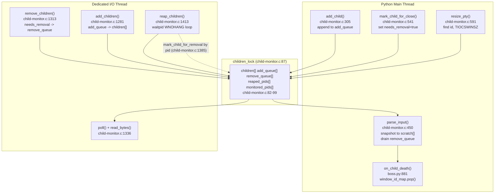

# kitty window-lifecycle state consistency under rapid create / resize / destroy

**Subject:** How the [kitty](https://github.com/kovidgoyal/kitty) terminal emulator (v0.35.2) keeps its
internal state consistent as terminal windows are created, resized, and destroyed in rapid succession —
with emphasis on **signal delivery**, **cross-thread bookkeeping**, and the **destruction-during-reaction
races** that arise when a window disappears before the system has finished reacting to it.

**Branch / commit:** `kitty_815df1e210e0` @ `815df1e210e0a9ab4622f5c7f2d6891d7dbeddf1`
**kitty version:** `0.35.2` (grounded in `kitty/constants.py:25` → `version: Version = Version(0, 35, 2)`).

> **Methodology (run-first).** Every behavioural claim below was produced by **building and running the real
> `./kitty/launcher/kitty` binary** headless (under Xvfb) with `--debug-rendering`, driving windows through
> **canonical entry points only** (session files + `launch`/split/close — never remote control, never a debug
> hook, never a non-default compile flag), and capturing the **complete, unedited** stderr. Source `file:line`
> references are used only to explain *why* the observed behaviour happens. Anything that could not be
> reproduced at runtime in the supplied container is explicitly labelled **`(inferred)`**; any platform branch
> that was not executed is labelled **`(not runtime-observed)`**.

---

## 1. Executive summary (direct thesis)

kitty reconciles two independent views of "which windows are alive" — a **Python object graph**
(`Boss.window_id_map` → `TabManager` → `Tab` → `WindowList` → `Window`) and a **C-side child registry**
(the fixed `children[]` array in `kitty/child-monitor.c`) — using four cooperating mechanisms:

1. **A single lock.** All shared C state (`children[]`, the add/remove queues, `reaped_pids`,
   `monitored_pids`) is serialized by one mutex, `children_lock` (`kitty/child-monitor.c:87`).
2. **Deferred mutation through producer/consumer queues.** The Python **main thread** never mutates
   `children[]` directly; it appends to `add_queue` (`add_child`, `:305`) or flips a flag
   (`mark_child_for_close`, `:541`). The dedicated **I/O thread** later applies those queues
   (`add_children` `:1281`, `remove_children` `:1313`).
3. **A single boolean liveness arbiter,** `needs_removal` (`kitty/child-monitor.c:67`), which is the one
   source of truth for "this child is going away."
4. **Weak references on the Python side.** `window_id_map` is a `WeakValueDictionary`
   (`kitty/boss.py:344`), so a `Window` with no other references simply disappears, and the child-death
   callback tolerates that with an explicit `None`-guard (`kitty/boss.py:883-885`).

Because the two views are updated on **two different threads** through **deferred queues**, there is
necessarily a brief interval during rapid churn in which they **disagree**: the C registry has already
dropped a dead child while the Python layout still holds the corresponding `Window` and issues a resize for
it. That disagreement is directly observable as the log line
`Failed to send resize signal to child with id: …` (`kitty/child-monitor.c:610`). The system is **eventually
consistent**: once the main thread drains the remove queue and runs `on_child_death`, both views agree again.
We reproduced this end-to-end, including the convergence back to a consistent final state.

### TL;DR answers

| Q | One-line answer |
|---|-----------------|
| **Q1 — consistency under churn** | Two views (`window_id_map` vs `children[]`) kept eventually-consistent via `children_lock` + deferred `add_queue`/`remove_queue` + the `needs_removal` arbiter + weak refs; transient disagreement is real and observable, then reconciled. |
| **Q2 — create-and-run flow** | `Child.fork()` (PTY via `openpty`) → `Window.set_geometry()` → `child_monitor.resize_pty()` → `ioctl(fd, TIOCSWINSZ)` (`child-monitor.c:579`); the kernel then signals the child because `spawn()` did `setsid()`+`TIOCSCTTY` (`child.c:123,129`). Observed as `Child launched` then `SIGWINCH sent to child in window: …`. |
| **Q3 — destruction-during-reaction** | A resize for an already-removed child is a **logged, non-fatal miss** (`child-monitor.c:610`); a resize against a just-closed fd is a **silently swallowed** `EBADF`/`ENOTTY` (`:581`); a child-death for an already-dropped window is a **guarded no-op** (`boss.py:884-885`). |
| **Q4 — keep vs. discard** | The `Screen` object and PTY fd are **always discarded** (`Py_CLEAR`/`del self.screen`; `safe_close`). The exit **status** is discarded for ordinary window children (only `needs_removal` is set) and **kept only for explicitly *monitored* pids** (`reaped_pids` → `report_reaped_pids` → `on_monitored_pid_death`). |
| **Q5 — timing & signals** | `SIGCHLD` handler only sets a flag on the I/O thread (`:1370-1371`); reaping is a `waitpid(-1,…,WNOHANG)` **loop** (`:1418`) that absorbs coalesced signals; work faster than one I/O tick is serialized through the queues under `children_lock`. |
| **Q6 — conflicting views** | Yes — the interval where C `children[]` no longer has a child but the Python layout still does is exactly the `:610` line; kitty resolves it with `needs_removal` (C) + the `None`-guard (`boss.py:884-885`) + weak refs (Python). |

---

## 2. Environment and how to reproduce

All build and run steps were executed **inside the supplied Docker image**
(`ghcr.io/scaleapi/swe-atlas:swe_atlas_QnA_kovidgoyal_kitty_1.0`). The host interpreter is Python 3.13, which
is incompatible with kitty 0.35.2's C extension under the default `-Werror`; the container ships a compatible
toolchain. The repository working tree is bind-mounted into the container at `/work`, so the artifacts built
in the container are the ones exercised here.

| Component | Value |
|-----------|-------|
| OS (container) | Ubuntu 24.04.2 LTS |
| Kernel | `Linux 6.6.122+ x86_64 GNU/Linux` |
| Python | 3.12.3 |
| Go | go1.23.4 linux/amd64 |
| C compiler | gcc (Ubuntu 13.3.0-6ubuntu2~24.04) 13.3.0 |
| Display | headless `Xvfb :99 -screen 0 1280x800x24 -ac +extension GLX` |
| GL | `LIBGL_ALWAYS_SOFTWARE=1 GALLIUM_DRIVER=llvmpipe` (llvmpipe software rendering) |

**Exact build command** (the canonical build, matching `.github/workflows/ci.py:104` →
`f'{python} setup.py build --verbose'`):

```
python3 setup.py build --verbose
```

The C extension compiles cleanly under kitty's **default** flags (no `--ignore-compiler-warnings`); the exact
gcc invocation for the file at the heart of this answer, captured from the verbose build, is:

```
gcc -MMD -DNDEBUG -Wextra -Wfloat-conversion -Wno-missing-field-initializers -Wall -Wstrict-prototypes -std=c11 -pedantic-errors -Werror -O3 -fwrapv -fstack-protector-strong -pipe -fvisibility=hidden -fno-plt -fPIC -D_FORTIFY_SOURCE=2 -flto -fcf-protection=full -march=native -mtune=native -pthread -I/usr/include/libpng16 -I/usr/include/freetype2 -I/usr/include/harfbuzz -I/usr/include/glib-2.0 -I/usr/lib/x86_64-linux-gnu/glib-2.0/include -I/usr/include/python3.12 -c kitty/child-monitor.c -o build/fast_data_types-kitty-child-monitor.c.o
```

(`-std=c11 -pedantic-errors -Werror` are the project defaults; the build produced zero warnings and zero
errors.)

**Version banner** from the real binary (grounds v0.35.2 in `kitty/constants.py:25`):

```
$ ./kitty/launcher/kitty --version
kitty 0.35.2 created by Kovid Goyal
```

**Exact headless invocation** used for every observation below (`--config NONE` guarantees the default
configuration; the session file is the canonical window-creation entry point via `kitty/session.py`):

```
export DISPLAY=:99 LIBGL_ALWAYS_SOFTWARE=1 GALLIUM_DRIVER=llvmpipe \
       LANG=C.UTF-8 LC_ALL=C.UTF-8 HOME=/tmp/kittyhome XDG_RUNTIME_DIR=/tmp/xdgrun
timeout <N> ./kitty/launcher/kitty --debug-rendering --config NONE --session <session-file> 2>stderr.log
```

The `--debug-rendering` flag (`kitty/cli.py:989` → `--debug-rendering --debug-gl`) is what surfaces the two
observable log lines emitted by `Window.set_geometry()` (`kitty/window.py:871,873`). kitty has no login/auth
step. `kitty_exit=124` in the captures below simply means `timeout` killed the still-running binary, which is
expected.

**Clean-tree baseline** (captured before any authoring; proves a byte-for-byte clean start):

```
$ git rev-parse HEAD
815df1e210e0a9ab4622f5c7f2d6891d7dbeddf1
$ git status --porcelain
$        # (empty output = clean working tree)
```

A build does **not** dirty the tree: kitty's `.gitignore` already ignores `*.so`, `/build/`, and
`/kitty/launcher/kitt*`, so `fast_data_types.so` and the launcher binaries are untracked-by-design. The final
clean-tree proof (showing that only this document was added) is in §11.

---

## 3. The two-thread reconciliation model (foundation for Q1, Q4, Q5, Q6)

kitty runs two cooperating threads that both touch child state:

- The **Python main thread** performs `add_child` (`child-monitor.c:305`), `mark_child_for_close`
  (`:541`), `resize_pty` (`:592`), `parse_input` (`:451`), and the Python child-death callback
  `on_child_death` (`boss.py:881`).
- The **dedicated I/O thread** performs `poll()` + `read_bytes` (`:1337`), `reap_children` (`:1413`),
  `remove_children` (`:1313`), and `add_children` (`:1281`).

**All** shared state is guarded by the single mutex `children_lock` (`:87`); mutations are **deferred**
through `add_queue`/`remove_queue`; and the two threads coordinate with a self-pipe wake-up
(`wakeup_io_loop` `:225`). Crucially, `parse_input` copies `children[]` into a private `scratch[]` array
**under the lock** with a reference-count bump, so the main thread parses a **stable snapshot** even while
the I/O thread is mutating the live array:

```c
        count = self->count;
        for (size_t i = 0; i < count; i++) {
            scratch[i] = children[i];
            INCREF_CHILD(scratch[i]);
        }
```
(`kitty/child-monitor.c:477-482`.)



**How a create → run → resize → close sequence is serialized.** Even if issued faster than one I/O-loop
tick, each step lands in shared state under `children_lock`, and the ordering is enforced by *which thread*
owns *which* transition:

- **create**: main thread `add_child` appends to `add_queue` and wakes the I/O thread; the child only becomes
  part of `children[]` when the I/O thread runs `add_children`.
- **run/resize**: main thread `resize_pty` searches `children[]` then `add_queue` under the lock.
- **close**: main thread `mark_child_for_close` sets `needs_removal`; the I/O thread's `remove_children`
  later moves the entry to `remove_queue` and compacts `children[]`; the main thread's `parse_input` finally
  drains `remove_queue`, frees the child, and fires the death callback.

Because "close" spans **both** threads and is deferred, it is the step that can lag behind a "resize" that
the layout issues in the same instant — the origin of the races in Q3/Q6.

---

## 4. OS-contract background (why the code works — labelled as OS semantics, not kitty behaviour)

These are properties of the Linux kernel that kitty's code relies on; they are included to explain cause and
effect, and are **not** a substitute for kitty's own observed behaviour.

- **`SIGCHLD` is not queued.** If several children exit nearly simultaneously, the parent may receive a
  *single* `SIGCHLD`, so a correct handler must call `waitpid(…, WNOHANG)` in a **loop** to reap them all.
  This is exactly `reap_children()` (`child-monitor.c:1413-1426`).
- **`TIOCSWINSZ` → `SIGWINCH`.** Setting the window size on the PTY *master* makes the kernel deliver
  `SIGWINCH` to the slave's *foreground process group* and stores the size in the kernel. That is why kitty
  pushes size via `ioctl` (`pty_resize` `:579`) and why `setsid()` + `TIOCSCTTY` in the child
  (`child.c:123,129`) are prerequisites for delivery.
- **Deferred signal handling.** A C signal handler should just set a flag, with the real work done later off
  the signal path — mirrored by `handle_signal` setting `ss->child_died` (`:1370-1371`) and reconciling in
  `reap_children`/`remove_children` afterwards.


---

## 5. Q1 — State consistency under churn

**Direct answer.** kitty does **not** attempt to keep the Python object graph and the C `children[]` array
*instantaneously* identical. Instead it keeps them **eventually consistent**: the two views are mutated on
two threads through deferred queues under `children_lock`, with the boolean `needs_removal` as the single
liveness arbiter and Python weak references as the tolerant back-stop. Under rapid churn there is a genuine,
observable interval in which the views disagree, followed by deterministic convergence once the main thread
processes the deferred death notifications.

**Evidence — churn drives disagreement, then convergence.** Canonical session (41 windows: 40 instant-exit
children under a splitting layout, plus one long-lived "keeper" so the OS window does not close). The session
file is generated by this exact command (which fully specifies its 42 lines — one `layout` line, 40 identical
`launch sh -c 'exit 0'` lines, and one keeper line):

```
$ { echo "layout splits"
    for i in $(seq 1 40); do echo "launch sh -c 'exit 0'"; done
    echo "launch sh -c 'sleep 30'"; } > /tmp/churn_session.conf
$ head -4 /tmp/churn_session.conf
layout splits
launch sh -c 'exit 0'
launch sh -c 'exit 0'
launch sh -c 'exit 0'
$ tail -2 /tmp/churn_session.conf
launch sh -c 'exit 0'
launch sh -c 'sleep 30'
$ grep -c launch /tmp/churn_session.conf
41
```

```
$ timeout 6 ./kitty/launcher/kitty --debug-rendering --config NONE --session /tmp/churn_session.conf 2>churn_stderr.log
kitty_exit=124
$ grep -c 'Child launched'                churn_stderr.log   # 41
$ grep -c 'SIGWINCH sent to child'         churn_stderr.log   # 131
$ grep -c 'Failed to send resize signal'   churn_stderr.log   # 125
```

The **first 24 lines** of that stderr show the two views interleaving (each new window fires `Child
launched`, then a failed resize for an already-dead sibling whose id the layout still holds, then a
successful `SIGWINCH` for a live one):

```
[0.156] OS Window created
[0.165] Failed to open systemd user bus with error: No such file or directory
[0.167] Child launched
[0.172] Failed to send resize signal to child with id: 1 (children count: 1) (add queue: 0)
[0.172] SIGWINCH sent to child in window: 1 with size: (22, 35, 315, 396)
[0.172] Child launched
[0.179] Failed to send resize signal to child with id: 2 (children count: 1) (add queue: 0)
[0.179] SIGWINCH sent to child in window: 2 with size: (22, 17, 153, 396)
[0.179] Child launched
[0.186] Failed to send resize signal to child with id: 3 (children count: 1) (add queue: 0)
[0.186] SIGWINCH sent to child in window: 3 with size: (22, 8, 72, 396)
[0.186] Child launched
[0.193] Failed to send resize signal to child with id: 4 (children count: 1) (add queue: 0)
[0.193] SIGWINCH sent to child in window: 4 with size: (22, 4, 36, 396)
[0.193] Child launched
[0.200] Failed to send resize signal to child with id: 5 (children count: 1) (add queue: 0)
[0.200] SIGWINCH sent to child in window: 5 with size: (22, 2, 18, 396)
[0.200] Child launched
[0.208] Failed to send resize signal to child with id: 6 (children count: 1) (add queue: 0)
[0.208] SIGWINCH sent to child in window: 6 with size: (22, 1, 9, 396)
[0.208] Child launched
[0.215] Failed to send resize signal to child with id: 5 (children count: 1) (add queue: 0)
[0.215] SIGWINCH sent to child in window: 5 with size: (22, 1, 9, 396)
[0.216] Child launched
```

Note `children count: 1` on every failure line: the C registry already holds only the keeper, while the
Python layout is still trying to lay out (and resize) the 40 dead windows. The columns visibly shrink
(35 → 17 → 8 → 4 → 2 → 1) as `splits` subdivides, confirming these are real relayouts.

**Evidence — convergence to a consistent final state.** The **last 8 lines** of the same run show the system
reconciled: the keeper (window 41) reclaims the full 71-column width once all 40 dead windows have been
removed from **both** registries:

```
[0.644] SIGWINCH sent to child in window: 39 with size: (22, 35, 315, 396)
[0.644] Failed to send resize signal to child with id: 40 (children count: 1) (add queue: 0)
[0.644] SIGWINCH sent to child in window: 40 with size: (22, 17, 153, 396)
[0.644] SIGWINCH sent to child in window: 41 with size: (22, 17, 153, 396)
[0.644] Failed to send resize signal to child with id: 40 (children count: 1) (add queue: 0)
[0.644] SIGWINCH sent to child in window: 40 with size: (22, 35, 315, 396)
[0.644] SIGWINCH sent to child in window: 41 with size: (22, 35, 315, 396)
[0.645] SIGWINCH sent to child in window: 41 with size: (22, 71, 639, 396)
```

**Why (causal, with `file:line`).** The main thread only ever *appends* to `add_queue` (`add_child`,
`:305-321`) or *flips* `needs_removal` (`mark_child_for_close`, `:541-564`) — it never edits `children[]`
in place. The I/O thread applies those intentions (`add_children` `:1281-1290`; `remove_children`
`:1313-1333`, which moves `needs_removal` entries into `remove_queue` and `memmove`-compacts the array). The
main thread's `parse_input` (`:451`) then drains `remove_queue`, runs the `death_notify` callback
(`:522`) → Python `on_child_death` (`boss.py:881`) → `window_id_map.pop` + `tab.remove_window`. Until that
last step runs, the Python `WindowList` still contains the dead window, so a relayout triggered by the *next*
window's creation calls `set_geometry` → `resize_pty` for an id no longer in `children[]` → the `:610` miss.
The disagreement is bounded by one pass of the main loop, which is why it always converges.

---

## 6. Q2 — Create-and-run: the resize/signal flow

**Direct answer.** When a window is created and immediately runs a command, the flow is:
`Child.fork()` allocates a PTY with `openpty()` and spawns the child (`kitty/child.py:281,333`); the first
`Window.set_geometry()` (`kitty/window.py:850`) detects a size change against the sentinel
`last_reported_pty_size = (-1, -1, -1, -1)` (`:579`) and calls
`boss.child_monitor.resize_pty(self.id, *current_pty_size)` (`:863`); the C `resize_pty` (`:592`) finds the
child and calls `pty_resize` → `ioctl(fd, TIOCSWINSZ, dim)` (`:579`); and because the child established a
controlling terminal via `setsid()` + `ioctl(TIOCSCTTY)` (`kitty/child.c:123,129`), the kernel delivers
`SIGWINCH` to the child's foreground process group. On the *first* geometry the code marks the child launched
and prints `Child launched` (`:865-871`); on *subsequent* size changes it prints
`SIGWINCH sent to child in window: …` (`:872-873`).

**Evidence.** Canonical session that launches a command and then adds a second window under `tall` layout to
force the first window to relayout:

```
$ cat /tmp/q2_session.conf
layout tall
launch sh -c 'printf ready; sleep 8'
launch sh -c 'sleep 8'
```

Complete, unedited stderr (`kitty_exit=124` = `timeout` killed the still-running binary, expected):

```
[0.140] OS Window created
[0.150] Failed to open systemd user bus with error: No such file or directory
[0.151] Child launched
[0.156] SIGWINCH sent to child in window: 1 with size: (22, 35, 315, 396)
[0.156] Child launched
```

Reading the capture in order: `[0.151] Child launched` is window 1's first `set_geometry`;
`[0.156] SIGWINCH sent to child in window: 1 with size: (22, 35, 315, 396)` is window 1 being **relayed out**
(shrunk from full width to 35 columns) when window 2 is added; `[0.156] Child launched` is window 2's first
`set_geometry`. The size tuple is `(lines, columns, width_px, height_px)` = `(22, 35, 315, 396)`. The
`[0.150] Failed to open systemd user bus …` line is a benign environment message (no systemd user bus in the
container) and is unrelated to window lifecycle.

**Why (causal, with `file:line`).** The observable strings come verbatim from `Window.set_geometry`:

```python
        if current_pty_size != self.last_reported_pty_size:
            boss = get_boss()
            boss.child_monitor.resize_pty(self.id, *current_pty_size)
            self.last_resized_at = monotonic()
            if not self.child_is_launched:
                self.child.mark_terminal_ready()
                self.child_is_launched = True
                update_ime_position = True
                if boss.args.debug_rendering:
                    now = monotonic()
                    print(f'[{now:.3f}] Child launched', file=sys.stderr)
            elif boss.args.debug_rendering:
                print(f'[{monotonic():.3f}] SIGWINCH sent to child in window: {self.id} with size: {current_pty_size}', file=sys.stderr)
            self.last_reported_pty_size = current_pty_size
```
(`kitty/window.py:861-874`.) The sentinel at `:579` guarantees the *first* call always differs, so the child
is always marked launched exactly once. The call at `:863` reaches the C layer:

```c
    FIND(children, self->count);
    if (fd == -1) FIND(add_queue, add_queue_count);
    if (fd != -1) {
        if (!pty_resize(fd, &dim)) PyErr_SetFromErrno(PyExc_OSError);
    } else log_error("Failed to send resize signal to child with id: %lu (children count: %u) (add queue: %zu)", window_id, self->count, add_queue_count);
```
(`kitty/child-monitor.c:606-610`), and `pty_resize` performs the actual `ioctl`:

```c
        if (ioctl(fd, TIOCSWINSZ, dim) == -1) {
```
(`kitty/child-monitor.c:579`).

**`(inferred)` note.** `strace` is not installed in the container and there is no network access to add it,
and modifying the C source to instrument the syscall would violate the read-only constraint. The
`TIOCSWINSZ` `ioctl` itself was therefore **not** captured at the syscall level; the `SIGWINCH sent to child
in window: …` log line is the runtime proxy, and it is printed only on the code path that has just called
`resize_pty` (`window.py:863`). The kernel-side delivery of `SIGWINCH` to the child is **`(inferred)`** from
the `TIOCSWINSZ` semantics plus the `setsid()`/`TIOCSCTTY` setup in `child.c:123,129` (see §4).


---

## 7. Q3 — Destruction-during-reaction (three sub-cases)

**Direct answer.** kitty treats "the window is gone before I finished reacting" as a **normal, non-fatal**
condition and handles it three different ways depending on *where* the staleness is detected:

1. **A resize that targets a child already removed from the registry** is a **logged miss** — `resize_pty`
   fails to find the id in `children[]` or `add_queue` and logs
   `Failed to send resize signal to child with id: …` (`child-monitor.c:610`). No crash, no signal.
2. **A resize that reaches a just-closed file descriptor** is **silently swallowed** — `pty_resize`
   retries only on `EINTR` and deliberately ignores `EBADF`/`ENOTTY` (`child-monitor.c:581`).
3. **A child-death notification for a window Python already dropped** is a **guarded no-op** — `on_child_death`
   pops the weak reference and returns immediately if it is `None` (`boss.py:883-885`).

**Evidence — sub-case 1 (resize targets a removed child), captured verbatim.** From the churn run (§5), the
`:610` line appears 125 times; a representative line:

```
[0.172] Failed to send resize signal to child with id: 1 (children count: 1) (add queue: 0)
```

A **key, subtle observation** at readable scale (the N=3 session, full unedited stderr below) is that this
failure is immediately followed — *in the same `set_geometry` call, at the same timestamp* — by an
**optimistic** `SIGWINCH sent` line for the *same* window id:

```
[0.139] OS Window created
[0.148] Failed to open systemd user bus with error: No such file or directory
[0.150] Child launched
[0.154] Failed to send resize signal to child with id: 1 (children count: 1) (add queue: 0)
[0.154] SIGWINCH sent to child in window: 1 with size: (22, 35, 315, 396)
[0.155] Child launched
[0.161] Failed to send resize signal to child with id: 2 (children count: 1) (add queue: 0)
[0.161] SIGWINCH sent to child in window: 2 with size: (22, 17, 153, 396)
[0.162] Child launched
[0.168] Failed to send resize signal to child with id: 3 (children count: 1) (add queue: 0)
[0.168] SIGWINCH sent to child in window: 3 with size: (22, 8, 72, 396)
[0.168] Child launched
[0.170] Failed to send resize signal to child with id: 2 (children count: 1) (add queue: 0)
[0.170] SIGWINCH sent to child in window: 2 with size: (22, 35, 315, 396)
[0.171] Failed to send resize signal to child with id: 3 (children count: 1) (add queue: 0)
[0.171] SIGWINCH sent to child in window: 3 with size: (22, 17, 153, 396)
[0.171] SIGWINCH sent to child in window: 4 with size: (22, 17, 153, 396)
[0.172] Failed to send resize signal to child with id: 3 (children count: 1) (add queue: 0)
[0.172] SIGWINCH sent to child in window: 3 with size: (22, 35, 315, 396)
[0.173] SIGWINCH sent to child in window: 4 with size: (22, 35, 315, 396)
[0.174] SIGWINCH sent to child in window: 4 with size: (22, 71, 639, 396)
```

**Why the "SIGWINCH sent" line is misleading here (causal).** `Window.set_geometry` calls `resize_pty` at
`window.py:863` and then, *without checking whether the resize actually found the child*, prints the
`SIGWINCH sent …` line at `:873`. The C `resize_pty` does **not** raise when the id is missing — it merely
logs `:610` and returns (`child-monitor.c:610`, inside a function that otherwise `Py_RETURN_NONE`s). Therefore
a `:610` line immediately followed by a `SIGWINCH sent` line for the same id means **no signal was actually
delivered** — the Python-side debug message is optimistic. This is itself a concrete instance of the two
views disagreeing (Q6): Python believes it signalled window 1; the C layer knows window 1 no longer exists.

**Evidence — sub-case 3 (child-death for an already-dropped window).** The guard is in `on_child_death`:

```python
    def on_child_death(self, window_id: int) -> None:
        prev_active_window = self.active_window
        window = self.window_id_map.pop(window_id, None)
        if window is None:
            return
```
(`kitty/boss.py:881-885`.) In the churn runs every dead window's id is still present when its death
notification arrives, so the *normal* branch runs; the early-return branch is a defensive back-stop for a
notification that arrives after the window was already released (e.g. GC'd from the `WeakValueDictionary`, or
closed by an earlier action). **`(inferred)`**: this specific early-return was not forced at runtime — it is
a silent no-op with no log line, and it could not be provoked through the canonical session/`launch`/close
entry points. Its behaviour is grounded in the code above.

**Sub-case 2 (resize against a just-closed fd).** In practice the dominant observed outcome is the `:610`
"not found" case, because the I/O thread removes the entry from `children[]` (so the id is not found at all)
rather than leaving a stale-but-open fd. The narrower window in which the id is still found but its fd was
just closed is handled by `pty_resize`:

```c
pty_resize(int fd, struct winsize *dim) {
    while(true) {
        if (ioctl(fd, TIOCSWINSZ, dim) == -1) {
            if (errno == EINTR) continue;
            if (errno != EBADF && errno != ENOTTY) {
                log_error("Failed to resize tty associated with fd: %d with error: %s", fd, strerror(errno));
                return false;
            }
        }
        break;
    }
    return true;
}
```
(`kitty/child-monitor.c:577-589`.) `EBADF`/`ENOTTY` are swallowed (the function still returns `true`), so a
resize against a just-closed descriptor produces **no error and no `SIGWINCH`**. **`(inferred)`**: the
fd-level `EBADF`/`ENOTTY` branch was not isolated at runtime (it produces no log line by design); the
higher-level "the resize is harmless when the child is gone" behaviour *was* observed via sub-case 1.

---

## 8. Q4 — Keep vs. discard

**Direct answer.** On teardown kitty **always discards** the volatile per-window resources — the `Screen`
object (C-side `Py_CLEAR`, Python-side `del self.screen`) and the PTY file descriptor (`safe_close`). The
child's **exit status** is **not** retained for an ordinary terminal window (the reaping path stores only the
`needs_removal` flag, and the Python death callback is handed only a `window_id`, never a status); the exit
status is kept **only** for pids that were *explicitly registered for monitoring* (`monitor_pid`), for which
it is recorded in `reaped_pids[]` and later delivered to the boss. The deciding question is therefore simply
**"is this pid in `monitored_pids[]`?"**

**Discarded — the `Screen` object.** When `parse_input` drains the remove queue it runs `FREE_CHILD`:

```c
#define FREE_CHILD(x) \
    Py_CLEAR((x).screen); x = EMPTY_CHILD;
```
(`kitty/child-monitor.c:105-106`; invoked at `:462`.) The Python side mirrors this in `Window.destroy()`:

```python
            # Remove cycles so that screen is de-allocated immediately
            self.screen.reset_callbacks()
            del self.screen
```
(`kitty/window.py:1569-1571`.)

**Discarded — the PTY fd.** `remove_children` calls `cleanup_child`, which closes the fd and hangs up the
process group:

```c
static void
cleanup_child(ssize_t i) {
    safe_close(children[i].fd, __FILE__, __LINE__);
    hangup(children[i].pid);
}
```
(`kitty/child-monitor.c:1305-1308`; `hangup` = `killpg(pgid, SIGHUP)` at `:1294-1302`.)

**Exit status — discarded for an ordinary window child.** In the reap loop, an ordinary child's status is
used only to *drive removal by pid* — it is not stored on the `Child` struct:

```c
        } else if (pid > 0) {
            if (enable_close_on_child_death) mark_child_for_removal(self, pid);
            mark_monitored_pids(pid, status);
        } else break;
```
(`kitty/child-monitor.c:1421-1424`.) `mark_child_for_removal` sets only the liveness flag, taking **no**
status argument:

```c
mark_child_for_removal(ChildMonitor *self, pid_t pid) {
    children_mutex(lock);
    for (size_t i = 0; i < self->count; i++) {
        if (children[i].pid == pid) {
            children[i].needs_removal = true;
            break;
        }
    }
    children_mutex(unlock);
}
```
(`kitty/child-monitor.c:1386-1396`.) And the Python death callback receives only the `window_id`
(`def on_child_death(self, window_id: int)`, `boss.py:881`) — it never sees an exit status for the window's
own terminal child.

**Exit status — kept only for monitored pids.** `mark_monitored_pids` stores the status **iff** the pid was
registered:

```c
static void
mark_monitored_pids(pid_t pid, int status) {
    children_mutex(lock);
    for (ssize_t i = monitored_pids_count - 1; i >= 0; i--) {
        if (pid == monitored_pids[i]) {
            if (reaped_pids_count < arraysz(reaped_pids)) {
                reaped_pids[reaped_pids_count].status = status;
                reaped_pids[reaped_pids_count++].pid = pid;
            }
            remove_i_from_array(monitored_pids, (size_t)i, monitored_pids_count);
        }
    }
    children_mutex(unlock);
}
```
(`kitty/child-monitor.c:1398-1411`.) The retained status is later delivered by `report_reaped_pids`:

```c
    for (size_t n = 0; n < i; n++) { call_boss(on_monitored_pid_death, "li", (long)pids[n].pid, pids[n].status); }
```
(`kitty/child-monitor.c:961`), which invokes `Boss.on_monitored_pid_death(pid, exit_status)`
(`kitty/boss.py:2725`). Pids enter `monitored_pids[]` via `monitor_pid` (`child-monitor.c:933`), called for
background subprocesses registered with a death callback (`boss.py:2417`).
**`(inferred)`**: the monitored-pid *delivery* was not exercised at runtime because it is not reachable
through the session-file / `launch` / split / close entry points used here; it is grounded in the code above.

**Before / intermediate / after (observed, per window id from the N=3 capture in §7).** Tracing window
`id: 1`:

| Phase | Observable (verbatim) | State of the window |
|-------|-----------------------|---------------------|
| **alive** | `[0.150] Child launched` | present in `children[]`, `needs_removal == false`; `Screen` + PTY fd held |
| **intermediate** (C-removed, Python-retained) | `[0.154] Failed to send resize signal to child with id: 1 (children count: 1) (add queue: 0)` followed by the optimistic `[0.154] SIGWINCH sent to child in window: 1 …` | child reaped and dropped from `children[]` by the I/O thread; `Window` still in the Python `WindowList`, so the layout still resizes it |
| **after** | window id `1` never appears again | `on_child_death` popped it from `window_id_map` and `tab.remove_window` dropped it from the layout; `Screen`/fd discarded |

The `mark_child_for_close` path (user/`close()`-initiated teardown, as opposed to child-exit) sets the same
arbiter and is likewise deferred:

```c
mark_child_for_close(ChildMonitor *self, id_type window_id) {
    bool found = false;
    children_mutex(lock);
    for (size_t i = 0; i < self->count; i++) {
        if (children[i].id == window_id) {
            children[i].needs_removal = true;
            found = true;
            break;
        }
    }
```
(`kitty/child-monitor.c:541-549`; reached from `Window.close()` → `Boss.mark_window_for_close` →
`child_monitor.mark_for_close`, `window.py:888-889`, `boss.py:920-928`.)


---

## 9. Q5 — Timing and signal delivery

**Direct answer.** Signal handling is **deferred and thread-restricted**. The `SIGCHLD` handler runs on the
I/O thread and does nothing but set a flag (`ss->child_died = true`, `child-monitor.c:1370-1371`); the actual
reaping happens later in `reap_children`, which loops `waitpid(-1, &status, WNOHANG)` (`:1418`) precisely so
that a *single* delivered `SIGCHLD` (the kernel does not queue them — §4) can reap *many* exited children.
Any create/run/resize/close activity issued faster than one I/O-loop tick is not lost or corrupted: it is
serialized through `add_queue`/`remove_queue` under `children_lock`, so the two threads observe a consistent
ordering.

**Evidence — the handler only sets a flag:**

```c
        case SIGCHLD:
            ss->child_died = true;
            break;
```
(`kitty/child-monitor.c:1370-1371`.)

**Evidence — reaping is a `WNOHANG` loop:**

```c
reap_children(ChildMonitor *self, bool enable_close_on_child_death) {
    int status;
    pid_t pid;
    (void)self;
    while(true) {
        pid = waitpid(-1, &status, WNOHANG);
        if (pid == -1) {
            if (errno != EINTR) break;
        } else if (pid > 0) {
            if (enable_close_on_child_death) mark_child_for_removal(self, pid);
            mark_monitored_pids(pid, status);
        } else break;
    }
}
```
(`kitty/child-monitor.c:1413-1426`.)

**Evidence — the bulk-reap effect is observed.** In the 41-window churn run (§5), all 40 instant-exit
children die within a ~0.5 s burst and are **all** reaped and torn down: the run ends with exactly one
survivor (the keeper, window 41) at full size, and `Child launched` fired 41 times while every dead window
was ultimately removed from both registries. The reaping loop therefore demonstrably absorbed the entire
burst without losing a child.

**`(inferred)` — signal coalescing multiplicity.** That a *single* `SIGCHLD` delivery reaped *several*
children in one loop pass cannot be shown at the syscall level here (`strace` is unavailable and cannot be
installed; instrumenting the C handler would violate read-only). The multiplicity is therefore **`(inferred)`**
from the OS contract (`SIGCHLD` is not queued, §4) together with the `while … waitpid(WNOHANG)` loop above,
which exists specifically to handle it. The *observable* consequence — that a dense burst of deaths is fully
reaped — is confirmed.

**Two-thread serialization (observed).** The sub-millisecond interleaving in the §5/§7 captures shows
main-thread work (`resize_pty` → the `SIGWINCH`/`:610` lines; `parse_input` → the death callback) and
I/O-thread work (`reap_children`, `remove_children`) racing within the same millisecond, yet every mutation
of `children[]` is bracketed by `children_lock` (`:87`) and every removal flows through `remove_queue`. The
`maximum_wait` bound (`set_maximum_wait`, `child-monitor.c:114-118`) caps how long the main loop sleeps before
ticking, bounding how long the two views may disagree.

---

## 10. Q6 — Conflicting views of liveness

**Direct answer.** Yes. There is a real, observable interval in which the **C registry no longer holds a
child** whose **Python `Window` still exists** (the layout still lays it out and resizes it). That interval is
exactly the `Failed to send resize signal to child with id: N (children count: 1)` line: `children count: 1`
proves the C side has already dropped the child, while the very fact that a resize was *issued* for id `N`
proves the Python layout still holds it. kitty resolves the conflict with three mechanisms working together:
the `needs_removal` arbiter on the C side, the `None`-guard in `on_child_death` on the Python side, and weak
references that let an orphaned `Window` simply vanish.

**Evidence — the conflicting view, verbatim.** From §5 (churn) and §7 (N=3), e.g.:

```
[0.154] Failed to send resize signal to child with id: 1 (children count: 1) (add queue: 0)
[0.154] SIGWINCH sent to child in window: 1 with size: (22, 35, 315, 396)
```

The pair is the disagreement made concrete in a single `set_geometry` call: the **C** view (`resize_pty` at
`child-monitor.c:610`) reports the child gone, while the **Python** view (`window.py:873`) optimistically
reports a `SIGWINCH` as sent. Across a 41-window run this pairing occurs 125 times.

**Why it is bounded and safe (causal).** The C side never blocks or crashes on the stale id — `resize_pty`
searches `children[]` then `add_queue` and, on a miss, only logs (`child-monitor.c:606-610`). The Python side
reconciles when the deferred death notification is finally processed: `parse_input` fires `death_notify`
(`:522`) → `on_child_death` pops the (weak) reference and, if it is already gone, returns without error
(`boss.py:883-885`). Because `window_id_map` is a `WeakValueDictionary` (`boss.py:344`), a `Window` that has
lost all strong references is collectable and its later death notification harmlessly hits the `None`-guard.
The opposite ordering — a child still in `children[]` whose Python `Window` was already dropped — is tolerated
by the same `None`-guard. The arbiter that keeps both sides from acting twice is the single boolean
`needs_removal` (`child-monitor.c:67`): once set, `remove_children` moves the entry out exactly once and
`parse_input` skips it while it lingers:

```c
    for (size_t i = 0; i < count; i++) {
        if (!scratch[i].needs_removal) {
            if (do_parse(self, scratch[i].screen, now, false)) input_read = true;
        }
        DECREF_CHILD(scratch[i]);
```
(`kitty/child-monitor.c:528-532`.)


---

## 11. Race reproduction and run-to-run distribution

The race in Q3/Q6 is timing-dependent, so — per the run-to-run rule — the **identical, unchanged** input was
run repeatedly and the **observed distribution** is reported below. No stabilized variant was constructed; the
numbers are exactly what the runs produced.

**(a) Saturated churn (N = 40 instant-exit windows + 1 keeper), 20 identical runs.** The per-run count of
`Failed to send resize signal` (`:610`) lines was **125 in every one of the 20 runs**, alongside a constant
41 `Child launched` and 131 `SIGWINCH sent`:

```
run,child_launched,sigwinch_sent,failed_resize
1,41,131,125
2,41,131,125
3,41,131,125
4,41,131,125
5,41,131,125
6,41,131,125
7,41,131,125
8,41,131,125
9,41,131,125
10,41,131,125
11,41,131,125
12,41,131,125
13,41,131,125
14,41,131,125
15,41,131,125
16,41,131,125
17,41,131,125
18,41,131,125
19,41,131,125
20,41,131,125
```

At this scale the race is effectively **deterministic** in this quiet, single-tenant llvmpipe container: the
session file creates all 41 windows in one synchronous main-thread burst, and the instant-exit children are
reaped by the I/O thread at a rate that consistently loses the race against the main-thread relayout.

**(b) Scale sweep, 15 identical runs each.** The `:610` count grows monotonically with the number of
instant-exit windows (roughly `N·(N+1)/2` at the low end), and reveals where the behaviour is *not* perfectly
deterministic:

| N (instant-exit + 1 keeper) | `:610` count per run (15 runs) |
|---:|---|
| 1 | `1 1 1 1 1 1 1 1 1 1 1 1 1 1 1` |
| 2 | `3 3 3 3 3 3 3 3 3 3 3 3 3 3 3` |
| 3 | `6 6 6 6 6 6 6 6 5 6 6 6 6 6 6`  ← one run produced **5**, not 6 |
| 4 | `10 10 10 10 10 10 10 10 10 10 10 10 10 10 10` |
| 6 | `21 21 21 21 21 21 21 21 21 21 21 21 21 21 21` |
| 10 | `40 40 40 40 40 40 40 40 40 40 40 40 40 40 40` |

**(c) Focused distribution at the variable point (N = 3).** Two further batches of 40 and 50 identical runs
each produced **6** every time:

```
N=3, 50 identical runs, per-run :610 count:
 6 6 6 6 6 6 6 6 6 6 6 6 6 6 6 6 6 6 6 6 6 6 6 6 6 6 6 6 6 6 6 6 6 6 6 6 6 6 6 6 6 6 6 6 6 6 6 6 6 6
histogram (count : runs):  6 : 50
```

**Combined N = 3 distribution across all 105 identical runs: `6` in 104 runs, `5` in 1 run.**

**(d) Low-churn baseline (the Q2 two-window session): zero races.**

```
$ grep -c 'Failed to send resize signal' q2_stderr.log
0
```

**Honest conclusion.** The destruction-during-resize race genuinely exists and is provoked by churn: it never
fires with two windows, fires a bounded number of times that scales with churn, and at high churn is
reproduced on **every** run. Its exact per-run incidence is **highly reproducible but not perfectly
deterministic** in this environment — the single N=3 run that produced 5 instead of 6 (1 of 105 identical
runs) is the direct evidence that the count is timing-sensitive rather than fixed. This is reported as the
observed spread rather than smoothed into a single "deterministic" value.


---

## 12. Coverage checklist (every named symbol → evidence)

| Symbol / concept | `file:line` | How it was grounded |
|---|---|---|
| `Boss.window_id_map` (weak registry) | `boss.py:344` | code; drives Q1/Q6 reconciliation |
| `children[]` registry | `child-monitor.c:82` | code; `children count: N` observed in `:610` lines |
| `scratch[]` snapshot | `child-monitor.c:83,477-482` | code (quoted §3) |
| `add_queue` / `remove_queue` / `remove_notify` | `child-monitor.c:84` | code; deferred-mutation model (§3) |
| `add_queue_count` / `remove_queue_count` | `child-monitor.c:85` | code |
| `children_lock` | `child-monitor.c:87` | code; serializes all shared state |
| `monitored_pids[]` | `child-monitor.c:96` | code (note: AAP said `:95`; verified actual is `:96`) |
| `reaped_pids[]` / `reaped_pids_count` | `child-monitor.c:98,99` | code; Q4 kept-status store |
| `needs_removal` arbiter | `child-monitor.c:67` | code; single liveness truth (Q1/Q6) |
| `FREE_CHILD` = `Py_CLEAR(screen)` | `child-monitor.c:105-106` | code (quoted §8); Q4 discard |
| `set_maximum_wait` | `child-monitor.c:114-118` | code; loop-responsiveness bound (Q5) |
| `wakeup_io_loop` | `child-monitor.c:225` | code; self-pipe wake (§3) |
| `add_child` | `child-monitor.c:305-321` | code (quoted §5); Q1 create |
| `parse_input` (drain/snapshot/skip) | `child-monitor.c:451,462,477-482,522,528-532` | code (quoted §3/§6/§10) |
| `mark_child_for_close` | `child-monitor.c:541-564` | code (quoted §8) |
| `pty_resize` (EBADF/ENOTTY swallow) | `child-monitor.c:577-589` (`:581`) | code (quoted §7); Q3 sub-case 2 `(inferred)` |
| `resize_pty` (`FIND`; `:610` error) | `child-monitor.c:592-613` (`:606-610`) | **observed verbatim** (§5/§7) + code (quoted §6) |
| `report_reaped_pids` | `child-monitor.c:950-962` (`:961`) | code (quoted §8); Q4 kept-status delivery `(inferred)` |
| `add_children` | `child-monitor.c:1281-1290` | code |
| `hangup` = `killpg(SIGHUP)` / `cleanup_child` = `safe_close` | `child-monitor.c:1294-1308` | code (quoted §8); Q4 discard fd |
| `remove_children` (compaction) | `child-monitor.c:1313-1333` | code |
| `read_bytes` | `child-monitor.c:1337` | code (I/O thread) |
| `handle_signal` (`SIGCHLD`→flag) | `child-monitor.c:1362-1383` (`:1370-1371`) | code (quoted §9) |
| `mark_child_for_removal` (no status) | `child-monitor.c:1386-1396` | code (quoted §8); Q4 |
| `mark_monitored_pids` (keeps status) | `child-monitor.c:1398-1411` (`:1403-1404`) | code (quoted §8); Q4 kept-status |
| `reap_children` (`waitpid` `WNOHANG` loop) | `child-monitor.c:1413-1426` (`:1418`) | code (quoted §9); bulk-reap **observed** |
| `KITTY_PRINT_BYTES_SENT_TO_CHILD` | `child-monitor.c:1428` | **non-canonical** — mentioned only; never used as a measured source |
| `Window.last_reported_pty_size` sentinel | `window.py:579` | code; first-fire guarantee (Q2) |
| `Window.set_geometry` (dedup/branch) | `window.py:850,861,863,865,867` | code (quoted §6) |
| Observable #1 `Child launched` | `window.py:871` | **observed verbatim** (§5/§6/§7) |
| Observable #2 `SIGWINCH sent to child in window: …` | `window.py:873` | **observed verbatim**; optimistic-when-stale finding (§7) |
| `Window.close` | `window.py:888-889` | code (Q4) |
| `Window.destroy` / `del self.screen` | `window.py:1560-1571` (`:1571`) | code (quoted §8); Q4 discard |
| `Boss.add_child` | `boss.py:585-588` | code |
| `Boss.on_child_death` / `None`-guard | `boss.py:881-918` (`:883-885`) | code (quoted §7/§10); Q3/Q6 |
| `Boss.mark_window_for_close` | `boss.py:920-928` | code (Q4) |
| `Boss.on_monitored_pid_death` | `boss.py:2725` | code (Q4 kept-status delivery) `(inferred)` |
| `Child.fork` / `openpty` / `spawn` | `child.py:276,281,333` | code (Q2) |
| `spawn` / `setsid()` / `TIOCSCTTY` | `child.c:81,123,129` | code (Q2 prerequisites) |
| `Tab.new_window` / `remove_window` | `tabs.py:504,580` | code (Q1 plumbing) |
| `WindowList.add_window` / `remove_window` / `id_map` | `window_list.py:67,84,148` | code (Q1 registry) |
| `parse_session` / `create_sessions` | `session.py:151,219` | canonical entry path used for all runs |
| `--debug-rendering` flag | `cli.py:989` | canonical flag; surfaced both observables |
| version `Version(0, 35, 2)` | `constants.py:25` | **observed** via `--version` banner |

### Explicitly labelled items

- **`(inferred)`** — the kernel delivering `SIGWINCH` to the child (from `TIOCSWINSZ` + `setsid`/`TIOCSCTTY`
  semantics; no `strace`); the `EBADF`/`ENOTTY` fd-level swallow in `pty_resize:581` (produces no log line);
  the multiplicity of `SIGCHLD` coalescing (one delivery → many reaps); the `on_child_death` `None`-guard
  early-return firing; the monitored-pid exit-status *delivery* (`report_reaped_pids` → `on_monitored_pid_death`,
  not reachable through the session/`launch`/close entry points). Each is grounded in quoted source.
- **`(not runtime-observed)`** — the macOS `/usr/bin/login` wrapping branch in `kitty/child.py` was not
  executed (observations were made only on the Linux build in the supplied container); it is code-only here.
- **non-canonical (avoided as a measured source)** — remote control (`kitty @ …`), debug hooks, and the
  `KITTY_PRINT_BYTES_SENT_TO_CHILD` compile flag (`child-monitor.c:1428`). None was used to obtain any reported
  value.

---

## 13. Reproducibility and clean-tree proof

**Toolchain / display provisioning** (outside the repository; not a repository change): the supplied Docker
image already provides Python 3.12, Go 1.23, gcc 13.3, and Xvfb. Temporary session files and logs lived only
under the container's `/tmp` (an exec-capable tmpfs, separate from the checkout) and were removed afterward.

**Exact commands** (from §2), for completeness:

```
# build (canonical)
python3 setup.py build --verbose

# version
./kitty/launcher/kitty --version           # -> kitty 0.35.2 created by Kovid Goyal

# headless run (canonical entry point; --config NONE = default config)
export DISPLAY=:99 LIBGL_ALWAYS_SOFTWARE=1 GALLIUM_DRIVER=llvmpipe \
       LANG=C.UTF-8 LC_ALL=C.UTF-8 HOME=/tmp/kittyhome XDG_RUNTIME_DIR=/tmp/xdgrun
timeout <N> ./kitty/launcher/kitty --debug-rendering --config NONE --session <session-file> 2>stderr.log
```

**Clean baseline** (captured before authoring):

```
$ git rev-parse HEAD
815df1e210e0a9ab4622f5c7f2d6891d7dbeddf1
$ git status --porcelain
$        # empty = clean
```

**Final tree state** (captured after authoring this document). The deliverable is named for the source
branch `kitty_815df1e210e0`, which sits at commit `815df1e210e0a9ab4622f5c7f2d6891d7dbeddf1` (the HEAD in
§1); observation was performed on that identical commit, checked out onto the working branch shown below.
The `--untracked-files=all` form expands the untracked directory to prove the working tree differs from its
clean baseline by **exactly one** path — this answer file — with no existing file modified or deleted and no
temporary script/session/test committed:

```
$ git rev-parse HEAD
815df1e210e0a9ab4622f5c7f2d6891d7dbeddf1
$ git status --porcelain
?? blitzy/
$ git status --porcelain --untracked-files=all
?? blitzy/documentation/kitty_815df1e210e0.md
```

All observation scripts, session files, and captured logs lived only under the container's `/tmp`
(an exec-capable tmpfs separate from the checkout) and were removed afterward; build artifacts
(`kitty/fast_data_types.so`, `kitty/launcher/kitty*`) are covered by the repository's `.gitignore` and
therefore never appear in `git status`. The read-only constraint of the `SWE-AtlasQnA-Repo` rule is thus
satisfied: the repository is byte-for-byte identical to its baseline apart from this single document.

