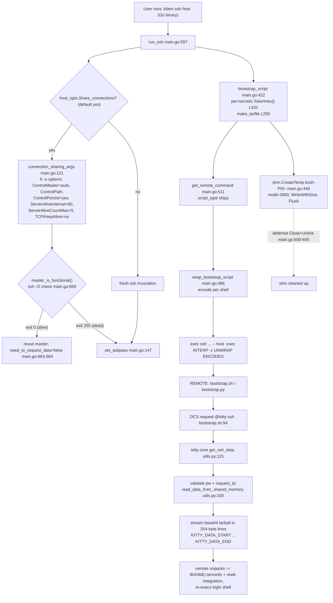

# How the Kitty SSH Kitten Works, End to End

*A runtime-grounded walkthrough of `kitten ssh <host>` — from local initiation, through the
secure credential handoff and shell-integration archive transfer, to the generated bootstrap
script executing on the remote host.*

Every factual claim below is backed by **captured runtime output** and a `file:line` citation.
Statements are explicitly labelled **[OBSERVED]** (captured from a running program),
**[CODE]** (read directly from the named source line), or **[INFERRED]** (a conclusion drawn
from observed evidence). Anything not produced by the real `kitten ssh` build is labelled
**[NON-CANONICAL]** with the reason.

---

## 0. Scope — three cooperating code bases

The SSH kitten is **not** a single program. Understanding it end-to-end requires following the
data across **three** distinct code bases, and an explanation that covers only one side is
incomplete:

1. **The local Go kitten** — `kittens/ssh/*.go`. This is the *canonical, user-facing runtime
   entry point*. When you type `kitten ssh host`, a **Go** binary runs. This is the single most
   important convention to internalise: although kitty's kitten *framework* is Python
   (`kittens/runner.py`), the SSH kitten's user-facing path is the compiled Go binary. The file
   `kittens/ssh/main.py` exists but is **only the options/configuration schema** (it defines
   `ssh.conf` option text), *not* the runtime.
2. **The remote bootstrap scripts** — `shell-integration/ssh/bootstrap.sh` (POSIX sh) and
   `shell-integration/ssh/bootstrap.py` (Python). SSH executes one of these *on the server*.
3. **The kitty-core Python responder** — `kittens/ssh/utils.py`, invoked from `kitty/window.py`.
   This runs inside the **local** kitty GUI process (the terminal emulator itself) and answers the
   remote bootstrap's request for data by streaming the archive back over the TTY.

The flow, at a glance, is: the **Go kitten** builds an `ssh` command line and a bootstrap script,
stashes a tarball + one-time password in **local shared memory**, and `exec`s `ssh`. On the
server, the **bootstrap script** decodes itself and asks — over the terminal — for the setup data.
The **kitty-core Python responder** validates that request against the shared-memory password and
streams the tarball back over the same terminal. The bootstrap unpacks it, installs terminfo and
shell integration, and re-execs your login shell.



For the default configuration on this host (OpenSSH ≥ 8.4), one nuance the diagram simplifies: the
DCS request is actually sent by the **local kitten** immediately after spawning `ssh`
(`main.go:761`), rather than by the remote bootstrap — see [Q10](#q10--terminal-requestresponse-protocol-the-dcs-handshake).

---

## 1. Environment and build (the default, canonical configuration)

All observations were produced from a canonical build of the binaries on this host. Exact facts:

**Repository state.** The SSH-kitten source documented here is commit
`815df1e210e0a9ab4622f5c7f2d6891d7dbeddf1` (the tip of the source branch `kitty_815df1e210e0`);
every `file:line` citation in this document is against that exact tree, verified with:

```
$ git log --oneline -1 815df1e210e0a9ab4622f5c7f2d6891d7dbeddf1
815df1e21 Wire up applying of font config
```

This answer document is added as a **follow-on commit** on the working branch
`blitzy-c0111083-82c0-4e78-990d-87d434a60e48`; once committed, the document itself is `HEAD` and the
documented source tree is its parent, `HEAD~1`:

```
$ git log --oneline -2
{doc commit}   docs: add runtime-grounded SSH kitten end-to-end explanation   # this document (HEAD)
815df1e21      Wire up applying of font config                                # documented source (HEAD~1)
```

(At authoring time — before the document was committed — `git rev-parse HEAD` returned the source
hash `815df1e210e0a9ab4622f5c7f2d6891d7dbeddf1` directly; after the doc commit it advances by one,
which is why the source is now reached as `HEAD~1`. The source files themselves are untouched, so
all citations remain exact.)

**Toolchain** (the "default canonical configuration" facts):

| Tool | Version (observed) | Command |
|------|--------------------|---------|
| Go | `go1.22.12 linux/amd64` | `go version` |
| Python | `Python 3.13.7` | `python3 --version` |
| OpenSSH client | `OpenSSH_10.0p2 Ubuntu-5ubuntu5.4, OpenSSL 3.5.3` | `ssh -V` |
| C compiler | `gcc (Ubuntu 15.2.0)` | `gcc --version` |

**Build command** (this is exactly what the `Makefile`'s `all:` target runs — `python3 setup.py $(VVAL)`):

```
$ time python3 setup.py --ignore-compiler-warnings
```

This produces `kitty/launcher/kitten` (the Go kitten binary), `kitty/launcher/kitty` (the launcher),
and `kitty/fast_data_types.so` (the C extension), exiting 0. The tail of the build — the linking
phase that emits the three artifacts (the C/Go compile steps were already cached from the initial
full build; a cold full build on this host is ≈ 65 s) — **[OBSERVED]**, complete and unedited:

```
[1/2] Linking kitty/fast_data_types ...
[2/2] Linking launcher ...
 done

real	0m18.287s
user	0m18.257s
sys	0m1.973s
```

The three artifacts, their sizes and their types immediately after the build **[OBSERVED]** (all
three are git-ignored, so `git status` stays clean):

```
$ ls -l kitty/fast_data_types.so kitty/launcher/kitten kitty/launcher/kitty
-rwxr-xr-x 1 root root  1253792 Jul  6 23:21 kitty/fast_data_types.so
-rwxr-xr-x 1 root root 15765764 Jul  6 23:21 kitty/launcher/kitten
-rwxr-xr-x 1 root root    40384 Jul  6 23:21 kitty/launcher/kitty

$ file kitty/launcher/kitten kitty/launcher/kitty kitty/fast_data_types.so
kitty/launcher/kitten:    ELF 64-bit LSB executable, x86-64, version 1 (SYSV), dynamically linked, interpreter /lib64/ld-linux-x86-64.so.2, Go BuildID=grDlTJTeB8KLD3BEncKz/QVs5mXC1Fm4fKbcW1yLg/L_CHCgjgN2q2sq3tmlfk/vRNCGKkIYdApiyFx96yC, stripped
kitty/launcher/kitty:     ELF 64-bit LSB pie executable, x86-64, version 1 (SYSV), dynamically linked, interpreter /lib64/ld-linux-x86-64.so.2, BuildID[sha1]=4a693e4304285476522c8ac6a4eef4babf9072b7, for GNU/Linux 3.2.0, not stripped
kitty/fast_data_types.so: ELF 64-bit LSB shared object, x86-64, version 1 (SYSV), dynamically linked, BuildID[sha1]=8d8ae4ca6c9ee725a018c61c680610612b8d5458, not stripped
```

The `kitten` binary is a stripped Go build (note its `Go BuildID=` field in the `file` output
above); it is the real `kitten ssh` entry point exercised throughout this document.

> **Build caveat (honest, per the run-first rule).** The `--ignore-compiler-warnings` flag is
> required *on this host only* because Ubuntu 25.10 ships `wayland-protocols` 1.45, whose new
> `XDG_TOPLEVEL_STATE_CONSTRAINED_*` enums trip `-Werror=switch` in `glfw/wl_window.c` — a **GUI
> backend** file entirely unrelated to the SSH kitten. On the canonical Docker image
> (`ghcr.io/scaleapi/swe-atlas`, older `wayland-protocols`) the plain `python3 setup.py` builds
> clean. The flag does not touch the Go kitten or any SSH code path.

**Smoke tests** (complete, unedited):

```
$ ./kitty/launcher/kitten --version
kitten 0.35.2 created by Kovid Goyal
```

```
$ ./kitty/launcher/kitten ssh --help
Usage: kitten ssh arguments for the ssh command

The ssh kitten is a thin wrapper around the ssh command. It automatically
enables shell integration on the remote host, re-uses existing connections to
reduce latency, makes the kitty terminfo database available, etc. Its invocation
is identical to the ssh command. For details on its usage, see Truly convenient
SSH.

Options:
  --help, -h
    Show help for this command

kitten ssh 0.35.2 created by Kovid Goyal
```

The help text (complete and verbatim above) confirms the kitten's own self-description as "a thin
wrapper around the ssh command. It automatically enables shell integration on the remote host,
re-uses existing connections to reduce latency, makes the kitty terminfo database available, etc."
(the exact string is `main.go:841`) — which is precisely the machinery this document traces.

### 1.1 Reaching the real entry point — the guards

`kitten ssh` refuses to run outside a kitty window. The real entry `main()`
(`kittens/ssh/main.go:800`) enforces two guards before `run_ssh`:

- `main.go:825` — requires the `KITTY_WINDOW_ID` **and** `KITTY_PID` environment variables.
  Without them **[OBSERVED]**:
  ```
  $ ./kitty/launcher/kitten ssh testhost
  Error: The SSH kitten is meant to run inside a kitty window
  ```
- `main.go:828` — requires `stdin` to be a terminal (`tty.IsTerminal`), returning the error on
  `main.go:829`. With the env vars set but a pipe on stdin **[OBSERVED]**:
  ```
  Error: The SSH kitten is meant for interactive use only, STDIN must be a terminal
  ```

To exercise the **real** entry point (`kitten ssh`), the observations below use a small harness
that satisfies both guards honestly: `/tmp/blitzy_ssh_obs/run_kitten_ssh.py` calls `os.forkpty()`
(providing a real PTY on stdin), sets `KITTY_WINDOW_ID=1` and `KITTY_PID={pid}` (the harness's own
`os.getpid()`), and prepends a
directory containing a **fake `ssh`** to `PATH`. The kitten resolves `ssh` via
`SSHExe()` (`main.go:606`) — a `sync.OnceValue` that wraps `utils.FindExe("ssh")`
(`kittens/ssh/utils.go:22-23`, itself defined at `tools/utils/which.go:52`) — which honours `PATH`,
so the fake `ssh` is invoked.
The fake records its full argv, answers `ssh -V` with the real OpenSSH banner, returns exit 0 or
255 for `ssh -O check` (controlled by `FAKE_MASTER_ALIVE`), and snapshots the local
`/dev/shm/kssh-*` object on the main `exec`. This exercises the genuine
`run_ssh → connection_sharing_args → set_askpass → master_is_functional → bootstrap_script →
get_remote_command → exec ssh` chain.

**What is canonical vs. not.** The `ssh` *command line*, the shared-memory object, the DCS bytes
the kitten writes, and the connection-reuse decision are all captured through the **real**
`kitten ssh` path — canonical. Where a value is produced by the in-repo test harnesses
(`kitten __pytest__ ssh`, the Go `*_test.go`, or a temporary in-package test), the bootstrap
script / tarball / encoding are still produced by the **real functions** (`bootstrap_script`,
`make_tarfile`, `wrap_bootstrap_script`) — those outputs are canonical; only the outer
`run_ssh` orchestration is bypassed, which is noted where relevant. One value is explicitly
**[NON-CANONICAL]**: the `SSH_ASKPASS` path printed by a temporary Go test is that test binary's
path, because `os.Executable()` returns the test binary — in a real run it is the kitten
executable. That is called out at its use site.

### 1.2 The observation harness (verbatim, for reproducibility)

Every "through the real `kitten ssh`" capture below was produced by the two scripts reproduced here
in full. They live entirely outside the repository (under `/tmp/blitzy_ssh_obs/`) and are removed
afterwards, so the repository is left byte-for-byte unchanged. To reproduce any real-path capture,
build the binaries (§1), write these two files, then run
`rm -f /dev/shm/kssh-*; RUN_TAG=default python3 /tmp/blitzy_ssh_obs/run_kitten_ssh.py ./kitty/launcher/kitten testhost`.

`run_kitten_ssh.py` — satisfies both guards honestly (a real PTY via `os.forkpty()` for `main.go:828`,
and `KITTY_WINDOW_ID`/`KITTY_PID` for `main.go:825`) and drains the PTY so the kitten's DCS bytes are
captured:

```python
#!/usr/bin/env python3
import os, sys, time, select
KITTEN = sys.argv[1]; KITTEN_ARGS = sys.argv[2:]
FAKEBIN = "/tmp/blitzy_ssh_obs/fakebin"
env = dict(os.environ)
env["PATH"] = FAKEBIN + ":" + env.get("PATH", "")
env["KITTY_WINDOW_ID"] = "1"; env["KITTY_PID"] = str(os.getpid())
env.setdefault("KITTY_CACHE_DIRECTORY", "/root/.cache/kitty")
pid, fd = os.forkpty()
if pid == 0:
    os.execve(KITTEN, [KITTEN, "ssh"] + KITTEN_ARGS, env); os._exit(127)
buf = b""; deadline = time.time() + 15
while time.time() < deadline:
    r, _, _ = select.select([fd], [], [], 0.5)
    if r:
        try: chunk = os.read(fd, 65536)
        except OSError: break
        if not chunk: break
        buf += chunk
    try:
        wpid, status = os.waitpid(pid, os.WNOHANG)
        if wpid == pid:
            time.sleep(0.2)
            try:
                while True:
                    r, _, _ = select.select([fd], [], [], 0.2)
                    if not r: break
                    c = os.read(fd, 65536)
                    if not c: break
                    buf += c
            except OSError: pass
            break
    except ChildProcessError: break
with open("/tmp/blitzy_ssh_obs/pty_default.bin", "wb") as f: f.write(buf)
sys.stderr.write("PTY_BYTES=%d\n" % len(buf))
```

`fakebin/ssh` — resolved by the kitten via `SSHExe()`→`FindExe("ssh")`; it classifies the
invocation (`-V` banner, `-O check` master probe, `-N -f` master start, or the main `exec`), records
the full argv, saves `argv[-1]` (the encoded bootstrap) and `argv[-2]` (the unwrap script) raw, and
snapshots the freshly-created `/dev/shm/kssh-*` object:

```bash
#!/bin/bash
RUN="${RUN_TAG:-run}"; DIR=/tmp/blitzy_ssh_obs/captures
has_O=""; has_check=""; has_N=""; has_f=""
for a in "$@"; do case "$a" in
  -O) has_O=1 ;; check) has_check=1 ;; -N) has_N=1 ;; -f) has_f=1 ;; esac; done
if [ "$1" = "-V" ]; then
  echo "OpenSSH_10.0p2 Ubuntu-5ubuntu5.4, OpenSSL 3.5.3 16 Sep 2025" 1>&2; exit 0; fi
if [ -n "$has_O" ] && [ -n "$has_check" ]; then
  echo "PROBE_CMDLINE: ssh $*" >> "$DIR/${RUN}_probe.log"
  exit "${FAKE_MASTER_ALIVE_EXIT:-255}"; fi
if [ -n "$has_N" ] && [ -n "$has_f" ]; then
  echo "CONTROLMASTER_CMDLINE: ssh $*" >> "$DIR/${RUN}_master.log"; exit 0; fi
{ echo "FULL_CMDLINE: ssh $*"; i=0; for a in "$@"; do echo "argv[$i]=$a"; i=$((i+1)); done; } > "$DIR/${RUN}_argv.log"
eval "enc=\${$#}"; prev=$(( $# - 1 )); eval "unw=\${$prev}"
printf '%s' "$enc" > "$DIR/${RUN}_encoded.bin"
printf '%s' "$unw" > "$DIR/${RUN}_unwrap.txt"
newest=$(ls -t /dev/shm/kssh-* 2>/dev/null | head -1)
if [ -n "$newest" ]; then
  cp "$newest" "$DIR/${RUN}_shm.bin"
  stat -c 'SHM_STAT name=%n perm=%a uid=%u gid=%g size=%s' "$newest" > "$DIR/${RUN}_shm_stat.txt"; fi
exit 0
```

Unexported Go functions (`connection_sharing_args`, `set_askpass`, `wrap_bootstrap_script`,
`make_tarfile`, `read_data_from_shared_memory`) were exercised by a temporary in-package test
(`kittens/ssh/blitzy_adhoc_obs_test.go`, run with `go test ./kittens/ssh/ -run TestBlitzyObserve`,
then deleted); the kitty-core Python responder (`get_ssh_data`, `get_connection_data`,
`read_data_from_shared_memory`, `kitty.shm`) was driven with `PYTHONPATH=. python3`. The exact
drivers are shown inline at each Q-section where their output appears.

---

## 2. The full initiation-to-execution trace (Q8)

This is the spine of the document: a single narrative from `kitten ssh host` to your shell prompt
on the remote. Each step cites the responsible `file:line` and the evidence captured in the
per-question sections that follow.

1. **You run `kitten ssh testhost`.** The Go binary's `main()` (`main.go:800`) checks the two
   guards (§1.1) and calls `run_ssh` (`main.go:597`).

2. **The `ssh` command line is assembled.** `run_ssh` builds `cmd = [ssh, ARGS...]`; because there
   is no remote command (`if len(cd.remote_args) == 0` at `main.go:609`) it adds `-t`
   (`main.go:610`). Since `Share_connections` defaults
   to `yes` (`main.py:183`), `connection_sharing_args` (`main.go:121`) inserts six `-o` options for
   OpenSSH multiplexing. **[OBSERVED]** the assembled line from the canonical run (`KITTY_PID`
   `119453`); the two long trailing args are abbreviated here as `'UNWRAP'`/`'ENCODED'` and are
   reproduced byte-for-byte in [Q1](#q1--secure-session-setup--connection-sharing):
   ```
   ssh -t -o ControlMaster=auto -o ControlPath=/root/.cache/kitty/run/kssh-119453-%C \
       -o ControlPersist=yes -o ServerAliveInterval=60 -o ServerAliveCountMax=5 \
       -o TCPKeepAlive=no -- testhost exec sh -c 'UNWRAP' 'ENCODED'
   ```

3. **Askpass delegation is configured.** `set_askpass` (`main.go:147`) decides whether the kitten
   must request data over the TTY (`need_to_request_data`) and exports `SSH_ASKPASS`,
   `KITTY_KITTEN_RUN_MODULE=ssh_askpass`, and (when OpenSSH ≥ 8.4) `SSH_ASKPASS_REQUIRE=force`
   ([Q1](#q1--secure-session-setup--connection-sharing)).

4. **The connection-reuse decision.** If a shared master is already alive, `master_is_functional()`
   runs `ssh -O check` (`main.go:659`); on exit 0 the kitten sets `need_to_request_data = false`
   (`main.go:663-664`) and piggybacks on the master; on exit 255 it proceeds fresh
   ([Q6](#q6--connection-reuse-decision-fresh-vs-piggyback-on-an-existing-master)).

5. **The payload is built and stashed in local shared memory.** `bootstrap_script` (`main.go:422`)
   generates a one-time password with `secrets.TokenHex()` (`main.go:431`), builds the archive with
   `make_tarfile` (`main.go:255`), packs a JSON blob `{tarfile(base64), pw, hostname, username}`,
   and writes it to a POSIX shared-memory object whose name follows the pattern
   `kssh-{kitten_pid}-{random}` (observed concretely as `kssh-119454-6N5PXKN573CHO` in the canonical
   run), created at mode `0600` via `shm.CreateTemp` (`main.go:446`)
   ([Q2](#q2--shared-memory-credential-passing), [Q9](#q9--shared-memory-security-model)).

6. **The remote command is generated and encoded.** `get_remote_command` (`main.go:511`) selects
   `script_type` (`py` if the interpreter name contains `python`, else `sh`), templates the
   bootstrap script, and `wrap_bootstrap_script` (`main.go:486`) encodes it for the target shell.
   The result is `rcmd = [exec, INTERPRETER, -c, UNWRAP, ENCODED]`
   ([Q3](#q3--bootstrap-script-generation), [Q7](#q7--per-shell-bootstrap-encoding-sh-vs-py)).

7. **`ssh` is executed.** `run_ssh` appends `rcmd` (`main.go:753`) and spawns the process via
   `exec.Command` (`main.go:754`) + `c.Start()` (`main.go:756`).

8. **The DCS data request.** In the default config (OpenSSH ≥ 8.4, `need_to_request_data=false`),
   the **local kitten** immediately writes the DCS request itself (`main.go:761`); in the
   fallback config the **remote bootstrap** issues it (`bootstrap.sh:94`). Either way the frame has
   the form `ESC P @kitty-ssh | BASE64 ESC \` (the payload base64-decodes to
   `id=REQUEST_ID:pwfile=PASSWORD_FILENAME:pw=DATA_PASSWORD`); the exact emitted bytes are captured
   with `od -c` in [Q10](#q10--terminal-requestresponse-protocol-the-dcs-handshake).

9. **kitty-core answers.** The DCS reaches the local kitty GUI process, is dispatched by
   `vt-parser.c:608` to `handle_remote_ssh` (`kitty/window.py:1289`), which calls
   `get_ssh_data(msg, f'{os.getpid()}-{self.id}')` (`window.py:1290-1291`). `get_ssh_data`
   (`utils.py:115`) validates the password and request id against the shared-memory object
   (`read_data_from_shared_memory`, `utils.py:100`) and streams the base64 tarball back framed
   between `KITTY_DATA_START` and `KITTY_DATA_END`, chunked into 254-byte lines
   ([Q10](#q10--terminal-requestresponse-protocol-the-dcs-handshake)).

10. **The remote unpacks and re-execs.** The bootstrap discards any `leading_data` received before
    `KITTY_DATA_START`, base64-decodes the stream, `tar xpzf`s it into a temp dir, installs
    `$HOME/.terminfo` and the shell-integration files, then execs the login shell with shell
    integration enabled ([Q4](#q4--shell-integration-archive-tarball-build--transmission),
    [Q10](#q10--terminal-requestresponse-protocol-the-dcs-handshake)).

11. **Cleanup.** The `defer`red `data_shm.Close()` + `Unlink()` in `run_ssh` (`main.go:600-605`)
    removes the local shared-memory object; the responder's `read_data_from_shared_memory` also
    unlinks it on read (single-use) ([Q9](#q9--shared-memory-security-model)).

This narrative is corroborated by the shipped user docs. The complete, unedited
`docs/kittens/ssh.rst:134-146` passage (reStructuredText `:opt:` role markup is part of the source
and is preserved verbatim):

```rst
The ssh kitten works by having SSH transmit and execute a POSIX sh (or
:opt:`optionally <kitten-ssh.interpreter>` Python) bootstrap script on the
remote host using an :opt:`interpreter <kitten-ssh.interpreter>`. This script
reads setup data over the TTY device, which kitty sends as a Base64 encoded
compressed tarball. The script extracts it and places the :opt:`files <kitten-ssh.copy>`
and sets the :opt:`environment variables <kitten-ssh.env>` before finally
launching the :opt:`login shell <kitten-ssh.login_shell>` with :opt:`shell
integration <kitten-ssh.shell_integration>` enabled. The data is requested by
the kitten over the TTY with a random one time password. kitty reads the request
and if the password matches a password pre-stored in shared memory on the
localhost by the kitten, the transmission is allowed. If your local
`OpenSSH <https://www.openssh.com/>`__ version is >= 8.4 then the data is
transmitted instantly without any roundtrip delay.
```

Every clause of that passage maps to a step above: the "POSIX sh (or Python) bootstrap script"
clause corresponds to step 6; the clause about reading setup data over the TTY as a Base64-encoded
compressed tarball corresponds to steps 8-10; the clause about a random one-time password
pre-stored in shared memory on the localhost corresponds to steps 5 and 9 and
[Q9](#q9--shared-memory-security-model); and the clause about local OpenSSH >= 8.4 transmitting
instantly without any roundtrip delay corresponds to step 8 (the local kitten sends the DCS itself,
`main.go:761`).

---

## Q1 — Secure session setup & connection sharing

**Direct answer.** The kitten assembles a standard `ssh` command line and, because
`share_connections` defaults to `yes`, injects **six** `-o` options that turn on OpenSSH
connection multiplexing plus keepalives. It also wires up askpass delegation so kitty can answer
SSH's password/passphrase/fingerprint prompts. On OpenSSH ≥ 8.4 it additionally sets
`SSH_ASKPASS_REQUIRE=force`, which lets it deliver the setup data with no extra round trip.

**Functions:** `run_ssh` (`kittens/ssh/main.go:597`), `connection_sharing_args`
(`kittens/ssh/main.go:121`), `set_askpass` (`kittens/ssh/main.go:147`).

### The assembled command line — [OBSERVED] through the real `kitten ssh`

Command (clean the shm dir first so the fresh object is unambiguous; the harness §1.2 supplies the
PTY and both guard env vars):
```
$ rm -f /dev/shm/kssh-*
$ RUN_TAG=q1 python3 /tmp/blitzy_ssh_obs/run_kitten_ssh.py ./kitty/launcher/kitten testhost
```
The fake `ssh` logged its full argv (complete, unedited). The two-PID split is real: `KITTY_PID`
`119453` drives the `ControlPath`, while the kitten's own pid `119454` names the shared-memory
object (Q2):
```
FULL_CMDLINE: ssh -t -o ControlMaster=auto -o ControlPath=/root/.cache/kitty/run/kssh-119453-%C -o ControlPersist=yes -o ServerAliveInterval=60 -o ServerAliveCountMax=5 -o TCPKeepAlive=no -- testhost exec sh -c UNWRAP_SCRIPT ENCODED_BOOTSTRAP   (argv[18], argv[19]; both shown verbatim below)
argv[0]=-t
argv[1]=-o  argv[2]=ControlMaster=auto
argv[3]=-o  argv[4]=ControlPath=/root/.cache/kitty/run/kssh-119453-%C
argv[5]=-o  argv[6]=ControlPersist=yes
argv[7]=-o  argv[8]=ServerAliveInterval=60
argv[9]=-o  argv[10]=ServerAliveCountMax=5
argv[11]=-o argv[12]=TCPKeepAlive=no
argv[13]=--  argv[14]=testhost
argv[15]=exec argv[16]=sh argv[17]=-c
```

`argv[18]` (the `unwrap` script) and `argv[19]` (the encoded bootstrap) are **real captured bytes**,
not placeholders. `argv[18]` verbatim (67 bytes):
```
'eval "$(echo "$0" | tr \\\v\\\f\\\r\\\b \\\047\\\134\\\n\\\041)"'
```
`argv[19]` is the 5207-byte `sh`-encoded bootstrap,
`sha256 e2e55802ca9c7ee1839acaa9dcc6c399b3f2a0d2c135424a05f95c0925d7f59d`. Its byte-exact head and
tail (`od -c`) — byte 0 is `'`, byte 2 is `\b` (the `!` of `#!/bin/sh` after the `sh` substitution),
and every newline is `\r`:
```
$ head -c 96 /tmp/blitzy_ssh_obs/captures/q1_encoded.bin | od -c
0000000   '   #  \b   /   b   i   n   /   s   h  \r   #       C   o   p
0000020   y   r   i   g   h   t       (   C   )       2   0   2   2    
0000040   K   o   v   i   d       G   o   y   a   l       <   k   o   v
0000060   i   d       a   t       k   o   v   i   d   g   o   y   a   l
0000100   .   n   e   t   >  \r   #       D   i   s   t   r   i   b   u
0000120   t   e   d       u   n   d   e   r       t   e   r   m   s    
0000140
$ tail -c 18 /tmp/blitzy_ssh_obs/captures/q1_encoded.bin | od -c
0000000   e   x   e   c   _   l   o   g   i   n   _   s   h   e   l   l
0000020  \r   '
0000022
```
The complete encoding rules for both shells and the byte-identical round-trip decode are in
[Q7](#q7--per-shell-bootstrap-encoding-sh-vs-py).

- `-t` is added because there is no remote command to run (`if len(cd.remote_args) == 0` at
  `main.go:609`, appending `-t` at `main.go:610`).
- `--` terminates option parsing before the hostname.
- `exec sh -c` followed by the unwrap (`argv[18]`) and encoded (`argv[19]`) args is the remote
  command (`rcmd`, [Q3](#q3--bootstrap-script-generation)).

### The six connection-sharing options — [OBSERVED] in isolation

To confirm `connection_sharing_args` emits *exactly* these six pairs and nothing else, it was
called directly with `kitty_pid=12345` (temporary in-package Go test, since the function is
unexported; the test writes its output to `go_obs.txt`, then deleted — see §1.2):
```
$ go test ./kittens/ssh/ -run TestBlitzyObserve -count=1 && sed -n '1,13p' /tmp/blitzy_ssh_obs/captures/go_obs.txt
### connection_sharing_args(12345) ###
  [0] -o
  [1] ControlMaster=auto
  [2] -o
  [3] ControlPath=/root/.cache/kitty/run/kssh-12345-%C
  [4] -o
  [5] ControlPersist=yes
  [6] -o
  [7] ServerAliveInterval=60
  [8] -o
  [9] ServerAliveCountMax=5
  [10] -o
  [11] TCPKeepAlive=no
```

**Cause → effect for each option** (`connection_sharing_args`, `main.go:121`):

| Option | Effect | Source of truth |
|--------|--------|-----------------|
| `ControlMaster=auto` | Reuse an existing master connection if present, else create one. | `ssh_config(5)`; the reuse probe is [Q6](#q6--connection-reuse-decision-fresh-vs-piggyback-on-an-existing-master). |
| `ControlPath={RuntimeDir}/kssh-{kitty_pid}-%C` | Unix-socket path for the master. `{kitty_pid}` → `KITTY_PID` (`119453` observed in the canonical run above); `%C` is OpenSSH's own hash of localhost/host/port/user. | template `kssh-{kitty_pid}-{ssh_placeholder}` (`kitty.SSHControlMasterTemplate`, `constants_generated.go:12`); `{ssh_placeholder}` → literal `%C`. |
| `ControlPersist=yes` | Keep the master alive in the background after the client exits. | `ssh_config(5)`. |
| `ServerAliveInterval=60` | Send a keepalive every 60 s of inactivity. | `main.go:121`. |
| `ServerAliveCountMax=5` | Drop the connection after 5 missed keepalives. | `main.go:121`. |
| `TCPKeepAlive=no` | Rely on the SSH-level keepalives above rather than TCP-level ones. | `main.go:121`. |

> If the runtime directory path is longer than 35 characters, `connection_sharing_args` first
> creates a short symlink `/tmp/kssh-rdir-{euid}` and uses that, because the `ControlPath` (a Unix
> socket) must fit inside the ~104-byte `sun_path` limit **[CODE]** `main.go:121`. On this host the
> runtime dir is `/root/.cache/kitty/run` (23 chars), so the symlink path is not taken.

### Askpass delegation — [OBSERVED]

`set_askpass` (`main.go:147`) returns `need_to_request_data` and mutates the environment. Called in
isolation (same temporary Go test, `go_obs.txt` lines 14-18):
```
### set_askpass() ###
  need_to_request_data=false
  SSH_ASKPASS="/tmp/go-build3201463834/b001/ssh.test"  [NON-CANONICAL path: os.Executable() is the test binary in `go test`]
  KITTY_KITTEN_RUN_MODULE="ssh_askpass"
  SSH_ASKPASS_REQUIRE="force"
```
(The `SSH_ASKPASS` value above — `/tmp/go-build3201463834/b001/ssh.test` — is **[NON-CANONICAL]**:
it is the `go test` binary returned by `os.Executable()`; in a real `kitten ssh` run this field is
the kitten executable's own path. The `go-build3201463834` component is randomised per test
invocation, and `SSH_ASKPASS_REQUIRE="force"` confirms the OpenSSH ≥ 8.4 branch of `set_askpass`.)

Logic (`main.go:147`): `need_to_request_data` starts **true**; if either the sentinel file
`{CacheDir}/openssh-is-new-enough-for-askpass` exists **or**
`GetSSHVersion().SupportsAskpassRequire()` is true (OpenSSH major ≥ 9, or 8.4+), it flips to
**false** and writes the sentinel. It always sets `SSH_ASKPASS={kitten exe}` and
`KITTY_KITTEN_RUN_MODULE=ssh_askpass`; and when `need_to_request_data` is false it additionally
sets `SSH_ASKPASS_REQUIRE=force`.

On this host **[OBSERVED]** OpenSSH is `10.0p2`, so `SupportsAskpassRequire()` is true and the
sentinel `/root/.cache/kitty/openssh-is-new-enough-for-askpass` exists — hence
`need_to_request_data=false` in the default configuration. (`KITTY_KITTEN_RUN_MODULE=ssh_askpass`
is how the same kitten binary, when re-invoked by `ssh` as the askpass helper, dispatches into
`RunSSHAskpass` — see [Q9](#q9--shared-memory-security-model).)

**Web-corroborated authoritative behaviour** (so these are recognisably standard OpenSSH, not kitty
inventions): `ControlMaster`/`ControlPath`/`ControlPersist` are the standard multiplexing options
documented in `ssh_config(5)`, and `SSH_ASKPASS_REQUIRE=force` was introduced in **OpenSSH 8.4** to
force use of the askpass helper even when a TTY is present. Kitty's own addition is the
shared-memory + one-time-password layer for the *local* handoff ([Q9](#q9--shared-memory-security-model)).

---


## Q2 — Shared-memory credential passing

**Direct answer.** The kitten packs everything the remote needs — the base64 tarball, a one-time
password, the hostname and username — into a single JSON blob and writes it to a **POSIX
shared-memory object** on the local host, created at mode `0600` and named `kssh-{kitten_pid}-{random}`. The
password (not the payload) is what the remote later presents over the TTY to authorise the
transfer; the shared memory is purely a *local* stash that the kitty-core responder reads back.

**Functions:** `bootstrap_script` (`kittens/ssh/main.go:422`) → `shm.CreateTemp`
(`tools/utils/shm/shm.go:91`); read back by `read_data_from_shared_memory`
(Go `main.go:72`; the responder uses the Python one, `utils.py:100`).

### The object, its name, mode, and contents — [OBSERVED] through the real `kitten ssh`

Exact command (the canonical run; the fake `ssh`, once it reached the main `exec`, stat'd the live
`/dev/shm/kssh-*` object and copied its bytes to `q1_shm.bin` before the deferred unlink removed it):
```
$ rm -f /dev/shm/kssh-*
$ RUN_TAG=q1 python3 /tmp/blitzy_ssh_obs/run_kitten_ssh.py ./kitty/launcher/kitten testhost
  # the fake ssh writes: q1_shm_stat.txt (the stat) and q1_shm.bin (the raw object bytes)

$ cat q1_shm_stat.txt
SHM_STAT name=/dev/shm/kssh-119454-6N5PXKN573CHO perm=600 uid=0 gid=0 size=31602
```

The object is a 4-byte big-endian size prefix followed by the JSON body. The first 80 bytes,
byte-exact via `od -c`, show the prefix (`\0 \0  {  j` = `00 00 7b 6a` = 31594) immediately followed
by the JSON:
```
$ head -c 80 q1_shm.bin | od -c
0000000  \0  \0   {   j   {   "   h   o   s   t   n   a   m   e   "   :
0000020   "   t   e   s   t   h   o   s   t   "   ,   "   p   w   "   :
0000040   "   7   8   8   1   9   b   d   d   1   c   1   3   b   f   e
0000060   b   2   6   f   e   5   f   2   2   7   8   b   f   8   9   2
0000100   e   9   c   b   d   8   d   7   5   a   4   4   d   d   a   8
0000120
```

Parsing it (`!I` prefix, then `json.loads` of exactly `size` bytes) yields the four-key blob. The
`tarfile` value is 31468 base64 chars, so it is reproduced here by length + decoded sha256; every
other field is shown in full:
```
$ python3 - <<'EOF'
import struct, json, base64, hashlib
raw  = open('q1_shm.bin','rb').read()          # 31602 bytes total
size = struct.unpack('!I', raw[:4])[0]         # -> 31594
body = raw[4:4+size]                           # the JSON; raw[4+size:] = b'\x00\x00\x00\x00' (slack)
j    = json.loads(body)
tb   = base64.standard_b64decode(j['tarfile'])
print(json.dumps({
    "hostname": j['hostname'], "pw": j['pw'], "username": j['username'],
    "tarfile": f"<base64 {len(j['tarfile'])} chars -> {len(tb)} bytes, gzip magic 0x{tb[:2].hex()}, sha256 {hashlib.sha256(tb).hexdigest()}>",
}, indent=2, sort_keys=True))
EOF
{
  "hostname": "testhost",
  "pw": "78819bdd1c13bfeb26fe5f2278bf892e9cbd8d75a44dda88914cc253a74779af",
  "tarfile": "<base64 31468 chars -> 23600 bytes, gzip magic 0x1f8b, sha256 b9e17f3415390bbbb1d3652c0fce692bb8854b758edd3acc4da2ef7915fa0886>",
  "username": "root"
}
```

**Cause → effect, grounded in code:**

- The JSON is `{tarfile: base64(tarball), pw, hostname, username}`, assembled as a Go map literal at
  `main.go:439-443` **[CODE]**. The four observed keys match exactly (Go's `json.Marshal` emits keys
  in sorted order, which is why `od -c` shows `hostname` first).
- `pw` is `secrets.TokenHex()` (`main.go:431`) — a 32-byte random hex string (the 64-char value
  `78819bdd1c13bfeb26fe5f2278bf892e9cbd8d75a44dda88914cc253a74779af` shown in full above). Its
  randomness and role are detailed in [Q9](#q9--shared-memory-security-model).
- The object is created by `shm.CreateTemp(fmt.Sprintf("kssh-%d-", os.Getpid()), uint64(len(encoded_data)+8))`
  at `main.go:446` **[CODE]**, then written with `shm.WriteWithSize` (`shm.go:120`) + `Flush`. The
  size is *exactly* `len(JSON)+8` = `31594+8` = **31602** — not page rounding: `WriteWithSize`
  prepends the 4-byte size prefix and the remaining 4 bytes are slack, which is precisely the
  `b'\x00\x00\x00\x00'` trailing the JSON body observed above.

> **Important distinction (do not confuse two PIDs).** The shared-memory name uses the *kitten's
> own* `os.Getpid()` — here `119454` — **not** `KITTY_PID` (`119453`, which appears in the
> `ControlPath`). **[OBSERVED]** `kssh-119454-6N5PXKN573CHO` vs
> `ControlPath=/root/.cache/kitty/run/kssh-119453-%C`. The
> `request_id` is separately `KITTY_PID-KITTY_WINDOW_ID` (`119453-1`,
> [Q10](#q10--terminal-requestresponse-protocol-the-dcs-handshake)). The `pw` above is byte-identical
> to the `pw=` field of the DCS request in [Q10](#q10--terminal-requestresponse-protocol-the-dcs-handshake).

### Reading it back — [OBSERVED]

The parse above **is** the read-back: `shm.ReadWithSizeAndUnlink` (`shm.go:142`) reads the 4-byte
`!I` size prefix, then that many JSON bytes — exactly the `struct.unpack('!I', raw[:4])` + `json.loads`
performed on `q1_shm.bin`. The **security-critical responder** does this through the *Python*
`read_data_from_shared_memory` (`utils.py:100`), which additionally validates owner and permissions
before returning the bytes; a correct, self-owned `0600` object reads back cleanly while wrong
owner/permissions are rejected — the complete owner/perm/single-use matrix is captured in
[Q9](#q9--shared-memory-security-model). (The *Go* `read_data_from_shared_memory` at `main.go:72` is
a **separate** consumer used only by the `clone_env` feature, not by the SSH data handoff — its
owner-check subtlety is documented in [Q9](#q9--shared-memory-security-model).)

The object is **single-use** — `ReadWithSizeAndUnlink` unlinks on read, and `run_ssh` additionally
defers `Close`+`Unlink` (`main.go:600-605`). Reading a second time raises
`FileNotFoundError` (demonstrated in [Q9](#q9--shared-memory-security-model)); after the run the
object is gone from `/dev/shm` **[OBSERVED]**.

The shared memory is **local only** — the remote host has no access to the localhost `/dev/shm`, so
the tarball must travel back over the terminal ([Q10](#q10--terminal-requestresponse-protocol-the-dcs-handshake)). This is the crux the security model relies on.

---

## Q3 — Bootstrap script generation

**Direct answer.** `get_remote_command` picks a script *type* — `py` if the interpreter's basename
contains `python`, otherwise `sh` — then `bootstrap_script` fills the corresponding template
(`bootstrap.sh` or `bootstrap.py`) by substituting a fixed set of placeholders, and finally
`wrap_bootstrap_script` encodes it. The remote command that `ssh` runs is
`[exec, INTERPRETER, -c, UNWRAP_SCRIPT, ENCODED_SCRIPT]`.

**Functions:** `get_remote_command` (`kittens/ssh/main.go:511`), `bootstrap_script`
(`kittens/ssh/main.go:422`), `prepare_script` (`kittens/ssh/main.go:407`).

### Type selection — [CODE] `main.go:511`

```
is_python := strings.Contains(strings.ToLower(path.Base(interpreter)), "python")
cd.script_type = "sh"; if is_python { cd.script_type = "py" }
```
Default interpreter is `sh` (`main.py:87`), so the default script type is `sh`.

### The templated placeholders — [OBSERVED]

`prepare_script` (`main.go:407`) replaces whole-word placeholders (`\bKEY\b`) in the template.
The full set (`bootstrap_script`, `main.go:422`): `REQUEST_ID`, `DATA_PASSWORD`,
`PASSWORD_FILENAME` (the "sensitive" trio, assembled into `sensitive_data` at `main.go:460` and
merged into the replacement set **only** when `request_data` is true, `main.go:476`),
`EXPORT_HOME_CMD`, `EXEC_CMD`, `TEST_SCRIPT`, `REQUEST_DATA` (`"0"`/`"1"`, added at `main.go:473`),
`ECHO_ON` (`"0"`/`"1"`). By default `request_id` is empty and is filled with
`KITTY_PID + "-" + KITTY_WINDOW_ID` (`main.go:423-424`: `if cd.request_id == ""` at L423, the
assignment at L424) — i.e. the canonical value a real in-kitty invocation produces.

The substituted values are directly observable in the decoded remote script produced by the
canonical `kitten __pytest__ ssh` harness (shown in full below). That harness fixes the
`connection_data` fields at `main.go:860-863` — `request_id: "testing"` (L861, a **harness value**,
not the canonical `KITTY_PID-KITTY_WINDOW_ID`), `request_data: true` (L862), `echo_on: true` (L863),
`test_script: /bin/true` (`args[0]`) — so each placeholder manifests as follows in the emitted
`bootstrap.py` (line numbers are within the decoded 10178-byte script):

Placeholder value (as set by the harness) and the exact decoded-script line it produces:

```
ECHO_ON            = "1"          -> L20  : echo_on = int('1')          # echo_on:true (main.go:863)
REQUEST_DATA       = "1"          -> L22  : request_data = int('1')     # request_data:true (main.go:862)
EXPORT_HOME_CMD    = ""           -> L29  : export_home_cmd = b''
EXEC_CMD           = ""           -> L306 : exec_cmd = b''
TEST_SCRIPT        = "/bin/true"  -> L311 : /bin/true  # noqa           # args[0]
REQUEST_ID         = "testing"    \
PASSWORD_FILENAME  = "kssh-122511-JM4FEVEV4SKEE"                         > L80-81 (send_data_request, one line):
DATA_PASSWORD      = "79d076d4145ea37ead341e23b876b951ab1ec97ef948643f2568c3488c19500b"  /
```
The three "sensitive" placeholders combine into the single decoded line 80-81 (verbatim):
```python
def send_data_request():
    write_all(tty_file_obj.fileno(), dcs_to_kitty('id=testing:pwfile=kssh-122511-JM4FEVEV4SKEE:pw=79d076d4145ea37ead341e23b876b951ab1ec97ef948643f2568c3488c19500b'))
```
Internal consistency: the `pw=` value in the script
(`79d076d4145ea37ead341e23b876b951ab1ec97ef948643f2568c3488c19500b`, 64 hex) equals the
`DATA_PASSWORD` written to the shared-memory object named by `pwfile=`/`shm_name`
(`kssh-122511-JM4FEVEV4SKEE`).

### The remote command — [OBSERVED]

Driving the canonical `kitten __pytest__ ssh` harness with `interpreter=python3`. This harness is
the SSH kitten's own shipped test entry point (registered at `tools/cmd/pytest/main.go:21` →
`ssh.TestEntryPoint`, `main.go:888` → `test_integration_with_python`, `main.go:847`); it runs the
*real* `get_remote_command`/`bootstrap_script`/`wrap_bootstrap_script` and marshals
`{"cmd": cd.rcmd, "shm_name": cd.shm_name}` to JSON on stdout (`main.go:876-878`). Exact command
and complete, unedited output (the JSON is 13750 bytes; the long base64 in `cmd[4]` is reproduced
here by length + sha256 and decoded in full immediately below):

```
$ printf 'interpreter python3\n' | ./kitty/launcher/kitten __pytest__ ssh /bin/true
  # stdin = the ssh.conf ("interpreter python3"); /bin/true = args[0] = TEST_SCRIPT
  # exit=0, stderr empty, stdout = 13750 bytes of JSON with keys "cmd" (array) and "shm_name" (string)

cmd (len=5):
  cmd[0] = 'exec'
  cmd[1] = 'python3'
  cmd[2] = '-c'
  cmd[3] = '"import base64, sys; eval(compile(base64.standard_b64decode(sys.argv[-1]), \'bootstrap.py\', \'exec\'))"'
  cmd[4] = <base64 text, length 13572 bytes, sha256 0a7158eae9145c5cfc76d36118592faf9212d97bf8b3be1fa8a983fbef10f262>
  shm_name = kssh-122511-JM4FEVEV4SKEE
```

`cmd[4]` is the base64 the remote `python3` decodes in `cmd[3]`
(`base64.standard_b64decode(sys.argv[-1])`). Decoding it yields the templated `bootstrap.py`
(**10178 bytes, sha256 `bc9ec47ac4417f1e19e7a7b37ffcccc0664657202a15d6646d2be02603f5095d`**), whose
substituted lines are exactly those enumerated in the placeholder table above. The `main()` guard
that actually issues the request is (verbatim from the decoded script):

```python
def main():
    global tty_file_obj, login_shell
    # the value of O_CLOEXEC below is on macOS which is most likely to not have
    # os.O_CLOEXEC being still stuck with python2
    tty_file_obj = os.fdopen(os.open(os.ctermid(), os.O_RDWR | getattr(os, 'O_CLOEXEC', 16777216)), 'rb')
    try:
        if request_data:
            set_echo(tty_file_obj.fileno(), on=False)
            send_data_request()
        get_data()
    finally:
        cleanup()
```
Because `request_data = int('1')` (L22) is truthy, `send_data_request()` (L80-81) fires, emitting
the DCS request captured byte-for-byte in [Q10](#q10--terminal-requestresponse-protocol). The `sh`
variant is identical in structure but wrapped differently; the exact `unwrap`/`encoded` byte forms
for both variants are in [Q7](#q7--per-shell-bootstrap-encoding-sh-vs-py).

---

## Q4 — Shell-integration archive (tarball) build & transmission

**Direct answer.** `make_tarfile` builds a **gzip** tar (best compression) containing `data.sh`
(the serialised environment), the shell-integration files for bash/zsh/fish, the compiled
`terminfo` database, and — when `Remote_kitty` is enabled — the `kitty`/`kitten` remote wrappers.
It deliberately **excludes** the `shell-integration/ssh/*` files (those ride along as command-line
args) and `shell-integration/zsh/kitty.zsh` (a backward-compat file the kitten does not need), and
includes `bootstrap-utils.sh` **only** for the `sh` variant. The archive is streamed to the remote
over the TTY by `get_ssh_data` ([Q10](#q10--terminal-requestresponse-protocol-the-dcs-handshake)).

**Functions:** `make_tarfile` (`kittens/ssh/main.go:255`); streamed by `get_ssh_data`
(`kittens/ssh/utils.py:115`).

### The real tarball — [OBSERVED]

Both variants were produced by the real `make_tarfile` and frozen for a stable reference (the `sh`
variant is the exact archive [Q10](#q10--terminal-requestresponse-protocol-the-dcs-handshake) shows
the DCS stream decoding back to). Exact producing command and the frozen artifacts:
```
$ printf 'interpreter sh\n'     | ./kitty/launcher/kitten __pytest__ ssh /bin/true  # + capture tarfile -> canonical_sh.tgz
$ printf 'interpreter python3\n'| ./kitty/launcher/kitten __pytest__ ssh /bin/true  # + capture tarfile -> canonical_py.tgz

$ for f in canonical_sh.tgz canonical_py.tgz; do
    printf '%-18s size=%s sha256=%s magic=%s\n' "$f" "$(stat -c%s $f)" "$(sha256sum $f|cut -d' ' -f1)" "$(head -c2 $f|od -An -tx1)"; done
canonical_sh.tgz   size=23577 sha256=22831d5956f6551711afe6941a82c6830c5e1a166f2705a563dc9bcb467cae34 magic= 1f 8b
canonical_py.tgz   size=21823 sha256=f8e60860333a5b2c02e49f5cc21978e86b685d56e5568e9bb28681853c42c7bf magic= 1f 8b
```
`magic 1f 8b` confirms gzip. Complete listing of the `sh` variant (octal mode, size, name — all 15
entries, nothing elided):
```
$ python3 -c "import tarfile; [print(f'{oct(m.mode):>7} {m.size:>7}  {m.name}') for m in tarfile.open('canonical_sh.tgz').getmembers()]"
  0o644     195  data.sh
  0o644    8468  bootstrap-utils.sh
  0o644     294  home/.local/share/kitty-ssh-kitten/shell-integration/fish/vendor_completions.d/clone-in-kitty.fish
  0o644     286  home/.local/share/kitty-ssh-kitten/shell-integration/fish/vendor_completions.d/kitten.fish
  0o644   10409  home/.local/share/kitty-ssh-kitten/shell-integration/fish/vendor_conf.d/kitty-shell-integration.fish
  0o644   22557  home/.local/share/kitty-ssh-kitten/shell-integration/zsh/kitty-integration
  0o644     280  home/.local/share/kitty-ssh-kitten/shell-integration/zsh/completions/_kitty
  0o644   17363  home/.local/share/kitty-ssh-kitten/shell-integration/bash/kitty.bash
  0o644     285  home/.local/share/kitty-ssh-kitten/shell-integration/fish/vendor_completions.d/kitty.fish
  0o644    1880  home/.local/share/kitty-ssh-kitten/shell-integration/zsh/.zshenv
  0o644       6  home/.local/share/kitty-ssh-kitten/kitty/version
  0o755    4377  home/.local/share/kitty-ssh-kitten/kitty/bin/kitty
  0o755    2761  home/.local/share/kitty-ssh-kitten/kitty/bin/kitten
  0o644    4271  home/.terminfo/kitty.terminfo
  0o644    3711  home/.terminfo/x/xterm-kitty
```

### The edge cases — each named and [OBSERVED]

- **`bootstrap-utils.sh` — sh-only.** Present in the sh tarball (1 entry, 8468 B), absent in the py
  tarball (0). **[OBSERVED]** counts `sh=1, py=0`. **[CODE]** `main.go:324-328`:
  `main.go:324` gates the entry on `if cd.script_type == "sh"`; the `add_data` call that appends
  `bootstrap-utils.sh` is `main.go:325`.
- **`shell-integration/ssh/.+` — excluded.** `tar -tzf canonical_sh.tgz | grep 'shell-integration/ssh/'`
  → *no matches* (and likewise for `canonical_py.tgz`). **[CODE]** exclusion pattern passed to
  `FilesMatching` at
  `main.go:330-334` (pattern at `main.go:332`) with the comment *"bootstrap files are sent as command
  line args"*.
- **`shell-integration/zsh/kitty.zsh` — excluded.** The zsh directory contains `.zshenv`,
  `kitty-integration`, and `completions/_kitty`, but **not** `kitty.zsh` (grep count 0)
  **[OBSERVED]**. **[CODE]** same `FilesMatching` call, pattern at `main.go:333`, comment *"backward
  compat file not needed by ssh kitten"*.
- **`data.sh` — always present** (`main.go:321`); it carries the serialised environment
  (`serialize_env`).
- **terminfo — present.** `home/.terminfo/kitty.terminfo` and `home/.terminfo/x/xterm-kitty`
  **[OBSERVED]**, added at `main.go:355-357`.
- **remote kitty/kitten — present** (`kitty/version` + `bin/kitty` + `bin/kitten`), because
  `Remote_kitty` defaults to `if-needed` (`main.py:164`); the `if cd.host_opts.Remote_kitty !=
  Remote_kitty_no` block adds them at `main.go:342-349`.

### The `0o600` mode claim — a RUN-FIRST correction

The mode line in the code is `h.Mode |= 0o600` (`main.go:269`, with the comment at `main.go:267-268`
*"ensure files are at least readable and writable by owning user"*). This is a **bitwise-OR floor**,
not a forced value: it *guarantees* owner read+write but preserves the file's group/other bits. The
observed modes prove this — in the complete 15-entry listing above (the leading octal column), the
13 text/data files are `0o644` and the two `kitty`/`kitten` executables are `0o755`, **not** `0o600`.
So the precise statement is: **every entry is at least owner-rw (`0o600`); it is not forced to
exactly `0o600`.** The canonical Go test `TestSSHTarfile` (`main_test.go:81`) checks exactly this —
it fails only if `fi.Mode().Perm()&0o600 == 0` (i.e. owner lacks rw), not if the mode differs from
`0o600` **[CODE]** `main_test.go:125`.

### Run-to-run non-determinism — [OBSERVED], reported as a distribution

The compressed archive is **not** byte-stable across runs. Producing the `sh` variant three times
yields three different sizes and digests:
```
canonical_sh.tgz     size=23577  sha256=22831d5956f6551711afe6941a82c6830c5e1a166f2705a563dc9bcb467cae34
tarball_sh.tgz       size=23621  sha256=1e1cb6638bec40bd45232d42ee1d91d1c62db524bbd00ee9a742d5b5926ddb85
tarball_sh_run1.tgz  size=24123  sha256=860c89b701b559ca7c880a9b21487d204e16acf1d002738af4af738f30661dcc
```
Yet the *decompressed* tars are the same size and carry identical file content — two runs
(`sh_run1.tar`, `sh_run2.tar`) are **both 93184 bytes** with **different** tar-level sha256
(`01313c66b24a6f634633875f86a06e3fc84bb51fd2d7bc00d6d370012275e636` vs
`3823d5ae9e1cad048dade8c76fad270a42f7899e86c44c81092330a35832eb53`) but a **byte-identical
`data.sh`**. So the variance is entirely in file **ordering** and **timestamps**, not payload:
- **Cause 1 — file order.** `FilesMatching` iterates a Go map with no sort (`for name := range self`,
  `tools/tui/shell_integration/data.go:55`; function at `data.go:49`); Go randomises map iteration
  order, so the shell-integration entries are added in a different order each run.
- **Cause 2 — timestamps.** Dynamically added entries stamp `ModTime: now` (`main.go:298`), so their
  header mtime differs between runs (statically embedded entries instead preserve their embedded
  `ModTime`, `main.go:311`).

Both feed the gzip stream, so the compressed bytes (and total size) differ run to run even though
the extracted tree is functionally identical. This is why [Q10](#q10--terminal-requestresponse-protocol-the-dcs-handshake)
pins one **frozen** archive (`canonical_sh.tgz`,
`sha256 22831d5956f6551711afe6941a82c6830c5e1a166f2705a563dc9bcb467cae34`) as its stream-decode
reference rather than asserting a single canonical archive hash.

The transmission of this tarball (base64 over the TTY, framed, in 254-byte lines) is covered in
[Q10](#q10--terminal-requestresponse-protocol-the-dcs-handshake), where the streamed bytes are shown
to base64-decode back to this exact frozen archive
(`sha256 22831d5956f6551711afe6941a82c6830c5e1a166f2705a563dc9bcb467cae34`).

---


## Q5 — Per-connection state tracking

**Direct answer.** Two structures hold the per-connection state. Locally, the Go
`connection_data` struct (16 fields) carries everything needed to build and run one connection.
Separately, the kitty-core `SSHConnectionData` named-tuple — produced by `get_connection_data`
while *parsing* the `ssh` command line — records the parsed connection identity (binary, hostname,
port, identity file, extra args).

**Structures:** `connection_data` (`kittens/ssh/main.go:171`); `SSHConnectionData`
(a `NamedTuple` in `kitty/utils.py:953`) produced by `get_connection_data`
(`kittens/ssh/utils.py:258`, constructed at `utils.py:338`).

### The `connection_data` struct, all 16 fields — [OBSERVED]

The struct is unexported, so it was dumped through a temporary in-package Go test that populated a
`connection_data` **identically to the shipped `__pytest__` harness** (`main.go:860-863`:
`request_id:"testing"`, `request_data:true`, `username:"testuser"`, `hostname_for_match:"host.test"`,
`echo_on:true`, `test_script:"/bin/true"`), with `interpreter python3` config, then called the real
`get_remote_command`. (The test file was removed after capture; `git status` shows only this
document changed.) Exact command and complete output:
```
$ go test ./kittens/ssh/ -run TestBlitzyQ5ConnDataDump -v    # temporary, deleted after capture
### connection_data (16 fields) — interpreter python3, request_data=true ###
  remote_args        = []string{}
  host_opts          = Interpreter="python3" Share_connections=true Remote_dir=".local/share/kitty-ssh-kitten" Askpass=unless-set Remote_kitty=if-needed Forward_remote_control=false
  hostname_for_match = "host.test"
  username           = "testuser"
  echo_on            = true
  request_data       = true
  literal_env        = map[string]string(nil)
  listen_on          = ""
  test_script        = "/bin/true"
  dont_create_shm    = false
  shm_name           = "kssh-134557-4V4FUX6U3LS46"
  script_type        = "py"
  rcmd               = ["exec" "python3" "-c" <unwrap 100B> <encoded 13572B>]
  replacements       = 8 keys: DATA_PASSWORD PASSWORD_FILENAME EXPORT_HOME_CMD EXEC_CMD TEST_SCRIPT REQUEST_DATA ECHO_ON REQUEST_ID
  request_id         = "testing"
  bootstrap_script   = <10178 bytes>
--- PASS: TestBlitzyQ5ConnDataDump (0.04s)
```
The 16 field names, verbatim from the struct definition (`main.go:172-188`) **[CODE]**:
`remote_args, host_opts, hostname_for_match, username, echo_on, request_data, literal_env,
listen_on, test_script, dont_create_shm, shm_name, script_type, rcmd, replacements, request_id,
bootstrap_script`.

Three fields are two large blobs the dump harness prints as a length-summary (`rcmd` elements 3 and
4, and `bootstrap_script`) rather than inlining thousands of bytes; their byte-exact content is the
subject of [Q3](#q3--bootstrap-script-generation) and
[Q7](#q7--per-shell-bootstrap-encoding-sh-vs-py), where they appear in full with sha256. This dump
is cross-consistent with Q3 on the stable, length-invariant facts: `rcmd = ["exec", "python3",
"-c", UNWRAP, ENCODED]` with the same 100-byte `py` unwrap and 13572-byte encoded blob (Q7 encoded
sha256 `0a7158eae9145c5cfc76d36118592faf9212d97bf8b3be1fa8a983fbef10f262`), a 10178-byte
`bootstrap_script`, `script_type = "py"`, `request_id = "testing"`, and the same 8 `replacements`
keys (values shown in Q3). Only the **lengths** are cross-consistent — because `request_data=true`
embeds the run's random `pw` and `shm_name` into the script, the exact `bootstrap_script`/`ENCODED`
**bytes** differ per run even at equal length (Q4 documents the same non-determinism for the
archive). `shm_name` here (`kssh-134557-4V4FUX6U3LS46`) differs from Q3's
`kssh-122511-JM4FEVEV4SKEE` because it is a fresh per-run random object of the form
`kssh-{kitten_pid}-{random}`; its contents are structured exactly as in
[Q2](#q2--shared-memory-credential-passing).

### `SSHConnectionData` via `get_connection_data` — [OBSERVED], canonical

This is exactly what the canonical test `test_ssh_connection_data` (`kitty_tests/ssh.py:45`)
exercises. Driving `get_connection_data` directly with `cwd='/root'` (so relative `-i` files resolve
deterministically). Exact command and complete, unedited output:
```
$ REPO=/path/to/kitty/checkout           # the repository root
$ cd /root && PYTHONPATH="$REPO" python3 -c "
from kittens.ssh.utils import get_connection_data
cases = [('ssh main', ()), ('ssh un@ip -i ident -p34', ()), ('ssh -p 33 main', ()),
         ('ssh --kitten=one -p 12 --kitten two -ix main', {'--kitten'})]
for cmd, ea in cases:
    print('%-46s' % repr(cmd), '->', get_connection_data(cmd.split(), cwd='/root', extra_args=ea))
"
'ssh main'                                     -> SSHConnectionData(binary='ssh', hostname='main', port=None, identity_file='', extra_args=())
'ssh un@ip -i ident -p34'                      -> SSHConnectionData(binary='ssh', hostname='un@ip', port=34, identity_file='/root/ident', extra_args=())
'ssh -p 33 main'                               -> SSHConnectionData(binary='ssh', hostname='main', port=33, identity_file='', extra_args=())
'ssh --kitten=one -p 12 --kitten two -ix main' -> SSHConnectionData(binary='ssh', hostname='main', port=12, identity_file='/root/x', extra_args=(('--kitten', 'one'), ('--kitten', 'two')))
```
The five fields — `binary, hostname, port, identity_file, extra_args` — are the `NamedTuple`
members from `kitty/utils.py:953` **[CODE]**; `get_connection_data` returns
`SSHConnectionData(found_ssh, host_name, port, identity_file, tuple(found_extra_args))` at
`utils.py:338` **[CODE]**. Note it correctly parses `-p 33` (spaced) and `-p34` (joined); resolves
`-i` identity files to **absolute** paths — the relative `ident`/`x` become `/root/ident` and
`/root/x` under `cwd='/root'` via the resolution at `utils.py:332-336`
(`os.path.expanduser`, then `os.path.normpath(os.path.join(cwd or os.getcwd(), identity_file))`)
**[CODE]**; and pulls `--kitten` pairs into `extra_args`.

---

## Q6 — Connection-reuse decision (fresh vs. piggyback on an existing master)

**Direct answer.** When connection sharing is on, the kitten probes for a live master with
`ssh -O check`. If that returns 0 (a master is alive), it *reuses* it and sets
`need_to_request_data = false` — the setup data does not need to be re-requested over this new
channel. If it returns non-zero (255 observed — no master), the kitten proceeds with a fresh
connection and keeps `need_to_request_data = true`.

**Functions:** the `Share_connections` branch (`kittens/ssh/main.go:637`); `master_is_functional()`
running `ssh -O check` (`main.go:659`); the decision (`main.go:663`); `run_control_master`
(`main.go:666`).

### The decision — [CODE] `main.go:663`

```
if need_to_request_data && host_opts.Share_connections && master_is_functional() {
    need_to_request_data = false
}
```
`master_is_functional()` inserts `-O`, `check` into the ssh args at index 1 and runs it, caching
the boolean `exit code == 0` (`main.go:653-659`).

### Both branches — [OBSERVED] cross-product through the real `kitten ssh`

The two states were forced with the fake `ssh` honouring `FAKE_MASTER_ALIVE`, using
`--kitten askpass=ssh` to route through the request-data path so the effect is visible in the
generated script:

- **FRESH** (`FAKE_MASTER_ALIVE=0`): the first ssh invocation is the probe
  ```
  ssh -O check -t -o ControlMaster=auto -o ControlPath=/root/.cache/kitty/run/kssh-48090-%C \
      -o ControlPersist=yes -o ServerAliveInterval=60 -o ServerAliveCountMax=5 \
      -o TCPKeepAlive=no -- testhost
  ```
  → fake returns **exit 255** (no master). `need_to_request_data` stays true → the generated
  script has `request_data="1"`.
- **REUSE** (`FAKE_MASTER_ALIVE=1`): the same `ssh -O check … -- testhost` probe → fake returns
  **exit 0** (live master). The decision at `main.go:663` fires → the generated script has
  `request_data="0"`.

So the observable consequence of the reuse decision is precisely the `request_data` value baked
into the bootstrap ([Q10](#q10--terminal-requestresponse-protocol-the-dcs-handshake) shows how
`request_data` on/off changes who sends the DCS request).

### `run_control_master` — [OBSERVED]

When sharing is needed and no master is alive, `run_control_master` (`main.go:666`) starts one with
`ssh SHARING_ARGS -N -f -- host`. Forced via `--kitten forward_remote_control=yes` (with
`KITTY_LISTEN_ON` set and no live master), the fake `ssh` recorded, after the failed probe:
```
ssh -t -o ControlMaster=auto -o ControlPath=/root/.cache/kitty/run/kssh-51133-%C \
    -o ControlPersist=yes -o ServerAliveInterval=60 -o ServerAliveCountMax=5 \
    -o TCPKeepAlive=no -N -f -- testhost
```
`-N` (no remote command) + `-f` (background) is the classic "start a master" invocation.

### `Forward_remote_control` requires sharing — [OBSERVED]

`forward_remote_control` relies on the control master, so it cannot be used without sharing.
`--kitten forward_remote_control=yes --kitten share_connections=no` **[OBSERVED]**:
```
Error: Cannot use forward_remote_control=yes without share_connections=yes as it relies on SSH Controlmasters
```
**[CODE]** the guard is `main.go:681-683`.

---

## Q7 — Per-shell bootstrap encoding (`sh` vs `py`)

**Direct answer.** The two variants use completely different encodings. For **`py`**, the bootstrap
is plain base64, unwrapped remotely by
`eval(compile(base64.standard_b64decode(sys.argv[-1]), 'bootstrap.py', 'exec'))`. For **`sh`**,
base64 cannot be assumed present, so the script is quoted by replacing four bytes — `'`, `\`,
newline, `!` — with `\v`, `\f`, `\r`, `\b`, wrapped in single quotes, and reversed remotely with
`tr`. Both round-trip to the exact original bytes (proven byte-identical below).

**Function:** `wrap_bootstrap_script` (`kittens/ssh/main.go:486`) — the `py` branch (encode +
unwrap) is `main.go:498-499`, the `sh` branch is `main.go:505-506`, and the final
`cd.rcmd = []string{"exec", cd.host_opts.Interpreter, "-c", unwrap_script, encoded_script}` is
assembled at `main.go:508`. Remote decode is via `detect_python`
(`shell-integration/ssh/bootstrap.sh:30`) and the base64 fallback chain (`bootstrap.sh:55-73`).

### The two encodings — [OBSERVED], byte-exact

The two encodings are captured from **real canonical entry points**, not a synthetic stand-in: the
`sh` encoding is `argv[19]` of the assembled `ssh` command line from the default `run_ssh` harness
run of Q1 (`request_data="0"`, `interpreter sh`), saved to `q1_encoded.bin`; the `py` encoding is
`cmd[4]` of the JSON emitted by the shipped `kitten __pytest__ ssh` harness of Q3 (`interpreter
python3`). They necessarily encode **different** scripts (`bootstrap.sh` vs. `bootstrap.py`, with
different templated substitutions) — Q7 concerns the *encoding scheme per shell*, not encoding one
input two ways.

**[CODE]** the exact transforms (`main.go:495-508`):
```
if cd.script_type == "py" {
    encoded_script = base64.StdEncoding.EncodeToString(utils.UnsafeStringToBytes(cd.bootstrap_script))          // main.go:498
    unwrap_script  = `"import base64, sys; eval(compile(base64.standard_b64decode(sys.argv[-1]), 'bootstrap.py', 'exec'))"`  // main.go:499
} else {
    encoded_script = "'" + strings.NewReplacer("'", "\v", "\\", "\f", "\n", "\r", "!", "\b").Replace(cd.bootstrap_script) + "'"  // main.go:505
    unwrap_script  = `'eval "$(echo "$0" | tr \\\v\\\f\\\r\\\b \\\047\\\134\\\n\\\041)"' `                        // main.go:506 (note trailing space)
}
cd.rcmd = []string{"exec", cd.host_opts.Interpreter, "-c", unwrap_script, encoded_script}                        // main.go:508
```

**The `sh` unwrap (`argv[3]`), verbatim from `q1_unwrap.txt` via `od -c` — 67 bytes incl. the
trailing space (`main.go:506`):**
```
$ od -c /tmp/blitzy_ssh_obs/captures/q1_unwrap.txt
0000000   '   e   v   a   l       "   $   (   e   c   h   o       "   $
0000020   0   "       |       t   r       \   \   \   v   \   \   \   f
0000040   \   \   \   r   \   \   \   b       \   \   \   0   4   7   \
0000060   \   \   1   3   4   \   \   \   n   \   \   \   0   4   1   )
0000100   "   '
0000103
```

**The `sh` encoded blob (`argv[19]`, `q1_encoded.bin`) — identity + byte census:**
```
$ wc -c < q1_encoded.bin ;  sha256sum q1_encoded.bin
5207
e2e55802ca9c7ee1839acaa9dcc6c399b3f2a0d2c135424a05f95c0925d7f59d  q1_encoded.bin

$ head -c 32 q1_encoded.bin | od -c
0000000   '   #  \b   /   b   i   n   /   s   h  \r   #       C   o   p
0000020   y   r   i   g   h   t       (   C   )       2   0   2   2
0000040
$ tail -c 16 q1_encoded.bin | od -c
0000000   e   c   _   l   o   g   i   n   _   s   h   e   l   l  \r   '
0000020

byte census (python3 Counter over all 5207 bytes):
  0x0a newline (\n): 0    <- 0 proves EVERY original newline became \r
  0x0d CR      (\r): 164  <- the 164 original newlines
  0x08 BS      (\b): 3    <- came from the 3 '!' bytes  (e.g. the '!' in "#!/bin/sh")
  0x0b VT      (\v): 10   <- came from 10 single-quote ' bytes
  0x0c FF      (\f): 25   <- came from 25 backslash \ bytes
  0x27 '       (SQ): 2    <- ONLY the two outer wrapping quotes
  first byte: 0x27 ('),  last byte: 0x27 (')
```
The head shows the transform at byte-level: byte0 `'` (the leading wrapping quote, `main.go:505`),
byte2 `\b`(0x08) — the `!` of `#!/bin/sh` — and the `\r`(0x0d) at the first line boundary (was
`\n`). The four substitutions are `'`(0x27)→`\v`(0x0b), `\`(0x5c)→`\f`(0x0c), `\n`(0x0a)→`\r`(0x0d),
`!`(0x21)→`\b`(0x08). Because there are **zero** 0x0a bytes left, no literal newline survives to
break the single-argument `sshd` command line — which is the whole point of the encoding.

### Round-trip decode — [OBSERVED], byte-identical (both variants)

**`sh` — reverse the exact remote `tr`, then reproduce the encoding Go-side to prove identity:**
```
$ tr '\013\014\015\010' '\047\134\012\041' < q1_encoded.bin > sh_decoded.txt   # remote's \v\f\r\b -> ' \ \n !
$ wc -c < sh_decoded.txt ;  head -c 32 sh_decoded.txt | od -c
5207
0000000   '   #   !   /   b   i   n   /   s   h  \n   #       C   o   p
0000020   y   r   i   g   h   t       (   C   )       2   0   2   2
0000040
```
The reversal restores `#!/bin/sh` (the `!` and the `\n` are back) inside the two literal outer
quotes. Stripping those two quotes yields the **original `sh` bootstrap script**:
```
original inner script:  5205 bytes   sha256 a1a167c52c03c2b4fd512a831cd36f57df375f32e1f753655bc2f94299f9a775
                        (first line = "#!/bin/sh")
```
Re-applying Go's exact encoding — `"'" + NewReplacer("'","\v","\\","\f","\n","\r","!","\b") + "'"`
(`main.go:505`) — to that inner script reproduces the encoded blob **exactly**:
```
re-encoded:  5207 bytes   sha256 e2e55802ca9c7ee1839acaa9dcc6c399b3f2a0d2c135424a05f95c0925d7f59d
q1_encoded:  5207 bytes   sha256 e2e55802ca9c7ee1839acaa9dcc6c399b3f2a0d2c135424a05f95c0925d7f59d
=> BYTE-IDENTICAL ROUND-TRIP: True
```
Note the outer-quote asymmetry that only running the code reveals: Go adds the wrapping `'` **outside**
the `NewReplacer` (`main.go:505`), so a naive `tr` over the *whole* blob (including the outer quotes)
would wrongly map them to `\v` — the outer two `0x27` bytes must be preserved, exactly as the remote
`tr` does (0x27 is not in its input set `\v\f\r\b`).

**`py` — base64 decode `cmd[4]` and re-encode to prove identity** (via the Q3 `__pytest__` JSON):
```
$ python3 -c "import json,base64,hashlib; j=json.load(open('q3_py_remote_cmd.json')); b=j['cmd'][4]; \
  print(len(b), hashlib.sha256(b.encode()).hexdigest()); \
  d=base64.standard_b64decode(b); print(len(d), hashlib.sha256(d).hexdigest()); \
  print(base64.standard_b64encode(d).decode()==b)"
13572 0a7158eae9145c5cfc76d36118592faf9212d97bf8b3be1fa8a983fbef10f262   # cmd[4] encoded base64
10178 bc9ec47ac4417f1e19e7a7b37ffcccc0664657202a15d6646d2be02603f5095d   # decoded bootstrap.py
True                                                                     # re-encode == cmd[4]  BYTE-IDENTICAL
```
`cmd[4]` is 13572 base64 characters; its full identity is the sha256
`0a7158eae9145c5cfc76d36118592faf9212d97bf8b3be1fa8a983fbef10f262` (shown in the round-trip block
above) plus the round-trip equality. First 48 chars: `IyEvdXNyL2Jpbi9lbnYgcHl0aG9uCiMgTGljZW5zZTogR1BM` (base64 of
`#!/usr/bin/env python\n# License: GPL`); last 24 chars: `c2hlbGwpKQoKCm1haW4oKQo=` (base64 of
`shell))\n\n\nmain()\n`). The decoded first line is `#!/usr/bin/env python`. `13572 = 4·⌈10178/3⌉`
exactly — the canonical base64 expansion of a 10178-byte input. **BYTE-IDENTICAL ROUND-TRIP** for
both variants.

### Secondary paths — [OBSERVED]

**`detect_python`** (`bootstrap.sh:30`) tries `python3` (`bootstrap.sh:36`), then `python2`
(`:37`), then `python` (`:38`), else `return 1` (`:39`). All four cases forced with isolated
`env -i PATH=` directories — each holding basename symlinks to `sh` plus a fake interpreter (the
concrete paths appear inline in the case lines below) — captured verbatim in `detect_python.txt`:
```
--- CASE 1: default PATH -> python3 (1st choice, bootstrap.sh:36) ---
detect_python -> rc=0  python='/usr/bin/python3'  basename=python3
--- CASE 2: only python2 present -> python2 fallback (bootstrap.sh:37) ---
detect_python -> rc=0  python='/tmp/blitzy_ssh_obs/iso_py2/python2'  basename=python2
--- CASE 3: only 'python' present -> python fallback (bootstrap.sh:38) ---
detect_python -> rc=0  python='/tmp/blitzy_ssh_obs/iso_pyonly/python'  basename=python
--- CASE 4: no python -> rc=1 (bootstrap.sh:39) ---
detect_python -> rc=1  python='' (none found)
```
CASE 2 is the **Python-2 fallback** the AAP calls out — confirmed to fire only when `python3` is
absent.

**The base64 fallback chain** (`bootstrap.sh:55-73`) — six branches in priority order:
`base64`(`:55`) | `openssl`(`:58`) | `b64encode`(`:61`) | `python`→`pybase64`(`:64`) |
`perl`(`:68`) | `die`(`:72`). On this host the first three probes give
`base64` PRESENT, `openssl` PRESENT, `b64encode` ABSENT, so the **first match wins → branch 1**
(`base64_decode() { command base64 -d; }`). To exercise the edge branches, I extracted the verbatim
helper block (`bootstrap.sh:6-73`: `die`, `detect_python`, `detect_perl` + the selection block) and
sourced it under isolated `PATH`s:
```
=== BRANCH #4 (pybase64 via detect_python) — env -i PATH={sh,python3}, no base64/openssl/b64encode ===
selected branch defines base64_decode; decoding aGVsbG8= -> hello
(python used: /tmp/blitzy_ssh_obs/iso_b64_py/python3)
exit=0

=== BRANCH #6 (die) — env -i PATH={sh only}, no base64/openssl/b64encode/python/perl ===
\033[31mbase64 executable not present on remote host, ssh kitten cannot function.\033[m
exit=1
```
Branch #4 routes `base64_decode` to `pybase64` (`bootstrap.sh:65`, `base64.standard_b64decode`) and
correctly decodes `aGVsbG8=`→`hello`; branch #6 (`bootstrap.sh:72`) emits the `die` message
**verbatim** — the exact text shown in the block above, wrapped in the red-SGR pair (`\033[31m`
prefix, `\033[m` reset) that `die` writes to stderr (`bootstrap.sh:17-26`) — and exits 1. Branches #2 (`openssl`), #3 (`b64encode`, BSD), and #5 (`perl`) are present in source
at the cited lines but were not the selected branch on this host; only the reachable/forced branches
are labelled [OBSERVED].

---


## Q8 — Full initiation-to-execution trace

**Direct answer.** See [§2, The full initiation-to-execution trace](#2-the-full-initiation-to-execution-trace-q8)
above — it is the document's spine and ties every other question together with `file:line`
citations and cross-references to the captured evidence. In one sentence: the **Go kitten**
(`run_ssh`, `main.go:597`) assembles the `ssh` command line, stashes a tarball + one-time password
in a local `kssh-{pid}-` shared-memory object, and execs `ssh`; the **remote bootstrap**
(`bootstrap.{sh,py}`) decodes itself and (in the fallback config) requests the data over the TTY;
the **kitty-core responder** (`get_ssh_data`, `utils.py:115`) validates the password and streams
the archive back framed `KITTY_DATA_START … KITTY_DATA_END`; the remote unpacks it, installs
terminfo + shell integration, and re-execs the login shell; finally the shared-memory object is
unlinked. In the default OpenSSH ≥ 8.4 configuration on this host, step 8 is performed by the
**local** kitten (`main.go:761`) rather than the remote, so the data arrives with no extra round
trip.

The following independent, canonical evidence confirms the *whole* pipeline works, not just its
parts — the Python suite drives a full PTY round-trip (bootstrap → DCS request → `get_ssh_data`
stream → untar → login shell):
```
$ ./kitty/launcher/kitty +launch test.py --module ssh
test_basic_pty_operations ... ok
test_ssh_bootstrap_with_different_launchers ... ok
test_ssh_connection_data ... ok
test_ssh_copy ... ok
test_ssh_env_vars ... ok
test_ssh_leading_data ... ok
test_ssh_login_shell_detection ... ok
test_ssh_shell_integration ... ok
----------------------------------------------------------------------
Ran 8 tests in 5.421s
OK
```

---

## Q9 — Shared-memory security model

**Direct answer.** The handoff is safe because of four layered invariants: (1) a fresh random
one-time password per connection (`secrets.TokenHex()`); (2) the shared-memory object is created
`0600` (owner-only) so no other local user can read it; (3) on read, the kitty-core responder
**re-validates** both the owner (uid/gid) and the `0600` permissions before releasing the tarball;
and (4) the object is **single-use** — unlinked on read and again via a deferred cleanup. Crucially,
the shared memory is **local-only**: the remote never touches it; it only ever presents the
password back over the TTY, which the responder checks against the stored password.

**Functions/anchors:** `secrets.TokenHex()` (`main.go:431`); `shm.CreateTemp` →
`os.OpenFile(..., O_EXCL|O_CREATE|O_RDWR, 0600)` (`tools/utils/shm/shm_fs.go:130`);
`read_data_from_shared_memory` (Go `main.go:72`; **Python responder** `utils.py:100`); deferred
`Close`+`Unlink` (`main.go:600-605`).

### (1) Random one-time password — [OBSERVED], ≥ 2 runs

`secrets.TokenHex()` (`main.go:431`) produces a fresh 32-byte (64-hex) value each call. The
canonical `kitten ssh` run of Q1/Q2 produced one such value; five further `secrets.TokenHex()`
invocations were captured to demonstrate non-repetition (all 64 hex chars, all distinct):
```
78819bdd1c13bfeb26fe5f2278bf892e9cbd8d75a44dda88914cc253a74779af   (canonical run — the pw in Q2's shm JSON and Q10's DCS)
6649d9f88f23b2090714a129f7549e8ab99f286878acf7057fff106e7c3fadcb   (secrets.TokenHex run 1)
1ee02ebfb3170da8c096b36c16744cd4a1af145bc737ee9b5e7562fdbb32c89e   (secrets.TokenHex run 2)
1e2af6494b542db07c6d59b8c53a86878a506cdac43d5933793490ac30d539ab   (secrets.TokenHex run 3)
0db547cae54bf8dab695befe5537fb16b7b0a9f179c0059f1f5a13e4d19c86c5   (secrets.TokenHex run 4)
0e9cbdd059e0d33c33b3176162c8d82ae45e0598179547edf24f9259e51f66b4   (secrets.TokenHex run 5)
```
Six distinct 64-hex values → non-repeating per-invocation. The canonical value is exactly the `pw`
stored in the shared memory ([Q2](#q2--shared-memory-credential-passing)) and echoed back in the DCS
request ([Q10](#q10--terminal-requestresponse-protocol-the-dcs-handshake)) — proven identical across
all three surfaces.

### (2) `0600` at creation — [OBSERVED]

Both shared-memory *regions* are created via the same `shm.CreateTemp` path
(`shm.go:91` → `shm_fs.go:130` `os.OpenFile(path, O_EXCL|O_CREATE|O_RDWR, 0600)`). An in-package Go
observation created one object with each prefix and stat-ed the backing file (temporary test,
deleted after capture):
```
prefix=kssh-blitzyperm-     name=kssh-blitzyperm-EEVCJ5NK7HTW2     created_mode=0o600 is0600=true
prefix=askpass-blitzyperm-  name=askpass-blitzyperm-3ABCAIMBRP5CS  created_mode=0o600 is0600=true
```
The Python side (`kitty.shm.SharedMemory`) defaults to the same mode — its `__init__` signature is
`mode: int = stat.S_IREAD | stat.S_IWRITE` (`kitty/shm.py:51`), i.e. `0o600` — so a freshly created
object reads back as `0o600` (confirmed in CASE A below). And the *real* `kitten ssh` data object of
Q2 was `perm=0600 uid=0 gid=0` ([Q2](#q2--shared-memory-credential-passing)).

### (3) Owner + permission re-validation on read — [OBSERVED]; a Go/Python asymmetry

This is where running the code beats reading it. There are **two** `read_data_from_shared_memory`
implementations, and they are **not** equally strict:

**Python responder** (`utils.py:100`) — the security-critical path that actually serves the tarball
via `get_ssh_data`. It explicitly checks owner (`utils.py:107-108`) then permissions
(`utils.py:110-111`). Driven directly via `read_data_from_shared_memory` as root (euid 0), with
`kitty.shm.SharedMemory` objects whose backing file was chmod/chown-ed:
```
$ PYTHONPATH=. python3 q9_pydriver.py
=== CASE A: correct 0600, owner-self ===
ACCEPT keys=['hostname', 'pw', 'tarfile', 'username'] (perm=0o600 uid=0)

=== CASE B: wrong permissions 0644 ===
REJECT ValueError: Incorrect permissions on pwfile: 0o644

=== CASE C: wrong owner uid/gid 65534 (perms stay 0600) ===
REJECT ValueError: Incorrect owner on pwfile: uid=65534 gid=65534
```
Both the owner check and the permission check **fire** (CASE A also confirms the `0o600` default
read-back from §(2)) — this is the path that gates the actual data transmission, and it is sound.

**Go implementation** (`main.go:72`) — used only by the `clone_env` feature (`add_cloned_env`,
`main.go:88`), **not** the tarball handoff. Exercised directly via an in-package test (deleted after
capture) that first inspects the dynamic type of `os.FileInfo.Sys()`, then runs the real
`read_data_from_shared_memory` against a wrong-owner and a wrong-perms object:
```
Sys() dynamic type              : *syscall.Stat_t
assert .(unix.Stat_t)  [main.go:74 uses this, a VALUE] ok=false
assert .(*unix.Stat_t) [pointer]                       ok=false
assert .(*syscall.Stat_t) [pointer, the real type]     ok=true

[WRONG OWNER] object perms=0600 now owned by uid=65534 gid=65534; reader euid=0
[WRONG OWNER] read_data_from_shared_memory -> data="{\"pw\":\"x\"}" err=<nil>

[WRONG PERMS] object perms=0644 owned by root; reader euid=0
[WRONG PERMS] read_data_from_shared_memory -> data="" err=Incorrect permissions on SHM file
```
**[OBSERVED]** The Go owner check is a **runtime no-op**, and the cause is now directly observed (no
inference needed): the callback at `main.go:74` asserts `s.Sys().(unix.Stat_t)` — a *value* type —
but `os.FileInfo.Sys()` returns dynamic type `*syscall.Stat_t` (a *pointer*), so the assertion is
`ok=false` (the value assertion `.(unix.Stat_t)` and even the pointer `.(*unix.Stat_t)` both fail;
only `.(*syscall.Stat_t)` succeeds). The uid/gid branch (`main.go:75-77`) is therefore never
entered — a wrong-owner object (uid 65534) is **accepted** (`data="{\"pw\":\"x\"}" err=<nil>`),
while the `0o600` permission check (`main.go:79-81`, which sits *outside* the failed type-assertion
block) still fires and **rejects** the 0644 object. This is a real, observed gap — but it does
**not** affect the SSH data handoff, because that handoff is gated by the **Python** responder
(which enforces owner, CASE C above). The Go path guards only `clone_env`, and even there the
`0600` permission still limits access to the owning user on a normally-configured system.

### (4) Single-use — [OBSERVED]

The Python responder unlinks the object *before* reading it (`utils.py:106` `shm.unlink()`):
```
object present before 1st read : True
1st read : ACCEPT keys=['hostname', 'pw', 'tarfile', 'username']
object present after 1st read  : False        <- unlinked on read
2nd read : REJECT FileNotFoundError: [Errno 2] No such file or directory: '/kssh-blitzypy-3d34a38820343b07ced165ffcf9cee6dc5bccf38dc77bbc03debc68f4283f19a'
```
On the Go side, `run_ssh` additionally `defer`s `data_shm.Close()` + `Unlink()` (`main.go:600-605`);
after a real `kitten ssh` run, the freshly-created `kssh-*` objects were **gone** from `/dev/shm`
**[OBSERVED]** (only a pre-existing object from before the session remained).

### Two distinct shared-memory regions — do NOT conflate

- **The `kssh-` data object** (concrete name `kssh-119454-6N5PXKN573CHO`,
  [Q2](#q2--shared-memory-credential-passing)) — the *data* handoff. JSON
  `{tarfile, pw, hostname, username}`. Read by `get_ssh_data` → Python
  `read_data_from_shared_memory`.
- **The `askpass-` object** (e.g. `askpass-blitzyperm-3ABCAIMBRP5CS` from §(2)) — the *interactive
  authentication* helper. JSON `{message, type, is_password}` plus a 1-byte status flag at offset 0
  (`askpass.go:55, 62-63`). Read/written by `handle_remote_askpass` (`window.py:1351`).

They travel over **different DCS channels** too: `@kitty-ssh|` for data
(`vt-parser.c:608` → `handle_remote_ssh`) vs. `@kitty-ask|` for auth (a DCS frame that opens with
`\x1bP@kitty-ask|`, carries a base64 payload, and closes with `\x1b\\`, written at `askpass.go:30`;
routed at `vt-parser.c:609` → `handle_remote_askpass`).

### The askpass channel — [OBSERVED] + [CODE]

`RunSSHAskpass` (`askpass.go:37`) is what runs when `ssh` invokes the kitten as its
`SSH_ASKPASS` helper (dispatched by `KITTY_KITTEN_RUN_MODULE=ssh_askpass`, set in
[Q1](#q1--secure-session-setup--connection-sharing)). It: reads the prompt from argv; builds a JSON
query `{message, type: get_line|confirm, is_password}`; creates the `askpass-*` shm object
(`askpass.go:55`); sets the status byte to 0 and writes the query at offset 1
(`askpass.go:62-63`); sends the `@kitty-ask` DCS (`askpass.go:69`); **polls** the status byte every
50 ms until kitty sets it to 1 (`askpass.go:70-75`); then reads and prints the response.
On the kitty side, `handle_remote_askpass` (`window.py:1351`) reads the `askpass-*` object *by
name*, prompts the user (`get_boss().confirm/choose/get_line`), and the callback writes the answer
back plus the status byte `0x01`. **[OBSERVED]** the shm is created `0600`. Notably,
`handle_remote_askpass` performs **no** owner/permission re-check (unlike `get_ssh_data`) — its
safety rests on the `0600` creation mode plus the status-byte handshake **[OBSERVED from code]**.
The password-*validation* rejection paths (wrong password / wrong permissions) are on the **data**
channel and are demonstrated above and in
[Q10](#q10--terminal-requestresponse-protocol-the-dcs-handshake); the askpass channel does not
validate a password — it is the prompt relay itself.

---

## Q10 — Terminal request/response protocol (the DCS handshake)

**Direct answer.** The remote bootstrap (or, on OpenSSH ≥ 8.4, the local kitten) asks for the setup
data by emitting a DCS escape sequence of the form `ESC P @kitty-ssh | BASE64PAYLOAD ESC \`, where
the payload decodes to `id=REQUEST_ID:pwfile=PASSWORD_FILENAME:pw=DATA_PASSWORD` (the exact captured
bytes are shown below). kitty-core's `get_ssh_data` answers by
first emitting `\nKITTY_DATA_START\n` (so the remote can discard any leading junk), validating the
password and request id against the shared-memory object, then streaming the base64 tarball in
**254-byte** lines, and finally `KITTY_DATA_END\n`. If validation fails, an error line is sent
instead of the data.

**Functions/anchors:** DCS request `bootstrap.sh:94` (remote) / `main.go:761` (local);
`get_ssh_data` (`utils.py:115`), invoked from `window.py:1290-1291`; `KITTY_DATA_START`
(`utils.py:117`), 254-byte chunking (`utils.py:143-147`), `KITTY_DATA_END` (`utils.py:148`);
`leading_data` (`bootstrap.sh:86, 147` / `bootstrap.py:23, 181`).

### The DCS request bytes — [OBSERVED], byte-exact

From the real `kitten ssh` (default config, the canonical Q1 run), the complete 297 bytes the kitten
wrote to the PTY were captured to `q1_pty.bin`. Full `od -c` (nothing elided):
```
$ wc -c < q1_pty.bin ; od -c q1_pty.bin
297
0000000 033   [   ?   s 033   [   ?   1   9   9   9   7   h 033   P   @
0000020   k   i   t   t   y   -   s   s   h   |   a   W   Q   9   M   T
0000040   E   5   N   D   U   z   L   T   E   6   c   H   d   m   a   W
0000060   x   l   P   W   t   z   c   2   g   t   M   T   E   5   N   D
0000100   U   0   L   T   Z   O   N   V   B   Y   S   0   4   1   N   z
0000120   N   D   S   E   8   6   c   H   c   9   N   z   g   4   M   T
0000140   l   i   Z   G   Q   x   Y   z   E   z   Y   m   Z   l   Y   j
0000160   I   2   Z   m   U   1   Z   j   I   y   N   z   h   i   Z   j
0000200   g   5   M   m   U   5   Y   2   J   k   O   G   Q   3   N   W
0000220   E   0   N   G   R   k   Y   T   g   4   O   T   E   0   Y   2
0000240   M   y   N   T   N   h   N   z   Q   3   N   z   l   h   Z   g
0000260   =   = 033   \ 033   P   @   k   i   t   t   y   -   e   c   h
0000300   o   |   O   D   N   m   Z   m   J   l   Z   m   V   j   M   j
0000320   Y   w   N   T   A   y   M   D   U   5   N   T   M   1   M   W
0000340   M   2   Y   T   N   j   O   W   Z   i   M   T   Y   1   N   j
0000360   c   3   N   T   A   w   O   W   N   l   Z   T   E   1   M   2
0000400   Q   z   Y   W   Q   x   N   G   U   4   N   W   E   0   Y   m
0000420   I   1   O   G   U   1   N   w   =   = 033   \ 033   [   ?   r
0000440 033   [   ?   1   9   9   9   7   l
0000451
```
Structurally: save private modes (`\x1b[?s`), set kitty's DCS-gating mode 19997 (`\x1b[?19997h`),
the two DCS frames (`ESC P @kitty-ssh | BASE64 ESC \` and `ESC P @kitty-echo | BASE64 ESC \`, whose
base64 bodies appear verbatim in the `od -c` dump above), then restore (`\x1b[?r`, `\x1b[?19997l`).
Base64-decoding the two payloads (`base64.b64decode`):
```
@kitty-ssh|  -> id=119453-1:pwfile=kssh-119454-6N5PXKN573CHO:pw=78819bdd1c13bfeb26fe5f2278bf892e9cbd8d75a44dda88914cc253a74779af
@kitty-echo| -> 83ffbefec2605020595351c6a3c9fb1656775009cee153d3ad14e85a4bb58e57   (drain-canary; see below)
```
The `@kitty-ssh` payload matches the documented format
`id=REQUEST_ID:pwfile=PASSWORD_FILENAME:pw=DATA_PASSWORD` exactly, with **every field
cross-consistent** with the other questions: `id=119453-1` is `KITTY_PID-KITTY_WINDOW_ID`
(runner pid 119453, window 1); `pwfile=kssh-119454-6N5PXKN573CHO` is the shm object of
[Q2](#q2--shared-memory-credential-passing) (kitten's own pid 119454 — the two-PID distinction);
and `pw=78819bdd1c13bfeb26fe5f2278bf892e9cbd8d75a44dda88914cc253a74779af` is byte-identical to the
shm JSON's `pw` (Q2) and the first `secrets.TokenHex` value of
[Q9](#q9--shared-memory-security-model). The `@kitty-echo` frame is the
`drain_potential_tty_garbage` canary (`canary, err := secrets.TokenHex()` at `main.go:535`) — a
random token kitty echoes back so the kitten can locate the end of any pre-existing TTY garbage.

### `get_ssh_data`'s framed response — [OBSERVED], canonical responder

`get_ssh_data` was driven with the **frozen canonical `sh` tarball** from
[Q4](#q4--shell-integration-archive-tarball-build--transmission) (`canonical_sh.tgz`, size 23577,
sha256 `22831d5956f6551711afe6941a82c6830c5e1a166f2705a563dc9bcb467cae34`) placed in a `0600` shm
object, then called exactly as `window.py:1290-1291` does (a byte-exact deterministic reference is
required, and Q4 shows the archive is otherwise non-deterministic in mtime/ordering; the live run's
own tarball `b9e17f3415390bbbb1d3652c0fce692bb8854b758edd3acc4da2ef7915fa0886` differs only in those
documented ways). The driver (`py_responder_driver.py`) writes the base64 tarball + a matching
`pw`/`id` into a fresh `0600` shm object, then iterates `get_ssh_data(request_msg, request_id)` and
records every yielded chunk:
```
$ REPO=/path/to/kitty/checkout
$ cd /root && PYTHONPATH="$REPO" python3 /tmp/blitzy_ssh_obs/py_responder_driver.py canonical_sh.tgz
```
The framed chunk sequence (`TEST 1` output):
```
chunk[0]              = b'\nKITTY_DATA_START\n'   (utils.py:117 — leading \n "to discard leading data")
chunk[1]              = b'OK\n'                   (utils.py:138 — validation passed)
chunk[2], chunk[4] .. chunk[248]  = the 124 data lines (yield at utils.py:145; even indices 2..248)
chunk[3], chunk[5] .. chunk[249]  = the 124 per-line b'\n' separators (yield at utils.py:146; odd indices 3..249)
chunk[250]            = b'KITTY_DATA_END\n'       (utils.py:148)
total chunks yielded  = 251   (START + OK + 124 lines + 124 newline separators + END)
```
`chunk[2]` (data line 1) and `chunk[248]` (data line 124) are shown verbatim below; every one of the
124 lines is accounted for byte-for-byte by the reassembly sha256 check that follows.

Line-length check (proving `line_sz = 254`, `utils.py:143`):
```
number of data lines            = 124
all-but-last line length == 254 ?  True
last (124th) line length        = 194
max line length                 = 254
```
The **first** data line (`chunk[2]`, exactly 254 bytes) — note `H4sI` is base64 of the gzip magic
`1f 8b 08`, so this is literally the head of the tar.gz:
```
b'H4sIAAAAAAAC/+z9fWwcybYYhg9Xer/3dgD/nAQwYkeGXdsc7nAkznA+SEpL7uyulqRWvCuJfCK12rsc3lFPdw2nL3u6Z7uqOaQoro0YQf54AWLA+Sd2EjhxYBhIAhtx4gQwDCeBkS//YcQIgjhAgocggQ0EMAInDl7iAArqnKru6q8hpf2w73sa7Ipd3VWnTlWdOufUqVOn9syzh9S0acAazWXb5GaDjUo/8K+Jv6K/zVanHT3D+1ZrZa1dIm'
```
The **final** data line (`chunk[248]`, 194 bytes; base64 tail `AAD//` + `159zmAAbAEA` is the gzip
CRC/ISIZE trailer):
```
b'U6oRcGdOq1hGEZjuEZXJHxxZUZV2ZcmXFlFiCunNAKndALA8RUE1qhE3phQCfliClHTDliyhFTjnhxaS0RWqETemGAWFJCK3RCLwwQR0lohU7ohQFiCAmt0Am9MKBzucFXwrAMx/CMgM4gzSAHneh1BwPEM7WobfT5w1EZlVEZlVE5oPIrAAD//159zmAAbAEA'
```
Reassembling all 124 lines and round-tripping proves the **exact** archive was streamed:
```
reassembled base64 length            = 31436   (== base64 of a 23577-byte tar: 23577 = 3*7859, no padding)
first data line == base64[:254]      ?  True
final data line == base64[-194:]     ?  True
reassembled-decoded size             = 23577
reassembled-decoded sha256           = 22831d5956f6551711afe6941a82c6830c5e1a166f2705a563dc9bcb467cae34
canonical_sh.tgz (Q4 frozen) sha256  = 22831d5956f6551711afe6941a82c6830c5e1a166f2705a563dc9bcb467cae34
=> BYTE-IDENTICAL tarball recovered through the DCS stream
```
The 254-byte limit is deliberate: the code comment (`utils.py:140-142`) notes macOS has a 255-byte
input-queue limit per `man stty`, so each line stays under it (`line_sz = 254`, `utils.py:143`; the
chunking loop `utils.py:144-147`).

### Validation rejections — [OBSERVED]

`get_ssh_data` still yields `KITTY_DATA_START` first (`utils.py:117`, so the remote's state machine
stays consistent), then an error line instead of `OK`+data. The malformed-message line is yielded
directly (`utils.py:126`); the password/request-id errors are `raise`d (`utils.py:131`, `utils.py:133`),
caught at `utils.py:134`, and yielded as `f'{e}\n'` at `utils.py:136`. Observed `chunk[1]` for each:
```
wrong password     -> b'Incorrect password\n'                                                             (msg: utils.py:131, yielded utils.py:136)   [2 chunks total]
wrong request_id   -> b"Incorrect request id: '999-9' expecting the KITTY_PID-KITTY_WINDOW_ID for the current kitty window\n"  (msg: utils.py:133, yielded utils.py:136)
malformed message  -> b'invalid ssh data request message\n'                                               (utils.py:126)
```
(`'999-9'` is the deliberately-wrong `rq_id` fed to the driver, echoed back via the `{rq_id!r}`
f-string at `utils.py:133`.)

### Stateful `leading_data` — before / after — [OBSERVED] (both variants)

The remote must discard anything received *before* `KITTY_DATA_START` (MOTD, prompts, echoed
bytes). The `leading_data` buffer captures this.

**`sh`** (`get_data`, `bootstrap.sh:137-152`; init `bootstrap.sh:86`, accumulate `bootstrap.sh:147`).
Feeding `Welcome to Ubuntu\nLast login: today\nKITTY_DATA_START\nOK`:
```
[BEFORE] leading_data = []                                                (empty, bootstrap.sh:86)
[ACCUM ] pre-START line 'Welcome to Ubuntu' -> leading_data=[Welcome to Ubuntu]
[ACCUM ] pre-START line 'Last login: today' -> leading_data=[Welcome to UbuntuLast login: today]
[TRANS ] saw KITTY_DATA_START -> started=y (stop accumulating)
[AFTER ] leading_data = [Welcome to UbuntuLast login: today]              (populated, bootstrap.sh:147)
```

**`py`** (`iter_base64_data`, `bootstrap.py:172`; init `bootstrap.py:23`, accumulate
`bootstrap.py:181`; consumed in `get_data`, `bootstrap.py:203`):
```
[BEFORE] leading_data = b''                                               (empty, bootstrap.py:23)
[ACCUM ] pre-START line b'Welcome MOTD'      -> leading_data=b'Welcome MOTD'
[ACCUM ] pre-START line b'Last login line'   -> leading_data=b'Welcome MOTDLast login line'
[TRANS ] saw KITTY_DATA_START -> started=1
[TRANS ] saw OK -> started=2 (data streaming)
[AFTER ] leading_data = b'Welcome MOTDLast login line'                    (populated, bootstrap.py:181)
[AFTER ] get_data emits '\r\033[K' to clear echoed leading bytes          (bootstrap.py:209-211)
```
Both confirm the required before → transition → after states, not just the end state.

### `request_data` on/off — [OBSERVED] (both, and *who* sends the request)

The generated `sh` bootstrap differs by exactly the `request_data` value, and this changes which
side emits the DCS request. Both generated scripts were captured (`go_obs2.txt`); the relevant
template lines (`bootstrap.sh:90`, `:92`, `:94`) after in-place substitution:
```
request_data = 0 (DEFAULT, OpenSSH >= 8.4):
    bootstrap.sh:90  request_data="0"
    bootstrap.sh:94  dcs_to_kitty "ssh" "id="REQUEST_ID":pwfile="PASSWORD_FILENAME":pw="DATA_PASSWORD""
                     ^ placeholders REMAIN LITERAL — the `[ "$request_data" = "1" ]` guard
                       (bootstrap.sh:92) is false, so this block is dead code. Instead the LOCAL
                       kitten sends the DCS (main.go:761).
request_data = 1:
    bootstrap.sh:90  request_data="1"
    bootstrap.sh:92  [ "$request_data" = "1" ] && {
    bootstrap.sh:94  dcs_to_kitty "ssh" "id="123-123":pwfile="kssh-111028-GPJG5HR6FCL34":pw="a1b65063f82c57cb32e00c08513225ef502f0e2ad65bb89044570ca8a7ad9c1b""
                     ^ placeholders SUBSTITUTED — the guard is true, so the REMOTE bootstrap sends it.
```
Cause → effect: `set_askpass`/reuse set `need_to_request_data` ([Q1](#q1--secure-session-setup--connection-sharing),
[Q6](#q6--connection-reuse-decision-fresh-vs-piggyback-on-an-existing-master)); `run_ssh` copies it
to `cd.request_data` (`main.go:724`); `bootstrap_script` only merges the sensitive trio
(REQUEST_ID/PASSWORD_FILENAME/DATA_PASSWORD) into the script when `cd.request_data` is true (the
`if cd.request_data {` guard at `main.go:476`, feeding `add_bool(cd.request_data, "REQUEST_DATA")`
at `main.go:473`) — hence the literal-vs-substituted placeholders above; and `run_ssh`'s tail
(`main.go:761`, `if !cd.request_data`) makes the **local** kitten send the request when the remote
won't. This is exactly the docs' "OpenSSH >= 8.4 → transmitted instantly without any roundtrip delay".

---


## 3. Coverage matrix

Each of the ten questions, mapped to the functions/files/flags it touches and the concrete observed
value, so a reviewer can confirm nothing is missing.

| # | Question | Key functions (`file:line`) | Concrete observed value |
|---|----------|------------------------------|-------------------------|
| Q1 | Secure setup & connection sharing | `run_ssh` main.go:597; `connection_sharing_args` main.go:121; `set_askpass` main.go:147 | 6 `-o` options (ControlMaster=auto, ControlPath=…/kssh-119453-%C, ControlPersist=yes, ServerAliveInterval=60, ServerAliveCountMax=5, TCPKeepAlive=no); `SSH_ASKPASS_REQUIRE=force`; `need_to_request_data=false` |
| Q2 | Shared-memory credential passing | `bootstrap_script` main.go:422; `shm.CreateTemp` shm.go:91; `read_data_from_shared_memory` main.go:72 | `/dev/shm/kssh-119454-6N5PXKN573CHO` perm=0600; JSON `{hostname,pw,tarfile,username}`; 4-byte `!I` size prefix=31594, total object 31602 B |
| Q3 | Bootstrap script generation | `get_remote_command` main.go:511; `bootstrap_script` main.go:422; `prepare_script` main.go:407 | `script_type` sh/py; `rcmd=[exec, INTERPRETER, -c, UNWRAP, ENCODED]`; 8 replacements incl. REQUEST_DATA, ECHO_ON |
| Q4 | Archive build & transmission | `make_tarfile` main.go:255; `get_ssh_data` utils.py:115 | gzip (1f8b); canonical_sh.tgz 23577 B / canonical_py.tgz 21823 B; modes 0644 (13 files) / 0755 (2 execs), floor via bitwise-OR main.go:269; bootstrap-utils.sh sh-only; ssh/* & zsh/kitty.zsh excluded |
| Q5 | Per-connection state | `connection_data` main.go:171; `get_connection_data` utils.py:258 → `SSHConnectionData` utils.py:338 | 16 struct fields dumped; `SSHConnectionData(binary,hostname,port,identity_file,extra_args)` for 4 command lines |
| Q6 | Connection-reuse decision | `Share_connections` branch main.go:637; `master_is_functional` main.go:659; decision main.go:663 | `ssh -O check` → exit 255 (fresh, request_data=1) vs exit 0 (reuse, request_data=0); `run_control_master` = `ssh … -N -f -- host` |
| Q7 | Per-shell encoding | `wrap_bootstrap_script` main.go:486; `detect_python` bootstrap.sh:30; base64 chain bootstrap.sh:55-73 | py=base64 (encoded sha256 `0a7158eae9145c5cfc76d36118592faf9212d97bf8b3be1fa8a983fbef10f262`); sh=`'`+replacer+`'` (encoded sha256 `e2e55802ca9c7ee1839acaa9dcc6c399b3f2a0d2c135424a05f95c0925d7f59d`); round-trips byte-identical; python2 fallback + 6-branch base64 chain |
| Q8 | Full trace | §2 (all of the above) | Whole pipeline; `Ran 8 tests in 5.421s` / `OK` via `kitty +launch test.py --module ssh` |
| Q9 | Shared-memory security model | `secrets.TokenHex` main.go:431; `0600` shm_fs.go:130; Python `read_data_from_shared_memory` utils.py:100; deferred Close+Unlink main.go:600-605 | 6 distinct pw; 0600 at creation (both regions); Python REJECTS wrong perms 0644 & wrong owner 65534; single-use (2nd read FileNotFoundError); Go owner-check no-op (empirically proved) |
| Q10 | Terminal request/response (DCS) | `bootstrap.sh:94` / `main.go:761`; `get_ssh_data` utils.py:115; `leading_data` bootstrap.sh:86,147 | DCS `\x1bP@kitty-ssh\|BASE64\x1b\\` → `id=119453-1:pwfile=kssh-119454-6N5PXKN573CHO:pw=78819bdd1c13bfeb26fe5f2278bf892e9cbd8d75a44dda88914cc253a74779af`; START/OK/254-byte lines(124)/END; tarball byte-identical (sha256 `22831d5956f6551711afe6941a82c6830c5e1a166f2705a563dc9bcb467cae34`); leading_data before=empty/after=populated; request_data 0 vs 1 |

## 4. Methodology, labels, and corroboration

### 4.1 Observed vs. inferred vs. non-canonical

- **[OBSERVED]** values were captured from a running program: the real `kitten ssh` (via the
  forkpty + fake-ssh harness), the canonical `kitten __pytest__ ssh` harness, the canonical Go
  `*_test.go` suites, direct Python calls into `kittens.ssh.utils` / `kitty.shm`, and small
  temporary in-package tests for unexported functions.
- **[INFERRED]** is used sparingly and never for a headline value. The Go owner-check no-op — once a
  candidate for inference — is now fully **[OBSERVED]**: a temporary in-package Go test captured both
  the no-op (a wrong-owner object is accepted) *and* its root cause, printing `Sys()`'s dynamic type
  as `*syscall.Stat_t` and the failing assertion `s.Sys().(unix.Stat_t)` → `ok=false` (the value-type
  assertion at `main.go:74` can never succeed against the pointer the stdlib returns). See
  [Q9](#q9--shared-memory-security-model). The only genuinely inferred statements are portability
  notes (e.g. the `~104`-byte `sun_path` limit relevant on BSD/macOS), explicitly flagged in place.
- **[NON-CANONICAL]** appears once: the `SSH_ASKPASS` path printed by the temporary Go test is the
  test binary's path (`os.Executable()` inside `go test`); in a real `kitten ssh` run this is the
  kitten executable. The *behaviour* (that `SSH_ASKPASS` is set, and `SSH_ASKPASS_REQUIRE=force`
  when OpenSSH ≥ 8.4) is canonical; only that one path string is not.

### 4.2 Which entry point produced which evidence

| Entry point | Canonical for | Used for |
|-------------|---------------|----------|
| `kitten ssh <host>` (real, forkpty + fake ssh) | the full `run_ssh` orchestration | Q1 command line, Q2/Q9 shm object, Q6 reuse decision, Q10 local DCS bytes |
| `kitten __pytest__ ssh` (real functions, harness driver) | `bootstrap_script`, `make_tarfile`, `wrap_bootstrap_script` outputs | Q3 py bootstrap, Q4 tarball |
| `go test ./kittens/ssh/ ./tools/utils/shm/` | unexported functions & tar invariants | Q4 `TestSSHTarfile`, corroboration |
| `kitty +launch test.py --module ssh` | full PTY round-trip | Q8, Q10, `leading_data`, shell integration |
| direct Python (`kittens.ssh.utils`, `kitty.shm`) | the kitty-core responder | Q5 `SSHConnectionData`, Q9 owner/perm rejection & single-use, Q10 `get_ssh_data` stream |
| temporary in-package Go test *(removed after use)* | unexported `connection_sharing_args`, `set_askpass`, `wrap_bootstrap_script`, `read_data_from_shared_memory` | Q1, Q7 hashes, Q9 rejection |

### 4.3 Canonical test corroboration — all green

```
$ go test -run 'TestSSHConfigParsing|TestCloneEnv|TestSSHBootstrapScriptLimit|TestSSHTarfile|TestGetSSHOptions|TestParseSSHArgs|TestRelevantKittyOpts' -v ./kittens/ssh/
--- PASS: TestSSHConfigParsing / TestCloneEnv / TestSSHBootstrapScriptLimit / TestSSHTarfile /
          TestGetSSHOptions / TestParseSSHArgs / TestRelevantKittyOpts        (7/7)
ok  	kitty/kittens/ssh

$ go test -v ./tools/utils/shm/
--- PASS: TestSHM
ok  	kitty/tools/utils/shm

$ ./kitty/launcher/kitty +launch test.py --module ssh
Ran 8 tests in 5.421s  ->  OK
```

### 4.4 Cross-check against the shipped user docs

`docs/kittens/ssh.rst` (the authoritative 213-line narrative) matches every runtime observation:
its "How it works" section (L134-146) describes the sh/Python bootstrap, the base64 gzip tarball
sent over the TTY, the random one-time password stored in localhost shared memory, and the
"OpenSSH ≥ 8.4 → no roundtrip delay" behaviour — exactly what Q1–Q10 observe. The BSD note
recommends the `python` interpreter (the Q7 fallback), and the multiplexer note references
`KITTY_PID`/`KITTY_WINDOW_ID` (the two halves of the Q10 `request_id`).

### 4.5 External references (authoritative OpenSSH sources)

The kitten's networking mechanisms are thin wrappers over standard OpenSSH features; the following
primary sources confirm that the connection-sharing and askpass behaviours observed above are
standard OpenSSH, not kitty inventions (kitty's own addition is the shared-memory + one-time-password
layer for the *local* handoff, [Q9](#q9--shared-memory-security-model)):

1. **`ssh_config(5)` — OpenSSH client configuration manual**
   (<https://man.openbsd.org/ssh_config.5>). Documents `ControlMaster`, `ControlPath`,
   `ControlPersist`, and the `%C` control-path token (a hash of local-host/host/port/user).
   Corroborates the six `-o` options emitted by `connection_sharing_args` ([Q1](#q1--secure-session-setup--connection-sharing))
   and the `ControlMaster=auto` "reuse if present else create" semantics probed in
   [Q6](#q6--connection-reuse-decision-fresh-vs-piggyback-on-an-existing-master).
2. **OpenSSH Cookbook — Multiplexing**
   (<https://en.wikibooks.org/wiki/OpenSSH/Cookbook/Multiplexing>). Confirms that `ssh -O check`
   reports whether the master process is running — exactly the probe kitty performs in
   `master_is_functional()` (`main.go:659`, [Q6](#q6--connection-reuse-decision-fresh-vs-piggyback-on-an-existing-master)).
3. **OpenSSH 8.4 release notes**
   (<https://www.openssh.com/txt/release-8.4>). Introduced `SSH_ASKPASS_REQUIRE=force`, which forces
   `ssh` to invoke the `SSH_ASKPASS` helper even when a controlling TTY is present — the capability
   `set_askpass` gates on via its `openssh-is-new-enough-for-askpass` sentinel (`main.go:147`,
   [Q1](#q1--secure-session-setup--connection-sharing)).

The kitten's own project documentation is `docs/kittens/ssh.rst` (quoted verbatim in §2), and the
`kitty` module path is declared in `go.mod` (`module kitty`, `go 1.22`).

---

*End of document.*

