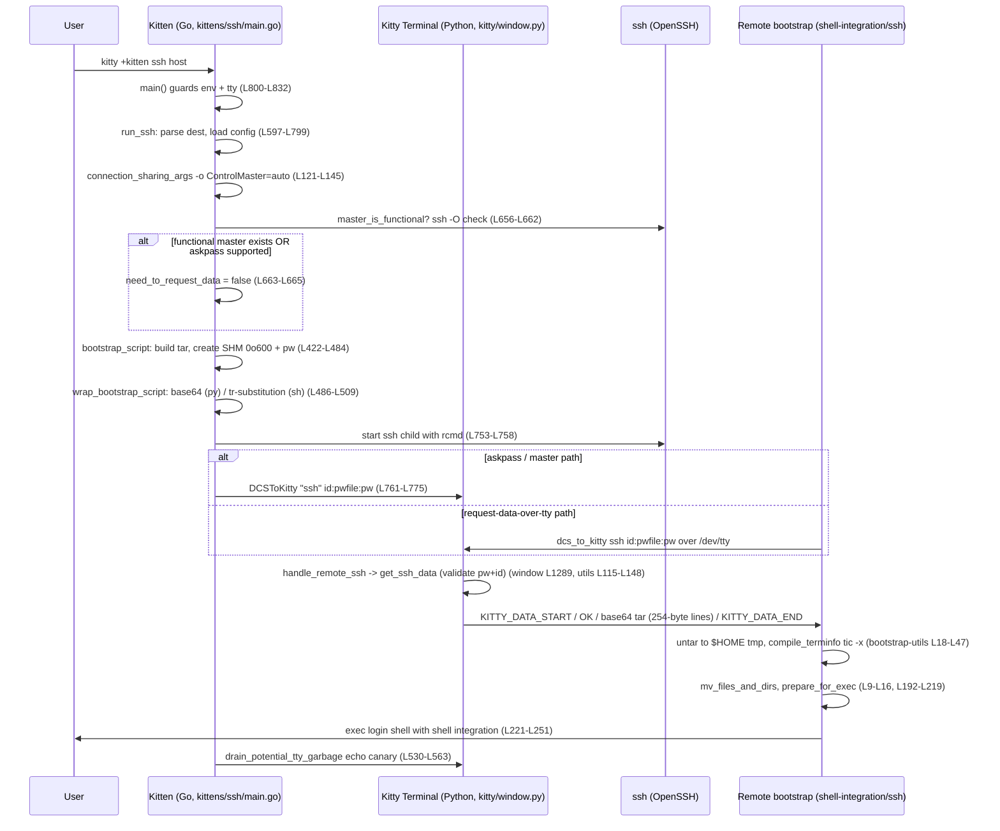

# How the kitty SSH kitten works — an end-to-end, code-cited walkthrough

> **Subsystem:** the `ssh` kitten of [kovidgoyal/kitty](https://github.com/kovidgoyal/kitty), a GPU-accelerated terminal emulator.
> **Commit documented:** `815df1e210e0a9ab4622f5c7f2d6891d7dbeddf1` (branch `kitty_815df1e210e0`).
> **Ground rule of this document:** every technical claim is backed by an inline `path:line` citation into the actual source at that commit. Where a fact comes from outside the repository (only one such fact appears — the OpenSSH version that introduced `SSH_ASKPASS_REQUIRE`), it is explicitly labelled *web-research-corroborated*. Line numbers were re-confirmed against the working tree with `grep -n`/`sed -n`; a citation such as `kittens/ssh/main.go:L121-L145` means "lines 121 through 145 of that file."

This document answers ten questions about the SSH kitten:

| # | Question |
|---|----------|
| Q1 | How does it set up a secure session and share connections? |
| Q2 | How does it use shared memory to pass credentials securely? |
| Q3 | How does it generate the bootstrap scripts that run on the remote machine? |
| Q4 | How is the archive (terminfo + shell integration) built and sent over? |
| Q5 | How does it keep track of everything it needs for a connection? |
| Q6 | How does it decide between a fresh connection and piggybacking on an existing one? |
| Q7 | How is the bootstrap script encoded, with per-shell character substitutions? |
| Q8 | What is the full end-to-end trace? |
| Q9 | Why is the shared-memory mechanism secure? |
| Q10 | How does the terminal talk back-and-forth with the remote shell during setup? |

Each Q-section gives (a) the precise answer, (b) the exact code that implements it, and (c) a *why / rationale* paragraph explaining the problem the code solves.

---

## Architecture preamble — the three layers

The SSH kitten is not a single program; it is a **three-layer system**, and understanding that split is the key to everything below. The reason for the split is fundamental: **the local machine cannot see the remote host's environment.** The kitten does not know, ahead of time, whether the remote has `python`, `base64`, the `kitty` terminfo entry, or even which login shell the user runs. So instead of assuming, the kitten ships a *self-contained bootstrap* to the remote and negotiates everything over the one channel that is guaranteed to exist during login: the controlling TTY.

**Layer 1 — the local Go executable** (`kittens/ssh/*.go`). This is the program that runs on your machine when you type `kitty +kitten ssh host`. It rewrites your `ssh` invocation, packages a payload (terminfo + shell integration) into a compressed tar, creates a shared-memory segment holding a one-time password and that payload, and finally spawns the real `ssh` binary. The orchestrator is `main.go` — see its package declaration and imports at `kittens/ssh/main.go:L1-L40`. Its entry point `main()` first *guards* that it is genuinely running inside kitty (`kittens/ssh/main.go:L800-L832`), because the kitten relies on the kitty terminal process to service its escape-sequence protocol. Supporting files are `utils.go` (locating `ssh`, parsing its version), `askpass.go` (the askpass helper), and `config.go` (per-host configuration + the tar-packaging primitives).

**Layer 2 — the in-terminal Python** (runs inside the long-lived kitty terminal process, not in the kitten). When the remote bootstrap asks for its data, that request arrives as an escape sequence that the kitty *window* intercepts and dispatches to Python. `kittens/ssh/utils.py` is the **data server**: its `get_ssh_data()` validates the request and streams the payload (`kittens/ssh/utils.py:L1-L40` for the module surface). `kittens/ssh/main.py` is *not* runnable logic — it is the `kitty.conf` option schema (a pure `Definition`); its `main()` exists only to raise an error telling you to "run as kitten ssh" (`kittens/ssh/main.py:L1-L40`, and the raise at `kittens/ssh/main.py:L224-L225`). The escape-sequence handlers themselves live on the window object in `kitty/window.py`.

**Layer 3 — the remote bootstrap scripts** (`shell-integration/ssh/`). These files travel to the remote host and execute there. `bootstrap.sh` is the POSIX-shell entry point (`shell-integration/ssh/bootstrap.sh:L1-L20`); `bootstrap.py` is a behavioural twin for when the configured interpreter is Python; and `bootstrap-utils.sh` holds sourced helpers (terminfo compilation, login-shell detection, per-shell re-exec). The remote script unpacks the tar into `$HOME`, compiles terminfo, and finally re-execs the user's real login shell with kitty's shell integration enabled.

The rest of this document follows the data in dependency order: connection state → config → connection sharing → askpass + reuse → SHM credentials → tar build → bootstrap generation/encoding → `ssh` spawn → terminal↔remote handshake → remote unpack and login-shell re-exec.

---

## Q1 — Secure session setup and connection sharing

### Answer

The kitten never re-implements SSH. Instead it **wraps** the user's `ssh` command: it discovers the real `ssh` binary, injects extra `-o` options to enable OpenSSH's native *connection multiplexing*, optionally wires up an *askpass* helper so kitty can answer prompts through its own UI, prepares the controlling terminal, appends a remote command, and then `exec`s `ssh`. The connection driver that orchestrates all of this is `run_ssh()` at `kittens/ssh/main.go:L597-L798`.

**Discovering `ssh` and its version.** The path to `ssh` is resolved once and memoized via `SSHExe` (`kittens/ssh/utils.go:L22`), and the OpenSSH version is parsed once from `ssh -V` output using the regex `OpenSSH_(\d+).(\d+)` inside the memoized `GetSSHVersion()` (`kittens/ssh/utils.go:L210-L222`, regex at `kittens/ssh/utils.go:L215`).

**Parsing the destination.** `get_destination()` (`kittens/ssh/main.go:L46-L69`) accepts both the `ssh://user@host:port` URL form and the bare `user@host` form, extracting username, hostname and port.

**Connection sharing (multiplexing).** `connection_sharing_args()` (`kittens/ssh/main.go:L121-L145`) returns the OpenSSH options that turn on multiplexing. The control-socket path template comes from `kitty/constants.py` — `ssh_control_master_template = 'kssh-{kitty_pid}-{ssh_placeholder}'` (`kitty/constants.py:L188`) — and the kitten substitutes the live pid and OpenSSH's own `%C` token (a hash of the connection parameters):

```go
cp := strings.Replace(kitty.SSHControlMasterTemplate, "{kitty_pid}", strconv.Itoa(kitty_pid), 1)  // L135
cp = strings.Replace(cp, "{ssh_placeholder}", "%C", 1)                                            // L136
return []string{
    "-o", "ControlMaster=auto",
    "-o", "ControlPath=" + filepath.Join(rd, cp),
    "-o", "ControlPersist=yes",
    "-o", "ServerAliveInterval=60",
    "-o", "ServerAliveCountMax=5",
    "-o", "TCPKeepAlive=no",
}, nil
```
(`kittens/ssh/main.go:L135-L144`.) `ControlMaster=auto` makes the first connection the *master* and lets later connections reuse it; `ControlPath` names the shared socket; `ControlPersist=yes` keeps the master alive after the first client exits; the `ServerAlive*`/`TCPKeepAlive` trio keeps the multiplexed link healthy.

**The macOS control-socket-length workaround.** OpenSSH appends a long hash plus a temporary suffix to the control-socket filename, and Unix-domain socket paths are limited to ~104 bytes. On macOS the per-user runtime/cache directory path is already long, so the full socket path easily overflows. The code documents this in the comment at `kittens/ssh/main.go:L123-L127`, and when the runtime-dir path exceeds 35 characters it symlinks it to a short `/tmp/kssh-rdir-<euid>` path and uses that instead (`kittens/ssh/main.go:L128-L134`).

**Askpass wiring.** `set_askpass()` (`kittens/ssh/main.go:L147-L169`) points `SSH_ASKPASS` at kitty's own executable and sets `KITTY_KITTEN_RUN_MODULE=ssh_askpass`, so that when OpenSSH needs a password or a yes/no confirmation it launches kitty-as-askpass instead of a raw TTY prompt:

```go
os.Setenv("SSH_ASKPASS", exe)                          // L160
os.Setenv("KITTY_KITTEN_RUN_MODULE", "ssh_askpass")    // L161
if !need_to_request_data {
    os.Setenv("SSH_ASKPASS_REQUIRE", "force")          // L162-L163
}
```
A sentinel file named `openssh-is-new-enough-for-askpass` is cached in the kitten's cache dir to avoid re-probing the ssh version (`kittens/ssh/main.go:L149`). Setting `SSH_ASKPASS_REQUIRE=force` is only safe on OpenSSH ≥ 8.4, which is exactly what the version gate `SupportsAskpassRequire()` checks — it returns true only when `Major > 8 || (Major == 8 && Minor >= 4)` (`kittens/ssh/utils.go:L206-L208`).

> **External fact (web-research-corroborated).** OpenSSH **8.4** — released **2020-09-27** — is the version that introduced the `$SSH_ASKPASS_REQUIRE` environment variable, "allow[ing] some additional control over the use of ssh-askpass … including forcibly enabling and disabling its use" (OpenSSH 8.4 release notes, `openssh.org/txt/release-8.4`). This is precisely why the kitten gates the `SSH_ASKPASS_REQUIRE=force` path behind `SupportsAskpassRequire()` returning true for ≥ 8.4 (`kittens/ssh/utils.go:L206-L208`): on older OpenSSH the variable would be ignored, so the kitten must fall back to the over-the-TTY data-request path instead.

**Preparing the controlling terminal.** Just before spawning `ssh`, the kitten opens the controlling terminal with echo disabled — `tty.OpenControllingTerm(tty.SetNoEcho)` (`kittens/ssh/main.go:L718`) — records whether echo was *originally* on so it can restore it later (`cd.echo_on = term.WasEchoOnOriginally()`, `kittens/ssh/main.go:L722`), and writes terminal color/mode setup escapes (`kittens/ssh/main.go:L726-L728`).

### Why it is built this way

Re-using one authenticated SSH session for many kitty windows is the whole point of connection sharing: it removes the per-window cost of a fresh TCP handshake, key exchange and authentication, which is what the official docs call *"re-use of existing connections to avoid connection setup latency"* (`docs/kittens/ssh.rst:L13`). Multiplexing is delegated entirely to OpenSSH (`ControlMaster`/`ControlPath`/`ControlPersist`) rather than reinvented, because that machinery is battle-tested and integrates with the user's existing `ssh` configuration. The askpass indirection exists so that password and host-key-confirmation prompts can be rendered by kitty's own UI (and answered programmatically through shared memory — see Q10) instead of leaking onto the raw login TTY, and the OpenSSH-8.4 gate ensures the kitten only relies on `SSH_ASKPASS_REQUIRE` where the running `ssh` will actually honour it.

---

## Q2 — Shared-memory credential passing

### Answer

The kitten generates a **per-session, one-time password** (`pw`) and the full payload (the base64 tar, hostname, username), and places them in a **POSIX shared-memory (SHM) segment** with owner-only permissions. The **bulk payload — the tar archive — stays in that SHM segment and is never placed on the command line**. What *does* get transmitted is a short, one-time **token** of the form `id:pwfile:pw`, which names the segment (`pwfile`), carries the request id (`id`) and the one-time password (`pw`); depending on the code path this token is either baked into the remote bootstrap command line or pushed to the kitty terminal via a DCS escape (detailed below, and revisited in Q9). This is orchestrated by `bootstrap_script()` at `kittens/ssh/main.go:L422-L484`.

**Building the secret payload.** Inside `bootstrap_script()`:

- A request id is formed from the kitty pid and window id — `request_id = KITTY_PID + "-" + KITTY_WINDOW_ID` (`kittens/ssh/main.go:L423-L425`).
- A fresh random password is generated: `pw = secrets.TokenHex()` (`kittens/ssh/main.go:L431`).
- The tar archive is built via `make_tarfile()` (`kittens/ssh/main.go:L435`; see Q4).
- The payload is JSON-serialised as `{"tarfile": base64(tar), "pw": pw, "hostname": ..., "username": ...}` (`kittens/ssh/main.go:L439-L444`).

**Creating the SHM segment.** The JSON is written into a freshly created shared-memory segment whose size is the data length plus an 8-byte slack for the size prefix:

```go
data_shm, err = shm.CreateTemp(fmt.Sprintf("kssh-%d-", os.Getpid()), uint64(len(encoded_data)+8))  // L446
err = shm.WriteWithSize(data_shm, encoded_data, 0)                                                 // L448
err = data_shm.Flush()                                                                             // L450
// ...
cd.shm_name = data_shm.Name()                                                                      // L458
```
(`kittens/ssh/main.go:L446-L458`.) The one-time token is assembled into a `sensitive_data` map containing `REQUEST_ID`, `DATA_PASSWORD` and `PASSWORD_FILENAME` (`kittens/ssh/main.go:L460`). Note carefully: `DATA_PASSWORD` **is the actual one-time password `pw`**, so this token is *not* a mere opaque pointer — it carries the password itself. What it does **not** contain is the tar payload, which remains in the SHM segment.

How that token reaches its destination depends on `cd.request_data` (the flag computed during reuse/askpass setup — see Q6):

- **Request-data path (`cd.request_data == true`).** The token is copied into the substitution map `sd` (`kittens/ssh/main.go:L475-L478`) and substituted into the bootstrap script by `prepare_script()` (`kittens/ssh/main.go:L482`). `wrap_bootstrap_script()` then encodes that script (base64 for Python, `tr`-substitution for POSIX `sh` — `kittens/ssh/main.go:L486-L508`; see Q7) and the encoded result is appended to the `ssh` argv (`cmd = append(cmd, cd.rcmd...)` at `kittens/ssh/main.go:L753`). **So on this path the one-time `pw` *does* appear — base64- or `tr`-encoded — in the command line passed to `ssh`, and therefore in the command `sshd` runs under the remote login shell.** The remote `bootstrap.sh` then echoes the same `id:pwfile:pw` token back to the kitty terminal over `/dev/tty` to fetch the payload (`shell-integration/ssh/bootstrap.sh:L92-L95`).
- **Askpass / master path (`cd.request_data == false`).** The token is *not* substituted into the script (`sd` is the plain clone of `replacements` without `sensitive_data`). Instead, after spawning `ssh`, the kitten sends `id=…:pwfile=…:pw=…` to its **local** kitty terminal via a DCS escape over the controlling TTY (`kittens/ssh/main.go:L761-L766`).

**The SHM primitive.** The underlying `SharedMemory` class lives in `kitty/shm.py`. Its name is randomised (`name = prefix + secrets.token_hex(nbytes)`, `kitty/shm.py:L31`), it defaults to permission mode `S_IREAD | S_IWRITE` = `0o600` (`kitty/shm.py:L51`) with default prefix `'kitty-'` (`kitty/shm.py:L52`), and it is opened with `os.O_CREAT | os.O_EXCL` (`kitty/shm.py:L62`). Data is length-prefixed using a 4-byte big-endian unsigned integer (`size_fmt = '!I'` at `kitty/shm.py:L46`, `num_bytes_for_size` at `kitty/shm.py:L47`), via `write_data_with_size` (`kitty/shm.py:L115`) and `read_data_with_size` (`kitty/shm.py:L122`); the segment can be removed with `unlink()` (`kitty/shm.py:L175`). The terminal-side helper `create_shared_memory()` mirrors this on the Python side: it `json.dumps` the data, sizes a `SharedMemory(size=len(db)+SharedMemory.num_bytes_for_size, ...)`, calls `write_data_with_size`, and registers `atexit.register(shm.unlink)` so the segment is cleaned up (`kittens/ssh/utils.py:L87-L97`).

### Why it is built this way

Command-line arguments and environment variables are **not private**: any process running as any user can read another process's `argv` and environment through `ps` or `/proc/<pid>/{cmdline,environ}`, and they typically persist for the lifetime of the process. The bulk of what must reach the remote is the **payload** — a gzipped, base64-encoded tar (terminfo, shell integration, the serialised environment) that is far too large and binary to pass as a command-line argument — and the same SHM JSON also holds the one-time `pw` itself (`kittens/ssh/main.go:L439-L444`). Putting *all of that* in a shared-memory segment created with `O_CREAT | O_EXCL` and mode `0o600` keeps it out of `argv`/env entirely: only processes running as the same user can open it, it cannot be silently clobbered or symlink-raced into existence (`O_EXCL` guarantees creation), and — as Q9 details — it is unlinked on first read so it can be consumed exactly once.

The design does **not** try to keep the small `id:pwfile:pw` token off the wire — and indeed it cannot, because that token is how the remote (or the kitten) tells the kitty terminal *which* segment to hand over. On the request-data path the token is encoded into the bootstrap script that becomes the `ssh` command line (`kittens/ssh/main.go:L475-L482`, `L486-L508`, `L753`), so the one-time `pw` is visible — encoded — in `argv` on both ends; on the askpass/master path it is sent to the local kitty terminal via a DCS escape instead (`kittens/ssh/main.go:L761-L766`). That exposure is deliberately acceptable because the password is **single-use**: it unlocks exactly one read of an owner-only segment that is then unlinked, and `get_ssh_data()` additionally binds it to the matching `KITTY_PID-WINDOW_ID` request id (Q9). Once that one read happens, the leaked `pw` is worthless. In short: the *bulk* secret never leaves owner-only memory, while the *one-time* token is allowed to transit precisely because compromising it buys an attacker nothing after the legitimate read.

---

## Q3 — Bootstrap script generation

### Answer

The remote side needs a script to run, and that script has to be chosen and parameterised on the *local* side because only the local side knows the session's configuration. Two decisions drive generation: **which template** (`sh` vs `py`) and **what values** to substitute into it.

**Choosing the template.** `get_remote_command()` (`kittens/ssh/main.go:L511-L525`) decides the script type from the configured interpreter's basename:

```go
is_python := strings.Contains(strings.ToLower(path.Base(cd.host_opts.Interpreter)), "python")  // L513-L514
cd.script_type = "sh"
if is_python {
    cd.script_type = "py"
}
```
(`kittens/ssh/main.go:L513-L518`.) It then calls `bootstrap_script()` (`kittens/ssh/main.go:L519`) and `wrap_bootstrap_script()` (`kittens/ssh/main.go:L523`; see Q7). The `interpreter` option defaults to `sh` (`kittens/ssh/main.py:L87`), so by default the POSIX-shell bootstrap is used.

**Loading and parameterising the template.** The template text is the actual repo file, selected by script type, loaded inside `bootstrap_script()` from kitty's embedded shell-integration data: `shell_integration.Data()["shell-integration/ssh/bootstrap."+cd.script_type]` (`kittens/ssh/main.go:L481`), then passed through `prepare_script()` (`kittens/ssh/main.go:L482`). `prepare_script()` (`kittens/ssh/main.go:L407-L420`) does placeholder substitution: it ensures defaults for `EXEC_CMD` / `EXPORT_HOME_CMD` (`kittens/ssh/main.go:L408-L413`) and replaces every `\bKEY\b` word-boundary token in the template with its value using a compiled regex (`kittens/ssh/main.go:L416-L419`). The placeholders are exactly the tokens you can see verbatim in the templates — e.g. `REQUEST_DATA`, `REQUEST_ID`, `PASSWORD_FILENAME`, `DATA_PASSWORD`, `EXEC_CMD`, `TEST_SCRIPT` in `shell-integration/ssh/bootstrap.sh`.

### Why it is built this way

The remote interpreter is configurable precisely because remote hosts differ: some have a modern Python, some are minimal boxes where only a POSIX `sh` is guaranteed. By selecting an `sh` or `py` bootstrap, the kitten runs natively on whatever the remote provides — `sh` for maximum portability (the default), `py` when the user prefers or requires Python. Generating the script locally and substituting concrete values (the request id, the SHM pointer, the exec command) means the remote script arrives ready to run with no further local round-trips needed just to learn its own parameters.

---

## Q4 — Archive build and transfer

### Answer

For kitty's features to work over SSH, the remote host needs kitty's **terminfo** entry and its **shell-integration** files. The kitten packages all of that into a single compressed tar and streams it to the remote over the already-open TTY, base64-encoded.

**Building the tar.** `make_tarfile()` (`kittens/ssh/main.go:L255-L366`) produces a **gzip (best-compression) + PAX tar**: the gzip writer is created at best compression (`kittens/ssh/main.go:L259`) wrapping a tar writer (`kittens/ssh/main.go:L263`). Every entry is forced to be at least owner read/write:

```go
// some distro's like nix mess with installed file permissions so ensure
// files are at least readable and writable by owning user
h.Mode |= 0o600  // L269
```
(`kittens/ssh/main.go:L267-L269`.) The archive contents are, in order:

- the user's `+copy` files, if any (`kittens/ssh/main.go:L282-L287`);
- the generated `data.sh` env script (`kittens/ssh/main.go:L321`; see `serialize_env` below);
- `bootstrap-utils.sh`, but only when `script_type == "sh"` (`kittens/ssh/main.go:L324-L328`);
- when shell integration is enabled (i.e. `ksi != ""` — the effective `KITTY_SHELL_INTEGRATION` value returned by `serialize_env()` is non-empty), the shell-integration tree, **excluding** the `ssh/*` bootstrap files themselves (they are sent as command-line args instead) and the legacy `zsh/kitty.zsh` backward-compat file; this whole block is gated by `if ksi != "" { ... }` at `kittens/ssh/main.go:L329-L341`;
- optionally a `version` marker plus the `kitty`/`kitten` binaries when `remote_kitty != no` (`kittens/ssh/main.go:L342-L354`);
- terminfo: `home/.terminfo/kitty.terminfo` (`kittens/ssh/main.go:L355`) and `home/.terminfo/x/<DefaultTermName>` (`kittens/ssh/main.go:L357`).

**Building the env script.** `serialize_env()` (`kittens/ssh/main.go:L204-L253`) constructs the ordered list of environment instructions that becomes `data.sh` — `TERM`, `COLORTERM=truecolor`, the host `env`, `KITTY_WINDOW_ID`, `WINDOWID`, `KITTY_SHELL_INTEGRATION`, `KITTY_SSH_KITTEN_DATA_DIR`, `KITTY_LOGIN_SHELL`, `KITTY_LOGIN_CWD`, `KITTY_REMOTE`, `KITTY_PUBLIC_KEY` and `KITTY_LISTEN_ON` — returning the serialised script text at `kittens/ssh/main.go:L252`. (The `EnvInstruction` type and its `Serialize`/`final_env_instructions` helpers live in `kittens/ssh/config.go:L28-L108`.)

**Transfer and framing.** The tar is base64-encoded and streamed by the terminal-side data server `get_ssh_data()` (`kittens/ssh/utils.py:L115-L148`). It is bracketed by sentinel lines and chopped into short lines:

```python
yield b'\nKITTY_DATA_START\n'   # L117 — discard leading data
# ... validate pw + id ...
yield b'OK\n'                    # L138
# macOS has a 255 byte limit on its input queue as per man stty.  (L140-L142)
line_sz = 254                    # L143
while encoded_data:
    yield encoded_data[:line_sz]
    yield b'\n'
    encoded_data = encoded_data[line_sz:]
yield b'KITTY_DATA_END\n'        # L148
```
(`kittens/ssh/utils.py:L117-L148`.) On the remote, `read_base64_from_tty()` reads lines until it sees `KITTY_DATA_END` (`shell-integration/ssh/bootstrap.sh:L97`, terminator check at L99), and `untar_and_read_env()` pipes the decoded stream straight into tar: `read_base64_from_tty | base64_decode | command tar "xpzf" "-" "-C" "$tdir"` (`shell-integration/ssh/bootstrap.sh:L113`), after first `mktemp`-ing a staging dir under `$HOME` with `umask 000` (`shell-integration/ssh/bootstrap.sh:L108-L111`).

### Why it is built this way

The remote may be a locked-down host with no ability to open a second connection back, no `scp`, and no pre-installed kitty terminfo. Bundling terminfo + shell integration into one gzip stream and pushing it through the **already-authenticated** TTY avoids a second connection entirely and works even where outbound/inbound transfers are restricted. The `h.Mode |= 0o600` line exists because some distributions (the comment names nix) ship files that are not user-readable, which would otherwise make the untarred files unusable. And the 254-byte line chopping is a concrete portability fix: macOS's `stty` input queue caps at 255 bytes, so longer lines could be silently truncated in canonical-mode TTY input — staying at 254 keeps each line safely under the limit. The `KITTY_DATA_START` / `OK` / `KITTY_DATA_END` sentinels let the remote reliably find the payload boundaries amid any other bytes on the TTY.

---

## Q5 — Connection bookkeeping (state)

### Answer

The kitten tracks per-connection state in two places: a rich Go struct on the local orchestration side, and a small NamedTuple on the terminal/Python side.

**Local: the `connection_data` struct** (`kittens/ssh/main.go:L171-L189`). It holds everything needed to build and send the payload for one connection:

| Field | Purpose |
|-------|---------|
| `remote_args []string` | the trailing argv to run on the remote (the user's remote command, if any) |
| `host_opts *Config` | the resolved per-host configuration (from `load_config`) |
| `hostname_for_match string` | hostname used for per-host config matching |
| `username string` | the SSH username |
| `echo_on bool` | whether the controlling terminal's echo was originally on (so it can be restored) |
| `request_data bool` | whether the remote must request the payload over the TTY (vs. the kitten pushing the SHM pointer itself) |
| `literal_env map[string]string` | environment values to pass through literally |
| `listen_on string` | remote-control listen address, when remote control is forwarded |
| `test_script string` | a hook used by the integration tests |
| `dont_create_shm bool` | suppresses SHM creation (used in testing) |
| `shm_name string` | the name of the created shared-memory segment |
| `script_type string` | `"sh"` or `"py"` — which bootstrap template was chosen |
| `rcmd []string` | the final remote command argv (`exec interpreter -c <unwrap> <encoded>`) |
| `replacements map[string]string` | the placeholder→value substitution map for the template |
| `request_id string` | `KITTY_PID-KITTY_WINDOW_ID`, binding the payload to this window |
| `bootstrap_script string` | the fully prepared (pre-encoding) bootstrap text |

**Terminal-side: the `SSHConnectionData` NamedTuple** (`kitty/utils.py:L953-L958`):

```python
class SSHConnectionData(NamedTuple):
    binary: str
    hostname: str
    port: Optional[int] = None
    identity_file: str = ''
    extra_args: Tuple[Tuple[str, str], ...] = ()
```
This is the *parsed view* of the connection from the terminal's perspective, built by `get_connection_data()` (`kittens/ssh/utils.py:L258`).

### Why it is built this way

The two structures serve two different jobs. The Go `connection_data` is *local orchestration state* — it accumulates, step by step, everything the kitten must compute before it can spawn `ssh`: the chosen template, the SHM name, the request id, the encoded remote command, the substitution map. It is mutated in place as `run_ssh()` proceeds. The Python `SSHConnectionData` is a much smaller *descriptor* used inside the terminal process to identify and track a connection (for example, to match control-master sockets for cleanup — see Q6). Keeping them separate respects the layer boundary: the local kitten needs build-time detail; the terminal only needs enough to recognise the connection.

---

## Q6 — Connection reuse decision

### Answer

When connection sharing is enabled, the kitten asks OpenSSH whether a **live master already exists** for this destination. If one does, it skips re-sending the (potentially large) payload and simply *piggybacks* on the existing master.

**Probing the master.** Inside `run_ssh()`, `master_is_functional` is a **local closure** (not a top-level function) that memoizes its answer and runs `ssh -O check`:

```go
master_is_functional := func() bool {
    if master_checked {
        return master_is_alive
    }
    master_checked = true
    check_cmd := slices.Insert(cmd, 1, "-O", "check")                            // L658
    master_is_alive = exec.Command(check_cmd[0], check_cmd[1:]...).Run() == nil  // L659
    return master_is_alive
}
```
(`kittens/ssh/main.go:L653-L661`.) `ssh -O check` is OpenSSH's own "is the control master alive?" query; it returns success only when a functional master is listening on the `ControlPath` socket.

**The reuse branch.** The decision itself is a single guarded assignment:

```go
if need_to_request_data && host_opts.Share_connections && master_is_functional() {
    need_to_request_data = false
}
```
(`kittens/ssh/main.go:L663-L664`.) Setting `need_to_request_data = false` means the remote will *not* be asked to pull the payload over the TTY — the shell integration is already present from the earlier master connection.

**Cleanup of masters.** When kitty exits it tears down the masters it created: `cleanup_ssh_control_masters()` (`kitty/utils.py:L1038-L1050`) globs `runtime_dir()/kssh-<pid>-*` (`kitty/utils.py:L1042-L1043`) and runs `ssh -o ControlPath=<x> -O exit kitty-unused-host-name` for each (`kitty/utils.py:L1046-L1047`). The glob pattern derives from the same `ssh_control_master_template = 'kssh-{kitty_pid}-{ssh_placeholder}'` (`kitty/constants.py:L188`) used to create them.

### Why it is built this way

Re-sending the tar and re-running terminfo compilation (`tic -x`) on **every** new window would be wasteful — both in bandwidth over the TTY and in CPU on the remote. If a live master exists, the remote already has shell integration set up, so the data request is pure overhead and is skipped. This is the mechanism behind the documented promise of *"automatic re-use of existing connections to avoid connection setup latency"* (`docs/kittens/ssh.rst:L13`). Memoizing the `ssh -O check` result in the closure avoids running the probe more than once per `run_ssh()` invocation, and the explicit `cleanup_ssh_control_masters()` ensures kitty does not leave orphaned master sockets behind when it quits.

---

## Q7 — Bootstrap encoding with per-shell character substitutions

### Answer

`sshd` joins the remote command argv with spaces and hands it to the user's login shell with `-c`. The wrapper must therefore survive being re-quoted by an *unknown* remote shell. `wrap_bootstrap_script()` (`kittens/ssh/main.go:L486-L509`) solves this by emitting `interpreter -c <unwrap_script> <encoded_script>`, choosing the encoding by interpreter type. The constraint is spelled out in the comment at `kittens/ssh/main.go:L487-L494`.

**Python path** (`script_type == "py"`) — straightforward base64:

```go
encoded_script = base64.StdEncoding.EncodeToString(utils.UnsafeStringToBytes(cd.bootstrap_script))  // L498
unwrap_script = `"import base64, sys; eval(compile(base64.standard_b64decode(sys.argv[-1]), 'bootstrap.py', 'exec'))"`  // L499
```
(`kittens/ssh/main.go:L498-L499`.) The remote Python decodes the last argv element and `exec`s it.

**POSIX-shell path** (base64 may be unavailable remotely) — portable quoting via character substitution and a remote `tr`:

```go
// We can't rely on base64 being available on the remote system, so instead
// we quote the bootstrap script by replacing ' and \ with \v and \f
// also replacing \n and ! with \r and \b for tcsh
// finally surrounding with '
encoded_script = "'" + strings.NewReplacer("'", "\v", "\\", "\f", "\n", "\r", "!", "\b").Replace(cd.bootstrap_script) + "'"  // L505
unwrap_script = `'eval "$(echo "$0" | tr \\\v\\\f\\\r\\\b \\\047\\\134\\\n\\\041)"' `  // L506
```
(`kittens/ssh/main.go:L501-L506`.) Finally the remote command is assembled:

```go
cd.rcmd = []string{"exec", cd.host_opts.Interpreter, "-c", unwrap_script, encoded_script}  // L508
```
(`kittens/ssh/main.go:L508`.)

The substitution is a reversible mapping. The forward map (local) and the reverse `tr` (remote) line up exactly:

| Original char | Encoded as | Remote `tr` octal restoring it |
|---------------|-----------|--------------------------------|
| `'` (single quote) | `\v` (vertical tab) | `\047` = `'` |
| `\` (backslash) | `\f` (form feed) | `\134` = `\` |
| newline | `\r` (carriage return) | `\n` = newline |
| `!` (bang) | `\b` (backspace) | `\041` = `!` |

The comment at `kittens/ssh/main.go:L501-L503` explicitly notes that the newline→`\r` and `!`→`\b` mappings exist **for tcsh**: tcsh treats `!` as history expansion and handles embedded newlines specially, so those two characters must be hidden from it. The encoded script becomes `$0` in the remote shell, and `eval "$(echo "$0" | tr ...)"` runs the restored text. The sh-encoded form is consumed by the remote `shell-integration/ssh/bootstrap.sh` (the `tr`-based unwrap string is passed as the `-c` argument).

### Why it is built this way

You simply cannot assume `base64` exists on every remote shell host, so the POSIX path uses nothing but ultra-portable single-quoting plus `tr` (both mandated by POSIX). The four substituted characters — `'`, `\`, newline, `!` — are *exactly* the ones that would break a single-quoted command string (`'` ends the quote, `\` is an escape) or be mangled by tcsh (newline, `!`). By swapping them for control characters that never appear in the generated script and reversing the swap with `tr` on the remote, the kitten ships an arbitrary script through an arbitrary shell's `-c` without corruption. The Python path can be simpler because any Python that exists also has `base64` in its standard library.

---

## Q8 — End-to-end trace

### Answer

Putting the pieces together, here is the full lifecycle from `kitty +kitten ssh host` to a logged-in remote shell with kitty shell integration.

1. **Entry + guards.** `main()` (`kittens/ssh/main.go:L800-L832`) handles the `use-python` backward-compatibility flag (`kittens/ssh/main.go:L803-L804`), parses args via `ParseSSHArgs` (`kittens/ssh/main.go:L810`), and **guards** that it is running inside kitty: it requires both `KITTY_WINDOW_ID` and `KITTY_PID` to be set (`kittens/ssh/main.go:L825-L827`) and STDIN to be a terminal via `tty.IsTerminal(os.Stdin.Fd())` (`kittens/ssh/main.go:L828-L830`), then dispatches to `run_ssh()` (`kittens/ssh/main.go:L831`).
2. **Driver setup.** `run_ssh()` (`kittens/ssh/main.go:L597-L798`) builds the base `ssh` command from `SSHExe()` (`kittens/ssh/main.go:L606`), parses the destination (`get_destination`, `kittens/ssh/main.go:L614`), and loads per-host config (`load_config`, `kittens/ssh/main.go:L619`).
3. **Connection sharing.** If sharing is enabled, `connection_sharing_args()` injects `-o ControlMaster=auto` etc. (`kittens/ssh/main.go:L121-L145`), inserted into the command (`kittens/ssh/main.go:L642-L646`).
4. **Askpass + reuse decision.** `use_kitty_askpass` is computed (`kittens/ssh/main.go:L648`), `set_askpass()` wires the env (`kittens/ssh/main.go:L651`), and the reuse branch flips `need_to_request_data` to false if a live master is found via the `master_is_functional` closure (`kittens/ssh/main.go:L653-L664`).
5. **SHM + password.** `bootstrap_script()` builds the tar, generates the one-time password, and creates the `0o600` SHM segment (`kittens/ssh/main.go:L422-L484`).
6. **Encoding.** `wrap_bootstrap_script()` encodes the script — base64 for Python, `tr`-substitution for POSIX shells (`kittens/ssh/main.go:L486-L509`).
7. **Controlling TTY.** The kitten opens the controlling terminal with echo off (`kittens/ssh/main.go:L718`), records original echo (`kittens/ssh/main.go:L722`), and writes color/mode escapes (`kittens/ssh/main.go:L726-L728`).
8. **Spawn `ssh`.** The remote command is appended (`kittens/ssh/main.go:L753`) and the child is started:

   ```go
   c := exec.Command(cmd[0], cmd[1:]...)  // L754
   // ...
   err = c.Start()                         // L756
   ```
   (`kittens/ssh/main.go:L753-L756`.)
9. **Hand off the one-time token (askpass/master path).** When `!cd.request_data` (i.e. the remote will *not* request data over the TTY), the kitten itself sends the one-time `id:pwfile:pw` token to the kitty terminal via a DCS escape:

   ```go
   if !cd.request_data {                                                                                  // L761
       rq := fmt.Sprintf("id=%s:pwfile=%s:pw=%s", cd.replacements["REQUEST_ID"], cd.replacements["PASSWORD_FILENAME"], cd.replacements["DATA_PASSWORD"])  // L762
       // ...
       dcs, err = tui.DCSToKitty("ssh", rq)                                                               // L766
   ```
   (`kittens/ssh/main.go:L761-L766`.) On the alternative *request-data-over-TTY* path, it is the remote `bootstrap.sh` that emits the `@kitty-ssh` DCS over `/dev/tty` (`shell-integration/ssh/bootstrap.sh:L92-L95`).
10. **Terminal services the request.** Inside the kitty process, `handle_remote_ssh()` calls `get_ssh_data()`, which validates the password and request id and streams `KITTY_DATA_START` / `OK` / base64 tar (254-byte lines) / `KITTY_DATA_END` (`kitty/window.py:L1289-L1292`, `kittens/ssh/utils.py:L115-L148`).
11. **Remote unpack + terminfo + re-exec.** The remote `untar_and_read_env()` extracts into a temp dir under `$HOME` (`shell-integration/ssh/bootstrap.sh:L104-L115`); `compile_terminfo()` runs `tic -x` (`shell-integration/ssh/bootstrap-utils.sh:L18-L47`, the actual `command tic -x -o "$1/$tname" "$1/.terminfo/kitty.terminfo"` at `shell-integration/ssh/bootstrap-utils.sh:L44`); `mv_files_and_dirs()` moves files into place (`shell-integration/ssh/bootstrap-utils.sh:L9`); `prepare_for_exec()` (`shell-integration/ssh/bootstrap-utils.sh:L192`) and finally `exec_login_shell()` (`shell-integration/ssh/bootstrap-utils.sh:L221`) re-exec the user's detected login shell with shell integration.
12. **Drain the TTY.** After the `ssh` child exits (`c.Wait()` at `kittens/ssh/main.go:L782`), `drain_potential_tty_garbage()` (`kittens/ssh/main.go:L783`, defined at `kittens/ssh/main.go:L530-L563`) flushes any stray bytes (see Q10).

The following sequence diagram captures this flow. (Its inline line numbers are taken from the design spec and may be ±1–2 lines from the live file; the re-confirmed numbers are the ones used in the prose above.)



### Why it is built this way

The ordering is forced by dependencies: the kitten must know the config before it can decide on sharing; it must decide on sharing/reuse before it knows whether to build a payload; it must build the payload and create the SHM *before* it spawns `ssh`, because once `ssh` runs, the remote bootstrap may immediately ask for the data. The env/tty guards at the very top exist because the kitten is useless outside kitty — its entire protocol depends on the kitty terminal process being on the other end of the TTY to service `@kitty-ssh` / `@kitty-ask` / `@kitty-echo` escapes. Spawning the real `ssh` rather than reimplementing the protocol means the kitten inherits all of OpenSSH's authentication, configuration and security behaviour for free.

---

## Q9 — Shared-memory security (consolidated model)

### Answer

The SHM mechanism is defended in depth. Both the Go reader and the Python reader re-verify ownership and permissions, the segment is unlinked on first read, and the data server additionally matches the password and request id before serving a single byte.

**Go reader** — `read_data_from_shared_memory()` (`kittens/ssh/main.go:L72-L85`):

```go
data, err := shm.ReadWithSizeAndUnlink(shm_name, func(s fs.FileInfo) error {
    if stat, ok := s.Sys().(unix.Stat_t); ok {
        if os.Getuid() != int(stat.Uid) || os.Getgid() != int(stat.Gid) {
            return fmt.Errorf("Incorrect owner on SHM file")        // L76
        }
    }
    if s.Mode().Perm() != 0o600 {
        return fmt.Errorf("Incorrect permissions on SHM file")      // L80
    }
    return nil
})
```
(`kittens/ssh/main.go:L72-L85`.) Note `ReadWithSizeAndUnlink` — the read and the unlink are one operation.

**Python reader** — `read_data_from_shared_memory()` (`kittens/ssh/utils.py:L100-L112`):

```python
with SharedMemory(shm_name, readonly=True) as shm:
    shm.unlink()                                                              # L106
    if shm.stats.st_uid != os.geteuid() or shm.stats.st_gid != os.getegid():
        raise ValueError(f'Incorrect owner on pwfile: ...')                   # L107-L108
    mode = stat.S_IMODE(shm.stats.st_mode)
    if mode != stat.S_IREAD | stat.S_IWRITE:
        raise ValueError(f'Incorrect permissions on pwfile: 0o{mode:03o}')    # L109-L111
    return json.loads(shm.read_data_with_size())                             # L112
```
(`kittens/ssh/utils.py:L100-L112`.) It opens read-only (`kittens/ssh/utils.py:L105`), unlinks immediately (`kittens/ssh/utils.py:L106`), then validates owner and mode.

**Password + request-id matching** — `get_ssh_data()` (`kittens/ssh/utils.py:L115-L148`) parses the wire message (base64, then `md = dict(x.split('=', 1) for x in msg.split(':'))` at `kittens/ssh/utils.py:L120`, keys `pw`/`pwfile`/`id` at `kittens/ssh/utils.py:L121-L123`) and refuses to serve unless both match:

```python
env_data = read_data_from_shared_memory(pwfilename)
if pw != env_data['pw']:
    raise ValueError('Incorrect password')                  # L131
if rq_id != request_id:
    raise ValueError(f'Incorrect request id: ...')          # L133
```
(`kittens/ssh/utils.py:L129-L133`.) Here `request_id` is the terminal's own `KITTY_PID-KITTY_WINDOW_ID` (passed in by `handle_remote_ssh` as `f'{os.getpid()}-{self.id}'`).

**The security properties, enumerated:**

1. **Ephemeral, owner-only, race-free creation** — the segment is created with `O_CREAT | O_EXCL` (`kitty/shm.py:L62`) and mode `0o600` (`kitty/shm.py:L51`), so it cannot be pre-created, clobbered, or symlink-raced, and only the same user can open it.
2. **Owner + permission re-verification on read** — both readers re-check uid/gid and exact `0o600` mode before trusting the contents (`kittens/ssh/main.go:L75-L81`, `kittens/ssh/utils.py:L107-L111`).
3. **Single-read unlink** — the segment is unlinked as part of the read (`shm.ReadWithSizeAndUnlink` on the Go side; `shm.unlink()` first thing on the Python side, `kittens/ssh/utils.py:L106`), so only one consumer can ever obtain the data.
4. **Password + request-id binding** — `get_ssh_data()` ties the payload to this exact kitty window via the one-time `pw` and the `KITTY_PID-WINDOW_ID` id (`kittens/ssh/utils.py:L131-L133`).
5. **Bulk payload confined to SHM; the transmitted token is single-use** — the tar payload (terminfo, shell integration, serialised env) is held only in the owner-only SHM segment and is never placed on the command line. The one-time token `id:pwfile:pw` *is* transmitted, and the `pw` it carries is the real one-time password, not an opaque handle: on the request-data path it is substituted into the bootstrap script that becomes the `ssh` argv (`kittens/ssh/main.go:L460`, `L475-L482`, `L486-L508`, `L753`) and is echoed back by the remote (`shell-integration/ssh/bootstrap.sh:L92-L95`); on the askpass/master path the kitten pushes it to the kitty terminal via DCS (`kittens/ssh/main.go:L761-L766`). This is safe rather than contradictory because the password is single-use: the segment is unlinked on the first read (property #3) and the read is bound to `KITTY_PID-WINDOW_ID` (property #4), so a captured `pw` confers at most one read of an already-consumed segment.

### Why it is built this way

This is textbook defense-in-depth. Even if an attacker somehow *guessed* or *raced* the random `token_hex` segment name, they would still have to be the same user (owner check), the segment would still be `0o600` (permission check), they would need the matching one-time password and the exact `KITTY_PID-WINDOW_ID` (password + id checks), and — crucially — the legitimate read **unlinks** the segment, so there is exactly one shot at the data. No single check is load-bearing alone; the layered checks mean a failure or bypass of any one does not expose the credentials.

---

## Q10 — Terminal ↔ remote communication during setup

### Answer

Before the remote login shell exists, the only reliable bidirectional channel is the **controlling TTY**. So the kitten builds a small protocol on top of DCS (Device Control String) escape sequences that the kitty terminal intercepts. The verbs are:

| DCS verb | Direction | Meaning | Handler |
|----------|-----------|---------|---------|
| `@kitty-ssh` | remote/kitten → terminal | "send me the payload for this `id:pwfile:pw`" | `handle_remote_ssh` (`kitty/window.py:L1289-L1292`) |
| `@kitty-ask` | askpass helper → terminal | "ask the user this question (password / confirm / choose)" | `handle_remote_askpass` (`kitty/window.py:L1351-L1380`) |
| `@kitty-echo` | kitten → terminal | "echo this canary back" (TTY drain) | `handle_remote_echo` (`kitty/window.py:L1282-L1287`) |

**`handle_remote_echo` — with anti-injection filtering** (`kitty/window.py:L1282-L1287`):

```python
def handle_remote_echo(self, msg: memoryview) -> None:
    data = base64_decode(msg)
    # ensure we are not writing any control char back as this can lead to command injection on shell prompts
    # Any bytes outside the printable ASCII range are removed.
    data = re.sub(rb'[^ -~]', b'', data)   # L1286
    self.write_to_child(data)
```
The regex `rb'[^ -~]'` strips every byte outside the printable-ASCII range `0x20`–`0x7e` before writing back to the child.

**`handle_remote_ssh`** (`kitty/window.py:L1289-L1292`) calls `get_ssh_data(msg, f'{os.getpid()}-{self.id}')` and writes each yielded line to the child — this is the server side of the payload transfer (Q4/Q9).

**`handle_remote_askpass`** (`kitty/window.py:L1351-L1380`) reads the question from a read-only SHM segment, then provides a `callback` that writes the user's answer back into that segment and sets its first byte to `1` to signal completion; it dispatches the appropriate UI (`confirm` / `choose` / `get_line`) through the boss.

**The askpass helper side** — `RunSSHAskpass()` (`kittens/ssh/askpass.go:L37`) is entered when kitty runs *itself* as `SSH_ASKPASS`. It writes the question to an `askpass-*` SHM segment, sets the first byte to 0, then triggers the ask by emitting the `@kitty-ask` DCS via `trigger_ask()`:

```go
_, err = term.WriteString("\x1bP@kitty-ask|" + name + "\x1b\\")   // L30
```
(`kittens/ssh/askpass.go:L24-L35`.) It then polls until the terminal sets the first byte to 1, reads the answer back from SHM, and prints it for `ssh` to consume.

**The remote side** — `dcs_to_kitty()` in the bootstrap emits the DCS over `/dev/tty`:

```sh
dcs_to_kitty() { printf "\033P@kitty-$1|%s\033\134" "$(printf "%s" "$2" | base64_encode)" > /dev/tty; }   # L75
```
(`shell-integration/ssh/bootstrap.sh:L75`.) The request-data path writes `@kitty-ssh` itself:

```sh
[ "$request_data" = "1" ] && {
    command stty "-echo" < /dev/tty
    dcs_to_kitty "ssh" "id="REQUEST_ID":pwfile="PASSWORD_FILENAME":pw="DATA_PASSWORD""   # L94
}
```
(`shell-integration/ssh/bootstrap.sh:L92-L95`.) Because `base64` may be missing remotely, the bootstrap auto-detects an encoder from the chain `base64` → `openssl` → `b64encode` → python `pybase64` → `perl`, and `die`s if none is found (`shell-integration/ssh/bootstrap.sh:L55-L72`). The Python parity encoder is `dcs_to_kitty()` at `shell-integration/ssh/bootstrap.py:L73-L77`.

**Draining the TTY after exit** — `drain_potential_tty_garbage()` (`kittens/ssh/main.go:L530-L563`) sets the TTY raw (`kittens/ssh/main.go:L531`), emits a `@kitty-echo` DCS carrying a random `secrets.TokenHex()` canary (`kittens/ssh/main.go:L535`, `kittens/ssh/main.go:L539`, written at `kittens/ssh/main.go:L544`), and reads until that canary echoes back, with a **2-second timeout** (`kittens/ssh/main.go:L549-L562`).

### Why it is built this way

During login there is no remote shell yet and no second connection — the controlling TTY is the *only* channel, so the protocol has to live in escape sequences that pass transparently through `ssh` and are caught by the kitty terminal. DCS is the natural carrier: it is a standard terminal escape that won't be displayed and is easy to frame (`\033P … \033\\`). Two safety mechanisms matter especially: the `re.sub(rb'[^ -~]', b'', data)` filter in `handle_remote_echo` prevents a malicious or buggy remote from injecting control characters (which could otherwise run commands at a shell prompt), and the echo-canary drain flushes any leftover protocol bytes the remote may have emitted after the child exits, so they don't bleed into the user's next prompt — the 2-second timeout bounds the wait so a misbehaving remote can't hang the kitten.

---

## Closing cross-reference

The behaviour documented above is corroborated by the kitten's own Go unit tests and by the official reStructuredText documentation. (These files are read-only references; nothing here was modified.)

**Go unit tests** (run with `go test ./kittens/ssh/...`):

- `kittens/ssh/main_test.go` — `TestCloneEnv` (`kittens/ssh/main_test.go:L25`); `TestSSHBootstrapScriptLimit` (`kittens/ssh/main_test.go:L66`) asserts the bootstrap command-size constraint; `TestSSHTarfile` (`kittens/ssh/main_test.go:L81`) asserts the tar entries are owner-readable (`fi.Mode().Perm() & 0o600` check at `kittens/ssh/main_test.go:L125`), that `data.sh` is present (`kittens/ssh/main_test.go:L134`), and that the terminfo entries are present (`kittens/ssh/main_test.go:L137`) — directly confirming the `make_tarfile()` behaviour described in Q4.
- `kittens/ssh/config_test.go` — `TestSSHConfigParsing` (`kittens/ssh/config_test.go:L22`) confirms per-host config parsing (Q1/Q5).
- `kittens/ssh/utils_test.go` — `TestGetSSHOptions` (`kittens/ssh/utils_test.go:L19`), `TestParseSSHArgs` (`kittens/ssh/utils_test.go:L31`), `TestRelevantKittyOpts` (`kittens/ssh/utils_test.go:L66`) confirm ssh-argument and option handling (Q1).

**Official documentation** — `docs/kittens/ssh.rst`:

- *"Automatic re-use of existing connections to avoid connection setup latency"* (`docs/kittens/ssh.rst:L13`) — confirms the reuse intent of Q6.
- `.. versionadded:: 0.25.0 — Automatic shell integration, file transfer and reuse of connections` (`docs/kittens/ssh.rst:L21-L22`) and `.. versionadded:: 0.30.0` (`docs/kittens/ssh.rst:L24`).
- Automatic shell-integration setup on the remote (`docs/kittens/ssh.rst:L31`) — confirms the remote-bootstrap intent of Q3/Q4/Q8.

Together these confirm the three headline behaviours: automatic shell integration on the remote, file transfer of terminfo + integration over the TTY, and connection reuse.

### Appendix — option schema (`kittens/ssh/main.py`)

The kitten's behaviour is governed by a `kitty.conf`-style option schema defined in `kittens/ssh/main.py` (a pure `Definition`; its `main()` only raises "This should be run as kitten ssh" at `kittens/ssh/main.py:L224-L225`). The options most relevant to the mechanisms above:

| Option | Default | Choices / type | Citation | Relevant to |
|--------|---------|----------------|----------|-------------|
| `interpreter` | `sh` | string | `kittens/ssh/main.py:L87` | Q3 (sh vs py template), Q7 |
| `remote_dir` | `.local/share/kitty-ssh-kitten` | string | `kittens/ssh/main.py:L93` | Q4 (remote staging) |
| `+copy` | (none) | `CopyInstruction` | `kittens/ssh/main.py:L98` | Q4 (extra files in tar) |
| `shell_integration` | `inherited` | string | `kittens/ssh/main.py:L122` | Q4/Q8 |
| `login_shell` | (auto) | string | `kittens/ssh/main.py:L129` | Q8 (login-shell re-exec) |
| `+env` | (none) | `EnvInstruction` | `kittens/ssh/main.py:L134` | Q4 (`serialize_env`) |
| `cwd` | (none) | string | `kittens/ssh/main.py:L149` | Q4 (`KITTY_LOGIN_CWD`) |
| `color_scheme` | (none) | string | `kittens/ssh/main.py:L155` | Q1 (color escapes) |
| `remote_kitty` | `if-needed` | if-needed / no / yes | `kittens/ssh/main.py:L164` | Q4 (ship kitty/kitten binaries) |
| `share_connections` | `yes` | to_bool | `kittens/ssh/main.py:L183` | Q1/Q6 (multiplexing + reuse) |
| `askpass` | `unless-set` | unless-set / ssh / native | `kittens/ssh/main.py:L192` | Q1/Q10 (askpass wiring) |
| `forward_remote_control` | `no` | to_bool | `kittens/ssh/main.py:L212` | Q5 (`listen_on`) |

---

*End of document. Every claim above cites the source at commit `815df1e210e0a9ab4622f5c7f2d6891d7dbeddf1`; the single external fact (OpenSSH 8.4 / 2020-09-27 introducing `SSH_ASKPASS_REQUIRE`) is labelled web-research-corroborated in Q1.*
