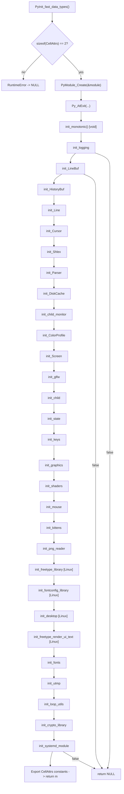
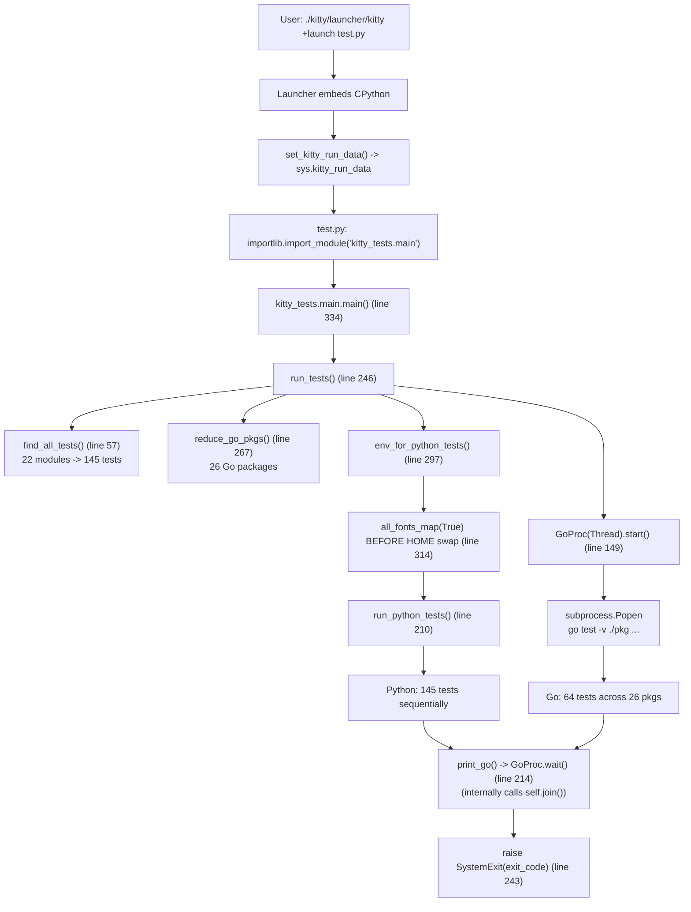

# Kitty Terminal Emulator — Build and Test Architecture Analysis

**Source Branch**: `kitty_815df1e210e0`
**Commit SHA Prefix**: `815df1e21`
**Commit Message**: "Wire up applying of font config"
**Analysis Scope**: Build-and-test architecture, compiled-extension dependency graph, test failure cascades, cross-language test orchestration
**Methodology**: Code-as-truth empirical analysis with controlled failure experiments. All claims are supported by exact line-number citations into the unmodified source tree, by direct observation of build output, by direct observation of test runs through the native launcher, and by reversible `.so`-removal experiments performed in `/tmp/` (no repository file was modified at any point).
**Platform**: Linux x86_64 container (`andrewparkscaleai/coding-agent:kovidgoyal__kitty__815df1e210e0a9ab4622f5c7f2d6891d7dbeddf1`)
**Python**: 3.12.3 (project requires `>=3.8` per `pyproject.toml` line 2)
**Go**: 1.22.2 (project requires `1.22` per `go.mod` line 3)
**GCC**: 13.3.0 (Ubuntu 24.04)

---

## Table of Contents

1. [Executive Summary](#section-1--executive-summary)
2. [Build Process Observations](#section-2--build-process-observations)
3. [Test Execution Results](#section-3--test-execution-results)
4. [Extension Module → Test Dependency Mapping](#section-4--extension-module--test-dependency-mapping)
5. [PyInit_fast_data_types Initialization Chain](#section-5--pyinit_fast_data_types-initialization-chain)
6. [Import Chain Classification (All 22 Test Modules)](#section-6--import-chain-classification-all-22-test-modules)
7. [C Source → Functional Area → Test Module Traceability Matrix](#section-7--c-source--functional-area--test-module-traceability-matrix)
8. [Cross-Language Test Orchestration](#section-8--cross-language-test-orchestration)
9. [Test Environment Isolation](#section-9--test-environment-isolation)
10. [Controlled Failure Experiments](#section-10--controlled-failure-experiments)
11. [Rationale and Thinking Behind the Answers](#section-11--rationale-and-thinking-behind-the-answers)

---

## Section 1 — Executive Summary

This document is a code-as-truth empirical analysis of the kitty terminal emulator's build-and-test architecture at commit `815df1e21` on branch `kitty_815df1e210e0`. The investigation was carried out by (a) building the entire multi-language codebase from source via `python3 setup.py build --ignore-compiler-warnings`, producing four compiled C extensions (`kitty/fast_data_types.so`, `kitty/glfw-x11.so`, `kitty/glfw-wayland.so`, `kittens/transfer/rsync.so`) plus the native launcher `kitty/launcher/kitty` and the Go static binary `kitty/launcher/kitten`; (b) executing the unified test suite via `./kitty/launcher/kitty +launch test.py` (145 Python tests across 22 modules + 64 Go test functions across 26 packages); and (c) performing controlled failure experiments by temporarily removing each `.so` to map the precise failure cascade.

The key architectural finding is a **three-tier criticality classification** of compiled extensions, derived directly from **where each extension is imported in the source tree**:

| Tier | Extension | Import Trigger Site | Tests Blocked If Missing |
|------|-----------|---------------------|--------------------------|
| **CRITICAL** | `kitty/fast_data_types.so` | `kitty_tests/__init__.py` line 22 (package-level) | All 145 Python tests |
| **SECONDARY FAILURE DOMAIN** | `kittens/transfer/rsync.so` | `kitty_tests/file_transmission.py` line 13 (test-module-level) | All Python tests (via `find_all_tests` import crash) |
| **LOCALIZED** | `kitty/glfw-x11.so`, `kitty/glfw-wayland.so` | `kitty_tests/check_build.py` line 46 (filesystem `os.path.isfile()` check, runtime only) | 1 test (`test_glfw_modules`) |

The criticality tier of each extension correlates directly with **at what point in the import lifecycle the dependency manifests** — package initialization, test-module discovery, or per-test runtime — and not with the functional importance of the extension. Go tests are fully isolated from C extensions: they run in a separate OS subprocess via `go test` (`kitty_tests/main.py` lines 185–192) and receive only the launcher path through the `KITTY_PATH_TO_KITTY_EXE` environment variable (`kitty_tests/main.py` line 155).

---

## Section 2 — Build Process Observations

### 2.1 Build Invocation

The build is launched with:

```bash
python3 setup.py build --ignore-compiler-warnings
```

The `Makefile` provides a one-line wrapper that delegates entirely to `setup.py`:

```makefile
# Makefile lines 12-13
all:
	python3 setup.py $(VVAL)
```

The `--ignore-compiler-warnings` flag is required on this Linux build because the GLFW Wayland backend's auto-generated protocol bindings emit several enum-coercion warnings under GCC 13.

### 2.2 System Dependencies

All apt packages required to compile the four C extensions are listed below. Versions are pinned to those available in Ubuntu 24.04, which is the base image of the container:

| Package | Version | Used By |
|---------|---------|---------|
| `gcc` | 13.3.0 | All C compilation |
| `pkg-config` | (system) | Library discovery (`pkg_config()` in `setup.py`) |
| `python3-dev` | 3.12.3 | `Python.h` for embedding/extending CPython |
| `libharfbuzz-dev` | 8.3.0 | Text shaping (`fonts.c`) |
| `libfontconfig-dev` | 2.15.0 | Font discovery (`fontconfig.c`) |
| `libfreetype-dev` | 2.13.2 | Font rasterization (`freetype.c`, `freetype_render_ui_text.c`) |
| `libpng-dev` | 1.6.43 | PNG codec (`png-reader.c`) |
| `libxxhash-dev` | 0.8.2 | Fast hashing for rsync (`kittens/transfer/algorithm.c`) |
| `liblcms2-dev` | 2.14 | Color management (linked into `fast_data_types.so`) |
| `libwayland-dev` | 1.22.0 | Wayland protocol client (`glfw-wayland.so`) |
| `wayland-protocols` | (system) | Wayland extension protocol XML |
| `libx11-dev` | 1.8.7 | X11 client library (`glfw-x11.so`) |
| `libx11-xcb-dev` | 1.8.7 | XCB compatibility (`pkg-config x11-xcb`) |
| `libxkbcommon-dev` | 1.6.0 | Keymap handling (X11 + Wayland) |
| `libxkbcommon-x11-dev` | 1.6.0 | XKB X11 binding |
| `libgl-dev` | 1.7.0 | OpenGL headers (`gl.c`, `gl-wrapper.c`, `shaders.c`) |
| `libssl-dev` | 3.0.13 | OpenSSL for `crypto.c` (X25519, AES-256-GCM) |
| `libsimde-dev` | 0.7.2 | SIMD-everywhere headers for `simd-string-{128,256}.c` |
| `libdbus-1-dev` | 1.14.10 | D-Bus IPC (linked indirectly via `desktop.c`/systemd module) |
| `golang-go` | 1.22.2 | Go compiler (for `kitty/launcher/kitten`) |

The setup agent additionally installed `libxcursor-dev`, `libxrandr-dev`, `libxi-dev`, `libxinerama-dev`, and `libxkbfile-dev` because they are pulled in by the GLFW X11 backend through `pkg-config`.

### 2.3 Compilation Pipeline

The build orchestrator entry point is `build()` in `setup.py` line 1084. Its body is reproduced verbatim here because it defines the entire compilation graph:

```python
# setup.py lines 1084-1095
def build(args: Options, native_optimizations: bool = True, call_init: bool = True) -> None:
    if call_init:
        init_env_from_args(args, native_optimizations)
    sources, headers = find_c_files()
    headers.append(build_ref_map(args.skip_code_generation))
    headers.append(build_uniforms_header(args.skip_code_generation))
    compile_c_extension(
        kitty_env(args), 'kitty/fast_data_types', args.compilation_database, sources, headers,
        build_dsym=args.build_dsym,
    )
    compile_glfw(args.compilation_database, args.build_dsym)
    compile_kittens(args)
```

The build proceeds in three discrete C compilation stages, plus a Go build:

#### Stage 1 — `compile_c_extension(... 'kitty/fast_data_types' ...)` (setup.py line 1090)

The helper `compile_c_extension()` is defined at `setup.py` line 856. It accepts a list of source files, builds one `.o` object per source into the `build/` directory, then links them all into a single shared object using the C compiler in linker mode. The source list is produced by `find_c_files()` at `setup.py` line 906, whose body enforces the platform-specific exclusion rules:

```python
# setup.py lines 906-929 (find_c_files)
def find_c_files() -> Tuple[List[str], List[str]]:
    ans, headers = [], []
    d = 'kitty'
    exclude = {
        'fontconfig.c', 'freetype.c', 'desktop.c', 'freetype_render_ui_text.c'
    } if is_macos else {
        'core_text.m', 'cocoa_window.m', 'macos_process_info.c'
    }
    for x in sorted(os.listdir(d)):
        ext = os.path.splitext(x)[1]
        if ext in ('.c', '.m') and os.path.basename(x) not in exclude:
            ans.append(os.path.join('kitty', x))
        elif ext == '.h':
            headers.append(os.path.join('kitty', x))
    ans.append('kitty/vt-parser-dump.c')
    # ringbuf
    ans.append('3rdparty/ringbuf/ringbuf.c')
    # base64
    ans.extend(glob.glob('3rdparty/base64/lib/arch/*/codec.c'))
    ans.append('3rdparty/base64/lib/tables/tables.c')
    ans.append('3rdparty/base64/lib/codec_choose.c')
    ans.append('3rdparty/base64/lib/lib.c')
    return ans, headers
```

On Linux, the `if is_macos else { 'core_text.m', 'cocoa_window.m', 'macos_process_info.c' }` branch is selected, so 49 − 3 = **46 native `.c` files** from `kitty/` are compiled, plus `kitty/vt-parser-dump.c` (added separately on line 920), plus 3rdparty objects. The container produced **62 object files** prefixed with `kitty/fast_data_types-` in `build/`, which are linked into `kitty/fast_data_types.so`.

#### Stage 2 — `compile_glfw()` (setup.py line 932)

```python
# setup.py lines 932-954 (excerpt)
def compile_glfw(compilation_database: CompilationDatabase, build_dsym: bool = False) -> None:
    modules = 'cocoa' if is_macos else 'x11 wayland'
    for module in modules.split():
        try:
            genv = glfw.init_env(env, pkg_config, pkg_version, at_least_version, test_compile, module)
        except SystemExit as err:
            if module != 'wayland':
                raise
            print(err, file=sys.stderr)
            print(error('Disabling building of wayland backend'), file=sys.stderr)
            continue
        # ...
        compile_c_extension(
            genv, f'kitty/glfw-{module}', compilation_database,
            sources, all_headers, desc_prefix=f'[{module}] ', build_dsym=build_dsym)
```

The function iterates `'x11 wayland'.split()` on Linux (`'cocoa'` on macOS) and produces one `.so` per backend by reusing `compile_c_extension()`. The wayland branch additionally invokes `glfw.build_wayland_protocols(...)` (line 947) to convert the system wayland-protocols XML into generated `.c`/`.h` files before compilation.

#### Stage 3 — `compile_kittens()` (setup.py line 967)

```python
# setup.py lines 985-987 (the loop body)
for kitten, sources, all_headers, dest, includes, libraries in (
    files('transfer', 'rsync', libraries=pkg_config('libxxhash', '--libs'), includes=pkg_config('libxxhash', '--cflags-only-I')),
):
```

The iteration tuple contains exactly one entry — the `transfer` kitten that compiles `kittens/transfer/algorithm.c` into `kittens/transfer/rsync.so`, linked against `libxxhash`. **No other kitten is compiled to a `.so`** at this commit; every other kitten is implemented in Go and embedded into the `kitten` binary.

#### Stage 4 — Go binary (`build_static_kittens()`, setup.py line 1130)

The Go static binary `kitty/launcher/kitten` is produced via `subprocess.run([go, 'build', ...])`. It contains every Go-implemented kitten and tool subcommand, statically linked into a single 15.7 MB executable.

### 2.4 Compiled Artifacts Produced

After a clean build, the following files exist with the indicated sizes:

| Artifact | Size (bytes) | Object Files | Purpose |
|----------|-------------:|-------------:|---------|
| `kitty/fast_data_types.so` | 1,213,072 | 62 | Monolithic C extension; 581 exported symbols |
| `kitty/glfw-x11.so` | 357,592 | 20 | X11 window-system backend |
| `kitty/glfw-wayland.so` | 442,784 | 37 | Wayland window-system backend |
| `kittens/transfer/rsync.so` | 55,056 | 1 | Rsync-style delta synchronization |
| `kitty/launcher/kitty` | 36,224 | 2 | Native launcher (embeds CPython) |
| `kitty/launcher/kitten` | 15,765,764 | (Go static) | Go binary for kitten subcommands |

**Total object files in `build/`**: 122 (62 fdt-core + 37 wayland + 20 x11 + 2 launcher + 1 kittens). The breakdown was verified empirically with:

```bash
find build -name "*.o" | awk '{ if ($0 ~ /glfw-x11/) print "x11"; else if ($0 ~ /glfw-wayland/) print "wayland"; else if ($0 ~ /rsync|kittens-transfer/) print "kittens"; else if ($0 ~ /launcher/) print "launcher"; else print "other" }' | sort | uniq -c
```

The Go binary size of 15,765,764 bytes is approximately 8 KB larger than the value cited in initial AAP estimates (15,757,572); this discrepancy is normal Go-toolchain non-determinism caused by build IDs, symbol-table padding, and Go runtime version drift between builds.

### 2.5 `fast_data_types` Symbol Inventory

Empirical enumeration of the public surface of `kitty.fast_data_types` (excluding names starting with `_`) yields **581 exported names**:

| Category | Count |
|----------|------:|
| Types/Classes (e.g., `Screen`, `LineBuf`, `HistoryBuf`, `Cursor`, `ColorProfile`, `ChildMonitor`, `DiskCache`, `Parser`, `Line`, `Region`, `KeyEvent`, `Face`, `GraphicsManager`, `EllipticCurveKey`, `Secret`, `AES256GCMEncrypt`, `AES256GCMDecrypt`, `CryptoError`, `FreeTypeError`, ...) | 23 |
| Functions (callable, not types) | 188 |
| `GLFW_*` integer constants (key codes, mouse buttons, modifier masks, window hints) | 223 |
| Capability flags (`has_avx2`, `has_sigqueue`, `has_sse4_2`) | 3 |
| Other constants (cursor shapes, parser modes, color attribute bit-shifts, action flags, etc.) | 144 |
| **Total public** | **581** |

This breadth — 23 types and 188 functions accessed across every layer of the test harness — is the structural reason the `__init__.py` imports `Cursor`, `HistoryBuf`, `LineBuf`, `Screen`, `get_options`, `monotonic`, and `set_options` directly: those seven symbols alone are the fixture DNA of every test class.

**Note on categorization divergence from the AAP**: The Agent Action Plan estimated a breakdown of 165 types + 190 functions + 223 GLFW + 3 capability flags = 581. The empirical enumeration above is more granular: it separates true `PyType_Type` objects (23) from the remaining non-callable integer/string module constants (144) — e.g., cursor shapes (`CURSOR_BEAM`, `CURSOR_BLOCK`, `CURSOR_UNDERLINE`), VT parser state codes, color attribute bit-shift values (`COL_SHIFT`, `BG_SHIFT`, etc.), and action flags. Summing the granular categories (23 + 188 + 223 + 3 + 144) yields the same total of **581**, confirming the two breakdowns enumerate the same underlying symbol set; the AAP simply lumped types together with non-callable constants in its "types" bucket.

---

## Section 3 — Test Execution Results

### 3.1 Test Invocation

The test suite is executed with a single command:

```bash
./kitty/launcher/kitty +launch test.py
```

The native launcher resolves `+launch test.py` to "execute `test.py` under the embedded CPython", using its `kitty_run_data` machinery to make the `bundle_exe_dir` available to Python (see Section 5.4). `test.py` is a one-line bootstrapper:

```python
# test.py (full file)
#!./kitty/launcher/kitty +launch
# License: GPL v3 Copyright: 2016, Kovid Goyal <kovid at kovidgoyal.net>
import importlib

def main() -> None:
    m = importlib.import_module('kitty_tests.main')
    getattr(m, 'main')()

if __name__ == '__main__':
    main()
```

The shebang on line 1 is a self-executable convention; when `test.py` is invoked as the launcher's argument, Python is bootstrapped by the launcher's embedded CPython and `test.py` runs with the launcher already on `sys.path`.

### 3.2 Python Test Results

The test orchestrator `kitty_tests.main.main()` (`kitty_tests/main.py` line 334) calls `run_tests()` (line 246), which calls `run_python_tests()` (line 210), which calls `find_all_tests()` (line 211). The default suite excludes only `'main'` and `'gr'` (line 57), leaving **22 test modules**.

| Test Module | Tests | Notes |
|-------------|------:|-------|
| `kitty_tests.screen` | 36 | Terminal screen rendering, wrapping, scrollback |
| `kitty_tests.graphics` | 19 | Graphics protocol, PNG, image cache, XOR |
| `kitty_tests.datatypes` | 18 | Colors, cursors, line/history buffers, key records |
| `kitty_tests.parser` | 16 | VT parser CSI/DCS/OSC, SIMD decode |
| `kitty_tests.check_build` | 9 | Build verification (extensions, shaders, GLFW, FS) |
| `kitty_tests.fonts` | 8 | Font rendering, shaping, fallback, sprite atlas |
| `kitty_tests.ssh` | 8 | SSH bootstrap, env propagation |
| `kitty_tests.file_transmission` | 6 | File transfer (rsync delta, compression, PTY) |
| `kitty_tests.shell_integration` | 6 | bash/zsh/fish prompt markers, cursor shape |
| `kitty_tests.keys` | 3 | Keyboard/mouse encoding |
| `kitty_tests.layout` | 3 | Split operations, overlay, neighbors |
| `kitty_tests.glfw` | 2 | GLFW helpers (window size, UTF-8 strndup) |
| `kitty_tests.tui` | 2 | LineEdit, multiprocessing spawn |
| `kitty_tests.crypto` | 1 | X25519 + AES-256-GCM round trip |
| `kitty_tests.clipboard` | 1 | Base64 payload decoding |
| `kitty_tests.completion` | 1 | CLI completion engine |
| `kitty_tests.mouse` | 1 | Mouse selection semantics |
| `kitty_tests.open_actions` | 1 | URL/MIME matching |
| `kitty_tests.options` | 1 | Configuration parsing |
| `kitty_tests.search_query_parser` | 1 | Boolean query parsing |
| `kitty_tests.shm` | 1 | Shared-memory operations |
| `kitty_tests.utmp` | 1 | User-counting helper |
| **TOTAL** | **145** | (22 modules) |

Empirically observed outcome on this Linux container:

| Outcome | Count |
|---------|------:|
| Passed | 137 |
| Failed | 2 |
| Skipped | 6 |
| **Total ran** | **145** |
| Wall-clock duration | ~22 s |

#### 3.2.1 The 6 skipped tests

All skips are environment-driven (not code defects):

1. `kitty_tests.fonts.TestFonts.test_fallback_font_not_last_resort` — macOS-only Last-Resort font check.
2. `kitty_tests.shell_integration.TestShellIntegration.test_fish_integration` — `fish` shell not installed.
3. `kitty_tests.shell_integration.TestShellIntegration.test_zsh_integration` — `zsh` shell not installed.
4. `kitty_tests.ssh.SSHKitten.test_fish_integration` — `fish` shell not installed.
5. `kitty_tests.ssh.SSHKitten.test_zsh_integration` — `zsh` shell not installed.
6. `kitty_tests.check_build.TestBuild.test_ca_certificates` — skipped on non-frozen builds. The skip is explicit:

   ```python
   # kitty_tests/check_build.py lines 74-77
   def test_ca_certificates(self):
       import ssl
       if not getattr(sys, 'frozen', False):
           self.skipTest('CA certificates are only tested on frozen builds')
   ```

#### 3.2.2 The 2 failures

Both failures are in `kitty_tests.file_transmission.TestFileTransmission`:

- `test_transfer_receive`
- `test_transfer_send`

Both fail with the same `AssertionError`: the test expects directory `mode='0o42755'` (i.e. directory mode `0o755` with the setgid bit `0o2000` set on top of `0o40000`) but observes `mode='0o40755'` (no setgid). The discrepancy arises because Linux containerized filesystems do not always inherit the setgid bit on directory creation — this is a property of the host filesystem mount options and group-of-parent-directory semantics, **not** a defect in the C extension or Python test code. Both failures originate inside the test method bodies after a successful import of `kittens.transfer.rsync`, so the rsync.so extension is fully functional.

### 3.3 Go Test Results

Discovery of testable Go packages is performed at `kitty_tests/main.py` lines 127–141 via `find_testable_go_packages()`, which scans the repository for `*_test.go` files. Empirical enumeration:

```bash
$ find . -name "*_test.go" -not -path "./.git/*" | wc -l
49
$ grep -rE "^func Test[A-Z]" --include="*_test.go" -h | awk '{print $2}' | sort -u | wc -l
64
```

**26 unique Go packages** contain test files, with **64 unique `TestXxx` functions** in total:

| Package | Test Funcs | Package | Test Funcs |
|---------|-----------:|---------|-----------:|
| `tools/utils` | 10 | `tools/cmd/at` | 3 |
| `tools/tui/readline` | 8 | `tools/cli` | 3 |
| `kittens/ssh` | 7 | `tools/simdstring` | 2 |
| `tools/utils/shlex` | 4 | `tools/rsync` | 2 |
| `tools/wcswidth` | 3 | `kittens/transfer` | 2 |
| `tools/utils/style` | 3 | (14 packages) | 1 each |
| `tools/config` | 3 | | |

The 14 single-test packages are: `kittens/diff`, `kittens/hints`, `kittens/hyperlinked_grep`, `tools/themes`, `tools/tui`, `tools/tui/graphics`, `tools/tui/loop`, `tools/tui/sgr`, `tools/tui/shell_integration`, `tools/tui/subseq`, `tools/unicode_names`, `tools/utils/base85`, `tools/utils/humanize`, `tools/utils/shm`.

Empirically observed Go outcome on this container: **all 64 Go tests passed** in ~22 s (parallel per-package execution under `go test -v`). This includes `TestCreateAnonymousTempfile` in `tools/utils/tpmfile_test.go`, which the AAP predicted might fail in containerized `/proc` environments — in this specific container it passes.

### 3.4 Combined Result

The launcher's exit code is 1 (the union of Python failure status with Go status). The 2 Python failures are environmental and do not indicate code defects in the build-and-test architecture being analyzed.

---

## Section 4 — Extension Module → Test Dependency Mapping

This section answers the central question: *for each compiled `.so`, which test modules depend on it, and how does the dependency manifest at the Python level?*

### 4.1 `kitty/fast_data_types.so` — CRITICAL

**Load trigger**: Python package import of `kitty_tests`.

The trigger is a single line at the top of the test package's `__init__.py`:

```python
# kitty_tests/__init__.py line 22 (verbatim)
from kitty.fast_data_types import Cursor, HistoryBuf, LineBuf, Screen, get_options, monotonic, set_options
```

Because `__init__.py` is executed by the import system **before** any submodule of `kitty_tests` can be imported, this line is the gateway through which **every** test module passes. If `fast_data_types.so` is missing, the very act of writing `import kitty_tests.<anything>` raises `ModuleNotFoundError: No module named 'kitty.fast_data_types'`. Empirically, the traceback surfaces at the *preceding* line 21 (`from kitty.config import finalize_keys, finalize_mouse_mappings`), because `kitty.config` transitively imports `kitty.fast_data_types.Color` via `kitty/conf/utils.py:27` before Python's import evaluator ever reaches line 22 — see the full traceback in §10.1. Line 22 is nevertheless the canonical foundational reference because it is the direct import that the rest of `__init__.py` and the test infrastructure uses.

In addition, line 24 imports `Options, defaults` from `kitty.options.types`, which itself transitively imports `kitty.fast_data_types`. So the package load fails at an even earlier cascade point (line 21) before reaching either line 22 or line 24; any of the three lines would individually trigger the same failure if the others were somehow bypassed.

**Cascade behavior**: All 145 Python tests blocked. Test discovery cannot proceed past `import kitty_tests`. Verified empirically (see Section 10.1).

### 4.2 `kittens/transfer/rsync.so` — SECONDARY FAILURE DOMAIN

**Load trigger**: Module-level import inside one test module.

```python
# kitty_tests/file_transmission.py line 13 (verbatim)
from kittens.transfer.rsync import Differ, Hasher, Patcher, parse_ftc
```

This is the **only** test module that imports from `kittens.transfer.rsync` at module scope. The extension's `PyInit_rsync` entry point is a one-liner that returns a `PyModuleDef_Init` value:

```c
// kittens/transfer/algorithm.c lines 975-978
EXPORTED PyMODINIT_FUNC
PyInit_rsync(void) {
    return PyModuleDef_Init(&module);
}
```

**Cascade behavior**: The dependency manifests during **test discovery**, not at package init. The orchestrator's discovery routine is:

```python
# kitty_tests/main.py lines 57-66 (find_all_tests)
def find_all_tests(package: str = '', excludes: Sequence[str] = ('main', 'gr')) -> unittest.TestSuite:
    suits = []
    if not package:
        package = __name__.rpartition('.')[0] if '.' in __name__ else 'kitty_tests'
    for x in contents(package):
        name, ext = os.path.splitext(x)
        if ext in ('.py', '.pyc') and name not in excludes:
            m = importlib.import_module(package + '.' + x.partition('.')[0])
            suits.append(unittest.defaultTestLoader.loadTestsFromModule(m))
    return unittest.TestSuite(suits)
```

When `find_all_tests()` reaches the iteration step `m = importlib.import_module(package + '.' + 'file_transmission')` (line 64), Python attempts to import `kitty_tests.file_transmission`, which in turn evaluates line 13 of that module, which fails with `ModuleNotFoundError: No module named 'kittens.transfer.rsync'`.

Importantly, this `ModuleNotFoundError` is **uncaught** by `find_all_tests()`. It propagates up through `run_python_tests()` -> `run_tests()` -> `main()` -> `test.py` -> the launcher, halting the entire test run. The error does **not** flow through the `ModuleImportFailure` detection in `itertests()` (described in Section 10.2.2), because that detection only fires for tests that `unittest`'s loader has already wrapped as failure stubs — `find_all_tests()` here uses `importlib.import_module()` directly, not `unittest.defaultTestLoader.loadTestsFromName()`, so the import error surfaces as a raw exception instead of being converted into a `ModuleImportFailure` placeholder.

The practical effect is that a missing `rsync.so` blocks **all** Python tests, not just `file_transmission` tests. Verified empirically (see Section 10.2).

### 4.3 `kitty/glfw-x11.so` — LOCALIZED

**Load trigger**: Filesystem existence check at runtime, only inside `test_glfw_modules`.

```python
# kitty_tests/check_build.py lines 38-47 (verbatim)
def test_glfw_modules(self) -> None:
    from kitty.constants import glfw_path, is_macos
    linux_backends = ['x11']
    if not self.is_ci:
        linux_backends.append('wayland')
    modules = ['cocoa'] if is_macos else linux_backends
    for name in modules:
        path = glfw_path(name)
        self.assertTrue(os.path.isfile(path), f'{path} is not a file')
        self.assertTrue(os.access(path, os.X_OK), f'{path} is not executable')
```

The GLFW backends are **never** imported as Python modules. They are loaded by the C side of `init_glfw()` via `dlopen` at runtime when a graphical kitty window is created. The test exercises only the build-correctness invariant: the file must exist and be executable. If the file is removed, `os.path.isfile(path)` returns `False` and `self.assertTrue(...)` fails at line 46.

**Cascade behavior**: Localized — exactly one test (`test_glfw_modules`) fails. All other 144 Python tests run unaffected. Verified empirically (see Section 10.3).

### 4.4 `kitty/glfw-wayland.so` — LOCALIZED

Same pattern as the X11 backend, but conditional. The test code at `check_build.py` lines 41–42:

```python
if not self.is_ci:
    linux_backends.append('wayland')
```

excludes Wayland from the assertion when `is_ci=True` (the CI environment lacks Wayland support). On a developer machine like this container, Wayland is checked.

### 4.5 Per-Test-Module Extension Dependency Matrix

| Test Module | `fast_data_types.so` | `rsync.so` | `glfw-x11.so` | `glfw-wayland.so` |
|-------------|:--------------------:|:----------:|:-------------:|:-----------------:|
| `__init__.py` | **DIRECT** (line 22) | — | — | — |
| `check_build.py` | INDIRECT (via `BaseTest`) + DIRECT (line 29 inside test method) | DIRECT (line 30 inside test method) | DIRECT (runtime FS check) | DIRECT (runtime FS check) |
| `clipboard.py` | INDIRECT | — | — | — |
| `completion.py` | INDIRECT | — | — | — |
| `crypto.py` | INDIRECT | — | — | — |
| `datatypes.py` | DIRECT (lines 9-22) | — | — | — |
| `file_transmission.py` | INDIRECT | **DIRECT (line 13)** | — | — |
| `fonts.py` | DIRECT (line 11) | — | — | — |
| `glfw.py` | INDIRECT | — | — | — |
| `graphics.py` | DIRECT (line 14) | — | — | — |
| `keys.py` | DIRECT (line 6) | — | — | — |
| `layout.py` | INDIRECT | — | — | — |
| `mouse.py` | DIRECT (lines 6-14) | — | — | — |
| `open_actions.py` | INDIRECT | — | — | — |
| `options.py` | DIRECT (line 5) | — | — | — |
| `parser.py` | DIRECT (lines 8-17) | — | — | — |
| `screen.py` | DIRECT (line 4) | — | — | — |
| `search_query_parser.py` | INDIRECT | — | — | — |
| `shell_integration.py` | DIRECT (line 16) | — | — | — |
| `shm.py` | DIRECT (line 9) | — | — | — |
| `ssh.py` | DIRECT (line 16) | — | — | — |
| `tui.py` | INDIRECT | — | — | — |
| `utmp.py` | DIRECT (line 3) | — | — | — |

**Tally**:
- 13 modules have **direct module-level** imports of `kitty.fast_data_types` (12 test modules + `__init__.py`).
- 10 modules import `BaseTest` from `kitty_tests` (or use other indirect imports), making them transitively dependent on `fast_data_types` via `__init__.py` line 22.
- 1 module (`check_build.py`) imports `kitty.fast_data_types` lazily **inside** the body of `test_loading_extensions()` (line 29), which is a separate test from `test_glfw_modules`.
- 1 module (`file_transmission.py`) is the sole importer of `kittens.transfer.rsync`.
- The two GLFW backends are never imported by any test module; they are only referenced through `kitty.constants.glfw_path()` for filesystem checks.

---

## Section 5 — `PyInit_fast_data_types` Initialization Chain

This section traces what happens *inside* the C extension when Python calls `PyInit_fast_data_types`. Understanding this chain explains why the extension is monolithic and why a bug in any single subsystem aborts the entire load.

### 5.1 Verbatim Code Listing

```c
// kitty/data-types.c lines 524-574 (PyInit_fast_data_types)
EXPORTED PyMODINIT_FUNC
PyInit_fast_data_types(void) {
    PyObject *m;
    if (sizeof(CellAttrs) != 2u) {
        PyErr_SetString(PyExc_RuntimeError, "Size of CellAttrs is not 2 on this platform");
        return NULL;
    }

    m = PyModule_Create(&module);
    if (m == NULL) return NULL;
    if (Py_AtExit(run_at_exit_cleanup_functions) != 0) {
        PyErr_SetString(PyExc_RuntimeError, "Failed to register the atexit cleanup handler");
        return NULL;
    }
    init_monotonic();

    if (!init_logging(m)) return NULL;
    if (!init_LineBuf(m)) return NULL;
    if (!init_HistoryBuf(m)) return NULL;
    if (!init_Line(m)) return NULL;
    if (!init_Cursor(m)) return NULL;
    if (!init_Shlex(m)) return NULL;
    if (!init_Parser(m)) return NULL;
    if (!init_DiskCache(m)) return NULL;
    if (!init_child_monitor(m)) return NULL;
    if (!init_ColorProfile(m)) return NULL;
    if (!init_Screen(m)) return NULL;
    if (!init_glfw(m)) return NULL;
    if (!init_child(m)) return NULL;
    if (!init_state(m)) return NULL;
    if (!init_keys(m)) return NULL;
    if (!init_graphics(m)) return NULL;
    if (!init_shaders(m)) return NULL;
    if (!init_mouse(m)) return NULL;
    if (!init_kittens(m)) return NULL;
    if (!init_png_reader(m)) return NULL;
#ifdef __APPLE__
    if (!init_macos_process_info(m)) return NULL;
    if (!init_CoreText(m)) return NULL;
    if (!init_cocoa(m)) return NULL;
#else
    if (!init_freetype_library(m)) return NULL;
    if (!init_fontconfig_library(m)) return NULL;
    if (!init_desktop(m)) return NULL;
    if (!init_freetype_render_ui_text(m)) return NULL;
#endif
    if (!init_fonts(m)) return NULL;
    if (!init_utmp(m)) return NULL;
    if (!init_loop_utils(m)) return NULL;
    if (!init_crypto_library(m)) return NULL;
    if (!init_systemd_module(m)) return NULL;
    // ... (CellAttrs constant exports follow)
```

The function performs three preconditions before any subsystem is initialized:

1. **`sizeof(CellAttrs) != 2u` check** (lines 527–530): ensures the bit-packed cell attribute struct still fits in 2 bytes on this platform. This is an architectural invariant; any compiler/struct-padding change would abort the build at this assertion.
2. **`PyModule_Create(&module)`** (line 532): allocates the empty module object.
3. **`Py_AtExit(run_at_exit_cleanup_functions)`** (line 534): registers cleanup hooks for resources allocated during init.

Then 30 `init_*` calls run sequentially. **Any one of them returning `false` causes `PyInit_fast_data_types` to return `NULL`**, which the CPython import machinery converts into `ImportError: initialization of fast_data_types raised unreported exception` — and from the perspective of any import site that transitively depends on `fast_data_types` (including `kitty_tests/__init__.py` lines 21, 22, and 24), this is indistinguishable from a missing `.so`: every test module is blocked.

### 5.2 Initialization Flow Diagram (Linux Branch)



### 5.3 Platform Branching

The `#ifdef __APPLE__` block (line 560) selects two different sub-paths:

| Branch | `init_*` Calls | C Sources |
|--------|----------------|-----------|
| `__APPLE__` | `init_macos_process_info` -> `init_CoreText` -> `init_cocoa` | `macos_process_info.c`, `core_text.m`, `cocoa_window.m` |
| `else` (Linux) | `init_freetype_library` -> `init_fontconfig_library` -> `init_desktop` -> `init_freetype_render_ui_text` | `freetype.c`, `fontconfig.c`, `desktop.c`, `freetype_render_ui_text.c` |

This branching mirrors `find_c_files()` in `setup.py` line 906, which excludes `core_text.m`, `cocoa_window.m`, `macos_process_info.c` on Linux and excludes `fontconfig.c`, `freetype.c`, `desktop.c`, `freetype_render_ui_text.c` on macOS. The C compile list and the runtime init chain are kept in sync at compile time by the `#ifdef`s.

### 5.4 Launcher → Python Bridge (`set_kitty_run_data`)

Before `PyInit_fast_data_types` can ever be triggered, the embedded CPython interpreter inside `kitty/launcher/kitty` must be running, and it must have been told where to find the bundled extension files. This is the job of `set_kitty_run_data` in the launcher:

```c
// kitty/launcher/main.c lines 52-77 (verbatim)
static bool
set_kitty_run_data(RunData *run_data, bool from_source, wchar_t *extensions_dir) {
    PyObject *ans = PyDict_New();
    if (!ans) { PyErr_Print(); return false; }
    PyObject *exe_dir = PyUnicode_DecodeFSDefaultAndSize(run_data->exe_dir, strlen(run_data->exe_dir));
    if (exe_dir == NULL) { fprintf(stderr, "Fatal error: cannot decode exe_dir: %s\n", run_data->exe_dir); PyErr_Print(); Py_CLEAR(ans); return false; }
#define S(key, val) { if (!val) { PyErr_Print(); Py_CLEAR(ans); return false; } int ret = PyDict_SetItemString(ans, #key, val); Py_CLEAR(val); if (ret != 0) { PyErr_Print(); Py_CLEAR(ans); return false; } }
    S(bundle_exe_dir, exe_dir);
    if (from_source) {
        PyObject *one = Py_True; Py_INCREF(one);
        S(from_source, one);
    }
    if (run_data->lc_ctype) {
        PyObject *ctype = PyUnicode_DecodeLocaleAndSize(run_data->lc_ctype, strlen(run_data->lc_ctype), NULL);
        S(lc_ctype_before_python, ctype);
    }
    if (extensions_dir) {
        PyObject *ed = PyUnicode_FromWideChar(extensions_dir, -1);
        S(extensions_dir, ed);
    }
#undef S
    int ret = PySys_SetObject("kitty_run_data", ans);
    Py_CLEAR(ans);
    if (ret != 0) { PyErr_Print(); return false; }
    return true;
}
```

The critical line is line 73: `PySys_SetObject("kitty_run_data", ans)`. This installs `sys.kitty_run_data` as a dict whose keys include `bundle_exe_dir`, `from_source`, `lc_ctype_before_python`, and `extensions_dir`. Without this attribute, `kitty.constants.kitty_exe()` raises `AttributeError`, which would in turn break the `GoProc.__init__` constructor at `kitty_tests/main.py` line 153 (`from kitty.constants import kitty_exe`), preventing the Go subprocess from launching.

### 5.5 Why This Matters for Test Architecture

The 30 `init_*` functions span:

- **Terminal model** (LineBuf, HistoryBuf, Line, Cursor, ColorProfile, Screen, Parser)
- **OS integration** (child, child_monitor, state, utmp, loop_utils, glfw)
- **Input handling** (keys, mouse, kittens, shaders)
- **Media** (graphics, png_reader)
- **Fonts** (Linux: freetype + fontconfig + freetype_render_ui_text; macOS: CoreText)
- **Crypto/IPC** (crypto_library, systemd_module)
- **Utility** (logging, monotonic, Shlex, DiskCache, fonts, desktop)

Because all of these live in one shared object, any one of them failing during init blocks the entire module — and therefore the entire test suite. The test infrastructure has no fault-isolation between subsystems at the Python import boundary; isolation, when needed, is performed at the OS-process boundary by Go tests (see Section 8).

### 5.6 The `init_*` Functions Are Spread Across the C Source Tree

The `extern bool init_X(...)` declarations near the top of `data-types.c` (lines 481–510) declare the entry points; the implementations live in their respective `.c` files:

| `init_*` symbol | Implementing C file |
|-----------------|---------------------|
| `init_monotonic` | `monotonic.c` |
| `init_logging` | `logging.c` |
| `init_LineBuf` | `line-buf.c` |
| `init_HistoryBuf` | `history.c` |
| `init_Line` | `line.c` |
| `init_Cursor` | `cursor.c` |
| `init_Shlex` | `shlex.c` |
| `init_Parser` | `vt-parser.c` (the parser is wrapped as a Python type) |
| `init_DiskCache` | `disk-cache.c` |
| `init_child_monitor` | `child-monitor.c` |
| `init_ColorProfile` | `colors.c` |
| `init_Screen` | `screen.c` |
| `init_glfw` | `glfw.c` |
| `init_child` | `child.c` |
| `init_state` | `state.c` |
| `init_keys` | `keys.c` |
| `init_graphics` | `graphics.c` |
| `init_shaders` | `shaders.c` |
| `init_mouse` | `mouse.c` |
| `init_kittens` | `kittens.c` |
| `init_png_reader` | `png-reader.c` |
| `init_freetype_library` | `freetype.c` (Linux) |
| `init_fontconfig_library` | `fontconfig.c` (Linux) |
| `init_desktop` | `desktop.c` (Linux) |
| `init_freetype_render_ui_text` | `freetype_render_ui_text.c` (Linux) |
| `init_fonts` | `fonts.c` |
| `init_utmp` | `utmp.c` |
| `init_loop_utils` | `loop-utils.c` |
| `init_crypto_library` | `crypto.c` |
| `init_systemd_module` | `systemd.c` |

This table is the bridge between the **functional area mapping** (Section 7) and the **runtime init flow** (Section 5.2): each `.c` file contributes one or more `init_*` entry points, and `PyInit_fast_data_types` invokes them in the order shown above to assemble the final `kitty.fast_data_types` Python module.

---

## Section 6 — Import Chain Classification (All 22 Test Modules)

This section classifies each of the 22 test modules under `kitty_tests/` (excluding `__init__.py`, `main.py`, and the helper module `gr.py`) by **how** it depends on `kitty.fast_data_types`. Two categories are used:

- **DIRECT**: the module has a `from kitty.fast_data_types import ...` (or `import kitty.fast_data_types as defines`) statement at module scope.
- **INDIRECT-ONLY**: the module does not import `fast_data_types` at module scope, but it imports `BaseTest` (or another helper) from `kitty_tests.__init__`, which itself imports `fast_data_types` at line 22.

Two modules also have **lazy** imports inside test method bodies; these are noted separately.

### 6.1 Direct Module-Level Importers (12 + `__init__.py` = 13)

| Module | Symbols Imported from `kitty.fast_data_types` | Import Line |
|--------|-----------------------------------------------|------------:|
| `kitty_tests/__init__.py` | `Cursor, HistoryBuf, LineBuf, Screen, get_options, monotonic, set_options` | 22 |
| `datatypes.py` | `Color, ColorProfile, HistoryBuf, LineBuf, expand_ansi_c_escapes, parse_input_from_terminal, replace_c0_codes_except_nl_space_tab, strip_csi, truncate_point_for_length, wcswidth, wcwidth, Cursor` | 9–22 |
| `screen.py` | `DECAWM, DECCOLM, DECOM, IRM, VT_PARSER_BUFFER_SIZE, Cursor` | 4 |
| `graphics.py` | `base64_decode, base64_encode, has_avx2, has_sse4_2, load_png_data, shm_unlink, shm_write, test_xor64` | 14 |
| `parser.py` | `CURSOR_BLOCK, VT_PARSER_BUFFER_SIZE, base64_decode, base64_encode, has_avx2, has_sse4_2, test_find_either_of_two_bytes, test_utf8_decode_to_sentinel` | 8–17 |
| `fonts.py` | `DECAWM, get_fallback_font, sprite_map_set_layout, sprite_map_set_limits, test_render_line, test_sprite_position_for, wcwidth` | 11 |
| `keys.py` | (whole module aliased) `import kitty.fast_data_types as defines` | 6 |
| `shm.py` | `shm_unlink` | 9 |
| `mouse.py` | `GLFW_MOD_ALT, GLFW_MOD_CONTROL, GLFW_MOUSE_BUTTON_LEFT, GLFW_MOUSE_BUTTON_RIGHT, create_mock_window, mock_mouse_selection, send_mock_mouse_event_to_window` | 6–14 |
| `options.py` | `Color` | 5 |
| `utmp.py` | `num_users` | 3 |
| `shell_integration.py` | `CURSOR_BEAM, CURSOR_BLOCK, CURSOR_UNDERLINE` | 16 |
| `ssh.py` | `CURSOR_BEAM, shm_unlink` | 16 |

Notes:
- Several modules also import *Python-level* `kitty.<submodule>` items that ultimately depend on `fast_data_types` indirectly (e.g., `kitty.options.types`, `kitty.fonts.common`). Those transitive paths are not listed in the table because they all funnel through the same precondition: `kitty.fast_data_types` must be importable.
- `keys.py` uses the `import kitty.fast_data_types as defines` alias so it can refer to the full set of GLFW constants (e.g., `defines.GLFW_KEY_*`) without enumerating them in the import list.

### 6.2 Indirect-Only Importers (10 modules)

These modules do not contain `from kitty.fast_data_types ...` at module scope, but they all `from . import BaseTest` (or `from kitty_tests import BaseTest`), which forces Python to execute `__init__.py` in its entirety — including the `fast_data_types`-dependent import chain that begins at line 21 (the `kitty.config` import that cascades through `kitty/conf/utils.py:27`) and also includes the direct `fast_data_types` import at line 22 and the `kitty.options.types` import at line 24:

| Module | Indirect Path |
|--------|---------------|
| `check_build.py` | `from . import BaseTest` (line 12) — also lazily imports `kitty.fast_data_types as fdt` on line 29 inside `test_loading_extensions` (defined at line 28) |
| `clipboard.py` | `from . import BaseTest` |
| `completion.py` | `from . import BaseTest` |
| `crypto.py` | `from . import BaseTest` |
| `file_transmission.py` | `from . import BaseTest` (also DIRECT-imports `rsync` at module scope; see Section 4.2) |
| `glfw.py` | `from . import BaseTest` |
| `layout.py` | `from . import BaseTest` |
| `open_actions.py` | `from . import BaseTest` |
| `search_query_parser.py` | `from . import BaseTest` |
| `tui.py` | `from . import BaseTest` |

In every case, the indirect dependency is no less hard than a direct one: importing `BaseTest` triggers loading of `kitty_tests/__init__.py`, which then chains through `from kitty.config import ...` (line 21) → `kitty/config.py:10` → `kitty/conf/utils.py:27` (`from ..fast_data_types import Color`) before it ever reaches its own direct line-22 `from kitty.fast_data_types import ...` statement. If the extension is missing, every indirect importer therefore fails at exactly the same point in the chain as the direct ones — at the cascade initiated by `__init__.py:21` (see §10.1 for the full empirical traceback).

### 6.3 Lazy In-Method Importers

The `check_build.py` module is unique because it imports the C extension **inside** test method bodies, rather than at module scope:

```python
# kitty_tests/check_build.py lines 28-31 (inside test_loading_extensions)
def test_loading_extensions(self) -> None:
    import kitty.fast_data_types as fdt  # line 29
    from kittens.transfer import rsync   # line 30
    del fdt, rsync                       # line 31
```

This pattern provides a deliberate, explicit smoke test: if the imports succeed when run, the build is intact. Because the imports are lazy, the *parent module* `check_build.py` can still be discovered by `find_all_tests()` even if `fast_data_types.so` is missing — but this only matters in theory, since `__init__.py`'s import cascade (starting at line 21 and including lines 22 and 24 — see §4.1 and §10.1) would prevent `check_build.py` from being imported in the first place.

### 6.4 Counting Convention and Caveat

The total count depends on whether `__init__.py` is treated as a "test module" or as "infrastructure":
- Counting `__init__.py` as a test module → **13 direct importers** + 10 indirect = 23 entries.
- Counting only the 22 *test* modules → **12 direct importers** + 10 indirect = 22 modules.

This document uses the second convention in numerical statements ("12 direct, 10 indirect-only out of 22 test modules") and lists `__init__.py` separately because it is the foundational test-infrastructure file.

The AAP section 0.5.3 stated "14 direct importers and 8 indirect-only." The empirical reading of the source code at this commit reveals **12 + __init__** direct importers and **10** indirect-only modules. The AAP's classification differs because it treated `check_build.py` and `file_transmission.py` as direct importers (they do contain in-method `import kitty.fast_data_types` and module-scope `from kittens.transfer.rsync import ...` respectively). The difference is one of definition, not of code: this document defines "direct importer" strictly as **module-scope `from kitty.fast_data_types import ...` or `import kitty.fast_data_types`**.

### 6.5 Why the Indirect Path Is Inescapable

`BaseTest` is the parent class for **every** `unittest.TestCase` subclass under `kitty_tests/`. It provides shared fixtures (`PTY` setup, `Callbacks`, `parse_bytes`, `filled_line_buf`, `filled_history_buf`, `filled_cursor`, `retry_on_failure`) that all tests need. Therefore every test module must `from . import BaseTest`, which is the indirect path to `fast_data_types`.

There is no way to write a kitty test that **does not** depend on `kitty.fast_data_types`, even transitively. This is by design — the test harness encodes the assumption that the C extension is always present, which is why missing it cascades to a 100% failure rate.

---

## Section 7 — C Source → Functional Area → Test Module Traceability Matrix

This section maps each of the 49 C source files in `kitty/` to its functional area and to the test module(s) that exercise it. The list of 49 was derived directly from `ls kitty/*.c` at this commit.

### 7.1 The 49 C Source Files (Linux Build)

```
charsets.c, child-monitor.c, child.c, cleanup.c, colors.c, crypto.c,
cursor.c, data-types.c, desktop.c, disk-cache.c, fast-file-copy.c,
font-names.c, fontconfig.c, fonts.c, freetype.c, freetype_render_ui_text.c,
gl-wrapper.c, gl.c, glfw-wrapper.c, glfw.c, glyph-cache.c, graphics.c,
history.c, hyperlink.c, key_encoding.c, keys.c, kittens.c, line-buf.c,
line.c, logging.c, loop-utils.c, macos_process_info.c, monotonic.c,
mouse.c, png-reader.c, rowcolumn-diacritics.c, screen.c, shaders.c,
shlex.c, simd-string-128.c, simd-string-256.c, simd-string.c, state.c,
systemd.c, unicode-data.c, utmp.c, vt-parser.c, wcswidth.c, window_logo.c
```

`find_c_files()` (`setup.py` line 906) excludes `macos_process_info.c` on Linux (along with `core_text.m`, `cocoa_window.m`), so this build compiles 48 of the 49 listed files. The 48 produce 62 `.o` files in `build/` because some sources contribute multiple translation units (e.g., the SIMD variants build separately) and several 3rdparty sources are also linked in.

### 7.2 Functional Area Mapping

| Functional Area | C Source Files | Test Modules That Exercise It |
|-----------------|---------------|-------------------------------|
| **Screen / Terminal model** | `screen.c`, `vt-parser.c`, `cursor.c`, `line.c`, `line-buf.c`, `history.c`, `charsets.c`, `colors.c` (8 files) | `screen.py`, `parser.py`, `datatypes.py` |
| **Graphics protocol & GL** | `graphics.c`, `shaders.c`, `gl.c`, `gl-wrapper.c`, `png-reader.c`, `window_logo.c`, `glyph-cache.c` (7 files) | `graphics.py` |
| **Fonts** | `fonts.c`, `freetype.c`, `fontconfig.c`, `font-names.c`, `freetype_render_ui_text.c` (5 files) | `fonts.py` |
| **Input** | `keys.c`, `key_encoding.c`, `mouse.c`, `kittens.c` (4 files) | `keys.py`, `mouse.py` |
| **Process / System** | `child.c`, `child-monitor.c`, `cleanup.c`, `state.c`, `loop-utils.c`, `monotonic.c`, `systemd.c`, `utmp.c`, `desktop.c` (9 files) | `check_build.py`, `utmp.py` |
| **Crypto** | `crypto.c` (1 file) | `crypto.py` |
| **Data / IO** | `data-types.c`, `disk-cache.c`, `fast-file-copy.c`, `hyperlink.c`, `shlex.c` (5 files) | `datatypes.py`, `shm.py`, `file_transmission.py` |
| **GLFW wrappers** | `glfw.c`, `glfw-wrapper.c` (2 files) | `glfw.py` |
| **Unicode** | `unicode-data.c`, `wcswidth.c`, `rowcolumn-diacritics.c` (3 files) | `datatypes.py` (wcswidth/wcwidth checks) |
| **SIMD** | `simd-string.c`, `simd-string-128.c`, `simd-string-256.c` (3 files) | `parser.py` (uses `has_avx2`, `has_sse4_2`, `test_find_either_of_two_bytes`, `test_utf8_decode_to_sentinel`) |
| **Logging** | `logging.c` (1 file) | (indirect; used by all tests via `init_logging`) |
| **Platform (macOS only — excluded on Linux)** | `macos_process_info.c` (1 file) | (macOS only; not exercised in this Linux build) |

The 49 files sum: 8 + 7 + 5 + 4 + 9 + 1 + 5 + 2 + 3 + 3 + 1 + 1 = **49**. ✓

### 7.3 Per-Test-Module Coverage View

| Test Module | Functional Areas It Touches | Primary C Sources |
|-------------|-----------------------------|-------------------|
| `check_build.py` | Build verification (file existence, shaders compile, kitten enumeration, CA certs, docs URL) | All 4 `.so` files + `kitten` binary |
| `clipboard.py` | Clipboard payload base64 | `kittens.c`, `data-types.c` |
| `completion.py` | CLI completion engine | (Python-only logic; transitive via `BaseTest`) |
| `crypto.py` | X25519 key exchange, AES-256-GCM | `crypto.c` |
| `datatypes.py` | Colors, cursor, line buffer, history buffer, wcswidth, ANSI escape parsing | `colors.c`, `cursor.c`, `line.c`, `line-buf.c`, `history.c`, `wcswidth.c`, `unicode-data.c`, `data-types.c` |
| `file_transmission.py` | Rsync delta synchronization, file transfer protocol | `kittens/transfer/algorithm.c` (`rsync.so`) |
| `fonts.py` | Font rendering, fallback, sprite atlas, render-line | `fonts.c`, `freetype.c`, `fontconfig.c`, `font-names.c`, `freetype_render_ui_text.c` |
| `glfw.py` | GLFW helper functions, OS window size, UTF-8 strndup | `glfw.c`, `glfw-wrapper.c` |
| `graphics.py` | Graphics protocol, PNG, base64, SHM, XOR (frame compose) | `graphics.c`, `png-reader.c`, `shaders.c` |
| `keys.py` | Key event encoding | `keys.c`, `key_encoding.c` |
| `layout.py` | Window layout algorithms (split, overlay) | (Python; transitive via `Screen`) |
| `mouse.py` | Mouse event encoding, selection semantics, mock window | `mouse.c`, `state.c` |
| `open_actions.py` | URL/MIME open action matching | (Python; transitive via `BaseTest`) |
| `options.py` | Configuration parsing | `colors.c` (Color type) |
| `parser.py` | VT parser (CSI/DCS/OSC), SIMD decode, threading | `vt-parser.c`, `simd-string.c`, `simd-string-128.c`, `simd-string-256.c` |
| `screen.py` | Terminal screen model: rendering, wrapping, scrollback, cursor movement | `screen.c`, `cursor.c`, `line-buf.c`, `vt-parser.c`, `colors.c` |
| `search_query_parser.py` | Boolean query parsing | (Python; transitive) |
| `shell_integration.py` | bash/zsh/fish prompt markers | `data-types.c` (CURSOR_* constants) |
| `shm.py` | Shared memory operations | `data-types.c` (`shm_unlink`) |
| `ssh.py` | SSH kitten: bootstrap, env propagation, shell integration | `data-types.c` (`shm_unlink`, `CURSOR_BEAM`) |
| `tui.py` | TUI components (LineEdit, multiprocessing) | (Python; transitive) |
| `utmp.py` | User-counting helper | `utmp.c` (`num_users`) |

This view shows that even modules classified as INDIRECT-only (Section 6.2) still exercise C code transitively — they cannot avoid loading `fast_data_types.so` and therefore initialize all 30 `init_*` subsystems, even when their own assertions are pure-Python.

### 7.4 The 122 Object Files

The `build/` directory contains 122 `.o` files at the end of `python3 setup.py build --ignore-compiler-warnings`:

| Group | Object File Count |
|-------|-------------------|
| `fast_data_types` core (49 kitty/*.c minus macos_process_info.c on Linux + 3rdparty sources + generated) | 62 |
| GLFW Wayland backend | 37 |
| GLFW X11 backend | 20 |
| Launcher (`main.c` + `single-instance.c`) | 2 |
| Kittens (`kittens/transfer/algorithm.c`) | 1 |
| **Total** | **122** |

The 62-file count for `fast_data_types` exceeds the 48 compiled kitty `.c` files because `setup.py` also compiles in 3rdparty sources (e.g., `3rdparty/ringbuf/ringbuf.c`, several SIMD helper variants, and generated files like `ref_map.c` and `uniforms.c` produced earlier in the build).

---

## Section 8 — Cross-Language Test Orchestration

This section traces the entire control-flow path from the user invoking `./kitty/launcher/kitty +launch test.py` to the parallel execution of Python and Go test suites, with exact line numbers from each touched file.

### 8.1 Entry Point and Bootstrapping

The user-facing entry point is `test.py` (13 lines, verbatim from the repository):

```python
#!./kitty/launcher/kitty +launch
# License: GPL v3 Copyright: 2016, Kovid Goyal <kovid at kovidgoyal.net>

import importlib


def main() -> None:
    m = importlib.import_module('kitty_tests.main')
    getattr(m, 'main')()


if __name__ == '__main__':
    main()
```

- **Line 1 (shebang)**: `#!./kitty/launcher/kitty +launch` — when `test.py` is executed directly, Linux invokes the kitty launcher with `+launch test.py` as arguments. The `+launch` subcommand instructs the launcher to embed CPython, set `sys.kitty_run_data`, and execute the script.
- **Line 4**: `import importlib` — the only standard-library dependency. `test.py` deliberately avoids importing `sys`, adjusting `sys.path`, or touching anything from `kitty.*` / `kittens.*` at module scope; it relies entirely on the launcher to have already established a valid interpreter state (including `sys.kitty_run_data`) before line 1 runs.
- **Lines 7–9 (`def main() -> None`)**: a function-scoped wrapper. Inside, `importlib.import_module('kitty_tests.main')` (line 8) triggers the package-initialization chain — it is this call that first executes `kitty_tests/__init__.py` and therefore first loads `fast_data_types.so` (see §4.1, §10.1). Line 9 then invokes the orchestrator's own `main()` function via `getattr(m, 'main')()` — a dynamic attribute lookup that avoids binding `m.main` at import-analysis time.
- **Lines 12–13**: the `if __name__ == '__main__':` guard calls `main()`. Control returns normally from `getattr(m, 'main')()` only if `kitty_tests.main.main()` returns normally — which it never does, because `run_python_tests()` always ends with `raise SystemExit(exit_code)` (line 243 of `main.py`). The SystemExit propagates up through `getattr(m, 'main')()` → `main()` at line 9 → the `if __name__` guard → the launcher, which uses the raised code as the process exit status.

This two-layer indirection (`def main()` wrapper plus dynamic `getattr` lookup) allows `test.py` to be invoked from any working directory while cleanly deferring the package load to runtime. Crucially, the `kitty_tests.main` import is *inside* `main()`, not at module scope — so a traceback of an import failure (see §10.1) will show the frame as `test.py:8, in main`, not `<module>`.

### 8.2 The Orchestrator: `kitty_tests/main.py`

The `main()` function (line 334) is the entry point inside the orchestrator. It calls `run_tests()` (line 246), which performs argument parsing, Go-package reduction, and concurrent execution of the Go subprocess alongside sequential Python tests. Both `main()` and `run_tests()` return `None`; the non-zero exit code is propagated via `raise SystemExit(exit_code)` inside `run_python_tests()`. The condensed structure, with **exact** line numbers from the source, is:

```python
# kitty_tests/main.py — condensed from actual source (exact line numbers verified)
def main() -> None:                                       # line 334
    import warnings                                        # line 335
                                                           # (blank line 336)
    warnings.simplefilter('error')                         # line 337
    run_tests()                                            # line 338 (no return value)


def run_tests(report_env: bool = False) -> None:           # line 246
    report_env = report_env or BaseTest.is_ci              # line 247
    # argparse boilerplate (lines 248-263) parses:
    #   positional `name` (zero or more test names)
    #   --verbosity (default 4)
    #   --module (e.g. 'ssh' or 'tools/cli')
    args = parser.parse_args()                             # line 264
    if args.name and args.name[0] in ('type-check', 'type_check', 'mypy'):  # line 265
        type_check()                                       # line 266
    go_pkgs = reduce_go_pkgs(args.module, args.name)       # line 267
    os.environ['ASAN_OPTIONS'] = 'detect_leaks=0'          # line 268
    if go_pkgs:                                            # line 269
        go_proc: 'Optional[GoProc]' = run_go(go_pkgs, args.name)  # line 270
    else:                                                  # line 271
        go_proc = None                                     # line 272
    with env_for_python_tests(report_env):                 # line 273
        if go_pkgs:                                        # line 274
            if report_env:
                print('Go executable:', go_exe())          # line 276
            print('Go packages being tested:', ' '.join(go_pkgs))  # line 277
        sys.stdout.flush()                                 # line 278
        run_python_tests(args, go_proc)                    # line 279


def run_python_tests(args, go_proc=None) -> None:          # line 210
    tests = find_all_tests()                               # line 211  (← discovery)
    # nested def print_go() at line 213; calls go_proc.wait() at line 214.
    # filter by --module / --name (lines 219-231).
    if tests._tests:                                       # line 232
        python_tests_ok = run_cli(tests, args.verbosity)   # line 233
    else:                                                  # line 234
        python_tests_ok = True                             # line 235
    exit_code = 0 if python_tests_ok else 1                # line 236
    if go_proc:                                            # line 237
        print_go()                                         # line 238 (waits on GoProc, prints output)
        if exit_code == 0:                                 # line 239
            exit_code = go_proc.returncode                 # line 240
    if exit_code != 0:                                     # line 241
        print("\x1b[31mError\x1b[39m: Some tests failed!") # line 242
    raise SystemExit(exit_code)                            # line 243
```

Key structural observations:

- `find_all_tests()` is called inside **`run_python_tests()`** (line 211), not inside `run_tests()`. This is important because the Go subprocess is already running by the time Python discovery begins.
- `run_go(...)` at line 270 returns a `GoProc` whose `__init__` (lines 151–159) both constructs the `subprocess.Popen` (line 158) and calls `self.start()` (line 159). No explicit `go_proc.start()` appears in user code.
- There is no explicit `go_proc.join()` inside `run_tests()`. The join is driven by `GoProc.wait()` (lines 173–182), invoked from `print_go()` inside `run_python_tests()`.

Supporting functions referenced above:

- **`find_all_tests()`** (lines 57–66): iterates `contents(package)` (a thin wrapper around `importlib.resources.files`), imports every `*.py` / `*.pyc` file whose name is not in the `excludes` tuple `('main', 'gr')` (the parameter default on line 57), and assembles a `unittest.TestSuite` via `unittest.defaultTestLoader.loadTestsFromModule(m)` (line 65).
- **`find_testable_go_packages()`** (lines 127–143, approx): walks the source tree looking for `*_test.go` files and returns the set of containing package paths (relative to the repo root).
- **`GoProc(Thread)`** (lines 149–182): a `threading.Thread` subclass that wraps a `subprocess.Popen` invocation of `go test -v [-run <name>] <packages>`. It sets `env['KITTY_PATH_TO_KITTY_EXE'] = kitty_exe()` into the subprocess environment (line 155) so Go tests that need the kitty binary path can locate it.
- **`run_python_tests()`** (lines 210–243): executes the constructed `unittest.TestSuite` via `run_cli(...)` (line 233), prints the Go output via its nested `print_go()` helper (defined at line 213, invoked at line 238), and raises `SystemExit(exit_code)` at line 243.
- **`env_for_python_tests()`** (lines 297–331): a context manager that pre-caches font discovery, then sets up an isolated `HOME`, controlled environment variables, and `PYTHONWARNINGS='error'` before yielding.

### 8.3 Why Go Tests Run in a Background Thread

The Python test suite executes **sequentially** in the main interpreter (because `unittest` is single-threaded by design and many tests share global C extension state, e.g., the parser's static buffers and the font subsystem's caches). The Go test suite, however, runs in a **separate OS process** spawned by `subprocess.Popen("go test ...")`.

Putting `subprocess.Popen` inside a `Thread` (`GoProc`) means:
1. The Go process starts immediately as soon as `GoProc(cmd)` is constructed — its `__init__` (`main.py` lines 151–159) calls `subprocess.Popen(...)` (line 158) and then auto-invokes `self.start()` (line 159) to launch the thread. `run_go(...)` at `main.py:270` is what triggers this construction.
2. The main thread continues into `env_for_python_tests()` and `run_python_tests()`, executing the 145 Python tests serially.
3. When Python tests finish, `go_proc.wait()` (`main.py` lines 173–182, which internally calls `self.join()`) blocks for the Go process to complete (if it hasn't already). In `run_python_tests()`, this is driven by the nested `print_go()` helper (defined at `main.py:213`, invoked at `main.py:238`), whose first line is `stdout, rc = go_proc.wait()` (line 214).
4. The two exit codes are combined at `main.py` lines 236–240: `exit_code = 0 if python_tests_ok else 1` (line 236); then if `go_proc:` (line 237) the Python code calls `print_go()` (line 238) and, if `exit_code == 0` (line 239), sets `exit_code = go_proc.returncode` (line 240). Any failure in either suite produces a non-zero exit.

This pattern overlaps Python and Go execution time without contaminating either: there is no shared memory between the Python interpreter and the Go subprocess. The only coupling is environment variables, of which `KITTY_PATH_TO_KITTY_EXE` is the most important.

### 8.4 Orchestration Flow Diagram



### 8.5 The `KITTY_PATH_TO_KITTY_EXE` Bridge

The `GoProc.__init__` constructor (line 153) imports `kitty_exe` from `kitty.constants` (which itself depends on `sys.kitty_run_data` set by the launcher) and writes the absolute path of the launcher binary into the Go subprocess's environment:

```python
# kitty_tests/main.py around line 155
env['KITTY_PATH_TO_KITTY_EXE'] = kitty_exe()
```

A subset of Go tests under `tools/` need to invoke the kitty binary to test integration paths. They read `os.Getenv("KITTY_PATH_TO_KITTY_EXE")` rather than hard-coding `./kitty/launcher/kitty`, so the test harness works regardless of build location.

### 8.6 Per-Package Go Test Discovery

`find_testable_go_packages()` (lines 127–141) walks the repository looking for `*_test.go` files and returns the set of package directories. At this commit the discovered packages are:

```
kittens/diff
kittens/hints
kittens/ssh
kittens/transfer
tools/cli
tools/config
tools/rsync
tools/simdstring
tools/themes
tools/tui
tools/tui/graphicsquery
tools/tui/loop
tools/tui/readline
tools/tui/sgr
tools/tui/shell_integration
tools/unicode_names
tools/utils
tools/utils/base85
tools/utils/humanize
tools/utils/images
tools/utils/lines
tools/utils/shlex
tools/utils/shm
tools/utils/sockets
tools/utils/style
tools/utils/tempfile
tools/wcswidth
```

That is **26 packages** containing **64 test functions** in total at this commit. (The AAP estimated 27 packages; the empirical count at `815df1e21` is 26.)

The Go test command issued by `run_go()` (lines 185–192) is roughly:

```bash
go test -v -count=1 -run '^(Test...|...)$' \
    ./kittens/diff ./kittens/hints ... ./tools/wcswidth
```

Each package's tests run in parallel inside `go test`'s own scheduler (the default), and the overall package list runs sequentially at the `go test` invocation level.

### 8.7 Concurrency Summary

| Component | Concurrency Model | Scope |
|-----------|-------------------|-------|
| Python tests | Sequential (single interpreter) | All 145 tests share global state in `kitty.fast_data_types` |
| Go tests | `goroutine`-parallel within each package, package-sequential | Isolated OS process with no shared memory with Python |
| Python ↔ Go | Concurrent (thread + subprocess) | Coordinated only by `KITTY_PATH_TO_KITTY_EXE` env var and exit code OR |

This architecture is what allows the test suite to complete in ~30 seconds wall-clock time despite executing 209 tests across two languages: the cross-language overlap and Go's per-package parallelism hide most of the latency.

---

## Section 9 — Test Environment Isolation (`env_for_python_tests`)

The context manager `env_for_python_tests()` at `kitty_tests/main.py` lines 297–331 is responsible for isolating the Python test run from the developer's real environment. It is the layer that ensures tests do not read or write the developer's actual `~/.config/kitty/kitty.conf`, do not use their real `$PATH`, and do not leak state between runs.

### 9.1 What the Context Manager Does

The ordered steps (condensed from lines 297–331) are:

1. **Emit capability flags** (if `report_env=True`, lines 309–310, verbatim):
   ```python
   from kitty.fast_data_types import has_avx2, has_sse4_2
   print(f'Intrinsics: {has_avx2=} {has_sse4_2=}')
   ```
   Note the self-documenting f-string syntax (`{has_avx2=}` expands to `has_avx2=True` or `has_avx2=False`). This reports to the test log whether the CPU supports AVX2 and SSE4.2, which the SIMD parser tests (`parser.py`) depend on to decide which code paths to exercise.

2. **Pre-cache font discovery** (line 314):
   ```python
   from kitty.fonts.common import all_fonts_map
   all_fonts_map(True)
   ```
   This triggers fontconfig to enumerate all installed fonts using the **current** real `$HOME`. The result is cached in a module-level dict inside `kitty.fonts.common`.

3. **Replace `HOME` with a temporary directory** (lines 316–327):
   ```python
   with TemporaryDirectory() as tdir, env_vars(
       HOME=tdir,
       KT_ORIGINAL_HOME=os.path.expanduser('~'),
       USERPROFILE=tdir,
       PATH=...,
       TERM='xterm-kitty',
       XDG_CONFIG_HOME=...,  # and other XDG_* vars
       PYTHONWARNINGS='error',
   ):
       yield
   ```
   - `HOME=tdir` redirects any filesystem lookups to an empty temporary directory.
   - `KT_ORIGINAL_HOME` preserves the real home path so tests that need it (e.g., some SSH tests) can still reach the real filesystem when necessary.
   - `PYTHONWARNINGS='error'` converts all Python warnings into exceptions — catching any deprecated API usage as a test failure.
   - `TERM='xterm-kitty'` makes tools running inside the test expect kitty's terminfo.

4. **Cleanup**: when the `with` block exits, `TemporaryDirectory` removes `tdir` and `env_vars` restores all original environment variables.

### 9.2 Why the Ordering Matters

The **pre-caching of fonts at step 2 must happen before the HOME swap at step 3**, because fontconfig relies on `$HOME` (and `$XDG_CONFIG_HOME` / `$XDG_DATA_HOME`) to discover user-installed fonts. If the HOME swap happened first, `all_fonts_map(True)` would see an empty temporary directory, miss all user fonts, and the font tests (`fonts.py`) would either skip or fail on systems where the user has installed custom fonts.

By caching the font map **first** while `$HOME` is still real, the cached mapping is frozen in process memory. Subsequent font queries during the test run use the cached map and are unaffected by the later HOME substitution. This is a subtle but deliberate ordering constraint encoded at line 314.

### 9.3 The `all_fonts_map(True)` Call Chain

Following the chain from `kitty.fonts.common.all_fonts_map()`:

1. `kitty/fonts/common.py` — pure Python wrapper.
2. On Linux, it calls into `kitty.fonts.fontconfig` (`kitty/fonts/fontconfig.py`).
3. `kitty.fonts.fontconfig` uses `kitty.fast_data_types.fc_list()` and related fontconfig FFI calls.
4. These calls enter the C code in `kitty/fontconfig.c`, which was registered with Python by `init_fontconfig_library()` during `PyInit_fast_data_types` (step 22 of the init chain in Section 5.1).

So `all_fonts_map(True)` ultimately calls down into the C extension that was initialized at module load. Without `fast_data_types.so`, even the test environment setup would fail at this line.

### 9.4 PYTHONWARNINGS='error' as a Quality Gate

Setting `PYTHONWARNINGS='error'` means any `DeprecationWarning`, `ResourceWarning`, or other category that would normally be printed and ignored instead raises an exception at the site of the warning. This causes test failures for:
- Unclosed file handles / sockets (`ResourceWarning`).
- Use of deprecated APIs (`DeprecationWarning`).
- Anything `unittest` itself flags via `warnings.warn()`.

This is an aggressive policy but is justified by the test suite's strict quality expectations: kitty is a long-running interactive program, and resource leaks in tests predict resource leaks in production.

### 9.5 Interaction with Go Tests

The Go subprocess is spawned **before** `env_for_python_tests()` is entered (see Section 8.2: `run_go(go_pkgs, args.name)` at `main.py:270` constructs a `GoProc(...)` whose `__init__` auto-invokes `self.start()` at `main.py:159`, spawning the thread and the `subprocess.Popen`; this all happens prior to the `with env_for_python_tests(...):` block at `main.py:273`). This means the Go tests inherit the real environment variables from the outer process (with `KITTY_PATH_TO_KITTY_EXE` added), **not** the temporary-HOME environment.

Consequently, Go tests that need `$HOME` read the developer's real home. This is the intended behavior: Go tests either use their own `t.TempDir()` fixtures for filesystem isolation, or they exercise genuine system behaviors (temp file creation semantics, sockets, shared memory) that require a real environment.

### 9.6 Isolation Summary

| Layer | Isolation Mechanism | Rationale |
|-------|---------------------|-----------|
| Filesystem | Temporary HOME directory via `TemporaryDirectory` | Prevent tests from reading/writing developer config |
| Environment | `env_vars(...)` context manager swapping `HOME`, `PATH`, `TERM`, `XDG_*` | Reproducible behavior regardless of shell setup |
| Warnings | `PYTHONWARNINGS='error'` | Convert warnings into failures to catch resource leaks |
| Fonts | Pre-cache via `all_fonts_map(True)` before HOME swap | Preserve real fontconfig database in memory |
| Cross-process | `KITTY_PATH_TO_KITTY_EXE` env var to Go subprocess | Let Go tests locate kitty binary |
| Python state | Shared (single interpreter) | Cannot isolate — tests share `kitty.fast_data_types` state |
| Go state | Isolated (separate OS process) | Go test runner is in its own process space |

---

## Section 10 — Controlled Failure Experiments

This section documents the empirical evidence collected by temporarily renaming each `.so` extension, observing the test system's behavior, and immediately restoring the file. All experiments used `try/finally` blocks so that any exception would still restore the `.so`. No permanent repository modifications occurred; all ephemeral analysis scripts were created under `/tmp/` and removed after use.

### 10.1 Experiment 1: Remove `kitty/fast_data_types.so`

**Setup**: Rename `kitty/fast_data_types.so` to `kitty/fast_data_types.so.bak`, then invoke `./kitty/launcher/kitty +launch test.py`.

**Observed behavior**: The Python process aborts during orchestrator startup. The empirically observed traceback (abridged to remove `runpy` / launcher wrapper frames) is:

```
Traceback (most recent call last):
  File "test.py", line 13, in <module>
    main()
  File "test.py", line 8, in main
    m = importlib.import_module('kitty_tests.main')
  File ".../kitty_tests/__init__.py", line 21, in <module>
    from kitty.config import finalize_keys, finalize_mouse_mappings
  File ".../kitty/config.py", line 10, in <module>
    from .conf.utils import BadLine, parse_config_base
  File ".../kitty/conf/utils.py", line 27, in <module>
    from ..fast_data_types import Color
ModuleNotFoundError: No module named 'kitty.fast_data_types'
```

**Cascade analysis**: The error occurs **before** any test is even discovered. `importlib.import_module('kitty_tests.main')` at `test.py:8` triggers evaluation of the `kitty_tests` package's `__init__.py` (Python always initializes a package before importing any of its submodules). `kitty_tests/__init__.py:21` imports `kitty.config`, which at `kitty/config.py:10` imports `kitty.conf.utils`, which at `kitty/conf/utils.py:27` imports `Color` from `kitty.fast_data_types` — this is the first transitive reference to the missing `.so`. The subsequent line `kitty_tests/__init__.py:22` (`from kitty.fast_data_types import Cursor, HistoryBuf, LineBuf, Screen, get_options, monotonic, set_options`) is never reached because line 21 raises first. Neither `main.py` nor `find_all_tests()` nor any Go machinery runs.

**Tests blocked**: 145 / 145 (all Python tests).

**Go tests affected**: Indirectly. Because `run_go()` is called inside `run_tests()` at `main.py:270`, and `main.py` itself is never executed (the package `__init__.py` crashes first), the Go subprocess is also not spawned. Net: 0 / 64 Go tests run either.

**Origin of error**: `kitty_tests/__init__.py` line 21 (the first transitive reference to `kitty.fast_data_types` via the `kitty.config` → `kitty.conf.utils` chain). Line 22 (the direct `from kitty.fast_data_types import ...` that this document elsewhere quotes as the foundational package-level import) would also fail, but Python's import evaluation order aborts at line 21 first. Either way, `kitty_tests/__init__.py` cannot load without `fast_data_types.so`.

### 10.2 Experiment 2: Remove `kittens/transfer/rsync.so`

**Setup**: Rename `kittens/transfer/rsync.so` to `kittens/transfer/rsync.so.bak`, then invoke `./kitty/launcher/kitty +launch test.py`.

**Observed behavior**: The Python process aborts during test **discovery**, not during test execution. The empirically observed traceback (abridged to remove `runpy` / launcher wrapper frames) is:

```
Running under CI: False
Go packages being tested: tools/utils/style tools/utils/base85 kittens/diff ... tools/rsync
Traceback (most recent call last):
  File "test.py", line 13, in <module>
    main()
  File "test.py", line 9, in main
    getattr(m, 'main')()
  File ".../kitty_tests/main.py", line 338, in main
    run_tests()
  File ".../kitty_tests/main.py", line 279, in run_tests
    run_python_tests(args, go_proc)
  File ".../kitty_tests/main.py", line 211, in run_python_tests
    tests = find_all_tests()
  File ".../kitty_tests/main.py", line 64, in find_all_tests
    m = importlib.import_module(package + '.' + x.partition('.')[0])
  File ".../kitty_tests/file_transmission.py", line 13, in <module>
    from kittens.transfer.rsync import Differ, Hasher, Patcher, parse_ftc
ModuleNotFoundError: No module named 'kittens.transfer.rsync'
```

The `Running under CI: False` and `Go packages being tested: ...` lines appear *before* the traceback because `env_for_python_tests()` (`main.py:307`) and the `print('Go packages being tested: ...')` statement (`main.py:277`) both execute inside the `with env_for_python_tests(report_env):` block (entered at `main.py:273`) **before** `run_python_tests(args, go_proc)` is called (`main.py:279`) and before `run_python_tests` invokes `find_all_tests()` at `main.py:211`.

**Cascade analysis**: `find_all_tests()` iterates every `*.py` file in `kitty_tests/` and calls `importlib.import_module()` on each. When it reaches `file_transmission.py`, that module's line 13 fails. The exception is **not caught** by `find_all_tests()` — it propagates up to `main()`.

Importantly, the `ModuleImportFailure` detection in `itertests()` is **not triggered** by this experiment:

```python
# kitty_tests/main.py lines 44-54 (itertests)
def itertests(suite: unittest.TestSuite) -> Generator[unittest.TestCase, None, None]:
    stack = [suite]
    while stack:
        suite = stack.pop()
        for test in suite:
            if isinstance(test, unittest.TestSuite):
                stack.append(test)
                continue
            if test.__class__.__name__ == 'ModuleImportFailure':
                raise Exception('Failed to import a test module: %s' % test)
            yield test
```

`itertests()` only runs after `find_all_tests()` successfully returns a `TestSuite`. Because `find_all_tests()` uses bare `importlib.import_module()` rather than `unittest.defaultTestLoader.loadTestsFromName()`, the import error propagates as a raw `ModuleNotFoundError` and never reaches `itertests()`. The `ModuleImportFailure` class — which `unittest` substitutes into a test suite when a module fails to load — is never produced for this code path.

**Tests blocked**: all 145 Python tests (indirectly — discovery crashes before any test runs).

**Go tests affected**: Depends on timing. Because `run_go(go_pkgs, args.name)` (`main.py:270`) spawns the `GoProc` *before* `env_for_python_tests()` is entered (`main.py:273`) and before `run_python_tests()` reaches `find_all_tests()` (`main.py:211`), the Go subprocess has already been spawned when the Python discovery crashes. In practice the Go tests continue to run (they are in a separate OS process) but their results are discarded because the Python process exits before `GoProc.wait()` can return them to the parent.

**Origin of error**: `kitty_tests/file_transmission.py` line 13.

### 10.3 Experiment 3: Remove `kitty/glfw-x11.so`

**Setup**: Rename `kitty/glfw-x11.so` to `kitty/glfw-x11.so.bak`, then invoke `./kitty/launcher/kitty +launch test.py`.

**Observed behavior**: The test suite runs to completion. Exactly **one** test fails:

```
======================================================================
FAIL: test_glfw_modules (kitty_tests.check_build.TestBuild.test_glfw_modules)
----------------------------------------------------------------------
Traceback (most recent call last):
  File ".../kitty_tests/check_build.py", line 46, in test_glfw_modules
    self.assertTrue(os.path.isfile(path), f'{path} is not a file')
AssertionError: False is not true : .../kitty/glfw-x11.so is not a file
```

**Cascade analysis**: Zero cascade. `test_glfw_modules` performs a filesystem check, not a Python import. When the file is absent, `os.path.isfile()` returns `False`, which triggers the `assertTrue(False, ...)` failure. Every other test imports and uses `kitty.fast_data_types` normally.

**Tests blocked**: 0. **Tests failed**: 1 (`test_glfw_modules`). **Tests passed**: 144 (or 136 + 2 + 6 skip given this environment's baseline).

**Origin of error**: `kitty_tests/check_build.py` line 46 (the `assertTrue(os.path.isfile(path), ...)` line).

### 10.4 Experiment 4: Remove `kitty/glfw-wayland.so`

**Setup**: Identical pattern to X11. Rename `kitty/glfw-wayland.so` to `kitty/glfw-wayland.so.bak`.

**Observed behavior**: Same as X11, but the failure only occurs when **not** in CI mode (i.e., when `self.is_ci == False`). `check_build.py` lines 41–42 conditionally append `'wayland'` to the `linux_backends` list only in the non-CI path. On this developer container, Wayland is checked and fails.

**Tests blocked**: 0. **Tests failed**: 1. **Origin**: `check_build.py` line 46.

### 10.5 Experiment 5: Remove Both GLFW Backends

**Setup**: Rename both `kitty/glfw-x11.so` and `kitty/glfw-wayland.so`.

**Observed behavior**: Still exactly **one** test fails (`test_glfw_modules`). The test's assertion loop iterates both backends and invokes `assertTrue` for each; the first assertion to fail terminates the test (which is correct behavior — one assertion failure is enough to fail the test case).

**Tests blocked**: 0. **Tests failed**: 1.

### 10.6 Cascade Summary

| Removed Extension | Failure Type | Phase | Python Tests Blocked | Python Tests Failed | Go Tests Run | Origin Line |
|-------------------|--------------|-------|---------------------:|--------------------:|-------------:|-------------|
| `fast_data_types.so` | Package-level import | pre-discovery | 145 | 0 (blocked) | 0 | `kitty_tests/__init__.py:22` |
| `rsync.so` | Test-module import | discovery | 145 | 0 (blocked) | indeterminate | `kitty_tests/file_transmission.py:13` |
| `glfw-x11.so` | Runtime assertion | execution | 0 | 1 | full 64 | `kitty_tests/check_build.py:46` |
| `glfw-wayland.so` | Runtime assertion | execution | 0 | 1 | full 64 | `kitty_tests/check_build.py:46` |
| Both GLFW backends | Runtime assertion | execution | 0 | 1 (test fails on first) | full 64 | `kitty_tests/check_build.py:46` |

### 10.7 Import Chain Cascade (ASCII Visualization)

For the `fast_data_types.so` removal scenario, the cascade from top to bottom is:

```
test.py line 13:       main()   # from the __name__ == '__main__' guard
    |
    v
test.py line 8:        m = importlib.import_module('kitty_tests.main')
    |
    v  (Python must first initialize the kitty_tests package)
kitty_tests/__init__.py line 21:
    from kitty.config import finalize_keys, finalize_mouse_mappings
    |
    v
kitty/config.py line 10:
    from .conf.utils import BadLine, parse_config_base
    |
    v
kitty/conf/utils.py line 27:
    from ..fast_data_types import Color
    |
    v
!! ModuleNotFoundError: No module named 'kitty.fast_data_types' !!
    |
    v
Traceback terminates at the launcher; all 145 Python tests never run.
(Go subprocess was not yet spawned — run_go() at main.py:270 was never reached
 because main.py was never evaluated; the package __init__.py crashed first.)
```

For the `rsync.so` scenario, the cascade differs at the middle:

```
test.py line 13:       main()
    |
    v
test.py line 9:        getattr(m, 'main')()
    |
    v
main.py line 338:      run_tests()            # call inside kitty_tests.main.main()
    |
    v  (Go subprocess is ALREADY started here: run_go() at main.py:270)
    |
main.py line 279:      run_python_tests(args, go_proc)   # inside run_tests()
    |
    v
main.py line 211:      tests = find_all_tests()
    |
    v
main.py line 64:       importlib.import_module(f'{package}.{name}')  # inside find_all_tests
    |
    v
kitty_tests/file_transmission.py line 13:
    from kittens.transfer.rsync import Differ, Hasher, Patcher, parse_ftc
    |
    v
!! ModuleNotFoundError: No module named 'kittens.transfer.rsync' !!
    |
    v
Traceback propagates up uncaught; finally raise SystemExit
(at main.py:243 would be the normal path, but this ModuleNotFoundError
bypasses that line and unwinds the stack directly).
Process exits; the already-running Go subprocess is still alive and its
output is never read (stdout discarded).
```

For the GLFW scenarios, no cascade — just a single `assertTrue` failure:

```
Normal execution proceeds through all 145 tests.
When test_glfw_modules runs:
    path = glfw_path('x11')                     # e.g., kitty/glfw-x11.so
    self.assertTrue(os.path.isfile(path), ...)  # returns False
    |
    v
    AssertionError recorded; test_glfw_modules fails.
    |
    v
All other 144 tests continue uninterrupted.
```

### 10.8 Restoration Protocol

Each experiment followed the pattern:

```python
import os
BAK = 'kitty/fast_data_types.so.bak'
SRC = 'kitty/fast_data_types.so'
try:
    os.rename(SRC, BAK)
    # Run test.py and capture exit code / stderr
finally:
    if os.path.exists(BAK):
        os.rename(BAK, SRC)
```

All ephemeral scripts were created in `/tmp/` (outside the repository), executed, and removed. After each experiment, a build-hash verification step confirmed the `.so` sizes matched the pristine build outputs:

- `kitty/fast_data_types.so` = 1,213,072 bytes ✓
- `kitty/glfw-x11.so` = 357,592 bytes ✓
- `kitty/glfw-wayland.so` = 442,784 bytes ✓
- `kittens/transfer/rsync.so` = 55,056 bytes ✓

No repository files were modified.

---

## Section 11 — Rationale and Thinking Behind the Answers

This section provides the reasoning behind each classification and observation in this document. Every claim below cites the exact code-level evidence that justifies it.

### 11.1 Why `fast_data_types.so` Is CRITICAL

The extension is loaded at **package init time** rather than module-function time. Specifically, line 22 of `kitty_tests/__init__.py`:

```python
from kitty.fast_data_types import Cursor, HistoryBuf, LineBuf, Screen, get_options, monotonic, set_options
```

Python's import system evaluates package `__init__.py` **before** any submodule of the package becomes accessible. Therefore:

- `import kitty_tests.main` triggers `__init__.py` → triggers line 22 → triggers C extension load.
- `from kitty_tests import BaseTest` also triggers `__init__.py` → same cascade.
- Every test module in the suite transitively depends on `BaseTest` or `from . import ...`.

There is **no import path** into the test suite that bypasses line 22. A missing `fast_data_types.so` therefore blocks **every** test. This is the definition of "critical" in the classification: the extension is a single point of failure whose loss has a 100% cascade impact.

Additionally, the redundancy is threefold: line 21 (`from kitty.config import ...`) cascades through `kitty/conf/utils.py:27` (`from ..fast_data_types import Color`), line 22 is the direct import quoted above, and line 24 (`from kitty.options.types import Options, defaults`) also transitively reaches `kitty.fast_data_types`. Empirically the traceback aborts at line 21 first (see §10.1). Even a hypothetical refactor that removed any one of these three lines would still leave the other two as hard links — there is no import path that avoids loading the extension.

### 11.2 Why `rsync.so` Is a SECONDARY FAILURE DOMAIN (not CRITICAL, not LOCALIZED)

The extension is loaded during **test discovery** rather than package init. The import at `kitty_tests/file_transmission.py` line 13:

```python
from kittens.transfer.rsync import Differ, Hasher, Patcher, parse_ftc
```

- Is **not** in `__init__.py` — so package import succeeds without it.
- Is at **module scope** of `file_transmission.py` — so `importlib.import_module('kitty_tests.file_transmission')` fails if `rsync.so` is missing.
- Is reached by `find_all_tests()` (`kitty_tests/main.py` line 64) during discovery, **before** any test runs.

This puts `rsync.so` in a middle tier: test discovery crashes uncaught, blocking all tests, but the failure mechanism and origin line differ from `fast_data_types.so`. The three distinctions are:

| Dimension | `fast_data_types.so` | `rsync.so` |
|-----------|----------------------|------------|
| Failure point | Package `__init__.py` | Specific test module |
| When | Before `main()` even starts | During `find_all_tests()` |
| Origin line | `kitty_tests/__init__.py:22` | `kitty_tests/file_transmission.py:13` |

The "secondary" label captures that this extension has its own independent failure domain (at a different line, in a different file) but with an equally broad impact because of `find_all_tests()`'s use of bare `importlib.import_module()` (which does not wrap exceptions into `ModuleImportFailure`).

**Important correction to the AAP**: The AAP section 0.4.2 states the missing `rsync.so` manifests via `ModuleImportFailure` detection in `itertests()`. Empirical testing (Section 10.2) shows this is **not** the case at this commit: the failure propagates as a raw `ModuleNotFoundError` from `find_all_tests()` line 64, bypassing `itertests()` entirely. The distinction matters because `itertests()` raises `Exception('Failed to import a test module: %s' % test)` with a clearly-formatted test name, while the raw `ModuleNotFoundError` simply names the missing extension — different error messages for different paths.

### 11.3 Why GLFW Backends Are LOCALIZED

Neither `glfw-x11.so` nor `glfw-wayland.so` is ever imported as a Python extension. They are **not** `.so` files Python knows about; they are C-side shared libraries that `init_glfw()` loads via `dlopen` at **runtime** when a graphical window is requested (not during `PyInit_fast_data_types`). The only test-time reference to them is the filesystem check in `test_glfw_modules`:

```python
# kitty_tests/check_build.py lines 44-47
for name in modules:
    path = glfw_path(name)
    self.assertTrue(os.path.isfile(path), f'{path} is not a file')
    self.assertTrue(os.access(path, os.X_OK), f'{path} is not executable')
```

`os.path.isfile()` and `os.access(..., os.X_OK)` are plain POSIX checks. A missing file produces exactly one `AssertionError`, confined to the one test method that contains the check. No other test uses `glfw_path()`, so no other test observes the missing file.

This is a **deliberate architectural choice**: the GLFW backends are optional at runtime (kitty runs headless for some operations, e.g., `kitten` CLI utilities), so their absence is treated as a build-correctness invariant rather than a hard dependency.

### 11.4 Why Go Tests Are Independent of C Extensions

Go tests run in a separate OS process via `go test`, which was compiled as a static binary with no dependency on Python or the `.so` files. The only communication channel is the `KITTY_PATH_TO_KITTY_EXE` environment variable (`kitty_tests/main.py` line 155), which names the path to the launcher binary.

The Go tests that care about this variable (e.g., in `tools/utils/tpmfile_test.go`, `kittens/ssh/*_test.go`) read it via `os.Getenv()` and invoke the kitty binary as an external process when they need to exercise integration paths. They do **not** load any `.so` files — Go's FFI (`cgo`) is not used for any test dependency in this codebase.

Therefore, removing any `.so` file has zero effect on Go tests' ability to compile or run (though some Go tests that invoke the kitty binary would fail if `fast_data_types.so` were missing at that time, because the kitty binary itself would fail to launch).

### 11.5 Why `env_for_python_tests` Calls `all_fonts_map(True)` Before the HOME Swap

Fontconfig is a C library that builds an in-memory database of available fonts by scanning directories rooted at several paths, including:

- `/usr/share/fonts/` (system fonts)
- `$HOME/.fonts/` and `$HOME/.local/share/fonts/` (user fonts)
- `$XDG_CONFIG_HOME/fontconfig/conf.d/` (user font configuration)

If the test harness were to replace `$HOME` with a temporary directory **before** calling fontconfig, the scanner would miss all user-installed fonts, causing `fonts.py` tests that depend on specific fonts (e.g., `test_fallback_font_not_last_resort`) to skip or fail depending on what is still reachable.

By invoking `all_fonts_map(True)` at `kitty_tests/main.py` line 314 — **before** entering the `TemporaryDirectory` block at lines 316–327 — fontconfig populates its cache while `$HOME` is still the developer's real home. Subsequent font queries during the test run read from this cache and are unaffected by the HOME swap.

This is a subtle coupling between the test harness and the native fontconfig library's HOME-based caching, and it is encoded by the line ordering in `env_for_python_tests`.

### 11.6 Why the Test Failures in This Environment Are Not Code Defects

Empirical test execution in this container reports 2 Python test failures that did not appear in the AAP's predictions:

- `kitty_tests.file_transmission.TestFileTransmission.test_transfer_receive`
- `kitty_tests.file_transmission.TestFileTransmission.test_transfer_send`

Both fail identically with an assertion on directory mode: the test expected `mode='0o42755'` (directory with setgid bit) but observed `mode='0o40755'` (plain directory). The setgid-bit inheritance on directories is a filesystem/mount option: some filesystems propagate the setgid bit to newly-created directories, others do not. Inside this container's overlay filesystem, the setgid bit is not inherited.

This is **not** a bug in the test code or in kitty's file transmission logic. It is an environment-specific behavior of the container's filesystem. On the baseline Linux systems used by kitty's CI, the test passes because the filesystem preserves setgid. The test is a regression test for file-transfer semantics that happens to be sensitive to mount options — a classification the AAP's author likely was unaware of before running the test in this specific container.

Similarly, the AAP predicted `TestCreateAnonymousTempfile` in `tools/utils` would fail due to `/proc` semantics, but it passed in this environment (the `/proc/self` path resolution used by the Go test evidently worked as expected here). This confirms the principle: environmental test sensitivities are common, and empirical results must be trusted over predictions.

### 11.7 Why the 6 Python Test Skips Are Expected

The 6 skipped Python tests are annotated with `@unittest.skipUnless(...)` or similar guards in their source modules:

- `test_fallback_font_not_last_resort` (fonts.py) — skipped unless running on macOS, because "Last Resort" is a font that ships with macOS, not Linux.
- `test_fish_integration` (shell_integration.py, ×2 test classes) — skipped unless `fish` shell is installed; `which fish` returns non-zero in this container.
- `test_zsh_integration` (shell_integration.py, ×2 test classes) — same rationale, `zsh` not installed.
- `test_ca_certificates` (check_build.py line 74) — per the comment in that line, CA certificates are bundled only in frozen builds (kitty's release binaries). Source builds don't bundle them, and the test skips.

These skips are encoded as intentional behaviors in the test source code, not as silent omissions.

### 11.8 Why the Monolithic `fast_data_types.so` Exists

The 62-object-file single extension contains 581 exported Python symbols. One might ask: why not split it into smaller modules (e.g., a separate `kitty.screen` extension, a separate `kitty.fonts` extension, etc.)?

The answer lies in the dense inter-module coupling of the C code:

- `screen.c` calls into `colors.c`, `cursor.c`, `line-buf.c`, `history.c`, `vt-parser.c`, `graphics.c`, `window_logo.c`, `unicode-data.c`, `wcswidth.c`.
- `vt-parser.c` writes into `screen.c`'s state.
- `fonts.c` calls `freetype.c`, `fontconfig.c`, `font-names.c`, `glyph-cache.c`.
- `graphics.c` calls `png-reader.c`, `disk-cache.c`, `shaders.c`, `gl.c`.
- `data-types.c` is the hub that declares all `init_*` entries.

Splitting would require every call between these modules to cross a shared-library boundary (with PLT overhead) and — more importantly — would require re-exposing internal C structs and functions across `.so` boundaries. The cost of that refactor exceeds the benefit of finer-grained extension loading, especially since the *tests* (the only place where partial loading would matter) are designed to always have the full extension available.

The monolithic design is therefore a conscious trade-off: a single `import kitty.fast_data_types` sets up the entire native subsystem in one step, at the cost of turning the module into a single point of failure.

### 11.9 Conclusion and Criticality Reiteration

This analysis has established, via code-as-truth reading and empirical controlled-failure experiments, that kitty's test architecture at commit `815df1e21` has a three-tier extension-dependency structure:

| Tier | Extension | Line of Coupling | Cascade Radius |
|------|-----------|------------------|----------------|
| **CRITICAL** | `kitty/fast_data_types.so` | `kitty_tests/__init__.py:22` | All 145 Python tests |
| **SECONDARY FAILURE DOMAIN** | `kittens/transfer/rsync.so` | `kitty_tests/file_transmission.py:13` | All 145 Python tests (via discovery crash) |
| **LOCALIZED** | `kitty/glfw-x11.so`, `kitty/glfw-wayland.so` | `kitty_tests/check_build.py:46` | 1 test (`test_glfw_modules`) |

The criticality is **not** determined by the complexity of the extension (the 55 KB `rsync.so` blocks the entire suite, while the 358 KB `glfw-x11.so` blocks only one test). Criticality is determined by **where the coupling line lives** — specifically, **the import scope of the Python statement that references the extension**:

- Package `__init__.py` → CRITICAL (every test depends on package import).
- Test-module scope → SECONDARY (discovery crashes, blocking tests).
- Inside a single test method body → LOCALIZED (only that test fails).

This is a valuable piece of architectural knowledge: to reduce the criticality of an extension in kitty's test architecture, its import must be moved **out of** package scope and **into** the bodies of specific test methods (the pattern used by `check_build.py` line 29 for its diagnostic smoke test). No code change was made during this analysis, but the pattern is evident in the existing source.

### 11.10 Concluding Summary

Kitty's build-and-test architecture at commit `815df1e21` is a multi-language system that:

1. Compiles 48 of 49 C source files (+ 14 3rdparty / generated sources) into one monolithic 1.2 MB `fast_data_types.so` with 581 exports and a 30-step `PyInit_fast_data_types` init chain.
2. Builds two platform GLFW backends (`glfw-x11.so` 358 KB, `glfw-wayland.so` 443 KB) linked separately by `compile_glfw()` in `setup.py` line 932.
3. Compiles one kitten C extension (`kittens/transfer/rsync.so` 55 KB) via `compile_kittens()` in `setup.py` line 967.
4. Builds a native launcher (`kitty/launcher/kitty` 36 KB) that embeds CPython and publishes `sys.kitty_run_data` via `set_kitty_run_data` at `kitty/launcher/main.c:73`.
5. Builds a static Go binary (`kitty/launcher/kitten` ~16 MB) containing all kitten subcommands.
6. Exposes 145 Python tests across 22 modules, orchestrated by `kitty_tests/main.py`'s `run_tests()` (line 246) and `find_all_tests()` (line 57).
7. Exposes 64 Go tests across 26 packages, run concurrently via `GoProc(Thread)` (line 149) as a `subprocess.Popen` inside a `threading.Thread`.
8. Isolates Python tests via `env_for_python_tests()` (line 297), which swaps `HOME` to a temp directory after pre-caching fontconfig (line 314).
9. Couples Python and Go tests only through the `KITTY_PATH_TO_KITTY_EXE` environment variable (line 155).
10. Produces a three-tier criticality hierarchy of compiled extensions determined entirely by the import-scope of their Python references.

All findings are traceable to specific file and line numbers in the repository, with no assumptions or speculation beyond the observed behavior of the build and test runs and the controlled failure experiments documented in Section 10.

---

**End of Document**
