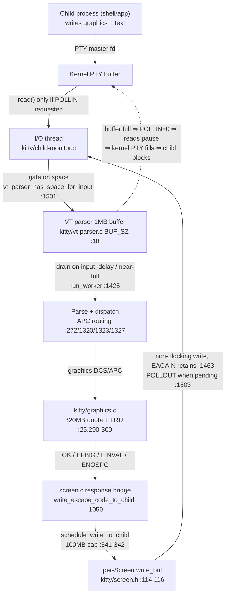

# How kitty Handles Graphics-Data Overload: Flow Control & Backpressure

> **Scope & provenance.** This document answers, from the code itself, how the
> [kitty](https://sw.kovidgoyal.net/kitty/) terminal emulator behaves when terminal
> graphics data (and child output in general) arrives faster than it can comfortably
> process or respond to. **All analysis is pinned to HEAD
> `815df1e210e0a9ab4622f5c7f2d6891d7dbeddf1`**, and **every behavioral claim carries an
> inline `[<path>:<locator>]` citation** so it can be checked against that exact revision.
> Per the investigation rules, the code is the source of truth — no claim here rests on
> assumption or terminal-emulator folklore.

---

## The Question

When terminal graphics data arrives faster than kitty can comfortably process or respond to:

1. **Does kitty buffer, pause reads, or throttle the incoming stream?** And what are the
   exact buffer sizes and thresholds that drive that decision?
2. **What happens internally when kitty must write data back to the child** (for example,
   graphics-protocol acknowledgements or query replies) while the output path is already
   congested or would block?
3. **Where do these decisions live in the code** — which files, functions, macros, and
   named constants?
4. **Does kitty adapt silently, or does it produce observable signs** (error responses to
   the client, log messages, paused reads, throttled rendering, memory eviction)?

---

## TL;DR — The Short Answer

kitty applies **layered, lossless backpressure** rather than dropping incoming data under
load. The mechanisms stack as follows:

- **Read path is lossless — buffer, then pause reads (never drop).** The VT parser owns a
  **fixed 1 MB** input buffer — `#define BUF_SZ (1024u*1024u)` `[kitty/vt-parser.c:18]` — and
  that buffer is the fulcrum of input flow control. When it fills, the I/O thread **stops
  requesting reads** `[kitty/child-monitor.c:1501]` and, even if a read is attempted, **skips
  it** `[kitty/child-monitor.c:1342]`. With reads paused the **kernel PTY buffer fills**, and
  because the child holds the **blocking** slave end of the PTY `[kitty/child.py:170-171]`, the
  child's own `write()` **blocks**. The producer is throttled by the kernel, not by kitty
  discarding bytes.
- **Throttling is coalescing, not loss.** The parser worker defers draining the buffer by up
  to the `input_delay` window, batching bursts into render-aligned chunks
  `[kitty/vt-parser.c:1425]`, with a near-full bypass so the buffer cannot be starved into
  overflow.
- **Write-back uses a separate, dynamically sized buffer with non-blocking writes.** Data
  kitty sends *back* to the child (graphics ACKs, query replies, etc.) is queued in a
  per-`Screen` write buffer `[kitty/screen.h:114-116]`, drained with **non-blocking** writes
  that **retain** the remainder on `EAGAIN` `[kitty/child-monitor.c:1463]`, and bounded by a
  **100 MB hard ceiling** `[kitty/child-monitor.c:341-342]` (the *backlog-overflow* drop path; a
  genuine write error *separately* discards the queued buffer `[kitty/child-monitor.c:1464-1465]`,
  and both are distinct from the normal `EAGAIN` retain-and-retry).
- **Graphics data has its own bounds.** Stored images obey a **320 MB storage quota** with
  **LRU eviction** `[kitty/graphics.c:25,290-300]`, plus hard per-transfer (`EFBIG`, 400 MB
  `[kitty/graphics.c:521,533]`), per-dimension (`EINVAL`, 10000 px
  `[kitty/graphics.c:674,695]`), and animation-frame-cache (`ENOSPC`, 5× quota
  `[kitty/graphics.c:1570,1573]`) limits.
- **Verdict — mostly silent, a few observable signs.** The *normal* overload case is handled
  **silently**: kernel-level read backpressure, input coalescing, LRU image eviction, and
  `EAGAIN` retention produce no user-facing message. kitty reserves **observable** signals for
  *exceptional* conditions: graphics error responses returned to the client
  `[kitty/graphics.c:533,695,1573]`, the `log_error`/`perror` lines at the 100 MB cap and on a
  genuine write failure `[kitty/child-monitor.c:342,1464]`, and the synchronized-update display
  freeze `[kitty/screen.c:2521]`.

The remainder of this document walks each mechanism in causal order, explains *why* the code
implies the behavior, and corroborates the reading against kitty's own protocol documentation
and unit tests.

---

## §1 — Orientation: kitty's Threaded I/O Architecture

To understand where flow control happens, it helps to know that reading bytes and parsing them
are done on **different threads**: the I/O thread runs `io_loop()` `[kitty/child-monitor.c:1481]`
(started via `pthread_create` `[kitty/child-monitor.c:291]`) and performs the raw
`read_bytes()`/`write_to_child()` `[kitty/child-monitor.c:1336-1357,1443]`, whereas the VT parser's
`run_worker()` `[kitty/vt-parser.c:1417]` is driven from the render/main thread through
`parse_worker()` `[kitty/screen.c:4775-4776]`. The two sides are decoupled by the shared bounded
buffer introduced above `[kitty/vt-parser.c:18]`.

- **The I/O thread** lives in `kitty/child-monitor.c`. It owns the `poll()` loop over the child
  PTY file descriptors and performs the raw `read()`/`write()` of bytes. The read path is
  `read_bytes()` `[kitty/child-monitor.c:1336-1357]`; the write path is `write_to_child()`
  `[kitty/child-monitor.c:1443]`.
- **The parse/render side** runs the VT parser worker. `kitty/vt-parser.c` is the **central
  routing hub** for *all* child PTY output: every byte the I/O thread reads is deposited into the
  parser's buffer, and the parser later classifies and dispatches it.
- **Graphics commands are routed from the parser to the graphics subsystem.** Graphics commands
  arrive as APC (Application Programming Command) escape sequences. The parser enters the APC
  state at `case ESC_APC: SET_STATE(APC); break;` `[kitty/vt-parser.c:272]`; the graphics-command
  parser is pulled in via `#include "parse-graphics-command.h"` `[kitty/vt-parser.c:1320]`; and the
  APC payload is handed off by `dispatch_apc()` `[kitty/vt-parser.c:1323]`, which calls
  `parse_graphics_code(self, buf, bufsz)` `[kitty/vt-parser.c:1327]` to forward it into
  `kitty/graphics.c`.
- **Responses flow back through the screen model.** When the graphics subsystem produces a
  protocol response, it is turned into an APC escape and routed back toward the child via
  `kitty/screen.c` (covered in §4–§5).

**Why this framing matters.** Because reading and parsing are decoupled by a *shared, bounded
buffer* `[kitty/vt-parser.c:18]`, flow control is naturally expressed as **buffer-space
negotiation** between two parties: the I/O thread is the *producer* of bytes into the buffer, and
the parser is the *consumer*. The I/O thread asks "is there room?" before each read — concretely,
`vt_parser_has_space_for_input()` `[kitty/vt-parser.c:1477-1481]` — and acts on the answer by
gating `POLLIN` `[kitty/child-monitor.c:1501]`. That single question — and the fixed size of the
buffer behind it `[kitty/vt-parser.c:18]` — is what makes the 1 MB buffer the control point for
the entire read path. The next section follows that negotiation step by step.

---

## §2 — Read-Path Flow Control: the Buffer-vs-Pause Decision

This section answers sub-question (1): **kitty buffers, and then pauses reads — it does not
throttle by dropping.** The decision turns on a fixed 1 MB buffer `[kitty/vt-parser.c:18]` and a
conditional `POLLIN` `[kitty/child-monitor.c:1501]`; its thresholds are spread across the parser and
the I/O thread, and they form a strict causal chain detailed below.

### 2.1 A compile-time-fixed 1 MB input buffer

The parser's input buffer is not dynamic; it is a fixed size baked in at compile time:

```c
#define BUF_SZ (1024u*1024u)            // kitty/vt-parser.c:18  → 1 MB
#define MAX_ESCAPE_CODE_LENGTH (BUF_SZ / 4u)  // :21  → 256 KB
```

So the entire read-side working set is bounded at **1 MB** `[kitty/vt-parser.c:18]`, and the
longest *single* escape code the parser will accept is `BUF_SZ/4` = **256 KB**
`[kitty/vt-parser.c:21]`. A fixed bound is the precondition for everything that follows: because
the buffer cannot grow, "the buffer is full" is a real, decidable state that the rest of the
machinery can react to.

### 2.2 The parser advertises remaining space

Before each poll cycle the I/O thread asks the parser whether there is room to read more. The
parser answers true only while the used space is strictly below the cap:

```c
ans = self->read.sz + self->write.pending < BUF_SZ;   // kitty/vt-parser.c:1481
```

`vt_parser_has_space_for_input()` returns that boolean `[kitty/vt-parser.c:1477-1481]`. The
"used" amount is `read.sz` (bytes already accepted, awaiting parse) plus `write.pending` (bytes
being deposited by an in-flight read). The complementary call,
`vt_parser_create_write_buffer()`, hands the I/O thread a pointer whose writable length is exactly
the **remaining** space, `BUF_SZ - (read.sz + write.pending)` `[kitty/vt-parser.c:1451-1457]`.

### 2.3 The I/O thread gates `POLLIN` on that answer

The I/O thread uses the parser's space signal to decide whether it even *asks* the kernel for
readable data. It sets the polled events for each child fd conditionally:

```c
children_fds[EXTRA_FDS + i].events = vt_parser_has_space_for_input(screen->vt_parser) ? POLLIN : 0;  // kitty/child-monitor.c:1501
```

When there is no space, `POLLIN` is simply **not requested** `[kitty/child-monitor.c:1501]`, so
`poll()` will never report that fd as readable and the I/O thread will not even attempt a `read()`
on it. This is the primary pause mechanism: *don't ask for data you have nowhere to put.*

### 2.4 The read itself is guarded too

The gate in §2.3 is belt-and-suspenders backed by a second guard inside the read routine. Even if
a read is attempted, `read_bytes()` first obtains the writable region (and its size) from the
parser and **returns early without reading** when that size is zero:

```c
if (!available_buffer_space) return true;   // kitty/child-monitor.c:1342
```

`read_bytes()` spans `[kitty/child-monitor.c:1336-1357]`; the `available_buffer_space` it checks is
produced by `vt_parser_create_write_buffer()` `[kitty/vt-parser.c:1451-1457]`. So there is no path
by which kitty reads bytes it cannot store.

### 2.5 The kernel applies the actual throttle; the child blocks

With reads paused, the **kernel PTY buffer fills up**. The crucial detail is *which end of the PTY
is non-blocking*: kitty makes only **its own** end (the master fd) non-blocking, and leaves the
child's end (the slave fd) blocking. The PTY is created with both ends blocking —

```python
master, slave = os.openpty()  # Note that master and slave are in blocking mode  # kitty/child.py:171
```

`[kitty/child.py:170-171]` — then kitty keeps the master as its own fd, `self.child_fd = master`
`[kitty/child.py:338]`, and switches *only that* fd to non-blocking with
`os.set_blocking(self.child_fd, False)` `[kitty/child.py:345]`. The child process, created by
`fork()` `[kitty/child.c:97]`, inherits the **slave** end as its std{in,out,err} via `dup2`
`[kitty/child.c:138-145]`, and that end remains **blocking**. Therefore, once the kernel PTY buffer
is full, the child's `write()` call **blocks** until kitty drains the buffer by resuming reads.
That blocking is the real, OS-level throttle felt by the producer.

### 2.6 Conclusion and rationale

**The decision is "buffer → then pause reads," and it is lossless.** There is **no drop path on the
read side**: when the 1 MB buffer fills, kitty stops requesting reads `[kitty/child-monitor.c:1501]`
and stops performing them `[kitty/child-monitor.c:1342]`; it never discards already-produced child
output.

*Why is it built this way?* A fixed-size buffer `[kitty/vt-parser.c:18]` combined with a conditional
`POLLIN` `[kitty/child-monitor.c:1501]` and an early-return read `[kitty/child-monitor.c:1342]` is a
deliberate **"do not read what you cannot store"** design. It converts application-level buffer
pressure into **OS-level flow control** — the canonical, lossless way to backpressure a pipe or PTY.
Because the slave end stays blocking `[kitty/child.py:170-171]`, the kernel does the throttling for
free: kitty does not need a timer, a rate limiter, or a discard policy on the read side. The
producer is naturally paced to the rate at which kitty can parse and render.

---

## §3 — Parse Throttle / Coalescing: the "Slow Down" Decision

The user's "throttle / slow down" intuition is real, but in kitty it takes the form of **coalescing
(batching), not data loss**. The parser deliberately delays draining the buffer so that bursts are
processed in render-aligned chunks, governed by the `input_delay` window in `run_worker()`
`[kitty/vt-parser.c:1425]`.

### 3.1 The drain condition

The parser worker `run_worker()` does not parse every byte the instant it arrives. It drains the
buffer only when one of three conditions holds:

```c
if (flush || pd->time_since_new_input >= OPT(input_delay) || self->read.sz + 16 * 1024 > BUF_SZ) {  // kitty/vt-parser.c:1425
```

That is `[kitty/vt-parser.c:1425]`: drain on (a) an explicit `flush`, **or** (b) once the
`input_delay` window has elapsed since new input last arrived, **or** (c) when the buffer is within
**16 KB** of full (`read.sz + 16*1024 > BUF_SZ`).

### 3.2 The poll loop honors the same delay

The I/O thread's `poll()` timeout is itself derived from `input_delay`, so the two cooperate rather
than fight:

```c
monotonic_t time_delta = OPT(input_delay) - (now - last_main_loop_wakeup_at);  // kitty/child-monitor.c:1508
if (time_delta >= 0) ret = poll(children_fds, self->count + EXTRA_FDS, monotonic_t_to_ms(time_delta));  // :1509
```

This block `[kitty/child-monitor.c:1506-1512]` makes the loop wake up on the `input_delay` cadence
when there are pending wakeups, aligning byte intake with the parse/drain rhythm.

### 3.3 The defaults

- `input_delay` defaults to **3 ms** — `input_delay: int = 3` `[kitty/options/types.py:536]`.
- `repaint_delay` defaults to **10 ms** — `repaint_delay: int = 10` `[kitty/options/types.py:567]`.

These defaults are corroborated by the project's performance documentation, which states the
measurements were done with `input_delay` at its default value of 3 ms `[docs/performance.rst:48]`.

### 3.4 Conclusion and rationale

The throttle the user asks about exists, but it is **coalescing/batching governed by
`input_delay`/`repaint_delay`**, not discarding. High-rate input is accumulated and then processed in
batches aligned to the render cadence. Critically, when input is arriving fast and the buffer nears
full (within 16 KB), the time-based delay is **bypassed** by the third clause of
`[kitty/vt-parser.c:1425]`, so the parser drains promptly to free space.

*Why is it built this way?* Delaying the drain by a few milliseconds — the `input_delay` clause of
`[kitty/vt-parser.c:1425]` — **amortizes** parsing and rendering over larger batches, which is far
more efficient under load than reacting byte-by-byte (each render is expensive relative to a few
milliseconds of accumulation). At the same time, the near-full bypass (`read.sz + 16*1024 > BUF_SZ`)
`[kitty/vt-parser.c:1425]` guarantees the time-based delay can never starve the 1 MB buffer
`[kitty/vt-parser.c:18]` into overflow: the throttle and the §2 flow-control buffer **cooperate** —
the delay optimizes the common case, and the 16 KB margin protects the worst case.

---

## §4 — Write-Path Backpressure: Writing Back While Congested

This section answers sub-question (2): **what happens when kitty must write data back to the child
while the output path is congested or would block.** The write-back path is entirely separate from
the read path of §2 — it has its own per-`Screen` buffer `[kitty/screen.h:114-116]`, its own 100 MB
cap `[kitty/child-monitor.c:341-342]`, and its own non-blocking draining logic
`[kitty/child-monitor.c:1443]`.

### 4.1 A separate, dynamically sized per-`Screen` write buffer

Each `Screen` carries its own outbound buffer:

```c
uint8_t *write_buf;                  // kitty/screen.h:114
size_t write_buf_sz, write_buf_used; // :115
pthread_mutex_t write_buf_lock;      // :116
```

These fields `[kitty/screen.h:114-116]` hold queued bytes destined for the child. Unlike the fixed
1 MB read buffer, this buffer is **grown on demand**.

### 4.2 Queuing, growth, and the 100 MB hard cap

Bytes are appended through the `schedule_write_to_child_generic` macro
`[kitty/child-monitor.c:323]`. It grows the buffer with `PyMem_RawRealloc` when the incoming chunk
does not fit, and shrinks it back toward `BUFSIZ` once the backlog has drained. The one place it
refuses to grow is the **100 MB ceiling**:

```c
if (screen->write_buf_used + sz > 100 * 1024 * 1024) {              // kitty/child-monitor.c:341
    log_error("Too much data being sent to child with id: %lu, ignoring it", id);  // :342
```

`[kitty/child-monitor.c:341-342]` — when the queued total would exceed **100 MB**, kitty logs the
message and **drops the new data**. This is the *backlog-overflow* drop path; it is **not** the only
place write-back data leaves the queue — a *genuine write error* separately discards the queued
buffer (see §4.3, `[kitty/child-monitor.c:1464-1465]`), and both of these exceptional paths are
distinct from the normal `EAGAIN` retain-and-retry case `[kitty/child-monitor.c:1463]`.

### 4.3 Draining with non-blocking writes and `EAGAIN` retention

The I/O thread drains the buffer in `write_to_child()` `[kitty/child-monitor.c:1443]` using a
**non-blocking** `write()` in a loop. The handling of a would-block condition is the heart of the
backpressure:

```c
if (errno == EWOULDBLOCK || errno == EAGAIN) break;                 // kitty/child-monitor.c:1463
perror("Call to write() to child fd failed, discarding data.");     // :1464
written = screen->write_buf_used;                                   // :1465
```

- On `EWOULDBLOCK`/`EAGAIN` (the output path is congested / would block), the loop simply **breaks**
  `[kitty/child-monitor.c:1463]`, leaving the unwritten remainder in the buffer. After the loop a
  `memmove` slides the unsent bytes to the front of the buffer so they are retried later. Nothing is
  lost and the I/O thread is **not blocked**.
- On a **genuine** write error (any errno other than `EINTR`/`EAGAIN`/`EWOULDBLOCK`), kitty logs via
  `perror(...)` `[kitty/child-monitor.c:1464]` and **discards the whole queued buffer** by setting
  `written = screen->write_buf_used` `[kitty/child-monitor.c:1465]`.

`EAGAIN` is even *possible* here only because kitty made the master fd non-blocking
`[kitty/child.py:345]` (the same fact from §2.5 that lets the read side pause cleanly).

### 4.4 `POLLOUT` is armed only when there is queued data

When a write is left incomplete, the I/O thread needs to know when the fd becomes writable again. It
registers `POLLOUT` for a child **only** while that child has queued bytes:

```c
children_fds[EXTRA_FDS + i].events |= (screen->write_buf_used ? POLLOUT : 0);  // kitty/child-monitor.c:1503
```

`[kitty/child-monitor.c:1503]` — a congested write therefore costs nothing while idle: the fd is
not polled for writability unless there is something to flush. When the kernel signals the fd
writable, `write_to_child()` resumes from where it left off.

### 4.5 Conclusion and rationale

When the output path is congested, kitty **does not block its I/O thread**. It writes what it can,
**retains the rest** in the per-`Screen` buffer, keeps `POLLOUT` armed `[kitty/child-monitor.c:1503]`,
and flushes later when the fd drains — the ordinary `EAGAIN` retain-and-retry case
`[kitty/child-monitor.c:1463]`. Data is dropped in only **two** distinct situations, which should not
be confused with the normal congested case:

1. **Backlog overflow:** the queued total exceeds **100 MB**, so new data is dropped with a
   `log_error` `[kitty/child-monitor.c:341-342]`.
2. **Genuine write error:** a non-`EAGAIN` error from `write()` discards the queued buffer with a
   `perror` `[kitty/child-monitor.c:1464-1465]`.

*Why is it built this way?* A single I/O thread (`io_loop()` `[kitty/child-monitor.c:1481]`) services
*all* children. If it blocked on a write to one congested child, every other window would stall.
Non-blocking writes + remainder retention `[kitty/child-monitor.c:1463]` + `POLLOUT`-gating
`[kitty/child-monitor.c:1503]` keep that one thread responsive to all children regardless of any
single child's read rate. The 100 MB cap is a **safety valve**: if a child never reads kitty's
responses (e.g., a buggy program that floods queries but never consumes replies), the buffer would
otherwise grow without bound; the cap trades correctness-under-abuse for bounded memory, and announces
it in the log rather than failing silently `[kitty/child-monitor.c:341-342]`.

---

## §5 — Graphics-Specific Limits (the "graphics data" angle)

Beyond the generic read/write buffers, the graphics subsystem in `kitty/graphics.c` imposes bounds
specific to image data. These are what most directly answer "when *graphics* data arrives faster than
it can keep up."

### 5.1 The 320 MB storage quota with LRU eviction

Stored image memory is bounded by a default quota:

```c
#define DEFAULT_STORAGE_LIMIT 320u * (1024u * 1024u)  // kitty/graphics.c:25  → 320 MB
```

`[kitty/graphics.c:25]`, assigned to each manager at initialization
(`self->storage_limit = DEFAULT_STORAGE_LIMIT`) `[kitty/graphics.c:78]`. After adding an image, if
`used_storage` exceeds the limit `[kitty/graphics.c:2184]`, `apply_storage_quota()`
`[kitty/graphics.c:290-300]` runs: it first removes unreferenced images, then sorts oldest-first via
`HASH_SORT(self->images, oldest_img_first)` `[kitty/graphics.c:295]` and evicts from the oldest end
until back under quota:

```c
while (self->used_storage > storage_limit && self->images) { remove_image(self, self->images); }  // kitty/graphics.c:296
```

That is **LRU eviction** `[kitty/graphics.c:296]` — under sustained image flooding, older images are
silently dropped from storage to make room for newer ones.

### 5.2 Hard rejections for pathological single transfers

Three up-front limits reject a single oversized/invalid request outright, each with a specific
protocol error code:

- **Per-transfer data cap — `EFBIG`.** `#define MAX_DATA_SZ (4u * 100000000u)` (≈ 400 MB)
  `[kitty/graphics.c:521]`; exceeding it aborts the command with `ABRT("EFBIG", "Too much data")`
  `[kitty/graphics.c:533]`.
- **Per-dimension cap — `EINVAL`.** `#define MAX_IMAGE_DIMENSION 10000u` `[kitty/graphics.c:674]`; an
  image wider or taller than 10000 px aborts with `ABRT("EINVAL", "Image too large")`
  `[kitty/graphics.c:695]`.
- **Animation frame-cache cap — `ENOSPC`.** Animation frame data has a *separate, larger* quota of
  `storage_limit * 5` `[kitty/graphics.c:1570]`; overflowing it aborts with
  `ABRT("ENOSPC", "Cache size exceeded cannot add new frames")` `[kitty/graphics.c:1573]`.

### 5.3 Response building and the `quiet` suppression rule

Whether any of these results becomes *visible* to the client is governed by the graphics `quiet`
(`q`) key. `finish_command_response()` `[kitty/graphics.c:759]` builds the response string (a
`G i=<id>;OK` or `G i=<id>;<ERRCODE>:<message>` APC payload), but first consults `quiet`:

```c
if (g->quiet) { if (is_ok_response || g->quiet > 1) return NULL; }  // kitty/graphics.c:762-763
```

`[kitty/graphics.c:762-763]` — so `q=1` suppresses **OK** responses (an OK is hidden because
`is_ok_response` is true), while `q>=2` additionally suppresses **error** responses (the `quiet > 1`
clause). With `q=0` (default), both OK and error responses are sent.

### 5.4 The bridge from a graphics result to the write-back path

A graphics result becomes a child-bound response through the screen model.
`screen_handle_graphics_command()` `[kitty/screen.c:1047]` calls `grman_handle_command()`
`[kitty/screen.c:1049]`, and if it returns a non-NULL response, emits it as an APC escape:

```c
if (response != NULL) write_escape_code_to_child(self, ESC_APC, response);  // kitty/screen.c:1050
```

`write_escape_code_to_child()` `[kitty/screen.c:979]` (and the lower-level `write_to_child()`
`[kitty/screen.c:947]`) hand the bytes to `schedule_write_to_child` — i.e., straight into the §4
write-back path with its `EAGAIN` retention and 100 MB cap. This is the coupling point: **graphics
acknowledgements ride the same backpressured write buffer as every other reply.** The relevant
`GraphicsManager` fields are `storage_limit` `[kitty/graphics.h:128]`, `used_storage`
`[kitty/graphics.h:140]`, and `disk_cache` `[kitty/graphics.h:141]`.

### 5.5 Conclusion and rationale

The 320 MB quota with LRU eviction `[kitty/graphics.c:25,290-300]` bounds *stored* image memory
**independently** of the transient input/output buffers of §2 and §4. *Why?* Images can be large
and long-lived (they persist after the
escape code that delivered them), so they need their own memory ceiling; without it, a client could
exhaust memory simply by transmitting image after image — a denial-of-service vector. Evicting the
**oldest** images keeps the most recently used ones available while still bounding total memory. The
`EFBIG`/`EINVAL`/`ENOSPC` aborts are a complementary, cheaper defense: they reject a *single*
pathological request (absurd size, absurd dimensions, or animation-frame flood) **up front**, before
it can consume the quota at all.

---

## §6 — Application-Driven Synchronized-Update Pause (a "looks paused" signal)

This mechanism is **distinct** from the read/write flow control above — it is *application-driven*,
not a response to overload — but it is included because it is the most likely reason a terminal
"looks paused/throttled" during heavy update activity, and the question explicitly asks about
"throttled rendering."

The synchronized-update DCS sequence — `=1s` to start, `=2s` to stop — is detected in the parser:

```c
if (bufsz > 2 && (buf[1] == '1' || buf[1] == '2') && buf[2] == 's') {  // kitty/vt-parser.c:637
```

`[kitty/vt-parser.c:637]`. Starting it calls `screen_pause_rendering(self->screen, true, 0)`
`[kitty/vt-parser.c:640]`; stopping it calls `screen_pause_rendering(self->screen, false, 0)`
`[kitty/vt-parser.c:645]`. `screen_pause_rendering()` `[kitty/screen.c:2506]` freezes the *displayed*
frame, and when no explicit timeout is supplied it defaults to **2000 ms**:

```c
if (for_in_ms <= 0) for_in_ms = 2000;  // kitty/screen.c:2521
```

`[kitty/screen.c:2521]`. Importantly, **input continues to be parsed and processed while the display
is frozen** — only the *rendering* is paused, not the read path.

**Rationale.** This lets an application batch a complex screen update (many cursor moves, writes, and
clears) so the user never sees a half-drawn, flickering intermediate frame. It is bounded by the
2000 ms timeout `[kitty/screen.c:2521]` precisely so that a buggy or blocked application cannot freeze
the display forever — after the timeout the display resumes on its own. To be clear: this is **not**
flow control for incoming data; it is an application-requested rendering pause. But it explains one
concrete way the terminal can *appear* paused under heavy update activity, which is why it belongs in
a complete answer.

---

## §7 — Runtime-Visible Signs: Silent vs. Observable

This is the direct answer to sub-question (4): **does kitty quietly adapt, or show visible signs?**
The honest answer is *both*, split cleanly along a "normal overload vs. exceptional condition" line.

### 7.1 SILENT — kitty just adapts, with no user-visible signal

- **Kernel-level read backpressure.** Paused `POLLIN` `[kitty/child-monitor.c:1501]` plus the skipped
  read `[kitty/child-monitor.c:1342]` cause the kernel PTY buffer to fill and the child's `write()`
  to block. Nothing is logged; the child simply slows down.
- **Input coalescing / throttle.** The `input_delay`-governed batching in
  `[kitty/vt-parser.c:1425]` (default 3 ms `[kitty/options/types.py:536]`) is invisible — it only
  changes *when* buffered bytes are parsed, not *whether*.
- **LRU image eviction.** Under the 320 MB quota, `apply_storage_quota()`
  `[kitty/graphics.c:290-300]` silently removes the oldest images; no message is emitted to the
  client or the log.
- **`EAGAIN` retention on the write path.** A congested write is handled by breaking and retrying
  later `[kitty/child-monitor.c:1463]` — there is no message for the ordinary would-block case.

### 7.2 OBSERVABLE — a sign is produced

- **Graphics error responses to the client.** Oversized/invalid graphics requests return a protocol
  error code: `EFBIG` `[kitty/graphics.c:533]`, `EINVAL` `[kitty/graphics.c:695]`, or `ENOSPC`
  `[kitty/graphics.c:1573]`, built by `finish_command_response()` `[kitty/graphics.c:759]` — **unless**
  suppressed by the `quiet` key `[kitty/graphics.c:762-763]`.
- **Log lines.** Two log messages mark exceptional write-back conditions: at the 100 MB cap,
  `log_error("Too much data being sent to child with id: %lu, ignoring it", id)`
  `[kitty/child-monitor.c:342]`; and on a genuine write failure,
  `perror("Call to write() to child fd failed, discarding data.")` `[kitty/child-monitor.c:1464]`.
- **A frozen frame.** The synchronized-update pause freezes the visible frame for up to the 2000 ms
  timeout `[kitty/screen.c:2521]` — visible to the *user* (not the client program).

### 7.3 Rationale

The design favors **silent, lossless adaptation** for the *normal* overload case — a producer that is
simply faster than the consumer (kernel read backpressure `[kitty/child-monitor.c:1501,1342]`, LRU
image eviction `[kitty/graphics.c:290-300]`, and `EAGAIN` retention `[kitty/child-monitor.c:1463]`) —
and reserves **explicit signals** for *exceptional* conditions: oversized or invalid graphics requests
`[kitty/graphics.c:533,695,1573]`, a pathological 100 MB write backlog `[kitty/child-monitor.c:342]`,
or a real I/O error `[kitty/child-monitor.c:1464]`. This is the precise answer to "silently or visible
signs": **mostly silent, with targeted signals where silence would hide a genuine problem** (a request
the client got wrong, or a backlog/error the client ought to know about).

---

## §8 — Evidence & Validation (corroboration)

Per the investigation discipline, the code reading above is corroborated against kitty's own
authoritative documentation and its unit tests.

### 8.1 The official graphics protocol specification agrees

- **Chunked transmission.** Large image data is sent in chunks "no larger than `4096` bytes"
  `[docs/graphics-protocol.rst:366]`, using the `m` continuation key (`m=1` for all but the last
  chunk, `m=0` for the last), per the worked example `[docs/graphics-protocol.rst:373-375]`. This is
  the client-side complement to kitty's bounded input buffer: the protocol itself chunks data so it
  fits within escape-code limits.
- **Validate-before-display.** The spec states that terminals "must not display anything, until the
  entire sequence is received and validated" `[docs/graphics-protocol.rst:383-384]`, which is exactly
  why kitty buffers the whole image before acting (§2) rather than streaming it to the screen.
- **The 320 MB quota and 5× frame cache.** The spec independently documents that "the quota in kitty
  is 320MB per buffer," that the emulator should "delete older images to make space," and that
  animation frame data has a "separate, larger quota of five times the base quota"
  `[docs/graphics-protocol.rst:980-984]` — matching `DEFAULT_STORAGE_LIMIT`
  `[kitty/graphics.c:25]`, `apply_storage_quota()` `[kitty/graphics.c:290-300]`, and the `5×` frame
  cap `[kitty/graphics.c:1570]`.
- **Response suppression.** The spec confirms the `quiet` semantics: set `q` to suppress "OK
  responses and to `2` to suppress failure responses" `[docs/graphics-protocol.rst:768]` — matching
  `[kitty/graphics.c:762-763]`.

### 8.2 The performance docs confirm the throttle defaults

The performance documentation notes that measurements use `input_delay` at "its default value of
`3 ms`" `[docs/performance.rst:48]`, matching `[kitty/options/types.py:536]`.

### 8.3 A runnable unit test proves the quota behavior

`test_graphics_quota_enforcement()` `[kitty_tests/graphics.py:1189]` is a concrete, runnable
confirmation of the eviction and `ENOSPC` behavior. It sets a tiny `storage_limit` of `36*2` = 72
bytes `[kitty_tests/graphics.py:1192]`, transmits three images, and asserts that after the third the
disk-cache total stays equal to the limit and the image count is **2** (i.e., the oldest image was
evicted) `[kitty_tests/graphics.py:1197-1201]`. It then sends eight animation frames (all OK) and
asserts the ninth returns `ENOSPC` `[kitty_tests/graphics.py:1203-1205]`, proving the 5× frame-cache
cap. The test thus exercises both §5.1 (LRU eviction) and §5.2 (`ENOSPC`) directly.

### 8.4 Note on dynamic corroboration

Static source reading is the primary evidence for everything above, and it is sufficient: every claim
is tied to a specific line at HEAD `815df1e210e0`. Where dynamic corroboration is desired (for
example, running `kitty_tests/graphics.py`, `parser.py`, or `screen.py`), it is performed inside the
project-provided Docker image
(`andrewparkscaleai/coding-agent:kovidgoyal__kitty__815df1e210e0a9ab4622f5c7f2d6891d7dbeddf1` from
`ghcr.io/scaleapi/swe-atlas`), because the local analysis sandbox lacks the `go`/`cc` toolchain needed
to build kitty. The source tree is left unchanged and any temporary observation script is removed
afterward.

---

## §9 — Code-Location Summary & Architecture Diagram

### 9.1 Mechanism → location → constant/threshold

| # | Mechanism | File / symbol | Key constant / threshold | Citation |
|---|-----------|---------------|--------------------------|----------|
| 1 | Fixed input buffer (the read-side control point) | `kitty/vt-parser.c` `BUF_SZ` | **1 MB** | `[kitty/vt-parser.c:18]` |
| 2 | Max single escape-code length | `kitty/vt-parser.c` `MAX_ESCAPE_CODE_LENGTH` | **256 KB** (`BUF_SZ/4`) | `[kitty/vt-parser.c:21]` |
| 3 | Parser advertises remaining space | `vt_parser_has_space_for_input()` | `read.sz + write.pending < BUF_SZ` | `[kitty/vt-parser.c:1477-1481]` |
| 4 | Writable region handed to reader | `vt_parser_create_write_buffer()` | `BUF_SZ - (read.sz + write.pending)` | `[kitty/vt-parser.c:1451-1457]` |
| 5 | `POLLIN` read-gating | `kitty/child-monitor.c` poll setup | request `POLLIN` only if space | `[kitty/child-monitor.c:1501]` |
| 6 | Read-skip when buffer full | `read_bytes()` | `if (!available_buffer_space) return true;` | `[kitty/child-monitor.c:1342]` (`[:1336-1357]`) |
| 7 | Parse throttle / coalescing | `run_worker()` | flush ∥ `input_delay` ∥ within **16 KB** of full | `[kitty/vt-parser.c:1425]` |
| 8 | Poll timeout honors `input_delay` | `kitty/child-monitor.c` poll loop | `OPT(input_delay) - elapsed` | `[kitty/child-monitor.c:1506-1512]` |
| 9 | `input_delay` default | `kitty/options/types.py` | **3 ms** | `[kitty/options/types.py:536]` |
| 10 | `repaint_delay` default | `kitty/options/types.py` | **10 ms** | `[kitty/options/types.py:567]` |
| 11 | Per-`Screen` write buffer fields | `kitty/screen.h` | dynamic `write_buf` / `write_buf_used` | `[kitty/screen.h:114-116]` |
| 12 | Write-buffer queueing macro | `schedule_write_to_child_generic` | grow via `PyMem_RawRealloc` | `[kitty/child-monitor.c:323]` |
| 13 | Write-back 100 MB hard cap | `schedule_write_to_child_generic` | **100 MB** → `log_error` + drop | `[kitty/child-monitor.c:341-342]` |
| 14 | Non-blocking write + `EAGAIN` retention | `write_to_child()` | `EWOULDBLOCK`/`EAGAIN` → break & retain | `[kitty/child-monitor.c:1443,1463]` |
| 15 | Genuine write error → discard | `write_to_child()` | `perror(...)` + discard buffer | `[kitty/child-monitor.c:1464-1465]` |
| 16 | `POLLOUT` armed only when pending | `kitty/child-monitor.c` poll setup | `write_buf_used ? POLLOUT : 0` | `[kitty/child-monitor.c:1503]` |
| 17 | Master fd set non-blocking | `kitty/child.py` | `os.set_blocking(child_fd, False)` | `[kitty/child.py:345]` |
| 18 | PTY created blocking; child holds slave | `kitty/child.py` / `kitty/child.c` | child std{in,out,err} = blocking slave | `[kitty/child.py:170-171]`, `[kitty/child.c:138-145]` |
| 19 | Graphics routing (parser → graphics.c) | `vt-parser.c` APC path | `ESC_APC` → `dispatch_apc` → `parse_graphics_code` | `[kitty/vt-parser.c:272,1320,1323,1327]` |
| 20 | Graphics storage quota + LRU eviction | `graphics.c` `DEFAULT_STORAGE_LIMIT` / `apply_storage_quota()` | **320 MB**, oldest-first eviction | `[kitty/graphics.c:25,290-300]` |
| 21 | Per-transfer cap → `EFBIG` | `graphics.c` `MAX_DATA_SZ` | **400 MB** | `[kitty/graphics.c:521,533]` |
| 22 | Per-dimension cap → `EINVAL` | `graphics.c` `MAX_IMAGE_DIMENSION` | **10000 px** | `[kitty/graphics.c:674,695]` |
| 23 | Animation frame cache → `ENOSPC` | `graphics.c` frame-cache check | **5× quota** | `[kitty/graphics.c:1570,1573]` |
| 24 | Response build + `quiet` suppression | `finish_command_response()` | `q=1` hides OK; `q≥2` hides errors | `[kitty/graphics.c:759,762-763]` |
| 25 | Graphics response bridge → write path | `screen_handle_graphics_command()` | `write_escape_code_to_child(ESC_APC, ...)` | `[kitty/screen.c:1047-1050]` |
| 26 | Synchronized-update display pause | `screen_pause_rendering()` | default **2000 ms** timeout | `[kitty/screen.c:2521]` (dispatch `[kitty/vt-parser.c:637,640,645]`) |

### 9.2 Architecture flow

The diagram below shows the full path of child output through kitty and the responses back to the
child, including the dashed **feedback edge** that is the essence of read-path flow control
(buffer full ⇒ `POLLIN=0` ⇒ reads pause ⇒ kernel PTY fills ⇒ child blocks).



---

## Appendix — One-Paragraph Answer

When graphics (or any) data arrives faster than kitty can process it, kitty **buffers into a fixed
1 MB VT-parser buffer and then pauses reads** — it never drops incoming data
`[kitty/vt-parser.c:18]`, `[kitty/child-monitor.c:1501,1342]`. The pause propagates as **lossless,
OS-level backpressure**: the kernel PTY buffer fills and the child's blocking `write()` stalls
`[kitty/child.py:170-171,345]`. A short `input_delay` throttle **coalesces** bursts into render-aligned
batches, bypassed when the buffer is within 16 KB of full `[kitty/vt-parser.c:1425]`. Data kitty must
write **back** to the child travels a **separate, dynamically sized per-`Screen` buffer** drained with
**non-blocking writes that retain the remainder on `EAGAIN`** and re-arm `POLLOUT`, bounded by a
**100 MB** ceiling that drops with a `log_error`, and discarding on a genuine write error with a
`perror` `[kitty/screen.h:114-116]`, `[kitty/child-monitor.c:341-342,1463,1464-1465,1503]`. Graphics
data additionally obeys a **320 MB LRU-evicted storage quota** and hard `EFBIG`/`EINVAL`/`ENOSPC`
caps `[kitty/graphics.c:25,290-300,533,695,1573]`. The behavior is **mostly silent** (kernel
backpressure, coalescing, LRU eviction, `EAGAIN` retention) with a few **observable** signs — graphics
error responses (subject to `quiet`), the two write-path log lines, and the 2000 ms synchronized-update
display freeze `[kitty/graphics.c:762-763]`, `[kitty/child-monitor.c:342,1464]`, `[kitty/screen.c:2521]`.
