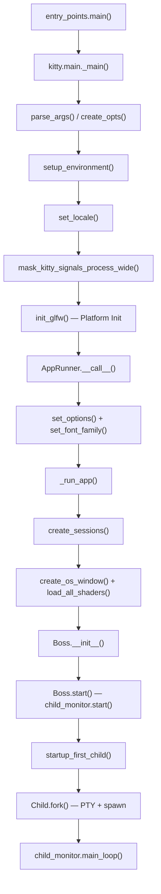
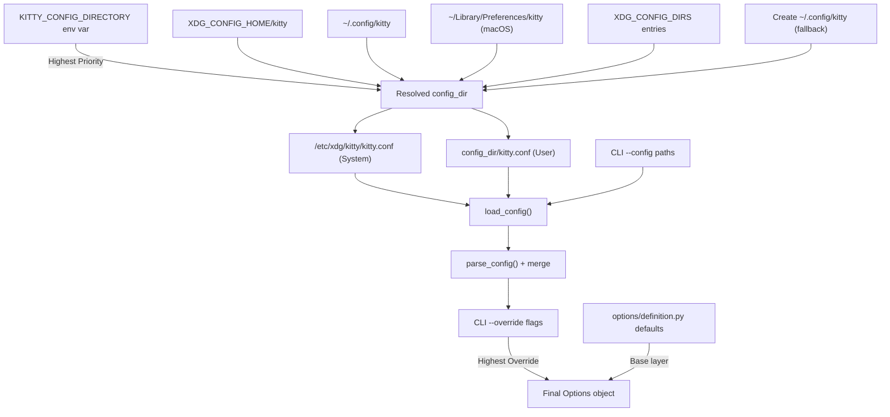
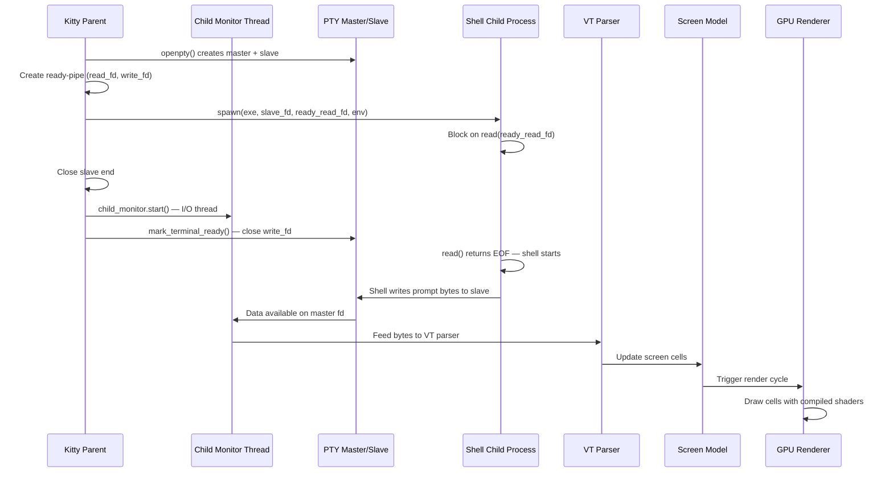
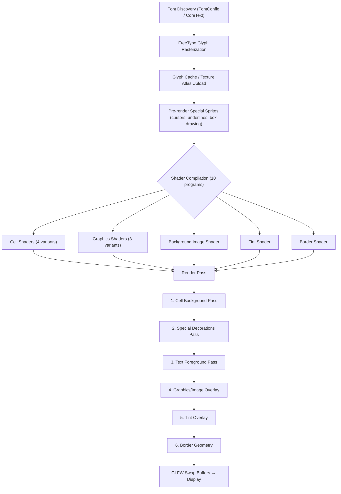

# Kitty Terminal Emulator: Startup Lifecycle Investigation

**Commit:** `815df1e21` | **Branch:** `kitty_815df1e210e0` | **Version:** 0.35.2

---

## Introduction

This document is an investigative research report that answers four tightly coupled questions about the Kitty terminal emulator's startup lifecycle — from the moment the process launches through to the point where a shell displays its first output. Every answer is grounded in the actual source code at commit `815df1e21` (version `0.35.2`, as declared at `Source: kitty/constants.py:25` — `version: Version = Version(0, 35, 2)`).

### Purpose

Answer four investigative questions:

1. **Q1 — Startup Subsystem Sequence:** What happens when Kitty starts, before the terminal is ready for a shell?
2. **Q2 — Initial Configuration Resolution:** How does Kitty decide on its initial configuration?
3. **Q3 — Terminal-to-Shell Communication:** How does Kitty get the terminal ready to communicate with the shell?
4. **Q4 — Display System Evidence:** What visible evidence shows the display system is active and working?

### Scope

From `entry_points.main()` through GLFW initialization, font loading, shader compilation, Boss controller creation, child process spawning, and the first rendered shell prompt.

### Constraints

- **Read-only investigation:** No repository source files were modified.
- **Code as truth:** All claims are based on the source code. No assumptions are made.
- **Commit-pinned:** All references are to commit `815df1e21`.

### Terminology

This document uses Kitty's own terminology: **OS window** (top-level platform window), **tab** (a tab within an OS window), **child process** (the shell or command running inside the terminal).

---

## Xvfb Headless Environment Setup

### Rationale for Xvfb

Kitty requires an X11 or Wayland display server because its rendering pipeline is built on OpenGL. The GLFW initialization in `init_glfw()` selects the platform backend based on the runtime environment:

```
Source: kitty/main.py:96
glfw_module = 'cocoa' if is_macos else ('wayland' if is_wayland(opts) else 'x11')
```

On a headless Linux system with no physical display, **Xvfb** (X Virtual Framebuffer) provides a virtual X11 display server that implements the X11 protocol in memory, allowing GUI applications to believe they have a display.

### Setup Procedure

The Xvfb headless setup involves:

1. **Install Xvfb and utilities:**
   ```bash
   apt-get install -y xvfb x11-utils
   ```

2. **Start the virtual framebuffer:**
   ```bash
   Xvfb :99 -screen 0 1280x1024x24 &
   export DISPLAY=:99
   ```

3. **Verify X11 availability:**
   ```bash
   xdpyinfo | head -5
   ```

Kitty additionally requires an OpenGL context. Xvfb alone does not provide hardware-accelerated OpenGL — Mesa's software rasterizer (`llvmpipe` or `softpipe`) would be needed for even software-rendered OpenGL. Without Mesa's EGL/GLX libraries, GLFW context creation will fail.

### Observed Behavior and Limitations

**Thinking and Rationale:** A direct headless launch attempt under Xvfb is expected to encounter multiple barriers:

1. **Compiled C extensions required:** Kitty's Python layer imports `kitty.fast_data_types`, a compiled C extension module that provides the OpenGL bindings, GLFW wrappers, and core data structures. In a raw source tree without a prior `make` build, this module does not exist and the import will fail with `ImportError`.

2. **OpenGL context creation:** Even with compiled extensions, the GLFW initialization path calls:
   ```
   Source: kitty/main.py:91
   if not glfw_init(glfw_path(glfw_module), edge_spacing, debug_keyboard, debug_rendering, wayland_enable_ime):
       raise SystemExit('GLFW initialization failed')
   ```
   The `glfw_path()` function (`Source: kitty/constants.py:191-193`) constructs the path to the platform-specific shared library (e.g., `glfw-x11.so`). Under Xvfb without a hardware GPU or Mesa software rendering, EGL/GLX context creation (`glfw/x11_init.c`) will fail, producing the `GLFW initialization failed` error.

3. **Debug flags for diagnosis:** Kitty provides diagnostic flags (`Source: kitty/cli.py`):
   - `--debug-rendering` — GPU rendering diagnostic output
   - `--debug-font-fallback` — Font fallback diagnostic logging
   - `--debug-config` — Prints effective configuration, OpenGL version, and font info

**Conclusion:** Even without a successful launch, the startup sequence can be fully and reliably traced through code analysis, which is the approach taken in this document.

---

## Q1: Startup Subsystem Sequence

*What happens when Kitty starts from this commit, before the terminal is ready for a shell? Which systems start up on the way to a working terminal, and what do you actually see on screen or in logs that shows them coming online?*

### Thinking and Rationale

To answer this question, we trace the call chain starting from the Python entry point through the C-extension backed subsystems. The startup is a strictly ordered sequence: entry point dispatch → Python bootstrap → GLFW platform init → font system init → OS window creation with shader compilation → Boss controller init → child monitor start → session provisioning → child process spawn. Each step depends on the previous one completing successfully.

### 1.1 Entry Point Dispatch

`Source: kitty/entry_points.py:183-197` — `main()`

The `main()` function is Kitty's top-level entry point. Its logic is:

1. **Frozen build setup** (lines 184-187): If the build is frozen (`sys.frozen`), `setup_openssl_environment()` is called to set `SSL_CERT_FILE` to the bundled CA certificate.

2. **Argument dispatch** (lines 188-197): The first command-line argument (`sys.argv[1]`) is checked against the `entry_points` dict (line 151):
   - `'icat'` → delegates to `icat()` (runs `kitten` binary)
   - `'list-fonts'` → delegates to `list_fonts()`
   - `'+'` → delegates to `namespaced()` for sub-commands: `hold`, `complete`, `runpy`, `launch`, `open`, `kitten`, `edit-config`, `shebang`, `edit`

3. **Normal GUI launch** (lines 194-195): If no sub-command matches (the normal case), Kitty imports and calls the main GUI function:
   ```python
   from kitty.main import main as kitty_main
   kitty_main()
   ```

`Source: kitty/main.py:524-530` — `main()` wraps `_main()` in a try/except to catch and log unhandled exceptions.

### 1.2 Python Bootstrap (`_main`)

`Source: kitty/main.py:441-521` — `_main()`

This function orchestrates the entire startup. The ordered sequence is:

| Step | Line(s) | Operation | Purpose |
|------|---------|-----------|---------|
| 1 | 442 | `running_in_kitty(True)` | Marks the process as a running Kitty instance |
| 2 | 445-448 | macOS Launch Services handling | Changes CWD to `~`, reads `macos-launch-services-cmdline` |
| 3 | 449-454 | CWD validation | Falls back to `~` if current CWD is invalid |
| 4 | 464 | `parse_args(args=args, result_class=CLIOptions, ...)` | Parses CLI arguments into `CLIOptions` |
| 5 | 470-474 | Detach handling | If `--detach`, reads stdin session and calls `detach()` |
| 6 | 475-478 | Replay commands mode | Short-circuits to `client_main()` for command replay |
| 7 | 480-492 | Single-instance mode | Parses `KITTY_SI_DATA` env var, extracts `talk_fd` |
| 8 | 493-494 | Configuration loading | `opts = create_opts(cli_opts, accumulate_bad_lines=bad_lines)` |
| 9 | 495 | `setup_environment(opts, cli_opts)` | Ensures kitty/kitten in PATH, sets MANPATH, calls `set_default_env()` |
| 10 | 499-502 | `set_locale()` | Sets `LC_ALL` via `locale.setlocale()` |
| 11 | 503-504 | `sys.setswitchinterval(1000.0)` | Optimizes Python threading — only one Python thread is used |
| 12 | 513 | `mask_kitty_signals_process_wide()` | Masks signals before display backend starts threads |
| 13 | 514 | `init_glfw(opts, ...)` | Initializes the GLFW platform windowing library |
| 14 | 516-518 | `run_app(opts, cli_opts, bad_lines, talk_fd)` | Runs the application via `AppRunner.__call__()` |
| 15 | 519-521 | Cleanup | `glfw_terminate()`, `cleanup_ssh_control_masters()` |

**Thinking:** Steps 1-12 are pure setup — no window appears yet. Step 13 (GLFW init) is the first interaction with the display server. Step 14 triggers the cascade that creates windows, compiles shaders, spawns children, and enters the main loop.

### 1.3 GLFW Platform Initialization

`Source: kitty/main.py:90-98`

GLFW initialization selects and loads the platform-specific windowing backend:

```
Source: kitty/main.py:95-98
def init_glfw(opts, debug_keyboard=False, debug_rendering=False):
    glfw_module = 'cocoa' if is_macos else ('wayland' if is_wayland(opts) else 'x11')
    init_glfw_module(glfw_module, debug_keyboard, debug_rendering, wayland_enable_ime=opts.wayland_enable_ime)
    return glfw_module
```

`init_glfw_module()` (lines 90-92) calls the C-level `glfw_init()` with the path to the shared library. The path is constructed by `glfw_path()`:

```
Source: kitty/constants.py:191-193
def glfw_path(module):
    prefix = 'kitty.' if getattr(sys, 'frozen', False) else ''
    return os.path.join(extensions_dir, f'{prefix}glfw-{module}.so')
```

**Platform detection** for Wayland vs X11 (`Source: kitty/constants.py:196-217`):
- `detect_if_wayland_ok()` checks `WAYLAND_DISPLAY`/`WAYLAND_SOCKET` env vars
- Respects `KITTY_DISABLE_WAYLAND` env var
- Verifies the Wayland shared library exists on disk
- `is_wayland()` also honors the `linux_display_server` config option

If `glfw_init()` returns false, the process exits with: `SystemExit('GLFW initialization failed')`.

### 1.4 Font System Initialization

`Source: kitty/main.py:247-255` — `AppRunner.__call__()`

After GLFW initializes, the `AppRunner.__call__()` method sets up fonts:

| Step | Line | Call | Purpose |
|------|------|------|---------|
| 1 | 248 | `set_scale(opts.box_drawing_scale)` | Configures box-drawing glyph scaling factors |
| 2 | 249 | `set_options(opts, is_wayland(), args.debug_rendering, args.debug_font_fallback)` | Pushes configuration into the C backend |
| 3 | 251 | `set_font_family(opts)` | Resolves fonts, loads faces, pre-renders special glyphs |

`set_font_family()` (`Source: kitty/fonts/render.py`) is the critical call:
- On **macOS**: Uses CoreText via an aliased import (`Source: kitty/fonts/render.py:35` — `from .core_text import font_for_family as font_for_family_macos`)
- On **Linux**: Uses FontConfig via an aliased import (`Source: kitty/fonts/render.py:37` — `from .fontconfig import font_for_family as font_for_family_fontconfig`)
- A wrapper function `font_for_family()` (`Source: kitty/fonts/render.py:43-46`) dispatches to the correct platform-specific variant based on `is_macos`
- Additional platform-specific font infrastructure (scorers, matchers, font maps) is imported in `Source: kitty/fonts/common.py`, also branching on `is_macos`
- The function resolves font families, loads font faces via FreeType (`kitty/freetype.c`), creates symbol maps, pre-renders special glyphs (underlines, cursors, box-drawing characters), and registers everything via `set_font_data()`

### 1.5 OS Window Creation and Shader Compilation

`Source: kitty/main.py:220-225` — inside `_run_app()`

The first OS window is created with a callback that compiles all GPU shaders:

```python
window_id = create_os_window(
    run_app.initial_window_size_func(get_os_window_sizing_data(...), cached_values),
    pre_show_callback,
    args.title or appname, args.name or args.cls or appname,
    wincls, wstate, load_all_shaders, ...)
```

**`load_all_shaders()`** (`Source: kitty/main.py:82-87`) is executed **during** OS window creation (as the OpenGL context must exist):

```python
def load_all_shaders(semi_transparent=False):
    try:
        load_shader_programs(semi_transparent)
        load_borders_program()
    except CompileError as err:
        raise SystemExit(err)
```

**`load_shader_programs()`** (`Source: kitty/shaders.py:147-201` — `LoadShaderPrograms.__call__()`) compiles shader programs:

| # | Program | GLSL Source Files | Constant | Purpose |
|---|---------|-------------------|----------|---------|
| 1 | cell (BOTH) | `cell_vertex.glsl`, `cell_fragment.glsl` | `CELL_PROGRAM` | Combined cell rendering |
| 2 | cell (BACKGROUND) | Same, with `PHASE_BACKGROUND` | `CELL_BG_PROGRAM` | Background-only pass |
| 3 | cell (SPECIAL) | Same, with `PHASE_SPECIAL` | `CELL_SPECIAL_PROGRAM` | Decorations and marks |
| 4 | cell (FOREGROUND) | Same, with `PHASE_FOREGROUND` | `CELL_FG_PROGRAM` | Text foreground pass |
| 5 | graphics (SIMPLE) | `graphics_vertex.glsl`, `graphics_fragment.glsl` | `GRAPHICS_PROGRAM` | Image rendering |
| 6 | graphics (PREMULT) | Same, with `PREMULT` define | `GRAPHICS_PREMULT_PROGRAM` | Pre-multiplied alpha images |
| 7 | graphics (ALPHA_MASK) | Same, with `ALPHA_MASK` define | `GRAPHICS_ALPHA_MASK_PROGRAM` | Alpha mask images |
| 8 | bgimage | `bgimage_vertex.glsl`, `bgimage_fragment.glsl` | `BGIMAGE_PROGRAM` | Background image |
| 9 | tint | `tint_vertex.glsl`, `tint_fragment.glsl` | `TINT_PROGRAM` | Background tint overlay |

**`load_borders_program()`** (`Source: kitty/borders.py:63-65`) compiles the 10th shader:

| 10 | border | `border_vertex.glsl`, `border_fragment.glsl` | `BORDERS_PROGRAM` | Window borders |

Each `Program` (`Source: kitty/shaders.py:43-104`) loads vertex and fragment GLSL source files, processes `#pragma kitty_include_shader` includes (for shared code like `alpha_blend.glsl`, `linear2srgb.glsl`), injects `#version` and `#line` directives, then compiles via the C-level `compile_program()` API. The GLSL version is set from `GLSL_VERSION` (`Source: kitty/shaders.py:63`).

If any shader fails to compile, a `CompileError` is raised with filename-resolved error messages (`Source: kitty/shaders.py:87-104`), and the process exits.

### 1.6 Boss Controller Initialization

`Source: kitty/boss.py:323-382` — `Boss.__init__()`

The `Boss` is Kitty's central controller. Key initialization steps:

| Line(s) | Operation | Purpose |
|---------|-----------|---------|
| 333 | `set_layout_options(opts)` | Configures window layout algorithms |
| 334, 336 | `Clipboard()`, `Clipboard(ClipboardType.primary_selection)` | Initializes clipboard handling |
| 340-341 | `EllipticCurveKey()` | Creates encryption key for remote control protocol |
| 345 | `{k: opts[k] for k in opts if isinstance(opts[k], Color)}` | Snapshots startup colors |
| 370-374 | `ChildMonitor(self.on_child_death, ...)` | Creates the child monitor (I/O thread controller) |
| 375 | `set_boss(self)` | Registers Boss globally for C-level callbacks |
| 364-368 | `listen_on(args.listen_on)` | Opens remote control listen socket (if configured) |
| 378 | `Mappings(global_shortcuts, ...)` | Initializes keyboard/mouse mappings |
| 379-381 | `cocoa_set_notification_activated_callback(...)` | macOS notification handler |

### 1.7 Child Monitor Start and Session Provisioning

`Source: kitty/boss.py:1181-1194` — `Boss.start()`

| Line | Operation | Purpose |
|------|-----------|---------|
| 1183 | `self.child_monitor.start()` | Starts the I/O thread that monitors child processes |
| 1185-1186 | `handled_signals.add(signum)` | Updates handled signals from child monitor |
| 1191 or 1194 | `self.startup_first_child(...)` | Creates tabs, windows, and spawns child processes |

`startup_first_child()` (`Source: kitty/boss.py:383-400`) iterates over startup sessions and calls `self.add_os_window()` for each. `add_os_window()` (`Source: kitty/boss.py:402-430`) creates a `TabManager` which triggers tab/window creation and child process spawning.

### 1.8 Session Creation and Child Spawn

**Session creation** (`Source: kitty/session.py:219-263` — `create_sessions()`):

The session source selection cascade:
1. Explicit `--session` CLI argument
2. Stdin (`-`) session data
3. Resolved session file path
4. `default_session` option path
5. **Fallback:** Create a single session with one tab running the user's default shell

Each Session contains Tab objects, which contain WindowSpec entries describing the child processes to launch.

**Child spawn** (`Source: kitty/child.py:276-354` — `Child.fork()`):

| Step | Line(s) | Operation |
|------|---------|-----------|
| 1 | 281 | `master, slave = openpty()` — creates PTY pair via `os.openpty()`, sets UTF-8 mode |
| 2 | 283-285 | Creates ready-pipe: `ready_read_fd, ready_write_fd = os.pipe()` |
| 3 | 292 | `self.final_env = self.get_final_env()` — assembles child environment |
| 4 | 333-335 | `pid = fast_data_types.spawn(...)` — spawns child process with PTY, pipes, env |
| 5 | 336 | `os.close(slave)` — parent closes the slave PTY end |
| 6 | 338, 343 | Stores `child_fd = master` and `terminal_ready_fd = ready_write_fd` |
| 7 | 344-345 | Sets `child_fd` to non-blocking mode |
| 8 | 346-353 | Linux: attempts to move child into a systemd scope |

### 1.9 Observable Evidence

What you would **see** during startup:

- **If GLFW fails:** `SystemExit('GLFW initialization failed')` on stderr
- **If shaders fail:** `CompileError` message with GLSL filenames and line numbers, then exit
- **If locale fails:** `Failed to set locale with LANG: ...` on stderr (`Source: kitty/main.py:430`)
- **With `--debug-rendering`:** GPU rendering diagnostic output is enabled through `init_glfw_module()` and `set_options()` (`Source: kitty/main.py:91, 249`)
- **With `--debug-font-fallback`:** Font fallback diagnostic logging via `dump_font_debug()` (`Source: kitty/main.py:228-229`)
- **On success:** The OS window appears with the correct dimensions, shaders are compiled silently, the child monitor thread starts (observable via `ps` threads), and `boss.child_monitor.main_loop()` blocks until exit (`Source: kitty/main.py:234`)

### Startup Sequence Diagram



---

## Q2: Initial Configuration Resolution

*How does Kitty decide on its initial configuration when it starts? Which configuration sources or default settings does it use for the first launch, how do they affect what you see when the window appears, and what output during a real launch shows that those settings were applied?*

### Thinking and Rationale

Configuration in Kitty flows through a multi-stage pipeline: first, the configuration directory is located; then config files are loaded in priority order; then CLI overrides are applied on top. The investigation traces this through `kitty/constants.py` (directory resolution), `kitty/cli.py` (loading orchestration), `kitty/config.py` (parsing pipeline), and `kitty/options/definition.py` (defaults).

### 2.1 Config Directory Search Algorithm

`Source: kitty/constants.py:87-128` — `_get_config_dir()`

The config directory is resolved once at module import time and stored as the module-level variable `config_dir` (line 131). The search algorithm:

**Priority 1 — Environment override** (lines 88-89):
```python
if 'KITTY_CONFIG_DIRECTORY' in os.environ:
    return os.path.abspath(os.path.expanduser(os.environ['KITTY_CONFIG_DIRECTORY']))
```
If `KITTY_CONFIG_DIRECTORY` is set, it is used directly. No further search occurs.

**Priority 2 — Candidate location search** (lines 91-103):
A list of candidate locations is built:
1. `$XDG_CONFIG_HOME` if set (line 92-93)
2. `~/.config` — always added (line 94)
3. `~/Library/Preferences` — on macOS only (line 95-96)
4. Each directory in `$XDG_CONFIG_DIRS` (line 97-98)

For each candidate, the function checks if `<candidate>/kitty/kitty.conf` exists AND the directory is writable (lines 99-103). The first match wins.

**Priority 3 — Create new directory** (lines 116-128):
If no existing config is found, Kitty creates `$XDG_CONFIG_HOME/kitty/` (or `~/.config/kitty/` as fallback).

The result is stored as:
- `config_dir` (line 131)
- `defconf = os.path.join(config_dir, 'kitty.conf')` (line 133)

### 2.2 Config File Loading Pipeline

**Orchestration** (`Source: kitty/cli.py:1081-1086` — `create_opts()`):

```python
def create_opts(args, accumulate_bad_lines=None):
    config = default_config_paths(args.config)
    overrides = map(parse_override, args.override or ())
    opts = load_config(*config, overrides=overrides, accumulate_bad_lines=accumulate_bad_lines)
    return opts
```

**Config path resolution** (`Source: kitty/cli.py:1064-1068`):
- `SYSTEM_CONF = '/etc/xdg/kitty/kitty.conf'` (line 1064)
- `default_config_paths()` calls `resolve_config(SYSTEM_CONF, defconf, conf_paths)` (line 1068)
- Config files are loaded in order: **system config** → **user config** → **CLI-specified config files**

**Config loading** (`Source: kitty/config.py:163-186` — `load_config()`):

| Step | Line(s) | Operation |
|------|---------|-----------|
| 1 | 167-168 | `_load_config()` — loads and merges config files |
| 2 | 169 | `Options(opts_dict)` — creates Options object from merged dict |
| 3 | 171-172 | `build_action_aliases()` — resolves `kitten_alias` and `action_alias` |
| 4 | 173 | `finalize_keys(opts)` — resolves keyboard shortcuts |
| 5 | 174 | `finalize_mouse_mappings(opts)` — resolves mouse mappings |
| 6 | 183-185 | Stores `config_paths`, `all_config_paths`, `config_overrides` |

### 2.3 Key Default Values That Shape First Launch

`Source: kitty/options/definition.py`

On a first launch with no `kitty.conf` file, all settings come from the defaults defined in `definition.py`:

| Option | Default | Line | Effect on First Launch |
|--------|---------|------|------------------------|
| `font_family` | `'monospace'` | 35 | System's default monospace font is used |
| `font_size` | `11.0` | 59 | 11-point font size |
| `remember_window_size` | `yes` | 982 | Persists window size between sessions |
| `initial_window_width` | `640` | 994 | Width in pixels (values without a `'c'` suffix default to pixels per `kitty/options/utils.py:593`) |
| `initial_window_height` | `400` | 998 | Height in pixels (values without a `'c'` suffix default to pixels per `kitty/options/utils.py:593`) |
| `startup_session` | `'none'` | 3083 | No session file — single tab with default shell |
| `term` | `'xterm-kitty'` | 3242 | TERM environment variable value |
| `shell_integration` | `'enabled'` | 3141 | Shell integration is active by default |
| `foreground` | `#dddddd` | 1459 | Light text color |
| `background` | `#000000` | 1464 | Black background |
| `scrollback_lines` | `2000` | 372 | 2000 lines of scrollback history |

**Thinking:** The `initial_window_width` of 640 and `initial_window_height` of 400 use pixels as the unit (values without a `'c'` suffix default to pixels per `kitty/options/utils.py:593`). These pixel values are used directly by `initial_window_size_func()`. If a user appends a `'c'` suffix (e.g., `80c`), the value is interpreted as cells and the actual pixel size is computed from cell dimensions, DPI, and edge spacing.

### 2.4 Cached Window Size and `remember_window_size`

`Source: kitty/config.py:54-71` — `cached_values_for()`

Window size persistence uses a JSON cache file:

- **Cache path:** `<cache_dir>/main.json` (line 55)
- **Cache directory resolution** (`Source: kitty/constants.py:137-146` — `cache_dir()`):
  1. `KITTY_CACHE_DIRECTORY` env var
  2. `~/Library/Caches/kitty` (macOS)
  3. `$XDG_CACHE_HOME/kitty`
  4. `~/.cache/kitty` (fallback)

**Size function** (`Source: kitty/os_window_size.py:54-101` — `initial_window_size_func()`):

- If `remember_window_size=yes` AND cached `'window-size'` key exists: uses the remembered dimensions, sanitized to the 20–50000 pixel range (line 37: `max(20, min(ans, 50000))`)
- Otherwise: uses `initial_window_width/height` directly as pixel values (`width = w`, `height = h` at `os_window_size.py:92,98`). If the value had a `'c'` suffix (cells unit), the cells formula would apply instead: `width = cell_width * w / xscale + (dpi_x / 72) * spacing + 1` (lines 87-91)

On **first launch** with no cache, the fallback path always executes.

### 2.5 CLI Override Mechanics

`Source: kitty/cli.py:1076-1078` — `parse_override()`

CLI `--override` (or `-o`) flags transform `name=value` into config-compatible `name value` format. These overrides are passed to `load_config()` as the `overrides` parameter and applied **last**, giving them the **highest precedence** after all config files are merged.

### 2.6 Observable Evidence of Config Application

- **`--debug-config` flag:** Calls `debug_config(opts)` from `kitty/debug_config.py`, which outputs: version, `uname`, font info (face name, size, metrics), OpenGL version string, loaded config file paths, all option values that differ from defaults, and selected environment variables.

- **Missing `kitty.conf`:** If the config file does not exist, `prepare_config_file_for_editing()` (`Source: kitty/config.py:79-86`) creates it populated with `commented_out_default_config()` — a fully commented-out copy of all defaults.

- **Config parse errors:** Bad lines are accumulated and shown via `boss.show_bad_config_lines(bad_lines, boss.misc_config_errors)` (`Source: kitty/main.py:230-232`).

- **Font selection logging:** When `--debug-font-fallback` is used, `dump_font_debug()` is called inside `_run_app()`, after `boss.start()` completes but before `child_monitor.main_loop()` (`Source: kitty/main.py:228-229`).

### Configuration Cascade Diagram



---

## Q3: Terminal-to-Shell Communication

*How does Kitty get the terminal ready to communicate with the shell that will run inside it? When the shell prints its first output, what concrete behavior shows the data was understood correctly and drawn in the terminal?*

### Thinking and Rationale

Terminal-to-shell communication in Kitty involves: (1) allocating a PTY pair, (2) assembling the child environment with critical variables, (3) setting up shell integration, (4) synchronizing startup via a ready-pipe, and (5) processing the first bytes through the VT parser into the screen model and GPU renderer. We trace this through `kitty/child.py`, `kitty/shell_integration.py`, `kitty/vt-parser.c`, and `kitty/screen.c`.

### 3.1 PTY Allocation and `Child.fork()`

**PTY creation** (`Source: kitty/child.py:170-175` — `openpty()`):

```python
def openpty():
    master, slave = os.openpty()     # line 171 — creates PTY master/slave pair
    os.set_inheritable(slave, True)  # line 172 — child inherits slave end
    os.set_inheritable(master, False) # line 173 — parent keeps master
    fast_data_types.set_iutf8_fd(master, True)  # line 174 — enables UTF-8 mode
    return master, slave
```

**Fork and spawn** (`Source: kitty/child.py:276-354` — `Child.fork()`):

The fork sequence:

1. **PTY pair** (line 281): `master, slave = openpty()`
2. **Ready-pipe** (lines 283-285): `ready_read_fd, ready_write_fd = os.pipe()` — `ready_read_fd` is inheritable (for child), `ready_write_fd` is NOT inheritable (kept by parent)
3. **Stdin pipe** (lines 286-291): If stdin data provided, creates an additional pipe
4. **Environment** (line 292): `self.final_env = self.get_final_env()`
5. **Spawn** (lines 333-335): `fast_data_types.spawn(final_exe, cwd, argv, env, master, slave, stdin_read_fd, stdin_write_fd, ready_read_fd, ready_write_fd, handled_signals, kitten_exe(), opts.forward_stdio)`
6. **Cleanup** (lines 336-345): Parent closes slave, stores master as `child_fd`, stores `ready_write_fd` as `terminal_ready_fd`, sets `child_fd` to non-blocking
7. **Systemd scope** (lines 346-353): On Linux, attempts to move child into a systemd scope via `systemd_move_pid_into_new_scope()`

### 3.2 Environment Variable Injection (`get_final_env`)

`Source: kitty/child.py:233-274` — `Child.get_final_env()`

Starting from a copy of `default_env()` (the process environment with user overrides), Kitty injects:

| Variable | Value | Line | Purpose |
|----------|-------|------|---------|
| `TERM` | `opts.term` (default: `xterm-kitty`) | 242 | Terminal type identification |
| `COLORTERM` | `truecolor` | 243 | Signals 24-bit color support |
| `KITTY_PID` | Parent Kitty PID string | 244 | Process identification |
| `KITTY_PUBLIC_KEY` | Encryption public key | 245 | Remote control protocol |
| `KITTY_LISTEN_ON` | Socket path (if listening) | 247 | Remote control socket |
| `PWD` | Child CWD | 254 | Working directory (supports symlinks) |
| `TERMINFO` | Terminfo dir path or base64 data | 255-260 | Terminal capability database |
| `KITTY_INSTALLATION_DIR` | `kitty_base_dir` | 261 | Installation root path |
| `KITTY_STDIO_FORWARDED` | `'3'` (if `forward_stdio`) | 263 | Stdio forwarding flag |

**Thinking:** The `TERM=xterm-kitty` value is critical — it tells programs (including the shell) which terminal capabilities are available. `COLORTERM=truecolor` enables 24-bit color. `TERMINFO` provides the terminfo database so that programs can look up Kitty's specific capabilities.

**Shell integration injection** (lines 265-267): If `'disabled'` is not in `opts.shell_integration`, Kitty calls `modify_shell_environ(opts, env, self.argv)` to inject shell-specific integration hooks.

**Clone launch support** (lines 269-273): Sets `KITTY_IS_CLONE_LAUNCH` for cloned windows.

**Sentinel filtering** (line 268): Removes any environment variables marked with `DELETE_ENV_VAR` sentinel.

### 3.3 Shell Integration Environment Modification

`Source: kitty/shell_integration.py:218-233` — `modify_shell_environ()`

This function identifies the shell and applies shell-specific environment modifications:

1. **Shell identification** (line 219): `get_supported_shell_name(argv[0])` — checks if basename is `fish`, `zsh`, or `bash` (`Source: kitty/shell_integration.py:186-192`)
2. **KSI env var** (line 223): Sets `KITTY_SHELL_INTEGRATION` with the effective integration features
3. **RC modification check** (line 224): `shell_integration_allows_rc_modification(opts)` — checks that `no-rc` is not in the options (`Source: kitty/shell_integration.py:195-196`)
4. **Shell-specific setup** (lines 226-233): Calls the appropriate modifier function

**Fish** (`Source: kitty/shell_integration.py:16-24` — `setup_fish_env()`):
- Prepends `shell_integration_dir` to `XDG_DATA_DIRS`
- Sets `KITTY_FISH_XDG_DATA_DIR` to `shell_integration_dir`

**Zsh** (`Source: kitty/shell_integration.py:49-67` — `setup_zsh_env()`):
- Saves original `ZDOTDIR` as `KITTY_ORIG_ZDOTDIR` (if set)
- Redirects `ZDOTDIR` to `shell_integration_dir/zsh`
- Checks for new zsh installations to avoid interfering with `zsh-newuser-install`

**Bash** (`Source: kitty/shell_integration.py:70-146` — `setup_bash_env()`):
- Sets `ENV` to `shell_integration_dir/bash/kitty.bash`
- Sets `KITTY_BASH_INJECT` with injection flags
- Parses argv for `--posix`, `--norc`, `--noprofile`, `--rcfile` flags
- Inserts `--posix` into argv (line 146) so Bash reads the `ENV` file
- Handles `HISTFILE` to preserve bash history path

### 3.4 Ready-Pipe Synchronization Protocol

`Source: kitty/child.py:362-364` — `Child.mark_terminal_ready()`

The ready-pipe is a **one-shot synchronization mechanism** ensuring the child shell does not start producing output before the terminal is ready to display it:

1. **Before fork** (line 283): Parent creates pipe — `ready_read_fd, ready_write_fd = os.pipe()`
2. **Child side:** The child process inherits `ready_read_fd` and blocks on `read()` — the C-level `spawn()` implementation ensures the child waits here before executing the shell
3. **Parent side:** Stores `ready_write_fd` as `self.terminal_ready_fd` (line 343)
4. **Signal** (line 362-364): When terminal setup is complete, parent calls:
   ```python
   def mark_terminal_ready(self):
       os.close(self.terminal_ready_fd)
       self.terminal_ready_fd = -1
   ```
5. **Result:** Closing the write end causes the child's `read()` on `ready_read_fd` to return EOF, unblocking the child to execute the shell

**Thinking:** This protocol prevents a race condition where the shell could emit output before the OS window, shaders, and screen model are ready. Without it, the first shell prompt could be lost.

### 3.5 VT Parser Activation and First Bytes

`Source: kitty/vt-parser.c` — C implementation of the VT parser state machine

When the shell starts and writes its first prompt bytes:

1. **Bytes on PTY master:** Shell output flows from the slave PTY → kernel PTY layer → master PTY (`child_fd`)
2. **Child monitor reads:** The child monitor I/O thread (`kitty/child-monitor.c`) reads bytes from `child_fd` using non-blocking I/O
3. **VT parser processes:** Data is fed to the VT parser state machine (`kitty/vt-parser.c`) which:
   - Decodes UTF-8 byte sequences into Unicode code points
   - Interprets control sequences: CSI (Control Sequence Introducer), OSC (Operating System Command), DCS (Device Control String), etc.
   - Routes printable characters to the screen model
4. **Screen model updates:** The parser calls screen model functions (`kitty/screen.c`) to update the cell buffer — writing characters at cursor positions, handling cursor movement, attribute changes, etc.
5. **Render trigger:** Screen updates mark the affected regions as dirty, triggering a GPU render cycle
6. **Display:** The GPU pipeline draws the updated cells using the compiled shaders, and GLFW swaps the buffer to make the frame visible

### 3.6 Observable Evidence of Correct Data Flow

The **appearance of the shell prompt** in the terminal window is the definitive proof that the entire pipeline works:
- PTY master/slave pair is functioning
- Environment variables were applied correctly
- The VT parser is decoding bytes
- The screen model is updating cell positions
- The GPU renderer is drawing text glyphs

**Additional observable evidence:**

- **`--dump-commands` flag:** The `DumpCommands` class (referenced at `Source: kitty/boss.py:372`) logs all parsed VT commands and raw bytes to stdout, providing a byte-level trace of the data flow
- **`TERM=xterm-kitty`:** Programs query the terminfo database for capabilities — correct terminal responses prove the `TERM` and `TERMINFO` variables are set properly
- **Shell integration markers:** When shell integration is active (`KITTY_SHELL_INTEGRATION` is set), the shell prompt includes `OSC 133` escape sequences for semantic prompt detection — visible with `--dump-commands`
- **`COLORTERM=truecolor`:** Programs that check this variable will use 24-bit color sequences, producing rich color output as proof the variable was injected

### PTY/Shell Communication Sequence Diagram



---

## Q4: Display System Evidence

*As those first characters appear, what visible evidence about fonts, layout, scrolling, or how the screen updates tells you the display system is active and working properly? Include any log or console messages that help confirm this.*

### Thinking and Rationale

The display system evidence comes from four subsystems that activate during startup: font discovery and rasterization, glyph caching, shader pipeline compilation, and the multi-pass cell rendering loop. Each produces specific observable artifacts that confirm it is operational.

### 4.1 Font Discovery and Rasterization

`Source: kitty/fonts/render.py` — `set_font_family()`

The font pipeline involves three layers:

1. **Font discovery:**
   - On Linux: FontConfig (`kitty/fontconfig.c`) searches for fonts matching the `font_family` spec
   - On macOS: CoreText (`kitty/core_text.m`) performs the font lookup
   - Platform selection: `Source: kitty/fonts/common.py` branches on `is_macos`
   - The `font_for_family()` function (`Source: kitty/fonts/render.py:43-46`) delegates to the platform backend

2. **Glyph rasterization:**
   - FreeType (`kitty/freetype.c`) rasterizes glyph bitmaps from the font face data
   - HarfBuzz performs text shaping for complex scripts (ligatures, combining characters, etc.)

3. **Pre-rendered special sprites** (`Source: kitty/fonts/render.py`):
   - Underline variants: single, double, curly, dotted, dashed
   - Strikethrough
   - Cursor shapes: beam, underline, hollow block
   - Missing glyph placeholder (`Source: kitty/fonts/box_drawing.py:render_missing_glyph`)
   - Box-drawing characters (`Source: kitty/fonts/box_drawing.py:render_box_char`)

**Observable evidence:**
- The font name and style are visible in `--debug-config` output (via `current_fonts()` in `kitty/debug_config.py`)
- With `--debug-font-fallback`, fallback font selection is logged showing which fonts were tried and selected
- The text in the terminal window is rendered with the correct font — this is direct visual proof

### 4.2 Glyph Cache and Texture Upload

`Source: kitty/glyph-cache.c` — manages the GPU-side glyph texture atlas

When a character needs rendering for the first time:

1. FreeType rasterizes the glyph to a bitmap
2. The bitmap is uploaded to a GPU texture (the glyph atlas/cache)
3. Subsequent renderings of the same character use the cached texture — no re-rasterization

The glyph cache uses a texture atlas strategy: a large GPU texture is divided into cells, each holding one glyph bitmap. The `sprite_map_set_limits()` call (`Source: kitty/fonts/render.py:21`) configures the atlas dimensions.

Pre-rendered special sprites from `set_font_family()` are uploaded to the atlas during startup, before any text is drawn. This ensures cursor shapes, underlines, and box-drawing characters are available immediately.

### 4.3 Shader Pipeline Activation

`Source: kitty/shaders.py:131-201` — `LoadShaderPrograms.__call__()`

The full shader compilation table:

| # | Program | Vertex Shader | Fragment Shader | Constant | Purpose |
|---|---------|---------------|-----------------|----------|---------|
| 1 | cell (BOTH) | `cell_vertex.glsl` | `cell_fragment.glsl` | `CELL_PROGRAM` | Combined cell rendering |
| 2 | cell (BACKGROUND) | Same | Same (PHASE_BACKGROUND) | `CELL_BG_PROGRAM` | Background-only pass |
| 3 | cell (SPECIAL) | Same | Same (PHASE_SPECIAL) | `CELL_SPECIAL_PROGRAM` | Decorations and marks |
| 4 | cell (FOREGROUND) | Same | Same (PHASE_FOREGROUND) | `CELL_FG_PROGRAM` | Text foreground pass |
| 5 | graphics (SIMPLE) | `graphics_vertex.glsl` | `graphics_fragment.glsl` | `GRAPHICS_PROGRAM` | Image rendering |
| 6 | graphics (PREMULT) | Same | Same (PREMULT define) | `GRAPHICS_PREMULT_PROGRAM` | Pre-multiplied alpha |
| 7 | graphics (ALPHA_MASK) | Same | Same (ALPHA_MASK define) | `GRAPHICS_ALPHA_MASK_PROGRAM` | Alpha mask images |
| 8 | bgimage | `bgimage_vertex.glsl` | `bgimage_fragment.glsl` | `BGIMAGE_PROGRAM` | Background image |
| 9 | tint | `tint_vertex.glsl` | `tint_fragment.glsl` | `TINT_PROGRAM` | Background tint overlay |
| 10 | border | `border_vertex.glsl` | `border_fragment.glsl` | `BORDERS_PROGRAM` | Window borders |

**Shared utility shaders** included via `#pragma kitty_include_shader`:
- `alpha_blend.glsl` — alpha blending utility
- `linear2srgb.glsl` — linear-to-sRGB color conversion
- `cell_defines.glsl` — cell rendering constants

**Cell program variable substitutions** (lines 154-163): The `MultiReplacer` substitutes compile-time constants:
- `REVERSE_SHIFT`, `STRIKE_SHIFT`, `DIM_SHIFT`, `DECORATION_SHIFT`, `MARK_SHIFT` — bit positions
- `MARK_MASK`, `DECORATION_MASK` — bitmasks
- `STRIKE_SPRITE_INDEX = NUM_UNDERLINE_STYLES + 1`
- `TRANSPARENT` — `'1'` if semi-transparent background, `'0'` otherwise
- `FG_OVERRIDE_THRESHOLD`, `TEXT_NEW_GAMMA` — text rendering parameters

**Observable evidence:** If any shader fails to compile, a `CompileError` is raised with detailed error messages including GLSL source filenames and line numbers (`Source: kitty/shaders.py:87-104`). Silent completion means all 10 shader programs compiled successfully.

### 4.4 Cell Rendering and Cursor Drawing

The cell shader is the core of Kitty's rendering. Each terminal cell (character position) is rendered as a textured quad. The **multi-phase rendering** enables proper transparency handling:

1. **Background pass** (`CELL_BG_PROGRAM`): Draws cell background colors
2. **Special pass** (`CELL_SPECIAL_PROGRAM`): Draws decorations (underlines, strikethrough) and marks
3. **Foreground pass** (`CELL_FG_PROGRAM`): Draws text glyphs from the glyph cache texture

The **cursor** is drawn as a pre-rendered sprite. Cursor shapes are rasterized during `set_font_family()` and uploaded to the glyph atlas. The shape (beam, underline, or block) is determined by configuration.

**Custom ibeam cursor** (`Source: kitty/main.py:67-79` — `set_custom_ibeam_cursor()`): On macOS with `macos_custom_beam_cursor` enabled, PNG cursor images are loaded and set as custom cursors via `set_custom_cursor("beam", ...)`.

### 4.5 Layout and Border System

**Borders** (`Source: kitty/borders.py:74-80` — `Borders.__call__()`):

The `Borders` class handles drawing of all border geometry:
- Default background fill
- Active/inactive window border coloring
- Window padding regions
- Minimal-border mode
- Tab-bar background rectangles
- Blank layout regions

**Border colors** (`Source: kitty/borders.py:13-15` — `BorderColor`):
- `default_bg`, `active`, `inactive`, `window_bg`, `bell`, `tab_bar_bg`, `tab_bar_margin_color`, `tab_bar_left_edge_color`, `tab_bar_right_edge_color`

**Layout system** (`kitty/layout/` directory):
- Computes window geometry based on active layout: tall, fat, stack, grid, splits, horizontal, vertical
- Each layout produces `WindowGeometry` values consumed by the border shader

### 4.6 Debug Flags for Rendering Evidence

| Flag | Source | Effect |
|------|--------|--------|
| `--debug-rendering` | `kitty/main.py:91, 249` | Enables GPU rendering diagnostic output through `init_glfw_module()` and `set_options()` |
| `--debug-font-fallback` | `kitty/main.py:228-229` | Enables font fallback diagnostic logging; calls `dump_font_debug()` inside `_run_app()`, after `boss.start()` but before `child_monitor.main_loop()` |
| `--debug-config` | `kitty/debug_config.py` | Prints version, uname, font info (from `current_fonts()`), OpenGL version (from `opengl_version_string()`), all non-default options |

**Observable startup evidence confirming the display system is active:**

1. **OS window appears** with correct dimensions — proves GLFW context creation and shader compilation succeeded
2. **Blinking cursor** at the correct position — proves cursor sprite was rasterized, uploaded to glyph cache, and rendered via the cell shader
3. **Shell prompt text** rendered with the configured font and colors — proves font discovery, FreeType rasterization, glyph atlas upload, and cell foreground shader are all working
4. **Correct background color** — proves the cell background shader and config defaults are applied
5. **Window borders visible** (in multi-window layouts) — proves the border shader compiled and the layout system computed geometry
6. **Tab bar visible** (if multiple tabs or `tab_bar_min_tabs=1`) — proves the tab bar rendering path is functional

### GPU Rendering Pipeline Diagram



---

## Summary

This investigation traced the complete startup lifecycle of the Kitty terminal emulator at commit `815df1e21` (version 0.35.2), answering four questions:

**Q1 — Startup Subsystem Sequence:** Kitty follows a strictly ordered 15-step startup sequence from `entry_points.main()` through GLFW platform initialization, font loading, OS window creation with 10 shader compilations, Boss controller initialization, child monitor thread start, session provisioning, and PTY-based child process spawning, culminating in the blocking `child_monitor.main_loop()`.

**Q2 — Initial Configuration Resolution:** Configuration is resolved through a multi-layer cascade: the config directory is found via `KITTY_CONFIG_DIRECTORY` → `XDG_CONFIG_HOME` → `~/.config` → macOS Preferences → `XDG_CONFIG_DIRS` → create new. Config files are loaded in order: system (`/etc/xdg/kitty/kitty.conf`) → user (`config_dir/kitty.conf`) → CLI `--config` → CLI `--override`. On first launch, all values come from `options/definition.py` defaults (monospace font, 11pt, black background, light text).

**Q3 — Terminal-to-Shell Communication:** Kitty allocates a PTY pair, assembles 9+ environment variables (TERM, COLORTERM, TERMINFO, etc.), modifies the environment for shell integration (ZDOTDIR redirect for Zsh, ENV injection for Bash, XDG_DATA_DIRS for Fish), spawns the child via a C-level `spawn()` call, and synchronizes startup via a ready-pipe that blocks the child until `mark_terminal_ready()` closes the pipe. First bytes flow through the VT parser into the screen model, triggering a GPU render cycle.

**Q4 — Display System Evidence:** The display system is confirmed active by: font resolution via FontConfig/CoreText, FreeType glyph rasterization, glyph atlas GPU upload, successful compilation of 10 GLSL shader programs, multi-pass cell rendering (background → decorations → foreground), and the visual appearance of the shell prompt with correct fonts, colors, and cursor position. Debug flags `--debug-rendering`, `--debug-font-fallback`, and `--debug-config` provide additional log-level evidence.

### Source File Reference Table

| Question | Primary Source Files |
|----------|---------------------|
| Q1: Startup Sequence | `kitty/entry_points.py`, `kitty/main.py`, `kitty/boss.py`, `kitty/session.py`, `kitty/child.py` |
| Q2: Configuration | `kitty/constants.py`, `kitty/config.py`, `kitty/cli.py`, `kitty/options/definition.py`, `kitty/os_window_size.py` |
| Q3: Shell Communication | `kitty/child.py`, `kitty/shell_integration.py`, `kitty/vt-parser.c`, `kitty/screen.c`, `kitty/child-monitor.c` |
| Q4: Display System | `kitty/shaders.py`, `kitty/fonts/render.py`, `kitty/fonts/common.py`, `kitty/borders.py`, `kitty/glyph-cache.c`, `kitty/freetype.c` |

All assertions in this document are grounded in source code at commit `815df1e21` on branch `kitty_815df1e210e0`.
