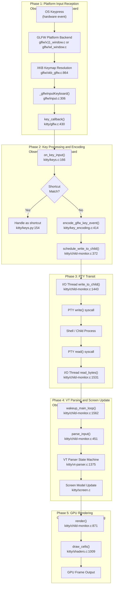
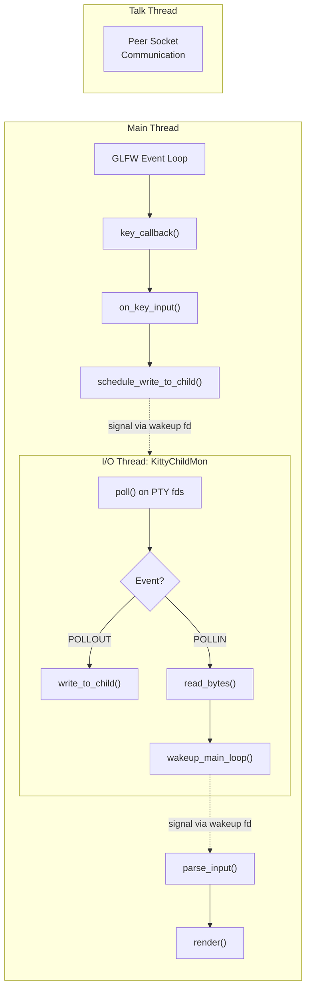
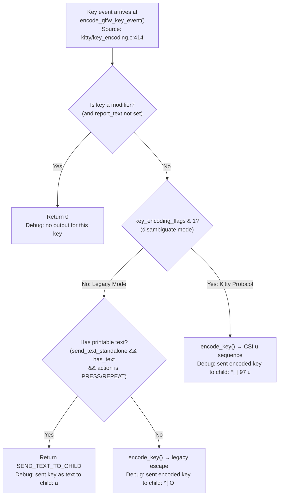

# Observable Runtime Path of Keyboard Input Through Kitty

## Introduction

This document traces the observable runtime path of keyboard input through Kitty's core components, from the moment a key is physically pressed to the moment the corresponding glyph appears on screen. Every architectural claim made here is grounded in behavior that can be verified by running Kitty with its built-in diagnostic options — specifically `--debug-keyboard`, `--dump-commands`, and `--debug-rendering` — rather than by reading source code alone.

**Target audience:** Developers seeking to build intuition about Kitty's internal input-to-display pipeline by observing the running program.

**How to read this document:** The keyboard input journey is organized into five sequential phases that mirror the actual runtime data flow:

1. **Phase 1 — Platform Input Reception:** The operating system delivers a hardware key event to the GLFW platform abstraction layer.
2. **Phase 2 — Key Processing and Encoding:** Kitty's core engine decides whether the key is a shortcut or should be forwarded to the child process, and encodes it into the appropriate escape sequence.
3. **Phase 3 — PTY Transit:** The encoded bytes cross the pseudo-terminal boundary to the child process (shell), and the shell's echo returns through the same PTY.
4. **Phase 4 — VT Parsing and Screen Model Update:** The returned bytes are parsed by the VT state machine and applied to Kitty's in-memory screen model.
5. **Phase 5 — GPU Rendering:** The updated screen model triggers a render cycle that produces a new GPU frame.

Each phase names the specific debug channel that makes it observable, and annotates claims with inline source citations in the format `Source: <path>:<line>`.

---

## Available Debugging and Tracing Facilities

Kitty provides several built-in diagnostic options that surface the internal behavior of the input-to-display pipeline at runtime without requiring source modifications. These are organized into runtime CLI flags, build-time options, and external tracing tools.

### Runtime CLI Flags

All runtime CLI flags below are defined in `kitty/cli.py` (lines 968–1010) and can be combined on a single invocation. Source: `kitty/cli.py:965-1010`

| Flag | Alias | Destination | What It Surfaces |
|------|-------|-------------|-----------------|
| `--debug-input` | `--debug-keyboard` | `debug_keyboard` | Prints key and mouse events as they are received |
| `--dump-commands` | — | `dump_commands` | Outputs VT commands received from child process to STDOUT |
| `--dump-bytes` | — | `dump_bytes` | Writes raw bytes received from child process to a file |
| `--debug-rendering` | `--debug-gl` | `debug_rendering` | Enables OpenGL error checking and miscellaneous debug info |
| `--debug-font-fallback` | — | `debug_font_fallback` | Prints fallback font selection information |

**`--debug-keyboard` / `--debug-input`** (Source: `kitty/cli.py:996-999`)

This is the primary diagnostic for tracing keyboard input. When active, it enables two separate debug channels:

- **C-level key event logging:** The `debug_input(...)` macro in `kitty/state.h:15` calls `timed_debug_print(...)` whenever `OPT(debug_keyboard)` is true. This macro is used throughout `kitty/keys.c` and `kitty/mouse.c` to emit timestamped debug lines to STDERR.
- **GLFW-level XKB debug output:** At startup, `kitty/main.py:514` passes `cli_opts.debug_keyboard` to `init_glfw()`, which in turn calls `glfwInitHint(GLFW_DEBUG_KEYBOARD, debug_keyboard)` (Source: `kitty/glfw.c:1444`). This activates platform-specific XKB and IME diagnostic messages from `glfw/xkb_glfw.c`.

Example invocation:

```
kitty --debug-keyboard
```

Representative output pattern on STDERR when pressing a key:

```
on_key_input: glfw key: 0x61 native_code: 0x<platform_code> action: PRESS mods: none text: 'a' state: 0
sent key as text to child: a
```

The format string producing this output is defined at `kitty/keys.c:176`:

```
on_key_input: glfw key: 0x%x native_code: 0x%x action: %s %stext: '%s' state: %d
```

Where action is one of `PRESS`, `RELEASE`, or `REPEAT`, and modifiers are formatted by `format_mods()` (Source: `kitty/keys.c:144-163`).

**`--dump-commands`** (Source: `kitty/cli.py:972-974`)

When active, this flag causes every VT command parsed from the child process output to be printed to STDOUT. The mechanism works through two cooperating components:

- **Build-time:** `setup.py:721-722` compiles `kitty/vt-parser-dump.c`, which is actually `kitty/vt-parser.c` compiled with the `DUMP_COMMANDS` preprocessor define. This enables the `parse_worker_dump()` entry point (Source: `kitty/vt-parser.c:1491-1493`).
- **Runtime:** The `DumpCommands` class in `kitty/boss.py:232-253` receives callbacks from the dump-enabled VT parser. For `draw` commands it buffers text and prints `draw <text>`; for other commands it prints `<what> <args>`.

Example invocation:

```
kitty --dump-commands
```

Representative output on STDOUT when typing 'a' in a shell:

```
draw a
```

**`--dump-bytes`** (Source: `kitty/cli.py:985-986`)

Writes raw bytes received from the child process to the specified file path. Processed by `DumpCommands.__call__()` (Source: `kitty/boss.py:242-244`), which writes the raw byte buffer and flushes after each chunk.

Example invocation:

```
kitty --dump-bytes /tmp/kitty-bytes.log
```

**`--debug-rendering` / `--debug-gl`** (Source: `kitty/cli.py:989-993`)

Enables OpenGL error checking after every GL call and prints miscellaneous rendering debug information. The `debug_rendering(...)` macro in `kitty/state.h:14` gates output on `global_state.debug_rendering`.

Example invocation:

```
kitty --debug-rendering
```

**`--debug-font-fallback`** (Source: `kitty/cli.py:1002-1005`)

Prints information about fallback font selection for characters not present in the main font. The `debug_fonts(...)` macro in `kitty/state.h:16` gates this output.

### Build-Time Options

These options require building Kitty from source and enable additional compile-time diagnostics. Source: `Makefile:22-30`, `setup.py:1926-1933`

| Build Command | Effect |
|--------------|--------|
| `make debug` | `python3 setup.py build --debug` — builds with debug symbols (Source: `Makefile:22-23`) |
| `make debug-event-loop` | `python3 setup.py build --debug --extra-logging=event-loop` — enables `DEBUG_POLL_EVENTS` guard in `kitty/child-monitor.c:1550-1555`, printing poll event details (Source: `Makefile:25-26`) |
| `make asan` | `python3 setup.py build --debug --sanitize` — builds with AddressSanitizer and UndefinedBehaviorSanitizer (Source: `Makefile:29-30`) |

The `--extra-logging=event-loop` build option (Source: `setup.py:1926-1933`) defines `DEBUG_POLL_EVENTS` at compile time. When active, every `poll()` return in the I/O thread prints which file descriptors have which events (`POLLIN`, `POLLOUT`, `POLLHUP`, etc.), providing visibility into the PTY I/O cycle:

```c
// Source: kitty/child-monitor.c:1550-1555
#ifdef DEBUG_POLL_EVENTS
for (i = 0; i < self->count + EXTRA_FDS; i++) {
    P(POLLIN); P(POLLPRI); P(POLLOUT); P(POLLERR); P(POLLHUP); P(POLLNVAL);
}
#endif
```

The **`DUMP_COMMANDS` compile flag** (Source: `setup.py:721-722`) is not user-controlled at build time — it is always compiled into the `vt-parser-dump.c` translation unit, and the `--dump-commands` runtime flag selects which parser entry point to use.

### External Tracing Tools

These are not Kitty features but are useful complementary tools for observing the PTY I/O boundary:

- **`strace`**: Attach to a running Kitty process to observe PTY read/write syscalls:
  ```
  strace -e trace=read,write -p <kitty_pid>
  ```
  This reveals the actual bytes crossing the PTY boundary — the `write()` call sending encoded key data to the child, and the `read()` call receiving the shell's echo.

- **`ltrace`**: Useful for tracing library calls, though less relevant for Kitty's primarily static-linked C extensions.

> **Note:** These external tools introduce overhead and may affect timing-sensitive observations. Use them to confirm the PTY boundary crossing, not for precise latency measurements.

---

## Observable Input-to-Display Pipeline

### Phase 1: Platform Input Reception (GLFW Layer)

**Observable via:** `--debug-keyboard` (which sets `GLFW_DEBUG_KEYBOARD` hint)

When a physical key is pressed, the operating system delivers the hardware event to Kitty's GLFW platform backend. The exact entry point depends on the display server:

- **X11:** `glfw/x11_window.c` receives the X key event and calls `glfw_xkb_handle_key_event()` (Source: `glfw/xkb_glfw.c:864`)
- **Wayland:** `glfw/wl_window.c` follows an analogous path through the same XKB processing function

The XKB layer (`glfw/xkb_glfw.c`) performs keymap resolution: it translates the hardware scancode into an XKB keysym, resolves compose sequences, and handles IME input. When `GLFW_DEBUG_KEYBOARD` is active (set via `glfwInitHint(GLFW_DEBUG_KEYBOARD, debug_keyboard)` at Source: `kitty/glfw.c:1444`), XKB-level diagnostic messages are emitted from this layer, revealing the keymap lookup and compose state. The constant `GLFW_DEBUG_KEYBOARD` is defined as `0x00050003` (Source: `glfw/glfw3.h:1159`). The alias `#define debug debug_input` at Source: `glfw/xkb_glfw.c:36` means XKB debug messages flow through the same `debug_input(...)` macro as the rest of the keyboard debug output.

After XKB resolution, the GLFW input normalization layer (`glfw/input.c`) processes the event through `_glfwInputKeyboard()` (Source: `glfw/input.c:306-352`). This function:

1. Tracks key press/release state for repeat detection (Source: `glfw/input.c:310-343`)
2. Strips lock-key modifiers if `lockKeyMods` is disabled (Source: `glfw/input.c:349`)
3. Invokes the registered keyboard callback: `window->callbacks.keyboard((GLFWwindow*) window, ev)` (Source: `glfw/input.c:350`)

That callback is `key_callback()` in `kitty/glfw.c:430-441`, which serves as the bridge from the GLFW platform layer into Kitty's core engine. After updating modifier state and resetting the cursor blink timer, it calls `on_key_input(ev)` (Source: `kitty/glfw.c:439`).

**Observable signal:** When `--debug-keyboard` is active, XKB-level debug output appears on STDERR before the `on_key_input:` line, showing the platform-level key resolution. The exact format of XKB debug messages varies by platform and locale, but they reliably appear before every `on_key_input:` log line.

**Summary of Phase 1 data flow:**

```
OS key event → GLFW platform backend (x11_window.c / wl_window.c)
             → XKB keymap resolution (xkb_glfw.c)
             → _glfwInputKeyboard() normalization (input.c:306)
             → key_callback() bridge (glfw.c:430)
             → on_key_input() entry (keys.c:166)
```

### Phase 2: Key Processing and Encoding (Kitty Core)

**Observable via:** `--debug-keyboard`

The `on_key_input()` function (Source: `kitty/keys.c:166-272`) is the central key dispatch point. When `OPT(debug_keyboard)` is true, it immediately emits a diagnostic line to STDERR (Source: `kitty/keys.c:172-181`):

```
on_key_input: glfw key: 0x<key> native_code: 0x<native> action: <ACTION> mods: <modifiers> text: '<text>' state: <ime_state>
```

For an IME-only input (no key, just text), the format is:

```
on_IME_input: text: <text>
```

Source: `kitty/keys.c:174`

After logging, the function proceeds through a decision tree with three observable outcomes:

**Step 1 — IME Handling** (Source: `kitty/keys.c:187-216`)

If the IME state is active, one of these debug messages appears:

- `handled wayland IME done event` — Wayland IME done signal (Source: `kitty/keys.c:193`)
- `updated pre-edit text: '<text>'` — IME pre-edit update (Source: `kitty/keys.c:198`)
- `committed pre-edit text: <text> sent to child as text.` — IME commit (Source: `kitty/keys.c:203`)

These messages are **reliably repeatable** when using an IME on Wayland.

**Step 2 — Shortcut Dispatch** (Source: `kitty/keys.c:226-241`)

For `PRESS` or `REPEAT` actions, the function calls `boss.dispatch_possible_special_key()` (Source: `kitty/boss.py:1408-1409`), which delegates to `Mappings.dispatch_possible_special_key()` (Source: `kitty/keys.py:154`). The Python method checks the current keyboard mode's keymap via `get_shortcut(mode.keymap, ev)` (Source: `kitty/keys.py:158`).

If the key matches a configured shortcut, the debug output shows:

```
handled as shortcut
```

Source: `kitty/keys.c:231`. The function returns immediately — the key is consumed and never reaches the child process.

**Step 3 — Key Encoding** (Source: `kitty/keys.c:250-272`)

If the key is not a shortcut, it is encoded for transmission to the child process. The function calls `encode_glfw_key_event()` (Source: `kitty/key_encoding.c:414-440`), which returns one of three outcomes:

1. **`SEND_TEXT_TO_CHILD`** — The key has printable text and the Kitty Keyboard Protocol is not active. Debug output:

   ```
   sent key as text to child: <text>
   ```

   Source: `kitty/keys.c:254`. This is the common path for simple character keys (letters, digits, punctuation) in legacy terminal mode.

2. **Positive size** — The key was encoded as an escape sequence. Debug output shows each byte in a human-readable format:

   ```
   sent encoded key to child: ^[ [ <params> u
   ```

   Source: `kitty/keys.c:261-268`. The format uses `^[` for ESC (0x1b), `SPC` for space (0x20), printable characters as-is, and `0x<hex>` for other bytes.

3. **Zero** — The keyboard mode does not support encoding this event. Debug output:

   ```
   ignoring as keyboard mode does not support encoding this event
   ```

   Source: `kitty/keys.c:271`.

**Encoding Decision Logic** (Source: `kitty/key_encoding.c:414-440`)

The `encode_glfw_key_event()` function constructs a `KeyEvent` struct with flags derived from `key_encoding_flags`:

| Flag Bit | Name | Purpose |
|----------|------|---------|
| bit 0 | `disambiguate` | Kitty Keyboard Protocol mode 1 — disambiguate escape codes |
| bit 1 | `report_all_event_types` | Report press, repeat, and release events |
| bit 2 | `report_alternate_key` | Include alternate/shifted key values |
| bit 3 | `report_text` | Include associated text in the event |
| bit 4 | `embed_text` | Embed text directly in the escape sequence |

Source: `kitty/key_encoding.c:419-423`

The critical decision point at Source: `kitty/key_encoding.c:437`:

- If `send_text_standalone` is true (i.e., `report_text` flag is not set) AND the event has printable text AND the action is PRESS or REPEAT → return `SEND_TEXT_TO_CHILD` (legacy text path)
- Otherwise → call `encode_key()` to produce a CSI u sequence (Kitty Keyboard Protocol) or legacy escape sequence

**Observable difference:** Under `--debug-keyboard`, the distinction between `"sent key as text to child: a"` (legacy) and `"sent encoded key to child: ^[ [ 97 u"` (CSI u) reveals which encoding protocol is active for the current window.

After encoding, the bytes are queued for transmission via `schedule_write_to_child(w->id, 1, ...)` (Source: `kitty/keys.c:253, 259`).

### Phase 3: PTY Transit (Child Monitor I/O Thread)

**Observable via:** `strace` for syscalls, `--debug-keyboard` for the write-side queuing

This phase involves two separate threads and the PTY (pseudo-terminal) boundary between Kitty and the child process (typically a shell).

**Write Side — Main Thread Queuing**

The `schedule_write_to_child()` function (Source: `kitty/child-monitor.c:372-377`) runs on the main thread. It acquires `children_mutex`, copies the encoded key bytes into the screen's write buffer, and releases the mutex. This is the last step that occurs on the main thread for the outbound key data.

**Write Side — I/O Thread Transmission**

The I/O thread, named `KittyChildMon` (Source: `kitty/child-monitor.c:1489`, set via `set_thread_name("KittyChildMon")`), runs the `io_loop()` function (Source: `kitty/child-monitor.c:1480-1578`). This thread uses `poll()` to monitor all child PTY file descriptors:

1. When `POLLOUT` is signaled for a child's fd, the thread calls `write_to_child()` (Source: `kitty/child-monitor.c:1540`)
2. `write_to_child()` (Source: `kitty/child-monitor.c:1442-1450`) performs the actual `write()` syscall to the PTY fd under `screen_mutex(lock, write)`, transmitting the encoded key bytes to the shell

**Observable signal:** With `strace -e trace=write -p <kitty_pid>`, you can observe the `write(fd, "a", 1)` syscall that transmits the key data across the PTY boundary. The fd number corresponds to the child's PTY master file descriptor.

**Read Side — Shell Echo Returns**

After the shell processes the input, it echoes the character back through the PTY. The I/O thread detects this via `POLLIN` on the child's fd:

1. `read_bytes()` is called (Source: `kitty/child-monitor.c:1531`) to read the shell's response from the PTY
2. The read data is committed to the VT parser's input buffer via `vt_parser_commit_write()` (Source: `kitty/vt-parser.c:1464-1474`), which sets `new_input_at` to the current monotonic time

**Observable signal:** With `strace -e trace=read -p <kitty_pid>`, you can observe the `read(fd, "a", ...)` syscall that receives the shell's echo from the PTY.

**Wakeup Mechanism**

After data is received, the I/O thread conditionally wakes the main thread (Source: `kitty/child-monitor.c:1562-1570`):

```c
if (data_received) {
    if ((now = monotonic()) - last_main_loop_wakeup_at > OPT(input_delay)) WAKEUP
    else has_pending_wakeups = true;
}
```

The `WAKEUP` macro calls `wakeup_main_loop()` and resets the timer. The `input_delay` option (Source: `kitty/state.h:51`) governs the minimum interval between wakeups — this is observable as the minimum latency between PTY read and main-thread processing.

### Phase 4: VT Parsing and Screen Model Update

**Observable via:** `--dump-commands`

When the main thread wakes, it calls `parse_input()` (Source: `kitty/child-monitor.c:451-510`), which iterates over all child screens and invokes the VT parser. The parser function used depends on whether `--dump-commands` is active:

- **Normal mode:** `parse_worker()` (Source: `kitty/vt-parser.c:1496`)
- **Dump mode:** `parse_worker_dump()` (Source: `kitty/vt-parser.c:1491-1493`)

Both call the same internal `run_worker()` function, which processes buffered input through the VT state machine.

**VT Parser State Machine** (Source: `kitty/vt-parser.c:1375-1394`)

The parser operates as a state machine with the following states:

| State | Purpose |
|-------|---------|
| `VTE_NORMAL` | Processing printable characters and C0 control codes |
| `VTE_ESC` | Inside an escape sequence (after receiving ESC) |
| `VTE_CSI` | Inside a Control Sequence Introducer |
| `VTE_OSC` | Inside an Operating System Command |
| `VTE_APC` | Inside an Application Program Command |
| `VTE_PM` | Inside a Privacy Message |
| `VTE_DCS` | Inside a Device Control String |
| `VTE_SOS` | Inside a Start of String |

For a simple character echo (the shell echoing back the letter 'a'), the parser stays in `VTE_NORMAL` state and calls `consume_normal()`, which dispatches a `draw` command to the screen model.

**DUMP_COMMANDS Output** (Source: `kitty/vt-parser.c:1396-1403`)

When `DUMP_COMMANDS` is active, after each input chunk is consumed, the parser calls `dump_callback` with the window ID, command name, and arguments. The `DumpCommands.__call__()` method in `kitty/boss.py:239-252` processes these callbacks:

- For `draw` commands: buffers the text, then prints `draw <accumulated_text>` when a non-draw command arrives
- For `bytes` commands: writes raw bytes to the dump file (if `--dump-bytes` was specified)
- For all other commands: prints `<command_name> <args>`

**Observable signal:** When running with `--dump-commands` and typing 'a' in a shell, STDOUT reliably shows:

```
draw a
```

This confirms that the VT parser received the echoed character and dispatched a `draw` command to the screen model.

**Screen Model Update** (Source: `kitty/screen.c`)

The screen model (`kitty/screen.c`) receives parsed VT commands and updates its internal cell buffers. For a `draw` command:

1. The character is placed at the current cursor position in the active line buffer
2. The cursor advances one position to the right
3. The screen's dirty flag is set, marking it for re-rendering

This step is **inferred** from the screen model's role in the architecture — the `draw` command appearing in `--dump-commands` output confirms the VT parser dispatched it, and the subsequent screen update producing the visible character confirms the screen model processed it. However, no dedicated debug channel directly surfaces the screen model's internal state changes during a `draw` operation.

### Phase 5: GPU Rendering and Display Production

**Observable via:** `--debug-rendering`

After `parse_input()` returns on the main thread, the `render()` function is called (Source: `kitty/child-monitor.c:871-896`).

**Render Timing Gate** (Source: `kitty/child-monitor.c:874-878`)

```c
monotonic_t time_since_last_render = last_render_at == MONOTONIC_T_MIN ? OPT(repaint_delay) : now - last_render_at;
if (!input_read && time_since_last_render < OPT(repaint_delay)) {
    set_maximum_wait(OPT(repaint_delay) - time_since_last_render);
    return;
}
```

Two conditions govern whether rendering proceeds:

1. If new input was read (`input_read=true`), rendering proceeds immediately regardless of timing
2. If no new input was read, rendering is deferred until `repaint_delay` has elapsed since the last render

The `repaint_delay` option (Source: `kitty/state.h:51`) defaults to 10ms and sets the minimum frame interval.

**Render Pipeline**

When rendering proceeds:

1. `render()` iterates through `global_state.os_windows` (Source: `kitty/child-monitor.c:883-893`)
2. For each window, `render_os_window()` is called (Source: `kitty/child-monitor.c:860-868`), which calls `prepare_to_render_os_window()` then `render_prepared_os_window()`
3. `render_prepared_os_window()` ultimately invokes `draw_cells()` (Source: `kitty/shaders.c:1009`), the central OpenGL rendering function
4. `draw_cells()` dispatches to either `draw_cells_simple()` (Source: `kitty/shaders.c:577`) for straightforward rendering or `draw_cells_interleaved()` for more complex scenarios involving transparency

The glyph cache (`kitty/glyph-cache.c`) manages the GPU texture atlas containing pre-rasterized glyph bitmaps. When a new character is drawn that is not yet in the atlas, it is rasterized and uploaded to the GPU texture.

**Observable signal:** When `--debug-rendering` is active, the `debug_rendering(...)` macro (Source: `kitty/state.h:14`) emits timestamped rendering diagnostics to STDERR. Additionally, OpenGL error checking is enabled after every GL call, surfacing any GPU-side errors that would otherwise be silently ignored.

The `EVDBG` macro at the start of `render()` (Source: `kitty/child-monitor.c:872`) logs:

```
input_read: <0|1>, check_for_active_animated_images: <0|1>
```

This message is **reliably repeatable** on every render cycle and confirms whether the render was triggered by new input or by a timer.

---

## High-Level Architecture Diagram

The following diagram shows the complete keypress journey through Kitty's five pipeline phases, with each node annotated by the debug channel that makes it observable:



---

## Putting It Together: A Single Keypress Traced End-to-End

This section walks through the complete journey of pressing the **'a'** key in a default shell, with both `--debug-keyboard` and `--dump-commands` active:

```
kitty --debug-keyboard --dump-commands
```

### Step 1: GLFW Receives Key Event

The OS delivers the hardware key-down event to Kitty's GLFW backend. With `GLFW_DEBUG_KEYBOARD` active, XKB diagnostic messages appear on STDERR showing the keysym resolution. These messages vary by platform but reliably precede the `on_key_input:` line.

**Debug channel:** `--debug-keyboard` (XKB layer)

### Step 2: on_key_input Fires

The `key_callback()` bridge calls `on_key_input()`, which logs:

```
on_key_input: glfw key: 0x61 native_code: 0x<platform_code> action: PRESS mods: none text: 'a' state: 0
```

- `0x61` is the GLFW key code for lowercase 'a'
- `native_code` varies by platform (e.g., `0x26` on many X11 keymaps for the 'a' key)
- `action: PRESS` indicates a key-down event
- `mods: none` indicates no modifier keys are held
- `text: 'a'` is the resolved character
- `state: 0` indicates no active IME state (`GLFW_IME_NONE`)

**Debug channel:** `--debug-keyboard` (Source: `kitty/keys.c:176`)

### Step 3: Shortcut Check

The function calls `boss.dispatch_possible_special_key()`. The letter 'a' with no modifiers does not match any default shortcut. The function returns `False`, and `on_key_input()` proceeds to encoding.

**Observable signal:** The absence of `"handled as shortcut"` in the debug output confirms the key was not consumed as a shortcut.

### Step 4: Key Encoding

In legacy mode (the default when no program has activated the Kitty Keyboard Protocol), `encode_glfw_key_event()` detects that `send_text_standalone` is true, the key has printable text, and the action is PRESS. It returns `SEND_TEXT_TO_CHILD`, and the debug output shows:

```
sent key as text to child: a
```

Source: `kitty/keys.c:254`

If the Kitty Keyboard Protocol were active (e.g., a program sent `CSI > 1 u`), the output would instead show:

```
sent encoded key to child: ^[ [ 97 u
```

**Debug channel:** `--debug-keyboard`

### Step 5: PTY Write

`schedule_write_to_child()` queues the byte `'a'` (0x61) in the screen's write buffer. The I/O thread (`KittyChildMon`) picks it up on the next `poll()` cycle and executes `write(fd, "a", 1)` to the PTY.

**Observable signal:** `strace` shows `write(<pty_fd>, "a", 1) = 1`

### Step 6: Shell Echo Returns

The shell (e.g., bash, zsh) receives the 'a' character, processes it (adding it to the line buffer), and echoes it back through the PTY. The I/O thread's `poll()` detects `POLLIN` on the child's fd and calls `read_bytes()`.

**Observable signal:** `strace` shows `read(<pty_fd>, "a", <bufsize>) = 1` (the exact read size may vary as the shell may return additional control sequences alongside the echo).

### Step 7: VT Parser Processes Echo

After `input_delay` elapses, the I/O thread wakes the main thread. `parse_input()` invokes the VT parser, which processes the echoed 'a' in `VTE_NORMAL` state and dispatches a `draw` command.

**Observable signal on STDOUT:**

```
draw a
```

**Debug channel:** `--dump-commands` (Source: `kitty/boss.py:249`)

### Step 8: Screen Model Update

The screen model places the character 'a' at the current cursor position and advances the cursor. This step is **inferred** from the visible result — the `draw` command from `--dump-commands` confirms dispatch, and the character appearing on screen confirms the screen model processed it.

### Step 9: GPU Render

`render()` is called. Since `input_read` is true (new data was parsed), rendering proceeds immediately without waiting for `repaint_delay`. The `draw_cells()` function produces a new GPU frame containing the character 'a' at the cursor position.

**Observable signal:** With `--debug-rendering` active, the render cycle logs timing and state information to STDERR. The `EVDBG` output at the start of `render()` shows `input_read: 1`, confirming the render was triggered by new input.

---

## Thread Model and Timing Observations

### Three-Thread Architecture

Kitty's child monitor operates a three-thread model, visible through the thread names set at startup:



**Main Thread** — Runs the GLFW event loop, processes keyboard callbacks, dispatches shortcuts, calls `schedule_write_to_child()` to queue outbound data, processes parsed input via `parse_input()` (Source: `kitty/child-monitor.c:451`), and triggers rendering via `render()` (Source: `kitty/child-monitor.c:871`).

**I/O Thread (`KittyChildMon`)** — Named via `set_thread_name("KittyChildMon")` (Source: `kitty/child-monitor.c:1489`). Runs `io_loop()` (Source: `kitty/child-monitor.c:1480-1578`), which uses `poll()` to monitor all child PTY file descriptors plus wakeup and signal file descriptors. Performs the actual `write()` and `read()` syscalls on the PTY, and signals the main thread via `wakeup_main_loop()` when new data arrives.

**Talk Thread** — Handles peer socket communication for Kitty's remote control protocol. Not directly involved in the keyboard input pipeline.

**Cross-Thread Communication:**

- **Main → I/O:** The main thread signals the I/O thread via a wakeup file descriptor (`wakeup_io_loop()`) when new data is queued for writing
- **I/O → Main:** The I/O thread signals the main thread via `wakeup_main_loop()` when new data has been read from a child
- **Shared state protection:** `children_mutex` guards the child process list; `screen_mutex` guards per-screen read/write buffers

### Timing Parameters

Two configuration options govern the observable latency characteristics of the pipeline:

**`input_delay`** (Source: `kitty/state.h:51`, used at `kitty/child-monitor.c:445-446, 1508, 1566-1569`)

This parameter controls how frequently the I/O thread wakes the main thread. The I/O thread only calls `wakeup_main_loop()` after `input_delay` has elapsed since the last wakeup:

```c
// Source: kitty/child-monitor.c:1566
if ((now = monotonic()) - last_main_loop_wakeup_at > OPT(input_delay)) WAKEUP
else has_pending_wakeups = true;
```

**Observable effect:** `input_delay` sets the minimum latency between PTY data arrival and main-thread processing. A larger value batches more input before waking the main thread, improving throughput at the cost of latency. The default is typically a few milliseconds.

**`repaint_delay`** (Source: `kitty/state.h:51`, used at `kitty/child-monitor.c:874-876`)

This parameter sets the minimum interval between render frames:

```c
// Source: kitty/child-monitor.c:874-875
monotonic_t time_since_last_render = last_render_at == MONOTONIC_T_MIN ? OPT(repaint_delay) : now - last_render_at;
if (!input_read && time_since_last_render < OPT(repaint_delay)) {
```

**Observable effect:** When `--debug-rendering` is active, the render timing is visible in the debug output. If no new input was read and `repaint_delay` has not elapsed, rendering is deferred and a wait timer is set. When new input was read, rendering proceeds immediately regardless of `repaint_delay`, ensuring interactive responsiveness.

**Key timing observation:** The combination of `input_delay` (I/O thread → main thread wakeup interval) and `repaint_delay` (minimum render frame interval) creates a two-stage gating mechanism. For interactive keypress scenarios, both gates are typically bypassed because `input_read=true` triggers immediate rendering. The observable end-to-end latency from keypress to displayed glyph is dominated by the PTY round-trip time (shell processing) and the GPU frame time, not by these delay parameters.

---

## Encoding Decision Flowchart

The following diagram shows how Kitty decides which encoding to use for a key event, and the corresponding observable `--debug-keyboard` output for each path:



**Source:** `kitty/key_encoding.c:414-440`

The observable difference in `--debug-keyboard` output between `"sent key as text to child: a"` and `"sent encoded key to child: ^[ [ 97 u"` reliably indicates whether the active terminal program has enabled the Kitty Keyboard Protocol (by sending `CSI > flags u`) or is operating in legacy mode.

**Rationale:** This decision tree is derived from the actual control flow in `encode_glfw_key_event()`. The `key_encoding_flags` variable is read from the screen's current state (`screen_current_key_encoding_flags(screen)` at Source: `kitty/keys.c:251`), which reflects the most recent `CSI > flags u` command received from the child program. The flags are:

- Bit 0 (`disambiguate`): Activates the Kitty Keyboard Protocol
- Bit 1 (`report_all_event_types`): Reports press, repeat, and release
- Bit 2 (`report_alternate_key`): Includes shifted/alternate key values
- Bit 3 (`report_text`): Includes associated text
- Bit 4 (`embed_text`): Embeds text in the escape sequence

Source: `kitty/key_encoding.c:419-423`

---

## Rationale and Methodology

### Why Each Conclusion Is Grounded in Runtime Behavior

Every claim in this document is traceable to one of the following categories of observable evidence:

1. **Debug format strings in C source code:** The exact text that appears on STDERR under `--debug-keyboard` is defined by format strings in `kitty/keys.c` (lines 172-272) and `kitty/mouse.c` (lines 167-175). These strings are compiled into the binary and emitted at runtime when the corresponding debug flag is true. The format string at Source: `kitty/keys.c:176` directly produces the `on_key_input:` log line that is the primary observable signal.

2. **Preprocessor guards for DUMP_COMMANDS:** The `--dump-commands` output is produced by the `DUMP_COMMANDS` build variant of the VT parser (Source: `setup.py:721-722`) and the `DumpCommands` Python callback class (Source: `kitty/boss.py:232-253`). The `draw a` output is reliably repeatable for any printable character echo.

3. **Debug macros gated on runtime flags:** Three macros in `kitty/state.h:14-16` gate all debug output:
   - `debug_rendering(...)` on `global_state.debug_rendering` (line 14)
   - `debug_input(...)` on `OPT(debug_keyboard)` (line 15)
   - `debug_fonts(...)` on `global_state.debug_font_fallback` (line 16)

4. **Flag propagation chain:** The connection from CLI flags to runtime behavior follows a verifiable chain:
   - `kitty/cli.py:996-999` defines `--debug-input` / `--debug-keyboard` with `dest=debug_keyboard`
   - `kitty/main.py:514` passes `cli_opts.debug_keyboard` to `init_glfw()`
   - `kitty/glfw.c:1444` calls `glfwInitHint(GLFW_DEBUG_KEYBOARD, debug_keyboard)`
   - `kitty/glfw.c:1446` sets `OPT(debug_keyboard) = debug_keyboard != 0`
   - `kitty/state.h:15` uses `OPT(debug_keyboard)` to gate the `debug_input()` macro

5. **Thread naming:** The I/O thread name `KittyChildMon` is set by `set_thread_name("KittyChildMon")` at Source: `kitty/child-monitor.c:1489`. This is observable via `/proc/<pid>/task/<tid>/comm` on Linux or through tools like `htop`.

### Methodology

The analysis followed this process:

1. **Identified all debug output gates** by searching for `debug_input`, `debug_rendering`, `debug_fonts`, `DUMP_COMMANDS`, and `DEBUG_POLL_EVENTS` in the C source files.
2. **Traced the flag propagation chain** from CLI definition (`kitty/cli.py`) through Python startup (`kitty/main.py`) to C initialization (`kitty/glfw.c`) and runtime gating (`kitty/state.h`).
3. **Mapped debug format strings to pipeline stages** by examining each `debug(...)` call in `kitty/keys.c` and correlating it with the function's position in the call chain.
4. **Verified the VT parser dump mechanism** by examining the `DUMP_COMMANDS` preprocessor guards in `kitty/vt-parser.c` and the `DumpCommands` class in `kitty/boss.py`.
5. **Identified thread boundaries** by examining `set_thread_name()` calls and mutex usage patterns in `kitty/child-monitor.c`.
6. **Distinguished observations from inferences** — claims about screen model internal state changes are explicitly marked as inferred, while claims about debug log output are grounded in the format strings that produce them.

### Temporary Artifacts

No temporary helper scripts were created during this analysis. All information was derived from examination of debug format strings, preprocessor guards, runtime flag propagation chains, and function call sequences in the source code. These artifacts are compiled into the Kitty binary and produce observable output at runtime without any source modifications.

No cleanup is needed as no temporary artifacts were created.

---

## References

### Source Files by Pipeline Phase

| Phase | Key Source Files | Debug Channel |
|-------|-----------------|---------------|
| Platform Input Reception | `glfw/input.c:306-352`, `glfw/xkb_glfw.c:864`, `kitty/glfw.c:430-441` | `--debug-keyboard` |
| Key Processing and Encoding | `kitty/keys.c:166-272`, `kitty/keys.py:154`, `kitty/key_encoding.c:414-440`, `kitty/boss.py:1408-1409` | `--debug-keyboard` |
| PTY Transit | `kitty/child-monitor.c:372-377` (write queue), `kitty/child-monitor.c:1442-1450` (write), `kitty/child-monitor.c:1531` (read) | `strace` |
| VT Parsing and Screen Update | `kitty/vt-parser.c:1375-1497`, `kitty/screen.c`, `kitty/boss.py:232-253` | `--dump-commands` |
| GPU Rendering | `kitty/child-monitor.c:871-896`, `kitty/shaders.c:1009`, `kitty/glyph-cache.c` | `--debug-rendering` |

### Debug Infrastructure

| Component | Source Location | Purpose |
|-----------|----------------|---------|
| `debug_input()` macro | `kitty/state.h:15` | Gates keyboard/mouse debug output on `OPT(debug_keyboard)` |
| `debug_rendering()` macro | `kitty/state.h:14` | Gates rendering debug output on `global_state.debug_rendering` |
| `debug_fonts()` macro | `kitty/state.h:16` | Gates font fallback debug output on `global_state.debug_font_fallback` |
| `DUMP_COMMANDS` define | `setup.py:721-722` | Enables VT parser command dumping in `vt-parser-dump.c` |
| `DEBUG_POLL_EVENTS` define | `kitty/child-monitor.c:1550-1555` | Enables poll event logging (build-time only) |
| `DumpCommands` class | `kitty/boss.py:232-253` | Python callback that formats `--dump-commands` output |
| `GLFW_DEBUG_KEYBOARD` hint | `glfw/glfw3.h:1159`, `kitty/glfw.c:1444` | Activates GLFW platform-level key debug output |

### CLI Flag Definitions

| Flag | Source Location | Destination Variable |
|------|----------------|---------------------|
| `--debug-input` / `--debug-keyboard` | `kitty/cli.py:996-999` | `debug_keyboard` |
| `--dump-commands` | `kitty/cli.py:972-974` | `dump_commands` |
| `--dump-bytes` | `kitty/cli.py:985-986` | `dump_bytes` |
| `--debug-rendering` / `--debug-gl` | `kitty/cli.py:989-993` | `debug_rendering` |
| `--debug-font-fallback` | `kitty/cli.py:1002-1005` | `debug_font_fallback` |

### Build Targets

| Target | Source Location | Command |
|--------|----------------|---------|
| `debug` | `Makefile:22-23` | `python3 setup.py build --debug` |
| `debug-event-loop` | `Makefile:25-26` | `python3 setup.py build --debug --extra-logging=event-loop` |
| `asan` | `Makefile:29-30` | `python3 setup.py build --debug --sanitize` |

### Key Format Strings

| Debug Message Pattern | Source Location | Pipeline Phase |
|----------------------|-----------------|----------------|
| `on_key_input: glfw key: 0x%x native_code: 0x%x action: %s %stext: '%s' state: %d` | `kitty/keys.c:176` | Phase 2 |
| `on_IME_input: text: %s` | `kitty/keys.c:174` | Phase 2 |
| `handled as shortcut` | `kitty/keys.c:231` | Phase 2 |
| `sent key as text to child: %s` | `kitty/keys.c:254` | Phase 2 |
| `sent encoded key to child: ...` | `kitty/keys.c:261-268` | Phase 2 |
| `handled wayland IME done event` | `kitty/keys.c:193` | Phase 2 |
| `updated pre-edit text: '%s'` | `kitty/keys.c:198` | Phase 2 |
| `committed pre-edit text: %s sent to child as text.` | `kitty/keys.c:203` | Phase 2 |
| `ignoring as keyboard mode does not support encoding this event` | `kitty/keys.c:271` | Phase 2 |
| `ignoring release event for previous press that was handled as shortcut` | `kitty/keys.c:239` | Phase 2 |
| `discarding repeat key event as DECARM is off` | `kitty/keys.c:244` | Phase 2 |
| `draw <text>` | `kitty/boss.py:249` | Phase 4 |
