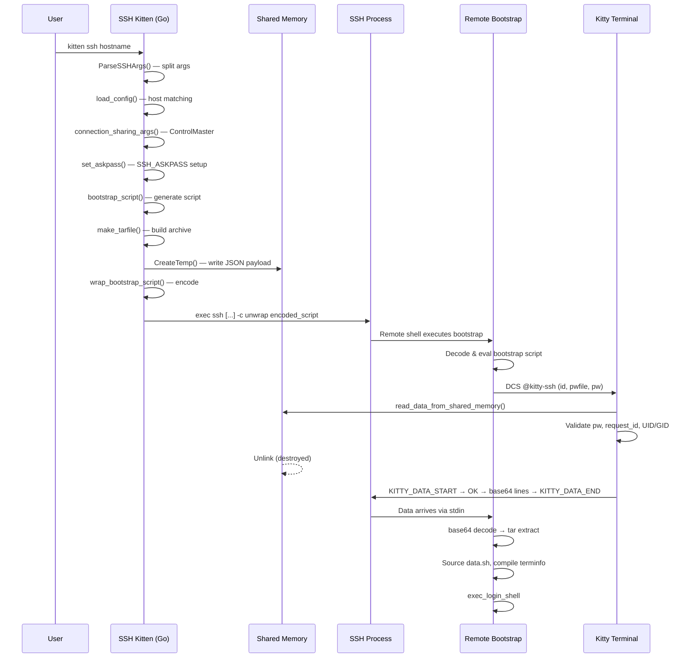
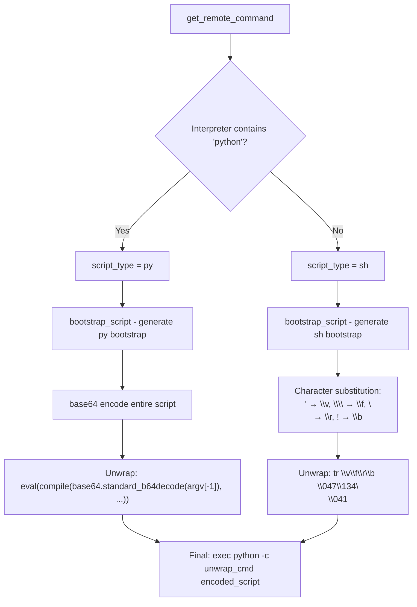
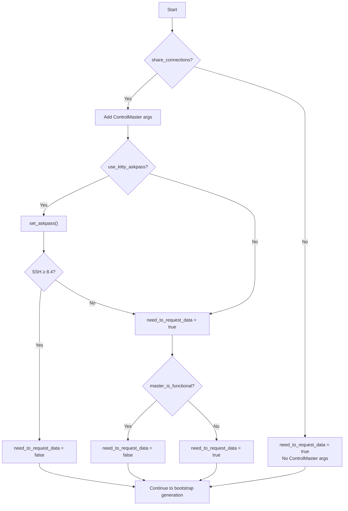
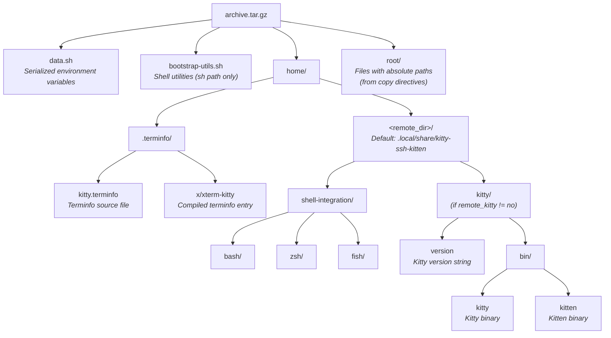
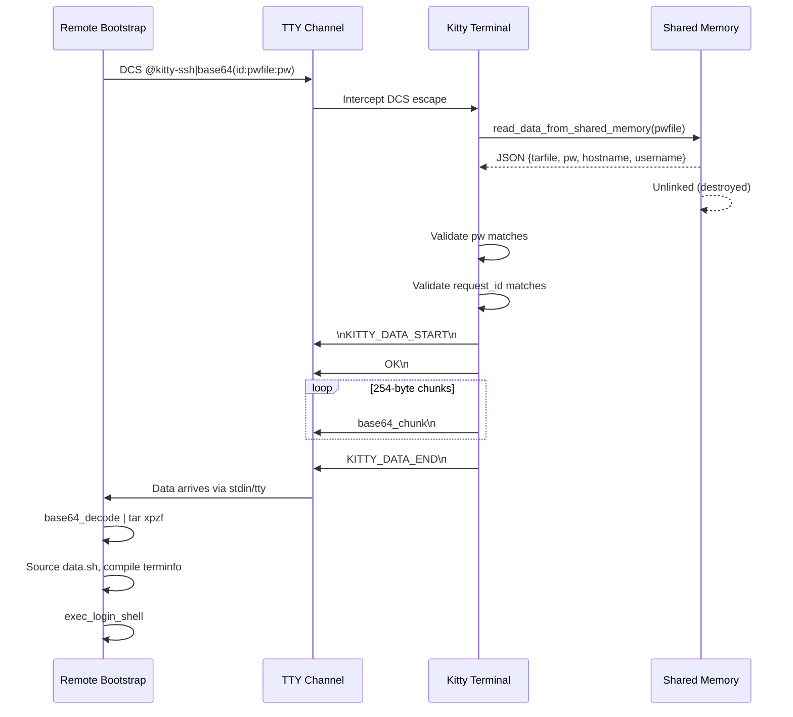

# Kitty SSH Kitten — Technical Deep Dive

## Introduction and Scope

This document traces the **end-to-end internal behavior** of Kitty's SSH kitten (`kitten ssh`), from the moment a user types `kitten ssh hostname` through argument parsing, configuration loading, connection sharing negotiation, bootstrap script generation, shared memory credential storage, SSH subprocess launch, TTY-based data exchange, remote tarball extraction, and finally the execution of the user's login shell on the remote host.

**Target Audience:** A developer onboarding into the Kitty codebase who wants to understand how the SSH kitten orchestrates a secure remote session — the "why" behind every design choice, not just the "what."

**Source of Truth:** Every technical claim in this document is grounded in the Kitty source code and cited with the format `Source: path/to/file.ext:line` or `Source: path/to/file.ext:start-end`. No assumptions are made beyond what the code reveals.

**Coverage:**
- End-to-end SSH session lifecycle (9 phases)
- Shared memory (SHM) security model
- Bootstrap script generation and encoding
- Connection reuse via SSH ControlMaster
- Askpass mechanism via SHM IPC
- Tarball archive construction
- TTY data exchange protocol (DCS escapes, base64 streaming)
- Key data structures

---

## Table of Contents

- [End-to-End SSH Session Flow](#end-to-end-ssh-session-flow)
  - [Phase 1: Invocation and Argument Parsing](#phase-1-invocation-and-argument-parsing)
  - [Phase 2: Configuration Loading and Host Matching](#phase-2-configuration-loading-and-host-matching)
  - [Phase 3: Connection Sharing (ControlMaster) Decision](#phase-3-connection-sharing-controlmaster-decision)
  - [Phase 4: Askpass Setup](#phase-4-askpass-setup)
  - [Phase 5: Bootstrap Script Generation](#phase-5-bootstrap-script-generation)
  - [Phase 6: Tarball Construction](#phase-6-tarball-construction)
  - [Phase 7: Shared Memory Credential Storage](#phase-7-shared-memory-credential-storage)
  - [Phase 8: SSH Subprocess Launch and TTY Handshake](#phase-8-ssh-subprocess-launch-and-tty-handshake)
  - [Phase 9: Cleanup and TTY Garbage Drain](#phase-9-cleanup-and-tty-garbage-drain)
- [Shared Memory Security Model](#shared-memory-security-model)
  - [SHM Creation and Permission Enforcement](#shm-creation-and-permission-enforcement)
  - [Data Layout and Size-Prefixed Protocol](#data-layout-and-size-prefixed-protocol)
  - [Ownership and Permission Validation on Read](#ownership-and-permission-validation-on-read)
  - [Unlink-on-Read Pattern](#unlink-on-read-pattern)
- [Bootstrap Script Deep Dive](#bootstrap-script-deep-dive)
  - [POSIX Shell Bootstrap (bootstrap.sh)](#posix-shell-bootstrap-bootstrapsh)
  - [Python Bootstrap (bootstrap.py)](#python-bootstrap-bootstrappy)
  - [Bootstrap Utilities (bootstrap-utils.sh)](#bootstrap-utilities-bootstrap-utilssh)
  - [Script Encoding and Wrapping](#script-encoding-and-wrapping)
  - [Base64 Detection and Fallback Chain](#base64-detection-and-fallback-chain)
- [Connection Reuse Logic](#connection-reuse-logic)
  - [ControlMaster Configuration](#controlmaster-configuration)
  - [Master Liveness Check](#master-liveness-check)
  - [Decision Matrix](#decision-matrix)
  - [Cleanup on Kitty Exit](#cleanup-on-kitty-exit)
- [Askpass Mechanism](#askpass-mechanism)
  - [SHM-Based IPC Protocol](#shm-based-ipc-protocol)
  - [DCS Escape Trigger](#dcs-escape-trigger)
  - [Kitty-Side Handler](#kitty-side-handler)
- [Tarball Archive Structure](#tarball-archive-structure)
- [TTY Data Exchange Protocol](#tty-data-exchange-protocol)
  - [DCS Request from Bootstrap](#dcs-request-from-bootstrap)
  - [Kitty-Side Validation and Response](#kitty-side-validation-and-response)
  - [Base64 Streaming and Framing](#base64-streaming-and-framing)
- [Key Data Structures](#key-data-structures)
  - [connection_data Struct](#connection_data-struct)
  - [Config and ConfigSet](#config-and-configset)
  - [Secrets and Tokens](#secrets-and-tokens)

---

## End-to-End SSH Session Flow

This section traces the complete lifecycle of an SSH kitten session from the moment `kitten ssh hostname` is invoked until the user's login shell is running on the remote host.



### Phase 1: Invocation and Argument Parsing

When a user runs `kitten ssh hostname`, the entry point is the `main()` function.

`Source: kittens/ssh/main.go:800-832`

The function first handles a backward-compatibility shim: if the first argument is `"use-python"`, it is silently stripped (line 803-804) — a vestige from when the SSH kitten had a Python implementation.

Next, `ParseSSHArgs(args, "--kitten")` is called (line 810) to partition the command line into four groups:
- **`ssh_args`**: Options intended for the `ssh` binary (e.g., `-i keyfile`, `-p 22`)
- **`server_args`**: The hostname and any remote command
- **`passthrough`**: A boolean flag — if any of `-N`, `-n`, `-f`, `-G`, `-T`, or `-V` are present, the kitten passes through to plain `ssh` without bootstrapping
- **`found_extra_args`**: Key-value pairs from `--kitten` arguments (used for overrides like `--kitten=interpreter=/bin/sh`)

`Source: kittens/ssh/utils.go:125-202`

If `passthrough` is true, the kitten exec's plain `ssh` directly (line 822-824) — no bootstrap, no shell integration. This is important: certain SSH modes (like port forwarding with `-N`) don't need a remote shell.

Before proceeding, two environment variables are validated (line 825-827):
- `KITTY_WINDOW_ID` — confirms we're running inside a Kitty window
- `KITTY_PID` — the PID of the parent Kitty process

The function also verifies stdin is a terminal (line 828-829), since the SSH kitten is designed for interactive use only.

> **Rationale:** The `KITTY_WINDOW_ID` and `KITTY_PID` checks exist because the bootstrap protocol relies on DCS escape sequences that are intercepted by the Kitty terminal process. Without a Kitty terminal on the other end, the DCS requests would be silently dropped or garbled.

Finally, `run_ssh(ssh_args, server_args, found_extra_args)` is called (line 831), which drives the remaining 8 phases.

#### SSH Executable Discovery

The `ssh` binary is located lazily via `SSHExe()`, which uses Go's `sync.OnceValue` to memoize a single call to `utils.FindExe("ssh")`.

`Source: kittens/ssh/utils.go:22-24`

#### SSH Version Detection

`GetSSHVersion()` runs `ssh -V`, parses the output with a regex for `OpenSSH_(\d+).(\d+)`, and caches the result. The version is critical for deciding whether `SSH_ASKPASS_REQUIRE=force` is supported (requires OpenSSH ≥ 8.4).

`Source: kittens/ssh/utils.go:210-222`

---

### Phase 2: Configuration Loading and Host Matching

Inside `run_ssh()`, the first step is resolving the destination:

`Source: kittens/ssh/main.go:606-619`

1. **`get_destination(hostname)`** (line 614) parses the hostname argument. It handles two formats:
   - `ssh://user@host:port` — parsed as a URL (`Source: kittens/ssh/main.go:53-61`)
   - `user@host` — split on `@` (`Source: kittens/ssh/main.go:62-64`)
   - Returns `username` (from URL/@ or the current system user) and `hostname_for_match` (the bare hostname used for config matching)

2. **`parse_kitten_args()`** (line 615) extracts `--kitten` overrides from the command line. Notably, if a `clone_env=<shm_name>` override is found, it reads the cloned environment from shared memory via `add_cloned_env()` (`Source: kittens/ssh/main.go:87-94`).

3. **`load_config(hostname_for_match, uname, overrides)`** (line 619) loads the user's `ssh.conf` file and performs hostname/username pattern matching to resolve per-host options.

`Source: kittens/ssh/config.go`

The configuration system defines options like `interpreter`, `remote_dir`, `shell_integration`, `share_connections`, `askpass`, `delegate`, `copy`, `env`, `cwd`, `color_scheme`, `remote_kitty`, `login_shell`, and `forward_remote_control`. These are documented in the config schema at `kittens/ssh/main.py`.

4. **Delegation check** (lines 628-634): If `host_opts.Delegate` is set, the kitten exec's the delegate command directly, handing off SSH entirely. This enables users to route specific hosts through different SSH wrappers.

> **Rationale:** The config-driven delegation mechanism lets advanced users integrate with tools like `sshpass`, `ProxyJump` wrappers, or custom SSH implementations without modifying the kitten's core flow.

---

### Phase 3: Connection Sharing (ControlMaster) Decision

SSH ControlMaster multiplexing allows multiple SSH sessions to share a single TCP connection. The kitten implements this as an optional, config-driven feature.

`Source: kittens/ssh/main.go:635-665`

If `host_opts.Share_connections` is true (line 637), the kitten calls `connection_sharing_args(kpid)` to generate the SSH ControlMaster arguments.

#### `connection_sharing_args()`

`Source: kittens/ssh/main.go:121-145`

This function:
1. Gets the runtime directory via `utils.RuntimeDir()` (line 122)
2. **Handles the macOS socket path length problem** (lines 128-134): UNIX domain sockets are limited to ~104 characters. OpenSSH appends a 40-char hash plus a 27-char temp suffix. On macOS, the runtime directory path can be ~48 chars. If `len(rd) > 35`, the function creates a symlink at `/tmp/kssh-rdir-{euid}` pointing to the real runtime directory, using that shorter path instead.
3. Builds the control path from `kitty.SSHControlMasterTemplate` (`kssh-{kitty_pid}-{ssh_placeholder}`), replacing `{kitty_pid}` with the actual PID and `{ssh_placeholder}` with `%C` (SSH's connection hash token) (`Source: kitty/constants.py:188`)
4. Returns SSH options: `ControlMaster=auto`, `ControlPath=<path>`, `ControlPersist=yes`, `ServerAliveInterval=60`, `ServerAliveCountMax=5`, `TCPKeepAlive=no`

> **Rationale:** `ControlPersist=yes` keeps the master connection alive after the initial session ends. `ServerAliveInterval=60` with `ServerAliveCountMax=5` provides a 5-minute dead-peer detection window. `TCPKeepAlive=no` is disabled because the SSH-level keepalives are more reliable than TCP-level ones through NAT.

#### The `need_to_request_data` Decision

A critical boolean — `need_to_request_data` — determines whether the bootstrap script on the remote side must request the tarball data via a DCS escape, or whether the kitten proactively sends it:

`Source: kittens/ssh/main.go:648-665`

1. Starts as `true` (line 649)
2. If askpass is enabled and SSH supports `SSH_ASKPASS_REQUIRE`, `set_askpass()` sets it to `false` (line 651)
3. If it's still `true`, connection sharing is active, and `master_is_functional()` returns true — it's set to `false` (lines 663-665)

This logic determines two fundamentally different data delivery paths — see [TTY Data Exchange Protocol](#tty-data-exchange-protocol).

---

### Phase 4: Askpass Setup

`Source: kittens/ssh/main.go:147-169`

The `set_askpass()` function configures SSH to use the kitten itself as the askpass handler:

1. Checks if OpenSSH supports `SSH_ASKPASS_REQUIRE` (OpenSSH ≥ 8.4) via `GetSSHVersion().SupportsAskpassRequire()`, or if a cached sentinel file exists (lines 149-157)
2. Sets `SSH_ASKPASS` to the kitten's own executable path (line 160)
3. Sets `KITTY_KITTEN_RUN_MODULE=ssh_askpass` (line 161) — this tells the kitten binary to invoke the askpass flow when launched as `SSH_ASKPASS`
4. If the version check passes, sets `SSH_ASKPASS_REQUIRE=force` and returns `need_to_request_data=false` (lines 156, 162-163)
5. If the version is too old (or the executable can't be resolved), returns `need_to_request_data=true` (line 166)

> **Rationale:** When `SSH_ASKPASS_REQUIRE=force` is available, SSH always uses the askpass program for password/passphrase prompts — even when a TTY is available. This allows the kitten to handle authentication without needing the bootstrap script to be running first, which means data can be sent proactively. On older SSH versions, the bootstrap must request data itself because the kitten can't guarantee SSH won't prompt on the TTY before the bootstrap has a chance to run.

The full askpass protocol is described in [Askpass Mechanism](#askpass-mechanism).

---

### Phase 5: Bootstrap Script Generation

This phase produces the command that SSH will execute on the remote host. It's the most intricate part of the kitten.

#### `get_remote_command()`

`Source: kittens/ssh/main.go:511-525`

1. Examines the configured interpreter (`cd.host_opts.Interpreter`). If the basename contains `"python"`, sets `script_type="py"`; otherwise `"sh"` (lines 513-518)
2. Calls `bootstrap_script(cd)` to generate the script content (line 519)
3. Calls `wrap_bootstrap_script(cd)` to encode and wrap it for safe transport (line 523)

#### `bootstrap_script()`

`Source: kittens/ssh/main.go:422-484`

This is the heart of the bootstrap generation. Step by step:

1. **Request ID generation** (lines 423-425): `cd.request_id = KITTY_PID + "-" + KITTY_WINDOW_ID`. This uniquely identifies the Kitty window that initiated the SSH session.

2. **HOME override** (line 426): `prepare_home_command(cd)` checks if the user configured `env HOME=...` in `ssh.conf`. For Python bootstraps, the HOME path is base64-encoded; for shell bootstraps, it becomes an `export HOME=...` command (`Source: kittens/ssh/main.go:368-389`).

3. **Remote command** (lines 427-430): If `cd.remote_args` is non-empty (i.e., the user passed a command to run remotely), `prepare_exec_cmd(cd)` generates the exec command. For Python, it's base64-encoded; for shell, it's wrapped in proper quoting (`Source: kittens/ssh/main.go:391-403`).

4. **Password generation** (line 431): `secrets.TokenHex()` generates a cryptographically random 64-character hex string (32 random bytes) that serves as a one-time password for the SHM handshake.

   `Source: tools/utils/secrets/tokens.go:28-34`

5. **Tarball creation** (line 435): `make_tarfile(cd, os.LookupEnv)` builds the gzip-compressed tar archive (see [Phase 6](#phase-6-tarball-construction)).

6. **JSON payload assembly** (lines 439-444): A JSON object is created with `tarfile` (base64-encoded tarball), `pw` (password), `hostname`, and `username`.

7. **SHM creation and write** (lines 445-458): The JSON is written to a new SHM object named `kssh-<pid>-<random>`, using a 4-byte big-endian size prefix. The SHM name is stored in `cd.shm_name`.

8. **Placeholder replacement** (lines 460-482): The raw bootstrap script (loaded from embedded data — `shell-integration/ssh/bootstrap.sh` or `bootstrap.py`) has its placeholders (`REQUEST_ID`, `DATA_PASSWORD`, `PASSWORD_FILENAME`, `REQUEST_DATA`, `ECHO_ON`, `EXPORT_HOME_CMD`, `EXEC_CMD`, `TEST_SCRIPT`) replaced with actual values via regex.

> **Rationale:** The password-in-SHM design is critical for security: the password is never transmitted over the network in plaintext. It's stored in local shared memory (accessible only to the same user on the same machine) and used to authenticate the DCS data request when it arrives from the remote bootstrap.

#### `wrap_bootstrap_script()`

`Source: kittens/ssh/main.go:486-509`

The bootstrap script must be transported as a single SSH remote command argument. Two encoding strategies are used:

**Python path** (lines 497-499):
- The script is base64-encoded
- Unwrap command: `eval(compile(base64.standard_b64decode(sys.argv[-1]), 'bootstrap.py', 'exec'))`

**Shell path** (lines 500-507):
- Cannot rely on `base64` being available on the remote system
- Uses character substitution via `strings.NewReplacer` (line 505)
- Wraps the encoded script in single quotes
- Unwrap command uses `tr` to reverse the substitution:
  ```
  eval "$(echo "$0" | tr \v\f\r\b \047\134\n\041)"
  ```

The final remote command is: `["exec", interpreter, "-c", unwrap_script, encoded_script]` (line 508)



See [Script Encoding and Wrapping](#script-encoding-and-wrapping) for the detailed encoding table and rationale.

---

### Phase 6: Tarball Construction

`Source: kittens/ssh/main.go:255-366`

`make_tarfile()` builds a gzip-compressed tar archive containing everything the remote host needs:

1. **Environment serialization** (line 256): `serialize_env(cd, get_local_env)` generates the `data.sh` script containing all environment variable exports (see below).

2. **Gzip writer** (lines 257-263): Uses `gzip.BestCompression` for maximum compression — the archive traverses the SSH TTY, so minimizing size reduces latency.

3. **User copy files** (lines 282-287): Any files specified via the `copy` config directive are added, respecting glob patterns and symlink strategies.

4. **`data.sh`** (line 321): The serialized environment script.

5. **`bootstrap-utils.sh`** (lines 324-328): Only for `script_type="sh"` — shell utility functions needed by the POSIX bootstrap.

6. **Shell integration files** (lines 329-341): If shell integration is enabled (`ksi != ""`), all files under `shell-integration/` are added (excluding SSH bootstrap files and the backward-compat `zsh/kitty.zsh`), archived under `home/<remote_dir>/shell-integration/`.

7. **Kitty binaries** (lines 342-354): If `Remote_kitty` is not `no`, the kitty version file and `kitty`/`kitten` binaries are added under `home/<remote_dir>/kitty/`.

8. **Terminfo** (lines 355-358): `kitty.terminfo` source and the compiled `x/xterm-kitty` entry are added under `home/.terminfo/`.

9. **File permissions** (line 269): All files get `mode |= 0o600` — ensuring the owning user always has read/write access.

> **Rationale:** The `mode |= 0o600` enforcement exists because some distributions (like NixOS) install files with restrictive permissions. The SSH kitten ensures the user can always read their own shell integration files.

#### `serialize_env()`

`Source: kittens/ssh/main.go:204-253`

This function generates the `data.sh` content in a dual-mode format:
- **Shell mode** (`script_type="sh"`): `export KEY='value'` statements
- **Python mode** (`script_type="py"`): `export ["KEY", "value", literal_quote]` JSON arrays

Standard environment variables set include: `TERM`, `COLORTERM=truecolor`, `KITTY_WINDOW_ID`, `WINDOWID`, `KITTY_SHELL_INTEGRATION`, `KITTY_SSH_KITTEN_DATA_DIR`, `KITTY_LOGIN_SHELL`, `KITTY_LOGIN_CWD`, `KITTY_REMOTE`, `KITTY_PUBLIC_KEY`, `KITTY_LISTEN_ON`.

See [Tarball Archive Structure](#tarball-archive-structure) for the complete archive layout.

---

### Phase 7: Shared Memory Credential Storage

The bootstrap script's SHM credential storage ties together the local and remote sides of the handshake. Here's what happens:

1. **SHM creation**: `shm.CreateTemp("kssh-<pid>-", size)` creates a POSIX shared memory object with `0o600` permissions
   (`Source: kittens/ssh/main.go:446`)
2. **JSON payload write**: The JSON containing `tarfile`, `pw`, `hostname`, and `username` is written at offset 0 with a 4-byte big-endian length prefix
   (`Source: kittens/ssh/main.go:448`)
3. **SHM name embedded in bootstrap**: The SHM name becomes the `PASSWORD_FILENAME` placeholder value in the bootstrap script
   (`Source: kittens/ssh/main.go:460`)

When the remote bootstrap script executes and sends a DCS request, the Kitty terminal reads this SHM, validates the password and ownership, and unlinks it (destroying it). This one-time-use pattern prevents replay attacks.

For full security details, see [Shared Memory Security Model](#shared-memory-security-model).

---

### Phase 8: SSH Subprocess Launch and TTY Handshake

`Source: kittens/ssh/main.go:718-776`

1. **Terminal setup** (line 718): Opens the controlling terminal with `tty.OpenControllingTerm(tty.SetNoEcho)` — echo is disabled so that the bootstrap's DCS escape sequences don't appear on screen.

2. **Echo state recording** (line 722): `cd.echo_on = term.WasEchoOnOriginally()` — this boolean is passed to the bootstrap so it can restore echo after the data exchange.

3. **Color scheme** (lines 726-736): If `cd.host_opts.Color_scheme` is configured, escape codes are written to change the terminal's color theme for the SSH session, with private mode values saved for restoration.

4. **Bootstrap command** (line 749): `get_remote_command(&cd)` generates the encoded bootstrap as `cd.rcmd`.

5. **SSH launch** (lines 753-756): The full SSH command (including ControlMaster args, `--`, hostname, and the bootstrap command) is started as a subprocess with stdin/stdout/stderr connected to the parent's.

6. **Proactive data send** (lines 761-776): If `!cd.request_data` (the askpass path), the kitten immediately writes a DCS escape to the Kitty terminal:
   ```
   DCSToKitty("ssh", "id=<REQUEST_ID>:pwfile=<SHM_NAME>:pw=<PASSWORD>")
   ```
   This triggers `handle_remote_ssh()` on the Kitty side, which validates the SHM and starts streaming the tarball to the child process (the SSH connection). The bootstrap script on the remote end will see this data arrive on its stdin.

7. **Wait** (line 782): The kitten waits for the SSH subprocess to complete.

> **Rationale:** The proactive data send (when askpass is available) avoids a round-trip: instead of waiting for the remote bootstrap to send a DCS request, the kitten sends the data immediately. The remote bootstrap simply reads from stdin, never needing to communicate back to Kitty. This eliminates the timing-sensitive TTY handshake for modern OpenSSH versions.

---

### Phase 9: Cleanup and TTY Garbage Drain

After the SSH subprocess exits, several cleanup steps occur:

#### TTY Garbage Drain

`Source: kittens/ssh/main.go:530-563`

`drain_potential_tty_garbage()` clears any leftover escape sequences that might be buffered in the terminal:

1. Sets terminal to raw mode (line 531)
2. Generates a random canary token via `secrets.TokenHex()` (line 535)
3. Sends a DCS echo request: `DCSToKitty("echo", canary)` (lines 539-544)
4. Reads from the terminal in a loop until the canary is found or a 2-second timeout expires (lines 549-562)

> **Rationale:** When the SSH session ends, partial escape sequences or data from the remote session may still be in the terminal's input buffer. Without draining, these bytes could be interpreted as user input in the next command. The canary-based approach guarantees that all data up to (and including) the canary has been consumed.

#### SHM Cleanup

`Source: kittens/ssh/main.go:600-605`

The deferred cleanup closes and unlinks the `data_shm` object, ensuring no SHM objects leak.

#### Terminal Restoration

`Source: kittens/ssh/main.go:739-748`

The `cleanup()` closure restores:
- Private mode values (terminal settings like cursor visibility, mouse tracking)
- TERMIOS signal handling
- Color scheme (via `\x1b[#Q` if colors were changed)

If the SSH process exited due to SIGINT (interrupt), the kitten re-raises SIGINT on itself (lines 787-792) so the parent shell's signal handling works correctly.

---

## Shared Memory Security Model

The SSH kitten uses POSIX shared memory (SHM) as a secure IPC channel between the Go-based kitten process and the Python-based Kitty terminal process. The security model is designed to prevent unauthorized access to SSH credentials.

### SHM Creation and Permission Enforcement

#### Go-side (primary path)

`Source: tools/utils/shm/shm_syscall.go:145-176` (macOS/FreeBSD)
`Source: tools/utils/shm/shm_fs.go` (Linux/NetBSD/OpenBSD/DragonFly BSD)

`CreateTemp(pattern, size)` creates a new SHM object:
- On **syscall platforms** (macOS, FreeBSD): calls `shm_open()` with `O_CREAT|O_EXCL|O_RDWR` and permissions `0600` (line 162 of `shm_syscall.go`)
- On **filesystem platforms** (Linux): creates a file in the SHM directory with `0600` permissions
- Name generation: splits the pattern on `*`, inserts a random filename between prefix and suffix. Retries up to 10,000 times on collision (lines 156-171)
- Size: allocated via `Fallocate_simple()` with fallback to `Ftruncate` (`Source: tools/utils/shm/shm.go:95-114`)

#### Python-side (used for askpass and clone_env)

`Source: kitty/shm.py:49-96`

`SharedMemory.__init__()`:
- Default mode is `stat.S_IREAD | stat.S_IWRITE` (= `0o600`) (line 51)
- Uses `shm_open()` from the `kitty.fast_data_types` C extension (line 74)
- Name generation via `make_filename(prefix)`: produces a random name using `secrets.token_hex()` (`Source: kitty/shm.py:19-32`)

> **Rationale:** The `0o600` permission ensures only the owning user can read or write the SHM object. Combined with the randomized name, this prevents other users on the same system from discovering or accessing the credential data.

```mermaid
flowchart TD
    A["CreateTemp('kssh-pid-', size)"] --> B[shm_open O_CREAT|O_EXCL 0o600]
    B --> C[Fallocate / Ftruncate to size]
    C --> D["WriteWithSize(JSON, offset=0)"]
    D --> E[Flush to backing store]
    E --> F[SHM Name embedded in bootstrap script]
    F --> G[Remote bootstrap sends DCS with SHM name + password]
    G --> H["Kitty: read_data_from_shared_memory()"]
    H --> I{Validate UID/GID and permissions}
    I -->|Pass| J[Read data + Unlink SHM]
    I -->|Fail| K[Reject with error]
    J --> L[SHM destroyed — single use]
```

### Data Layout and Size-Prefixed Protocol

Both Go and Python use an identical binary protocol for SHM data:

`Source: tools/utils/shm/shm.go:116-140`

- **`NUM_BYTES_FOR_SIZE = 4`** (line 116)
- **`WriteWithSize(mmap, data, offset)`**: Writes a 4-byte big-endian `uint32` containing the payload length, followed by the raw payload bytes (lines 120-127)
- **`ReadWithSize(mmap, offset)`**: Reads the 4-byte length header, then extracts exactly that many bytes (lines 129-140)

The Python equivalent uses `struct.pack('!I', length)` (network byte order unsigned 32-bit integer):

`Source: kitty/shm.py:46-47, 115-124`

- `size_fmt = '!I'` and `num_bytes_for_size = 4`
- `write_data_with_size()` (lines 115-120): packs length, writes length bytes then data bytes
- `read_data_with_size()` (lines 122-124): unpacks length, reads that many bytes

> **Rationale:** The size prefix avoids the need for sentinel values or delimiters in the binary data. The 4-byte big-endian format is unambiguous and cross-platform.

### Ownership and Permission Validation on Read

Every SHM read operation validates the object's ownership and permissions before accessing the data.

#### Go-side validation

`Source: kittens/ssh/main.go:72-84`

`read_data_from_shared_memory()` calls `shm.ReadWithSizeAndUnlink()` with a validation callback:
- Checks `os.Getuid() == stat.Uid` and `os.Getgid() == stat.Gid` (line 75) — the SHM must be owned by the current user
- Checks `s.Mode().Perm() == 0o600` (line 79) — permissions must be exactly `0o600`
- Rejects with `"Incorrect owner on SHM file"` or `"Incorrect permissions on SHM file"` on failure

#### Python-side validation

`Source: kittens/ssh/utils.py:100-112`

`read_data_from_shared_memory()`:
- Opens SHM readonly, immediately calls `shm.unlink()` (line 106) — unlinks before reading (the FD keeps the data accessible)
- Checks `shm.stats.st_uid == os.geteuid()` and `shm.stats.st_gid == os.getegid()` (line 107)
- Checks `stat.S_IMODE(shm.stats.st_mode) == stat.S_IREAD | stat.S_IWRITE` (lines 109-110)

> **Rationale:** The UID/GID check prevents privilege escalation attacks. If a higher-privileged process creates SHM with different ownership, the validation catches it. The exact `0o600` check prevents scenarios where additional permission bits have been set (e.g., group or world read).

### Unlink-on-Read Pattern

`Source: tools/utils/shm/shm.go:142-170`

`ReadWithSizeAndUnlink()`:
1. Opens the SHM object (line 143)
2. Runs validation callbacks on the file info (lines 147-157)
3. Defers `mmap.Close()` and `mmap.Unlink()` (lines 159-162)
4. Reads data, copies to a new byte slice, returns (lines 163-169)

The SHM object is destroyed immediately after the first read — making it a single-use credential container.

On the Python side, `shm.unlink()` is called on line 106 of `kittens/ssh/utils.py` — before the data is even read. This is safe because the file descriptor remains valid after unlinking; only the namespace entry is removed.

> **Rationale:** Unlinking immediately prevents a second process from opening the same SHM name. Even if an attacker knows the SHM name, they cannot race to read it because: (a) the name is removed from the namespace the instant it's opened for reading, (b) permissions block unauthorized openers, and (c) the random name makes guessing infeasible.

---

## Bootstrap Script Deep Dive

### POSIX Shell Bootstrap (bootstrap.sh)

`Source: shell-integration/ssh/bootstrap.sh:1-164`

The POSIX shell bootstrap is the default path (used when the configured interpreter is not Python). It runs on the remote host inside the SSH session.

#### Initialization (lines 5-15)

- Unaliases and unsets `command` to ensure the builtin is used (line 5)
- Captures the `ECHO_ON` placeholder value (line 8)
- Sets up a `cleanup_on_bootstrap_exit` trap that restores echo and removes temp directories (lines 10-15)

#### Base64 Detection (lines 55-73)

The bootstrap needs base64 encoding/decoding to communicate with Kitty. It probes for available implementations in priority order (see [Base64 Detection and Fallback Chain](#base64-detection-and-fallback-chain)).

#### DCS Communication (line 75)

```sh
dcs_to_kitty() { printf "\033P@kitty-$1|%s\033\134" "$(printf "%s" "$2" | base64_encode)" > /dev/tty; }
```

This function writes a DCS (Device Control String) escape sequence to `/dev/tty`, with the payload base64-encoded. Kitty intercepts these sequences in the terminal emulator layer.

#### HOME/USER Setup (lines 78-84)

The `EXPORT_HOME_CMD` placeholder is replaced during script generation. If not set, `HOME` defaults to `~`. `USER` falls back through `LOGNAME` → `whoami`.

#### Data Request (lines 90-95)

If `REQUEST_DATA=1` (the non-askpass path), the bootstrap:
1. Disables terminal echo via `stty -echo` (line 93)
2. Sends a DCS `@kitty-ssh` request with the request ID, SHM name, and password (line 94)

#### `get_data()` (lines 137-152)

Reads lines from the TTY looking for the `KITTY_DATA_START` marker, then `OK`, then calls `untar_and_read_env()`.

#### `untar_and_read_env()` (lines 104-135)

1. Creates a temp directory under `$HOME` (line 108-109)
2. Pipes base64 data through `base64_decode | tar xpzf` (line 113)
3. Sources `bootstrap-utils.sh` and `data.sh` (lines 115-116)
4. Compiles terminfo, moves files to `$HOME` (lines 130-132)
5. Cleans up temp directory (lines 133-134)

#### Execution (lines 155-164)

After data extraction: `prepare_for_exec` → optional `EXEC_CMD` → `exec_login_shell`.

### Python Bootstrap (bootstrap.py)

`Source: shell-integration/ssh/bootstrap.py:1-318`

The Python bootstrap is used when the configured interpreter is a Python executable.

#### Global Setup (lines 19-35)

- Reads `ECHO_ON` and `REQUEST_DATA` from placeholder replacements (lines 20-22)
- Determines the login shell from `pwd.getpwuid(os.geteuid()).pw_shell` (lines 24-28)
- Handles `EXPORT_HOME_CMD` — if set, base64-decodes it and `os.chdir()` to that path (lines 29-34)

#### `main()` (lines 286-318)

1. Opens `/dev/tty` as the communication channel (line 290)
2. If `request_data` is true, disables echo and sends data request (lines 292-294)
3. Calls `get_data()` to receive and extract the tarball (line 295)
4. Installs kitty bootstrap (PATH setup for remote kitty) (line 299)
5. Handles CWD change if configured (lines 300-304)
6. Checks shell integration settings (lines 305-313)
7. Execs the login shell (line 315)

#### `get_data()` (lines 203-229)

Reads framed data via `iter_base64_data()`, base64-decodes, extracts tar, applies environment variables from `data.sh`, compiles terminfo, and moves files.

#### `iter_base64_data()` (lines 172-190)

A generator that reads lines looking for the protocol markers:
`KITTY_DATA_START` → `OK` → data lines → `KITTY_DATA_END`

#### `apply_env_vars()` (lines 93-113)

Processes the Python-format environment instructions (JSON arrays from `data.sh`). Each line is either `export ["KEY", "value", literal_quote]` or `unset ["KEY"]`.

#### Shell-Specific Integration (lines 232-272)

Dispatches to `exec_zsh_with_integration()`, `exec_fish_with_integration()`, or `exec_bash_with_integration()` based on the login shell name.

### Bootstrap Utilities (bootstrap-utils.sh)

`Source: shell-integration/ssh/bootstrap-utils.sh:1-251`

This file provides shared utility functions for the POSIX shell bootstrap path.

#### `mv_files_and_dirs()` (lines 9-16)

Atomically stages files from the temp extraction directory to the target using `find` + `mkdir` + `mv`. Handles directories, symlinks, and regular files separately.

#### `compile_terminfo()` (lines 18-47)

1. Creates `78/xterm-kitty` symlink for termcap compatibility (lines 21-24)
2. Handles NetBSD `.terminfo.cdb` format (lines 26-37)
3. Exports `TERMINFO=$HOME/.terminfo` (line 40)
4. Compiles terminfo via `tic -x` if available (lines 43-46)

#### Login Shell Discovery Chain (lines 49-86)

A multi-strategy chain for discovering the user's login shell on diverse systems:

| Priority | Function | Method | Systems |
|----------|----------|--------|---------|
| 1 | `using_getent` | `getent passwd $USER` | Linux, glibc-based |
| 2 | `using_id` | `id -P $USER` | macOS, BSD |
| 3 | `using_python` | `pwd.getpwuid(os.geteuid()).pw_shell` | Any with Python |
| 4 | `using_perl` | `(getpwuid($<))[8]` | Any with Perl |
| 5 | `using_passwd` | `grep "^$USER:" /etc/passwd` | Traditional UNIX |
| 6 | `using_shell_env` | `$SHELL` variable | Fallback |
| 7 | (default) | `"sh"` | Last resort |

`Source: shell-integration/ssh/bootstrap-utils.sh:49-86, 192-219`

> **Rationale:** Different operating systems expose the login shell through different mechanisms. NIS/LDAP environments may not have `/etc/passwd` entries. macOS uses `id -P` instead of `getent`. The chain ensures broad portability.

#### `prepare_for_exec()` (lines 192-219)

1. Clears leading data echo from the screen (lines 193-198)
2. Verifies extraction succeeded (line 199)
3. Calls `install_kitty_bootstrap` (line 200)
4. Runs the login shell discovery chain (line 202)
5. Resolves the shell path if not absolute (lines 203-216)

#### `exec_login_shell()` (lines 221-251)

The fallback chain for actually executing the login shell:
1. Checks `KITTY_SHELL_INTEGRATION` — if set and doesn't contain `no-rc`, tries `exec_with_shell_integration` (lines 222-232)
2. `exec -a "-$shell_name" "$login_shell"` — the `-` prefix signals a login shell (line 238)
3. Falls back through: `execute_with_python` → `execute_with_perl` → `execute_sh_with_posix_env` → `exec "$login_shell" "-l"` (lines 239-242)
4. Ultimate fallback: `exec "$login_shell"` without login flag (line 250)

### Script Encoding and Wrapping

`Source: kittens/ssh/main.go:486-509`

The bootstrap script is encoded for safe transport as a single SSH remote command argument. The encoding strategy differs by interpreter:

#### Character Substitution Table (Shell Path)

`Source: kittens/ssh/main.go:505`

| Original Character | Replacement | ASCII Code | Reason |
|---|---|---|---|
| `'` (single quote) | `\v` (vertical tab) | 0x0B | Cannot appear inside single-quoted shell string |
| `\` (backslash) | `\f` (form feed) | 0x0C | Backslash is special in many shells |
| `\n` (newline) | `\r` (carriage return) | 0x0D | Newlines break single-line command transport |
| `!` (exclamation) | `\b` (backspace) | 0x08 | `!` triggers history expansion in tcsh |

The `tr` unwrap command reverses the substitution:
```
eval "$(echo "$0" | tr \v\f\r\b \047\134\n\041)"
```

Where `\047` = `'`, `\134` = `\`, `\n` = newline, `\041` = `!`.

`Source: kittens/ssh/main.go:506`

> **Rationale:** The shell encoding avoids base64 because the remote system may not have a `base64` command. The substitution characters (vertical tab, form feed, carriage return, backspace) are chosen because they virtually never appear in shell scripts, and `tr` is universally available on POSIX systems. The `!` encoding specifically handles tcsh, which performs history expansion on `!` even in non-interactive mode in some configurations.

#### Python Path

`Source: kittens/ssh/main.go:497-499`

For Python interpreters, the script is simply base64-encoded. The unwrap is:
```python
eval(compile(base64.standard_b64decode(sys.argv[-1]), 'bootstrap.py', 'exec'))
```

This is safe because if we're using a Python interpreter, we know Python (and hence `base64`) is available.

### Base64 Detection and Fallback Chain

`Source: shell-integration/ssh/bootstrap.sh:55-73`

The POSIX bootstrap needs base64 for DCS communication and tarball decoding. It probes six implementations:

| Priority | Command | Encode | Decode | Notes |
|----------|---------|--------|--------|-------|
| 1 | `base64` | `base64 \| tr -d \n\r` | `base64 -d` | Most common |
| 2 | `openssl` | `openssl enc -A -base64` | `openssl enc -A -d -base64` | Wide availability |
| 3 | `b64encode`/`b64decode` | `b64encode - \| sed '1d;$d' \| tr -d \n\r` | `fold -w 76 \| b64decode -r` | FreeBSD |
| 4 | Python | `python -c "import base64; ..."` | Same via `base64.standard_b64decode` | Python 2 or 3 |
| 5 | Perl | `perl -MMIME::Base64 -0777 -ne 'print encode_base64($_)'` | Same with `decode_base64` | Perl |
| 6 | (none) | **die** | **die** | Fatal error |

> **Rationale:** The broad fallback chain ensures the SSH kitten works on minimal server environments (embedded systems, stripped containers) where only one or two of these tools may be available.

---

## Connection Reuse Logic

### ControlMaster Configuration

`Source: kittens/ssh/main.go:121-145`

When `share_connections=yes` in `ssh.conf`, the kitten passes ControlMaster arguments to SSH:

```
-o ControlMaster=auto
-o ControlPath=<runtime_dir>/kssh-<kitty_pid>-%C
-o ControlPersist=yes
-o ServerAliveInterval=60
-o ServerAliveCountMax=5
-o TCPKeepAlive=no
```

The template is defined in `kitty/constants.py:188`:
```
kssh-{kitty_pid}-{ssh_placeholder}
```

Where `{ssh_placeholder}` is replaced with `%C` (SSH's connection hash — a hash of `%l%h%p%r`, i.e., local host, remote host, port, and remote user).

#### macOS Path Length Workaround

`Source: kittens/ssh/main.go:128-134`

On macOS, the cache directory path can be ~48 characters long, and OpenSSH appends a 40-char hash plus a 27-char temp suffix to the socket path. Since UNIX sockets are limited to ~104 characters, the runtime dir path is capped at 35 characters. If exceeded, a symlink is created:
```
/tmp/kssh-rdir-{euid} → <actual_runtime_dir>
```

### Master Liveness Check

`Source: kittens/ssh/main.go:653-661`

The `master_is_functional()` closure checks if an existing ControlMaster is alive:
```go
check_cmd := slices.Insert(cmd, 1, "-O", "check")
master_is_alive = exec.Command(check_cmd[0], check_cmd[1:]...).Run() == nil
```

It inserts `-O check` into the SSH command and runs it. If the exit code is 0, the master is alive. The result is cached (checked only once per invocation via `master_checked`).

### Decision Matrix

`Source: kittens/ssh/main.go:648-680`

The following matrix shows all possible states and the resulting behavior:

| `share_connections` | Askpass Supported | Master Alive | `need_to_request_data` | Behavior |
|---|---|---|---|---|
| `false` | — | — | `true` | No ControlMaster; bootstrap requests data via DCS |
| `true` | `true` | alive | `false` | Reuse connection; data sent proactively |
| `true` | `true` | dead | `false` | New connection; ControlMaster=auto creates master; data sent proactively |
| `true` | `false` | alive | `false` | Reuse connection; bootstrap skips data request |
| `true` | `false` | dead | `true` | New connection; bootstrap requests data via DCS |



> **Note:** The flowchart above places the `use_kitty_askpass` check inside the `share_connections=true` branch for visual simplicity. In the actual code (`main.go:648-651`), the askpass check runs **independently** of `share_connections`. When `share_connections=false` and askpass is enabled with SSH ≥ 8.4, `need_to_request_data` is still set to `false` by `set_askpass()` — the flowchart's `share_connections=No → need_to_request_data=true` path does not account for this edge case. The decision matrix table above is accurate for all cases.

#### `run_control_master()`

`Source: kittens/ssh/main.go:666-680`

When `forward_remote_control` is enabled and no master is alive, this closure starts a background ControlMaster:
```
ssh [...] <control_master_args> -N -f -- hostname
```

`-N` = no remote command, `-f` = go to background after authentication.

### Cleanup on Kitty Exit

`Source: kitty/utils.py:1038-1053`

`cleanup_ssh_control_masters()` runs when Kitty exits:
1. Globs for `kssh-{kitty_pid}-*` socket files in the runtime directory (line 1042-1043)
2. Sends `ssh -O exit` to each ControlMaster (lines 1046-1048)
3. Removes the socket files (lines 1051-1053)

This ensures that persistent ControlMaster connections don't outlive the Kitty process that created them.

---

## Askpass Mechanism

The SSH kitten implements a custom askpass handler that uses shared memory for IPC and DCS escapes for signaling. This avoids the need for X11 or external dialog programs.

### SHM-Based IPC Protocol

`Source: kittens/ssh/askpass.go:37-108`

`RunSSHAskpass()` is invoked when SSH calls the kitten as `SSH_ASKPASS`:

1. **Read prompt** (line 38): The SSH prompt message is in `os.Args[len(os.Args)-1]`
2. **Determine type** (lines 39-44): `SSH_ASKPASS_PROMPT` env var indicates `"confirm"` (yes/no) or default (password/passphrase)
3. **Check for fingerprint** (line 45): If the message contains `"(yes/no/[fingerprint])"`, it's a host key verification
4. **Build JSON payload** (lines 46-54): `{"message": ..., "type": "get_line"|"confirm", "is_password": bool}`
5. **Create SHM** (line 55): `shm.CreateTemp("askpass-*", len(data)+32)`
6. **Initialize completion signal** (line 62): Byte 0 of the SHM is set to `0` (pending)
7. **Write payload** (line 63): JSON written at offset 1 with size prefix
8. **Trigger DCS** (line 69): `trigger_ask(data_shm.Name())` sends the SHM name to Kitty
9. **Polling loop** (lines 70-75): Sleeps 50ms, checks if byte 0 has been set to `1` (complete)
10. **Read response** (line 76): Response JSON read from offset 1
11. **Parse and output** (lines 80-106): Confirms → "yes"/"no", passwords → string, fingerprints → normalized. Printed to stdout for SSH to consume.

### DCS Escape Trigger

`Source: kittens/ssh/askpass.go:24-35`

```go
// Simplified — error handling omitted for brevity (see askpass.go:24-35 for full implementation)
func trigger_ask(name string) {
    term, _ := tty.OpenControllingTerm()
    term.WriteString("\x1bP@kitty-ask|" + name + "\x1b\\")
}
```

The DCS format is `\033P@kitty-ask|<shm_name>\033\\`. Kitty intercepts this escape sequence and dispatches it to `handle_remote_askpass()`.

### Kitty-Side Handler

`Source: kitty/window.py:1351-1379`

`handle_remote_askpass()`:

1. **Read question** (lines 1354-1356): Opens the SHM by name (readonly), seeks to offset 1, reads the JSON payload with size prefix
2. **Dispatch UI** (lines 1367-1377): Based on `type`:
   - `"confirm"` → `boss.confirm()` with callback
   - `"choose"` → `boss.choose()` with callback
   - `"get_line"` → `boss.get_line()` with `is_password` flag
3. **Callback** (lines 1358-1365): When the user responds:
   - Writes response JSON at offset 1 with size prefix
   - Flushes the SHM
   - Writes `\x01` at offset 0 — the completion signal that unblocks the polling askpass process

> **Rationale:** The polling + byte-0 signal design is simple and avoids the complexity of IPC synchronization primitives. The 50ms polling interval balances responsiveness against CPU usage — password prompts are human-speed interactions.

---

## Tarball Archive Structure

`Source: kittens/ssh/main.go:255-366`

The tarball is a gzip-compressed tar archive containing:



| Component | Source | Condition | Purpose |
|-----------|--------|-----------|---------|
| `data.sh` | `serialize_env()` | Always | Environment variable exports |
| `bootstrap-utils.sh` | Embedded data | `script_type == "sh"` | Shell utility functions |
| Shell integration | Embedded data | `ksi != ""` (shell integration enabled) | bash/zsh/fish integration |
| Kitty binaries | Embedded data | `Remote_kitty != no` | Remote `kitty`/`kitten` commands |
| Terminfo | Embedded data | Always | `xterm-kitty` terminal description |
| User copy files | Config `copy` directive | If configured | User-specified file copies |

Files under `home/` are extracted relative to `$HOME`. Files under `root/` are extracted relative to `/` (for files with absolute paths from `copy` directives).

---

## TTY Data Exchange Protocol

### DCS Request from Bootstrap

The bootstrap script sends a DCS (Device Control String) escape sequence to request data from the Kitty terminal:

**Format:** `\033P@kitty-ssh|<base64-encoded-payload>\033\\`

**Payload** (decoded): `id=<REQUEST_ID>:pwfile=<SHM_NAME>:pw=<PASSWORD>`

- `id`: The request ID (`KITTY_PID-KITTY_WINDOW_ID`)
- `pwfile`: The SHM name containing the JSON payload
- `pw`: The one-time password (64 hex chars)

For the shell bootstrap, this is sent via the `dcs_to_kitty` function to `/dev/tty`:

`Source: shell-integration/ssh/bootstrap.sh:75, 94`

For the Python bootstrap, this is sent via `send_data_request()`:

`Source: shell-integration/ssh/bootstrap.py:80-81`

### Kitty-Side Validation and Response

#### `handle_remote_ssh()`

`Source: kitty/window.py:1289-1292`

When Kitty receives a `@kitty-ssh` DCS, it calls:
```python
for line in get_ssh_data(msg, f'{os.getpid()}-{self.id}'):
    self.write_to_child(line)
```

Each yielded line is written to the SSH child process's stdin, where it traverses the SSH connection to the remote bootstrap.

#### `get_ssh_data()`

`Source: kittens/ssh/utils.py:115-148`

This generator function implements the Kitty-side protocol:

1. **Start marker** (line 117): Yields `\nKITTY_DATA_START\n`
2. **Decode request** (lines 119-123): Base64-decodes the message, extracts `pw`, `pwfile` (SHM name), and `id`
3. **SHM validation** (line 129): `read_data_from_shared_memory(pwfilename)` — opens, validates UID/GID/permissions, reads, and unlinks the SHM
4. **Password check** (line 130): `pw != env_data['pw']` → raises `ValueError`
5. **Request ID check** (line 132): `rq_id != request_id` → raises `ValueError`
6. **Success: stream data** (lines 138-148):
   - Yields `OK\n`
   - Streams the base64-encoded tarball in 254-byte lines
   - Yields `KITTY_DATA_END\n`
7. **Error handling** (lines 126, 136): Yields the error message instead of data

### Base64 Streaming and Framing

The data exchange uses a simple text-based framing protocol:

```
\n
KITTY_DATA_START\n
OK\n                          ← or error message
<base64 line 1>\n             ← 254 chars per line
<base64 line 2>\n
...
<base64 line N>\n
KITTY_DATA_END\n
```

**Line size limit: 254 bytes** — macOS has a 255-byte limit on its TTY input queue (per `man stty`). The kitten uses 254 to leave room for the newline.

`Source: kittens/ssh/utils.py:140-141`



> **Rationale:** The 254-byte line limit is a conservative choice to handle the worst case (macOS canonical mode input buffer). Linux typically has a larger buffer, but cross-platform reliability is prioritized over throughput. The `KITTY_DATA_START`/`KITTY_DATA_END` markers allow the bootstrap to distinguish data from any other output that might appear on the TTY.

---

## Key Data Structures

### connection_data Struct

`Source: kittens/ssh/main.go:171-189`

The `connection_data` struct is the central state accumulator for an SSH session. It's built up incrementally throughout the 9 phases:

| Field | Type | Description |
|-------|------|-------------|
| `remote_args` | `[]string` | Commands to run on remote (from `server_args[1:]`) |
| `host_opts` | `*Config` | Resolved per-host configuration from `ssh.conf` |
| `hostname_for_match` | `string` | Bare hostname used for config pattern matching |
| `username` | `string` | Resolved username (from URL, `@`, or system user) |
| `echo_on` | `bool` | Whether terminal echo was on before the kitten disabled it |
| `request_data` | `bool` | Whether bootstrap must request data via DCS (vs. proactive send) |
| `literal_env` | `map[string]string` | Cloned environment variables (from `clone_env` SHM) |
| `listen_on` | `string` | Remote control listen address (for `forward_remote_control`) |
| `test_script` | `string` | Test hook script (for integration testing) |
| `dont_create_shm` | `bool` | Skip SHM creation (testing flag) |
| `shm_name` | `string` | Name of the created SHM object |
| `script_type` | `string` | `"sh"` or `"py"` — determines bootstrap script variant |
| `rcmd` | `[]string` | The final remote command array passed to SSH |
| `replacements` | `map[string]string` | Placeholder→value map for bootstrap script generation |
| `request_id` | `string` | Unique request identifier (`KITTY_PID-KITTY_WINDOW_ID`) |
| `bootstrap_script` | `string` | The prepared bootstrap script content (before wrapping) |

### Config and ConfigSet

#### `EnvInstruction`

`Source: kittens/ssh/config.go:28-31`

Represents a single environment variable directive from `ssh.conf`:

| Field | Type | Description |
|-------|------|-------------|
| `key` | `string` | Environment variable name |
| `val` | `string` | Value (empty for delete/copy operations) |
| `delete_on_remote` | `bool` | If true, unset this variable on remote |
| `copy_from_local` | `bool` | If true, copy value from local environment |
| `literal_quote` | `bool` | If true, use single-quote (literal); if false, use double-quote (allows `$()` expansion) |

The `Serialize()` method (`Source: kittens/ssh/config.go:54-91`) generates output in two modes:
- **Python mode**: `export ["KEY", "value", literal_quote]` — JSON arrays
- **Shell mode**: `export KEY='value'` or `export KEY="value"` — shell export statements

#### `CopyInstruction`

`Source: kittens/ssh/config.go:110-113`

Represents a file copy directive:

| Field | Type | Description |
|-------|------|-------------|
| `local_path` | `string` | Local file path to copy |
| `arcname` | `string` | Path within the tar archive |
| `exclude_patterns` | `[]string` | Glob patterns to exclude |

### Secrets and Tokens

`Source: tools/utils/secrets/tokens.go:1-43`

The `secrets` package provides cryptographically secure random token generation:

| Function | Description |
|----------|-------------|
| `TokenBytes(nbytes)` | Generates `nbytes` random bytes via `crypto/rand.Read()` (default: 32 bytes) |
| `TokenHex(nbytes)` | Generates random bytes and hex-encodes them (default: 32 bytes → 64 hex chars) |
| `TokenBase64(nbytes)` | Generates random bytes and base64-encodes them |

`DEFAULT_NUM_OF_BYTES_FOR_TOKEN = 32` (line 14)

The `TokenHex()` function is used for:
- SSH data passwords (`Source: kittens/ssh/main.go:431`)
- TTY drain canary tokens (`Source: kittens/ssh/main.go:535`)

> **Rationale:** Using `crypto/rand` (which reads from `/dev/urandom` on UNIX) provides cryptographic-grade randomness. The 32-byte (256-bit) token size provides a security margin well beyond brute-force feasibility, even considering the hex encoding that doubles the string length.
