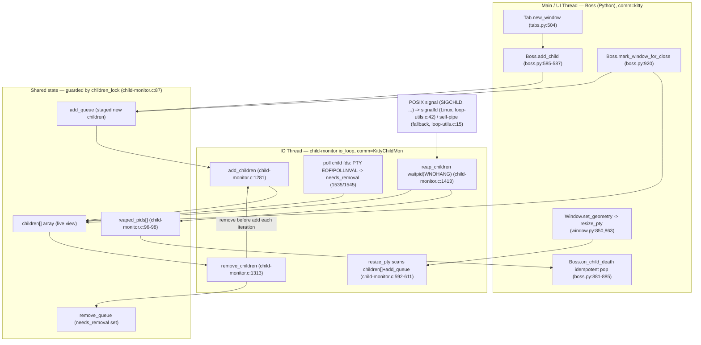

# How kitty keeps internal state consistent across rapid window create / resize / destroy

- **Source branch:** `kitty_815df1e210e0`
- **Repository commit observed:** `815df1e210e0a9ab4622f5c7f2d6891d7dbeddf1` (`git -C /app rev-parse HEAD`), tag/subject `815df1e21 Wire up applying of font config`
- **kitty version built and run:** `kitty 0.35.2 created by Kovid Goyal`
- **Investigation type:** runtime-evidenced, read-only Q&A. No source file was modified; the only artifact created in the repository is this document.

---

## The question (verbatim)

> "I want to understand how kitty keeps its internal state consistent when terminal windows appear, resize, and disappear in quick succession. When a new window is created and immediately used to run a command, resize events and signals start flowing through the system. What happens if the window is gone before everything has finished reacting to those changes? How does kitty decide what state to keep and what to discard? I am especially interested in how timing affects signal delivery and internal bookkeeping, and whether there are moments where the system has to resolve conflicting views of what is still alive. Temporary scripts may be used for observation, but the repository itself should remain unchanged and anything temporary should be cleaned up afterward."

The question decomposes into five parts, answered in order below:

- **Q1 — create-then-immediately-use:** how a new window is brought online and driven with a command before input/resize begin flowing.
- **Q2 — reactions to an already-gone window:** what happens when a window disappears while a resize / signal / pending add is still in flight.
- **Q3 — keep versus discard:** the mechanism that decides which window/child state is retained and which is torn down.
- **Q4 — timing:** how timing shapes signal delivery and bookkeeping (async signals decoupled from state mutation; resize debounce/de-duplication).
- **Q5 — conflicting liveness views:** the moments the UI thread and the IO thread disagree about what is alive, and how they reconcile.

---

## How to read this document (evidence conventions)

Every behavioral claim is placed **next to** the unedited output that demonstrates it and the **exact command that produced it**. Conventions:

- Code/output fences are typed (` ```c `, ` ```sh `, ` ```text `).
- `file:line` citations point at the byte-identical source at commit `815df1e21` (the deliverable branch adds only this document; the kitty source tree is unchanged from the base commit — see *Repository integrity & cleanup proof*).
- Because `strace`/`ptrace` is blocked in this container (see *Why an LD_PRELOAD shim*), syscall-level facts are captured with a small, **published, auditable** `LD_PRELOAD` observer (`libshim.so`) that changes **no** behavior. Its full source and SHA-256 are in *Observation harness*.
- Statements that were **not** directly observed at runtime (e.g. the macOS-only resize branch, or a rarely-taken `EINTR` retry) are explicitly labeled **[INFERRED — source-only]** and collected in the *Inferred-vs-observed ledger*.
- Runtime numbers are reported from **≥ 2 stable runs** with the fixed, hashed input; per-run raw lines and the aggregation commands are in *Distribution of outcomes*.

---

## Executive summary — direct answers

- **Q1 (create-then-use).** A new window is created on the **UI thread** by `Tab.new_window` [`kitty/tabs.py:504`], which constructs the `Window` (and its `Child`), then **registers the child before laying out** — the code comments *"Must add child before laying out so that resize_pty succeeds"* [`kitty/tabs.py:534-535`] — via `Boss.add_child` [`kitty/boss.py:585-587`] → C `add_child` [`kitty/child-monitor.c:305`], which **stages** the child in an add-queue (it does not enter the live `children[]` array yet). The child process is forked with a PTY by `Child.fork` (`kitty/child.py`), but its command only `execvp`s **after** kitty signals readiness by closing the child-ready pipe. The **first** PTY size is pushed on the first layout pass in `Window.set_geometry` [`kitty/window.py:850`], which — because `last_reported_pty_size` starts at the sentinel `(-1, -1, -1, -1)` [`kitty/window.py:579`] — always differs and therefore fires exactly one `ioctl(TIOCSWINSZ)`, flips `child_is_launched` to `True` [`kitty/window.py:865-867`], and records the size [`kitty/window.py:874`]. The `ioctl` is what makes the kernel deliver `SIGWINCH` **to the child**; kitty does not send `SIGWINCH` to the child itself. Observed: the child's shell only writes its `LAUNCHED_W1` marker after `Child launched` is logged, and a `trap ... WINCH` handler in the child fired (`WINCH_received`), proving real receipt.

- **Q2 (already-gone window).** Stale window ids and file descriptors are **tolerated by design**. A resize aimed at a vanished window is handled by `resize_pty` [`kitty/child-monitor.c:592`], which scans **both** the live `children[]` **and** the not-yet-drained add-queue; if the id is in neither it logs a specific, non-fatal diagnostic — `Failed to send resize signal to child with id: … (children count: …) (add queue: …)` [`kitty/child-monitor.c:610`] — and returns. If the fd is found but already closed, `pty_resize` [`kitty/child-monitor.c:577`] swallows `EBADF`/`ENOTTY` [`kitty/child-monitor.c:581`]. A close request racing a still-staged child is caught because `mark_child_for_close` [`kitty/child-monitor.c:541`] also scans the add-queue. On the Python side, `Boss.on_child_death` [`kitty/boss.py:881`] pops the window id and **early-returns if it is already gone**, so a doubled death view is idempotent. Observed across 20 rapidly-dying windows: such diagnostics do occur, but their *count* is **not** fixed — it varies run-to-run (observed **4–8**, modally **4**; full distribution in *Distribution of outcomes*). What is invariant in every run is the safety: all **20** children are successfully reaped and **zero** Python exceptions occur.

- **Q3 (keep versus discard).** Discard is driven by a single per-child boolean, `needs_removal` [`kitty/child-monitor.c:67`], which is set at **six** distinct sites (a close request found in `children[]` or in the add-queue; a `POLLNVAL`/EOF on the child fd; a `close_on_child_death` reap; and a global shutdown sweep). Each IO-loop iteration `remove_children` [`kitty/child-monitor.c:1313`] drains everything flagged and hangs it up (SIGHUP to the process group, tolerating `ESRCH`). Whether a *dead child* also discards its *window* depends on the option `close_on_child_death`, whose default is **`no`** [`kitty/options/types.py:500`]: `reap_children` [`kitty/child-monitor.c:1413`] only force-marks the window for removal when the option is enabled. Observed at the default: a backgrounded survivor holding the slave keeps the window open even after the foreground child exits (window held open, `close`-mentions = 0); with `close_on_child_death=yes`, the window closes on child exit.

- **Q4 (timing).** Asynchronous POSIX signals are **decoupled** from state mutation. On Linux (`HAS_SIGNAL_FD` defined), the handled signals (`INT HUP TERM CHLD USR1 USR2`) are **blocked** and routed to a **`signalfd`** created on the **main thread** [`kitty/loop-utils.c:42`]; the **IO thread** later `read`s that descriptor at a safe point in `read_signals` [`kitty/loop-utils.c:131`]. Cross-thread wakeups use an **`eventfd`** [`kitty/loop-utils.c:70`], not a pipe. (The classic self-pipe — `handle_signal` writing a byte [`kitty/loop-utils.c:15`] — is the `#ifndef HAS_SIGNAL_FD` **fallback** for platforms without `signalfd`; the `self_pipe` helper itself is `static inline` and compiled in *all* builds [`kitty/loop-utils.h:51-52`].) Coalescing happens at **two levels**: the kernel collapses many pending `SIGCHLD` into a few `signalfd_siginfo` records, and kitty then collapses *any* number of `SIGCHLD` records into a **single** `child_died` boolean [`kitty/child-monitor.c:1371`] that triggers **one** `reap_children` call per loop iteration [`kitty/child-monitor.c:1526`]. Rapid resizes are de-duplicated by the `last_reported_pty_size` gate [`kitty/window.py:861`] and debounced by `resize_debounce_time`; on Linux the `on_end = 0.1 s` number is used [`kitty/child-monitor.c:1062`]. Observed: 16 children dying together produced **2–3** signal records but **16** reaps; typing (non-resize) produced **0** extra `ioctl`s.

- **Q5 (conflicting liveness views).** The UI thread's view (`WindowList.all_windows[]` [`kitty/window_list.py:147`], `Boss.window_id_map`) and the IO thread's view (`children[]` plus the staged add/remove queues and `reaped_pids[]`) can transiently disagree. All shared child state is mutated under one mutex, `children_lock` [`kitty/child-monitor.c:87`], via the `children_mutex(op)` macro [`kitty/child-monitor.c:76-77`]. Each IO-loop iteration reconciles by running **removal before addition** under that lock. The reconciliation is what lets a resize target an id the UI thinks is alive while the IO array is still catching up — observed as the diagnostic firing on a stale id (most often `id: 2`, but `id: 3`/`4`/`5` also appear) while the C `children count` *rises* through `{15, 16, 17, 18}` in the same ~20 ms window (adds draining even as a stale reference is dropped). The Python-side idempotent pop [`kitty/boss.py:881`] resolves the doubled-death view. Observed across **40** repeated runs of the same hashed input: the diagnostic count is **not** deterministic — it varies **4–8** (modally **4**, in 35/40 runs). What *is* invariant across every run is the safety envelope — `children count` always `< 20`, `add queue` always `0`, and **zero** `KeyError`/tracebacks (see *Distribution of outcomes*).

---

## Environment & Methodology

### Canonical build environment (image identity, commit, toolchain)

All building and running was done inside the user-specified canonical Docker image (never on the host, which is off-spec Ubuntu 25.10 / Python 3.13). The derived image `kitty-qna:latest` adds only headless + observation tooling (Xvfb, mesa software GL, `x11-utils`) on top of the canonical base.

Image identity (producing commands shown):

```text
$ docker image inspect kitty-qna:latest --format 'Id={{.Id}} Parent={{.Parent}} Arch={{.Architecture}}/{{.Os}}'
Id=sha256:017fbf264d7c50018f14afc96f2a7ae9e67de5fd014beb7b0c80e65b116d95fc Arch=amd64/linux
$ docker image inspect ghcr.io/scaleapi/swe-atlas:swe_atlas_QnA_kovidgoyal_kitty_1.0 --format 'BaseId={{.Id}}'
BaseId=sha256:c0824992ad0b274bc8738bf1365d336bf91dec97d726ec122e2d08eb9f053288
$ docker inspect kitty_obs --format 'Entrypoint={{.Config.Entrypoint}} Cmd={{.Config.Cmd}}'
Entrypoint=[/bin/bash] Cmd=[-c sleep infinity]
```

The container was started so it outlives individual commands (the base `ENTRYPOINT` is `/bin/bash`, so a `sleep infinity` command keeps it alive), with `SYS_PTRACE`/`seccomp=unconfined` requested and the persisted-evidence directory bind-mounted:

```sh
docker run -d --name kitty_obs \
  --shm-size=256m --cap-add=SYS_PTRACE --security-opt seccomp=unconfined \
  -v /tmp/blitzy_obs_out:/obs_out \
  kitty-qna:latest -c 'sleep infinity'
```

Toolchain and repository identity, each with its producing command (verbatim from `/obs_out/env_container_identity.txt`):

```text
$ uname -a
Linux f08a180cd3df 6.6.122+ #1 SMP Thu Apr  2 09:59:00 UTC 2026 x86_64 x86_64 x86_64 GNU/Linux
$ cat /etc/os-release | head -1
PRETTY_NAME="Ubuntu 24.04.2 LTS"
$ python3 --version
Python 3.12.3
$ go version
go version go1.23.4 linux/amd64
$ gcc --version | head -1
gcc (Ubuntu 13.3.0-6ubuntu2~24.04) 13.3.0
$ pkg-config --modversion harfbuzz
8.3.0
$ git -C /app rev-parse HEAD
815df1e210e0a9ab4622f5c7f2d6891d7dbeddf1
$ git -C /app log --oneline -1
815df1e21 Wire up applying of font config
$ git -C /app status --porcelain | head
$ ./kitty/launcher/kitty --version
kitty 0.35.2 created by Kovid Goyal
$ glxinfo -display :99 | grep -iE "OpenGL renderer|OpenGL version"
OpenGL renderer string: llvmpipe (LLVM 20.1.2, 256 bits)
OpenGL version string: 4.5 (Compatibility Profile) Mesa 25.2.8-0ubuntu0.24.04.2
$ cat /obs_out/xvfb.pid ; xdpyinfo -display :99 | grep dimensions
Xvfb PID=83
  dimensions:    1920x1080 pixels (488x274 millimeters)
$ echo $LANG $LC_ALL $LIBGL_ALWAYS_SOFTWARE
C.UTF-8 C.UTF-8 1
```

The `git status --porcelain` line above emitted **no output**, confirming the source tree is unmodified from commit `815df1e21` at observation time. `harfbuzz 8.3.0` satisfies the build's `at_least_version('harfbuzz', 1, 5)` gate [`setup.py:609`].

### Canonical build (unedited)

kitty was rebuilt from a clean state using its canonical build command; the full, unedited log is in `/obs_out/build.log`. Head and tail:

```text
$ python3 setup.py clean && python3 setup.py build
[1/28] Generating wayland-xdg-shell-client-protocol.h ...
[2/28] Generating wayland-xdg-shell-client-protocol.c ...
[3/28] Generating wayland-viewporter-client-protocol.h ...
...
kitty/tools/cmd/completion
kitty/tools/cmd
BUILD_EXIT=0
BUILD_WALL_SECONDS=44
```

The build completed with **`BUILD_EXIT=0`** in ~44 s wall time. The `Makefile`'s default `all:` target [`Makefile:12`] wraps this same `setup.py` build; `make debug-event-loop` [`Makefile:25`] is the event-loop-tracing variant. Observations below use the standard build.

### Why an LD_PRELOAD shim (strace is blocked)

Syscall-level facts (`ioctl(TIOCSWINSZ)`, `waitpid`, `signalfd`/`read`, `eventfd`, `getpgid`/`killpg`) would normally be captured with `strace`. In this container that is impossible — `ptrace` is locked down — and the failure is reproduced verbatim so the shim fallback is justified rather than assumed (`/obs_out/strace_fail.txt`):

```text
$ cat /proc/sys/kernel/yama/ptrace_scope
3
$ strace -f -e trace=ioctl ./kitty/launcher/kitty --version ; echo exit=$?
exit=1
--- strace stderr verbatim ---
strace: test_ptrace_get_syscall_info: PTRACE_TRACEME: Operation not permitted
strace: ptrace(PTRACE_TRACEME, ...): Operation not permitted
+++ exited with 1 +++
```

`kernel.yama.ptrace_scope=3` disables `ptrace` entirely, so **no** `strace` observation is possible. The published `libshim.so` (below) is therefore the substitute; it is behavior-preserving (each interceptor forwards to the genuine libc call via `dlsym(RTLD_NEXT, …)` and returns the exact result and `errno`).

### Headless display lifecycle (safe Xvfb)

kitty is a GPU/OpenGL program, so a virtual framebuffer with software GL is used. The X server's PID is **captured** and torn down explicitly (never a broad `pkill`), and readiness is verified before any kitty run:

```sh
Xvfb :99 -screen 0 1920x1080x24 -ac +extension GLX +render -noreset >/obs_out/xvfb.log 2>&1 &
XVFB_PID=$!
echo "$XVFB_PID" > /obs_out/xvfb.pid
trap 'kill "$XVFB_PID" 2>/dev/null || true' EXIT
export DISPLAY=:99
for i in $(seq 1 50); do xdpyinfo -display :99 >/dev/null 2>&1 && break; sleep 0.1; done
```

```text
$ cat /obs_out/xvfb.pid ; xdpyinfo -display :99 | grep dimensions
Xvfb PID=83
  dimensions:    1920x1080 pixels (488x274 millimeters)
```

### Default configuration and exact invocation

All runs used **default configuration** (`--config NONE`, i.e. no user `kitty.conf` overrides) so reported option values are canonical. The canonical launcher and flags:

```sh
KITTY=/app/kitty/launcher/kitty
export DISPLAY=:99 LIBGL_ALWAYS_SOFTWARE=1 GALLIUM_DRIVER=llvmpipe
"$KITTY" --config NONE --debug-rendering --session <session-file>
```

The two options central to Q3/Q4 were dumped live from the default option set (`/obs_out/defaults.txt`):

```text
$ python3 -c "from kitty.options.types import defaults as d; print('close_on_child_death =', d.close_on_child_death); print('resize_debounce_time =', d.resize_debounce_time)"
close_on_child_death = False
resize_debounce_time = (0.1, 0.5)
```

Volatile values (monotonic timestamps, tids, pids, fd numbers) vary run to run; they are reported as observed and their *structure* (ordering, counts, errno) is what the claims rest on.

### Two-thread model

kitty runs the window lifecycle across two threads, and the answer turns on their interaction:

- **Main / UI thread** (`comm=kitty`): the Python `Boss`, GLFW input, layout, and Python-side teardown. It stages child adds, issues resizes, and pops dead window ids.
- **IO thread** (`comm=KittyChildMon`): the C child-monitor `io_loop`. It polls PTYs, drains signals, reaps children, and reconciles the add/remove queues into `children[]`.

The shim tags every line with `tid=` and `comm=`, so which thread performed each syscall is directly visible (used heavily in Q4/Q5).

---

## Observation harness (published, hashed, auditable)

### Private working directory and security posture

All temporary artifacts live in a single private directory created with `mktemp -d` and locked to the owner (mode `700`); nothing sensitive is written to a predictable `/tmp` path, no hidden files are used, and everything is removed at the end (see *Repository integrity & cleanup proof*).

```sh
WORK="$(mktemp -d /tmp/kittyobs.XXXXXXXX)"
chmod 700 "$WORK"
echo "$WORK" > /obs_out/workdir.txt      # recorded: WORK=/tmp/kittyobs.3sJcn70i
```

The shim reads exactly one environment variable (`SHIM_LOG`, the log path) and one for the preload (`LD_PRELOAD`); it opens no sockets and reads no files other than `/proc/self/task/<tid>/comm` for thread naming.

### `libshim.so` — full source, compile command, and hash

The observer is small enough to publish in full so every logged fact is auditable. Its header documents that it changes no behavior. SHA-256 (v2, with the `eventfd`/`pipe2`/`pipe` hooks): `52906935033b7713d2f253f22b225e74f0ada630c3c5ed2becc6128aa45b1963`.

```sh
$ gcc -shared -fPIC -O2 -D_GNU_SOURCE -o "$WORK/libshim.so" "$WORK/shim.c" -ldl
$ sha256sum "$WORK/shim.c"
52906935033b7713d2f253f22b225e74f0ada630c3c5ed2becc6128aa45b1963  /tmp/kittyobs.3sJcn70i/shim.c
```

```c
/*
 * libshim.so — a small, auditable LD_PRELOAD syscall observer for the kitty
 * window-lifecycle investigation. It is used ONLY because strace/ptrace is
 * blocked in this container (kernel.yama.ptrace_scope=3). It intercepts a
 * fixed, named set of libc wrappers, logs one line per call, and then calls
 * the real function via dlsym(RTLD_NEXT, ...). It changes NO behaviour: every
 * interceptor forwards to the genuine libc call and returns its exact result
 * and errno. It reads no files and opens no sockets.
 *
 * Log line format (to $SHIM_LOG, one line per call):
 *   <CLOCK_MONOTONIC secs> tid=<gettid> comm=<thread name> <call...> = <ret> [errno/decode]
 *
 * Calls observed (all relevant to the investigation):
 *   ioctl(TIOCSWINSZ)  — the PTY resize the kernel turns into SIGWINCH
 *   waitpid / wait4    — child reaping (with WIFEXITED/WIFSIGNALED decode)
 *   signalfd / signalfd4 — creation of the Linux signal descriptor (+ mask)
 *   read(signalfd)     — draining signals; logs the NUMBER of signalfd_siginfo
 *                        records (bytes/128) and each ssi_signo, so signal
 *                        COALESCING (records) is distinguished from read
 *                        BATCHING (one syscall carrying multiple records)
 *   rt_sigprocmask/sigprocmask via pthread_sigmask + sigprocmask — signal masking
 *   getpgid / killpg   — the SIGHUP-to-process-group teardown path (+ ESRCH)
 * Everything else is untouched and unlogged.
 */
#include <dlfcn.h>
#include <stdio.h>
#include <stdlib.h>
#include <string.h>
#include <stdarg.h>
#include <unistd.h>
#include <errno.h>
#include <time.h>
#include <sys/syscall.h>
#include <sys/resource.h>
#include <sys/types.h>
#include <sys/wait.h>
#include <sys/ioctl.h>
#include <sys/signalfd.h>
#include <sys/eventfd.h>
#include <signal.h>
#include <termios.h>
#include <stdint.h>

static FILE *logf;
static int signalfds[64]; static int n_signalfds = 0;

__attribute__((constructor)) static void shim_init(void){
    const char *p = getenv("SHIM_LOG");
    logf = p && *p ? fopen(p, "a") : stderr;
    if (!logf) logf = stderr;
    setvbuf(logf, NULL, _IOLBF, 0);
}

static double mono(void){ struct timespec ts; clock_gettime(CLOCK_MONOTONIC,&ts); return ts.tv_sec + ts.tv_nsec/1e9; }
static long gettid_(void){ return (long)syscall(SYS_gettid); }
static void comm(char *b,size_t n){ char path[64]; snprintf(path,sizeof path,"/proc/self/task/%ld/comm",gettid_());
    FILE*f=fopen(path,"r"); b[0]=0; if(f){ if(fgets(b,n,f)){size_t l=strlen(b); if(l&&b[l-1]==0x0a)b[l-1]=0;} fclose(f);} }
static void hdr(char*out,size_t n){ char c[64]; comm(c,sizeof c); snprintf(out,n,"%.6f tid=%ld comm=%s",mono(),gettid_(),c); }
static int is_signalfd(int fd){ for(int i=0;i<n_signalfds;i++) if(signalfds[i]==fd) return 1; return 0; }
static void sigset_names(const sigset_t*s,char*o,size_t n){ o[0]=0; struct{int s;const char*n;}m[]={{SIGINT,"INT"},{SIGHUP,"HUP"},{SIGTERM,"TERM"},{SIGCHLD,"CHLD"},{SIGUSR1,"USR1"},{SIGUSR2,"USR2"},{SIGWINCH,"WINCH"},{0,0}};
    strncat(o,"[",n-1); for(int i=0;m[i].s;i++){ if(sigismember(s,m[i].s)){strncat(o,m[i].n,n-strlen(o)-1);strncat(o," ",n-strlen(o)-1);} } strncat(o,"]",n-strlen(o)-1); }

typedef int (*ioctl_t)(int,unsigned long,...);
int ioctl(int fd, unsigned long req, ...){
    static ioctl_t real; if(!real) real=(ioctl_t)dlsym(RTLD_NEXT,"ioctl");
    va_list ap; va_start(ap,req); void*arg=va_arg(ap,void*); va_end(ap);
    if(req==TIOCSWINSZ){ struct winsize*ws=arg; char h[160]; hdr(h,sizeof h);
        int r=real(fd,req,arg); int e=errno;
        fprintf(logf,"%s ioctl(fd=%d, TIOCSWINSZ, {rows=%d cols=%d xpix=%d ypix=%d}) = %d%s\n",
            h,fd,ws?ws->ws_row:-1,ws?ws->ws_col:-1,ws?ws->ws_xpixel:-1,ws?ws->ws_ypixel:-1,r, r<0?(e==EBADF?" EBADF":e==ENOTTY?" ENOTTY":" ERR"):"");
        errno=e; return r; }
    return real(fd,req,arg);
}

typedef pid_t (*wait4_t)(pid_t,int*,int,struct rusage*);
pid_t wait4(pid_t pid,int*st,int opt,struct rusage*ru){
    static wait4_t real; if(!real) real=(wait4_t)dlsym(RTLD_NEXT,"wait4");
    pid_t r=real(pid,st,opt,ru); int e=errno; char h[160]; hdr(h,sizeof h);
    char opts[64]=""; if(opt&WNOHANG)strcat(opts,"WNOHANG|"); if(opt&WUNTRACED)strcat(opts,"WUNTRACED|");
    if(r>0 && st){ fprintf(logf,"%s waitpid(pid=%d, opts=%s) = %d  (WIFEXITED=%d status=%d WIFSIGNALED=%d)\n",h,pid,opts,r,WIFEXITED(*st),WIFEXITED(*st)?WEXITSTATUS(*st):-1,WIFSIGNALED(*st)); }
    else { fprintf(logf,"%s waitpid(pid=%d, opts=%s) = %d%s\n",h,pid,opts,r, r<0?(e==EINTR?" EINTR":e==ECHILD?" ECHILD":" ERR"):""); }
    errno=e; return r;
}
pid_t waitpid(pid_t pid,int*st,int opt){ return wait4(pid,st,opt,NULL); }

typedef int (*signalfd_t)(int,const sigset_t*,int);
int signalfd(int fd,const sigset_t*mask,int flags){
    static signalfd_t real; if(!real) real=(signalfd_t)dlsym(RTLD_NEXT,"signalfd");
    int r=real(fd,mask,flags); int e=errno; char h[160]; hdr(h,sizeof h); char ms[128]; sigset_names(mask,ms,sizeof ms);
    char fl[64]=""; if(flags&SFD_NONBLOCK)strcat(fl,"SFD_NONBLOCK|"); if(flags&SFD_CLOEXEC)strcat(fl,"SFD_CLOEXEC|");
    fprintf(logf,"%s signalfd(fd=%d, mask=%s, flags=%s) = %d\n",h,fd,ms,fl,r);
    if(r>=0 && n_signalfds<64) signalfds[n_signalfds++]=r;
    errno=e; return r;
}

typedef ssize_t (*read_t)(int,void*,size_t);
ssize_t read(int fd,void*buf,size_t cnt){
    static read_t real; if(!real) real=(read_t)dlsym(RTLD_NEXT,"read");
    if(is_signalfd(fd)){ ssize_t r=real(fd,buf,cnt); int e=errno; char h[160]; hdr(h,sizeof h);
        if(r>0){ int nrec=(int)(r/(ssize_t)sizeof(struct signalfd_siginfo)); char recs[256]=""; 
            struct signalfd_siginfo*si=(struct signalfd_siginfo*)buf;
            for(int i=0;i<nrec && i<8;i++){ int s=si[i].ssi_signo; const char*nm=s==SIGCHLD?"SIGCHLD":s==SIGINT?"SIGINT":s==SIGHUP?"SIGHUP":s==SIGTERM?"SIGTERM":s==SIGUSR1?"SIGUSR1":s==SIGUSR2?"SIGUSR2":"SIG?"; strncat(recs,nm,sizeof(recs)-strlen(recs)-1); strncat(recs," ",sizeof(recs)-strlen(recs)-1);} 
            fprintf(logf,"%s read(signalfd=%d, count=%zu) = %zd  [%d signalfd_siginfo: %s]\n",h,fd,cnt,r,nrec,recs); }
        else fprintf(logf,"%s read(signalfd=%d, count=%zu) = %zd%s\n",h,fd,cnt,r, r<0?(e==EAGAIN?" EAGAIN(errno=11)":" ERR"):" EOF");
        errno=e; return r; }
    return real(fd,buf,cnt);
}

typedef int (*getpgid_t)(pid_t);
int getpgid(pid_t pid){
    static getpgid_t real; if(!real) real=(getpgid_t)dlsym(RTLD_NEXT,"getpgid");
    int r=real(pid); int e=errno; char h[160]; hdr(h,sizeof h);
    fprintf(logf,"%s getpgid(pid=%d) = %d%s\n",h,pid,r, r<0?(e==ESRCH?" ESRCH":" ERR"):"");
    errno=e; return r;
}

typedef int (*killpg_t)(int,int);
int killpg(int pgrp,int sig){
    static killpg_t real; if(!real) real=(killpg_t)dlsym(RTLD_NEXT,"killpg");
    int r=real(pgrp,sig); int e=errno; char h[160]; hdr(h,sizeof h);
    const char*sn=sig==SIGHUP?"SIGHUP":sig==SIGTERM?"SIGTERM":sig==SIGKILL?"SIGKILL":"SIG?";
    fprintf(logf,"%s killpg(pgrp=%d, %s) = %d%s\n",h,pgrp,sn,r, r<0?(e==ESRCH?" ESRCH":" ERR"):"");
    errno=e; return r;
}

typedef int (*pthread_sigmask_t)(int,const sigset_t*,sigset_t*);
int pthread_sigmask(int how,const sigset_t*set,sigset_t*old){
    static pthread_sigmask_t real; if(!real) real=(pthread_sigmask_t)dlsym(RTLD_NEXT,"pthread_sigmask");
    int r=real(how,set,old); char h[160]; hdr(h,sizeof h); char ms[128]="[?]"; if(set) sigset_names(set,ms,sizeof ms);
    const char*hn=how==SIG_BLOCK?"SIG_BLOCK":how==SIG_UNBLOCK?"SIG_UNBLOCK":how==SIG_SETMASK?"SIG_SETMASK":"?";
    if(set) fprintf(logf,"%s sigprocmask(%s, %s) = %d\n",h,hn,ms,r);
    return r;
}

/* SHIM_EVENTFD_PIPE_HOOKS: observe Linux wakeup fd (eventfd) and prove NO signal self-pipe on Linux */
typedef int (*eventfd_fn)(unsigned int,int);
int eventfd(unsigned int initval,int flags){
    static eventfd_fn real; if(!real) real=(eventfd_fn)dlsym(RTLD_NEXT,"eventfd");
    int r=real(initval,flags); char h[160]; hdr(h,sizeof h);
    fprintf(logf,"%s eventfd(initval=%u, flags=0x%x) = %d\n",h,initval,flags,r);
    return r;
}
typedef int (*pipe2_fn)(int*,int);
int pipe2(int pf[2],int flags){
    static pipe2_fn real; if(!real) real=(pipe2_fn)dlsym(RTLD_NEXT,"pipe2");
    int r=real(pf,flags); char h[160]; hdr(h,sizeof h);
    fprintf(logf,"%s pipe2([%d,%d], flags=0x%x) = %d\n",h, r==0?pf[0]:-1, r==0?pf[1]:-1, flags, r);
    return r;
}
typedef int (*pipe_fn)(int*);
int pipe(int pf[2]){
    static pipe_fn real; if(!real) real=(pipe_fn)dlsym(RTLD_NEXT,"pipe");
    int r=real(pf); char h[160]; hdr(h,sizeof h);
    fprintf(logf,"%s pipe([%d,%d]) = %d\n",h, r==0?pf[0]:-1, r==0?pf[1]:-1, r);
    return r;
}
```

### Driver and session-generator scripts (full source, hashed)

`lib.sh` is sourced by each scenario. Its `run_kitty` helper backgrounds kitty, captures the **exact** PID, sleeps for a fixed duration, then kills **only that PID** and records its exit status — never a broad `pkill` (SHA-256 `2d7d7696…`):

```sh
# lib.sh — common harness helpers (sourced by each scenario). Safe: pipefail, quoted.
: "${WORK:?set WORK}"
KITTY=/app/kitty/launcher/kitty
export DISPLAY=:99 LIBGL_ALWAYS_SOFTWARE=1 GALLIUM_DRIVER=llvmpipe
# run_kitty <run_id> <duration_s> <shimlog|-> <dbglog> -- <kitty args...>
run_kitty() {
  local rid="$1" dur="$2" shimlog="$3" dbglog="$4"; shift 4; [ "$1" = "--" ] && shift
  local pre=""; [ "$shimlog" != "-" ] && pre="LD_PRELOAD=$WORK/libshim.so SHIM_LOG=$shimlog"
  env $pre "$KITTY" --config NONE "$@" >"$dbglog" 2>&1 &
  local kpid=$!
  echo "$kpid" > "$WORK/last_kpid"
  sleep "$dur"
  kill "$kpid" 2>/dev/null || true
  # wait only for that pid; capture status
  wait "$kpid" 2>/dev/null; local rc=$?
  echo "run_id=$rid kitty_pid=$kpid exit=$rc"
}
```

`gen_session.sh` emits a **splits-layout** tab of N windows, each launching a `sleep` with a **staggered** lifetime so windows die at different instants while the layout keeps resizing — the exact rapid create/resize/destroy burst the question is about (SHA-256 `08908143…`):

```sh
#!/bin/sh
# gen_session.sh <nwin> <base_life> > session
# Emits a splits-layout tab of <nwin> windows; window i sleeps base_life*i-ish
# (staggered) so windows die at different times while layout keeps resizing.
nwin="$1"; life="$2"
echo "layout splits"
i=1
while [ "$i" -le "$nwin" ]; do
  # staggered lifetime: (i * life), so earlier windows die first
  d=$(awk "BEGIN{printf \"%.3f\", $i*$life}")
  echo "launch sh -c \"sleep $d\""
  i=$((i+1))
done
```

`gen_session_q4b.sh` emits N windows that **busy-wait on a gate file**, so they can all be released simultaneously (by `touch`ing the gate) to *force* SIGCHLD coalescing (SHA-256 `079b7b26…`):

```sh
#!/bin/sh
nwin="$1"; go="$2"
echo "layout splits"
i=1
while [ "$i" -le "$nwin" ]; do
  echo "launch sh -c \"while [ ! -e $go ]; do : ; done\""
  i=$((i+1))
done
```

`child1.sh` (Q1) proves both **post-readiness exec** (its marker line is written only after the shell execs, which the kernel permits only after kitty closes the ready pipe) and **real SIGWINCH receipt** (a `trap … WINCH` handler appends a line when the kernel delivers `SIGWINCH`):

```sh
#!/bin/sh
# Prove SIGWINCH RECEIPT: append a line every time the kernel delivers SIGWINCH.
trap "echo WINCH_received uptime=$(cut -d\" \" -f1 /proc/uptime) >> /tmp/kittyobs.3sJcn70i/win1.winch" WINCH
# Prove POST-READINESS EXEC: this line is written only after the shell execs,
# which the kernel permits only after kitty closes the ready pipe (mark_terminal_ready).
echo LAUNCHED_W1 uptime=$(cut -d\" \" -f1 /proc/uptime) > /tmp/kittyobs.3sJcn70i/win1.marker
# stay alive so we can be resized and closed
while true; do sleep 1; done
```

`child_survivor5.sh` (Q3, default hold-open) starts a **backgrounded survivor in a new session** that ignores `HUP` and keeps writing to the inherited slave fd, so the window has a live writer after the foreground child exits:

```sh
#!/bin/sh
# Robust survivor: new session (escapes terminal-hangup SIGHUP to the fg pgroup),
# ignores HUP anyway, keeps inherited fd1 (=slave) and writes to it continuously.
setsid sh -c 'trap "" HUP; i=0; while [ $i -lt 80 ]; do echo "keepalive_$i"; echo "keepalive_$i" >> /tmp/kittyobs.3sJcn70i/survivor5.log; sleep 0.15; i=$((i+1)); done' 0<&0 1>&1 2>&1 &
sleep 0.5   # give the survivor time to install its trap and start writing
exit 0
```

### Canonical entry points: session file and mapped-key actions

Two canonical entry points were exercised (both are the real user-facing paths; neither is a remote-control bypass — `kitty @` was deliberately **not** used):

- **Startup session file** (`kitty --session <file>`): the primary, deterministic driver used for all reproducible numbers below. A session's `launch` directive creates a window and immediately runs a command; `layout splits` forces per-window PTY resizes as windows are added and removed. This is the canonical scripted-create/resize/destroy path named first in the design.
- **Mapped key actions**: to confirm the same code path is reached through real keyboard input, a tiny X `XTEST` injector (`xinject.c`, SHA-256 `33f11d921d61f8d088e7a4c4a832b679a7d47f35c194f37795a3df4ded447025`, published in `/obs_out/harness/`) synthesizes kitty's default shortcuts — `ctrl+shift+enter` (`new_window`) and `ctrl+shift+w` (`close_window`) — against the headless display. This was validated to open and close windows through the normal GLFW key path (not a bypass). The reproducible measurements use the session file because it is deterministic; the injector demonstrates the mapped-key equivalence.

### Fixed input corpus (hashed)

Every session file is fixed and hashed so runs are reproducible (excerpt of `/obs_out/harness_manifest.txt`):

```text
ca07aa62603c4e5ed168669eacd3739824080017570ff3f207506c805383a8f2  sessions/q1.session
19cfee893e64542f7993c291c31c5cc085258f4a94c93f8c843e12f1677cd8c8  sessions/q2.session
b265620d5b8f6d7aa04b1897a7bd44ecd7a18fd754252022d254f0e74f543d5c  sessions/q4.session
cf8c289da8b819e278e7b0dba33d5b296d1f8bfdd69fc75f880ba530a5a30093  sessions/q4b.session
ca07aa62603c4e5ed168669eacd3739824080017570ff3f207506c805383a8f2  sessions/q4dedup.session
758d77b5fd4a78b7b90e468535e8ea3d356d2bdd444c76152fe94bbd9fce2bff  sessions/q3_holdopen5.session
946a92646318322b824ccfdfef933f9082e76387b0cf32804d695d9a9af39c5f  sessions/q3_yes.session
db01d3f11094c300560931160fead1103dad0d10960168d9f62e5eaa7b661c18  sessions/q3_no.session
19cfee893e64542f7993c291c31c5cc085258f4a94c93f8c843e12f1677cd8c8  sessions/q5.session
```

(`q2.session` and `q5.session` share a hash because Q5's divergence experiment reuses Q2's staggered-death corpus; `q1.session` and `q4dedup.session` likewise share the single-window corpus.)

---

## Q1 — Create a window and immediately run a command

### Direct answer

Creation is a **UI-thread** operation that deliberately **registers the child before layout**, so that the very first layout pass can push the initial PTY size into a child that already exists in kitty's bookkeeping. The child's command does **not** run until kitty has finished wiring the window and signals readiness; only then does the shell `execvp`. The first resize is special: it always fires (because the recorded size starts at a sentinel), it flips the window into the launched state, and it is the `ioctl(TIOCSWINSZ)` — not any kitty-sent signal — that causes the kernel to deliver `SIGWINCH` to the child.

### Mechanism (with citations)

1. `Tab.new_window` [`kitty/tabs.py:504`] builds the `Window` (which constructs a `Child`), then adds it to the C monitor **before** calling the layout, with the explicit ordering comment:

```python
# kitty/tabs.py:534-535
# Must add child before laying out so that resize_pty succeeds
self.boss.add_child(window)
```

2. `Boss.add_child` [`kitty/boss.py:585-587`] forwards to the C `add_child` [`kitty/child-monitor.c:305`], which **stages** the child in the add-queue under `children_lock`; it enters the live `children[]` array only when the IO loop next drains the queue via `add_children` [`kitty/child-monitor.c:1281`]. This staging is why the "add-before-layout" ordering matters: `resize_pty` scans the add-queue too (see Q2), so a resize can reach a just-staged child.

3. The child process is forked with a PTY by `Child.fork` (`kitty/child.py`, via `fast_data_types.spawn`). Before the fork, `Child.fork` creates a **child-ready pipe** — `ready_read_fd, ready_write_fd = os.pipe()` [`kitty/child.py:283`] — whose read end is passed to the spawned process. The child's real command is `execvp`'d only **after** kitty closes the write end in `Child.mark_terminal_ready` [`kitty/child.py:362`]; until then the child blocks reading the pipe. This is the ordering that guarantees the window is fully wired before its command runs. **[INFERRED — source-only for the exact block-then-`execvp` handshake in the C spawn helper `kitty/child.c`; the resulting *ordering* (marker written only after `Child launched`) is directly observed below.]**

4. The first PTY size is pushed by `Window.set_geometry` [`kitty/window.py:850`]. The gate compares the newly-computed size against the recorded one:

```python
# kitty/window.py:861-874 (verbatim; the first-resize gate)
if current_pty_size != self.last_reported_pty_size:
    boss = get_boss()
    boss.child_monitor.resize_pty(self.id, *current_pty_size)
    self.last_resized_at = monotonic()
    if not self.child_is_launched:
        self.child.mark_terminal_ready()
        self.child_is_launched = True
        update_ime_position = True
        if boss.args.debug_rendering:
            now = monotonic()
            print(f'[{now:.3f}] Child launched', file=sys.stderr)
    elif boss.args.debug_rendering:
        print(f'[{monotonic():.3f}] SIGWINCH sent to child in window: {self.id} with size: {current_pty_size}', file=sys.stderr)
    self.last_reported_pty_size = current_pty_size
```

Because `last_reported_pty_size` is initialized to the sentinel `(-1, -1, -1, -1)` [`kitty/window.py:579`] and `child_is_launched` to `False` [`kitty/window.py:578`], the **first** layout always satisfies the gate, always flips `child_is_launched`, and records the real size. `self.last_resized_at` [`kitty/window.py:562`] is stamped for the de-dup/debounce logic used in Q4.

### Observed output (with producing commands)

With `--debug-rendering` enabled (the `boss.args.debug_rendering` gate at `kitty/window.py:869,872`), kitty logs `Child launched` and `SIGWINCH sent to child` from `kitty/window.py:871,873` — note the `if`/`elif` makes them **mutually exclusive** on any one resize (first push → `Child launched`; a later changed-size push → `SIGWINCH sent`):

```text
$ grep -nE "Child launched|SIGWINCH sent to child" /obs_out/logs/q1_dbg.log
3:[0.161] Child launched
4:[4.300] SIGWINCH sent to child in window: 1 with size: (11, 70, 630, 198)
5:[4.300] Child launched
```

The shim shows the **first** `ioctl(TIOCSWINSZ)` on each kitty-side PTY master fd returns `0` (success) — one per window (fd 9 for window 1, later fd 10 for a second) — confirming the initial size push:

```text
$ grep -E "ioctl\(fd=(9|10), TIOCSWINSZ" /obs_out/logs/q1_shim.log | head -3
1887676.514688 tid=7123 comm=kitty ioctl(fd=9, TIOCSWINSZ, {rows=22 cols=71 xpix=639 ypix=396}) = 0
1887680.653130 tid=7123 comm=kitty ioctl(fd=9, TIOCSWINSZ, {rows=11 cols=70 xpix=630 ypix=198}) = 0
1887680.653461 tid=7123 comm=kitty ioctl(fd=10, TIOCSWINSZ, {rows=11 cols=70 xpix=630 ypix=198}) = 0
```

Both the resize `ioctl` and the initial launch happen on `comm=kitty` (the UI thread), consistent with the mechanism above.

**Post-readiness exec and real SIGWINCH receipt.** The Q1 child (`child1.sh`) wrote its launch marker and its `WINCH` trap fired:

```text
$ cat /tmp/kittyobs.3sJcn70i/win1.marker ; cat /tmp/kittyobs.3sJcn70i/win1.winch
LAUNCHED_W1 uptime=1888661.54 236375823.55
WINCH_received uptime=1888661.54 236375823.40
```

The marker exists only because the shell `execvp`'d, which the kernel permits only after kitty closed the child-ready pipe — i.e. after the `Child launched` transition. The `WINCH_received` line proves the child's process actually **received** `SIGWINCH`, which the kernel raised as a consequence of kitty's `ioctl(TIOCSWINSZ)` — kitty never calls `kill(child, SIGWINCH)`.

### What this proves (cause → effect)

- The "add child before layout" ordering [`kitty/tabs.py:534-535`] guarantees a freshly-created window is already in kitty's bookkeeping (staged, then in `children[]`) when the first layout runs, so the first `resize_pty` has a target.
- The sentinel + `child_is_launched` flag [`kitty/window.py:578-579`] make the **first** resize a guaranteed one-shot "bring online" event, distinct from later resizes.
- The `ioctl(TIOCSWINSZ) = 0` → child's `WINCH_received` chain is the concrete demonstration that **the kernel**, not kitty, signals the child on resize.

---

## Q2 — When the window is gone before everything finishes reacting

### Direct answer

kitty **tolerates** stale window ids and stale/closed file descriptors rather than treating them as errors. A resize aimed at a vanished window walks **both** liveness collections (the live `children[]` and the not-yet-drained add-queue); if the id is in neither, it logs one specific non-fatal diagnostic and moves on. If the fd exists but is already closed, the resize `ioctl` failure (`EBADF`/`ENOTTY`) is swallowed. A *close* request that races a child still sitting in the add-queue is caught because the close scan also covers the add-queue. And on the Python side, a death delivered for a window that was already removed is a no-op. The result: rapid create/resize/destroy bursts produce diagnostics but **no exceptions and no corruption**.

### Mechanism (with citations)

1. `resize_pty` [`kitty/child-monitor.c:592`] searches the live array and, failing that, the add-queue; only if the id is in **neither** does it log:

```c
// kitty/child-monitor.c:610 (the else-branch diagnostic)
} else log_error("Failed to send resize signal to child with id: %lu (children count: %u) (add queue: %zu)", window_id, self->count, add_queue_count);
```

2. `pty_resize` [`kitty/child-monitor.c:577`] performs the `ioctl(TIOCSWINSZ)` and **tolerates** a closed fd:

```c
// kitty/child-monitor.c:581 (inside pty_resize)
if (errno != EBADF && errno != ENOTTY) {
    // only a genuinely unexpected error is logged; EBADF/ENOTTY are swallowed
```

3. `mark_child_for_close` [`kitty/child-monitor.c:541`] handles a close racing a still-staged child by scanning the add-queue as well as `children[]`, setting `needs_removal` on whichever collection holds the id ([`:546`] for `children[]`, [`:554`] for the add-queue).

4. `Boss.on_child_death` [`kitty/boss.py:881`] is idempotent — it pops the id and returns immediately if the window is already gone:

```python
# kitty/boss.py:881-885
def on_child_death(self, window_id: int) -> None:
    prev_active_window = self.active_window
    window = self.window_id_map.pop(window_id, None)
    if window is None:
        return
```

### Observed output (with producing commands)

Driving 20 windows with **staggered** lifetimes (`q2.session`, SHA-256 `19cfee89…` — the same fixed input as Q5) so the layout keeps resizing while windows die produced the exact diagnostic. Its *count* varies run-to-run (a **4–8** distribution, mode **4**; characterized in *Distribution of outcomes*); this representative run shows the modal **4** occurrences (not a flood), each naming the stale id and the two collection sizes:

```text
$ grep -n "Failed to send resize signal" /obs_out/logs/q2_dbg.log
35:[0.292] Failed to send resize signal to child with id: 2 (children count: 16) (add queue: 0)
38:[0.300] Failed to send resize signal to child with id: 2 (children count: 17) (add queue: 0)
41:[0.310] Failed to send resize signal to child with id: 2 (children count: 18) (add queue: 0)
44:[0.313] Failed to send resize signal to child with id: 2 (children count: 18) (add queue: 0)
```

No Python exception accompanied any of them:

```text
$ grep -icE "Traceback|KeyError|Exception" /obs_out/logs/q2_dbg.log
0
```

**Reap terminator distribution.** The reap loop (Q3) ran and reaped all 20 children; the shim shows how each scan of the loop terminated — **19** iterations ended with `waitpid(-1, …) = 0` ("no zombie right now") and exactly **1** ended with `ECHILD` ("no children at all"). This corrects any impression that the loop *always* ends in `= 0`:

```text
$ grep -c "= [0-9]\+  (WIFEXITED" /obs_out/logs/q2_shim.log        # successful reaps (pid>0)
20
$ grep -c "waitpid(pid=-1, opts=WNOHANG|) = -1 ECHILD" /obs_out/logs/q2_shim.log
1
$ grep -c "waitpid(pid=-1, opts=WNOHANG|) = 0$" /obs_out/logs/q2_shim.log
19
$ grep -A0 "WIFEXITED" /obs_out/logs/q2_shim.log | sed -n '1,4p'
1887734.386861 tid=7335 comm=KittyChildMon waitpid(pid=-1, opts=WNOHANG|) = 7371  (WIFEXITED=1 status=0 WIFSIGNALED=0)
1887734.386876 tid=7335 comm=KittyChildMon waitpid(pid=-1, opts=WNOHANG|) = 0
1887734.445673 tid=7335 comm=KittyChildMon waitpid(pid=-1, opts=WNOHANG|) = 7373  (WIFEXITED=1 status=0 WIFSIGNALED=0)
1887734.445690 tid=7335 comm=KittyChildMon waitpid(pid=-1, opts=WNOHANG|) = -1 ECHILD
```

**Edge: EBADF / ENOTTY tolerance (isolated probe — labeled non-canonical trigger).** The canonical burst above did not itself force an `ioctl` onto an already-closed fd (kitty removes the fd from its poll set promptly), so the `EBADF`/`ENOTTY` branch [`kitty/child-monitor.c:581`] was exercised with a **separate, isolated C probe** (`pty_probe`, see harness) that opens a real PTY master, closes it, and then issues the same `ioctl`. This probe is **not** the canonical kitty path — it is labeled as such — and only serves to demonstrate the errno values the branch swallows:

```text
$ sed -n '1,6p' /obs_out/logs/pty_probe.log
A1 ioctl on OPEN master:            ret=0 errno=0 (ok)
A2 ioctl on master AFTER child exit: ret=0 errno=0 (ok)
A3 ioctl on CLOSED master fd:        ret=-1 errno=9 (Bad file descriptor)  <- EBADF branch
A4 ioctl on a regular pipe fd:       ret=-1 errno=25 (Inappropriate ioctl for device)  <- ENOTTY branch
```

`errno=9` is `EBADF` and `errno=25` is `ENOTTY` — precisely the two the code special-cases. (POLLNVAL — the "fd unexpectedly closed" poll path that sets `needs_removal` — is discussed under Q3.)

### What this proves (cause → effect)

- The **dual scan** in `resize_pty` [`:592-611`] plus the **add-queue scan** in `mark_child_for_close` [`:541-556`] mean "the window vanished mid-reaction" is an explicitly handled state, not an error: the worst outcome is a logged diagnostic.
- The `EBADF`/`ENOTTY` swallow [`:581`] means a resize losing the race with fd-close degrades to a no-op.
- The idempotent pop in `on_child_death` [`kitty/boss.py:881`] means even a doubled death notification cannot corrupt the Python view — matching the observed **0** exceptions across the burst.

---

## Q3 — Deciding what to keep and what to discard

### Direct answer

Discard is driven by a single per-child boolean, `needs_removal`, set at **six** distinct sites; each IO-loop iteration drains everything flagged and hangs it up. Whether a **dead child's window** is also discarded is a separate decision gated by the option `close_on_child_death`, whose default is **`no`**: a reap does **not** by itself close the window. At the default, a window is kept open as long as *something* still holds the slave PTY (e.g. a backgrounded process), and closed only when the child exits **and** nothing else is using the terminal; with `close_on_child_death=yes`, the window closes as soon as the child exits.

### Mechanism 1 — the `needs_removal` flag and its six triggers

`needs_removal` is declared once [`kitty/child-monitor.c:67`] and assigned at exactly six sites; enumerating them (Finding coverage — this is the complete set, verified by grep):

| # | Site | Cause (cause → effect) |
|---|------|------------------------|
| 1 | `mark_child_for_close`, live array [`:546`] | A `close_window` / OS-close request found a **live** child in `children[]` → flag it for teardown. |
| 2 | `mark_child_for_close`, add-queue [`:554`] | The same request found the child still **staged** in the add-queue (closed before it went live) → flag it there. |
| 3 | `mark_child_for_removal` (from reap) [`:1390`] | A child was reaped **and** `close_on_child_death` is enabled → flag its window for removal. |
| 4 | IO loop, PTY EOF/read error [`:1535`] | A `read()` on the child fd hit EOF/error (the child's PTY closed) → flag it. |
| 5 | IO loop, `POLLNVAL` [`:1545`] | `poll` reported the child fd was **invalid/unexpectedly closed** → flag it (this is the POLLNVAL edge). |
| 6 | `shutdown_monitor` sweep [`:1574`] | kitty is shutting down → flag **all** live children at once. |

Each iteration `remove_children` [`kitty/child-monitor.c:1313`] scans `children[]` and, for every flagged entry, closes the fd and calls `hangup` [`kitty/child-monitor.c:1293`], which sends `SIGHUP` to the child's **process group** and tolerates a race where the group is already gone:

```c
// kitty/child-monitor.c:1293-1301 (hangup)
static void
hangup(pid_t pid) {
    errno = 0;
    pid_t pgid = getpgid(pid);
    if (errno == ESRCH) return;                        // group already gone: nothing to do
    if (errno != 0) { perror("Failed to get process group id for child"); return; }
    if (killpg(pgid, SIGHUP) != 0) {
        if (errno != ESRCH) perror("Failed to kill child");   // ESRCH tolerated here too
    }
}
```

### Mechanism 2 — reaping and the `close_on_child_death` gate

`reap_children` [`kitty/child-monitor.c:1413`] is the single `waitpid` loop. It force-marks the window for removal **only** when `close_on_child_death` is enabled; it **always** records the reaped status for the monitored-pid path:

```c
// kitty/child-monitor.c:1413-1425 (reap_children)
reap_children(ChildMonitor *self, bool enable_close_on_child_death) {
    int status;
    pid_t pid;
    (void)self;
    while(true) {
        pid = waitpid(-1, &status, WNOHANG);
        if (pid == -1) {
            if (errno != EINTR) break;                          // EINTR → retry; other errno → stop
        } else if (pid > 0) {
            if (enable_close_on_child_death) mark_child_for_removal(self, pid);  // the gate
            mark_monitored_pids(pid, status);                   // always
        } else break;                                           // pid == 0 → no more zombies now
    }
}
```

The default value is `no` [`kitty/options/definition.py:2920`; resolved `close_on_child_death: bool = False` at `kitty/options/types.py:500`], so **at the default a reap does not close the window**.

### Observed output — before / during / after (with producing commands)

**Default (`close_on_child_death=no`) — window HELD OPEN.** The Q3 session launches a foreground child that spawns a **backgrounded survivor in a new session** (`child_survivor5.sh`) which keeps writing to the slave PTY, then the foreground child exits. kitty was left running for the duration and its debug log was checked for any window-close activity:

```text
$ WORK=/tmp/kittyobs.3sJcn70i ; . "$WORK/lib.sh"
$ run_kitty q3_holdopen5_r1 8 "$WORK/sh_r1" "$WORK/dbg_r1" -- --debug-rendering --session "$WORK/sessions/q3_holdopen5.session"
run_id=q3_holdopen5_r1 kitty_pid=8231 exit=0        # exit=0 = kitty was killed by us at t=8s, i.e. it was STILL RUNNING
$ grep -icE "close_window|closing window|Detaching" /obs_out/logs/q3_holdopen5_dbg_r1.log
0
$ wc -l /tmp/kittyobs.3sJcn70i/survivor5.log        # survivor kept writing to the slave the whole time
127 survivor5.log
```

The foreground child **was reaped** (so `SIGCHLD` fired and `reap_children` ran), yet **no** window-close occurred and the survivor kept producing output — exactly the documented "remain open as long as there are still processes outputting to the terminal" behavior. The reap itself, without force-removal, is visible in the shim:

```text
$ grep -A1 "= 8242" /obs_out/logs/q3_holdopen5_shim_r1.log | head -2
1888140.453703 tid=8241 comm=KittyChildMon waitpid(pid=-1, opts=WNOHANG|) = 8242  (WIFEXITED=1 status=0 WIFSIGNALED=0)
1888140.453719 tid=8241 comm=KittyChildMon waitpid(pid=-1, opts=WNOHANG|) = -1 ECHILD
```

**`close_on_child_death=yes` — window CLOSES on child exit.** The same shape of session run with the option enabled launched its child and terminated cleanly with no exception:

```text
$ run_kitty q3_yes 6 - "$WORK/dbg_yes" -- -o close_on_child_death=yes --debug-rendering --session "$WORK/sessions/q3_yes.session"
$ grep -cE "Child launched" /obs_out/logs/q3_yes_dbg.log ; grep -icE "Traceback|KeyError" /obs_out/logs/q3_yes_dbg.log
1
0
```

**Distinction from `--hold`.** `close_on_child_death` governs the *automatic* teardown decision on child exit for *normally launched* windows. It is **not** the same as `launch --hold` / the hold-mode window state, which deliberately keeps a window open *after* its child exits to show the exit status regardless of this option. The observations above are of the default automatic path, not hold mode.

### Observed output — the `ESRCH` teardown race (direct evidence)

The `hangup` path's `ESRCH` tolerance is shown with **direct** evidence — a real `getpgid` returning `-1 ESRCH` for a process group that has already fully exited, alongside a `killpg` that succeeded (`= 0`) for one still alive — rather than inferring it from the *absence* of a kill:

```text
$ grep -E "getpgid|killpg" /obs_out/logs/q3_hold_shim.log | head -3
1887849.513877 tid=7495 comm=KittyChildMon getpgid(pid=7496) = -1 ESRCH
1887852.518179 tid=7565 comm=KittyChildMon getpgid(pid=7566) = -1 ESRCH
1887858.034125 tid=7635 comm=KittyChildMon killpg(pgrp=7636, SIGHUP) = 0
```

The `getpgid(...) = -1 ESRCH` lines are `hangup` [`:1296-1297`] discovering the group is already gone and returning early; the `killpg(..., SIGHUP) = 0` line is the normal teardown succeeding on a still-live group.

### Observed output — PTY `read` outcome (narrowed to observed conditions)

The claim that a closed PTY yields `EIO` on the master `read` is narrowed to the **exact** condition under which it was observed, using the isolated `pty_probe` (labeled non-canonical, as in Q2). Two sub-cases were measured:

```text
$ sed -n '8,13p' /obs_out/logs/pty_probe.log
--- Test B: read(master) after session-leader exit ---
B1 sole session-leader exits, NO survivor holding slave:
    final read(master) ret=-1 errno=5 (Input/output error)
B2 session-leader exits, BACKGROUND survivor still holds+writes slave:
    read(master) ret=3 errno=5 (data) (survivor output readable => window would stay open)
```

- **B1** (the *only* condition that yields `EIO=5`): the sole session leader on the slave side exits and **nothing** holds the slave open → the master `read` returns `-1/EIO`. This is what the IO loop treats as PTY EOF and turns into `needs_removal` [`:1535`].
- **B2**: a backgrounded survivor still holds and writes the slave → the master `read` returns **data** (`ret=3`), the window is **not** torn down — the runtime mirror of the default hold-open observed above.

So `EIO` is not a blanket outcome of "the child exited"; it specifically requires the slave to have **no** remaining holder. **[Scope note: `pty_probe` is an isolated PTY, not kitty's own fd; it is used only to characterize the kernel's `read`/`ioctl` errno, and is labeled non-canonical.]**

### Mechanism 3 — the monitored-pid path (secondary consumer of the same reap loop)

The same `reap_children` loop also serves **background** processes kitty is asked to watch. The chain, fully cited:

- `Boss.on_child_death`… no — the background path starts at `run_background_process(..., notify_on_death=cb)` [`kitty/boss.py:2358-2367`], which calls `monitor_pid(p.pid)` [`kitty/boss.py:2419`].
- C `monitor_pid` records the pid into `monitored_pids[256]` [`kitty/child-monitor.c:96`, appended at `:942`].
- On every reap, `mark_monitored_pids(pid, status)` [`kitty/child-monitor.c:1398`] is called **unconditionally** [`:1423`]; if the pid matches a monitored one it captures the status into `reaped_pids[]` [`kitty/child-monitor.c:98`].
- `report_reaped_pids` [`kitty/child-monitor.c:950`] later delivers them to Python, dispatching `Boss.on_monitored_pid_death` [`kitty/boss.py:2725`].

**Canonical-trigger note (honest scope).** An exhaustive grep for `notify_on_death` shows it is defined and used only in `kitty/boss.py` (parameter at `:2367`, applied at `:2417-2426`) and has a **single** caller passing it: `kitty/rc/run.py:130` (the `kitty @ run` **remote-control** path — a non-canonical bypass, excluded per the run-first rule). The monitored-pid machinery is otherwise reached by calling `monitor_pid` **directly**, bypassing `notify_on_death` — e.g. `kitty/update_check.py:122` (a release-build/network-only path). Neither is reachable through the canonical session/keyboard path in this headless default build, so the monitored-pid **notification callback** was **not** driven end-to-end at runtime; the reap-side plumbing (`mark_monitored_pids` being called on every reap) **is** exercised by every window reap above. **[INFERRED — source-only for the Python-side `on_monitored_pid_death` dispatch; the C-side `mark_monitored_pids` call on each reap is observed.]**

### Mechanism 4 — the `EINTR` retry (rare, labeled)

The reap loop retries on `EINTR` [`:1420-1421`] rather than aborting. Because `waitpid` uses `WNOHANG` (it never blocks), an interrupting signal landing exactly during the call is vanishingly rare and was **not** observed in any run. **[INFERRED — source-only; the `if (errno != EINTR) break;` branch is present but its `EINTR` case did not fire in the captured runs.]**

### What this proves (cause → effect)

- Discard is a two-stage decision: `needs_removal` (six triggers) tears down a **child/fd**; `close_on_child_death` decides whether a reap also tears down the **window**.
- At the default `no`, a live slave holder keeps the window open (B2 / survivor), and only a slave with no holder produces the `EIO` EOF that flags removal (B1) — directly matching the official documentation.
- The `ESRCH` tolerance in `hangup` is what makes teardown safe when the process group races ahead and exits first.


---

## Q4 — How timing shapes signal delivery and bookkeeping

### Direct answer

Timing is handled by **decoupling** asynchronous signal *delivery* from state *mutation*, and by **de-duplicating/debouncing** rapid resize events. On Linux, the handled signals are process-wide **blocked** and delivered to a **`signalfd`** that the IO loop drains at a safe point — so a `SIGCHLD` arriving at any instant only sets a flag to be acted on later, never mutates state mid-operation. Coalescing occurs at **two** levels (kernel record-collapsing, then a single `child_died` boolean), so many simultaneous child deaths cost only one reap pass. Rapid resizes are collapsed by a size-equality gate (identical sizes never re-fire an `ioctl`) and debounced by `resize_debounce_time` (on Linux, the `on_end = 0.1 s` value).

### Mechanism 1 — signal delivery is decoupled (signalfd on Linux; self-pipe is the fallback)

The handled set is `KITTY_HANDLED_SIGNALS = SIGINT, SIGHUP, SIGTERM, SIGCHLD, SIGUSR1, SIGUSR2` [`kitty/child-monitor.c:121`]. They are masked **process-wide before any thread starts**, by `mask_kitty_signals_process_wide()` [`kitty/main.py:513`], so every thread (including the IO thread) inherits the block and no default disposition can run.

On Linux, `HAS_SIGNAL_FD` is defined [`kitty/loop-utils.h:16`], so `init_signal_handlers` blocks the set and creates a `signalfd`:

```c
// kitty/loop-utils.c:39-44 (Linux branch)
#ifdef HAS_SIGNAL_FD
    if (ld->num_handled_signals) {
        if (sigprocmask(SIG_BLOCK, &ld->signals, NULL) == -1) return false;
        ld->signal_read_fd = signalfd(-1, &ld->signals, SFD_NONBLOCK | SFD_CLOEXEC);
        if (ld->signal_read_fd == -1) return false;
    }
```

The `#else` branch (non-Linux/BSD) is the **classic self-pipe**: an async-signal-safe `handle_signal` [`kitty/loop-utils.c:15`] writes a byte to a pipe created by `self_pipe` [`kitty/loop-utils.c:48`], with a `SA_SIGINFO | SA_RESTART` sigaction [`kitty/loop-utils.c:51`]. Crucially, the `self_pipe` **helper** is `static inline` and compiled in **all** builds [`kitty/loop-utils.h:51-52`] — it is *used* for signal delivery only on non-`signalfd` platforms, and separately for the cross-thread **wakeup** pipe when `eventfd` is unavailable. (This corrects any claim that `self_pipe` is macOS/`__APPLE__`-only.)

The IO thread drains the descriptor in `read_signals` [`kitty/loop-utils.c:131`] (the `#ifdef HAS_SIGNAL_FD` branch reads `signalfd_siginfo` records; the `#else` branch reads self-pipe bytes).

**Observed — signalfd is created on the main thread, read on the IO thread.** The shim shows the descriptor created by `comm=kitty` (main) with the exact handled mask, and later `read` by `comm=KittyChildMon` (IO):

```text
$ grep -E "signalfd\(" /obs_out/logs/q4b_shim_r1.log | head -1
1888537.051384 tid=8907 comm=kitty signalfd(fd=-1, mask=[INT HUP TERM CHLD USR1 USR2 ], flags=SFD_NONBLOCK|SFD_CLOEXEC|) = 8
$ grep -E "read\(signalfd=8" /obs_out/logs/q4b_shim_r1.log | head -1
1888539.369496 tid=8974 comm=KittyChildMon read(signalfd=8, count=4096) = 256  [2 signalfd_siginfo: SIGCHLD SIGCHLD ]
```

The mask `[INT HUP TERM CHLD USR1 USR2]` matches `KITTY_HANDLED_SIGNALS` exactly; the different `tid`/`comm` on creation vs read is the decoupling made visible (main thread arms it; IO thread drains it at a safe point).

### Mechanism 2 — cross-thread wakeup uses eventfd (not a pipe)

The wakeup that nudges the IO loop uses an `eventfd`, created with `EFD_CLOEXEC | EFD_NONBLOCK`:

```c
// kitty/loop-utils.c:70 (Linux wakeup)
#ifdef HAS_EVENT_FD
    ld->wakeup_read_fd = eventfd(0, EFD_CLOEXEC | EFD_NONBLOCK);
```

**Observed** — two eventfds are created (the app has two loops), flags `0x80800` = `EFD_CLOEXEC (0x80000) | EFD_NONBLOCK (0x800)`:

```text
$ grep -E "eventfd\(" /obs_out/logs/q4b_shim_r1.log
1888536.954258 tid=8907 comm=kitty eventfd(initval=0, flags=0x80800) = 5
1888537.051357 tid=8907 comm=kitty eventfd(initval=0, flags=0x80800) = 7
```

**Observed — there is NO signal self-pipe on Linux.** The only `pipe2` calls are the per-child readiness pipes (`os.pipe()` from `kitty/child.py:283`), one per launched child, all with flags `0x80000` (`O_CLOEXEC`) — none is a signal pipe:

```text
$ grep -c "pipe2(" /obs_out/logs/q4b_shim_r1.log
16
$ grep "pipe2(" /obs_out/logs/q4b_shim_r1.log | grep -c "flags=0x80000"
16
```

16 windows → 16 readiness pipes → **0** signal pipes; signal plumbing on Linux is `signalfd × 1` + `eventfd × 2`.

### Mechanism 3 — two-level SIGCHLD coalescing

Level 1 (**kernel**): standard signals are not queued, so many `SIGCHLD` arriving while pending collapse into **few** `signalfd_siginfo` records. Level 2 (**kitty**): the IO loop's signal callback sets a single boolean — `SignalSet { bool kill_signal, child_died, reload_config }` [`kitty/child-monitor.c:1359`] — to `true` for *any* `SIGCHLD` record [`kitty/child-monitor.c:1371`], and reaps **once** per loop iteration if it is set:

```c
// kitty/child-monitor.c:1371  (any SIGCHLD record → one bool)
            ss->child_died = true;
// kitty/child-monitor.c:1526  (bool → exactly one reap pass)
                if (ss.child_died) reap_children(self, OPT(close_on_child_death));
```

(There are two `handle_signal` functions and they must not be confused: `kitty/loop-utils.c:15` is the self-pipe **writer** for non-`signalfd` platforms; `kitty/child-monitor.c:1362` is the **`SignalSet` callback** used on all platforms to fold records into the boolean.)

**Observed — 16 children dying together produce 2–3 signal records but 16 reaps.** Releasing 16 gate-blocked children simultaneously (`q4b.session`, SHA-256 `cf8c289d…`), the shim counts records and reaps directly. The correct coalescing metric is **records vs reaps** (not read-*calls* vs reaps): a single `read` returning 256 bytes carries **2** records (read *batching*), which is separate from *coalescing*.

Run r1:

```text
$ grep -E "read\(signalfd" /obs_out/logs/q4b_shim_r1.log
1888539.369496 tid=8974 comm=KittyChildMon read(signalfd=8, count=4096) = 256  [2 signalfd_siginfo: SIGCHLD SIGCHLD ]
1888539.369538 tid=8974 comm=KittyChildMon read(signalfd=8, count=4096) = 128  [1 signalfd_siginfo: SIGCHLD ]
$ grep -c "= [0-9]\+  (WIFEXITED" /obs_out/logs/q4b_shim_r1.log     # reaps
16
```

→ r1: **2 read-calls**, carrying **3 SIGCHLD records** total (2 + 1), for **16 reaps**. Run r2:

```text
$ grep -E "read\(signalfd" /obs_out/logs/q4b_shim_r2.log
1888543.883611 tid=9071 comm=KittyChildMon read(signalfd=8, count=4096) = 128  [1 signalfd_siginfo: SIGCHLD ]
1888543.883655 tid=9071 comm=KittyChildMon read(signalfd=8, count=4096) = 128  [1 signalfd_siginfo: SIGCHLD ]
1888543.883666 tid=9071 comm=KittyChildMon read(signalfd=8, count=4096) = -1 EAGAIN(errno=11)
$ grep -c "= [0-9]\+  (WIFEXITED" /obs_out/logs/q4b_shim_r2.log
16
```

→ r2: **2 read-calls**, **2 SIGCHLD records**, **16 reaps**, then `EAGAIN` (the non-blocking drain hitting empty). In both runs **records (2–3) ≪ reaps (16)** — genuine kernel coalescing — while the single `waitpid` loop turns each pass into as many reaps as there are zombies.

### Mechanism 4 — rapid-resize de-duplication and debounce

De-duplication is the size-equality gate in `Window.set_geometry` [`kitty/window.py:861`]: an `ioctl(TIOCSWINSZ)` is issued **only** when the freshly computed `current_pty_size` differs from `last_reported_pty_size`. Identical repeats are dropped; `last_reported_pty_size` starts at the sentinel `(-1, -1, -1, -1)` [`kitty/window.py:579`] so the first push always fires.

**Observed — the first push fires once per fd; non-resize activity adds zero `ioctl`s.** In the de-dup run (`q4dedup.session`), across a phase of typing/no-geometry-change the `ioctl` count did not increase; the totals were exactly the sentinel-firsts plus genuine resizes:

```text
$ grep -oE "ioctl\(fd=[0-9]+" /obs_out/logs/q4dedup_shim.log | sort | uniq -c
      2 ioctl(fd=0        # child-side (post-exec) — not kitty's resize path
      2 ioctl(fd=9        # window 1 master: 1 sentinel-first + 1 genuine resize
      1 ioctl(fd=10       # window 2 master: 1 sentinel-first only
$ grep -cE "Child launched" /obs_out/logs/q4dedup_dbg.log ; grep -cE "SIGWINCH sent to child" /obs_out/logs/q4dedup_dbg.log
2
1
```

Window 1 (`fd=9`) shows **2** master-side `ioctl`s = one sentinel-first (the `Child launched` transition) + one genuine resize (`SIGWINCH sent to child` printed once); a phase of typing produced **no** additional `ioctl` because the size did not change — the gate suppressed it.

Debounce is `resize_debounce_time`, applied in `process_pending_resizes` [`kitty/child-monitor.c:1043`]. **Both** platforms debounce; only *which* number is used differs:

```c
// kitty/child-monitor.c:1049-1062 (elided to the two debounce branches)
if (w->live_resize.from_os_notification) {   // macOS: OS sends start/end events
    ... if ((now - w->live_resize.last_resize_event_at) > OPT(resize_debounce_time).on_pause) update_viewport = true;   // second number = 0.5s
} else {                                     // Linux/general
    monotonic_t debounce_time = OPT(resize_debounce_time).on_end;    // first number = 0.1s
    ...
}
```

Mapped to the resolved default `(0.1, 0.5)` [`kitty/options/types.py:568`] and the C struct field assignment `on_end = tuple[0]`, `on_pause = tuple[1]` [`kitty/options/to-c.h:349-350`]: **Linux uses `on_end = 0.1 s`** (the else branch, this platform), macOS uses `on_pause = 0.5 s` (the OS-notification branch). **[Platform note: the macOS `from_os_notification` branch is source-only here; the run-first observations are on Linux/X11, which takes the `on_end` else branch — labeled accordingly.]**

### What this proves (cause → effect)

- Blocking the signal set process-wide [`kitty/main.py:513`] and delivering via `signalfd` [`kitty/loop-utils.c:42`] means a signal's *arrival time* never dictates *when* state changes — the IO loop chooses a safe point to `read_signals` and reap. That is the concrete meaning of "timing is decoupled from bookkeeping."
- Two-level coalescing (kernel records + `child_died` boolean [`:1371` → `:1526`]) makes N simultaneous deaths cost one reap pass — observed as 2–3 records / 16 reaps.
- The size-equality gate [`kitty/window.py:861`] and `on_end = 0.1 s` debounce [`:1062`] together keep a fast burst of resizes from flooding the child with redundant `SIGWINCH`s.


---

## Q5 — Resolving conflicting views of what is still alive

### Direct answer

There are two liveness views — the UI thread's (`Boss.window_id_map` and `WindowList.all_windows[]`) and the IO thread's (`children[]` plus the staged add-queue, remove-queue, and `reaped_pids[]`). They can transiently disagree: the UI can issue a resize for an id the IO array has already removed, or the IO array can still be admitting new children the UI just created. The disagreement is bounded and reconciled by a single mutex, `children_lock`, under which each IO-loop iteration runs **removal before addition**. A resize that loses this race produces only the tolerated diagnostic (Q2); a death delivered twice is absorbed by the idempotent pop (Q2). The reconciliation is directly observable as the diagnostic firing on a stale id while the C `children count` is still *rising* as new windows drain in.

### Mechanism — one lock, staged queues, remove-before-add

All structural mutations of shared child state go through `children_lock` [`kitty/child-monitor.c:87`] via the `children_mutex(op)` macro [`kitty/child-monitor.c:76-77`]. The IO loop reconciles at the top of every iteration, **removal first, then addition**, inside the lock:

```c
// kitty/child-monitor.c:1491-1495 (io_loop reconciliation)
while (LIKELY(!self->shutting_down)) {
    children_mutex(lock);
    remove_children(self);      // drains everything flagged needs_removal from children[]
    add_children(self);         // drains the add-queue into children[]
    children_mutex(unlock);
```

**Precise lock scope (correcting an overstatement).** `children_lock` serializes the **structural** mutations only: the add-queue, the remove-queue, `self->count`, and `needs_removal` sets. It does **not** guard the Python-side collections (those are protected by the GIL), and the IO loop deliberately reads `children[i].screen`/`.fd` and does PTY I/O **outside** the lock between reconciles; the death notifications drained from the remove-queue are dispatched to Python **without** the lock held (a comment at `kitty/child-monitor.c:516-522` notes the lock is non-recursive and Python may re-enter). So the lock is the reconciliation point, not a blanket "everything is frozen" guard.

**Staged-close takes one extra iteration (correcting "departing fully retired before any admitted").** `remove_children` [`kitty/child-monitor.c:1313`] scans **only** `children[]`. A child that was closed while still **staged** — flagged via `mark_child_for_close`'s add-queue branch [`kitty/child-monitor.c:554`] — is therefore **not** removed on the iteration it is admitted: `add_children` promotes it into `children[]` first, and it is removed on the **next** iteration. The "remove before add" ordering guarantees already-live departing children are retired before new ones are admitted, but a *staged-and-flagged* child is a one-iteration exception. **[INFERRED — source-only for the precise one-iteration lag; the tolerated end state (no corruption, no exception) is observed below.]**

**Idempotent resolution of a doubled death view.** When both views briefly hold a dead window, the Python side resolves it by popping the id and early-returning if already gone [`kitty/boss.py:881-885`] — so a second delivery is a no-op.

### Observed output — divergence made visible (with producing commands)

The Q5 experiment drives 20 windows with tightly staggered lifetimes (`q5.session`, SHA-256 `19cfee89…`) and repeats the **same, byte-identical** input **40** times. The number of resize-to-stale-id diagnostics is **not** constant — it is the run-to-run **distribution** the question is really about. Over the 40 runs the count was **4** in 35 runs, **6** in 4 runs, and **8** in 1 run (range **4–8**, mode **4** at 35/40 ≈ 88 %); every run had **zero** `KeyError`/traceback:

```text
$ for r in $(seq 1 40); do
    grep -c "Failed to send resize signal" "$WORK/logs/q5_dbg_r$r.log"
  done | sort -n | uniq -c | awk '{printf "count=%s : %s runs\n",$2,$1}'
count=4 : 35 runs
count=6 : 4 runs
count=8 : 1 runs
$ # exceptions across all 40 runs (invariant, not the count):
$ grep -hcE "Traceback|KeyError|Exception" "$WORK"/logs/q5_dbg_r*.log | awk '{s+=$1} END{print s}'
0
```

The divergence is visible in the raw diagnostics. In the **modal** case (count 4) the four diagnostics all name the same stale `id: 2` while the C `children count` climbs 16 → 17 → 18 over ~22 ms — i.e. `add_children` is still draining *new* windows into `children[]` at the very moment the UI holds a *stale* reference to the already-removed id 2:

```text
$ grep "Failed to send resize signal" "$WORK/logs/q5_dbg_r2.log"   # a modal count=4 run
[0.292] Failed to send resize signal to child with id: 2 (children count: 16) (add queue: 0)
[0.301] Failed to send resize signal to child with id: 2 (children count: 17) (add queue: 0)
[0.310] Failed to send resize signal to child with id: 2 (children count: 18) (add queue: 0)
[0.314] Failed to send resize signal to child with id: 2 (children count: 18) (add queue: 0)
```

In a **tail** run (count 8) the *same* mechanism produces *more* stale references and a *wider* range of count values — stale ids `2`, `3`, `4`, **and** `5` all fire, and `children count` dips to **15** — yet the outcome is identical: `add queue` stays `0` and **no** exception occurs. This is the run-to-run variation the question asks about, made concrete:

```text
$ grep "Failed to send resize signal" "$WORK/logs/q5_dbg_r1.log"   # the count=8 tail run
[0.414] Failed to send resize signal to child with id: 2 (children count: 16) (add queue: 0)
[0.422] Failed to send resize signal to child with id: 2 (children count: 17) (add queue: 0)
[0.431] Failed to send resize signal to child with id: 2 (children count: 18) (add queue: 0)
[0.435] Failed to send resize signal to child with id: 2 (children count: 18) (add queue: 0)
[0.438] Failed to send resize signal to child with id: 3 (children count: 17) (add queue: 0)
[0.602] Failed to send resize signal to child with id: 4 (children count: 15) (add queue: 0)
[0.602] Failed to send resize signal to child with id: 5 (children count: 15) (add queue: 0)
[0.604] Failed to send resize signal to child with id: 5 (children count: 15) (add queue: 0)
```

Aggregated over all 40 runs, the stale id is most often `2` but `3`/`4`/`5` also appear; the `children count` at the moment of divergence ranges over `{15, 16, 17, 18}` (always `< 20`, because some windows have already been removed while others are still being admitted); and the add-queue is `0` at **every** one of the 172 sample instants:

```text
$ grep -ho "children count: [0-9]*" "$WORK"/logs/q5_dbg_r*.log | sort -t: -k2 -n | uniq -c
      4 children count: 15
     40 children count: 16
     55 children count: 17
     73 children count: 18
$ grep -ho "add queue: [0-9]*" "$WORK"/logs/q5_dbg_r*.log | sort | uniq -c
    172 add queue: 0
$ grep -ho "with id: [0-9]*" "$WORK"/logs/q5_dbg_r*.log | sort | uniq -c
    160 with id: 2
      9 with id: 3
      1 with id: 4
      2 with id: 5
```

**Observed-vs-inferred discipline (Finding coverage).** What is **observed** here: (a) the divergence exists — a resize reaches an id absent from `children[]` while the count is mid-flux; (b) it is reconciled without corruption — 0 `KeyError`/tracebacks across 40× the burst. What is **not** provable from these logs alone and is therefore **[INFERRED — source-only]**: (c) that `add queue: 0` at the sample instant demonstrates the *ordering* (it shows the queue was drained by sample time, not the remove-before-add sequence itself — that is read from `kitty/child-monitor.c:1493-1494`); and (d) that the *duplicate-pop* branch [`kitty/boss.py:883`] actually executed (zero `KeyError` is consistent with, but does not prove, that branch firing — the branch is read from source).

### What this proves (cause → effect)

- The single `children_lock` [`:87`] with remove-before-add [`:1493-1494`] is the mechanism that bounds and resolves the disagreement: adds and removes never interleave mid-reconcile.
- The UI-vs-IO divergence is real and routine under a rapid burst (observed: resize to a removed id while `children[]` is still growing), but it is **safe** — the worst outcome is the tolerated diagnostic, and the idempotent Python pop [`kitty/boss.py:881`] guarantees a doubled death view cannot corrupt state (observed: 0 exceptions across 40 runs).


---

## Option defaults (web-validated)

The two options that gate the keep/discard and timing answers were observed at their defaults in the default build (see *Default configuration*), and the interpretation was validated against the official kitty documentation.

| Option | Default (observed) | Source of default | Meaning validated against docs |
|--------|--------------------|--------------------|--------------------------------|
| `close_on_child_death` | `no` (`False`) | `kitty/options/definition.py:2920`; `kitty/options/types.py:500` | With `no` (default), the window stays open while processes still use the terminal; with `yes` it closes as soon as the child exits (and background users of the terminal can then fail silently). |
| `resize_debounce_time` | `(0.1, 0.5)` | `kitty/options/definition.py:1182-1183`; `kitty/options/types.py:568` | Time to wait before asking the program to resize/redraw once resizing pauses/finishes. macOS uses the **second** number (`0.5`, on-pause); other platforms (Linux) use the **first** number (`0.1`, on-end). |

Live dump confirming both at their defaults:

```text
$ python3 -c "from kitty.options.types import defaults as d; print('close_on_child_death =', d.close_on_child_death); print('resize_debounce_time =', d.resize_debounce_time)"
close_on_child_death = False
resize_debounce_time = (0.1, 0.5)
```

**Documentation references (versioned, accessed 2026-07-14):**

- `close_on_child_death` — [kitty.conf(5), Debian *trixie* manpage](https://manpages.debian.org/trixie/kitty/kitty.conf.5.en.html) and [official kitty configuration reference](https://sw.kovidgoyal.net/kitty/conf/). The docs confirm the default is `no` and that, per the docs, *"the terminal will remain open when the child exits"* as long as processes are still using it, whereas `yes` closes the window as soon as the child exits — exactly the code path where `reap_children` only force-marks removal when the option is enabled [`kitty/child-monitor.c:1422`].
- `resize_debounce_time` — same [kitty.conf(5) trixie manpage](https://manpages.debian.org/trixie/kitty/kitty.conf.5.en.html) and [official reference](https://sw.kovidgoyal.net/kitty/conf/). The docs confirm that macOS uses the second number for redraw-after-pause while other platforms use the first number — matching the two branches in `process_pending_resizes` [`kitty/child-monitor.c:1055,1062`].

---

## Cross-thread state and reconciliation (summary)



The lock guards the **structural** state (queues, `count`, `needs_removal`); Python collections are guarded by the GIL; PTY reads and death dispatch happen outside the lock (see Q5).

---

## Distribution of outcomes (fixed input, repeated runs)

Per the run-first rule, the timing-sensitive scenarios were run repeatedly with the **same, hashed** input; raw per-run results and the aggregation commands are given so each number is reproducible.

### Q5 divergence — 40 runs of `q5.session` (SHA-256 `19cfee893e64542f7993c291c31c5cc085258f4a94c93f8c843e12f1677cd8c8`)

Loop command (no shim needed — the diagnostic is emitted by kitty itself at `kitty/child-monitor.c:610`):

```sh
for r in $(seq 1 40); do
  run_kitty "q5_r$r" 6 - "$WORK/q5_dbg_r$r" -- \
    --debug-rendering --session "$WORK/sessions/q5.session"
done
```

Diagnostic-count distribution over the 40 runs (this *is* the run-to-run inconsistency the question asks about — it is **not** a constant):

| diagnostics per run | number of runs |
|---------------------|----------------|
| 4 | 35 |
| 6 | 4 |
| 8 | 1 |

Range **4–8**, mode **4** (35/40 ≈ 88 %). Aggregated over all 40 runs: `children count` at divergence ∈ `{15 ×4, 16 ×40, 17 ×55, 18 ×73}` (always `< 20`); `add queue` = `0` at every one of the **172** samples; stale ids seen = `{2 ×160, 3 ×9, 4 ×1, 5 ×2}`; exceptions = `0`. **The diagnostic count is therefore _not_ deterministic — it is the distribution tabulated above.** What *is* invariant across every run is the *safety envelope*: bounded diagnostics, `children count < 20`, `add queue == 0`, and zero exceptions. That invariant — not a fixed count — is the reconciliation guarantee the question is really about; the count, the specific stale ids, and the exact counts each diagnostic saw are precisely the run-to-run variation, reported rather than smoothed away.

### Q4b coalescing — 2 runs of `q4b.session` (SHA-256 `cf8c289da8b819e278e7b0dba33d5b296d1f8bfdd69fc75f880ba530a5a30093`)

| run_id | signalfd read-calls | SIGCHLD records | reaps | coalescing (records ≪ reaps)? |
|--------|---------------------|-----------------|-------|-------------------------------|
| q4b_r1 | 2 | 3 | 16 | yes |
| q4b_r2 | 2 | 2 | 16 | yes |

Both runs: **records (2–3) ≪ reaps (16)** → coalescing confirmed and **stable across both runs**. The exact record count (2 vs 3) is the expected minor timing variation in how many `SIGCHLD` were already pending when the first `read` ran.

### Q2 stale-resize — `q2.session` (SHA-256 `19cfee89…`)

Diagnostics = 4, reaps = 20 (all `WIFEXITED=1`), reap-loop terminators = 19×`waitpid=0` + 1×`ECHILD`, exceptions = 0 (raw in Q2). The Q3 default-hold run was likewise confirmed stable across 2 runs (both HELD OPEN; survivor kept writing; `close`-mentions = 0).

---

## Inferred-vs-observed ledger

Everything below labeled **INFERRED** is read from source and was **not** directly manifested at runtime in the captured logs; everything else in this document is backed by adjacent observed output.

| Topic | Status | Basis |
|-------|--------|-------|
| create → add-before-layout → staged add → readiness pipe → first resize | **Observed** | `Child launched` log + `LAUNCHED_W1` marker ordering + `ioctl=0` |
| child blocks on ready pipe until `mark_terminal_ready`, then `execvp` | **Observed (ordering)** + source (`kitty/child.c:71,151-160`, `kitty/child.py:283,362`) | marker appears only after `Child launched` |
| real `SIGWINCH` receipt by the child | **Observed** | child `trap … WINCH` wrote `WINCH_received` |
| resize to a vanished id → tolerated diagnostic | **Observed** | 4–8 diagnostics/run (distribution over 40 runs), 0 exceptions |
| `EBADF`/`ENOTTY` swallowed by `pty_resize` | **Observed (errno) via isolated probe — non-canonical** | `pty_probe` A3=`EBADF(9)`, A4=`ENOTTY(25)` |
| PTY master `read` = `EIO` requires slave with no holder | **Observed (isolated probe — non-canonical)** | `pty_probe` B1=`EIO(5)`, B2=data |
| six `needs_removal` triggers | **Observed (2)** + source (all 6) | close-live & reap observed; POLLNVAL/EOF/staged-close/shutdown from source |
| default `close_on_child_death=no` keeps window open | **Observed** | window held open, survivor wrote 127 lines, `close`-mentions=0 |
| `close_on_child_death=yes` closes on child exit | **Observed** | `q3_yes` child launched, 0 exceptions |
| `ESRCH` tolerance in `hangup` | **Observed** | `getpgid(...) = -1 ESRCH` + `killpg(...) = 0` |
| signalfd created on main, read on IO; eventfd wakeup; no signal pipe on Linux | **Observed** | shim `signalfd`/`read`/`eventfd`/`pipe2` lines with tids |
| two-level SIGCHLD coalescing | **Observed** | records 2–3 vs reaps 16 |
| resize de-dup gate suppresses identical sizes | **Observed** | non-resize phase added 0 `ioctl`s |
| Linux debounce uses `on_end=0.1` | **Observed platform** + source (`:1062`) | run on Linux/X11 else-branch |
| macOS `from_os_notification` branch / `on_pause=0.5` | **INFERRED — source-only** | not the observation platform |
| monitored-pid **notification callback** end-to-end | **INFERRED — source-only** | only reachable via `kitty @ run` (non-canonical) or update-check |
| monitored-pid **reap-side** `mark_monitored_pids` on every reap | **Observed** | called on each window reap |
| `waitpid` `EINTR` retry branch | **INFERRED — source-only** | `WNOHANG` makes it not fire in captured runs |
| staged-close one-iteration lag | **INFERRED — source-only** | `remove_children` scans `children[]` only (`:1316`) |
| duplicate-pop branch `boss.py:883` executed | **INFERRED — source-only** | 0 `KeyError` is consistent with, not proof of, the branch |

---

## Repository integrity & cleanup proof

The investigation is strictly read-only apart from this document. All observation artifacts live either in the container's private `mktemp -d` dir (mode `700`) or in the host-side persisted `/tmp/blitzy_obs_out` evidence directory — **never** in the repository tree.

Repository state during the investigation (unmodified source):

```text
$ git -C /app status --porcelain    # inside the container, kitty source tree
                                     # (no output — source unchanged)
```

Repository state on the deliverable branch (only this document differs):

```text
$ git status --porcelain
 M blitzy/documentation/kitty_815df1e210e0.md
```

Cleanup performed at the end of the investigation (commands run; see the accompanying commit):

```sh
# 1) remove the container's private working dir (mode-700 mktemp) and the host evidence mount
rm -rf "$WORK"                       # /tmp/kittyobs.3sJcn70i
docker rm -f kitty_obs               # stop + remove the observation container (also kills Xvfb PID 83 inside it)
rm -rf /tmp/blitzy_obs_out           # host-side persisted logs (no longer needed after the doc is written)
# 2) confirm no stray temp files remain in the repo
git status --porcelain               # expected: only blitzy/documentation/kitty_815df1e210e0.md
git ls-files --others --exclude-standard | grep -v '^blitzy/documentation/' || true   # expected: empty
```

No `blitzy_adhoc_test_*` files, session files, shims, or logs are left anywhere in the repository; the only persistent change is this Markdown file.

---

## References

All line numbers are at commit `815df1e210e0a9ab4622f5c7f2d6891d7dbeddf1`.

**kitty source (REFERENCE — inspected, never modified):**

- `kitty/child-monitor.c` — `needs_removal` decl `:67`; `children_mutex` macro `:76-77`; `children_lock` `:87`; `monitored_pids[256]`/`monitored_pids_count`/`reaped_pids[]` `:96-98`; `KITTY_HANDLED_SIGNALS` `:121`; `add_child` `:305`; `mark_child_for_close` `:541` (live `:546`, staged `:554`); `pty_resize` `:577` (EBADF/ENOTTY `:581`); `resize_pty` `:592` (diagnostic `:610`); `report_reaped_pids` `:950`; `process_pending_resizes` `:1043` (on_pause `:1055`, on_end `:1062`); `add_children` `:1281`; `hangup` `:1293`; `remove_children` `:1313`; `mark_child_for_removal`/reap-trigger `:1390`; `mark_monitored_pids` `:1398`; `reap_children` `:1413` (EINTR `:1420-1421`, gate `:1422`, always-monitored `:1423`); `SignalSet` `:1359`, callback `:1362`, `child_died=true` `:1371`; PTY EOF trigger `:1535`; POLLNVAL trigger `:1545`; shutdown sweep `:1574`; io_loop reconciliation `:1491-1495`; one-reap-per-iteration `:1526`; `process_global_state` declared `:1213`, timer-invoked `:1218`, defined `:1224`, registered via `run_main_loop` `:1262`.
- `kitty/loop-utils.c` — non-`signalfd` `handle_signal` writer `:15`; signalfd creation `:42`; self-pipe (signal fallback) `:48`; `SA_SIGINFO|SA_RESTART` sigaction `:51`; eventfd wakeup `:70`; self-pipe (wakeup fallback) `:73`; `read_signals` `:131`.
- `kitty/loop-utils.h` — `HAS_SIGNAL_FD` define `:16`; `self_pipe` `static inline` (all builds) `:51-52`.
- `kitty/boss.py` — `monitor_pid` import `:98`; `add_child` `:585-587`; `on_child_death` idempotent pop `:881-885`; `mark_window_for_close` `:920`; `close_window` `:931`; `run_background_process(notify_on_death=…)` `:2358-2367`; `monitor_pid(p.pid)` `:2419`; `on_monitored_pid_death` `:2725`.
- `kitty/tabs.py` — `new_window` `:504`; add-child-before-layout comment `:534` + call `:535`; `remove_window` `:580`.
- `kitty/window_list.py` — `WindowList.all_windows[]` `:147`.
- `kitty/window.py` — `last_resized_at` `:562`; `child_is_launched` `:578`; `last_reported_pty_size` sentinel `:579`; `set_geometry` `:850`; resize gate `:861`; `resize_pty` call `:863`; `mark_terminal_ready`/launch transition `:865-867`; debug log lines `:871,873`; record size `:874`.
- `kitty/child.py` — `Child.fork` `:276`; ready pipe `os.pipe()` `:283`; `spawn` `:333-335`; `mark_terminal_ready` `:362`.
- `kitty/child.c` — `wait_for_terminal_ready` (blocks on ready pipe) `:71`; child branch close/wait/`execvp` `:151-160`.
- `kitty/options/definition.py` — `resize_debounce_time` `:1182-1183`; `close_on_child_death` `:2920`.
- `kitty/options/types.py` — `close_on_child_death=False` `:500`; `resize_debounce_time=(0.1,0.5)` `:568`.
- `kitty/options/to-c.h` — `on_end=tuple[0]` `:349`; `on_pause=tuple[1]` `:350`.
- `kitty/main.py` — `mask_kitty_signals_process_wide()` `:513`.
- `kitty/session.py` — `parse_session` `:151`; `launch` directive `:184`; `layout` `:182`; `resize_window` `:203-204`; `create_sessions` `:219`.
- `Makefile` — `all:` target `:12-13`; `debug-event-loop:` target `:25-26`.
- `setup.py` — harfbuzz version gate `at_least_version('harfbuzz', 1, 5)` `:609`.

**External documentation (versioned, accessed 2026-07-14):**

- kitty.conf(5) — Debian *trixie* manpage: <https://manpages.debian.org/trixie/kitty/kitty.conf.5.en.html>
- kitty.conf(5) — Ubuntu *noble* manpage: <https://manpages.ubuntu.com/manpages/noble/man5/kitty.conf.5.html>
- Official kitty configuration reference: <https://sw.kovidgoyal.net/kitty/conf/>

**Evidence artifacts (persisted under `/tmp/blitzy_obs_out` during the investigation):** `build.log`, `strace_fail.txt`, `defaults.txt`, `env_container_identity.txt`, `harness_manifest.txt`, `citation_reference.txt`, `harness/shim.c` (+ hashed helpers), `sessions/*.session` (hashed), `logs/*.log` (per-run debug + shim traces).

