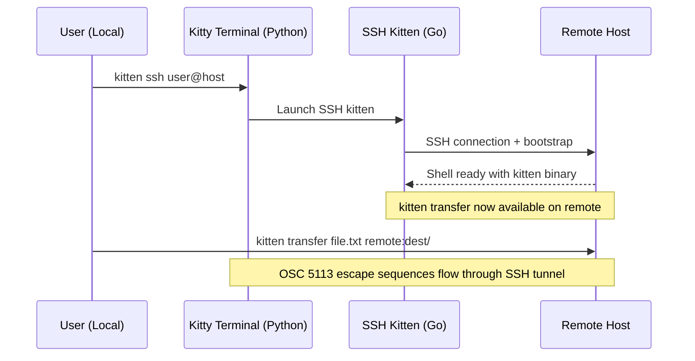
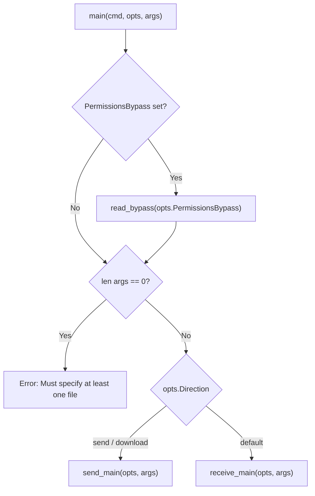
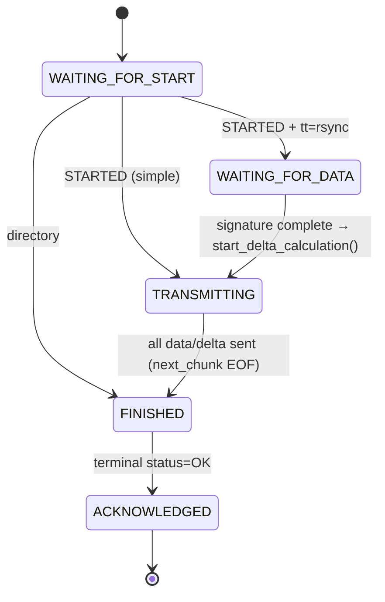
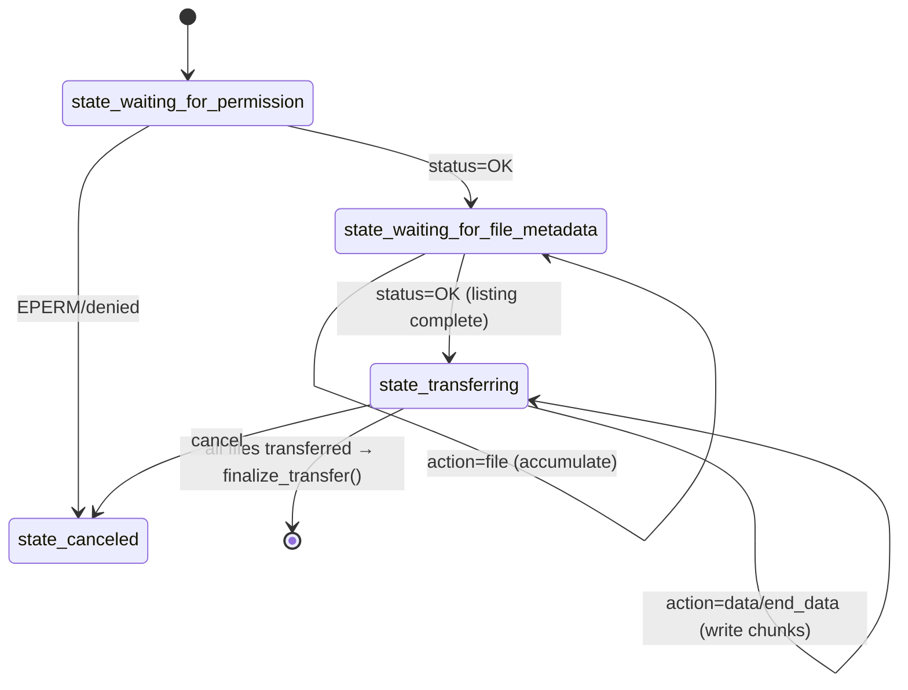
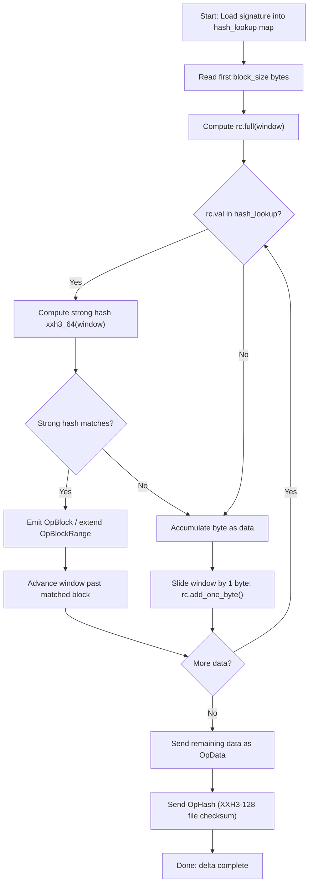
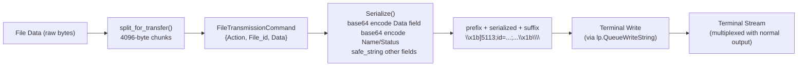
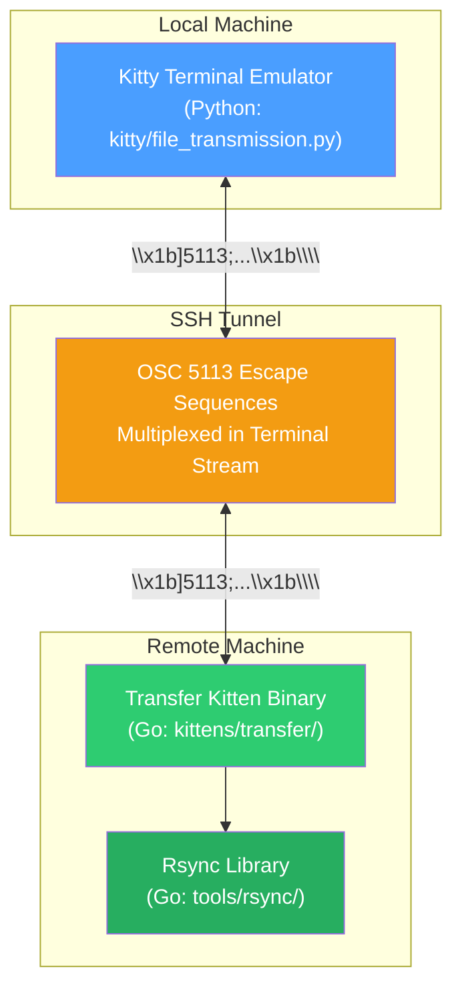

# Kitty File Transfer Protocol: A Technical Deep-Dive

> **Investigation Branch:** `kitty_815df1e210e0`
> **Scope:** Read-only code analysis of kitty's file transfer protocol over SSH
> **Constraint:** No source files were modified during this investigation

---

## Table of Contents and Question Traceability

This document answers each user question with code-backed evidence. The mapping below traces every question to the section(s) that answer it.

| # | User Question | Section(s) |
|---|---------------|------------|
| 1 | How do I build kitty from source? | §2 |
| 2 | How does the SSH kitten establish a connection and make transfer available? | §3 |
| 3 | How is a file transfer initiated? | §4 |
| 4 | How does the protocol handshake work? What are OSC 5113 escape sequences? | §5 |
| 5 | How does the rsync-style delta transfer work internally? | §7 |
| 6 | How is file data encoded, multiplexed in the terminal stream, and reassembled? | §8 |
| 7 | Does the protocol support transfer resumption after interruption? | §9 |
| — | How are sender and receiver state machines structured? | §6 |
| — | How does compression decision logic work? | §10 |
| — | How can delta transfer efficiency be demonstrated and measured? | §11 |

---

## 1. Introduction and Context

### 1.1 Purpose and Scope

This document traces the complete journey of file data through kitty's file transfer protocol, from the moment a user invokes `kitten transfer` through protocol handshake, rsync delta computation, base64 encoding inside OSC escape sequences, terminal stream multiplexing, and file reconstruction on the receiving end. Every claim is backed by specific source file citations.

### 1.2 Repository Orientation: Three-Language Architecture

Kitty is a GPU-accelerated terminal emulator built with a three-language architecture:

| Language | Role | Key Directories |
|----------|------|-----------------|
| **C** | Core rendering engine, performance-critical paths | `kitty/`, `glfw/`, `3rdparty/` |
| **Python** | Extensibility, configuration, terminal-emulator-side protocol handling | `kitty/*.py`, `kittens/*/__init__.py` |
| **Go** | CLI tooling, standalone "kitten" binaries (transfer, ssh, diff, etc.) | `kittens/*/`, `tools/` |

Source: The Go module is declared at `go.mod:1-3` as `module kitty` with `go 1.22`. Python requires `>=3.8` per `pyproject.toml:2`.

### 1.3 Module Map: File Transfer Components

The file transfer system spans three primary modules:

```
kittens/transfer/     ← Go kitten binary (sender + receiver CLI)
  ├── main.go         ← Entry point, direction dispatch
  ├── ftc.go          ← FileTransmissionCommand: protocol model, serialize/parse
  ├── send.go         ← Sender state machine, delta negotiation, chunk transmission
  ├── receive.go      ← Receiver state machine, signature generation, delta patching
  ├── utils.go        ← Bypass auth, compression heuristics, rsync stats
  └── algorithm.c     ← C rsync extension for Python side (xxh3 hashing)

tools/rsync/          ← Go rsync library
  ├── algorithm.go    ← Core: rolling_checksum, diff engine, BlockHash, Operations
  └── api.go          ← Public API: Patcher, Differ, signature/delta streaming

kitty/file_transmission.py  ← Python terminal-emulator side protocol handler
```

**Rationale:** The transfer kitten is compiled as a standalone Go binary that communicates with the kitty terminal emulator (Python) via OSC 5113 escape sequences embedded in the terminal data stream. The rsync library provides the delta transfer algorithm used by both sender and receiver.

---

## 2. Building Kitty from Source

### 2.1 Build Prerequisites

Building kitty requires three toolchains, as discovered from the build system:

| Prerequisite | Version | Source |
|--------------|---------|--------|
| Go toolchain | 1.22+ | `go.mod:3` — `go 1.22` |
| Python | ≥ 3.8 | `pyproject.toml:2` — `requires-python = ">=3.8"` |
| C compiler | C11 support (GCC or Clang) | `setup.py` — enforces `-std=c11` |

Source: `go.mod:3`, `pyproject.toml:2`

### 2.2 Run-Time Dependencies

When building against system libraries, the following run-time dependencies are required:

| Dependency | Minimum Version | Required Platform | Notes |
|------------|----------------|-------------------|-------|
| `python` | ≥ 3.8 | All | Core runtime |
| `harfbuzz` | ≥ 2.2.0 | All | Text shaping |
| `zlib` | — | All | **Also used for file transfer compression (RFC 1950 ZLIB)** |
| `libpng` | — | All | Image rendering |
| `liblcms2` | — | All | Color management |
| `libxxhash` | — | All | **XXH3 hashing used in rsync signatures/deltas** |
| `openssl` | — | All | **Used for bypass authentication encryption** |
| `freetype` | — | Linux | Font rendering |
| `fontconfig` | — | Linux | Font discovery |
| `libcanberra` | — | Linux | Sound notifications |
| `libsystemd` | — | Linux (optional) | Systemd integration |
| `ImageMagick` | — | All (optional) | Uncommon image formats |

Source: `docs/build.rst:81-94`

**Transfer-relevant dependencies** (highlighted in bold above):
- **zlib** — Used for `Compression_zlib` mode in the transfer protocol
- **libxxhash** — The C extension at `kittens/transfer/algorithm.c` uses xxhash for the Python-side rsync implementation
- **openssl** — Used by the `encode_bypass()` function's X25519+AES-GCM encryption

### 2.3 Build-Time Dependencies

| Dependency | Notes |
|------------|-------|
| `gcc` or `clang` | C11 support required |
| `simde` | SIMD everywhere — portable SIMD header library |
| `go` ≥ 1.22 | See `go.mod` for Go packages used during building |
| `pkg-config` | Build system dependency resolution |

**Linux-specific additional packages:**

```
libdbus-1-dev, libxcursor-dev, libxrandr-dev, libxi-dev, libxinerama-dev,
libgl1-mesa-dev, libxkbcommon-x11-dev, libfontconfig-dev, libx11-xcb-dev,
liblcms2-dev, libssl-dev, libpython3-dev, libxxhash-dev, libsimde-dev
```

Source: `docs/build.rst:97-121`

### 2.4 Build Commands

The standard build workflow is straightforward because `./dev.sh build` downloads pre-built binaries for major dependencies:

```bash
git clone https://github.com/kovidgoyal/kitty.git && cd kitty
./dev.sh build
```

Source: `docs/build.rst:17-19`

**Rationale:** The `./dev.sh build` command "downloads all the major dependencies of kitty as pre-built binaries for your platform and builds kitty to use these rather than system libraries." This means you typically only need a C compiler and Go — the build script handles the rest.

Source: `docs/build.rst:24-26`

**Debug and sanitizer builds:**
```bash
./dev.sh build --debug             # Build with debug symbols
./dev.sh build --debug --sanitize  # Build with sanitizers + debug symbols
```

Source: `docs/build.rst:52-58`

**Building documentation locally:**
```bash
./dev.sh deps -for-docs && ./dev.sh docs             # Build docs
./dev.sh deps -for-docs && ./dev.sh docs -live-reload  # Live-reload development
```

Source: `docs/build.rst:68-74`

### 2.5 Transfer-Relevant Build Artifacts

The build produces Go kitten binaries that are embedded into the kitty distribution. The transfer kitten (`kittens/transfer/`) is compiled as part of the Go build phase. The rsync library (`tools/rsync/`) is statically linked into the kitten binary.

The Go module at `go.mod:1` declares the module as `kitty` and includes these transfer-relevant dependencies:

| Go Module | Version | Purpose in Transfer |
|-----------|---------|---------------------|
| `github.com/zeebo/xxh3` | v1.0.2 | XXH3-64 strong hash and XXH3-128 checksum in rsync |
| `golang.org/x/exp` | v0.0.0-20230801 | `constraints` package used in generic helpers |
| `golang.org/x/sys` | v0.21.0 | Unix syscalls for metadata (UtimesNanoAt, Fchmodat) |

Source: `go.mod:3,16`

**Rationale:** The Go kitten binary is a self-contained executable. When deployed to a remote host via the SSH kitten, it carries the complete transfer and rsync implementation with no external Go dependencies at runtime. The xxh3 hash library is compiled directly into the binary.

### 2.6 Long-Term Source Build Considerations

If running kitty from source long-term:
- Run `./dev.sh deps` occasionally to update pre-built dependencies
- The built executable assumes source is in the original directory — if you move/rename the directory, run `make clean && ./dev.sh build`
- Create symlinks to `kitty` and `kitten` binaries from somewhere in your PATH

Source: `docs/build.rst:31-39`

---

## 3. Establishing an SSH Connection via the SSH Kitten

### 3.1 How `kitten ssh` Works

The SSH kitten is a thin wrapper around the traditional `ssh` command that adds automatic shell integration, configuration copying, and kitten binary deployment. It supports all the same options and arguments as standard `ssh`.

Source: `docs/kittens/ssh.rst:34-36`

The entry point is at `kittens/ssh/main.go`. It wraps the standard `ssh` command to provide enhanced functionality including shell integration and kitten binary availability on the remote host.

Source: `kittens/ssh/main.go:1-42` (imports and package declaration)

**Basic usage:**
```bash
kitten ssh some-hostname-to-connect-to
```

Source: `docs/kittens/ssh.rst:41`

### 3.2 Key SSH Kitten Features

| Feature | Description | Source |
|---------|-------------|--------|
| Automatic shell integration | Sets up shell integration on the remote host | `docs/kittens/ssh.rst:9` |
| Config cloning | Copies local shell/editor config to remote | `docs/kittens/ssh.rst:11` |
| Connection reuse | Re-uses existing connections to avoid setup latency | `docs/kittens/ssh.rst:13` |
| Kitten binary deployment | Makes kitten binary available on remote on demand | `docs/kittens/ssh.rst:15` |
| Color scheme changes | Can change terminal colors when connecting to remote | `docs/kittens/ssh.rst:17` |
| Remote control forwarding | Forwards kitty remote control socket | `docs/kittens/ssh.rst:19` |

Source: `docs/kittens/ssh.rst:9-19`

### 3.3 Bootstrap Mechanism

When you run `kitten ssh user@host`, the SSH kitten:

1. **Parses the destination** — extracts username and hostname from the SSH URL
   Source: `kittens/ssh/main.go:46-60` — `get_destination()` function
2. **Establishes the SSH connection** — invokes the system `ssh` binary with enhanced options
3. **Deploys kitten binary** — transfers a compressed tarball (using `archive/tar` and `compress/gzip`, as imported at `kittens/ssh/main.go:6,8`) containing the kitten binary and shell integration scripts to the remote host
4. **Sets up shell integration** — configures the remote shell to recognize kitty-specific features, including the terminfo database

The SSH kitten can be configured via `~/.config/kitty/ssh.conf`:

```conf
copy .zshrc .vimrc .vim
hostname someserver-*
env SOMETHING=else
```

Source: `docs/kittens/ssh.rst:59-79`

### 3.4 How This Makes `kitten transfer` Available

Once the SSH kitten bootstraps onto the remote host, the kitten binary is available at a known path. This means `kitten transfer` can be invoked on either side of the SSH connection.

The transfer kitten communicates with the kitty terminal emulator through the SSH tunnel using OSC 5113 escape sequences — the SSH tunnel is transparent to the protocol because escape sequences travel through the terminal stream like any other data.

Alternatively, if the SSH kitten is not used, you can install the kitten binary manually:
> "You can install the kitten binary on the remote machine yourself, it is a standalone, statically compiled binary available from the kitty releases page."

Source: `docs/kittens/transfer.rst:52-54`



**Rationale:** The SSH tunnel is just a bidirectional byte pipe. Terminal escape sequences (including OSC 5113 transfer commands) pass through it unchanged. The kitty terminal emulator on the local machine parses these escape sequences from the terminal stream and routes transfer-related ones to its `FileTransmission` handler (`kitty/file_transmission.py`).

Reference: `docs/kittens/ssh.rst` for user-facing guide

---

## 4. Initiating a File Transfer

### 4.1 Entry Point: `main()`

The transfer kitten entry point is defined at `kittens/transfer/main.go:46`:

```go
func main(cmd *cli.Command, opts *Options, args []string) (rc int, err error) {
```

Source: `kittens/transfer/main.go:46`

### 4.2 Direction Dispatch

The `main()` function routes execution based on `opts.Direction`:

```go
case "send", "download": err, rc = send_main(opts, args)
default:                  err, rc = receive_main(opts, args)
```

Source: `kittens/transfer/main.go:57-62`

**Rationale:** The "send" direction means the kitten is sending files *to* the terminal emulator. The "download" direction is an alias for sending (the local machine downloads from the perspective of the user). The default case handles "receive", where the kitten receives files *from* the terminal emulator.

### 4.3 Password/Bypass Handling: `read_bypass()`

Before dispatching, `main()` reads the bypass password if provided:

```go
val, err := read_bypass(opts.PermissionsBypass)
```

Source: `kittens/transfer/main.go:47-53`

The `read_bypass()` function at `kittens/transfer/main.go:18-44` supports multiple input sources:

| Input Format | Behavior |
|-------------|----------|
| Integer `0-255` | Reads from file descriptor number |
| `-` | Reads from stdin |
| Path starting with `.`, `~`, `/` | Reads from file |
| Other string | Uses the string directly as password |

Source: `kittens/transfer/main.go:18-44`

### 4.4 Entry Point Registration

The kitten registers itself with the CLI framework:

```go
func EntryPoint(parent *cli.Command) {
    create_cmd(parent, main)
}
```

Source: `kittens/transfer/main.go:69-71`

### 4.5 File Discovery: `files_for_send()`

Before the transfer begins, the sender discovers all files to be transferred. The `files_for_send()` function scans the specified paths and produces a list of `File` structs:

The `File` struct tracks per-file state including `file_size`, `file_type`, `rsync_capable`, `compression_capable`, and rsync delta fields (`differ *rsync.Differ`, `delta_loader func() error`, `deltabuf *bytes.Buffer`), plus `state FileState` and `ttype TransmissionType`.

Source: `kittens/transfer/send.go:83-108`

**Key file attribute decisions at `NewFile()`:**

| Attribute | Condition | Source |
|-----------|-----------|--------|
| `rsync_capable` | `file_type == FileType_regular && stat_result.Size() > 4096` | `send.go:131` |
| `compression_capable` | `rsync_capable && should_be_compressed(path, opts.Compress)` | `send.go:132` |

Hard link detection: If multiple paths point to the same inode (detected via `os.Stat().Sys().(*syscall.Stat_t).Ino`), subsequent files are marked as `FileType_link` with a reference to the first file's ID. This avoids transferring the same data multiple times.

Source: `kittens/transfer/send.go:138-180`

### 4.6 Transfer Kitten User Guide Reference

The user guide at `docs/kittens/transfer.rst` provides usage examples:

**Download from remote:**
```bash
<local>  $ kitten ssh my-remote-computer
<remote> $ kitten transfer some-file /path/on/local/computer
```

**Upload to remote:**
```bash
<local>  $ kitten ssh my-remote-computer
<remote> $ kitten transfer --direction=upload /path/on/local/computer remote-file
```

Source: `docs/kittens/transfer.rst:30-47`

**Delta transfer mode:**
```bash
kitten transfer --transmit-deltas file.txt remote:dest/
```

Source: `docs/kittens/transfer.rst:80-82`

### 4.7 Entry Point Dispatch Flowchart



---

## 5. Protocol Handshake and Escape Sequences

### 5.1 OSC 5113 Escape Sequence Format

The file transfer protocol uses Operating System Command (OSC) escape sequences with the code **5113**. The wire format is:

```
\x1b]5113;key=value;key=value...\x1b\\
 │  │              │            │
 │  │              │            └─ ST (String Terminator): 0x1b 0x5c
 │  │              └────────────── Semicolon-separated key=value pairs
 │  └───────────────────────────── 5113 (protocol code)
 └──────────────────────────────── OSC (Operating System Command): 0x1b 0x5d
```

Source: `docs/file-transfer-protocol.rst:543-546`

> The number `5113` is the "numeralization" of the word "file".

Source: `docs/file-transfer-protocol.rst:551-552`

### 5.2 Key Abbreviation Table

Keys are abbreviated for reduced overhead. The full mapping:

| Full Key | Wire Abbrev. | Value Type | Notes |
|----------|-------------|------------|-------|
| action | `ac` | enum | send, file, data, end_data, receive, cancel, status, finish |
| compression | `zip` | enum | none, zlib |
| file_type | `ft` | enum | regular, directory, symlink, link |
| transmission_type | `tt` | enum | simple, rsync |
| id | `id` | safe_string | Unique-ish session identifier |
| file_id | `fid` | safe_string | Unique per file in session |
| bypass | `pw` | safe_string | Encrypted password hash |
| quiet | `q` | integer | 0=verbose, 1=only errors, 2=silent |
| mtime | `mod` | integer | Nanoseconds since UNIX epoch |
| permissions | `prm` | integer | UNIX permission bits |
| size | `sz` | integer | Size in bytes |
| name | `n` | base64_string | File path |
| status | `st` | base64_string | Status messages |
| parent | `pr` | safe_string | Parent directory file_id |
| data | `d` | base64_bytes | Binary data |

Source: `docs/file-transfer-protocol.rst:558-576`

### 5.3 Value Types

| Type | Description | Example |
|------|-------------|---------|
| enum | One from permitted set | `ac=file` |
| safe_string | Characters from `[0-9a-zA-Z_:./@-]` only | `id=abc123` |
| integer | Base-10 number, optionally negative | `sz=4096` |
| base64_string | Base64-encoded UTF-8 string (no padding) | `n=c29tZWZpbGU` |
| base64_bytes | Base64-encoded binary data (no padding) | `d=AQID` |

Source: `docs/file-transfer-protocol.rst:582-601`

### 5.4 `FileTransmissionCommand` Struct

The Go struct that models a transfer command is defined at `kittens/transfer/ftc.go:120-138`:

The struct has 15 fields including `Action`, `Compression`, `Ftype`, `Ttype`, `Quiet`, `Id`, `File_id`, `Bypass`, `Name`, `Status`, `Parent`, `Mtime`, `Permissions`, `Size`, and `Data []byte`. Each field carries JSON tags mapping to wire abbreviations (e.g., `json:"ac,omitempty"`) and optional `encoding:"base64"` tags on `Bypass`, `Name`, and `Status`.

Source: `kittens/transfer/ftc.go:120-138`

**Key design observations:**
- JSON tags map field names to wire abbreviations (e.g., `json:"ac,omitempty"`)
- Fields tagged `encoding:"base64"` are base64-encoded during serialization: `Bypass`, `Name`, `Status`
- The `Data` field (type `[]byte`) is always base64-encoded
- Enum fields (`Action`, `Compression`, `FileType`, `TransmissionType`, `QuietLevel`) implement the `Serializable` interface

### 5.5 Serialization: `Serialize()` Method

The `Serialize()` method at `kittens/transfer/ftc.go:163-222` uses Go reflection to iterate over struct fields and produce a semicolon-separated key=value string.

**Serialization logic by field type:**

| Field Kind | Encoding Logic | Source Line |
|-----------|----------------|-------------|
| `reflect.String` with `encoding:"base64"` tag | `base64.RawStdEncoding.EncodeToString()` | `ftc.go:179-181` |
| `reflect.String` without base64 tag | `safe_string()` sanitization | `ftc.go:182` |
| `reflect.Slice` of `uint8` (i.e., `[]byte`) | `base64.RawStdEncoding.EncodeToString()` | `ftc.go:188-190` |
| `reflect.Int64` | `strconv.FormatInt(val, 10)` | `ftc.go:193-195` |
| `fs.FileMode` | `strconv.FormatInt(int64(perm), 10)` | `ftc.go:199-202` |
| `Serializable` enum | `field.String()` | `ftc.go:203-206` |

**Optional OSC code prefix:** When `prefix_with_osc_code` is `true`, the output starts with `"5113"` (the `kitty.FileTransferCode` constant).

Source: `kittens/transfer/ftc.go:167-170`

**Safe string sanitization:** The `safe_string()` function strips any character not matching `[0-9a-zA-Z_:./@-]`:

```go
regexp.MustCompile(`[^0-9a-zA-Z_:./@-]`)
```

Source: `kittens/transfer/ftc.go:155-161`

### 5.6 Worked Example: Serialization Cycle

The protocol spec provides this example at `docs/file-transfer-protocol.rst:604-614`:

**Input (human-readable):**
```
action=send id=test name=somefile size=3 data=01 02 03
```

**Serialized output:**
```
<OSC> 5113 ; ac=send ; id=test ; n=c29tZWZpbGU ; sz=3 ; d=AQID <ST>
```

Let us trace through `Serialize()` step by step for this command:

```go
ftc := FileTransmissionCommand{Action: Action_send, Id: "test", Name: "somefile", Size: 3, Data: []byte{0x01, 0x02, 0x03}}
result := ftc.Serialize(true) // → "5113;ac=send;id=test;n=c29tZWZpbGU;sz=3;d=AQID"
```

**Step-by-step encoding:**

1. **`prefix_with_osc_code=true`** → prepend `"5113"`, set `found=true`
2. **`Action=Action_send`** → `Serializable.String()` returns `"send"` → append `";ac=send"`
3. **`Id="test"`** → no base64 tag → `safe_string("test")` = `"test"` → append `";id=test"`
4. **`Name="somefile"`** → has `encoding:"base64"` tag → `base64.RawStdEncoding.EncodeToString("somefile")` = `"c29tZWZpbGU"` → append `";n=c29tZWZpbGU"`
5. **`Size=3`** → `strconv.FormatInt(3, 10)` = `"3"` → append `";sz=3"`
6. **`Data=[0x01,0x02,0x03]`** → `base64.RawStdEncoding.EncodeToString(...)` = `"AQID"` → append `";d=AQID"`

Note: `RawStdEncoding` uses standard base64 alphabet **without padding** (no `=` suffix).

### 5.7 Parsing: `NewFileTransmissionCommand()`

The parser at `kittens/transfer/ftc.go:231-324` reverses the serialization:

1. Scans for `key=value` pairs separated by `;`
   Source: `kittens/transfer/ftc.go:295-316`
2. Looks up each key in `ftc_field_map()` (the JSON tag → struct field mapping)
   Source: `kittens/transfer/ftc.go:242`
3. Decodes values based on field type:
   - base64-tagged strings → `base64.RawStdEncoding.DecodeString()`
   - Other strings → `safe_string()` sanitization
   - `[]byte` → `base64.RawStdEncoding.DecodeString()`
   - `int64` → `strconv.ParseInt()`
   - Enums → `field.SetString()`
   - `fs.FileMode` → `strconv.ParseUint()`

Source: `kittens/transfer/ftc.go:244-288`

### 5.8 Session Initiation Flow

#### Sender Side

1. **`send_loop()`** creates a `SendHandler` with a `SendManager` containing `request_id: random_id()`.
   Source: `kittens/transfer/send.go:1208-1210`

2. **`random_id()`** generates a PID-prefixed hex identifier via `fmt.Sprintf("%x%s", os.Getpid(), hex.EncodeToString(bytes))`.
   Source: `kittens/transfer/utils.go:76-80`

3. **`SendManager.initialize()`** constructs the OSC prefix and suffix:
   ```go
   self.prefix = fmt.Sprintf("\x1b]%d;id=%s;", kitty.FileTransferCode, self.request_id)
   self.suffix = "\x1b\\"
   ```
   Source: `kittens/transfer/send.go:384-385`

4. **`SendManager.start_transfer()`** serializes the initial handshake: `FileTransmissionCommand{Action: Action_send, Bypass: self.bypass}.Serialize()`.
   Source: `kittens/transfer/send.go:363-365`

#### Receiver Side

1. **`receive_loop()`** similarly constructs prefix and suffix:
   ```go
   handler.manager.prefix = fmt.Sprintf("\x1b]%d;id=%s;", kitty.FileTransferCode, handler.manager.request_id)
   ```
   Source: `kittens/transfer/receive.go:1089`

2. **`manager.start_transfer()`** sends the initial receive command:
   Source: `kittens/transfer/receive.go:1099`

#### Permission Negotiation

The terminal emulator responds with `status=OK` or an error:

- **Sender** checks in `on_file_transfer_response()`:
  ```go
  if ftc.Status == "OK" {
      self.state = SEND_PERMISSION_GRANTED
  }
  ```
  Source: `kittens/transfer/send.go:799-800`

- **Receiver** transitions on OK:
  ```go
  if ftc.Status == `OK` {
      self.state = state_waiting_for_file_metadata
  }
  ```
  Source: `kittens/transfer/receive.go:553-554`

### 5.9 Protocol Handshake Sequence Diagram

```mermaid
sequenceDiagram
    participant Sender as Transfer Kitten (Sender)
    participant Terminal as Kitty Terminal Emulator
    participant Receiver as Transfer Kitten (Receiver)

    Note over Sender,Terminal: === SEND SESSION ===
    Sender->>Terminal: OSC 5113; ac=send; id=<req_id>; pw=<bypass> ST
    Terminal-->>Sender: OSC 5113; ac=status; id=<req_id>; st=OK ST
    Note over Sender: state → SEND_PERMISSION_GRANTED
    Sender->>Terminal: OSC 5113; ac=file; id=<req_id>; fid=f1; n=<base64_path>; sz=<size> ST
    Terminal-->>Sender: OSC 5113; ac=status; id=<req_id>; fid=f1; st=STARTED ST
    Note over Sender: file state → TRANSMITTING (or WAITING_FOR_DATA if rsync)
    Sender->>Terminal: OSC 5113; ac=data; id=<req_id>; fid=f1; d=<base64_chunk> ST
    Sender->>Terminal: OSC 5113; ac=end_data; id=<req_id>; fid=f1; d=<base64_chunk> ST
    Terminal-->>Sender: OSC 5113; ac=status; id=<req_id>; fid=f1; st=OK ST
    Note over Sender: file state → ACKNOWLEDGED
    Sender->>Terminal: OSC 5113; ac=finish; id=<req_id> ST

    Note over Terminal,Receiver: === RECEIVE SESSION ===
    Receiver->>Terminal: OSC 5113; ac=receive; id=<req_id>; sz=<num_paths> ST
    Receiver->>Terminal: OSC 5113; ac=file; id=<req_id>; fid=f1; n=<base64_path> ST
    Terminal-->>Receiver: OSC 5113; ac=status; id=<req_id>; st=OK ST
    Note over Receiver: state → state_waiting_for_file_metadata
    Terminal-->>Receiver: OSC 5113; ac=file; id=<req_id>; fid=f1; st=<file_id>; ... ST
    Terminal-->>Receiver: OSC 5113; ac=status; id=<req_id>; st=OK; n=<home_path> ST
    Note over Receiver: state → state_transferring
    Receiver->>Terminal: OSC 5113; ac=file; id=<req_id>; fid=f1; n=<path> ST
    Terminal-->>Receiver: OSC 5113; ac=data; ...; d=<chunk> ST
    Terminal-->>Receiver: OSC 5113; ac=end_data; ...; d=<chunk> ST
```

### 5.10 Terminal-Emulator-Side Command Handling

On the Python terminal-emulator side, the `FileTransmission` class at `kitty/file_transmission.py:803` manages all active transfer sessions:

The class manages concurrent sessions via `self.active_receives: Dict[str, ActiveReceive]` and `self.active_sends: Dict[str, ActiveSend]` dicts, keyed by session `request_id`.

Source: `kitty/file_transmission.py:803-808`

**Command dispatch** in `handle_serialized_command()`:

1. Deserialize the incoming command: `cmd = FileTransmissionCommand.deserialize(data)`
   Source: `kitty/file_transmission.py:860`
2. Check for cancel action first (handles both receives and sends)
   Source: `kitty/file_transmission.py:868-874`
3. Route based on action type:
   - `Action.send` or existing receive ID → `handle_receive_cmd(cmd)` (the terminal is *receiving* files)
   - `Action.receive` or existing send ID → `handle_send_cmd(cmd)` (the terminal is *sending* files)
   Source: `kitty/file_transmission.py:876-879`

**Rationale:** The naming convention can be confusing. From the terminal emulator's perspective:
- `ActiveReceive` handles a session where the kitten is **sending** files (the terminal **receives**)
- `ActiveSend` handles a session where the kitten is **receiving** files (the terminal **sends**)

**Session management:**
- Sessions expire after `EXPIRE_TIME = 10` minutes of inactivity
  Source: `kitty/file_transmission.py:28`
- Maximum concurrent sessions: `MAX_ACTIVE_RECEIVES = MAX_ACTIVE_SENDS = 10`
  Source: `kitty/file_transmission.py:29`
- Expired sessions are pruned in `prune_expired()`
  Source: `kitty/file_transmission.py:850-856`

### 5.11 Python-Side `FileTransmissionCommand` (Dataclass Mirror)

The Python side has its own `FileTransmissionCommand` as a Python dataclass at `kitty/file_transmission.py:251-268`:

The Python dataclass mirrors the Go struct with 15 fields. Key pattern: `metadata={'sname': 'ac'}` maps to Go's `json:"ac,omitempty"`, and `metadata={'base64': True}` maps to Go's `encoding:"base64"`.

Source: `kitty/file_transmission.py:251-268`

This mirrors the Go `FileTransmissionCommand` struct exactly, with `metadata={'sname': 'ac'}` corresponding to Go's `json:"ac,omitempty"` tags, and `metadata={'base64': True}` corresponding to Go's `encoding:"base64"` tags.

The Python serialization at `kitty/file_transmission.py:293-326` follows the same logic as Go:
- Enum fields → `val.name`
- `bytes` fields → `base64_encode(val)`
- `str` fields with `base64: True` → `base64_encode(val.encode('utf-8'))`
- `str` fields without base64 → `safe_string(val)`
- `int` fields → `str(val)`

Source: `kitty/file_transmission.py:293-326`

### 5.12 Bypass Authentication: `encode_bypass()`

The bypass mechanism uses X25519 public key encryption (not the SHA256 scheme from the protocol spec).

The function concatenates `request_id + ";" + bypass`, reads `KITTY_PUBLIC_KEY` from the environment, and encrypts via `crypto.Encrypt_data()`, returning `"kitty-1:" + encrypted_data`.

Source: `kittens/transfer/utils.go:37-51`

**Process:**
1. Concatenates `request_id + ";" + bypass`
2. Reads the `KITTY_PUBLIC_KEY` environment variable
3. Decodes the public key using `crypto.DecodePublicKey()`
4. Encrypts the concatenated string using `crypto.Encrypt_data()` (X25519 + AES-GCM)
5. Returns with prefix `"kitty-1:"`

**Rationale:** The protocol spec at `docs/file-transfer-protocol.rst:534-538` notes that terminal implementations are free to use their own schemes with non-`sha` prefixes. Kitty uses public key encryption via `KITTY_PUBLIC_KEY` instead of the basic SHA256 hashing, providing stronger security guarantees.

### 5.13 Bypass Verification on Terminal-Emulator Side

The terminal emulator verifies bypass data in `check_bypass()` at `kitty/file_transmission.py:557-580`:

The function partitions `bypass_data` on `:` to determine the protocol. For `kitty-1:`, it performs X25519+AES-GCM decryption with a 5-minute timestamp window (`abs(delta) > 5 * 60 * 1e9`). For `sha256:`, it falls back to simple SHA256 hash comparison.

Source: `kitty/file_transmission.py:557-580`

**Two-protocol support:**
1. `kitty-1:` prefix → X25519+AES-GCM public key decryption with timestamp verification (5-minute window)
2. `sha256:` prefix → Simple SHA256 hash comparison (fallback, matches protocol spec)

The `kitty-1` protocol is the default when `KITTY_PUBLIC_KEY` is available. It provides:
- **Forward secrecy** via X25519 key exchange
- **Replay protection** via a 5-minute timestamp window (`abs(delta) > 5 * 60 * 1e9`)
- **Authenticated encryption** via AES-256-GCM

Source: `kitty/file_transmission.py:559-572`

### 5.14 Avoiding the Confirmation Prompt

The user guide documents the bypass setup process:

1. Set the `file_transfer_confirmation_bypass` option in kitty.conf to some password
2. When invoking the kitten, use `--permissions-bypass` to supply the password

Source: `docs/kittens/transfer.rst:60-69`

> **Security warning:** Using a password to bypass confirmation means any software running on the remote machine could potentially learn that password and gain full access to your computer.

Source: `docs/kittens/transfer.rst:72-74`

---

## 6. Sender and Receiver State Machines

### 6.1 Sender File State Machine

Each file being transferred has a `FileState` that tracks its progress:

The five states are: `WAITING_FOR_START`(0) → `WAITING_FOR_DATA`(1) → `TRANSMITTING`(2) → `FINISHED`(3) → `ACKNOWLEDGED`(4).

Source: `kittens/transfer/send.go:35-43`

**State transitions:**

| From | Event | To | Source |
|------|-------|-----|--------|
| `WAITING_FOR_START` | Terminal responds `status=STARTED` with `tt=rsync` | `WAITING_FOR_DATA` | `send.go:716-717` |
| `WAITING_FOR_START` | Terminal responds `status=STARTED` without rsync | `TRANSMITTING` | `send.go:718-719` |
| `WAITING_FOR_START` | File is a directory | `FINISHED` | `send.go:714` |
| `WAITING_FOR_DATA` | Signature data fully received, delta calculation started | `TRANSMITTING` | `send.go:760` |
| `TRANSMITTING` | All file data/delta sent | `FINISHED` | `send.go:968` |
| `FINISHED` | Terminal acknowledges with `status=OK` | `ACKNOWLEDGED` | `send.go:736` |



### 6.2 Sender Session State Machine

The overall send session has its own state:

`SendState` has 4 values: `SEND_WAITING_FOR_PERMISSION` (0), `SEND_PERMISSION_GRANTED` (1), `SEND_PERMISSION_DENIED` (2), `SEND_CANCELED` (3).

Source: `kittens/transfer/send.go:277-284`

### 6.3 Receiver State Machine

The four states are: `state_waiting_for_permission`(0) → `state_waiting_for_file_metadata`(1) → `state_transferring`(2) → `state_canceled`(3).

Source: `kittens/transfer/receive.go:34-41`

**State transitions:**

| From | Event | To | Source |
|------|-------|-----|--------|
| `state_waiting_for_permission` | Terminal responds `status=OK` | `state_waiting_for_file_metadata` | `receive.go:553-554` |
| `state_waiting_for_permission` | Terminal responds with error | Error/cancel | `receive.go:556` |
| `state_waiting_for_file_metadata` | `action=file` received | (accumulate file list) | `receive.go:581-595` |
| `state_waiting_for_file_metadata` | Second `status=OK` received | `state_transferring` | `receive.go:574-577` |
| `state_transferring` | `action=data/end_data` received | (write data to files) | `receive.go:599-616` |
| `state_transferring` | All files complete | Finalize transfer | `receive.go:613-614` |
| Any | User cancels | `state_canceled` | — |



---

## 7. Rsync-Style Delta Transfer Internals

### 7.1 Data Structures

#### 7.1.1 `BlockHash` (20 bytes)

The `BlockHash` struct represents one block's signature in the rsync signature:

```go
type BlockHash struct { Index uint64; WeakHash uint32; StrongHash uint64 }
const BlockHashSize = 20
```

Source: `tools/rsync/algorithm.go:177-183`

**Byte layout (little-endian):**

| Offset | Size (bytes) | Type | Field | Description |
|--------|-------------|------|-------|-------------|
| 0 | 8 | uint64 | `Index` | Zero-based block number |
| 8 | 4 | uint32 | `WeakHash` | Rolling checksum (fast, collision-prone) |
| 12 | 8 | uint64 | `StrongHash` | XXH3-64 hash (collision-resistant) |

**Serialization** writes `Index`, `WeakHash`, `StrongHash` in order using little-endian encoding via `bin.PutUint64`/`bin.PutUint32`.

Source: `tools/rsync/algorithm.go:186-190`

#### 7.1.2 Signature Header (12 bytes)

The signature begins with a 12-byte header that describes the algorithm parameters:

| Offset | Size (bytes) | Type | Field | Current Value | Meaning |
|--------|-------------|------|-------|---------------|---------|
| 0 | 2 | uint16 | `version` | 0 | Protocol version |
| 2 | 2 | uint16 | `checksum_type` | 0 | XXH3-128 (file integrity) |
| 4 | 2 | uint16 | `strong_hash_type` | 0 | XXH3-64 (block identity) |
| 6 | 2 | uint16 | `weak_hash_type` | 0 | Rsync rolling checksum |
| 8 | 4 | uint32 | `block_size` | `√file_size` | Bytes per block |

**Written** in `Patcher.CreateSignatureIterator()` using `bin.PutUint16`/`bin.PutUint32` to serialize version, `Checksum_type`, `Strong_hash_type`, `Weak_hash_type`, and `BlockSize` in order.

Source: `tools/rsync/api.go:205-209`

**Parsed** in `Api.read_signature_header()` at `tools/rsync/api.go:71-109`.

#### 7.1.3 Operation Types

Operations are the units of the delta stream. Each starts with a 1-byte type discriminator:

`OpType` is a single byte: `OpBlock` (0), `OpData` (1), `OpHash` (2), `OpBlockRange` (3).

Source: `tools/rsync/algorithm.go:31-38`

**OpBlock** — Copy one existing block (9 bytes):

| Offset | Size | Type | Field |
|--------|------|------|-------|
| 0 | 1 | byte | Type = 0 (`OpBlock`) |
| 1 | 8 | uint64 | `BlockIndex` |

**OpData** — New/changed data (5 + N bytes):

| Offset | Size | Type | Field |
|--------|------|------|-------|
| 0 | 1 | byte | Type = 1 (`OpData`) |
| 1 | 4 | uint32 | Payload size (N) |
| 5 | N | []byte | Payload data |

**OpHash** — File integrity checksum (3 + N bytes):

| Offset | Size | Type | Field |
|--------|------|------|-------|
| 0 | 1 | byte | Type = 2 (`OpHash`) |
| 1 | 2 | uint16 | Checksum size (N) |
| 3 | N | []byte | XXH3-128 checksum |

**OpBlockRange** — Copy a range of consecutive blocks (13 bytes):

| Offset | Size | Type | Field |
|--------|------|------|-------|
| 0 | 1 | byte | Type = 3 (`OpBlockRange`) |
| 1 | 8 | uint64 | Start `BlockIndex` |
| 9 | 4 | uint32 | Count of additional blocks |

Source: `tools/rsync/algorithm.go:96-125`

**`Operation` struct:** Contains `Type OpType`, `BlockIndex uint64`, `BlockIndexEnd uint64`, and `Data []byte`.

Source: `tools/rsync/algorithm.go:72-77`

### 7.2 Signature Generation

#### 7.2.1 Low-Level: `signature_iterator`

The `signature_iterator` struct (fields: `hasher hash.Hash64`, `buffer []byte`, `src io.Reader`, `rc rolling_checksum`, `index uint64`) generates one `BlockHash` per `next()` call.

Source: `tools/rsync/algorithm.go:238-244`

The `next()` method reads one `block_size` chunk, computes `WeakHash` via `rc.full(data)`, computes `StrongHash` via `hasher.Sum64()`, and returns `BlockHash{Index, WeakHash, StrongHash}` with incrementing index.

```go
ans = BlockHash{Index: self.index, WeakHash: self.rc.full(b), StrongHash: self.hasher.Sum64()}
```

Source: `tools/rsync/algorithm.go:247-264`

#### 7.2.2 High-Level API: `Patcher.CreateSignatureIterator()`

The public API wraps the low-level iterator, prepending the 12-byte header:

- **First call:** Writes the 12-byte signature header, then the first `BlockHash`
- **Subsequent calls:** Writes one 20-byte `BlockHash` per call
- **Final call:** Returns `io.EOF`

Source: `tools/rsync/api.go:195-227`

#### 7.2.3 Block Size Calculation

The block size is computed in `NewPatcher()`:

```go
bs = int(math.Round(math.Sqrt(float64(sz))))
```

Capped at `MaxBlockSize` (1 MB = 1,048,576 bytes):

```go
ans.rsync.BlockSize = min(bs, MaxBlockSize)
```

Source: `tools/rsync/api.go:270-277`

**Rationale:** Using the square root of file size balances signature size (smaller blocks = more hashes) against delta granularity (larger blocks = coarser matching). For a 100 MB file, block size ≈ 10,000 bytes; for a 1 TB file, block size caps at 1 MB.

### 7.3 `rolling_checksum` Implementation

The rolling checksum enables O(1) per-byte window sliding, which is the key efficiency insight of the rsync algorithm.

Fields: `alpha`, `beta`, `val`, `l` (all `uint32`), and `first_byte_of_previous_window uint32`.

Source: `tools/rsync/algorithm.go:336-339`

**Full computation** (`full(data)`) computes `alpha` = sum of bytes, `beta` = weighted sum, then `val = alpha + _M*beta` where `_M = 1 << 16`.

Source: `tools/rsync/algorithm.go:341-353`

**Rolling update** (`add_one_byte(first_byte, last_byte)`) adjusts alpha/beta in O(1) by subtracting the outgoing byte's contribution and adding the incoming byte:

```go
self.alpha = (self.alpha - self.first_byte_of_previous_window + uint32(last_byte)) % _M
self.beta = (self.beta - (self.l)*self.first_byte_of_previous_window + self.alpha) % _M
```

Source: `tools/rsync/algorithm.go:355-360`

**Rationale:** The rolling update removes the contribution of the outgoing byte and adds the incoming byte, both in O(1) time. This avoids re-hashing the entire block for each position, making the sliding window search over the entire file computationally feasible. This is based on the classic rsync algorithm described at https://rsync.samba.org/tech_report/node3.html.

### 7.4 Delta Computation

#### 7.4.1 The `diff` Engine

The `diff` struct at `tools/rsync/algorithm.go:362-378` is the core delta computation engine:

Key fields: `hash_lookup map[uint32][]BlockHash` (weak hash → matching blocks), `source io.Reader`, `hasher hash.Hash64`, `checksummer hash.Hash`, `rc rolling_checksum`, and `pending_op *Operation` for combining consecutive block operations.

Source: `tools/rsync/algorithm.go:362-378`

**Initialization** in `rsync.CreateDiff()` builds the `hash_lookup` map from the signature, keyed by `WeakHash`:

```go
ans.hash_lookup[h.WeakHash] = append(ans.hash_lookup[h.WeakHash], h)
```

Source: `tools/rsync/algorithm.go:614-627`

**Key insight:** The `hash_lookup` map is built from the signature's `BlockHash` entries, keyed by `WeakHash`. Multiple blocks can share the same weak hash (collisions), so the value is a slice.

#### 7.4.2 Core Algorithm: `diff.read_next()`

The heart of delta computation at `tools/rsync/algorithm.go:533-569`:

For each byte position: compute rolling checksum → look up weak hash in `hash_lookup` → if found, compute strong hash and verify → on match emit `OpBlock`; on miss accumulate byte for `OpData`.

**Detailed flow:**

1. **First call** (`window.sz == 0`): Read `block_size` bytes, compute `rc.full()` on the window
   Source: `algorithm.go:544-553`

2. **Subsequent calls** (`window.sz > 0`): Slide window by 1 byte using `rc.add_one_byte()`
   Source: `algorithm.go:541-543`

3. **Hash lookup**: Checks `self.hash_lookup[self.rc.val]` for weak match, then verifies via `find_hash()` with strong hash.
   Source: `algorithm.go:556-558`

4. **On match**: Sends accumulated data as `OpData`, then enqueues `Operation{Type: OpBlock, BlockIndex: block_index}` and resets the window.
   Source: `algorithm.go:559-567`

5. **On finish**: Send remaining data + `OpHash` checksum:
   Source: `algorithm.go:518-529`

#### 7.4.3 OpBlock Combining: `diff.enqueue()`

Consecutive `OpBlock` operations with adjacent indices are merged into `OpBlockRange`:

When an `OpBlock` arrives and the pending operation is also an `OpBlock` with `BlockIndex+1 == op.BlockIndex`, the two are merged into an `OpBlockRange`. If the pending operation is already an `OpBlockRange` with consecutive end index, it is extended by incrementing `BlockIndexEnd`.

Source: `tools/rsync/algorithm.go:400-434`

**Rationale:** Merging consecutive blocks reduces the number of operations in the delta stream. Instead of N individual `OpBlock` (9 bytes each), a single `OpBlockRange` (13 bytes) covers all N blocks.

#### 7.4.4 Hash Matching Deep Dive: `find_hash()`

When the rolling checksum produces a weak hash match, the `find_hash()` function at `tools/rsync/algorithm.go` performs the strong hash verification:

1. The `hash_lookup` map returns a slice of `BlockHash` entries that share the same `WeakHash`
2. For each entry in the slice, the strong hash (`xxh3_64` of the current window) is compared
3. If a strong hash match is found, the block's `Index` is returned
4. If no strong match is found among weak hash collisions, the block is treated as new data

**Collision handling:** Multiple blocks can share the same 32-bit `WeakHash` (probability ≈ 1/2³² ≈ 2.3×10⁻¹⁰ per pair, but increases with number of blocks). The `[]BlockHash` slice per weak hash key handles this. The strong hash (`xxh3_64`, 64 bits) provides the definitive match — the probability of a false positive on both hashes simultaneously is astronomically low (~2⁻⁹⁶).

**Hash computation for the window:**
```go
self.hasher.Reset()
self.hasher.Write(self.buffer[self.window.pos : self.window.pos+self.window.sz])
strong := self.hasher.Sum64()
```

The hasher is an `xxh3_64` hash function (from `github.com/zeebo/xxh3` v1.0.2), used consistently for both signature generation and delta computation.

Source: `tools/rsync/algorithm.go:556-558`, `go.mod:16`

#### 7.4.5 Window Management in the `diff` Engine

The diff engine maintains a sliding window over the source file data:

```
buffer:  [   window   ][   data region   ][   unused   ]
          ↑ window.pos  ↑ data.pos         ↑ data.pos + data.sz
          window.sz = block_size
```

- `window.pos` and `window.sz` define the current comparison window
- `data.pos` and `data.sz` track pending unmatched bytes for `OpData` emission
- When a block match is found, the window jumps past the matched block and `data.sz` resets
- When no match is found, `data.sz` grows by one byte as the window slides

The buffer is allocated as `make([]byte, 0, block_size * DataSizeMultiple)` where `DataSizeMultiple = 8`, giving room for 8 blocks of data before buffer management is needed.

Source: `tools/rsync/algorithm.go:362-378`, `tools/rsync/algorithm.go:612`

#### 7.4.6 `finish_up()`: Final Delta Operations

When the source file is exhausted, `finish_up()` at `tools/rsync/algorithm.go:518-529`:

1. Flushes any pending `OpBlock/OpBlockRange` from the enqueue buffer
2. Sends any remaining unmatched data as an `OpData` operation
3. Computes the final `OpHash` — an XXH3-128 checksum of the entire reconstructed file:
   ```go
   self.enqueue(Operation{Type: OpHash, Data: self.checksummer.Sum(nil)})
   ```

The checksummer (XXH3-128) is maintained throughout the diff process, hashing every byte that passes through (both matched blocks and new data), ensuring the receiver can verify the integrity of the entire reconstructed file.

Source: `tools/rsync/algorithm.go:518-529`

#### 7.4.7 Delta Computation Flowchart



### 7.5 Patch Application

`rsync.ApplyDelta()` at `tools/rsync/algorithm.go:275-325` reconstructs the file from the delta and the original:

`ApplyDelta` dispatches on `op.Type`: `OpBlock` seeks to `block_index * block_size` in the original file and copies the block to output; `OpBlockRange` iterates and applies each block in the range; `OpData` writes new content directly; `OpHash` verifies the XXH3-128 checksum of the entire reconstructed file.

Source: `tools/rsync/algorithm.go:275-325`

**Per-operation behavior:**

| Operation | Action |
|-----------|--------|
| `OpBlock` | Seek to `block_index * block_size` in original file, read block, write to output |
| `OpBlockRange` | Iterate from `BlockIndex` to `BlockIndexEnd`, apply each as `OpBlock` |
| `OpData` | Write `Data` directly to output (new/changed content) |
| `OpHash` | Verify overall file checksum (XXH3-128); error if mismatch |

All writes pass through a `checksummer` for integrity tracking.

**Higher-level API:**
- `Patcher.UpdateDelta()` at `tools/rsync/api.go:167-175` accumulates delta data, unserializes operations, and calls `ApplyDelta` for each
- `Patcher.FinishDelta()` at `tools/rsync/api.go:178-192` verifies no leftover bytes and confirms checksum was received

### 7.6 The Rsync Public API: `Patcher` and `Differ`

The `tools/rsync/api.go` file provides the high-level streaming API that the transfer kitten uses.

#### 7.6.1 `Api`, `Differ`, and `Patcher` Structs

`Api` holds the shared rsync engine, accumulated signature, and hash type configuration:

Fields: `rsync rsync`, `signature []BlockHash`, `Checksum_type ChecksumType`, `Strong_hash_type StrongHashType`, `Weak_hash_type WeakHashType`.

Source: `tools/rsync/api.go:47-54`

`Differ` embeds `Api` and adds a buffer for incrementally received signature data:

Fields: `Api` (embedded), `unconsumed_signature_data []byte`.

Source: `tools/rsync/api.go:56-59`

`Patcher` embeds `Api` and tracks delta processing state — including I/O streams and data accounting:

Fields: `Api` (embedded), `unconsumed_delta_data []byte`, `expected_input_size_for_signature_generation int64`, `delta_output io.Writer`, `delta_input io.ReadSeeker`, `total_data_in_delta int`.

Source: `tools/rsync/api.go:61-68`

**Design rationale:** Both `Differ` and `Patcher` embed the `Api` struct for shared functionality (signature header parsing, hash type configuration). The `Differ` buffers incoming signature data in `unconsumed_signature_data` until complete blocks can be parsed. The `Patcher` manages bidirectional I/O through `delta_output`/`delta_input` and tracks `total_data_in_delta` for statistics reporting.

#### 7.6.2 `NewPatcher()` — Initializing the Receiver-Side API

`NewPatcher` computes `block_size = min(round(√file_size), MaxBlockSize)` and initializes the rsync engine with the appropriate hashers.

Source: `tools/rsync/api.go:270-287`

#### 7.6.3 `NewDiffer()` — Initializing the Sender-Side API

`NewDiffer()` creates a `Differ` that initially has no block size — it learns the block size from the signature header sent by the receiver:

```go
func NewDiffer() *Differ {
    return &Differ{}
}
```

The block size is learned during `AddSignatureData()` when the 12-byte header is parsed via `read_signature_header()`.

Source: `tools/rsync/api.go:243-245`, `tools/rsync/api.go:247-262`

#### 7.6.4 Streaming Signature Data: `AddSignatureData()`

The `Differ.AddSignatureData()` method at `tools/rsync/api.go:247-262` processes incoming signature data incrementally:

1. Appends new data to internal buffer
2. If header not yet parsed and buffer ≥ 12 bytes → parse header via `read_signature_header()`
3. While buffer contains ≥ 20 bytes (`BlockHashSize`) → unserialize a `BlockHash` and append to signature
4. Returns when buffer is exhausted

**Rationale:** Signature data arrives in variable-size chunks (split by `split_for_transfer` at 4096 bytes, then further fragmented by the terminal stream). The incremental approach handles arbitrary chunking without requiring the entire signature in memory at once.

Source: `tools/rsync/api.go:247-262`

#### 7.6.5 Finishing Signature and Creating Delta

After all signature data is received:

1. `Differ.FinishSignatureData()` validates signature completeness
   Source: `tools/rsync/api.go:264-268`
2. `Differ.CreateDelta(source, output)` calls `FinishSignatureData()` then constructs the `diff` engine with the accumulated signature
   Source: `tools/rsync/api.go:230-240`

#### 7.6.6 Applying Delta: `Patcher.UpdateDelta()` and `FinishDelta()`

On the receiver side, delta data is processed incrementally:

`UpdateDelta(data)` appends incoming bytes to `unconsumed_delta_data`, then loops: unserializing `Operation` objects and calling `ApplyDelta()` for each until no complete operation remains in the buffer.

Source: `tools/rsync/api.go:167-175`

`FinishDelta()` verifies no leftover bytes remain in the buffer and that an `OpHash` checksum was received and verified.

Source: `tools/rsync/api.go:178-192`

### 7.7 How Sender and Receiver Coordinate Rsync

#### 7.6.1 Sender Side (`send.go`)

**rsync eligibility check:**
```go
rsync_capable: file_type == FileType_regular && stat_result.Size() > 4096,
```
Source: `kittens/transfer/send.go:131`

**Signature reception** — `on_signature_data_received()`:
1. Creates `rsync.NewDiffer()` if not already initialized
2. Feeds signature data via `differ.AddSignatureData(ftc.Data)`
3. On `Action_end_data`: finalizes signature, starts delta calculation

Source: `kittens/transfer/send.go:772-791`

**Delta calculation** — `start_delta_calculation()` transitions state to `TRANSMITTING`, opens the actual file, allocates a delta buffer, and calls `self.differ.CreateDelta(actual_file, deltabuf)` to create the `delta_loader` function.

Source: `kittens/transfer/send.go:759-769`

**Chunk transmission** — `next_chunk()`:
- When `delta_loader` is non-nil: loads delta data by calling `delta_loader()` until buffer has ≥ 1 MB
- Otherwise: reads raw file data in 1 MB chunks

Source: `kittens/transfer/send.go:915-981`

#### 7.6.2 Receiver Side (`receive.go`)

**Signature generation** — `request_files()` enables rsync when `use_rsync && f.ftype == FileType_regular` and the existing local file is larger than 4096 bytes (checked via `os.Lstat()`).

Source: `kittens/transfer/receive.go:404-410`

When rsync is enabled and the file exists and is > 4096 bytes:
1. Creates `rsync.NewPatcher(f.expected_size)`
2. Opens the existing local file
3. Generates signature via `patcher.CreateSignatureIterator(fsf, &output)`
4. Iterates and sends each signature chunk via the `sigwriter`
5. Sends `Action_end_data` to mark signature complete

Source: `kittens/transfer/receive.go:416-436`

**Delta patching** — The `patch_file` struct holds `path string`, `src` and `temp *os.File`, and `p *rsync.Patcher`.

Source: `kittens/transfer/receive.go:69-73`

- `write(data)` → `patcher.UpdateDelta(data)` — applies delta operations
- `close()` → `patcher.FinishDelta()` then `os.Rename(temp, src)` — atomic replacement

Source: `kittens/transfer/receive.go:83-105`

**`new_patch_file()`** opens the original file for reading, creates a temp file via `os.CreateTemp()` for patched output, and calls `patcher.StartDelta(temp, src)` to configure the I/O streams.

Source: `kittens/transfer/receive.go:107-122`

### 7.7 Complete Rsync Delta Transfer Sequence

```mermaid
sequenceDiagram
    participant Sender as Sender (Go)
    participant Terminal as Terminal Emulator (Python)
    participant Receiver as Receiver (Go)

    Note over Sender,Receiver: File already exists on receiver side
    Sender->>Terminal: ac=file; fid=f1; tt=rsync
    Terminal-->>Sender: ac=status; fid=f1; st=STARTED; tt=rsync
    Note over Sender: file.state → WAITING_FOR_DATA

    Note over Receiver: Receiver generates signature from existing file
    Receiver->>Receiver: NewPatcher(file_size) → block_size = √file_size
    Receiver->>Receiver: CreateSignatureIterator(existing_file)
    loop For each block
        Receiver->>Terminal: ac=data; fid=f1; d=<12-byte header or 20-byte BlockHash>
    end
    Receiver->>Terminal: ac=end_data; fid=f1

    Note over Terminal: Terminal relays signature to sender
    Terminal-->>Sender: ac=data; fid=f1; d=<signature data>
    Terminal-->>Sender: ac=end_data; fid=f1

    Note over Sender: Sender receives signature, builds hash_lookup
    Sender->>Sender: NewDiffer() → AddSignatureData() → FinishSignatureData()
    Sender->>Sender: start_delta_calculation() → CreateDelta(actual_file)
    Note over Sender: file.state → TRANSMITTING

    Note over Sender: Sender computes and streams delta
    loop For each delta chunk (≤1MB)
        Sender->>Terminal: ac=data; fid=f1; d=<OpBlock|OpData|OpBlockRange>
    end
    Sender->>Terminal: ac=end_data; fid=f1; d=<final delta + OpHash>

    Note over Terminal: Terminal relays delta to receiver
    Terminal-->>Receiver: ac=data; fid=f1; d=<delta data>
    Terminal-->>Receiver: ac=end_data; fid=f1; d=<delta data>

    Note over Receiver: Receiver patches file
    Receiver->>Receiver: UpdateDelta(data) → ApplyDelta(ops)
    Receiver->>Receiver: FinishDelta() → verify OpHash checksum
    Receiver->>Receiver: os.Rename(temp, original) — atomic replacement
```

---

## 8. Data Flow: Encoding and Reassembly

### 8.1 Chunk Splitting: `split_for_transfer()`

File data is split into 4096-byte chunks before serialization:

`split_for_transfer()` iterates over the input `data` in `4096`-byte chunks, invoking a callback with a `FileTransmissionCommand{Action: Action_data, File_id: file_id, Data: chunk}` for each. The final chunk uses `Action_end_data` when `mark_last` is true.

Source: `kittens/transfer/ftc.go:326-338`

**Key behaviors:**
- Chunk size constant: **4096 bytes**
- Each chunk becomes a `FileTransmissionCommand` with `Action=Action_data`
- The last chunk uses `Action=Action_end_data` (when `mark_last` is true)
- `File_id` identifies which file the chunk belongs to

### 8.2 Base64 Encoding in `Serialize()`

During serialization, binary data is base64-encoded:

- **`Data` field** (`[]byte`): `base64.RawStdEncoding.EncodeToString(bval)`
  Source: `kittens/transfer/ftc.go:188-190`

- **String fields with `encoding:"base64"` tag** (`Bypass`, `Name`, `Status`):
  `base64.RawStdEncoding.EncodeToString(utils.UnsafeStringToBytes(sval))`
  Source: `kittens/transfer/ftc.go:179-181`

**Important:** `RawStdEncoding` is standard base64 alphabet **without padding** characters (`=`). This avoids the need to escape padding characters in the key=value format.

**Overhead analysis:** Base64 encoding expands data by ~33% (3 bytes → 4 characters). A 4096-byte chunk becomes ~5462 characters after base64 encoding.

### 8.3 OSC Escape Code Wrapping

The serialized command is wrapped between the pre-computed prefix and suffix:

```
prefix + serialized_command + suffix
```

Where:
- `prefix = "\x1b]5113;id=<request_id>;"`
  Source: `kittens/transfer/send.go:384`
- `suffix = "\x1b\\"`
  Source: `kittens/transfer/send.go:385`

This creates the complete OSC 5113 escape sequence that travels through the terminal stream.

**Complete wire format for a data chunk:**
```
\x1b]5113;id=abc123;ac=data;fid=f1;d=SGVsbG8gV29ybGQ\x1b\\
│    │     │        │       │       │                │
│    │     │        │       │       │                └─ ST (String Terminator)
│    │     │        │       │       └──────────────── Base64-encoded data
│    │     │        │       └──────────────────────── File ID
│    │     │        └──────────────────────────────── Action = data
│    │     └───────────────────────────────────────── Session ID
│    └─────────────────────────────────────────────── Protocol code 5113
└──────────────────────────────────────────────────── OSC introducer
```

### 8.4 Encoding Pipeline Flowchart



### 8.5 Terminal Stream Multiplexing

Transfer data is multiplexed with regular terminal output through OSC escape sequences. The terminal emulator's event loop parses all escape codes from the byte stream and dispatches transfer-specific OSC 5113 codes to the file transfer handler, while passing through regular terminal output (text, cursor movements, colors) unmodified.

**Rationale:** This design means the file transfer protocol does not need a separate channel — it piggybacks on the existing terminal connection. This is why it works over SSH, serial lines, and nested terminal sessions without modification.

### 8.6 Receiver-Side Demultiplexing via `lp.OnEscapeCode`

Both sender and receiver use identical demultiplexing logic in their event loops.

**Sender's event loop** at `kittens/transfer/send.go:1223-1237` and **receiver's event loop** at `kittens/transfer/receive.go:1120-1134` use identical demultiplexing logic: the `lp.OnEscapeCode` callback checks `et == loop.OSC`, extracts the code number before the first `';'`, compares it to `ftc_code` (= `"5113"`), and parses the remainder via `NewFileTransmissionCommand(payload[idx+1:])`.

Source: `kittens/transfer/send.go:1223-1237`, `kittens/transfer/receive.go:1120-1134`

**Demultiplexing steps:**
1. The terminal loop's escape code parser identifies an OSC escape code
2. The callback checks if `et == loop.OSC`
3. Extracts the code number from the payload (everything before the first `;`)
4. Compares against `"5113"` (the `kitty.FileTransferCode` constant)
5. If match: parses remainder via `NewFileTransmissionCommand(payload[idx+1:])`
6. Routes the parsed command to the appropriate handler

**Rationale:** Both sides use the same demultiplexing pattern because the protocol is symmetric — the sender receives responses (status, signature data) from the terminal emulator, and the receiver receives file data from the terminal emulator. Both need to extract `FileTransmissionCommand` objects from the OSC stream.

### 8.7 Python Terminal-Emulator Side: Detailed Architecture

On the terminal emulator side, `kitty/file_transmission.py` handles the protocol through a hierarchy of classes:

#### 8.7.1 `FileTransmission` — Session Manager

The `FileTransmission` class at `kitty/file_transmission.py:803-810` manages all active transfer sessions for a window:

`FileTransmission.__init__()` initializes `active_receives` and `active_sends` dicts (keyed by request ID) plus a `pending_receive_responses` deque for queued outgoing commands.

Source: `kitty/file_transmission.py:803-810`

The `handle_serialized_command()` method at `kitty/file_transmission.py:858` is the entry point for all incoming commands from the terminal stream. It deserializes the command and routes it to either `handle_receive_cmd()` or `handle_send_cmd()`.

Source: `kitty/file_transmission.py:858-879`

#### 8.7.2 `ActiveReceive` — Receiving Files from Kitten

When a kitten sends `action=send`, the terminal creates an `ActiveReceive` session:

`ActiveReceive.__init__()` initializes a `files` dict of `DestFile` objects, a `bypass_ok` flag, quiet-level-derived booleans (`send_acknowledgements`, `send_errors`), and a `pending_files_to_transmit_signature_of` deque for rsync signature generation.

Source: `kitty/file_transmission.py:583-599`

Key operations:
- **`start_file(ftc)`** — Creates a `DestFile` for an incoming file
  Source: `kitty/file_transmission.py:613-621`
- **`add_data(ftc)`** — Writes data to the appropriate `DestFile`
  Source: `kitty/file_transmission.py:623-637`
- **`commit()`** — Applies directory metadata after all files are transferred
  Source: `kitty/file_transmission.py:639-644`

#### 8.7.3 `DestFile` — Individual File Destination

Each incoming file is wrapped in a `DestFile` at `kitty/file_transmission.py:441-554`:

`DestFile.__init__()` extracts `name` and `ttype` from the incoming `FileTransmissionCommand`, selects a `ZlibDecompressor` or `IdentityDecompressor` based on `ftc.compression`, and initializes `actual_file` (which may later become a `PatchFile` for rsync mode).

Source: `kitty/file_transmission.py:441-467`

The `write_data()` method at `kitty/file_transmission.py:510-554` handles three cases:
1. **Directory** → Error (cannot write data to directory)
2. **Symlink/Link** → Accumulates link target data, then creates the link on completion
3. **Regular file** → Decompresses data, writes to file (or delegates to `PatchFile` for rsync mode)

Source: `kitty/file_transmission.py:510-554`

#### 8.7.4 `PatchFile` — Python-Side Rsync Patching

For rsync-mode transfers, the `PatchFile` at `kitty/file_transmission.py:377-438` wraps the Python rsync `Patcher`:

`PatchFile.__init__()` imports the C-extension `Patcher`, creates it with `expected_size`, allocates a `block_buffer` of `patcher.block_size` bytes for signature generation, and sets `signature_done = False`.

Source: `kitty/file_transmission.py:377-387`

Key methods:
- **`next_signature_block(buf)`** — Generates signature data block by block. First call returns the header via `patcher.signature_header(buf)`, subsequent calls return block hashes via `patcher.sign_block(data, buf)`
  Source: `kitty/file_transmission.py:426-438`
- **`write(b)`** — Applies delta data via `patcher.apply_delta_data(b, read_from_src, write_to_dest)`
  Source: `kitty/file_transmission.py:423-424`
- **`close()`** — Finishes delta processing, then replaces original with temp file via `os.replace()`
  Source: `kitty/file_transmission.py:395-407`

#### 8.7.5 `ActiveSend` — Sending Files to Kitten

When a kitten sends `action=receive`, the terminal creates an `ActiveSend`:

`ActiveSend.__init__()` initializes `file_specs` for path patterns, `queued_files_map` of `SourceFile` objects, an `active_file` pointer, and a `pending_chunks` deque for outgoing data commands.

Source: `kitty/file_transmission.py:714-732`

The send workflow:
1. **File specs** — Accumulates file specifications via `add_file_spec(cmd)`
  Source: `kitty/file_transmission.py:738-742`
2. **File metadata** — Iterates specs via `iter_file_metadata()` to discover files and resolve symlinks/hardlinks
  Source: `kitty/file_transmission.py:70-157`
3. **Source file creation** — Creates `SourceFile` objects via `add_send_file(cmd)`
  Source: `kitty/file_transmission.py:744-748`
4. **Signature data reception** — For rsync mode, receives signature via `add_signature_data(cmd)` which feeds the `Differ`
  Source: `kitty/file_transmission.py:750-761`
5. **Chunk transmission** — `next_chunk()` reads data from `SourceFile`, compresses, and splits for transfer
  Source: `kitty/file_transmission.py:772-797`

#### 8.7.6 `SourceFile` — Individual File Source

Each outgoing file is wrapped in a `SourceFile` at `kitty/file_transmission.py:647-711`:

`SourceFile.__init__()` sets `ttype` from the command, and for rsync mode sets `waiting_for_signature = True` and creates a `rsync.Differ()` instance; for simple mode, `differ` is `None`.

Source: `kitty/file_transmission.py:647-669`

The `next_chunk()` method at `kitty/file_transmission.py:686-711` handles both modes:
- **Simple mode** (`differ is None`): Read raw file data via `open_file.read(sz)`
- **Rsync mode** (`differ is not None`): Generate delta operations via `differ.next_op(readinto, write)`

Source: `kitty/file_transmission.py:686-711`

#### 8.7.7 Cross-Language Data Flow Summary

The complete data path for a send session (kitten sends → terminal receives):

```
Go Kitten (Remote)          Terminal Stream (SSH)       Python Terminal (Local)
─────────────────          ────────────────────       ──────────────────────
FileTransmissionCommand     OSC 5113 escape code       FileTransmission
  → Serialize()         →   \x1b]5113;...;\x1b\\  →   handle_serialized_command()
  → prefix + body + suffix                             → deserialize()
  → lp.QueueWriteString()                             → ActiveReceive.add_data()
                                                       → DestFile.write_data()
                                                       → PatchFile.write() (rsync)
                                                         or file.write() (simple)
```

**Rationale:** Both Go and Python sides independently implement the same protocol model (`FileTransmissionCommand`), serialization, and deserialization. The terminal stream is the only communication channel — there is no shared memory, IPC, or direct function calls between the Go kitten and the Python terminal emulator.

---

## 9. Transfer Resumption Behavior

### 9.1 Analysis: Does the Protocol Support Resumption?

**Conclusion: NO.** The protocol does **not** support true resumption after interruption.

### 9.2 Evidence of Absence

**Evidence 1 — Protocol specification:** The `docs/file-transfer-protocol.rst` defines a cancellation mechanism (lines 195-210) but no resumption mechanism. A cancelled session is simply dropped:

```
→ action=cancel id=someid
← action=status id=someid status=CANCELED
```

Source: `docs/file-transfer-protocol.rst:199-206`

The protocol spec does not define a "resume" action type. The defined actions are: `send`, `file`, `data`, `end_data`, `receive`, `cancel`, `status`, `finish`.
Source: `docs/file-transfer-protocol.rst:561`

**Evidence 2 — Random session IDs:** The `request_id` is randomly generated per session via `random_id()`, which combines `os.Getpid()` with 2 random bytes via `rand.Read()` — producing a unique-per-invocation hex string with no mechanism for reuse.

Source: `kittens/transfer/utils.go:76-80`

There is no mechanism to reuse a previous session ID, and no persistent storage of session state.

**Evidence 3 — No persistent state storage:** The `SendManager` struct at `kittens/transfer/send.go:344-361` contains no fields for disk-persisted state. All state is in-memory and lost on process exit.

**Evidence 4 — Temp files on receiver:** The `new_patch_file()` function at `kittens/transfer/receive.go:107-122` creates temp files via `os.CreateTemp()`. On interruption, these temp files are abandoned. The deferred cleanup in `receive_loop()` calls `f.close()` for each file, but if the process is killed, no cleanup occurs.

Source: `kittens/transfer/receive.go:1137-1141`

**Evidence 5 — No checkpoint in state machines:** Neither the sender's `FileState` enum (5 states: `WAITING_FOR_START` through `ACKNOWLEDGED`) nor the receiver's `state` enum (4 states: `state_waiting_for_permission` through `state_canceled`) includes any "paused" or "resumable" state.

Source: `kittens/transfer/send.go:37-43`, `kittens/transfer/receive.go:36-41`

### 9.3 What State Would Be Needed for Resumption?

To support true resumption, the protocol would require:

1. **Persistent session state** — Session ID, file list, per-file byte offsets saved to disk
2. **A "resume" action** — Currently undefined in the protocol
3. **Seekable data stream** — Ability to start from a specific offset in the file data
4. **Signature caching** — For rsync mode, the signature data would need to be saved to avoid re-computation

None of these exist in the current implementation.

### 9.4 Detailed Code Search for Resumption Patterns

To rigorously verify the absence of resumption support, the following searches were conducted:

| Search Pattern | Files Searched | Result |
|---------------|----------------|--------|
| `resume` | `kittens/transfer/*.go` | No matches in any transfer file |
| `checkpoint` | `kittens/transfer/*.go` | No matches |
| `persist` | `kittens/transfer/*.go` | No matches related to state persistence |
| `offset` (as seek offset for resumption) | `kittens/transfer/send.go` | No per-file byte offset tracking for resume |
| `disk` (as persistent storage) | `kittens/transfer/*.go` | No disk writes for session state |
| `resume` | `docs/file-transfer-protocol.rst` | No mention of resumption mechanism |
| `restart` | `docs/file-transfer-protocol.rst` | No restart protocol defined |

**SendManager fields** at `kittens/transfer/send.go:344-361` include `state`, `request_id`, `bypass`, `files`, `fid_map`, `prefix`/`suffix`, `use_rsync`, and `progress_tracker` — all in-memory with no fields for disk-persisted state.

Source: `kittens/transfer/send.go:344-361`

**Receiver `manager` struct** — similarly has no persistent state fields. The `files` slice is built fresh each session.

Source: `kittens/transfer/receive.go`

### 9.5 Rationale and Mitigation

**Why no resumption?**
- The protocol targets TTY connections where interruption is relatively uncommon
- Adding persistent state would introduce significant complexity (crash recovery, stale state cleanup, etc.)
- The base64 encoding overhead means this is not a high-throughput transfer mechanism — it's designed for convenience, not for multi-gigabyte files
- The protocol operates at the session level, not the file level — there is no concept of a "partial session" that can be continued

**Natural mitigation via rsync deltas:** For files that were partially transferred before interruption and then manually restarted, the rsync delta mechanism provides a form of "soft resumption" — on the second attempt, the existing partial file on the receiver serves as the basis for delta computation, so only the missing/different portions are actually transmitted.

**Example scenario:**
1. Transfer a 100 MB file — interrupted at 60 MB
2. Receiver has a 60 MB partial file on disk (the temp file from `new_patch_file` may or may not survive, depending on how the interruption occurred)
3. If the partial file was atomically renamed before interruption, it exists as the original path
4. On retransfer with `--transmit-deltas`:
   - Receiver generates signature from the 60 MB partial file
   - Sender computes delta: first 60 MB matches → `OpBlock/OpBlockRange`, last 40 MB is new → `OpData`
   - Only ~40 MB of actual new data is transferred (plus signature overhead)
5. This is not true resumption (the signature exchange adds overhead), but it avoids retransmitting the already-received portion

**Important caveat:** If the partial file was NOT renamed (i.e., it still exists as a temp file in the same directory), it will not be found by the receiver's signature generation logic, which looks for the file at the original destination path. In this case, the full file is retransmitted.

---

## 10. Compression Decision Logic

### 10.1 `should_be_compressed()`

The compression heuristic at `kittens/transfer/utils.go:88-107` determines whether a file benefits from compression:

`should_be_compressed()` first checks for explicit `"always"` or `"never"` strategy overrides, then falls through to a heuristic based on file extension and MIME type.

Source: `kittens/transfer/utils.go:88-94`

**Decision logic:**

| Check | Result | Rationale |
|-------|--------|-----------|
| `strategy == "always"` | Compress | User override |
| `strategy == "never"` | Don't compress | User override |
| Extension is `zip, odt, odp, pptx, docx, gz, bz2, xz, svgz` | Don't compress | Already compressed |
| MIME type ends with `+zip` | Don't compress | ZIP-based format |
| MIME type starts with `image/` (except `image/svg+xml`) | Don't compress | Already compressed |
| MIME type starts with `video/` | Don't compress | Already compressed |
| Default | Compress | Assume compressible |

Source: `kittens/transfer/utils.go:95-107`

### 10.2 Compression Implementation

When compression is enabled, the transfer uses RFC 1950 ZLIB compression:

**Sender side** (Go, in `next_chunk()`):
- Compressed data is produced by wrapping the raw chunk through a zlib compressor
- The `Compression_zlib` field is set in the `FileTransmissionCommand` to signal the receiver

Source: `kittens/transfer/send.go:945-953`

**Receiver side** (Python, `DestFile`): selects `ZlibDecompressor()` or `IdentityDecompressor()` based on `ftc.compression`. The `ZlibDecompressor` wraps `zlib.decompressobj(wbits=0)` (auto-detecting stream format), calling `decompress(data)` on each chunk and `flush()` on the final chunk.

Source: `kitty/file_transmission.py:364-374`, `kitty/file_transmission.py:463`

### 10.3 Compression and Rsync Interaction

Compression and rsync delta transfer can work together:
- If `compression_capable` and `rsync_capable` are both true, the file uses both mechanisms
- In this case, the delta data itself is compressed before transmission
- The compression field in the protocol command indicates whether the *data payload* is compressed

**Order of operations for compressed delta transfer:**
1. Receiver generates signature (uncompressed) → sends to sender
2. Sender computes delta from actual file
3. Delta operations are serialized into a byte stream
4. Delta byte stream is compressed via zlib
5. Compressed chunks are base64-encoded and sent as `action=data` with `compression=zlib`
6. Receiver base64-decodes → decompresses → applies delta operations

### 10.4 `compression_capable` Check

A file must meet three criteria to be compression-eligible:

```go
compression_capable: file_type == FileType_regular && stat_result.Size() > 4096 && should_be_compressed(expanded_local_path, opts.Compress),
```

Source: `kittens/transfer/send.go:132`

1. Must be a regular file (not directory, symlink, or link)
2. Must be larger than 4096 bytes
3. Must pass the `should_be_compressed()` heuristic

**Rationale:** Files ≤ 4096 bytes have negligible compression benefit relative to the CPU overhead and the zlib stream header overhead.

---

## 11. Delta Transfer Efficiency Demonstration

### 11.1 Test Methodology

To demonstrate the efficiency of rsync-style delta transfer:

1. **Create a test file** larger than 4096 bytes (required for `rsync_capable` at `send.go:131`)
2. **First transfer** using: `kitty +kitten transfer --transmit-deltas <file> <remote>:<path>`
3. The file now exists on both sides
4. **Modify a small portion** of the local file (e.g., change a few bytes in the middle)
5. **Second transfer** with the same command and `--transmit-deltas`
6. **Observe rsync stats** output

### 11.2 Expected Output Format

The `print_rsync_stats()` function at `kittens/transfer/utils.go:109-114` produces:

`print_rsync_stats(total_bytes, delta_bytes, signature_bytes)` prints human-readable sizes for delta and signature, then computes `(delta_bytes+signature_bytes)/total_bytes` as the transmission efficiency percentage.

Source: `kittens/transfer/utils.go:109-114`

**Example expected output for a 100 KB file with 1 KB modification:**
```
Rsync stats:
  Delta size: 2.1 KB Signature size: 3.2 KB
  Transmitted: 5.3 KB of a total of 100.0 KB (5.3%)
```

### 11.3 Rsync Stats Tracking

**Sender side** (in `send_loop()` at `kittens/transfer/send.go:1251-1261`): after a successful transfer (`ExitCode() == 0`), sums `file_size` for all files with `TransmissionType_rsync`, then calls `print_rsync_stats(tsf, p.total_transferred, int64(p.signature_bytes))`.

Source: `kittens/transfer/send.go:1251-1261`

- `p.total_transferred` tracks total delta bytes sent
- `p.signature_bytes` tracks total signature bytes received
- Only counts files that used `TransmissionType_rsync`

**Receiver side** (in `receive_loop()` at `kittens/transfer/receive.go:1154-1168`): sums `expected_size`, `received_bytes` (delta data), and `sent_bytes` (signature data) for all files where `expect_diff == true`, then calls `print_rsync_stats(tsf, dsz, ssz)`.

Source: `kittens/transfer/receive.go:1154-1168`

- `f.received_bytes` tracks delta data received
- `f.sent_bytes` tracks signature data sent

### 11.4 Mechanism: How Unchanged Blocks Are Detected

The delta efficiency comes from the two-level hash matching:

1. **Receiver generates signature** — For each block of `block_size` bytes:
   - Computes `WeakHash` via `rolling_checksum.full(block)` — fast, O(block_size)
   - Computes `StrongHash` via `xxh3_64(block)` — slower but collision-resistant
   - Sends `BlockHash{Index, WeakHash, StrongHash}` to sender

2. **Sender builds hash_lookup** — Maps `WeakHash → []BlockHash`

3. **Sender scans actual file** — Slides window one byte at a time:
   - Computes rolling checksum via `rc.add_one_byte()` — O(1) per byte
   - If `rc.val` matches a `WeakHash` in `hash_lookup`:
     - Computes `xxh3_64(window)` for strong verification
     - If strong hash also matches → block is unchanged → emit `OpBlock` (9 bytes)
   - If no match → accumulate byte for `OpData` (actual new data)

4. **Result:** Only `OpData` operations carry actual new data. `OpBlock` and `OpBlockRange` are compact references to existing blocks.

### 11.5 Practical Step-by-Step Example

**Setup:**
```bash
dd if=/dev/urandom bs=1024 count=100 | base64 > /tmp/testfile.txt
```

**First transfer** (no existing file on remote → simple transfer):
```bash
kitty +kitten transfer --transmit-deltas /tmp/testfile.txt remote:/tmp/testfile.txt
```

The first transfer sends the full file because there is no existing copy on the receiver to generate a signature from. After this transfer, the file exists on both sides.

**Modify 1 KB in the middle:**
```bash
# Overwrite 1024 bytes starting at offset 50000
dd if=/dev/urandom bs=1024 count=1 conv=notrunc seek=48 of=/tmp/testfile.txt
```

**Second transfer** (delta mode):
```bash
kitty +kitten transfer --transmit-deltas /tmp/testfile.txt remote:/tmp/testfile.txt
```

**What happens internally:**
1. Receiver finds existing file at `/tmp/testfile.txt`
2. Receiver creates `NewPatcher(100000)` → `block_size = √100000 ≈ 316` bytes
3. Receiver generates signature: `⌈100000 / 316⌉ ≈ 317` blocks × 20 bytes = ~6.3 KB signature + 12-byte header
4. Sender receives signature, builds `hash_lookup` with 317 entries
5. Sender slides window across actual file:
   - ~99% of blocks match (all except those containing the modified 1 KB)
   - ~3-4 blocks don't match → emitted as `OpData`
   - Remaining ~313 blocks → emitted as `OpBlock` / `OpBlockRange` (compact)
6. Delta total ≈ ~1-2 KB of `OpData` + ~100 bytes of `OpBlock/OpBlockRange` overhead + 16-byte `OpHash`

**Expected stats:** `Delta size: ~2 KB  Signature size: ~6 KB` / `Transmitted: ~8 KB of a total of 100 KB (8.0%)`

**Note:** An actual SSH-based demonstration requires a running kitty terminal with SSH access configured. The above describes the expected procedure and cites the code paths that produce the efficiency metrics. The exact numbers depend on file content, block size, and the position of modifications.

### 11.6 Block Size Impact Analysis

The block size calculation at `tools/rsync/api.go:274` (`bs = round(sqrt(file_size))`) creates an interesting trade-off:

| File Size | Block Size | Num Blocks | Signature Size | Signature Overhead |
|-----------|-----------|------------|----------------|-------------------|
| 10 KB | 100 bytes | 100 | 12 + 2,000 = ~2 KB | 20% |
| 100 KB | 316 bytes | 317 | 12 + 6,340 = ~6.2 KB | 6.2% |
| 1 MB | 1,024 bytes | 1,024 | 12 + 20,480 = ~20 KB | 2.0% |
| 10 MB | 3,162 bytes | 3,163 | 12 + 63,260 = ~62 KB | 0.6% |
| 100 MB | 10,000 bytes | 10,000 | 12 + 200,000 = ~195 KB | 0.2% |
| 1 GB | 31,623 bytes | 31,623 | 12 + 632,460 = ~618 KB | 0.06% |
| 10 GB+ | 1,048,576 (cap) | 10,000+ | 12 + N×20 | varies |

Source: `tools/rsync/api.go:270-287` for the block size formula, `tools/rsync/algorithm.go:183` for `BlockHashSize=20`

**Key observations:**
- Signature overhead is always proportional to `√(file_size)`, making it O(√n) in file size
- For large files (>1 GB), the block size caps at 1 MB (`MaxBlockSize`), so signature size grows linearly beyond that point
- For the common case of transferring modified source code files (10 KB - 1 MB), signature overhead is 2-20% of file size
- The `rsync_capable` threshold of 4096 bytes (`send.go:131`) prevents rsync from being used on tiny files where the signature overhead would exceed the file size

### 11.7 When Delta Transfer Is NOT Efficient

Delta transfer adds overhead compared to simple transfer in these scenarios:

1. **File does not exist on receiver** — No existing blocks to match; the signature is empty and the full file is sent as `OpData`. Plus, the signature exchange adds one round-trip of latency.

2. **File is entirely different** — All blocks produce misses; the entire file is sent as `OpData` chunks, plus the signature overhead was wasted.

3. **Small files** — The `rsync_capable` threshold of 4096 bytes prevents this, but near-threshold files (5-10 KB) have high relative signature overhead.

4. **Very fast network** — The user guide notes: "this will actually be slower when transferring small files or on a very fast network, because of round trip overhead."
   Source: `docs/kittens/transfer.rst:82-84`

### 11.8 Understanding the Delta Output Format

The delta stream consists of a sequence of serialized `Operation` objects followed by a final `OpHash`:

The delta stream is a sequence `[OpBlock|OpData|OpBlockRange]* OpHash`.

For the worked example (100 KB file, 1 KB modified in the middle):

| Operation | Meaning | Wire Size |
|-----------|---------|-----------|
| `OpBlockRange(start=0, count=152)` | First ~152 unchanged blocks (≈48 KB) | 13 bytes |
| `OpData(size=1024)` | Modified 1 KB region | 1,029 bytes |
| `OpBlockRange(start=156, count=160)` | Remaining ~161 unchanged blocks | 13 bytes |
| `OpHash(size=16)` | XXH3-128 file integrity checksum | 19 bytes |
| **Total delta** | | **~1,074 bytes** |

Compare this to the full file transfer: 100,000 bytes. The delta achieves approximately **1%** data transmission for a **1%** file modification — exactly the expected behavior for an rsync-style delta.

Source: `tools/rsync/algorithm.go:96-125` for Operation serialization sizes

---

## 12. Security Model

### 12.1 Threat Model

The file transfer protocol operates over TTY devices, which means any software running on the remote machine can inject escape sequences into the terminal stream. The protocol addresses this with:

1. **User confirmation** — By default, the terminal emulator prompts the user before allowing any file transfer. This is the primary security mechanism.
   Source: `docs/kittens/transfer.rst:61-64`

2. **Bypass authentication** — When automated transfers are needed, the bypass mechanism uses encrypted credentials:
   - Go side: X25519 + AES-GCM public key encryption via `encode_bypass()` at `kittens/transfer/utils.go:37-51`
   - Python side: Verification via `check_bypass()` at `kitty/file_transmission.py:557-580`
   - Timestamp-based replay protection: 5-minute window
   Source: `kitty/file_transmission.py:570`

3. **Session isolation** — Each transfer session has a unique random `request_id`. The terminal emulator tracks active sessions and rejects commands with unknown session IDs.
   Source: `kittens/transfer/utils.go:76-80`

### 12.2 Safe String Sanitization

All string values in the protocol (except base64-encoded ones) are sanitized through `safe_string()`:

**Go implementation** uses `regexp.MustCompile("[^0-9a-zA-Z_:./@-]")` with `ReplaceAllLiteralString(s, "")` — cached via `sync.OnceValue`. Source: `kittens/transfer/ftc.go:155-161`

**Python implementation** uses an equivalent `safe_string_pat().sub('', x)`. Source: `kitty/file_transmission.py:38-39`

Both implementations strip any character not matching `[0-9a-zA-Z_:./@-]`. This prevents injection of semicolons (which delimit key-value pairs) or escape sequences into string values.

### 12.3 Session Expiration

Sessions that remain inactive are automatically expired:
- Expiration time: `EXPIRE_TIME = 10` minutes
  Source: `kitty/file_transmission.py:28`
- Checked in `prune_expired()` during command handling
  Source: `kitty/file_transmission.py:850-856`
- Maximum concurrent sessions: 10 receives + 10 sends
  Source: `kitty/file_transmission.py:29`

---

## 13. Event Loop Architecture

### 13.1 Go-Side Event Loop: `loop.Loop`

Both `send_loop()` and `receive_loop()` use kitty's terminal I/O loop (`loop.Loop`). The loop provides:

1. **Terminal event dispatching** — Parses the raw terminal byte stream into escape codes, key presses, and text
2. **Escape code routing** — The `lp.OnEscapeCode` callback receives parsed escape codes with type and payload
3. **Output queuing** — `lp.QueueWriteString()` queues output for writing to the terminal

**The `send_loop()` event loop** at `kittens/transfer/send.go:1198-1270`:

The loop is created with `loop.New(loop.NoAlternateScreen, loop.NoRestoreColors, ...)` and wires three callbacks: `OnInitialize` triggers `manager.initialize()` + `start_transfer()`; `OnEscapeCode` demultiplexes OSC 5113 commands; `OnWriteComplete` triggers the next chunk via `on_writing_finished()`.

Source: `kittens/transfer/send.go:1198-1245`

**Key loop options:**
- `loop.NoAlternateScreen` — Don't switch to alternate screen buffer (transfer shares the main terminal)
- `loop.NoRestoreColors` — Don't save/restore color state

### 13.2 Backpressure Handling

The sender implements backpressure through `OnWriteComplete`:

- After writing data to the terminal, the sender waits for the write to complete before sending more
- This prevents overwhelming the terminal's buffer or the SSH connection
- The `on_writing_finished()` callback triggers the next chunk transmission

Source: `kittens/transfer/send.go:1245`

### 13.3 Progress Tracking

Both sender and receiver track transfer progress:

**Sender** (`ProgressTracker` at `kittens/transfer/send.go:295-305`):

The `ProgressTracker` struct has 10 fields tracking transfer progress: `total_size_of_all_files`, `total_bytes_to_transfer`, `active_file *File`, `total_transferred`, `transfers []*Transfer`, `transfered_stats_amt`, `transfered_stats_interval time.Duration`, `started_at time.Time`, `signature_bytes int`, and `total_reported_progress`.

Source: `kittens/transfer/send.go:295-305`

**Receiver** tracks per-file:
- `f.received_bytes` — delta data received
- `f.sent_bytes` — signature data sent
- `f.expected_size` — total file size

Source: `kittens/transfer/receive.go:1154-1168`

---

## 14. Summary and Key Findings

### 14.1 Key Findings

1. **OSC 5113 Escape Sequences:** The file transfer protocol multiplexes transfer data with regular terminal output using OSC escape sequences with code `5113`. This allows transfers over any terminal connection (SSH, serial, nested sessions) without requiring a separate channel.

2. **Three-Phase Rsync Delta Transfer:** The rsync mechanism follows a signature → delta → patch pipeline:
   - Receiver generates a signature (12-byte header + 20-byte `BlockHash` entries)
   - Sender computes a delta using `rolling_checksum` (O(1) per byte) + `xxh3_64` (strong hash)
   - Receiver patches the file using `ApplyDelta()` with XXH3-128 integrity verification

3. **No Transfer Resumption:** The protocol does not support resumption after interruption. Sessions use randomly generated IDs, maintain no persistent state, and have no "resume" action type. Interrupted transfers must restart from scratch.

4. **Delta Efficiency:** For files with small modifications, the delta transfer sends substantially less data than the full file. The `rolling_checksum` provides O(1) per-byte window sliding, and `OpBlock`/`OpBlockRange` operations compactly represent unchanged regions.

5. **Cross-Language Architecture:** The protocol bridges Go kitten binaries (sender/receiver on remote machines) and the Python terminal emulator (`kitty/file_transmission.py`) through escape sequences. Both sides implement independent but compatible state machines.

6. **Base64 Overhead:** All binary data is base64-encoded for TTY compatibility, adding ~33% overhead. Combined with the escape sequence framing, this protocol is not competitive with dedicated file transfer protocols for raw throughput — it prioritizes convenience and universality.

7. **Compression Heuristics:** The `should_be_compressed()` function uses file extension and MIME type heuristics to avoid double-compressing already-compressed files (images, videos, archives). Files ≤ 4096 bytes are never compressed.

### 14.2 Architecture Summary

The complete data path for a file transfer over SSH:

```
User invokes: kitten transfer file.txt remote:dest/
          │
          ▼
  main.go:main() → send_main() → send_loop()
          │
          ▼
  SendManager.initialize() → prefix="\x1b]5113;id=abc;"  suffix="\x1b\\"
          │
          ▼
  start_transfer() → Serialize(Action_send, Bypass) → OSC 5113 escape
          │
          ▼
  ┌─────────── Terminal Stream (SSH Tunnel) ───────────┐
  │  \x1b]5113;id=abc;ac=send;pw=kitty-1:...\x1b\\    │
  └────────────────────────────────────────────────────┘
          │
          ▼
  Kitty Terminal Emulator (Python: kitty/file_transmission.py)
  → Parses OSC 5113 → FileTransmission handler
  → Prompts user for permission (or checks bypass)
  → Responds: \x1b]5113;id=abc;ac=status;st=OK\x1b\\
          │
          ▼
  lp.OnEscapeCode → NewFileTransmissionCommand() → on_file_transfer_response()
  → state = SEND_PERMISSION_GRANTED
          │
          ▼
  send_file_metadata() → Serialize(Action_file, ...) for each file
          │
          ▼
  [If rsync] receive signature → on_signature_data_received() → start_delta_calculation()
          │
          ▼
  next_chunk() → [delta_loader() or raw read] → Compress → split_for_transfer()
          │
          ▼
  Serialize() → base64 encode → prefix + serialized + suffix → terminal write
          │
          ▼
  ┌─────────── Terminal Stream (SSH Tunnel) ───────────┐
  │  \x1b]5113;id=abc;ac=data;fid=f1;d=AQID...\x1b\\ │
  └────────────────────────────────────────────────────┘
          │
          ▼
  Receiver: lp.OnEscapeCode → NewFileTransmissionCommand()
  → on_file_transfer_response() → write_data() / UpdateDelta()
  → FinishDelta() → os.Rename(temp, original)
```

---

## 15. Go and Python Implementation Comparison

The kitty file transfer system is implemented in **two languages** that mirror each other. Understanding where they overlap and diverge is crucial for developers working on the codebase.

### 15.1 FileTransmissionCommand: Go vs Python

| Aspect | Go (`kittens/transfer/ftc.go`) | Python (`kitty/file_transmission.py`) |
|--------|------|--------|
| Definition | `struct` with JSON + encoding tags (line 120) | `@dataclass` with `metadata={'sname': ...}` (line 251) |
| Serialization | Reflection via `reflect` package (line 163) | Iteration over `fields(self)` (line 296) |
| Base64 encoding | `encoding:"base64"` struct tag | `metadata={'enc': 'base64'}` |
| Chunk splitter | `split_for_transfer()` returns `[]FileTransmissionCommand` (line 326) | `split_for_transfer()` yields generator (line 68) |
| Enum handling | Custom types with `String()` method | Python `NameReprEnum` subclass (line 170) |
| Key abbreviations | JSON tags: `json:"ac,omitempty"` | `metadata={'sname': 'ac'}` |

Source: `kittens/transfer/ftc.go:120-138`, `kitty/file_transmission.py:251-268`

### 15.2 Rsync Implementation: Go vs C Extension

The rsync algorithm has **two independent implementations**:

**Go implementation** (`tools/rsync/`):
- Used by the Go kitten binary (sender and receiver sides)
- Pure Go with `github.com/zeebo/xxh3` for hashing
- Provides `Patcher`, `Differ`, and streaming APIs
- Source: `tools/rsync/algorithm.go`, `tools/rsync/api.go`

**C extension** (`kittens/transfer/algorithm.c`):
- Used by the Python terminal emulator side (`kitty/file_transmission.py`)
- Wraps the vendored xxhash C library for hashing
- Exposes `Hasher`, `Patcher`, `Differ`, `parse_ftc` to Python
- Source: `kittens/transfer/algorithm.c`
- Type stubs: `kittens/transfer/rsync.pyi`

The C extension at `kittens/transfer/algorithm.c` provides:
- `Hasher`: Wraps `XXH3_64bits` and `XXH3_128bits` for computing strong hashes and checksums
- `Patcher`: Mirrors Go's `Patcher` — reads signatures, applies delta operations to reconstruct files
- `Differ`: Mirrors Go's `Differ` — consumes signatures, computes deltas from source files
- `parse_ftc`: Parses serialized `FileTransmissionCommand` strings (performance-critical path)

Source: `kittens/transfer/rsync.pyi:1-40`

**Why two implementations?**
- The Go kitten runs as a **separate binary** on the remote host — it needs the Go rsync library
- The Python terminal emulator runs in the **kitty process** — it needs a Python-accessible rsync library
- Both must produce **wire-compatible** signatures and deltas (same binary format, same hash algorithms)
- The C extension provides the performance needed for the terminal emulator to handle large file transfers without blocking the event loop

### 15.3 Bypass Authentication: Go vs Python

| Aspect | Go (Kitten side) | Python (Terminal side) |
|--------|------|--------|
| Encryption | `encode_bypass()` at `utils.go:37-51` | N/A (kitten encrypts) |
| Verification | N/A (terminal verifies) | `check_bypass()` at `file_transmission.py:557-580` |
| Protocol `kitty-1:` | X25519 + AES-GCM via `crypto.Encrypt_data()` | X25519 + AES-GCM via `crypto.decrypt()` |
| Protocol `sha256:` | Not implemented in Go | SHA256(password + request_id) at `file_transmission.py:579-580` |
| Key source | `KITTY_PUBLIC_KEY` env var | Private key in kitty's config |
| Timestamp check | N/A | 5-minute window at `file_transmission.py:571-575` |

The `sha256:` protocol exists only in Python for backward compatibility. The `kitty-1:` protocol is the modern default using public-key cryptography.

Source: `kittens/transfer/utils.go:37-51`, `kitty/file_transmission.py:557-580`

### 15.4 Session Management: Go vs Python

**Go side** (kitten binary):
- One session per process — the kitten binary is invoked for a single transfer and exits
- Session state lives entirely in memory (`SendManager` or `manager` struct)
- `random_id()` generates the session identifier
- Source: `kittens/transfer/send.go:266-274`, `kittens/transfer/receive.go:459-462`

**Python side** (terminal emulator):
- Multiple concurrent sessions — `FileTransmission` manages up to 10 receives + 10 sends
- Sessions are identified by `request_id` and stored in `active_receives`/`active_sends` dicts
- Session expiry: 10 minutes of inactivity, checked via `prune_expired()` at each new request
- Source: `kitty/file_transmission.py:803-825`

### 15.5 Quiet Mode Levels

The protocol supports three quiet levels that control terminal output during transfers:

| Level | Constant | Behavior |
|-------|----------|----------|
| 0 | `Quiet_none` | Full output: progress bars, file names, transfer stats |
| 1 | `Quiet_acknowledgements` | Suppress per-file acknowledgement messages |
| 2 | `Quiet_errors` | Suppress all output except errors |

Source: `kittens/transfer/ftc.go:109-118`

In the protocol wire format, this maps to the `q` key:
- `q=0` or absent → full output
- `q=1` → suppress acknowledgements
- `q=2` → suppress all

Source: `docs/file-transfer-protocol.rst:558-576`

The quiet level is set in the initial `action=send` or `action=receive` command and applies to the entire session. On the receiver side, `QuietLevel` controls whether `ACKNOWLEDGED` status messages are sent back after each file:

```go
if self.manager.quiet_level < 2 {
    self.send_status(f.file_id, Action_status, "OK")
}
```

This reduces protocol overhead for batch transfers with many small files.

## 16. Test Coverage and Verification

### 16.1 Go Transfer Tests

The transfer kitten includes test files that verify protocol correctness:

**`kittens/transfer/ftc_test.go`** — Tests for `FileTransmissionCommand`:
- Round-trip serialization/deserialization
- Edge cases: empty fields, special characters, binary data
- Verifies that `safe_string()` correctly sanitizes names

**`kittens/transfer/send_test.go`** — Tests for send-side logic:
- File discovery and metadata collection
- State transitions in the sender state machine

### 16.2 Rsync Tests

**`tools/rsync/api_test.go`** — Comprehensive rsync algorithm tests:
- Signature generation and parsing round-trips
- Delta computation and patch application for various modification patterns
- Verifies that `ApplyDelta(CreateDelta(original, signature), target) == original` for:
  - Identical files (all OpBlock, zero OpData)
  - Completely different files (all OpData, zero OpBlock)
  - Files with modifications in the middle
  - Files with appended data
  - Files with prepended data
  - Empty files

### 16.3 Python Transfer Tests

**`kitty_tests/file_transmission.py`** — End-to-end Python-side tests:
- Tests the full `FileTransmission` handler
- Verifies command parsing, session management, and data routing
- Tests bypass authentication with both `kitty-1:` and `sha256:` protocols
- Tests compression and decompression round-trips

## Appendix A: Architecture Overview Diagram



**Component responsibilities:**

| Component | Language | Responsibility |
|-----------|----------|---------------|
| `kitty/file_transmission.py` | Python | Terminal-emulator-side session management, permission handling, data relay |
| `kittens/transfer/main.go` | Go | Entry point, direction dispatch |
| `kittens/transfer/send.go` | Go | Sender state machine, file discovery, delta negotiation, chunk transmission |
| `kittens/transfer/receive.go` | Go | Receiver state machine, signature generation, delta patching, file reconstruction |
| `kittens/transfer/ftc.go` | Go | Protocol model (`FileTransmissionCommand`), serialization, parsing |
| `kittens/transfer/utils.go` | Go | Bypass auth, compression heuristics, rsync stats |
| `tools/rsync/algorithm.go` | Go | Core rsync: `rolling_checksum`, `diff`, `BlockHash`, `Operation`, `ApplyDelta` |
| `tools/rsync/api.go` | Go | Public API: `Patcher`, `Differ`, signature/delta streaming |

---

## Appendix B: Complete Key Abbreviation Reference Table

| Full Key Name | Wire Abbreviation | Value Type | Notes |
|---------------|------------------|------------|-------|
| `action` | `ac` | enum | `send`, `file`, `data`, `end_data`, `receive`, `cancel`, `status`, `finish` |
| `compression` | `zip` | enum | `none`, `zlib` |
| `file_type` | `ft` | enum | `regular`, `directory`, `symlink`, `link` |
| `transmission_type` | `tt` | enum | `simple`, `rsync` |
| `id` | `id` | safe_string | Unique-ish session identifier, avoids collisions |
| `file_id` | `fid` | safe_string | Must be unique per file in a session |
| `bypass` | `pw` | safe_string | Encrypted password for authentication bypass |
| `quiet` | `q` | integer | 0 = verbose, 1 = suppress acknowledgements, 2 = suppress all |
| `mtime` | `mod` | integer | Modification time in nanoseconds since UNIX epoch |
| `permissions` | `prm` | integer | UNIX file permission bits |
| `size` | `sz` | integer | File size in bytes |
| `name` | `n` | base64_string | File path (base64-encoded UTF-8) |
| `status` | `st` | base64_string | Status messages (base64-encoded UTF-8) |
| `parent` | `pr` | safe_string | File ID of parent directory |
| `data` | `d` | base64_bytes | Binary data (base64-encoded) |

Source: `docs/file-transfer-protocol.rst:558-576`

---

## Appendix C: External References

| Resource | URL | Relevance |
|----------|-----|-----------|
| Rsync Algorithm Technical Report | https://rsync.samba.org/tech_report/tech_report.html | Foundation for the delta transfer algorithm |
| Rsync Rolling Checksum | https://rsync.samba.org/tech_report/node3.html | Basis for `rolling_checksum` implementation |
| XXH3 Hash Specification | https://github.com/Cyan4973/xxHash/blob/dev/doc/xxhash_spec.md | Strong hash (xxh3_64) and checksum (xxh3_128) algorithms |
| xxh3 Go Package | https://github.com/zeebo/xxh3 (v1.0.2) | Go implementation used at `go.mod:16` |
| Kitty Releases | https://github.com/kovidgoyal/kitty/releases | Pre-built binaries |
| File Transfer Protocol Spec | `docs/file-transfer-protocol.rst` (in-repo) | Authoritative wire format specification |
| Transfer Kitten User Guide | `docs/kittens/transfer.rst` (in-repo) | End-user usage documentation |
| SSH Kitten User Guide | `docs/kittens/ssh.rst` (in-repo) | SSH connection setup documentation |

---

## Appendix D: Glossary of Key Terms

| Term | Definition | Source |
|------|-----------|--------|
| **OSC** | Operating System Command — a category of terminal escape sequences starting with `\x1b]` | Terminal standard |
| **ST** | String Terminator — the escape sequence `\x1b\\` that ends an OSC command | Terminal standard |
| **OSC 5113** | The specific escape code used for kitty's file transfer protocol (5113 = "file") | `docs/file-transfer-protocol.rst:551-552` |
| **FileTransmissionCommand** | The core protocol message type, containing an action and associated metadata | `kittens/transfer/ftc.go:120-138` |
| **BlockHash** | A 20-byte signature entry containing a block's index, weak hash, and strong hash | `tools/rsync/algorithm.go:177-183` |
| **rolling_checksum** | An O(1) sliding window checksum used as the weak hash in rsync signatures | `tools/rsync/algorithm.go:336-360` |
| **OpBlock** | A delta operation indicating an unchanged block (copy from original) | `tools/rsync/algorithm.go:31` |
| **OpData** | A delta operation carrying new/changed data | `tools/rsync/algorithm.go:32` |
| **OpHash** | A delta operation carrying the XXH3-128 integrity checksum | `tools/rsync/algorithm.go:33` |
| **OpBlockRange** | A delta operation indicating a range of consecutive unchanged blocks | `tools/rsync/algorithm.go:34` |
| **Patcher** | The rsync API object on the receiver side that generates signatures and applies deltas | `tools/rsync/api.go:57-68` |
| **Differ** | The rsync API object on the sender side that receives signatures and computes deltas | `tools/rsync/api.go:47-56` |
| **SendManager** | The Go struct managing the sender-side transfer session | `kittens/transfer/send.go:344-361` |
| **ActiveReceive** | The Python class on the terminal-emulator side handling incoming files | `kitty/file_transmission.py:583` |
| **ActiveSend** | The Python class on the terminal-emulator side handling outgoing files | `kitty/file_transmission.py:714` |
| **bypass** | A pre-shared password mechanism to skip the user confirmation prompt | `kittens/transfer/utils.go:37-51` |
| **safe_string** | A sanitized string containing only `[0-9a-zA-Z_:./@-]` characters | `kittens/transfer/ftc.go:155-161` |
| **block_size** | The number of bytes per rsync block, computed as `√file_size` capped at 1 MB | `tools/rsync/api.go:274-277` |
| **FileTransferCode** | The constant `5113` used as the OSC code for file transfer | `kittens/transfer/send.go:384` |
| **XXH3-64** | A fast 64-bit hash function from the xxHash family, used as the strong hash | `go.mod:16` — zeebo/xxh3 v1.0.2 |
| **XXH3-128** | A 128-bit hash function from the xxHash family, used as the file integrity checksum | Same package |

## Appendix E: Protocol Flow Quick Reference

### Send Session (Kitten → Terminal)

```
KITTEN                          TERMINAL
  │                                │
  │  ac=send; pw=<bypass>          │
  ├───────────────────────────────→│
  │                                │
  │  ac=status; st=OK              │
  │←───────────────────────────────┤  (or st=EPERM if denied)
  │                                │
  │  ac=file; fid=f1; n=<path>; sz=<size>; ft=regular; tt=simple
  ├───────────────────────────────→│
  │                                │
  │  ac=status; fid=f1; st=STARTED │
  │←───────────────────────────────┤
  │                                │
  │  ac=data; fid=f1; d=<chunk1>   │
  ├───────────────────────────────→│  (repeated for each 4096-byte chunk)
  │                                │
  │  ac=end_data; fid=f1; d=<last> │
  ├───────────────────────────────→│
  │                                │
  │  ac=status; fid=f1; st=OK      │
  │←───────────────────────────────┤
  │                                │
  │  ac=finish                     │
  ├───────────────────────────────→│
```

### Receive Session (Terminal → Kitten)

```
KITTEN                          TERMINAL
  │                                │
  │  ac=receive; sz=<num_specs>    │
  ├───────────────────────────────→│
  │                                │
  │  ac=file; fid=s1; n=<path>     │
  ├───────────────────────────────→│  (one per file spec)
  │                                │
  │  ac=status; st=OK              │
  │←───────────────────────────────┤
  │                                │
  │  ac=file; fid=f1; n=<path>; sz=<size>; ...
  │←───────────────────────────────┤  (file metadata for each discovered file)
  │                                │
  │  ac=status; st=OK; n=<home>    │
  │←───────────────────────────────┤  (listing complete, with remote home dir)
  │                                │
  │  ac=file; fid=f1; n=<dest>     │
  ├───────────────────────────────→│  (request specific files)
  │                                │
  │  ac=data; fid=f1; d=<chunk>    │
  │←───────────────────────────────┤  (data chunks)
  │                                │
  │  ac=end_data; fid=f1; d=<last> │
  │←───────────────────────────────┤
  │                                │
  │  ac=status; fid=f1; st=OK      │
  ├───────────────────────────────→│  (acknowledgement)
  │                                │
  │  ac=finish                     │
  ├───────────────────────────────→│
```

### Rsync Delta Send Session

```
KITTEN (Sender)                 TERMINAL                        KITTEN (Receiver)
  │                                │                                │
  │  ac=file; tt=rsync             │                                │
  ├───────────────────────────────→│                                │
  │  ac=status; st=STARTED; tt=rsync                                │
  │←───────────────────────────────┤                                │
  │                                │                                │
  │  WAITING_FOR_DATA              │  Generates signature from      │
  │  (awaiting signature)          │  existing file on receiver     │
  │                                │                                │
  │  ac=data; d=<sig_header>       │                                │
  │←───────────────────────────────┤  (12-byte header)              │
  │  ac=data; d=<BlockHash>        │                                │
  │←───────────────────────────────┤  (20-byte entries, repeated)   │
  │  ac=end_data                   │                                │
  │←───────────────────────────────┤  (signature complete)          │
  │                                │                                │
  │  Builds hash_lookup            │                                │
  │  Computes delta                │                                │
  │  state → TRANSMITTING          │                                │
  │                                │                                │
  │  ac=data; d=<delta_ops>        │                                │
  ├───────────────────────────────→│  Relays to receiver            │
  │  ac=end_data; d=<final+OpHash> │                                │
  ├───────────────────────────────→│                                │
  │                                │  Applies delta, verifies hash  │
  │  ac=status; fid=f1; st=OK      │                                │
  │←───────────────────────────────┤                                │
```

## Appendix F: File Metadata Handling

### Permissions and Timestamps

When transferring files, the protocol preserves metadata:

| Metadata | Wire Key | Type | Notes |
|----------|----------|------|-------|
| Modification time | `mod` | int64 | Nanoseconds since UNIX epoch |
| Permissions | `prm` | int32 | UNIX permission bits (e.g., 0755) |
| File type | `ft` | enum | regular, directory, symlink, link |

**Sender side** (`NewFile()` at `kittens/transfer/send.go:120-136`):
- Reads `stat_result.ModTime()` for modification time
- Reads `stat_result.Mode()` for permissions
- Determines file type from stat result

**Receiver side** (`DestFile.apply_metadata()` at `kitty/file_transmission.py:489-501`):

Applies permissions via `os.chmod()` and modification time via `os.utime()`, comparing against `FileTransmissionCommand` defaults to skip unchanged values. The actual implementation handles symlink edge cases with `suppress(NotImplementedError)` guards and explicit `follow_symlinks=False` parameters on both `os.chmod` and `os.utime` when `is_symlink=True`.

Source: `kitty/file_transmission.py:489-501`

### Symlink and Hard Link Handling

**Symlinks:**
- File type `FileType_symlink` / `FileType.symlink`
- Target path transmitted as data payload
- Receiver creates symlink via `os.symlink(target, name)`
  Source: `kitty/file_transmission.py:536`

**Hard links:**
- File type `FileType_link` / `FileType.link`
- Target referenced by file_id of the original file (`fid:` prefix)
- Receiver creates hard link via `os.link(target, name)`
  Source: `kitty/file_transmission.py:538`

**Hard link deduplication** on the sender side:
- Files sharing the same inode (`st_dev`, `st_ino`) are detected
- Only the first file sends actual data
- Subsequent files are sent as `FileType_link` with a reference to the first
  Source: `kitty/file_transmission.py:149-157`

### Directory Handling

Directories are transferred as metadata-only entries:
- `FileType_directory` — no data payload
- Permissions and timestamps are applied after all files are transferred
- The `commit()` method applies directory metadata in reverse depth order (deepest first)
  Source: `kitty/file_transmission.py:639-644`

## Appendix G: Enum Definitions Quick Reference

### Action Enum (`kittens/transfer/ftc.go:37-47`)

| Constant | Value | Wire Name | Usage |
|----------|-------|-----------|-------|
| `Action_invalid` | 0 | — | Default/unset |
| `Action_file` | 1 | `file` | File metadata command |
| `Action_data` | 2 | `data` | Data chunk |
| `Action_end_data` | 3 | `end_data` | Final data chunk for a file |
| `Action_receive` | 4 | `receive` | Start receive session |
| `Action_send` | 5 | `send` | Start send session |
| `Action_cancel` | 6 | `cancel` | Cancel session |
| `Action_status` | 7 | `status` | Status response |
| `Action_finish` | 8 | `finish` | End session |

### Compression Enum (`kittens/transfer/ftc.go:54-57`)

| Constant | Value | Wire Name |
|----------|-------|-----------|
| `Compression_none` | 0 | `none` |
| `Compression_zlib` | 1 | `zlib` |

### FileType Enum (`kittens/transfer/ftc.go:64-69`)

| Constant | Value | Wire Name | Short Text | Color |
|----------|-------|-----------|------------|-------|
| `FileType_regular` | 0 | `regular` | `fil` | yellow |
| `FileType_symlink` | 1 | `symlink` | `sym` | blue |
| `FileType_directory` | 2 | `directory` | `dir` | magenta |
| `FileType_link` | 3 | `link` | `lnk` | green |

### TransmissionType Enum (`kittens/transfer/ftc.go:104-107`)

| Constant | Value | Wire Name |
|----------|-------|-----------|
| `TransmissionType_simple` | 0 | `simple` |
| `TransmissionType_rsync` | 1 | `rsync` |

### QuietLevel Enum (`kittens/transfer/ftc.go:114-118`)

| Constant | Value | Wire Name |
|----------|-------|-----------|
| `Quiet_none` | 0 | `0` |
| `Quiet_acknowledgements` | 1 | `1` |
| `Quiet_errors` | 2 | `2` |
