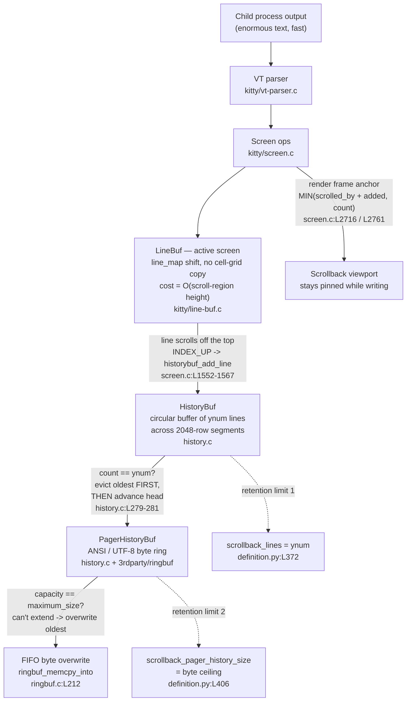

# Kitty Scrollback Under Stress: How `HistoryBuf` Behaves When Output Floods In

> **Analysis target:** the `kovidgoyal/kitty` source tree at HEAD
> `815df1e210e0a9ab4622f5c7f2d6891d7dbeddf1` (branch `kitty_815df1e210e0`).
>
> **Code is the source of truth.** Every behavioral claim below cites a specific
> source location (file + verified line range) and, where it matters, is backed
> by a runtime observation captured by exercising the real compiled
> `kitty.fast_data_types` extension. Nothing here is assumed or hand‑waved.

---

## 1. Scope and the questions answered

When a command dumps an enormous amount of text very fast (think `cat
huge.log`, `yes`, or a runaway build), the bytes flow through Kitty's terminal
pipeline and eventually pile into the **scrollback** subsystem. This document
explains exactly what happens inside that subsystem under that stress, answering
five interrelated questions:

1. **Fill, stretch, and segment carving** — what unfolds inside `HistoryBuf` as
   it fills, stretches, and carves out new storage segments.
2. **Segmented store ↔ pager ring interaction** — how the in‑memory segmented
   line store hands data to the secondary pager byte‑ring under stress.
3. **Smoothness vs. hesitation at limits** — whether transitions are smooth as
   segments reach their limits, or whether the system hesitates at certain
   points.
4. **Scrolling old output while new data arrives** — what changes if a user is
   actively scrolled into history while new data streams in at full speed.
5. **Allocation, wrapping, and retention at runtime** — how the underlying
   memory structures allocate, wrap, and retain data as pressure builds.

The subject of the analysis is the pair of cooperating buffers implemented in
`kitty/history.c`:

- **`HistoryBuf`** — a fixed‑capacity **circular buffer** of `ynum` logical
  lines, whose physical storage is sliced into lazily‑allocated **2048‑row
  segments**. This is the in‑memory scrollback you scroll through with the
  keyboard.
- **`PagerHistoryBuf`** — a secondary **byte ring buffer** that captures lines
  *evicted* from `HistoryBuf` as ANSI/UTF‑8 text, so they can later be piped to
  an external pager. It is backed by a third‑party FIFO ring buffer
  (`3rdparty/ringbuf/`).

---

## 2. Architecture overview: the two‑tier (plus active‑screen) pipeline

Output from the child process is parsed and applied to the **active screen**
(`LineBuf`). When a line scrolls off the top of the active screen, it is handed
to `HistoryBuf`. When `HistoryBuf` is full, the oldest line it holds is evicted
into `PagerHistoryBuf`. When the pager ring reaches its byte ceiling, its oldest
bytes are overwritten FIFO. Two **independent** retention limits govern the two
tiers, and a viewport "anchor" keeps a scrolled‑back reader pinned to the same
content while new output arrives.



The three structures, exactly as declared in `kitty/data-types.h`:

| Struct | Definition | Fields (verbatim shape) |
|---|---|---|
| `HistoryBufSegment` | `kitty/data-types.h:L262-266` | `GPUCell *gpu_cells; CPUCell *cpu_cells; LineAttrs *line_attrs;` |
| `PagerHistoryBuf` | `kitty/data-types.h:L268-272` | `void *ringbuf; size_t maximum_size; bool rewrap_needed;` |
| `HistoryBuf` | `kitty/data-types.h:L282-290` | `PyObject_HEAD; index_type xnum, ynum, num_segments; HistoryBufSegment *segments; PagerHistoryBuf *pagerhist; Line *line; index_type start_of_data, count;` |

The two counters that drive everything are `start_of_data` (the index of the
oldest line — the "head" of the circular buffer) and `count` (how many lines are
currently stored, `0 … ynum`).

---

## 3. Methodology and rationale

This analysis combines **static code reading** (the source is authoritative)
with **empirical runtime observation** (build, then drive the real buffers
through their Python bindings).

- **Code‑as‑truth.** Every line number cited below was re‑opened and confirmed
  in the source at HEAD `815df1e210e0`. Citations use the form
  `file:Lstart-Lend`.
- **Build / run environment.** All runtime evidence was produced inside the
  designated container
  `ghcr.io/scaleapi/swe-atlas:swe_atlas_QnA_kovidgoyal_kitty_1.0`, which carries
  a checkout of the repository at the exact target HEAD with the
  `fast_data_types` C extension already built. Tool versions in that
  environment: **Python 3.12.3**, **gcc 13.3.0** (Ubuntu 13.3.0‑6ubuntu2~24.04),
  **Go 1.23.4**. The standalone ring‑buffer harness (Observation 4) was compiled
  there with `cc -O2`.
- **Observation handle.** Runtime scripts mirror the existing test patterns in
  `kitty_tests/datatypes.py` and the import surface in `kitty_tests/__init__.py`
  (`from kitty.fast_data_types import Cursor, HistoryBuf, LineBuf, Screen, …`,
  `kitty_tests/__init__.py:L22`). The confirmed Python API is
  `HistoryBuf(ynum, xnum, pagerhist_sz=0)` with methods `.push`, `.line`,
  `.as_ansi`, `.rewrap`, `.pagerhist_write`, `.pagerhist_as_text`,
  `.pagerhist_as_bytes`, `.pagerhist_rewrap`, `.dirty_lines`, and read‑only
  members `.xnum`, `.ynum`, `.count` (registered in
  `kitty/history.c:L542-560`).
- **No changes to the repository.** Observation scripts were written **outside**
  the repository tree (under `/tmp`) and deleted after capture. The only delta
  to the repository is this single document. The four observation scripts and
  their **actual** captured output are reproduced verbatim in the Appendix.

The five sections that follow each pair **source citations** with the **actual
runtime output** and the **rationale** that connects the code to the observed
behavior.

---

## Q1 — Fill, stretch, and segment carving

**Question.** What unfolds inside `HistoryBuf` as it fills, stretches, and carves
out new segments when a command pours out enormous text in a short time?

### 1.1 The insertion path (the code)

A line enters history when it scrolls off the top of the active screen. The
`INDEX_UP(add_to_history)` macro in `kitty/screen.c:L1552-1567` does three things
per scrolled‑off line: it shifts the active screen's `line_map` and `line_attrs`
entries — a cheap move that copies no cell‑grid data but costs O(scroll‑region
height), **not** O(1), because `linebuf_index` loops over the scroll region
shifting one map/attrs entry per row (`linebuf_index`, `kitty/line-buf.c:L316-327`,
called at `kitty/screen.c:L1553`), hands the displaced line to history
via `historybuf_add_line(self->historybuf, …)` (`kitty/screen.c:L1558`), and
increments a per‑frame counter `history_line_added_count++`
(`kitty/screen.c:L1559` — important for Q4).

`historybuf_add_line` (`kitty/history.c:L286-291`) is a thin wrapper: it calls
`historybuf_push` to obtain a physical slot (`L288`), `copy_line`s the cell data
into that slot (`L289`), and stores the line's attributes (`L290`).

The heart of the mechanism is `historybuf_push` (`kitty/history.c:L275-284`):

```c
static index_type
historybuf_push(HistoryBuf *self, ANSIBuf *as_ansi_buf) {
    index_type idx = (self->start_of_data + self->count) % self->ynum;   // L277
    init_line(self, idx, self->line);                                    // L278
    if (self->count == self->ynum) {                                     // L279
        pagerhist_push(self, as_ansi_buf);                               // L280  (evict oldest)
        self->start_of_data = (self->start_of_data + 1) % self->ynum;    // L281  (advance head)
    } else self->count++;                                                // L282  (just grow)
    return idx;                                                          // L283
}
```

Two facts fall straight out of this:

- The **write index** is `idx = (start_of_data + count) % ynum`
  (`kitty/history.c:L277`). While the buffer is not yet full, `start_of_data`
  stays `0`, so `idx == count` and physical rows fill strictly in order
  `0, 1, 2, …`.
- `count` **rises by one per push until it reaches `ynum`**
  (`kitty/history.c:L282`); after that it stops growing and the buffer instead
  evicts (more on that in Q2).

### 1.2 Lazy, contiguous segment allocation (the code)

Physical storage is not one giant array. `init_line` resolves a row index to a
segment through `segment_for` (`kitty/history.c:L36-42`):

```c
static HistoryBufSegment*
segment_for(HistoryBuf *self, index_type y) {
    index_type seg_num = y / SEGMENT_SIZE;                                       // L38
    while (seg_num >= self->num_segments && SEGMENT_SIZE * self->num_segments < self->ynum)
        add_segment(self);                                                       // L39  (grow)
    if (seg_num >= self->num_segments) fatal("...");                             // L40  (abort)
    return self->segments + seg_num;
}
```

with `#define SEGMENT_SIZE 2048` (`kitty/history.c:L15`). Each segment is **one
contiguous `calloc`** (`add_segment`, `kitty/history.c:L17-29`): a single block
sized `cpu_cells_size + gpu_cells_size + SEGMENT_SIZE * sizeof(LineAttrs)`
(`kitty/history.c:L25`), into which the `gpu_cells` and `line_attrs` pointers are
offsets (`kitty/history.c:L27-28`). So a "segment" is **one allocation, not
three**, even though it backs three logical arrays.

The very **first segment is allocated eagerly** at construction:
`create_historybuf` sets `num_segments = 0` (`kitty/history.c:L126`) and then
immediately calls `add_segment(self)` (`kitty/history.c:L127`). Only the second
and subsequent segments are lazy.

### 1.3 The conceptual core: *growth* and *fullness* are different events

This is the single most important distinction for understanding the subsystem,
and it is easy to conflate:

| Event | Meaning | Triggering condition | Where |
|---|---|---|---|
| **Carve a segment** (growth) | allocate 2048 more rows of physical storage | a row index lands in a not‑yet‑existing segment **and** `SEGMENT_SIZE * num_segments < ynum` | `segment_for`, `kitty/history.c:L39` |
| **Buffer is full** (eviction) | the oldest line must be dropped to make room | `count == ynum` | `historybuf_push`, `kitty/history.c:L279` |

They are governed by **different conditions** and happen at **different times**.
Growth is bounded by `ynum`: at most `ceil(ynum / 2048)` segments are ever
allocated, and the `while` loop in `segment_for` refuses to grow past that
(`kitty/history.c:L39`). Fullness is about the *logical* line count reaching
capacity, regardless of how storage is sliced.

A consequence worth calling out: **at Kitty's default `scrollback_lines = 2000`
(`kitty/options/definition.py:L372`), `2000 < 2048`, so `HistoryBuf` never carves
a second segment** — the single eager segment holds the whole scrollback, and a
user at defaults never experiences a segment‑boundary allocation. Multi‑segment
behavior only appears once `scrollback_lines` exceeds 2048.

### 1.4 Runtime observation

Observation 1 builds a deliberately multi‑segment buffer (`HistoryBuf(3000, 5)`
— `3000 > 2048`, so up to two segments) and pushes 3000 lines:

```
ynum=3000 xnum=5 count_initial=0
after    1 pushes -> count=1
after 2047 pushes -> count=2047
after 2048 pushes -> count=2048
after 2049 pushes -> count=2049
after 3000 pushes -> count=3000
count_final=3000 (expect 3000, capped at ynum)
line(0   ) value='2999' -> physical row 2999 (segment 1)
line(951 ) value='2048' -> physical row 2048 (segment 1)
line(2047) value='952' -> physical row  952 (segment 0)
line(2048) value='951' -> physical row  951 (segment 0)
line(2999) value='0' -> physical row    0 (segment 0)
all 3000 lines readable & correct (proves segment 1 was carved): True
```

**Reading these samples — a line _number_ is not a physical _row_ number.**
`hb.line(i)` is **reverse‑indexed**: line `0` is the most recent, line `ynum-1`
the oldest (`index_of`, `kitty/history.c:L152-159`). With `start_of_data == 0`
and a full buffer, the *physical* row backing `line(i)` is `ynum-1-i`, the value
stored there is `str(ynum-1-i)`, and the segment that row lives in is
`(ynum-1-i) / 2048`. Concretely, `line(2048)` reads physical row
`3000-1-2048 = 951`, which is still in **segment 0**; the sample that actually
lands in **segment 1** is `line(951)`, which reads physical row `2048` — the
first row of the second segment. So `line(951) == '2048'` is the explicit
segment‑1 read, while `line(2048) == '951'` is a segment‑0 read despite its
larger line number.

### 1.5 Rationale (why)

- `count` climbs one per push and **caps exactly at `ynum = 3000`**, never
  exceeding it — the direct consequence of `kitty/history.c:L282` (`count++`
  only while `count != ynum`).
- Rows `0…2047` live in segment 0, allocated eagerly at construction
  (`kitty/history.c:L127`). Row `2048` is first touched on the **2049th** push
  (`idx == count == 2048`). At that moment `segment_for(2048)` computes
  `seg_num = 1`, finds `1 >= num_segments(1)` **and** `2048 * 1 = 2048 < 3000`,
  so it carves segment 1 (`kitty/history.c:L39`). No third segment is ever made
  because `2048 * 2 = 4096 < 3000` is false.
- The Python API deliberately exposes no `num_segments`, so the proof that
  segment 1 exists is **indirect but rigorous**: `segment_for` calls
  `fatal()` — an immediate process abort — if a row maps to a missing segment
  and growth is exhausted (`kitty/history.c:L40`). The program reading back all
  3000 lines *correctly* (`… readable & correct: True`) is only possible if
  segment 1 was successfully carved.

**In one sentence:** as a flood arrives, `HistoryBuf` fills its current segment
row by row (O(1) per line), **carves** a fresh 2048‑row segment the first time a
row crosses a 2048 boundary (bounded by `ynum`), and once `count` reaches `ynum`
it stops growing entirely and switches to eviction — growth and fullness being
distinct, differently‑triggered events.

---

## Q2 — Interaction between the segmented store and the pager ring

**Question.** How does the segmented in‑memory store interact with the
pager‑style ring buffer under stress?

### 2.1 The eviction junction (the code)

The two tiers meet at exactly one place: the `count == ynum` branch of
`historybuf_push` (`kitty/history.c:L279-281`). When the in‑memory ring is full
and another line must be inserted, the buffer:

1. **serializes and ships the oldest line to the pager ring** —
   `pagerhist_push(self, as_ansi_buf)` (`kitty/history.c:L280`), then
2. **advances the head** — `start_of_data = (start_of_data + 1) % ynum`
   (`kitty/history.c:L281`).

The ordering matters and is worth stating plainly: **evict‑before‑advance**. The
line that is about to be overwritten (the one currently at `start_of_data`) is
captured into the pager ring *first*; only then does `start_of_data` move so the
freed slot can be reused for the incoming line.

### 2.2 ANSI/UTF‑8 serialization (the code)

`pagerhist_push` (`kitty/history.c:L258-273`) turns the evicted cell line into a
byte stream:

```c
static void
pagerhist_push(HistoryBuf *self, ANSIBuf *as_ansi_buf) {
    PagerHistoryBuf *ph = self->pagerhist;
    if (!ph) return;                                                 // L261  (pager disabled => no-op)
    const GPUCell *prev_cell = NULL;
    Line l = {.xnum=self->xnum};
    init_line(self, self->start_of_data, &l);                        // L264  (the line being evicted)
    line_as_ansi(&l, as_ansi_buf, &prev_cell, 0, l.xnum, 0);         // L265  (FILL buffer: SGR + text)
    pagerhist_write_bytes(ph, (const uint8_t*)"\x1b[m", 3);          // L266  (write 3-byte ESC[m reset)
    if (pagerhist_write_ucs4(ph, as_ansi_buf->buf, as_ansi_buf->len)) {  // L267 (write the body)
        char line_end[2]; size_t num = 0;
        line_end[num++] = '\r';                                      // L269  (always CR)
        if (!l.gpu_cells[l.xnum - 1].attrs.next_char_was_wrapped)
            line_end[num++] = '\n';                                  // L270  (LF only if NOT soft-wrapped)
        pagerhist_write_bytes(ph, (const uint8_t*)line_end, num);    // L271
    }
}
```

A subtle but important ordering nuance: `line_as_ansi` at `kitty/history.c:L265`
**fills** the `as_ansi_buf` (with the line's own SGR sequence followed by its
text) but does *not* write to the ring yet. The 3‑byte `ESC[m` SGR reset is
written to the ring **first** (`kitty/history.c:L266`), and only then is the
buffered body written (`kitty/history.c:L267`). So the on‑ring byte order is:
`ESC[m` (reset) → `<line's own SGR + text>` → `\r` → optionally `\n`.

The terminator rule encodes wrapping: a `\r` is always appended
(`kitty/history.c:L269`), but a `\n` is appended **only when the line is not
soft‑wrapped** — i.e. when the last cell's `next_char_was_wrapped` attribute is
false (`kitty/history.c:L270`). A continuation line therefore gets a bare `\r`
and no newline, preserving the logical line break structure for the pager.

The ring stores **UTF‑8**: `pagerhist_write_ucs4` (`kitty/history.c:L248-256`)
encodes each codepoint to UTF‑8 and forwards to `pagerhist_write_bytes`
(`kitty/history.c:L218-226`), which finally calls `ringbuf_memcpy_into`
(`kitty/history.c:L224`) — the third‑party FIFO ring's write primitive
(`3rdparty/ringbuf/ringbuf.c:L212`). Reading it back, `pagerhist_as_text`
decodes the stored bytes as UTF‑8 (`PyUnicode_DecodeUTF8`,
`kitty/history.c:L490`) and `pagerhist_as_bytes` returns them raw
(`kitty/history.c:L460-483`).

If the pager is disabled (`scrollback_pager_history_size = 0`),
`alloc_pagerhist` returns `NULL` (`kitty/history.c:L72`) and `pagerhist_push`
short‑circuits at `kitty/history.c:L261` — the evicted line is simply dropped,
with no second tier at all.

### 2.3 Runtime observation

Observation 2 fills a 5‑line buffer with a 1 MiB pager ring enabled
(`HistoryBuf(5, 5, 1<<20)`) and pushes 8 lines, forcing 3 evictions:

```
ynum=5 pushed=8 count=5 (expect 5, capped)
in-memory line(0) most-recent = '7' (expect '7')
in-memory line(4) oldest-kept = '3' (expect '3')
pager_as_bytes len=105
pager_as_bytes repr=b'\x1b[m\x1b[1;2;3;7;9;31;42;58:5:3m0    \r\n\x1b[m\x1b[1;2;3;7;9;31;42;58:5:3m1    \r\n\x1b[m\x1b[1;2;3;7;9;31;42;58:5:3m2    \r\n'
pager_as_text  repr='\x1b[m\x1b[1;2;3;7;9;31;42;58:5:3m0    \r\n\x1b[m\x1b[1;2;3;7;9;31;42;58:5:3m1    \r\n\x1b[m\x1b[1;2;3;7;9;31;42;58:5:3m2    \r\n'
contains ESC[m reset (\x1b[m): True
count of ESC[m occurrences: 3 (one per evicted line)
ends evicted lines with CRLF (\r\n): True
roundtrip pagerhist_write->as_text repr='hello-pager\n'
```

### 2.4 Rationale (why)

- The buffer holds `ynum = 5` lines. Pushes 1–5 fill it (`count` reaches 5).
  Push 6 (`i = 5`) is the first to hit `count == ynum`, so it evicts the line at
  `start_of_data` — line `'0'` — *then* advances the head
  (`kitty/history.c:L279-281`). Pushes 7 and 8 evict `'1'` and `'2'`. The
  in‑memory buffer is left holding `'3'…'7'`, confirmed by
  `line(0) == '7'` (most recent) and `line(4) == '3'` (oldest kept).
- The pager ring therefore holds exactly the three evicted lines `'0','1','2'`,
  in FIFO order, and **`count of ESC[m occurrences: 3`** confirms one
  serialization per evicted line.
- Each serialized line shows the exact byte layout predicted by the code:
  the leading `\x1b[m` reset (`kitty/history.c:L266`), then the line's own SGR
  (`\x1b[1;2;3;7;9;31;42;58:5:3m` — these attributes come from the test
  cursor and are reproduced faithfully by `line_as_ansi`,
  `kitty/history.c:L265`), then the text `0` padded to the 5‑column width, then
  `\r\n`. The `\n` is present because these lines are **not** soft‑wrapped
  (`kitty/history.c:L270`).
- The direct `pagerhist_write('hello-pager\n') → pagerhist_as_text` round‑trip
  returning the identical string confirms the ring's write/read path is a clean
  UTF‑8 byte pipe (`kitty/history.c:L218-226`, `L485-494`).

**In one sentence:** under stress the segmented store and the pager ring meet at
the `count == ynum` eviction branch, where each overflowing line is serialized
to ANSI/UTF‑8 (reset + SGR + text + CR, plus LF for hard breaks) and pushed into
the FIFO byte ring **before** the in‑memory head advances — a strict
evict‑before‑advance handoff between the two tiers.

---

## Q3 — Smoothness vs. hesitation as segments reach their limits

**Question.** Are transitions smooth as segments reach their limits, or are
there subtle moments where the system hesitates or behaves differently than
expected?

The honest answer is: **the steady state is smooth (amortized O(1)), but there
are three discrete, well‑defined "hesitation" points hidden behind it.** Each is
a real allocation or copy that is otherwise invisible in the per‑line cost.

### 3.1 The steady‑state cost (the code)

A normal push touches only a handful of fields: two `% ynum` index computations
(`kitty/history.c:L277`, `L281`), an `init_line` bind, a `copy_line`
(`kitty/history.c:L289`), and an attribute store (`kitty/history.c:L290`). No
allocation, no copy of unrelated data. That is genuinely **O(1) per line**.

### 3.2 Hesitation point (a): the segment `calloc` (the code)

Every time a row crosses a 2048 boundary into a not‑yet‑allocated segment,
`add_segment` performs **one contiguous `calloc`** (`kitty/history.c:L25`) of
`xnum * 2048 * (sizeof(CPUCell) + sizeof(GPUCell)) + 2048 * sizeof(LineAttrs)`
bytes, plus a small `realloc` of the segment pointer array
(`kitty/history.c:L20`). This is a one‑time cost **amortized over 2048 rows**,
and it stops entirely once all `ceil(ynum / 2048)` segments exist (the `while`
loop guard `SEGMENT_SIZE * num_segments < ynum`, `kitty/history.c:L39`).

### 3.3 Hesitation point (b): the ring‑growth `memcpy` (the code)

When the pager ring needs more space than it has free, it grows —
`pagerhist_extend` (`kitty/history.c:L89-100`):

```c
static bool
pagerhist_extend(PagerHistoryBuf *ph, size_t minsz) {
    size_t buffer_size = ringbuf_capacity(ph->ringbuf);                       // L91
    if (buffer_size >= ph->maximum_size) return false;                        // L92  (HARD CEILING)
    size_t newsz = MIN(ph->maximum_size, buffer_size + MAX(1024u * 1024u, minsz)); // L93
    void *newbuf = ringbuf_new(newsz);                                        // L94
    ... ;
    size_t count = ringbuf_bytes_used(ph->ringbuf);
    if (count) ringbuf_copy(newbuf, ph->ringbuf, count);                      // L97  (copy ALL bytes)
    ringbuf_free(&ph->ringbuf); ph->ringbuf = newbuf;                         // L98
    return true;
}
```

Growth happens in steps of at least 1 MiB (`MAX(1MiB, minsz)`,
`kitty/history.c:L93`) and each step **copies the entire current ring**
(`ringbuf_copy`, `kitty/history.c:L97`) — an O(current‑size) `memcpy`. Because
the steps are ≥1 MiB apart, the per‑byte amortized cost stays tiny, but the
individual growth event is a real, if rare, latency blip. The ring also starts
small: `initial_pagerhist_ringbuf_sz` caps the initial allocation at
`MIN(1 MiB, pagerhist_sz)` (`kitty/history.c:L67`), even when the ceiling is
large.

### 3.4 Hesitation point (c): the hard ceiling and FIFO overwrite (the code)

Once `ringbuf_capacity >= maximum_size`, `pagerhist_extend` returns `false`
(`kitty/history.c:L92`) and the ring **stops growing forever**. From that point,
every write overwrites the oldest bytes in place. This FIFO‑overwrite behavior is
the documented contract of the third‑party ring:
`3rdparty/ringbuf/ringbuf.h:L148` states that once full, *"old data will simply
be overwritten in FIFO fashion, as needed"*, implemented in `ringbuf_memcpy_into`
(`3rdparty/ringbuf/ringbuf.c:L212`, which sets `tail = ringbuf_nextp(head)` on
overflow at `L233`).

One more edge that surprises: a **single write larger than the whole ceiling is
dropped outright** — `pagerhist_write_bytes` returns `false` immediately if
`sz > maximum_size` (`kitty/history.c:L220`), rather than partially writing it.

### 3.5 Per‑operation cost summary

| Operation | Typical cost | When the spike occurs | Bounded by |
|---|---|---|---|
| `push` (steady state) | **O(1)** | — | — |
| Carve a segment (`calloc`) | one alloc of `xnum·2048` cells + attrs | first time a row crosses a 2048 boundary, while below `ynum` | at most `ceil(ynum / 2048)` segments, ever |
| Pager ring growth (`memcpy`) | O(current ring bytes) | when free space is insufficient **and** capacity `< maximum_size` | grows in **≥1 MiB** steps, up to `maximum_size` |
| Pager at ceiling (FIFO overwrite) | **O(bytes written)** — fixed capacity; no allocation, no copy of the retained ring | every write once `capacity == maximum_size` | fixed at `maximum_size` |
| Oversized single write | **dropped** (no‑op) | when one write `> maximum_size` | — |

### 3.6 Runtime observation

The third‑party ring is self‑contained C, so Observation 4 compiles it
standalone and demonstrates the ceiling/overwrite behavior directly:

```
ringbuf_new(16): buffer_size=17 capacity=16  (1 byte reserved to tell full from empty)
after writing 10 bytes : bytes_used=10 bytes_free=6 is_full=0
after writing 20 total : bytes_used=16 is_full=1 (capacity caps usage)
surviving 16 bytes = "EFGHIJ0123456789"
oldest 4 bytes ("ABCD") overwritten FIFO (20-16=4); expect "EFGHIJ0123456789"
```

This confirms two design details simultaneously: the **+1 reserved byte**
(`buffer_size = 17` for `capacity = 16`, the standard trick to distinguish
"full" from "empty", documented at `3rdparty/ringbuf/ringbuf.h:L44-49`), and the
**FIFO overwrite at capacity** (writing 20 bytes into a 16‑byte ring keeps the
*newest* 16 and discards the oldest 4). That is precisely the mechanism that
bounds `PagerHistoryBuf` once `pagerhist_extend` returns `false`
(`kitty/history.c:L92`).

### 3.7 Rationale (why it nonetheless feels smooth)

Under a sustained flood, the system passes through an **initial growth ramp**
(carving segments every 2048 lines, growing the ring in ≥1 MiB steps) and then
reaches a **fixed‑memory steady state** in which *no allocation happens at all* —
`HistoryBuf` overwrites physical rows circularly and the ring overwrites its
oldest bytes FIFO — neither path allocates or copies data it is *keeping* (a
pager write still costs O(bytes written) to copy the *incoming* bytes via
`ringbuf_memcpy_into`, `3rdparty/ringbuf/ringbuf.c:L211-238`, but nothing already
retained is moved). Counter‑intuitively, this means a long flood is
*smoother* deep into the stream than at the very beginning, because all the
one‑time allocation costs are behind it. The only "hesitations" are (a) the
periodic, amortized segment `calloc` (which the default 2000‑line scrollback
never even hits, per Q1), (b) the rarer ring‑growth `memcpy`, and (c) the
one‑way transition to FIFO overwrite at the ceiling. None of these is a stall in
the ordinary sense; they are bounded, predictable, and increasingly infrequent
as the buffers approach their limits.

---

## Q4 — Scrolling through old output while new data still arrives

**Question.** What changes if someone is actively scrolling through old output
while new data is still arriving at full speed?

### 4.1 The viewport anchor (the code)

The scrollback viewport is tracked by a single integer, `Screen.scrolled_by` —
how many lines back from the live bottom the user is currently looking. The key
behavior lives in the render path. During each frame, **if the user is scrolled
back, the viewport is advanced by the number of lines that were just pushed into
history**, so the same logical content stays under the viewport:

```c
if (self->scrolled_by)
    self->scrolled_by = MIN(self->scrolled_by + history_line_added_count,
                            self->historybuf->count);
```

This exact statement appears **twice** — once in
`screen_update_only_line_graphics_data` (`kitty/screen.c:L2716`) and once in the
main render path `screen_update_cell_data` (`kitty/screen.c:L2761`).

The `history_line_added_count` it reads is the per‑frame tally of lines pushed
into history: initialized at `kitty/screen.c:L122`, incremented once per
scrolled‑off line inside `INDEX_UP` (`kitty/screen.c:L1559`), and reset to `0` at
the end of each render via `screen_reset_dirty` (`kitty/screen.c:L2600`).
Crucially, the render reads the counter into a local (`kitty/screen.c:L2714`)
and applies the anchor (`L2716`) **before** `screen_reset_dirty` zeroes it
(`L2717` → `L2600`).

Interactive scrolling (the user pressing a scroll key) is clamped the same way:
`screen_history_scroll` computes
`new_scroll = MIN(self->scrolled_by + amt, self->historybuf->count)`
(`kitty/screen.c:L4111`), so you can never scroll past the oldest retained line.

### 4.2 Runtime observation

Observation 3 has two parts. **[A]** demonstrates the interactive clamp; **[B]**
demonstrates the write‑time anchor and the per‑frame counter reset:

```
[A] scrollback=15 -> historybuf.count=15 (capped at ynum)
[A] scrolled_by initial = 0
[A] after scroll(3, up) scrolled_by = 3 (expect 3)
[A] after scroll(100000, up) scrolled_by = 15 (expect == count = 15, the clamp)
[A] after scroll(100000, down) scrolled_by = 0 (expect 0)

[B] count_before=25 ; scrolled_by after scroll(5,up) = 5
[B] history_line_added_count just after scroll = 25
[B] after drawing 4 more lines: history_line_added_count=29 ; scrolled_by(pre-render)=5 (unchanged)
[B] count_after=29 ; scrolled_by(post-render)=29 (expect MIN(5+29, 29)=29)
[B] history_line_added_count after render = 0 (expect 0, reset)
[B] viewport advanced by exactly the 29 newly-added history lines => content stayed pinned
```

### 4.3 Rationale (why)

- **[A] confirms the clamp.** With `count` saturated at `ynum = 15`, asking to
  scroll up by 100000 lands `scrolled_by` at exactly `15` — `MIN(0 + 100000,
  15)` (`kitty/screen.c:L4111`). Scrolling down by a huge amount returns to the
  live view (`scrolled_by = 0`). You cannot scroll into lines the buffer no
  longer holds.
- **[B] confirms the write‑time anchor.** After scrolling up 5 lines,
  *drawing more output does not move `scrolled_by` by itself* — the pre‑render
  value stays `5` while `history_line_added_count` accumulates (the macro at
  `kitty/screen.c:L1559` only bumps the counter; it does not touch
  `scrolled_by`). The viewport is then re‑anchored during the render pass:
  `update_only_line_graphics_data()` applies
  `scrolled_by = MIN(5 + added, count)` (`kitty/screen.c:L2716`) and afterwards
  the counter is back to `0` (`kitty/screen.c:L2600`) — exactly as observed.
  - *(Reading the specific numbers: in this script the counter held `25` from the
    initial fill because no render pass had run to reset it; drawing 4 more lines
    made it `29`; and because `count` is also `29`, the `MIN` clamp lands
    `scrolled_by` on `29`. The mechanism on display — advance by the number of
    newly added lines, clamp to `count`, then reset the counter — is the point,
    and it is precisely the code at `kitty/screen.c:L2714-2716` and `L2600`.)*

The **net effect** for a reader scrolled `k` lines back while output streams in:
each frame, the kernel of new lines pushed to history is added to `scrolled_by`,
so the same logical lines remain fixed on screen rather than scrolling out from
under the reader. The anchoring holds **until `count` saturates at `ynum`** — at
that point the `MIN(…, count)` clamp prevents `scrolled_by` from growing further,
and the very oldest content genuinely leaves the in‑memory buffer (evicted to the
pager ring per Q2). In other words: while you read old output, Kitty keeps your
place as new text arrives, right up to the moment the text you were reading falls
off the end of the finite scrollback.

---

## Q5 — Allocation, wrapping, and retention at runtime

**Question.** How do allocation, wrapping, and retention behave at runtime, and
how do the underlying memory structures evolve as pressure builds?

This section synthesizes the mechanics from Q1–Q4 into the runtime memory model.

### 5.1 Allocation — bounded, on‑demand growth

In‑memory line storage grows **only until `ynum` is reached**, then is strictly
bounded. Segments are carved lazily by `segment_for`/`add_segment`
(`kitty/history.c:L36-42`, `L17-29`), with the growth loop explicitly capped by
`SEGMENT_SIZE * num_segments < ynum` (`kitty/history.c:L39`). The first segment
is eager (`create_historybuf`, `kitty/history.c:L127`); the rest appear on
demand. This matches the configuration documentation's promise that *"Memory is
allocated on demand"* (`kitty/options/definition.py:L375`).

The pager ring allocates similarly: it starts at `MIN(1 MiB, pagerhist_sz)`
(`kitty/history.c:L67`) and grows in ≥1 MiB steps up to `maximum_size`
(`pagerhist_extend`, `kitty/history.c:L93`), then stops.

### 5.2 Wrapping — continuation flags and rewrap‑on‑resize

Line continuation (soft wrapping) is not stored as separate lines; it is tracked
by **two distinct pieces of metadata that live in two different structures**.
The wrap itself is recorded on the *cell*: `next_char_was_wrapped` is a one‑bit
field of the union `CellAttrs` (`kitty/data-types.h:L196-209`, the bit at
`L206`), and `CellAttrs` is embedded in every `GPUCell` as its `attrs` member
(`kitty/data-types.h:L216-220`, `attrs` at `L219`). So the flag set on the
**last cell** of a soft‑wrapped row is `GPUCell.attrs.next_char_was_wrapped` — it
is *not* a field of `LineAttrs`. The *following* row is instead marked as a
continuation by a **separate** bit, `is_continued`, which belongs to the union
`LineAttrs` (`kitty/data-types.h:L231-239`, the bit at `L233`); `LineAttrs`
carries `is_continued`, `has_dirty_text`, `has_image_placeholders`, and
`prompt_kind`, but never `next_char_was_wrapped`. The link between the two is
`linebuf_init_line`, which derives a row's `LineAttrs.is_continued` from the
*previous* row's last cell's `GPUCell.attrs.next_char_was_wrapped`
(`kitty/line-buf.c:L141-145`, computed at `L145`). It is this same per‑cell
`next_char_was_wrapped` flag that the pager serialization consults to decide
whether to emit a trailing `\n` (Q2, `kitty/history.c:L270`).

When the window is resized, history must be **reflowed** to the new column count.
`historybuf_rewrap` (`kitty/history.c:L594-614`) handles this:

- It first ensures the destination has at least as many segments
  (`kitty/history.c:L596`).
- **Fast path:** when neither dimension changes
  (`other->xnum == self->xnum && other->ynum == self->ynum`,
  `kitty/history.c:L597`), it does three straight `memcpy`s per segment —
  `cpu_cells`, `gpu_cells`, `line_attrs` (`kitty/history.c:L600-602`) — and
  copies `count`/`start_of_data` (`kitty/history.c:L604`). No reflow logic runs.
- **Slow path:** otherwise `rewrap_inner` reflows the content cell‑by‑cell to the
  new width (`kitty/history.c:L611`), honoring the continuation flags so wrapped
  logical lines are re‑broken at the new column count.

The pager ring is reflowed separately by `pagerhist_rewrap_to`
(`kitty/history.c:L391-432`): it allocates a fresh ring of
`MIN(maximum_size, ringbuf_capacity + 4096)` (`kitty/history.c:L398`) and walks
the stored bytes column‑by‑column, inserting a `\r` whenever
`num_in_current_line + ch_width > cells_in_line` (`kitty/history.c:L409-410`).

### 5.3 Retention — two independent limits

Retention is governed by **two independent configuration limits**, mapping to the
two tiers:

| | `scrollback_lines` | `scrollback_pager_history_size` |
|---|---|---|
| **Maps to** | `HistoryBuf.ynum` (line count) | `PagerHistoryBuf.maximum_size` (byte ceiling) |
| **Definition** | `kitty/options/definition.py:L372` | `kitty/options/definition.py:L406` |
| **Default** | `2000` lines | `0` (disabled) |
| **Unit** | lines | **MB** at the option layer → **bytes** at the constructor |
| **Stores** | full cell grid (`CPUCell` + `GPUCell` + `LineAttrs`) | UTF‑8 / ANSI serialized text |
| **Growth** | lazy 2048‑row segments, up to `ynum` | ≥1 MiB ring steps, up to `maximum_size` |
| **On overflow** | oldest line evicted to pager (or dropped if pager off) | oldest **bytes** overwritten FIFO |
| **Special values** | negative ⇒ effectively infinite (`definition.py:L376`) | `0` ⇒ disabled; max **4 GB** (`definition.py:L414-415`) |

These two limits are wired into the `Screen`'s `HistoryBuf` at allocation time:
`alloc_historybuf(MAX(scrollback, lines), columns, OPT(scrollback_pager_history_size))`
(`kitty/screen.c:L130`), which forwards to `create_historybuf(…, columns, lines,
pagerhist_sz)` (`kitty/history.c:L577-579`).

**A unit nuance worth flagging.** The option `scrollback_pager_history_size` is
documented and accepted *in MB* (`kitty/options/definition.py:L409`), but at the
C/Python‑binding layer the third constructor argument and the internal
`maximum_size` are *in bytes* (`new_history_object`'s `"II|I"` parse,
`kitty/history.c:L138`; `alloc_pagerhist` sets `maximum_size = pagerhist_sz`
directly, `kitty/history.c:L78`). The options layer performs the MB→byte
conversion; anyone driving `HistoryBuf(...)` directly (as the observation scripts
do) must pass **bytes**.

### 5.4 How the structures evolve as pressure builds

Tracing a flood from empty to saturated:

1. **At construction:** one eager 2048‑row segment
   (`kitty/history.c:L127`) and, if the pager is enabled, a ring of
   `MIN(1 MiB, ceiling)` (`kitty/history.c:L67`). `count = 0`,
   `start_of_data = 0`.
2. **Filling:** `count` climbs one per line (`kitty/history.c:L282`). If
   `ynum > 2048`, a second segment is carved the first time a row crosses 2048
   (`kitty/history.c:L39`); segments accrete up to `ceil(ynum / 2048)`. At the
   default `ynum = 2000`, **no second segment is ever carved**.
3. **Saturation of tier 1:** once `count == ynum`, every further line evicts the
   oldest into the pager ring (`kitty/history.c:L279-281`). The in‑memory
   footprint is now fixed; physical rows are recycled circularly.
4. **Filling tier 2:** the pager ring grows in ≥1 MiB steps
   (`kitty/history.c:L93`) up to `maximum_size`.
5. **Saturation of tier 2:** at the ceiling, `pagerhist_extend` returns `false`
   (`kitty/history.c:L92`) and the ring overwrites its oldest bytes FIFO
   (`3rdparty/ringbuf/ringbuf.h:L148`).

After step 5, **peak memory is bounded and flat**: roughly `ynum` lines of cell
grid plus `maximum_size` bytes of serialized text. Both tiers then recycle in
place with no further allocation — physical rows are reused circularly and the
pager ring overwrites its oldest bytes FIFO (each write copying only its own
incoming bytes, never anything already retained). The "evolution" of the
structures under sustained
pressure is therefore a finite ramp followed by a steady state — they grow to
their configured limits and then stop, trading the *oldest* data for the
*newest* rather than consuming ever more memory.

---

## Conclusion

Under a high‑volume flood, Kitty's scrollback behaves as a disciplined two‑tier
recycling system:

- **Growth and eviction are distinct.** `HistoryBuf` *grows* by carving
  contiguous 2048‑row segments on demand (bounded by `ynum`,
  `kitty/history.c:L39`), and separately *evicts* its oldest line once
  `count == ynum` (`kitty/history.c:L279`). Conflating the two is the most
  common misconception; they are different events with different triggers.
- **The two tiers hand off cleanly.** An evicted line is serialized to ANSI/UTF‑8
  and written into the FIFO pager ring **before** the in‑memory head advances —
  evict‑before‑advance (`kitty/history.c:L279-281`, `L258-273`).
- **Steady state is smooth; the spikes are bounded.** Pushes are amortized O(1).
  The only "hesitations" are the periodic segment `calloc`
  (`kitty/history.c:L25`), the ≥1 MiB ring‑growth `memcpy`
  (`kitty/history.c:L97`), and the one‑way switch to FIFO overwrite at the ring
  ceiling (`kitty/history.c:L92`; `3rdparty/ringbuf/ringbuf.h:L148`). All are
  bounded and become rarer as the buffers approach their limits.
- **A scrolled‑back reader stays anchored.** While the user is scrolled into
  history, each render frame advances the viewport by the number of newly added
  lines, clamped to `count` (`kitty/screen.c:L2716`/`L2761`,`L4111`) — keeping
  their place until the content they were reading is finally evicted.
- **Retention is two independent ceilings.** `scrollback_lines` bounds the
  in‑memory line count (`= ynum`), and `scrollback_pager_history_size` bounds the
  pager ring in bytes — with the notable MB‑vs‑bytes unit shift between the
  options layer and the constructor (`kitty/options/definition.py:L372`, `L406`;
  `kitty/history.c:L138`).

Net: memory ramps up to the configured limits and then holds flat, recycling
oldest‑for‑newest. There is no unbounded growth and no surprising stall — only a
small set of well‑defined, bounded transition costs, the most visible of which
(the segment `calloc`) the default 2000‑line configuration never even reaches.

---

## Appendix — observation scripts and captured output

The following scripts were created **outside** the repository (under `/tmp`),
run inside the designated container
(`ghcr.io/scaleapi/swe-atlas:swe_atlas_QnA_kovidgoyal_kitty_1.0`, `cd /app`,
`PYTHONPATH=/app`; the ring‑buffer harness compiled with `cc -O2` against
`3rdparty/ringbuf/ringbuf.c`), and **deleted** afterward. They are reproduced
here verbatim, each followed by its **actual** captured output, so the evidence
is reproducible. They are illustrative only and were never committed to the
repository.

### Observation 1 — fill + cross the 2048‑row segment boundary

```python
#!/usr/bin/env python3
# Observation 1 - Fill HistoryBuf and cross the 2048-row segment boundary.
# Mirrors kitty_tests/datatypes.py::test_historybuf (multi-segment HistoryBuf(3000, 5)).
from kitty.fast_data_types import HistoryBuf, LineBuf, Cursor
from kitty_tests import filled_line_buf, filled_cursor

YNUM = 3000          # > 2048 => requires a 2nd 2048-row segment
XNUM = 5
SEGMENT_SIZE = 2048  # kitty/history.c:L15
hb = HistoryBuf(YNUM, XNUM)
print("ynum=%d xnum=%d count_initial=%d" % (hb.ynum, hb.xnum, hb.count))

lb = filled_line_buf(5, XNUM)
c = filled_cursor()

checkpoints = {}
for i in range(YNUM):
    line = lb.line(1)
    line.set_text(str(i).ljust(XNUM), 0, XNUM, c)
    hb.push(line)
    n = i + 1
    if n in (1, 2047, 2048, 2049, YNUM):
        checkpoints[n] = hb.count

for n in sorted(checkpoints):
    print("after %4d pushes -> count=%d" % (n, checkpoints[n]))

print("count_final=%d (expect %d, capped at ynum)" % (hb.count, YNUM))

# hb.line(i) is REVERSE-indexed (index_of, kitty/history.c:L152-159): line 0 is the
# most recent, line ynum-1 the oldest. With start_of_data==0 and a full buffer the
# PHYSICAL row backing line(i) is (YNUM-1-i), and that row lives in segment
# (YNUM-1-i)//SEGMENT_SIZE. So the line NUMBER is not the physical row number.
def phys_row(i):
    return YNUM - 1 - i
for i in (0, 951, 2047, 2048, 2999):
    pr = phys_row(i)
    print("line(%-4d) value=%r -> physical row %4d (segment %d)" % (
        i, str(hb.line(i)).rstrip(), pr, pr // SEGMENT_SIZE))

ok = all(str(hb.line(i)).rstrip() == str(YNUM - 1 - i) for i in range(YNUM))
print("all %d lines readable & correct (proves segment 1 was carved): %s" % (YNUM, ok))
```

Captured output:

```
ynum=3000 xnum=5 count_initial=0
after    1 pushes -> count=1
after 2047 pushes -> count=2047
after 2048 pushes -> count=2048
after 2049 pushes -> count=2049
after 3000 pushes -> count=3000
count_final=3000 (expect 3000, capped at ynum)
line(0   ) value='2999' -> physical row 2999 (segment 1)
line(951 ) value='2048' -> physical row 2048 (segment 1)
line(2047) value='952' -> physical row  952 (segment 0)
line(2048) value='951' -> physical row  951 (segment 0)
line(2999) value='0' -> physical row    0 (segment 0)
all 3000 lines readable & correct (proves segment 1 was carved): True
```

### Observation 2 — eviction → pager handoff + ANSI serialization

```python
#!/usr/bin/env python3
# Observation 2 - Eviction -> pager handoff + ANSI serialization.
from kitty.fast_data_types import HistoryBuf, LineBuf, Cursor
from kitty_tests import filled_line_buf, filled_cursor

YNUM = 5
XNUM = 5
PH_BYTES = 1 << 20            # 1 MiB pager ceiling -- BYTES at this layer (not MB)
hb = HistoryBuf(YNUM, XNUM, PH_BYTES)
lb = filled_line_buf(5, XNUM)
c = filled_cursor()

NPUSH = 8                      # 8 > ynum=5 => 3 oldest lines (0,1,2) evicted to pager
for i in range(NPUSH):
    line = lb.line(1)
    line.set_text(str(i).ljust(XNUM), 0, XNUM, c)
    hb.push(line)

print("ynum=%d pushed=%d count=%d (expect 5, capped)" % (hb.ynum, NPUSH, hb.count))
print("in-memory line(0) most-recent = %r (expect '7')" % str(hb.line(0)).rstrip())
print("in-memory line(4) oldest-kept = %r (expect '3')" % str(hb.line(4)).rstrip())

raw = hb.pagerhist_as_bytes()
txt = hb.pagerhist_as_text()
print("pager_as_bytes len=%d" % len(raw))
print("pager_as_bytes repr=%r" % raw)
print("pager_as_text  repr=%r" % txt)
print("contains ESC[m reset (\\x1b[m): %s" % ("\x1b[m" in txt))
print("count of ESC[m occurrences: %d (one per evicted line)" % txt.count("\x1b[m"))
print("ends evicted lines with CRLF (\\r\\n): %s" % ("\r\n" in txt))

hb2 = HistoryBuf(5, 5, PH_BYTES)
hb2.pagerhist_write("hello-pager\n")
print("roundtrip pagerhist_write->as_text repr=%r" % hb2.pagerhist_as_text())
```

Captured output:

```
ynum=5 pushed=8 count=5 (expect 5, capped)
in-memory line(0) most-recent = '7' (expect '7')
in-memory line(4) oldest-kept = '3' (expect '3')
pager_as_bytes len=105
pager_as_bytes repr=b'\x1b[m\x1b[1;2;3;7;9;31;42;58:5:3m0    \r\n\x1b[m\x1b[1;2;3;7;9;31;42;58:5:3m1    \r\n\x1b[m\x1b[1;2;3;7;9;31;42;58:5:3m2    \r\n'
pager_as_text  repr='\x1b[m\x1b[1;2;3;7;9;31;42;58:5:3m0    \r\n\x1b[m\x1b[1;2;3;7;9;31;42;58:5:3m1    \r\n\x1b[m\x1b[1;2;3;7;9;31;42;58:5:3m2    \r\n'
contains ESC[m reset (\x1b[m): True
count of ESC[m occurrences: 3 (one per evicted line)
ends evicted lines with CRLF (\r\n): True
roundtrip pagerhist_write->as_text repr='hello-pager\n'
```

### Observation 3 — scroll‑while‑writing anchor + interactive clamp

```python
#!/usr/bin/env python3
# Observation 3 - Scroll-while-writing viewport anchor + interactive-scroll clamp.
from kitty_tests import BaseTest


class _H(BaseTest):
    def runTest(self):
        pass


bt = _H()


def fill(s, n):
    for i in range(n):
        s.draw(str(i % 10))
        if i != n - 1:
            s.carriage_return()
            s.linefeed()


# ---- Demonstration A: interactive scroll clamped to historybuf->count (screen.c L4111) ----
s = bt.create_screen(cols=5, lines=5, scrollback=15)
fill(s, 40)
count = s.historybuf.count
print("[A] scrollback=15 -> historybuf.count=%d (capped at ynum)" % count)
print("[A] scrolled_by initial = %d" % s.scrolled_by)
s.scroll(3, True)
print("[A] after scroll(3, up) scrolled_by = %d (expect 3)" % s.scrolled_by)
s.scroll(100000, True)
print("[A] after scroll(100000, up) scrolled_by = %d (expect == count = %d, the clamp)" % (s.scrolled_by, count))
s.scroll(100000, False)
print("[A] after scroll(100000, down) scrolled_by = %d (expect 0)" % s.scrolled_by)

# ---- Demonstration B: scroll-while-writing anchor (screen.c L2714-2716) ----
s = bt.create_screen(cols=5, lines=5, scrollback=50)
fill(s, 30)
count_before = s.historybuf.count
K = 5
s.scroll(K, True)
print("\n[B] count_before=%d ; scrolled_by after scroll(%d,up) = %d" % (count_before, K, s.scrolled_by))
print("[B] history_line_added_count just after scroll = %d" % s.history_line_added_count)

M = 4
for i in range(M):
    s.draw("z")
    s.carriage_return()
    s.linefeed()
added = s.history_line_added_count
sb_before_render = s.scrolled_by
print("[B] after drawing %d more lines: history_line_added_count=%d ; scrolled_by(pre-render)=%d (unchanged)" % (M, added, sb_before_render))

count_after = s.historybuf.count
s.update_only_line_graphics_data()
print("[B] count_after=%d ; scrolled_by(post-render)=%d (expect MIN(%d+%d, %d)=%d)" % (
    count_after, s.scrolled_by, K, added, count_after, min(K + added, count_after)))
print("[B] history_line_added_count after render = %d (expect 0, reset)" % s.history_line_added_count)
print("[B] viewport advanced by exactly the %d newly-added history lines => content stayed pinned" % added)
```

Captured output:

```
[A] scrollback=15 -> historybuf.count=15 (capped at ynum)
[A] scrolled_by initial = 0
[A] after scroll(3, up) scrolled_by = 3 (expect 3)
[A] after scroll(100000, up) scrolled_by = 15 (expect == count = 15, the clamp)
[A] after scroll(100000, down) scrolled_by = 0 (expect 0)

[B] count_before=25 ; scrolled_by after scroll(5,up) = 5
[B] history_line_added_count just after scroll = 25
[B] after drawing 4 more lines: history_line_added_count=29 ; scrolled_by(pre-render)=5 (unchanged)
[B] count_after=29 ; scrolled_by(post-render)=29 (expect MIN(5+29, 29)=29)
[B] history_line_added_count after render = 0 (expect 0, reset)
[B] viewport advanced by exactly the 29 newly-added history lines => content stayed pinned
```

### Observation 4 — pager ring FIFO overwrite (standalone `ringbuf`)

```c
/* Observation 4 - PagerHistoryBuf's backing FIFO ring: oldest-bytes overwrite.
 * Compiles standalone against the repo's 3rdparty/ringbuf/ringbuf.c (read-only).
 * The repository is NOT modified: this .c and its binary live under /tmp only.
 */
#include <stdio.h>
#include <string.h>
#include "ringbuf.h"

int main(void) {
    ringbuf_t rb = ringbuf_new(16);
    printf("ringbuf_new(16): buffer_size=%zu capacity=%zu  (1 byte reserved to tell full from empty)\n",
           ringbuf_buffer_size(rb), ringbuf_capacity(rb));

    const char *a = "ABCDEFGHIJ";   /* 10 bytes */
    const char *b = "0123456789";   /* 10 bytes */

    ringbuf_memcpy_into(rb, a, 10);
    printf("after writing 10 bytes : bytes_used=%zu bytes_free=%zu is_full=%d\n",
           ringbuf_bytes_used(rb), ringbuf_bytes_free(rb), ringbuf_is_full(rb));

    ringbuf_memcpy_into(rb, b, 10);   /* 20 bytes total into a capacity-16 ring */
    printf("after writing 20 total : bytes_used=%zu is_full=%d (capacity caps usage)\n",
           ringbuf_bytes_used(rb), ringbuf_is_full(rb));

    size_t used = ringbuf_bytes_used(rb);
    char out[64];
    memset(out, 0, sizeof out);
    ringbuf_memcpy_from(out, rb, used);
    printf("surviving %zu bytes = \"%s\"\n", used, out);
    printf("oldest %d bytes (\"ABCD\") overwritten FIFO (20-16=4); expect \"EFGHIJ0123456789\"\n", 20 - 16);

    ringbuf_free(&rb);
    return 0;
}
```

Captured output:

```
ringbuf_new(16): buffer_size=17 capacity=16  (1 byte reserved to tell full from empty)
after writing 10 bytes : bytes_used=10 bytes_free=6 is_full=0
after writing 20 total : bytes_used=16 is_full=1 (capacity caps usage)
surviving 16 bytes = "EFGHIJ0123456789"
oldest 4 bytes ("ABCD") overwritten FIFO (20-16=4); expect "EFGHIJ0123456789"
```

---

## Citation index

Primary source locations cited above, at HEAD `815df1e210e0`:

| Mechanism | Location |
|---|---|
| `SEGMENT_SIZE` (2048) | `kitty/history.c:L15` |
| `add_segment` — one contiguous `calloc` | `kitty/history.c:L17-29` (alloc at `L25`) |
| `segment_for` — lazy growth, bounded by `ynum` | `kitty/history.c:L36-42` (guard `L39`) |
| `initial_pagerhist_ringbuf_sz` — `MIN(1 MiB, sz)` | `kitty/history.c:L67` |
| `alloc_pagerhist` — `NULL` when size 0; sets `maximum_size` | `kitty/history.c:L69-80` |
| `pagerhist_extend` — ceiling + growth `memcpy` | `kitty/history.c:L89-100` (ceiling `L92`, copy `L97`) |
| `create_historybuf` — eager first segment | `kitty/history.c:L116-133` (`L126-127`) |
| `new_history_object` — `HistoryBuf(ynum, xnum, pagerhist_sz=0)`, bytes | `kitty/history.c:L135-141` (`L138`) |
| `index_of` — reverse indexing | `kitty/history.c:L152-159` |
| `pagerhist_write_bytes` — drops oversized; extend; `memcpy_into` | `kitty/history.c:L218-226` (`L220`,`L224`) |
| `pagerhist_push` — ANSI serialization, evict | `kitty/history.c:L258-273` |
| `historybuf_push` — circular insert / evict‑before‑advance | `kitty/history.c:L275-284` (`L277`,`L279-282`) |
| `historybuf_add_line` | `kitty/history.c:L286-291` |
| `pagerhist_rewrap_to` | `kitty/history.c:L391-432` (`L398`) |
| `pagerhist_as_bytes` / `pagerhist_as_text` | `kitty/history.c:L460-483` / `L485-494` |
| `methods[]` / `members[]` (Python API) | `kitty/history.c:L542-560` |
| `alloc_historybuf` | `kitty/history.c:L577-579` |
| `historybuf_rewrap` — fast‑path triple `memcpy` | `kitty/history.c:L594-614` (`L597`,`L600-604`) |
| Struct layouts (`HistoryBufSegment`/`PagerHistoryBuf`/`HistoryBuf`) | `kitty/data-types.h:L262-290` |
| `CellAttrs.next_char_was_wrapped` (per-cell, inside `GPUCell.attrs`) | `kitty/data-types.h:L196-209` (bit `L206`); `GPUCell` `L216-220` |
| `LineAttrs.is_continued` (per-line) | `kitty/data-types.h:L231-239` (bit `L233`) |
| `history_line_added_count` — init / inc / reset | `kitty/screen.c:L122` / `L1559` / `L2600` |
| `INDEX_UP(add_to_history)` macro | `kitty/screen.c:L1552-1567` |
| Scroll‑while‑writing anchor (twice) | `kitty/screen.c:L2716`, `L2761` |
| `alloc_historybuf` wiring of both limits | `kitty/screen.c:L130` |
| Interactive scroll clamp | `kitty/screen.c:L4111` |
| `linebuf_index` — `line_map`/`line_attrs` shift (cost O(scroll-region height), no cell-grid copy) | `kitty/line-buf.c:L316-327` |
| `linebuf_init_line` — derives `LineAttrs.is_continued` from prev cell's `GPUCell.attrs.next_char_was_wrapped` | `kitty/line-buf.c:L141-145` |
| Ring header "FIFO implementation" / `ringbuf_memcpy_into` | `3rdparty/ringbuf/ringbuf.c:L2` / `L212` |
| Ring FIFO‑overwrite contract | `3rdparty/ringbuf/ringbuf.h:L148` |
| Capacity vs. buffer‑size (+1 reserved byte) | `3rdparty/ringbuf/ringbuf.h:L44-49` |
| `scrollback_lines` (default 2000, on‑demand, negative⇒∞) | `kitty/options/definition.py:L372-376` |
| `scrollback_pager_history_size` (MB, 0 disables, max 4 GB) | `kitty/options/definition.py:L406-415` |
| Python API import surface / test patterns | `kitty_tests/__init__.py:L22`; `kitty_tests/datatypes.py:L487-540` |

