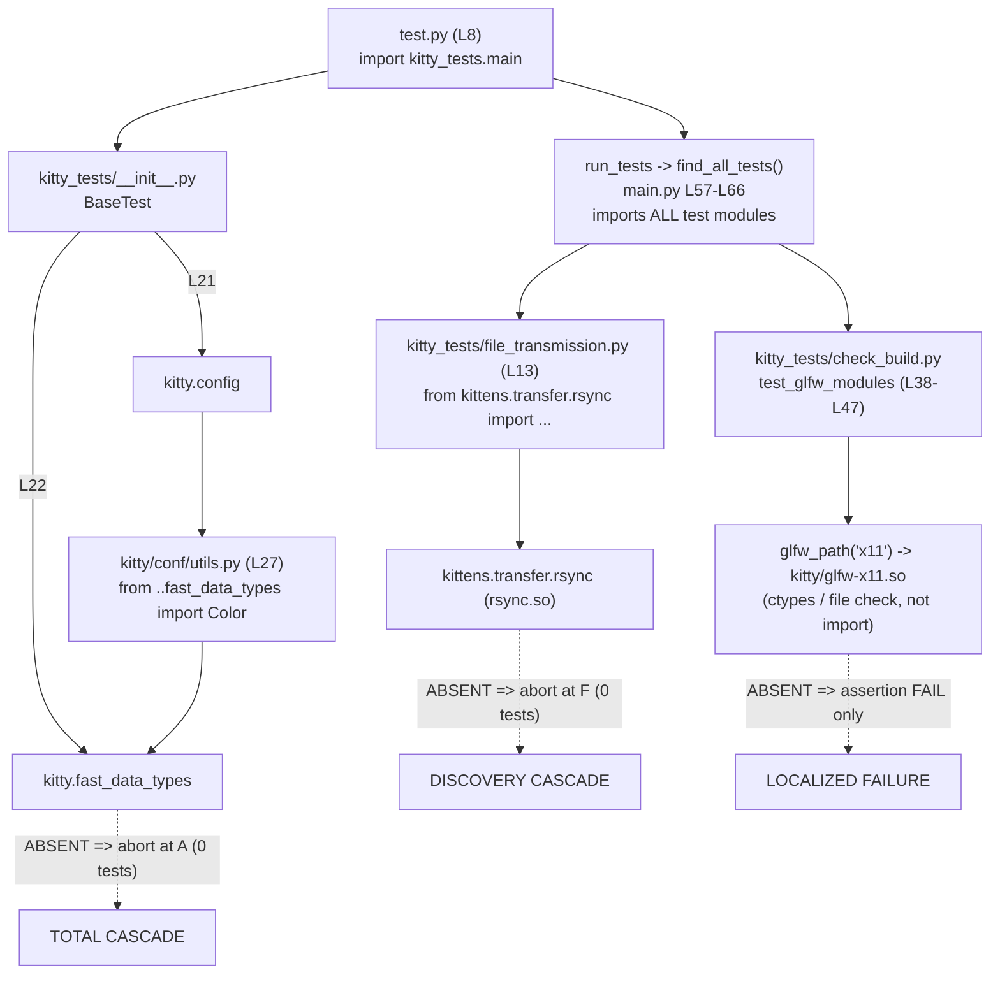

# kitty — Build‑Artifact ↔ Test‑Execution Dependency Analysis

> **Subject:** the relationship between kitty's compiled C/Go extension artifacts (build outputs) and the Python/Go test‑execution flow.
> **Branch:** `kitty_815df1e210e0` · **Commit:** `815df1e210e0a9ab4622f5c7f2d6891d7dbeddf1` · **Platform:** Linux / X11.
> **Method:** empirical. Every claim below is grounded in an actual build (`python3 setup.py build`), an actual test run (`./test.py`), a live import trace, and three "hide‑an‑extension" cascade experiments run on a disposable copy of the tree.
> **Repository impact:** none. The source repository was never modified — `git status --short` was empty before and after. The compiled artifacts are gitignored, and all destructive experiments ran on a copy that was deleted afterward.

**A note on reproduced output.** The code fences in this document contain output captured verbatim from the runs described. For readability, long absolute path prefixes have been collapsed to `…/` (the baseline ran from the repository root; the cascade experiments ran from the disposable copy at `/tmp/blitzy_cascade/kitty_copy`). All semantically meaningful content — line numbers, symbol names, error classes, messages, and test counts — is reproduced exactly as observed.

---

## Section 1 — Objective & Method

### 1.1 The questions this document answers

This is a question‑answering deliverable. The three questions posed, quoted verbatim, are:

1. *"which extension modules actually get loaded during test execution and how test failures cascade when those modules are unavailable."*
2. *"What does the test output reveal about the dependency structure?"*
3. *"map out how the compiled extensions connect to different test categories, which modules are critical versus optional, and what are the actual import chains being established during the test run."*

A cross‑reference of where each question is answered:

| Question | Primarily answered in |
|---|---|
| Q1 — loaded extensions & failure cascade | §4 (what loads), §6 (the three cascades), §7 (taxonomy) |
| Q2 — what the output reveals about dependency structure | §8 (output‑signature rule) |
| Q3 — extensions ↔ test categories, critical vs optional, import chains | §3 (artifacts), §4 (per‑module map), §5 (live import chain), §7 (taxonomy), §9 (Python vs Go) |

### 1.2 Method

The analysis followed five steps, in order:

1. **Build from source.** Provision the toolchain, then run `python3 setup.py build` to compile the native C extensions, the C launcher, and the Go `kitten` binary. Tests cannot run until these exist (§2).
2. **Run the test suite.** Execute `CI=true ./test.py` to obtain the baseline healthy‑run behavior, plus targeted single‑module runs (`./test.py --module …`).
3. **Trace the live import graph.** Run an import‑probe under the compiled launcher to record exactly when each `.so` enters `sys.modules` during the runner's startup and discovery (§5).
4. **Induce three "extension‑missing" conditions.** On an *isolated copy* of the built tree, rename each compiled `.so` out of the way one at a time, re‑run the runner, capture the exact output, then restore (§6).
5. **Contrast the output signatures.** Compare the shape of the output across the healthy run and the three missing‑extension runs to derive what the output reveals about each dependency's nature (§8).

### 1.3 Empirical environment

| Property | Value (observed) |
|---|---|
| Branch | `kitty_815df1e210e0` |
| Commit | `815df1e210e0a9ab4622f5c7f2d6891d7dbeddf1` |
| OS / windowing | Linux / X11 |
| Python | 3.13.7 (`/usr/bin/python3`) |
| C compiler | `gcc-13` 13.4.0 (`CC=gcc-13`) |
| Go | 1.22.12 (satisfies `go.mod` `go 1.22`) |
| Test env vars | `CI=true`, `LANG=LC_ALL=en_US.UTF-8` |

The project floor is `requires-python = ">=3.8"` (`pyproject.toml:L2`) and `go 1.22` (`go.mod:L3`); the versions above satisfy both. The findings are scoped to this revision and this Linux/X11 configuration.

### 1.4 Cleanliness guarantee

The deliverable is exactly one file — this document. No source file was created, modified, or deleted. The build emits `*.so` files and the launcher binaries, but these are gitignored (`.gitignore`: `*.so` L1, `/build/` L14, `/kitty/launcher/kitt*` L18), so building and testing leave the tracked tree untouched. The three cascade experiments — which rename `.so` files — were performed on a disposable copy under `/tmp` and never on the repository. `git status --short` was confirmed empty after every step.

---

## Section 2 — Build Procedure & Prerequisites

### 2.1 Why the build is a hard precondition

The test entry point runs under the freshly compiled launcher. `test.py:L1` is the shebang `#!./kitty/launcher/kitty +launch`, and `test.py:L8` does the actual work: `m = importlib.import_module('kitty_tests.main')`. Because the launcher (`kitty/launcher/kitty`) and the extensions it loads are build outputs, **nothing in the suite can run until the build has produced them.** This single fact is the root of the entire dependency story analyzed below.

### 2.2 Equivalent entry points

Three invocation pathways drive the same machinery:

| Pathway | Definition |
|---|---|
| `./test.py` | Direct; runs under the launcher via the shebang (`test.py:L1`) |
| `make test` | `Makefile:L15‑16` → `python3 setup.py $(VVAL) test` |
| `make all` | `Makefile:L12‑13` → `python3 setup.py $(VVAL)` (build) |

The canonical CI recipe lives in `.github/workflows/ci.py`: `install_deps()` (L72), `build_kitty()` (L102, whose command at L104 is `… setup.py build --verbose`), and `test_kitty()` (L112, which at L116 runs `./test.py`). The CI environment sets `CI: 'true'` and `ASAN_OPTIONS: detect_leaks=0` (`.github/workflows/ci.yml:L4‑5`), with the CI matrix spanning Python 3.8/3.9/3.10 (package job 3.11) under both gcc and clang.

### 2.3 Prerequisite libraries

The build needs a C11 compiler, Go ≥ 1.22, and a set of system development libraries mirroring `.github/workflows/ci.py:install_deps` (the apt list at L85 plus the pip packages at L95). Two of these deserve emphasis because the build empirically links against them:

- **`libssl-dev` / libcrypto — mandatory.** Without it the build aborts ("package libcrypto not found"), and `fast_data_types.so` is empirically linked with `-lcrypto` (see §3). *(For accuracy: `libssl-dev` and `pkg-config` are not in the `ci.py` apt list because the CI base image pre‑installs them; this analysis environment installed them explicitly.)*
- **`libxxhash-dev` — required by the rsync extension.** `setup.py:L986` builds the rsync kitten with `libxxhash`, and `rsync.so` is empirically linked with `-lxxhash` (see §3).

Other libraries on the list include `libharfbuzz-dev`, `liblcms2-dev`, `libfontconfig-dev`, `libpng-dev`, `libxkbcommon-dev`/`-x11-dev`, `libxcb-xkb-dev`, `libgl1-mesa-dev`, the X11 client libraries (`libxi/xrandr/xinerama/xcursor-dev`, `libx11-xcb-dev`), `libdbus-1-dev`, `libcanberra-dev`, `libsystemd-dev`, `uuid-dev`, and `libsimde-dev`; the pip layer adds `Pillow` and `pygments`.

### 2.4 The build, as run

```
$ CI=true CC=gcc-13 python3 setup.py build --verbose
… (compiles 62 C objects into fast_data_types.so, then glfw, then the kittens, then the Go binary) …
SETUP_BUILD_EXIT=0
```

The build completed successfully (`SETUP_BUILD_EXIT=0`) and emitted, in order, the three loadable extensions, the C launcher, and the Go `kitten` (§3).

### 2.5 Wayland is gracefully optional; X11 is the active backend

On this Linux host the Wayland development packages are absent, so the build prints the following and continues — this is real captured output:

```
Package wayland-protocols was not found in the pkg-config search path.
Perhaps you should add the directory containing `wayland-protocols.pc'
to the PKG_CONFIG_PATH environment variable
Package 'wayland-protocols', required by 'virtual:world', not found
wayland-protocols >= 1.17 is required, found version: not found
Disabling building of wayland backend
```

This behavior is encoded in `setup.py:compile_glfw`. The backend list is `modules = 'cocoa' if is_macos else 'x11 wayland'` (`setup.py:L933`), and the loop wraps each backend's environment initialization in a `try/except SystemExit` (`setup.py:L937‑942`): if the failing backend is `wayland`, it prints "Disabling building of wayland backend" and `continue`s; for any other backend it re‑raises. **Conclusion (empirical):** only `kitty/glfw-x11.so` is produced on this host, the build still succeeds, and X11 is therefore the active windowing backend for the analysis. This is why the glfw experiments in §6 target `glfw-x11.so`.

---

## Section 3 — Compiled‑Artifact Inventory and How `setup.py` Produces Each

### 3.1 Artifacts are produced fresh, never committed

None of the build outputs are tracked. `.gitignore` excludes `*.so` (L1), the `/build/` tree (L14), and `/kitty/launcher/kitt*` (L18). They are regenerated on every build, which is why a working toolchain is the precondition described in §2.

### 3.2 The production sequence in `build()`

`setup.py:build()` (L1084‑1095) materializes the artifacts in a fixed order:

1. `compile_c_extension(kitty_env(args), 'kitty/fast_data_types', …)` — the primary extension (L1090‑1093).
2. `compile_glfw(…)` — the windowing backend(s) (L1094).
3. `compile_kittens(args)` — the kitten extensions, including rsync (L1095).

### 3.3 Inventory (observed)

The byte sizes below are the exact sizes observed on disk after the build. The "key link libraries" are taken from the actual `gcc-13`/`go` link command lines captured during a clean `--verbose` rebuild.

| Artifact | Bytes | Produced by | Key link libraries (observed `-l` flags) |
|---|---:|---|---|
| `kitty/fast_data_types.so` | 1,213,072 | `build()` L1090‑1093 via `compile_c_extension`, aggregating **62** C objects | `-lpython3.13 -lharfbuzz -lGL -lpng16 -llcms2 -llcms2_fast_float -llcms2_threaded -lcrypto -lrt -lz -ldl -lm` |
| `kitty/glfw-x11.so` | 357,584 | `compile_glfw()` L932‑954 (`kitty/glfw-{module}` L952‑953) | `-lX11 -lXrandr -lXinerama -lXcursor -lxkbcommon -lxkbcommon-x11 -lX11-xcb -lxcb -ldbus-1 -lrt -ldl -lm` |
| `kittens/transfer/rsync.so` | 55,032 | `compile_kittens()` L967+, rsync at L986 | `-lxxhash -lpython3.13 -ldl -lm` |
| `kitty/launcher/kitty` (C) | 36,288 | C launcher link | `-lpython3.13 -Xlinker -export-dynamic` |
| `kitty/launcher/kitten` (Go) | 15,765,764 | `go build` | `-ldflags '-X kitty.VCSRevision=815df1e210e0a9ab4622f5c7f2d6891d7dbeddf1 -s -w'` |

**Reading the link lines.** The presence of `-lpython3.13` across the three Python‑loadable artifacts is the empirical fingerprint of the Python 3.13 runtime in this environment. The `-lcrypto` in `fast_data_types.so` is the empirical proof of the mandatory libcrypto dependency called out in §2.3; the `-lxxhash` in `rsync.so` is the empirical proof of `setup.py:L986`. The runtime `DT_NEEDED` entries (via `readelf -d`) corroborate this: `fast_data_types.so` needs `libpython3.13.so.1.0`, `libharfbuzz.so.0`, `libpng16.so.16`, `liblcms2.so.2`, **`libcrypto.so.3`**, `libz.so.1`; `rsync.so` needs **`libxxhash.so.0`** and `libpython3.13.so.1.0`. (`-lGL`/`-lrt` appear on the compile link line but are resolved at runtime via the GL loader / glibc and so are not all retained as `DT_NEEDED`.)

### 3.4 The 62 C sources behind `fast_data_types.so`

The single largest artifact aggregates 62 compiled objects (counted from its link line). The kitty sources include: `charsets, child-monitor, child, cleanup, colors, crypto, cursor, data-types, desktop, disk-cache, fast-file-copy, font-names, fontconfig, fonts, freetype, freetype_render_ui_text, gl-wrapper, gl, glfw-wrapper, glfw, glyph-cache, graphics, history, hyperlink, key_encoding, keys, kittens, line-buf, line, logging, loop-utils, monotonic, mouse, png-reader, rowcolumn-diacritics, screen, shaders, shlex, simd-string(-128/-256), state, systemd, unicode-data, utmp, vt-parser(-dump), wcswidth, window_logo`, plus 3rd‑party `ringbuf` and the `base64` codec family. This breadth is why so much of the suite depends on this one extension (§4).

### 3.5 The Go launcher build line

```
/usr/local/bin/go build -v -ldflags '-X kitty.VCSRevision=815df1e210e0a9ab4622f5c7f2d6891d7dbeddf1 -s -w' -o kitty/launcher/kitten …/tools/cmd
```

`setup.py:get_vcs_rev()` (L674‑678) resolves the revision via `git rev-parse HEAD`, so the canonical build embeds the commit hash — confirmed present in the produced `kitty/launcher/kitten` binary (via `strings`). *(Footnote on the experiment copy: because the disposable copy in §6 was created without its `.git` directory, a rebuild there interpolated `VCSRevision=` empty. That is a benign artifact of the copy and does not affect any cascade observation, which depends only on the presence/absence of the `.so` files.)*


---

## Section 4 — Per‑Test‑Module Extension Import Map

### 4.1 The discovered population

`kitty_tests/` contains 25 `.py` files. The runner's discovery function `find_all_tests(package='', excludes=('main', 'gr'))` (`kitty_tests/main.py:L57‑66`) excludes `main` (the runner itself) and `gr`; `__init__.py` is the package initializer rather than a discovered test module. That leaves **22 functional test modules**:

`check_build, clipboard, completion, crypto, datatypes, file_transmission, fonts, glfw, graphics, keys, layout, mouse, open_actions, options, parser, screen, search_query_parser, shell_integration, shm, ssh, tui, utmp`.

### 4.2 The universal dependency

**Every one of the 22 modules** imports the test harness via `from . import BaseTest` (verified per module). `BaseTest` lives in `kitty_tests/__init__.py`, and that package initializer imports the primary extension at module level — `from kitty.fast_data_types import Cursor, HistoryBuf, LineBuf, Screen, get_options, monotonic, set_options` (`kitty_tests/__init__.py:L22`) — alongside `from kitty.config import …` (`L21`). **Therefore importing any test module forces `fast_data_types.so` to load before a single test in it can be collected.** This is the structural reason `fast_data_types.so` is the most critical artifact (§7).

### 4.3 Three import mechanisms

The crux of the whole analysis is *how* a module reaches an extension. Three distinct mechanisms appear, and they have very different failure semantics:

- **Module‑level (eager) import** — executes when the module is loaded, i.e. at discovery/collection time. Failure here prevents the module (or, for `__init__.py`, the entire package) from being collected at all.
- **Method‑level (lazy) import** — an `import` statement inside a test method, executing only when that test runs. Failure is isolated to that one test.
- **Path + `ctypes` (not a Python import)** — the artifact is located by filesystem path and opened with `ctypes.CDLL`; it never enters `sys.modules` as a Python module, so it can never raise `ModuleNotFoundError`.

### 4.4 Per‑module map (verified)

Locators are given for the module‑level and method‑level direct references; modules marked "transitive only" reach `fast_data_types.so` solely through `BaseTest` (§4.2).

| Module | `fast_data_types` at module level? | Touches `rsync.so`? | Touches `glfw-x11.so`? | Notes |
|---|---|---|---|---|
| `datatypes` | **Yes** — `L9` | — | — | eager symbols incl. line/cursor buffers |
| `fonts` | **Yes** — `L11` | — | — | eager `DECAWM, get_fallback_font, …, wcwidth`; site of the baseline font failure (§6) |
| `graphics` | **Yes** — `L14` | — | — | eager `base64_*`, `load_png_data`, `shm_*` |
| `keys` | **Yes** — `L6` | — | — | `import kitty.fast_data_types as defines` |
| `mouse` | **Yes** — `L6` | — | — | eager symbol group |
| `options` | **Yes** — `L5` | — | — | `from kitty.fast_data_types import Color` |
| `parser` | **Yes** — `L8` | — | — | eager symbol group |
| `screen` | **Yes** — `L4` | — | — | eager `DECAWM, DECCOLM, …, Cursor` |
| `shell_integration` | **Yes** — `L16` | — | — | eager `CURSOR_*` |
| `shm` | **Yes** — `L9` | — | — | `from kitty.fast_data_types import shm_unlink` |
| `ssh` | **Yes** — `L16` | — | — | eager `CURSOR_BEAM, shm_unlink` |
| `utmp` | **Yes** — `L3` | — | — | `from kitty.fast_data_types import num_users` |
| `check_build` | No (method‑level `L29`) | **method‑level** `L30` | **path/ctypes** `L45` | the build‑verification suite (§6 Exp C) |
| `crypto` | No (method‑level `L28`) | — | — | lazy `AES256GCMDecrypt, AES256GCMEncrypt, CryptoError, EllipticCurveKey` |
| `file_transmission` | No (transitive) | **module‑level** `L13` | — | the only module‑level rsync import (§6 Exp B) |
| `glfw` | No (transitive) | — | **path/ctypes** `L49‑50` | `ctypes.CDLL(glfw_path('x11'))` (§6 Exp C) |
| `clipboard` | No (transitive) | — | — | depends on `fast_data_types` via `BaseTest` only |
| `completion` | No (transitive) | — | — | "" |
| `layout` | No (transitive) | — | — | "" |
| `open_actions` | No (transitive) | — | — | "" |
| `search_query_parser` | No (transitive) | — | — | "" |
| `tui` | No (transitive) | — | — | "" |

**Tally for `fast_data_types`:** 12 modules import it at module level (plus `__init__.py:L22` itself = 13 eager importers), 2 import it at method level (`check_build:L29`, `crypto:L28`), and the remaining 8 reach it only transitively through `BaseTest`. All 22 depend on it one way or another.

**`rsync.so`:** the only *module‑level* importer is `file_transmission.py:L13` (`from kittens.transfer.rsync import Differ, Hasher, Patcher, parse_ftc`). `check_build.py:L30` imports it *lazily* inside `test_loading_extensions`.

**`glfw-x11.so`:** never imported as a Python module. It is referenced by path in `check_build.test_glfw_modules` (`L45`, `glfw_path(name)`) and loaded via `ctypes` in `glfw.test_utf_8_strndup` (`L49‑50`).

> **Precision note.** `crypto` is sometimes assumed to depend on `fast_data_types` only transitively; in fact it has a *method‑level* (lazy) import at `crypto.py:L28`. The distinction does not change its blast radius (its import never runs at collection time), but it is recorded here in keeping with "evidence over assumption."

---

## Section 5 — Live Import‑Chain Trace

### 5.1 Captured trace

An import probe run under the compiled launcher recorded exactly when each artifact enters `sys.modules`. Captured output:

```
=== A. fast_data_types in sys.modules BEFORE importing kitty_tests.main? ===
  kitty.fast_data_types loaded: False
=== B. AFTER import kitty_tests.main (test.py L8 path) ===
  kitty.fast_data_types loaded: True
  kitty.fast_data_types.__file__: …/kitty/fast_data_types.so
  kitty.config loaded: True
  kitty.conf.utils loaded: True
  kittens.transfer.rsync loaded (should be False, not yet discovered): False
=== C. AFTER importing kitty_tests.file_transmission (discovery loop main.py L64) ===
  kittens.transfer.rsync loaded: True
  kittens.transfer.rsync.__file__: …/kittens/transfer/rsync.so
=== D. glfw module checks ===
  any 'glfw-x11' python module in sys.modules: False
  glfw_path('x11') -> …/kitty/glfw-x11.so
  isfile: True  X_OK: True
  ctypes.CDLL(glfw_path('x11')) succeeded -> True
```

### 5.2 The chain, narrated with locators

1. **`test.py:L8`** calls `importlib.import_module('kitty_tests.main')`.
2. Importing `kitty_tests.main` triggers the package initializer **`kitty_tests/__init__.py`**, which at **`L21`** does `from kitty.config import …` and at **`L22`** does `from kitty.fast_data_types import …`.
3. The `kitty.config` path reaches the C layer *transitively*: **`kitty/config.py:L10`** `from .conf.utils import …` → **`kitty/conf/utils.py:L27`** `from ..fast_data_types import Color`.
4. By the end of step B, `fast_data_types.so` is therefore loaded **both** directly (`__init__.py:L22`) **and** transitively (`conf/utils.py:L27`). `rsync` is **not** yet loaded.
5. Discovery (`find_all_tests`, `main.py:L57‑66`, import loop at `L64`) then imports every test module. Importing `kitty_tests/file_transmission.py` executes its **`L13`** module‑level `from kittens.transfer.rsync import …`, which loads `rsync.so` (step C).
6. `glfw-x11.so` is **never** a Python module. It is located by path — `kitty/constants.py:glfw_path` (**L191‑193**) returns `os.path.join(extensions_dir, f'{prefix}glfw-{module}.so')` — and opened with `ctypes.CDLL` (step D).

### 5.3 The live chain and its three failure modes




---

## Section 6 — Cascade Experiments (exact observed output)

All three experiments were run on an **isolated copy** of the built tree at `/tmp/blitzy_cascade/kitty_copy` (created by archiving the tree, excluding `.git`). For each experiment the target `.so` was renamed to `*.HIDDEN`, the runner executed, the output captured, and the `.so` restored. **The source repository was never touched** — `git status --short` was confirmed empty afterward.

### 6.0 Baseline (healthy run) for contrast — `CI=true ./test.py`

```
Running under CI: True
Using PATH in test environment: …/kitty_tests/kitty/launcher:/usr/local/sbin:/usr/local/bin:/usr/sbin:/usr/bin:/sbin:/bin:/usr/local/go/bin
Python: /usr/bin/python
Intrinsics: has_avx2=True has_sse4_2=True
Go executable: /usr/local/bin/go
Go packages being tested: tools/simdstring tools/cli tools/utils/humanize tools/utils tools/utils/base85 tools/unicode_names tools/tui/sgr tools/tui tools/utils/style tools/tui/loop tools/utils/shm kittens/hyperlinked_grep tools/wcswidth tools/config kittens/ssh tools/tui/subseq tools/tui/shell_integration kittens/diff tools/tui/graphics tools/tui/readline kittens/transfer kittens/hints tools/rsync tools/utils/shlex tools/cmd/at tools/themes
… (tests stream) …
======================================================================
FAIL: test_font_selection (kitty_tests.fonts.Selection.test_font_selection) (spec='ubuntu mono')
----------------------------------------------------------------------
Traceback (most recent call last):
  File "…/kitty_tests/fonts.py", line 40, in s
    self.ae(expected, actual)
    …
    actual = ('UbuntuMonoRoman-Regular', 'UbuntuMonoRoman-Bold', 'UbuntuMonoRoman-MediumItalic', 'UbuntuMonoRoman-BoldItalic')
    expected = ('UbuntuMono-Regular', 'UbuntuMono-Bold', 'UbuntuMono-Italic', 'UbuntuMono-BoldItalic')
    family = 'ubuntu mono'
AssertionError: Tuples differ: ('UbuntuMono-Regular', 'UbuntuMono-Bold', 'UbuntuMono[29 chars]lic') != ('UbuntuMonoRoman-Regular', 'UbuntuMonoRoman-Bold', '[55 chars]lic')
… (a second, identical-shaped failure for spec='family="ubuntu mono"') …
----------------------------------------------------------------------
Ran 145 tests in 35.930s

FAILED (failures=2, skipped=4)
All Go tests succeeded, ran in 54.5 seconds
Error: Some tests failed!
```

**Interpretation.** The healthy run **collects and executes all 145 tests**, and **all Go tests pass**. The only Python failures are two `test_font_selection` assertions (`kitty_tests.fonts.Selection`, specs `'ubuntu mono'` and `'family="ubuntu mono"'`) raised in the helper `s` at `kitty_tests/fonts.py:L40` (`self.ae(expected, actual)`, reached for both spec forms via `both` at `L48‑50`). The installed font names report as `UbuntuMonoRoman-*` while the test expects `UbuntuMono-*` — a **font‑data/version mismatch in the environment**, not an extension defect. Crucially, these are **test‑time assertion failures**: discovery completed, all 145 tests ran. This is the contrasting "normal run" shape against which the cascades below are measured. *This font failure is reported as an observation and is deliberately not fixed* (it is an environment data gap, out of scope).

> **On environment variability.** `test_font_selection` is sensitive to which fonts the host provides. With the CI font bundle installed (as here), the family *is* present, so the family‑availability guard `has()` at `fonts.py:L54` (`raise AssertionError('The family: … is not available')`) does **not** trip; instead the postscript‑name comparison at `L40` fails on the naming difference. On a host *without* that bundle, the same test would instead fail at `L54` with a "not available" assertion. Either way it is the same class of issue — an environment font gap surfacing as a localized test‑time assertion — and either way it is documented, not fixed.

### 6.1 Experiment A — hide `kitty/fast_data_types.so` (HARD‑CRITICAL)

Command: rename `kitty/fast_data_types.so`, then `CI=true ./test.py`. Captured output:

```
Traceback (most recent call last):
  File "<frozen runpy>", line 198, in _run_module_as_main
  …
  File "./test.py", line 8, in main
    m = importlib.import_module('kitty_tests.main')
  …
  File "…/kitty_tests/__init__.py", line 21, in <module>
    from kitty.config import finalize_keys, finalize_mouse_mappings
  File "…/kitty/config.py", line 10, in <module>
    from .conf.utils import BadLine, parse_config_base
  File "…/kitty/conf/utils.py", line 27, in <module>
    from ..fast_data_types import Color
ModuleNotFoundError: No module named 'kitty.fast_data_types'
```

**Interpretation.** An **import‑time abort during `test.py:L8`**. There is **no environment header** (`Running under CI:` etc.) and **no "Ran N tests" line** — **zero tests executed**. Note the precise nuance: the abort trips first through the *transitive* chain `kitty_tests/__init__.py:L21` → `kitty/config.py:L10` → `kitty/conf/utils.py:L27`, which executes *before* the direct import at `__init__.py:L22` is reached. **Blast radius = 100% of the suite.**

### 6.2 Experiment B — hide `kittens/transfer/rsync.so` (DISCOVERY‑CRITICAL)

Command 1: rename `kittens/transfer/rsync.so`, then `CI=true ./test.py`. Captured output:

```
Running under CI: True
Using PATH in test environment: …
Python: /usr/bin/python
Intrinsics: has_avx2=True has_sse4_2=True
Go executable: /usr/local/bin/go
Go packages being tested: … (the Go subprocess is even launched) …
Traceback (most recent call last):
  …
  File "./test.py", line 9, in main
    getattr(m, 'main')()
  File "…/kitty_tests/main.py", line 338, in main
    run_tests()
  File "…/kitty_tests/main.py", line 279, in run_tests
    run_python_tests(args, go_proc)
  File "…/kitty_tests/main.py", line 211, in run_python_tests
    tests = find_all_tests()
  File "…/kitty_tests/main.py", line 64, in find_all_tests
    m = importlib.import_module(package + '.' + x.partition('.')[0])
  …
  File "…/kitty_tests/file_transmission.py", line 13, in <module>
    from kittens.transfer.rsync import Differ, Hasher, Patcher, parse_ftc
ModuleNotFoundError: No module named 'kittens.transfer.rsync'
```

Command 2: `CI=true ./test.py --module check_build` — produces the **identical** abort at `file_transmission.py:L13` (env header prints, then the same `find_all_tests` traceback), with **zero "Ran N tests"**.

**Interpretation.** The package import *succeeds* this time (the env header prints, and the Go subprocess is even launched) **because `fast_data_types.so` is present**. But the Python side aborts during **discovery**: `run_tests` (`main.py:L279`) calls `run_python_tests`, which calls `find_all_tests()` **first** (`main.py:L211`), and that loop imports **every** module (`main.py:L64`). When it reaches `file_transmission.py:L13`, the missing `rsync.so` raises `ModuleNotFoundError` and the whole run aborts → **zero tests**. The decisive detail is that `find_all_tests()` runs *before* the `--module` filter (`main.py:L221‑222`), so even `--module check_build` — which has nothing to do with file transfer — executes **zero tests**. rsync's *functional* scope is narrow (one module), but the eager‑discovery design gives its absence a **whole‑suite blast radius**. *This rsync discovery cascade is reported as an observation and is deliberately not fixed* (no conversion of the module‑level import to a lazy import; out of scope).

### 6.3 Experiment C — hide `kitty/glfw-x11.so` (SOFT / OPTIONAL)

Command 1: rename `kitty/glfw-x11.so`, then `CI=true ./test.py --module check_build`. Captured output:

```
test_all_kitten_names (kitty_tests.check_build.TestBuild.test_all_kitten_names) ... ok
test_ca_certificates (kitty_tests.check_build.TestBuild.test_ca_certificates) ... skipped 'CA certificates are only tested on frozen builds'
test_docs_url (kitty_tests.check_build.TestBuild.test_docs_url) ... ok
test_exe (kitty_tests.check_build.TestBuild.test_exe) ... ok
test_filesystem_locations (kitty_tests.check_build.TestBuild.test_filesystem_locations) ... ok
test_glfw_modules (kitty_tests.check_build.TestBuild.test_glfw_modules) ... FAIL
test_launcher_ensures_stdio (kitty_tests.check_build.TestBuild.test_launcher_ensures_stdio) ... ok
test_loading_extensions (kitty_tests.check_build.TestBuild.test_loading_extensions) ... ok
test_loading_shaders (kitty_tests.check_build.TestBuild.test_loading_shaders) ... ok
======================================================================
FAIL: test_glfw_modules (kitty_tests.check_build.TestBuild.test_glfw_modules)
----------------------------------------------------------------------
Traceback (most recent call last):
  File "…/kitty_tests/check_build.py", line 46, in test_glfw_modules
    self.assertTrue(os.path.isfile(path), f'{path} is not a file')
    …
    linux_backends = ['x11']
    modules = ['x11']
    name = 'x11'
    path = '…/kitty/glfw-x11.so'
AssertionError: False is not true : …/kitty/glfw-x11.so is not a file
----------------------------------------------------------------------
Ran 9 tests in 0.075s

FAILED (failures=1, skipped=1)
```

Command 2: `CI=true ./test.py --module glfw`. Captured output:

```
test_os_window_size_calculation (kitty_tests.glfw.TestGLFW.test_os_window_size_calculation) ... ok
test_utf_8_strndup (kitty_tests.glfw.TestGLFW.test_utf_8_strndup) ... ERROR
======================================================================
ERROR: test_utf_8_strndup (kitty_tests.glfw.TestGLFW.test_utf_8_strndup)
----------------------------------------------------------------------
Traceback (most recent call last):
  File "…/kitty_tests/glfw.py", line 50, in test_utf_8_strndup
    lib = ctypes.CDLL(backend_utils)
    backend_utils = '…/kitty/glfw-x11.so'
  File "/usr/lib/python3.13/ctypes/__init__.py", line 390, in __init__
    self._handle = _dlopen(self._name, mode)
OSError: …/kitty/glfw-x11.so: cannot open shared object file: No such file or directory
----------------------------------------------------------------------
Ran 2 tests in 0.001s

FAILED (errors=1)
```

**Interpretation.** Discovery **completes** and tests **run**. The absence of `glfw-x11.so` produces exactly **two localized failures**: a `FAIL`/`AssertionError` in `check_build.test_glfw_modules` (the file‑existence assertion at `check_build.py:L46`) and an `ERROR`/`OSError` in `glfw.test_utf_8_strndup` (the `ctypes.CDLL` load at `glfw.py:L50`). Every other test runs normally — including `test_loading_extensions`, which imports only `fast_data_types` + `rsync` and therefore passes. Note that under `CI=true` the build check evaluates `linux_backends = ['x11']` / `modules = ['x11']` (the `wayland` entry is appended only when not CI, per `check_build.py:L41‑42`), so only the x11 path is asserted. This is **graceful, localized degradation — not a cascade.** **Blast radius = 2 tests.**


---

## Section 7 — Critical‑vs‑Optional Taxonomy

| Extension | Classification | Import mechanism & locator | Observed effect when absent | Blast radius |
|---|---|---|---|---|
| `kitty/fast_data_types.so` | **Hard‑critical** | Module‑level (eager) at `kitty_tests/__init__.py:L22` **plus** transitive `kitty/config.py:L10` → `kitty/conf/utils.py:L27` | Import‑time abort at `test.py:L8`; `ModuleNotFoundError`; **0 tests**; no env header | 100% of suite |
| `kittens/transfer/rsync.so` | **Discovery‑critical** | Module‑level (eager) at `kitty_tests/file_transmission.py:L13`, imported during `find_all_tests` (`main.py:L64`) | Discovery abort in `find_all_tests` (`main.py:L211`); `ModuleNotFoundError`; **0 tests** even with `--module check_build` | Whole suite (via eager discovery) though functional scope is one module |
| `kitty/glfw-x11.so` | **Soft / optional** (at the Python test layer) | Path + `ctypes` (lazy, in‑method): `kitty/constants.py:glfw_path` L191‑193; `check_build.py:L46` (file check); `glfw.py:L50` (`ctypes.CDLL`) | Discovery completes; localized `AssertionError` (`check_build`) + `OSError` (`glfw`); everything else passes | 2 tests |

### 7.1 Why each classification holds

The classification is driven **not by functional importance but by where in the test lifecycle the dependency is resolved.**

- **`fast_data_types.so` — resolved at *package import* (earliest possible point).** It is imported by the test package's own initializer (`__init__.py:L22`) and again transitively through `kitty.config`. The very first line of real work in `test.py` — `import kitty_tests.main` at `L8` — cannot complete without it. Resolving earliest makes it the most fatal: nothing downstream gets a chance to run.
- **`rsync.so` — resolved at *discovery* (mid‑lifecycle).** It is not needed to import the test package, so the runner starts normally (env header prints, Go subprocess launches). But `find_all_tests()` eagerly imports *every* module before any filtering, and `file_transmission.py:L13` needs it. Resolving at discovery makes its absence fatal to the run — but only because discovery imports everything up front.
- **`glfw-x11.so` — resolved *lazily, inside individual test methods, by path*.** It never becomes a Python module; it is a file that two specific methods look for and `ctypes.CDLL`. Resolving last, and per‑method, confines its absence to exactly those methods.

---

## Section 8 — What the Output Signature Reveals About the Dependency Structure (Question 2)

### 8.1 The output‑signature rule (empirically proven)

**The *shape* of the test output encodes the *type* of each dependency.** Two signatures were observed, and they map one‑to‑one onto the two import mechanisms that can fail:

- **A missing *module‑level* extension → a Python traceback ending in `ModuleNotFoundError`, with "Ran 0 tests" (in fact no "Ran" line at all).** This is an *import‑time abort*. Observed in **Experiment A** (`fast_data_types.so`) and **Experiment B** (`rsync.so`) — neither printed any "Ran N tests" line.
- **A missing *soft / path* artifact → a normal run that prints test results, with a localized "… FAIL" / "… ERROR" line and an `AssertionError` / `OSError`.** This is a *test‑time failure*. Observed in **Experiment C** (`glfw-x11.so`), which printed `Ran 9 tests` and `Ran 2 tests`.

### 8.2 The quantified contrast

| Run | Env header printed? | "Ran N tests" lines | Failure class | What it reveals |
|---|---|---|---|---|
| Baseline | Yes | `Ran 145 tests` | 2 test‑time `AssertionError` (font) | healthy; font gap is test‑time only |
| Exp A — `fast_data_types.so` | **No** | **0** | import‑time `ModuleNotFoundError` | hard‑critical, module‑level, resolved at package import |
| Exp B — `rsync.so` | Yes | **0** | import‑time `ModuleNotFoundError` | discovery‑critical, module‑level, resolved at discovery |
| Exp C — `glfw-x11.so` | Yes | `Ran 9` / `Ran 2` | test‑time `AssertionError` + `OSError` | soft/optional, path/ctypes, resolved per‑method |

Two diagnostic tells fall out of this table:

1. **Presence of a "Ran N tests" line ⇒ discovery completed ⇒ the failure is test‑time, not an import dependency.** Its absence ⇒ an import‑time abort.
2. **Presence of the env header ("Running under CI: …", "Intrinsics: …") ⇒ the test *package* imported successfully.** In Experiment A the header is absent (package import failed at `fast_data_types`); in Experiments B and C it prints (package import succeeded, failure came later). The header is thus a built‑in checkpoint separating "the package itself won't import" (A) from "the package imported but discovery/a test failed" (B, C).

### 8.3 Why this is the runner's explicit policy, not an accident

The runner treats an unimportable test module as **fatal, not skippable**. `itertests()` (`kitty_tests/main.py:L44‑54`) walks the assembled suite and, when it encounters a `ModuleImportFailure` placeholder (the object `unittest` substitutes for a module that failed to import), it raises: `raise Exception('Failed to import a test module: …')` (`L52‑53`). There is **no skip path** for a failed import. This is the deliberate counterpart to the conditional‑skip mechanism used for genuinely optional *resources* (§9): missing optional resources are skipped; missing *extensions that a module imports* are fatal.

---

## Section 9 — Python‑vs‑Go Test Categories and Optional‑Resource Skips

### 9.1 Two test categories, two failure domains

- **Python tests** — stdlib `unittest`, discovered by `find_all_tests` (`main.py:L57‑66`) and run **in‑process under the compiled launcher**. They depend on the CPython `.so` extensions and are therefore the subject of the cascades in §6.
- **Go tests** — stdlib `testing`, run in a **separate, parallel subprocess**. `GoProc` (`main.py:L149‑182`) launches them via `subprocess.Popen` (`L158`) on its own `Thread`, and `run_go` (`main.py:L185‑192`) builds the command `go test -v …` (`L188`). They compile and run **independently of the CPython `.so` extensions** — an isolated failure domain.

Evidence of the isolation: in the baseline run, "All Go tests succeeded, ran in 54.5 seconds" even while two Python tests failed; and in Experiment B the **Go subprocess was launched (its package list printed) before the Python side aborted** during discovery. The Go packages observed in the baseline header (26 of them) are: `tools/simdstring, tools/cli, tools/utils/humanize, tools/utils, tools/utils/base85, tools/unicode_names, tools/tui/sgr, tools/tui, tools/utils/style, tools/tui/loop, tools/utils/shm, kittens/hyperlinked_grep, tools/wcswidth, tools/config, kittens/ssh, tools/tui/subseq, tools/tui/shell_integration, kittens/diff, tools/tui/graphics, tools/tui/readline, kittens/transfer, kittens/hints, tools/rsync, tools/utils/shlex, tools/cmd/at, tools/themes` (the order is non‑deterministic because it derives from a set).

### 9.2 Optional‑resource skips (graceful degradation, not cascades)

The baseline run reported **4 skips** — the runner's mechanism for *truly optional external resources*:

| Skipped test | Reason | Locator |
|---|---|---|
| `test_ca_certificates` | `'CA certificates are only tested on frozen builds'` | `check_build.py:L76‑77` (`skipTest` under `not sys.frozen`) |
| `test_fallback_font_not_last_resort` | `'Only macOS has a Last Resort font'` | `fonts.py` (macOS‑only resource) |
| `test_fish_integration` | `'fish not installed'` | `shell_integration.py` (×2 classes) |

*(Environment note: this host has `zsh` installed, so the zsh‑integration tests run rather than skip. On a host without `zsh`, two additional `'zsh not installed'` skips would appear. The skip count is thus a property of which optional resources the host provides, not of the build artifacts.)*

### 9.3 The key distinction

Skips are how the runner handles *optional* things — shells that may not be installed, frozen‑build CA certs, macOS‑only fonts. The hard `.so` dependencies have **no skip path**: per the `itertests` policy (§8.3), a module that cannot import is fatal. This is precisely the line between an **optional resource** (skip) and a **critical extension** (cascade). The font failure in the baseline (§6.0) sits on the *optional‑resource* side semantically — it is data the environment failed to provide — but because the font test asserts rather than skips on a *naming* mismatch, it surfaces as a test‑time `AssertionError` rather than a skip.


---

## Section 10 — Rationale / Thinking

This section makes the reasoning behind each conclusion explicit, as the task requires.

### 10.1 Why a module‑level import widens the blast radius versus a method‑level import

A `import` statement at **module level** executes the moment the module is loaded — which, for test modules, is **collection/discovery time** (`find_all_tests` imports every module, `main.py:L64`). If that import raises, the module cannot be collected at all; and if it is the *package initializer* (`kitty_tests/__init__.py`) that fails, the **entire package** — every test module — cannot be collected. By contrast, an `import` inside a **test method** executes only when that specific test runs, so a failure is contained to that one test. This single mechanism explains the entire taxonomy: the earlier (and more package‑central) the import, the wider the blast radius.

- `fast_data_types.so` is imported by the package initializer itself (`__init__.py:L22`) → its absence kills the whole package at the first `import kitty_tests.main` (Exp A).
- `rsync.so` is imported at the *module* level of one test file (`file_transmission.py:L13`) → its absence kills discovery, which (because discovery imports all modules) kills the run (Exp B).
- `glfw-x11.so` is touched only inside two methods, by path → its absence kills only those two methods (Exp C).

### 10.2 Why `rsync` — functionally narrow — still has a suite‑wide blast radius

rsync's *functional* footprint is tiny: the file‑transfer tests plus the lazy reference in `test_loading_extensions`. Yet hiding `rsync.so` produces **zero tests even for `--module check_build`**. The reason is a property of the **runner**, not of rsync: `run_python_tests` calls `find_all_tests()` **first** (`main.py:L211`), and only *afterward* applies the `--module` filter (`main.py:L221‑222`). Because `find_all_tests` imports **every** module at `L64` before any filtering, a single module‑level import failure anywhere in the suite aborts the entire run regardless of which module you asked for. The blast radius is therefore an emergent property of *eager discovery + module‑level import*, not of the extension's importance.

### 10.3 Why `glfw-x11` is soft

`glfw-x11.so` is consumed by **path + `ctypes`**, never as a Python module (`glfw_path` returns a filename, `kitty/constants.py:L191‑193`; `check_build.py:L46` checks the file exists; `glfw.py:L50` opens it with `ctypes.CDLL`). Because it never participates in Python's import machinery, it **cannot** raise `ModuleNotFoundError` and **cannot** abort discovery. Its absence can only manifest where the path is actually used — two methods — as an `AssertionError` (file missing) and an `OSError` (dlopen failed). Path‑based consumption is structurally incapable of cascading.

### 10.4 The diagnostic value of the output shape

For a developer triaging a broken build, §8's signature rule is a fast classifier:

- **No env header + traceback ending in `ModuleNotFoundError` + no "Ran" line** ⇒ the test *package* won't import; a *module‑level* extension is missing and it is on the package‑initializer path. (Look at the traceback's last frames — they name the exact file and line, e.g. `conf/utils.py:L27`.)
- **Env header prints, then `ModuleNotFoundError` from `find_all_tests` (`main.py:L64`) + no "Ran" line** ⇒ a *module‑level* import in some test module failed during discovery; the final frame names the culprit (e.g. `file_transmission.py:L13`).
- **"Ran N tests" prints with a localized FAIL/ERROR** ⇒ not an import dependency at all; a test‑time failure (assertion, `OSError`, environment data).

In other words, *the position at which the output stops* tells you *which lifecycle stage* the missing dependency belongs to, and therefore how wide the damage is.

### 10.5 Observations explicitly not fixed

Per the task constraints, two findings are reported as observations only and were **deliberately not remediated**:

1. **The rsync discovery cascade** (Exp B): the module‑level import at `file_transmission.py:L13` makes a functionally narrow extension fatal to the whole suite under eager discovery. *Not converted to a lazy import; no runner change.*
2. **The baseline font failure** (§6.0): `test_font_selection` fails on a `UbuntuMono` vs `UbuntuMonoRoman` naming mismatch — an environment font‑data gap, not an extension or code defect. *Not fixed; no fonts changed.*

Neither was changed, and the source repository remains byte‑for‑byte unmodified (build artifacts are gitignored).

---

## Section 11 — Reproduction Commands

The following recipe mirrors CI and reproduces every observation above. The cascade experiments run on a **copy** and clean up afterward; the source repository is never modified.

```bash
# 1) Provision toolchain (mirrors .github/workflows/ci.py:install_deps; add libssl-dev + pkg-config + Go 1.22)
sudo apt-get update
sudo apt-get install -y pkg-config build-essential libssl-dev \
  libgl1-mesa-dev libxi-dev libxrandr-dev libxinerama-dev ca-certificates \
  libxcursor-dev libxcb-xkb-dev libdbus-1-dev libxkbcommon-dev libharfbuzz-dev libx11-xcb-dev \
  libpng-dev liblcms2-dev libfontconfig-dev libxkbcommon-x11-dev libcanberra-dev libxxhash-dev uuid-dev \
  libsimde-dev libsystemd-dev
python3 -m pip install Pillow pygments
# install Go 1.22.x and put it on PATH (matches go.mod 'go 1.22')

# 2) Build (produces fast_data_types.so, glfw-x11.so, rsync.so, launcher kitty + kitten)
export CI=true CC=gcc-13 LANG=en_US.UTF-8 LC_ALL=en_US.UTF-8
python3 setup.py build --verbose

# 3) Baseline test run
./test.py
./test.py --module check_build

# 4) Cascade experiments on an ISOLATED COPY (never the source!)
tar -C <repo> -cf - --exclude=.git . | (mkdir -p /tmp/kitty_copy && tar -C /tmp/kitty_copy -xf -)
cd /tmp/kitty_copy
mv kitty/fast_data_types.so{,.HIDDEN};   ./test.py;                                             mv kitty/fast_data_types.so{.HIDDEN,}
mv kittens/transfer/rsync.so{,.HIDDEN};  ./test.py; ./test.py --module check_build;             mv kittens/transfer/rsync.so{.HIDDEN,}
mv kitty/glfw-x11.so{,.HIDDEN};          ./test.py --module check_build; ./test.py --module glfw; mv kitty/glfw-x11.so{.HIDDEN,}

# 5) Cleanup — leave the repo byte-for-byte unchanged
rm -rf /tmp/kitty_copy
cd <repo> && git clean -dfX && git status --short   # must be empty
```

> Note: `git clean -dfX` removes only gitignored files (the build artifacts). The tracked tree is unaffected, and `git status --short` must print nothing — the cleanliness guarantee of §1.4.

---

## Appendix — Summary of Answers

- **Q1 (loaded extensions & cascade).** Three artifacts participate at the Python test layer: `fast_data_types.so` (loaded eagerly by the test package initializer and transitively via `kitty.config`), `rsync.so` (loaded eagerly by `file_transmission` during discovery), and `glfw-x11.so` (loaded lazily, by path/`ctypes`, in two methods). Their cascades: `fast_data_types.so` absent → import‑time abort, 0 tests (100%); `rsync.so` absent → discovery abort, 0 tests even for a single unrelated module; `glfw-x11.so` absent → 2 localized failures, everything else runs (§4, §6, §7).
- **Q2 (what the output reveals).** The output's shape encodes the dependency type: a module‑level miss yields a `ModuleNotFoundError` traceback with no "Ran N tests" (import‑time abort), while a soft/path miss yields a normal run with a localized FAIL/ERROR (test‑time failure). The env header and the "Ran N tests" line are built‑in checkpoints that localize *where* the dependency is resolved. This is enforced policy: `itertests` (`main.py:L52‑53`) makes an unimportable module fatal (§8).
- **Q3 (categories, critical vs optional, import chains).** Python tests (in‑process `unittest`) depend on the CPython `.so`s; Go tests (subprocess `go test`) are an isolated domain. `fast_data_types.so` is hard‑critical, `rsync.so` is discovery‑critical, `glfw-x11.so` is soft/optional — classified by *where in the lifecycle* each is resolved, not by functional importance. The live import chain is `test.py:L8` → `kitty_tests/__init__.py:L21/L22` → (`kitty/config.py:L10` → `kitty/conf/utils.py:L27`) and `fast_data_types.so`; then discovery (`main.py:L64`) → `file_transmission.py:L13` → `rsync.so`; with `glfw-x11.so` reached only by path/`ctypes` (§3, §4, §5, §7, §9).

*All conclusions are grounded in the build, test run, import trace, and cascade experiments described above, at commit `815df1e210e0a9ab4622f5c7f2d6891d7dbeddf1` on branch `kitty_815df1e210e0`, Linux/X11. The source repository was not modified.*

