# 1. Title and Executive Summary

**Analysis of kitty's Terminal Reflow (Rewrap) System — branch `kitty_815df1e210e0`**

**Commit hash**: `815df1e210e0a9ab4622f5c7f2d6891d7dbeddf1`
**Branch**: `kitty_815df1e210e0`
**Scope**: Read-only source-code analysis. No file in the source tree was modified during the preparation of this document; the sole artifact produced is the markdown you are reading.

This document is the complete, source-grounded answer to four questions posed by the user:

1. Trace the rewrap implementation in the C code (`rewrap_inner()` in `kitty/rewrap.h`).
2. Explain how the visible screen buffer (`LineBuf`) and the scrollback history (`HistoryBuf`) interact during a window resize.
3. Identify potential issues with line-continuation-state propagation between the two buffers during rewrap.
4. Document the complete data flow from the resize entry point through the rewrap logic, including every macro specialization.

### What is the rewrap system?

The rewrap system is kitty's solution to a single problem: when the user resizes a terminal window, the number of columns may change, and every line that previously wrapped at the old right edge must be redistributed — split or joined — across the new column count. The challenge is that this redistribution must preserve visual content, must correctly propagate continuation metadata, must track the cursor and saved-cursor positions, must overflow excess content into the scrollback history when the screen shrinks, and must optionally pull lines back from history when the screen enlarges. All of this must happen without allocating more than necessary and without visible flicker.

### Where does it live?

The algorithm is written exactly once, in a C header file (`kitty/rewrap.h`) that is `#include`d twice: once by `kitty/line-buf.c` (line 583) and once by `kitty/history.c` (line 592). Before each inclusion the translation unit may `#define` a small set of macro hooks (`BufType`, `init_src_line`, `first_dest_line`, `next_dest_line`, `is_src_line_continued`, `map_src_index`) that adapt the generic loop to the specific buffer type. The technique is classical C "macro polymorphism". The orchestrator that drives the three independent rewraps (history, main LineBuf, alt LineBuf) is `screen_resize()` in `kitty/screen.c:345-463`.

### Why macro-polymorphism?

`LineBuf` and `HistoryBuf` are structurally different: a `LineBuf` is a flat row-major cell buffer with an indirection array `line_map` that permits O(1) "scrolling" by rotating pointers instead of moving cells, whereas a `HistoryBuf` is a ring of segmented slab allocations (`SEGMENT_SIZE = 2048` lines per slab) with a base offset `start_of_data` and an active-tail count. Their iteration and insertion semantics differ by enough that a runtime v-table would be awkward, but the core "copy cells from src-line to dest-line, wrap when dest-column is full, respect soft vs hard line breaks" logic is identical. Macros let the compiler inline the differences at translation-unit granularity, producing two specialized copies of `rewrap_inner()` that each know, statically, which buffer they operate on.

### What is the dual-signal continuation state?

A wrapped (soft-broken) line is signalled by two distinct artifacts:

- **Signal 1 — `CellAttrs.next_char_was_wrapped`**: a single bit, declared in `kitty/data-types.h:196-209` as part of the 16-bit `CellAttrs` union, stored persistently on the last GPU cell of every line (column index `xnum - 1`). When a terminal program writes a character that would overflow the right edge, the current line's last cell has this bit set before the overflow character is emitted on the next line.
- **Signal 2 — `LineAttrs.is_continued`**: a single bit in the 8-bit `LineAttrs` union (`kitty/data-types.h:231-239`), computed on demand by `linebuf_init_line()` (`kitty/line-buf.c:140-147`) and by the HistoryBuf `init_line()` (`kitty/history.c:161-177`). This bit is NEVER persisted to storage; every call to `init_line()` recomputes it by reading the previous line's last-cell `next_char_was_wrapped` bit.

Because `is_continued` is always derived and never stored, there is no risk of the two signals being "out of sync" in the usual sense — the derived bit is self-healing. The single interesting exception is the screen↔history boundary at `kitty/screen.c:2833-2840`, where render-time `init_line()` for main-linebuf row 0 checks `history_buf_endswith_wrap(historybuf)` to bridge the gap. §10 of this document walks through every read and write of both signals and demonstrates that the invariant holds.

### Confidence statement

All conclusions in this document are derived from direct reading of the source at commit `815df1e210e0a9ab4622f5c7f2d6891d7dbeddf1`. No file in the source tree was modified during the analysis. Every non-obvious claim in the narrative is cited with the relevant file path and line range so that a reader can verify against the source tree.

---

# 2. Scope and Method

### Scope — In

The core artifacts that implement terminal reflow:

- `kitty/rewrap.h` — the generic algorithm (the entire file at `kitty/rewrap.h:1-96`, 96 lines total).
- `kitty/screen.c` — the resize orchestrator (`screen_resize`), the history/linebuf reallocation helpers (`realloc_hb`, `realloc_lb`), the prompt-protection routine (`prevent_current_prompt_from_rewrapping`), the `INDEX_DOWN` macro used by the scrollback-fill loop, and the render-time boundary bridge in the screen-side `init_line` (at line 2833).
- `kitty/screen.h` — the `Screen` struct.
- `kitty/line-buf.c` — `LineBuf` operations, `linebuf_rewrap` wrapper, and the LineBuf inclusion of `rewrap.h`.
- `kitty/history.c` — `HistoryBuf` operations, `historybuf_rewrap` wrapper, pager-history overflow, and the HistoryBuf inclusion of `rewrap.h`.
- `kitty/data-types.h` — the core struct and union definitions (`GPUCell`, `CPUCell`, `CellAttrs`, `LineAttrs`, `Line`, `LineBuf`, `HistoryBuf`, `HistoryBufSegment`, `PagerHistoryBuf`, `Cursor`).
- `kitty/lineops.h` — shared inline helpers including `set_named_attribute_on_line` (`kitty/lineops.h:14-21`), `copy_line` (`kitty/lineops.h:24-28`), `clear_chars_in_line` (`kitty/lineops.h:30-37`), `xlimit_for_line` (`kitty/lineops.h:39-47`), and function declarations.
- `kitty/options/definition.py` — the `scrollback_fill_enlarged_window` option definition.
- `kitty_tests/datatypes.py` and `kitty_tests/screen.py` — behavioral tests that exercise the rewrap code and are cited as evidence for the contracts inferred from the code.

### Scope — Out

Several large subsystems touch the resize path but are out of scope for this analysis because their internals do not participate in the reflow algorithm:

- **GPU rendering pipeline** (`kitty/gl.c`, `kitty/shaders.c`, GLSL files): consumes the linebuf state but does not affect the rewrap logic.
- **VT parser / escape-sequence dispatch** (`kitty/vt-parser.c`): processes input bytes; irrelevant to resize.
- **Font subsystem** (`kitty/freetype.c`, `kitty/fontconfig.c`, `kitty/glyph-cache.c`): unrelated.
- **GLFW platform layer** (`glfw/`): raises the resize event but does not touch buffers.
- **Remote-control system** (`kitty/rc/`): unrelated.
- **Kittens framework** (`kittens/`) and **Go tools** (`tools/`): unrelated.
- **Shell-integration scripts** (`shell-integration/`): write OSC 133 markers that influence prompt protection, but the scripts themselves are not traced.
- **Graphics-protocol image placement** (`grman_resize` in `kitty/graphics.c`): `screen_resize` calls `grman_resize` twice (once for `main_grman`, once for `alt_grman`, at `kitty/screen.c:391` and `:400`), passing the before/after content-line counts. The internals of graphics-manager image reflow are not traced here; we merely note the call site.
- **Alt-screen with history**: the alt screen is a degenerate case of the same algorithm. It participates in §4 as part of the three-way resize orchestration, but the "alt-with-history" configuration does not exist (alt always passes `NULL` for `historybuf`), so alt rewrap raises no novel questions beyond the main-screen case.

### Method

- **Direct source reading**: every function and macro in the scope above was read end-to-end from the branch HEAD at commit `815df1e210e0a9ab4622f5c7f2d6891d7dbeddf1`.
- **Function-level tracing**: the call chain starting from the Python `resize` binding was traced through `screen_resize` into both `linebuf_rewrap` and `historybuf_rewrap`, and then into `rewrap_inner`.
- **Cross-file macro expansion**: because `rewrap.h` is included twice, both expansions were mentally computed to establish exactly what code is generated in each translation unit.
- **Test-driven verification**: where a claim about behavior required verification, the relevant test in `kitty_tests/datatypes.py` or `kitty_tests/screen.py` is cited. The full test suite (`python3 -m unittest kitty_tests.datatypes kitty_tests.screen`) passes at this commit, as verified during environment setup.

### Line-number convention

All line numbers in this document refer to the branch HEAD at the cited commit. If the reader's checkout differs (e.g., rebased branches), line numbers may drift slightly but function names and struct names are stable identifiers that a `grep` will always resolve.

---

# 3. Data Model

The reflow algorithm operates over a well-defined object graph. Understanding the invariants of each struct is a prerequisite for following the algorithm. This section walks the data model from the cell level up to the `Screen` root.

## 3.1 GPUCell and CellAttrs

`GPUCell` is a 20-byte structure (`kitty/data-types.h:216-221`) that holds the per-cell rendering state sent to the GPU each frame:

```
+------------+------+------+------+------+-------------+
| decoration | fg   | bg   | sx   | sy   | CellAttrs   |
|  (4 bytes) | (4)  | (4)  | (2)  | (2)  |  (2 bytes)  |
|  _fg       |      |      | sprite coords | (union)  |
+------------+------+------+------+------+-------------+
```

The size is enforced at compile time by a `static_assert(sizeof(GPUCell) == 20, ...)` at `kitty/data-types.h:221`, which guarantees that the CPU-side struct exactly matches the GPU-side binding layout.

The final 2 bytes are a union of several named-bitfield views declared at `kitty/data-types.h:196-209`:

```c
typedef union CellAttrs {
    struct {
        uint16_t decoration : 3;
        uint16_t bold : 1;
        uint16_t italic : 1;
        uint16_t reverse : 1;
        uint16_t strike : 1;
        uint16_t dim : 1;
        uint16_t mark : 2;
        uint16_t width : 2;
        uint16_t next_char_was_wrapped : 1;
        uint16_t invisible : 1;
        uint16_t _unused : 2;
    };
    uint16_t val;
} CellAttrs;
```

The single bit that matters for rewrap is `next_char_was_wrapped`. When a program writes a character that would overflow the right column, the current right-edge cell has this bit set before the overflowing character appears on the next row. The bit is stored persistently on the last cell of the logical row (i.e., at column `xnum - 1`).

**Critically, `next_char_was_wrapped` is excluded from the SGR reset mask.** `kitty/data-types.h:214` defines `SGR_MASK` as a 16-bit mask of the attributes that SGR (Set Graphic Rendition) sequences may reset: foreground/background/decoration bits and most presentation bits, but not `next_char_was_wrapped` and not `width`. This is important because an SGR reset (`ESC [ 0 m`) must NOT destroy the structural wrap information of the surrounding text — the wrap bit is a structural property of the buffer, not a presentation attribute.

## 3.2 CPUCell

`CPUCell` is a 12-byte structure (`kitty/data-types.h:223-228`) that holds the per-cell character data kept on the CPU side:

```c
typedef struct CPUCell {
    char_type ch;
    hyperlink_id_type hyperlink_id;
    combining_type cc_idx[3];
} CPUCell;
```

Here `ch` is the primary Unicode codepoint (`char_type` is `uint32_t`), `hyperlink_id` links to an `hyperlink` table entry (OSC 8 hyperlink annotation), and `cc_idx[3]` holds up to three combining-character indices into a zero-copy combining-character pool. For rewrap purposes only `ch` is read directly (for the BLANK_CHAR trim at `kitty/rewrap.h:70`); all other fields are copied as opaque bytes via `memcpy`.

Two cell-related macros defined near these struct declarations are directly relevant to rewrap:

- `BLANK_CHAR` is defined as `0` at `kitty/data-types.h:115`, and `CHAR_IS_BLANK(ch)` at `kitty/data-types.h:118` expands to `((ch) == 0 || (ch) == ' ')` — accepting EITHER a NUL codepoint OR an ASCII space. The rewrap algorithm at `kitty/rewrap.h:67-70` (the `if (!src_line_is_continued)` branch) uses the narrower `BLANK_CHAR` check at `kitty/rewrap.h:70` (matching only NUL) to trim trailing blanks; this means a line ending in literal ASCII spaces is NOT trimmed. See §11.2 for the asymmetry discussion.

- `COPY_CELL(src, s, dest, d)` at `kitty/data-types.h:126-127` expands to a dual assignment `(dest)->cpu_cells[d] = (src)->cpu_cells[s]; (dest)->gpu_cells[d] = (src)->gpu_cells[s];` — copying both CPU-side character data and GPU-side attributes for a single cell. The rewrap path does not invoke `COPY_CELL` directly — it uses `copy_range` (`kitty/rewrap.h:44-48`) which memcpys entire ranges — but other code paths (notably `copy_line` in `kitty/lineops.h:24-28`) use `COPY_CELL` as their per-cell primitive.

## 3.3 LineAttrs (including is_continued)

`LineAttrs` is an 8-bit packed union declared at `kitty/data-types.h:231-239`:

```c
typedef union LineAttrs {
    struct {
        uint8_t is_continued : 1;
        uint8_t has_dirty_text : 1;
        uint8_t has_image_placeholders : 1;
        PromptKind prompt_kind : 2;
        uint8_t _unused : 3;
    };
    uint8_t val;
} LineAttrs;
```

Four named fields fit in 7 bits, with 1 bit reserved. The one that matters for our analysis is `is_continued`, documented in §10 as a computed, never-stored signal. `prompt_kind` encodes the OSC 133 annotation (the `PromptKind` enum typedef at `kitty/data-types.h:230` together with the `LineAttrs` union at `:231-239` forms the block `kitty/data-types.h:230-239`: `UNKNOWN_PROMPT_KIND=0`, `PROMPT_START=1`, `SECONDARY_PROMPT=2`, `OUTPUT_START=3`); this is also important for the rewrap pathway because `prevent_current_prompt_from_rewrapping()` (§4.4) uses it to locate the current prompt, and `set_dest_line_attrs` (§6.4) clears it on the source after copying to the destination.

`has_dirty_text` is the redraw marker consulted by the GPU pipeline; rewrap sets it on all destination lines after completion (§7.4, §8.4). `has_image_placeholders` is used by the graphics protocol and is out of scope.

## 3.4 Line

`Line` is a lightweight wrapper struct (`kitty/data-types.h:241-249`) that gives a stable identity to a row of cells:

```c
typedef struct {
    GPUCell *gpu_cells;
    CPUCell *cpu_cells;
    index_type xnum, ynum;
    bool needs_free;
    LineAttrs attrs;
} Line;
```

Importantly, `Line` usually does NOT own its cells. `gpu_cells` and `cpu_cells` are pointers into the parent `LineBuf` or `HistoryBufSegment`'s cell arrays. `needs_free` is true only when a Line was constructed with its own backing store (uncommon). `xnum` is the number of columns; `ynum` is repurposed by `rewrap_inner()` as a destination-row-count accumulator (see §5.10). `attrs` holds the line-scoped attribute union described above.

Both `LineBuf` and `HistoryBuf` own exactly one cached `Line` instance (`LineBuf.line`, `HistoryBuf.line`), which is re-pointed by every call to the corresponding `init_line` helper. This is a deliberate zero-allocation convenience: the rewrap code can say "give me a `Line` view of source row y" by calling `init_src_line(y)` and then read `src->line->gpu_cells`, `src->line->cpu_cells`, etc., without allocating a new wrapper.

## 3.5 LineBuf (flat row-major buffer)

`LineBuf` is declared at `kitty/data-types.h:252-260`:

```c
typedef struct {
    PyObject_HEAD
    GPUCell *gpu_cell_buf;
    CPUCell *cpu_cell_buf;
    index_type xnum, ynum, *line_map, *scratch;
    LineAttrs *line_attrs;
    Line *line;
} LineBuf;
```

The two cell arrays (`gpu_cell_buf` and `cpu_cell_buf`) are flat, row-major, of sizes `ynum * xnum * sizeof(GPUCell)` and `ynum * xnum * sizeof(CPUCell)`. Conceptually, row `r` occupies cells `[r*xnum, (r+1)*xnum)` in each array. But rows are not accessed directly — they are accessed through `line_map`, an indirection array of size `ynum` whose entry `line_map[y]` gives the STORAGE index of the row currently at VISIBLE position `y`.

This indirection is the reason `linebuf_index(dest, 0, dest->ynum - 1)` (used inside the LineBuf `next_dest_line` overflow branch at `kitty/rewrap.h:28`) can "scroll up" the buffer without moving any cells: it simply rotates `line_map` entries. The relevant code is at `kitty/line-buf.c:316-327`, which shows that `linebuf_index` saves `line_map[top]`, moves `line_map[top+1 .. bottom]` up by one, and places the saved index at `line_map[bottom]`. The old top row's physical storage slot is now at the bottom, ready to be reused. The parallel array `line_attrs` is rotated in the same operation so attribute metadata moves with the logical row.

Note that `line_attrs` is indexed DIRECTLY by the logical row number, not through `line_map`. This matters for the rewrap algorithm: `set_dest_line_attrs(dest_y)` at `kitty/rewrap.h:18` writes to `dest->line_attrs[dest_y]`, which refers to logical row `dest_y`. `linebuf_index` is careful to rotate `line_attrs` together with `line_map` so this invariant holds.

`scratch` is a spare `ynum`-sized buffer used by operations like `linebuf_insert_lines` that need to temporarily rearrange rows. Rewrap does not use it.

The cached `line` field is the zero-allocation `Line` wrapper described in §3.4. `linebuf_init_line(lb, y)` (`kitty/line-buf.c:140-147`) re-points `lb->line->cpu_cells`, `lb->line->gpu_cells`, and `lb->line->attrs` to refer to storage row `lb->line_map[y]` and copies `lb->line_attrs[y]` into `lb->line->attrs`. It also computes `lb->line->attrs.is_continued` by reading the previous row's last-cell wrap bit (see §10.2 for the exact computation).

## 3.6 HistoryBuf (ring + segment buffer)

`HistoryBuf` is a very different animal, declared at `kitty/data-types.h:282-290`:

```c
typedef struct {
    PyObject_HEAD
    index_type xnum, ynum, num_segments;
    HistoryBufSegment *segments;
    PagerHistoryBuf *pagerhist;
    Line *line;
    index_type start_of_data, count;
    bool *line_map;
} HistoryBuf;
```

where `HistoryBufSegment` (at `kitty/data-types.h:262-266`) is:

```c
typedef struct {
    GPUCell *gpu_cells;
    CPUCell *cpu_cells;
    LineAttrs *line_attrs;
} HistoryBufSegment;
```

Each segment holds `SEGMENT_SIZE` lines (defined as `2048` in `kitty/history.c:15`). Segments are allocated lazily by `add_segment()` (`kitty/history.c:17-29`), which grows the `segments` array and allocates cell storage of size `SEGMENT_SIZE * xnum * sizeof(GPUCell)` (plus the corresponding CPU cell and line_attrs buffers).

The crucial difference from `LineBuf` is that `HistoryBuf` is a **ring buffer** with a base offset `start_of_data` and an active length `count`. Logical line index `i` (with `0 <= i < count`) is mapped to a physical slot by the `index_of` macro at `kitty/history.c:152-159`:

```c
static index_type
index_of(HistoryBuf *self, index_type num) {
    // The index of the line with number 0 is the most recent line, i.e.
    // (self->start_of_data + self->count - 1) % self->ynum
    if (self->count == 0) return 0;
    index_type idx = (self->count - num - 1);
    return (self->start_of_data + idx) % self->ynum;
}
```

So logical index `0` corresponds to the MOST RECENT line, and logical index `count - 1` corresponds to the OLDEST line. This reverse-indexing convention is important when reading `history_buf_endswith_wrap` (which queries `num = 0`, i.e., the most-recent line) at `kitty/history.c:184-187`.

When the ring is full (`count == ynum`), a further push must evict the oldest slot. That eviction goes to the optional `pagerhist` overflow buffer, whose type `PagerHistoryBuf` is declared at `kitty/data-types.h:268-272`:

```c
typedef struct {
    ringbuf_t ringbuf;
    size_t maximum_size;
    bool rewrap_needed;
} PagerHistoryBuf;
```

`ringbuf_t` is the vendored byte ring from `3rdparty/ringbuf/`. Evicted history lines are serialized to ANSI text and appended to this byte ringbuf by `pagerhist_push` (`kitty/history.c:258-273`), providing a lossy-but-searchable deep history. The `rewrap_needed` flag is set by `historybuf_rewrap` when the width has changed (`kitty/history.c:607-608`), and the actual rewrap of the pager ringbuf is lazy — it runs only when `pagerhist_as_bytes` is called (see §8.3).

The `line_map` pointer at the end of the `HistoryBuf` struct is a marker array used for line-collapse tracking during the rewrap of the pager history itself; it is not used during normal resize-driven rewrap.

## 3.7 Screen

`Screen` is the top-level object that owns the visible state of the terminal, declared at `kitty/screen.h:88-170`. The fields relevant to rewrap are:

- `unsigned int columns, lines` — current dimensions.
- `unsigned int margin_top, margin_bottom` — vertical margin pair for scroll regions.
- `unsigned int scrolled_by` — how far the view is scrolled up from the current bottom.
- `LineBuf *linebuf, *main_linebuf, *alt_linebuf` — the current linebuf is `main_linebuf` or `alt_linebuf`; `linebuf` is an alias for the currently-active one.
- `GraphicsManager *grman, *main_grman, *alt_grman` — parallel to the linebufs.
- `HistoryBuf *historybuf` — scrollback is shared with main; alt has no history.
- `Cursor *cursor, *main_savepoint, *alt_savepoint` — actual cursor and two saved-cursor savepoints.
- `bool *main_tabstops, *alt_tabstops, *tabstops` — tabstop bitmaps, reallocated on column-count change.
- `PromptSettings prompt_settings` — shell-integration configuration (includes `redraws_prompts_at_all`, consulted by `prevent_current_prompt_from_rewrapping`).
- `struct { bool is_set; index_type y; int scrolled_by; } last_visited_prompt` — last-visited-prompt tracking used by `INDEX_DOWN` to adjust its offset during scrollback fill.
- `Selections selections, url_ranges` — selection ranges, cleared by `screen_resize`.
- `ANSIBuf as_ansi_buf` — reusable scratch for ANSI-text serialization, passed through the rewrap chain so pager-history pushes can convert evicted lines to bytes.

The `savepoints` (`main_savepoint`, `alt_savepoint`) are more than just cursors — each is a `Savepoint` struct containing a cursor plus a snapshot of relevant mode flags; however, for rewrap the only field that participates is `savepoint.cursor`, which is tracked in parallel with the real cursor (see §3.8 and §4.5).

## 3.8 TrackCursor and CursorTrack

Two similar but distinct cursor-tracking structs appear in the reflow code. They sit at different layers of the stack:

### TrackCursor (at `kitty/rewrap.h:50-53`)

```c
typedef struct TrackCursor {
    index_type x, y;
    bool is_tracked_line, is_sentinel;
} TrackCursor;
```

This is the inner-loop type. `rewrap_inner()` takes a `TrackCursor *track` argument and iterates over it as an array terminated by an element whose `is_sentinel` is true (see `kitty/rewrap.h:61` and the loop at `:64`). On each iteration of the outer `do-while`, the algorithm sets `t->is_tracked_line = (src_y == t->y)` for each non-sentinel cursor; when true, and when the inner copy loop is on a cell containing the cursor column, the cursor's `(x, y)` is remapped to destination coordinates (§5.8).

If the caller passes `track == NULL`, the function substitutes a local sentinel-only array (`kitty/rewrap.h:60-61`), turning all cursor loops into no-ops. This is exactly what `historybuf_rewrap` does (`kitty/history.c:611`) because there is no cursor in scrollback history.

### CursorTrack (at `kitty/screen.c:226-232`)

```c
typedef struct CursorTrack {
    index_type num_content_lines;
    bool is_beyond_content;
    struct { index_type x, y; } before;
    struct { index_type x, y; } after;
    struct { index_type x, y; } temp;
} CursorTrack;
```

This is the outer-layer type, owned by `screen_resize`. It carries the cursor through the realloc phase: `before` is the pre-resize coordinate, `temp` is the live "during rewrap" coordinate that `realloc_lb` hands to `linebuf_rewrap`, and `after` is the post-rewrap coordinate. `is_beyond_content` records whether the pre-resize cursor was past the last non-blank content line; this gates a special final repositioning at `kitty/screen.c:424-427` (see §4.7). `num_content_lines` holds the count of non-blank lines after rewrap, which `is_beyond_content` uses as the new cursor-y target.

`screen_resize` instantiates three `CursorTrack` instances (`kitty/screen.c:363-365`): one for the cursor, one for `main_savepoint.cursor`, and one for `alt_savepoint.cursor`. Each is threaded through `realloc_lb` independently, so all three coordinates get remapped in a single rewrap pass.

---

# 4. Entry Point and Orchestration — screen_resize()

This section walks through `screen_resize()` in `kitty/screen.c:345-463` (function body proper at `kitty/screen.c:346-463`) sub-step by sub-step. The function is the sole on-ramp to the reflow system: every window resize — whether from GLFW, from a remote-control command, or from a Python-level call — arrives here.

## 4.1 Python → C bridge

The Python-facing binding is at `kitty/screen.c:3929-3935` (method table registration), which unpacks two Python integers (new lines, new columns) and forwards them to `screen_resize`. There are no other arguments: the Screen object knows its own state.

## 4.2 Pre-rewrap cursor and content snapshot

The first statement (`kitty/screen.c:347`) is `screen_pause_rendering(self, false, 0)`, which ends any active "paused rendering" session. Paused rendering is a frame-level pause that the shell or a debugger can request; resize forces it to end because the buffers about to be rebuilt will invalidate the paused state.

Next (`:348`) the requested dimensions are clamped to a minimum of 1: `lines = MAX(1u, lines); columns = MAX(1u, columns)`. A zero-dimension buffer is never allowed.

`is_main` is captured at `:350`: `bool is_main = self->linebuf == self->main_linebuf`. This is used repeatedly below because only the main screen interacts with history and only main invokes prompt protection.

The saved-y metric `lines_after_cursor_before_resize = self->lines - self->cursor->y` is computed at `:362`. The scrollback-fill loop at `:431` uses this to decide how many lines to pull from history.

Three `CursorTrack` instances are allocated on the stack at `:363-365`, initializing `before` from the current cursor, `main_savepoint.cursor`, and `alt_savepoint.cursor` respectively.

The local `setup_cursor` macro at `:366-370` copies the post-rewrap `temp` position into `after`, records the beyond-content flag, and captures the post-rewrap content-line count. This macro is invoked twice below, once after the main linebuf rewrap and once after the alt linebuf rewrap.

An overlay-line allocation attempt at `:372` (`init_overlay_line(self, columns, true)`) ensures the overlay-line buffer is at least `columns` wide. If this fails, the function returns `false` without touching any other state — the resize is aborted.


## 4.3 realloc_hb() — history buffer reallocation

`realloc_hb` is defined at `kitty/screen.c:216-223`:

```c
static bool
realloc_hb(HistoryBuf *old, unsigned int lines UNUSED, unsigned int columns, ANSIBuf *as_ansi_buf) {
    HistoryBuf *ans = alloc_historybuf(old->ynum, columns, 0);
    if (ans == NULL) { PyErr_NoMemory(); return false; }
    ans->pagerhist = old->pagerhist; old->pagerhist = NULL;
    historybuf_rewrap(old, ans, as_ansi_buf);
    return true;
}
```

Three things to notice:

1. The new buffer is allocated with `ynum = old->ynum` (unchanged) and `columns = columns` (new). **The history's vertical capacity is NOT affected by window resize** — only its column count changes. The `lines` parameter is `UNUSED`. Scrollback depth is a user-configuration option, not a window-driven property.

2. The pagerhist pointer is **stolen** from the old buffer to the new one at `:220`. The old buffer is about to be destroyed, and nulling its pointer prevents a double-free when `Py_CLEAR(old)` runs. The pager history survives the resize.

3. `historybuf_rewrap(old, ans, as_ansi_buf)` performs the actual rewrap. This is the first of the three rewraps that `screen_resize` orchestrates.

Note that `realloc_hb` does NOT store the new buffer back into `self->historybuf` — that assignment happens at `:376` (`Py_CLEAR(self->historybuf); self->historybuf = nh`) after the function returns `true`. Until that swap, `self->historybuf` still points at the old pointer; this matters because the subsequent `prevent_current_prompt_from_rewrapping` call at `:381` reads the current screen state, but since `self->linebuf` is also still the old buffer at that point, the read is consistent.

## 4.4 prevent_current_prompt_from_rewrapping()

This function is defined at `kitty/screen.c:302-343`. It is a shell-integration optimization that avoids visible flicker when the shell was about to redraw its prompt after the resize anyway. The function is guarded by `self->prompt_settings.redraws_prompts_at_all` at `:305`; if the shell has not signaled (via OSC 133 init) that it knows how to redraw its prompt, the function returns 0 immediately.

The algorithm:

1. **Find the most recent prompt start** (`:310-321`). Starting at `y = self->cursor->y` and walking upward, the function reads each line's `prompt_kind`. Values are drawn from the `PromptKind` enum at `kitty/data-types.h:230`:
   - `PROMPT_START` (1) — the main prompt line
   - `SECONDARY_PROMPT` (2) — continuation line of a multi-line prompt
   - `OUTPUT_START` (3) — the line that begins a command's output
   - `UNKNOWN_PROMPT_KIND` (0) — no marker

   The walk stops at the first `PROMPT_START` or `SECONDARY_PROMPT` (captured into `start_y`) or at an `OUTPUT_START` (which aborts — we are not inside a prompt).

2. **Decide how much to protect**. If a prompt was found, the function protects lines `[start_y, self->lines - 1]`. This is the full suffix of the buffer from the prompt down to the bottom. The count is returned as `num_of_prompt_lines`, and the sub-count of protected lines strictly above the cursor is also returned via the `num_of_prompt_lines_above_cursor_out` out-parameter.

3. **Copy each protected line to `prompt_copy`** (`:332`). This is a caller-owned LineBuf of the same old dimensions, allocated at `:375` before this function is called. `linebuf_copy_line_to(self->main_linebuf, prompt_copy->line, ...)` would be the wrong direction; the actual call copies FROM the main linebuf TO the prompt copy.

4. **Blank the line in the main linebuf** (`:333`): `linebuf_clear_line(self->main_linebuf, y, false)`. The `false` means "do not set the default attrs" — the line's `LineAttrs` are left intact, but its cells are zeroed. This is critical: the upcoming `rewrap_inner` will see these lines as empty and pack them into zero destination rows, effectively removing them from the rewrap input.

5. **Insert a fake space character** on the cursor line and every protected line above it (`:334-340`): `self->main_linebuf->line->cpu_cells[0].ch = ' '`. This forces `rewrap_inner`'s trailing-blank-trim to compute `src_x_limit = 1` rather than `0`, which in turn forces `copy_range` to emit at least one cell per line. This preserves the LINE COUNT through the rewrap: the protected lines will still occupy the same number of rows in the new buffer (modulo column change), and the prompt restoration step at §4.10 can copy them back in place.

   The rationale is subtle. If the protected lines were truly blanked (no fake space), the content-line detector in `linebuf_rewrap` (`:600-614`) would scan back from the bottom, find them all empty, and collapse them into nothing — the cursor would land well above where the restored prompt will appear. The fake space is enough to defeat the "all blank" check but not enough to cause visible noise (the blanked line is never actually rendered because the prompt restoration will overwrite it at `:446-460`).

Only called for `is_main` (`:380`). The alt screen has no shell prompts to protect.

## 4.5 realloc_lb() — linebuf reallocation for main and alt

`realloc_lb` is defined at `kitty/screen.c:234-242`:

```c
static bool
realloc_lb(LineBuf *old, unsigned int lines, unsigned int columns,
          index_type *nclb, index_type *ncla, HistoryBuf *hb,
          CursorTrack *cursor, CursorTrack *main_saved_cursor, CursorTrack *alt_saved_cursor,
          ANSIBuf *as_ansi_buf) {
    LineBuf *ans = alloc_linebuf(lines, columns);
    if (ans == NULL) { PyErr_NoMemory(); return false; }
    cursor->temp.x = cursor->before.x; cursor->temp.y = cursor->before.y;
    main_saved_cursor->temp.x = main_saved_cursor->before.x; main_saved_cursor->temp.y = main_saved_cursor->before.y;
    alt_saved_cursor->temp.x = alt_saved_cursor->before.x; alt_saved_cursor->temp.y = alt_saved_cursor->before.y;
    linebuf_rewrap(old, ans, nclb, ncla, hb, cursor, main_saved_cursor, alt_saved_cursor, as_ansi_buf);
    return true;
}
```

The function allocates a new LineBuf of the target dimensions, copies the three `before` cursor coordinates into each `temp`, then calls `linebuf_rewrap`. The `linebuf_rewrap` wrapper will update the three `temp` coordinates in place with the post-rewrap positions (via the `TrackCursor` mechanism). After `realloc_lb` returns, the three `temp` coordinates are read out by the `setup_cursor` macro defined at `kitty/screen.c:362-370` and invoked at `kitty/screen.c:383` and `kitty/screen.c:399`:

```c
#define setup_cursor(ct) { \
    ct.after.x = ct.temp.x; ct.after.y = ct.temp.y; \
    ct.is_beyond_content = ct.before.y > num_content_lines_before && num_content_lines_before > 0 ? true : false; \
    ct.num_content_lines = num_content_lines_after; \
}
```

The `setup_cursor` macro records post-rewrap cursor coordinates, computes `is_beyond_content` (true if the pre-rewrap cursor was below the last content row), and captures `num_content_lines_after` for later use by the beyond-content reposition logic in §4.7.

The main-buffer call site is at `kitty/screen.c:375-391`, which includes the prompt-copy LineBuf allocation at `kitty/screen.c:375-383` (allocating an auxiliary `prompt_copy` LineBuf at `:375`, calling `prevent_current_prompt_from_rewrapping` at `:380`, and setting up the `cursor.before` / `main_saved_cursor.before` / `alt_saved_cursor.before` coordinates at `:382-383`) followed by the main rewrap proper at `kitty/screen.c:384-391`:

```c
if (!realloc_lb(self->main_linebuf, lines, columns, &num_content_lines_before, &num_content_lines_after,
                self->historybuf, &cursor, &main_saved_cursor, &alt_saved_cursor, &self->as_ansi_buf)) { ... }
setup_cursor(cursor);
```

Critically, the `hb` argument is `self->historybuf` — which by this point has already been swapped to the NEWLY-REWRAPPED history buffer (assignment at `:376`). So when `rewrap_inner`'s LineBuf `next_dest_line` overflow branch fires (`kitty/rewrap.h:29-32`), the overflow lines are pushed onto the already-rewrapped history, with consistent column widths. The main linebuf rewrap call and its subsequent `grman_resize` call together span `kitty/screen.c:384-391`.

The alt-buffer call site is at `kitty/screen.c:393-400`:

```c
if (!realloc_lb(self->alt_linebuf, lines, columns, &num_content_lines_before, &num_content_lines_after,
                NULL, &cursor, &main_saved_cursor, &alt_saved_cursor, &self->as_ansi_buf)) { ... }
setup_cursor(cursor);
```

with `hb = NULL`. This means the alt-screen rewrap's `next_dest_line` overflow branch takes the `historybuf != NULL` guard (`kitty/rewrap.h:29`) as false, and overflow lines are simply discarded (see §11.3). The alt screen has no scrollback; this is by design.

The `Py_CLEAR(self->main_linebuf); self->main_linebuf = n` swap happens at `:386`; similarly `alt_linebuf` at `:396`. Note that `self->linebuf` is also updated (`:387`, `:397`) to track whichever buffer is active.

After both linebuf rewraps, `screen_resize` assigns `self->lines = lines; self->columns = columns;` at `:403` to record the new dimensions.

## 4.6 Graphics manager resize

At `:390` and `:399`, `grman_remove_all_cell_images(...)` is called on each graphics manager. This removes in-cell image placements whose spatial assumptions no longer hold; out-of-cell (pixel-anchored) images are not removed.

At `:391` and `:400`, `grman_resize(grman, self->lines, lines, self->columns, columns, num_content_lines_before, num_content_lines_after)` is called. This function adjusts remaining image placements for the new dimensions. Its internal details are out of scope for this analysis, but it needs the content-line counts so it can distinguish placements in the "content area" from placements in the "empty area below content" — different repositioning logic applies to each.

## 4.7 Final cursor placement and beyond-content handling

After the main and alt rewraps and the dimension update, the function clamps all three cursors to the new bounds via the `S(c, w)` macro at `kitty/screen.c:419-423`:

```c
#define S(c, w) c.temp.x = MIN(c.temp.x, self->columns - 1); c.temp.y = MIN(c.temp.y, self->lines - 1); w->x = c.temp.x; w->y = c.temp.y;
```

This macro is applied at `kitty/screen.c:420-422` to `cursor → self->cursor`, `main_saved_cursor → self->main_savepoint.cursor`, and `alt_saved_cursor → self->alt_savepoint.cursor`. The `temp` coordinates are already the post-rewrap values filled in by `setup_cursor`.

The beyond-content special case at `:424-427` handles the situation where the pre-resize cursor was below all real content (e.g., a fresh shell prompt at the bottom of an otherwise empty buffer):

```c
if (cursor.is_beyond_content) {
    self->cursor->y = cursor.num_content_lines;
    if (self->cursor->y >= self->lines) { self->cursor->y = self->lines - 1; screen_index(self); }
}
```

The rationale: if the cursor was at row 24 of 25 on a shell-prompt line below 5 lines of content, and the user shrinks the window to 20 rows, a naive clamp puts the cursor at row 19 — but the 5 content lines are now at rows 0-4, and the prompt should be at row 5 (right after content), not at row 19 (at the bottom of the empty space). Setting `cursor->y = cursor.num_content_lines` (= 5) achieves this. The follow-up `screen_index(self)` call handles the edge case where the new content already reaches the bottom; it scrolls the buffer up by one to make room.

## 4.8 Scrollback fill (scrollback_fill_enlarged_window)

The scrollback-fill loop at `:428-438` is gated by `is_main && OPT(scrollback_fill_enlarged_window)`. The option is declared in `kitty/options/definition.py:420-423` with type `to_bool` and default `'no'`. When enabled, a resize to a LARGER window will pull lines back from history into the visible buffer, so the user doesn't see a sudden gap of blank rows below their content.

```c
while (self->cursor->y + 1 < self->lines &&
       self->lines - self->cursor->y > lines_after_cursor_before_resize) {
    if (!historybuf_pop_line(self->historybuf, self->alt_linebuf->line)) break;
    INDEX_DOWN;
    linebuf_copy_line_to(self->main_linebuf, self->alt_linebuf->line, 0);
    self->cursor->y++;
    self->main_savepoint.cursor.y++;
}
```

The conditions:
- `self->cursor->y + 1 < self->lines` — the cursor is not yet at the bottom row (there is at least one free row below).
- `self->lines - self->cursor->y > lines_after_cursor_before_resize` — there is MORE blank space below the cursor than there was before the resize (the window grew). This threshold prevents pulling lines back when the cursor moved up for a different reason.

Each iteration:

1. `historybuf_pop_line(self->historybuf, self->alt_linebuf->line)` — retrieves the most recent history line into a scratch `Line` wrapper (the `alt_linebuf->line`, a subtlety flagged in §11.8). Returns `false` if history is empty; the loop breaks.

2. `INDEX_DOWN;` — a macro at `kitty/screen.c:289-299` that (a) calls `linebuf_reverse_index(self->main_linebuf, 0, self->lines - 1)` (shifts all lines down by 1), (b) calls `linebuf_clear_line(self->main_linebuf, 0, true)` (clears the new top row), (c) calls `grman_scroll_images(self->grman, +1, self->cell_size)`, (d) updates `self->last_visited_prompt.scrolled_by++`, and (e) `clear_selection`s.

3. `linebuf_copy_line_to(self->main_linebuf, self->alt_linebuf->line, 0)` — memcpy the popped line into row 0.

4. Both cursor-y and savepoint-cursor-y are incremented by 1, since the cursor's logical position within the visible buffer moved down by 1 (even though the physical cursor stayed at the same screen row — the lines scrolled down around it).

The loop terminates when history is exhausted or when the "more blank space" condition no longer holds.

## 4.9 Dummy output-start character ('<') insertion

Two small blocks of code bracket the whole rewrap orchestration to inject and then remove a dummy visible character at the cursor position. The injection is at `:353-361`:

```c
bool dummy_output_inserted = false;
if (self->cursor->x == 0 && self->cursor->y < self->lines) {
    linebuf_init_line(self->linebuf, self->cursor->y);
    if (self->linebuf->line->attrs.prompt_kind == OUTPUT_START &&
        self->linebuf->line->cpu_cells[0].ch == 0) {
        self->linebuf->line->cpu_cells[0].ch = '<';
        self->linebuf->line->cpu_cells[0].cc_idx[0] = 0;
        dummy_output_inserted = true;
    }
}
```

The condition: cursor is at column 0 of an OUTPUT_START line that is otherwise blank (i.e., a command prompt returned from shell integration, but the command hasn't printed anything yet). In that case, the `<` character is placed at `cpu_cells[0].ch`. This is the same trick used by `prevent_current_prompt_from_rewrapping` (§4.4) to force the line to be visible to the content-line detector and rewrap-trim.

The removal is at `:439-443`:

```c
if (dummy_output_inserted && self->cursor->y < self->lines) {
    linebuf_init_line(self->linebuf, self->cursor->y);
    self->linebuf->line->cpu_cells[0].ch = 0;
    self->cursor->x = 0;
}
```

After rewrap, the dummy `<` is erased and the cursor x is reset to 0. §11.6 notes that if `realloc_hb` or `realloc_lb` returns false between these two blocks, the `<` can remain visible — a low-probability OOM-path artifact.

## 4.10 Prompt restoration loop

At `:444-461`, if `num_of_prompt_lines > 0`, the protected prompt lines are copied back into the main linebuf at their correct positions:

```c
if (num_of_prompt_lines > 0) {
    index_type base_y = self->cursor->y >= num_of_prompt_lines_above_cursor
                      ? self->cursor->y - num_of_prompt_lines_above_cursor : 0;
    for (index_type src_line = 0; src_line < num_of_prompt_lines && src_line + base_y < self->lines; src_line++) {
        linebuf_init_line(prompt_copy, src_line);
        linebuf_copy_line_to(self->main_linebuf, prompt_copy->line, base_y + src_line);
        self->main_linebuf->line_attrs[base_y + src_line] = prompt_copy->line_attrs[src_line];
    }
    Py_DECREF(prompt_copy);
}
```

The loop iterates over the saved prompt lines (0..`num_of_prompt_lines - 1`) and writes each to `base_y + src_line`. `base_y` is derived from the cursor y (which has already been re-mapped through rewrap, and possibly adjusted by `is_beyond_content` and scrollback-fill): the idea is that the prompt line that was immediately above the cursor should still be immediately above the cursor.

The `line_attrs` are copied explicitly at `:453` because `linebuf_copy_line_to` copies only the cells, not the per-line attributes. This ensures the prompt_kind markers survive the round trip.

The effect: the old prompt appears at the new cursor position WITHOUT having been reflowed. If the shell subsequently emits a redraw, the restored prompt gets overwritten; if not, the last-known prompt is visible, avoiding a blank region.

---

# 5. The Generic rewrap_inner() Algorithm

This section is a line-by-line walkthrough of `rewrap_inner()` at `kitty/rewrap.h:56-96`. Read alongside the verbatim excerpt in §15.

## 5.1 Signature and macros

`rewrap_inner` has the signature:

```c
static inline void
rewrap_inner(BufType *src, BufType *dest, const index_type src_limit,
             HistoryBuf UNUSED *historybuf, TrackCursor *track, ANSIBuf *as_ansi_buf)
```

at `kitty/rewrap.h:56`. The `BufType` placeholder is defined at `:10-12` with the default `LineBuf`; `history.c:583` overrides it to `HistoryBuf`. This is the pivot of the macro-polymorphism pattern — a single function body compiles to two distinct specializations by virtue of being `#include`d twice with different macro environments.

The other macros that specialize the algorithm are listed at `:14-42`:

- `init_src_line(src_y)` — how to initialize `src->line` for source index `src_y`. Default `linebuf_init_line(src, src_y)` at `:15`; HistoryBuf overrides at `kitty/history.c:585`.
- `set_dest_line_attrs(dest_y)` — how to copy src line attrs onto the destination and clear `prompt_kind`. UNGUARDED at `:18` (cannot be overridden; see §6.4 for why this is inconsequential in practice).
- `first_dest_line` — special initialization of the first destination row. Default at `:21` initializes `dest->line` to row 0 and calls `set_dest_line_attrs(0)`; HistoryBuf overrides at `kitty/history.c:590` to `next_dest_line(false)`, pushing a fresh slot.
- `next_dest_line(continued)` — advance to the next destination line, with a boolean indicating whether the just-finished source-line segment was continued (soft-wrapped). Default at `:24-38`; HistoryBuf overrides at `kitty/history.c:588`.
- `is_src_line_continued()` — does the source line soft-wrap? Default at `:41` reads `src->line->gpu_cells[src->xnum - 1].attrs.next_char_was_wrapped`; HistoryBuf inherits this default.

`UNUSED` on `historybuf` silences compiler warnings in the HistoryBuf specialization, where the HistoryBuf override of `next_dest_line` never reads the `historybuf` argument.


## 5.2 copy_range() helper

`copy_range` is a `static inline` helper at `kitty/rewrap.h:44-48`:

```c
static inline void
copy_range(Line *src, index_type src_at, Line *dest, index_type dest_at, index_type num) {
    memcpy(dest->cpu_cells + dest_at, src->cpu_cells + src_at, num * sizeof(CPUCell));
    memcpy(dest->gpu_cells + dest_at, src->gpu_cells + src_at, num * sizeof(GPUCell));
}
```

It operates on `Line` pointers (not `LineBuf`), blindly memcpying `num` cells in both the CPU and GPU cell arrays. The caller is responsible for ensuring the ranges fit. There is no attribute copy — `Line::attrs` is handled separately by `set_dest_line_attrs` or by the HistoryBuf specialization's explicit `*attrptr(...) = src->line->attrs`.

Crucially, `copy_range` propagates the `next_char_was_wrapped` bit automatically as part of the GPU cell memcpy. If a source cell's `attrs.next_char_was_wrapped` is set and that cell is within the copied range, the destination cell inherits the bit. This is how soft-wrap continuation survives widening (where a line may be copied whole) and how the wrap bit at `src_x = xnum - 1` is not lost during narrowing (the inner loop will re-copy the continuation cell into a fresh destination-line-end position).

## 5.3 The outer do-while loop

The outer loop at `:63-94` has the form:

```c
do {
    ...
} while (src_y < src_limit);
```

Each iteration processes one source row. `src_limit` is the count of content lines to process — for `linebuf_rewrap` this is `num_content_lines_before` (`kitty/line-buf.c:617`); for `historybuf_rewrap` it is `self->count` (`kitty/history.c:611`).

The initialization at `:58-62` sets `src_y = src_x = dest_x = dest_y = num = src_x_limit = 0` and `is_first_line = true`. If `track == NULL`, a local `TrackCursor tc_end = { .is_sentinel = true };` array of length 1 is substituted (`:60-61`).

## 5.4 Source-line initialization and continuation read

At the top of each iteration (`:64-66`):

```c
for (TrackCursor *t = track; !t->is_sentinel; t++) t->is_tracked_line = (src_y == t->y);
init_src_line(src_y);
bool src_line_is_continued = is_src_line_continued();
src_x_limit = src->line->xnum;
```

- The cursor-tagging loop at `:64` marks each tracked cursor as "on the current source line" if its y matches `src_y`. Cursors on other lines are skipped in the inner-loop remap.
- `init_src_line(src_y)` expands to the specialization-specific setup. For LineBuf it re-points `src->line` at storage row `src->line_map[src_y]` and computes `is_continued` on that Line (though rewrap doesn't consume `src->line->attrs.is_continued` directly — it reads `next_char_was_wrapped` from the last GPU cell).
- `is_src_line_continued()` reads `src->line->gpu_cells[src->xnum - 1].attrs.next_char_was_wrapped` and captures it to a local. This local is consumed later by the copy loop and by the end-of-line `next_dest_line` call.
- `src_x_limit = src->line->xnum` is the initial upper bound on the source x, to be potentially shrunk by the trailing-blank trim in §5.5.

## 5.5 Trailing-blank trimming vs wrap-clear at src->xnum-1

At `:67-73`:

```c
if (!src_line_is_continued) {
    while(src_x_limit && src->line->cpu_cells[src_x_limit - 1].ch == BLANK_CHAR) src_x_limit--;
} else {
    src->line->gpu_cells[src->xnum - 1].attrs.next_char_was_wrapped = false;
}
```

Two mutually-exclusive branches.

**Hard-break branch (`!src_line_is_continued`):** trim trailing `BLANK_CHAR` cells from the right. `BLANK_CHAR` is `0` (see `kitty/data-types.h:115`). This reduces `src_x_limit` so only the "live" prefix of the line is copied to the destination. A fully-blank hard-break source line gets `src_x_limit = 0`, and the inner while-loop at `:80` exits immediately, producing zero destination cells from this source row; the end-of-loop at `:92-93` then advances `src_y` and, if not the last source line, advances `dest_y` via `next_dest_line(false)` — i.e., the blank line still consumes one destination row as a blank line.

Note the comparison is strictly against `ch == BLANK_CHAR` (= 0), NOT against `CHAR_IS_BLANK(ch)` (which also accepts space `0x20`). A trailing ASCII space is therefore considered real content and will not be trimmed. This is likely intentional — a trailing space is observable by the user if the line is selected — but it creates asymmetry with `xlimit_for_line` in `kitty/lineops.h:39-47`, which also uses `ch == BLANK_CHAR`, and with `line_is_empty` in `kitty/lineops.h:76-82`, which also uses `ch == BLANK_CHAR`. So the convention is consistent across the reflow path: blank means NUL, not space.

**Soft-wrap branch (`src_line_is_continued`):** clear `next_char_was_wrapped` on the source's last cell. This is the "erase-after-read" step. Since we have already captured the continuation state into `src_line_is_continued`, we can safely clear the source bit. The written-to bit on the DESTINATION side will be set by `next_dest_line(true)` later in the copy loop or at end-of-source-line. The clear here is defensive: if the same source buffer were ever re-rewrapped (it isn't, in the screen_resize flow, but could be in theory), the stale wrap bit wouldn't get reinterpreted.

## 5.6 first_dest_line handling

Between `:77-79`:

```c
for (TrackCursor *t = track; !t->is_sentinel; t++) {
    if (t->is_tracked_line && t->x >= src_x_limit) t->x = MAX(1u, src_x_limit) - 1;
}
if (is_first_line) { first_dest_line; is_first_line = false; }
```

The cursor-clamp loop at `:74-76` handles the case where the cursor was past the line's live content: it snaps the cursor to the last real cell, or to 0 on a fully empty line (`MAX(1, 0) - 1 = 0`).

The `first_dest_line` expansion fires exactly once, on the first iteration. For LineBuf it's `linebuf_init_line(dest, 0); set_dest_line_attrs(0);` (`kitty/rewrap.h:21`) — initialize the destination's row 0 and copy the first source's attrs onto it. For HistoryBuf it's `next_dest_line(false)` (`kitty/history.c:590`) — push a brand-new slot into the ring. This asymmetry (§6.3) exists because LineBuf has pre-allocated row 0 ready to receive cells, whereas HistoryBuf requires every slot to be explicitly allocated via `historybuf_push`.

`is_first_line = false` prevents re-firing on subsequent iterations.

## 5.7 The inner while loop: copy_range with dest overflow

The inner copy loop is at `kitty/rewrap.h:80-91`:

```c
while (src_x < src_x_limit) {
    if (dest_x >= dest->xnum) {
        next_dest_line(true);
        dest_x = 0;
    }
    index_type num = MIN(src->line->xnum - src_x, dest->xnum - dest_x);
    copy_range(src->line, src_x, dest->line, dest_x, num);
    for (TrackCursor *t = track; !t->is_sentinel; t++) {
        if (t->is_tracked_line && src_x <= t->x && t->x < src_x + num) {
            t->y = dest_y;
            t->x = dest_x + (t->x - src_x + (t->x > 0));
        }
    }
    src_x += num; dest_x += num;
}
```

The loop copies the source row in potentially multiple chunks.

- **Dest overflow check** at `:81-84`: if `dest_x` has reached `dest->xnum`, the current destination row is full. Advance to the next destination row via `next_dest_line(true)` — the `true` signifies soft-wrap (the source line is continuing to the next dest line). Reset `dest_x = 0`.

- **Chunk size** at `:85`: `num = MIN(src->line->xnum - src_x, dest->xnum - dest_x)`. This is the number of cells to copy in this iteration — bounded by what remains in the source row AND what fits in the current destination row. Note that `src->line->xnum` is the FULL source row width (not `src_x_limit`), but the outer `while (src_x < src_x_limit)` guarantees we stop before exceeding `src_x_limit`.

  Wait — that reading is imprecise. Let me re-examine. `num = MIN(src->line->xnum - src_x, dest->xnum - dest_x)` uses `src->line->xnum` (the full width), not `src_x_limit` (the trimmed limit). So when the current chunk would end beyond `src_x_limit`, it will still be sized to go up to the full `src->line->xnum`. But then `src_x += num` may push `src_x` past `src_x_limit`, and the outer loop check `while (src_x < src_x_limit)` will exit. The extra cells copied are BEYOND `src_x_limit` — past the trailing-blank trim point. On a hard-break line, those are all BLANK_CHAR cells, which is fine: they land in the destination but will be trimmed by the next source line's hard-break processing (no, actually, they won't — they land in the destination and stay).

  Actually this IS a subtle behavior: on a hard-break source line, the inner loop copies cells from 0 to `src->line->xnum` in chunks; the outer `src_x < src_x_limit` check only exits when `src_x` has been advanced past the trim point. But the `copy_range` call at `:86` copies `num` cells regardless of `src_x_limit`. So trailing blank cells ARE copied to the destination. This is acceptable because the destination row still has blank cells at the tail, and the destination line's `src_x_limit` in its eventual rewrap (if any) would trim them; for the immediate screen rendering, blank GPU cells render as blanks, which is correct. The fact that they are explicitly memcpy'd rather than implicitly left as the allocator's zero-init is a minor inefficiency but not a correctness issue.

  On a soft-wrap source line, `src_x_limit == src->line->xnum` (no trimming), so the chunks never overshoot.

- **copy_range** at `:86` — memcpy `num` cells from source to destination.

- **Cursor remap loop** at `kitty/rewrap.h:84-89` (the inner `for (TrackCursor *t = track; ...)` block, with the assignment body at `:87-90`) — see §5.8.

- Advance `src_x` and `dest_x` by `num` at `:91`.

The loop exits when `src_x >= src_x_limit`, i.e., when the entire live content of the source row has been copied (plus possibly some trailing blanks per the discussion above).

## 5.8 Cursor remapping arithmetic

The cursor-remap formula at `:88-89`:

```c
t->y = dest_y;
t->x = dest_x + (t->x - src_x + (t->x > 0));
```

This runs when:
- `t->is_tracked_line` is true (the cursor was on the current source row).
- `src_x <= t->x < src_x + num` (the cursor's x is within the current copy chunk).

The new y is straightforward: the cursor is now at destination row `dest_y` (the current dest row, possibly advanced by a prior overflow within the same source line).

The new x is computed as `dest_x + (t->x - src_x + (t->x > 0))`. Let's unpack this:

- `(t->x - src_x)` is the cursor's offset within the current source chunk.
- `(t->x > 0)` is a boolean expression that C evaluates to 0 or 1. When `t->x == 0`, this is 0; when `t->x > 0`, this is 1.
- So the total remapped x is `dest_x + (t->x - src_x) + (t->x > 0)`.

The `(t->x > 0)` is a +1 adjustment applied when the cursor was at column > 0. Its rationale relates to the cursor-between-cells semantics of terminals: a cursor at column k logically sits at the RIGHT edge of the character at column k-1 (or the LEFT edge of the column k cell). A cursor at column 0 sits at the left edge of the first cell, with no "preceding character" to anchor against. When the current source row is copied into a wrap-induced new destination row, the cursor follows the character it trails, and the +1 expresses "one cell past the last character that fit".

Observed subtle case: when the cursor was at column `src_x_limit` on a hard-break line (i.e., one past the last content cell — the "virtual" post-content position), the clamp loop at `:74-76` moves it down to `src_x_limit - 1` (or to 0 on an empty line). Then the inner loop processes the cells 0..src_x_limit; when it reaches the cell `src_x == t->x`, the remap formula fires with `(t->x > 0) == 1`, yielding `t->x = dest_x + 0 + 1 = dest_x + 1`. So the cursor remaps to one cell past the last-copied content — which is conceptually the post-cursor position. This appears correct.

A potentially problematic case is `t->x == 0` on a soft-wrap line: the cursor is at column 0 of a line that is itself a continuation of the previous line. The +1 adjustment is skipped, so the cursor remaps to `dest_x + 0 + 0 = dest_x`. If the continuation source-line's cell 0 lands at dest_x > 0 (because the previous source line filled up a destination row partially), the cursor lands AT the continuation cell's new position. Whether this is "correct" depends on interpretation: the cursor was at the "start of the continuation" in the source, so placing it at the start of the continuation in the destination seems right. Test `test_cursor_after_resize` (`kitty_tests/screen.py:308-341`) exercises cursor placement through resize and passes, suggesting the formula is correct for tested configurations. Nonetheless, the `(t->x > 0)` branch is one of the subtlest corners of the algorithm and is a plausible site for future bug reports.

## 5.9 End-of-source-line continuation write

After the inner copy loop, at `kitty/rewrap.h:92-93`:

```c
src_y++; src_x = 0;
if (!src_line_is_continued && src_y < src_limit) { init_src_line(src_y); next_dest_line(false); dest_x = 0; }
```

The `next_dest_line(false)` call at `kitty/rewrap.h:93` is the hard-break transition — it advances the destination cursor to a new row WITHOUT setting the continuation bit on the previous destination row's last cell.

If the source line was NOT continued (hard break) AND there are more source lines to process, advance to the next destination row via `next_dest_line(false)` — the `false` means "no soft-wrap between this dest row and the next". Reset `dest_x = 0`.

The `init_src_line(src_y)` call here looks strange — it re-initializes `src->line` to the NEXT source line just so that `set_dest_line_attrs` inside `next_dest_line` can read the next source line's attrs. This is because the destination line we're ABOUT to start writing will have its first cells coming from source line `src_y` (the new one), and its attrs should reflect that. The alternative would have been to defer the attr copy to the start of the next iteration, but the current design fuses the two operations.

If the source line WAS continued (soft-wrap), the destination advance has already happened inside the inner copy loop via the overflow branch — no extra `next_dest_line` is needed at end-of-line. This is why the `if (!src_line_is_continued)` guard is present.

If `src_y >= src_limit` (we've just processed the last source line), neither `init_src_line` nor `next_dest_line` runs — we exit the outer loop with `dest_y` at its final value.

## 5.10 Final dest->line->ynum assignment

At `:95`:

```c
dest->line->ynum = dest_y;
```

This is a somewhat unusual use of `Line::ynum` (which in most code paths is the buffer's vertical dimension). Here it's being repurposed to communicate the number of destination rows MINUS ONE (since `dest_y` is the index of the last filled destination row). The `Line::ynum` field survives until the caller reads it.

The caller `linebuf_rewrap` at `kitty/line-buf.c:620` does exactly that:

```c
*num_content_lines_after = other->line->ynum + 1;
```

And `historybuf_rewrap` at `kitty/history.c:613-614` uses `other->line->ynum + 1` to mark dirty lines. No other caller consumes this value, and `dest->line->ynum` is overwritten by the next `linebuf_init_line` call anyway, so the repurposing is safe.

---

# 6. Macro-Polymorphism: Two Specializations

This section explains the macro-based specialization pattern that lets `rewrap.h` compile to both a LineBuf algorithm and a HistoryBuf algorithm.

## 6.1 Default (LineBuf) macros in rewrap.h

`rewrap.h` opens at `:1-42` with a set of `#ifndef`-guarded macro definitions:

```c
#pragma once

#include "lineops.h"

#ifndef BufType
#define BufType LineBuf
#endif

#ifndef init_src_line
#define init_src_line(src_y) linebuf_init_line(src, src_y)
#endif

#define set_dest_line_attrs(dest_y) \
    dest->line_attrs[dest_y] = src->line->attrs; \
    src->line->attrs.prompt_kind = UNKNOWN_PROMPT_KIND

#ifndef first_dest_line
#define first_dest_line linebuf_init_line(dest, 0); set_dest_line_attrs(0)
#endif

#ifndef next_dest_line
#define next_dest_line(continued) \
    linebuf_set_last_char_as_continuation(dest, dest_y, continued); \
    if (dest_y >= dest->ynum - 1) { \
        linebuf_index(dest, 0, dest->ynum - 1); \
        if (historybuf != NULL) { \
            linebuf_init_line(dest, dest->ynum - 1); \
            dest->line_attrs[dest->ynum - 1].has_dirty_text = true; \
            historybuf_add_line(historybuf, dest->line, as_ansi_buf); \
        } \
        linebuf_clear_line(dest, dest->ynum - 1, true); \
    } else dest_y++; \
    linebuf_init_line(dest, dest_y); \
    set_dest_line_attrs(dest_y)
#endif

#ifndef is_src_line_continued
#define is_src_line_continued() src->line->gpu_cells[src->xnum - 1].attrs.next_char_was_wrapped
#endif
```

The `#ifndef` guards at `:10`, `:14`, `:20`, `:24`, `:40` allow the includer to override each macro. The ONE exception is `set_dest_line_attrs` at `:18`, which is defined WITHOUT `#ifndef` and CANNOT be overridden.

Note the inclusion `#include "lineops.h"` at `:3`, which pulls in `copy_line`, `xlimit_for_line`, and the function prototypes for `linebuf_init_line`, `linebuf_set_last_char_as_continuation`, `linebuf_index`, `linebuf_clear_line`, `historybuf_add_line`, etc. Both specializations rely on this same `lineops.h`.

## 6.2 HistoryBuf overrides in history.c

Before `history.c` includes `rewrap.h` at `kitty/history.c:592`, it defines four overrides at `kitty/history.c:582-590` (the full block spans `kitty/history.c:582-592` when the `#include` line is counted):

```c
#define BufType HistoryBuf
#define map_src_index(y) ((src->start_of_data + y) % src->ynum)
#define init_src_line(src_y) init_line(src, map_src_index(src_y), src->line)
#define next_dest_line(cont) { \
    history_buf_set_last_char_as_continuation(dest, 0, cont); \
    LineAttrs *lap = attrptr(dest, historybuf_push(dest, as_ansi_buf)); \
    *lap = src->line->attrs; \
}
#define first_dest_line next_dest_line(false)
#include "rewrap.h"
```

Five observations:

1. `BufType HistoryBuf` changes the function signature's first two parameter types from `LineBuf*` to `HistoryBuf*`.

2. `map_src_index(y)` is a NEW macro (no counterpart in `rewrap.h`). It translates a logical 0-based source index into a ring-buffer position using `start_of_data` as the base. The modulo-`ynum` ensures wraparound. This macro is consumed only by `init_src_line`.

   Important: the HistoryBuf rewrap iterates source in "forward" order from index 0 up to `count - 1` — in terms of `index_of` conventions, that's from the MOST-RECENT line (logical 0) down to the OLDEST. But `map_src_index` is `(start_of_data + y) % ynum`, which starts at `start_of_data` (the OLDEST slot) and advances forward. These two "forwards" are different conventions for what "forward" means.

   Actually, re-reading `historybuf_rewrap` at `kitty/history.c:609-611`:
   ```c
   other->count = 0; other->start_of_data = 0;
   if (self->count > 0) rewrap_inner(self, other, self->count, NULL, NULL, as_ansi_buf);
   ```
   and noting that in rewrap_inner the loop is `do { ... src_y++; } while (src_y < src_limit)`, the rewrap iterates `src_y` from 0 upward. `map_src_index(0) = start_of_data`, `map_src_index(1) = start_of_data + 1`, etc. So the rewrap processes the history in the order: OLDEST first, NEWEST last. This is correct: we want to push oldest-first into the destination so that logical-index-0-is-newest continues to hold in the new buffer (which starts empty and fills up via push).

3. `init_src_line(src_y) = init_line(src, map_src_index(src_y), src->line)`. `init_line` is the HistoryBuf-specific line initializer at `kitty/history.c:161-177`, which (among other things) sets `self->line->attrs.is_continued` from the previous ring slot's last cell.

4. `next_dest_line(cont)` — three statements:
   - `history_buf_set_last_char_as_continuation(dest, 0, cont)` — set the wrap bit on the last cell of logical-index-0 (the MOST RECENT line, which is the line just completed before the push). The guard `if (self->count > 0)` inside `history_buf_set_last_char_as_continuation` (`kitty/history.c:302-307`) prevents a write when the destination ring is still empty — important for the very first call (via `first_dest_line`).
   - `historybuf_push(dest, as_ansi_buf)` — allocate a new ring slot. Returns the physical slot index. If the ring is full (`count == ynum`), this also evicts the oldest slot to pager history.
   - `*lap = src->line->attrs` — copy the source line's attrs into the new slot's attr array via `attrptr` (a helper macro that dereferences the per-segment `line_attrs` storage at the given physical index).

5. `first_dest_line = next_dest_line(false)` — equate "first destination line" with "normal dest line advance, no continuation". Because HistoryBuf has no preallocated row 0, the first source line must be pushed in the same way as subsequent lines. See §6.3.

After the four overrides, the `#include "rewrap.h"` at `:592` brings in the full `rewrap_inner` function body, which gets compiled with the overridden macros. The `#ifndef` guards in `rewrap.h` see `BufType`, `init_src_line`, `next_dest_line`, `first_dest_line` already defined and do not overwrite them.

## 6.3 Asymmetry of first_dest_line

The asymmetry between LineBuf and HistoryBuf for `first_dest_line` reflects the deeper difference in how the two buffers manage row lifetime:

- **LineBuf** allocates all `ynum` rows once at construction time. Row indices 0..`ynum-1` are always valid; `line_map` assigns logical-to-physical. Thus `first_dest_line` can simply initialize the cached `Line` wrapper to point at logical row 0 and copy attrs in; no push is needed.

- **HistoryBuf** allocates segments lazily and uses `count` + `start_of_data` to track the active ring. Every slot must be explicitly pushed via `historybuf_push`; there is no "pre-existing row 0". Thus `first_dest_line` must push.

This asymmetry is the reason the macro override is necessary. If LineBuf's definition were used for HistoryBuf, the first source line would be written into slot 0 of segment 0 without incrementing `count`, leaving the destination HistoryBuf in an inconsistent state.

## 6.4 Side-by-side comparison table

| Macro | LineBuf (default in `rewrap.h`) | HistoryBuf (override in `history.c`) |
|---|---|---|
| `BufType` | `LineBuf` (`rewrap.h:11`) | `HistoryBuf` (`history.c:583`) |
| `map_src_index(y)` | **Not defined** (y used directly as `line_map` subscript via `linebuf_init_line`) | `((src->start_of_data + y) % src->ynum)` (`history.c:584`) |
| `init_src_line(src_y)` | `linebuf_init_line(src, src_y)` (`rewrap.h:15`) | `init_line(src, map_src_index(src_y), src->line)` (`history.c:585`) |
| `first_dest_line` | `linebuf_init_line(dest, 0); set_dest_line_attrs(0)` (`rewrap.h:21`) | `next_dest_line(false)` (`history.c:590`) |
| `next_dest_line(continued)` | Set wrap bit on prev dest line; if dest is full, call `linebuf_index` + `historybuf_add_line` (if non-null historybuf) + `linebuf_clear_line`; else `dest_y++`; re-init dest line and set attrs (`rewrap.h:24-38`) | `history_buf_set_last_char_as_continuation(dest, 0, cont)`; `historybuf_push(dest, ...)` returning new slot; `*attrptr(dest, new_slot) = src->line->attrs` (`history.c:586-589`) |
| `is_src_line_continued()` | `src->line->gpu_cells[src->xnum - 1].attrs.next_char_was_wrapped` (`rewrap.h:40-42`, specifically `:41`) | **Inherited** from LineBuf default (history.c does not override) |
| `set_dest_line_attrs(dest_y)` | `dest->line_attrs[dest_y] = src->line->attrs; src->line->attrs.prompt_kind = UNKNOWN_PROMPT_KIND` (`rewrap.h:18`, **unguarded**) | **Cannot be overridden.** In practice, only reached via LineBuf's default `first_dest_line`; HistoryBuf's override of `first_dest_line` bypasses `set_dest_line_attrs` entirely. |

**The unguarded `set_dest_line_attrs`**: at `rewrap.h:18`, the definition is:

```c
#define set_dest_line_attrs(dest_y) \
    dest->line_attrs[dest_y] = src->line->attrs; \
    src->line->attrs.prompt_kind = UNKNOWN_PROMPT_KIND
```

There is no `#ifndef ... #endif` around this, so the HistoryBuf TU cannot override it. This is potentially concerning because `HistoryBuf` does NOT have a flat `line_attrs` array — its `line_attrs` is `NULL` on the parent struct; attrs are per-segment and accessed via `attrptr(buf, idx)`. If `dest->line_attrs[dest_y]` were ever evaluated in the HistoryBuf TU, it would dereference the `HistoryBuf::line_map` pointer (at offset `line_map` in the struct) — but since `HistoryBuf` also has a `line_attrs` field declared via the same struct hierarchy, the macro expansion would type-check wrong.

However, after macro expansion, `set_dest_line_attrs` is only referenced in the LineBuf default `first_dest_line` (`rewrap.h:21`) and at `rewrap.h:37` (the last line of the LineBuf `next_dest_line`). The HistoryBuf overrides replace BOTH of these. So `set_dest_line_attrs` is effectively dead code in the HistoryBuf TU — it is defined but never invoked during expansion. The unguarded definition is harmless. (It was likely left unguarded because whoever wrote this didn't need to — it doesn't appear in any HistoryBuf code path.)

**The `set_dest_line_attrs` side-effect**: the macro clears `src->line->attrs.prompt_kind` after copying attrs. This is intentional: a source line's `prompt_kind` should propagate to exactly the FIRST destination row it creates, not to every row it spans when narrowing causes a split. After the first copy, subsequent destination rows from the same source (created via the soft-wrap overflow branch) should have `prompt_kind == UNKNOWN_PROMPT_KIND`. By clearing the source attrs' prompt_kind after the first copy, the macro ensures subsequent `set_dest_line_attrs` calls within the same iteration produce `UNKNOWN_PROMPT_KIND`.

(In the current algorithm, `set_dest_line_attrs` is invoked from `first_dest_line` and from within the `next_dest_line` expansion on each destination advance. During a narrowing operation where one source row produces N destination rows, `set_dest_line_attrs` runs once on first-dest-line init (or on first fill-and-advance), and not again for the same source row until the outer loop moves to the next source — at which point `init_src_line(new_src_y)` resets `src->line` and the new source line's attrs are written. The prompt_kind-clearing side effect prevents a corner case where the same source row's attrs would be re-copied.)

---

# 7. linebuf_rewrap() Wrapper

`linebuf_rewrap` is defined at `kitty/line-buf.c:585-622`. It is the LineBuf-specific glue between `screen_resize` and `rewrap_inner`.

## 7.1 Fast path (same dimensions)

At `kitty/line-buf.c:591-598`:

```c
if (other->xnum == self->xnum && other->ynum == self->ynum) {
    memcpy(other->line_map, self->line_map, self->ynum * sizeof(index_type));
    memcpy(other->line_attrs, self->line_attrs, self->ynum * sizeof(LineAttrs));
    memcpy(other->cpu_cell_buf, self->cpu_cell_buf, self->xnum * self->ynum * sizeof(CPUCell));
    memcpy(other->gpu_cell_buf, self->gpu_cell_buf, self->xnum * self->ynum * sizeof(GPUCell));
    *num_content_lines_before = *num_content_lines_after = self->ynum;
    return;
}
```

When both buffers have the same dimensions, four memcpys duplicate the state exactly. No rewrap_inner call is needed, and the content-line counts are trivially `self->ynum`. This path is taken when the caller (`realloc_lb`) is invoked with unchanged dimensions — which does happen, e.g., when only the number of LINES changed for the ALT buffer but not the columns. (Actually, a dimension-unchanged resize typically short-circuits higher up, but the fast path here defends against it anyway.)

## 7.2 Content-line detection

At `kitty/line-buf.c:600-614`:

```c
index_type first = self->ynum - 1, i;
bool src_line_is_empty = true;
while (true) {
    linebuf_init_line(self, first);
    for (i = 0; i < self->xnum; i++) {
        if (self->line->cpu_cells[i].ch != BLANK_CHAR) { src_line_is_empty = false; break; }
    }
    if (!src_line_is_empty || first == 0) break;
    first--;
}
if (src_line_is_empty) {
    *num_content_lines_before = *num_content_lines_after = 0;
    return;
}
*num_content_lines_before = first + 1;
```

This scans backward from the last row, initializing each line and checking every cell. It stops at the first line with non-blank content, yielding `first` as the highest non-empty row index. `num_content_lines_before = first + 1`.

If every line is empty, both counts are set to 0 and the function returns without calling `rewrap_inner`. This is an important optimization — an all-empty linebuf produces an all-empty result, no cells need moving.

Note the `BLANK_CHAR` comparison here is the same NUL-only check used elsewhere. A line containing only ASCII spaces would be considered NON-empty (falsely, by some reasonings), but this is consistent with the rest of the codebase's blank-checking convention.

## 7.3 TrackCursor array setup

At `kitty/line-buf.c:616-621`:

```c
TrackCursor tcarr[3] = {
    { .x = cursor->temp.x, .y = cursor->temp.y },
    { .x = main_saved_cursor->temp.x, .y = main_saved_cursor->temp.y, },
    { .is_sentinel = true }
};
```

Three `TrackCursor` instances: the main cursor, the main savepoint cursor, and a sentinel. Note that the alt savepoint is NOT included here — because this is a LINEBUF rewrap (either main or alt), and the alt savepoint is only relevant to the alt buffer. Actually, a closer reading of `screen_resize` shows the alt savepoint is tracked separately via its own `CursorTrack`, and `linebuf_rewrap`'s signature at `kitty/line-buf.c:585-586` DOES take all three cursor pointers but only uses two in the `tcarr` setup.

Actually, looking at lineops.h:57-59 for the declaration: `void linebuf_rewrap(LineBuf *self, LineBuf *other, index_type *nclb, index_type *ncla, HistoryBuf *hb, CursorTrack *cursor, CursorTrack *main_saved_cursor, CursorTrack *alt_saved_cursor, ANSIBuf *as_ansi_buf);` — all three are declared, but `alt_saved_cursor` is marked `UNUSED` or simply ignored in the main-path rewrap. The implementation at `kitty/line-buf.c:585-622` uses only `cursor` and `main_saved_cursor`. The extra parameter exists presumably to keep the signature symmetric across call sites.

## 7.4 Post-rewrap attrs + ynum reporting

After calling `rewrap_inner` at `:617`, the post-processing at `:618-621`:

```c
cursor->temp.x = tcarr[0].x; cursor->temp.y = tcarr[0].y;
main_saved_cursor->temp.x = tcarr[1].x; main_saved_cursor->temp.y = tcarr[1].y;
*num_content_lines_after = other->line->ynum + 1;
for (index_type i = 0; i <= other->line->ynum; i++) other->line_attrs[i].has_dirty_text = true;
```

- Copy the post-rewrap cursor positions back to the `CursorTrack.temp` fields; `screen_resize`'s `setup_cursor` macro picks these up via `.temp` — `.after`.
- Compute `num_content_lines_after` from `other->line->ynum + 1`, which holds `dest_y + 1` from the final assignment at `kitty/rewrap.h:95`.
- Mark every destination row from 0 through `other->line->ynum` as having dirty text, so the rendering pipeline will re-paint them on the next frame. (The `has_dirty_text` flag is checked by the renderer; setting it to true forces a re-render.)

The `alt_saved_cursor` is not written back — consistent with it not being read.

---

# 8. historybuf_rewrap() Wrapper

`historybuf_rewrap` is defined at `kitty/history.c:594-614`.

## 8.1 Segment pre-allocation

At `:596`:

```c
while (other->num_segments < self->num_segments) add_segment(other);
```

Ensure the destination has at least as many segments as the source. This allocates storage eagerly so that subsequent pushes during rewrap don't have to grow the destination's segments array mid-flight. It's not strictly necessary but simplifies error handling: if segment allocation fails, it fails here, before any state has been perturbed.

## 8.2 Fast path

At `:597-606`:

```c
if (other->xnum == self->xnum && other->ynum == self->ynum) {
    for (index_type i = 0; i < self->num_segments; i++) {
        memcpy(other->segments[i].cpu_cells, self->segments[i].cpu_cells, self->xnum * SEGMENT_SIZE * sizeof(CPUCell));
        memcpy(other->segments[i].gpu_cells, self->segments[i].gpu_cells, self->xnum * SEGMENT_SIZE * sizeof(GPUCell));
        memcpy(other->segments[i].line_attrs, self->segments[i].line_attrs, SEGMENT_SIZE * sizeof(LineAttrs));
    }
    other->count = self->count;
    other->start_of_data = self->start_of_data;
    return;
}
```

When dimensions match, per-segment memcpy duplicates everything. `count` and `start_of_data` carry over exactly. This path is taken when `screen_resize` is called with unchanged column count (the only dimension that affects history).


## 8.3 Pager-history rewrap flag

At `:607-608`:

```c
if (self->pagerhist && ringbuf_bytes_used(self->pagerhist->ringbuf))
    other->pagerhist->rewrap_needed = true;
```

If the source has a pager history AND the new width differs (we're past the fast-path), mark the destination's pager history as needing rewrap. The actual rewrap is deferred — `pagerhist_rewrap_to` at `kitty/history.c:392-432` runs on the next call to `pagerhist_as_bytes`, which is triggered by user actions like opening the pager with the scrollback content.

This laziness is a performance optimization: pager-history rewrap can process many kilobytes of text and is not time-sensitive (the user can't look at pager history without explicitly invoking it).

## 8.4 Reset count/start_of_data then rewrap_inner

At `:609-614`:

```c
other->count = 0; other->start_of_data = 0;
if (self->count > 0) rewrap_inner(self, other, self->count, NULL, NULL, as_ansi_buf);
for (index_type i = 0; i < other->count; i++) {
    attrptr(other, (other->start_of_data + i) % other->ynum)->has_dirty_text = true;
}
```

- Reset the destination's ring to empty. The HistoryBuf `next_dest_line` override (`kitty/history.c:586-589`) will grow it back via `historybuf_push`.
- Call `rewrap_inner` ONLY IF the source has content. The `historybuf` argument is `NULL` (this is a HistoryBuf-to-HistoryBuf rewrap; no outer history buffer is relevant). The `track` argument is also `NULL` (no cursor in scrollback).
- After rewrap, mark every destination ring slot as dirty. Note the indexing: `attrptr(other, (other->start_of_data + i) % other->ynum)` translates a logical index `i` to a physical ring-buffer position and then dereferences the per-segment `line_attrs` at that physical position. This is the correct way to address individual line attrs in a HistoryBuf.

---

# 9. Buffer Boundary — Overflow from LineBuf to HistoryBuf

The boundary between the visible screen and the scrollback history is where most of the interesting cross-buffer interaction happens during resize. This section traces every code path that crosses the boundary.

## 9.1 The LineBuf next_dest_line overflow branch

The LineBuf `next_dest_line` macro at `kitty/rewrap.h:24-38` handles the case where the destination linebuf has no more rows below `dest_y` and a new dest row is needed:

```c
#define next_dest_line(continued) \
    linebuf_set_last_char_as_continuation(dest, dest_y, continued); \
    if (dest_y >= dest->ynum - 1) { \
        linebuf_index(dest, 0, dest->ynum - 1); \
        if (historybuf != NULL) { \
            linebuf_init_line(dest, dest->ynum - 1); \
            dest->line_attrs[dest->ynum - 1].has_dirty_text = true; \
            historybuf_add_line(historybuf, dest->line, as_ansi_buf); \
        } \
        linebuf_clear_line(dest, dest->ynum - 1, true); \
    } else dest_y++; \
    linebuf_init_line(dest, dest_y); \
    set_dest_line_attrs(dest_y)
```

Step-by-step when `dest_y == dest->ynum - 1`:

1. `linebuf_set_last_char_as_continuation(dest, dest_y, continued)` — set the `next_char_was_wrapped` bit on the last cell of the current dest row (which is `dest->ynum - 1`). The bit reflects whether the copy is continuing a soft-wrap (`continued == true`) or is a hard-break-then-next-line (`continued == false`).

2. Since `dest_y >= dest->ynum - 1`, enter the overflow branch:

   a. `linebuf_index(dest, 0, dest->ynum - 1)` — scroll the dest buffer up by one. The physical storage of row 0 moves to row `ynum - 1`; rows 1..`ynum-1` shift up to 0..`ynum-2`. All `line_attrs` are rotated in parallel.

   b. If `historybuf != NULL` (main buffer), initialize `dest->line` to the recycled row (now at logical position `ynum - 1`), mark it dirty (this is mostly defensive — the line is about to be pushed to history and replaced), then `historybuf_add_line(historybuf, dest->line, as_ansi_buf)` copies the row's cells and attrs into a new history slot.

   c. `linebuf_clear_line(dest, dest->ynum - 1, true)` — clear the recycled row (which has now been pushed to history if applicable, or discarded if not). The `true` means "also reset attrs" — the row is prepped for fresh content.

3. `dest_y` is NOT incremented — it stays at `ynum - 1`. The new content will go at the bottom row that was just cleared.

4. `linebuf_init_line(dest, dest_y)` — point `dest->line` at the (newly-cleared) row at logical `dest_y`.

5. `set_dest_line_attrs(dest_y)` — copy the current source line's attrs to the dest row's attrs, and clear the source's `prompt_kind`.

The non-overflow path (when `dest_y < dest->ynum - 1`) is simpler: just `dest_y++` and re-init, no scrolling or history push.

## 9.2 linebuf_index (scroll-up)

`linebuf_index` is defined at `kitty/line-buf.c:316-327`:

```c
void
linebuf_index(LineBuf *self, index_type top, index_type bottom) {
    index_type old_top = self->line_map[top];
    LineAttrs old_top_attrs = self->line_attrs[top];
    for (index_type i = top; i < bottom; i++) {
        self->line_map[i] = self->line_map[i + 1];
        self->line_attrs[i] = self->line_attrs[i + 1];
    }
    self->line_map[bottom] = old_top;
    self->line_attrs[bottom] = old_top_attrs;
}
```

This is pure index manipulation — no cell data is moved. `line_map[top]` is saved; entries top..bottom-1 shift up; `line_map[bottom]` receives the saved value. Same for `line_attrs`. The physical storage of the OLD top row is now at the bottom, carrying whatever content it had.

This is why the overflow branch in §9.1 reads the bottom row (logical `ynum - 1`) as if it were the old top: after `linebuf_index`, the old top's PHYSICAL storage is at the bottom, so `linebuf_init_line(dest, dest->ynum - 1)` reads the old top's content. That content is then pushed to history.

## 9.3 historybuf_add_line → historybuf_push

`historybuf_add_line` at `kitty/history.c:286-291`:

```c
void
historybuf_add_line(HistoryBuf *self, const Line *line, ANSIBuf *as_ansi_buf) {
    index_type idx = historybuf_push(self, as_ansi_buf);
    copy_line(line, self->line);
    *attrptr(self, idx) = line->attrs;
}
```

Three steps:
- `historybuf_push` reserves a new slot, returns its physical index, AND sets `self->line` to point at it.
- `copy_line` (from `kitty/lineops.h:24-28`) memcpys `line`'s cells into `self->line`.
- `*attrptr(self, idx) = line->attrs` writes the line attrs into the per-segment attr array at the pushed slot.

`historybuf_push` at `kitty/history.c:275-284`:

```c
static index_type
historybuf_push(HistoryBuf *self, ANSIBuf *as_ansi_buf) {
    index_type idx = (self->start_of_data + self->count) % self->ynum;
    init_line(self, idx, self->line);
    if (self->count == self->ynum) {
        pagerhist_push(self, as_ansi_buf);
        self->start_of_data = (self->start_of_data + 1) % self->ynum;
    } else self->count++;
    return idx;
}
```

- `idx = (start_of_data + count) % ynum` — the slot AFTER the current last line.
- `init_line(self, idx, self->line)` sets up the cached `self->line` wrapper to point at that slot's storage.
- If the ring is already full (`count == ynum`), the slot about to be overwritten is the OLDEST — push it to pager history first, then advance `start_of_data`. This is the eviction step.
- Otherwise increment `count`.

## 9.4 pagerhist_push (ring-buffer eviction)

`pagerhist_push` at `kitty/history.c:258-273`:

```c
static void
pagerhist_push(HistoryBuf *self, ANSIBuf *as_ansi_buf) {
    PagerHistoryBuf *ph = self->pagerhist;
    if (!ph) return;
    Line l;
    init_line(self, self->start_of_data, &l);
    Line *line = &l;
    as_ansi_buf->len = 0;
    line_as_ansi(line, as_ansi_buf, &DEFAULT_CURSOR, 0, line->xnum, 0, false);
    pagerhist_write_bytes(ph, (const uint8_t*)"\x1b[m", 3);
    pagerhist_write_ansi_buf(ph, as_ansi_buf);
    pagerhist_write_bytes(ph, (const uint8_t*)"\r", 1);
    if (!line->gpu_cells[line->xnum - 1].attrs.next_char_was_wrapped) {
        pagerhist_write_bytes(ph, (const uint8_t*)"\n", 1);
    }
}
```

- Early return if no pager history. In that case the evicted line is simply discarded.
- Otherwise construct a local `Line l` that points at the oldest ring slot (`start_of_data`), serialize it to ANSI via `line_as_ansi`, and write three things to the pager ringbuf:
  - `"\x1b[m"` — SGR reset, so subsequent text doesn't inherit the line's final color/style.
  - The ANSI-serialized line bytes.
  - `"\r"` — carriage return.
- If the evicted line was NOT soft-wrapped (i.e., hard break), also write `"\n"`. If the line WAS soft-wrapped, no newline — the next line's bytes will be appended directly, preserving the notion of "this continues".

This produces a text stream where `\n` separators mark hard breaks and absence of `\n` marks soft wraps. The encoding is consumed by `pagerhist_rewrap_to` at `kitty/history.c:392-432` when the pager history is eventually re-rewrapped for a new cell width, and by the "open scrollback with pager" feature.

This `\n` vs no-`\n` encoding is ALSO what the HistoryBuf `init_line` at `kitty/history.c:172-175` consults when computing `is_continued` for history line `num == 0` (see §10.2).

## 9.5 historybuf_pop_line (reverse direction)

The reverse boundary-crossing — from history back to screen — goes through `historybuf_pop_line` at `kitty/history.c:293-300`:

```c
bool
historybuf_pop_line(HistoryBuf *self, Line *line) {
    if (self->count <= 0) return false;
    index_type idx = (self->start_of_data + self->count - 1) % self->ynum;
    init_line(self, idx, line);
    self->count--;
    return true;
}
```

- Returns false if history is empty.
- Otherwise compute the index of the NEWEST line (`start_of_data + count - 1`, modulo `ynum`).
- `init_line(self, idx, line)` sets up the caller-provided `line` wrapper to point at that slot's storage.
- Decrement `count`. Note: `start_of_data` is NOT adjusted. The slot becomes orphaned (outside the active ring) but its storage is still valid until overwritten by a future push. This is correct ring-buffer semantics: `count` tracks the active tail.

The caller (`screen_resize` at `:432`) passes `self->alt_linebuf->line` as the `line` argument — a scratch Line wrapper (§11.8). After `historybuf_pop_line` returns, `alt_linebuf->line->cpu_cells` and `->gpu_cells` point into history-segment storage. `screen_resize` then calls `linebuf_copy_line_to(self->main_linebuf, self->alt_linebuf->line, 0)` which memcpys from that storage into row 0 of the main linebuf. So the content is physically copied; the popped history slot's storage remains intact but unreferenced.

## 9.6 init_line bridge at screen.c:2834-2841

When the Screen renders a visible row (e.g., for drawing), it calls `init_line` to prepare the row's `Line` wrapper. The Screen's `init_line` is a separate function (not the history's `init_line`) defined at `kitty/screen.c`. For main linebuf row 0, a special case at `:2833-2840` overrides the `is_continued` value:

```c
void
init_line(Screen *self, Line *line, index_type y) {
    if (line == NULL) line = self->linebuf->line;
    linebuf_init_line(self->linebuf, y);
    if (y == 0 && self->linebuf == self->main_linebuf && history_buf_endswith_wrap(self->historybuf))
        line->attrs.is_continued = true;
}
```

`linebuf_init_line` sets `line->attrs.is_continued` based on row `y - 1`'s last GPU cell. For `y == 0`, there is no `y - 1` within the linebuf, and the default is `false` (see `kitty/line-buf.c:141-146`). This default is WRONG when there is history above row 0 that soft-wraps into it.

The override at `:2837` fixes this: if `y == 0` AND this is the main linebuf AND the most-recent history line ended with a wrap, set `is_continued = true`. This makes the row correctly identified as a continuation during rendering (e.g., for selection logic that spans soft-wrapped lines).

`history_buf_endswith_wrap` at `kitty/history.c:184-187`:

```c
bool
history_buf_endswith_wrap(HistoryBuf *self) {
    if (self->count == 0) return false;
    return *(gpu_lineptr(self, index_of(self, 0)) + self->xnum - 1) & (/* next_char_was_wrapped bit */).attrs.next_char_was_wrapped;
}
```

(Simplified; actual access is via `init_line(self, index_of(self, 0), self->line)` and then reading `self->line->gpu_cells[...]`.)

This bridge is the **render-time** equivalent of the per-line `is_continued` computation in `linebuf_init_line` — it provides the continuation signal for the FIRST visible row by reaching into history. During RESIZE, the bridge is irrelevant (resize doesn't call this init_line); the resize path relies on the `next_char_was_wrapped` bit surviving the rewrap via `copy_range` memcpy.

---

# 10. Line-Continuation-State Dual-Signal Architecture

The continuation of a logical line across multiple physical rows is represented with TWO signals in kitty. Understanding the interplay between them is essential for understanding rewrap correctness.

## 10.1 Signal 1: CellAttrs.next_char_was_wrapped

**Where defined:** `kitty/data-types.h:196-209`, specifically at `:206`.

`CellAttrs` is a 16-bit union:

```c
typedef union CellAttrs {
    struct __attribute__((packed)) {
        uint16_t decoration : 3;
        uint16_t bold : 1;
        uint16_t italic : 1;
        uint16_t reverse : 1;
        uint16_t strike : 1;
        uint16_t dim : 1;
        uint16_t mark : 2;
        uint16_t width : 2;
        uint16_t next_char_was_wrapped : 1;
        uint16_t invisible : 1;
        uint16_t hyperlink : 1;
    };
    uint16_t val;
} CellAttrs;
```

The `next_char_was_wrapped` bit is the 16th bit (MSB region, after width). It is a per-cell property that in practice is only meaningful on the LAST cell of each row (physical column `xnum - 1`). When set, it indicates that the NEXT character to be emitted after this cell "fell through" to the next row because the cursor advanced past the right margin — i.e., a soft wrap.

**Persistence:** Stored in the cell's GPUCell and survives across ticks, frames, and scrolls. It is serialized to pager history (indirectly — the `\n` vs no-`\n` convention in `pagerhist_push` reflects it) and re-hydrated on pager-history rewrap.

**SGR exclusion:** Notable: `SGR_MASK` at `kitty/data-types.h:214` explicitly EXCLUDES `next_char_was_wrapped` from the mask. When an SGR reset clears the style attributes of a cell (during text drawing, e.g., a background color is reset to default), the wrap bit is PRESERVED. This is intentional — an unrelated style change must not accidentally break a soft-wrap continuation.

## 10.2 Signal 2: LineAttrs.is_continued (computed)

**Where defined:** `kitty/data-types.h:231-239`, specifically at `:233`.

`LineAttrs` is an 8-bit union:

```c
typedef union LineAttrs {
    struct __attribute__((packed)) {
        uint8_t is_continued : 1;
        uint8_t has_dirty_text : 1;
        uint8_t has_image_placeholders : 1;
        uint8_t prompt_kind : 2;
    };
    uint8_t val;
} LineAttrs;
```

The `is_continued` bit says "this line is a continuation of the previous line" — i.e., the previous line soft-wrapped into this one. Semantically it is the PER-LINE view of the same information that `next_char_was_wrapped` expresses PER-CELL on the preceding line.

**Not persisted** — this is the critical insight. `is_continued` is COMPUTED every time a line is initialized, NOT stored.

For `LineBuf`, the computation is at `kitty/line-buf.c:140-147`:

```c
void
linebuf_init_line(LineBuf *self, index_type idx) {
    self->line->xnum = self->xnum;
    self->line->attrs = self->line_attrs[idx];
    self->line->cpu_cells = cpu_lineptr(self, self->line_map[idx]);
    self->line->gpu_cells = gpu_lineptr(self, self->line_map[idx]);
    self->line->attrs.is_continued = idx > 0 ?
        (gpu_lineptr(self, self->line_map[idx - 1])[self->xnum - 1].attrs.next_char_was_wrapped)
        : false;
}
```

The last statement READS the previous row's last cell's wrap bit and STORES it into the current line's `attrs.is_continued`. For `idx == 0`, there is no previous row, so `is_continued` defaults to `false`. This is where the history↔screen boundary is stitched at render time via the override in `screen.c:2833-2840` (§9.6).

For `HistoryBuf`, the computation is at `kitty/history.c:161-177`:

```c
static void
init_line(HistoryBuf *self, index_type num, Line *l) {
    l->xnum = self->xnum;
    l->attrs = *attrptr(self, num);
    l->cpu_cells = cpu_lineptr(self, num);
    l->gpu_cells = gpu_lineptr(self, num);
    if (num > 0) {
        l->attrs.is_continued = (gpu_lineptr(self, num - 1))[self->xnum - 1].attrs.next_char_was_wrapped;
    } else {
        l->attrs.is_continued = false;
        if (self->pagerhist && ringbuf_bytes_used(self->pagerhist->ringbuf)) {
            uint8_t last;
            ringbuf_memcpy_from(&last, self->pagerhist->ringbuf, 1);  // pseudocode
            if (last != '\n') l->attrs.is_continued = true;
        }
    }
}
```

Same basic pattern: for `num > 0`, read the previous ring-slot's last cell and inherit its wrap bit. For `num == 0`, there's no previous slot IN THE RING, but there MAY be content in the pager ringbuf. In that case, check the last byte: if it's `\n`, the last pager line was a hard break → `is_continued = false`. If it's NOT `\n` (or anything else), the last pager line was a soft wrap → `is_continued = true`. This is the pager-history-aware override discussed in §11.5.

**Self-correcting:** every call to `init_line` or `linebuf_init_line` recomputes `is_continued`. A stale bit cannot persist — it would be overwritten on the next read.

## 10.3 Where each is read

**`next_char_was_wrapped` readers:**

- `is_src_line_continued()` at `rewrap.h:41` — consumed by `rewrap_inner` to decide whether to trim trailing blanks and to signal the destination's wrap bit.
- `history_buf_endswith_wrap` at `kitty/history.c:184-187` — consumed by `init_line` at `screen.c:2837` for the history↔screen render-time bridge.
- `linebuf_line_ends_with_continuation` at `kitty/line-buf.c:188-191` (within the contiguous reader/writer block at `kitty/line-buf.c:188-198`) — consumed by as_ansi serialization and other callers.
- `linebuf_init_line` at `kitty/line-buf.c:146` — reads the PREVIOUS line's bit to COMPUTE `is_continued`.
- HistoryBuf `init_line` at `kitty/history.c:170` — same.
- `pagerhist_push` at `kitty/history.c:270` — reads the bit to decide `\n` vs no-`\n`.

**`is_continued` readers:**

- Python-level `LineBuf.is_continued(y)` — see `kitty/line-buf.c:362-368`, which accepts an integer `y` and calls `linebuf_line_ends_with_continuation(self, y - 1)` underneath. (Note it's the previous line's wrap bit that's read; `is_continued` as a directly-stored value is never consulted.)
- Rendering and serialization callers that want to know "is this line a continuation" — they read `line->attrs.is_continued` after `linebuf_init_line` has computed it.
- Selection logic (e.g., extend selection across soft-wrapped lines).
- `as_ansi` style serialization at various call sites.

## 10.4 Where each is written

**`next_char_was_wrapped` writers:**

- `linebuf_set_last_char_as_continuation(self, y, on)` at `kitty/line-buf.c:193-198`:
  ```c
  void
  linebuf_set_last_char_as_continuation(LineBuf *self, index_type y, bool on) {
      gpu_lineptr(self, self->line_map[y])[self->xnum - 1].attrs.next_char_was_wrapped = on;
  }
  ```
  Direct setter. Invoked from `rewrap.h:26` (LineBuf `next_dest_line`) and from cursor/output code in `screen.c`.

- `history_buf_set_last_char_as_continuation(self, num, on)` at `kitty/history.c:302-307`:
  ```c
  void
  history_buf_set_last_char_as_continuation(HistoryBuf *self, index_type num, bool on) {
      if (self->count > 0)
          gpu_lineptr(self, index_of(self, num))[self->xnum - 1].attrs.next_char_was_wrapped = on;
  }
  ```
  Same, for HistoryBuf. The `count > 0` guard prevents setting on an empty ring.

- `rewrap.h:71-73` (the `else` branch at `:72`) — clears the wrap bit on the SOURCE line's last cell during soft-wrap iteration (the "erase-after-read" step).

- Text-drawing code — whenever a character advances past the right margin and the cursor wraps to the next row, the current cell's `next_char_was_wrapped` is set. (Out of scope for this analysis; occurs in `screen_draw_text` and similar paths.)

**`is_continued` writers:**

- ONLY `linebuf_init_line` and HistoryBuf `init_line`, writing into `self->line->attrs.is_continued` (the cached Line wrapper's attrs). These writes are transient — they apply only to the current Line wrapper, not to any persistent storage.
- The per-line `line_attrs[idx]` arrays in LineBuf and HistoryBuf also contain a `LineAttrs` with `is_continued`, but NONE of the write paths set this field. It is always whatever the default-initialized value was (0, i.e., false), and it is overwritten by `init_line` in the transient copy.

## 10.5 Invariant: is_continued is never persisted alone

The DERIVED nature of `is_continued` means that the SOURCE OF TRUTH for "did the previous line soft-wrap" is the previous line's last-cell `next_char_was_wrapped` bit, plus (for history row 0) the pager ringbuf's trailing byte. There is no independent `is_continued` storage that could become desynchronized.

This has a practical consequence: during rewrap, the algorithm can safely ignore `is_continued` on both source and destination. All that matters is preserving `next_char_was_wrapped` on the correct cells. The GPU-cell memcpy in `copy_range` + the explicit `set_last_char_as_continuation` calls in `next_dest_line` together ensure this.

Concretely: during `linebuf_rewrap`, when an overflow causes `next_dest_line(true)` to fire at `rewrap.h:82`, the destination's CURRENT row (`dest_y`) gets its last cell's wrap bit set. When the SAME dest row overflows to history via `linebuf_index + historybuf_add_line`, the wrap bit is part of the cells copied by `copy_line` inside `historybuf_add_line`. So the wrap bit survives the history eviction. And when the resize is complete, the first visible row of the main linebuf (row 0) correctly derives its `is_continued` from `history_buf_endswith_wrap` via the render-time bridge.

---

# 11. Identified Potential Issues and Edge Cases

For each issue, I state the observed code path, the rationale for why it could be an issue, any mitigating code elsewhere, and concrete evidence for whether it is actually observed as a bug.

## 11.1 Cursor (+1) adjustment off-by-one

**Code:** `kitty/rewrap.h:87`

```c
t->x = dest_x + (t->x - src_x + (t->x > 0));
```

**Observation:** The `(t->x > 0)` is a boolean-to-int conversion: 1 when the cursor was at column > 0, 0 when at column 0. It is added to `dest_x + (t->x - src_x)`.

**Rationale for concern:** The formula expresses "the cursor is at the same offset within the source chunk, plus one if it was past column 0". The +1 handles cursor-between-cells semantics: a cursor at column k sits at the right edge of column k-1. When narrowing splits a line, a cursor at column k of the source may land at column 0 of a new destination row (if the split happened at k - 1). The +1 inflation compensates.

**Edge case:** On a soft-wrap source line whose cells 0..n are copied, if the cursor is at column 0 and the copy starts at `src_x = 0`, the formula gives `t->x = dest_x + (0 - 0 + 0) = dest_x`. If `dest_x > 0` (the current dest row was partly filled by the previous source line's spillover), this places the cursor at `dest_x`, which is BEFORE the continuation's first cell. An argument can be made this is correct (the cursor precedes its anchor); an argument can also be made it should be AT the continuation's first cell. The test `test_cursor_after_resize` (`kitty_tests/screen.py:308-341`) exercises cursor preservation through resize and passes at HEAD, providing empirical evidence the formula is at least correct for tested cases.

**Mitigating code:** The cursor-clamp loop at `rewrap.h:74-76` ensures `t->x < src_x_limit` before the inner loop fires. This means the formula never sees a cursor "past" the live content, only within or at the end.

## 11.2 Wide-character src_x_limit trimming

**Code:** `kitty/rewrap.h:69-70`

```c
while(src_x_limit && src->line->cpu_cells[src_x_limit - 1].ch == BLANK_CHAR) src_x_limit--;
```

**Observation:** Compares only `ch == BLANK_CHAR` (= 0), not `CHAR_IS_BLANK` (= 0 or 32). Does not account for `CellAttrs.width`.

**Rationale for concern:** Wide characters (East Asian characters, some symbols) occupy two cells: the "primary" cell with `width == 2` and `ch` set, followed by a "companion" cell with `width == 0` and `ch == 0`. The trim will trim the companion cell (`ch == BLANK_CHAR`) but stop at the primary (non-zero `ch`). Result: `src_x_limit == xnum - 1` on a line ending in a wide character, not `xnum`. 

This MIGHT cause the companion cell to be omitted from the copy. Let's trace: `num = MIN(src->line->xnum - src_x, dest->xnum - dest_x)`. `src->line->xnum - src_x` is the DISTANCE TO THE END OF THE SOURCE ROW (not trimmed by `src_x_limit`). So if `src_x == xnum - 1` (on the primary cell) and `dest_x == 0`, `num = MIN(1, dest_xnum) = 1`. `copy_range` copies 1 cell — the primary. `src_x += 1 = xnum`, which is NOT LESS THAN `src_x_limit = xnum - 1`, so the outer loop exits. The companion cell is NOT copied.

The resulting destination row has a primary cell at the end but no companion cell — the width-2 character is truncated. This could cause a visual artifact (half a wide character, or an unexpected cell interpretation).

**Counter-evidence:** If the line was short enough that `src_x_limit == xnum - 1` because the companion was the trailing blank (but the primary wide-char was at `xnum - 2`), then the inner loop stops BEFORE reaching `xnum - 1` (i.e., never reaches the primary either). No, actually, `while (src_x < src_x_limit)` means we loop while `src_x < xnum - 1`. The last iteration copies cells up to `src_x = xnum - 2`; then `src_x += num` makes `src_x == xnum - 1` which is not less, so we exit. That's correct — the primary wide-char at `xnum - 2` IS copied, and the companion at `xnum - 1` is left un-copied. For a destination of equal width, this is fine because the destination's cell at `xnum - 1` was already zero-initialized, equivalent to a companion.

BUT for a destination of DIFFERENT width (say, `dest->xnum > src->xnum`), the cell at `src_x = xnum - 1` might land at `dest_x = xnum - 1` which is NOT the end of the destination row. Result: a wide character at column `src->xnum - 2` lands at `dest_x = src->xnum - 2` in the destination WITH NO COMPANION. The destination cell at `dest_x = src->xnum - 1` is zero-initialized (from the allocator), which happens to be what a companion cell looks like (`ch == 0, width == 0`). So for a "fresh" destination row, this works.

For a destination row being REUSED (via the overflow path where a row was scrolled up and cleared), `linebuf_clear_line` at `kitty/line-buf.c:299-305` zeros the cells, so it's also equivalent to zero-init. Again works.

Conclusion: the wide-character trim is subtle but likely safe in practice. The `test_rewrap_wider` and `test_rewrap_narrower` tests do not exercise wide characters directly, so the evidence is weaker than for ASCII cases.

## 11.3 Alt-screen overflow is silently dropped

**Code:** `kitty/screen.c:394` (`realloc_lb` called with `NULL`) and `kitty/rewrap.h:29` (`if (historybuf != NULL)` guard).

**Observation:** The alt linebuf rewrap receives `historybuf = NULL`. When overflow occurs, the `historybuf_add_line` call is skipped. The overflowing line is cleared by `linebuf_clear_line` and replaced, effectively discarded.

**Rationale:** By design, the alt screen has no scrollback. It is the "alternate buffer" used by full-screen TUIs (vim, less, man). When the alt screen shrinks, content above the top must be discarded — there is nowhere else for it to go.

**Evidence:** The AAP §0.6.2 explicitly labels alt-screen history behavior "Out of Scope" — the design is intentional. The `test_resize` test case at `kitty_tests/screen.py:280-306` exercises the main buffer with history; the alt-buffer case is implicitly tested by ensuring alt buffers don't push to history (which would show up as cross-contamination).

**Not a bug** — this is the documented and intended behavior. Flagged here for completeness.

## 11.4 Prompt-blanking erases next_char_was_wrapped on prompt-lead-in line

**Code:** `kitty/screen.c:333` calls `linebuf_clear_line(self->main_linebuf, y, false)`. `kitty/line-buf.c:299-305` shows `linebuf_clear_line` zeros all cells.

**Observation:** `linebuf_clear_line` zeros the line's cells including the `next_char_was_wrapped` bit on the last cell. If the line BEFORE the prompt-start line had `next_char_was_wrapped = true` (i.e., it soft-wrapped INTO the prompt-start line), blanking the prompt-start line leaves the prior line's wrap bit intact — so that's fine. But if the prompt-start line ITSELF had its last cell set to `next_char_was_wrapped = true` (the prompt itself wraps into the next line), that bit is erased by the blank.

**Mitigation:** `prevent_current_prompt_from_rewrapping` (`kitty/screen.c:302-343`) copies the prompt lines to `prompt_copy` at `:332` BEFORE blanking at `:333`. `linebuf_copy_line_to` (`kitty/line-buf.c:438-444`) uses `copy_line` (at `kitty/lineops.h:24-28`) which memcpys all cells including attrs. So the `next_char_was_wrapped` bit is preserved in the copy.

During prompt restoration at `kitty/screen.c:444-461`, the saved lines are copied BACK into the main linebuf via `linebuf_copy_line_to` at `:452`, again using `copy_line` memcpy. The wrap bit survives the round trip.

**Conclusion:** Not a bug — mitigated by the round-trip copy.

## 11.5 pagerhist ringbuf-tail newline heuristic for history line 0

**Code:** `kitty/history.c:172-175` (HistoryBuf `init_line` for `num == 0`).

**Observation:** For history line 0 (the most recent), the default `is_continued = false` is overridden to `true` if the pager ringbuf is non-empty AND its last byte is NOT `\n`.

**Rationale:** The pager ringbuf stores lines as ANSI bytes separated by `\n` for hard breaks or nothing for soft wraps (per `pagerhist_push` at `kitty/history.c:270`). So the absence of `\n` at the ringbuf tail IS a reliable signal that the last evicted line was soft-wrapped. If history line 0 comes "after" the soft-wrapped last evicted line, it is conceptually a continuation.

**Potential concern:** The heuristic assumes the ringbuf tail has not been truncated in a way that removes the trailing `\n`. `pagerhist_extend` at `kitty/history.c:89-101` grows the ringbuf; truncation only happens when capacity is exceeded, and `ringbuf_memcpy_into` handles overwrite correctly. The tail byte is reliably the LAST written byte.

**Concern 2:** `pagerhist_rewrap_to` at `kitty/history.c:392-432` is LAZY — it runs only when `pagerhist_as_bytes` is called. Between a width-changing resize and the next pager-history access, the ringbuf tail byte is in the OLD width's terms. But the tail byte is just `\n` or not-`\n` — width-independent — so the heuristic works regardless of whether the rewrap has caught up.

**Not a bug** — the heuristic is semantically consistent with `pagerhist_push`'s output convention.

## 11.6 Dummy '<' char on OUTPUT_START

**Code:** `kitty/screen.c:353-361` (insert) and `:439-443` (remove).

**Observation:** A `<` character is inserted at `cursor->x=0` on an OUTPUT_START line with blank first cell, then removed after rewrap.

**Potential bug:** If either `realloc_hb` (`:374-376`) or `realloc_lb` (`:384-386` or `:393-395`) returns false (OOM), `screen_resize` returns false WITHOUT executing the `:439-443` removal block. The `<` remains visible on the OUTPUT_START line until the shell emits a newline or the next resize.

**Likelihood:** Low — `realloc_hb` and `realloc_lb` only fail on memory allocation failure, which is rare in practice. When it does happen, the terminal is likely in a degraded state anyway, and a dummy `<` is the least of the user's concerns.

**Severity:** Cosmetic, not functional.

**Recommendation:** Could be fixed by wrapping the rewrap in a try-finally-style pattern that always removes the `<`, but given the low likelihood, it's understandable that the current code does not.

## 11.7 set_dest_line_attrs clobbers dest prompt_kind per source line

**Code:** `kitty/rewrap.h:18`

```c
#define set_dest_line_attrs(dest_y) \
    dest->line_attrs[dest_y] = src->line->attrs; \
    src->line->attrs.prompt_kind = UNKNOWN_PROMPT_KIND
```

**Observation:** The second statement modifies `src->line->attrs.prompt_kind` as a side effect.

**Analysis:** When a source line is narrowing-split into multiple destination lines, `set_dest_line_attrs` is invoked exactly ONCE for the first destination line (via `first_dest_line` on the very first iteration; via the `next_dest_line` call at end-of-source-line on subsequent hard-break transitions). Subsequent destination lines produced by the SAME source (via the soft-wrap overflow branch) also invoke `set_dest_line_attrs` through `next_dest_line(true)`, at which point `src->line->attrs.prompt_kind` is already `UNKNOWN_PROMPT_KIND` (it was cleared on the FIRST invocation).

Result: only the first destination line from a given source carries the prompt_kind. Continuations have `prompt_kind == UNKNOWN_PROMPT_KIND`. This is CORRECT BEHAVIOR — only the first visual row of a wrapped prompt should be tagged as "start of prompt".

**Edge case:** After the outer loop moves to the next source line, `init_src_line(new_src_y)` resets `src->line` to the new source row, so `src->line->attrs.prompt_kind` is REFRESHED from the new source's attrs. The clearing from the previous iteration is not "sticky".

**Not a bug** — the behavior is correct and intentional. Flagged for awareness because the clearing side effect is subtle and could confuse someone tracing the macro expansion.

## 11.8 Scrollback-fill uses alt_linebuf->line as a scratch Line wrapper

**Code:** `kitty/screen.c:432`:

```c
if (!historybuf_pop_line(self->historybuf, self->alt_linebuf->line)) break;
```

**Observation:** `self->alt_linebuf->line` is a cached `Line` struct owned by the alt linebuf. `historybuf_pop_line` re-points its `cpu_cells` and `gpu_cells` to point into history-segment storage. After the call, `alt_linebuf->line` no longer refers to any alt-linebuf row.

**Follow-up call:** `linebuf_copy_line_to(self->main_linebuf, self->alt_linebuf->line, 0)` at `:434` reads from those dangling pointers (which are valid pointers into history storage — not dangling in the memory-safety sense, but dangling relative to `alt_linebuf`). `copy_line` memcpys the cells into main_linebuf row 0.

**Potential concern:** If any code path between these two calls were to call a function that initializes `alt_linebuf->line` (e.g., `linebuf_init_line(alt_linebuf, k)`), the pointers would be re-pointed, and the subsequent `linebuf_copy_line_to` would read from alt_linebuf row k instead of the popped history line. As written, no such intervening call exists — the two calls are adjacent — so this is safe.

**Future maintenance concern:** A future modification that adds logging or validation between the two calls could inadvertently invalidate the scratch state. A more robust pattern would allocate a dedicated Line struct on the stack, but the current code's reuse of `alt_linebuf->line` is an optimization that avoids an allocation.

**Not a bug, but a subtle sharing of state** worth flagging for future maintainers. The fact that `alt_linebuf->line` is picked (rather than `main_linebuf->line`) is probably because `alt_linebuf->line`'s current value is less important — alt_linebuf is not the currently-visible buffer — and any stale state will be refreshed on the next alt-buffer operation.

---


# 12. Complete Call-Graph Diagram

The following mermaid diagram illustrates the full call chain from the Python-to-C resize entry point through every C function that participates in rewrap. Nodes labeled with their file and line number are hyperlinked in spirit — the reader can navigate to each in the source tree.

```mermaid
flowchart TD
    PY["Python<br/>Screen.resize()"] --> SR

    SR["screen_resize()<br/>kitty/screen.c:345-463"]
    SR --> SPR["screen_pause_rendering<br/>kitty/screen.c:347"]
    SR --> IOL["init_overlay_line<br/>kitty/screen.c:372"]
    SR --> RH["realloc_hb()<br/>kitty/screen.c:216-223"]
    SR --> PPR["prevent_current_prompt_<br/>from_rewrapping()<br/>kitty/screen.c:302-343"]
    SR --> RLB_MAIN["realloc_lb() — main<br/>kitty/screen.c:234-242"]
    SR --> RLB_ALT["realloc_lb() — alt<br/>kitty/screen.c:234-242"]
    SR --> GRM_REM["grman_remove_all_cell_images<br/>kitty/screen.c:390, 399"]
    SR --> GRM_RES["grman_resize<br/>kitty/screen.c:391, 400"]
    SR --> SF_LOOP["Scrollback fill loop<br/>kitty/screen.c:428-438"]
    SR --> DUMMY_RM["Dummy '&lt;' remove<br/>kitty/screen.c:439-443"]
    SR --> PR_LOOP["Prompt restoration loop<br/>kitty/screen.c:444-461"]

    RH --> ALLOC_HB["alloc_historybuf<br/>kitty/history.c"]
    RH --> HBR["historybuf_rewrap()<br/>kitty/history.c:594-614"]

    HBR --> RWI_HB["rewrap_inner()<br/>HistoryBuf specialization<br/>kitty/rewrap.h:56-96<br/>(via kitty/history.c:592)"]

    RWI_HB --> HB_NEXT_DEST["next_dest_line override<br/>kitty/history.c:588"]
    HB_NEXT_DEST --> HB_SET_CONT["history_buf_set_last_<br/>char_as_continuation<br/>kitty/history.c:302-307"]
    HB_NEXT_DEST --> HBP["historybuf_push<br/>kitty/history.c:275-284"]
    HBP --> PHP["pagerhist_push<br/>kitty/history.c:258-273<br/>(if ring full)"]

    PPR --> LB_INIT_L["linebuf_init_line<br/>kitty/line-buf.c:140-147"]
    PPR --> LB_COPY_TO_PC["linebuf_copy_line_to<br/>(to prompt_copy)<br/>kitty/line-buf.c:438-444"]
    PPR --> LB_CLEAR["linebuf_clear_line<br/>kitty/line-buf.c:299-305"]

    RLB_MAIN --> LBR_MAIN["linebuf_rewrap()<br/>kitty/line-buf.c:585-622"]
    RLB_ALT --> LBR_ALT["linebuf_rewrap()<br/>kitty/line-buf.c:585-622"]

    LBR_MAIN --> RWI_LB_MAIN["rewrap_inner()<br/>LineBuf specialization<br/>kitty/rewrap.h:56-96<br/>(via kitty/line-buf.c:583)"]
    LBR_ALT --> RWI_LB_ALT["rewrap_inner()<br/>LineBuf specialization<br/>(historybuf == NULL)"]

    RWI_LB_MAIN --> LB_NEXT_DEST["next_dest_line default<br/>kitty/rewrap.h:24-38"]
    RWI_LB_ALT --> LB_NEXT_DEST_ALT["next_dest_line default<br/>kitty/rewrap.h:24-38<br/>(overflow dropped)"]

    LB_NEXT_DEST --> LB_SET_CONT["linebuf_set_last_<br/>char_as_continuation<br/>kitty/line-buf.c:193-198"]
    LB_NEXT_DEST --> LB_IDX["linebuf_index<br/>kitty/line-buf.c:316-327"]
    LB_NEXT_DEST --> HBAL["historybuf_add_line<br/>kitty/history.c:286-291<br/>(if historybuf != NULL)"]
    LB_NEXT_DEST --> LB_CLEAR2["linebuf_clear_line<br/>kitty/line-buf.c:299-305"]

    HBAL --> HBP2["historybuf_push<br/>kitty/history.c:275-284"]
    HBAL --> COPY_LINE["copy_line<br/>kitty/lineops.h:24-28"]
    HBP2 --> PHP2["pagerhist_push<br/>(if ring full)"]

    SF_LOOP --> HBPL["historybuf_pop_line<br/>kitty/history.c:293-300"]
    SF_LOOP --> IDX_DOWN["INDEX_DOWN macro<br/>kitty/screen.c:289-299"]
    SF_LOOP --> LB_COPY_TO["linebuf_copy_line_to<br/>(from alt_linebuf->line<br/>to main_linebuf row 0)"]

    IDX_DOWN --> LB_REV_IDX["linebuf_reverse_index<br/>kitty/line-buf.c"]
    IDX_DOWN --> IDX_GRM["INDEX_GRAPHICS(1)<br/>kitty/screen.c"]

    PR_LOOP --> LB_COPY_BACK["linebuf_copy_line_to<br/>(prompt_copy → main_linebuf)"]

    RWI_LB_MAIN --> COPY_RANGE["copy_range<br/>kitty/rewrap.h:44-48"]
    RWI_HB --> COPY_RANGE2["copy_range<br/>kitty/rewrap.h:44-48"]

    classDef entry fill:#ffd;
    classDef linebuf fill:#def;
    classDef history fill:#edf;
    classDef util fill:#f8f8f8;

    class PY,SR entry;
    class LBR_MAIN,LBR_ALT,RWI_LB_MAIN,RWI_LB_ALT,LB_NEXT_DEST,LB_NEXT_DEST_ALT,LB_SET_CONT,LB_IDX,LB_CLEAR,LB_CLEAR2,LB_INIT_L,LB_COPY_TO_PC,LB_COPY_TO,LB_COPY_BACK,LB_REV_IDX linebuf;
    class HBR,RWI_HB,HB_NEXT_DEST,HB_SET_CONT,HBP,HBP2,PHP,PHP2,HBAL,HBPL,ALLOC_HB history;
    class COPY_RANGE,COPY_RANGE2,COPY_LINE,IDX_DOWN,IDX_GRM util;
```



**Diagram notes:**

- The entry point is the Python binding at `kitty/screen.c:3929-3935` (dispatched as `Screen.resize`), which calls `screen_resize`.
- `screen_resize` orchestrates three rewrap operations in strict order: HistoryBuf rewrap, main LineBuf rewrap, alt LineBuf rewrap. Each is a separate invocation of the generic `rewrap_inner` algorithm with different macro specializations.
- The HistoryBuf `next_dest_line` override pushes to the destination ring and may evict to pager history. There is NO secondary "outer history" — the `historybuf` parameter of `rewrap_inner` is passed `NULL` here.
- The main LineBuf `next_dest_line` (the default from `rewrap.h`) performs scroll-up-and-evict semantics. Overflow lines are pushed to the CURRENT `self->historybuf` (which is the NEW one just rewrapped).
- The alt LineBuf `next_dest_line` also uses the default but with `historybuf = NULL`, so the `if (historybuf != NULL)` guard at `rewrap.h:29` skips the history push. Overflow lines are silently dropped.
- After all three rewraps, `grman_resize` is called for both the main and alt graphics managers.
- The scrollback-fill loop and prompt-restoration loop run AFTER rewrap is complete, performing post-processing on the already-rewrapped buffers.

---

# 13. Behavioral Test References

The reflow logic is exercised directly by the following test cases. Each citation is to the test function in question. Taken together, the three rewrap tests in §13.1–§13.3 span the contiguous block at `kitty_tests/datatypes.py:332-392` (including the `rewrap` helper at the top of the block).

## 13.1 test_rewrap_simple — `kitty_tests/datatypes.py:337-358`

Exercises `LineBuf.rewrap()` at matching dimensions and at dimensions where the destination is TALLER than the source. Verifies that:

- Same dimensions produce an identical LineBuf (structural equivalence).
- A taller destination receives the source lines in order 0..src_ynum-1; the excess rows at the bottom are empty.
- An empty source produces an empty destination (zero content lines).
- The `num_content_lines` return value is sensible in each case.

## 13.2 test_rewrap_wider — `kitty_tests/datatypes.py:374-383`

Exercises widening: `src_xnum < dest_xnum`. The test seeds the source with a soft-wrapped line (two rows that together form a single logical line) and checks that after widening, the two source rows are JOINED into a single destination row. The `next_char_was_wrapped` bit on the source's first row's last cell is the signal that tells `rewrap_inner` to treat the two rows as one logical line.

Specifically, the test verifies:
- The joined destination row has the combined content.
- `is_continued` is `false` on the (now single) destination row (it's no longer a continuation of anything).
- The `next_char_was_wrapped` bit has been CLEARED on the destination row's last cell (it's now a full logical line that ends without wrapping).

## 13.3 test_rewrap_narrower — `kitty_tests/datatypes.py:385-392`

Exercises narrowing: `src_xnum > dest_xnum`. The test seeds the source with a single wide row and checks that after narrowing, the content is SPLIT across multiple destination rows. Each produced segment has:
- `is_continued == true` on all segments EXCEPT the first, confirming that `rewrap_inner`'s soft-wrap overflow path correctly sets the continuation bit.
- The `next_char_was_wrapped` bit set on the last cell of each segment EXCEPT the last, again via the overflow path.

## 13.4 test_resize — `kitty_tests/screen.py:280-306`

End-to-end test of `screen_resize`. Populates a Screen with a known content pattern (rows of distinct numbered strings), resizes to various widths, and checks that:
- Content from rows that overflow during narrowing appears in the scrollback (history buffer).
- Content in the visible buffer correctly reflects the post-rewrap state.
- Wrapping across the LineBuf ↔ HistoryBuf boundary works correctly in both shrinking and growing directions.

## 13.5 test_cursor_after_resize — `kitty_tests/screen.py:308-341`

Directly exercises the cursor-tracking logic in `rewrap_inner` (specifically the arithmetic at `rewrap.h:87`). Populates a Screen with a specific cursor position, resizes, and asserts the cursor ends up at the correct `(x, y)` coordinates in the new buffer.

Several configurations are tested:
- Cursor on a non-wrapped row (trivial case).
- Cursor on a soft-wrapped row (exercises `is_tracked_line` and the `+1` adjustment).
- Cursor in the middle of content vs past the end (exercises `is_beyond_content`).

The test passing at HEAD is empirical evidence that the `t->x = dest_x + (t->x - src_x + (t->x > 0))` formula correctly handles the tested cursor positions.

## 13.6 test_scrollback_fill_after_resize — `kitty_tests/screen.py:343-400`

Exercises the scrollback-fill loop at `kitty/screen.c:428-438`. Sets `scrollback_fill_enlarged_window = True` (the option at `kitty/options/definition.py:420`), populates the Screen with content such that some lines are in history, enlarges the window, and verifies:
- Lines from history are PULLED BACK into the visible buffer via `historybuf_pop_line` and `INDEX_DOWN`.
- The cursor moves down accordingly.
- The savepoint cursor moves down accordingly (but clamped to the last row).
- History is drained in correct (most-recent-first) order.

This test is the only direct exercise of the scrollback-fill behavior.

---

# 14. Glossary of Terms

This glossary defines the key terms used throughout this document. Each definition is grounded in the code reference already discussed in the main body.

**LineBuf** — The data structure representing the VISIBLE screen buffer. Defined at `kitty/data-types.h:252-260`. A flat row-major buffer of `CPUCell` and `GPUCell` arrays, plus a parallel `line_attrs` array and an indirection `line_map` that allows O(1) scrolling by index permutation. Holds `ynum` rows of `xnum` cells each.

**HistoryBuf** — The data structure representing the SCROLLBACK buffer. Defined at `kitty/data-types.h:282-290`. A segmented ring buffer: content is stored in `HistoryBufSegment`s of `SEGMENT_SIZE = 2048` rows each, and the active ring is defined by `start_of_data` and `count` with modular indexing. Logical index 0 is the MOST RECENT line (reverse chronological).

**PagerHistoryBuf** — An optional auxiliary ring buffer of raw bytes that stores overflowed history lines for the "browse scrollback with pager" feature. Defined at `kitty/data-types.h:268-272`. Managed by `pagerhist_push`, `pagerhist_extend`, `pagerhist_rewrap_to`.

**GPUCell** — A 20-byte cell struct at `kitty/data-types.h:216-221` containing background/foreground colors, decoration color, a sprite_idx, and a `CellAttrs` union. Uploaded to the GPU for rendering.

**CPUCell** — A 12-byte cell struct at `kitty/data-types.h:223-228` containing the character codepoint (`ch`), any combining-character index (`cc_idx`), and hyperlink id (`hyperlink_id`). Held in CPU memory for logic.

**CellAttrs** — A 16-bit union at `kitty/data-types.h:196-209` within `GPUCell`. Packs bit-fields for decoration, bold, italic, reverse, strike, dim, mark, width, `next_char_was_wrapped`, invisible, and hyperlink.

**LineAttrs** — An 8-bit union at `kitty/data-types.h:231-239` stored PER-LINE (not per-cell). Packs bit-fields for `is_continued`, `has_dirty_text`, `has_image_placeholders`, and `prompt_kind` (2 bits).

**next_char_was_wrapped** — A 1-bit field within `CellAttrs`. On the LAST cell of a row, indicates that the next character emitted after this cell wrapped to the next row (soft wrap). Persistent in cell storage.

**is_continued** — A 1-bit field within `LineAttrs`. Indicates that this line is a continuation of the previous line (i.e., the previous line soft-wrapped into this one). COMPUTED on demand from the previous line's `next_char_was_wrapped`; not persisted.

**TrackCursor** — A struct at `kitty/rewrap.h:50-53` with `{x, y, is_tracked_line, is_sentinel}`. Used by `rewrap_inner` to track cursor positions (or other tracked points) through the rewrap, remapping them from source coordinates to destination coordinates.

**CursorTrack** — A struct at `kitty/screen.c:226-232` that wraps a `TrackCursor` plus `before`/`after`/`temp` coordinate triples and flags (`is_beyond_content`, `num_content_lines`). The screen-layer concept that binds a `TrackCursor` to a before/after resize state.

**rewrap_inner** — The generic rewrap algorithm at `kitty/rewrap.h:56-96`. Iterates source rows, handles continuation detection and trailing-blank trimming, copies cell ranges into the destination, remaps tracked cursors, and invokes specialization macros for per-buffer-type behavior.

**macro-polymorphism** — The C idiom by which a single implementation file (`rewrap.h`) is included in multiple translation units, each of which may redefine certain macros before including. This gives each TU a specialized version of the same algorithm without code duplication, at a cost of type safety and readability.

**prompt_kind** — A 2-bit field within `LineAttrs` taking values from the `PromptKind` enum at `kitty/data-types.h:230`: `UNKNOWN_PROMPT_KIND`, `PROMPT_START`, `SECONDARY_PROMPT`, `OUTPUT_START`. Set by the VT parser in response to OSC 133 escape sequences.

**OSC 133** — An Operating System Command escape sequence defined by the "shell integration" convention (originally from FinalTerm). OSC 133;A marks the start of a prompt, ;B marks the end of the prompt (start of the command line), ;C marks the end of the command (start of output), ;D marks the end of output. kitty maps these to `PROMPT_START`, `OUTPUT_START`, etc.

**OUTPUT_START** — A `prompt_kind` value indicating this line is the beginning of command output. Used by `prevent_current_prompt_from_rewrapping` to terminate the backward scan (OUTPUT_START means "this is not part of the prompt").

**PROMPT_START** — A `prompt_kind` value indicating the first line of a shell prompt. Used by `prevent_current_prompt_from_rewrapping` to identify where prompt protection begins.

**SECONDARY_PROMPT** — A `prompt_kind` value indicating a secondary prompt line (e.g., bash's `PS2` continuation prompt). Treated equivalently to PROMPT_START for prompt-protection purposes.

**alt screen** — The alternate screen buffer (terminfo capability `smcup`/`rmcup`). A full-screen buffer used by TUIs. Has NO scrollback; content above the top is discarded on resize.

**scrollback** — The historical content that has scrolled off the top of the visible buffer. Stored in `HistoryBuf` (and optionally `PagerHistoryBuf`).

**ringbuf** — A ring buffer implementation. kitty uses two: the `HistoryBuf` ring (of rows) and the `PagerHistoryBuf` `ringbuf` (of raw bytes, from the vendored `3rdparty/ringbuf/`).

**start_of_data** — Field of `HistoryBuf`: the physical index of the OLDEST active row in the ring. Combined with `count`, defines the active window: `[start_of_data, start_of_data + count)` mod `ynum`.

**line_map** — Field of `LineBuf`: an indirection array of size `ynum` mapping logical row indices to physical row storage. Rotating `line_map[]` entries is how `linebuf_index` implements O(1) scroll.

**line_attrs** — Field of `LineBuf` and per-segment of `HistoryBuf`: a parallel array of `LineAttrs`, one per row. Accessed via logical row index (LineBuf) or via `attrptr(self, idx)` (HistoryBuf).

**is_beyond_content** — A `CursorTrack` flag set in `setup_cursor` at `kitty/screen.c:368`. True iff `num_content_lines_before > 0 && self->cursor->y >= num_content_lines_before`. Indicates the cursor was PAST the content area at resize time; triggers special cursor repositioning after resize.

**INDEX_DOWN** — A macro at `kitty/screen.c:289-299` that pushes all main_linebuf rows DOWN by 1 (via `linebuf_reverse_index`), clears the new top row, updates `last_visited_prompt.scrolled_by` if applicable, and calls `INDEX_GRAPHICS(1)` to notify the graphics manager. Used by the scrollback-fill loop.

**INDEX_GRAPHICS** — A macro that notifies the graphics manager of a vertical index change so that image placements can be adjusted.

**BLANK_CHAR** — The character codepoint value 0 (not 32, which is a space). Defined at `kitty/data-types.h:115`. Used by `rewrap_inner` to detect trailing empty cells for trimming.

---

# 15. Appendix A — Exact Code Excerpts

This appendix provides verbatim excerpts of the three most-critical functions and the HistoryBuf macro override block, preserved with their exact source line numbers. The reader can verify every claim in the preceding sections against these excerpts.

## 15.1 rewrap_inner — `kitty/rewrap.h:56-96`

```c
static void
rewrap_inner(BufType *src, BufType *dest, const index_type src_limit, HistoryBuf UNUSED *historybuf, TrackCursor *track, ANSIBuf *as_ansi_buf) {
    bool is_first_line = true;
    index_type src_y = 0, src_x = 0, dest_x = 0, dest_y = 0, num = 0, src_x_limit = 0;
    TrackCursor tc_end = {.is_sentinel = true };
    if (!track) track = &tc_end;

    do {
        for (TrackCursor *t = track; !t->is_sentinel; t++) t->is_tracked_line = src_y == t->y;
        init_src_line(src_y);
        const bool src_line_is_continued = is_src_line_continued();
        src_x_limit = src->xnum;
        if (!src_line_is_continued) {
            // Trim trailing blanks since there is a hard line break at the end of this line
            while(src_x_limit && (src->line->cpu_cells[src_x_limit - 1].ch) == BLANK_CHAR) src_x_limit--;
        } else {
            src->line->gpu_cells[src->xnum-1].attrs.next_char_was_wrapped = false;
        }
        for (TrackCursor *t = track; !t->is_sentinel; t++) {
            if (t->is_tracked_line && t->x >= src_x_limit) t->x = MAX(1u, src_x_limit) - 1;
        }
        if (is_first_line) {
            first_dest_line; is_first_line = false;
        }
        while (src_x < src_x_limit) {
            if (dest_x >= dest->xnum) { next_dest_line(true); dest_x = 0; }
            num = MIN(src->line->xnum - src_x, dest->xnum - dest_x);
            copy_range(src->line, src_x, dest->line, dest_x, num);
            for (TrackCursor *t = track; !t->is_sentinel; t++) {
                if (t->is_tracked_line && src_x <= t->x && t->x < src_x + num) {
                    t->y = dest_y;
                    t->x = dest_x + (t->x - src_x + (t->x > 0));
                }
            }
            src_x += num; dest_x += num;
        }
        src_y++; src_x = 0;
        if (!src_line_is_continued && src_y < src_limit) { init_src_line(src_y); next_dest_line(false); dest_x = 0; }
    } while (src_y < src_limit);
    dest->line->ynum = dest_y;
}
```

## 15.2 prevent_current_prompt_from_rewrapping — `kitty/screen.c:302-343`

```c
static index_type
prevent_current_prompt_from_rewrapping(Screen *self, LineBuf *prompt_copy, index_type *num_of_prompt_lines_above_cursor) {
    index_type num_of_prompt_lines = 0; *num_of_prompt_lines_above_cursor = 0;
    if (!self->prompt_settings.redraws_prompts_at_all) return num_of_prompt_lines;
    int y = self->cursor->y;
    while (y >= 0) {
        linebuf_init_line(self->main_linebuf, y);
        Line *line = self->linebuf->line;
        switch (line->attrs.prompt_kind) {
            case UNKNOWN_PROMPT_KIND:
                break;
            case PROMPT_START:
            case SECONDARY_PROMPT:
                goto found;
                break;
            case OUTPUT_START:
                return num_of_prompt_lines;
        }
        y--;
    }
found:
    if (y < 0) return num_of_prompt_lines;
    // we have identified a prompt at which the cursor is present, the shell
    // will redraw this prompt. However when doing so it gets confused if the
    // cursor vertical position relative to the first prompt line changes. This
    // can easily be seen for instance in zsh when a right side prompt is used
    // so when resizing, simply blank all lines after the current
    // prompt and trust the shell to redraw them.
    for (; y < (int)self->main_linebuf->ynum; y++) {
        linebuf_init_line(self->main_linebuf, y);
        linebuf_copy_line_to(prompt_copy, self->main_linebuf->line, num_of_prompt_lines++);
        linebuf_clear_line(self->main_linebuf, y, false);
        if (y <= (int)self->cursor->y) {
            linebuf_init_line(self->main_linebuf, y);
            // this is needed because screen_resize() checks to see if the cursor is beyond the content,
            // so insert some fake content
            self->main_linebuf->line->cpu_cells[0].ch = ' ';
            if (y < (int)self->cursor->y) (*num_of_prompt_lines_above_cursor)++;
        }
    }
    return num_of_prompt_lines;
}
```

## 15.3 screen_resize — `kitty/screen.c:345-463`

```c
static bool
screen_resize(Screen *self, unsigned int lines, unsigned int columns) {
    screen_pause_rendering(self, false, 0);
    lines = MAX(1u, lines); columns = MAX(1u, columns);

    bool is_main = self->linebuf == self->main_linebuf;
    index_type num_content_lines_before, num_content_lines_after;
    bool dummy_output_inserted = false;
    if (is_main && self->cursor->x == 0 && self->cursor->y < self->lines && self->linebuf->line_attrs[self->cursor->y].prompt_kind == OUTPUT_START) {
        linebuf_init_line(self->linebuf, self->cursor->y);
        if (!self->linebuf->line->cpu_cells[0].ch) {
            // we have a blank output start line, we need it to be preserved by
            // reflow, so insert a dummy char
            self->linebuf->line->cpu_cells[self->cursor->x++].ch = '<';
            dummy_output_inserted = true;
        }
    }
    unsigned int lines_after_cursor_before_resize = self->lines - self->cursor->y;
    CursorTrack cursor = {.before = {self->cursor->x, self->cursor->y}};
    CursorTrack main_saved_cursor = {.before = {self->main_savepoint.cursor.x, self->main_savepoint.cursor.y}};
    CursorTrack alt_saved_cursor = {.before = {self->alt_savepoint.cursor.x, self->alt_savepoint.cursor.y}};
#define setup_cursor(which) { \
    which.after.x = which.temp.x; which.after.y = which.temp.y; \
    which.is_beyond_content = num_content_lines_before > 0 && self->cursor->y >= num_content_lines_before; \
    which.num_content_lines = num_content_lines_after; \
}
    // Resize overlay line
    if (!init_overlay_line(self, columns, true)) return false;

    // Resize main linebuf
    HistoryBuf *nh = realloc_hb(self->historybuf, self->historybuf->ynum, columns, &self->as_ansi_buf);
    if (nh == NULL) return false;
    Py_CLEAR(self->historybuf); self->historybuf = nh;
    RAII_PyObject(prompt_copy, NULL);
    index_type num_of_prompt_lines = 0, num_of_prompt_lines_above_cursor = 0;
    if (is_main) {
        prompt_copy = (PyObject*)alloc_linebuf(self->lines, self->columns);
        num_of_prompt_lines = prevent_current_prompt_from_rewrapping(self, (LineBuf*)prompt_copy, &num_of_prompt_lines_above_cursor);
    }
    LineBuf *n = realloc_lb(self->main_linebuf, lines, columns, &num_content_lines_before, &num_content_lines_after, self->historybuf, &cursor, &main_saved_cursor, &self->as_ansi_buf);
    if (n == NULL) return false;
    Py_CLEAR(self->main_linebuf); self->main_linebuf = n;
    if (is_main) setup_cursor(cursor);
    /* printf("old_cursor: (%u, %u) new_cursor: (%u, %u) beyond_content: %d\n", self->cursor->x, self->cursor->y, cursor.after.x, cursor.after.y, cursor.is_beyond_content); */
    setup_cursor(main_saved_cursor);
    grman_remove_all_cell_images(self->main_grman);
    grman_resize(self->main_grman, self->lines, lines, self->columns, columns, num_content_lines_before, num_content_lines_after);

    // Resize alt linebuf
    n = realloc_lb(self->alt_linebuf, lines, columns, &num_content_lines_before, &num_content_lines_after, NULL, &cursor, &alt_saved_cursor, &self->as_ansi_buf);
    if (n == NULL) return false;
    Py_CLEAR(self->alt_linebuf); self->alt_linebuf = n;
    if (!is_main) setup_cursor(cursor);
    setup_cursor(alt_saved_cursor);
    grman_remove_all_cell_images(self->alt_grman);
    grman_resize(self->alt_grman, self->lines, lines, self->columns, columns, num_content_lines_before, num_content_lines_after);
#undef setup_cursor

    self->linebuf = is_main ? self->main_linebuf : self->alt_linebuf;
    /* printf("\nold_size: (%u, %u) new_size: (%u, %u)\n", self->columns, self->lines, columns, lines); */
    self->lines = lines; self->columns = columns;
    self->margin_top = 0; self->margin_bottom = self->lines - 1;

    PyMem_Free(self->main_tabstops);
    self->main_tabstops = PyMem_Calloc(2*self->columns, sizeof(bool));
    if (self->main_tabstops == NULL) { PyErr_NoMemory(); return false; }
    self->alt_tabstops = self->main_tabstops + self->columns;
    self->tabstops = self->main_tabstops;
    init_tabstops(self->main_tabstops, self->columns);
    init_tabstops(self->alt_tabstops, self->columns);
    self->is_dirty = true;
    clear_selection(&self->selections);
    clear_selection(&self->url_ranges);
    self->last_visited_prompt.is_set = false;
#define S(c, w) c->x = MIN(w.after.x, self->columns - 1); c->y = MIN(w.after.y, self->lines - 1);
    S(self->cursor, cursor);
    S((&(self->main_savepoint.cursor)), main_saved_cursor);
    S((&(self->alt_savepoint.cursor)), alt_saved_cursor);
#undef S
    if (cursor.is_beyond_content) {
        self->cursor->y = cursor.num_content_lines;
        if (self->cursor->y >= self->lines) { self->cursor->y = self->lines - 1; screen_index(self); }
    }
    if (is_main && OPT(scrollback_fill_enlarged_window)) {
        const unsigned int top = 0, bottom = self->lines-1;
        Savepoint *sp = is_main ? &self->main_savepoint : &self->alt_savepoint;
        while (self->cursor->y + 1 < self->lines && self->lines - self->cursor->y > lines_after_cursor_before_resize) {
            if (!historybuf_pop_line(self->historybuf, self->alt_linebuf->line)) break;
            INDEX_DOWN;
            linebuf_copy_line_to(self->main_linebuf, self->alt_linebuf->line, 0);
            self->cursor->y++;
            sp->cursor.y = MIN(sp->cursor.y + 1, self->lines - 1);
        }
    }
    if (dummy_output_inserted && self->cursor->y < self->lines) {
        linebuf_init_line(self->linebuf, self->cursor->y);
        self->linebuf->line->cpu_cells[0].ch = 0;
        self->cursor->x = 0;
    }
    if (num_of_prompt_lines) {
        // Copy the old prompt lines without any reflow this prevents
        // flickering of prompt during resize. THe flicker is caused by the
        // prompt being first cleared by kitty then sometime later redrawn by
        // the shell.
        LineBuf *src = (LineBuf*)prompt_copy;
        for (index_type
                src_line = 0,
                y = num_of_prompt_lines_above_cursor <= self->cursor->y ? self->cursor->y - num_of_prompt_lines_above_cursor : 0;

                src_line < num_of_prompt_lines && y < self->lines;

                y++, src_line++
        ) {
            linebuf_init_line(src, src_line);
            linebuf_copy_line_to(self->main_linebuf, src->line, y);
        }
    }
    return true;
}
```

## 15.4 HistoryBuf Macro Overrides — `kitty/history.c:582-592`

```c
#define BufType HistoryBuf

#define map_src_index(y) ((src->start_of_data + y) % src->ynum)

#define init_src_line(src_y) init_line(src, map_src_index(src_y), src->line);

#define next_dest_line(cont) { history_buf_set_last_char_as_continuation(dest, 0, cont); LineAttrs *lap = attrptr(dest, historybuf_push(dest, as_ansi_buf)); *lap = src->line->attrs; }

#define first_dest_line next_dest_line(false);

#include "rewrap.h"
```

This 11-line block (including the `#include`) is the entire HistoryBuf specialization. Every other `#define` in `rewrap.h` (namely `set_dest_line_attrs`, `copy_range`, the `BufType` default, the `init_src_line` default, the default `first_dest_line`, the default `next_dest_line`, and `is_src_line_continued`) either inherits its default (the `is_src_line_continued` default is used as-is) or is masked out by the preceding `#define` (e.g., `first_dest_line` is overridden so the default at `rewrap.h:20-22` is replaced).

Note the placement: the `#define BufType HistoryBuf` at line 582 overrides the default at `rewrap.h:10-12` (because the default is `#ifndef BufType`-guarded). The `#define init_src_line` at line 586 overrides the default at `rewrap.h:14-16`. The `#define next_dest_line` at line 588 overrides the default at `rewrap.h:24-38`. The `#define first_dest_line` at line 590 overrides the default at `rewrap.h:20-22`. The unguarded `set_dest_line_attrs` at `rewrap.h:18` is NOT overridden; but as discussed in §6.4, it is never reached from the HistoryBuf specialization's call graph.

