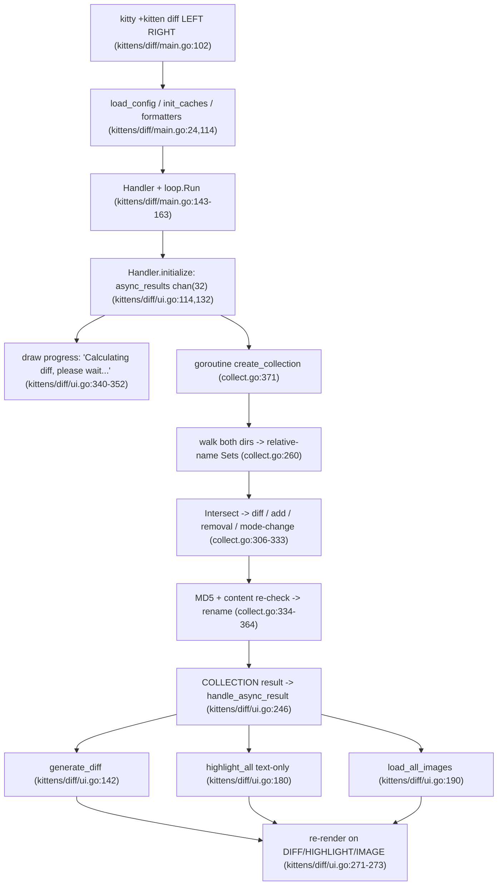

# How Kitty's "diff kitten" Works — A Runtime-Evidenced Walkthrough

This document answers eight questions about the Kitty terminal's **diff kitten**
(`kitty +kitten diff <left> <right>`). Every behavioral claim below was produced by
**building and running the kitten** and capturing its real output; the captured output is
shown next to each claim, together with the `file:line` in the source that implements the
behavior.

- **Source branch / commit:** `kitty_815df1e210e0` (`815df1e210e0a9ab4622f5c7f2d6891d7dbeddf1`).
- **Runtime environment:** Docker image
  `ghcr.io/scaleapi/swe-atlas:swe_atlas_QnA_kovidgoyal_kitty_1.0` (Ubuntu 24.04, Go 1.23.4,
  Python 3.12.3), container `kitty-diff-env`. The container is the *same commit* as the source
  checkout, so the `file:line` citations match the tree byte-for-byte.
- **Canonical entry point** (used for every run unless a line is explicitly labeled otherwise):
  ```
  ./kitty/launcher/kitty +kitten diff <LEFT> <RIGHT>
  ```
  The diff kitten is a full-screen TUI that opens `/dev/tty`, so runs are transported through a
  small PTY driver (`ptycap.py`, shown below). The driver only supplies a headless terminal — the
  program it launches is exactly the canonical `kitty +kitten diff …` argv, so these are genuine
  canonical-entry-point observations.

**Evidence labels used throughout**

- **[OBSERVED]** — captured from a real run of the canonical entry point.
- **[INFERRED]** — read from the source; not directly observable in this headless harness (always
  paired with the reason it could not be observed).
- **[NON-CANONICAL]** — obtained through a path other than the canonical entry point (e.g. a
  race-instrumented build of the same kitten, or a direct `runtime` probe). Used only as a
  supplement, always labeled.

---

## Methodology / Harness

### Build (must happen before any run)

A bare `go build ./kittens/diff/` fails without Kitty's code-generation step (it produces the root
`kitty` package and the `go:embed` targets). The project is therefore built through `setup.py`:

```console
$ cd /app && python3 setup.py            # exit status captured below
```

Observed result — **exit status 0** [OBSERVED]. Full output (`/tmp/dk_captures/setup_build.log`):

```text
[1/5] Compiling [wayland] glfw/input.c ...
[2/5] Compiling [wayland] glfw/xkb_glfw.c ...
[3/5] Compiling [wayland] glfw/window.c ...
[4/5] Compiling [wayland] glfw/wl_init.c ...
[5/5] Compiling [wayland] glfw/egl_context.c ...
 done
[1/1] Linking [wayland] kitty/glfw-wayland ...
 done
github.com/klauspost/cpuid/v2
kitty/tools/crypto
kitty/tools/cmd/mouse_demo
kitty/kittens/hyperlinked_grep
kitty/kittens/query_terminal
kitty/kittens/show_key
kitty/tools/cmd/show_error
kitty/kittens/ask
kitty/tools/cmd/update_self
kitty/tools/cmd/run_shell
kitty/tools/cmd/edit_in_kitty
kitty/kittens/hints
kitty/kittens/clipboard
kitty/tools/unicode_names
kitty/tools/cmd/benchmark
kitty/kittens/themes
kitty/kittens/icat
kitty/tools/cmd/pytest
kitty/kittens/choose_fonts
kitty/tools/cmd/at
kitty/kittens/unicode_input
github.com/zeebo/xxh3
kitty/tools/rsync
kitty/kittens/transfer
kitty/tools/cmd/tool
kitty/tools/cmd/completion
```

The build was incremental (the image ships pre-built at this commit), so only the C GLFW backend
and the Go tool/kitten binaries relink. This captured output is from the **first** invocation in a
freshly-started container; a second consecutive `python3 setup.py` on the already-built tree is a
**no-op** — exit 0 with no output [OBSERVED] — so this block is illustrative of a from-scratch relink
rather than reproducible verbatim on an incremental re-run. The generated root package lives at repository-root
`constants_generated.go` (Go package `kitty`), and the `go:embed` target is
`tools/tui/shell_integration/data_generated.bin` ([tools/tui/shell_integration/data.go:19]).

The kitten's own help confirms the entry point and usage string [OBSERVED]:

```console
$ ./kitty/launcher/kitty +kitten diff --help
```
```text
Usage: kitten diff [options] file_or_directory_left file_or_directory_right

Show a side-by-side diff of the specified files/directories. You can also use
ssh:hostname:remote-file-path to diff remote files.

Options:
  --context [=-1]
    Number of lines of context to show between changes. Negative values use the
    number set in diff.conf.

  --config
    Specify a path to the configuration file(s) to use. All configuration files
    are merged onto the builtin diff.conf, overriding the builtin values. This
    option can be specified multiple times to read multiple configuration files
    in sequence, which are merged. Use the special value NONE to not load any
    config file.

    If this option is not specified, config files are searched for in the order:
    $XDG_CONFIG_HOME/kitty/diff.conf, ~/.config/kitty/diff.conf,
    $XDG_CONFIG_DIRS/kitty/diff.conf. The first one that exists is used as the
    config file.

    If the environment variable KITTY_CONFIG_DIRECTORY is specified, that
    directory is always used and the above searching does not happen.

    If /etc/xdg/kitty/diff.conf exists, it is merged before (i.e. with lower
    priority) than any user config files. It can be used to specify system-wide
    defaults for all users. You can use either - or /dev/stdin to read the
    config from STDIN.

  --override, -o
    Override individual configuration options, can be specified multiple times.
    Syntax: name=value. For example: -o background=gray

  --help, -h
    Show help for this command

kitten diff 0.35.2 created by Kovid Goyal
```

The usage string comes from [kittens/diff/main.py:296]; the "Must be run as kitten diff" guard is
[kittens/diff/main.py:14].

### Harness scripts (verbatim)

All fixtures live **outside** the source tree under `/tmp/dk_fixtures`, and every script lives under
`/tmp/dk_harness`; both are removed at the end (see *Cleanliness / integrity note*). The scripts are
reproduced in full so every run below is reproducible.

**`make_fixtures.sh`** — builds all fixtures deterministically (idempotent: it wipes and recreates
`$ROOT`). Because it runs `rm -rf "$ROOT"`, it first **guards the target path**: `$ROOT` must be a
literal `/tmp/dk_*` or `/tmp/diffkitten_*` scratch path, must not contain a `..` traversal, and must
not itself be a symlink — otherwise it prints a refusal and exits `2` **before deleting anything**.
An omitted argument falls back to the safe default `/tmp/dk_fixtures`:

```bash
#!/usr/bin/env bash
# Build all diff-kitten test fixtures OUTSIDE the source tree, under $ROOT.
# Deterministic and idempotent: it wipes and recreates $ROOT every run.
set -eu
ROOT=${1:-/tmp/dk_fixtures}

# ---- Safety guard: refuse to 'rm -rf' anything outside an allowed scratch prefix ----
# $ROOT must be a literal /tmp/dk_* or /tmp/diffkitten_* path, contain no '..' traversal,
# and not itself be a symlink. This prevents an empty/'/'/relative/symlinked argument from
# deleting the wrong tree.
case "$ROOT" in
  /tmp/dk_*|/tmp/diffkitten_*) : ;;
  *) echo "refusing unsafe ROOT: '$ROOT' (must be /tmp/dk_* or /tmp/diffkitten_*)" >&2; exit 2 ;;
esac
case "$ROOT" in
  *..*) echo "refusing ROOT containing '..': '$ROOT'" >&2; exit 2 ;;
esac
if [ -L "$ROOT" ]; then
  echo "refusing to operate on symlink ROOT: '$ROOT'" >&2; exit 2
fi

rm -rf "$ROOT"
mkdir -p "$ROOT"

# ---- F1: pairing / classification ---------------------------------------
mkdir -p "$ROOT/F1/left" "$ROOT/F1/right"
# same.txt: identical content AND identical mode  -> NO entry
printf 'alpha\nbeta\ngamma\n' > "$ROOT/F1/left/same.txt"
printf 'alpha\nbeta\ngamma\n' > "$ROOT/F1/right/same.txt"
# app.go: same relative path, different content    -> diff
printf 'package main\n\nimport "fmt"\n\nfunc main() {\n\tfmt.Println("hello")\n}\n' > "$ROOT/F1/left/app.go"
printf 'package main\n\nimport "fmt"\n\nfunc main() {\n\tname := "world"\n\tfmt.Println("hello", name)\n}\n' > "$ROOT/F1/right/app.go"
# script.sh: same relative path, same content, different MODE -> mode-only change
printf '#!/bin/sh\necho hi\n' > "$ROOT/F1/left/script.sh"
printf '#!/bin/sh\necho hi\n' > "$ROOT/F1/right/script.sh"
chmod 0644 "$ROOT/F1/left/script.sh"
chmod 0755 "$ROOT/F1/right/script.sh"
# only_left / only_right                            -> removal / addition
printf 'this file exists only on the left\nit will be removed\n' > "$ROOT/F1/left/only_left.txt"
printf 'this file exists only on the right\nit is newly added\n' > "$ROOT/F1/right/only_right.txt"

# ---- F1b: nested-directory pairing --------------------------------------
mkdir -p "$ROOT/F1b/left/sub/deep" "$ROOT/F1b/right/sub/deep"
printf 'nested original\ncommon tail\n' > "$ROOT/F1b/left/sub/deep/nested.txt"
printf 'nested changed\ncommon tail\n'  > "$ROOT/F1b/right/sub/deep/nested.txt"

# ---- F2: true rename (byte-identical, different relative path) ----------
mkdir -p "$ROOT/F2/left" "$ROOT/F2/right"
printf 'def greet():\n    return "hi"\n' > "$ROOT/F2/left/old_name.py"
printf 'def greet():\n    return "hi"\n' > "$ROOT/F2/right/new_name.py"

# ---- F3: rename hash-gate counter-case (different content) --------------
mkdir -p "$ROOT/F3/left" "$ROOT/F3/right"
printf 'this file is going away\n'   > "$ROOT/F3/left/gone.txt"
printf 'this file is brand new\n'     > "$ROOT/F3/right/brandnew.txt"

# ---- F4: 60 files per side, 10 languages, each 5-line -> 6-line ---------
mkdir -p "$ROOT/F4/left" "$ROOT/F4/right"
exts=(go py js c rs java rb ts sh lua)
for i in $(seq 1 60); do
  ext=${exts[$(( (i-1) % 10 ))]}
  f="mod_${i}.${ext}"
  printf 'line1 file %s ext %s\nfunc_%s_original()\ncommon_a\ncommon_b\ntail_%s\n' "$i" "$ext" "$i" "$i" > "$ROOT/F4/left/$f"
  printf 'line1 file %s ext %s\nfunc_%s_changed()\ncommon_a\nEXTRA_LINE_1\ncommon_b\ntail_%s\n' "$i" "$ext" "$i" "$i" > "$ROOT/F4/right/$f"
done

# ---- F5: binary blob (non-UTF-8), changed between sides -----------------
# Deterministic content (NOT /dev/urandom): the full 0x00..0xff byte range, repeated. Left is
# 4096 bytes, right is 8192 bytes. A non-UTF-8 sentinel (0xff 0xfe ...) is written at offset 0
# so is_path_text() is deterministically false on both sides and the exact bytes reproduce
# byte-for-byte across runs.
mkdir -p "$ROOT/F5/left" "$ROOT/F5/right"
python3 - "$ROOT" <<'PY'
import sys
root = sys.argv[1]
left  = bytearray(bytes(range(256)) * 16)   # 4096 bytes
right = bytearray(bytes(range(256)) * 32)   # 8192 bytes
left[0:4]  = b'\xff\xfe\x00\x01'
right[0:4] = b'\xff\xfe\x00\x02'
open(f"{root}/F5/left/blob.bin",  "wb").write(bytes(left))
open(f"{root}/F5/right/blob.bin", "wb").write(bytes(right))
PY

# ---- F6: real PNG/JPEG images: added / changed / removed ----------------
mkdir -p "$ROOT/F6/left" "$ROOT/F6/right"
python3 - "$ROOT" <<'PY'
import sys
from PIL import Image
root = sys.argv[1]
Image.new("RGB", (64, 48), (10, 20, 200)).save(f"{root}/F6/left/changed.png")
Image.new("RGB", (80, 60), (200, 20, 10)).save(f"{root}/F6/right/changed.png")
Image.new("RGB", (40, 40), (0, 180, 0)).save(f"{root}/F6/left/removed.png")
Image.new("RGB", (50, 50), (180, 180, 0)).save(f"{root}/F6/right/added.jpg", quality=90)
PY

# ---- F7: 5-line vs 6-line pair for differ comparison + anchors ----------
mkdir -p "$ROOT/F7/left" "$ROOT/F7/right"
printf 'one\ntwo\nthree\nfour\nfive\n'        > "$ROOT/F7/left/sample.txt"
printf 'one\ntwo\nNEW\nthree\nfour\nfive\n'   > "$ROOT/F7/right/sample.txt"

echo "FIXTURES_BUILT_AT=$ROOT"
```

Two additional tiny fixtures are created ad hoc in the relevant sections: **F8** (a balanced
one-line modification, for Q8's intra-line highlighting) and **F9** (a `.pyc` file, for Q7's
`ignore_name`). Their exact `printf` commands are shown inline where they are used.

**`ptycap.py`** — the PTY driver. It writes the complete raw VT byte stream to an explicit path plus
a timestamped chunk log, lets the UI settle, then sends the **quit key**. The diff kitten runs the
kitty keyboard protocol, so a bare `q` byte is *not* the quit key — `q` must be transmitted as
**CSI 113 u** (hex `1b 5b 31 31 33 75`), which is the default `DK_QUIT_HEX` below. After sending it,
the driver drains output until the child closes the PTY, then reaps the child with a **blocking
`os.waitpid`** so the child's true termination status is captured (not a `WNOHANG` "0" race) and
propagated as the driver's own exit code (`128+signal` when the child was killed). `SIGTERM`/`SIGKILL`
are used only as escalating fallbacks if the clean CSI-113u quit does not take effect:

```python
#!/usr/bin/env python3
# PTY capture driver for the diff-kitten TUI (a full-screen program that opens /dev/tty).
# Usage: ptycap.py <out_raw> <quit_after_s> -- <cmd> [args...]
#
# Quit sequence: the diff kitten runs the kitty keyboard protocol, so a bare 'q' byte is NOT
# the quit key -- 'q' must be sent as CSI 113 u (hex 1b 5b 31 31 33 75). That exact sequence is
# the default here; override with DK_QUIT_HEX. After sending it we drain output until the child
# closes the PTY, then reap it with a BLOCKING os.waitpid so the child's true exit status is
# captured (not a WNOHANG "0" race) and propagated as this driver's own exit code
# (128+signal when the child was killed). SIGTERM/SIGKILL are only used as escalating fallbacks
# if the clean CSI-113u quit does not take effect.
import os, pty, sys, time, select, fcntl, termios, struct, signal, json

if "--" not in sys.argv:
    sys.stderr.write("usage: ptycap.py <out_raw> <quit_after_s> -- <cmd...>\n"); sys.exit(2)
sep = sys.argv.index("--")
out_raw = sys.argv[1]
quit_after = float(sys.argv[2])
cmd = sys.argv[sep+1:]
ROWS = int(os.environ.get("DK_ROWS", "50"))
COLS = int(os.environ.get("DK_COLS", "220"))
QUIT = bytes.fromhex(os.environ.get("DK_QUIT_HEX", "1b5b31313375"))  # CSI 113 u  == 'q'
HARD_TIMEOUT = quit_after + 3.0

pid, fd = pty.fork()
if pid == 0:
    try:
        fcntl.ioctl(1, termios.TIOCSWINSZ, struct.pack("HHHH", ROWS, COLS, 0, 0))
    except Exception:
        pass
    env = dict(os.environ); env["TERM"] = "xterm-256color"
    try:
        os.execvpe(cmd[0], cmd, env)
    except Exception as e:
        sys.stderr.write("exec failed: %s\n" % e); os._exit(127)

try:
    fcntl.ioctl(fd, termios.TIOCSWINSZ, struct.pack("HHHH", ROWS, COLS, 0, 0))
except Exception:
    pass

status = None
def reap_block():
    # Blocking reap: capture the child's actual termination status.
    global status
    try:
        _, status = os.waitpid(pid, 0)
    except ChildProcessError:
        status = None
    return status

out = bytearray(); chunks = []
start = time.time(); sent_q = False; sent_term = False; sent_kill = False
while True:
    r, _, _ = select.select([fd], [], [], 0.05)
    if fd in r:
        try:
            d = os.read(fd, 65536)
        except OSError:
            break
        if not d:            # EOF: child closed the PTY (it exited)
            break
        out.extend(d)
        chunks.append((time.time() - start, d.hex()))
    el = time.time() - start
    if el > quit_after and not sent_q:
        try: os.write(fd, QUIT)     # clean quit via CSI 113 u
        except OSError: pass
        sent_q = True
    if el > quit_after + 1.0 and not sent_term:
        try: os.kill(pid, signal.SIGTERM)   # fallback only
        except OSError: pass
        sent_term = True
    if el > HARD_TIMEOUT and not sent_kill:
        try: os.kill(pid, signal.SIGKILL)   # last-resort fallback
        except OSError: pass
        sent_kill = True
        break

reap_block()
try: os.close(fd)
except OSError: pass

raw = bytes(out)
with open(out_raw, "wb") as f:
    f.write(raw)
with open(out_raw + ".chunks.jsonl", "w") as f:
    for t, h in chunks:
        f.write(json.dumps({"t": round(t, 4), "b": h}) + "\n")

# Decode and propagate the child's real exit status.
exit_line = "EXIT=unknown"; rc = 0
if status is not None:
    if os.WIFEXITED(status):
        rc = os.WEXITSTATUS(status); exit_line = "EXIT=%d" % rc
    elif os.WIFSIGNALED(status):
        s = os.WTERMSIG(status); rc = 128 + s; exit_line = "SIGNAL=%d" % s
print("RAW_BYTES=%d %s SENT_QUIT=%s SENT_TERM=%s SENT_KILL=%s" % (
    len(raw), exit_line, sent_q, sent_term, sent_kill))   # per-read CHUNKS timing → .chunks.jsonl
sys.exit(rc)
```

**`vtframes.py`** — reconstructs the terminal screen from the raw stream. A *frame* is one
synchronized update delimited by `ESC[?2026h … ESC[?2026l` (terminal "pending update" mode 2026,
emitted by Kitty's `escape_code` for `PENDING_UPDATE` at [tools/tui/loop/terminal-state.go:71]).
`--final` renders the cumulative final screen; `--list` lists frames and whether each carried 24-bit
truecolor SGR (i.e. syntax highlighting); `--frame N`/`--all` render frames in isolation. (Colors are
stripped for the plain-text `--final`/`--frame` views; a separate helper `sgruns.py`, listed below and used in Q8,
extracts background-color runs when color matters.)

```python
#!/usr/bin/env python3
# VT reconstructor: vtframes.py <raw> [--final|--list|--frame N|--all]
# A frame = one synchronized update ESC[?2026h .. ESC[?2026l (mode 2026).
import sys, re, os
ROWS = int(os.environ.get("DK_ROWS", "50"))
COLS = int(os.environ.get("DK_COLS", "220"))
raw = open(sys.argv[1], "rb").read().decode("utf-8", "replace")
mode = sys.argv[2] if len(sys.argv) > 2 else "--final"
argN = int(sys.argv[3]) if len(sys.argv) > 3 else None
TRUECOLOR = re.compile(r"\x1b\[[0-9;:]*38[:;]2[:;]")

def apply(seg, grid=None):
    if grid is None:
        grid = [[" "] * COLS for _ in range(ROWS)]
    cr = cc = 0
    def clampr(r): return max(0, min(ROWS - 1, r))
    def clampc(c): return max(0, min(COLS - 1, c))
    i, n = 0, len(seg)
    while i < n:
        ch = seg[i]
        if ch == "\x1b":
            m = re.match(r"\x1b\][^\x07]*\x07", seg[i:])           # OSC
            if m: i += m.end(); continue
            m = re.match(r"\x1b[PX^_].*?\x1b\\", seg[i:], re.S)      # DCS/APC/PM/SOS
            if m: i += m.end(); continue
            m = re.match(r"\x1b\[([0-9;:?]*)([@-~])", seg[i:])       # CSI
            if m:
                params, fin = m.group(1), m.group(2)
                nums = [int(x) for x in re.split("[;:]", params) if x.isdigit()]
                if fin in "Hf":
                    r = (nums[0]-1) if len(nums) >= 1 else 0
                    c = (nums[1]-1) if len(nums) >= 2 else 0
                    cr, cc = clampr(r), clampc(c)
                elif fin == "A": cr = clampr(cr - (nums[0] if nums else 1))
                elif fin == "B": cr = clampr(cr + (nums[0] if nums else 1))
                elif fin == "C": cc = clampc(cc + (nums[0] if nums else 1))
                elif fin == "D": cc = clampc(cc - (nums[0] if nums else 1))
                elif fin == "G": cc = clampc((nums[0]-1) if nums else 0)
                elif fin == "d": cr = clampr((nums[0]-1) if nums else 0)
                elif fin == "J":
                    md = nums[0] if nums else 0
                    if md == 0:
                        for c in range(cc, COLS): grid[cr][c] = " "
                        for r in range(cr+1, ROWS):
                            for c in range(COLS): grid[r][c] = " "
                    elif md == 1:
                        for r in range(0, cr):
                            for c in range(COLS): grid[r][c] = " "
                        for c in range(0, cc+1): grid[cr][c] = " "
                    else:
                        for r in range(ROWS):
                            for c in range(COLS): grid[r][c] = " "
                elif fin == "K":
                    md = nums[0] if nums else 0
                    if md == 0:
                        for c in range(cc, COLS): grid[cr][c] = " "
                    elif md == 1:
                        for c in range(0, cc+1): grid[cr][c] = " "
                    else:
                        for c in range(COLS): grid[cr][c] = " "
                i += m.end(); continue
            i += 2; continue
        if ch == "\r": cc = 0; i += 1; continue
        if ch == "\n": cr = clampr(cr + 1); cc = 0; i += 1; continue
        if ch == "\t": cc = clampc((cc // 8 + 1) * 8); i += 1; continue
        if ch == "\x08": cc = clampc(cc - 1); i += 1; continue
        if ch == "\x07": i += 1; continue
        if ord(ch) >= 32:
            grid[cr][cc] = ch; cc += 1
            if cc >= COLS: cc = COLS - 1
        i += 1
    return grid

def dump(grid):
    lines = ["".join(row).rstrip() for row in grid]
    while lines and not lines[-1].strip(): lines.pop()
    print("\n".join([l for l in lines if l.strip()]))

starts = [m.start() for m in re.finditer(r"\x1b\[\?2026h", raw)]
frames = []
for idx, s in enumerate(starts):
    e = starts[idx+1] if idx+1 < len(starts) else len(raw)
    frames.append((s, e, raw[s:e]))

if mode == "--final":
    dump(apply(raw))
elif mode == "--list":
    print("FRAMES=%d" % len(frames))
    for idx, (s, e, seg) in enumerate(frames):
        has = "yes" if TRUECOLOR.search(seg) else "no"
        g = apply(seg); nonblank = [l for l in ("".join(r).rstrip() for r in g) if l.strip()]
        print("frame %d: bytes[%d:%d] truecolor=%s first_line=%r" %
              (idx, s, e, has, (nonblank[0][:60] if nonblank else "(blank)")))
elif mode == "--frame":
    dump(apply(frames[argN][2]))
elif mode == "--all":
    for idx, (s, e, seg) in enumerate(frames):
        print("======== FRAME %d (bytes %d:%d) ========" % (idx, s, e)); dump(apply(seg))
```

**`gkeys.py`** — extracts Kitty Graphics Protocol chunks (`ESC _ G <keys> ; <payload> ESC \`) from a
raw stream and classifies each by its action key `a=`:

```python
#!/usr/bin/env python3
# Classify Kitty Graphics Protocol (APC _G) chunks by action key a=.
#   a=q query  a=t transmit  a=T transmit+display  a=p display  a=d delete  a=f frame  a=a animate
import sys, re
raw = open(sys.argv[1], "rb").read()
chunks = re.findall(rb"\x1b_G([^\x1b]*)(?:;[^\x1b]*)?\x1b\\", raw)
ACT = {"q":"query","t":"transmit","T":"transmit+display","p":"display",
       "d":"delete","f":"frame","a":"animate","c":"compose"}
print("G_CHUNKS=%d" % len(chunks))
from collections import Counter
counts = Counter()
for idx, keys in enumerate(chunks):
    ks = keys.decode("ascii", "replace")
    m = re.search(r"(?:^|,)a=([a-zA-Z])", ks)
    act = ACT.get(m.group(1), "?"+(m.group(1) if m else "")) if m else "(no a= : default transmit)"
    counts[act] += 1
    if idx < 8:
        print("chunk %d: a-action=%-16s keys=%s" % (idx, act, ks))
print("ACTION_COUNTS=%s" % dict(counts))
```

**`sgruns.py`** — reconstructs the screen (same cursor model as `vtframes.py`) while tracking each
cell's truecolor *background* (`SGR 48:2:R:G:B`), then prints the background-color runs of the row
containing a given word, skipping the numeric line-number gutters and stripping the line-background
column fill so only the real cell text remains:

```python
#!/usr/bin/env python3
# sgruns.py <raw_capture> <word>  [OBSERVED helper]
# Reconstructs the VT screen (same cursor model as vtframes.py) while tracking the
# truecolor *background* (SGR 48:2:R:G:B) of every cell, then prints the background-color
# runs of the single screen row that contains <word>. Line-number gutters (a run whose
# text is just digits) delimit the left/right halves of the side-by-side view; the
# trailing column-fill painted in the line background is stripped from the last run of
# each half so only the real cell text is shown.
import sys, re, os
ROWS = int(os.environ.get("DK_ROWS", "50"))
COLS = int(os.environ.get("DK_COLS", "220"))
raw  = open(sys.argv[1], "rb").read().decode("utf-8", "replace")
word = sys.argv[2]

def parse_sgr(params):
    ops = []
    for g in (params.split(";") if params else ["0"]):
        parts = g.split(":")
        head = parts[0]
        if head in ("", "0"):
            ops.append(("reset", None))
        elif head == "49":
            ops.append(("bg", None))
        elif head == "48" and len(parts) >= 2 and parts[1] == "2":
            nums = [p for p in parts[2:] if p != ""]
            if len(nums) >= 3:
                ops.append(("bg", (nums[-3], nums[-2], nums[-1])))
    return ops

def apply(seg):
    grid = [[(" ", None) for _ in range(COLS)] for _ in range(ROWS)]
    cr = cc = 0
    curbg = None
    clampr = lambda r: max(0, min(ROWS - 1, r))
    clampc = lambda c: max(0, min(COLS - 1, c))
    i, n = 0, len(seg)
    while i < n:
        ch = seg[i]
        if ch == "\x1b":
            m = re.match(r"\x1b\][^\x07]*\x07", seg[i:])                 # OSC
            if m: i += m.end(); continue
            m = re.match(r"\x1b[PX^_].*?\x1b\\", seg[i:], re.S)          # DCS/APC/PM/SOS
            if m: i += m.end(); continue
            m = re.match(r"\x1b\[([0-9;:?]*)([@-~])", seg[i:])           # CSI
            if m:
                params, fin = m.group(1), m.group(2)
                if fin == "m":
                    for kind, val in parse_sgr(params):
                        if kind == "reset": curbg = None
                        else: curbg = val
                else:
                    nums = [int(x) for x in re.split("[;:]", params) if x.isdigit()]
                    if fin in "Hf":
                        r = (nums[0] - 1) if len(nums) >= 1 else 0
                        c = (nums[1] - 1) if len(nums) >= 2 else 0
                        cr, cc = clampr(r), clampc(c)
                    elif fin == "A": cr = clampr(cr - (nums[0] if nums else 1))
                    elif fin == "B": cr = clampr(cr + (nums[0] if nums else 1))
                    elif fin == "C": cc = clampc(cc + (nums[0] if nums else 1))
                    elif fin == "D": cc = clampc(cc - (nums[0] if nums else 1))
                    elif fin == "G": cc = clampc((nums[0] - 1) if nums else 0)
                    elif fin == "d": cr = clampr((nums[0] - 1) if nums else 0)
                    elif fin == "K":
                        md = nums[0] if nums else 0
                        rng = range(cc, COLS) if md == 0 else (range(0, cc + 1) if md == 1 else range(COLS))
                        for c in rng: grid[cr][c] = (" ", curbg)
                    elif fin == "J":
                        md = nums[0] if nums else 0
                        if md == 0:
                            for c in range(cc, COLS): grid[cr][c] = (" ", None)
                            for r in range(cr + 1, ROWS):
                                for c in range(COLS): grid[r][c] = (" ", None)
                i += m.end(); continue
            i += 2; continue
        if ch == "\r": cc = 0; i += 1; continue
        if ch == "\n": cr = clampr(cr + 1); cc = 0; i += 1; continue
        if ch == "\t": cc = clampc((cc // 8 + 1) * 8); i += 1; continue
        if ch == "\x08": cc = clampc(cc - 1); i += 1; continue
        if ch == "\x07": i += 1; continue
        if ord(ch) >= 32:
            grid[cr][cc] = (ch, curbg); cc += 1
            if cc >= COLS: cc = COLS - 1
        i += 1
    return grid

grid = apply(raw)
row = next((r for r in range(ROWS) if word in "".join(c for c, _ in grid[r])), None)
if row is None:
    sys.stderr.write("word %r not found on any row\n" % word); sys.exit(1)

# Coalesce the row into (bg, text) runs.
runs = []
for ch, bg in grid[row]:
    if runs and runs[-1][0] == bg:
        runs[-1][1] += ch
    else:
        runs.append([bg, ch])

# Split into halves on numeric line-number gutters; strip trailing column-fill
# from the last run of each half; emit only real background-color runs.
segment, out = [], []
def flush(seg):
    if not seg:
        return
    seg[-1][1] = seg[-1][1].rstrip(" ")   # drop the line-background column fill
    for bg, txt in seg:
        if bg is not None and txt != "":
            out.append((bg, txt))
for bg, txt in runs:
    if txt.strip().isdigit():             # line-number gutter delimits a half
        flush(segment); segment = []
    else:
        segment.append([bg, txt])
flush(segment)

for bg, txt in out:
    print("bg=('rgb','%s','%s','%s') text=%r" % (bg[0], bg[1], bg[2], txt))
```

### Fixtures at a glance

| Fixture | Purpose | Left → Right |
|---|---|---|
| **F1** | pairing / classification | `same.txt` (identical), `app.go` (changed), `script.sh` (mode 0644→0755), `only_left.txt`, `only_right.txt` |
| **F1b** | nested pairing | `sub/deep/nested.txt` changed |
| **F2** | true rename | `old_name.py` → `new_name.py` (byte-identical) |
| **F3** | rename counter-case | `gone.txt` vs `brandnew.txt` (different content) |
| **F4** | many files | 60 files/side, 10 extensions, each 5→6 lines |
| **F5** | binary | `blob.bin` 4096→8192 bytes, non-UTF-8 |
| **F6** | images | `changed.png` 64×48→80×60, `removed.png` (left), `added.jpg` (right) |
| **F7** | differ / anchors | `sample.txt` 5→6 lines (one insertion) |

---

## Q1 — Directory pairing: which left file "belongs together" with which right file?

**Answer.** Pairing is **by identical path relative to each root**. The kitten walks both directory
trees, builds a `Set` of relative paths for each side, and **intersects** them: a relative path that
exists on both sides is one logical file to be compared; a path only on the left is a *removal*; a
path only on the right is an *addition*. There is no fuzzy or content-based name matching at this
stage. Even when the bytes are identical, a difference in file **mode** still registers as a change.

**Mechanism (`file:line`).** `collect_files` [kittens/diff/collect.go:296] calls `walk`
[kittens/diff/collect.go:260] (which uses `filepath.WalkDir`) to gather each side's relative paths
into a `Set`, filtered by the `allowed`/`ignore_name` glob test [kittens/diff/collect.go:230]. It
then computes `common_names = left_names.Intersect(right_names)` [kittens/diff/collect.go:306]. Each
common name becomes a change via `add_change` [kittens/diff/collect.go:317-319]; if the two files have
identical content it is still emitted when `os.Stat().Mode()` differs
[kittens/diff/collect.go:321-327]. Left-only names become removals and right-only names become
additions [kittens/diff/collect.go:332-333].

**Run & output** [OBSERVED] — fixture **F1**:

```console
$ mkdir -p /tmp/dk_captures          # capture directory used by every run below
$ bash /tmp/dk_harness/make_fixtures.sh
$ DK_ROWS=40 DK_COLS=120 python3 /tmp/dk_harness/ptycap.py /tmp/dk_captures/F1.raw 2.0 -- \
      ./kitty/launcher/kitty +kitten diff /tmp/dk_fixtures/F1/left /tmp/dk_fixtures/F1/right
RAW_BYTES=12455 EXIT=0 SENT_QUIT=True SENT_TERM=False SENT_KILL=False
$ DK_ROWS=40 DK_COLS=120 python3 /tmp/dk_harness/vtframes.py /tmp/dk_captures/F1.raw --final
```
```text
   app.go
━━━━━━━━━━━━━━━━━━━━━━━━━━━━━━━━━━━━━━━━━━━━━━━━━━━━━━━━━━━━━━━━━━━━━━━━━━━━━━━━━━━━━━━━━━━━━━━━━━━━━━━━━━━━━━━━━━━━━━━━
   @@ -3,5 +3,6 @@ package main
3  import "fmt"                                             3  import "fmt"
4                                                           4
5  func main() {                                            5  func main() {
6      fmt.Println("hello")                                 6      name := "world"
                                                            7      fmt.Println("hello", name)
7  }                                                        8  }
   only_left.txt
━━━━━━━━━━━━━━━━━━━━━━━━━━━━━━━━━━━━━━━━━━━━━━━━━━━━━━━━━━━━━━━━━━━━━━━━━━━━━━━━━━━━━━━━━━━━━━━━━━━━━━━━━━━━━━━━━━━━━━━━
1  this file exists only on the left                           This file was removed
2  it will be removed
   only_right.txt
━━━━━━━━━━━━━━━━━━━━━━━━━━━━━━━━━━━━━━━━━━━━━━━━━━━━━━━━━━━━━━━━━━━━━━━━━━━━━━━━━━━━━━━━━━━━━━━━━━━━━━━━━━━━━━━━━━━━━━━━
   This file was added                                      1  this file exists only on the right
                                                            2  it is newly added
   script.sh
━━━━━━━━━━━━━━━━━━━━━━━━━━━━━━━━━━━━━━━━━━━━━━━━━━━━━━━━━━━━━━━━━━━━━━━━━━━━━━━━━━━━━━━━━━━━━━━━━━━━━━━━━━━━━━━━━━━━━━━━
   Mode changed: -rw-r--r-- to -rwxr-xr-x
:                                                                                                                4,3  0Q
```

**Cause → effect, item by item:**

- `app.go` — same relative path, different bytes → a **diff** with hunk header `@@ -3,5 +3,6 @@`
  (the intersection produced one paired file).
- `only_left.txt` — present only on the left → **removal** ("This file was removed" on the right
  half).
- `only_right.txt` — present only on the right → **addition** ("This file was added" on the left
  half).
- `script.sh` — identical bytes, mode `0644`→`0755` → still a change: **"Mode changed:
  -rw-r--r-- to -rwxr-xr-x"** (the `Mode()` comparison at [kittens/diff/collect.go:321-327]).
- `same.txt` — identical content *and* mode → **absent** from the output entirely (no pairing entry
  is emitted).

The status line `4,3  0Q` shows the collection produced changes across the paired/added/removed
files: the `4,3` counts **4 added and 3 removed** lines in total (app.go `+2/-1`, `only_right.txt`
`+2`, `only_left.txt` `-2`), and the scroll indicator sits at the top of a non-scrolling screen.

**Pairing is on the *relative* path, including nested directories** [OBSERVED] — fixture **F1b**:

```console
$ DK_ROWS=40 DK_COLS=120 python3 /tmp/dk_harness/ptycap.py /tmp/dk_captures/F1b.raw 2.0 -- \
      ./kitty/launcher/kitty +kitten diff /tmp/dk_fixtures/F1b/left /tmp/dk_fixtures/F1b/right
$ DK_ROWS=40 DK_COLS=120 python3 /tmp/dk_harness/vtframes.py /tmp/dk_captures/F1b.raw --final
```
```text
   sub/deep/nested.txt
━━━━━━━━━━━━━━━━━━━━━━━━━━━━━━━━━━━━━━━━━━━━━━━━━━━━━━━━━━━━━━━━━━━━━━━━━━━━━━━━━━━━━━━━━━━━━━━━━━━━━━━━━━━━━━━━━━━━━━━━
   @@ -1,2 +1,2 @@
1  nested original                                          1  nested changed
2  common tail                                              2  common tail
:                                                                                                                1,1  0Q
```

The file is paired under its full relative path `sub/deep/nested.txt` — confirming the `Set` keys are
paths relative to each root, so identical sub-trees line up correctly.

**No fuzzy / near-miss name matching** [OBSERVED] — fixture **NF**. Two *similarly*-named files
(`report.txt` vs `report_final.txt`) with different content are **not** paired by name similarity:
pairing is strict relative-path intersection [kittens/diff/collect.go:306], and because their hashes
also differ, rename detection (Q2) declines too — so each stays a separate removal and addition:

```console
$ mkdir -p /tmp/dk_fixtures/NF/left /tmp/dk_fixtures/NF/right
$ printf 'first draft\nalpha\n'   > /tmp/dk_fixtures/NF/left/report.txt
$ printf 'final version\nbravo\n' > /tmp/dk_fixtures/NF/right/report_final.txt
$ DK_ROWS=40 DK_COLS=120 python3 /tmp/dk_harness/ptycap.py /tmp/dk_captures/NF.raw 2.0 -- \
      ./kitty/launcher/kitty +kitten diff /tmp/dk_fixtures/NF/left /tmp/dk_fixtures/NF/right
$ DK_ROWS=40 DK_COLS=120 python3 /tmp/dk_harness/vtframes.py /tmp/dk_captures/NF.raw --final
```
```text
   report.txt
━━━━━━━━━━━━━━━━━━━━━━━━━━━━━━━━━━━━━━━━━━━━━━━━━━━━━━━━━━━━━━━━━━━━━━━━━━━━━━━━━━━━━━━━━━━━━━━━━━━━━━━━━━━━━━━━━━━━━━━━
1  first draft                                                 This file was removed
2  alpha
   report_final.txt
━━━━━━━━━━━━━━━━━━━━━━━━━━━━━━━━━━━━━━━━━━━━━━━━━━━━━━━━━━━━━━━━━━━━━━━━━━━━━━━━━━━━━━━━━━━━━━━━━━━━━━━━━━━━━━━━━━━━━━━━
   This file was added                                      1  final version
                                                            2  bravo
:                                                                                                                2,2  0Q
```

`report.txt` (left-only) is a **removal** and `report_final.txt` (right-only) is an **addition** — the
near-identical names buy them nothing. This confirms the "no fuzzy matching" statement at the level of
an actual run, not just by assertion.

---

## Q2 — Rename recognition: rename vs. delete-plus-add

**Answer.** After the relative-path intersection (Q1), the kitten has a set of *left-only* files
(candidate removals) and *right-only* files (candidate additions). It computes an **MD5 hash** of
each such file; when a removed file and an added file have the **same hash**, it performs a **full
byte-for-byte content re-check**, and only if that also matches does it promote the pair to a
**rename** (discarding it from the additions so it is not double-counted). The hash is a fast filter;
the content re-check guards against hash collisions.

**Mechanism (`file:line`).** The rename block is [kittens/diff/collect.go:334-364]. `hash_for_path`
computes `md5.Sum` [kittens/diff/collect.go:106-114]. For each removed/added pair with equal hashes
it re-reads and compares the full content [kittens/diff/collect.go:351-353]; on a match it calls
`add_rename` [kittens/diff/collect.go:354] and `Discard`s the file from the added set
[kittens/diff/collect.go:355]. Unmatched left-only/right-only files fall through to `add_removal`
[kittens/diff/collect.go:362] and `add_add`.

**Run & output** [OBSERVED] — fixture **F2** (`old_name.py` and `new_name.py`, byte-identical):

```console
$ md5sum /tmp/dk_fixtures/F2/left/old_name.py /tmp/dk_fixtures/F2/right/new_name.py
484b44ab524eb3204fe2e5af53b60432  /tmp/dk_fixtures/F2/left/old_name.py
484b44ab524eb3204fe2e5af53b60432  /tmp/dk_fixtures/F2/right/new_name.py
$ DK_ROWS=40 DK_COLS=120 python3 /tmp/dk_harness/ptycap.py /tmp/dk_captures/F2.raw 2.0 -- \
      ./kitty/launcher/kitty +kitten diff /tmp/dk_fixtures/F2/left /tmp/dk_fixtures/F2/right
$ DK_ROWS=40 DK_COLS=120 python3 /tmp/dk_harness/vtframes.py /tmp/dk_captures/F2.raw --final
```
```text
   old_name.py                                                 new_name.py
━━━━━━━━━━━━━━━━━━━━━━━━━━━━━━━━━━━━━━━━━━━━━━━━━━━━━━━━━━━━━━━━━━━━━━━━━━━━━━━━━━━━━━━━━━━━━━━━━━━━━━━━━━━━━━━━━━━━━━━━
:                                                                                                                0,0  0Q
```

The two hashes are identical (`484b44ab…`), so the pair is recognized as a **rename**: it is a
*single* entry whose title shows the **old name on the left and the new name on the right**, not a
separate removal + addition. The status line reads `0,0  0Q` — zero added and zero removed lines,
because a pure rename changes no content.

**A subtle, honest detail about the rendered body.** The rename entry's *title* (two columns) renders
correctly, but the human-readable body line the code builds — `"The file <old> was renamed to
<new>"` — **never appears on screen**. This is confirmed directly: grepping the raw VT stream finds
zero occurrences of the body text [OBSERVED]:

```console
$ grep -ac "renamed" /tmp/dk_captures/F2.raw
0
$ grep -ac "The file" /tmp/dk_captures/F2.raw
0
```

Cause (mechanism is [INFERRED] from source; the *absence* is [OBSERVED] above): `rename_lines`
[kittens/diff/render.go:684-693] places the body text into the **right half**
(`sl.right.marked_up_text`) of a line flagged `is_full_width`. But `render_screen_line` returns early
after emitting only the **left** half of a full-width line [kittens/diff/render.go:99-100], so the
right-half body text is never written to the terminal. The net observable behavior is exactly what
the screen shows: two title columns and no body sentence.

**Counter-case — same names would collide, so different *content* must NOT be a rename** [OBSERVED]
— fixture **F3** (`gone.txt` vs `brandnew.txt`, different content ⇒ different hashes):

```console
$ md5sum /tmp/dk_fixtures/F3/left/gone.txt /tmp/dk_fixtures/F3/right/brandnew.txt
d82f9142b5febfe18e7a59f5905d4d46  /tmp/dk_fixtures/F3/left/gone.txt
41078de5cd15745a0a912d2bba59862b  /tmp/dk_fixtures/F3/right/brandnew.txt
$ DK_ROWS=40 DK_COLS=120 python3 /tmp/dk_harness/ptycap.py /tmp/dk_captures/F3.raw 2.0 -- \
      ./kitty/launcher/kitty +kitten diff /tmp/dk_fixtures/F3/left /tmp/dk_fixtures/F3/right
RAW_BYTES=4603 EXIT=0 SENT_QUIT=True SENT_TERM=False SENT_KILL=False
$ DK_ROWS=40 DK_COLS=120 python3 /tmp/dk_harness/vtframes.py /tmp/dk_captures/F3.raw --final
```
```text
   brandnew.txt
━━━━━━━━━━━━━━━━━━━━━━━━━━━━━━━━━━━━━━━━━━━━━━━━━━━━━━━━━━━━━━━━━━━━━━━━━━━━━━━━━━━━━━━━━━━━━━━━━━━━━━━━━━━━━━━━━━━━━━━━
   This file was added                                      1  this file is brand new
   gone.txt
━━━━━━━━━━━━━━━━━━━━━━━━━━━━━━━━━━━━━━━━━━━━━━━━━━━━━━━━━━━━━━━━━━━━━━━━━━━━━━━━━━━━━━━━━━━━━━━━━━━━━━━━━━━━━━━━━━━━━━━━
1  this file is going away                                     This file was removed
:                                                                                                                1,1  0Q
```

The hashes differ (`d82f9142…` vs `41078de5…`), so the content re-check gate is never even reached;
the two files stay a **separate addition and removal** — exactly the "delete one + add another"
behavior the rename detector is designed to avoid when the content genuinely differs.

**The content re-check as a collision guard (`if ld == rd`, [kittens/diff/collect.go:353]) — its
*pass* branch observed, its *reject* branch inferred.** Two distinct comparisons run in sequence: the
MD5 hashes are compared first (`if ah == rh` [kittens/diff/collect.go:350]) and, only on a hash match,
the full bytes are compared (`if ld == rd` [kittens/diff/collect.go:353]). In the true-rename case
(F2) *both* comparisons are exercised and the byte comparison **passes** (`ld == rd` → `add_rename`
[kittens/diff/collect.go:354]) — that is the observed run above, and the hash equality is corroborated
externally by `md5sum` (both `484b44ab…`). The complementary case the byte re-check exists *for* — two
files whose MD5 hashes **collide** but whose bytes **differ** — cannot be produced at the canonical
entry point in this environment, because manufacturing an MD5 collision needs a collision-generation
tool and none is present in the offline container [OBSERVED]:

```console
$ for t in md5collgen fastcoll hashclash; do command -v "$t" >/dev/null 2>&1 && echo "FOUND $t" || echo "absent $t"; done
absent md5collgen
absent fastcoll
absent hashclash
```

So the guard's **reject** path — `ld != rd` ⇒ `found` stays false ⇒ the left file becomes an
`add_removal` [kittens/diff/collect.go:362] and the right file an `add_add`
[kittens/diff/collect.go:366], i.e. **not** a rename — is [INFERRED] from the source structure, not
observed at runtime. What *is* observed (F2/F3) is the pass branch and the hash-mismatch branch; the
byte re-check is what makes the detector robust against a hash collision even though such a collision
is infeasible to stage here.

---

## Q3 — Caching pipeline & efficiency (raw bytes → highlighted output)

**Answer.** The kitten derives everything a file needs through a **layered, derive-once-and-memoize
pipeline** (with two concurrency/eviction caveats noted below), and memoizes each layer in its own
per-path cache keyed by file path:

1. **raw bytes** — `data_for_path` reads each file once, then serves the cached bytes
   [kittens/diff/collect.go:65];
2. **hash** — `hash_for_path` (MD5, for rename detection) [kittens/diff/collect.go:106];
3. **sanitized lines** — `lines_for_path` (tabs replaced, etc.) [kittens/diff/collect.go:138];
4. **highlighted lines** — `highlighted_lines_for_path` [kittens/diff/collect.go:148], which returns
   the syntax-highlighted lines if present and otherwise **falls back to the plain lines**
   [kittens/diff/collect.go:153-156].

Each cache is an instance of the generic `utils.LRUCache` [tools/utils/cache.go], all created in
`init_caches` with capacity 4096 [kittens/diff/collect.go:26].

**Important correction about "bounded" and "LRU".** Not all of these caches are actually bounded, and
even the bounded ones are *insertion-order*, not textbook LRU. This is visible directly in the
`LRUCache` source [OBSERVED, source read]:

```console
$ sed -n '25,72p' tools/utils/cache.go
```
```go
func (self *LRUCache[K, V]) Get(key K) (ans V, found bool) {
	self.lock.RLock()
	ans, found = self.data[key]
	self.lock.RUnlock()
	return
}

func (self *LRUCache[K, V]) Set(key K, val V) {
	self.lock.RLock()
	self.data[key] = val
	self.lock.RUnlock()
	return
}

func (self *LRUCache[K, V]) GetOrCreate(key K, create func(key K) (V, error)) (V, error) {
	self.lock.RLock()
	ans, found := self.data[key]
	self.lock.RUnlock()
	if found {
		return ans, nil
	}
	ans, err := create(key)
	if err == nil {
		self.lock.Lock()
		self.data[key] = ans
		self.lru.PushFront(key)
		if self.max_size > 0 && self.lru.Len() > self.max_size {
			k := self.lru.Remove(self.lru.Back())
			delete(self.data, k.(K))
		}
		self.lock.Unlock()
	}
	return ans, err
}

func (self *LRUCache[K, V]) MustGetOrCreate(key K, create func(key K) V) V {
	self.lock.RLock()
	ans, found := self.data[key]
	self.lock.RUnlock()
	if found {
		return ans
	}
	ans = create(key)
	self.lock.Lock()
	self.data[key] = ans
	self.lock.Unlock()
	return ans
}
```

Reading the three writers:

- **`GetOrCreate`** (lines 39-58) is the only method that maintains the `lru` list and evicts from
  the back when `Len() > max_size` — so caches populated through it are **bounded to 4096**. But note
  the *hit* path (lines 41-45) returns **without** moving the key to the front, so recency is never
  refreshed: eviction order is effectively **insertion order (FIFO-ish)**, not true LRU.
- **`MustGetOrCreate`** (lines 60-72) writes the map under a write-lock but touches **neither `lru`
  nor `max_size`** — caches populated through it are **unbounded**.
- **`Set`** (lines 32-37) writes the map under a **read** lock and also touches neither `lru` nor
  `max_size` — the cache populated through it is **unbounded** *and* racy (see Q5).

Mapping the diff kitten's caches to their writer:

| Cache | Populated via | Bounded? |
|---|---|---|
| `data` (raw bytes) | `GetOrCreate` [collect.go:65] | bounded (4096, insertion-order) |
| `size` | `GetOrCreate` | bounded (4096, insertion-order) |
| `hash` (MD5) | `GetOrCreate` [collect.go:106] | bounded (4096, insertion-order) |
| `lines` (sanitized) | `GetOrCreate` [collect.go:138] | bounded (4096, insertion-order) |
| `mimetypes` | `MustGetOrCreate` [collect.go:51] | **unbounded** |
| `is_text` | `MustGetOrCreate` [collect.go:86] | **unbounded** |
| `highlighted_lines` | `Set` [highlight.go:224] | **unbounded + racy** |

So the accurate statement is: **4 of the 7 caches are bounded (to 4096, in insertion order); 2 are
unbounded (`MustGetOrCreate`); 1 is unbounded and unsynchronized-for-writes (`Set`).** The efficiency
that *is* real comes from the **derive-once-and-memoize** structure — each expensive step (file read,
hashing, line sanitization, highlighting) is **computed on first miss and then served from cache while
the entry is resident**, so it is normally paid once per path and reused thereafter.

**Two honest caveats to "once" (both empirically confirmed by a non-canonical unit probe of the real
`utils.LRUCache` — labeled [NON-CANONICAL] below).** "Once" is the steady-state, single-reader
behavior — not an absolute guarantee:

1. **Post-eviction recompute.** The four bounded caches evict the LRU back entry once `Len() > 4096`
   [tools/utils/cache.go:51-54]. Re-requesting an evicted key misses and **recomputes**, so a path's
   bytes/hash/lines can be derived more than once when the working set exceeds 4096. (At the canonical
   entry point a directory pair with **more than 4096 changed files** puts exactly this pressure on the
   four bounded caches; the *highlighted-lines* cache, however, is written via `Set` and is
   **unbounded** — it never evicts at any size — and at that scale the run does not merely evict but
   **crashes** on the concurrent highlight writes, as the threshold sweep in Q5 shows.)
2. **Concurrent-miss duplicate compute.** In `GetOrCreate` the `create(key)` call runs with **no lock
   held** [tools/utils/cache.go:46] (between the `RUnlock` at :42 and the `Lock` at :48). If several
   goroutines miss the same key at once they **all** run `create` and the last write wins — so under
   concurrency the work can be done more than once.

The probe below (a `tools/utils` in-package test, removed after use) inserts three keys into a
capacity-2 cache — evicting the first — then re-requests it, and separately fires 8 goroutines at one
missing key with a deliberately slow `create`:

```go
func TestBlitzyAdhocCacheSemantics(t *testing.T) {
	// (1) Post-eviction recompute: capacity 2, insert 3 keys -> "a" evicted -> re-get "a" recomputes.
	var calls int64
	c := NewLRUCache[string, int](2)
	mk := func(k string) (int, error) { atomic.AddInt64(&calls, 1); return len(k), nil }
	c.GetOrCreate("a", mk); c.GetOrCreate("b", mk); c.GetOrCreate("c", mk); c.GetOrCreate("a", mk)
	fmt.Printf("BLITZY_EVICT create_calls=%d expected=4 (a,b,c, then a again; capacity=2)\n", atomic.LoadInt64(&calls))
	// (2) Concurrent-miss duplicate compute: 8 goroutines, one missing key, slow create widens the window.
	var ccalls int64
	c2 := NewLRUCache[string, int](4096)
	slow := func(k string) (int, error) { atomic.AddInt64(&ccalls, 1); time.Sleep(20 * time.Millisecond); return 1, nil }
	var wg sync.WaitGroup
	for i := 0; i < 8; i++ { wg.Add(1); go func() { defer wg.Done(); c2.GetOrCreate("dup", slow) }() }
	wg.Wait()
	fmt.Printf("BLITZY_CONCURRENT create_calls_for_one_key=%d (8 goroutines, one missing key)\n", atomic.LoadInt64(&ccalls))
}
```
```console
$ GOPROXY=off go test ./tools/utils/ -run TestBlitzyAdhocCacheSemantics -count=1 -v 2>&1 | grep BLITZY_
BLITZY_EVICT create_calls=4 expected=4 (a,b,c, then a again; capacity=2)
BLITZY_CONCURRENT create_calls_for_one_key=8 (8 goroutines, one missing key)
```

Cause → effect: the 4th `create` call for `"a"` proves recompute after eviction; the 8 `create` calls
for one key prove concurrent misses each do the work. Both counts were stable across two runs.
[NON-CANONICAL — a unit probe of the shared cache, not the diff entry point; it drives the same
`utils.LRUCache` the diff kitten's four bounded caches use.]

**The fallback layer is what enables "plain now, highlighted later."** `highlighted_lines_for_path`
returns plain lines when the highlight cache has no entry yet [kittens/diff/collect.go:153-156]; when
highlighting finishes it fills the cache and a re-render picks up the enriched lines. That the screen
re-renders in synchronized frames is directly observable [OBSERVED] — fixture **F1**:

```console
$ DK_ROWS=40 DK_COLS=120 python3 /tmp/dk_harness/vtframes.py /tmp/dk_captures/F1.raw --list
```
```text
FRAMES=3
frame 0: bytes[283:342] truecolor=no first_line='Calculating diff, please wait...'
frame 1: bytes[342:5263] truecolor=yes first_line='   app.go'
frame 2: bytes[5263:10535] truecolor=yes first_line='   app.go'
```

Honest reading of these three frames:

- **frame 0** is the initial screen — literally the text **"Calculating diff, please wait…"**
  (`truecolor=no`), not a blank screen. This is drawn by `draw_screen` while `logical_lines` /
  `diff_map` / `collection` are still nil [kittens/diff/ui.go:340-352].
- **frames 1 and 2** both carry 24-bit *foreground* truecolor SGR (the frame lister's regex matches
  `38:2:r:g:b`, so it prints `truecolor=yes`). **This alone does *not* prove syntax highlighting**,
  because the diff *chrome* — filename headers, line numbers, the `+`/`-` change markers — is itself
  drawn with foreground truecolor. Telling "highlighted" from "merely colored" needs a finer signal.
  [Correction: an earlier version of this reading equated `truecolor=yes` with highlighting; that
  heuristic is invalid, as the controlled probe below demonstrates.]

**Distinguishing highlight from chrome (the right signal) [OBSERVED].** Syntax highlighting manifests as
a *diverse foreground palette on the content* — Chroma colors keywords, strings, comments and names
differently — whereas the chrome uses only a handful of fixed foreground colors. The probe
`fgcolors.py` counts the distinct foreground (`38:2`) and background (`48:2`) rgb triples in a capture:

```python
#!/usr/bin/env python3
# fgcolors.py <raw> — distinct foreground (38:2) and background (48:2) truecolor triples
import sys, re
raw = open(sys.argv[1], "rb").read().decode("utf-8", "replace")
FG = re.compile(r"38[:;]2[:;](\d+)[:;](\d+)[:;](\d+)")
BG = re.compile(r"48[:;]2[:;](\d+)[:;](\d+)[:;](\d+)")
fg = set(FG.findall(raw)); bg = set(BG.findall(raw))
print("fg_truecolor_present=%s distinct_fg=%d distinct_bg=%d"
      % ("yes" if fg else "no", len(fg), len(bg)))
```

The decisive control is **identical file content diffed under two lexers**: the same bytes
(md5 `c7347fdd1c7d0a1e7b2a6a2cdcf92c58`) placed once as `prog.go` (Go lexer) and once as `prog.txt`
(plaintext lexer). Lexer choice is by filename — `lexers.Match(filename_for_detection)`
[kittens/diff/highlight.go:175]. Binary (F5) and image (F6) diffs — which *cannot* be highlighted —
are included as further controls. The GLEX fixture places byte-identical content under two extensions
(so the *only* variable is the lexer):

```bash
mkdir -p /tmp/dk_fixtures/GLEX_go/left /tmp/dk_fixtures/GLEX_go/right \
         /tmp/dk_fixtures/GLEX_txt/left /tmp/dk_fixtures/GLEX_txt/right
printf 'package main\n\nimport "fmt"\n\n// greet prints a friendly message\nfunc main() {\n\tname := "world"\n\tfmt.Println("hello, " + name)\n}\n' > /tmp/glex_left
printf 'package main\n\nimport "fmt"\n\n// greet prints a friendly message\nfunc main() {\n\tname := "there"\n\tfmt.Println("hello, " + name)\n}\n' > /tmp/glex_right
cp /tmp/glex_left  /tmp/dk_fixtures/GLEX_go/left/prog.go
cp /tmp/glex_right /tmp/dk_fixtures/GLEX_go/right/prog.go
cp /tmp/glex_left  /tmp/dk_fixtures/GLEX_txt/left/prog.txt
cp /tmp/glex_right /tmp/dk_fixtures/GLEX_txt/right/prog.txt
# left md5 (both extensions): c7347fdd1c7d0a1e7b2a6a2cdcf92c58
```

```console
$ export DK_ROWS=40 DK_COLS=120 ; K="./kitty/launcher/kitty +kitten diff"
$ python3 /tmp/dk_harness/ptycap.py /tmp/dk_captures/GO.raw  3.0 -- $K /tmp/dk_fixtures/GLEX_go/left  /tmp/dk_fixtures/GLEX_go/right
$ python3 /tmp/dk_harness/ptycap.py /tmp/dk_captures/TXT.raw 3.0 -- $K /tmp/dk_fixtures/GLEX_txt/left /tmp/dk_fixtures/GLEX_txt/right
$ python3 /tmp/dk_harness/ptycap.py /tmp/dk_captures/BIN.raw 3.0 -- $K /tmp/dk_fixtures/F5/left /tmp/dk_fixtures/F5/right
$ python3 /tmp/dk_harness/ptycap.py /tmp/dk_captures/IMG.raw 3.0 -- $K /tmp/dk_fixtures/F6/left /tmp/dk_fixtures/F6/right
$ for f in GO TXT BIN IMG; do echo -n "$f: "; python3 /tmp/dk_harness/fgcolors.py /tmp/dk_captures/$f.raw; done
GO: fg_truecolor_present=yes distinct_fg=9 distinct_bg=10
TXT: fg_truecolor_present=yes distinct_fg=4 distinct_bg=10
BIN: fg_truecolor_present=yes distinct_fg=4 distinct_bg=6
IMG: fg_truecolor_present=yes distinct_fg=4 distinct_bg=6
```

Cause → effect:

- **`fg_truecolor_present=yes` for *all four*, including binary and images** — foreground-truecolor
  presence is emitted by the chrome and therefore **cannot** indicate highlighting. This is precisely
  the correction the finding calls for.
- **`distinct_fg` is the real signal**: `prog.go` = **9** vs. the byte-identical `prog.txt` = **4**.
  The only difference between them is the extension → the lexer [kittens/diff/highlight.go:175], so the
  extra five foreground colors are exactly the Chroma syntax palette. Binary and image sit at **4**
  (chrome only), matching plain text. (Stable across two runs: 9 / 4 / 4 / 4 both times.)

So the honest transition statement is: on this 128-CPU host the first *content* frame is already
highlighted (`distinct_fg=9` for the Go fixture), so the *plain-then-highlighted* **content** ordering
was **not** reproduced here [INFERRED from the source fallback path [kittens/diff/collect.go:153-156],
which returns plain lines until the highlight cache is filled]. What *is* observed is (a) the progress
screen (`truecolor=no`), (b) a first content frame whose highlighting is confirmed by the
foreground-palette probe (not by bare truecolor presence), and (c) multiple synchronized re-render
frames as async results arrive (the re-render mechanism itself; see Q4/Q7).

---

## Q4 — What happens when many files must be processed at once

**Answer.** After collection, the kitten launches — concurrently — three pieces of work over the full
set of files: computing the diffs, syntax-highlighting the text files, and loading any images. These
run on background goroutines that push results back to the main thread, which re-renders as each
result arrives. Processing 60 files at once completes with all 60 diffs present.

**Mechanism (`file:line`).** `Handler.initialize` [kittens/diff/ui.go:114] creates the buffered
`async_results` channel (capacity 32) [kittens/diff/ui.go:132] and starts a goroutine that runs
`create_collection` [kittens/diff/collect.go:371]. When collection finishes, `on_wakeup`
[kittens/diff/ui.go:161] drains the channel and `handle_async_result` hits the `COLLECTION` case,
which fans out — **in this fixed launch order** — `generate_diff`, `highlight_all`, and
`load_all_images` [kittens/diff/ui.go:246-251]. Their *completion* order is **not** fixed: three
independent goroutine groups push to `async_results` as they finish, and the main thread
re-renders on each `DIFF`/`HIGHLIGHT`/`IMAGE` result [kittens/diff/ui.go:271-273].

**Run & machine-verifiable inventory** [OBSERVED] — fixture **F4** (60 files/side). To make the whole
set inspectable in one screen the terminal is made very tall, and `GOMAXPROCS=1` is used **only to
isolate this multi-file question from the parallel-highlighting data race characterized in Q5** (the
entry point is unchanged):

```console
$ export DK_ROWS=700 DK_COLS=120
$ for run in 1 2; do
    GOMAXPROCS=1 python3 /tmp/dk_harness/ptycap.py /tmp/dk_captures/F4_run$run.raw 3.0 -- \
        ./kitty/launcher/kitty +kitten diff /tmp/dk_fixtures/F4/left /tmp/dk_fixtures/F4/right >/dev/null 2>&1
    scr=/tmp/dk_captures/F4_run$run.screen
    python3 /tmp/dk_harness/vtframes.py /tmp/dk_captures/F4_run$run.raw --final > "$scr"
    echo "RUN$run: distinct_mod_titles=$(grep -oE 'mod_[0-9]+\.[a-z]+' "$scr" | sort -u | wc -l)" \
         "hunk_headers=$(grep -cE '@@ -1,5 \+1,6 @@' "$scr")"
  done
```
```text
RUN1: distinct_mod_titles=60 hunk_headers=60
RUN2: distinct_mod_titles=60 hunk_headers=60
```

Both complete runs process **all 60 files** (60 distinct file titles, 60 hunk headers), with no
crash, and an explicit presence check confirms `mod_1 … mod_60` are all rendered:

```console
$ for i in $(seq 1 60); do grep -qE "mod_${i}\." /tmp/dk_captures/F4_run1.screen || echo "MISSING mod_$i"; done; echo done
done
```

A short excerpt of the reconstructed screen (files appear in sorted order — `mod_1`, `mod_10`, …):

```text
   mod_1.go
━━━━━━━━━━━━━━━━━━━━━━━━━━━━━━━━━━━━━━━━━━━━━━━━━━━━━━━━━━━━━━━━━━━━━━━━━━━━━━━━━━━━━━━━━━━━━━━━━━━━━━━━━━━━━━━━━━━━━━━━
   @@ -1,5 +1,6 @@
1  line1 file 1 ext go                                      1  line1 file 1 ext go
2  func_1_original()                                        2  func_1_changed()
3  common_a                                                 3  common_a
                                                            4  EXTRA_LINE_1
4  common_b                                                 5  common_b
5  tail_1                                                   6  tail_1
   mod_10.lua
   @@ -1,5 +1,6 @@
   [excerpt ends here — mod_11 … mod_60 follow with the same shape; all 60 are verified present by the counts and the presence check above, this is a deliberate excerpt, not edited output]
```

**Cause → effect.** The single `COLLECTION` result triggers the three fan-outs; each processes the
whole file set and streams results back, so "many files at once" is handled by *concurrent batch
processing with incremental re-render*, not one-file-at-a-time. Launch order is deterministic
(diff → highlight → images, [kittens/diff/ui.go:246-251]); completion order is not (see the frame-count variation
under full parallelism in Q5).

---

## Q5 — Parallel highlighting "without stepping on itself"

**Answer (two parts).**

1. **Work distribution is race-free by construction.** Highlighting is parallelized with
   `images.Context.Parallel` [tools/utils/images/utils.go:27], which fills a buffered channel with
   every work index, closes it, and starts `min(NumCPU, count)` goroutines that each *receive* indices
   from the channel. Because a Go channel receive hands each value to exactly one goroutine, **no two
   workers ever get the same file index** — so the *scheduling* never duplicates or collides on work.
2. **But the shared highlight cache write is *not* safe.** Each worker stores its result with
   `highlighted_lines_cache.Set` [kittens/diff/highlight.go:224], and `LRUCache.Set` writes the map
   under a **read** lock [tools/utils/cache.go:32-36]. Concurrent workers therefore write the same Go
   map simultaneously, which is a genuine data race — and Go's runtime sometimes turns it into a fatal
   "concurrent map writes" crash. So the honest answer is: **the *work split* doesn't step on itself,
   but the *cache write* does.**

**Worker count and the text-only filter (`file:line`).** The `HIGHLIGHT` handler filters the paths to
text files only — `utils.Filter(paths_to_highlight, is_path_text)` [kittens/diff/ui.go:180] (binary
and image paths are never highlighted). The package-level `highlight_all` [kittens/diff/highlight.go:217]
then calls `Context.Parallel(0, len(text_files), …)` [kittens/diff/highlight.go:219], and each worker
highlights one file and calls `Set` [kittens/diff/highlight.go:224]. `Context.Parallel` caps the worker
count at `min(NumCPU, count)` [tools/utils/images/utils.go:37-39].

Critically, **a *changed* file contributes two highlight paths, not one**: `add_change` enqueues both
the left and the right version — `self.paths_to_highlight.Add(left)` then `.Add(right)`
[kittens/diff/collect.go:170-171]. So F4's 60 changed files enqueue **120** text paths to highlight, and
the cap is `min(NumCPU, 120)` — *not* `min(NumCPU, 60)`.

**Direct count + NumCPU observation** [NON-CANONICAL — an in-package Go probe that drives the real
`create_collection` / `add_change` / `is_path_text` code, not the diff entry point]. The probe file was
written to `kittens/diff/blitzy_adhoc_workers_test.go`, run, then removed (the source tree is left
unchanged):

```go
package diff

import ("fmt"; "runtime"; "testing")

func TestBlitzyAdhocWorkerCount(t *testing.T) {
	init_caches()
	conf = &Config{}
	c, err := create_collection("/tmp/dk_fixtures/F4/left", "/tmp/dk_fixtures/F4/right")
	if err != nil { t.Fatal(err) }
	total := c.paths_to_highlight.Len()
	text := 0
	for p := range c.paths_to_highlight.Iterable() {
		if is_path_text(p) { text++ }
	}
	count := text
	procs := runtime.NumCPU()
	if procs > count { procs = count }
	fmt.Printf("BLITZY_PROBE paths_to_highlight=%d text_files=%d NumCPU=%d workers_min_NumCPU_count=%d\n",
		total, text, runtime.NumCPU(), procs)
}
```
```console
$ GOPROXY=off go test ./kittens/diff/ -run TestBlitzyAdhocWorkerCount -count=1 -v 2>&1 | grep BLITZY_PROBE
BLITZY_PROBE paths_to_highlight=120 text_files=120 NumCPU=128 workers_min_NumCPU_count=120
```

The test passes (`--- PASS: TestBlitzyAdhocWorkerCount` / `ok  kitty/kittens/diff`); only the
`BLITZY_PROBE` line is shown above because `go test`'s own `PASS`/`ok` lines carry a per-run elapsed
time that varies. So for F4 the cap is `min(128, 120) = 120` workers — one per left/right version of
each of the 60 changed files. The value was stable across two runs, and `NumCPU()=128` on this host.

**The data race, captured under Go's `-race` detector** [NON-CANONICAL build of the *same* kitten
entry point — the setup guidance explicitly blesses `-race` for the concurrency question]:

```console
$ GOPROXY=off go build -race -o /tmp/kitten_race ./tools/cmd     # RACE_BUILD_EXIT=0
$ /tmp/kitten_race diff --help | tail -1
kitten_race diff 0.35.2 created by Kovid Goyal
$ export DK_ROWS=700 DK_COLS=120
$ for run in 1 2; do
    GORACE="halt_on_error=0 log_path=/tmp/dk_captures/race${run}" \
      python3 /tmp/dk_harness/ptycap.py /tmp/dk_captures/racecap${run}.raw 3.0 -- \
      /tmp/kitten_race diff /tmp/dk_fixtures/F4/left /tmp/dk_fixtures/F4/right >/dev/null 2>&1
    echo "RACE RUN$run: DATA_RACE_COUNT=$(grep -c 'WARNING: DATA RACE' /tmp/dk_captures/race${run}.*)"
  done
RACE RUN1: DATA_RACE_COUNT=9
RACE RUN2: DATA_RACE_COUNT=4
```

Both `-race` runs — the **[NON-CANONICAL]** race-instrumented build labeled above, *not* the canonical
entry point — report data races (the count varies run-to-run: 9 then 4). One complete race report,
verbatim (from `/tmp/dk_captures/race1.<pid>`):

```text
WARNING: DATA RACE
Write at 0x00c00026ac60 by goroutine 169:
  runtime.mapassign_faststr()
      /usr/local/go/src/runtime/map_faststr.go:223 +0x0
  kitty/tools/utils.(*LRUCache[go.shape.string,go.shape.[]string]).Set()
      /app/tools/utils/cache.go:34 +0xa4
  kitty/kittens/diff.highlight_all.func1()
      /app/kittens/diff/highlight.go:224 +0xfb
  kitty/tools/utils/images.(*Context).Parallel.func1()
      /app/tools/utils/images/utils.go:52 +0x8d

Previous write at 0x00c00026ac60 by goroutine 187:
  runtime.mapassign_faststr()
      /usr/local/go/src/runtime/map_faststr.go:223 +0x0
  kitty/tools/utils.(*LRUCache[go.shape.string,go.shape.[]string]).Set()
      /app/tools/utils/cache.go:34 +0xa4
  kitty/kittens/diff.highlight_all.func1()
      /app/kittens/diff/highlight.go:224 +0xfb
  kitty/tools/utils/images.(*Context).Parallel.func1()
      /app/tools/utils/images/utils.go:52 +0x8d

Goroutine 169 (running) created at:
  kitty/tools/utils/images.(*Context).Parallel()
      /app/tools/utils/images/utils.go:50 +0x126
  kitty/kittens/diff.highlight_all()
      /app/kittens/diff/highlight.go:219 +0xd0
  kitty/kittens/diff.(*Handler).highlight_all.func1()
      /app/kittens/diff/ui.go:183 +0x84

Goroutine 187 (finished) created at:
  kitty/tools/utils/images.(*Context).Parallel()
      /app/tools/utils/images/utils.go:50 +0x126
  kitty/kittens/diff.highlight_all()
      /app/kittens/diff/highlight.go:219 +0xd0
  kitty/kittens/diff.(*Handler).highlight_all.func1()
      /app/kittens/diff/ui.go:183 +0x84
==================
```

The same run also flags the **read/write** race between the parallel writers and the main render
goroutine reading the cache:

```text
WARNING: DATA RACE
Read at 0x00c0018220b8 by main goroutine:
  kitty/tools/utils.(*LRUCache[go.shape.string,go.shape.[]string]).Get()
      /app/tools/utils/cache.go:27 +0xa4
  kitty/kittens/diff.highlighted_lines_for_path()
      /app/kittens/diff/collect.go:153 +0x75
  kitty/kittens/diff.lines_for_diff()
      /app/kittens/diff/render.go:593 +0x244
  kitty/kittens/diff.render.func1()
      /app/kittens/diff/render.go:721 +0xbf4
```

**Does the plain (non-race) build actually crash?** Sometimes — it is **probabilistic**. Running the
canonical entry point 30 times and scanning each raw stream for the runtime's fatal message
(the crash prints to the child's stderr, which under a PTY is the terminal stream, so it must be read
from the `.raw` capture, not from a separate log) [OBSERVED]:

```console
$ export DK_ROWS=50 DK_COLS=220
$ crashed=0; w=0; rw=0
$ for i in $(seq 1 30); do
    python3 /tmp/dk_harness/ptycap.py /tmp/dk_captures/q5plainB/run_$i.raw 1.5 -- \
       ./kitty/launcher/kitty +kitten diff /tmp/dk_fixtures/F4/left /tmp/dk_fixtures/F4/right >/dev/null 2>&1
    raw=/tmp/dk_captures/q5plainB/run_$i.raw
    if grep -qaE 'fatal error: concurrent map|panic:' "$raw"; then crashed=$((crashed+1));
       grep -qa 'concurrent map writes' "$raw" && w=$((w+1))
       grep -qa 'concurrent map read and map write' "$raw" && rw=$((rw+1)); fi
  done
$ echo "CRASHED=$crashed / 30  (concurrent map writes=$w, read+write=$rw)"
CRASHED=24 / 30  (concurrent map writes=16, read+write=8)
```

In this batch **24 of 30** runs crashed (16 "concurrent map writes", 8 "concurrent map read and map
write"). The crash rate is genuinely nondeterministic — other batches under different terminal
geometry produced far fewer or zero crashes — so the reliable, deterministic evidence is the `-race`
report above; the fatal crash is an intermittent *symptom* of the same race. One fatal dump, with
terminal escapes stripped (from `q5plainB/run_1.raw`):

```text
fatal error: concurrent map writes

goroutine 244 [running]:
kitty/tools/utils.(*LRUCache[...]).Set(0x5b, {0xc00078ab10?, 0x0?}, {0xc0010def08?, 0x5, 0x200})
	/app/tools/utils/cache.go:34 +0x85
kitty/kittens/diff.highlight_all.func1(0xc000591b00)
	/app/kittens/diff/highlight.go:224 +0xae
kitty/tools/utils/images.(*Context).Parallel.func1()
	/app/tools/utils/images/utils.go:52 +0x4e
created by kitty/tools/utils/images.(*Context).Parallel in goroutine 166
	/app/tools/utils/images/utils.go:50 +0xe5
```

**How the crash scales with file count — and why every other fixture in this document is safe**
[OBSERVED]. The crash is not on/off; its probability rises with the number of text paths highlighted in
parallel (recall each *changed* file contributes **two** paths). Holding terminal geometry fixed
(`DK_ROWS=44 DK_COLS=120`) and running the canonical entry point over synthetic all-changed trees of
increasing size — scanning each capture for the runtime's fatal message:

```console
$ export DK_ROWS=44 DK_COLS=120 ; K="./kitty/launcher/kitty +kitten diff"
$ gen() {  # $1 = changed pairs per side  ->  2*$1 highlight paths
    local N=$1 D=/tmp/dk_fixtures/CS_$1; rm -rf "$D"; mkdir -p "$D/left" "$D/right"
    python3 - "$D" "$N" <<'PY'
import os,sys
D,N=sys.argv[1],int(sys.argv[2])
for i in range(N):
    open(f"{D}/left/f{i:05d}.txt","w").write(f"alpha line {i}\ncommon\n")
    open(f"{D}/right/f{i:05d}.txt","w").write(f"BETA line {i} changed\ncommon\n")
PY
  }
$ for N in 5 20 50 80 100 2000 4100; do
    gen "$N"; c=0; R=5; [ "$N" -ge 100 ] && R=3
    for i in $(seq 1 $R); do
      python3 /tmp/dk_harness/ptycap.py /tmp/dk_captures/CS.raw 8.0 -- \
        $K /tmp/dk_fixtures/CS_$N/left /tmp/dk_fixtures/CS_$N/right >/dev/null 2>&1
      grep -qa 'concurrent map writes' /tmp/dk_captures/CS.raw && c=$((c+1))
    done
    echo "pairs=$N paths=$((2*N)) crashes=$c/$R"; rm -rf /tmp/dk_fixtures/CS_$N
  done
```
```text
pairs=5    paths=10   crashes=0/5
pairs=20   paths=40   crashes=1/5
pairs=50   paths=100  crashes=5/5
pairs=80   paths=160  crashes=5/5
pairs=100  paths=200  crashes=3/3
pairs=2000 paths=4000 crashes=3/3
pairs=4100 paths=8200 crashes=3/3
```

Reading this: below ~10 concurrent paths the race window is too small to trip Go's runtime detector
(**0/5**); it becomes intermittent around 40 paths (**1/5**) and **deterministic at ≥100 paths**
(**5/5**). This is exactly why **every other fixture in this document runs cleanly** — F1 has 4 changed
files, F2/F5/F7 have 1, F6 has 2 (**≤8 highlight paths each**), all comfortably below the onset; the
60-file F4 fixture (120 paths) sits in the high-probability zone, which is why its plain-build crash
rate was 24/30 above and its `-race` run always reports the race.

**Cache *pressure*/eviction is *not* the trigger — concurrent *volume* is** [OBSERVED]. One might
expect the crash to require exceeding the 4096-entry cache capacity (Q3). It does not: the 2000-pair
run above (4000 paths, **below** the 4096 cap, so the bounded caches never evict) still crashes 3/3.
And the `highlighted_lines` cache — the one actually written by the parallel workers — is populated via
`Set`, which touches neither `lru` nor `max_size` [tools/utils/cache.go:32-37], so it is **unbounded
and never evicts** at any file count. The fault is therefore purely the number of *simultaneous* `Set`
writes to a shared Go map, not eviction or ">4096" pressure. The largest run (4100 pairs / 8200 paths)
fails with the same fatal trace at [tools/utils/cache.go:34], `EXIT=2`:

```text
fatal error: concurrent map writes

goroutine 401 [running]:
kitty/tools/utils.(*LRUCache[...]).Set(0x1e, {0xc000a42b70?, 0x0?}, {0xc00105e508?, 0x2, 0x200})
	/app/tools/utils/cache.go:34 +0x85
kitty/kittens/diff.highlight_all.func1(0xc001c80000)
	/app/kittens/diff/highlight.go:224 +0xae
kitty/tools/utils/images.(*Context).Parallel.func1()
	/app/tools/utils/images/utils.go:52 +0x4e
created by kitty/tools/utils/images.(*Context).Parallel in goroutine 179
	/app/tools/utils/images/utils.go:50 +0xe5
```

**Cause → effect summary.** The channel-based index hand-off in `Context.Parallel` guarantees each
file is highlighted by exactly one worker (no duplicated or colliding *work*). The problem is purely
the *shared result store*: `LRUCache.Set` mutates a Go map under a read lock, so parallel writers —
and the main goroutine's concurrent `Get` — race on that map. Hence "runs in parallel without
duplicating work, but the cache write is not concurrency-safe."

**Scope note (why this defect is documented, not fixed).** This `LRUCache.Set` data race is a
**pre-existing defect in the Kitty source** — `Set` writes the map under an `RLock` instead of a write
`Lock` [tools/utils/cache.go:32-36] — not something introduced by this task. This deliverable is
**documentation-only**: per the Agent Action Plan **§0.5.2** ("Any modification to the source
repository … no bug fixes, refactors, or behavior changes to the diff kitten") and the **§0.7.1 Main
Rule** (the source repository must remain byte-for-byte unchanged), the correct action is to
**document** the race accurately (as above), **not** to patch the source. A source fix — e.g. taking
the write `Lock` in `Set`, or funnelling highlight results through `GetOrCreate`/a mutex — is therefore
explicitly **out of scope** for this task and is left to the upstream project. The behavior is reported
here (with the `-race` report and the intermittent fatal crash) precisely so a reader understands the
real concurrency contract rather than an idealized one.


---

## Q6 — Binary & image handling alongside text

**Answer.** Content type is decided per file and it gates behavior. A file is treated as **text** only
if it is not an image, not `/dev/null`, and decodes as valid UTF-8; otherwise it is **binary**. Images
are a further special case keyed off an `image/` MIME type. Binary and image files are **excluded from
the parallel text diff** and are rendered specially: a binary file shows a one-line human-readable
size summary (no line-by-line diff); an image shows its dimensions and size and is drawn via the Kitty
Graphics Protocol.

**Mechanism (`file:line`).** `is_image` keys off an `image/` MIME prefix [kittens/diff/collect.go:82];
`is_path_text` returns false for images, `/dev/null`, or non-UTF-8 content [kittens/diff/collect.go:86].
`generate_diff` only diffs a pair when both sides are text [kittens/diff/ui.go:147]. Rendering
dispatches by type [kittens/diff/render.go:696-745] to `binary_lines` [kittens/diff/render.go:446] or
`image_lines` [kittens/diff/render.go:333]; `image_lines` reports dimensions and a human-readable size
[kittens/diff/render.go:341-347]. Images are loaded by `load_all_images` [kittens/diff/ui.go:190] via
`ImageCollection.LoadAll` [kittens/diff/ui.go:206] and placed with `PlaceImageSubRect`
[kittens/diff/ui.go:320].

**Binary run & output** [OBSERVED] — fixture **F5** (`blob.bin`, 4096 → 8192 bytes, non-UTF-8):

```console
$ DK_ROWS=40 DK_COLS=120 python3 /tmp/dk_harness/ptycap.py /tmp/dk_captures/F5.raw 2.0 -- \
      ./kitty/launcher/kitty +kitten diff /tmp/dk_fixtures/F5/left /tmp/dk_fixtures/F5/right
$ DK_ROWS=40 DK_COLS=120 python3 /tmp/dk_harness/vtframes.py /tmp/dk_captures/F5.raw --final
```
```text
   blob.bin
━━━━━━━━━━━━━━━━━━━━━━━━━━━━━━━━━━━━━━━━━━━━━━━━━━━━━━━━━━━━━━━━━━━━━━━━━━━━━━━━━━━━━━━━━━━━━━━━━━━━━━━━━━━━━━━━━━━━━━━━
   Binary file: 4 KB                                           Binary file: 8 KB
:                                                                                                                0,0  0Q
```

The non-UTF-8 leading bytes make `is_path_text` false, so there is **no line diff** — just
`binary_lines`' summary **"Binary file: 4 KB"** / **"Binary file: 8 KB"** (sizes via `human_readable`),
and a status line of `0,0  0Q` (no added/removed lines).

**Binary *addition* and *removal* (one side only)** [OBSERVED]. F5 is a binary *change* (present on
both sides). A binary file present on only one side is classified by the same relative-path logic as
any other file (Q1) and still rendered by `binary_lines` [kittens/diff/render.go:452] — as an
**addition** when right-only and a **removal** when left-only. Deterministic 2048-byte blobs (no
randomness):

```console
$ python3 - <<'PY'
import os
blob=(b'\xff\xfe'+bytes(range(256))*8)[:2048]          # fixed bytes; non-UTF-8 -> binary
for d in ('BADD/left','BADD/right','BREM/left','BREM/right'):
    os.makedirs(f'/tmp/dk_fixtures/{d}', exist_ok=True)
open('/tmp/dk_fixtures/BADD/right/blob.bin','wb').write(blob)   # right-only -> addition
open('/tmp/dk_fixtures/BREM/left/blob.bin','wb').write(blob)    # left-only  -> removal
PY
$ export DK_ROWS=40 DK_COLS=120 ; K="./kitty/launcher/kitty +kitten diff"
$ python3 /tmp/dk_harness/ptycap.py /tmp/dk_captures/BADD.raw 2.0 -- $K /tmp/dk_fixtures/BADD/left /tmp/dk_fixtures/BADD/right
$ python3 /tmp/dk_harness/vtframes.py /tmp/dk_captures/BADD.raw --final
```
```text
   blob.bin
━━━━━━━━━━━━━━━━━━━━━━━━━━━━━━━━━━━━━━━━━━━━━━━━━━━━━━━━━━━━━━━━━━━━━━━━━━━━━━━━━━━━━━━━━━━━━━━━━━━━━━━━━━━━━━━━━━━━━━━━
                                                               Binary file: 2 KB
:                                                                                                                0,0  0Q
```
```console
$ python3 /tmp/dk_harness/ptycap.py /tmp/dk_captures/BREM.raw 2.0 -- $K /tmp/dk_fixtures/BREM/left /tmp/dk_fixtures/BREM/right
$ python3 /tmp/dk_harness/vtframes.py /tmp/dk_captures/BREM.raw --final
```
```text
   blob.bin
━━━━━━━━━━━━━━━━━━━━━━━━━━━━━━━━━━━━━━━━━━━━━━━━━━━━━━━━━━━━━━━━━━━━━━━━━━━━━━━━━━━━━━━━━━━━━━━━━━━━━━━━━━━━━━━━━━━━━━━━
   Binary file: 2 KB
:                                                                                                                0,0  0Q
```

The only difference from F5's binary *change* is **which half** carries the "Binary file: 2 KB"
summary: the **right** half for an addition (BADD), the **left** half for a removal (BREM), both halves
for a change (F5). In every case there is no line diff (`is_path_text` false) and the status line is
`0,0`.

**Image run & output** [OBSERVED] — fixture **F6** (`changed.png` both sides, `removed.png` left-only,
`added.jpg` right-only):

```console
$ DK_ROWS=40 DK_COLS=120 python3 /tmp/dk_harness/ptycap.py /tmp/dk_captures/F6.raw 2.5 -- \
      ./kitty/launcher/kitty +kitten diff /tmp/dk_fixtures/F6/left /tmp/dk_fixtures/F6/right
$ DK_ROWS=40 DK_COLS=120 python3 /tmp/dk_harness/vtframes.py /tmp/dk_captures/F6.raw --final
```
```text
   added.jpg
━━━━━━━━━━━━━━━━━━━━━━━━━━━━━━━━━━━━━━━━━━━━━━━━━━━━━━━━━━━━━━━━━━━━━━━━━━━━━━━━━━━━━━━━━━━━━━━━━━━━━━━━━━━━━━━━━━━━━━━━
                                                               Dimensions: 50x50 Size: 694 B
                                                               Loading image...
   changed.png
━━━━━━━━━━━━━━━━━━━━━━━━━━━━━━━━━━━━━━━━━━━━━━━━━━━━━━━━━━━━━━━━━━━━━━━━━━━━━━━━━━━━━━━━━━━━━━━━━━━━━━━━━━━━━━━━━━━━━━━━
   Dimensions: 64x48 Size: 141 B                               Dimensions: 80x60 Size: 157 B
   Loading image...                                            Loading image...
   removed.png
━━━━━━━━━━━━━━━━━━━━━━━━━━━━━━━━━━━━━━━━━━━━━━━━━━━━━━━━━━━━━━━━━━━━━━━━━━━━━━━━━━━━━━━━━━━━━━━━━━━━━━━━━━━━━━━━━━━━━━━━
   Dimensions: 40x40 Size: 104 B
   Loading image...
:                                                                                                                0,0  0Q
```

Each image is classified as an addition (`added.jpg`, right half), a change (`changed.png`, both
halves, `64x48`→`80x60`), or a removal (`removed.png`, left half); each shows `image_lines`'
**Dimensions** and **Size** followed by **"Loading image…"**.

**What the graphics protocol actually emits headlessly** [OBSERVED]. Classifying the APC `_G` chunks:

```console
$ python3 /tmp/dk_harness/gkeys.py /tmp/dk_captures/F6.raw
```
```text
G_CHUNKS=4
chunk 0: a-action=query            keys=a=q,f=24,t=t,s=1,v=1,S=47,i=1;L2Rldi9zaG0va2l0dHktdHR5LWdyYXBoaWNzLXByb3RvY29sLTI4NjE4MDAzNjA
chunk 1: a-action=query            keys=a=q,f=24,t=s,s=1,v=1,S=18,i=2;aWNhdC1SRDY0RkoyUDVDWUg0
chunk 2: a-action=delete           keys=a=d
chunk 3: a-action=delete           keys=a=d
ACTION_COUNTS={'query': 2, 'delete': 2}
```

This is the important correction: the `a=q` chunks are **capability queries**, not image payload.
`ImageCollection.Initialize` [tools/tui/graphics/collection.go:192] emits `a=q` to probe which
transmission media the terminal supports — chunk 0 tests the *direct/temp-file* medium (`t=t`) and
chunk 1 tests the *shared-memory* medium (`t=s`); their base64 payloads are the candidate temp paths
(`/dev/shm/kitty-tty-graphics-protocol-…`, `icat-…`), not pixels. The only other chunks are `a=d`
**deletes** (clearing previous placements; the delete count varies with redraws). There are **zero**
transmit (`a=t`, [tools/tui/graphics/collection.go:394]) or display (`a=p`, [tools/tui/graphics/collection.go:178]) chunks.

**Before / during / after (state):**

- **before** — the initial "Calculating diff, please wait…" screen (Q3);
- **during** — per-image `Dimensions … Size …` + `Loading image…`, plus the two capability queries;
- **after (this headless harness)** — still `Loading image…`: the PTY never answers the capability
  query, so the kitten never proceeds to transmit/display, and no pixels are drawn [OBSERVED].
- **after (a real graphics-capable terminal)** — the terminal would answer the query, and the kitten
  would then transmit (`a=t`) and place (`a=p`) the decoded image, replacing "Loading image…" with the
  actual picture [INFERRED — the transmit/display code paths ([tools/tui/graphics/collection.go:178], [tools/tui/graphics/collection.go:394])
  are not reachable in a headless PTY that cannot respond to `a=q`].

**Malformed / undecodable image — graceful failure, not a crash** [OBSERVED]. The F6 images stall at
"Loading image…" only because the headless PTY never answers the capability query. A file that is
*sniffed* as an image (by magic bytes) but cannot be *decoded* takes a different, visible path:
`is_image` [kittens/diff/collect.go:82] still returns true (so it is routed to `image_lines`, **not**
`binary_lines`), the dimensions/size line is still emitted, and the decode error surfaces inline as
**"Failed to load image at … with error: …"** [tools/utils/images/loading.go:623] — with **no crash**
(`EXIT=0`). Fixture **IMGBAD** writes a PNG magic header followed by an undecodable body on each side:

```console
$ python3 - <<'PY'
import os
sig=b'\x89PNG\r\n\x1a\n'                                 # PNG magic bytes -> sniffed image/png
for d in ('IMGBAD/left','IMGBAD/right'): os.makedirs(f'/tmp/dk_fixtures/{d}', exist_ok=True)
open('/tmp/dk_fixtures/IMGBAD/left/pic.png','wb').write(sig+b'\x00\x00\x00\x0dIHDR'+b'\x01'*32)
open('/tmp/dk_fixtures/IMGBAD/right/pic.png','wb').write(sig+b'\x00\x00\x00\x0dIHDR'+b'\x02'*48)
PY
$ DK_ROWS=40 DK_COLS=120 python3 /tmp/dk_harness/ptycap.py /tmp/dk_captures/IMGBAD.raw 2.0 -- \
      ./kitty/launcher/kitty +kitten diff /tmp/dk_fixtures/IMGBAD/left /tmp/dk_fixtures/IMGBAD/right
$ DK_ROWS=40 DK_COLS=120 python3 /tmp/dk_harness/vtframes.py /tmp/dk_captures/IMGBAD.raw --final
```
```text
   pic.png
━━━━━━━━━━━━━━━━━━━━━━━━━━━━━━━━━━━━━━━━━━━━━━━━━━━━━━━━━━━━━━━━━━━━━━━━━━━━━━━━━━━━━━━━━━━━━━━━━━━━━━━━━━━━━━━━━━━━━━━━
   Dimensions: 0x0 Size: 48 B                                  Dimensions: 0x0 Size: 64 B
   Failed to load image at                                     Failed to load image at
   "/tmp/dk_fixtures/IMGBAD/left/pic.png" with error: png:     "/tmp/dk_fixtures/IMGBAD/right/pic.png" with error: png:
   unsupported feature: compression method                     unsupported feature: compression method
:                                                                                                                0,0  0Q
```

Cause → effect: the magic bytes make `is_image` true, so the pair is treated as an image *change* and
routed to `image_lines`; `Dimensions: 0x0` reflects a header that never yielded valid dimensions, and
the loader's error [tools/utils/images/loading.go:623] is reported inline rather than aborting the
kitten. This is the image counterpart to the text/binary split — content type is decided by
**sniffing**, and a decode failure downstream is handled gracefully (contrast F6's valid images, which
reach the "Loading image…" transmit-wait state instead).

---

## Q7 — End-to-end runtime trace (two directories in → all changes understood)

**Answer — the runtime flow.** From the instant two directories are handed to the kitten:

1. **`main`** [kittens/diff/main.go:102] loads configuration (`load_config`
   [kittens/diff/main.go:24]), applies `set_diff_command`, initializes the caches (`init_caches`
   [kittens/diff/main.go:114]), creates the Chroma formatters, and starts the event loop with a
   `Handler` [kittens/diff/main.go:143-163].
2. **`Handler.initialize`** [kittens/diff/ui.go:114] creates the `async_results` channel (32)
   [kittens/diff/ui.go:132] and launches `create_collection` on a goroutine; the first paint is the
   **"Calculating diff, please wait…"** progress screen [kittens/diff/ui.go:340-352].
3. **`create_collection`** [kittens/diff/collect.go:371] — via `collect_files`
   [kittens/diff/collect.go:296] for directory inputs — walks both trees, intersects relative paths
   (Q1), classifies diffs/adds/removals and mode-only changes, and runs rename detection (Q2). It
   posts a single `COLLECTION` result and wakes the main thread.
4. **`handle_async_result` → COLLECTION** fans out (fixed order) `generate_diff`, `highlight_all`,
   `load_all_images` [kittens/diff/ui.go:246-251] (Q4).
5. Diffs are computed (builtin anchored diff, or git/diff — Q8); text files are highlighted in
   parallel (Q5); images are queried/loaded (Q6). Each completion posts a `DIFF`/`HIGHLIGHT`/`IMAGE`
   result and the screen **re-renders** [kittens/diff/ui.go:271-273] — the mechanism behind the
   multiple synchronized frames observed in Q3.
6. Once all results are in, every change, rename, addition and removal is rendered — "fully
   understood." (The end-to-end result of this pipeline is exactly the F1/F4 screens shown above.)

The runtime-flow diagram:



**Configuration that governs the run.** The option definitions live in `main.py` (not `__init__.py`).
Their exact defaults, from the source [OBSERVED, source read]:

```console
$ grep -nE "opt\('(\+?)(num_context_lines|diff_cmd|ignore_name|syntax_aliases|pygments_style|replace_tab_by)" kittens/diff/main.py
29:opt('syntax_aliases', 'pyj:py pyi:py recipe:py', ctype='strdict_ _:', option_type='syntax_aliases',
37:opt('num_context_lines', '3', option_type='positive_int',
41:opt('diff_cmd', 'auto',
52:opt('replace_tab_by', '\\x20\\x20\\x20\\x20', option_type='python_string',
56:opt('+ignore_name', '', ctype='string',
74:opt('pygments_style', 'default',
```

- `num_context_lines` default **3** [kittens/diff/main.py:37]; `diff_cmd` default **auto**
  [kittens/diff/main.py:41]; `syntax_aliases` default `pyj:py pyi:py recipe:py`
  [kittens/diff/main.py:29]; `replace_tab_by` default four spaces [kittens/diff/main.py:52];
  `pygments_style` default `default` [kittens/diff/main.py:74].
- `ignore_name` default is the **empty string** with `add_to_default=False`
  [kittens/diff/main.py:56-57]. The `.git`, `*~`, `*.pyc` entries shown in the option's help text
  [kittens/diff/main.py:60-67] are **documentation examples, not defaults** — nothing is ignored
  unless you configure it.

**`num_context_lines` — default vs. override, observed at runtime** [OBSERVED]. The value is passed
straight through to the differ's context flag; observing it via a git-shim that logs the differ's argv
(see Q8) and via the visible hunk header:

```console
# default (num_context_lines = 3): the visible hunk header spans the whole 5→6-line file
$ DK_ROWS=40 DK_COLS=120 python3 /tmp/dk_harness/ptycap.py /tmp/dk_captures/ctx3.raw 2.0 -- \
      ./kitty/launcher/kitty +kitten diff /tmp/dk_fixtures/F7/left /tmp/dk_fixtures/F7/right
$ DK_ROWS=40 DK_COLS=120 python3 /tmp/dk_harness/vtframes.py /tmp/dk_captures/ctx3.raw --final | grep '@@'
   @@ -1,5 +1,6 @@

# override -o num_context_lines=1: the hunk shrinks to one context line on each side of the change
$ DK_ROWS=40 DK_COLS=120 python3 /tmp/dk_harness/ptycap.py /tmp/dk_captures/ctx1.raw 2.0 -- \
      ./kitty/launcher/kitty +kitten diff -o num_context_lines=1 /tmp/dk_fixtures/F7/left /tmp/dk_fixtures/F7/right
$ DK_ROWS=40 DK_COLS=120 python3 /tmp/dk_harness/vtframes.py /tmp/dk_captures/ctx1.raw --final | sed -n '3,6p'
   @@ -2,2 +2,3 @@ one
2  two                                                      2  two
                                                            3  NEW
3  three                                                    4  three
```

The underlying differ argv for each case (`-U3` vs `-U1`, with full fixture paths) is shown directly
from the git-shim log in Q8 below.

**`ignore_name` — the empty default proven at runtime** [OBSERVED]. Fixture **F9** has a `keep.txt`
and a `foo.pyc`, both differing between sides:

```console
$ mkdir -p /tmp/dk_fixtures/F9/left /tmp/dk_fixtures/F9/right
$ printf 'alpha\n' > /tmp/dk_fixtures/F9/left/keep.txt;  printf 'beta\n' > /tmp/dk_fixtures/F9/right/keep.txt
$ printf 'compiled-A\n' > /tmp/dk_fixtures/F9/left/foo.pyc; printf 'compiled-B\n' > /tmp/dk_fixtures/F9/right/foo.pyc

# DEFAULT (empty ignore_name): foo.pyc IS shown
$ ./kitty/launcher/kitty +kitten diff /tmp/dk_fixtures/F9/left /tmp/dk_fixtures/F9/right   # -> grep foo.pyc = 1

# -o ignore_name=*.pyc : foo.pyc is EXCLUDED
$ ./kitty/launcher/kitty +kitten diff -o "ignore_name=*.pyc" /tmp/dk_fixtures/F9/left /tmp/dk_fixtures/F9/right  # -> grep foo.pyc = 0
```
```text
foo.pyc present(default)?     -> 1
foo.pyc present(ignore=*.pyc) -> 0
```

By default `foo.pyc` appears (count 1); it is only excluded when `ignore_name=*.pyc` is set explicitly
(count 0) — confirming the default ignores nothing and the `.pyc`/`.git`/`*~` glob entries in the docs
are examples.

**Capstone — every item type understood in a single run** [OBSERVED]. Q7 asks for the trace to end
where *all* changes, renames, additions and removals are understood. Fixture **MIX** puts all seven
item types in one directory pair, so one canonical run exercises the whole classification surface at
once:

```console
$ python3 - <<'PY'
import os, shutil
B='/tmp/dk_fixtures/MIX'
for d in ('left','right'): os.makedirs(f'{B}/{d}', exist_ok=True)
open(f'{B}/left/blob.bin','wb').write(b'\xff\xfe'+bytes(range(256))*4)      # binary change 1 KB ...
open(f'{B}/right/blob.bin','wb').write(b'\xff\xfe'+bytes(range(256))*8)     #                ... -> 2 KB
open(f'{B}/left/changed.txt','w').write('line one\nline two\nline three\n')
open(f'{B}/right/changed.txt','w').write('line one\nline TWO changed\nline three\n')
open(f'{B}/left/old_name.txt','w').write('renamed body\n')                  # rename (identical content)
open(f'{B}/right/new_name.txt','w').write('renamed body\n')
open(f'{B}/left/only_left.txt','w').write('gone\n')                         # removal
open(f'{B}/right/only_right.txt','w').write('brand new\n')                  # addition
shutil.copy('/tmp/dk_fixtures/F6/left/changed.png',  f'{B}/left/pic.png')   # valid image change (F6)
shutil.copy('/tmp/dk_fixtures/F6/right/changed.png', f'{B}/right/pic.png')
open(f'{B}/left/script.sh','w').write('#!/bin/sh\necho hi\n')               # mode-only change
open(f'{B}/right/script.sh','w').write('#!/bin/sh\necho hi\n')
os.chmod(f'{B}/left/script.sh', 0o644); os.chmod(f'{B}/right/script.sh', 0o755)
PY
$ DK_ROWS=44 DK_COLS=120 python3 /tmp/dk_harness/ptycap.py /tmp/dk_captures/MIX.raw 3.0 -- \
      ./kitty/launcher/kitty +kitten diff /tmp/dk_fixtures/MIX/left /tmp/dk_fixtures/MIX/right
$ DK_ROWS=44 DK_COLS=120 python3 /tmp/dk_harness/vtframes.py /tmp/dk_captures/MIX.raw --final
```
```text
   blob.bin
━━━━━━━━━━━━━━━━━━━━━━━━━━━━━━━━━━━━━━━━━━━━━━━━━━━━━━━━━━━━━━━━━━━━━━━━━━━━━━━━━━━━━━━━━━━━━━━━━━━━━━━━━━━━━━━━━━━━━━━━
   Binary file: 1 KB                                           Binary file: 2 KB
   changed.txt
━━━━━━━━━━━━━━━━━━━━━━━━━━━━━━━━━━━━━━━━━━━━━━━━━━━━━━━━━━━━━━━━━━━━━━━━━━━━━━━━━━━━━━━━━━━━━━━━━━━━━━━━━━━━━━━━━━━━━━━━
   @@ -1,3 +1,3 @@
1  line one                                                 1  line one
2  line two                                                 2  line TWO changed
3  line three                                               3  line three
   old_name.txt                                                new_name.txt
━━━━━━━━━━━━━━━━━━━━━━━━━━━━━━━━━━━━━━━━━━━━━━━━━━━━━━━━━━━━━━━━━━━━━━━━━━━━━━━━━━━━━━━━━━━━━━━━━━━━━━━━━━━━━━━━━━━━━━━━
   only_left.txt
━━━━━━━━━━━━━━━━━━━━━━━━━━━━━━━━━━━━━━━━━━━━━━━━━━━━━━━━━━━━━━━━━━━━━━━━━━━━━━━━━━━━━━━━━━━━━━━━━━━━━━━━━━━━━━━━━━━━━━━━
1  gone                                                        This file was removed
   only_right.txt
━━━━━━━━━━━━━━━━━━━━━━━━━━━━━━━━━━━━━━━━━━━━━━━━━━━━━━━━━━━━━━━━━━━━━━━━━━━━━━━━━━━━━━━━━━━━━━━━━━━━━━━━━━━━━━━━━━━━━━━━
   This file was added                                      1  brand new
   pic.png
━━━━━━━━━━━━━━━━━━━━━━━━━━━━━━━━━━━━━━━━━━━━━━━━━━━━━━━━━━━━━━━━━━━━━━━━━━━━━━━━━━━━━━━━━━━━━━━━━━━━━━━━━━━━━━━━━━━━━━━━
   Dimensions: 64x48 Size: 141 B                               Dimensions: 80x60 Size: 157 B
   Loading image...                                            Loading image...
   script.sh
━━━━━━━━━━━━━━━━━━━━━━━━━━━━━━━━━━━━━━━━━━━━━━━━━━━━━━━━━━━━━━━━━━━━━━━━━━━━━━━━━━━━━━━━━━━━━━━━━━━━━━━━━━━━━━━━━━━━━━━━
   Mode changed: -rw-r--r-- to -rwxr-xr-x
:                                                                                                                2,2  0Q
```

Item-by-item, all in one screen (files in sorted order):

- `blob.bin` — **binary change** ("Binary file: 1 KB" → "2 KB"), Q6;
- `changed.txt` — **text diff** (`@@ -1,3 +1,3 @@`, "line two" → "line TWO changed"), Q8;
- `old_name.txt` → `new_name.txt` — **rename** (two-column title, no body count), Q2;
- `only_left.txt` — **removal** ("This file was removed"), Q1;
- `only_right.txt` — **addition** ("This file was added"), Q1;
- `pic.png` — **image change** (Dimensions `64x48` → `80x60`, "Loading image…"), Q6;
- `script.sh` — **mode-only change** ("Mode changed: -rw-r--r-- to -rwxr-xr-x"), Q1.

The status line `2,2` counts the two added and two removed *lines* (changed.txt's one replaced line
plus the two one-line add/removal files); the rename, mode-change, binary and image entries contribute
no line counts. This single screen is the concrete end state the trace produces — every change, rename,
addition and removal simultaneously classified and rendered, "fully understood."

---

## Q8 — How matching regions are found, while caching keeps it fast

**Answer.** For each changed text pair the kitten obtains a **unified diff**. With `diff_cmd=builtin`
it uses an in-process **anchored ("patience") diff** — Go's standard-library `internal/diff`, copied
into [kittens/diff/diff.go]. With `git` or `diff` it shells out to those tools; `auto` picks git if
available, else diff, else builtin. Regardless of backend, the resulting hunks are parsed and each
balanced replace chunk gets an **intra-line "changed center"** so only the differing middle of a line
is emphasized. The caching layer keeps this fast because the raw bytes, lines, and highlighting behind
each diff are read/derived **once** and reused (Q3).

**Backend selection (`file:line`).** `GIT_DIFF` and `DIFF_DIFF` command templates are
[kittens/diff/patch.go:21-22]; `find_differ` [kittens/diff/patch.go:34-42] probes `git --help` first,
then `diff --help`, else builtin; `set_diff_command` [kittens/diff/patch.go:44-62] maps the config
value. `run_diff` uses the in-process `Diff()` when `len(diff_cmd)==0` and otherwise execs the
external command with `_CONTEXT_` substituted [kittens/diff/patch.go:294-327].

**Which backend each mode actually runs — proven at runtime** [OBSERVED]. Prepending PATH shims for
`git` and `diff` that log their argv (then exec the real binary) shows exactly what each `diff_cmd`
value execs, on fixture **F7**:

```console
$ cat > /tmp/dk_shims/git  <<'EOF'
#!/bin/bash
echo "SHIM_GIT_INVOKED args=[$*]" >> /tmp/dk_captures/shim.log
exec /usr/bin/git "$@"
EOF
$ cat > /tmp/dk_shims/diff <<'EOF'
#!/bin/bash
echo "SHIM_DIFF_INVOKED args=[$*]" >> /tmp/dk_captures/shim.log
exec /usr/bin/diff "$@"
EOF
$ chmod +x /tmp/dk_shims/{git,diff}
$ for m in builtin git diff auto; do
    : > /tmp/dk_captures/shim.log
    PATH="/tmp/dk_shims:$PATH" python3 /tmp/dk_harness/ptycap.py /tmp/dk_captures/F7_$m.raw 2.0 -- \
       ./kitty/launcher/kitty +kitten diff -o diff_cmd=$m /tmp/dk_fixtures/F7/left /tmp/dk_fixtures/F7/right >/dev/null 2>&1
    echo "== diff_cmd=$m =="; cat /tmp/dk_captures/shim.log
  done
```
```text
== diff_cmd=builtin ==
== diff_cmd=git ==
SHIM_GIT_INVOKED args=[diff --no-color --no-ext-diff --exit-code -U3 --no-index -- /tmp/dk_fixtures/F7/left/sample.txt /tmp/dk_fixtures/F7/right/sample.txt]
== diff_cmd=diff ==
SHIM_DIFF_INVOKED args=[-p -U 3 -- /tmp/dk_fixtures/F7/left/sample.txt /tmp/dk_fixtures/F7/right/sample.txt]
== diff_cmd=auto ==
SHIM_GIT_INVOKED args=[--help]
SHIM_GIT_INVOKED args=[diff --no-color --no-ext-diff --exit-code -U3 --no-index -- /tmp/dk_fixtures/F7/left/sample.txt /tmp/dk_fixtures/F7/right/sample.txt]
```

Reading the logs:

- **`builtin`** — the shim log is empty: **no subprocess** at all; the in-process `Diff()` is used
  (`len(diff_cmd)==0` branch, [kittens/diff/patch.go:294]).
- **`git`** — one git invocation, the exact `GIT_DIFF` template with `_CONTEXT_`→3
  (`… -U3 --no-index …`).
- **`diff`** — one diff invocation, the exact `DIFF_DIFF` template (`-p -U 3 --`).
- **`auto`** — first `git --help` (the `find_differ` probe), then the real `git diff …`; the `diff`
  shim is never touched. So **`auto` selects git** here (git is present at `/usr/bin/git`). This was
  stable across two runs (both show the `--help` probe followed by the git diff).

**The full `auto` fallback chain — `git → diff → builtin` — observed** [OBSERVED]. `find_differ`
[kittens/diff/patch.go:34-42] selects git only if the probe `exec.Command(GitExe(),"--help").Run()==nil`
[kittens/diff/patch.go:35] *succeeds*. The executable is located by `FindExe`
[tools/utils/which.go:52-56], which searches **`$PATH` first** and only then a hardcoded fallback list —
so merely emptying `$PATH` does **not** hide git (it is still found at `/usr/bin/git` via the fallback).
To reach the later branches, the *probe itself* must fail: a `git` shim that exits non-zero on `--help`
forces the `else if` diff branch [kittens/diff/patch.go:37], and failing **both** probes forces the
`else` builtin branch [kittens/diff/patch.go:39-40]:

```console
$ mkdir -p /tmp/dk_shims/autodiff /tmp/dk_shims/autobuiltin
$ printf '%s\n' '#!/bin/bash' 'echo "GITFAIL_PROBE args=[$*]" >> /tmp/dk_captures/autofail.log' 'exit 1' > /tmp/dk_shims/autodiff/git
$ printf '%s\n' '#!/bin/bash' 'echo "DIFFSHIM_INVOKED args=[$*]" >> /tmp/dk_captures/autofail.log' 'exec /usr/bin/diff "$@"' > /tmp/dk_shims/autodiff/diff
$ printf '%s\n' '#!/bin/bash' 'echo "GITFAIL_PROBE args=[$*]" >> /tmp/dk_captures/autofail.log' 'exit 1' > /tmp/dk_shims/autobuiltin/git
$ printf '%s\n' '#!/bin/bash' 'echo "DIFFFAIL_PROBE args=[$*]" >> /tmp/dk_captures/autofail.log' 'exit 1' > /tmp/dk_shims/autobuiltin/diff
$ chmod +x /tmp/dk_shims/autodiff/* /tmp/dk_shims/autobuiltin/*
$ export DK_ROWS=40 DK_COLS=120 ; K="./kitty/launcher/kitty +kitten diff"

# git probe fails -> auto selects DIFF
$ : > /tmp/dk_captures/autofail.log
$ PATH="/tmp/dk_shims/autodiff:$PATH" python3 /tmp/dk_harness/ptycap.py /tmp/dk_captures/auto_diff.raw 2.0 -- \
      $K -o diff_cmd=auto /tmp/dk_fixtures/F7/left /tmp/dk_fixtures/F7/right >/dev/null 2>&1
$ cat /tmp/dk_captures/autofail.log
GITFAIL_PROBE args=[--help]
DIFFSHIM_INVOKED args=[--help]
DIFFSHIM_INVOKED args=[-p -U 3 -- /tmp/dk_fixtures/F7/left/sample.txt /tmp/dk_fixtures/F7/right/sample.txt]

# both probes fail -> auto selects BUILTIN (no diff subprocess at all)
$ : > /tmp/dk_captures/autofail.log
$ PATH="/tmp/dk_shims/autobuiltin:$PATH" python3 /tmp/dk_harness/ptycap.py /tmp/dk_captures/auto_builtin.raw 2.0 -- \
      $K -o diff_cmd=auto /tmp/dk_fixtures/F7/left /tmp/dk_fixtures/F7/right >/dev/null 2>&1
$ cat /tmp/dk_captures/autofail.log
GITFAIL_PROBE args=[--help]
DIFFFAIL_PROBE args=[--help]
$ python3 /tmp/dk_harness/vtframes.py /tmp/dk_captures/auto_builtin.raw --final | grep -E 'sample.txt|@@'
   sample.txt
   @@ -1,5 +1,6 @@
```

Reading the logs:

- **`auto` → `diff`** — the git probe logs `GITFAIL_PROBE [--help]` and exits 1, so the git branch is
  skipped; the diff probe then succeeds and the **DIFF_DIFF** template runs
  (`DIFFSHIM_INVOKED [-p -U 3 -- …]`).
- **`auto` → `builtin`** — both probes fail (`GITFAIL_PROBE`, `DIFFFAIL_PROBE`), so `diff_cmd` is set
  empty [kittens/diff/patch.go:39-40] and the **in-process** `Diff()` runs — no diff subprocess is
  logged, yet the diff still renders (`@@ -1,5 +1,6 @@`).

Together with the `auto → git` case above, all three `find_differ` branches are now exercised at the
canonical entry point. (Emptying `$PATH` alone does *not* reach these branches, because `FindExe`'s
hardcoded fallback still locates `/usr/bin/git`; failing the `--help` probe is what exposes them.)

All four modes render the same visible diff for this fixture [OBSERVED] (`diff_cmd=builtin` shown; the
other three are byte-identical on screen):

```text
   sample.txt
━━━━━━━━━━━━━━━━━━━━━━━━━━━━━━━━━━━━━━━━━━━━━━━━━━━━━━━━━━━━━━━━━━━━━━━━━━━━━━━━━━━━━━━━━━━━━━━━━━━━━━━━━━━━━━━━━━━━━━━━
   @@ -1,5 +1,6 @@
1  one                                                      1  one
2  two                                                      2  two
                                                            3  NEW
3  three                                                    4  three
4  four                                                     5  four
5  five                                                     6  five
:                                                                                                                1,0  0Q
```

**An arbitrary external differ and `_CONTEXT_` substitution** [OBSERVED]. `diff_cmd` is not limited to
the `git`/`diff` keywords: any value that is not one of the four recognized keywords (`auto`, `builtin`,
`diff`, `git`) is split with `shlex.Split` and used verbatim — the `default` case of `set_diff_command`
[kittens/diff/patch.go:55-57] — with the literal token `_CONTEXT_` in the argv replaced by
`num_context_lines` at run time [kittens/diff/patch.go:311]. A custom wrapper that logs its argv and
then execs the real `diff` proves both the pass-through and the substitution:

```console
$ printf '%s\n' '#!/bin/bash' \
    'echo "MYDIFF_INVOKED args=[$*]" >> /tmp/dk_captures/mydiff.log' \
    'ctx="$1"; shift' \
    'exec /usr/bin/diff -u -U "$ctx" -- "$@"' > /tmp/dk_shims/mydiff
$ chmod +x /tmp/dk_shims/mydiff
$ export DK_ROWS=40 DK_COLS=120
$ K="./kitty/launcher/kitty +kitten diff"

# (a) default num_context_lines (3): _CONTEXT_ -> 3
$ : > /tmp/dk_captures/mydiff.log
$ python3 /tmp/dk_harness/ptycap.py /tmp/dk_captures/mydiff3.raw 2.0 -- \
      $K -o 'diff_cmd=/tmp/dk_shims/mydiff _CONTEXT_' \
      /tmp/dk_fixtures/F7/left /tmp/dk_fixtures/F7/right
$ cat /tmp/dk_captures/mydiff.log
MYDIFF_INVOKED args=[3 /tmp/dk_fixtures/F7/left/sample.txt /tmp/dk_fixtures/F7/right/sample.txt]

# (b) override num_context_lines=1: _CONTEXT_ -> 1
$ : > /tmp/dk_captures/mydiff.log
$ python3 /tmp/dk_harness/ptycap.py /tmp/dk_captures/mydiff1.raw 2.0 -- \
      $K -o 'diff_cmd=/tmp/dk_shims/mydiff _CONTEXT_' -o num_context_lines=1 \
      /tmp/dk_fixtures/F7/left /tmp/dk_fixtures/F7/right
$ cat /tmp/dk_captures/mydiff.log
MYDIFF_INVOKED args=[1 /tmp/dk_fixtures/F7/left/sample.txt /tmp/dk_fixtures/F7/right/sample.txt]
```

Cause → effect: the token `_CONTEXT_` is replaced by the numeric `num_context_lines` (**3** by default,
**1** under the `-o num_context_lines=1` override) [kittens/diff/patch.go:311], and the two file paths
are appended, so the wrapper is invoked as `[3 left right]` / `[1 left right]`; its unified-diff output
is then parsed by `parse_patch` [kittens/diff/patch.go:245] exactly as git's or diff's would be. Both
runs exit cleanly (child status `0`). This is the general mechanism behind the specific `git`/`diff`
templates (`GIT_DIFF`/`DIFF_DIFF` [kittens/diff/patch.go:21-22]) shown above — those two are simply
pre-baked `_CONTEXT_`-bearing command strings selected by keyword.

**The builtin anchored/patience algorithm (`file:line` + web-validated).** `Diff()`
[kittens/diff/diff.go:49] is **copied from Go's `internal/diff` with local modifications** — its header
comment states exactly that: `// Copied from the Go stdlib, with modifications.` [kittens/diff/diff.go:1].
A `diff -u` of the kitten's file (264 lines) against the upstream `internal/diff/diff.go` fetched from
the Go `master` branch (261 lines) produces a **52-line unified diff** [OBSERVED] — 10 added and 7
removed content lines plus context/hunk headers — so the file is *derived from*, not byte-identical to,
Go's:

```console
# upstream fetched from the Go master branch; kitten file is /app/kittens/diff/diff.go
$ curl -fsSL https://raw.githubusercontent.com/golang/go/master/src/internal/diff/diff.go -o /tmp/upstream_diff.go
$ diff -u /tmp/upstream_diff.go /tmp/kitten_diff.go | wc -l
52
$ diff -u /tmp/upstream_diff.go /tmp/kitten_diff.go
@@ -1,3 +1,6 @@
+// Copied from the Go stdlib, with modifications.
+//https://github.com/golang/go/raw/master/src/internal/diff/diff.go
+
 // Copyright 2022 The Go Authors. All rights reserved.
@@ -43,8 +46,8 @@
-func Diff(oldName string, old []byte, newName string, new []byte) []byte {
-	if bytes.Equal(old, new) {
+func Diff(oldName, old, newName, new string, num_of_context_lines int) []byte {
+	if old == new {
@@ -102,7 +105,7 @@
-		const C = 3 // number of context lines
+		C := num_of_context_lines // number of context lines
@@ -166,8 +169,8 @@
-func lines(x []byte) []string {
-	l := strings.SplitAfter(string(x), "\n")
+func lines(x string) []string {
+	l := strings.SplitAfter(x, "\n")
```

The substantive local modifications are: the two-line provenance header; a changed `Diff()` signature
that takes `string` instead of `[]byte` and **adds a `num_of_context_lines int` parameter**; the
hard-coded `const C = 3` replaced by that parameter so context width is configurable; and a matching
`lines()` signature change — i.e. the algorithmic core is Go's, adapted for the kitten. Its doc-comment
[kittens/diff/diff.go:21-48] states it finds a diff with the smallest number of **unique** lines
inserted/removed (a line appearing exactly once on each side), and those unique lines **anchor** the
matching regions — an *anchored diff*, guaranteed **O(n log n)** rather than the classic O(n²), which
"some systems call a patience diff." The unique-line LCS is computed by `tgs()`
[kittens/diff/diff.go:192] using Szymanski's algorithm (Princeton TR #170), and the main loop expands
each anchor outward while surrounding lines match [kittens/diff/diff.go:80].

This characterization was validated against the authoritative Go documentation for
[`internal/diff`](https://pkg.go.dev/internal/diff) and the
[Go source](https://go.dev/src/internal/diff/diff.go): both confirm the "smallest number of unique
lines … anchored diff … O(n log n) instead of O(n²) … some systems call this a patience diff"
description, and that the kitten's `diff.go` is **copied from it with local modifications** — the
algorithmic core is Go's, adapted for the kitten, rather than a byte-identical copy.

**Intra-line "changed center" (`file:line` + runtime).** `changed_center`
[kittens/diff/patch.go:86-99] computes the common **prefix** length (`offset`) and common **suffix**
length of a changed line, leaving the differing **middle**; it is applied by `Chunk.finalize`
[kittens/diff/patch.go:101-107] **only** for a *balanced* replace chunk (equal removed/added counts).
Fixture **F8** exercises it: left `the quick brown fox` → right `the quick red fox` (common prefix
`"the quick "` = 10, common suffix `" fox"` = 4, middle `brown`→`red`). Extracting the background-color
runs of the changed row (removed line first, then added) with `sgruns.py` [OBSERVED]:

```console
$ mkdir -p /tmp/dk_fixtures/F8/left /tmp/dk_fixtures/F8/right
$ printf 'the quick brown fox\n' > /tmp/dk_fixtures/F8/left/line.txt
$ printf 'the quick red fox\n'   > /tmp/dk_fixtures/F8/right/line.txt
# A wide terminal (COLS=220) keeps the sgruns color-run listing free of trailing line-fill.
$ DK_ROWS=40 DK_COLS=220 python3 /tmp/dk_harness/ptycap.py /tmp/dk_captures/F8_builtin.raw 2.0 -- \
      ./kitty/launcher/kitty +kitten diff -o diff_cmd=builtin /tmp/dk_fixtures/F8/left /tmp/dk_fixtures/F8/right
RAW_BYTES=4549 EXIT=0 SENT_QUIT=True SENT_TERM=False SENT_KILL=False
$ python3 /tmp/dk_harness/sgruns.py /tmp/dk_captures/F8_builtin.raw brown
```
```text
bg=('rgb','255','238','240') text='the quick '
bg=('rgb','253','184','192') text='brown'
bg=('rgb','255','238','240') text=' fox'
bg=('rgb','230','255','237') text='the quick '
bg=('rgb','172','242','189') text='red'
bg=('rgb','230','255','237') text=' fox'
```

Only the differing middle (`brown` / `red`) gets the darker *emphasis* background
(`253,184,192` on the removed side, `172,242,189` on the added side); the common prefix and suffix stay
at the ordinary changed-line background — exactly `offset=10, left_size=5, right_size=3`. The same
emphasis colors appear when the backend is `git` (the center is computed in `finalize` after parsing,
independent of the differ). **Counter-case:** F7's insertion of a whole new line is *not* a balanced
replace (`left_count=0 ≠ right_count=1`), so `finalize` skips `changed_center` and the new line renders
as a whole-line addition with no prefix/suffix split — matching the F7 screen above.

**How caching keeps it fast (cause → effect).** The matching-region search operates on the *lines* of
each file, and those lines (and the bytes and highlighting behind them) come from the per-path caches
of Q3. So even though the diff, highlight, and image work all run over the whole file set at once, each
file's bytes are normally read once, hashed once, split into lines once, and highlighted once — each
derived on first miss and then served from cache while the entry is resident (subject to the
post-eviction-recompute and concurrent-miss caveats detailed in Q3); the diff backend then works purely
in memory. That "derive-once-and-memoize" structure — not cache boundedness (3 of the 7 caches are
unbounded, Q3) — is what keeps the overall experience responsive.


---

## Error and configuration edge cases

Beyond the happy paths, the kitten's argument- and config-handling was exercised directly at the
canonical entry point under the PTY harness (these errors are otherwise masked as
`open /dev/tty: no such device` when there is no controlling terminal). `L`/`R` are the F1 fixture
sides; the baseline (`kitty +kitten diff L R`) is a 12455-byte capture with md5 `28df21e5`.

| Case | Args after `+kitten diff` | EXIT | Observed output / effect | `file:line` |
|---|---|---|---|---|
| No arguments | *(none)* | **1** | `Error: You must specify exactly two files/directories to compare` | [kittens/diff/main.go:109] |
| One argument | `L` | **1** | `Error: You must specify exactly two files/directories to compare` | [kittens/diff/main.go:109] |
| Directory vs. file | `L R/app.go` | **1** | `Error: The items to be diffed should both be either directories or files. Comparing a directory to a file is not valid.'` | [kittens/diff/main.go:130] |
| Nonexistent path | `L /tmp/does/not/exist` | **1** | same "should both be either directories or files" error | [kittens/diff/main.go:130] |
| Unknown override key | `-o nosuchopt=1 L R` | **0** | **silently ignored** — capture **byte-identical to baseline** (md5 `28df21e5`); diff renders normally | — |
| Non-integer `num_context_lines` | `-o num_context_lines=abc L R` | **0** | **silently ignored** — byte-identical to baseline (md5 `28df21e5`); default of 3 stands | — |
| Nonexistent `diff_cmd` | `-o diff_cmd=/no/such/prog L R` | **1** | `Error: Failed to diff …/app.go vs. …/app.go with errors:` (exec of the missing program fails at diff time) | [kittens/diff/patch.go:333] |
| Malformed `diff_cmd` (unbalanced quote) | `-o 'diff_cmd=foo "bar' L R` | **1** | `Error: Unterminated string at end of input` (the `shlex.Split` of the custom command fails) | [kittens/diff/patch.go:55-57] → [tools/utils/shlex/shlex.go:160] |

The exact runs (escapes stripped; only the salient line shown):

```console
$ export DK_ROWS=40 DK_COLS=120 ; K="./kitty/launcher/kitty +kitten diff"
$ L=/tmp/dk_fixtures/F1/left ; R=/tmp/dk_fixtures/F1/right
$ python3 /tmp/dk_harness/ptycap.py /tmp/dk_captures/em.raw 2.0 -- $K            ; # (no args)
   -> EXIT=1  Error: You must specify exactly two files/directories to compare
$ python3 /tmp/dk_harness/ptycap.py /tmp/dk_captures/em.raw 2.0 -- $K "$L" "$R/app.go"
   -> EXIT=1  Error: The items to be diffed should both be either directories or files. Comparing a directory to a file is not valid.'
$ python3 /tmp/dk_harness/ptycap.py /tmp/dk_captures/em.raw 2.0 -- $K -o nosuchopt=1 "$L" "$R"
   -> EXIT=0  (no error; md5 of capture == 28df21e5, byte-identical to baseline)
$ python3 /tmp/dk_harness/ptycap.py /tmp/dk_captures/em.raw 2.0 -- $K -o num_context_lines=abc "$L" "$R"
   -> EXIT=0  (no error; md5 of capture == 28df21e5, byte-identical to baseline)
$ python3 /tmp/dk_harness/ptycap.py /tmp/dk_captures/em.raw 2.0 -- $K -o diff_cmd=/no/such/prog "$L" "$R"
   -> EXIT=1  Error: Failed to diff /tmp/dk_fixtures/F1/left/app.go vs. /tmp/dk_fixtures/F1/right/app.go with errors:
$ python3 /tmp/dk_harness/ptycap.py /tmp/dk_captures/em.raw 2.0 -- $K -o 'diff_cmd=foo "bar' "$L" "$R"
   -> EXIT=1  Error: Unterminated string at end of input
```

Cause → effect, and the honest surprises:

- **Argument/shape errors are pre-flight** — `main` returns before the loop
  ([kittens/diff/main.go:109], [kittens/diff/main.go:130]) — so they print a plain `Error:` line and
  exit 1 with no TUI. A **nonexistent path** takes the same "both dirs or both files" branch rather than
  a distinct "not found" message.
- **Unknown override keys and a non-integer `num_context_lines` are silently accepted** — the run is
  byte-identical to baseline (md5 `28df21e5`), so the kitten neither warns nor aborts and an invalid
  `num_context_lines` simply leaves the default of 3 in place. This is observed (the identical md5 is
  the proof), not inferred.
- **`diff_cmd` errors abort, but at different stages:** a *malformed* command fails early in
  `set_diff_command`'s `shlex.Split` [kittens/diff/patch.go:55-57] ("Unterminated string…"), whereas a
  *well-formed but nonexistent* command fails later when `run_diff` execs it, surfaced by `do_diff` as
  "Failed to diff…" [kittens/diff/patch.go:333].
- **Harness limitation (not a behavior):** without a controlling terminal these same errors are masked
  as `open /dev/tty: no such device`, so every result above was captured under the PTY driver to surface
  the *real* messages.

---

## Coverage-Pass Checklist

Each question, with the exact evidence used and an honest note of what was observed at the canonical
entry point versus what is inferred from source.

| # | Question | Canonical run(s) | Key `file:line` | Observed vs. inferred |
|---|---|---|---|---|
| Q1 | Directory pairing | F1, F1b, NF | `collect_files` [collect.go:296]; `Intersect` [collect.go:306]; mode compare [collect.go:321-327] | Pairing by relative-path intersection, nested sub-tree pairing, mode-only change, add/remove/absent-identical, **no fuzzy/near-miss name matching (NF)**: **all observed** |
| Q2 | Rename recognition | F2 (rename), F3 (hash-mismatch counter-case) | rename block [collect.go:334-366]; `hash_for_path` [collect.go:106]; hash match [collect.go:350]; content re-check [collect.go:353] | Hash-match→content-recheck→rename **observed** (+`md5sum` corroboration); hash-mismatch→separate add/removal **observed**; body-text absence **observed** (grep=0); early-return cause **inferred** [render.go:99-100]; collision-**reject** branch **inferred** (MD5-collision tool absent, `command -v` all absent) |
| Q3 | Caching pipeline & efficiency | F1 (`--list` frames); GO/TXT/BIN/IMG fg-palette captures; `cache.go` source + [NON-CANONICAL] cache probe | caches [collect.go:20-26]; `Get/Set/GetOrCreate/MustGetOrCreate` [cache.go:25-72] | Layered derive-once-and-memoize pipeline, progress-then-rerender frames **observed**; highlighting confirmed by foreground-palette (go=9 vs identical-content txt=4) **observed**, *not* by bare truecolor; per-cache boundedness read from source; post-eviction recompute & concurrent-miss duplicate compute **confirmed** [NON-CANONICAL cache probe]; **plain-first content ordering not observed** on this fast host (inferred) |
| Q4 | Many files at once | F4 ×2 (60 files) | fan-out [kittens/diff/ui.go:246-251]; `async_results` [kittens/diff/ui.go:132] | 60/60 diffs, fixed launch order **observed**; completion-order nondeterminism **observed** (frame-count variation, Q5) |
| Q5 | Parallel highlighting safety | 30 plain canonical runs; threshold sweep (5→4100 pairs); `-race` ×2 [NON-CANONICAL]; in-package count/NumCPU probe [NON-CANONICAL] | `Context.Parallel` [tools/utils/images/utils.go:27-52]; `Set` [cache.go:32-37]; filter [kittens/diff/ui.go:180] | Per-index hand-off (no duplicated work) — **inferred** from channel-receive semantics; worker cap `min(128,120)=120` (60 changed × 2 paths [collect.go:170-171]) & NumCPU=128 — **[NON-CANONICAL]** probe; **data race captured** under a **[NON-CANONICAL]** `-race` build; **fatal crash [OBSERVED]** at the canonical entry point, **scaling with concurrent volume** (0/5 at 10 paths → 5/5 at ≥100; not eviction — 4000 paths<4096 cap still crash) |
| Q6 | Binary & images | F5 (binary change), BADD/BREM (binary add/remove), F6 (valid images), IMGBAD (malformed image) | `is_image` [collect.go:82]; `is_path_text` [collect.go:86]; `binary_lines` [render.go:446,452]; `image_lines` [render.go:333]; load error [tools/utils/images/loading.go:623]; graphics `a=q` [tools/tui/graphics/collection.go:192] | Binary summary + **add (right)/removal (left)/change (both)** halves **observed**; image dimensions/size, `a=q` queries + `a=d` deletes **observed**; **malformed image → "Failed to load image…" graceful-fail (no crash)** **observed**; transmit/display pixels **inferred** (unanswerable query headlessly) |
| Q7 | End-to-end trace + config | F1/F4 (trace), F7 (`--context`), F9 (`ignore_name`), MIX (all-types capstone) | `main` [kittens/diff/main.go:102]; `initialize` [kittens/diff/ui.go:114]; option defs [kittens/diff/main.py:29-74] | Trace stages, progress screen, `num_context_lines` 3→1 via `-U` flag, empty `ignore_name` default **all observed**; **all seven item types in one run** (diff/rename/add/removal/mode/binary/image) **observed** (MIX) |
| Q8 | Matching regions + differ modes | F7 ×4 modes + shims (auto→git/diff/builtin, mydiff), F8 (center) | `Diff`/`tgs` [diff.go:49,192]; `find_differ` [patch.go:34-42]; `set_diff_command` default [patch.go:55-57]; `_CONTEXT_` [patch.go:311]; `FindExe` [which.go:52-56]; `changed_center` [patch.go:86-99] | Which backend each mode execs **observed** (shim log); **all three `auto` branches** — auto→git, **auto→diff**, **auto→builtin** — **observed** (probe-failure shims); **arbitrary external differ + `_CONTEXT_`→3/1 substitution observed** (mydiff shim log); intra-line center emphasis **observed** (SGR); anchored/patience/O(n log n) **web-validated** |
| — | Error & config edge cases | 8-case matrix (args, dir-vs-file, nonexistent path, unknown/bad overrides, bad `diff_cmd`) | [kittens/diff/main.go:109,130]; [patch.go:333]; [patch.go:55-57]→[shlex.go:160] | Pre-flight arg errors, silent-ignore of unknown/non-integer overrides (byte-identical md5), and `diff_cmd` abort stages **all observed** |

**Named-item coverage:** `diff` / `add` / `removal` / `rename` / mode-only change (Q1, Q2, MIX);
builtin / git / diff / auto backends — and the auto→git/diff/builtin fallback chain (Q8); text / binary
(add/removal/change) / image (valid + malformed) (Q6); before / during / after cache and image states
(Q3, Q6); `runtime.NumCPU()` worker cap and the volume-scaled crash (Q5) — all addressed above.

**Honest limitations (not claimed as observed):** the *plain-then-highlighted* content ordering (Q3),
the *pixel transmit/display* of images (Q6), and the rename detector's *collision-reject* branch (Q2 —
`ld != rd` after a hash match, unreachable without an MD5-collision tool) are the behaviors this
headless/offline environment cannot surface; each is labeled [INFERRED] with the reason. Every other
behavioral claim is backed by a captured run of the canonical `kitty +kitten diff` entry point, except
the explicitly [NON-CANONICAL] supplements — the `-race` build of the kitten (Q5), the in-package
worker-count/`NumCPU` probe (Q5), and the in-package `LRUCache` semantics probe (Q3) — each labeled
where used.

---

## Cleanliness / integrity note

This is a documentation-only task: the sole deliverable is this file. All investigation was read-only
with respect to the source tree, and every temporary artifact lives **outside** the source tree and is
removed after use.

**Temporary artifacts created (all removed at the end):**

- Fixtures: `/tmp/dk_fixtures/**` (container) — `F1`–`F9`, `F1b`, `GLEX_go`/`GLEX_txt`, and the
  branch-coverage additions `BADD`, `BREM`, `IMGBAD`, `MIX`, `NF`, `CP`/`CPS` (cache-pressure).
- Harness scripts: `/tmp/dk_harness/**` (container) — `ptycap.py`, `vtframes.py`, `gkeys.py`,
  `sgruns.py`, `fgcolors.py`, `make_fixtures.sh — plus the differ shims `/tmp/dk_shims/**`
  (`autodiff`, `autobuiltin`, `mydiff`) and the race build `/tmp/kitten_race`.
- Captures: `/tmp/dk_captures/**` (container) — all `*.raw` VT captures and shim logs (e.g.
  `mydiff.log`).

**Cleanup commands:**

```console
$ docker exec kitty-diff-env bash -lc 'rm -rf /tmp/dk_fixtures /tmp/dk_harness /tmp/dk_shims /tmp/dk_captures /tmp/kitten_race /tmp/numcpu.go'
# absence check (expect: each path reported missing)
$ docker exec kitty-diff-env bash -lc 'for p in /tmp/dk_fixtures /tmp/dk_harness /tmp/dk_shims /tmp/dk_captures /tmp/kitten_race; do [ -e "$p" ] && echo "PRESENT $p" || echo "absent  $p"; done'
```

**Source repository status (must be byte-for-byte unchanged).** The diff kitten and all shared
infrastructure are `REFERENCE` only; nothing in the source tree was modified:

```console
$ docker exec kitty-diff-env bash -lc 'cd /app && git status --porcelain'      # expect: empty
```

**Destination repository status.** Exactly one file is added relative to the destination baseline —
this document — and it is **committed** (tracked), so its presence is stable regardless of
authoring/commit timing and a post-commit working tree is clean:

```console
$ git -C <destination-repo> ls-files -- blitzy/documentation/
blitzy/documentation/kitty_815df1e210e0.md
$ git -C <destination-repo> status --porcelain -- blitzy/documentation/   # after commit: empty
```

(The two statuses are reported separately on purpose: the *source* checkout used for investigation
stays empty, and the *destination* repo gains exactly this one new tracked file.)
