# How kitty Handles Keyboard Input — A Runtime‑Grounded Walkthrough

**Subject:** the [kitty](https://github.com/kovidgoyal/kitty) terminal emulator, **version 0.35.2**, at HEAD `815df1e210e0a9ab4622f5c7f2d6891d7dbeddf1`.
**Question:** *When you build and run kitty from this repository, press a few simple keys inside the default shell, and watch the runtime debug output, which parts of the system receive the input first (Q1), which parts handle the intermediate processing (Q2), and how is the updated display ultimately produced (Q3)?*

## Scope note (read this first)

- **This document leads with directly observed runtime behavior.** Every behavioral claim below is backed by the *actual, captured* output of a running kitty binary and the *exact command* that produced it. Source `file:line` citations and function names are provided so each observation can be traced to the code that emits it, but the evidence — not code reading — is primary.
- **The exact input path was exercised.** Keystrokes were injected with `xdotool key` (the X11 **XTEST** extension), which delivers events into the *same* GLFW event queue a physical keyboard uses. No value in this document comes from `kitty @` remote control, an internal test hook, or any bypassing interface.
- **Default, canonical build and configuration.** kitty was built with `python3 setup.py build` and run as a normal user would. The only non‑default elements are *environment* accommodations for a headless container (a virtual X display via **Xvfb** and **Mesa llvmpipe** software OpenGL); these are host accommodations, **not** kitty configuration changes, and are labeled as such wherever they appear.
- **Repository is treated strictly read‑only.** This Markdown file is the only artifact added to the tree. All observation scripts and logs lived under `/tmp` and were removed afterward; build outputs are git‑ignored. `git status --porcelain` is empty apart from this file.
- **Presentation of captured output.** kitty colorizes its debug labels with ANSI SGR escape sequences (e.g. `Press` in red, `Release` in green, `on_key_input` in yellow). Those purely cosmetic color codes are stripped in the code blocks below for Markdown readability; **all substantive fields — keycodes, encodings, event names, modifier state — are shown exactly as captured.** The `[seconds]` timestamp prefix (emitted by `timed_debug_print`, `kitty/monotonic.h:99`) is the *only* field that varies from run to run (see the Stability section).

---

## 1. Pipeline overview

A keystroke travels through three cooperating layers before the screen changes. The debug flags used in this investigation map one‑to‑one onto those layers, which is what makes the pipeline directly observable:

| Layer | Sub‑question | Debug flag that exposes it |
|---|---|---|
| Platform / windowing (GLFW + XKB) | **Q1 — Receive** | `--debug-keyboard` / `--debug-input` |
| Core engine (key encode → PTY → child → VT parse → screen model) | **Q2 — Intermediate** | `--debug-keyboard` (kitty→child) and `--dump-commands` / `--dump-bytes` (child→kitty) |
| GPU rendering (render loop → shaders → buffer swap) | **Q3 — Display** | `--debug-rendering` / `--debug-gl` |

```mermaid
graph TD
    A["X11 key event (real input via XTEST)"] --> B["GLFW + XKB decode<br/>glfw/xkb_glfw.c:864 glfw_xkb_handle_key_event<br/>emits 'Press/Release xkb_keycode' (:875)"]
    B --> C["Handoff into kitty core<br/>kitty/glfw.c:439 on_key_input(ev)"]
    C --> D["Key mapping + encoding<br/>kitty/keys.c:166 on_key_input<br/>:251 encode_glfw_key_event → text OR CSI-u"]
    D --> E["Queue write to child PTY<br/>kitty/keys.c:253/259 schedule_write_to_child"]
    E --> F["I/O thread writes bytes to PTY<br/>kitty/child-monitor.c:1443 write_to_child"]
    F --> G["sh child receives bytes on PTY slave"]
    G --> H["PTY line discipline echoes bytes back"]
    H --> I["I/O thread reads child output<br/>kitty/child-monitor.c:1481 io_loop"]
    I --> J["VT parser classifies bytes<br/>kitty/vt-parser.c:230 consume_normal<br/>:224 dispatch_single_byte_control"]
    J --> K["Screen model grid updated<br/>screen_draw_text → kitty/screen.c, line.c, line-buf.c"]
    K --> L["Main-thread render loop<br/>kitty/child-monitor.c:871 render → :833 render_os_window"]
    L --> M["GPU draw of cells<br/>kitty/child-monitor.c:788 render_prepared_os_window<br/>→ kitty/shaders.c:1009 draw_cells (GLSL)"]
    M --> N["Buffer swap presents frame<br/>kitty/glfw.c:1802 swap_window_buffers"]
```



**One‑sentence summary of the observed flow:** the GLFW/XKB layer *receives* the raw X11 key event first and decodes it (Q1); `on_key_input` in the core engine *processes* it — deciding whether to send plain text or an encoded sequence and queueing it to the child PTY, whose echoed output is then classified by the VT parser and written into the in‑memory screen grid (Q2); and the main‑thread render loop *produces the updated display* by drawing the changed cells through GPU shaders and swapping the buffer (Q3).

---

## 2. Exact build & invocation commands

### 2.1 Build (default / canonical)

From the repository root, the canonical build entry point is `setup.py`, whose default action is `build` (`setup.py:175` → `action: str = 'build'`):

```console
$ python3 setup.py build
```

Observed result — **exit code 0**, a genuine from‑source compile of 85 C translation units followed by four link steps (abridged; head and tail shown verbatim):

```text
Package wayland-protocols was not found in the pkg-config search path.
Perhaps you should add the directory containing `wayland-protocols.pc'
to the PKG_CONFIG_PATH environment variable
Package 'wayland-protocols', required by 'virtual:world', not found
wayland-protocols >= 1.17 is required, found version: not found
Disabling building of wayland backend
[1/85] Compiling kitty/screen.c ...
[2/85] Compiling kitty/unicode-data.c ...
[3/85] Compiling [x11] glfw/x11_window.c ...
[4/85] Compiling kitty/glfw.c ...
...
[84/85] Compiling kitty/simd-string-256.c ...
[85/85] Compiling kitty/gl-wrapper.c ...
 done
[1/4] Linking kitty/fast_data_types ...
[2/4] Linking [x11] kitty/glfw-x11 ...
[3/4] Linking kittens/transfer/rsync ...
[4/4] Linking launcher ...
 done
```

The `wayland-protocols … Disabling building of wayland backend` notice is expected and harmless on an X11‑only headless host: kitty builds its **X11** backend (`[x11] glfw/x11_window.c`, `glfw/xkb_glfw.c`, etc.), which is exactly what the Xvfb display needs. The build produces `kitty/launcher/kitty`, which reports its identity (stable across repeated runs):

```console
$ ./kitty/launcher/kitty --version
kitty 0.35.2 created by Kovid Goyal
```

This matches the version constant at `kitty/constants.py:25` (`version: Version = Version(0, 35, 2)`). All build outputs (`build/`, `kitty/launcher/kitt*`) are git‑ignored, so building leaves the tree clean.

### 2.2 Headless harness (environment accommodation — NOT a kitty config change)

Because the container has no physical display or GPU, a virtual X server and software OpenGL are used. These affect the *host*, not kitty's configuration:

```console
$ Xvfb :99 -screen 0 1280x800x24 -ac +extension GLX +render -noreset &
$ export DISPLAY=:99
$ export LIBGL_ALWAYS_SOFTWARE=1
$ export GALLIUM_DRIVER=llvmpipe
```

The resulting GL stack (confirmed with `glxinfo`) is `llvmpipe (LLVM 20.1.8, 256 bits)` exposing **OpenGL 4.5 core** — comfortably above kitty's minimum of 3.3 enforced at `kitty/gl.c:73`.

### 2.3 Launch kitty with a trivial child + stage debug flags

kitty is launched with the default shell command `sh` running a trivial `sleep` child (so behavior reflects normal, canonical use), plus the stage‑specific debug flag(s) for the observation at hand:

```console
$ ./kitty/launcher/kitty --debug-keyboard \
      -o confirm_os_window_close=0 -o enable_audio_bell=no \
      sh -c 'sleep 30' 2> /tmp/kitty_debug.log
```

`--debug-rendering` is added for the display stage; `--dump-commands` / `--dump-bytes <path>` are used in a separate run to observe the child→terminal direction. The two `-o` options only suppress an interactive close‑confirmation and the audio bell so the harness runs unattended; they do not alter the input path.

### 2.4 Inject input via the real path only (XTEST)

The kitty window is located and focused, then keys are synthesized through XTEST — the same route a physical keyboard takes:

```console
$ wid=$(xdotool search --class kitty | head -1)
$ xdotool windowfocus "$wid"
$ xdotool key --clearmodifiers a
$ xdotool key --clearmodifiers b
$ xdotool key --clearmodifiers Return
$ xdotool key --clearmodifiers ctrl+a
$ xdotool key --clearmodifiers alt+a
$ xdotool key --clearmodifiers shift+a
```

> **Real‑entry‑point guarantee.** `xdotool key` uses the X11 XTEST extension to inject events at the server level into the focused window — identical to a physical key press. No `kitty @ send-text` or remote‑control interface was used anywhere in this investigation.

---

## Q1 — Which parts receive the input first? (Platform / windowing layer: GLFW + XKB)

**Answer:** the raw X11 key event is received first by kitty's bundled **GLFW** backend, specifically the XKB decoder `glfw_xkb_handle_key_event()` (`glfw/xkb_glfw.c:864`), which turns the hardware keycode into a keysym/text via the XKB keymap and emits the very first debug line for the event. Only afterward does GLFW's key callback hand the decoded event into kitty's core through `on_key_input(ev)` (`kitty/glfw.c:439`).

### Observed evidence

Command (default legacy keyboard mode; keys `a`, `b`, `Return` injected via XTEST):

```console
$ ./kitty/launcher/kitty --debug-keyboard -o confirm_os_window_close=0 \
      -o enable_audio_bell=no sh -c 'sleep 30' 2> /tmp/kitty_debug.log
$ wid=$(xdotool search --class kitty | head -1); xdotool windowfocus "$wid"
$ xdotool key --clearmodifiers a; xdotool key --clearmodifiers b; xdotool key --clearmodifiers Return
```

Captured output (ANSI color codes stripped; timestamps are the only volatile field):

```text
[0.061] Loading new XKB keymaps
[0.065] Modifier indices alt: 0x3 super: 0x6 hyper: 0xffffffff meta: 0xffffffff numlock: 0x4 shift: 0x0 capslock: 0x1
[0.152] Failed to open systemd user bus with error: Connection refused
[0.156] on_focus_change: window id: 0x1 focused: 1
[2.193] Loading new XKB keymaps
[2.198] Modifier indices alt: 0x3 super: 0x6 hyper: 0xffffffff meta: 0xffffffff numlock: 0x4 shift: 0x0 capslock: 0x1
[2.198] Press xkb_keycode: 0x26 clean_sym: a composed_sym: a text: a mods: none glfw_key: 97 (a) xkb_key: 97 (a)
[2.198] on_key_input: glfw key: 0x61 native_code: 0x61 action: PRESS mods: none text: 'a' state: 0 sent key as text to child: a
[2.199] Release xkb_keycode: 0x26 clean_sym: a mods: none glfw_key: 97 (a) xkb_key: 97 (a)
[2.199] on_key_input: glfw key: 0x61 native_code: 0x61 action: RELEASE mods: none text: '' state: 0 ignoring as keyboard mode does not support encoding this event
```

### Reading the evidence (cause → effect)

- **The `Press xkb_keycode: 0x26 …` line appears *before* the paired `on_key_input:` line for every key.** This ordering is the direct, observable proof that the GLFW/XKB layer sees the event first. That line is emitted by `glfw/xkb_glfw.c:875`:
  ```c
  debug("%s xkb_keycode: 0x%x ", action == GLFW_RELEASE ? "\x1b[32mRelease\x1b[m" : "\x1b[31mPress\x1b[m", xkb_keycode);
  ```
  from inside `glfw_xkb_handle_key_event(_GLFWwindow *window, _GLFWXKBData *xkb, xkb_keycode_t xkb_keycode, int action)` (`glfw/xkb_glfw.c:864`). The `xkb_keycode: 0x26` is the raw X11 hardware keycode for the physical `a` key; `clean_sym: a` and `text: a` are the results of the XKB keymap lookup performed here.
- **The XKB keymap is loaded by this same layer.** The `Loading new XKB keymaps` line (`glfw/xkb_glfw.c:672`) and the `Modifier indices …` line (`glfw/xkb_glfw.c:376`) are printed by the XKB subsystem when the keymap is (re)initialized — confirming that keycode→keysym translation is owned by GLFW/XKB, upstream of kitty's core.
- **Hand‑off point into kitty core.** After decoding, GLFW's key callback calls `on_key_input(ev)` guarded by `kitty/glfw.c:439`:
  ```c
  if (is_window_ready_for_callbacks() && !ev->fake_event_on_focus_change) on_key_input(ev);
  ```
  This is the boundary between "receive" (Q1) and "intermediate processing" (Q2): the decoded `GLFWkeyevent` crosses from the windowing backend into kitty's engine here.
- **Press vs. release are both received here.** Note the `Press … xkb_keycode` / `Release … xkb_keycode` pair for the single `a` keystroke — the receive layer reports *both* transitional states; what happens to each is decided downstream (Q2).

> **Optional IME path (context).** For composed input via an input method, GLFW routes through the IBus integration in `glfw/ibus_glfw.c`; when active, the core prints `on_IME_input` instead of `on_key_input` (`kitty/keys.c:174`). The simple keys exercised here do not go through IME, so `on_key_input` is what we observe.

---


## Q2 — Which parts handle the intermediate processing? (Core engine: encode → PTY → child → VT parse → screen model)

**Answer:** the decoded event enters `on_key_input()` (`kitty/keys.c:166`), which is *the* function named in the debug output. It decides how the key becomes bytes — either **plain text** or an **encoded escape sequence** — via `encode_glfw_key_event()` (`kitty/keys.c:251`), then queues those bytes to the child with `schedule_write_to_child()` (`kitty/keys.c:253`/`:259`). A dedicated **I/O thread** performs the actual PTY write in `write_to_child()` (`kitty/child-monitor.c:1443`). The child (`sh`) receives the bytes on the PTY slave; the terminal line discipline echoes them back, and the same I/O thread reads that output and feeds it to the **VT parser** `consume_normal()` (`kitty/vt-parser.c:230`), which classifies the bytes and writes them into the in‑memory **screen model** (`kitty/screen.c`).

### 2a. kitty → child: mapping and encoding the key

`on_key_input()` prints the `on_key_input:` diagnostic (format at `kitty/keys.c:176`, gated by `if (OPT(debug_keyboard))` at `:172`) and then, at `kitty/keys.c:251`, calls:

```c
int size = encode_glfw_key_event(ev, screen->modes.mDECCKM, screen_current_key_encoding_flags(screen), encoded_key);
```

Its return value selects one of three observed branches:

| Branch | Condition | Code | Debug line |
|---|---|---|---|
| **Send as text** | `size == SEND_TEXT_TO_CHILD` | `kitty/keys.c:253` `schedule_write_to_child(w->id, 1, text, strlen(text))` | `kitty/keys.c:254` `sent key as text to child: …` |
| **Send encoded** | `size > 0` | `kitty/keys.c:259` `schedule_write_to_child(w->id, 1, encoded_key, size)` | `kitty/keys.c:261` `sent encoded key to child: …` |
| **Ignore** | otherwise | (no write) | `kitty/keys.c:271` `ignoring as keyboard mode does not support encoding this event` |

From the Q1 capture above, the three branches are all visible:

- **`a` (unmodified printable) → text.** `on_key_input: … action: PRESS … text: 'a' … sent key as text to child: a`. Because `a` produces text and no encoding is required, `encode_glfw_key_event` returns `SEND_TEXT_TO_CHILD` and the literal byte `a` is queued (`kitty/keys.c:253`).
- **`Return` (requires encoding) → encoded.** The Q1 capture shows:
  ```text
  [2.929] Press xkb_keycode: 0x24 clean_sym: Return composed_sym: Return mods: none glfw_key: 57345 (ENTER) xkb_key: 65293 (Return)
  [2.929] on_key_input: glfw key: 0xe001 native_code: 0xff0d action: PRESS mods: none text: '' state: 0 sent encoded key to child: 0xd
  ```
  (This is the `Return` press from the same `a b Return` run shown in Q1; its release, ignored for encoding, is omitted here for brevity.) Enter carries no printable `text`, so it takes the encoded branch (`kitty/keys.c:259`) and the single byte **`0x0d`** (carriage return) is queued. The per‑byte hex/char formatting after `sent encoded key to child:` is produced by the loop at `kitty/keys.c:261‑268`.
- **Release (transitional state) → ignored in the default mode.** Every `RELEASE` line reads `ignoring as keyboard mode does not support encoding this event` (`kitty/keys.c:271`). This is the **default (legacy) keyboard mode**: only presses generate bytes; releases are not encoded. (Section Q2c below demonstrates that enabling the Kitty Keyboard Protocol changes exactly this.)

#### Modifier combinations (secondary conditions)

Command:

```console
$ xdotool key --clearmodifiers ctrl+a; xdotool key --clearmodifiers alt+a; xdotool key --clearmodifiers shift+a
```

Captured output (ANSI stripped):

```text
[2.196] Press xkb_keycode: 0x25 clean_sym: Control_L composed_sym: Control_L mods: none glfw_key: 57442 (LEFT_CONTROL) xkb_key: 65507 (Control_L)
[2.197] on_key_input: glfw key: 0xe062 native_code: 0xffe3 action: PRESS mods: ctrl text: '' state: 0 ignoring as keyboard mode does not support encoding this event
[2.203] Press xkb_keycode: 0x26 clean_sym: a composed_sym: a mods: ctrl glfw_key: 97 (a) xkb_key: 97 (a)
[2.203] on_key_input: glfw key: 0x61 native_code: 0x61 action: PRESS mods: ctrl text: '' state: 0 sent encoded key to child: 0x1 
[2.578] Press xkb_keycode: 0x40 clean_sym: Alt_L composed_sym: Alt_L mods: none glfw_key: 57443 (LEFT_ALT) xkb_key: 65513 (Alt_L)
[2.578] on_key_input: glfw key: 0xe063 native_code: 0xffe9 action: PRESS mods: alt text: '' state: 0 ignoring as keyboard mode does not support encoding this event
[2.584] Press xkb_keycode: 0x26 clean_sym: a composed_sym: a mods: alt glfw_key: 97 (a) xkb_key: 97 (a)
[2.584] on_key_input: glfw key: 0x61 native_code: 0x61 action: PRESS mods: alt text: '' state: 0 sent encoded key to child: ^[ a 
[2.958] Press xkb_keycode: 0x32 clean_sym: Shift_L composed_sym: Shift_L mods: none glfw_key: 57441 (LEFT_SHIFT) xkb_key: 65505 (Shift_L)
[2.958] on_key_input: glfw key: 0xe061 native_code: 0xffe1 action: PRESS mods: shift text: '' state: 0 ignoring as keyboard mode does not support encoding this event
[2.965] Press xkb_keycode: 0x26 clean_sym: a composed_sym: A text: A mods: shift glfw_key: 97 (a) xkb_key: 97 (a) shifted_key: 65 (A)
[2.965] on_key_input: glfw key: 0x61 native_code: 0x61 action: PRESS mods: shift text: 'A' state: 0 sent key as text to child: A
```

The `mods:` field (baseline `mods: none`) now reflects the held modifier, and the encoding differs accordingly:

- **`Ctrl+A` → encoded control byte `0x1`.** With `mods: ctrl` and no `text`, `encode_glfw_key_event` returns the control code, so `sent encoded key to child: 0x1` (ASCII SOH) — the classic Ctrl+letter → control‑character mapping.
- **`Alt+A` → encoded `^[ a`.** With `mods: alt`, the encoded bytes are `0x1b` (ESC, printed as `^[` by the debug formatter at `kitty/keys.c:263`) followed by `a`; i.e. the Alt/Meta "ESC‑prefix" convention.
- **`Shift+A` → text `A`.** Shift changes the *produced text*, not the encoding path: the receive layer reports `composed_sym: A text: A` with `shifted_key: 65 (A)`, and `on_key_input` takes the **text** branch, `sent key as text to child: A`.
- **The modifier keys themselves are ignored.** Each `Control_L` / `Alt_L` / `Shift_L` press yields `ignoring as keyboard mode does not support encoding this event` — a lone modifier produces no bytes; only the combined `<mod>+a` event does.

### 2b. The write crosses to the child on a dedicated I/O thread

`schedule_write_to_child()` (defined at `kitty/child-monitor.c:372`) does not write to the PTY inline on the UI thread — it queues the bytes and wakes the I/O loop. kitty runs a **three‑thread model** established by the child monitor: an I/O thread `io_loop()` (`kitty/child-monitor.c:1481`; forward‑declared `:229`), a `talk_loop()` thread for remote control (`kitty/child-monitor.c:1805`; forward‑declared `:230`), and the main (UI/render) thread. The actual PTY write happens on the I/O thread in `write_to_child(int fd, Screen *screen)` (`kitty/child-monitor.c:1443`). The PTY itself is created by `openpty()` (`kitty/child.py:170`) and the child shell is spawned by `Child.fork()` (`kitty/child.py:276`); the fork is announced by `Child launched` (`kitty/window.py:871`, observed in the Q3 capture). Decoupling PTY I/O from rendering is what lets input latency and frame production proceed independently (corroborated below by `docs/performance.rst`).

### 2c. child → kitty: the VT parser classifies the echoed bytes and updates the screen model

Because the PTY line discipline echoes typed characters, the bytes kitty sent to the child come *back* as child output, and kitty must parse them. This is the direction exposed by `--dump-commands` (parsed commands) and `--dump-bytes` (raw bytes).

Command:

```console
$ ./kitty/launcher/kitty --dump-commands --dump-bytes /tmp/kitty_rawbytes.bin \
      -o confirm_os_window_close=0 -o enable_audio_bell=no sh -c 'sleep 30'
$ wid=$(xdotool search --class kitty | head -1); xdotool windowfocus "$wid"
$ xdotool key --clearmodifiers a; xdotool key --clearmodifiers b; xdotool key --clearmodifiers Return
```

Raw bytes received from the child (`--dump-bytes` file, via `od -An -tx1 -c`):

```text
  61  62  0d  0a
   a   b  \r  \n
```

Parsed VT commands (`--dump-commands`, printed to stdout by the `DumpCommands` callback, `kitty/boss.py:239‑252`):

```text
draw ab
screen_carriage_return
screen_linefeed
```

Reading the evidence (cause → effect):

- The four echoed bytes are exactly what we sent, plus the line‑discipline `CR→CRLF` translation: `61 62` = `a b` (printable text), `0d` = CR (from `Return`), `0a` = LF added by the terminal's `ONLCR`.
- **`draw ab`** is produced by the VT parser's text path: `consume_normal()` (`kitty/vt-parser.c:230`) accumulates printable UTF‑8 and calls `screen_draw_text(self->screen, …)` (`kitty/vt-parser.c:236`), which writes the glyphs into the screen grid (`kitty/screen.c`, backed by `kitty/line.c` / `kitty/line-buf.c`). `--dump-commands` buffers consecutive `draw` characters and flushes them as one `draw ab` line (`kitty/boss.py:248‑249`).
- **`screen_carriage_return`** and **`screen_linefeed`** are the control‑code path: single‑byte C0 controls are dispatched by `dispatch_single_byte_control()` (`kitty/vt-parser.c:224`), which routes CR/LF to the corresponding screen‑model operations. (Escape/CSI sequences would instead go through `consume_esc()`, `kitty/vt-parser.c:261`.)

The net effect of Q2 is a mutated in‑memory screen grid: the cells now contain `ab` and the cursor has advanced to the next line. Nothing is on screen yet — that is Q3.

---


## Q3 — How is the updated display ultimately produced? (GPU rendering layer, main thread)

**Answer:** the updated screen grid is drawn to the window by kitty's **main‑thread render loop**. `render()` (`kitty/child-monitor.c:871`) drives `render_os_window()` (`kitty/child-monitor.c:833`), which makes the GL context current and — if the window is damaged — calls `render_prepared_os_window()` (`kitty/child-monitor.c:788`). That function issues the GPU draw for each window's cells through `draw_cells()` (`kitty/shaders.c:1009`), which runs the GLSL cell shaders, and finally presents the finished frame with `swap_window_buffers()` (`kitty/glfw.c:1802`). Rendering runs on the main thread, separate from the I/O thread of Q2.

### Observed evidence

Command (adds `--debug-rendering` alongside `--debug-keyboard`):

```console
$ ./kitty/launcher/kitty --debug-rendering --debug-keyboard \
      -o confirm_os_window_close=0 -o enable_audio_bell=no sh -c 'sleep 30' 2>&1 | tee /tmp/kitty_render.log
$ wid=$(xdotool search --class kitty | head -1); xdotool windowfocus "$wid"
$ xdotool key --clearmodifiers a; xdotool key --clearmodifiers Return
```

Captured output (ANSI stripped). Note the GL‑version line is emitted very early — its timestamp `[0.125]` shows it happened during initialization; it appears last only because kitty's `printf` to *stdout* is block‑buffered and flushes at exit, whereas the timestamped debug lines go to *stderr*:

```text
[0.064] Loading new XKB keymaps
[0.069] Modifier indices alt: 0x3 super: 0x6 hyper: 0xffffffff meta: 0xffffffff numlock: 0x4 shift: 0x0 capslock: 0x1
[0.151] OS Window created
[0.160] Failed to open systemd user bus with error: Connection refused
[0.163] Child launched
[0.164] on_focus_change: window id: 0x1 focused: 1
[2.194] Press xkb_keycode: 0x26 clean_sym: a composed_sym: a text: a mods: none glfw_key: 97 (a) xkb_key: 97 (a)
[2.198] on_key_input: glfw key: 0x61 native_code: 0x61 action: PRESS mods: none text: 'a' state: 0 sent key as text to child: a
[2.200] Release xkb_keycode: 0x26 clean_sym: a mods: none glfw_key: 97 (a) xkb_key: 97 (a)
[2.200] on_key_input: glfw key: 0x61 native_code: 0x61 action: RELEASE mods: none text: '' state: 0 ignoring as keyboard mode does not support encoding this event
[2.562] Press xkb_keycode: 0x24 clean_sym: Return composed_sym: Return mods: none glfw_key: 57345 (ENTER) xkb_key: 65293 (Return)
[2.562] on_key_input: glfw key: 0xe001 native_code: 0xff0d action: PRESS mods: none text: '' state: 0 sent encoded key to child: 0xd 
[2.568] Release xkb_keycode: 0x24 clean_sym: Return mods: none glfw_key: 57345 (ENTER) xkb_key: 65293 (Return)
[2.568] on_key_input: glfw key: 0xe001 native_code: 0xff0d action: RELEASE mods: none text: '' state: 0 ignoring as keyboard mode does not support encoding this event
[0.125] GL version string: '4.5 (Core Profile) Mesa 25.2.8-0ubuntu0.25.10.2' Detected version: 4.5
```

### Reading the evidence (cause → effect)

- **`OS Window created`** (`kitty/glfw.c:1321`, `debug("OS Window created\n")`) confirms the GL‑backed OS window that owns the render surface was created under `--debug-rendering`. The window is marked `is_damaged = true` at creation (`kitty/glfw.c:1320`) so it renders at least once.
- **`GL version string: '4.5 (Core Profile) Mesa 25.2.8…' Detected version: 4.5`** is printed by `kitty/gl.c:72`:
  ```c
  if (global_state.debug_rendering) printf("[%.3f] GL version string: %s\n", monotonic_t_to_s_double(monotonic()), gl_version_string());
  ```
  The `'…' Detected version: X.Y` wrapper text comes from the helper `gl_version_string()` (`kitty/gl.c:47`). This is the **software** OpenGL provided by the headless harness (Mesa llvmpipe); kitty accepts it because 4.5 ≥ its required 3.3 (the version gate immediately follows at `kitty/gl.c:73`). This is an environment accommodation, not a kitty setting.
- **`Child launched`** (`kitty/window.py:871`) marks the `Window`/`Boss` orchestration wiring the child's screen to the render loop.

### The render path in detail

`render()` (`kitty/child-monitor.c:871`) runs on the main thread and is deliberately throttled: it honors `repaint_delay` (`kitty/child-monitor.c:874‑876`), an intentional artificial delay documented in `docs/performance.rst`. For each OS window it calls `render_os_window()` (`kitty/child-monitor.c:833`), which:

1. makes the window's GL context current — `make_os_window_context_current(w)` (`kitty/child-monitor.c:849`);
2. computes `needs_render` from the damage flag — `bool needs_render = w->is_damaged || w->live_resize.in_progress;` (`kitty/child-monitor.c:851`);
3. runs `prepare_to_render_os_window()` (`kitty/child-monitor.c:705`, called at `:862`);
4. if a render is needed, calls `render_prepared_os_window()` (`kitty/child-monitor.c:788`, called at `:865`).

`render_prepared_os_window()` then produces the frame: it blanks the buffer, draws borders, and issues the cell draws — `draw_cells(TD.vao_idx, …)` for the tab bar (`kitty/child-monitor.c:795`) and `draw_cells(WD.vao_idx, …)` per window (`kitty/child-monitor.c:802`) — before presenting with `swap_window_buffers(os_window)` (`kitty/child-monitor.c:810`).

`draw_cells()` (`kitty/shaders.c:1009`; the simple single‑pass variant is `draw_cells_simple()`, `kitty/shaders.c:577`) is where the GPU work happens: it binds the cell vertex/fragment GLSL programs and issues the OpenGL draw calls that turn the screen‑model grid into pixels. kitty ships **13 GLSL shaders** in `kitty/` (`cell_vertex.glsl`, `cell_fragment.glsl`, `cell_defines.glsl`, `border_vertex.glsl`, `border_fragment.glsl`, `bgimage_vertex.glsl`, `bgimage_fragment.glsl`, `graphics_vertex.glsl`, `graphics_fragment.glsl`, `tint_vertex.glsl`, `tint_fragment.glsl`, `alpha_blend.glsl`, `linear2srgb.glsl`); the two `cell_*` shaders render text cells. Rasterized glyphs are cached in a GPU atlas (`kitty/glyph-cache.c`) so shaping/rasterization is not repeated per frame. Finally, `swap_window_buffers()` (`kitty/glfw.c:1802`) calls `glfwSwapBuffers`, and the new frame — now showing `ab` and a wrapped cursor — is on screen.

---


## 3. Complete condition coverage

Every distinct condition below was driven through the real XTEST path. The unmodified‑key, encoded‑key, and modifier outputs are shown verbatim in Q1/Q2 above; this table consolidates the observed result of each, and the Kitty‑Keyboard‑Protocol contrast follows.

| Condition (injected key) | Command | Observed `mods:` | Path taken | Bytes to child | Debug line (`kitty/keys.c`) |
|---|---|---|---|---|---|
| `a` (unmodified printable) | `xdotool key --clearmodifiers a` | `none` | text | `a` (`0x61`) | `sent key as text to child` (`:254`) |
| `b` (unmodified printable) | `xdotool key --clearmodifiers b` | `none` | text | `b` (`0x62`) | `sent key as text to child` (`:254`) |
| `Return` (needs encoding) | `xdotool key --clearmodifiers Return` | `none` | encoded | `0x0d` (CR) | `sent encoded key to child` (`:261`) |
| `Ctrl+A` | `xdotool key --clearmodifiers ctrl+a` | `ctrl` | encoded | `0x1` (SOH) | `sent encoded key to child` (`:261`) |
| `Alt+A` | `xdotool key --clearmodifiers alt+a` | `alt` | encoded | `0x1b 0x61` (`^[ a`) | `sent encoded key to child` (`:261`) |
| `Shift+A` | `xdotool key --clearmodifiers shift+a` | `shift` | text | `A` (`0x41`) | `sent key as text to child` (`:254`) |
| Any key **RELEASE** (default mode) | (release half of each press) | varies | ignored | *(none)* | `ignoring as keyboard mode does not support encoding this event` (`:271`) |
| Lone modifier (`Control_L`/`Alt_L`/`Shift_L`) press | (first half of `ctrl+a` etc.) | `ctrl`/`alt`/`shift` | ignored | *(none)* | `ignoring …` (`:271`) |

### 3a. Press vs. release, and the Kitty Keyboard Protocol (non‑default mode)

In the **default (legacy) keyboard mode** observed throughout, release events are never encoded (`kitty/keys.c:271`). To demonstrate *why*, the child was made to enable the **Kitty Keyboard Protocol** (CSI‑u progressive enhancement) by writing `CSI > 15 u` to the terminal before sleeping. This is a **non‑default mode**, enabled by the application, and is labeled as such.

Command:

```console
$ ./kitty/launcher/kitty --debug-keyboard -o confirm_os_window_close=0 -o enable_audio_bell=no \
      sh -c 'printf "\033[>15u"; sleep 30'
$ wid=$(xdotool search --class kitty | head -1); xdotool windowfocus "$wid"
$ xdotool key --clearmodifiers a; xdotool key --clearmodifiers Return
```

Captured output (ANSI stripped):

```text
[0.216] Pushed key encoding flags to: 15
[2.494] Press xkb_keycode: 0x26 clean_sym: a composed_sym: a text: a mods: none glfw_key: 97 (a) xkb_key: 97 (a)
[2.494] on_key_input: glfw key: 0x61 native_code: 0x61 action: PRESS mods: none text: 'a' state: 0 sent encoded key to child: ^[ [ 9 7 u 
[2.500] Release xkb_keycode: 0x26 clean_sym: a mods: none glfw_key: 97 (a) xkb_key: 97 (a)
[2.500] on_key_input: glfw key: 0x61 native_code: 0x61 action: RELEASE mods: none text: '' state: 0 sent encoded key to child: ^[ [ 9 7 ; 1 : 3 u 
[2.862] Press xkb_keycode: 0x24 clean_sym: Return composed_sym: Return mods: none glfw_key: 57345 (ENTER) xkb_key: 65293 (Return)
[2.862] on_key_input: glfw key: 0xe001 native_code: 0xff0d action: PRESS mods: none text: '' state: 0 sent encoded key to child: ^[ [ 1 3 u 
[2.869] Release xkb_keycode: 0x24 clean_sym: Return mods: none glfw_key: 57345 (ENTER) xkb_key: 65293 (Return)
[2.869] on_key_input: glfw key: 0xe001 native_code: 0xff0d action: RELEASE mods: none text: '' state: 0 sent encoded key to child: ^[ [ 1 3 ; 1 : 3 u 
```

Reading the evidence (cause → effect):

- **`Pushed key encoding flags to: 15`** (`kitty/screen.c:1244`, in `screen_push_key_encoding_flags()` at `kitty/screen.c:1234`) confirms the mode switch actually took effect at runtime.
- **`a` press → `^[ [ 9 7 u`** = `CSI 97 u`: in this mode even an unmodified printable key is encoded as a CSI‑u sequence (`97` is the codepoint of `a`), instead of being `sent key as text` as in the default mode. CSI‑u encoding is implemented in `kitty/key_encoding.c` (see `serialize()` with `csi_trailer = 'u'`, `kitty/key_encoding.c:150`).
- **`a` release → `^[ [ 9 7 ; 1 : 3 u`** = `CSI 97 ; 1 : 3 u`: the `:3` is the **release** event type. This is the crux — the release that was *ignored* in default mode is now *encoded*, which is precisely why the legacy default emits `ignoring as keyboard mode does not support encoding this event`.
- **`Return` press → `^[ [ 1 3 u`** (`CSI 13 u`) and **release → `^[ [ 1 3 ; 1 : 3 u`**: the same press/release distinction for Enter.

---

## 4. Stability

Reproducibility was confirmed by running the unchanged `a`, `b`, `Return` injection **three** times and normalizing away only the `[seconds]` timestamp prefix. The substantive fields (`xkb_keycode`, `glfw_key`, `native_code`, `mods`, `text`, `action`, and the `sent … to child` bytes) were **byte‑for‑byte identical across all three runs** (a `diff` of the normalized substantive lines was empty for run1‑vs‑run2 and run1‑vs‑run3). The Kitty‑Keyboard‑Protocol encodings (`CSI 97 u`, `CSI 97;1:3 u`, `CSI 13 u`, `CSI 13;1:3 u`) were likewise identical across two runs. Only the `[seconds]` prefix — emitted by `timed_debug_print()` (`kitty/monotonic.h:99`) — varied, as expected.

---

## 5. Corroboration (secondary — the observations above lead)

External/project documentation agrees with the observed behavior; these are corroboration only:

- **`docs/performance.rst`** — confirms the architecture inferred from the thread model and render loop: rasterized glyphs are cached in **video RAM** (`docs/performance.rst:7`); *"Interaction with child programs takes place in a separate thread from"* rendering (`docs/performance.rst:8`); byte‑stream parsing uses **vector CPU instructions / SIMD** (`docs/performance.rst:10`; matches the `kitty/simd-string-128.c` / `simd-string-256.c` units seen in the build log); and `repaint_delay` / `input_delay` introduce deliberate artificial delays (`docs/performance.rst:16`), with `input_delay` defaulting to `3 ms` (`docs/performance.rst:48`). The `repaint_delay` throttle is exactly what we cited at `kitty/child-monitor.c:874‑876`, and `input_delay` is honored on the I/O thread (`kitty/child-monitor.c:445`, `:1508`, `:1563‑1569`).
- **`docs/keyboard-protocol.rst`** — confirms that legacy escape codes are the **default** compatibility mode (`docs/keyboard-protocol.rst:110`) and that **progressive enhancement** adds handling of press/**release**/repeat (`docs/keyboard-protocol.rst:111`, `:113`), with three event types *"press, repeat and release"* (`docs/keyboard-protocol.rst:204`). This is the documented reason the default mode ignores release events for encoding — exactly the `kitty/keys.c:271` branch we observed, and the behavior that flips on in the CSI‑u demonstration.

---


## 6. Coverage pass

Every named mechanism, flag, condition, and file is addressed with its value, `file:line`, observed evidence, sibling variants, and causal reason.

### 6a. Sub‑questions

- **Q1 (Receive):** ✅ GLFW/XKB decodes first — `glfw_xkb_handle_key_event` (`glfw/xkb_glfw.c:864`), `Press/Release xkb_keycode` line (`glfw/xkb_glfw.c:875`) appears before `on_key_input`; hand‑off at `kitty/glfw.c:439`.
- **Q2 (Intermediate):** ✅ `on_key_input` (`kitty/keys.c:166`) → `encode_glfw_key_event` (`:251`) → text (`:253/254`) / encoded (`:259/261`) / ignore (`:271`); PTY write on I/O thread `write_to_child` (`kitty/child-monitor.c:1443`); VT parse `consume_normal` (`kitty/vt-parser.c:230`) → screen model.
- **Q3 (Display):** ✅ main‑thread `render` (`kitty/child-monitor.c:871`) → `render_os_window` (`:833`) → `render_prepared_os_window` (`:788`) → `draw_cells` (`kitty/shaders.c:1009`) → `swap_window_buffers` (`kitty/glfw.c:1802`); `OS Window created` + `GL version string` observed.

### 6b. Debug flags (stage → flag map)

| Flag | Definition | Observed evidence |
|---|---|---|
| `--debug-keyboard` / `--debug-input` | `kitty/cli.py:996` | `Press/Release xkb_keycode`, `on_key_input`, `sent … to child`, `ignoring …` |
| `--dump-commands` | `kitty/cli.py:972` | `draw ab`, `screen_carriage_return`, `screen_linefeed` |
| `--dump-bytes <path>` | `kitty/cli.py:985` | raw file `61 62 0d 0a` |
| `--debug-rendering` / `--debug-gl` | `kitty/cli.py:989` | `OS Window created`, `GL version string … Detected version: 4.5` |

### 6c. Conditions

`a` ✅, `b` ✅ (text); `Return` ✅ (`0x0d`); `Ctrl+A` ✅ (`0x1`); `Alt+A` ✅ (`^[ a`); `Shift+A` ✅ (text `A`); **PRESS** ✅ and **RELEASE** ✅ (release ignored in default mode, encoded with `:3` under CSI‑u); lone modifiers ✅ (ignored); Kitty Keyboard Protocol ✅ (non‑default, labeled).

### 6d. Named files/mechanisms

- Receive: `glfw/xkb_glfw.c` (`:376`, `:672`, `:864`, `:875`) ✅; `glfw/ibus_glfw.c` (IME context) ✅; `kitty/glfw.c` (`:439`, `:517`, `:1321`, `:1802`) ✅.
- Intermediate: `kitty/keys.c` (`:166`, `:172`, `:176`, `:251`, `:253`, `:254`, `:259`, `:261`, `:271`) ✅; `kitty/keys.py` (`keyboard_mode_name` `:33`, `get_shortcut` `:40`) ✅ (mapping/keyboard‑mode logic consulted by the C layer); `kitty/key_encoding.c` (`serialize`/CSI‑u `:150`) ✅; `kitty/child.py` (`openpty` `:170`, `fork` `:276`) ✅; `kitty/child-monitor.c` (`io_loop` `:229`/`:1481`, `talk_loop` `:230`/`:1805`, `schedule_write_to_child` `:372`, `write_to_child` `:1443`, `render` `:871`, `render_os_window` `:833`, `render_prepared_os_window` `:788`) ✅; `kitty/vt-parser.c` (`:224`, `:230`, `:236`, `:261`) ✅; `kitty/screen.c` / `line.c` / `line-buf.c` (screen grid; `screen_push_key_encoding_flags` `:1234`, debug `:1244`) ✅.
- Display: `kitty/shaders.c` (`draw_cells` `:1009`, `draw_cells_simple` `:577`) ✅; `kitty/gl.c` (`:47`, `:72`, `:73`) ✅; `kitty/glyph-cache.c` (GPU atlas) ✅; 13 `kitty/*.glsl` shaders ✅.
- Orchestration/support: `kitty/boss.py` (`class Boss` `:323`, `dump_bytes` `:236`, `debug_keyboard` `:1580`, `set_options` `:2649`, `DumpCommands` `:239‑252`) ✅; `kitty/window.py` (`class Window` `:523`, `Child launched` `:871`) ✅; `kitty/mouse.c` (parallel mouse route — noted for context only, keyboard is the subject) ✅; `kitty/cli.py` (`:972‑997`) ✅; `kitty/monotonic.h` (`timed_debug_print` `:99`) ✅; `kitty/state.h` (`debug_input` macro `:15`) ✅; `setup.py` (default `build` action `:175`) ✅; `kitty/constants.py` (version `:25`) ✅.
- Docs (corroboration): `docs/performance.rst` (`:7`, `:8`, `:10`, `:16`, `:48`) ✅; `docs/keyboard-protocol.rst` (`:110`, `:111`, `:113`, `:204`) ✅; `docs/build.rst` (build‑from‑source dependencies) ✅.

---

## 7. Repository‑hygiene statement

This investigation is strictly read‑only with respect to the source tree:

- The **only** file added is this document, `blitzy/documentation/kitty_815df1e210e0.md`. No existing file was modified or deleted, and no code, scripts, fixtures, or manifest changes were committed.
- All observation scripts and logs lived under `/tmp` (e.g. `/tmp/kitty_capture.sh`, `/tmp/cap_*.log`, `/tmp/evidence/`) and were removed after use. kitty was launched from a `/tmp` scratch directory so that any relative output files it created never touched the repository.
- Build outputs (`build/`, `kitty/launcher/kitt*`) are git‑ignored (per `.gitignore`), so building from source leaves the tree clean.
- The harness was torn down with numeric PID kills derived from the launched process tree (`pgrep -P <pid>`), never broad pattern‑based kills.
- `git status --porcelain` reports only this new document and nothing else.

### Filename note

The deliverable is named after the source branch (`kitty_815df1e210e0`), yielding `blitzy/documentation/kitty_815df1e210e0.md`, per the rule set. The working branch used to author it differs, but the filename follows the source‑branch convention.

